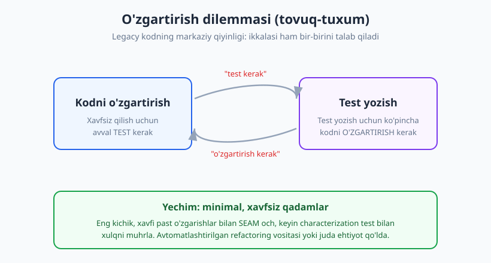
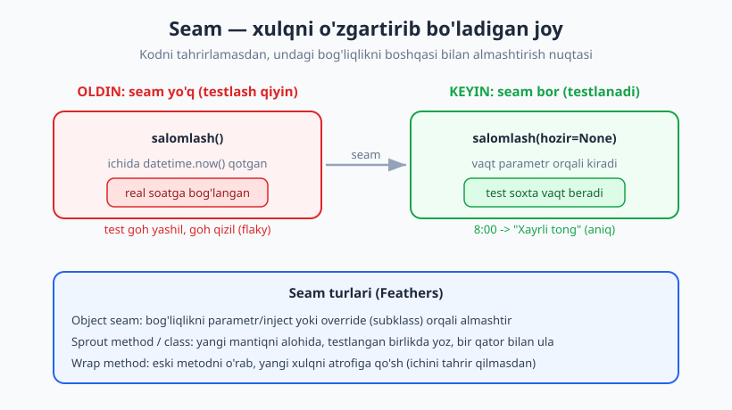
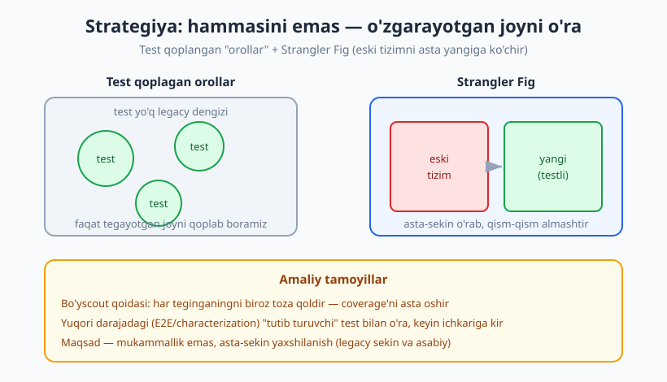

# 29 — Eski (legacy) kodni testlash

[🏠 README](./README.md) · [⬅️ Oldingi: 28 — Test strategiyasi va testing quadrants](./28-test-strategiyasi-quadrants.md) · [Keyingi: 30 — Kapston ➡️](./30-kapston.md)

---

> **Bu bobda:** kitobning eng real vaziyatiga kiramiz — sizga **testsiz**, chalkash, "tegishga
> qo'rqinchli" kod meros qoldi va uni o'zgartirish kerak. Michael Feathers ta'rifi bilan **legacy
> kod = testsiz kod** ekanini ko'ramiz; **o'zgartirish dilemmasini** (test↔o'zgartirish tovuq-tuxum)
> tushunamiz; **characterization test** (13-bob) bilan mavjud xulqni muhrlaymiz; **seam** (09–10-bob)
> kiritib qattiq bog'liqlikni sindiramiz; **sprout / wrap** texnikalari, **Strangler Fig** naqsh va
> "test qoplagan orol" strategiyasini o'rganamiz.
>
> **Halollik / Eslatma:** legacy bilan ishlash **sekin va asabiy** — bu bob sizni mukammallikka
> emas, **asta-sekin, xavfsiz yaxshilanishga** o'rgatadi. Bu bob 13-bob (characterization,
> refactoring) va 09–10-bob (seam, dependency injection) ustiga quriladi — ularni o'qigan bo'lsangiz
> yaxshi. Barcha Python namunalari `python -m pytest` (Python 3.14, pytest 9.0.3) bilan haqiqatan
> ishga tushirib tekshirilgan.

---

## Legacy kod nima (va nega qo'rqinchli)

Tasavvur qiling, eski uyni meros oldingiz. U mustahkam — yillab turgan — lekin sxemasi yo'q:
qaysi sim qayoqqa boradi, qaysi devor yuk ko'taradi, hech kim bilmaydi. Bir mixni qoqsangiz,
qayerdadir suv quvuri yorilishi mumkin. Uyni **yaxshilamoqchisiz**, lekin har teginish — qimor.

Eski (legacy) kod aynan shunday. Ko'pchilik "legacy" deganda **eski yoki xunuk** kodni tushunadi.
Michael Feathers ("Working Effectively with Legacy Code") esa keskin va foydali ta'rif beradi:

> **Legacy kod = testsiz kod.** Yoshidan qat'i nazar. Kecha yozilgan, lekin testi yo'q kod ham —
> legacy. Aksincha, 20 yillik, lekin yaxshi testlangan kod — legacy emas.

Nega bu ta'rif foydali? Chunki u **muammoning ildizini** ko'rsatadi. Testsiz kod qo'rqinchli, sababi:

- **O'zgartirsangiz, nima sinishini bilmaysiz.** Bir joyni tuzatasiz, boshqa, ko'rinmas joy buziladi
  (regressiya, 01-bob). Hech kim sizga "darhol qizil" signal bermaydi.
- **Tushunish qiyin.** Kod nima qilishini faqat **o'qib** bilasiz; bironta test "men shuni
  kafolatlayman" demaydi.
- **Tuzatishdan qo'rqasiz.** Natijada hech kim tegmaydi, kod yanada chiriydi — **qo'rquv aylanasi**.

Bu kitobning aksar boblari "**toza varaqdan**" boshlash haqida edi (TDD, yaxshi dizayn). Bu bob esa
hayotning eng ko'p uchraydigan holatini hal qiladi: **allaqachon mavjud, testsiz koddan boshlash**.

---

## O'zgartirish dilemmasi

Mana legacy kodning yuragidagi qiyinlik. Feathers buni **"o'zgartirish dilemmasi"** deb ataydi:

- Kodni **xavfsiz** o'zgartirish uchun — sizga **test** kerak (xulq saqlanganini tasdiqlash uchun).
- Lekin testsiz, qattiq bog'langan kodga test yozish uchun — ko'pincha avval kodni **o'zgartirish**
  kerak (uni testlanadigan qilish uchun, masalan bog'liqlikni ajratish).

Ya'ni: o'zgartirish uchun test kerak, test uchun o'zgartirish kerak. Klassik **tovuq-tuxum**.



Yechim — bu halqani **kuch bilan** uzish emas (hammasini birato'la qayta yozish — eng xavfli yo'l),
balki uni **minimal, xavfsiz qadamlar** bilan ehtiyotkorona kesib o'tish:

1. Avval **eng kichik, xavfi past o'zgarish** bilan kodga **seam** oching (xulqni o'zgartirmasdan).
2. So'ng o'sha seam orqali **characterization test** yozing (mavjud xulqni muhrlang).
3. Endi to'r bor — **dadil refactor** qiling.

> **Diqqat — eng xavfli vasvasa: "hammasini qaytadan yozaman".** Katta legacy tizimni noldan
> qayta yozish deyarli har doim muvaffaqiyatsizlikka uchraydi: eski kodda yillar davomida to'plangan
> minglab "g'alati, lekin zarur" holatlar (edge case) bor — siz ularni bilmaysiz, chunki ular
> hech qayerda hujjatlashtirilmagan, faqat **kodning o'zida** yashaydi. Asta-sekin o'rab almashtirish
> (Strangler Fig, quyida) deyarli har doim xavfsizroq.

---

## Characterization test — mavjud xulqni "muhrlash"

13-bobda biz characterization (xulq-muhrlovchi) testni qisqacha ko'rgan edik. Legacy kodda u —
**eng birinchi qurol**. Eslatib o'tamiz: characterization test kodning **to'g'ri yoki noto'g'ri**
ekanini emas, balki **HOZIR aynan qanday ishlayotganini** yozib qo'yadi. Maqsad — "shu xulqni saqlab
qol" deb muhrlash, keyin xavfsiz o'zgartirish.

Mana real "chirigan" funksiya — yetkazib berish narxini hisoblaydi. Tushunarsiz nomli `n`, ichma-ich
shartlar, sehrli sonlar bilan to'la, lekin **ishlaydi** va ishlab chiqarishda turibdi:

```python
# legacy_narx.py  (testsiz kelgan, chalkash, lekin ISHLAYDI)
def yetkazib_narx(vazn, masofa, shoshilinch):
    n = 0
    if vazn <= 1:
        n = 15000
    elif vazn <= 5:
        n = 15000 + (vazn - 1) * 5000
    else:
        n = 35000 + (vazn - 5) * 3000
    if masofa > 100:
        n = n + (masofa - 100) * 200
    if shoshilinch == 1:
        n = n * 1.5
    if vazn > 30:
        n = n + 50000
    return round(n, 2)
```

Bu funksiya nima qiladi? Aniq bilmaysiz — o'qib chiqsangiz ham, hamma yo'lni boshda tasavvur qilish
qiyin. Shuning uchun **taxmin qilmaymiz** — kodga turli kirish berib, **haqiqiy chiqishni kuzatamiz**:

```python
# kuzat.py  -- kodning HOZIRGI chiqishini yozib olamiz (to'g'rimi demaymiz)
from legacy_narx import yetkazib_narx

holatlar = [
    (0.5, 10, 0), (3, 50, 0), (10, 200, 0),
    (3, 50, 1), (40, 300, 1), (5, 100, 0),
]
for vazn, masofa, shoshilinch in holatlar:
    print(vazn, masofa, shoshilinch, "->", yetkazib_narx(vazn, masofa, shoshilinch))
```

Ishga tushiramiz va aniq chiqishni olamiz:

```text
$ python kuzat.py
0.5 10 0 -> 15000
3 50 0 -> 25000
10 200 0 -> 70000
3 50 1 -> 37500.0
40 300 1 -> 320000.0
5 100 0 -> 35000
```

Bu sonlar "to'g'ri"mi? Bu bosqichda **ahamiyatsiz**. Bizga muhimi — kod **shu** sonlarni qaytaradi.
Endi shu kuzatilgan xulqni `parametrize` (06-bob) bilan testga **muhrlaymiz**:

```python
# test_legacy_narx.py
import pytest
from legacy_narx import yetkazib_narx

@pytest.mark.parametrize("vazn, masofa, shoshilinch, kutilgan", [
    (0.5, 10, 0, 15000),
    (3, 50, 0, 25000),
    (10, 200, 0, 70000),
    (3, 50, 1, 37500.0),
    (40, 300, 1, 320000.0),    # og'ir + uzoq + shoshilinch
    (5, 100, 0, 35000),
])
def test_xozirgi_xulq(vazn, masofa, shoshilinch, kutilgan):
    assert yetkazib_narx(vazn, masofa, shoshilinch) == kutilgan
```

```text
$ python -m pytest test_legacy_narx.py -q
......                                                       [100%]
6 passed in 1.16s
```

To'r tayyor — 6 ta yashil test. Endi funksiyani **xavfsiz tozalashimiz** mumkin: sehrli sonlarni
nomlash, blokarni alohida sof funksiyalarga ajratish (extract function, 13-bob):

```python
# legacy_narx.py  (refactor -- xulq AYNAN o'sha)
SHOSHILINCH_KOEFFITSIENT = 1.5
UZOQ_MASOFA_CHEGARA = 100
OGIR_VAZN_CHEGARA = 30


def asosiy_narx(vazn):
    if vazn <= 1:
        return 15000
    if vazn <= 5:
        return 15000 + (vazn - 1) * 5000
    return 35000 + (vazn - 5) * 3000


def masofa_qoshimcha(masofa):
    if masofa > UZOQ_MASOFA_CHEGARA:
        return (masofa - UZOQ_MASOFA_CHEGARA) * 200
    return 0


def yetkazib_narx(vazn, masofa, shoshilinch):
    narx = asosiy_narx(vazn) + masofa_qoshimcha(masofa)
    if shoshilinch == 1:
        narx *= SHOSHILINCH_KOEFFITSIENT
    if vazn > OGIR_VAZN_CHEGARA:
        narx += 50000
    return round(narx, 2)
```

`test_legacy_narx.py` ni **bitta harf ham o'zgartirmasdan** qayta ishlatamiz:

```text
$ python -m pytest test_legacy_narx.py -q
......                                                       [100%]
6 passed in 1.30s
```

Xuddi shu 6 ta test, xuddi shu yashil. Funksiya endi o'qiladigan — lekin **xulqi o'zgarmadi**. Agar
biror qadamda test qizarsa, biz darhol bilamiz.

> **Diqqat:** shoshilinch koeffitsienti **og'ir-vazn qo'shimchasidan oldin** qo'llanadi
> (`40, 300, 1 -> 320000`, `50000`ni emas `*1.5`ni avval). Bu, ehtimol, mantiqan g'alati — ammo
> characterization test "to'g'rimi" demaydi, **shunday ishlaydi** deb muhrlaydi. Bu tartibni tuzatish
> — **alohida, keyingi qadam** (avval yangi xulqni hujjatlovchi test yozasiz). Bobning oltin qoidasi:
> **refactoring va xulq o'zgarishini hech qachon aralashtirmang** (13-bob).

### Characterization test qanchasi yetarli?

Hamma yo'lni qoplash ideal, lekin legacy'da bu ko'pincha imkonsiz. Amaliy maslahat: **siz
o'zgartirmoqchi bo'lgan xulqni** va uning atrofidagi **chegara holatlarini** (boundary, 05-bob)
qoplang. Coverage vositasi (20-bob) qaysi tarmoq ochiq qolganini ko'rsatishi mumkin. Maqsad —
mukammal qoplash emas, **o'zgartirayotgan joyni xavfsiz qilish**.

---

## Seam — qattiq bog'liqlikni sindirish

Characterization test yozish uchun kodga **kira olishingiz** kerak. Lekin ko'pincha legacy kod
**qattiq bog'langan**: ichida `datetime.now()`, tasodifiy son, fayl o'qish yoki tarmoq chaqiruvi
qotgan bo'ladi. Bunday kodni testlash deyarli imkonsiz — natija har safar boshqacha.

Feathers bunday holatda **seam** tushunchasini taklif qiladi:

> **Seam** — dasturda **kodning o'zini tahrir qilmasdan** xulqini o'zgartirib bo'ladigan **joy**.
> Eng keng tarqalgani — **object seam**: bog'liqlikni tashqaridan (parametr, inject, override) berish.

Mana qattiq bog'langan funksiya — vaqtga qarab salomlashadi, lekin `datetime.now()` ichida qotgan:

```python
# seam_oldin.py  (qattiq bog'langan -- testlash QIYIN)
from datetime import datetime

def salomlash():
    soat = datetime.now().hour
    if soat < 12:
        return "Xayrli tong"
    if soat < 18:
        return "Xayrli kun"
    return "Xayrli kech"
```

Buni "Xayrli tong"ni qaytarishini test qilmoqchi bo'lsak, **muammoga** uchraymiz — test faqat
kompyuter soati ertalab bo'lsagina o'tadi. Soat kechqurun 21:00 da ishga tushirsak:

```text
$ python -m pytest test_oldin_qiyin.py -q   # (hozir soat 21:00)
E         - Xayrli tong
E         + Xayrli kech
FAILED test_oldin_qiyin.py::test_tong_lekin_mort - AssertionError
1 failed in 1.26s
```

Test **goh yashil, goh qizil** — bu klassik flaky test (24-bob), sababi vaqtga qattiq bog'liqlik
(09-bob). Yechim — **seam kiritish**: vaqtni tashqaridan berib bo'ladigan **qil**. Eng minimal, xavfi
past yo'l — ixtiyoriy parametr (default'i eski xulqni saqlaydi):

```python
# seam_keyin.py  (seam kiritildi -- endi testlanadi)
from datetime import datetime

def salomlash(hozir=None):           # <-- SEAM: vaqtni tashqaridan berish mumkin
    soat = (hozir or datetime.now()).hour
    if soat < 12:
        return "Xayrli tong"
    if soat < 18:
        return "Xayrli kun"
    return "Xayrli kech"
```

E'tibor bering: **eski chaqiruvchilar o'zgarmaydi** — `salomlash()` (argumentsiz) hamon ishlaydi va
real soatni oladi. Lekin endi testda soxta vaqt bera olamiz — bu **xavfsiz, qaytadan-mos** o'zgarish:

```python
# test_seam.py
from datetime import datetime
from seam_keyin import salomlash

def test_tong():
    assert salomlash(datetime(2026, 6, 16, 8, 0)) == "Xayrli tong"

def test_kun():
    assert salomlash(datetime(2026, 6, 16, 14, 0)) == "Xayrli kun"

def test_kech():
    assert salomlash(datetime(2026, 6, 16, 21, 0)) == "Xayrli kech"

def test_chegara_tush():
    assert salomlash(datetime(2026, 6, 16, 12, 0)) == "Xayrli kun"   # 12:00 -> kun
```

```text
$ python -m pytest test_seam.py -q
....                                                         [100%]
4 passed in 1.11s
```

Endi test **deterministik** — soatdan qat'i nazar har doim bir xil natija beradi.



> **Trade-off:** parametr-seam tez va minimal, lekin har bog'liqlikni parametr qilish funksiya
> imzosini shishiradi. Ko'p bog'liqlik bo'lsa — ularni bitta obyektga (klass, "soat" porti) yig'ib
> inject qilish toza (10-bob). Boshqa tillarda seam'lar boshqacha: JS'da modul-mock yoki funksiya
> almashtirish, Java'da interfeys + DI, PHP'da konstruktor injection — **g'oya bir xil**: xulqni
> o'zgartirib bo'ladigan joy ochish.

### Boshqa seam turlari

- **Override seam (subklass)** — metodni `protected`/virtual qilib, testda subklass uni override
  qiladi (soxta xulq beradi). Til mock kutubxonasi yo'q joyda foydali.
- **Monkey-patch seam** — Python/JS'da `unittest.mock.patch` bilan `datetime.now`ni vaqtincha
  almashtirish (08-bob). Parametr qo'sha olmaganda oxirgi chora — lekin mo'rtroq.

---

## Sprout va Wrap — kodga tegmasdan yangi xulq qo'shish

Ba'zan siz **mavjud xulqni testlamoqchi emassiz** — sizga shunchaki legacy funksiyaga **yangi mantiq
qo'shish** kerak, lekin u funksiya juda chalkash va unga test yozish hozir juda qimmat. Feathers ikki
oddiy texnika beradi.

**Sprout method (kurtak metod)** — yangi mantiqni chalkash funksiya **ichiga** yozmang. Uni
**alohida, sof, to'liq testlangan** funksiyaga "kurtak" qilib o'stiring va eski koddan **bitta qator**
bilan chaqiring:

```python
# sprout.py  -- yangi mantiqni ALOHIDA, testlangan funksiyada yoz
def chegirmali_summa(summa, ulush):
    """Yangi, SOF funksiya -- mustaqil test qilinadi."""
    if not 0 <= ulush <= 1:
        raise ValueError("ulush 0..1 oraligida bolishi kerak")
    return round(summa * (1 - ulush), 2)


def buyurtma_yakunla(savat, ulush):
    summa = sum(savat)
    # >>> sprout: bitta qator bilan yangi, TESTLANGAN funksiyaga ulaymiz
    summa = chegirmali_summa(summa, ulush)
    # ... legacy mantiq davom etadi ...
    return summa
```

Yangi funksiyani **mustaqil**, oson test qilamiz (legacy `buyurtma_yakunla`ga tegmasdan):

```python
# test_sprout.py
import pytest
from sprout import chegirmali_summa

def test_oddiy_chegirma():
    assert chegirmali_summa(100000, 0.2) == 80000.0

def test_nol_chegirma():
    assert chegirmali_summa(50000, 0) == 50000

def test_notogri_ulush_xato():
    with pytest.raises(ValueError):
        chegirmali_summa(100000, 1.5)
```

```text
$ python -m pytest test_sprout.py -q
...                                                          [100%]
3 passed in 1.16s
```

Endi yangi mantiq **toza va test bilan qoplangan**, eski funksiya esa o'sha-o'sha (faqat bitta qator
qo'shildi). Legacy "dengizi" ichida yana bir kichik **toza orol** paydo bo'ldi.

**Wrap method (o'rovchi metod)** — eski metodni **o'rab**, yangi xulqni uning **atrofiga** qo'shasiz.
Eski metodning nomini o'zgartirib (masalan `hisobla` -> `_hisobla_asl`), yangi `hisobla` ichida
yangi qadam + eski chaqiruv qilasiz. Shunda yangi xulq alohida, eski xulq tegilmagan qoladi.

> **Eslatma:** sprout/wrap — "**mukammal**" emas, ataylab **pragmatik**. Siz legacy botqog'iga
> botmasdan, yangi kodni toza va testli yozasiz. Vaqt o'tib bu toza orollar kengayadi va eski kodni
> qisib chiqaradi.

---

## Eng og'riqli nuqta: testsiz refactoringning xavfi

Diqqat qiling: yuqorida seam kiritish va sprout — **kichik o'zgarishlar**, lekin ular ham legacy
kodga **testsiz** kiritiladi (chunki test yozish uchun avval shu o'zgarish kerak — dilemma!). Bu eng
nozik nuqta. Shuning uchun:

- **Eng kichik, eng xavfsiz refactoringlardan** boshlang: parametr qo'shish (default bilan), metod
  nomini o'zgartirish, funksiya ajratish. Bular xulqni o'zgartirish ehtimoli past.
- **Avtomatlashtirilgan refactoring vositasidan** foydalaning (IDE'ning "Extract method", "Rename"
  — bular xulqni saqlash kafolatiga yaqin), yoki juda ehtiyot, **bitta atom qadam** bilan qo'lda.
- Qadamlar shunchalik **kichik** bo'lsinki, xato qilsangiz ham **bir necha soniyada** orqaga qaytara
  olasiz.

Bu "kichik xavfsiz qadam" falsafasi — legacy bilan ishlashning yuragi. Katta sakrash = katta xavf.

---

## Strangler Fig — eski tizimni asta almashtirish

Bitta funksiyani emas, **butun eski tizimni** almashtirish kerak bo'lsa-chi? Bu yerda
**Strangler Fig** (bo'g'uvchi smoqvi) naqsh ishlaydi. Nomi tabiatdan: bo'g'uvchi smoqvi daraxti boshqa
daraxt atrofida o'sib, uni asta-sekin o'rab oladi va oxiri o'rnini egallaydi.

Dasturda: eski tizimni **bir zarbda** almashtirmaysiz. Buning o'rniga yangi (testlangan) kodni eski
tizim **atrofida** o'stirasiz va so'rovlarni **qism-qism** yangiga yo'naltirasiz. Har bir ko'chirilgan
qism testlangan; eski qism hali ishlaydi. Oxiri eski tizim **butunlay almashtiriladi**.



Bu — arxitektura darajasidagi naqsh; chuqurroq [arxitektura kitobida](../arxitektura/README.md).
Bu yerda muhimi: **har ko'chirilgan qism — yangi, testlangan kod**; risk kichik qadamlarga taqsimlanadi.

---

## Strategiya: hammasini emas, o'zgarayotgan joyni o'ra

Legacy tizimda million qator kod bo'lishi mumkin. Hammasiga birato'la test yozish — imkonsiz va
**keraksiz**. To'g'ri strategiya:

- **Test qoplagan orol.** Faqat siz **o'zgartirayotgan** yoki **tez-tez xato chiqayotgan** joyni avval
  test bilan o'rang. Atrofdagi "test yo'q dengiz"ni hozircha tinch qoldiring.
- **Coverage'ni asta oshiring.** Har safar bir joyga tekkaningizda — o'sha atrofni biroz qoplab boring.
- **Bo'yscout qoidasi** (Robert Martin): "Lagerni topganingizdan **tozaroq** qoldir." Har tegingan
  faylni **biroz** toza qoldiring — bitta nom, bitta test, bitta seam. Kichik, lekin doimiy yaxshilanish.
- **Yuqoridan tutib turuvchi test.** Ichkari chalkash bo'lsa, ba'zan eng yaxshi birinchi test —
  **yuqori darajadagi** (E2E yoki tizim-darajali characterization) test: butun oqimga bitta kirish
  berib, chiqishni muhrlaysiz. U "tutib turuvchi to'r" bo'ladi, keyin xotirjam ichkariga kirasiz.

> **Halol eslatma:** legacy bilan ishlash **sekin va asabiy** — bu normal. Maqsad mukammal,
> 100% testlangan kod **emas** (24-bob). Maqsad — **har o'zgarishni biroz xavfsizroq, kodni biroz
> tozaroq** qilish. Vaqt o'tib, bu kichik g'alabalar yig'ilib, qo'rqinchli tizimni boshqarib bo'ladigan
> tizimga aylantiradi.

---

## Asosiy g'oyalar (bobni qisqacha)

- **Legacy kod = testsiz kod** (Feathers), yoshidan qat'i nazar. Qo'rqinchli, sababi: o'zgartirsang
  nima sinishini bilmaysan va ishonchli signal yo'q.
- **O'zgartirish dilemmasi:** o'zgartirish uchun test kerak, test uchun o'zgartirish kerak
  (tovuq-tuxum). Yechim — **minimal, xavfsiz qadamlar**, "hammasini qayta yozish" emas.
- **Characterization test** — mavjud xulqni "to'g'rimi" demay, **shunday ishlaydi** deb muhrlaydi.
  Avval haqiqiy chiqishni **kuzat**, keyin **muhrla**, so'ng xavfsiz **refactor** qil.
- **Seam** — kodni tahrirlamasdan xulqni o'zgartirib bo'ladigan joy. Object seam = bog'liqlikni
  parametr/inject/override orqali berish. Qattiq `datetime.now`/I/O ni seam bilan testlanadigan qil.
- **Sprout / Wrap** — chalkash kodga tegmasdan, yangi mantiqni **alohida, testlangan** birlikka yoz va
  bir qator bilan ula (sprout), yoki eski metodni o'rab yangi xulq qo'sh (wrap).
- **Testsiz refactoring xavfli** — eng kichik, xavfsiz qadamlardan boshla; avtomatik refactoring
  vositasi yoki juda ehtiyot qo'lda; orqaga qaytarish arzon bo'lsin.
- **Strangler Fig** — katta legacy tizimni bir zarbda emas, asta-sekin yangi (testlangan) bilan
  o'rab, qism-qism almashtir.
- **Strategiya:** hamma joyni emas — **o'zgarayotgan/xato joyni** test bilan o'ra ("orol"),
  coverage'ni asta oshir, **bo'yscout qoidasi**, yuqoridan "tutib turuvchi" test. Maqsad —
  mukammallik emas, **asta-sekin yaxshilanish**.

---

## Mashqlar

### Oson

**1-mashq.** Michael Feathers ta'rifiga ko'ra "legacy kod" nima? Quyidagilardan qaysi biri legacy:
(a) 15 yillik, lekin to'liq testlangan modul; (b) kecha yozilgan, lekin bironta testi yo'q funksiya;
(c) testlari bor, lekin xunuk nomlangan kod?

**2-mashq.** "O'zgartirish dilemmasi"ni o'z so'zingiz bilan tushuntiring. Nega u "tovuq-tuxum"
muammosi?

**3-mashq.** Characterization test va oddiy (TDD'dagi) test o'rtasidagi farq nima? Characterization
test kodning **to'g'riligini** tekshiradimi?

### O'rta

**4-mashq.** Quyidagi legacy funksiya berilgan. Avval uning **hozirgi xulqini kuzating** (kamida 4
kirish), so'ng characterization test (`parametrize`) yozing, keyin uni **xavfsiz refactor** qiling
(sehrli sonlarni nomlang, ichma-ich `if`ni soddalashtiring). Test o'zgarmasin.

```python
def soliq(daromad):
    s = 0
    if daromad <= 1000000:
        s = daromad * 0.07
    else:
        s = 1000000 * 0.07 + (daromad - 1000000) * 0.12
    return round(s, 2)
```

**5-mashq.** Quyidagi funksiya qattiq bog'langan (ichida `random.random()`). Unga **seam** kiriting
(minimal, default-parametr usuli) va uchta deterministik test yozing (g'olib, mag'lub, chegara).

```python
import random
def omad_oyini(stavka):
    if random.random() < 0.5:
        return stavka * 2
    return 0
```

**6-mashq.** Sizda chalkash, testsiz `hisobotni_chiqar(buyurtma)` funksiyasi bor (unga tegmoqchi
emassiz). Yangi talab: hisobotga **QQS (15%)** qo'shish kerak. **Sprout method** bilan buni qanday
qilasiz? Yangi sof funksiya va uning testini yozing (legacy funksiyaga faqat bir qator qo'shilishini
tasvirlang).

### Qiyin

**7-mashq.** Quyidagi funksiya **ikkita** qattiq bog'liqlikka ega: joriy vaqt (`datetime.now`) va
fayl yozish (`open`). Uni testlanadigan qilish uchun **ikkala** seam'ni kiriting (parametr/inject),
so'ng faylga yozmasdan (soxta yozuvchi bilan) xulqni tekshiradigan test yozing. Til-mustaqil g'oyani
ham ayting: bu JS yoki Java'da qanday qilinardi?

```python
from datetime import datetime
def log_yoz(xabar):
    qator = datetime.now().isoformat() + " " + xabar + "\n"
    with open("app.log", "a") as f:
        f.write(qator)
```

**8-mashq.** Sizga 200 000 qatorli, testsiz legacy monolit topshirildi. Menejer "to'liq qayta
yozaylik" deydi. Siz **Strangler Fig** va "test qoplagan orol" strategiyasini taklif qilmoqchisiz.
(a) "to'liq qayta yozish" nega xavfli ekanini tushuntiring; (b) birinchi bir oyda qaysi qismni test
bilan qoplashni tanlaysiz va nega; (c) "bo'yscout qoidasi" bu strategiyaga qanday yordam beradi?

<details markdown="1">
<summary>Yechimlar</summary>

### 1-mashq yechimi

Feathers: **legacy kod = testsiz kod** (yoshidan qat'i nazar).

- (a) 15 yillik, lekin **to'liq testlangan** → legacy **emas** (testlar uni himoya qiladi).
- (b) kecha yozilgan, lekin **testsiz** → **legacy** (test bo'lmagani uchun, yoshi muhim emas).
- (c) testlari bor, faqat xunuk nomlangan → legacy **emas** (test bor; nom — alohida sifat masalasi,
  uni refactor bilan tuzatish mumkin, chunki to'r bor).

### 2-mashq yechimi

O'zgartirish dilemmasi: legacy kodni **xavfsiz** o'zgartirish uchun **test** kerak (xulq saqlanganini
tasdiqlash uchun), lekin testsiz, qattiq bog'langan kodga test yozish uchun ko'pincha avval kodni
**o'zgartirish** kerak (uni testlanadigan qilish — masalan seam kiritish). Ya'ni A uchun B kerak,
B uchun A kerak — bu "tovuq-tuxum". Yechim — halqani kuch bilan emas, **minimal, xavfsiz qadamlar**
bilan (avval kichik seam, keyin characterization test, keyin dadil refactor) uzish.

### 3-mashq yechimi

**Oddiy/TDD test** — kod **qanday ishlashi kerakligini** (talab, spetsifikatsiya) tekshiradi; agar
kod noto'g'ri natija bersa, test **qizil** bo'lishi kerak. **Characterization test** — kodning
**HOZIR aynan qanday ishlayotganini** muhrlaydi; u "to'g'rimi" demaydi — hatto g'alati yoki xato
xulqni ham "shunday ishlaydi" deb yozib qo'yadi. Maqsad — refactor paytida xulq tasodifan
o'zgarmasligini tutib turish. Demak yo'q, characterization test **to'g'rilikni tekshirmaydi** —
u **o'zgarmaslikni** tekshiradi.

### 4-mashq yechimi

Kuzatamiz (`daromad`): `500000 -> 35000.0`; `1000000 -> 70000.0`; `2000000 -> 70000 + 120000 = 190000.0`;
`0 -> 0.0`.

```python
import pytest
from soliq import soliq

@pytest.mark.parametrize("daromad, kutilgan", [
    (0, 0.0),
    (500000, 35000.0),       # 7%
    (1000000, 70000.0),      # chegara: hamonki 7%
    (2000000, 190000.0),     # 1M dan keyingisi 12%
])
def test_soliq_xozirgi(daromad, kutilgan):
    assert soliq(daromad) == kutilgan
```

Refactor (xulq saqlanadi):

```python
PAST_STAVKA = 0.07
YUQORI_STAVKA = 0.12
CHEGARA = 1000000

def soliq(daromad):
    if daromad <= CHEGARA:
        natija = daromad * PAST_STAVKA
    else:
        natija = CHEGARA * PAST_STAVKA + (daromad - CHEGARA) * YUQORI_STAVKA
    return round(natija, 2)
```

Test o'zgarmaydi — yana 4 passed.

### 5-mashq yechimi

Seam — tasodifni tashqaridan beriladigan qilamiz (default eski xulqni saqlaydi):

```python
import random

def omad_oyini(stavka, tasodif=None):       # SEAM
    qiymat = random.random() if tasodif is None else tasodif
    if qiymat < 0.5:
        return stavka * 2
    return 0
```

Deterministik testlar:

```python
from omad import omad_oyini

def test_golib():
    assert omad_oyini(100, tasodif=0.1) == 200    # < 0.5 -> g'olib

def test_maglub():
    assert omad_oyini(100, tasodif=0.9) == 0      # >= 0.5 -> mag'lub

def test_chegara():
    assert omad_oyini(100, tasodif=0.5) == 0      # aynan 0.5 -> mag'lub (< emas)
# -> 3 passed
```

Endi test tasodifga bog'liq emas — har safar bir xil.

### 6-mashq yechimi

Sprout: QQS mantiqini chalkash funksiya ichiga emas, **alohida, sof, testlangan** funksiyaga yozamiz:

```python
# yangi, SOF funksiya
def qqs_qoshilgan(summa, stavka=0.15):
    return round(summa * (1 + stavka), 2)
```

Test (mustaqil, oson):

```python
from hisobot import qqs_qoshilgan

def test_qqs_15():
    assert qqs_qoshilgan(100000) == 115000.0

def test_qqs_nol():
    assert qqs_qoshilgan(100000, 0) == 100000
# -> 2 passed
```

Legacy `hisobotni_chiqar` ichida faqat **bir qator** o'zgaradi:
`summa = qqs_qoshilgan(summa)`. Chalkash funksiyaning qolgan qismiga tegilmaydi va yangi mantiq
to'liq test bilan qoplangan.

### 7-mashq yechimi

Ikkala bog'liqlikni inject qilamiz: vaqtni parametr, faylga yozishni "yozuvchi" funksiya orqali:

```python
from datetime import datetime

def log_yoz(xabar, hozir=None, yozuvchi=None):       # IKKI SEAM
    vaqt = hozir or datetime.now()
    qator = vaqt.isoformat() + " " + xabar + "\n"
    if yozuvchi is None:
        with open("app.log", "a") as f:
            f.write(qator)
    else:
        yozuvchi(qator)
```

Test — faylga yozmasdan, soxta yozuvchi (spy, 07-bob) bilan:

```python
from datetime import datetime
from log_modul import log_yoz

def test_log_formati():
    yozilganlar = []
    log_yoz("salom", hozir=datetime(2026, 6, 16, 9, 0, 0),
            yozuvchi=yozilganlar.append)          # soxta yozuvchi
    assert yozilganlar == ["2026-06-16T09:00:00 salom\n"]
# -> 1 passed
```

Real fayl ham, real soat ham ishlatilmadi — test tez va deterministik. **Til-mustaqil:** JS'da
`now` va `writer` funksiyalarini parametr/konstruktor orqali berasiz (yoki `jest.fn()` bilan
mock); Java'da `Clock` va `Writer` interfeyslarini DI orqali kiritasiz. G'oya bir xil — qattiq
bog'liqlikni **seam** orqali tashqaridan beriladigan qilish.

### 8-mashq yechimi

**(a) "To'liq qayta yozish" nega xavfli:** 200 000 qator testsiz kodda yillar davomida to'plangan
minglab "g'alati, lekin zarur" edge case'lar bor — ular hech qayerda hujjatlashtirilmagan, faqat
kodning o'zida yashaydi. Noldan yozsangiz, ularni **bilmaysiz** va biror joyda regressiya yaratasiz.
Bundan tashqari, qayta yozish davomida eski tizim ham ishlab turishi kerak (ikki barobar ish), va u
ko'pincha rejadan ancha cho'ziladi. Tarixiy tajriba: katta "big bang" qayta yozishlar deyarli har
doim muvaffaqiyatsiz.

**(b) Birinchi oy:** eng **tez-tez o'zgaradigan** va **eng ko'p xato chiqadigan** qismni tanlayman
(masalan to'lov yoki narx hisoblash moduli). Avval uni **characterization test** bilan o'rayman (uning
hozirgi xulqini muhrlash — hatto g'alati holatlarni ham), keyin **seam** kiritib testlanadigan qilaman.
Bu — "test qoplagan orol": atrofdagi tinch koddan farqli, bu qism ko'p o'zgargani uchun u yerda test
**eng ko'p qiymat** beradi (28-bob, risk-asosli testlash).

**(c) Bo'yscout qoidasi** strategiyani **doimiy** qiladi: men har safar **biron sababga** ko'ra
(xato tuzatish, xususiyat qo'shish) legacy faylga tekkanimda, o'sha joyni **biroz** toza qoldiraman —
bitta test qo'shaman, bitta seam ochaman, bitta nomni tuzataman. Maxsus "refactoring loyihasi"
kutmayman. Vaqt o'tib, eng faol o'zgaradigan joylar (eng muhim joylar) tabiiy ravishda eng yaxshi
test bilan qoplanadi — orollar kengayadi va Strangler Fig'ga ulanadi.

</details>

---

[🏠 README](./README.md) · [⬅️ Oldingi: 28 — Test strategiyasi va testing quadrants](./28-test-strategiyasi-quadrants.md) · [Keyingi: 30 — Kapston ➡️](./30-kapston.md)
