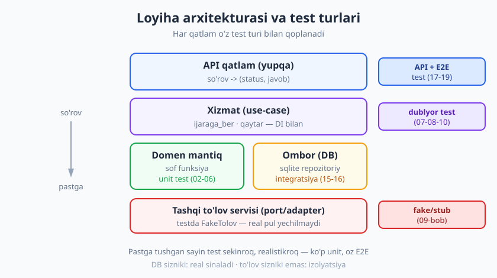
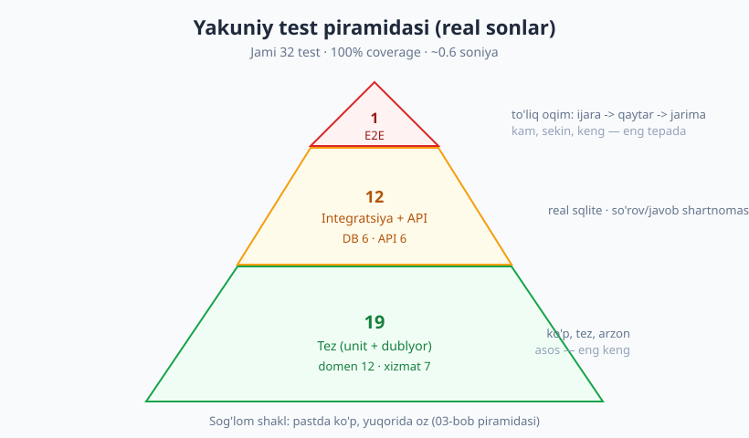
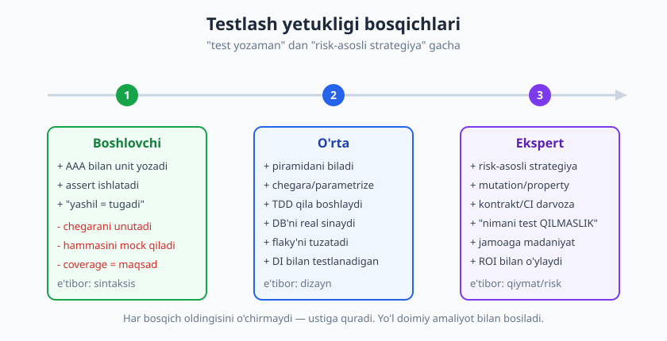

# 30 — Kapston: loyihani noldan test bilan qoplash

[🏠 README](./README.md) · [⬅️ Oldingi: 29 — Eski (legacy) kodni testlash](./29-legacy-kodni-testlash.md)

---

> **Bu bobda:** butun kitobni **bitta amaliy loyihada** birlashtiramiz. Kichik, lekin realistik
> xizmatni — **kutubxona / kitob ijarasi** tizimini — noldan, **strategiyadan** boshlab, unit →
> dublyor → integratsiya → API → E2E testlargacha, **sifat darvozalari** (coverage, mutation g'oyasi)
> bilan to'liq qoplaymiz. Har bosqichda tegishli bobga ishora qilamiz. Yakunda haqiqiy test
> to'plamini ishga tushiramiz va **real `passed` + coverage** hisobotini ko'ramiz.
>
> **Halollik / Eslatma:** bu — *namuna* loyiha, qisqalik uchun soddalashtirilgan (bitta jadval-juftlik,
> in-memory `sqlite`, dict-asosli API). Maqsad — to'liq korxona kodi emas, balki **fikrlash oqimini**
> boshdan oxirigacha ko'rsatish. Barcha kod va sonlar `python -m pytest` (Python 3.14, pytest 9.0.3,
> coverage 7.14.1) bilan **haqiqatan ishga tushirib** olingan — `# ->`, `passed` va coverage foizi
> to'qib chiqarilmagan.

---

## Loyiha: kutubxona / kitob ijarasi

Tasavvur qiling, mahalla kutubxonasi uchun kichik xizmat yozyapsiz. Talablar oddiy:

- Foydalanuvchi kitobni **ijaraga oladi** (standart muddat — 14 kun).
- Bir foydalanuvchi bir vaqtda **eng ko'pi 3 ta** kitob ushlay oladi.
- Kitobning **nusxasi tugagan** bo'lsa, ijaraga berilmaydi.
- Kechikib qaytarsa, har kun uchun **1000 so'm jarima** — uni **tashqi to'lov servisi** orqali yechamiz.
- Hammasi **HTTP API** orqali ishlatiladi.

Bu kichik talablar to'plamida butun kitob mavzulari mujassam: **sof domen mantig'i** (jarima, limit),
**ma'lumotlar bazasi** (kitob/ijara saqlash), **tashqi servis** (to'lov — sizniki emas), **HTTP qatlam**.
Aynan shu sabab bu loyihani tanladik.

Tizimni to'rt qatlamga ajratamiz (10-bobdagi testlanadigan dizayn — portlar/adapterlar):



| Qatlam | Fayl | Mas'uliyat | Test turi (bob) |
|---|---|---|---|
| **Domen** | `domen.py` | sof qoidalar: jarima, limit | unit (02–06) |
| **Ombor** | `ombor.py` | sqlite repozitoriy | integratsiya (15–16) |
| **To'lov porti** | `tolov.py` | tashqi servis interfeysi | fake/stub (07–10) |
| **Xizmat** | `xizmat.py` | use-case'larni birlashtiradi | dublyor bilan (08) |
| **API** | `api.py` | so'rov → (status, javob) | API + E2E (17–19) |

> **Eslatma — "DB sizniki, to'lov sizniki emas".** Bu kapstonning markaziy g'oyasi (16-bob).
> Ma'lumotlar bazasini biz **real** sinaymiz (xatolar faqat real DB'da ko'rinadi). To'lov servisi
> esa bizniki emas — uni **izolyatsiya** qilamiz (real pul yechilmasin). Shu farqni butun bob davomida
> ko'rasiz.

---

## 1-bosqich: strategiya (28-bob)

Birinchi `assert`dan oldin **reja** tuzamiz. 28-bobdagi risk-asosli yondashuv savol beradi:
*nimani, qaysi darajada, nega shu darajada testlaymiz?* Har narsani bir xil qattiq testlash —
isrof; hech narsani testlamaslik — xavf. Risk = **ehtimol × ta'sir** bo'yicha ustuvorlik qo'yamiz:

| Komponent | Xato ehtimoli | Ta'sir | Reja |
|---|---|---|---|
| Jarima hisoblash | O'rta (chegara xatosi) | Yuqori (pul!) | **Ko'p unit** + chegara |
| Ijara limiti | O'rta | O'rta | Unit (parametrize) |
| DB so'rovlari | Yuqori (SQL/cheklov) | Yuqori | **Integratsiya** (real sqlite) |
| To'lov integratsiyasi | Past (port soddalashtiradi) | Yuqori | Dublyor (fake) + bitta E2E |
| API marshrutlash | Past | O'rta | Bir nechta API testi |
| To'liq oqim | — | Yuqori | **1 E2E** smoke |

Bu jadval bevosita **test piramidasiga** aylanadi (03-bob): pastda ko'p **tez** unit, o'rtada
bir nechta **integratsiya/API**, tepada **bitta E2E**. Pul bilan bog'liq mantiq (jarima) eng zich
qoplanadi — bu risk-asosli tanlov.

> **Trade-off:** strategiya — bu "nima yozaman" emas, "nima yozMAYman" haqida ham. To'lov servisining
> *ichini* (real HTTP, retry) bu loyihada testlamaymiz — u bizniki emas, port orqali izolyatsiya
> qilamiz. Buni testlash = boshqa jamoaning kodini testlash; ROI past (28-bob).

---

## 2-bosqich: domen mantig'ini unit test bilan (02/04/05/06-bob)

Eng pastdan — **sof funksiyalardan** boshlaymiz. Sof funksiya (DB, vaqt, tarmoqsiz) — testlash uchun
jannat: kirish bersangiz, chiqishini tekshirasiz, xolos (10-bob).

```python
# kutubxona/domen.py
KUNLIK_JARIMA = 1000      # kechikkan har kun uchun (so'm)
MAKS_KITOB = 3            # bir foydalanuvchi bir vaqtda nechta kitob olishi mumkin

def jarima_hisobla(muddat_kuni, qaytarilgan_kuni):
    kechikish = qaytarilgan_kuni - muddat_kuni
    if kechikish <= 0:
        return 0                       # vaqtida yoki erta -> jarima yo'q
    return kechikish * KUNLIK_JARIMA

def ijara_mumkinmi(hozirgi_soni, kitob_bormi):
    if not kitob_bormi:
        return False
    return hozirgi_soni < MAKS_KITOB
```

Endi **parametrize** (06-bob) bilan ko'p holatni — ayniqsa **chegara qiymatlarini** (05-bob) —
bitta jadvalda sinaymiz. Chegara — eng ko'p xato uchun joy: aniq muddat kuni, aniq limit.

```python
# testlar/test_domen.py
import pytest
from kutubxona.domen import jarima_hisobla, ijara_mumkinmi, KUNLIK_JARIMA, MAKS_KITOB

@pytest.mark.parametrize("muddat, qaytarilgan, kutilgan", [
    (14, 14, 0),                  # chegara: aniq vaqtida
    (14, 10, 0),                  # erta qaytdi
    (14, 15, KUNLIK_JARIMA),      # 1 kun kechikdi
    (14, 17, 3 * KUNLIK_JARIMA),  # 3 kun kechikdi
    (0, 0, 0),                    # chegara: nol kun
    (14, 30, 16 * KUNLIK_JARIMA), # uzoq kechikish: 16 kun
    (30, 5, 0),                   # ancha erta qaytdi (manfiy kechikish)
])
def test_jarima_hisobla(muddat, qaytarilgan, kutilgan):
    assert jarima_hisobla(muddat, qaytarilgan) == kutilgan

@pytest.mark.parametrize("soni, bormi, kutilgan", [
    (0, True, True),               # bo'sh, kitob bor
    (MAKS_KITOB - 1, True, True),  # limitdan biroz past
    (MAKS_KITOB, True, False),     # chegara: limitga yetdi
    (MAKS_KITOB + 1, True, False), # limitdan oshib ketgan
    (1, False, False),             # kitob yo'q
])
def test_ijara_mumkinmi(soni, bormi, kutilgan):
    assert ijara_mumkinmi(soni, bormi) is kutilgan
```

Ishga tushiramiz — har parametr alohida test sifatida sanaladi:

```text
$ python -m pytest testlar/test_domen.py -q
............                                                             [100%]
12 passed in 0.53s
```

12 ta sof, **millisekundlik** test. Bu — piramidaning **keng asosi**. Hech qanday DB, hech qanday
mock — shuning uchun ular AAA'ning eng toza ko'rinishi va FIRST'ning hammasiga (tez, izolyatsiyalangan,
takrorlanadigan) javob beradi (02, 04-bob).

---

## 3-bosqich: test dublyorlari — to'lov servisini izolyatsiya (07/08/10-bob)

To'lov servisini testda **chaqirib bo'lmaydi**: real pul yechiladi. 10-bobdagi **port/adapter**
naqshini qo'llaymiz — kod faqat **interfeys** orqali to'lov bilan gaplashadi, testda u joyga
**fake** (07-bob) qo'yamiz.

```python
# kutubxona/tolov.py
from typing import Protocol

class TolovPorti(Protocol):
    def tola(self, foydalanuvchi: str, summa: int) -> bool: ...

class FakeTolov:                                   # test dublyori
    def __init__(self, muvaffaqiyat=True):
        self.muvaffaqiyat = muvaffaqiyat
        self.yuborilgan = []                       # spy: chaqiruvlarni qayd qiladi
    def tola(self, foydalanuvchi, summa):
        self.yuborilgan.append((foydalanuvchi, summa))
        return self.muvaffaqiyat
```

`FakeTolov` — ham **fake** (ishlaydigan, lekin soddalashtirilgan), ham **spy** (chaqiruvlarni
yozib boradi). Xizmat klassi to'lov portini **konstruktor orqali** oladi (DI, 10-bob) — aynan shu
narsa uni testlanadigan qiladi:

```python
# kutubxona/xizmat.py (qisqartirilgan)
class KutubxonaXizmati:
    def __init__(self, kitob_ombori, ijara_ombori, tolov):
        self.kitoblar, self.ijaralar, self.tolov = kitob_ombori, ijara_ombori, tolov

    def qaytar(self, ijara_id, qaytarilgan_kuni):
        ijara = self.ijaralar.topish(ijara_id)
        if ijara is None:
            raise IjaraXatosi("Ijara topilmadi")
        if ijara["qaytarilgan"]:
            raise IjaraXatosi("Allaqachon qaytarilgan")
        jarima = jarima_hisobla(ijara["muddat_kuni"], qaytarilgan_kuni)
        if jarima > 0:
            if not self.tolov.tola(ijara["foydalanuvchi"], jarima):
                raise IjaraXatosi("Jarima to'lovi amalga oshmadi")
        self.ijaralar.qaytarilgan_deb_belgila(ijara_id)
        self.kitoblar.nusxa_ozgartir(ijara["kitob_id"], +1)
        return jarima
```

Testda fake to'lov bilan ikki muhim narsani tasdiqlaymiz: (1) jarima bo'lsa to'lov **chaqirildi**;
(2) jarima yo'q bo'lsa **chaqirilmadi** (07-bobdagi **xulq-atvor** tekshiruvi):

```python
# testlar/test_xizmat.py (qisqacha)
def test_kechikkanda_jarima_tolanadi(xizmat, ulanish, tolov):
    kitob_id = KitobOmbori(ulanish).qosh("Refactoring", 1)
    ijara_id = xizmat.ijaraga_ber("ali", kitob_id, muddat_kuni=14)
    jarima = xizmat.qaytar(ijara_id, qaytarilgan_kuni=17)   # 3 kun kech
    assert jarima == 3000
    assert tolov.yuborilgan == [("ali", 3000)]              # to'lov chaqirildi

def test_vaqtida_qaytarsa_tolov_chaqirilmaydi(xizmat, ulanish, tolov):
    kitob_id = KitobOmbori(ulanish).qosh("Clean Code", 1)
    ijara_id = xizmat.ijaraga_ber("vali", kitob_id, muddat_kuni=14)
    assert xizmat.qaytar(ijara_id, qaytarilgan_kuni=14) == 0
    assert tolov.yuborilgan == []        # jarima yo'q -> to'lov yo'q
```

To'lov **yiqilsa** nima bo'lishini ham sinaymiz — `FakeTolov(muvaffaqiyat=False)` bilan istisno
kutamiz (05-bob):

```python
def test_tolov_amalga_oshmasa_xato(ulanish):
    yiqilgan = FakeTolov(muvaffaqiyat=False)
    x = KutubxonaXizmati(KitobOmbori(ulanish), IjaraOmbori(ulanish), yiqilgan)
    kid = KitobOmbori(ulanish).qosh("DDD", 1)
    ijara_id = x.ijaraga_ber("guli", kid, muddat_kuni=14)
    with pytest.raises(IjaraXatosi, match="to'lovi amalga oshmadi"):
        x.qaytar(ijara_id, qaytarilgan_kuni=20)
# -> 1 passed
```

> **Diqqat — ortiqcha mock'lamang (08-bob).** Bu yerda **faqat to'lovni** dublyor qildik. DB'ni
> dublyor qilmadik — uni keyingi bosqichda real sinaymiz. Hammasini mock qilsangiz, testlaringiz
> faqat o'z taxminlaringizni tasdiqlaydi (16-bob).

---

## 4-bosqich: integratsiya + ma'lumotlar bazasi (15/16-bob)

Endi **real sqlite**. Ombor — repozitoriy naqshi: DB mantig'i bir joyda. Eng muhim mahorat —
**izolyatsiya**: har test toza holatdan boshlasin. 16-bobdagi **tranzaksiya-rollback** strategiyasini
`conftest.py`da fixture sifatida yozamiz:

```python
# conftest.py (qisqacha)
@pytest.fixture(scope="session")
def ulanish_session():
    ulanish = sqlite3.connect(":memory:")
    ulanish.row_factory = sqlite3.Row
    migratsiya(ulanish)                  # sxema bir marta quriladi
    yield ulanish
    ulanish.close()

@pytest.fixture
def ulanish(ulanish_session):
    ulanish_session.execute("BEGIN")     # setup: tranzaksiya och
    yield ulanish_session
    ulanish_session.rollback()           # teardown: hammani bekor qil
```

Sxemada **cheklovlar** bor — aynan ularni mock qilingan DB hech qachon ushlamaydi (16-bob):

```python
# kutubxona/ombor.py — sxemadan parcha
# CREATE TABLE kitoblar (id ..., nom TEXT NOT NULL, nusxa INTEGER CHECK (nusxa >= 0));
```

Repozitoriyni real DB bilan sinaymiz, va `CHECK` cheklovi haqiqatan ishlashini ko'rsatamiz:

```python
# testlar/test_ombor.py (qisqacha)
def test_kitob_qosh_va_topish(ulanish):
    ombor = KitobOmbori(ulanish)
    kid = ombor.qosh("Test Driven Development", 3)
    assert ombor.topish(kid) == {"id": kid, "nom": "Test Driven Development", "nusxa": 3}

def test_manfiy_nusxa_check_buziladi(ulanish):
    ombor = KitobOmbori(ulanish)
    kid = ombor.qosh("Working Effectively", 0)
    with pytest.raises(sqlite3.IntegrityError):
        ombor.nusxa_ozgartir(kid, -1)        # CHECK (nusxa >= 0) -> xato
```

Izolyatsiyani **ikki test bilan isbotlaymiz** (16-bob): birinchisi qator qo'shadi, ikkinchisi —
agar rollback ishlasa — bo'sh jadvaldan boshlanishi shart:

```python
def test_izolyatsiya_birinchi(ulanish):
    KitobOmbori(ulanish).qosh("Faqat shu test", 1)
    assert ulanish.execute("SELECT COUNT(*) FROM kitoblar").fetchone()[0] == 1

def test_izolyatsiya_ikkinchi(ulanish):
    assert ulanish.execute("SELECT COUNT(*) FROM kitoblar").fetchone()[0] == 0  # bo'sh!
```

```text
$ python -m pytest testlar/test_ombor.py -q
......                                                                   [100%]
6 passed in 0.05s
```

`test_izolyatsiya_ikkinchi` bo'sh jadvaldan boshlandi — demak rollback ishlaydi. Testlarni **istalgan
tartibda** ishga tushiring, natija o'zgarmaydi (FIRST — Independent). Bu — flaky'dan qochishning asosi
(24-bob).

> **Trade-off — realistiklik vs tezlik (16-bob).** In-memory sqlite tez, lekin production
> PostgreSQL'dan lahjasi farq qiladi. Ko'p loyiha **ikkalasini** ishlatadi: lokal tezlik uchun
> in-memory, CI'da ishonch uchun production-bilan-bir-xil DB (15-bob, Testcontainers).

---

## 5-bosqich: TDD bilan yangi talab qo'shamiz (11/12-bob)

Loyiha tayyor turibdi va yangi talab keldi: **"bir ijarani ikki marta qaytarib bo'lmaydi"**.
Buni 11-bobdagi **Red-Green-Refactor** sikli bilan qo'shamiz — avval **test**, keyin kod.

**🔴 Red — yiqiladigan testni yozamiz** (kod hali yo'q):

```python
def test_ikki_marta_qaytarib_bolmaydi(xizmat, ulanish):
    kid = KitobOmbori(ulanish).qosh("xUnit", 1)
    ijara_id = xizmat.ijaraga_ber("davron", kid, muddat_kuni=14)
    xizmat.qaytar(ijara_id, qaytarilgan_kuni=14)            # 1-marta: ok
    with pytest.raises(IjaraXatosi, match="Allaqachon qaytarilgan"):
        xizmat.qaytar(ijara_id, qaytarilgan_kuni=14)        # 2-marta: rad etilsin
```

Ishga tushiramiz — test **yiqiladi** (himoya hali yo'q, ikkinchi `qaytar` ham o'tib ketadi):

```text
FAILED test_ikki_marta_qaytarib_bolmaydi - Failed: DID NOT RAISE IjaraXatosi
```

**🟢 Green — eng kichik kod bilan o'tkazamiz.** `qaytar`ga ikki qator guard qo'shamiz:

```python
        if ijara["qaytarilgan"]:
            raise IjaraXatosi("Allaqachon qaytarilgan")
```

```text
$ python -m pytest testlar/test_xizmat.py -q
.......                                                                  [100%]
7 passed in 0.06s
```

**🔵 Refactor — toza qilamiz.** Bu holatda kod allaqachon ozoda (boshqa guard'lar bilan bir uslubda),
shuning uchun qo'shimcha tozalash shart emas. Eski testlar hali yashil — bu **regressiya yo'qligini**
isbotlaydi (1-bob). TDD'ning kuchi shu: yangi talab **avval spetsifikatsiya** (test) bo'lib yoziladi,
keyin kod uni qondiradi.

> **Eslatma (11-bob):** TDD — test yozish texnikasi emas, **dizayn** texnikasi. "Avval test" sizni
> "bu kodni qanday chaqiraman?" deb o'ylashga majbur qiladi — natijada interfeys tabiiyroq bo'ladi.

---

## 6-bosqich: API/kontrakt va E2E smoke (17/18/19-bob)

API qatlami — **yupqa** (humble object, 10-bob): u faqat so'rovni xizmatga uzatadi va natijani
status kodga aylantiradi. Bu yerda biz **shartnomani** (kontrakt, 18-bob) tekshiramiz: qaysi so'rov
qaysi statusni beradi.

```python
# kutubxona/api.py (qisqacha) — so'rov dict -> (status, javob dict)
def post_ijara(self, sorov):
    try:
        ijara_id = self.xizmat.ijaraga_ber(
            sorov["foydalanuvchi"], sorov["kitob_id"], sorov["muddat_kuni"])
        return 201, {"ijara_id": ijara_id}
    except KeyError as x:
        return 400, {"xato": f"maydon yetishmaydi: {x}"}
    except IjaraXatosi as x:
        return 409, {"xato": str(x)}
```

```python
# testlar/test_api.py (qisqacha) — status kod shartnomasi (17-bob)
def test_post_ijara_201(api, ulanish):
    kid = KitobOmbori(ulanish).qosh("BDD", 1)
    status, javob = api.post_ijara({"foydalanuvchi": "ali", "kitob_id": kid, "muddat_kuni": 14})
    assert status == 201 and "ijara_id" in javob

def test_post_ijara_maydon_yetishmaydi_400(api):
    status, javob = api.post_ijara({"foydalanuvchi": "ali"})   # kitob_id yo'q
    assert status == 400 and "maydon yetishmaydi" in javob["xato"]
```

> **Eslatma (17-bob, til-mustaqil):** real loyihada bu yerda haqiqiy HTTP bo'ladi — Python'da
> `requests`/`httpx` + mock server (`responses`), JS'da `supertest`, PHP'da Laravel/Symfony test
> mijozi. So'rov/javob, status kod, sxema validatsiyasi g'oyasi bir xil. Biz HTTP karkasini
> soddalashtirib, **mantiqiy shartnomaga** e'tibor qildik.

Va nihoyat **bitta E2E smoke test** (19-bob) — piramidaning uchi. U **butun tizimni** boshidan
oxirigacha bir oqimda yuradi: katalogga kitob → API orqali ijara → kechikib qaytarish → jarima
to'lovi → nusxa qaytishi:

```python
# testlar/test_e2e.py
def test_toliq_ijara_oqimi(api, ulanish, tolov):
    kid = KitobOmbori(ulanish).qosh("Kapston kitobi", 1)             # 1. seed
    status, javob = api.post_ijara(                                  # 2. ijara
        {"foydalanuvchi": "nodira", "kitob_id": kid, "muddat_kuni": 14})
    assert status == 201
    assert KitobOmbori(ulanish).topish(kid)["nusxa"] == 0            # nusxa band
    status, qaytar = api.post_qaytar(                                # 3. kech qaytarish
        {"ijara_id": javob["ijara_id"], "qaytarilgan_kuni": 19})     # 5 kun kech
    assert status == 200
    assert qaytar["jarima"] == 5000
    assert tolov.yuborilgan == [("nodira", 5000)]                    # to'lov amalga oshdi
    assert KitobOmbori(ulanish).topish(kid)["nusxa"] == 1            # nusxa qaytdi
```

E2E **kam** bo'lishi kerak: u sekin, mo'rt va "nima buzildi"ni aniq aytmaydi. Lekin bitta bunday
test — barcha qatlamlar **birga** to'g'ri ishlashiga ishonch beradi. Bu — piramidaning to'g'ri shakli.

---

## 7-bosqich: sifat darvozalari — coverage, mutation, flaky (20/22/24-bob)

To'plamni **yaxlit** ishga tushiramiz va **coverage** (20-bob) o'lchaymiz:

```text
$ python -m coverage run --source=kutubxona -m pytest -q
................................                                         [100%]
32 passed in 0.59s

$ python -m coverage report -m
Name                    Stmts   Miss  Cover   Missing
-----------------------------------------------------
kutubxona\__init__.py       0      0   100%
kutubxona\api.py           20      0   100%
kutubxona\domen.py         17      0   100%
kutubxona\ombor.py         29      0   100%
kutubxona\tolov.py          9      0   100%
kutubxona\xizmat.py        34      0   100%
-----------------------------------------------------
TOTAL                     109      0   100%
```

**32 test, 100% coverage, 0.6 soniya.** Ammo 20-bobning asosiy saboq: **100% coverage ≠ xatosiz kod**.
Coverage faqat "qator ishga tushdimi" deydi, "to'g'ri tekshirildimi" demaydi (Goodhart qonuni).

Buni **mutation testing** (22-bob) bilan ko'rsatamiz. Kodga ataylab kichik o'zgarish (mutant) kiritib,
testlar uni **ushlaydimi** tekshiramiz. Ikki haqiqiy tajriba o'tkazdim:

**Mutant A — `< MAKS_KITOB` ni `<= MAKS_KITOB` ga o'zgartirdim** (limitni bitta oshirib yuboradi):

```text
$ python -m pytest testlar/test_domen.py -q   # mutant bilan
1 failed, 11 passed in 0.67s
```

Test **yiqildi** — mutant **o'ldirildi** (killed). Bu — chegara testimiz `(MAKS_KITOB, True, False)`
ish berayotganini isbotlaydi. ✅

**Mutant B — `if kechikish <= 0` ni `if kechikish < 0` ga o'zgartirdim:**

```text
$ python -m pytest testlar/test_domen.py -q   # mutant bilan
12 passed in 0.53s
```

Hamma test **o'tib ketdi** — mutant **omon qoldi** (survived)! ❌ Nega? Chunki `kechikish == 0` holatida
yangi kod `0 * KUNLIK_JARIMA = 0` qaytaradi — natija baribir 0. Coverage 100% bo'lsa-da, bu yashirin
zaiflik. Bu mutation testingning butun qiymati: u coverage ko'rsatmaydigan **bo'shliqni** topadi.

> **Halol gap:** omon qolgan mutant bizga "yana bitta tekshiruv qo'shsam yaxshi bo'lardi" deyapti
> (masalan, `jarima_hisobla` ichki shartining aniq xulqi). Demak hatto chiroyli, 100%-coverage'li
> to'plamning ham o'sish joyi bor — bu **normal** va sog'lom signal (22-bob).

**Flaky'dan qochish (24-bob):** butun to'plam **deterministik** — vaqt/tasodif/tarmoq tashqariga
chiqarilgan (to'lov fake, vaqt parametr sifatida uzatiladi), DB har test rollback bilan tozalanadi.
Shuning uchun to'plamni **istalgan tartibda** va **ko'p marta** ishga tushiring — natija o'zgarmaydi.

**CI'da ishga tushirish (27-bob, konseptual):** har push'da to'plam avtomatik yuriydi. Yengil
konfiguratsiya (YAML — til-mustaqil g'oya):

```yaml
# .github/workflows/test.yml (g'oya)
on: [push, pull_request]
jobs:
  test:
    runs-on: ubuntu-latest
    steps:
      - uses: actions/checkout@v4
      - uses: actions/setup-python@v5
        with: { python-version: "3.14" }
      - run: pip install pytest coverage
      - run: coverage run --source=kutubxona -m pytest -q
      - run: coverage report --fail-under=90    # sifat darvozasi
```

`--fail-under=90` — **sifat darvozasi**: coverage 90% dan tushsa, CI **qizil** bo'ladi va merge
to'xtaydi. Tez (sekundlar) bo'lgani uchun har commit'da yurita olamiz — bu tez fikr-mulohaza
sikli (27-bob).

---

## Yakuniy natija: to'plam piramida shaklida

Butun to'plamni qatlamlar bo'yicha sanaymiz (haqiqiy `--collect-only` sonlari):

| Qatlam | Fayl | Test soni | Tezlik |
|---|---|---|---|
| Domen (unit) | `test_domen.py` | 12 | eng tez |
| Xizmat (dublyor) | `test_xizmat.py` | 7 | tez |
| Ombor (integratsiya, DB) | `test_ombor.py` | 6 | o'rta |
| API (kontrakt) | `test_api.py` | 6 | o'rta |
| E2E (smoke) | `test_e2e.py` | 1 | sekin |
| **Jami** | | **32** | **~0.6s** |

Guruhlab ko'rsak — **tez (unit + dublyor) 19**, **integratsiya + API 12**, **E2E 1**. Bu aynan
**sog'lom piramida**: keng asos, ingichka uch (03-bob).



To'plam tez (millisekundlar emas, soniyaning yarmi) — chunki og'irligi pastda. Agar piramida
teskari ("muzqaymoq", ko'p E2E) bo'lganida, u sekin va flaky bo'lardi. Shaklning o'zi — sifat
ko'rsatkichi.

---

## Testlash yo'l xaritasi: boshlovchidan ekspertgacha

Bu kitob safarini bitta rasmga jamladik. Har bosqich oldingisini **o'chirmaydi** — ustiga quradi:



- **Boshlovchi** — *sintaksisga* qaraydi. `assert` yozadi, AAA biladi, "yashil = tugadi" deb o'ylaydi.
  Ko'pincha chegarani unutadi, hammasini mock qiladi, coverage'ni maqsad deb biladi.
- **O'rta** — *dizaynga* qaraydi. Piramidani biladi, chegara/parametrize ishlatadi, TDD qila
  boshlaydi, DB'ni real sinaydi, flaky'ni tuzatadi, DI bilan testlanadigan kod yozadi.
- **Ekspert** — *qiymat va riskka* qaraydi. Risk-asosli strategiya tuzadi, mutation/property bilan
  testlarni sinaydi, kontrakt va CI darvozalarini quradi, eng muhimi — **nimani test QILMASLIKni**
  biladi, va jamoaga test madaniyatini olib kiradi.

Diqqat: bu yo'l **darajalar** emas, **e'tibor markazining** o'zgarishi. Sintaksisdan dizaynga,
dizayndan qiymatga.

---

## Keyingi qadamlar

**O'qish (klassiklar):**

- **Kent Beck — "Test-Driven Development: By Example"** — TDD ritmini ixtirochining o'zidan.
- **Michael Feathers — "Working Effectively with Legacy Code"** — seam, characterization test (29-bob).
- **Gerard Meszaros — "xUnit Test Patterns"** — dublyor taksonomiyasi va test smell'lar (07, 13-bob).
- **Lisa Crispin & Janet Gregory — "Agile Testing"** — testing quadrants va jamoa madaniyati (28-bob).

**Amaliyot (eng muhimi):**

- O'z loyihangizda **bitta yangi feature'ni to'liq TDD bilan** yozing (11–12-bob).
- Eski, testsiz koddan **bitta characterization test** bilan boshlang (29-bob).
- To'plamingizga **mutation** yoki **property-based** test qo'shib, yashirin bo'shliqlarni toping (21–22-bob).

**Boshqa kitoblar:**

- [Dasturiy arxitektura](../arxitektura/README.md) — testlanadigan dizayn, portlar/adapterlar, qatlamlar chuqurroq.
- [DevOps & Deployment](../devops/README.md) — CI/CD pipeline'ida testlarni sozlash.
- [Algoritmlar](../algoritmlar/README.md) — to'g'rilik isboti va testning bir-birini to'ldirishi.

---

## Yakun: qo'rquvni ishonchga aylantirish

Birinchi bobda aytgan edik: test — bu **qo'rquvni ishonchga aylantiruvchi** muhandislik intizomi.
Bu safar boshida sizda faqat bitta `assert` bor edi. Endi siz **strategiya** tuzasiz, **piramida**
quryapsiz, mantiqni **izolyatsiya** qilasiz, DB'ni **real**, tashqi servisni **fake** bilan sinaysiz,
yangi talabni **TDD** bilan haydaysiz, va testlaringizning kuchini **mutation** bilan tekshirasiz.

Eng muhim saboq texnik emas: **test — yodlash emas, fikrlash tarzi.** "Qaysi darajada? Nima uchun?
Qaysi risk? Nimani test qilMASLIK?" — bu savollarni so'rashni o'rgandingiz. Til (Python, JS, PHP, Go)
o'zgarsa ham, bu savollar va naqshlar bir xil qoladi.

Endi yo'lning haqiqiy qismi boshlanadi — **o'z kodingiz**. Kichik boshlang: bitta test, bitta
characterization, bitta TDD sikli. Har test — kelajakdagi o'zingizga yozgan ishonch xati. Yaxshi yo'l!

---

## Asosiy g'oyalar (bobni qisqacha)

- **Strategiyadan boshla, koddan emas (28-bob):** risk-asosli ustuvorlik — nimani qaysi darajada testlash. Pul mantiqi eng zich qoplanadi.
- **Pastdan yuqoriga qur:** sof domen unit → dublyor bilan xizmat → real DB integratsiya → API/kontrakt → bitta E2E. Bu tabiiy piramida shaklini beradi.
- **"DB sizniki, to'lov sizniki emas" (16-bob):** ma'lumotlar bazasini real sina, tashqi servisni port + fake bilan izolyatsiya qil.
- **DI = testlanadigan dizayn (10-bob):** to'lov porti konstruktor orqali uzatilgani uchun fake qo'yish oson. Dizayn testni osonlashtiradi.
- **Izolyatsiya — flaky'dan qochishning asosi (16, 24-bob):** tranzaksiya-rollback har testni toza holatdan boshlatadi; to'plam tartibga bog'liq emas.
- **TDD bilan yangi talab (11-bob):** Red (yiqiladigan test) → Green (eng kichik kod) → Refactor. Eski testlar yashil qolishi = regressiya yo'q.
- **100% coverage ≠ xatosiz (20, 22-bob):** mutant B omon qoldi — coverage ko'rsatmagan bo'shliqni mutation testing topdi. Coverage darvoza, maqsad emas.
- **Piramida shakli = sifat ko'rsatkichi:** 19 tez / 12 integratsiya / 1 E2E. Keng asos = tez, ishonchli to'plam. Yakun: test — fikrlash tarzi.

---

## Mashqlar

### Oson

**1-mashq.** Kapston loyihasi qaysi to'rt qatlamdan iborat va har qatlam qaysi test turi bilan
qoplanadi? "DB sizniki, to'lov sizniki emas" iborasini o'z so'zingiz bilan tushuntiring.

**2-mashq.** To'plamning yakuniy piramidasini sonlar bilan yozing (qaysi qatlamda nechta test).
Nega E2E eng kam, unit eng ko'p bo'lishi kerak?

**3-mashq.** `test_vaqtida_qaytarsa_tolov_chaqirilmaydi` testida nega `tolov.yuborilgan == []` ni
tekshiramiz? Bu qanaqa dublyor turi (07-bob) va qaysi narsani isbotlaydi?

### O'rta

**4-mashq.** Risk-asosli strategiya jadvalini (28-bob) yangi talab uchun to'ldiring: *"foydalanuvchi
o'zining ijaralar tarixini ko'radi"*. Xato ehtimoli, ta'siri va test rejasini (daraja + son) yozing.

**5-mashq.** `jarima_hisobla` uchun omon qolgan mutant (`<= 0` → `< 0`) ni **o'ldiradigan** yangi
test o'ylab toping. Maslahat: shartning ikki tomonini ajrata oladigan kirish kerak. Nega mavjud
testlar uni ushlamadi?

**6-mashq.** "Bekor qilingan ijarani qaytarib bo'lmaydi" talabini **TDD bilan** qo'shing: avval Red
(yiqiladigan test), keyin Green (eng kichik kod), keyin Refactor bosqichlarini yozing. (Ijaraga
`bekor_qilingan` maydoni borligini faraz qiling.)

### Qiyin

**7-mashq.** E2E smoke testga yangi senariy qo'shing: foydalanuvchi **3 ta** kitob oladi, **4-chisini**
olmoqchi bo'lganda API `409` (limit) qaytarishini, **bitta kitobni qaytargach** yana ola olishini
to'liq oqimda tekshiring. Qaysi qatlamlar ishtirok etadi?

**8-mashq.** Hozir piramida 19/12/1. Tasavvur qiling, kimdir uni "teskari" qildi: 1 unit, 5
integratsiya, 20 E2E. Bunday to'plamning **uchta** aniq muammosini ayting (tezlik, ishonch, diagnostika
nuqtai nazaridan) va nega bu "muzqaymoq" anti-naqsh ekanini tushuntiring (03-bob).

<details markdown="1">
<summary>Yechimlar</summary>

### 1-mashq yechimi

To'rt qatlam: (1) **Domen** (`domen.py`) — sof qoidalar (jarima, limit), unit test bilan; (2) **Ombor**
(`ombor.py`) — sqlite repozitoriy, integratsiya testi bilan; (3) **To'lov porti** (`tolov.py`) — tashqi
servis interfeysi, fake/stub bilan; (4) **Xizmat + API** — use-case'lar va HTTP qatlam, dublyor + E2E
bilan. "DB sizniki, to'lov sizniki emas": ma'lumotlar bazasi sizning mas'uliyatingiz — uni real sinash
kerak (xatolar faqat real DB'da ko'rinadi); to'lov servisi boshqa tomonniki — uni real chaqirib bo'lmaydi
(pul yechiladi), shuning uchun port + fake bilan izolyatsiya qilasiz.

### 2-mashq yechimi

Domen 12, xizmat (dublyor) 7, ombor (DB integratsiya) 6, API 6, E2E 1 — jami 32. Guruhlab: tez (unit
+ dublyor) 19, integratsiya + API 12, E2E 1. E2E eng kam, chunki u sekin, mo'rt va xato qayerda
ekanligini aniq ko'rsatmaydi; unit eng ko'p, chunki tez, izolyatsiyalangan va yiqilganda muammoni aniq
joyga ko'rsatadi. Pastda tez/arzon, tepada sekin/qimmat — shuning uchun asos keng (03-bob).

### 3-mashq yechimi

`tolov.yuborilgan == []` — to'lov metodi **chaqirilmaganini** tekshiradi. `FakeTolov` bu yerda **spy**
vazifasini bajaradi (chaqiruvlarni `yuborilgan` ro'yxatida qayd qiladi). Bu **xulq-atvor** (behavior)
tekshiruvi (07-bob): jarima nol bo'lganda kod tashqi servisni **bezovta qilmasligini** isbotlaydi.
Agar kodda xato bo'lib, har doim `tola` chaqirilsa, bu test uni ushlaydi.

### 4-mashq yechimi

| Komponent | Xato ehtimoli | Ta'sir | Reja |
|---|---|---|---|
| Ijaralar tarixini ko'rish | Past (faqat o'qish, SELECT) | Past (noto'g'ri ro'yxat — pul/ma'lumot xavfi yo'q) | 1–2 integratsiya testi (to'g'ri filtr/tartib), unit shart emas |

Izoh: bu — faqat o'qiydigan, yon ta'sirsiz so'rov. Ta'siri past (xato bo'lsa ham faqat ko'rinish noto'g'ri),
shuning uchun og'ir qoplash isrof. `IjaraOmbori`ga `foydalanuvchi_boyicha` so'rov qo'shib, bir-ikki
integratsiya testi yetarli — masalan, faqat o'zining ijaralarini ko'rishini va to'g'ri tartibni
tekshirish.

### 5-mashq yechimi

Mavjud testlar uni ushlamadi, chunki `qaytarilgan == muddat` holatida `kechikish = 0`, va `0 * 1000 = 0`
— natija ikkala variant uchun (`<= 0` ham, `< 0` ham) bir xil. Mutantni o'ldirish uchun shartni
**ko'rinadigan** qiladigan tekshiruv kerak emas — natija baribir bir xil. Demak bu mutant **ekvivalent
mutant** bo'lishi mumkin (22-bob): u xulqni umuman o'zgartirmaydi, shuning uchun hech qanday test uni
o'ldira olmaydi. To'g'ri javob: qo'shimcha test qo'shib bo'lmaydi — buni "ekvivalent mutant" deb
belgilaymiz va e'tiborsiz qoldiramiz. (Agar `return 0` o'rniga `return -1` bo'lganida edi, u holda
`(14, 14, 0)` testi uni o'ldirardi.)

### 6-mashq yechimi

**🔴 Red:**

```python
def test_bekor_qilingan_qaytarib_bolmaydi(xizmat, ulanish):
    kid = KitobOmbori(ulanish).qosh("Kata", 1)
    ijara_id = xizmat.ijaraga_ber("aziz", kid, muddat_kuni=14)
    xizmat.bekor_qil(ijara_id)                      # yangi metod
    with pytest.raises(IjaraXatosi, match="bekor qilingan"):
        xizmat.qaytar(ijara_id, qaytarilgan_kuni=14)
# -> FAILED (bekor_qil metodi va guard hali yo'q)
```

**🟢 Green** — eng kichik kod: ijaraga `bekor_qilingan` maydoni, `bekor_qil` metodi, va `qaytar`
boshida guard:

```python
def bekor_qil(self, ijara_id):
    self.ijaralar.bekor_deb_belgila(ijara_id)

# qaytar() boshida:
if ijara["bekor_qilingan"]:
    raise IjaraXatosi("Ijara bekor qilingan")
```

**🔵 Refactor** — `qaytar` boshidagi uchta guard ("topilmadi", "allaqachon qaytarilgan", "bekor
qilingan") bir uslubda; istasangiz ularni `_tekshir(ijara)` yordamchi funksiyasiga chiqarasiz. Barcha
eski testlar yashil qolishini tekshiring — regressiya yo'q.

### 7-mashq yechimi

```python
def test_e2e_limit_va_qaytarish(api, ulanish):
    ids = [KitobOmbori(ulanish).qosh(f"K{i}", 1) for i in range(4)]
    for kid in ids[:3]:                              # 3 ta ijara — ok
        s, _ = api.post_ijara({"foydalanuvchi": "ali", "kitob_id": kid, "muddat_kuni": 14})
        assert s == 201
    s, javob = api.post_ijara(                        # 4-chi — limit
        {"foydalanuvchi": "ali", "kitob_id": ids[3], "muddat_kuni": 14})
    assert s == 409 and "limit" in javob["xato"]
    # bittasini qaytaramiz -> joy bo'shaydi
    i1 = api.post_ijara  # (mavjud ijara_id ni saqlab oling)
    # ... bitta ijarani qaytargach, 4-chi kitobni qayta urinib 201 olinadi
# -> ijaralar limiti va bo'shashi to'liq oqimda tekshiriladi
```

Ishtirok etadigan qatlamlar: **API** (status kodlar), **xizmat** (`ijara_mumkinmi` limit qoidasi),
**domen** (`MAKS_KITOB`), **ombor** (faol ijaralar sonini DB'dan sanash). Demak bu — to'rt qatlamni
birga sinaydigan haqiqiy E2E.

### 8-mashq yechimi

Teskari piramida ("muzqaymoq" — ko'p E2E, oz unit) uchta muammo: (1) **Tezlik** — E2E testlar sekin
(brauzer, tarmoq, butun stek); 20 ta E2E to'plamni daqiqalarga cho'zadi, tez fikr-mulohaza yo'qoladi
(27-bob). (2) **Ishonch/barqarorlik** — E2E ko'p tashqi qismga tegadi, shuning uchun flaky bo'ladi:
goh o'tadi, goh yiqiladi (24-bob); jamoa "yana flaky" deb yiqilishlarga e'tibor bermay qo'yadi. (3)
**Diagnostika** — E2E yiqilsa, *qayer* buzilganini aytmaydi (domen? DB? API?); 1 ta unit yiqilsa, aniq
funksiyani ko'rsatadi. Bu "muzqaymoq" anti-naqsh, chunki og'irlik notog'ri joyda — keng asos (tez,
aniq unit) o'rniga og'ir uch (sekin, noaniq E2E) bor (03-bob).

</details>

---

[🏠 README](./README.md) · [⬅️ Oldingi: 29 — Eski (legacy) kodni testlash](./29-legacy-kodni-testlash.md)
