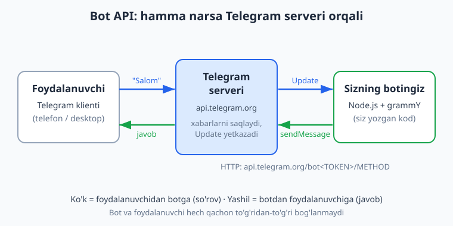
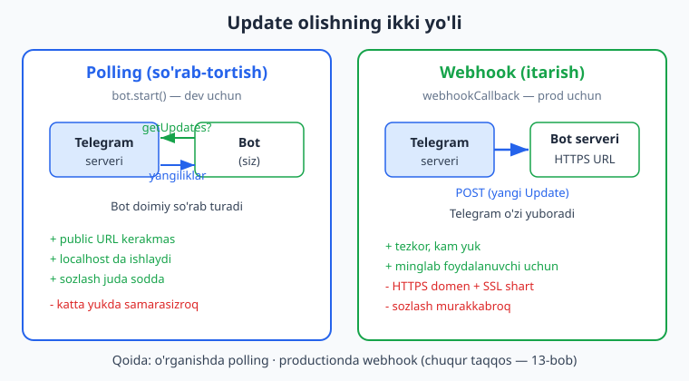
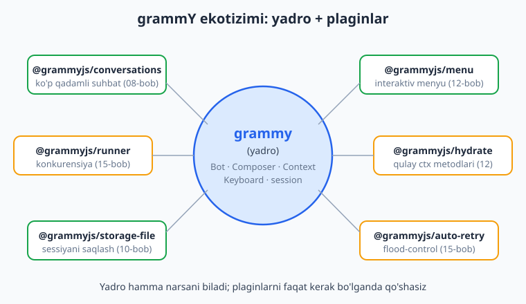

# 01 — Telegram botlar va grammY bilan tanishuv

[🏠 README](./README.md) · [Keyingi: 02 — Birinchi bot: echo va /start ➡️](./02-birinchi-bot.md)

---

> **Bu bobda:** Telegram bot aslida nima ekanini, oddiy foydalanuvchi akkauntidan farqini va nima qila olishi/qila olmasligini tushunamiz. "Foydalanuvchi — Telegram serveri — bot" uchligi qanday ishlashini, Bot API'ning oddiy HTTP API ekanini (`api.telegram.org/bot<TOKEN>/METHOD`), `getUpdates` va `sendMessage` orqali Update tushunchasini ko'rib chiqamiz. @BotFather'dan `/newbot` bilan token olishni, token nima ekanini (botning paroli) va uni maxfiy saqlashni o'rganamiz. Update olishning ikki yo'lini — polling va webhook — umumiy ko'rinishda solishtiramiz (chuqur farqi 13-bobda). Nega aynan **grammY** (zamonaviy, tez, ulkan plagin ekotizimi) tanlanishini, uning **Telegraf** va **node-telegram-bot-api** dan farqini ko'rib chiqamiz — bu juda muhim, chunki internetdagi misollarni aralashtirib yuborish eng tez-tez uchraydigan xato. Oxirida kitobning yo'l xaritasini ko'ramiz.
>
> Bu kitob siz JavaScript va Node.js asoslarini (`async/await`, `Promise`, ESM `import`, `npm`) bilasiz deb hisoblaydi — kerak bo'lsa [../js/README.md](../js/README.md) va [../nodejs/README.md](../nodejs/README.md) ga qayting. Bu kitob — [aiogram (Python) kitobining](../tgbot-python/README.md) JavaScript ekvivalenti; tushunchalar bir xil, sintaksis farq qiladi (qiziqarli solishtirma uchun ikkalasini parallel ko'rishingiz mumkin).
>
> **Halollik eslatmasi:** Bu bob asosan tushunchaviy — jonli kod kam. 9-bo'limdagi kichik handler misolini biz **haqiqatan offline** (tokensiz, internetsiz) ishga tushirib tekshirdik: soxta `Update` ni `bot.handleUpdate` ga uzatib, chiqayotgan API chaqiruvlarini transformer bilan ushlab. Natija matnda ko'rsatilgan. Ammo jonli ishlash — Telegram'ga polling/webhook ulanishi, real xabar yuborish — @BotFather'dan olingan **haqiqiy token + internet** talab qiladi; bunday bloklarni "illustrativ — jonli Telegram kerak" deb belgilab qo'yganmiz.

---

## 1. Telegram bot nima?

Telegram bot — bu Telegram ichida ishlaydigan **maxsus dastur**. U xuddi oddiy foydalanuvchi kabi xabar oladi va yuboradi, lekin orqasida jonli odam emas, balki **siz yozgan kod** turadi. Bot tugma bosishlariga javob beradi, ma'lumotlar bazasidan o'qiydi, boshqa API'larga so'rov yuboradi, fayl yuboradi — qisqasi, siz dasturlay olgan deyarli hamma narsani qila oladi.

Oddiy foydalanuvchi akkauntidan farqi:

- Botda telefon raqami yo'q; u **token** orqali tanilinadi (tokenni 3-bo'limda ko'ramiz).
- Bot odamga **birinchi** yozolmaydi — foydalanuvchi avval botga yozishi (yoki guruhga qo'shishi, yoki tugma bosishi) kerak. Bu spam'ning oldini oladi.
- Bot xabarlarni faqat o'ziga to'g'ridan-to'g'ri yuborilganda, yoki guruhda buyruq orqali chaqirilganda ko'radi (bu "privacy mode", 19-bobda batafsil).
- Bot maxsus imkoniyatlarga ega: inline tugmalar, klaviaturalar, to'lovlar, Web App (Mini App) va hokazo.

### Bot nima QILA OLADI va nima QILA OLMAYDI

Yangi boshlovchilar ko'pincha botdan imkonsiz narsani kutadi. Quyidagi jadval chegaralarni aniq ko'rsatadi:

| ✅ Bot QILA OLADI | ❌ Bot QILA OLMAYDI |
|---|---|
| Foydalanuvchi yozganda javob berish | Foydalanuvchiga o'zi birinchi yozish (oldin u yozmasa) |
| Xabar, rasm, fayl, video, ovoz yuborish | Boshqa odamning shaxsiy chatlarini o'qish |
| Inline/reply tugmalar, menyu ko'rsatish | Foydalanuvchining telefon raqamini ruxsatsiz olish (faqat tugma orqali so'raydi) |
| Guruhda moderatsiya qilish (admin bo'lsa) | Admin bo'lmagan guruhda hamma xabarni ko'rish (privacy mode) |
| To'lov qabul qilish, Telegram Stars | Foydalanuvchi o'rniga uning akkauntidan ish qilish |
| Web App (Mini App) ochish | Telegram'ning o'zini "hack" qilish |

> **Eslatma:** Bot API bilan **Telegram MTProto API** (GramJS, Telethon kabi kutubxonalar ishlatadigan "user-bot") — boshqa-boshqa narsalar. Bot API rasmiy, sodda va botlar uchun mo'ljallangan. Bu kitob faqat Bot API bilan ishlaydi.

## 2. Bot API qanday ishlaydi: foydalanuvchi — server — bot

Eng muhim tushuncha: **bot va foydalanuvchi o'rtasida har doim Telegram serveri turadi.** Hech kim hech kim bilan to'g'ridan-to'g'ri bog'lanmaydi. Sizning kodingiz foydalanuvchining telefoni bilan emas, faqat `api.telegram.org` bilan gaplashadi.



Oqimni qadamma-qadam ko'rib chiqaylik:

1. **Foydalanuvchi** Telegram klientida (telefon yoki desktop) botga "Salom" deb yozadi.
2. Bu xabar Telegram serveriga (`api.telegram.org`) boradi va u yerda saqlanadi.
3. Telegram bu xabarni **Update** (yangilik) ko'rinishida sizning botingizga yetkazadi.
4. Sizning kodingiz Update'ni o'qiydi, mantiqni bajaradi va `sendMessage` chaqiruvi bilan javob qaytaradi.
5. Telegram bu javobni foydalanuvchining ekraniga yetkazadi.

### Bot API — bu oddiy HTTP API

Bot API REST uslubidagi HTTP API. Siz quyidagi ko'rinishdagi manzilga so'rov yuborasiz:

```text
https://api.telegram.org/bot<TOKEN>/<METHOD>
```

Masalan, xabar yuborish metodi — `sendMessage`. Agar tokeningiz `123456789:AAH...` bo'lsa, xabar yuborish manzili shunday bo'ladi:

```text
https://api.telegram.org/bot123456789:AAH.../sendMessage?chat_id=777&text=Salom
```

Buni hatto oddiy `curl` bilan ham sinab ko'rsa bo'ladi (illustrativ — haqiqiy token va `chat_id` kerak):

```bash
# Illustrativ — jonli token kerak:
curl "https://api.telegram.org/bot<TOKEN>/sendMessage?chat_id=<CHAT_ID>&text=Salom"
```

Yaxshi yangilik shundaki — grammY bu HTTP chaqiruvlarni siz uchun bajaradi. Siz shunchaki `ctx.reply("Salom")` deb yozasiz, grammY esa orqada to'g'ri URL'ga to'g'ri so'rovni yuboradi. Lekin orqada nima bo'layotganini bilish ulkan foyda — xato qidirganda yoki hujjatni o'qiganda darrov tushunasiz.

### Update — "nimadir bo'ldi" signali

**Update** — bu Telegram sizga yuboradigan "nimadir bo'ldi" signali. Update turlari ko'p:

| Update turi | Qachon keladi |
|---|---|
| `message` | Yangi xabar (matn, rasm, fayl, ...) |
| `edited_message` | Xabar tahrirlandi |
| `callback_query` | Inline tugma bosildi |
| `inline_query` | Foydalanuvchi inline rejimda yozyapti |
| `my_chat_member` | Botning o'z statusi o'zgardi (qo'shildi/chiqarildi) |
| `chat_member` | Guruh a'zoligi o'zgardi |
| `channel_post` | Kanalga post joylandi |

Bu kitob davomida ko'pincha `message` va `callback_query` bilan ishlaymiz; guruh/kanal update'lari (19–21 boblar) va Mini App (23–26) qolganlarini ham ochib beradi. grammY'da bu update'larni **filter query** degan qulay til bilan ushlaymiz — masalan `bot.on("message:text")` faqat matnli xabarlarni, `bot.on(":photo")` rasmlarni tutadi (4-bobda chuqur).

## 3. @BotFather'dan token olish

Botingiz mavjud bo'lishi uchun avval uni **ro'yxatdan o'tkazish** kerak. Buni Telegram'ning rasmiy boti — **@BotFather** qiladi. BotFather — botlarni yaratuvchi bot (bu ham bot, ya'ni bu kitobda o'rganadigan narsangizdan biri).

Qadamlar:

1. Telegram'da [@BotFather](https://t.me/BotFather) ni oching (rasmiy, ko'k tasdiq belgili).
2. `/newbot` buyrug'ini yuboring.
3. Botingizga **ko'rinadigan nom** bering (masalan, `Mening Birinchi Botim`).
4. So'ng **username** bering — u albatta `bot` bilan tugashi kerak (masalan, `mening_birinchi_bot`) va butun Telegram bo'ylab noyob bo'lishi shart.
5. BotFather sizga **tokenni** beradi. U taxminan shunday ko'rinadi:

```text
123456789:AAH-Abc1234DefGhIjKlMnOpQrStUvWxYz0
```

### Token nima va nega maxfiy?

Token ikki qismdan iborat: `<bot_id>:<secret>`. Ikki nuqtagacha bo'lgan raqam — botingizning ommaviy ID'si; undan keyingi qism — **maxfiy parol**. Token — bu botingizning **paroli**: uni bilgan har kim botingiz nomidan xabar yuboradi, ma'lumotlarni o'qiydi, botni "o'g'irlaydi". Shuning uchun:

- Tokenni **hech kimga** bermang; GitHub'ga, skrinshotga, video'ga, kod ichiga qo'ymang.
- Tokenni har doim `.env` faylida saqlang (buni 02-bobda amalda ko'ramiz) va `.gitignore` ga `.env` ni qo'shing.
- Agar token sizib chiqsa, BotFather'da `/revoke` bilan darhol yangisini oling — eski token shu zahoti ishlamay qoladi.

### BotFather'ning boshqa foydali buyruqlari

```text
/mybots          - botlaringiz ro'yxati va sozlamalari
/setname         - bot nomini o'zgartirish
/setdescription  - bot tavsifi (chat ochilganda ko'rinadi)
/setuserpic      - bot avatari
/setcommands     - "/" bosilganda chiqadigan buyruqlar menyusi
/token           - mavjud bot tokenini qayta ko'rsatish
/revoke          - tokenni bekor qilib, yangisini olish
/deletebot       - botni o'chirish
```

> **Diqqat:** `/setcommands` bilan o'rnatadigan buyruqlar menyusi — bu faqat Telegram interfeysidagi "ko'rsatma" (foydalanuvchi `/` bosganda chiroyli ro'yxat chiqadi). U buyruqni **kodda ishlatadigan qilmaydi** — buyruqning mantig'ini baribir botingizda `bot.command("...")` bilan yozasiz (02-bob). Menyuni kod orqali ham o'rnatish mumkin (`bot.api.setMyCommands`), buni 12-bobda ko'ramiz.

> Token olish jonli Telegram ilovasida amalga oshiriladi — buni kod bilan tekshirib bo'lmaydi (illustrativ qadam).

## 4. Update olishning ikki yo'li: polling va webhook

Telegram update'larni botingizga ikki xil yo'l bilan yetkazadi. Ikkalasini ham bilish kerak, lekin **rivojlash (dev) bosqichida har doim polling** ishlatamiz.



### Polling (so'rab-tortish)

Botning o'zi Telegram'dan muntazam ravishda "menga yangi xabar bormi?" deb so'raydi (`getUpdates` metodi). Telegram bo'lsa, yangiliklarni qaytaradi. grammY'da bu **long-polling** ko'rinishida amalga oshadi — `bot.start()` chaqiruvi aynan shu ishni qiladi (uni 02-bobda yozamiz).

- **Afzalligi:** hech qanday public URL kerak emas, kompyuteringizdagi `localhost`da ham ishlaydi. Rivojlash va o'rganish uchun ideal.
- **Kamchiligi:** bot doimiy so'rab turadi; juda katta yuklamalarda biroz samarasiz (lekin minglab foydalanuvchigacha mutlaqo yetarli, ayniqsa `@grammyjs/runner` bilan — 15-bob).

### Webhook (itarish)

Bu yerda aksincha: siz Telegram'ga "yangi xabar kelganda, mana shu HTTPS manzilga o'zing yubor" deysiz. Telegram update'ni sizning serveringizdagi URL'ga `POST` qiladi. grammY'da buni `webhookCallback(bot, "express")` (yoki `"hono"`, `"http"`) yordamida web-serverga ulaymiz (13-bob).

- **Afzalligi:** tezkor, kam yuk, minglab foydalanuvchili botlar uchun mos.
- **Kamchiligi:** sizda **public HTTPS URL** (domen + SSL sertifikat) bo'lishi shart. Sozlash murakkabroq.

**Qoida:** o'rganayotganda va lokal ishlaganda — **polling**. Productionga chiqarishda, server tayyor bo'lganda — **webhook**'ni ko'rib chiqamiz (13-bob, deploy esa 17-bob). Bu kitobning katta qismi polling bilan ishlaydi.

> **Diqqat:** Polling ham, webhook ham bir vaqtda ishlay olmaydi — Telegram bittasini tanlaydi. Agar siz `setWebhook` qilgan bo'lsangiz, `getUpdates` (polling) `409 Conflict` xatosi qaytaradi. Webhook'dan pollingga qaytish uchun `bot.api.deleteWebhook()` chaqiriladi. Bu eng tez-tez uchraydigan "nega botim javob bermayapti?" sababidir (13-bobda batafsil).

> Polling ham, webhook ham jonli Telegram serveri va token talab qiladi — ularni offline ishga tushirib bo'lmaydi (illustrativ). Lekin handler mantig'ini token va internetsiz `bot.handleUpdate` orqali to'liq tekshirsa bo'ladi — buni 9-bo'limda ko'rasiz.

## 5. Nega grammY?

Telegram bot yozish uchun Node.js'da bir nechta kutubxona bor. Eng mashhurlari: **grammY**, **Telegraf**, **node-telegram-bot-api**. Bu kitob **grammY** ni tanlaydi. Sabablari:

- **Zamonaviy va faol** — grammY nisbatan yangi, ammo eng faol rivojlanayotgan kutubxona. Telegram Bot API yangi imkoniyat qo'shsa, grammY uni tez qo'llab-quvvatlaydi (anti-eskirish ahamiyatli).
- **TypeScript-birinchi, ammo JS'da ham mukammal** — grammY to'liq TypeScript'da yozilgan, shuning uchun avtoto'ldirish (autocomplete) va tip-ishoralar ajoyib. Lekin bu kitob **sof JavaScript (ESM)** ishlatadi — TypeScript shart emas. (TypeScript alohida mavzu; tiplar shunchaki "qo'shimcha foyda".)
- **Filter query'lar** — `bot.on("message:text")`, `bot.on(":photo")`, `bot.on("message:entities:url")` kabi qisqa, o'qishga oson va kuchli filtrlar. Bu grammY'ning eng yoqimli xususiyatlaridan biri (4-bob).
- **Composer va middleware** — handlerlarni mantiqiy modullarga ajratish, `next()` bilan zanjir qurish (03 va 09 boblar).
- **Ulkan plagin ekotizimi** — suhbatlar, menyu, sessiya saqlash, throttling, runner va h.k. — pastda ko'ramiz.
- **Tezlik va eng yaxshi hujjat** — [grammy.dev](https://grammy.dev) batafsil, yangilanib turadigan rasmiy hujjat.

### grammY ekotizimi: yadro va plaginlar

grammY "yadro + plaginlar" tamoyili bilan ishlaydi. Yadro (`grammy` paketi) hamma asosiy narsani biladi (`Bot`, `Composer`, `Context`, `Keyboard`, `InlineKeyboard`, `session`). Qo'shimcha imkoniyatlarni esa **faqat kerak bo'lganda** rasmiy `@grammyjs/*` plaginlari sifatida qo'shasiz.



| Paket | Nima qiladi | Qaysi bobda |
|---|---|---|
| `grammy` | Yadro: `Bot`, `Composer`, `Context`, `Keyboard`, `InlineKeyboard`, `session` | 02–10 |
| `@grammyjs/conversations` | Ko'p qadamli suhbat/forma (FSM ekvivalenti), **v2** | 08 |
| `@grammyjs/menu` | Interaktiv, holatli inline menyu | 12 |
| `@grammyjs/hydrate` | `ctx` ga qulay metodlar (`ctx.msg.editText()` kabi) | 12 |
| `@grammyjs/runner` | Konkurensiya — update'larni parallel qayta ishlash | 15 |
| `@grammyjs/auto-retry` | Flood-control (`429`) da avtomatik qayta urinish | 15 |
| `@grammyjs/storage-file` | Sessiyani faylga saqlash adapteri | 10 |

Hammasini hozir o'rnatish shart emas — har birini kerakli bobda o'rnatamiz. Hozir shunchaki nomlari bilan tanishib qo'ying.

## 6. grammY vs Telegraf vs node-telegram-bot-api

Bu eng muhim bo'lim — chunki internetda uchratadigan **ko'p misol grammY'niki emas**, va ularni grammY kodi bilan aralashtirib yuborish — eng tez-tez uchraydigan xato. Uch kutubxona bir-biriga umuman mos kelmaydi; ularning API'lari boshqa-boshqa.

| Jihat | grammY (bu kitob) | Telegraf | node-telegram-bot-api |
|---|---|---|---|
| Holati | Zamonaviy, faol | Mashhur, lekin sekinroq yangilanadi | Eski, past darajali |
| TypeScript | To'liq, birinchi navbatda | Bor, lekin kuchsizroq | Deyarli yo'q |
| Botni yaratish | `new Bot(token)` | `new Telegraf(token)` | `new TelegramBot(token, {polling:true})` |
| Matnli xabar | `bot.on("message:text", ...)` | `bot.on("text", ...)` | `bot.on("message", ...)` |
| Buyruq | `bot.command("start", ...)` | `bot.command("start", ...)` | `bot.onText(/\/start/, ...)` |
| Pollingni boshlash | `bot.start()` | `bot.launch()` | konstruktorda `{polling:true}` |
| Ko'p qadamli suhbat | `@grammyjs/conversations` | `ctx.scene` / Stage | (yo'q, qo'lda) |
| Filtr tili | filter query (`:photo`) | yo'q (qo'lda) | yo'q (qo'lda) |

E'tibor bering — `bot.command` ikkala grammY va Telegraf'da bor, lekin qolgani farq qiladi. Mana eng xavfli "yopishtirib qo'yiladigan" naqshlar, ularni grammY loyihangizga **kiritmang**:

```js
// ❌ Telegraf — grammY'da ISHLAMAYDI:
bot.on("text", (ctx) => ctx.reply("..."));   // grammY'da "message:text" bo'lishi kerak
bot.launch();                                 // grammY'da bot.start()
ctx.scene.enter("forma");                     // grammY'da ctx.conversation.enter(...)
const kb = Markup.inlineKeyboard([...]);       // grammY'da new InlineKeyboard()...

// ❌ node-telegram-bot-api — grammY'da ISHLAMAYDI:
const bot = new TelegramBot(token, { polling: true });  // grammY'da new Bot(token)
bot.onText(/\/start/, (msg) => bot.sendMessage(msg.chat.id, "..."));  // grammY'da bot.command(...)
```

grammY'da xuddi shu narsa quyidagicha (sof grammY idiom — buni 02-bobdan boshlab yozamiz):

```js
// ✅ grammY:
import { Bot } from "grammy";
const bot = new Bot(process.env.BOT_TOKEN);
bot.command("start", (ctx) => ctx.reply("Salom!"));
bot.on("message:text", (ctx) => ctx.reply(ctx.message.text));
bot.start();   // long polling
```

> **Oltin qoida:** Agar topgan misolingizda `new Telegraf(...)`, `bot.launch()`, `ctx.scene`, `Markup.*`, yoki `new TelegramBot(token, {polling:...})`, `bot.onText` bo'lsa — bu **grammY EMAS**. Uni ishlatmang. Shubha tug'ilsa, har doim [grammy.dev](https://grammy.dev) rasmiy hujjatiga qarang. Bu kitobdagi har bir kod faqat grammY idiomida yozilgan va tekshirilgan.

> **Anti-eskirish:** grammY tez rivojlanadi, ammo `Bot`, `bot.command`, `bot.on`, `ctx.reply`, `InlineKeyboard`/`Keyboard` kabi yadro API'lari barqaror. Agar versiya yangilanib biror narsa o'zgarsa, [grammy.dev](https://grammy.dev) va `node_modules/grammy` ichidagi tip-ta'riflari (`.d.ts`) eng ishonchli manba — taxmin qilmasdan o'sha yerga qarang.

## 7. Node.js va ESM muhiti

Bu kitob **JavaScript (ESM)** ishlatadi — ya'ni `import { Bot } from "grammy"` ko'rinishidagi zamonaviy modul sintaksisi (eski `require(...)` emas). Buning uchun loyihangizning `package.json` faylida `"type": "module"` bo'lishi kerak (02-bobda o'rnatamiz).

Talablar:

- **Node.js 18+** (bu kitob Node v24 va ESM bilan tekshirilgan). Tekshirish:

```bash
node --version
```

- **npm** (Node bilan birga keladi). grammY'ni keyingi bobda `npm install grammy` bilan o'rnatamiz.
- JavaScript asoslari: `async/await`, `Promise`, ESM `import`, obyekt/massiv. Eslatib qo'yamiz: deyarli har bir grammY handleri `async` bo'ladi va ichida `await ctx.reply(...)` ishlatadi. Bu bilan yaxshi tanish bo'lmasangiz, avval [../js/README.md](../js/README.md) va [../nodejs/README.md](../nodejs/README.md).

> **Eslatma:** Bu kitob — [aiogram (Python) kitobining](../tgbot-python/README.md) ekvivalenti. Agar Python'da aiogram bilan ishlagan bo'lsangiz, ko'p tushuncha bir xil: aiogram'dagi `Dispatcher`/`Router` rolini grammY'da `Bot`/`Composer`, `@router.message(...)` rolini `bot.on(...)`, FSM rolini `@grammyjs/conversations` o'ynaydi. DB asoslari uchun esa [../sql/README.md](../sql/README.md), deploy/git uchun [../git-github/README.md](../git-github/README.md) ga ham murojaat qilamiz.

## 8. grammY idiomi qanday ko'rinadi (oldindan ko'rish)

To'liq botni 02-bobda yozamiz, lekin grammY kodi qanday ko'rinishini hozirdan ko'ring. Bu eng minimal bot:

```js
import { Bot } from "grammy";

const bot = new Bot(process.env.BOT_TOKEN);  // token .env dan

// "/start" buyrug'iga javob
bot.command("start", (ctx) => ctx.reply("Salom! Men grammY botiman."));

// Har qanday matnli xabarni qaytarish (echo)
bot.on("message:text", (ctx) => ctx.reply(ctx.message.text));

bot.start();  // long polling — Telegram'dan update so'rab turadi
```

Bu yerda:

- `new Bot(token)` — bot obyekti. (grammY: `new Bot(token)`, Telegraf'dagi `new Telegraf` EMAS.) Token bo'sh bo'lsa, grammY darhol `Empty token!` xatosini beradi.
- `bot.command("start", handler)` — `/start` buyrug'i uchun handler.
- `bot.on("message:text", handler)` — filter query: faqat **matnli xabarlar**. `ctx.message.text` orqali matnga kiramiz.
- `ctx` (context) — har handlerga keladigan "hamma narsa shu yerda" obyekti: `ctx.message`, `ctx.from`, `ctx.chat`, va javob metodlari `ctx.reply(...)`. Uni 03-bobda chuqur ochamiz.
- `bot.start()` — long polling boshlaydi (cheksiz kutadi). Bu jonli, Telegram'ga ulanadigan qism.

## 9. Handler marshrutini OFFLINE tekshirish

`bot.start()` jonli Telegram + token talab qiladi (illustrativ). Lekin grammY'da ajoyib narsa bor: handlerlar mantig'ini **token va internetsiz** tekshirsa bo'ladi. `bot.handleUpdate(update)` ga soxta `Update` beramiz, chiqayotgan API chaqiruvlarini esa transformer (`bot.api.config.use`) bilan ushlaymiz — shunda haqiqiy tarmoq so'rovi ketmaydi, lekin handler to'g'ri ishlaganini isbotlaymiz.

Mana to'liq, ishlaydigan tekshiruv skripti (biz uni **haqiqatan ishga tushirdik**):

```js
import { Bot, InlineKeyboard } from "grammy";

const bot = new Bot("12345:FAKE");  // soxta token — tarmoqqa chiqmaymiz
// init() Telegram'ga "getMe" yubormasligi uchun botInfo'ni qo'lda beramiz:
bot.botInfo = {
  id: 12345, is_bot: true, first_name: "T", username: "t_bot",
  can_join_groups: true, can_read_all_group_messages: false,
  supports_inline_queries: false, can_connect_to_business: false,
  has_main_web_app: false,
};

// Chiqayotgan API chaqiruvlarini ushlaymiz (Telegram'ga yubormaymiz):
const calls = [];
bot.api.config.use((prev, method, payload) => {
  calls.push({ method, payload });
  if (method === "sendMessage") {
    return Promise.resolve({
      ok: true,
      result: { message_id: 1, date: 0, chat: { id: payload.chat_id, type: "private" }, text: payload.text },
    });
  }
  return Promise.resolve({ ok: true, result: true });
});

// Handlerlar (8-bo'limdagi idiom):
bot.command("start", (ctx) => ctx.reply(`Salom, ${ctx.from.first_name}!`));
bot.on("message:text", (ctx) => ctx.reply(ctx.message.text));

// Telegram'dan kelgandek soxta Update yasaymiz:
function mk(text, isCommand) {
  return {
    update_id: 1,
    message: {
      message_id: 1, date: 0, text,
      chat: { id: 777, type: "private" },
      from: { id: 777, is_bot: false, first_name: "Ali" },
      // BUYRUQ uchun bot_command entity SHART, aks holda bot.command mos kelmaydi:
      ...(isCommand ? { entities: [{ type: "bot_command", offset: 0, length: text.length }] } : {}),
    },
  };
}

await bot.handleUpdate(mk("/start", true));   // buyruq
await bot.handleUpdate(mk("salom dunyo", false));  // oddiy matn

console.log("1:", calls[0].payload.text);  // Salom, Ali!
console.log("2:", calls[1].payload.text);  // salom dunyo
```

Natija (haqiqatan ishga tushirildi):

```text
1: sendMessage -> "Salom, Ali!"
2: sendMessage -> "salom dunyo"
OK: marshrut to'g'ri ishladi.
```

E'tibor bering:

- `bot.handleUpdate(update)` — Telegram o'rniga update'ni **qo'lda** berish. Aynan shu bizga tokensiz, internetsiz tekshirish imkonini beradi.
- `bot.api.config.use((prev, method, payload) => ...)` — **transformer**: har bir chiquvchi API chaqiruvini ushlaydi. Biz uni Telegram'ga emas, `calls` massiviga yo'naltirdik. Real bot bo'lsa, bu yerda haqiqiy `sendMessage` ketardi.
- **Buyruq** (`/start`) mock update'iga `entities: [{ type: "bot_command", ... }]` qo'shish **shart** — aks holda grammY uni buyruq deb tanimaydi va `bot.command` ishlamaydi. (Bu juda nozik nuqta; men birinchi marta unutib, "nega ishlamayapti?" deb ancha qiynalgandim.)
- `bot.botInfo`'ni qo'lda berdik — shunda grammY ishga tushishda Telegram'ga `getMe` so'rovini yubormaydi.

> **Halol farq:** Yuqoridagi kod handler **marshrutini** isbotlaydi — `/start` to'g'ri handlerga bordi, matn echo bo'lib qaytdi. Lekin foydalanuvchi ekranida "Salom, Ali!" **ko'rinishi** — bu jonli Telegram + token talab qiladigan qism (illustrativ). Transformer haqiqiy so'rovni to'sib turgani uchun real xabar ketmadi; mantiqning to'g'riligi esa to'liq tekshirildi. Bu offline-test naqshini 16-bobda Vitest bilan to'liq avtomatlashtirilgan testlarga aylantiramiz.

## 10. Kitobda nima quramiz: yo'l xaritasi

Endi tushunchalar joyida. Bu kitob sizni quyidagi yo'l bo'ylab olib boradi:

1. **Echo bot** (02) — birinchi to'liq bot: `/start`, echo va `bot.start()`.
2. **Handlerlar, Composer, filtrlar** (03–04) — `ctx`, middleware, filter query'lar, buyruqlar.
3. **Xabar, media, klaviatura, callback** (05–07) — boy xabarlar, tugmalar, inline rejim.
4. **Conversations** (08) — ko'p qadamli forma/suhbat (`@grammyjs/conversations` v2).
5. **Middleware, sessiya, DB** (09–11) — arxitektura, `session()`, `better-sqlite3` ([../sql/README.md](../sql/README.md)), loyihani modullash.
6. **Plaginlar, webhook, to'lov, broadcast** (12–15) — menyu, `webhookCallback`, Telegram Stars, rejali vazifalar.
7. **Test, production, kapston** (16–18) — offline test, deploy ([../git-github/README.md](../git-github/README.md)), to'liq bot.
8. **Real amaliyot** (19–26) — guruh/kanal boshqaruvi, majburiy obuna, Telegram Mini App va yakuniy **Hamster uslubidagi clicker o'yin**.

Keyingi bobda darhol amaliyotga o'tamiz: birinchi jonli botni yozamiz.

---

## Mashqlar

Bu bob konseptual bo'lgani uchun mashqlar ko'pincha "izlan / tushuntir / rejalashtir" turida. Bir nechtasi 9-bo'limdagi offline naqsh bilan kod yozishni so'raydi.

### Oson

1. **Uchlikni chizing.** Foydalanuvchi botga "Salom" yozganda xabar qaysi yo'ldan o'tadi? Foydalanuvchi, Telegram serveri va bot orasidagi 5 qadamni o'z so'zlaringiz bilan tartibda yozing.

2. **Token formati.** Quyidagilardan qaysi biri Telegram bot tokeniga o'xshaydi, qaysi biri yo'q? Sababini ayting: (a) `123456789:AAH-Abc123DefGhi`, (b) `salom-dunyo`, (c) `abcdef`.

3. **Polling yoki webhook?** Quyidagi vaziyatlar uchun qaysi usul to'g'ri keladi va nega: (a) uyda noutbukda o'rganyapsiz, (b) minglab foydalanuvchili botni public serverda ishlatyapsiz, (c) sizda HTTPS domen yo'q.

4. **BotFather buyruqlari.** Botingiz nomini o'zgartirish, `/` menyusidagi buyruqlarni o'rnatish va tokenni bekor qilish uchun BotFather'ning qaysi buyruqlaridan foydalanasiz?

5. **Bot nima qila olmaydi?** Quyidagilardan qaysilari botning IMKONIDA EMAS: (a) foydalanuvchi yozganda javob berish, (b) tanish bo'lmagan odamga birinchi yozish, (c) admin bo'lgan guruhda xabar o'chirish, (d) boshqa odamning shaxsiy chatini o'qish.

6. **Versiyani tekshiring.** Kompyuteringizda Node.js qaysi versiyada o'rnatilganini ko'rsatadigan bitta qatorlik terminal buyrug'ini yozing. Nega bu kitob uchun 18+ kerak?

### O'rta

7. **Telegraf'ni grammY'ga tarjima qiling.** Quyidagi (Telegraf) kodni grammY idiomiga aylantiring:
   ```js
   bot.on("text", (ctx) => ctx.reply(ctx.message.text));
   bot.launch();
   ```

8. **node-telegram-bot-api'ni aniqlang.** Quyidagi kodning qaysi kutubxonaga tegishli ekanini ayting va grammY ekvivalentini yozing:
   ```js
   const bot = new TelegramBot(token, { polling: true });
   bot.onText(/\/start/, (msg) => bot.sendMessage(msg.chat.id, "Salom"));
   ```

9. **Bot API URL'i.** Tokeningiz `999:ABC` va siz `chat_id=777` ga `text=Salom` yubormoqchisiz deylik. `sendMessage` uchun to'liq Bot API URL'ini yozing (formatga qarab).

10. **Soxta Update yasang.** 9-bo'limdagi `mk` ga o'xshash, lekin `from.id = 42`, `first_name = "Lola"`, matni `/help` (buyruq) bo'lgan soxta Update qaytaradigan funksiya yozing. `entities` ni unutmang.

11. **Ekotizimni moslang.** Quyidagi vazifalarni mos `@grammyjs/*` plaginiga ulang: (a) ko'p qadamli forma, (b) interaktiv menyu, (c) sessiyani faylga saqlash, (d) `429` flood-control da qayta urinish.

12. **grammY'mi yoki yo'qmi?** Quyidagi qatorlarning qaysilari grammY, qaysilari emas: (a) `bot.command("start", ...)`, (b) `bot.launch()`, (c) `bot.on("message:text", ...)`, (d) `ctx.scene.enter(...)`, (e) `new Bot(token)`.

### Qiyin

13. **Marshrutni offline isbotlang.** 9-bo'limdagi skriptga `bot.command("help", ...)` uchinchi handlerini qo'shing (`ctx.reply("Yordam")`). So'ng `bot.handleUpdate` bilan `/help` yuborib, javob matni `"Yordam"` ekanini `calls` orqali tekshiring (`entities`'ni unutmang).

14. **Mos kelmaslikni isbotlang.** 9-bo'limdagi botga `/notexist` (ro'yxatdan o'tmagan buyruq) yuboring. Nechta API chaqiruvi bo'ladi? Nega? `calls.length` orqali isbotlang. (Maslahat: hech bir handler mos kelmasa, bot jim qoladi.)

15. **Filtr tartibi.** Ikkita handler bir xil update'ga mos kelsa (ikkalasi ham `bot.on("message:text")` va `next()` chaqirmasa), qaysi biri ishlaydi? Ikki handlerli misol yozib, `bot.handleUpdate` + transformer bilan buni isbotlang va qisqa xulosa yozing.

16. **Xavfsizlik tahlili.** Bir do'stingiz tokenini ochiq chatda yuborib yubordi va kodini GitHub'ga `.env`siz qo'ydi. Qanday xavf bor va u darhol nima qilishi kerak? BotFather'ning qaysi buyrug'i muammoni hal qiladi va nega eski token endi zarar bermaydi?

---

<details markdown="1">
<summary>Yechimlar</summary>

### Oson

**1.** Oqim: (1) Foydalanuvchi Telegram klientida "Salom" yozadi. (2) Xabar Telegram serveriga (`api.telegram.org`) boradi va saqlanadi. (3) Telegram uni `Update` ko'rinishida botga yetkazadi (polling yoki webhook orqali). (4) Bot kodi update'ni o'qib, mantiqni bajaradi va `sendMessage` chaqiradi. (5) Telegram javobni foydalanuvchi ekraniga yetkazadi. Asosiy g'oya: bot va foydalanuvchi hech qachon to'g'ridan-to'g'ri bog'lanmaydi — har doim Telegram serveri orasida turadi.

**2.** (a) `123456789:AAH-Abc123DefGhi` — tokenga o'xshaydi: `raqamlar:harf-belgilar` ko'rinishida, ikki nuqta (`:`) bilan ajralgan (`bot_id:secret`). (b) `salom-dunyo` va (c) `abcdef` — token EMAS, chunki ikki nuqta va boshida raqamli `bot_id` qismi yo'q. grammY bo'sh yoki butunlay yaroqsiz tokenni `new Bot(...)` da rad etadi (`Empty token!`), to'liq format esa Telegram'ga ulanishda aniqlanadi.

**3.** (a) Uyda o'rganish -> **polling** (public URL kerakmas, `localhost`da ishlaydi). (b) Minglab foydalanuvchili public bot -> **webhook** (tezkor, kam yuk) — yoki polling + `@grammyjs/runner`. (c) HTTPS domen yo'q -> **polling** (webhook public HTTPS URL talab qiladi).

**4.** Nomni o'zgartirish: `/setname`. Buyruqlar menyusi: `/setcommands`. Tokenni bekor qilib yangisini olish: `/revoke`. (Botlar ro'yxati: `/mybots`.)

**5.** Imkonida EMAS: (b) tanish bo'lmagan odamga birinchi yozish (foydalanuvchi avval botga yozishi kerak), (d) boshqa odamning shaxsiy chatini o'qish. Imkonida BOR: (a) javob berish, (c) admin bo'lgan guruhda xabar o'chirish.

**6.** Buyruq: `node --version`. 18+ kerak, chunki bu kitob zamonaviy ESM (`import`), `await` (top-level await) va grammY'ning Node talablariga tayanadi; eski Node'larda bu imkoniyatlar to'liq ishlamaydi.

### O'rta

**7.** grammY idiomi:
```js
bot.on("message:text", (ctx) => ctx.reply(ctx.message.text));
bot.start();
```
O'zgarishlar: Telegraf'dagi `bot.on("text", ...)` -> grammY filter query `bot.on("message:text", ...)`; `bot.launch()` -> `bot.start()`. `ctx.reply` va `ctx.message.text` ikkalasida ham o'xshash.

**8.** Bu **node-telegram-bot-api** (`new TelegramBot(token, {polling:true})` va `bot.onText` shu kutubxonaga xos). grammY ekvivalenti:
```js
import { Bot } from "grammy";
const bot = new Bot(token);
bot.command("start", (ctx) => ctx.reply("Salom"));
bot.start();
```
E'tibor: grammY'da `chat_id`ni qo'lda berish shart emas — `ctx.reply` o'zi to'g'ri chatga javob beradi.

**9.** Bot API URL'i:
```text
https://api.telegram.org/bot999:ABC/sendMessage?chat_id=777&text=Salom
```
`bot` prefiksi token bilan birikadi (`bot999:ABC`), metod nomi `sendMessage`, parametrlar query string sifatida. Amalda grammY bularni siz uchun quradi.

**10.**
```js
function mk(text, isCommand) {
  return {
    update_id: 1,
    message: {
      message_id: 1, date: 0, text,
      chat: { id: 42, type: "private" },
      from: { id: 42, is_bot: false, first_name: "Lola" },
      ...(isCommand ? { entities: [{ type: "bot_command", offset: 0, length: text.length }] } : {}),
    },
  };
}
const upd = mk("/help", true);
console.log(upd.message.from.first_name, upd.message.text);  // Lola /help
```
Buyruq bo'lgani uchun `entities: [{ type: "bot_command", ... }]` shart.

**11.** (a) ko'p qadamli forma -> `@grammyjs/conversations`; (b) interaktiv menyu -> `@grammyjs/menu`; (c) sessiyani faylga saqlash -> `@grammyjs/storage-file`; (d) `429` flood-control da qayta urinish -> `@grammyjs/auto-retry`.

**12.** grammY: (a) `bot.command("start", ...)`, (c) `bot.on("message:text", ...)`, (e) `new Bot(token)`. grammY EMAS: (b) `bot.launch()` — Telegraf; (d) `ctx.scene.enter(...)` — Telegraf (grammY'da `ctx.conversation.enter(...)`).

### Qiyin

**13.** Skriptga uchinchi handler qo'shamiz va `/help`'ni tekshiramiz:
```js
bot.command("help", (ctx) => ctx.reply("Yordam"));

calls.length = 0;  // hisobni tozalaymiz
await bot.handleUpdate(mk("/help", true));
console.log(calls[0].method, calls[0].payload.text);  // sendMessage Yordam
if (calls[0].payload.text !== "Yordam") throw new Error("xato!");
console.log("OK: /help marshruti to'g'ri");
```
`/help` ham buyruq bo'lgani uchun `mk("/help", true)` (entity bilan) ishlatiladi. Natija (offline ishlaydi): `calls[0].payload.text === "Yordam"`.

**14.** **0 ta** API chaqiruvi bo'ladi. Sababi: `/notexist` `bot.command("start")`, `bot.command("help")` ga mos kelmaydi; `bot.on("message:text")` esa matnli xabarlarni tutadi, lekin biz uni 9-bo'limda echo qilib qoldirgan edik — agar `entities`'li buyruq bo'lsa va hech bir `command` mos kelmasa, lekin `message:text` filtr baribir mos kelishi mumkin. Aniq isbot uchun faqat ikkita `command` qoldirib, `message:text` handlerini olib tashlang:
```js
const bot = new Bot("12345:FAKE");
bot.botInfo = { id:12345, is_bot:true, first_name:"T", username:"t_bot",
  can_join_groups:true, can_read_all_group_messages:false,
  supports_inline_queries:false, can_connect_to_business:false, has_main_web_app:false };
const calls = [];
bot.api.config.use((prev, m, p) => { calls.push(m); return Promise.resolve({ ok:true, result:true }); });
bot.command("start", (ctx) => ctx.reply("S"));
bot.command("help", (ctx) => ctx.reply("Y"));
await bot.handleUpdate(mk("/notexist", true));
console.log("Chaqiruvlar:", calls.length);  // 0
```
Xulosa: hech bir handler mos kelmasa, bot **jim qoladi** — bu xato emas, normal hol. (Agar `message:text` handleri ham bo'lsa, u baribir ishlardi, chunki buyruq ham matnli xabar; shuning uchun isbot uchun uni olib tashladik.)

**15.** Bitta update bir nechta handlerga mos kelsa va birinchisi `next()` chaqirmasa, **ro'yxatdan o'tish tartibida birinchi mos kelgani** ishlaydi, qolganlari ishlamaydi. Isbot:
```js
const bot = new Bot("12345:FAKE");
bot.botInfo = { id:12345, is_bot:true, first_name:"T", username:"t_bot",
  can_join_groups:true, can_read_all_group_messages:false,
  supports_inline_queries:false, can_connect_to_business:false, has_main_web_app:false };
const seen = [];
bot.api.config.use((prev, m, p) => Promise.resolve({ ok:true, result:true }));
bot.on("message:text", (ctx) => { seen.push("birinchi"); });   // next() yo'q
bot.on("message:text", (ctx) => { seen.push("ikkinchi"); });   // ishlamaydi
await bot.handleUpdate(mk("salom", false));
console.log(seen);  // ["birinchi"]
```
Natija: `["birinchi"]` — ikkinchisi ishlamadi, chunki birinchisi `next()` chaqirmadi. Xulosa: handler tartibi muhim. Eng aniq (spetsifik) handlerlarni yuqoriroqqa qo'ying; agar zanjirni davom ettirmoqchi bo'lsangiz, handler oxirida `await next()` chaqiring (middleware — 09-bob).

**16.** Xavf: token — botning paroli; uni bilgan har kim botingiz nomidan xabar yuboradi, ma'lumotlarni o'qiydi, botni butunlay nazoratga oladi. Bundan tashqari, token GitHub'da ochiq qolsa, avtomatik skanerlar uni soniyalar ichida topadi. Darhol qilinadigan ish: BotFather'da `/revoke` buyrug'i bilan eski tokenni **bekor qilish** va yangi token olish; so'ng yangi tokenni `.env` da saqlash va `.env` ni `.gitignore` ga qo'shish (kodga yozmaslik). `/revoke` dan keyin eski token shu zahoti ishlamay qoladi — shuning uchun sizib chiqqani endi zarar bera olmaydi. (Agar maxfiy ma'lumot Git tarixiga tushgan bo'lsa, uni tarixdan ham tozalash kerak — buni [../git-github/README.md](../git-github/README.md) da ko'rasiz.)

</details>

---

[🏠 README](./README.md) · [Keyingi: 02 — Birinchi bot: echo va /start ➡️](./02-birinchi-bot.md)
