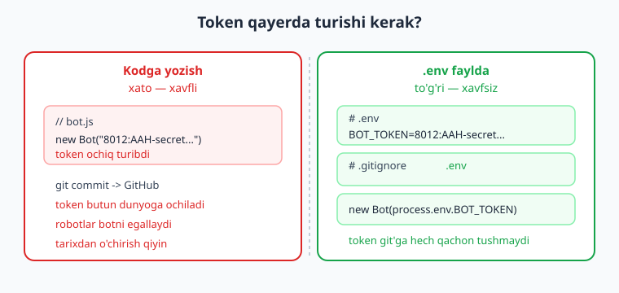
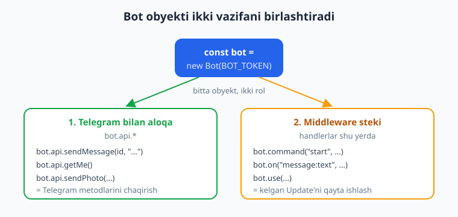
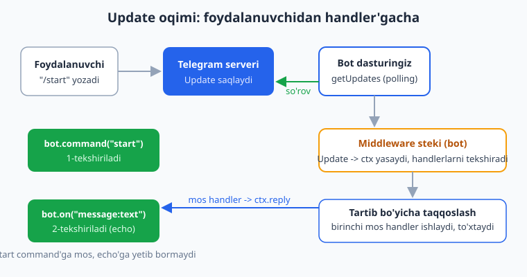

# 02 — Birinchi bot: echo va /start

[⬅️ Oldingi: 01 — Telegram botlar va grammY bilan tanishuv](./01-telegram-grammy-tanishuv.md) · [🏠 README](./README.md) · [Keyingi: 03 — Update'lar, handlerlar va Composer ➡️](./03-handlerlar-composer.md)

---

> **Bu bobda:** birinchi ishlaydigan botimizni noldan quramiz. `@BotFather` dan token olamiz va uni `.env` faylda (kodga emas) saqlaymiz — nega bu muhimligini ko'ramiz. So'ng grammY ning markaziy obyekti `Bot` ni tushunamiz: u bir vaqtning o'zida Telegram bilan **aloqa liniyasi** (`bot.api`) ham, **middleware steki** (handlerlar uyi) ham. `/start` buyrug'iga foydalanuvchini ism bilan salomlovchi handler va har qanday matnni qaytaruvchi **echo** handler yozamiz. `bot.start()` nima qilishini, nega "tugamasligini" va nega `async/await` kerakligini ko'ramiz. `ctx.reply` bilan `ctx.api.sendMessage` farqini ajratamiz. Yo'l-yo'lakay `Update` qanday qilib Telegram serveridan sizning funksiyangizgacha "sayohat qilishini" kuzatamiz va eng muhim qoidani — **handler tartibi** ni — o'rganamiz.
>
> **Halollik eslatmasi:** bu bobdagi handler **mantig'i** (`/start` va echo, handler tartibi, `command(["help","yordam"])`, upper-echo, hisoblagich, matn statistikasi) haqiqatan ham OFFLINE — token va internetsiz — `bot.handleUpdate(...)` ga soxta `Update` uzatib va chiqayotgan API chaqiruvlarini transformer bilan ushlab tekshirilgan. Men bu testlarni o'z kompyuterimda grammY 1.43 da ishga tushirib, natijalarini ko'rdim (pastda aynan ko'rsatilgan). Ammo botni **jonli** ishga tushirish — `bot.start()` bilan polling, Telegram'ga real xabar yuborish/qabul qilish — `@BotFather` tokeni va internet talab qiladi. Shu sababli "botni terminalda ishga tushiring" bo'limlari **illustrativ** deb belgilangan: kod to'g'ri, lekin natijani siz o'z tokeningiz bilan ko'rasiz. Hech qayerda soxta "xabar yetib bordi" degan natija yozilmagan.

---

## Yo'l xaritasi: nima quramiz?

Birinchi botimiz juda kichik, lekin **to'liq ishlaydigan** bot — o'yinchoq emas:

1. Foydalanuvchi `/start` yozsa, bot uni ism bilan salomlaydi.
2. Foydalanuvchi boshqa har qanday matn yozsa, bot o'sha matnni **qaytaradi** (echo, ya'ni "aks-sado").

Bor-yo'g'i shu. Lekin shu kichik dasturda Telegram botlarining BARCHA asosiy g'oyalari mujassam: token, `Bot` obyekti, handler, filter query, `ctx`, `async/await` va `polling`. Keyingi boblarda biz shu skeletga qo'shimcha "go'sht" qo'shamiz — Composer (03-bob), filtrlar (04-bob), klaviaturalar (06-bob) — lekin suyak shu yerda quriladi.

Bu bob siz JavaScript va Node.js asoslarini (`async/await`, `Promise`, ESM `import`, `npm`) bilasiz deb faraz qiladi. Agar `import`/`export` yoki `async/await` sizga begona bo'lsa, avval [JavaScript qo'llanmasi](../js/README.md) va [Node.js qo'llanmasi](../nodejs/README.md)ga qarang. Bu yerda biz JS ni emas, **grammY ga xos** har bir narsani tushuntiramiz.

> **Eslatma:** agar siz bu botning Python'da qanday yozilishi bilan solishtirmoqchi bo'lsangiz — [aiogram qo'llanmasidagi 02-bob](../tgbot-python/README.md) aynan shu echo botni `aiogram` bilan quradi. g'oya bir xil, faqat sintaksis boshqacha.

---

## Token: BotFather'dan olib, .env faylda saqlash

Botingiz Telegram bilan gaplashishi uchun unga **token** kerak. Token — botning paroli kabi maxfiy satr. U `@BotFather` botidan olinadi.

### Token olish (illustrativ — Telegram talab qiladi)

> **Illustrativ:** bu qadamlar real Telegram ilovasi va internet talab qiladi. Token sizniki, shaxsiy — uni hech kimga bermang.

1. Telegram'da `@BotFather` ni oching.
2. `/newbot` buyrug'ini yuboring.
3. Botga **nom** bering (masalan: `Mening Echo Botim`).
4. Botga **username** bering — u `bot` bilan tugashi shart (masalan: `mening_echo_bot`).
5. BotFather sizga token beradi. U taxminan shunday ko'rinadi:

```text
8012345678:AAH-dEfGhIjKlMnOpQrStUvWxYz1234567890
```

Bu satr — sizning tokeningiz. Ikki qismdan iborat: ikki nuqtagacha bo'lgan raqam (bot ID si) va undan keyingi maxfiy qism.

> **Diqqat:** token — parol kabi. Uni GitHub'ga, skrinshotga, hech qaerga oshkor qilmang. Agar oshkor bo'lib qolsa, BotFather'da `/revoke` bilan eski tokenni bekor qiling va yangisini oling.

### Nega token kodga yozilmaydi?

Yangi boshlovchilar ko'pincha tokenni to'g'ridan kodga yozadi:

```js
// ❌ Yomon: token kodning ichida ochiq turibdi
const bot = new Bot("8012345678:AAH-dEfGhIjKlMnOpQrStUvWxYz1234567890");
```

Bu xavfli. Agar siz kodni GitHub'ga `git commit` qilsangiz, token butun dunyoga oshkor bo'ladi. Bir necha daqiqada robotlar uni topib, botingizni egallab olishi mumkin. Token git tarixiga bir marta tushsa, uni o'chirish ham qiyin — `git rm` yetmaydi, butun tarixni qayta yozish kerak.

To'g'ri yo'l — tokenni **`.env`** faylda saqlash va uni `.gitignore`ga qo'shish. Quyidagi rasm farqni ko'rsatadi:



### .env faylini yaratish

Loyiha papkasida `.env` nomli fayl yarating:

```text
BOT_TOKEN=8012345678:AAH-dEfGhIjKlMnOpQrStUvWxYz1234567890
```

> `.env` — oddiy matn fayli, ichida `KALIT=qiymat` ko'rinishidagi qatorlar bo'ladi. Bu yerda haqiqiy tokenni yozasiz (yuqoridagi soxta tokenni emas). Qiymatni tirnoqqa olish shart emas.

Endi `.gitignore` fayliga `.env` ni qo'shing, shunda u hech qachon `git`ga tushmaydi:

```text
node_modules/
.env
```

### .env'ni o'qish: ikki usul

Node.js'da `.env` faylini o'qishning ikki yo'li bor. Ikkalasi ham `BOT_TOKEN` ni `process.env.BOT_TOKEN` orqali ko'rsatadi.

**1-usul: `node --env-file` (Node 20.6+, qo'shimcha paket kerak emas).** Node'ning o'zi `.env` ni o'qiy oladi:

```bash
node --env-file=.env bot.js
```

Bu eng sodda yo'l: hech narsa o'rnatmaysiz. Kodda `process.env.BOT_TOKEN` ishlaydi.

**2-usul: `dotenv` paketi (eski Node yoki moslik uchun).** Agar Node versiyangiz eski bo'lsa yoki `dotenv` ga ko'nikkan bo'lsangiz:

```bash
npm install dotenv
```

Kodning eng boshida (boshqa hech narsadan **oldin**):

```js
import "dotenv/config";   // .env ni o'qib, process.env ga yuklaydi
```

> **Eslatma:** `import "dotenv/config"` har qanday `import`dan **oldin** ishlashi kerak — aks holda `process.env.BOT_TOKEN` bo'sh bo'lib qolishi mumkin. Bu — `dotenv` bilan tez-tez uchraydigan tuzoq. `--env-file` usulida bunday muammo yo'q, chunki Node fayl ishga tushishidan oldin o'qiydi. Biz kitobda asosan `--env-file` usulini ishlatamiz, lekin `dotenv` ham to'liq to'g'ri.

Ikkala holatda ham kodda token shunday olinadi:

```js
const token = process.env.BOT_TOKEN;
```

Token endi kodda emas, faylda — git'ga tushmaydi.

---

## Bot obyekti: aloqa + middleware steki

grammY da deyarli hamma narsa bitta obyekt — `Bot` — atrofida quriladi. Uni tushunsangiz, qolgani oson ketadi.

```js
import { Bot } from "grammy";
const bot = new Bot(process.env.BOT_TOKEN);
```

> **Diqqat (anti-eskirish):** internetda Telegram bot misollarining ko'pi `Telegraf` yoki `node-telegram-bot-api` uchun yozilgan. Ularda `new TelegramBot(token, { polling: true })`, `bot.onText`, `bot.launch()`, `ctx.scene`, `Markup.inlineKeyboard` ko'rsangiz — bu **grammY emas** va bu kodlar bizda **ishlamaydi**. grammY da bot `new Bot(token)`, ishga tushirish `bot.start()`, handler `bot.command`/`bot.on(...)`. Faqat grammY idiomidan foydalaning.

`Bot` obyekti ikki vazifani birlashtiradi. Quyidagi rasm buni ko'rsatadi:



**1) Telegram bilan aloqa liniyasi — `bot.api`.** `Bot` tokeningizni saqlaydi va Telegram metodlarini chaqiradi:

```js
await bot.api.sendMessage(123456, "Salom!");   // chat_id 123456 ga xabar
await bot.api.getMe();                          // bot haqida ma'lumot
```

`bot.api` — bu Telegram Bot API ning to'g'ridan o'zbekchasi: `sendMessage`, `sendPhoto`, `getChat` va boshqa har bir metod shu yerda. Bu — botning "telefoni".

**2) Middleware steki — handlerlar uyi.** Siz handlerlaringizni shu `bot` ga "ro'yxatdan o'tkazasiz":

```js
bot.command("start", (ctx) => ctx.reply("Salom!"));
bot.on("message:text", (ctx) => ctx.reply(ctx.message.text));
bot.use((ctx, next) => next());   // umumiy middleware
```

Telegram'dan kelgan har bir `Update` shu stekdan o'tadi va mos handler topiladi. Middleware steki — 03 va 09-boblarning asosiy mavzusi; hozircha "handlerlar shu yerga yoziladi" deb tushunsangiz kifoya.

> **Eslatma:** aiogram (Python) da bu ikki vazifa ikki obyektga bo'lingan: `Bot` (aloqa) va `Dispatcher` (handlerlar). grammY da ularning ikkalasi ham bitta `Bot` obyektida — bu soddaroq. Agar aiogram'dan kelgan bo'lsangiz, `Dispatcher`ni alohida izlamang: u `bot` ning o'zida.

---

## Birinchi handlerlar: /start va echo

Endi ikkita handler yozamiz.

### /start buyrug'i

```js
bot.command("start", (ctx) => {
  ctx.reply("Salom, " + ctx.from.first_name + "!");
});
```

- `bot.command("start", ...)` — bu funksiyani `/start` buyrug'iga bog'laydi. Faqat `/start` kelganda shu handler ishlaydi.
- `ctx` — **context** obyekti. U kelgan `Update` haqidagi hamma narsani saqlaydi va qulay yorliqlar beradi. `ctx` ni 03-bobda chuqur ko'ramiz; hozircha u "shu xabar haqida hamma narsa" deb biling.
- `ctx.from` — xabarni yozgan **foydalanuvchi** (`User`). `ctx.from.first_name` — uning ismi.
- `ctx.reply("...")` — **shu chatga** javob yuboradi. `reply` "qaysi chatga?" degan savolni avtomatik hal qiladi (xabar kelgan chatga javob beradi).

> **Eslatma:** `bot.command("start", ...)` ichida `"start"` deb yozasiz — **`/` belgisisiz**. grammY `/` ni o'zi qo'shadi. `bot.command("/start", ...)` deb yozish xato.

### echo handler

```js
bot.on("message:text", (ctx) => {
  ctx.reply(ctx.message.text);
});
```

- `bot.on("message:text", ...)` — bu **filter query**. U "kelgan xabarda matn bormi?" degan filtrni bildiradi. Rasm, stiker yoki ovozli xabar kelsa, bu handler **ishlamaydi** — faqat matn.
- `ctx.message.text` — xabar matni.
- `ctx.reply(ctx.message.text)` — o'sha matnni qaytaradi. Echo tayyor!

`"message:text"` — bu grammY ning kuchli **filter query** tizimining birinchi misoli. `message:photo`, `message:voice`, `:text` (xabar yoki kanal posti) kabi o'nlab kombinatsiyalar bor. Buni 04-bobda batafsil ko'ramiz.

> **Anti-eskirish:** Telegraf'da matnni tutish uchun `bot.on("text", ...)` (ikki nuqtasiz) yoziladi. grammY da bu **`bot.on("message:text", ...)`** — ikki nuqta bilan, chunki bu filter query. `bot.on("text")` grammY da xato beradi.

### ctx.reply va ctx.api.sendMessage farqi

Javob berishning ikki usuli bor:

```js
// 1) ctx.reply — xabar kelgan chatga avtomatik javob beradi (qulay)
ctx.reply("Salom!");

// 2) ctx.api.sendMessage — chat_id ni o'zingiz ko'rsatasiz (moslashuvchan)
ctx.api.sendMessage(ctx.chat.id, "Salom!");
```

`ctx.reply(...)` — qisqa yo'l: u `chat_id` ni `ctx` dan o'zi oladi. `ctx.api.sendMessage(chatId, text)` — to'liq yo'l: **boshqa** chatga yuborish kerak bo'lsa (masalan, adminga xabar berish), shuni ishlatasiz. Echo botda `reply` qulayroq.

> **Eslatma:** `ctx.reply` — Telegram'ning "reply" (xabarga javob sifatida ulash) degan funksiyasi EMAS. U shunchaki "shu chatga xabar yubor" degani. Xabarni boshqa xabarga **ulamoqchi** bo'lsangiz, `ctx.reply("...", { reply_parameters: { message_id: ctx.msg.message_id } })` ishlatiladi (05-bobda).

---

## bot.start(): polling, "tugamaydi" va Ctrl+C

Handlerlarni yozdik, lekin bot hali **tinglamaydi**. Uni ishga tushirish kerak:

```js
bot.start();
```

`bot.start()` **long polling** ni boshlaydi: bot doimo Telegram'dan "yangi xabar bormi?" deb so'rab turadi (`getUpdates`). Yangi `Update` kelganda uni middleware stekidan o'tkazadi va mos handlerni ishga tushiradi.

> **`bot.start()` nega "tugamaydi"?** Polling — cheksiz tsikl: bot doimo yangi xabar kutadi. Shuning uchun `bot.start()` siz `Ctrl+C` bosgunga qadar ishlab turadi. Terminal "qotib qolgandek" ko'rinadi — bu **normal** holat, bot "tinglab turibdi" degani. Dastur tugamasligi kerak, aks holda bot o'chadi.

### async/await nega kerak?

Telegram boti bir vaqtning o'zida yuzlab foydalanuvchi bilan gaplashadi. Agar bot bir xabarni qayta ishlayotganda (masalan, Telegram serveridan javob kutib) "qotib qolsa", qolganlar kutib qolardi. `async/await` shu muammoni hal qiladi: javob kutilayotgan paytda bot **boshqa** xabarlarni ishlay oladi.

Shuning uchun grammY da Telegram'ga so'rov yuboradigan deyarli har bir chaqiruv `Promise` qaytaradi va `await` bilan kutiladi:

```js
await ctx.reply("Salom!");           // Telegram'ga so'rov — await bilan kutamiz
await bot.api.sendMessage(id, "...");
```

> **Eslatma:** sodda handlerda `ctx.reply(...)` ni `await`siz ham yozish mumkin (`(ctx) => ctx.reply("...")`) — bu yerda `Promise` qaytariladi va grammY uni o'zi kutadi. Lekin handler ichida **bir nechta** ketma-ket so'rov bo'lsa yoki natijaga qarab davom etmoqchi bo'lsangiz, `await` shart: `await ctx.reply(...)` keyin yana bir so'rov. Odat tariqasida `async (ctx) => { await ctx.reply(...); }` yozish xavfsiz.

---

## Update qanday "sayohat qiladi"?

Foydalanuvchi xabar yozganidan sizning funksiyangiz ishlaguncha bo'lgan yo'lni tushunish muhim. Quyidagi rasm shu oqimni ko'rsatadi:



Bosqichma-bosqich:

1. **Foydalanuvchi** botga `/start` yozadi.
2. Xabar **Telegram serveriga** boradi. Server uni `Update` ko'rinishida saqlaydi (`Update` — "nimadir yangilik bo'ldi" degan paket).
3. Sizning **bot dasturingiz** `getUpdates` so'rovi bilan "yangi update bormi?" deb so'rab turadi. Bu **polling**.
4. Update kelganda **middleware steki** uni qabul qiladi, `Update` dan `ctx` obyekti yasaydi va handlerlarni **yozilish tartibida** tekshiradi.
5. **Birinchi mos** handler ishga tushadi va `ctx.reply(...)` bilan javob qaytaradi. Mos handler topilgach, qolganlari tekshirilmaydi.

`/start` xabari `bot.command("start")` filtriga mos keladi, shuning uchun salomlash handleri ishlaydi. Oddiy matn esa unga mos kelmaydi, lekin `bot.on("message:text")` filtriga mos keladi, shuning uchun echo handleri ishlaydi.

---

## Handler TARTIBI: eng muhim qoida

Bu — boshlovchilar eng ko'p kaltaklanadigan joy, shuning uchun alohida ko'ramiz.

grammY handlerlarni **yozilish (ro'yxatdan o'tish) tartibida** tekshiradi va **birinchi mos kelganida to'xtaydi**. Demak `bot.command("start")` echo'dan **OLDIN** turishi kerak:

```js
// ✅ TO'G'RI: command oldin, echo keyin
bot.command("start", (ctx) => ctx.reply("Salom, " + ctx.from.first_name + "!"));
bot.on("message:text", (ctx) => ctx.reply(ctx.message.text));
```

Agar teskari yozsangiz, falokat:

```js
// ❌ XATO: echo oldin -> /start ham echo'ga tushadi
bot.on("message:text", (ctx) => ctx.reply(ctx.message.text));   // BU OLDIN
bot.command("start", (ctx) => ctx.reply("Salom!"));             // bunga yetib bormaydi
```

Nega? Chunki `/start` ham **matnli xabar** — `message:text` filtriga mos keladi! Echo birinchi turgani uchun `/start` ni tutib oladi va `/start` matnini qaytaradi; `bot.command("start")` ga navbat **yetib bormaydi**. Foydalanuvchi `/start` yozadi, bot esa `/start` deb javob beradi — salomlash ishlamaydi.

**Qoida:** maxsus (tor) filtrlar — buyruqlar — doimo umumiy (keng) filtrlardan (`message:text`) **yuqorida** turishi kerak.

Buni biz pastdagi OFFLINE bo'limda haqiqatan ko'rsatamiz (men ikkala tartibni ham ishga tushirib, natijasini ko'rdim).

---

## To'liq birinchi bot: bot.js

Endi hammasini birlashtiramiz. Avval loyihani sozlaymiz.

### Loyihani sozlash

```bash
mkdir mening-bot
cd mening-bot
npm init -y
npm install grammy
```

`npm init -y` `package.json` yaratadi. Endi `package.json` ga **`"type": "module"`** qatorini qo'shing — bu ESM `import` ishlashi uchun **shart**:

```json
{
  "name": "mening-bot",
  "version": "1.0.0",
  "type": "module",
  "scripts": {
    "start": "node --env-file=.env bot.js"
  },
  "dependencies": {
    "grammy": "^1.43.0"
  }
}
```

> **Diqqat:** `"type": "module"` bo'lmasa, `import { Bot } from "grammy"` qatori `SyntaxError: Cannot use import statement outside a module` xatosini beradi. Node CommonJS (`require`) va ESM (`import`) ni `"type"` maydoniga qarab ajratadi. Biz butun kitobda ESM ishlatamiz.

`.env` faylini yarating (`BOT_TOKEN=...`) va `.gitignore` ga `.env` va `node_modules/` ni qo'shing.

### bot.js

```js
import { Bot } from "grammy";

// 1) Tokenni .env'dan olamiz (kodga yozmaymiz!).
//    Ishga tushirish: node --env-file=.env bot.js
const token = process.env.BOT_TOKEN;
if (!token) {
  throw new Error(".env faylida BOT_TOKEN topilmadi! BOT_TOKEN=... yozing.");
}

// 2) Bot obyektini yaratamiz.
const bot = new Bot(token);

// 3) Handlerlarni ro'yxatdan o'tkazamiz. TARTIB MUHIM: command echo'dan oldin!
bot.command("start", (ctx) => {
  return ctx.reply(
    "Salom, " + ctx.from.first_name + "! " +
    "Men echo botman. Menga biror narsa yozing — qaytaraman."
  );
});

bot.on("message:text", (ctx) => {
  return ctx.reply(ctx.message.text);   // echo
});

// 4) Pollingni boshlaymiz (cheksiz kutadi, Ctrl+C bilan to'xtaydi).
bot.start();
```

Endi har bir qismni tushuntiramiz.

### Import

```js
import { Bot } from "grammy";
```

`grammy` paketidan `Bot` klassini olamiz. Keyingi boblarda shu importga `InlineKeyboard`, `Keyboard`, `session` va boshqalarni qo'shamiz — hammasi `"grammy"` dan keladi.

### Token tekshiruvi

```js
const token = process.env.BOT_TOKEN;
if (!token) {
  throw new Error(".env faylida BOT_TOKEN topilmadi! ...");
}
```

`process.env.BOT_TOKEN` `.env`dan o'qilgan token. Agar `.env` o'qilmagan yoki `BOT_TOKEN` yozilmagan bo'lsa, `token` `undefined` bo'ladi. `if (!token)` — `undefined`, bo'sh satr `""` ham shu shartga tushadi. Aniq xato bilan to'xtatamiz, shunda muammo darhol tushuniladi. (`new Bot(undefined)` bo'lsa keyinroq tushunarsiz xato chiqardi.)

### Handlerlar

Yuqorida ko'rib bo'ldik: `bot.command("start", ...)` salomlaydi, `bot.on("message:text", ...)` echo qiladi, va tartib muhim. E'tibor bering, har ikkala handler `return ctx.reply(...)` qaytaradi — `Promise` ni qaytarish grammY ga "men tugaganimni kut" deb aytadi (bu yaxshi odat, ayniqsa keyinroq xato boshqaruvi qo'shilganda).

### bot.start()

`bot.start()` pollingni boshlaydi. Dastur shu yerda "to'xtab" qoladi (cheksiz tinglaydi) — bu to'g'ri.

> **Eslatma:** `bot.start()` ham `Promise` qaytaradi (`async`). Sodda misolda biz uni `await`siz qoldirdik — bu ishlaydi. Lekin keyinroq (`bot.catch`, graceful shutdown) `await bot.start()` ko'rasiz. Konkurensiya (ko'p foydalanuvchi parallel) uchun esa `@grammyjs/runner` ishlatiladi — 15 va 17-boblarda.

---

## Botni ishga tushirish (illustrativ — token + internet kerak)

> **Halollik:** quyidagi blok **jonli Telegram** talab qiladi. Men buni soxta ravishda "ishladi" deb ko'rsata olmayman — botni siz o'z tokeningiz bilan ishga tushirasiz. Lekin kod to'g'ri (handler mantig'i pastda OFFLINE tekshirilgan).

Loyiha papkangizda:

```bash
node --env-file=.env bot.js
# yoki package.json'dagi script orqali:
npm start
```

Endi Telegram'da botingizni oching:

- `/start` yozing — u sizni ism bilan salomlaydi.
- Boshqa biror matn yozing (masalan `salom`) — u aynan qaytaradi.

Botni to'xtatish uchun terminalda `Ctrl+C` bosing.

Agar `401 Unauthorized` (yoki `Bot Token is invalid`) xatosini ko'rsangiz — token noto'g'ri yoki bekor qilingan (BotFather'dan tekshiring). Agar `BOT_TOKEN topilmadi` chiqsa — `.env` o'qilmagan (`--env-file=.env` bayrog'ini yoki `dotenv` ni tekshiring).

---

## OFFLINE tekshirish: handler mantig'ini tokensiz sinash

Bu kitobning kuchi shunda: biz handler mantig'ini **token va internetsiz** ham tekshira olamiz. Sirimiz ikki qism:

1. **Soxta `Update`** ni `bot.handleUpdate(update)` ga to'g'ridan uzatish (polling kutmaydi).
2. Chiqayotgan API chaqiruvini **transformer** bilan ushlash — `bot.api.config.use(...)` — shunda haqiqiy tarmoq chaqiruvi bo'lmaydi, lekin biz qaysi metod va qaysi matn yuborilganini ko'ramiz.

Yana ikki nuance bor (men buni amalda topdim):

- `init()` Telegram'ga `getMe` so'rovi yuboradi — buni o'tkazib yuborish uchun `bot.botInfo` ni qo'lda beramiz.
- Buyruq (`/start`) mock update'iga `entities: [{ type: "bot_command", offset: 0, length: N }]` qo'shish **shart** — aks holda grammY uni buyruq deb tanimaydi va `bot.command` mos kelmaydi.

Mana to'liq tekshiruv (men buni grammY 1.43 da ishlatib, natijasini ko'rdim):

```js
import { Bot } from "grammy";
import assert from "node:assert/strict";

// --- Yordamchilar: offline bot va soxta update yasash ---
function makeBot() {
  const bot = new Bot("12345:FAKE-OFFLINE-TOKEN");
  // init() tarmoqqa chiqmasligi uchun botInfo ni qo'lda beramiz:
  bot.botInfo = {
    id: 12345, is_bot: true, first_name: "TestBot", username: "test_bot",
    can_join_groups: true, can_read_all_group_messages: false,
    supports_inline_queries: false, can_connect_to_business: false,
    has_main_web_app: false,
  };
  const calls = [];
  // Chiqayotgan API chaqiruvini ushlaymiz (tarmoqqa chiqmaydi):
  bot.api.config.use((prev, method, payload) => {
    calls.push({ method, payload });
    if (method === "sendMessage") {
      return Promise.resolve({ ok: true, result: {
        message_id: 1, date: 0, chat: { id: payload.chat_id, type: "private" }, text: payload.text } });
    }
    return Promise.resolve({ ok: true, result: true });
  });
  return { bot, calls };
}

function mkUpdate(text, id = 1, first_name = "Ali") {
  const message = {
    message_id: id, date: 0, text,
    chat: { id: 777, type: "private" },
    from: { id: 777, is_bot: false, first_name },
  };
  // Buyruq bo'lsa bot_command entity SHART (aks holda bot.command mos kelmaydi):
  if (text.startsWith("/")) {
    const cmdLen = text.split(/\s/)[0].length;
    message.entities = [{ type: "bot_command", offset: 0, length: cmdLen }];
  }
  return { update_id: id, message };
}

// --- Sinaladigan handlerlar (TO'G'RI tartib) ---
const { bot, calls } = makeBot();
bot.command("start", (ctx) => ctx.reply("Salom, " + ctx.from.first_name + "!"));
bot.on("message:text", (ctx) => ctx.reply(ctx.message.text));

// --- Soxta update'larni uzatamiz ---
await bot.handleUpdate(mkUpdate("/start", 1, "Oqil"));
await bot.handleUpdate(mkUpdate("salom dunyo", 2));
await bot.handleUpdate(mkUpdate("yana matn", 3));

const texts = calls.filter((c) => c.method === "sendMessage").map((c) => c.payload.text);
console.log("Yuborilgan matnlar:", texts);
assert.deepEqual(texts, ["Salom, Oqil!", "salom dunyo", "yana matn"]);
console.log("OK: routing va echo to'g'ri ishladi (offline, tokensiz)");
```

Ishga tushirganimda chiqqan natija:

```text
Yuborilgan matnlar: [ 'Salom, Oqil!', 'salom dunyo', 'yana matn' ]
OK: routing va echo to'g'ri ishladi (offline, tokensiz)
```

Bu nimani isbotlaydi?

- `/start` -> salomlash handleri ishladi va `"Salom, Oqil!"` yubordi (ismni `ctx.from.first_name` dan to'g'ri oldi).
- `"salom dunyo"` va `"yana matn"` -> echo handleri ishladi va matnni aynan qaytardi.
- Filtrlar to'g'ri saralayapti: `/start` echo'ga tushmadi, oddiy matn salomlash'ga tushmadi.

Hammasi **tokensiz** tekshirildi. Telegram'ga bironta ham real so'rov ketmadi.

### Bu nima uchun ishlaydi? (mexanika)

- `bot.handleUpdate(update)` — `bot.start()` ichidagi pollingni chetlab o'tib, bitta `Update` ni to'g'ridan middleware stekidan o'tkazadi. Polling kutmaymiz.
- `bot.api.config.use((prev, method, payload) => ...)` — bu **API transformer**. `bot.api` Telegram'ga so'rov yuborishdan oldin shu funksiyadan o'tadi. Biz `prev` (haqiqiy yuboruvchi) ni **chaqirmaymiz**, shuning uchun tarmoqqa hech narsa ketmaydi; o'rniga soxta `{ ok: true, result: ... }` qaytaramiz.
- `ctx.reply(...)` ichida grammY `sendMessage` metodini chaqiradi. Biz `calls` massiviga `{ method, payload }` ni yozib, `payload.text` va `payload.chat_id` ni tekshiramiz.

> **Cross-link:** bu naqshni `vitest` testiga aylantirib, doimiy avtomatik testga ega bo'lish — 16-bobning mavzusi. U yerda biz buni `describe/it/expect` bilan o'raymiz va `bot.catch`, `GrammyError`/`HttpError` bilan birga ko'ramiz.

### Tartib xato bo'lsa: aynan ko'rsatamiz

Endi handlerlar tartibini **teskari** qilamiz va `/start` endi salomlash o'rniga echo'ga tushishini ko'ramiz (men buni ham ishlatib ko'rdim):

```js
const { bot, calls } = makeBot();
bot.on("message:text", (ctx) => ctx.reply(ctx.message.text));   // echo OLDIN (xato!)
bot.command("start", (ctx) => ctx.reply("Salom!"));             // bunga yetib bormaydi

await bot.handleUpdate(mkUpdate("/start", 1));
const texts = calls.filter((c) => c.method === "sendMessage").map((c) => c.payload.text);
console.log(texts);
assert.deepEqual(texts, ["/start"]);   // "Salom!" emas!
```

Natija (men ko'rdim):

```text
[ '/start' ]
```

Ko'ryapsizmi: bot `"Salom!"` emas, `"/start"` deb javob berdi — echo birinchi turib, `/start` matnini tutib oldi. Bu yuqoridagi "handler tartibi" qoidasini amalda isbotlaydi.

---

## To'liq loyiha tuzilishi

Yakuniy echo bot loyihasi shunday ko'rinadi:

```text
mening-bot/
├── .env              # BOT_TOKEN=...  (gitignore'da!)
├── .gitignore        # node_modules/, .env
├── package.json      # "type": "module", grammy dependency
├── package-lock.json # npm avtomatik yaratadi
├── node_modules/     # npm install (gitignore'da)
└── bot.js            # asosiy kod
```

`package.json` ning eng muhim qismlari:

```json
{
  "type": "module",
  "scripts": { "start": "node --env-file=.env bot.js" },
  "dependencies": { "grammy": "^1.43.0" }
}
```

Bu — har qanday grammY loyihasining minimal skeleti. Keyingi boblarda `bot.js` ni modullarga (`handlers/`, `keyboards/`, ...) bo'lamiz (11-bob), lekin g'oya o'zgarmaydi.

> **Cross-link:** loyihani `git`ga qo'yib GitHub'ga joylashtirishni [Git/GitHub qo'llanmasi](../git-github/README.md)da ko'ring. `.env` ni `.gitignore`ga qo'shishni **unutmang** — token sirligicha qolsin.

---

## Tez-tez uchraydigan xatolar

| Xato / belgi | Sabab | Yechim |
|---|---|---|
| `SyntaxError: Cannot use import statement outside a module` | `package.json`da `"type": "module"` yo'q | `package.json`ga `"type": "module"` qo'shing |
| `Cannot read properties of undefined (reading 'BOT_TOKEN')` yoki token bo'sh | `.env` o'qilmagan | `node --env-file=.env bot.js` bayrog'ini yoki `import "dotenv/config"` ni tekshiring |
| `401 Unauthorized` / `Bot Token is invalid` (jonli) | token noto'g'ri/bekor qilingan | BotFather'dan yangi token oling, `.env`ni yangilang |
| `/start` ham echo bo'lib qaytadi | `bot.on("message:text")` `bot.command("start")`dan yuqorida | tartibni to'g'rilang: `command` (maxsus filtr) yuqorida |
| `bot.on("text", ...)` ishlamaydi/xato | bu Telegraf sintaksisi | grammY: `bot.on("message:text", ...)` (ikki nuqta bilan) |
| `bot.launch()` / `new TelegramBot(...)` topilmadi | bu boshqa kutubxona | grammY: `bot.start()`, `new Bot(token)` |
| Bot javob bermaydi (jonli) | boshqa joyda yana bir nusxa polling qilyapti | faqat bitta bot nusxasini ishga tushiring (`409 Conflict`) |
| `bot.command("/start", ...)` ishlamaydi | buyruq nomida `/` yozilgan | `/` ni olib tashlang: `bot.command("start", ...)` |

---

## Mashqlar

> Mashqlarning aksariyatini OFFLINE tekshirish mumkin: yuqoridagi `makeBot` + `mkUpdate` + `bot.handleUpdate` namunasini ishlating. Token va internet shart emas. Buyruqlar uchun `mkUpdate` `bot_command` entity ni avtomatik qo'shadi.

### Oson

1. **Salom matnini o'zgartiring.** Salomlash handlerida matnni o'zingizniki bilan almashtiring (masalan, ismdan tashqari, bot nima qila olishini ham yozing). Ko'p qatorli matn uchun `\n` ishlating.

2. **`/help` buyrug'i qo'shing.** `bot.command("help", ...)` bilan yangi handler yozing — u botning buyruqlari ro'yxatini qaytarsin. Uni echo'dan **yuqorida** qo'yganingizga ishonch hosil qiling.

3. **VERSAL echo.** Echo handlerni shunday o'zgartiring-ki, u matnni **katta harflarda** qaytarsin (`ctx.message.text.toUpperCase()`).

4. **`ctx.reply` vs `ctx.api.sendMessage`.** Echo handlerni `ctx.api.sendMessage(ctx.chat.id, ctx.message.text)` ishlatadigan qilib qayta yozing. Natija bir xil, lekin endi chat'ni siz ko'rsatdingiz.

5. **Token tekshiruvini boyiting.** `if (!token)` blokida foydalanuvchiga `.env` faylini qanday yaratishni tushuntiruvchi aniq, ko'p qatorli xato xabarini yozing.

### O'rta

6. **Bir nechta nomli buyruq.** `bot.command(["help", "yordam"], ...)` bilan bitta handler `/help` va `/yordam` ga ham javob bersin. OFFLINE: ikkala buyruqni yuborib, javob bir xilligini tekshiring.

7. **Handler tartibini buzing va isbotlang.** `bot.on("message:text")` ni `bot.command("start")` dan **yuqoriga** ko'chiring va OFFLINE tekshiruvda `/start` endi salomlash o'rniga `/start` matnini qaytarishini `assert` bilan ko'rsating. So'ng nega bunday bo'lganini bir jumlada yozing.

8. **Hisoblagich bot.** Bot har matnli xabarga "Bu N-xabaringiz." deb javob bersin (N — shu foydalanuvchidan kelgan xabarlar soni). `/start` hisoblagichni nolga tushirsin. Maslahat: `new Map()` da `ctx.from.id` kalit bilan saqlang (hozircha xotirada).

9. **Faqat matn, boshqasi yo'q.** Echo'dan keyin `bot.on("message", ...)` handler qo'shing — u matnsiz xabarlarga (rasm, stiker) "Men faqat matn qaytaraman." deb javob bersin. Tartib: `message:text` yuqorida, `message` pastda.

10. **OFFLINE test yozing.** 8-mashqdagi hisoblagich botni `makeBot` + `mkUpdate` + `handleUpdate` bilan tekshiradigan kod yozing: ketma-ket 3 matn yuborib, javoblar "Bu 1-...", "Bu 2-...", "Bu 3-xabaringiz." ekanini `assert.deepEqual` qiling.

### Qiyin

11. **Salomlashni boyiting + OFFLINE test.** Salomlashda foydalanuvchining ismi va `id`sini ko'rsating (`ctx.from.id`). So'ng OFFLINE testda `mkUpdate` ga turli `first_name` berib (4-argument), salomlash to'g'ri shakllanishini tekshiring.

12. **Matn statistikasi.** Foydalanuvchi matn yuborsa, bot javobida: belgilar soni, so'zlar soni va matnning teskari ko'rinishini qaytarsin. OFFLINE testda `"salom dunyo"` uchun `Belgilar: 11`, `So'zlar: 2`, `Teskari: oynud molas` ekanini `assert` qiling.

13. **Adminni xabardor qiling.** Echo handlerga `ctx.api.sendMessage(ADMIN_ID, ...)` qo'shing — har echo'dan keyin admin chatiga "Foydalanuvchi {ism} yozdi: {matn}" yuborilsin (`ADMIN_ID` ni o'zgaruvchida belgilang). OFFLINE testda `calls` ichida **ikkita** `sendMessage` (echo + admin) borligini va admin chat_id to'g'riligini tekshiring.

---

<details markdown="1">
<summary>Yechimlar</summary>

### 1-mashq yechimi

```js
bot.command("start", (ctx) => {
  return ctx.reply(
    "Assalomu alaykum, " + ctx.from.first_name + "!\n\n" +
    "Men oddiy echo botman. Menga istalgan matn yozing — " +
    "men uni aynan qaytaraman. Yordam uchun /help yozing."
  );
});
```

Hech qanday yangi tushuncha yo'q — faqat matn o'zgardi. `\n` qator tashlaydi. (Template literal — backtick — bilan ham yozish mumkin: `` `Salom, ${ctx.from.first_name}!` ``.)

### 2-mashq yechimi

```js
bot.command("help", (ctx) => {
  return ctx.reply(
    "Mavjud buyruqlar:\n" +
    "/start — botni boshlash\n" +
    "/help — yordam\n\n" +
    "Yoki shunchaki matn yozing — men qaytaraman."
  );
});
```

`bot.command("help", ...)` `/help` ga mos keladi. Buni `bot.on("message:text", ...)` dan **yuqorida** qo'ying — aks holda `/help` ham matn bo'lib echo'ga tushib ketadi (handler tartibi qoidasi).

### 3-mashq yechimi

```js
bot.on("message:text", (ctx) => ctx.reply(ctx.message.text.toUpperCase()));
```

`toUpperCase()` matnni katta harflarga aylantiradi. `"salom"` -> `"SALOM"`. (Eslatma: bu lotin/inglizcha harflar bilan ishonchli ishlaydi.)

### 4-mashq yechimi

```js
bot.on("message:text", (ctx) => ctx.api.sendMessage(ctx.chat.id, ctx.message.text));
```

`ctx.api.sendMessage(chatId, text)` — `chat_id` ni o'zimiz beramiz (`ctx.chat.id` dan). Natija `ctx.reply` bilan bir xil, lekin endi chat'ni biz tanladik. Men buni OFFLINE tekshirdim — `calls[0].payload.chat_id` `777` (mkUpdate'dagi chat id) va `text` echo matniga teng bo'ldi.

### 5-mashq yechimi

```js
const token = process.env.BOT_TOKEN;
if (!token) {
  throw new Error(
    "BOT_TOKEN topilmadi!\n" +
    "1) Loyiha papkasida .env fayl yarating.\n" +
    "2) Ichiga yozing: BOT_TOKEN=BotFather_dan_olingan_token\n" +
    "3) Ishga tushiring: node --env-file=.env bot.js"
  );
}
```

`if (!token)` — `undefined` ham, bo'sh satr `""` ham bu shartga tushadi. Aniq, qadamli xabar foydalanuvchiga muammoni darhol hal qilishga yordam beradi.

### 6-mashq yechimi

```js
bot.command(["help", "yordam"], (ctx) => ctx.reply("Yordam: /start, /help yoki matn yozing."));
```

Massiv berish — bitta handler bir nechta buyruqqa javob beradi. OFFLINE tekshiruv (men ishlatib ko'rdim):

```js
const { bot, calls } = makeBot();
bot.command(["help", "yordam"], (ctx) => ctx.reply("Yordam matni"));
await bot.handleUpdate(mkUpdate("/help", 1));
await bot.handleUpdate(mkUpdate("/yordam", 2));
const texts = calls.filter((c) => c.method === "sendMessage").map((c) => c.payload.text);
assert.deepEqual(texts, ["Yordam matni", "Yordam matni"]);
```

Natija: `["Yordam matni", "Yordam matni"]` — ikkala buyruq ham bir xil javob berdi.

### 7-mashq yechimi

```js
const { bot, calls } = makeBot();
bot.on("message:text", (ctx) => ctx.reply(ctx.message.text));   // echo OLDIN (xato tartib)
bot.command("start", (ctx) => ctx.reply("Salom!"));

await bot.handleUpdate(mkUpdate("/start", 1));
const texts = calls.filter((c) => c.method === "sendMessage").map((c) => c.payload.text);
assert.deepEqual(texts, ["/start"]);   // "Salom!" emas
```

Men buni ishlatib ko'rdim — natija `["/start"]`. **Tushuntirish:** grammY handlerlarni yozilish tartibida tekshiradi va birinchi mos kelganida to'xtaydi; `/start` ham matn (`message:text` mos keladi), shuning uchun yuqoridagi echo uni tutib oladi va `bot.command("start")` ga navbat yetib bormaydi. Shu sababli buyruqlar doimo `message:text` dan yuqorida turishi kerak.

### 8-mashq yechimi

```js
const counts = new Map();

bot.command("start", (ctx) => {
  counts.set(ctx.from.id, 0);
  return ctx.reply("Hisoblagich nolga tushdi. Matn yozing.");
});

bot.on("message:text", (ctx) => {
  const n = (counts.get(ctx.from.id) ?? 0) + 1;
  counts.set(ctx.from.id, n);
  return ctx.reply("Bu " + n + "-xabaringiz.");
});
```

Har foydalanuvchi uchun alohida hisob (`ctx.from.id` kalit). `??` (nullish) — kalit hali yo'q bo'lsa `0` dan boshlaydi. `/start` hisobni nolga tushiradi.

> **Eslatma:** bu hisob xotirada — bot qayta ishga tushsa nolga qaytadi. Doimiy saqlash uchun sessiya/DB kerak ([SQL qo'llanmasi](../sql/README.md) va 10-bob).

### 9-mashq yechimi

```js
bot.command("start", (ctx) => ctx.reply("Salom!"));
bot.on("message:text", (ctx) => ctx.reply(ctx.message.text));   // faqat matn
bot.on("message", (ctx) => ctx.reply("Men faqat matn qaytaraman."));   // qolgan hammasi
```

`message:text` faqat matnli xabarga mos. Rasm/stiker unga tushmaydi, shuning uchun keng `bot.on("message")` (har qanday xabar) ularni tutadi. Tartib muhim: tor (`message:text`) yuqorida, keng (`message`) pastda. OFFLINE testda matnsiz xabarni `photo` maydoni bilan yasab (matn maydonisiz) yuborib, "Men faqat matn qaytaraman." kelishini tekshirish mumkin.

### 10-mashq yechimi

```js
import { Bot } from "grammy";
import assert from "node:assert/strict";

function makeBot() {
  const bot = new Bot("12345:FAKE-OFFLINE-TOKEN");
  bot.botInfo = { id: 12345, is_bot: true, first_name: "T", username: "t_bot",
    can_join_groups: true, can_read_all_group_messages: false,
    supports_inline_queries: false, can_connect_to_business: false, has_main_web_app: false };
  const calls = [];
  bot.api.config.use((prev, method, payload) => {
    calls.push({ method, payload });
    return Promise.resolve({ ok: true, result: { message_id: 1, date: 0,
      chat: { id: payload.chat_id, type: "private" }, text: payload.text } });
  });
  return { bot, calls };
}
function mkUpdate(text, id = 1) {
  const message = { message_id: id, date: 0, text,
    chat: { id: 777, type: "private" }, from: { id: 777, is_bot: false, first_name: "T" } };
  if (text.startsWith("/")) message.entities = [{ type: "bot_command", offset: 0, length: text.split(/\s/)[0].length }];
  return { update_id: id, message };
}

const { bot, calls } = makeBot();
const counts = new Map();
bot.command("start", (ctx) => { counts.set(ctx.from.id, 0); return ctx.reply("Nolga tushdi."); });
bot.on("message:text", (ctx) => {
  const n = (counts.get(ctx.from.id) ?? 0) + 1; counts.set(ctx.from.id, n);
  return ctx.reply("Bu " + n + "-xabaringiz.");
});

await bot.handleUpdate(mkUpdate("/start", 1));
await bot.handleUpdate(mkUpdate("bir", 2));
await bot.handleUpdate(mkUpdate("ikki", 3));
const texts = calls.filter((c) => c.method === "sendMessage").map((c) => c.payload.text);
assert.deepEqual(texts, ["Nolga tushdi.", "Bu 1-xabaringiz.", "Bu 2-xabaringiz."]);
console.log("OK:", texts);
```

Men buni ishlatib ko'rdim — natija: `OK: [ 'Nolga tushdi.', 'Bu 1-xabaringiz.', 'Bu 2-xabaringiz.' ]`.

### 11-mashq yechimi

```js
bot.command("start", (ctx) => {
  const u = ctx.from;
  return ctx.reply("Salom, " + u.first_name + "!\nSizning ID: " + u.id);
});
```

OFFLINE test (turli ismlar bilan — `mkUpdate` ning 4-argumenti):

```js
const { bot, calls } = makeBot();
bot.command("start", (ctx) => ctx.reply("Salom, " + ctx.from.first_name + "! ID: " + ctx.from.id));
await bot.handleUpdate(mkUpdate("/start", 1, "Oqil"));
assert.ok(calls[0].payload.text.includes("Salom, Oqil!"));
```

`ctx.from` — `User` obyekti; `id` va `first_name` shu yerdan olinadi. Men `"Oqil"` bilan tekshirdim — javobda `"Salom, Oqil!"` bor edi.

### 12-mashq yechimi

```js
bot.on("message:text", (ctx) => {
  const t = ctx.message.text;
  const teskari = [...t].reverse().join("");
  return ctx.reply(
    "Belgilar: " + t.length + "\n" +
    "So'zlar: " + t.trim().split(/\s+/).length + "\n" +
    "Teskari: " + teskari
  );
});
```

`t.length` — belgilar soni; `t.trim().split(/\s+/)` — bo'shliq(lar) bo'yicha so'zlarga ajratadi; `[...t].reverse().join("")` — matnni teskari aylantiradi (`[...t]` — Unicode-xavfsiz, oddiy `t.split("")` ba'zi belgilarni buzishi mumkin). Men `"salom dunyo"` ni OFFLINE tekshirdim — natija aynan `Belgilar: 11`, `So'zlar: 2`, `Teskari: oynud molas` bo'ldi.

### 13-mashq yechimi

```js
const ADMIN_ID = 111222333;   // o'z admin chat_id'ingiz

bot.on("message:text", async (ctx) => {
  await ctx.reply(ctx.message.text);   // 1) echo
  await ctx.api.sendMessage(           // 2) adminni xabardor qilamiz
    ADMIN_ID,
    "Foydalanuvchi " + ctx.from.first_name + " yozdi: " + ctx.message.text
  );
});
```

OFFLINE test:

```js
const { bot, calls } = makeBot();
const ADMIN_ID = 111222333;
bot.on("message:text", async (ctx) => {
  await ctx.reply(ctx.message.text);
  await ctx.api.sendMessage(ADMIN_ID, "Foydalanuvchi " + ctx.from.first_name + " yozdi: " + ctx.message.text);
});
await bot.handleUpdate(mkUpdate("salom", 1));   // mkUpdate first_name = "Ali"
const sent = calls.filter((c) => c.method === "sendMessage");
assert.equal(sent.length, 2);                       // echo + admin
assert.equal(sent[0].payload.chat_id, 777);          // echo foydalanuvchiga
assert.equal(sent[1].payload.chat_id, ADMIN_ID);     // ikkinchisi adminga
assert.ok(sent[1].payload.text.includes("Ali yozdi: salom"));
```

Men buni ishlatib ko'rdim — `calls` ichida ikkita `sendMessage` bo'ldi: birinchisi foydalanuvchiga (`chat_id: 777`), ikkinchisi adminga (`chat_id: 111222333`). E'tibor bering: handler endi `async` va ichida ikkita `await` — ketma-ket ikki so'rov yuborilgani uchun shu zarur. Bu — keyingi boblardagi "bir nechta foydalanuvchiga xabar" (broadcast, 15-bob) g'oyasiga ko'prik.

</details>

---

## Bobning xulosasi

Bu bobda biz:

- `@BotFather` dan token oldik va uni **`.env`** faylda (kodga emas) saqladik — `node --env-file=.env` yoki `dotenv` bilan o'qib.
- `new Bot(process.env.BOT_TOKEN)` bilan **Bot** obyektini yaratdik va uning ikki rolini ko'rdik: `bot.api` (Telegram bilan aloqa) va middleware steki (handlerlar).
- `bot.command("start", ...)` va `bot.on("message:text", ...)` bilan birinchi handlerlarni yozdik, `ctx.reply` va `ctx.api.sendMessage` farqini ajratdik.
- `bot.start()` polling'ni boshlashini va nega "tugamasligini" tushundik.
- Eng muhim qoidani — **handler tartibi** ni — o'rgandik: buyruqlar `message:text` dan yuqorida turishi shart.
- Hammasini **OFFLINE** (tokensiz, tarmoqsiz) `bot.handleUpdate` + transformer bilan tekshirdik.

Keyingi bobda `ctx` obyektini chuqurroq ochib, `bot.use`, `next()` va **Composer** bilan handlerlarni modullarga ajratishni ko'ramiz.

---

[⬅️ Oldingi: 01 — Telegram botlar va grammY bilan tanishuv](./01-telegram-grammy-tanishuv.md) · [🏠 README](./README.md) · [Keyingi: 03 — Update'lar, handlerlar va Composer ➡️](./03-handlerlar-composer.md)
