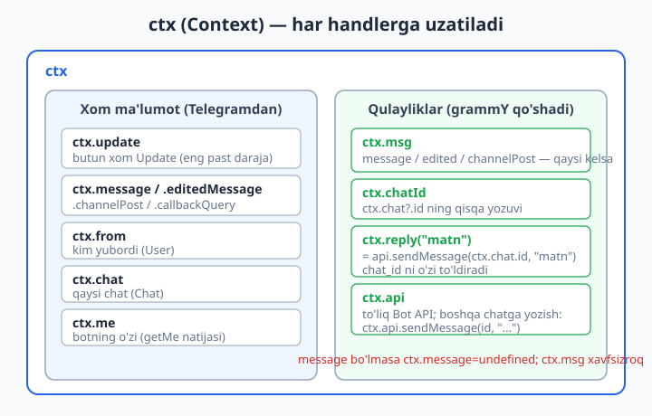
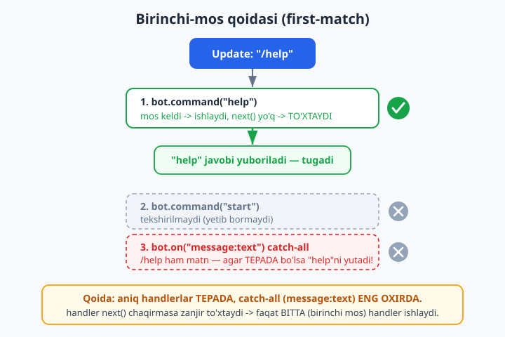
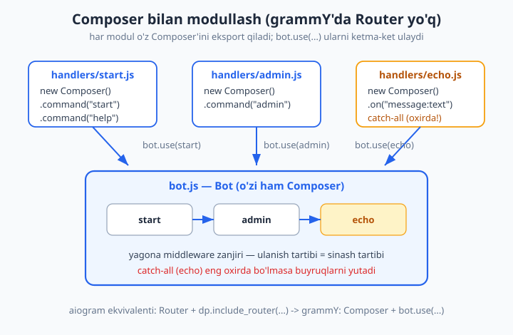

# 03 — Update'lar, handlerlar va Composer

[⬅️ Oldingi: 02 — Birinchi bot: echo va /start](./02-birinchi-bot.md) · [🏠 README](./README.md) · [Keyingi: 04 — Filtrlar va buyruqlar ➡️](./04-filtrlar-buyruqlar.md)

---

> **Bu bobda:** Telegramdan kelgan har bir hodisa — `Update` — botimizga qanday yetib kelishini va biz uni qanday qilib to'g'ri funksiyaga yo'naltirishimizni ochib beramiz. Asosiy tushunchalar: `ctx` (Context) obyekti anatomiyasi (`ctx.update`, `ctx.message`, `ctx.msg`, `ctx.from`, `ctx.chat`, `ctx.me`, `ctx.api`); grammY'da **handler aslida middleware** ekani (`bot.command`, `bot.on`, `bot.use` hammasi bitta zanjirga middleware qo'shadi); handlerlar **qaysi tartibda** sinalishini belgilovchi **birinchi-mos qoidasi** va `next()`ning roli; loyihani **Composer** bilan modullash (`new Composer()` + `bot.use(composer)`) — bu grammY'da Python aiogram'idagi `Router`ning ekvivalenti; va `bot.on(...)`ga turli **update turlari** (`message`, `edited_message`, `callback_query`, `channel_post`) berish. grammY'da aiogram'dagidek alohida `Router` klassi **yo'q** — uning o'rnida `Composer` bor, va eng muhimi: `Bot`ning o'zi ham `Composer`. Shuni tushunsangiz, qolgani joyiga tushadi.
>
> **Halollik eslatmasi:** bu bobdagi `ctx` maydonlari, middleware oqimi (`next()`), birinchi-mos qoidasi, Composer bilan modullash, bir nechta Composer ulash tartibi va update turlarini ajratish — hammasi **OFFLINE** (tokensiz, tarmoqsiz) `bot.handleUpdate(...)`ga soxta `Update` uzatib, chiqayotgan API chaqiruvlarini transformer bilan ushlab **haqiqatan ishga tushirib tekshirilgan** (`_verify_03.mjs`, 10/10 o'tdi). Faqat jonli `bot.start()` (polling), Telegramga real xabar yuborish va botni guruhga qo'shish kabi qadamlar `@BotFather` tokeni + internet talab qiladi — bular matnda "Illustrativ" deb belgilangan, "ishladi" deb soxta yozilmagan.

---

## Avval: Update, handler, Context — uchta tushuncha

02-bobda biz allaqachon handler yozdik:

```js
bot.command("start", (ctx) => ctx.reply("Salom!"));
```

Bu bir qatorda uchta tushuncha bor edi, lekin biz ularni atayin sodda qoldirgan edik. Endi har birini ochib beramiz.

- **Update** — Telegram serveridan kelgan bitta "hodisa". Foydalanuvchi xabar yozdi, tugma bosdi, xabarni tahrirladi — har biri bitta `Update` obyekti. U toza JSON: ichida `update_id` va bitta hodisa maydoni (`message`, `callback_query`, `edited_message`, ...) bo'ladi.
- **Handler** — bu shunchaki funksiya. Mos `Update` kelganda u chaqiriladi. Uning vazifasi — javob berish, bazaga yozish, fayl yuborish va h.k. grammY'da handler `(ctx) => {...}` ko'rinishida bo'ladi.
- **Context (`ctx`)** — har bir handlerga uzatiladigan obyekt. U kelgan `Update`ni va u bilan ishlash uchun barcha qulayliklarni (yorliqlar va `ctx.reply` kabi metodlar) bir joyga yig'adi.

Botimiz `bot.start()` (yoki keyingi boblarda `run(bot)`) bilan ishga tushganda, u Telegramdan `Update`'larni so'rab oladi va har birini ichki **middleware zanjiri**dan o'tkazadi. Mana shu zanjir — bobning yuragi. Lekin avval `ctx`ni yaxshilab tanishtiraylik, chunki har bir handler ichida siz aynan shu obyekt bilan ishlaysiz.

---

## `ctx` (Context) anatomiyasi

Har bir handler bitta argument oladi: `ctx`. Bu obyekt ikki qismdan iborat:

1. **Xom ma'lumot** — Telegramdan kelgan `Update` va bot haqidagi ma'lumot.
2. **Qulayliklar** — `ctx.reply(...)` kabi metodlar (kerakli `chat_id`ni o'zi to'ldiradi) va `ctx.msg`, `ctx.from` kabi yorliqlar.



Eng ko'p ishlatiladigan maydonlar:

| Maydon | Nima beradi | Eslatma |
| --- | --- | --- |
| `ctx.update` | Butun xom `Update` obyekti | Eng past daraja; kamdan-kam kerak bo'ladi |
| `ctx.message` | `update.message` (yangi xabar) | Tahrirlangan/kanal posti bo'lsa `undefined` |
| `ctx.editedMessage` | `update.edited_message` | Tahrirlangan xabar |
| `ctx.channelPost` | `update.channel_post` | Kanalga chiqarilgan post |
| `ctx.callbackQuery` | `update.callback_query` | Inline tugma bosilgani |
| `ctx.msg` | `message` **YOKI** `edited_message` **YOKI** `channel_post` ... | Qaysi biri kelgan bo'lsa — eng qulay umumiy yorliq |
| `ctx.from` | Xabar/hodisa yuborgan foydalanuvchi (`User`) | `ctx.from.id`, `ctx.from.first_name` |
| `ctx.chat` | Qaysi chatda sodir bo'ldi (`Chat`) | `ctx.chat.id`, `ctx.chat.type` |
| `ctx.chatId` | `ctx.chat?.id` ning qisqa yozuvi | Sonni tez olish uchun |
| `ctx.me` | Botning o'zi haqidagi ma'lumot (`getMe` natijasi) | `ctx.me.username` — botning useri |
| `ctx.api` | Telegram Bot API'ga to'g'ridan kirish | `ctx.api.sendMessage(chatId, "...")` |
| `ctx.match` | `command`/`hears` regex/argument mosligi | 04-bobda chuqur |

> **Eslatma:** `ctx.message` bilan `ctx.msg` farqini yaxshi tushunib oling. `ctx.message` **faqat** yangi xabar bo'lsa qiymat beradi — agar foydalanuvchi xabarni tahrirlagan bo'lsa, `ctx.message` `undefined`, lekin `ctx.editedMessage` to'lgan bo'ladi. `ctx.msg` esa — har qaysi kelgan bo'lsa o'shani qaytaradigan "aqlli" yorliq. Demak "qaysi turdan kelganidan qat'i nazar matnni olmoqchiman" desangiz, `ctx.msg.text` ishlatish xavfsizroq.

Buni amalda ko'raylik. Quyidagi handler kelgan xabardan barcha asosiy maydonlarni o'qiydi. **OFFLINE tekshirilgan**:

```js
bot.on("message:text", (ctx) => {
  console.log("update_id:", ctx.update.update_id);   // xom update
  console.log("matn:", ctx.message.text);            // ctx.message.text
  console.log("matn (msg):", ctx.msg.text);          // ctx.msg.text — bir xil
  console.log("kim yozdi:", ctx.from.id, ctx.from.first_name);
  console.log("qaysi chat:", ctx.chat.id, ctx.chat.type);
  console.log("chat id (qisqa):", ctx.chatId);
  console.log("botning o'zi:", ctx.me.username);      // masalan "test_bot"
  // ctx.api orqali boshqa chatga ham yozish mumkin (chat_id ni o'zingiz berasiz):
  // await ctx.api.sendMessage(boshqaChatId, "Salom!");
});
```

Tekshiruvda biz soxta `Update` yuborib, har bir maydon kutilgan qiymatni berishini `assert` qildik — `ctx.update`, `ctx.message.text`, `ctx.msg.text`, `ctx.from.id`, `ctx.chat.id`, `ctx.chatId`, `ctx.me.username` va `ctx.api.sendMessage` mavjudligi tasdiqlandi.

`ctx.msg` aniq edited_message uchun ham ishlashini alohida tekshirdik:

```js
bot.on("edited_message:text", (ctx) => {
  // ctx.message bu yerda undefined, lekin ctx.msg tahrirlangan matnni beradi
  console.log("tahrirlangan matn:", ctx.msg.text);
});
```

> **Diqqat:** `ctx.message`, `ctx.from`, `ctx.chat` ba'zan `undefined` bo'lishi mumkin (masalan, kanal postida `ctx.from` bo'lmasligi mumkin). Shuning uchun keng qamrovli `bot.on("message")` ichida `ctx.from.id`ni to'g'ridan o'qishdan oldin filter query bilan kerakli maydon borligini kafolatlash yaxshiroq — buni 04-bobda ko'ramiz. Hozircha `bot.on("message:text")` kabi aniqroq filtr ishlatamiz, u matn borligini kafolatlaydi.

### `ctx.reply` qayerdan keladi va `ctx.api`dan farqi nima

`ctx.reply("matn")` — bu aslida `ctx.api.sendMessage(ctx.chat.id, "matn")`ning qisqa yozuvi. grammY `chat_id`ni avtomatik kelgan chatdan oladi. Demak:

```js
// Bu ikkisi bir xil natija beradi (xuddi shu chatga javob):
ctx.reply("Salom!");
ctx.api.sendMessage(ctx.chat.id, "Salom!");
```

`ctx.api`ni qachon to'g'ridan ishlatamiz? Qachonki **boshqa** chatga yozmoqchi bo'lsangiz (masalan, admin guruhiga bildirishnoma): `ctx.api.sendMessage(ADMIN_CHAT_ID, "Yangi buyurtma!")`. Kelgan chatga javob bersangiz — har doim `ctx.reply` qulayroq va xatosizroq.

---

## Handler aslida middleware: `bot.use`, `bot.command`, `bot.on`

Bu — grammY'ni tushunishdagi eng muhim g'oya. **grammY'da hamma narsa middleware.**

Middleware — bu `(ctx, next) => {...}` ko'rinishidagi funksiya. U:

- `ctx` bilan biror ish qiladi (o'qiydi, javob beradi, log yozadi),
- so'ng `await next()` chaqirib **navbatni keyingi middleware'ga uzatadi** — yoki uzatmaydi (to'xtatadi).

`bot.command(...)`, `bot.on(...)`, `bot.hears(...)` — bularning hammasi aslida shunday middleware'ni zanjirga **qo'shadi**, faqat oldiga "shu shartga mos kelsagina ishla" degan filtr qo'yib. Handler — bu oxiridagi `next` chaqirmaydigan middleware, xolos.

Mana eng oddiy `bot.use` middleware. **OFFLINE tekshirilgan**:

```js
const log = [];

bot.use(async (ctx, next) => {
  log.push("mw-oldin");
  await next();              // navbatni keyingi handlerga uzatamiz
  log.push("mw-keyin");
});

bot.on("message:text", (ctx) => {
  log.push("handler");
});

// "salom" yuborilganda -> log === ["mw-oldin", "handler", "mw-keyin"]
```

E'tibor bering: `next()` chaqirilgandan keyin nazorat handlerga o'tdi (`"handler"`), handler tugagach **yana middleware ichiga qaytdi** (`"mw-keyin"`). Bu — "matryoshka" (ichma-ich) tuzilma: middleware handlerni o'rab oladi. Shuning uchun `bot.use` logging, autentifikatsiya, throttling kabi vazifalar uchun ideal — buni 09-bobda chuqur ko'ramiz.

### `next()` chaqirilmasa nima bo'ladi

Agar middleware `next()` chaqirmasa, **zanjir to'xtaydi** — keyingi handlerlarga umuman o'tilmaydi. **OFFLINE tekshirilgan**:

```js
const log = [];

bot.use((ctx) => {
  log.push("toxtatdi");       // next() YO'Q -> zanjir shu yerda tugaydi
});

bot.on("message:text", (ctx) => {
  log.push("handler");        // bu HECH QACHON ishlamaydi
});

// "salom" yuborilganda -> log === ["toxtatdi"]  (handler ishlamadi!)
```

Bu juda muhim amaliy oqibatga ega:

- **`bot.command`/`bot.on`/`bot.hears` handlerlari odatda `next()` chaqirmaydi** — ya'ni mos handler topildi, ish bajarildi, to'xtaymiz. Shuning uchun update'ga faqat **bitta** (birinchi mos) handler javob beradi.
- Agar siz update'ni o'rab, keyin baribir keyingi handlerlarga o'tkazmoqchi bo'lsangiz (masalan, har bir xabarni logga yozib, lekin baribir ishlovni davom ettirmoqchi bo'lsangiz), `bot.use` ichida `next()` chaqirishni **unutmang**. `next()`ni unutish — grammY'dagi eng ko'p uchraydigan xato ("nega keyingi handlerim ishlamayapti?").

---

## Birinchi-mos qoidasi: handlerlar qaysi tartibda sinaladi

Bu — eng ko'p chalkashlik keltiradigan mavzu, shuning uchun sekin boramiz.

grammY handlerlarni siz **ularni ro'yxatga olgan tartibda** (yuqoridan pastga) tekshiradi:

1. Birinchi middleware (handler)ning filtri tekshiriladi. Mos kelsa — **shu handler ishlaydi**. U `next()` chaqirmasa — **zanjir to'xtaydi**, qolgan handlerlarga o'tilmaydi.
2. Mos kelmasa (yoki `next()` chaqirilsa) — keyingisiga o'tadi.
3. Va hokazo.

Demak handler `next()` chaqirmas ekan (odatdagidek), **faqat bitta** handler — birinchi mos kelgani — ishlaydi. Bu **birinchi-mos qoidasi** (first-match).



Bu qoidaning eng muhim amaliy natijasi: **catch-all (hamma narsaga mos keluvchi) handlerni eng oxirga qo'ying**, aks holda u oldidagi aniqroq handlerlarni "yutib yuboradi".

Bu yerda nozik nuqta bor: Telegramda `/help` kabi buyruq **ham `message:text`ga ham mos keladi** (buyruq ham matnli xabar, faqat ichida `bot_command` entity bor). Demak agar `bot.on("message:text")` (catch-all) `bot.command("help")`dan **oldin** tursa, `/help` ham echo handlerga tushib ketadi.

Quyidagi kod ham xato, ham to'g'ri tartibni ko'rsatadi. **OFFLINE tekshirilgan**:

```js
// ✅ TO'G'RI TARTIB: aniq buyruq tepada, catch-all oxirda
bot.command("help", (ctx) => ctx.reply("Yordam: /start, /help"));
bot.on("message:text", (ctx) => ctx.reply("Echo: " + ctx.msg.text));
// "/help" -> "Yordam: ..."  (command ishladi, to'g'ri)

// ❌ XATO TARTIB: catch-all tepada
bot.on("message:text", (ctx) => ctx.reply("Echo: " + ctx.msg.text));  // hamma matnni ushlaydi
bot.command("help", (ctx) => ctx.reply("Yordam: ..."));               // yetib bormaydi!
// "/help" -> "Echo: /help"  (buyruq yutildi — XATO)
```

Tekshiruvda biz aynan shuni ko'rdik: to'g'ri tartibda `/help` -> `help` handleri, xato tartibda esa `/help` -> `echo` handleri ishladi. Buyruq matn handleri tomonidan "yutib yuborildi".

> **Eslatma — hech qaysi handler mos kelmasa:** hech narsa yomon bo'lmaydi. grammY update'ni shunchaki **e'tiborsiz qoldiradi** — xato (exception) chiqmaydi, bot ishlashda davom etadi. Masalan, faqat rasm yuborilsa-yu, sizda faqat `message:text` handleri bo'lsa, hech narsa chaqirilmaydi va bot tinch turaveradi.

### `bot.filter` bilan o'zingizning shartingiz

Agar tayyor filtrlar (`command`, `on`, `hears`) yetmasa, `bot.filter(predikat, handler)` bilan o'zingizning shartingizni yozasiz. Predikat `(ctx) => boolean` — `true` qaytarsa, handler ishlaydi:

```js
// Faqat ID'si 12345 bo'lgan admin uchun
bot.filter((ctx) => ctx.from?.id === 12345).command("admin", (ctx) =>
  ctx.reply("Admin paneli")
);
```

Bu filtr query'larning chuqur mavzusi 04-bobda. Hozircha bilib qo'ying: tartib qoidasi `filter` uchun ham bir xil — yuqoridan pastga, birinchi mos.

---

## Composer bilan modullash: grammY'da `Router` o'rniga

Hozirgacha hamma handler bitta faylda, bitta `bot` obyektiga yopishgan edi. Real botda bu mumkin emas — yuzlab handler bitta faylga sig'maydi. Boshqa freymvorklarda buning yechimi bor:

- Python **aiogram**'da bu `Router` (`@router.message(...)`, keyin `dp.include_router(router)`).
- grammY'da esa **`Router` klassi yo'q**. Uning o'rnida **`Composer`** bor.

`Composer` — bu "handlerlar to'plamini" o'zida saqlovchi obyekt. Siz unga xuddi `bot`dagidek `composer.command(...)`, `composer.on(...)`, `composer.use(...)` qo'shasiz, so'ng butun to'plamni bitta qator bilan botga ulaysiz: `bot.use(composer)`.

> **Eslatma — `Bot` ham `Composer`:** grammY'da `Bot` klassi `Composer`dan meros oladi. Ya'ni `bot.command(...)` va `composer.command(...)` — bir xil metod, faqat birinchisi bot ichidagi asosiy zanjirga, ikkinchisi alohida to'plamga qo'shadi. Shuning uchun "Composer" yangi narsa emas — siz uni 02-bobdan beri (`bot` orqali) ishlatib kelyapsiz, bilmagan holda.



Eng kichik misol. **OFFLINE tekshirilgan**:

```js
import { Composer } from "grammy";

const composer = new Composer();
composer.command("ping", (ctx) => ctx.reply("pong"));

bot.use(composer);   // butun to'plamni botga ulaymiz
// "/ping" -> "pong"
```

Tekshiruvda `/ping` yuborilganda `composer`dagi handler `sendMessage`ni `"pong"` matni bilan chaqirgani tasdiqlandi.

### Loyihani fayllarga bo'lish (modullar)

Endi haqiqiy foyda: har mavzuni **alohida faylga** ajratamiz, har faylda o'z `Composer`i bo'ladi, keyin hammasini `bot.js`da ulaymiz. Tipik tuzilma (11-bobda chuqurroq):

```text
loyiha/
├─ bot.js                   # Bot yaratish, modullarni ulash, bot.start()
└─ handlers/
   ├─ start.js              # /start, /help  (Composer eksport qiladi)
   ├─ admin.js              # admin buyruqlari
   └─ echo.js               # qolgan matnlar (catch-all)
```

**`handlers/start.js`** — modul o'z `Composer`ini yaratadi va eksport qiladi:

```js
import { Composer } from "grammy";

export const startComposer = new Composer();

startComposer.command("start", (ctx) => ctx.reply("Salom! Men grammY botiman."));
startComposer.command("help", (ctx) => ctx.reply("Buyruqlar: /start, /help"));
```

**`handlers/admin.js`:**

```js
import { Composer } from "grammy";

export const adminComposer = new Composer();

adminComposer.command("admin", (ctx) => ctx.reply("Admin paneli"));
```

**`handlers/echo.js`** — catch-all (eng oxirgi ulanadi):

```js
import { Composer } from "grammy";

export const echoComposer = new Composer();

echoComposer.on("message:text", (ctx) => ctx.reply("Echo: " + ctx.msg.text));
```

**`bot.js`** — modullarni **to'g'ri tartibda** ulaymiz:

```js
import { Bot } from "grammy";
import { startComposer } from "./handlers/start.js";
import { adminComposer } from "./handlers/admin.js";
import { echoComposer } from "./handlers/echo.js";

const bot = new Bot(process.env.BOT_TOKEN);   // token .env dan (02-bobda ko'rdik)

// TARTIB MUHIM: echo (catch-all) eng oxirda turishi kerak,
// aks holda u start/admin buyruqlarini yutib yuboradi.
bot.use(startComposer);
bot.use(adminComposer);
bot.use(echoComposer);

bot.start();   // jonli (Illustrativ — token + internet kerak)
```

> **Illustrativ:** yuqoridagi `bot.start()` — bu **jonli** qism. Uni haqiqatan ishlatish uchun `@BotFather`dan olingan token va internet kerak (tokensiz ishlamaydi). Ammo `start` -> `admin` -> `echo` tartibida **to'g'ri yo'naltirish** mantig'ini biz tokensiz ham tekshiramiz — keyingi bo'limda aynan shuni qildik.

### Bir nechta Composer: ulanish tartibi sinash navbatini belgilaydi

Bir necha Composer'ni botga ulaganda, ular **`bot.use` chaqirilgan tartibda** zanjirga qo'shiladi. Demak yuqoridagi `bot.js`dagi tartib aynan handler sinash navbatini belgilaydi. Buni **OFFLINE tekshirdik**:

```js
const start = new Composer();
start.command("start", (ctx) => log.push("start"));

const admin = new Composer();
admin.command("admin", (ctx) => log.push("admin"));

const echo = new Composer();
echo.on("message:text", (ctx) => log.push("echo"));   // catch-all oxirda

bot.use(start);
bot.use(admin);
bot.use(echo);

// "/admin"     -> log === ["admin"]
// "oddiy matn" -> log === ["echo"]
// "/start"     -> log === ["start"]
```

Hammasi kutilgandek ishladi: `/admin` faqat admin handlerga, oddiy matn faqat echo'ga, `/start` faqat start handlerga tushdi.

Endi xato tartibni ham ko'rsataylik — bu birinchi-mos qoidasining Composer darajasidagi ko'rinishi. Agar catch-all Composer'ni buyruq Composer'idan **oldin** ulasangiz, buyruqlar yutiladi. **OFFLINE tekshirilgan**:

```js
const echoFirst = new Composer();
echoFirst.on("message:text", (ctx) => log.push("echo"));   // catch-all

const cmds = new Composer();
cmds.command("start", (ctx) => log.push("start"));

bot.use(echoFirst);   // ❌ catch-all birinchi ulandi
bot.use(cmds);

// "/start" -> log === ["echo"]   (start yutildi!)
```

Demak xulosa bir xil: **catch-all modulni eng oxirga ulang.**

> **Anti-eskirish:** internetda grammY haqida ba'zan "Router" so'zini ko'rishingiz mumkin — bu odatda boshqa freymvork (Telegraf) yoki noto'g'ri tarjima. grammY'da modullash uchun yagona to'g'ri vosita — **`Composer`**. Bundan tashqari `bot.errorBoundary(...)` (09-bob), `bot.fork(...)` va `bot.lazy(...)` ham bor — bular Composer'ning ilg'or metodlari, keyingi boblarda ko'ramiz.

---

## `bot.on(...)`ga update turlari

Hozirgacha biz asosan `message`/`message:text` bilan ishladik. Lekin Telegram botga **ko'p turdagi hodisa** yuboradi va `bot.on(...)`ga turli **filter query**'lar berib, har birini alohida tutamiz.

Eng ko'p ishlatiladigan update turlari:

| Filter | Qachon keladi | `ctx`dagi maydon |
| --- | --- | --- |
| `"message"` | Yangi xabar (matn/foto/hujjat...) | `ctx.message` |
| `"message:text"` | Faqat matnli yangi xabar | `ctx.message.text` |
| `"edited_message"` | Avval yuborilgan xabar tahrirlandi | `ctx.editedMessage` |
| `"callback_query:data"` | Inline tugma bosildi | `ctx.callbackQuery.data` |
| `"channel_post"` | Kanalga post chiqdi | `ctx.channelPost` |
| `":photo"` | Rasm — `message` YOKI `channel_post` | `ctx.msg.photo` |
| `"my_chat_member"` | **Botning** a'zoligi o'zgardi (guruhga qo'shildi/chiqarildi) | `ctx.myChatMember` |
| `"chat_member"` | Boshqa a'zo holati o'zgardi (sozlash kerak) | `ctx.chatMember` |
| `"inline_query"` | Inline rejimda yozildi (`@bot ...`) | `ctx.inlineQuery` |

> Bu filtr query'larning to'liq grammatikasi — `:` bilan ajratilgan "kalit:qism" sintaksisi, `:photo` kabi update turi-mustaqil filtrlar — 04-bobning chuqur mavzusi. Hozircha shuni bilish kifoya: `bot.on(...)`ga turli string berib, turli hodisalarni ajratamiz.

Quyidagi kod uchta turdagi hodisani — `message`, `callback_query`, `channel_post` — alohida handlerlar bilan tutadi. **OFFLINE tekshirilgan**:

```js
bot.on("message", (ctx) => {
  // oddiy xabar
});

bot.on("callback_query:data", (ctx) => {
  // inline tugma bosilgani; bosilgan tugma ma'lumoti:
  const data = ctx.callbackQuery.data;
  // jonli botda: ctx.answerCallbackQuery() chaqirish SHART (07-bob) — Illustrativ
});

bot.on("channel_post", (ctx) => {
  // kanalga post chiqdi (ctx.channelPost)
});
```

Tekshiruvda soxta `message`, `callback_query` va `channel_post` update'larini yuborib, har biri **faqat o'z** handleriga tushishini `assert` qildik. E'tibor bering: `callback_query` handlerida `ctx.message` emas, `ctx.callbackQuery` ishlatiladi — har update turining o'z maydoni bor. `ctx.msg` esa bularning ko'pini (xabar, edited, kanal post) birlashtirib beradi, lekin `callback_query`ni emas (u "xabar" emas).

> **Diqqat — `my_chat_member` vs `chat_member`:** `my_chat_member` har doim keladi va aynan **bot**ning holatini bildiradi (guruhga qo'shildi, admin qilindi, blok qilindi). `chat_member` esa **boshqa** a'zolar haqida bo'lib, uni olish uchun jonli `bot.start({ allowed_updates: [...] })`ni alohida sozlash kerak. Bu jonli sozlama (Illustrativ); guruh/moderatsiya mavzulari 19-20 boblarda chuqur ochiladi.

---

## Composer ichida middleware: `use` + `command` birga

Composer faqat handler to'plami emas — uning ichida ham `use` middleware ishlaydi. Bu bir modulga "lokal" middleware (masalan, faqat shu modul uchun audit/log) qo'shishga imkon beradi. **OFFLINE tekshirilgan**:

```js
const c = new Composer();

// Bu middleware faqat shu Composer ichidagi handlerlardan oldin ishlaydi
c.use(async (ctx, next) => {
  console.log("audit: shu modulga update keldi");
  await next();                 // navbatni keyingi handlerga uzatamiz
});

c.command("ping", (ctx) => ctx.reply("pong"));

bot.use(c);
// "/ping" -> avval "audit" log, keyin "pong"
```

Tekshiruvda `/ping` yuborilganda avval audit middleware, keyin `ping` handler ishlagani (`["audit", "ping"]` tartibida) tasdiqlandi. Bu — middleware'ni modul darajasida cheklashning sodda usuli; chuqur versiyasi (`errorBoundary`, throttling) 09-bobda.

---

## aiogram bilan solishtirma (Python ekvivalenti)

Agar siz Python tomonida [aiogram kitobi](../tgbot-python/03-handlerlar-router.md)ni o'qigan bo'lsangiz, tushunchalar deyarli bir xil, faqat nomlar boshqacha:

| Tushuncha | aiogram (Python) | grammY (JS) |
| --- | --- | --- |
| Hodisa ma'lumoti | `Message`, `CallbackQuery` argumenti | bitta `ctx` obyekti |
| Handler ulash | `@router.message(...)` dekorator | `bot.command(...)` / `bot.on(...)` |
| Modullash | `Router` + `dp.include_router(r)` | `Composer` + `bot.use(composer)` |
| Eng yuqori dispetcher | `Dispatcher` (`dp`) | `Bot` (`Composer`dan meros) |
| Update yuborish (test) | `dp.feed_update(bot, update)` | `bot.handleUpdate(update)` |
| Birinchi-mos qoidasi | bor (yozilish tartibida) | bor (yozilish tartibida) |
| Catch-all oxirda | shart | shart |

Eng katta farq: aiogram'da `Router` va `Dispatcher` ikki alohida klass; grammY'da esa `Bot`ning **o'zi** `Composer`, shuning uchun "kichik dispetcher" tushunchasi yo'q — bitta zanjir, modullarni `bot.use` bilan ulaysiz. JavaScript asoslari (`async/await`, ESM `import`) bo'yicha [JavaScript kitobi](../js/README.md), Node muhiti uchun [Node.js kitobi](../nodejs/README.md) yordam beradi.

---

## Tez-tez uchraydigan xatolar

| Xato | Sabab | Yechim |
| --- | --- | --- |
| "Aniq buyruq handlerim ishlamayapti, har doim echo chiqadi" | `bot.on("message:text")` (catch-all) `bot.command(...)`dan oldin yozilgan | Aniq handlerlarni tepaga, catch-all'ni eng oxirga qo'ying |
| "`bot.use` middleware'imdan keyin handler ishlamayapti" | Middleware ichida `next()` chaqirilmagan | `await next()` qo'shing (yoki ataylab to'xtatmoqchi bo'lsangiz qoldiring) |
| "`ctx.message.text` bazan `undefined`" | Update `edited_message`/`channel_post` bo'lishi mumkin | `ctx.msg.text` ishlating yoki `bot.on("message:text")` filtr qo'ying |
| "`ctx.from` `undefined` xato beradi" | Kanal posti yoki anonim adminda `from` bo'lmaydi | `ctx.from?.id` (optional chaining) yoki aniq filtr ishlating |
| "Telegraf'dagi `bot.on("text")` ishlamadi" | grammY'da filtr boshqacha | `bot.on("message:text")` (grammY filter query) |
| "grammY'da `Router` topa olmadim" | grammY'da `Router` klassi yo'q | `Composer` ishlating: `new Composer()` + `bot.use(...)` |
| "Boshqa chatga `ctx.reply` ishlamadi" | `ctx.reply` faqat kelgan chatga yozadi | Boshqa chatga: `ctx.api.sendMessage(boshqaChatId, "...")` |

---

## Mashqlar

> Hammasini **OFFLINE** bajaring. Naqsh: soxta `new Bot("12345:FAKE")`, `bot.botInfo`ni qo'lda bering (init tarmoqqa chiqmasligi uchun), `bot.api.config.use(transformer)` bilan API chaqiruvlarni ushlang, so'ng `bot.handleUpdate(soxtaUpdate)` yuboring. Handler ichida `ctx.reply` o'rniga `log`ga yozsangiz (yoki transformer'dagi `calls`ni tekshirsangiz) ham bo'ladi. **Eslang:** buyruq (`/start`) update'iga `entities:[{type:"bot_command",offset:0,length:N}]` SHART — aks holda `bot.command` mos kelmaydi.
>
> Yordamchi naqsh (`_verify_03.mjs`dan):
>
> ```js
> import { Bot, Composer } from "grammy";
> import assert from "node:assert/strict";
>
> function makeBot() {
>   const bot = new Bot("12345:FAKE-OFFLINE-TOKEN");
>   bot.botInfo = { id: 12345, is_bot: true, first_name: "T", username: "test_bot",
>     can_join_groups: true, can_read_all_group_messages: false,
>     supports_inline_queries: false, can_connect_to_business: false, has_main_web_app: false };
>   const calls = [];
>   bot.api.config.use((prev, method, payload) => {
>     calls.push({ method, payload });
>     if (method === "sendMessage") return Promise.resolve({ ok: true,
>       result: { message_id: 1, date: 0, chat: { id: payload.chat_id, type: "private" }, text: payload.text } });
>     return Promise.resolve({ ok: true, result: true });
>   });
>   return { bot, calls };
> }
>
> function mkMsg(text, id = 1) {
>   const message = { message_id: id, date: 0, text,
>     chat: { id: 777, type: "private" }, from: { id: 777, is_bot: false, first_name: "Ali" } };
>   if (text.startsWith("/")) message.entities = [{ type: "bot_command", offset: 0, length: text.split(/\s/)[0].length }];
>   return { update_id: id, message };
> }
> ```

### Oson

1. Bitta `bot.command("start", ...)` handler yozing. Soxta `/start` update'ini `bot.handleUpdate` bilan yuboring va `calls[0].payload.text` kutgan matniga tengligini `assert` qiling.
2. `bot.on("message:text", ...)` echo handler qo'shing: u `ctx.msg.text`ni qaytarsin. `"salom"` yuboring va echo `"Echo: salom"` (yoki o'zingiz tanlagan format) yuborganini tasdiqlang.
3. Bitta handler ichida `ctx.update.update_id`, `ctx.from.id`, `ctx.chat.id`, `ctx.me.username` qiymatlarini o'qing va ularni bir `seen` obyektga yozing. Soxta update yuborib, har bir qiymatni `assert` bilan tekshiring.
4. `ctx.reply("x")` va `ctx.api.sendMessage(ctx.chat.id, "x")` ikkalasi ham `calls`da `sendMessage` paydo qilishini ko'rsating (ikki marta yuboring, `calls.length === 2`).
5. Telegraf uslubidagi `bot.on("text", ...)` qatorini grammY'ga to'g'ri tarzda qayta yozing. Nima o'zgarganini bir jumlada izohlang.

### O'rta

6. `bot.use` middleware yozing: u `log`ga `"oldin"` yozsin, `await next()` chaqirsin, keyin `"keyin"` yozsin. Undan keyin `bot.on("message:text")` handler `"handler"` yozsin. Yuborib, `log === ["oldin", "handler", "keyin"]` ekanini tasdiqlang.
7. Yuqoridagi middleware'dan `next()`ni olib tashlang. Endi handler **ishlamasligini** (`log === ["oldin"]`) `assert` bilan ko'rsating.
8. Ikkita handler yozing: `bot.command("help", ...)` (tepada) va `bot.on("message:text", ...)` (pastda). `/help` yuborganda faqat command handleri ishlashini tasdiqlang. So'ng tartibni teskari qiling va `/help` echo'ga tushib ketishini (buyruq yutilishini) ko'rsating.
9. `Composer` yarating, unga `composer.command("ping", (ctx) => ctx.reply("pong"))` qo'shing, `bot.use(composer)` qiling. `/ping` yuborib, `calls[0].payload.text === "pong"` ekanini tekshiring.
10. Uchta Composer yarating: `startC` (`/start`), `adminC` (`/admin`), `echoC` (`message:text`). To'g'ri tartibda ulang. `/admin`, oddiy matn va `/start` yuborib, har biri faqat o'z handleriga tushishini `assert` qiling.

### Qiyin

11. `callback_query:data` uchun handler yozing: bosilgan `ctx.callbackQuery.data`ni `log`ga yozsin. Soxta `callback_query` update yasab (`id`, `from`, `chat_instance`, `data`, `message` maydonlari bilan) yuboring va to'g'ri ma'lumot olinganini tasdiqlang.
12. `message`, `edited_message:text` va `channel_post` uchun uchta handlerli bitta bot yozing. Uch xil soxta update yuborib, har biri faqat o'z handleriga tushishini `assert` qiling. (Maslahat: `edited_message`'da `edit_date`, `channel_post`'da `chat.type === "channel"` qo'ying.)
13. Composer ichida lokal middleware sinang: `composer.use(audit -> next)` keyin `composer.command("ping", ...)`. `/ping` yuborilganda `log === ["audit", "ping"]` tartibida bo'lishini tasdiqlang. So'ng `audit` ichidan `next()`ni olib tashlab, `ping`ning ishlamasligini (`log === ["audit"]`) ko'rsating.

<details markdown="1"><summary>Yechimlar</summary>

Quyidagi yechimlar yuqoridagi `makeBot()` / `mkMsg()` yordamchilaridan foydalanadi (har faylning boshida import + o'sha ikki funksiyani qo'ying).

**1.**

```js
const { bot, calls } = makeBot();
bot.command("start", (ctx) => ctx.reply("Salom!"));
await bot.handleUpdate(mkMsg("/start"));
assert.equal(calls[0].method, "sendMessage");
assert.equal(calls[0].payload.text, "Salom!");
console.log("OK 1");
```

**2.**

```js
const { bot, calls } = makeBot();
bot.on("message:text", (ctx) => ctx.reply("Echo: " + ctx.msg.text));
await bot.handleUpdate(mkMsg("salom"));
assert.equal(calls[0].payload.text, "Echo: salom");
console.log("OK 2");
```

**3.**

```js
const { bot } = makeBot();
const seen = {};
bot.on("message:text", (ctx) => {
  seen.updateId = ctx.update.update_id;
  seen.fromId = ctx.from.id;
  seen.chatId = ctx.chat.id;
  seen.me = ctx.me.username;
});
await bot.handleUpdate(mkMsg("salom", 5));
assert.equal(seen.updateId, 5);
assert.equal(seen.fromId, 777);
assert.equal(seen.chatId, 777);
assert.equal(seen.me, "test_bot");
console.log("OK 3");
```

**4.**

```js
const { bot, calls } = makeBot();
bot.on("message:text", (ctx) => {
  ctx.reply("a");                                  // ctx.reply orqali
  return ctx.api.sendMessage(ctx.chat.id, "b");    // ctx.api orqali
});
await bot.handleUpdate(mkMsg("salom"));
assert.equal(calls.length, 2);
assert.equal(calls[0].method, "sendMessage");
assert.equal(calls[1].method, "sendMessage");
console.log("OK 4");
```

Ikkalasi ham `sendMessage`ga aylanadi; `ctx.reply` shunchaki `chat_id`ni o'zi to'ldiradi.

**5.** Telegraf (eskirgan/boshqa freymvork): `bot.on("text", ...)`. grammY (to'g'ri):

```js
bot.on("message:text", (ctx) => ctx.reply(ctx.msg.text));
```

O'zgargani: grammY'da update turi va sub-maydon `:` bilan beriladi (`message:text`) — bu **filter query**; `"text"` yolg'iz grammY'da to'g'ri filtr emas.

**6.**

```js
const { bot } = makeBot();
const log = [];
bot.use(async (ctx, next) => { log.push("oldin"); await next(); log.push("keyin"); });
bot.on("message:text", (ctx) => { log.push("handler"); });
await bot.handleUpdate(mkMsg("salom"));
assert.deepEqual(log, ["oldin", "handler", "keyin"]);
console.log("OK 6");
```

**7.**

```js
const { bot } = makeBot();
const log = [];
bot.use((ctx) => { log.push("oldin"); /* next() YO'Q */ });
bot.on("message:text", (ctx) => { log.push("handler"); });
await bot.handleUpdate(mkMsg("salom"));
assert.deepEqual(log, ["oldin"]);   // handler ishlamadi
console.log("OK 7");
```

`next()` chaqirilmagani uchun zanjir to'xtadi.

**8.**

```js
// To'g'ri tartib
const good = makeBot(); const g = [];
good.bot.command("help", (ctx) => g.push("help"));
good.bot.on("message:text", (ctx) => g.push("echo"));
await good.bot.handleUpdate(mkMsg("/help", 1));
assert.deepEqual(g, ["help"]);

// Teskari (xato) tartib
const bad = makeBot(); const b = [];
bad.bot.on("message:text", (ctx) => b.push("echo"));   // catch-all tepada
bad.bot.command("help", (ctx) => b.push("help"));
await bad.bot.handleUpdate(mkMsg("/help", 2));
assert.deepEqual(b, ["echo"]);   // buyruq yutildi
console.log("OK 8");
```

**9.**

```js
import { Composer } from "grammy";
const { bot, calls } = makeBot();
const composer = new Composer();
composer.command("ping", (ctx) => ctx.reply("pong"));
bot.use(composer);
await bot.handleUpdate(mkMsg("/ping"));
assert.equal(calls[0].payload.text, "pong");
console.log("OK 9");
```

**10.**

```js
import { Composer } from "grammy";
const { bot } = makeBot();
const log = [];
const startC = new Composer(); startC.command("start", (ctx) => log.push("start"));
const adminC = new Composer(); adminC.command("admin", (ctx) => log.push("admin"));
const echoC  = new Composer(); echoC.on("message:text", (ctx) => log.push("echo"));
bot.use(startC); bot.use(adminC); bot.use(echoC);   // echo oxirda

log.length = 0; await bot.handleUpdate(mkMsg("/admin", 1)); assert.deepEqual(log, ["admin"]);
log.length = 0; await bot.handleUpdate(mkMsg("matn", 2));   assert.deepEqual(log, ["echo"]);
log.length = 0; await bot.handleUpdate(mkMsg("/start", 3)); assert.deepEqual(log, ["start"]);
console.log("OK 10");
```

**11.**

```js
const { bot } = makeBot();
const log = [];
bot.on("callback_query:data", (ctx) => log.push("cb:" + ctx.callbackQuery.data));
await bot.handleUpdate({
  update_id: 1,
  callback_query: {
    id: "cb1", from: { id: 777, is_bot: false, first_name: "Ali" },
    chat_instance: "x", data: "tasdiq",
    message: { message_id: 1, date: 0, chat: { id: 777, type: "private" } },
  },
});
assert.deepEqual(log, ["cb:tasdiq"]);
console.log("OK 11");
```

`callback_query` handlerida `ctx.message` emas, `ctx.callbackQuery` ishlatiladi.

**12.**

```js
const { bot } = makeBot();
const log = [];
bot.on("message", (ctx) => log.push("message"));
bot.on("edited_message:text", (ctx) => log.push("edited:" + ctx.msg.text));
bot.on("channel_post", (ctx) => log.push("channel"));

log.length = 0; await bot.handleUpdate(mkMsg("salom", 1)); assert.deepEqual(log, ["message"]);

log.length = 0;
await bot.handleUpdate({
  update_id: 2,
  edited_message: { message_id: 1, date: 0, edit_date: 1, text: "tuzatildi",
    chat: { id: 777, type: "private" }, from: { id: 777, is_bot: false, first_name: "Ali" } },
});
assert.deepEqual(log, ["edited:tuzatildi"]);

log.length = 0;
await bot.handleUpdate({
  update_id: 3,
  channel_post: { message_id: 1, date: 0, text: "post",
    chat: { id: -100, type: "channel", title: "Kanal" } },
});
assert.deepEqual(log, ["channel"]);
console.log("OK 12");
```

Har update turi faqat o'z handleriga tushdi. E'tibor: `edited_message`'da matnni `ctx.msg.text` orqali oldik.

**13.**

```js
import { Composer } from "grammy";

// (a) audit next() bilan -> ping ishlaydi
const c1 = makeBot(); const log1 = [];
const comp1 = new Composer();
comp1.use(async (ctx, next) => { log1.push("audit"); await next(); });
comp1.command("ping", (ctx) => log1.push("ping"));
c1.bot.use(comp1);
await c1.bot.handleUpdate(mkMsg("/ping", 1));
assert.deepEqual(log1, ["audit", "ping"]);

// (b) audit next() SIZ -> ping ishlamaydi
const c2 = makeBot(); const log2 = [];
const comp2 = new Composer();
comp2.use((ctx) => { log2.push("audit"); /* next() YO'Q */ });
comp2.command("ping", (ctx) => log2.push("ping"));
c2.bot.use(comp2);
await c2.bot.handleUpdate(mkMsg("/ping", 2));
assert.deepEqual(log2, ["audit"]);   // ping ishlamadi
console.log("OK 13");
```

(a)da `next()` zanjirni davom ettirdi, (b)da uning yo'qligi `ping`ni to'xtatdi — Composer ichida ham middleware oqimi bir xil ishlaydi.

</details>

---

[⬅️ Oldingi: 02 — Birinchi bot: echo va /start](./02-birinchi-bot.md) · [🏠 README](./README.md) · [Keyingi: 04 — Filtrlar va buyruqlar ➡️](./04-filtrlar-buyruqlar.md)
