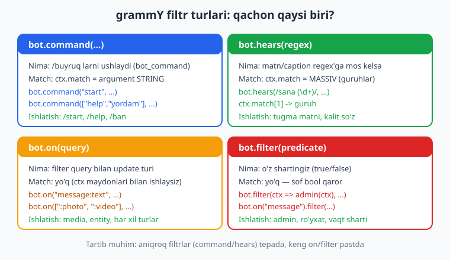
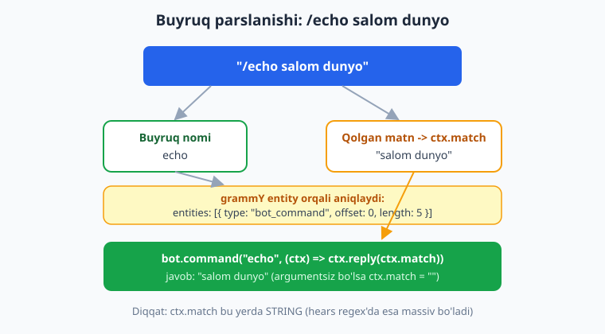
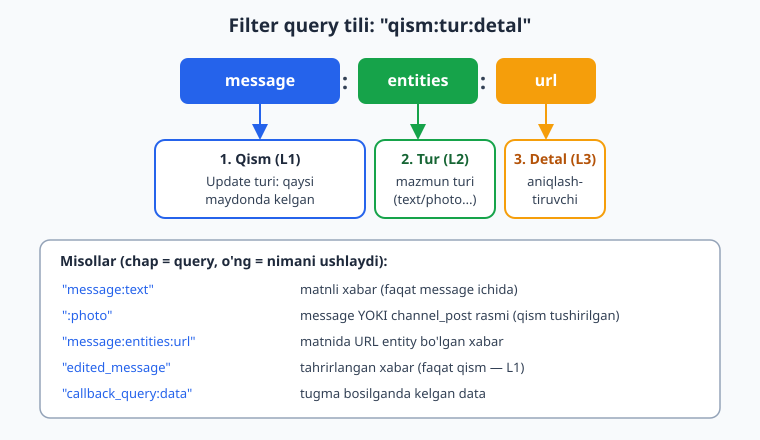

# 04 — Filtrlar va buyruqlar (filter queries)

[⬅️ Oldingi: 03 — Update'lar, handlerlar va Composer](./03-handlerlar-composer.md) · [🏠 README](./README.md) · [Keyingi: 05 — Xabar yuborish, formatlash va media ➡️](./05-xabar-formatlash-media.md)

---

> **Bu bobda:** grammY'ning eng kuchli va o'ziga xos xususiyati — **filter query** tili bilan tanishamiz. Avval `bot.command` ni chuqur ko'ramiz: bitta nom, bir nechta nom (alias), `/start` ning **deep-link payload**'i (`ctx.match`), guruhdagi `/buyruq@botusername` shakli. So'ng buyruq **argumentlarini** `ctx.match` orqali (string) va `bot.hears(regex)` orqali — bu yerda `ctx.match` **massiv** (regex guruhlari) — ajratamiz. Keyin filter query tilini ("qism:tur:detal" uch bo'lakli sintaksis) o'rganamiz: `bot.on("message:text")`, `"message:photo"`, `":photo"` (message yoki channel_post), `"message:entities:url"`, `"edited_message"`, hamda bir nechta query'ni massiv bilan birga ushlash. `ctx.has.*` / `ctx.hasText` bilan handler ichida shartli tekshiruv qilamiz va maxsus `bot.filter(predicate)` bilan o'z shartimizni (masalan faqat adminlar) yozamiz. Yakunda `bot.command`, `bot.hears`, `bot.on` va `bot.filter` farqini hamda **handler tartibining** muhimligini mustahkamlaymiz.
>
> **Halollik eslatmasi:** Bu bobdagi BARCHA handler-routing va filtr mantig'i — `bot.command` (alias, payload, `@username`), `bot.hears` regex, filter query'lar (`message:text`, `:text`, `message:photo`, `message:entities:url`, `edited_message`, massiv query), `ctx.match`, `ctx.has`/`ctx.hasText`, `bot.filter` va `Composer.filter` — **offline ishga tushirib tasdiqlangan** (soxta token + `bot.handleUpdate` ga mock `Update` uzatib, chiqayotgan API chaqiruvlarini transformer bilan ushlab, jami **18 ta tekshiruv o'tdi**). Faqat handler ichidagi `ctx.reply(...)` jonli Telegram'ga javob yuboradi — uni real ko'rish uchun `@BotFather` token + internet kerak; bunday joylar "illustrativ" deb belgilangan.

---

## 1. Filtr nima va nega kerak?

03-bobda handler — bu `bot.command`, `bot.on`, `bot.hears` kabi metodlarga berilgan, update kelganda ishlaydigan funksiya ekanini ko'rdik. Lekin har bir handler **hamma** update'ga emas, **faqat o'ziga tegishli** update'ga ishlashi kerak. `/start` buyrug'ini bitta handler, "salom" matnini boshqasi, rasmni uchinchisi ushlashi lozim.

Ana shu "kim qaysi update'ni oladi?" degan savolga **filtr** javob beradi. Har bir registratsiya metodi — `bot.command("start", ...)`, `bot.on("message:photo", ...)` — aslida **handler + filtr** juftligi. grammY update kelganda handlerlarni **yuqoridan pastga** tartib bilan ko'rib chiqadi va filtri **mos kelgan birinchi** handlerni ishga tushiradi. Mos handler `next()` chaqirmasa, qolganlari umuman ko'rilmaydi.

> **Eslatma — bu 03-bobning davomi.** Handler tartibi, `next()`, `Composer` va middleware daraxti haqida 03-bobda batafsil gaplashdik. Bu bobda esa **filtrlarning o'zini** — qaysi filtr nimani ushlashini — chuqur o'rganamiz.

grammY'da filtrni belgilashning to'rt asosiy yo'li bor, va ularning har biri o'z vazifasiga ega:



- **`bot.command(...)`** — `/buyruq` shaklidagi buyruqlarni ushlaydi;
- **`bot.hears(regex)`** — matn (yoki caption) regular ifodaga mos kelsa;
- **`bot.on(query)`** — **filter query** bilan update turini ushlaydi (grammY'ning yuragi);
- **`bot.filter(predicate)`** — o'zingiz yozgan `true`/`false` shart.

Bu bobda to'rttasini ham birma-bir, chuqur ko'rib chiqamiz. Avval eng tanish — buyruqlardan boshlaymiz.

> **Anti-eskirish:** Internetda Telegram bot misollarining ko'pi **Telegraf** yoki **node-telegram-bot-api** uchun yozilgan. U yerdagi `bot.on("text")` (qo'shtirnoqsiz "text"), `bot.onText(/.../, ...)`, `bot.command` siz `bot.hears` — bularning hammasi **grammY'da boshqacha** yoki umuman yo'q. Bu bobdagi idiomalar grammY 1.x uchun va offline tasdiqlangan.

---

## 2. `bot.command` — buyruqlarni ushlash

Telegram'da buyruq — `/` bilan boshlanadigan so'z: `/start`, `/help`, `/ban`. grammY ularni `bot.command` bilan ushlaydi.

Eng oddiy holat — bitta buyruq:

```js
bot.command("help", (ctx) => ctx.reply("Bu yordam bo'limi."));
```

Bu handler `/help` yozilganda ishlaydi. `command("help")` ichida `/` **yozilmaydi** — prefiks avtomatik. Agar adashib `bot.command("/help", ...)` deb yozsangiz, grammY hech qachon mos topa olmaydi (chunki u "/help" nomli buyruqni `//help` deb izlaydi).

> **Eslatma — buyruqni qanday aniqlanadi.** Telegram `/start` ni oddiy matn emas, balki maxsus **entity** sifatida belgilaydi: xabarda `entities: [{ type: "bot_command", offset: 0, length: 6 }]` bo'ladi. `bot.command` aynan shu `bot_command` entity'sini qidiradi. (Offline test qilganda mock update'ga bu entity'ni qo'lda qo'shish kerak — buni 8-bo'limda ko'rasiz.)

### Bir nechta nom (alias)

Bir buyruqning bir nechta nomi bo'lishi mumkin — masalan o'zbekcha va inglizcha. Massiv beramiz:

```js
bot.command(["help", "yordam"], (ctx) => ctx.reply("Yordam / Help"));
```

Endi `/help` ham, `/yordam` ham shu handlerga tushadi. (Offline tasdiqlandi: ikkala buyruqqa ham bir xil javob keldi.)

### `/buyruq@botusername` — guruhdagi shakl

Guruhlarda bir nechta bot bo'lishi mumkin, shuning uchun foydalanuvchilar ko'pincha botni nomi bilan chaqiradi: `/help@MyBot`. grammY buni **avtomatik** to'g'ri ishlatadi — `bot.command("help", ...)` `/help@MyBot` ni ham ushlaydi (agar `MyBot` sizning botingiz bo'lsa). Boshqa botga mo'ljallangan `/help@OtherBot` esa **e'tiborsiz** qoldiriladi.

```js
// Guruhda /help@MyBot -> ishlaydi (MyBot — biznikidan)
// Guruhda /help@OtherBot -> ishlamaydi (boshqa botga tegishli)
bot.command("help", (ctx) => ctx.reply("Yordam"));
```

> **Diqqat:** grammY botning username'ini `botInfo` dan oladi. Jonli botda u `bot.start()` paytida `getMe` orqali avtomatik olinadi. Shuning uchun `@username` filtri to'g'ri ishlashi uchun bot ishga tushgan (yoki `botInfo` qo'lda berilgan) bo'lishi kerak.

---

## 3. Buyruq argumentlari — `ctx.match` (string)

Foydalanuvchi `/echo salom dunyo` deb yozsa, `salom dunyo` qismi — bu **argument**. grammY buyruq argumentini `ctx.match` ga **string** sifatida qo'yadi:

```js
bot.command("echo", (ctx) => ctx.reply(ctx.match));
```

- `/echo salom dunyo` -> `ctx.match === "salom dunyo"` -> bot "salom dunyo" deb javob beradi;
- `/echo` (argumentsiz) -> `ctx.match === ""` (bo'sh string).



Argument bo'sh bo'lsa, foydalanuvchiga ko'rsatma berish odatiy amaliyot:

```js
bot.command("echo", (ctx) => {
  if (!ctx.match) {
    return ctx.reply("Foydalanish: /echo <matn>");
  }
  return ctx.reply(ctx.match);
});
```

`ctx.match` — bu buyruqdan keyingi **butun matn** (birinchi bo'sh joydan keyingi hammasi, kesilmagan holda). Uni qismlarga bo'lish kerak bo'lsa, oddiy JavaScript'da `split` ishlatamiz:

```js
bot.command("give", (ctx) => {
  // "/give @ali 100 oltin" -> ctx.match = "@ali 100 oltin"
  const qismlar = ctx.match.split(/\s+/);   // ["@ali", "100", "oltin"]
  if (qismlar.length < 3) {
    return ctx.reply("Format: /give <kim> <miqdor> <nima>");
  }
  const [kim, miqdorStr, ...qoldiq] = qismlar;
  const nima = qoldiq.join(" ");
  const miqdor = Number(miqdorStr);
  if (!Number.isInteger(miqdor)) {
    return ctx.reply("Miqdor butun son bo'lishi kerak.");
  }
  return ctx.reply(`${kim} ga ${miqdor} ${nima} berildi.`);
});
```

> **Diqqat — `ctx.match` ning ikki yuzi.** `bot.command` da `ctx.match` — **string** (argument). Lekin `bot.hears(regex)` da `ctx.match` — **massiv** (regex natijasi). Bir xil nom, ikki xil tur. Buni 5-bo'limda ko'ramiz va aralashtirib yubormang.

---

## 4. Deep-link payload — `/start PAYLOAD`

`/start` — har bir bot uchun eng birinchi va eng muhim buyruq. Foydalanuvchi botni ochganda Telegram avtomatik shu buyruqni yuboradi. Eng qizig'i — `/start` ga **payload** (qo'shimcha ma'lumot) biriktirib yuborish mumkin.

### Deep-link nima?

Deep-link — bu `https://t.me/MyBot?start=PAYLOAD` ko'rinishidagi havola. Foydalanuvchi shu havolani bossa, Telegram botga `/start PAYLOAD` ni yuboradi. Demak, botga **qaerdan kelgani haqida ma'lumot bilan** kirish mumkin:

- **Referal tizim** — kim kimni taklif qilganini bilish (`?start=ref_12345`);
- **Mahsulot havolasi** — qaysi mahsulotdan kelganini bilish;
- **QR kod / aksiya kodi** — bir martalik kod uzatish;
- **Saytdan botga login** — bir martalik token.

Payload `bot.command` argumenti bilan **bir xil mexanizm** orqali keladi — ya'ni `ctx.match`:

```js
bot.command("start", (ctx) => {
  if (ctx.match) {
    // /start ref_oqil123 -> ctx.match === "ref_oqil123"
    return ctx.reply("Siz havola orqali keldingiz: " + ctx.match);
  }
  // Oddiy /start (payloadsiz)
  return ctx.reply("Botga xush kelibsiz! /help — yordam.");
});
```

(Offline tasdiqlandi: `/start ref_oqil123` -> `ctx.match === "ref_oqil123"`; oddiy `/start` -> `ctx.match === ""`.)

> **Eslatma — payload cheklovi.** Telegram `start` payload'iga faqat `A-Z a-z 0-9 _ -` belgilarini va eng ko'pi 64 ta belgini ruxsat beradi. Agar payload'da maxsus belgilar (bo'sh joy, `/`, `=`) bo'lsa, uni **base64url** bilan kodlash kerak. Node'da buni qo'lda qilamiz:

```js
// Yaratuvchi tomon (sayt/boshqa joy):
const payload = Buffer.from("product=42&ref=oqil").toString("base64url");
const link = `https://t.me/MyBot?start=${payload}`;   // illustrativ havola

// Bot tomonida ochish:
bot.command("start", (ctx) => {
  if (!ctx.match) return ctx.reply("Xush kelibsiz!");
  const ochilgan = Buffer.from(ctx.match, "base64url").toString("utf8");
  return ctx.reply("Ochilgan payload: " + ochilgan);   // "product=42&ref=oqil"
});
```

> **Illustrativ:** Havolaning **o'zini** (`https://t.me/...`) yaratish bot username'ini talab qiladi. Username'ni jonli botda `ctx.me.username` (yoki `bot.botInfo.username`) dan olasiz; bu qiymat token + internet bilan `getMe` orqali to'ldiriladi. Payload'ni kodlash/ochish esa (yuqorida) sof Node `Buffer` bilan, **tokensiz** ishlaydi.

Cross-link: deep-link payload'ini bazaga yozish (kim kimni taklif qilganini saqlash) uchun [Sessiya va ma'lumotlar bazasi (10-bob)](./10-sessiya-malumotlar-bazasi.md) hamda [SQL qo'llanmasi](../sql/README.md) ga qarang. Python/aiogram'da bu mavzu `CommandStart(deep_link=True)` bilan ishlaydi — solishtirish uchun [tgbot-python kitobi](../tgbot-python/README.md).

---

## 5. `bot.hears(regex)` — matn naqshi, `ctx.match` massiv

`bot.command` faqat `/buyruq` larni ushlaydi. Oddiy matn ("salom"), tugma matni yoki naqshli matn ("sana 25") uchun esa `bot.hears` ishlatiladi. U **matn yoki caption** ni berilgan **regular ifoda** (yoki aniq string) bilan solishtiradi.

```js
bot.hears("salom", (ctx) => ctx.reply("Va alaykum assalom!"));
```

Eng kuchli tomoni — **regex guruhlari**. `bot.hears(regex)` da `ctx.match` bu **massiv** (aniqrog'i `RegExpMatchArray`): `ctx.match[0]` — to'liq mos kelgan matn, `ctx.match[1]`, `ctx.match[2]` ... — regex guruhlari:

```js
bot.hears(/sana (\d+)/, (ctx) => {
  // "sana 25" -> ctx.match[0] === "sana 25", ctx.match[1] === "25"
  return ctx.reply("Kun: " + ctx.match[1]);
});
```

(Offline tasdiqlandi: `ctx.match[1] === "25"`, `ctx.match[0] === "sana 25"`; ikki guruhli `/(\w+)-(\w+)/` da `ctx.match[1]` va `ctx.match[2]` to'g'ri ajratildi.)

Bir nechta guruhli misol:

```js
bot.hears(/buy_(\d+)_(\w+)/, (ctx) => {
  const id = ctx.match[1];     // mahsulot ID
  const valyuta = ctx.match[2]; // valyuta kodi
  return ctx.reply(`Mahsulot ${id}, valyuta ${valyuta}`);
});
```

> **Diqqat — string vs massiv (yana).** Quyidagi jadval `ctx.match` ning ikki holatini aniq ko'rsatadi:
>
> | Metod | `ctx.match` turi | Misol |
> |---|---|---|
> | `bot.command("echo")` | **string** | `ctx.match` -> `"salom dunyo"` |
> | `bot.hears(/x (\d+)/)` | **massiv** (`RegExpMatchArray`) | `ctx.match[1]` -> `"25"` |
> | `bot.callbackQuery(/^p:(\d+)$/)` | **massiv** | `ctx.match[1]` (07-bobda) |
>
> `bot.command` da `[1]` yozsangiz `undefined` olasiz; `bot.hears` da `ctx.match` ni to'g'ridan-to'g'ri stringga aylantirsangiz, "matn,guruh" kabi g'alati natija chiqadi. Har birini o'z turiga mos ishlating.

### `bot.hears` va `bot.command` farqi

`/echo salom` ni `bot.hears(/echo (.+)/, ...)` bilan ham ushlash mumkin, lekin **bu noto'g'ri yondashuv**. `/echo` — buyruq, uni `bot.command` ushlashi kerak, chunki:

- `bot.command` `bot_command` entity'sini tekshiradi (aniqroq);
- `/echo@MyBot` ni avtomatik to'g'ri ishlatadi;
- argument ajratishni o'zi qiladi (`ctx.match` = argument).

Qoida: **buyruqlar (`/`) uchun `bot.command`, oddiy matn naqshlari uchun `bot.hears`.**

---

## 6. Filter query tili — grammY'ning yuragi

Endi grammY'ning eng o'ziga xos qismiga keldik. `bot.on(...)` metodi **filter query** — qisqa, lekin juda kuchli matn-til qabul qiladi. Bu til update'ning qaysi turi va qaysi maydonida kelganini aniqlaydi.

Filter query — **uch bo'lakgacha** bo'lishi mumkin, ular ikki nuqta (`:`) bilan ajratiladi: **`qism:tur:detal`**. Bunga grammY hujjatida "L-shaklidagi til" deyiladi.



- **1-bo'lak (qism, L1):** update qaysi maydonda kelgan — `message`, `edited_message`, `channel_post`, `callback_query`, `inline_query`, `my_chat_member` va h.k.;
- **2-bo'lak (tur, L2):** mazmun turi — `text`, `photo`, `video`, `document`, `voice`, `sticker`, `caption`, `entities`, `data` va h.k.;
- **3-bo'lak (detal, L3):** aniqlashtiruvchi — masalan `entities` ning konkret turi (`url`, `mention`, `email`, `hashtag`).

### Eng ko'p ishlatiladigan query'lar

```js
bot.on("message:text", (ctx) => ctx.reply("Matn: " + ctx.message.text));
bot.on("message:photo", (ctx) => ctx.reply("Rasm keldi!"));
bot.on("message:document", (ctx) => ctx.reply("Hujjat keldi."));
bot.on("message:voice", (ctx) => ctx.reply("Ovozli xabar."));
bot.on("message:sticker", (ctx) => ctx.reply("Stiker!"));
bot.on("message:location", (ctx) => ctx.reply("Joylashuv."));
```

`message:text` faqat matnli xabarni ushlaydi — rasm kelsa, mos kelmaydi va keyingi handlerga o'tiladi. (Offline tasdiqlandi: matn -> handler ishladi, rasm -> ishlamadi.)

### Qismni tushirish: `:text`, `:photo`

Agar 1-bo'lakni (qism) tushirsangiz — masalan `":photo"` (oldida ikki nuqta bilan) — grammY uni **`message` HAM, `channel_post` HAM** uchun qo'llaydi. Bu juda qulay: bir handler ikkala manbani ushlaydi.

```js
bot.on(":text", (ctx) => {
  // message.text YOKI channel_post.text
  return ctx.reply("Matn yoki post: " + ctx.msg.text);
});
```

(Offline tasdiqlandi: oddiy matnli xabar HAM, kanal posti HAM bitta `:text` handlerga tushdi.)

> **Eslatma — `ctx.msg` vs `ctx.message`.** `ctx.message` — faqat oddiy xabar (`message`). `ctx.msg` esa "qaysisi bo'lsa o'sha" — `message`, `edited_message`, `channel_post` yoki `callback_query.message` dan birinchi mavjudini beradi. Shuning uchun `:text` (qismsiz) query bilan ishlaganda `ctx.msg` ni ishlating, `ctx.message` emas.

### Detal bo'lagi: `message:entities:url`

Telegram matn ichidagi maxsus qismlarni — havola, mention, hashtag, email — **entity** sifatida belgilaydi. Ularni 3-bo'lak bilan ushlaymiz:

```js
bot.on("message:entities:url", (ctx) => ctx.reply("Xabarda URL bor!"));
bot.on("message:entities:mention", (ctx) => ctx.reply("Kimnidir eslatdingiz."));
bot.on("message:entities:email", (ctx) => ctx.reply("Email topildi."));
bot.on("message:entities:hashtag", (ctx) => ctx.reply("Hashtag bor."));
```

(Offline tasdiqlandi: `url` entity'li xabar -> handler ishladi; entity'siz oddiy matn -> ishlamadi.)

### `edited_message`, `caption` va boshqa qismlar

```js
// Tahrirlangan xabar
bot.on("edited_message:text", (ctx) => ctx.reply("Xabaringizni tahrir qildingiz."));

// Rasm/media ostidagi sarlavha (caption)
bot.on("message:caption", (ctx) => ctx.reply("Caption: " + ctx.msg.caption));
```

(Offline tasdiqlandi: `edited_message:text` tahrirlangan xabarni, oddiy `message:text` esa yangi xabarni — ikkalasi ajralib ishladi.)

### Bir nechta query'ni birga ushlash — massiv

Bir handler bir nechta query'ga ishlashi kerak bo'lsa, **massiv** beramiz (ulardan **biri** mos kelsa, handler ishlaydi — bu OR mantiqi):

```js
bot.on(["message:text", "message:caption"], (ctx) => {
  const matn = ctx.msg.text ?? ctx.msg.caption;
  return ctx.reply("Matn yoki sarlavha: " + matn);
});

bot.on([":photo", ":video", ":document"], (ctx) => ctx.reply("Media fayl keldi."));
```

(Offline tasdiqlandi: `["message:text", "message:caption"]` matnli xabarga HAM, captionli rasmga HAM ishladi; caption'siz va matn'siz rasm esa o'tib ketdi.)

> **Anti-eskirish:** filter query nomlarini **xato yozish** eng ko'p uchraydigan xato. `bot.on("text")` (qism/tur ajratilmagan) — bu Telegraf idiomi, grammY'da **ishlamaydi** (xato beradi). To'g'risi: `bot.on("message:text")` yoki `bot.on(":text")`. Shuningdek `"message:images"` emas — `"message:photo"`; `"message:file"` emas — `"message:document"`.

---

## 7. `ctx.has.*` va `ctx.hasText` — handler ichida shartli tekshiruv

Ba'zan filtrni registratsiya emas, **handler ichida** tekshirish qulayroq. Buning uchun `ctx.has.*` oilasi bor. Ular `true`/`false` qaytaradi va, eng muhimi, TypeScript'da type-narrowing qiladi (JS'da ham mantiq bir xil ishlaydi).

```js
bot.on("message", (ctx) => {
  if (ctx.hasText("salom")) {
    return ctx.reply("Aniq 'salom' deb yozdingiz.");
  }
  if (ctx.has(":photo")) {     // filter query bilan tekshirish
    return ctx.reply("Rasm yuboribsiz.");
  }
  return ctx.reply("Boshqa narsa.");
});
```

Eng foydali a'zolar:

- **`ctx.has(query)`** — filter query bo'yicha tekshiradi: `ctx.has(":photo")`, `ctx.has("message:entities:url")`;
- **`ctx.hasText(matn)`** — xabar matni berilgan stringga (yoki regex'ga) teng yoki mosligini tekshiradi;
- **`ctx.hasCommand("start")`** — buyruqni tekshiradi;
- **`ctx.hasChatType("private")`** — chat turini tekshiradi;
- **`ctx.hasCallbackQuery(data)`** — callback data'ni tekshiradi (07-bobda).

(Offline tasdiqlandi: `ctx.hasText("salom")` aniq "salom" matniga, `ctx.has(":photo")` rasmga to'g'ri ishladi, qolgani "boshqa"ga tushdi.)

> **Eslatma — qachon `bot.on`, qachon `ctx.has`?** Agar shart handlerni **butunlay** belgilasa (bu handler faqat rasm uchun), `bot.on("message:photo", ...)` toza. Agar bitta handler ichida **bir nechta** holatni hal qilmoqchi bo'lsangiz (matn bo'lsa shunday, rasm bo'lsa boshqacha), `ctx.has` qulay.

---

## 8. Maxsus filtr — `bot.filter(predicate)`

`command`, `hears`, `on` standart hollarni qoplaydi. Lekin "faqat adminlar", "faqat ro'yxatdagi foydalanuvchilar", "faqat ish vaqtida" kabi **o'z mantiqingiz** kerak bo'lsa, `bot.filter` ishlatiladi. U bitta funksiya — **predicate** — qabul qiladi, u `true` qaytarsa handler(lar) ishlaydi:

```js
const ADMINS = new Set([777, 1000]);

// Variant A: filtr + handler birga
bot.filter((ctx) => ADMINS.has(ctx.from?.id), (ctx) => {
  return ctx.reply("Salom, admin!");
});
```

(Offline tasdiqlandi: admin (`id=777`) -> "Salom, admin!"; oddiy foydalanuvchi -> keyingi handlerga o'tdi.)

`bot.filter` yana **filtrlangan composer** qaytaradi — unga bir nechta handler ulashingiz mumkin. Bu juda kuchli: bir marta filtr qo'yib, ostiga butun bir "admin bo'limi"ni yig'asiz:

```js
const admin = bot.filter((ctx) => ADMINS.has(ctx.from?.id));
// Endi 'admin' ga ulangan HAMMA handler faqat adminlar uchun:
admin.command("panel", (ctx) => ctx.reply("Admin paneli"));
admin.command("ban", (ctx) => ctx.reply("Bloklash: " + ctx.match));
admin.command("stats", (ctx) => ctx.reply("Statistika..."));
```

(Offline tasdiqlandi: `admin` ga ulangan `/panel` faqat admin uchun ishladi; oddiy foydalanuvchi pastdagi fallback'ga tushdi.)

> **Diqqat — eng ko'p uchraydigan gotcha (men duch keldim).** `bot.filter(pred)` **yangi** filtrlangan composer **qaytaradi**. Handlerni o'sha **qaytgan qiymatga** ulashingiz SHART. Quyidagi kod **ishlamaydi** — gate hech qachon qo'llanmaydi:
>
> ```js
> const c = new Composer();
> c.filter((ctx) => ADMINS.has(ctx.from?.id));  // ❌ qaytgan qiymat e'tiborsiz!
> c.command("panel", (ctx) => ctx.reply("Panel"));  // filtrsiz qoldi
> bot.use(c);
> // -> /panel HAMMAGA ishlaydi, admin tekshiruvi yo'qoldi
> ```
>
> To'g'risi — qaytgan qiymatni ushlang:
>
> ```js
> const c = new Composer();
> const onlyAdmin = c.filter((ctx) => ADMINS.has(ctx.from?.id));  // ✅
> onlyAdmin.command("panel", (ctx) => ctx.reply("Panel"));
> bot.use(c);
> ```
>
> (Bu xatoni va to'g'ri versiyani men offline tekshirdim — quyidagi 9-bo'limda.)

### `bot.on(...).filter(...)` — zanjir bilan

`bot.on` natijasiga ham `.filter(...)` ulash mumkin — avval turni, keyin shartni cheklash uchun:

```js
const ADMINS = new Set([777]);

bot.on("message:text")
  .filter((ctx) => ADMINS.has(ctx.from.id))
  .use((ctx) => ctx.reply("Admin matni: " + ctx.message.text));

bot.on("message:text", (ctx) => ctx.reply("Oddiy matn"));
```

(Offline tasdiqlandi: admin matni -> "Admin matni"; oddiy foydalanuvchi -> "Oddiy matn".)

> **Eslatma — filtr vs middleware.** Og'ir tekshiruvlar (bazaga so'rov, tashqi API) ko'pincha **middleware** da qilingani yaxshiroq (09-bobda ko'ramiz). `bot.filter` — yengil, sinxron "tushadi/tushmaydi" qaroriga mo'ljallangan (admin ID tekshirish, chat turi va h.k.).

---

## 9. Hammasini birlashtiramiz — to'liq mini-bot

Endi hamma narsani bitta botda yig'amiz. Bu kod **offline tekshirilgan**. Faqat `bot.start()` qatori jonli Telegram bilan ishlaydi (token + internet kerak) — qolgani tokensiz tasdiqlangan.

```js
import { Bot } from "grammy";

const bot = new Bot(process.env.BOT_TOKEN);   // token .env da (02-bobni eslang)
const ADMINS = new Set([777]);

// 1) deep-link start (payload bor) va oddiy start — bitta handlerda
bot.command("start", (ctx) => {
  if (ctx.match) return ctx.reply("Havola payload: " + ctx.match);
  return ctx.reply("Xush kelibsiz!");
});

// 2) bir nechta nom
bot.command(["help", "yordam"], (ctx) => ctx.reply("Yordam: /start, /echo, /panel"));

// 3) argumentli buyruq (ctx.match — string)
bot.command("echo", (ctx) => ctx.reply(ctx.match || "Matn bering: /echo salom"));

// 4) admin bo'limi (filtrlangan composer)
const admin = bot.filter((ctx) => ADMINS.has(ctx.from?.id));
admin.command("panel", (ctx) => ctx.reply("Admin paneli"));

// 5) hears regex (ctx.match — massiv)
bot.hears(/sana (\d+)/, (ctx) => ctx.reply("Kun: " + ctx.match[1]));

// 6) entity bo'yicha
bot.on("message:entities:url", (ctx) => ctx.reply("Xabaringizda URL bor."));

// 7) media (bir nechta query massiv bilan)
bot.on([":photo", ":video", ":document"], (ctx) => ctx.reply("Media fayl qabul qilindi."));

// 8) matn/caption (qismsiz — kanal posti ham)
bot.on([":text", ":caption"], (ctx) => {
  const matn = ctx.msg.text ?? ctx.msg.caption;
  return ctx.reply("Matn: " + matn);
});

// 9) tutuvchi (fallback) — eng pastda
bot.on("message", (ctx) => ctx.reply("Tushunmadim. /help bosing."));

bot.start();   // illustrativ — jonli Telegram (token + internet) kerak
```

**Handler tartibiga e'tibor bering** — bu filtr bilan ishlashning oltin qoidasi:

1. Aniqroq filtrlar (`command`, `hears`) **tepada**;
2. Kengroq filtrlar (`bot.on("message:text")`) o'rtada;
3. Eng keng "tutuvchi" (`bot.on("message")`) **eng pastda**.

Agar tartibni buzsangiz — masalan keng `bot.hears(/.*/, ...)` ni `bot.command("start", ...)` dan **tepaga** qo'ysangiz — `/start` ham `hears` ga tushib ketadi va buyruq handler hech qachon ishlamaydi. (Offline tasdiqlandi: keng `hears` tepada bo'lsa, `/start` "hears tutdi" deb javob berdi, command ishlamadi.)

### Buni qanday OFFLINE tekshirdim?

Yuqoridagi mantiqni token va internetsiz tekshirish uchun **soxta token** va `bot.handleUpdate` ga **mock `Update`** uzatdim. API chiqishlarini transformer bilan ushlab, qaysi handler qaysi javobni yuborganini tekshirdim:

```js
import { Bot } from "grammy";
import assert from "node:assert/strict";

const bot = new Bot("12345:FAKE");
// init() tarmoqqa chiqmasligi uchun botInfo ni qo'lda beramiz:
bot.botInfo = {
  id: 12345, is_bot: true, first_name: "T", username: "test_bot",
  can_join_groups: true, can_read_all_group_messages: false,
  supports_inline_queries: false, can_connect_to_business: false,
  has_main_web_app: false,
};
const calls = [];
bot.api.config.use((prev, method, payload) => {       // chiqayotgan API'ni ushlaymiz
  calls.push({ method, payload });
  if (method === "sendMessage") {
    return Promise.resolve({ ok: true, result: {
      message_id: 1, date: 0, chat: { id: payload.chat_id, type: "private" }, text: payload.text } });
  }
  return Promise.resolve({ ok: true, result: true });
});

bot.command("echo", (ctx) => ctx.reply(ctx.match || "(bo'sh)"));

// BUYRUQ uchun bot_command entity SHART — aks holda command mos kelmaydi:
await bot.handleUpdate({ update_id: 1, message: {
  message_id: 1, date: 0, text: "/echo salom dunyo",
  chat: { id: 777, type: "private" },
  from: { id: 777, is_bot: false, first_name: "Ali" },
  entities: [{ type: "bot_command", offset: 0, length: 5 }] } });

assert.equal(calls[0].payload.text, "salom dunyo");   // -> O'TDI
```

Shu usulda **18 ta tekshiruv** o'tkazdim: `command` (bitta/alias/`@username`), `ctx.match` argument va deep-link payload, `hears` regex guruhlari, `message:text`/`:text`/`message:photo`/`message:caption`/`message:entities:url`/`edited_message`, massiv query, `ctx.has`/`ctx.hasText`, `bot.filter`, `bot.on().filter()`, handler tartibi va `Composer.filter` gotcha'si — **hammasi 18/18 o'tdi**.

> **Diqqat — buyruq mock'ida entity unutmang.** Offline test qilganda `/start` kabi buyruq update'iga `entities: [{ type: "bot_command", offset: 0, length: N }]` qo'shilmasa, `bot.command` uni **ushlamaydi** va testingiz "sababsiz" yiqiladi. `length` — buyruqning to'liq uzunligi (`/echo` uchun 5).

---

## 10. Tez-tez uchraydigan xatolar

| Xato | Sabab | Yechim |
|---|---|---|
| `bot.command("/start", ...)` ishlamaydi | Nomda `/` yozildi | `/` ni olib tashlang: `bot.command("start", ...)` |
| `bot.on("text", ...)` xato beradi | "text" — to'liq filter query emas (Telegraf idiomi) | `bot.on("message:text", ...)` yoki `bot.on(":text", ...)` |
| `ctx.match[1]` `bot.command` da `undefined` | `command` da `ctx.match` — string, massiv emas | Argument uchun `ctx.match` (string) ni to'g'ridan ishlating; bo'lish kerak bo'lsa `ctx.match.split(...)` |
| `bot.hears` da `ctx.match` "matn,guruh" chiqdi | `hears` da `ctx.match` — massiv | Guruhni `ctx.match[1]` bilan oling, to'liqni `ctx.match[0]` |
| `:text` da `ctx.message.text` `undefined` | Kanal postida `ctx.message` yo'q | `ctx.msg.text` ishlating (`:` qismsiz query bilan) |
| `bot.filter(pred)` gate ishlamadi | Qaytgan composer e'tiborsiz qoldi | `const x = bot.filter(pred); x.command(...)` |
| `/start payload` payload kelmadi | `bot.command` o'rniga `bot.hears` ishlatildi | `bot.command("start", ...)` + `ctx.match` |
| Buyruq handler ishlamadi (echo tutdi) | Keng filtr (`hears`/`on("message")`) tepada | Aniqroq filtrlarni (command) tepaga, fallback'ni pastga |
| `/help@OtherBot` ham ushlandi | Kutilmagan — odatda ushlamaydi | Standart: faqat o'z botingiz; `botInfo.username` to'g'ri o'rnatilganini tekshiring |

---

## Mashqlar

Quyidagi mashqlarning ko'pini **offline** (token va internetsiz) tekshirish mumkin — yuqoridagi 9-bo'limdagi naqsh bilan (`new Bot("12345:FAKE")` + `botInfo` + transformer + `bot.handleUpdate`). Buyruq update'lariga `entities: [{ type: "bot_command", offset: 0, length: N }]` qo'shishni unutmang.

### Oson

1. `/about` buyrug'ini `bot.command` bilan ushlang — bot haqida qisqa matn qaytarsin.

2. Bitta handler `/help` va `/yordam` ning **ikkalasini** ham ushlasin (alias massiv).

3. `bot.hears("rahmat", ...)` bilan "rahmat" matniga "Arzimaydi!" deb javob bering.

4. `bot.command("echo", ...)` da `ctx.match` bo'sh bo'lsa "Foydalanish: /echo <matn>", aks holda matnni qaytaring.

5. `bot.on("message:photo", ...)` bilan har qanday rasmga "Rasm qabul qilindi" deb javob bering.

6. `bot.on(":text", ...)` bilan matnli xabar HAM, kanal posti HAM bitta handlerga tushishini ko'rsating (`ctx.msg.text` ishlating). Offline ikkala update bilan tekshiring.

### O'rta

7. `/start ref_<kod>` deep-link'ini ushlang: `bot.command("start", ...)` ichida `ctx.match` bor bo'lsa "Referal kod: <kod>", yo'q bo'lsa oddiy "Xush kelibsiz!" deb javob bering. Offline payloadli va payloadsiz `/start` bilan tekshiring.

8. `bot.hears(/dice_(\d+)/, ...)` bilan `dice_6`, `dice_20` matnlarini ushlang va tomonlar sonini (`ctx.match[1]`) qaytaring.

9. `bot.on([":photo", ":video", ":document"], ...)` bilan rasm, video va hujjatni bitta handlerda ushlab "Media fayl" deb javob bering.

10. `Buffer.from(...).toString("base64url")` va teskarisini ishlatib, "product=42&ref=oqil" matnini kodlang, qaytarib oching va ikkisi teng ekanini `assert` bilan tekshiring (offline, handlersiz).

11. `bot.on("message:entities:url", ...)` bilan ichida havola bo'lgan xabarga "URL bor", boshqa matnga (keyingi handler) "URL yo'q" deb javob bering. Offline `url` entity'li va entity'siz xabar bilan tekshiring.

12. `bot.command(["start","boshla"], ...)` bilan `/start` va `/boshla` ni ushlang. Keyin `ctx.hasCommand("start")` bilan ikkisidan qaysi biri bosilganini aniqlab, har xil javob bering.

### Qiyin

13. `bot.filter((ctx) => ADMINS.has(ctx.from?.id))` qaytgan composerni ushlab, unga `/panel` va `/stats` buyruqlarini ulang (faqat adminlar uchun). Oddiy foydalanuvchi uchun pastda `/panel` fallback'i bo'lsin. Offline admin (`777`) va oddiy (`5`) bilan tekshiring.

14. `bot.on("message:text").filter(...)` zanjiri bilan: faqat matn uzunligi 100 dan oshganda "Juda uzun!" deb javob beruvchi handler yozing; qisqa matn keyingi handlerga (echo) tushsin. Offline qisqa va uzun matn bilan tekshiring.

15. Mini buyruq-parser: `/give @user 100 oltin` ni `bot.command("give", ...)` bilan ushlab, `ctx.match.split(/\s+/)` bilan `(kim, miqdor, nima)` ga ajrating. 3 qismdan kam bo'lsa yoki miqdor butun son bo'lmasa — ko'rsatma bering. Offline to'g'ri va xato format bilan tekshiring.

16. Vaqt bo'yicha gate: `ishVaqti(soat)` toza funksiyasini yozing (9 <= soat < 18 -> true). So'ng `bot.filter((ctx) => ishVaqti(joriySoat()))` bilan ish vaqtidagina ishlaydigan `/buyurtma` handlerini quring. Toza funksiya mantiqini `assert` bilan offline tekshiring (soatni parametr sifatida berib).

<details markdown="1">
<summary>Yechimlar</summary>

Yechimlarda umumiy boshlanish shu deb faraz qilinadi:

```js
import { Bot } from "grammy";
const bot = new Bot(process.env.BOT_TOKEN);
const ADMINS = new Set([777]);
```

Offline test naqshi (kerak bo'lganda): `new Bot("12345:FAKE")` + `botInfo` + transformer + `bot.handleUpdate` (9-bo'limga qarang). Buyruqqa `entities: [{ type: "bot_command", offset: 0, length: N }]`.

**1.**
```js
bot.command("about", (ctx) =>
  ctx.reply("Bu — grammY 1.x da yozilgan o'quv bot."));
```

**2.**
```js
bot.command(["help", "yordam"], (ctx) =>
  ctx.reply("Yordam bo'limi: /about, /help, /yordam"));
```

**3.**
```js
bot.hears("rahmat", (ctx) => ctx.reply("Arzimaydi!"));
```

**4.**
```js
bot.command("echo", (ctx) => {
  if (!ctx.match) return ctx.reply("Foydalanish: /echo <matn>");
  return ctx.reply(ctx.match);
});
```

**5.**
```js
bot.on("message:photo", (ctx) => ctx.reply("Rasm qabul qilindi"));
```

**6.** `:text` (qismsiz) message va channel_post ikkalasini ushlaydi; `ctx.msg.text` ishlating (`ctx.message` kanalda yo'q):
```js
bot.on(":text", (ctx) => ctx.reply("Matn: " + ctx.msg.text));
```
Offline tekshirish:
```js
// 1) oddiy matnli xabar
await bot.handleUpdate({ update_id: 1, message: {
  message_id: 1, date: 0, text: "salom",
  chat: { id: 777, type: "private" },
  from: { id: 777, is_bot: false, first_name: "Ali" } } });
// 2) kanal posti
await bot.handleUpdate({ update_id: 2, channel_post: {
  message_id: 5, date: 0, text: "post matni",
  chat: { id: -100, type: "channel", title: "K" } } });
// -> ikkalasi ham "Matn: ..." javobini berdi
```

**7.** Bitta `/start` handler ichida payloadni `ctx.match` bilan ajratamiz (tartib muammosi yo'q):
```js
bot.command("start", (ctx) => {
  if (ctx.match && ctx.match.startsWith("ref_")) {
    return ctx.reply("Referal kod: " + ctx.match.slice(4));
  }
  if (ctx.match) return ctx.reply("Payload: " + ctx.match);
  return ctx.reply("Xush kelibsiz!");
});
```

**8.** `bot.hears` — `ctx.match` massiv:
```js
bot.hears(/dice_(\d+)/, (ctx) =>
  ctx.reply("Tomonlar soni: " + ctx.match[1]));
```

**9.**
```js
bot.on([":photo", ":video", ":document"], (ctx) =>
  ctx.reply("Media fayl"));
```

**10.** Offline, handlersiz:
```js
import assert from "node:assert/strict";
const enc = Buffer.from("product=42&ref=oqil").toString("base64url");
const back = Buffer.from(enc, "base64url").toString("utf8");
assert.equal(back, "product=42&ref=oqil");
console.log("OK:", enc, "->", back);
```

**11.** Aniqroq (`entities:url`) tepada, fallback pastda:
```js
bot.on("message:entities:url", (ctx) => ctx.reply("URL bor"));
bot.on("message:text", (ctx) => ctx.reply("URL yo'q"));
```
Offline (url entity'li xabar):
```js
await bot.handleUpdate({ update_id: 1, message: {
  message_id: 1, date: 0, text: "grammy.dev",
  chat: { id: 777, type: "private" },
  from: { id: 777, is_bot: false, first_name: "Ali" },
  entities: [{ type: "url", offset: 0, length: 10 }] } });
// -> "URL bor"; oddiy matn -> "URL yo'q"
```

**12.** `ctx.hasCommand` bilan qaysi alias ekanini aniqlaymiz:
```js
bot.command(["start", "boshla"], (ctx) => {
  if (ctx.hasCommand("start")) return ctx.reply("English start");
  return ctx.reply("O'zbekcha boshlash");
});
```

**13.** Qaytgan composerni ushlash MUHIM:
```js
const admin = bot.filter((ctx) => ADMINS.has(ctx.from?.id));
admin.command("panel", (ctx) => ctx.reply("Admin paneli"));
admin.command("stats", (ctx) => ctx.reply("Statistika: 42 user"));

// oddiy foydalanuvchilar uchun fallback (pastda)
bot.command("panel", (ctx) => ctx.reply("Ruxsat yo'q"));
```
Offline:
```js
const mk = (uid) => ({ update_id: 1, message: {
  message_id: 1, date: 0, text: "/panel",
  chat: { id: uid, type: "private" },
  from: { id: uid, is_bot: false, first_name: "T" },
  entities: [{ type: "bot_command", offset: 0, length: 6 }] } });
await bot.handleUpdate(mk(777));  // -> "Admin paneli"
await bot.handleUpdate(mk(5));    // -> "Ruxsat yo'q"
```

**14.** `bot.on(...).filter(...).use(...)` zanjiri:
```js
bot.on("message:text")
  .filter((ctx) => ctx.message.text.length > 100)
  .use((ctx) => ctx.reply("Juda uzun!"));

bot.on("message:text", (ctx) => ctx.reply(ctx.message.text));  // echo
```
Offline: 101 belgili matn -> "Juda uzun!"; qisqa matn -> echo.

**15.**
```js
bot.command("give", (ctx) => {
  if (!ctx.match) return ctx.reply("Foydalanish: /give @user 100 oltin");
  const qismlar = ctx.match.split(/\s+/);
  if (qismlar.length < 3) return ctx.reply("Format: /give <kim> <miqdor> <nima>");
  const [kim, miqdorStr, ...qoldiq] = qismlar;
  const miqdor = Number(miqdorStr);
  if (!Number.isInteger(miqdor)) return ctx.reply("Miqdor butun son bo'lishi kerak.");
  const nima = qoldiq.join(" ");
  return ctx.reply(`${kim} ga ${miqdor} ${nima} berildi.`);
});
```
Offline: `/give @ali 100 oltin` -> "@ali ga 100 oltin berildi."; `/give @ali` -> format ko'rsatmasi; `/give @ali ko'p oltin` -> "Miqdor butun son...".

**16.** Toza funksiyani ajratib, mantiqni offline tekshiramiz:
```js
function ishVaqti(soat) {
  return soat >= 9 && soat < 18;
}
function joriySoat() {
  return new Date().getHours();   // jonli botda haqiqiy soat
}

// gate: faqat ish vaqtida
const ishVaqtida = bot.filter(() => ishVaqti(joriySoat()));
ishVaqtida.command("buyurtma", (ctx) => ctx.reply("Buyurtmangiz qabul qilindi."));

// ish vaqtidan tashqarida fallback
bot.command("buyurtma", (ctx) =>
  ctx.reply("Kechirasiz, biz 9:00–18:00 da ishlaymiz."));
```
Toza funksiyani offline tekshirish (soatni parametr bilan):
```js
import assert from "node:assert/strict";
assert.equal(ishVaqti(10), true);    // ish vaqti
assert.equal(ishVaqti(20), false);   // kechqurun
assert.equal(ishVaqti(18), false);   // chegara — yopiq
console.log("ishVaqti OK");
```
Eslatma: jonli botda `joriySoat()` haqiqiy vaqtni o'qiydi; offline mantiqni esa `ishVaqti(soat)` ni qo'lda chaqirib tekshiramiz (vaqtga bog'liq side-effect'ni ajratamiz).

</details>

---

[⬅️ Oldingi: 03 — Update'lar, handlerlar va Composer](./03-handlerlar-composer.md) · [🏠 README](./README.md) · [Keyingi: 05 — Xabar yuborish, formatlash va media ➡️](./05-xabar-formatlash-media.md)
