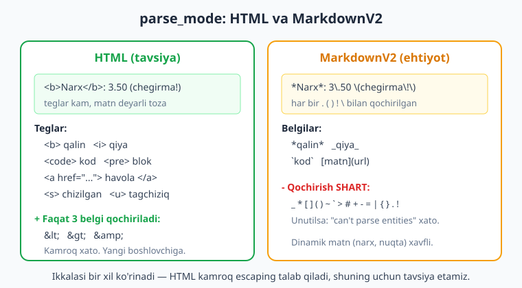
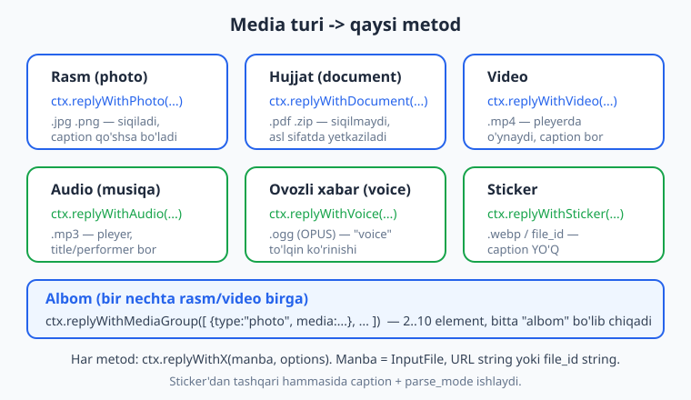
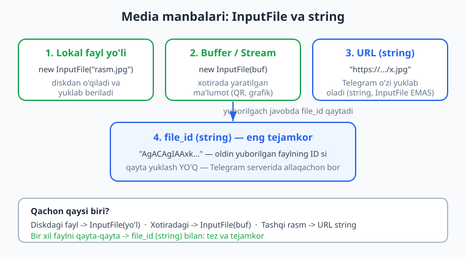

# 05 — Xabar yuborish, formatlash va media

[⬅️ Oldingi: 04 — Filtrlar va buyruqlar](./04-filtrlar-buyruqlar.md) · [🏠 README](./README.md) · [Keyingi: 06 — Klaviaturalar: reply va inline ➡️](./06-klaviaturalar.md)

---

> **Bu bobda:** botning eng asosiy ishini — javob qaytarishni — chuqur o'rganamiz. `ctx.reply` ning barcha imkoniyatlari (matnga javob qilish, `reply_parameters`), matnni chiroyli formatlash (qalin, qiya, kod, havola) ikki uslub orqali — `parse_mode: "HTML"` va `MarkdownV2` — va nega HTML'ni tavsiya qilishimiz. So'ng media: rasm, hujjat, video, audio, ovoz, sticker yuborish; `InputFile` orqali fayl manbalari (lokal yo'l, `Buffer`, URL, `file_id`); bir nechta rasmni bitta albom qilib yuborish (`replyWithMediaGroup`); va `file_id` nega tejamkor ekani. Yo'l-yo'lakay tez-tez uchraydigan xatolarni jadval qilamiz.
>
> **Halollik eslatmasi:** bu bobdagi handler kodi — `ctx.reply` ning `parse_mode` va `reply_parameters` qabul qilishi, `replyWithPhoto`/`replyWithDocument`/`replyWithVideo`/`replyWithAudio`/`replyWithVoice`, `replyWithMediaGroup` qaysi Telegram metodiga (`sendPhoto`, `sendMediaGroup`...) va qanday payload bilan ketishi, `InputFile` va URL/`file_id` string'ning farqi, MarkdownV2 escaping natijasi — **offline ishga tushirib tekshirilgan**: soxta `Update` ni `bot.handleUpdate` ga uzatib va chiqayotgan API chaqiruvlarini transformer bilan ushlab (10/10 PASS, grammY 1.43.0). **Jonli yuborish** — haqiqiy rasm/fayl Telegram'ga ketishi, `file_id` ning haqiqiy qiymati — token va internet talab qiladi; bunday joylar matnda **Illustrativ** deb belgilangan.

---

## 1. `ctx.reply` — eng ko'p ishlatadigan metod

02-bobda `ctx.reply("Salom!")` bilan tanishdik. Endi uning to'liq imkoniyatlarini ochamiz. `ctx.reply` ostida Telegram'ning `sendMessage` metodi turadi va u shunchaki `ctx.api.sendMessage(ctx.chat.id, text, options)` ning qisqartmasi: `chat_id` ni grammY joriy chatdan avtomatik oladi.

```js
import { Bot } from "grammy";

const bot = new Bot(process.env.BOT_TOKEN);

bot.command("start", (ctx) => ctx.reply("Assalomu alaykum!"));
bot.on("message:text", (ctx) => ctx.reply("Siz yozdingiz: " + ctx.message.text));

bot.start();
```

`ctx.reply(text, options)` ikkinchi argument sifatida **options obyekti** oladi. Eng muhim variantlar: `parse_mode` (formatlash), `reply_parameters` (xabarga javob), `reply_markup` (klaviatura — 06-bob), `link_preview_options` (havola oldindan ko'rinishi), `disable_notification` (jimgina yuborish).

> **Eslatma:** `ctx.reply` doim **Promise** qaytaradi. Agar javob xabarining `message_id` si kerak bo'lsa (keyin tahrirlash yoki o'chirish uchun), `await` qiling: `const sent = await ctx.reply("...")` — keyin `sent.message_id`.

### `ctx.reply` va `ctx.api.sendMessage` farqi

`ctx.reply` faqat **joriy chatga** javob beradi. Boshqa chatga (masalan, admin'ga xabar yuborish) kerak bo'lsa, `chat_id` ni o'zingiz beradigan `ctx.api.sendMessage` dan foydalaning:

```js
bot.command("xabar", (ctx) => {
  // Joriy chatga — qisqa yo'l:
  ctx.reply("Sizga javob.");
  // Boshqa (admin) chatga — chat_id o'zimiz beramiz:
  ctx.api.sendMessage(123456789, "Yangi foydalanuvchi keldi: " + ctx.from.first_name);
});
```

> **Eslatma:** `ctx.api` — botning to'liq Telegram Bot API'siga ochiq darvozasi. Handler'dan tashqarida ham (masalan, rejali vazifada — 15-bob) `bot.api.sendMessage(...)` ishlaydi, chunki `ctx` yo'q. `ctx.api` va `bot.api` — bir xil narsa.

## 2. Xabarga javob qilish — `reply_parameters`

Telegram'da xabarni "iqtibos qilib" javob berish mumkin (chat'da javob strelkasi bilan ko'rinadi). Buni `reply_parameters: { message_id }` bilan qilamiz:

```js
bot.on("message:text", (ctx) => {
  ctx.reply("Bu sizning xabaringizga javob.", {
    reply_parameters: { message_id: ctx.msg.message_id },
  });
});
```

`ctx.msg` — joriy xabar (yangilanish `message`, `edited_message`, `channel_post` bo'lishidan qat'i nazar mavjud bo'lgan xabar). `ctx.msg.message_id` — o'sha xabarning ID si. Shu ID ni `reply_parameters.message_id` ga bersak, javobimiz aynan o'sha xabarga ulanadi.

> **Diqqat:** eski grammY/Telegraf misollarida `reply_to_message_id` ni ko'rasiz. Telegram uni **eskirtirgan** (deprecated). grammY 1.43.0'da to'g'ri yo'l — `reply_parameters: { message_id }`. Yangi `reply_parameters` boshqa chatga javob qilish (`chat_id`), iqtibos qismi (`quote`) kabi imkoniyatlarni ham beradi.

Boshqa chatdagi xabarga javob qilish (kamdan-kam, lekin mumkin):

```js
ctx.reply("Javob", {
  reply_parameters: { message_id: 100, chat_id: -1009999999 },
});
```

Men buni offline tekshirdim: `reply_parameters: { message_id: 42 }` bilan yuborilgan `ctx.reply` ning payload'ida `reply_parameters.message_id === 42` chiqdi.

## 3. Matnni formatlash: `parse_mode`

Telegram xabar matnini chiroyli qiladi: **qalin**, *qiya*, `kod`, havolalar. Buning ikki yo'li bor va siz `parse_mode` orqali qaysi birini ishlatishni aytasiz: `"HTML"` yoki `"MarkdownV2"`.



### 3.1. HTML uslubi (tavsiya etamiz)

```js
bot.command("html", (ctx) => {
  ctx.reply(
    "<b>Qalin</b>, <i>qiya</i>, <u>tagchiziq</u>, <s>chizilgan</s>\n" +
    "<code>inline kod</code>\n" +
    '<a href="https://grammy.dev">grammY hujjati</a>',
    { parse_mode: "HTML" }
  );
});
```

HTML'da quyidagi teglar ishlaydi:

| Teg | Natija |
|---|---|
| `<b>...</b>` yoki `<strong>` | **qalin** |
| `<i>...</i>` yoki `<em>` | *qiya* |
| `<u>...</u>` | tagchiziq |
| `<s>...</s>` yoki `<del>` | chizilgan |
| `<code>...</code>` | `bir qatorli kod` |
| `<pre>...</pre>` | ko'p qatorli kod bloki |
| `<pre><code class="language-js">...</code></pre>` | tilga ko'ra ranglangan blok |
| `<a href="URL">matn</a>` | havola |
| `<tg-spoiler>...</tg-spoiler>` | yashirin (spoiler) matn |
| `<blockquote>...</blockquote>` | iqtibos |

**HTML'da faqat 3 ta belgi qochiriladi** — chunki ular HTML teg sintaksisi bilan to'qnashadi: `<` -> `&lt;`, `>` -> `&gt;`, `&` -> `&amp;`. Ana shuning uchun HTML'ni boshlovchiga tavsiya qilamiz: dinamik matn (foydalanuvchi ismi, narx, nuqtali son) deyarli hech qachon muammo bermaydi.

Foydalanuvchidan kelgan matnni HTML ichiga qo'yganda uni qochirish kichik funksiya bilan:

```js
function escapeHtml(s) {
  return s.replace(/&/g, "&amp;").replace(/</g, "&lt;").replace(/>/g, "&gt;");
}

bot.on("message:text", (ctx) => {
  const xavfsiz = escapeHtml(ctx.message.text);
  ctx.reply(`Siz yozdingiz: <b>${xavfsiz}</b>`, { parse_mode: "HTML" });
});
```

> **Diqqat:** `&` ni **birinchi** qochiring, aks holda keyin qo'ygan `&lt;` dagi `&` ham qayta qochirilib `&amp;lt;` bo'lib qoladi. Yuqoridagi tartib (`&` -> keyin `<`, `>`) to'g'ri.

### 3.2. MarkdownV2 uslubi (ehtiyot bilan)

```js
bot.command("md", (ctx) => {
  ctx.reply("*Qalin*, _qiya_, `kod`, [havola](https://grammy.dev)", {
    parse_mode: "MarkdownV2",
  });
});
```

MarkdownV2 belgilari: `*qalin*`, `_qiya_`, `__tagchiziq__`, `~chizilgan~`, `` `kod` ``, ` ```blok``` `, `[matn](url)`, `||spoiler||`.

Muammo shundaki, MarkdownV2'da **juda ko'p belgi maxsus** va matn ichida uchrasa, `\` bilan qochirilishi **shart**:

```text
_ * [ ] ( ) ~ ` > # + - = | { } . !
```

Ya'ni oddiy `Narx: 3.50 (chegirma!)` jumlasidagi nuqta, qavslar va undov — barchasi qochirilishi kerak. Qo'lda funksiya:

```js
function escapeMarkdownV2(s) {
  return s.replace(/[_*\[\]()~`>#+\-=|{}.!\\]/g, (c) => "\\" + c);
}

bot.command("narx", (ctx) => {
  const matn = escapeMarkdownV2("Narx: 3.50 (chegirma!)");
  // -> "Narx: 3\.50 \(chegirma\!\)"
  ctx.reply(matn, { parse_mode: "MarkdownV2" });
});
```

Men buni offline ishlatib ko'rdim: kirish `"Narx: 3.50 (chegirma!)"`, chiqish `"Narx: 3\.50 \(chegirma\!\)"` — nuqta, qavs va undov to'g'ri qochirilgan, `parse_mode` payload'da `"MarkdownV2"` bo'ldi.

> **Diqqat:** agar maxsus belgini unutib qochirmasangiz, Telegram butun xabarni rad etadi: `Bad Request: can't parse entities`. Bu bobning eng ko'p uchraydigan xatosi. Shu sababli — dinamik matn ko'p bo'lsa, **HTML'ni tanlang**.

### 3.3. `@grammyjs/parse-mode` plagini (qisqacha eslatma)

Qo'lda escaping zerikarli. grammY'ning rasmiy `@grammyjs/parse-mode` plagini `fmt` shablon-funksiyasini beradi: u o'rnatilgan matnni avtomatik qochiradi va siz format va matnni aralashtirasiz:

```js
// Illustrativ — bu alohida paket: npm i @grammyjs/parse-mode
import { bold, fmt } from "@grammyjs/parse-mode";

bot.command("fmt", async (ctx) => {
  const ism = ctx.from.first_name;            // ehtimol maxsus belgili
  await ctx.reply(...fmt`Salom, ${bold(ism)}! Narx: 3.50 (chegirma!)`);
});
```

> **Illustrativ:** `@grammyjs/parse-mode` alohida paket — bu kitobning asosiy oqimida o'rnatmaymiz, shu bois yuqoridagi blokni faqat eslatma sifatida ko'rsatdik. Boshlovchi uchun `parse_mode: "HTML"` + kichik `escapeHtml` yetarli va ishonchli. Plagin kerak bo'lsa, hujjati: https://grammy.dev/plugins/parse-mode .

## 4. Media yuborish: rasm, hujjat, video, audio, ovoz

Matndan keyin — fayllar. grammY har media turi uchun qulay `replyWithX` metodini beradi. Hammasi bitta naqshga bo'ysunadi: `ctx.replyWithX(manba, options)`, bu yerda `manba` — fayl (`InputFile`, URL yoki `file_id`), `options` — `caption`, `parse_mode` va h.k.



| Tur | Metod | Telegram metodi | Caption? |
|---|---|---|---|
| Rasm | `ctx.replyWithPhoto` | `sendPhoto` | Ha |
| Hujjat | `ctx.replyWithDocument` | `sendDocument` | Ha |
| Video | `ctx.replyWithVideo` | `sendVideo` | Ha |
| Audio (musiqa) | `ctx.replyWithAudio` | `sendAudio` | Ha |
| Ovozli xabar | `ctx.replyWithVoice` | `sendVoice` | Ha |
| Sticker | `ctx.replyWithSticker` | `sendSticker` | Yo'q |

`replyWithPhoto` rasmni **siqadi** (chat'da rasm bo'lib ko'rinadi). Asl sifat saqlanishi kerak bo'lsa (masalan PDF, ZIP, yoki katta PNG), `replyWithDocument` ishlating — u faylni qayta ishlamasdan jo'natadi.

Men offline tekshirganimda `replyWithDocument`, `replyWithVideo`, `replyWithAudio`, `replyWithVoice` mos ravishda `sendDocument`, `sendVideo`, `sendAudio`, `sendVoice` metodlariga ketdi va `caption` payload'da saqlandi.

### 4.1. `InputFile` — fayl manbasi

Lokal fayl yoki xotiradagi ma'lumotni yuborish uchun grammY'ning `InputFile` klassini import qilamiz:

```js
import { Bot, InputFile } from "grammy";
```



Manbalarning to'rt turi:

```js
// 1) Lokal fayl yo'li — disk'dan o'qiladi va yuklab beriladi
bot.command("rasm", (ctx) =>
  ctx.replyWithPhoto(new InputFile("rasmlar/logo.png"), { caption: "Bizning logo" })
);

// 2) Buffer (xotirada yaratilgan ma'lumot — masalan QR yoki grafik)
import { Buffer } from "node:buffer";
bot.command("buf", (ctx) => {
  const buf = Buffer.from("Salom, bu matnli fayl!", "utf-8");
  return ctx.replyWithDocument(new InputFile(buf, "salom.txt"));
});

// 3) URL string — to'g'ridan-to'g'ri, InputFile YO'Q (Telegram o'zi yuklab oladi)
bot.command("url", (ctx) =>
  ctx.replyWithPhoto("https://grammy.dev/images/grammY.png", { caption: "Internetdan" })
);

// 4) file_id string — eng tejamkor (4.3-bo'limda)
bot.command("qayta", (ctx) => ctx.replyWithPhoto("AgACAgIAAxk...")); // saqlangan file_id
```

> **Diqqat:** URL va `file_id` — oddiy **string** sifatida beriladi, `new InputFile(...)` ichiga **o'ralmaydi**. `new InputFile("https://...")` ni Telegram URL emas, fayl nomi deb tushunadi va xato beradi. Eng tez-tez uchraydigan boshlovchi xatosi: `ctx.replyWithPhoto("rasm.jpg")` deb yozish — bu lokal fayl emas, Telegram uni `file_id` deb o'qiydi va topolmaydi. Lokal fayl uchun **albatta** `new InputFile("rasm.jpg")`.

Men offline tekshirdim: `new InputFile("rasm.jpg")` bilan yuborilgan `replyWithPhoto` payload'ining `photo` maydoni haqiqatan `InputFile` instansiyasi bo'ldi; URL string esa `photo` ga string sifatida o'tdi.

### 4.2. Caption va parse_mode media bilan

Sticker'dan tashqari har media `caption` (izoh) qabul qiladi va caption ham `parse_mode` bilan formatlanadi:

```js
bot.command("mahsulot", (ctx) => {
  ctx.replyWithPhoto(new InputFile("rasmlar/mahsulot.jpg"), {
    caption: "<b>Telefon</b>\nNarx: <i>5 000 000 so'm</i>",
    parse_mode: "HTML",
  });
});
```

> **Diqqat:** caption uzunligi **1024 belgi** bilan cheklangan (oddiy xabar 4096 belgi). Uzun matnni rasm ostiga sig'dirib bo'lmaydi — bunday holda rasmni alohida, matnni alohida yuboring, yoki matnni qisqartiring. Bu bobning yana bir tez-tez uchraydigan xatosi.

### 4.3. `file_id` — bir marta yuklang, ko'p marta yuboring

Bu media bilan ishlashning **eng muhim tejamkorlik usuli**. Siz biror faylni Telegram'ga birinchi marta yuborganingizda, Telegram uni o'z serverida saqlaydi va javobda unga `file_id` beradi. Keyingi safar **o'sha faylni** yuborganda, butun faylni qayta yuklash o'rniga shunchaki shu `file_id` string'ni bersangiz bas — tez va trafik tejaydi.

```js
let logoFileId = null; // amalda: DB yoki sessiyada saqlang (10-bob)

bot.command("yukla", async (ctx) => {
  const sent = await ctx.replyWithPhoto(new InputFile("rasmlar/logo.png"));
  // Javobda Telegram bir nechta o'lcham qaytaradi; eng kattasini olamiz:
  logoFileId = sent.photo.at(-1).file_id;
  await ctx.reply("Logo yuklandi, file_id saqlandi.");
});

bot.command("logo", (ctx) => {
  if (!logoFileId) return ctx.reply("Avval /yukla bilan yuklang.");
  // Qayta yuklash YO'Q — string file_id ni beramiz:
  return ctx.replyWithPhoto(logoFileId, { caption: "Saqlangan logo (tez!)" });
});
```

Men buni offline tekshirdim: `replyWithPhoto(new InputFile(...))` javobidagi `photo.at(-1).file_id` ni oldim va keyingi `replyWithPhoto(file_id)` chaqirig'ida u `photo` ga **string** sifatida o'tdi.

> **Eslatma:** rasm uchun `result.photo` — bir nechta o'lchamli massiv (`thumb` dan to to'liqgacha), shuning uchun `sent.photo.at(-1)` (eng katta) ni olamiz. Hujjat uchun `sent.document.file_id`, video uchun `sent.video.file_id`, ovoz uchun `sent.voice.file_id`. Har media turining o'z maydoni bor.

> **Anti-eskirish:** `file_id` faqat **shu bot** doirasida amal qiladi — boshqa botga uni bersangiz ishlamaydi. Shuningdek `file_id` vaqt o'tib o'zgarishi mumkin (kamdan-kam, lekin mumkin), shuning uchun "abadiy" deb tayanmang; asl faylni ham saqlab qo'ying.

## 5. Albom (media guruh) — bir nechta rasmni birga yuborish

Bir nechta rasm yoki videoni bitta "albom" (gallereya) qilib yuborish uchun `replyWithMediaGroup` ishlatamiz. U `InputMediaPhoto`/`InputMediaVideo` obyektlari massivini (2 dan 10 tagacha) oladi:

```js
bot.command("galereya", (ctx) => {
  ctx.replyWithMediaGroup([
    { type: "photo", media: new InputFile("rasmlar/1.jpg"), caption: "Birinchi rasm" },
    { type: "photo", media: new InputFile("rasmlar/2.jpg") },
    { type: "photo", media: "https://grammy.dev/images/grammY.png" }, // URL ham mumkin
  ]);
});
```

Har element — oddiy obyekt: `{ type, media, caption?, parse_mode? }`. `type` — `"photo"`, `"video"`, `"document"` yoki `"audio"`. `media` — `InputFile`, URL yoki `file_id` (xuddi yakka media kabi).

Men offline tekshirdim: `replyWithMediaGroup([...])` `sendMediaGroup` metodiga ketdi, `payload.media` ikki elementli massiv bo'ldi, birinchisining `caption` si saqlandi, ikkinchisining `media` si URL string bo'lib qoldi.

> **Diqqat:** albomda caption odatda **faqat birinchi** element ostida ko'rinadi (Telegram albomning tagidagi yagona izoh sifatida ko'rsatadi). Albomni `caption` parametri bilan emas, birinchi element ichidagi `caption` bilan beriladi.

> **Eslatma:** rasm va videoni bitta albomda aralashtirish mumkin, lekin hujjatlar (`document`) va audiolar faqat **bir xil turdagilar bilan** birga turishi kerak — masalan, hammasi `document` yoki hammasi `audio`.

## 6. Havola oldindan ko'rinishi va jimgina yuborish

Ikki foydali kichik variant:

```js
bot.command("havola", (ctx) => {
  ctx.reply("grammY: https://grammy.dev", {
    link_preview_options: { is_disabled: true }, // havola "kartochkasi" ko'rsatilmaydi
  });
});

bot.command("jim", (ctx) => {
  ctx.reply("Bu xabar ovozsiz keladi.", { disable_notification: true });
});
```

> **Anti-eskirish:** eski kodda `disable_web_page_preview: true` ni ko'rasiz — Telegram uni `link_preview_options: { is_disabled: true }` ga almashtirgan. grammY 1.43.0'da yangi nomdan foydalaning.

## 7. Tez-tez uchraydigan xatolar

| Xato | Sabab | Yechim |
|---|---|---|
| `Bad Request: can't parse entities` | MarkdownV2'da maxsus belgi (`.`, `(`, `!`...) qochirilmagan | `escapeMarkdownV2` ishlating yoki HTML'ga o'ting |
| HTML formatlanmadi, teglar matn bo'lib chiqdi | `parse_mode: "HTML"` berilmagan | `ctx.reply(text, { parse_mode: "HTML" })` |
| `&lt;` o'rniga `&amp;lt;` chiqdi | `&` dan keyin `<` qochirilgan (noto'g'ri tartib) | Avval `&`, keyin `<`, `>` qochiring |
| Lokal rasm jo'nalmadi, "file not found" / wrong file_id | `ctx.replyWithPhoto("rasm.jpg")` — string yo'l berilgan | `new InputFile("rasm.jpg")` ishlating |
| URL `InputFile` ichida ishlamadi | `new InputFile("https://...")` — URL fayl nomi deb o'qildi | URL'ni to'g'ridan-to'g'ri string bering |
| Caption kesilib qoldi yoki xato | Caption 1024 belgidan oshgan | Matnni qisqartiring yoki alohida xabar yuboring |
| Albom yuborilmadi | 1 ta yoki 10 tadan ko'p element berilgan | 2..10 element bering |
| `file_id` boshqa botda ishlamadi | `file_id` botga bog'langan | Har bot o'z faylini yuklasin / o'z `file_id` sini saqlasin |
| `reply_to_message_id` ishlamadi/ogohlantirish | Eskirgan maydon | `reply_parameters: { message_id }` ishlating |

---

## Mashqlar

Quyidagi mashqlarning ko'pini 02-bobdagi **offline tekshirish naqshi** bilan sinashingiz mumkin (token va internetsiz): soxta `bot`, `bot.api.config.use(transformer)` bilan chiqayotgan API'ni `calls` massiviga yig'ish, so'ng `bot.handleUpdate(...)`. Buyruq uchun `entities: [{ type: "bot_command", offset: 0, length: N }]` qo'shishni unutmang.

### Oson

1. **Qalin salom.** `/salom` buyrug'iga botning ismini qalin qilib qaytaradigan handler yozing (`parse_mode: "HTML"`). Tekshiring: payload `text` ichida `<b>` bor va `parse_mode === "HTML"`.
2. **Javob qilish.** Har qanday matnga, o'sha xabarning o'ziga "iqtibos" qilib javob bering (`reply_parameters: { message_id: ctx.msg.message_id }`).
3. **URL rasm.** `/rasm` buyrug'iga internetdagi rasm URL'ini yuboring (`replyWithPhoto(url)`). Tekshiring: metod `sendPhoto`, `photo` — string.
4. **Kod bloki.** `/help` buyrug'iga `<pre>` ichida kichik kod namunasini HTML bilan yuboring.

### O'rta

5. **Echo xavfsiz HTML.** Foydalanuvchi matnini qalin qilib qaytaring, lekin avval `escapeHtml` bilan qochiring. `<b>` yozgan foydalanuvchi `&lt;b&gt;` ko'rishini tekshiring.
6. **MarkdownV2 narx.** `escapeMarkdownV2` yozing va `"Chegirma: -20% (bugun!)"` ni MarkdownV2 bilan yuboring. Chiqishda `\-20\%`... emas (`%` maxsus emas), lekin `-`, `(`, `)`, `!` qochirilganini tekshiring.
7. **Hujjat va izoh.** `Buffer` dan matnli fayl yasab (`InputFile(buf, "hisobot.txt")`), `caption` bilan hujjat sifatida yuboring. Metod `sendDocument` ekanini tekshiring.
8. **Media tanlash.** `/foto` rasm, `/fayl` hujjat yuboradigan ikki handler yozing; ikkalasi mos `sendPhoto`/`sendDocument` ga ketishini bitta testda tekshiring.
9. **Admin'ga xabar.** Har yangi `message:text` ga foydalanuvchiga `ctx.reply("Qabul qilindi")`, admin'ga `ctx.api.sendMessage(ADMIN_ID, ...)` yuboring. Admin payload'ining `chat_id` si to'g'ri ekanini tekshiring.

### Qiyin

10. **Albom.** `/galereya` ga 3 ta rasmli albom yuboring; birinchisida caption bo'lsin. `sendMediaGroup` ga 3 elementli massiv ketishini va birinchi element caption'ini tekshiring.
11. **file_id qayta ishlatish.** `/yukla` da `InputFile` yuborib, javobdan `file_id` ni o'zgaruvchiga saqlang; `/qayta` da o'sha `file_id` (string) bilan yuboring. Ikkinchi chaqiruv payload'i string `photo` ekanini tekshiring.
12. **Mahsulot kartochkasi.** `caption` ni HTML bilan formatlab (nomi qalin, narxi qiya), rasm bilan yuboradigan funksiya yozing; caption va `parse_mode` payload'da birga ketishini tekshiring.
13. **Universal escaping.** Bitta funksiya yozing: `formatlash(text, mode)` — `mode === "HTML"` bo'lsa `escapeHtml`, `"MarkdownV2"` bo'lsa `escapeMarkdownV2` qo'llasin va mos `parse_mode` bilan `ctx.reply` qilsin. Ikki rejimni ikki testda tekshiring.

<details markdown="1">
<summary>Yechimlar</summary>

Quyidagi yechimlar 02-bobdagi offline naqshga tayanadi. Eslatma uchun qisqa skelet (har yechimda qayta ishlatiladi):

```js
import { Bot, InputFile } from "grammy";
import assert from "node:assert/strict";

function makeBot() {
  const bot = new Bot("12345:FAKE");
  bot.botInfo = { id: 12345, is_bot: true, first_name: "T", username: "t_bot",
    can_join_groups: true, can_read_all_group_messages: false,
    supports_inline_queries: false, can_connect_to_business: false, has_main_web_app: false };
  const calls = [];
  bot.api.config.use((prev, method, payload) => {
    calls.push({ method, payload });
    if (method === "sendMessage")
      return Promise.resolve({ ok: true, result: { message_id: 1, date: 0,
        chat: { id: payload.chat_id, type: "private" }, text: payload.text } });
    if (method.startsWith("send"))
      return Promise.resolve({ ok: true, result: { message_id: 2, date: 0,
        chat: { id: payload.chat_id, type: "private" },
        photo: [{ file_id: "FID_123", file_unique_id: "u", width: 90, height: 90 }] } });
    return Promise.resolve({ ok: true, result: true });
  });
  return { bot, calls };
}

function mkUpdate(text, id = 1) {
  const message = { message_id: id, date: 0, text,
    chat: { id: 777, type: "private" }, from: { id: 777, is_bot: false, first_name: "Ali" } };
  if (text.startsWith("/"))
    message.entities = [{ type: "bot_command", offset: 0, length: text.split(/\s/)[0].length }];
  return { update_id: id, message };
}
```

### 1-mashq yechimi

```js
bot.command("salom", (ctx) =>
  ctx.reply(`Salom, <b>${ctx.from.first_name}</b>!`, { parse_mode: "HTML" }));

// Tekshirish:
const { bot, calls } = makeBot();
// ... handlerni ulang ...
await bot.handleUpdate(mkUpdate("/salom"));
assert.match(calls[0].payload.text, /<b>Ali<\/b>/);
assert.equal(calls[0].payload.parse_mode, "HTML");
```

`parse_mode: "HTML"` payload'ga qo'shiladi va Telegram `<b>` ni qalin qiladi.

### 2-mashq yechimi

```js
bot.on("message:text", (ctx) =>
  ctx.reply("Javob: " + ctx.message.text, {
    reply_parameters: { message_id: ctx.msg.message_id },
  }));
// calls[0].payload.reply_parameters.message_id === o'sha xabar ID si
```

`ctx.msg.message_id` joriy xabarning ID si; `reply_parameters` javobni o'sha xabarga ulaydi.

### 3-mashq yechimi

```js
bot.command("rasm", (ctx) =>
  ctx.replyWithPhoto("https://grammy.dev/images/grammY.png"));
// calls[0].method === "sendPhoto"; typeof calls[0].payload.photo === "string"
```

URL — string bo'lib o'tadi, Telegram o'zi yuklab oladi. `InputFile` ga o'ramaymiz.

### 4-mashq yechimi

```js
bot.command("help", (ctx) =>
  ctx.reply('<pre><code class="language-js">console.log("salom")</code></pre>',
    { parse_mode: "HTML" }));
```

`<pre><code class="language-...">` tilga ko'ra ranglangan kod bloki beradi.

### 5-mashq yechimi

```js
function escapeHtml(s) {
  return s.replace(/&/g, "&amp;").replace(/</g, "&lt;").replace(/>/g, "&gt;");
}
bot.on("message:text", (ctx) =>
  ctx.reply(`Siz: <b>${escapeHtml(ctx.message.text)}</b>`, { parse_mode: "HTML" }));

// "<b>" yozgan foydalanuvchi:
await bot.handleUpdate(mkUpdate("<b>"));
assert.match(calls[0].payload.text, /&lt;b&gt;/);   // qochirilgan
```

Foydalanuvchi yozgan `<b>` formatlanmaydi, balki `&lt;b&gt;` matn bo'lib ko'rinadi. `&` birinchi qochirilgani uchun ikki marta qochirish bo'lmaydi.

### 6-mashq yechimi

```js
function escapeMarkdownV2(s) {
  return s.replace(/[_*\[\]()~`>#+\-=|{}.!\\]/g, (c) => "\\" + c);
}
bot.command("narx", (ctx) =>
  ctx.reply(escapeMarkdownV2("Chegirma: -20% (bugun!)"), { parse_mode: "MarkdownV2" }));

await bot.handleUpdate(mkUpdate("/narx"));
assert.equal(calls[0].payload.text, "Chegirma: \\-20% \\(bugun\\!\\)");
```

`-`, `(`, `)`, `!` qochirildi; `%` va `:` maxsus belgi emas, qochirilmaydi.

### 7-mashq yechimi

```js
import { Buffer } from "node:buffer";
bot.command("hisobot", (ctx) => {
  const buf = Buffer.from("Sotuvlar: 120 dona\n", "utf-8");
  return ctx.replyWithDocument(new InputFile(buf, "hisobot.txt"),
    { caption: "Kunlik hisobot" });
});

await bot.handleUpdate(mkUpdate("/hisobot"));
assert.equal(calls[0].method, "sendDocument");
assert.equal(calls[0].payload.caption, "Kunlik hisobot");
```

`Buffer` dan `InputFile(buf, "nom")` bilan fayl yasaymiz; ikkinchi argument — Telegram'da ko'rinadigan fayl nomi.

### 8-mashq yechimi

```js
bot.command("foto", (ctx) => ctx.replyWithPhoto(new InputFile("x.jpg")));
bot.command("fayl", (ctx) => ctx.replyWithDocument(new InputFile("x.pdf")));

await bot.handleUpdate(mkUpdate("/foto"));
await bot.handleUpdate(mkUpdate("/fayl"));
assert.deepEqual(calls.map((c) => c.method), ["sendPhoto", "sendDocument"]);
```

Rasm siqiladi (`sendPhoto`), hujjat asl sifatda ketadi (`sendDocument`).

### 9-mashq yechimi

```js
const ADMIN_ID = 999;
bot.on("message:text", async (ctx) => {
  await ctx.reply("Qabul qilindi");
  await ctx.api.sendMessage(ADMIN_ID, "Yangi: " + ctx.message.text);
});

await bot.handleUpdate(mkUpdate("salom"));
const adminCall = calls.find((c) => c.payload.chat_id === ADMIN_ID);
assert.ok(adminCall);
assert.match(adminCall.payload.text, /Yangi:/);
```

`ctx.reply` joriy chatga, `ctx.api.sendMessage(ADMIN_ID, ...)` boshqa chatga — `chat_id` ni o'zimiz beramiz.

### 10-mashq yechimi

```js
bot.command("galereya", (ctx) =>
  ctx.replyWithMediaGroup([
    { type: "photo", media: new InputFile("1.jpg"), caption: "Birinchi" },
    { type: "photo", media: new InputFile("2.jpg") },
    { type: "photo", media: "https://example.com/3.jpg" },
  ]));

await bot.handleUpdate(mkUpdate("/galereya"));
assert.equal(calls[0].method, "sendMediaGroup");
assert.equal(calls[0].payload.media.length, 3);
assert.equal(calls[0].payload.media[0].caption, "Birinchi");
```

Albom 2..10 element oladi; caption odatda birinchi element ostida ko'rinadi.

### 11-mashq yechimi

```js
let saqlangan = null;
bot.command("yukla", async (ctx) => {
  const m = await ctx.replyWithPhoto(new InputFile("logo.png"));
  saqlangan = m.photo.at(-1).file_id;
});
bot.command("qayta", (ctx) => ctx.replyWithPhoto(saqlangan));

await bot.handleUpdate(mkUpdate("/yukla"));
await bot.handleUpdate(mkUpdate("/qayta"));
assert.equal(saqlangan, "FID_123");
assert.equal(calls[1].payload.photo, "FID_123");   // string, qayta yuklash YO'Q
```

Birinchi yuborishda `file_id` keladi; ikkinchisida shu string bilan tez qayta yuboramiz.

### 12-mashq yechimi

```js
function mahsulotKartochkasi(ctx, nomi, narxi) {
  return ctx.replyWithPhoto(new InputFile("mahsulot.jpg"), {
    caption: `<b>${nomi}</b>\nNarx: <i>${narxi}</i>`,
    parse_mode: "HTML",
  });
}
bot.command("mahsulot", (ctx) => mahsulotKartochkasi(ctx, "Telefon", "5 000 000 so'm"));

await bot.handleUpdate(mkUpdate("/mahsulot"));
assert.match(calls[0].payload.caption, /<b>Telefon<\/b>/);
assert.equal(calls[0].payload.parse_mode, "HTML");
```

Caption ham `parse_mode` bilan formatlanadi — rasm ostidagi izoh qalin/qiya bo'ladi.

### 13-mashq yechimi

```js
function escapeHtml(s) {
  return s.replace(/&/g, "&amp;").replace(/</g, "&lt;").replace(/>/g, "&gt;");
}
function escapeMarkdownV2(s) {
  return s.replace(/[_*\[\]()~`>#+\-=|{}.!\\]/g, (c) => "\\" + c);
}
function formatlash(ctx, text, mode) {
  const xavfsiz = mode === "HTML" ? escapeHtml(text) : escapeMarkdownV2(text);
  return ctx.reply(xavfsiz, { parse_mode: mode });
}
bot.command("h", (ctx) => formatlash(ctx, "a < b & c", "HTML"));
bot.command("m", (ctx) => formatlash(ctx, "narx 3.5!", "MarkdownV2"));

await bot.handleUpdate(mkUpdate("/h"));
await bot.handleUpdate(mkUpdate("/m"));
assert.equal(calls[0].payload.text, "a &lt; b &amp; c");
assert.equal(calls[0].payload.parse_mode, "HTML");
assert.equal(calls[1].payload.text, "narx 3\\.5\\!");
assert.equal(calls[1].payload.parse_mode, "MarkdownV2");
```

Bitta funksiya rejimga qarab to'g'ri escaping va `parse_mode` ni qo'llaydi — kodni qayta ishlatamiz.

</details>

---

Endi bot nafaqat matn, balki chiroyli formatlangan xabar va media yubora oladi. Keyingi bobda foydalanuvchiga **tugmalar** beramiz: reply va inline klaviaturalar, callback tugmalar — bot bilan muloqotni bir necha barobar qulay qiladi. Python/aiogram ekvivalentini ko'rish qiziq bo'lsa: [tgbot-python kitobi](../tgbot-python/README.md). Media faylni yuborishning teskarisi — foydalanuvchi yuborgan faylni **yuklab olish** (`getFile`/`download`) — 12-bobda ko'ramiz.

[⬅️ Oldingi: 04 — Filtrlar va buyruqlar](./04-filtrlar-buyruqlar.md) · [🏠 README](./README.md) · [Keyingi: 06 — Klaviaturalar: reply va inline ➡️](./06-klaviaturalar.md)
