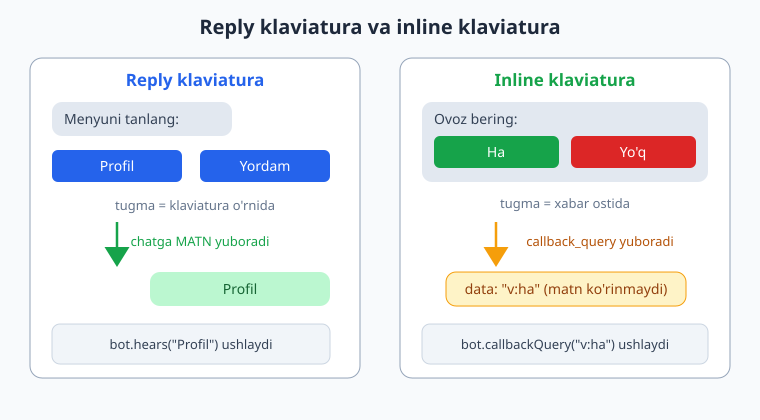
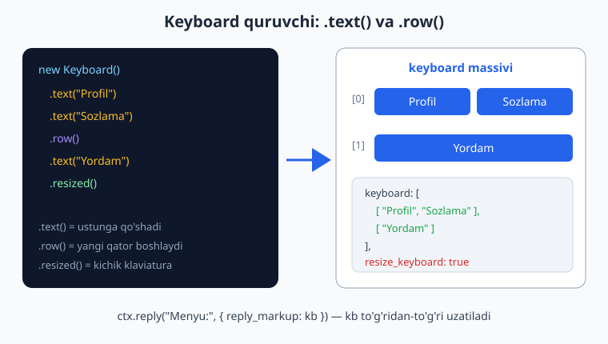
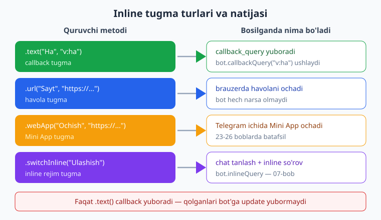

# 06 — Klaviaturalar: reply va inline

[⬅️ Oldingi: 05 — Xabar yuborish, formatlash va media](./05-xabar-formatlash-media.md) · [🏠 README](./README.md) · [Keyingi: 07 — Callback query va inline rejim ➡️](./07-callback-inline.md)

---

> **Bu bobda:** Telegram botning eng ko'zga ko'rinadigan qismi — tugmalarni o'rganamiz. Telegram'da ikki xil klaviatura bor va ularni aralashtirib yuborish boshlovchilarning eng tez-tez xatosi: **reply klaviatura** (chatdagi yozish maydonini almashtiradigan tugmalar — bosilganda oddiy matn yuboradi) va **inline klaviatura** (xabar ostiga "yopishgan" tugmalar — bosilganda matn emas, `callback_query` yuboradi). Biz grammY'ning `Keyboard` va `InlineKeyboard` quruvchilarini (builder) ishlatishni — `.text()`, `.row()`, `.resized()`, `.oneTime()`, `.persistent()` va inline uchun `.url()`, `.webApp()`, `.switchInline()` — o'rganamiz; tugmalarni qatorlarga (`.row()`) va ustunlarga (`.toFlowed()`) qanday joylashtirishni, klaviaturani qanday olib tashlashni (`remove_keyboard`), massivdan dinamik klaviatura qurishni va `callback_data`ni qanday tejamli loyihalashni ko'ramiz.
>
> **Halollik eslatmasi:** Bu bobning kodi **offline ishga tushirib tekshirilgan** — `Keyboard`/`InlineKeyboard` quruvchilari haqiqatan qanday tuzilma (`keyboard`/`inline_keyboard` massivlari, `resize_keyboard` va boshqa bayroqlar) qurishi `node`'da tasdiqlangan, va handlerlar chiqaradigan `reply_markup` payload'i `bot.api.config.use(...)` transformeri bilan ushlab tekshirilgan (`_verify_06.mjs`, 14/14 o'tdi). Tugmalarning **vizual ko'rinishi** va bosilganda Telegram klienti yuboradigan haqiqiy update'lar — bu jonli ishlash, real telefon/token talab qiladi; bunday joylar "illustrativ" deb belgilangan.

---

## Ikki xil klaviatura — nega bu farq muhim

Telegram'da tugma qo'yishning ikki butunlay boshqacha yo'li bor. Avval farqni miyaga mahkam o'rnataylik, chunki keyingi hamma narsa shunga tayanadi.

**Reply klaviatura** — telefon klaviaturasi turadigan joyda paydo bo'ladigan tugmalar to'plami. Foydalanuvchi tugmani bosganda, **u tugmaning matni chatga oddiy xabar sifatida yuboriladi**. Ya'ni `Profil` tugmasini bosish — qo'lda `Profil` deb yozib jo'natish bilan **bir xil**. Sizning bot uchun bu shunchaki `message:text` update'i bo'lib keladi va siz uni `bot.hears("Profil")` yoki `bot.on("message:text")` bilan ushlaysiz.

**Inline klaviatura** — aniq bir xabarning **ostiga yopishgan** tugmalar. Bosilganda chatga hech qanday matn ketmaydi; uning o'rniga Telegram sizning bot'ingizga maxsus **`callback_query`** update'ini yuboradi, ichida siz oldindan belgilagan `callback_data` qiymati bo'ladi. Foydalanuvchi nima bosganini ko'rmaydi — chat tarixi toza qoladi.



Qisqa qoida:

| | Reply klaviatura | Inline klaviatura |
|---|---|---|
| Qayerda turadi | Yozish maydoni o'rnida | Xabar ostida |
| Bosilganda | Tugma matni chatga **yuboriladi** | `callback_query` (matn ko'rinmaydi) |
| Bot qanday ushlaydi | `bot.hears` / `message:text` | `bot.callbackQuery` |
| Quruvchi | `new Keyboard()` | `new InlineKeyboard()` |
| Qachon | Doimiy menyu, raqam/kontakt so'rash | Tasdiq, ovoz berish, sahifalash, sozlama |

> **Eslatma:** Inline tugmaga javob berishning to'liq mexanizmi — `callback_query`ni ushlash, `ctx.answerCallbackQuery()`, xabarni tahrirlash, sahifalash — keyingi **07-bobning** asosiy mavzusi. Bu bobda biz tugmalarni **qurishni** o'rganamiz; ularni bosilganda nima qilishni 07-bobda chuqurlashtiramiz.

> **Anti-eskirish:** Internetda Telegraf'ning `Markup.keyboard(...)` / `Markup.inlineKeyboard(...)` yoki `node-telegram-bot-api`ning xom `{ reply_markup: { keyboard: [[...]] } }` obyektlarini ko'p uchratasiz. grammY'da bunday emas — biz `Keyboard`/`InlineKeyboard` **quruvchi sinflaridan** foydalanamiz. Ular oxir-oqibat o'sha standart Telegram obyektini quradi, lekin zanjir (chain) usuli ancha o'qiluvchan.

---

## Reply klaviatura: `Keyboard` quruvchi

`Keyboard` sinfini `grammy`dan import qilamiz va zanjir bilan tugma qo'shamiz:

```js
import { Bot, Keyboard } from "grammy";

const bot = new Bot(process.env.BOT_TOKEN);

bot.command("menyu", (ctx) => {
  const kb = new Keyboard()
    .text("Profil").text("Sozlamalar").row()
    .text("Yordam")
    .resized();
  return ctx.reply("Menyuni tanlang:", { reply_markup: kb });
});

bot.start(); // illustrativ: jonli polling token + internet talab qiladi
```

Bu yerda muhim ikki metod:

- **`.text("...")`** — yangi matnli tugma qo'shadi, **joriy qatorga**.
- **`.row()`** — "qator uzilishi". Shundan keyingi tugmalar **yangi qatorga** tushadi.

Yuqoridagi misolda `Profil` va `Sozlamalar` bitta qatorda yonma-yon turadi, `Yordam` esa pastdagi alohida qatorda. Bu aynan `.text().text().row().text()` zanjirining natijasi.



### Quruvchi qanday tuzilma quradi (offline tasdiqlangan)

`Keyboard` aslida `keyboard` degan ichki ikki o'lchovli massivni to'ldiradi. Buni `node`'da to'g'ridan-to'g'ri ko'rsak bo'ladi (`_verify_06.mjs`'dan):

```js
const kb = new Keyboard()
  .text("Menyu").row()
  .text("Yordam").resized().oneTime();

console.log(kb.keyboard.length);          // 2  (ikki qator)
console.log(kb.keyboard[0][0].text);      // "Menyu"
console.log(kb.keyboard[1][0].text);      // "Yordam"
console.log(kb.resize_keyboard);          // true
console.log(kb.one_time_keyboard);        // true
```

Demak `kb` — bu oddiy obyekt: `keyboard` massivi + bir nechta bayroq (`resize_keyboard`, `one_time_keyboard`, ...). `ctx.reply(..., { reply_markup: kb })` deganda grammY shu obyektni Telegram'ga uzatadi.

### Sozlamalar: `.resized()`, `.oneTime()`, `.persistent()`, `.placeholder()`

`Keyboard`ning ko'rinishini boshqaradigan zanjir metodlari:

| Metod | Nima qiladi | Mos bayroq |
|---|---|---|
| `.resized()` | Klaviaturani tugmalar hajmiga moslab **kichraytiradi** (deyarli har doim kerak) | `resize_keyboard: true` |
| `.oneTime()` | Bir marta bosilgach klaviatura **yashiriladi** | `one_time_keyboard: true` |
| `.persistent()` | Klaviatura har doim **ko'rinib turadi** (yashirin emas) | `is_persistent: true` |
| `.placeholder("...")` | Yozish maydonida kulrang **maslahat matn** | `input_field_placeholder` |

> **Diqqat:** `.resized()`ni deyarli har doim chaqiring. Aks holda Telegram klaviaturani butun ekran balandligida ko'rsatadi va ikki-uchta tugma uchun yarim ekranni egallaydi — chiroyli emas.

Misol — to'liq sozlangan klaviatura:

```js
const kb = new Keyboard()
  .text("Buyurtmalarim").text("Savatcha").row()
  .text("Yordam")
  .resized()
  .persistent()
  .placeholder("Menyudan tanlang yoki yozing...");

await ctx.reply("Asosiy menyu:", { reply_markup: kb });
```

### Maxsus reply tugmalar: kontakt, joylashuv, Mini App

Reply klaviatura faqat matn yuborish bilan cheklanmaydi — telefon raqami yoki joylashuvni **bir tugma bilan** so'rashi mumkin (faqat **shaxsiy chatda** ishlaydi):

```js
const kb = new Keyboard()
  .requestContact("📞 Raqamni ulashish").row()
  .requestLocation("📍 Joylashuvni yuborish").row()
  .webApp("🚀 Ilovani ochish", "https://example.com")
  .resized();

await ctx.reply("Davom etish uchun ma'lumot ulashing:", { reply_markup: kb });
```

- **`.requestContact(text)`** — bosilganda foydalanuvchidan ruxsat so'raladi va uning **telefon raqami** `message.contact` ichida keladi.
- **`.requestLocation(text)`** — **joriy joylashuv** `message.location` ichida keladi.
- **`.webApp(text, url)`** — Telegram **Mini App**ni ochadi (23-26 boblar mavzusi).

Bularning tuzilmasi ham offline tasdiqlangan:

```js
const kb = new Keyboard()
  .requestContact("Raqam").row()
  .requestLocation("Joylashuv");

console.log(kb.keyboard[0][0].request_contact);  // true
console.log(kb.keyboard[1][0].request_location); // true
```

> **Eslatma:** Kontakt yoki joylashuv kelganda uni `bot.on("message:contact")` / `bot.on("message:location")` bilan ushlaysiz (filter query'lar — 04-bobda ko'rdik). Tugmaning o'zi faqat **so'rovni boshlaydi**; ma'lumotni yana handler ushlaydi.

---

## Klaviaturani olib tashlash

Reply klaviatura — "yopishqoq": bir marta ko'rsatilsa, foydalanuvchi har gal yozganda turaveradi (agar `.oneTime()` qo'ymagan bo'lsangiz). Uni dasturiy ravishda olib tashlash uchun maxsus obyekt yuboramiz:

```js
bot.command("yashir", (ctx) =>
  ctx.reply("Klaviatura olib tashlandi.", {
    reply_markup: { remove_keyboard: true },
  })
);
```

Bu yerda quruvchi yo'q — bu shunchaki `{ remove_keyboard: true }` obyekti. grammY uni o'zgartirmasdan Telegram'ga uzatadi (offline tasdiqlangan: payload aynan shu obyekt bo'ldi).

> **Diqqat:** `remove_keyboard` faqat **reply** klaviaturani olib tashlaydi. Inline klaviaturani olib tashlash boshqacha — xabarni tahrirlab `reply_markup`ni bo'shatasiz (`ctx.editMessageReplyMarkup()` yoki `reply_markup: undefined` bilan tahrirlash). Buni 07-bobda ko'ramiz.

---

## Inline klaviatura: `InlineKeyboard` quruvchi

Inline klaviatura xuddi shu zanjir uslubida quriladi, lekin `InlineKeyboard` sinfi bilan va tugma turlari boshqacha:

```js
import { Bot, InlineKeyboard } from "grammy";

const bot = new Bot(process.env.BOT_TOKEN);

bot.command("ovoz", (ctx) => {
  const ik = new InlineKeyboard()
    .text("👍 Ha", "ovoz:ha")
    .text("👎 Yo'q", "ovoz:yoq");
  return ctx.reply("Bu g'oya sizga yoqdimi?", { reply_markup: ik });
});
```

Bu yerda `.text(matn, data)` ikki argument oladi:

- **birinchi** — tugmada **ko'rinadigan** matn (`👍 Ha`),
- **ikkinchi** — `callback_data`, ya'ni tugma bosilganda bot'ga keladigan **yashirin** qiymat (`ovoz:ha`).

Foydalanuvchi `👍 Ha`ni bosadi, lekin chatga hech narsa yozilmaydi — bot esa `callback_query` ichida `ovoz:ha`ni oladi.

> **Diqqat:** Inline `.text()` reply `.text()`dan farq qiladi! Reply'da ikkinchi argument yo'q (tugma matni o'zi chatga ketadi). Inline'da ikkinchi argument — `callback_data`. Buni adashtirmang.

Agar `callback_data`ni tashlab ketsangiz, grammY uni **ko'rinadigan matnga teng** qilib qo'yadi:

```js
const ik = new InlineKeyboard().text("Tugma");
console.log(ik.inline_keyboard[0][0].callback_data); // "Tugma"
```

### Inline tugma turlari

`InlineKeyboard`da bir nechta tugma turi bor, va **faqat bittasi** bot'ga update yuboradi:



```js
const ik = new InlineKeyboard()
  .text("Ovoz berish", "vote:1").row()        // -> callback_query (BOT ushlaydi)
  .url("Sayt", "https://grammy.dev").row()      // -> brauzerda havola ochadi
  .webApp("Mini App", "https://example.com").row() // -> Telegram ichida Mini App
  .switchInline("Do'stga ulashish");            // -> chat tanlash + inline so'rov
```

| Metod | Bosilganda | Bot update oladimi? |
|---|---|---|
| `.text(matn, data)` | `callback_query` yuboradi | **Ha** (`bot.callbackQuery`) |
| `.url(matn, url)` | havolani ochadi | Yo'q |
| `.webApp(matn, url)` | Telegram ichida Mini App ochadi | Yo'q (App o'zi `sendData` qilishi mumkin — 23-bob) |
| `.switchInline(matn, query?)` | chat tanlatib inline so'rov boshlaydi | Yo'q (`inline_query` keladi — 07-bob) |

> **Eslatma:** Bu juda muhim gotcha. **Faqat `.text()` (callback) tugmasi** bot'ga to'g'ridan-to'g'ri update yuboradi. `.url()` shunchaki tashqi havola — bot hech narsa bilmaydi. Boshlovchilar ko'pincha `.url()` tugmasiga `bot.callbackQuery` yozib qo'yib, "nega ishlamayapti?" deb hayron bo'lishadi.

Inline tuzilma ham offline tasdiqlangan:

```js
const ik = new InlineKeyboard()
  .text("Ha", "yes").text("Yo'q", "no").row()
  .url("Sayt", "https://grammy.dev")
  .webApp("Ochish", "https://example.com")
  .switchInline("Ulashish");

console.log(ik.inline_keyboard.length);                  // 2 (qator)
console.log(ik.inline_keyboard[0][0].callback_data);     // "yes"
console.log(ik.inline_keyboard[1][0].url);               // "https://grammy.dev"
console.log(ik.inline_keyboard[1][1].web_app.url);       // "https://example.com"
console.log(ik.inline_keyboard[1][2].switch_inline_query); // ""
```

> **Eslatma:** Kuzatganmisiz — inline tugmalar `inline_keyboard` massivida, reply tugmalar esa `keyboard` massivida saqlanadi. Telegram API'sida bu ikki maydon turlicha nomlanadi va grammY shu farqni saqlaydi. Shuning uchun `Keyboard` va `InlineKeyboard` quruvchilari almashtirilmaydi.

### Inline tugmani bosilganda javob berish (qisqa ko'rinish)

Bu bobda chuqurlashmaymiz (07-bobda), lekin to'liq tasvir bo'lishi uchun callback handler shunaqa ulanadi:

```js
bot.command("ovoz", (ctx) =>
  ctx.reply("Yoqdimi?", {
    reply_markup: new InlineKeyboard().text("Ha", "ovoz:ha").text("Yo'q", "ovoz:yoq"),
  })
);

// Aniq callback_data bo'yicha:
bot.callbackQuery("ovoz:ha", (ctx) => ctx.answerCallbackQuery({ text: "Rahmat!" }));
bot.callbackQuery("ovoz:yoq", (ctx) => ctx.answerCallbackQuery({ text: "Eslab qoldik." }));
```

Bu naqsh offline tasdiqlangan: `/ovoz`dan keyin "Ha" tugmasining `callback_query`'sini yuborganimizda `answerCallbackQuery` chaqirildi va matni "Ovozingiz qabul qilindi!" bo'ldi.

> **Diqqat:** `ctx.answerCallbackQuery()`ni **har doim** chaqiring. Aks holda Telegram klientida tugma ustida aylanma "yuklanish" belgisi bir necha soniya qotib qoladi — foydalanuvchi bot osilgan deb o'ylaydi. Tafsilot — 07-bob.

---

## Tugmalarni qatorlar va ustunlarga joylashtirish

Klaviatura tartibi — bu ikki o'lchovli massiv: tashqi massiv qatorlar, ichki massivlar har qatordagi tugmalar. Ikki yo'l bilan boshqaramiz.

### Yo'l 1 — qo'lda `.row()` bilan

Eng aniq usul: qaerda qator uzilishi kerakligini o'zingiz aytasiz.

```js
const ik = new InlineKeyboard()
  .text("1", "n:1").text("2", "n:2").text("3", "n:3").row()
  .text("4", "n:4").text("5", "n:5").text("6", "n:6").row()
  .text("Bekor qilish", "cancel");
// natija: [3 tugma] [3 tugma] [1 tugma]
```

### Yo'l 2 — `.toFlowed(ustunlar)` bilan (grammY'ning `.adjust` ekvivalenti)

aiogram ([Python ekvivalenti](../tgbot-python/README.md)) bilan tanish bo'lsangiz, u yerda `builder.adjust(2)` degan metod tugmalarni avtomatik ustunlarga taqsimlaydi. grammY'da bu **`.toFlowed(columns)`** deb ataladi — u barcha tugmalarni olib, berilgan ustunlar soni bo'yicha yangi klaviaturaga **qayta oqizadi**:

```js
const ik = new InlineKeyboard();
for (let i = 1; i <= 7; i++) ik.text(String(i), `n:${i}`);

const tartiblangan = ik.toFlowed(3);
// 7 tugma -> 3 ustun -> [3, 3, 1] qatorlar
```

Offline tasdiqlangan:

```js
console.log(tartiblangan.inline_keyboard.map((r) => r.length)); // [3, 3, 1]
```

> **Eslatma:** `.toFlowed()` **yangi** klaviatura qaytaradi (asl `ik`ni o'zgartirmaydi). Shuning uchun natijani `const tartiblangan = ...` ga oling. `Keyboard`da ham xuddi shu `.toFlowed()` bor.

---

## Dinamik klaviatura: massivdan qurish

Real botlarda tugmalar ko'pincha ma'lumotlar bazasidan yoki massivdan keladi — masalan, tovarlar ro'yxati, sahifa raqamlari, til tanlovi. Sikl bilan quramiz.

### Misol — tovarlar ro'yxatini 2 ustunga

```js
const tovarlar = ["Olma", "Anor", "Banan", "Uzum", "Shaftoli"];

const ik = new InlineKeyboard();
tovarlar.forEach((nom, i) => {
  ik.text(nom, `tovar:${i}`);
  if ((i + 1) % 2 === 0) ik.row(); // har 2 tadan keyin yangi qator
});
// 5 tugma -> [2, 2, 1]
```

Yoki yanada toza — barcha tugmalarni qo'shib, oxirida `.toFlowed(2)`:

```js
const ik = new InlineKeyboard();
tovarlar.forEach((nom, i) => ik.text(nom, `tovar:${i}`));
const tayyor = ik.toFlowed(2); // -> [2, 2, 1]
```

Ikkala usul ham offline tasdiqlangan (`[2,2,1]` qatorlar).

### Til tanlovi misoli (lotinlashtirilgan)

```js
const tillar = [
  { kod: "uz", nom: "🇺🇿 O'zbekcha" },
  { kod: "ru", nom: "🇷🇺 Ruscha" },
  { kod: "en", nom: "🇬🇧 Inglizcha" },
];

const ik = new InlineKeyboard();
for (const t of tillar) ik.text(t.nom, `til:${t.kod}`).row();

await ctx.reply("Tilni tanlang:", { reply_markup: ik });
```

> **Diqqat:** Tugma matnida xorijiy yozuvni ham **lotinlashtiring** — kitob qoidasi. Til tanlovida "Ruscha" deb yozing, asl kirillcha yozuvda emas. Tugma matni — bu sizning bot interfeysingiz, uni o'zbek lotin alifbosida yozing.

### Statik tugmalardan: `InlineKeyboard.from(...)`

Ba'zan tugmalar massivini alohida tayyorlab, keyin klaviaturaga aylantirish qulay. Har bir tugma turining **statik** ko'rinishi bor:

```js
const grid = [
  [InlineKeyboard.text("A", "a"), InlineKeyboard.text("B", "b")],
  [InlineKeyboard.url("Sayt", "https://grammy.dev")],
];
const ik = InlineKeyboard.from(grid);
// ik.inline_keyboard[0][1].callback_data === "b"
// ik.inline_keyboard[1][0].url === "https://grammy.dev"
```

Offline tasdiqlangan. `Keyboard.from(...)` ham xuddi shunday ishlaydi.

---

## `callback_data` dizayni — qisqa va tejamli

Inline `.text()` tugmasining `callback_data`'si Telegram tomonidan **64 baytgacha** cheklangan. Bu xat — chuqur 07-bobda, lekin asosiy qoidalar shu yerda:

1. **Qisqa kalit:qiymat shakli** — `page:2`, `tovar:14`, `ovoz:ha`. Ikki nuqta (`:`) ajratuvchi sifatida qulay, keyin `data.split(":")` bilan ajratasiz.
2. **64 bayt — belgilar emas, baytlar.** Emoji va kirill (agar bo'lsa) bir nechta bayt egallaydi. ASCII harf — 1 bayt.
3. **Ichiga ma'lumot tiqmang.** `user_profile_settings_section_email_v=1` — yomon. Buning o'rniga qisqa kalit (`pset:email`) yuboring, qolganini bot tomonida (sessiya/DB) saqlang.

Bayt o'lchamini tekshirish (offline tasdiqlangan):

```js
const enc = new TextEncoder();
console.log(enc.encode("page:2").length <= 64); // true — yaxshi
```

> **Diqqat:** 64 baytdan oshsa, Telegram klaviaturani **butunlay rad etadi** (`BUTTON_DATA_INVALID` xatosi) — ba'zan jim, ba'zan xato bilan. Shuning uchun `callback_data`ni qisqa tuting. Buni 07-bobda strukturali (masalan `@grammyjs/...` yoki qo'lda `JSON` o'rniga qisqa kodlar) tarzda hal qilamiz.

---

## Tez-tez uchraydigan xatolar

| Xato | Sabab | Yechim |
|---|---|---|
| Tugma umuman ko'rinmaydi | `reply_markup` berilmagan | `ctx.reply(matn, { reply_markup: kb })` — ikkinchi argumentni unutmang |
| Inline tugma bosilsa hech narsa bo'lmaydi | `bot.callbackQuery(...)` handleri yo'q | `callback_data`ga mos `bot.callbackQuery("...")` qo'shing |
| `.url()` tugmasi callback bermaydi | url tugmasi update yubormaydi | Bot javob berishi kerak bo'lsa `.text(matn, data)` ishlating |
| Klaviatura juda baland | `.resized()` chaqirilmagan | `Keyboard`ga `.resized()` qo'shing |
| Reply tugma "ishlamaydi" | `bot.callbackQuery` bilan ushlamoqchi bo'lgansiz | Reply tugma matn yuboradi — `bot.hears("...")` bilan ushlang |
| Inline `.text("X")` — `callback_data` topilmadi | data argumentini bermagansiz, u matnga teng | Aniq data bering: `.text("X", "x:1")` |
| `BUTTON_DATA_INVALID` | `callback_data` 64 baytdan oshgan | Qisqa kalit yuboring, ma'lumotni serverda saqlang |
| Klaviatura eski xabarda turaveradi | reply klaviatura yopishqoq | `{ remove_keyboard: true }` yoki `.oneTime()` |
| `.toFlowed()` natija bermadi | u yangi klaviatura qaytaradi, asilni o'zgartirmaydi | Natijani o'zgaruvchiga oling: `const k = ik.toFlowed(2)` |

---

## Mashqlar

Quyidagi mashqlarning ko'pi **offline tekshiriladi**. Naqsh `_verify_02.mjs` / `smoke.mjs` dagi bilan bir xil: `makeBot()` soxta bot quradi, `bot.api.config.use(...)` transformeri chiqayotgan `reply_markup` payload'ini ushlaydi. Klaviatura tuzilmasini esa to'g'ridan-to'g'ri `kb.keyboard` / `ik.inline_keyboard` orqali `assert` qilamiz. Buyruq update'iga `entities:[{type:"bot_command",...}]` qo'shishni unutmang.

### Oson

1. **Ha/Yo'q inline.** `new InlineKeyboard().text("Ha","ha").text("Yo'q","yoq")` quring va `ik.inline_keyboard[0]` ikki tugmali, `callback_data`lari `"ha"`/`"yoq"` ekanini `assert` qiling.
2. **Uch qatorli reply menyu.** `Profil`, `Sozlamalar`, `Yordam` tugmalarini har biri alohida qatorda bo'ladigan `Keyboard` quring (`.text().row()`). `kb.keyboard.length === 3` ekanini tekshiring.
3. **`.resized()` bayrog'i.** `Keyboard`ga `.resized()` qo'shgach `kb.resize_keyboard === true`, qo'shmaganda `undefined` ekanini ikki holatda tekshiring.
4. **Klaviaturani olib tashlash.** `/yashir` buyrug'iga `{ remove_keyboard: true }` yuboradigan handler yozing va transformer payload'ida `reply_markup.remove_keyboard === true` ekanini `assert` qiling.

### O'rta

5. **Inline reply_markup payload'i.** `/ovoz` buyrug'iga ikki inline tugmali xabar yuboruvchi handler yozing. Transformer bilan ushlab, `payload.reply_markup.inline_keyboard[0][1].callback_data` to'g'ri ekanini tekshiring.
6. **`.toFlowed(2)` bilan tartiblash.** 5 ta tugmali `InlineKeyboard` quring, `.toFlowed(2)` qiling va qatorlar uzunligi `[2,2,1]` ekanini `assert` qiling.
7. **Dinamik til menyusi.** `["uz","ru","en"]` massividan har biri alohida qatorda bo'ladigan inline klaviatura quruvchi funksiya yozing; `callback_data`lar `til:uz` ko'rinishida ekanini tekshiring.
8. **`.url()` callback yubormasligi.** `.url("Sayt","https://grammy.dev")` tugmali xabarga `bot.callbackQuery(...)` handler **ishlamasligini** ko'rsating: callback handler hech qachon chaqirilmaganini (`calls` bo'sh) tekshiring (chunki url tugma callback yubormaydi — siz callback update yubormaysiz).
9. **`callback_data` bayt cheklovi.** Berilgan satrning `TextEncoder().encode(s).length <= 64` ekanini tekshiruvchi yordamchi `mosKeladi(s)` funksiya yozing va `"page:2"` -> true, 70 ta `"x"` -> false ekanini `assert` qiling.

### Qiyin

10. **Sahifalash klaviaturasi.** `pageKeyboard(joriy, jami)` funksiya yozing: agar `joriy > 1` bo'lsa `⬅️` (`page:{joriy-1}`), o'rtada `{joriy}/{jami}` matnli (`noop` data), `joriy < jami` bo'lsa `➡️` (`page:{joriy+1}`) tugma. `pageKeyboard(1,3)` da chap tugma yo'qligini, `pageKeyboard(2,3)` da uchala tugma borligini `assert` qiling.
11. **Reply tugma matnini marshrutlash.** `Profil`/`Yordam` reply tugmalari menyusini ko'rsatadigan `/menyu` va ularning matnini ushlaydigan `bot.hears("Profil")` / `bot.hears("Yordam")` yozing. `Profil` matnli update yuborganda to'g'ri javob kelishini transformer bilan tekshiring (reply tugma = matn).
12. **Ovoz berish hisoblagichi.** Inline `👍`/`👎` tugmali post yuboring; `bot.callbackQuery("vote:up")` / `bot.callbackQuery("vote:down")` ovozlarni `Map`da sanasin va `answerCallbackQuery` matnida joriy hisobni qaytarsin. Ikki `up` + bir `down` callback yuborib, oxirgi javob matnida `2`/`1` aks etganini `assert` qiling.
13. **`Keyboard` va `InlineKeyboard` farqini isbotlash.** Bitta funksiyada bir xil tugmalardan ikkalasini quring va `Keyboard`da `keyboard` maydoni, `InlineKeyboard`da `inline_keyboard` maydoni borligini (va ikkinchisida `callback_data` borligini) `assert` bilan ko'rsating.

<details markdown="1">
<summary>Yechimlar</summary>

Hammasini `$env:TEMP\grammy-probe` ichida `.mjs` fayl sifatida saqlab `node fayl.mjs` bilan ishga tushiring. Umumiy yordamchilar (`makeBot`, `mkText`) `_verify_06.mjs`dagi bilan bir xil — bu yerda qaytarmaymiz.

### 1-mashq yechimi

```js
import { InlineKeyboard } from "grammy";
import assert from "node:assert/strict";

const ik = new InlineKeyboard().text("Ha", "ha").text("Yo'q", "yoq");
assert.equal(ik.inline_keyboard.length, 1);
assert.equal(ik.inline_keyboard[0].length, 2);
assert.equal(ik.inline_keyboard[0][0].callback_data, "ha");
assert.equal(ik.inline_keyboard[0][1].callback_data, "yoq");
console.log("1-mashq: OK");
```

`.text().text()` data argumentsiz qator uzilishisiz — ikkala tugma bitta qatorda.

### 2-mashq yechimi

```js
import { Keyboard } from "grammy";
import assert from "node:assert/strict";

const kb = new Keyboard()
  .text("Profil").row()
  .text("Sozlamalar").row()
  .text("Yordam");
assert.equal(kb.keyboard.length, 3);
assert.deepEqual(kb.keyboard.map((r) => r[0].text), ["Profil", "Sozlamalar", "Yordam"]);
console.log("2-mashq: OK");
```

Har `.text()`dan keyin `.row()` — har bir tugma alohida qatorga tushadi.

### 3-mashq yechimi

```js
import { Keyboard } from "grammy";
import assert from "node:assert/strict";

const bilan = new Keyboard().text("A").resized();
const bilansiz = new Keyboard().text("A");
assert.equal(bilan.resize_keyboard, true);
assert.equal(bilansiz.resize_keyboard, undefined);
console.log("3-mashq: OK");
```

`.resized()` faqat `resize_keyboard` bayrog'ini o'rnatadi; chaqirilmasa maydon umuman yo'q (`undefined`).

### 4-mashq yechimi

```js
// makeBot, mkText — _verify_06.mjs dan
const { bot, calls } = makeBot();
bot.command("yashir", (ctx) =>
  ctx.reply("Olib tashlandi", { reply_markup: { remove_keyboard: true } }));
await bot.handleUpdate(mkText("/yashir", 1));
const c = calls.find((x) => x.method === "sendMessage");
assert.deepEqual(c.payload.reply_markup, { remove_keyboard: true });
console.log("4-mashq: OK");
```

`remove_keyboard` — quruvchi emas, oddiy obyekt; grammY uni o'zgartirmasdan uzatadi.

### 5-mashq yechimi

```js
import { InlineKeyboard } from "grammy";
// makeBot, mkText — _verify_06.mjs dan
const { bot, calls } = makeBot();
bot.command("ovoz", (ctx) =>
  ctx.reply("Ovoz bering:", {
    reply_markup: new InlineKeyboard().text("Ha", "v:ha").text("Yo'q", "v:yoq"),
  }));
await bot.handleUpdate(mkText("/ovoz", 1));
const c = calls.find((x) => x.method === "sendMessage");
assert.equal(c.payload.reply_markup.inline_keyboard[0][0].callback_data, "v:ha");
assert.equal(c.payload.reply_markup.inline_keyboard[0][1].callback_data, "v:yoq");
console.log("5-mashq: OK");
```

Transformer chiqayotgan `sendMessage` payload'ini ushlaydi — `reply_markup` ichida quruvchi qurgan `inline_keyboard` massivi turadi.

### 6-mashq yechimi

```js
import { InlineKeyboard } from "grammy";
import assert from "node:assert/strict";

const ik = new InlineKeyboard();
for (let i = 1; i <= 5; i++) ik.text(String(i), `n:${i}`);
const flowed = ik.toFlowed(2);
assert.deepEqual(flowed.inline_keyboard.map((r) => r.length), [2, 2, 1]);
console.log("6-mashq: OK");
```

`.toFlowed(2)` 5 tugmani 2 ustunga oqizadi: `[2,2,1]`. Asil `ik` o'zgarmaydi.

### 7-mashq yechimi

```js
import { InlineKeyboard } from "grammy";
import assert from "node:assert/strict";

function tilMenyusi(kodlar) {
  const ik = new InlineKeyboard();
  for (const k of kodlar) ik.text(k.toUpperCase(), `til:${k}`).row();
  return ik;
}
const ik = tilMenyusi(["uz", "ru", "en"]);
assert.equal(ik.inline_keyboard.length, 3);
assert.equal(ik.inline_keyboard[0][0].callback_data, "til:uz");
assert.equal(ik.inline_keyboard[2][0].callback_data, "til:en");
console.log("7-mashq: OK");
```

Har til uchun `.text(...).row()` — har biri alohida qatorda.

### 8-mashq yechimi

```js
import { InlineKeyboard } from "grammy";
// makeBot, mkText — _verify_06.mjs dan
const { bot, calls } = makeBot();
bot.command("sayt", (ctx) =>
  ctx.reply("Havola:", {
    reply_markup: new InlineKeyboard().url("Sayt", "https://grammy.dev"),
  }));
// url tugma callback yubormaydi -> biz callback update YUBORMAYMIZ.
bot.callbackQuery(/.*/, (ctx) => ctx.answerCallbackQuery({ text: "Bu hech qachon" }));
await bot.handleUpdate(mkText("/sayt", 1));
// Faqat sendMessage bo'ldi, answerCallbackQuery yo'q:
assert.ok(calls.every((c) => c.method !== "answerCallbackQuery"));
console.log("8-mashq: OK (url tugma callback yubormaydi)");
```

`.url()` tugmasi bot'ga update yubormaydi — shuning uchun callback handler hech qachon ishga tushmaydi.

### 9-mashq yechimi

```js
import assert from "node:assert/strict";

function mosKeladi(s) {
  return new TextEncoder().encode(s).length <= 64;
}
assert.equal(mosKeladi("page:2"), true);
assert.equal(mosKeladi("x".repeat(70)), false);
console.log("9-mashq: OK");
```

`callback_data` cheklovi **baytlarda** — `TextEncoder` UTF-8 baytlarini sanaydi.

### 10-mashq yechimi

```js
import { InlineKeyboard } from "grammy";
import assert from "node:assert/strict";

function pageKeyboard(joriy, jami) {
  const ik = new InlineKeyboard();
  if (joriy > 1) ik.text("⬅️", `page:${joriy - 1}`);
  ik.text(`${joriy}/${jami}`, "noop");
  if (joriy < jami) ik.text("➡️", `page:${joriy + 1}`);
  return ik;
}

const p1 = pageKeyboard(1, 3);
assert.equal(p1.inline_keyboard[0].length, 2);          // chap yo'q: [hisob, ➡️]
assert.equal(p1.inline_keyboard[0][0].callback_data, "noop");

const p2 = pageKeyboard(2, 3);
assert.equal(p2.inline_keyboard[0].length, 3);          // [⬅️, hisob, ➡️]
assert.equal(p2.inline_keyboard[0][0].callback_data, "page:1");
assert.equal(p2.inline_keyboard[0][2].callback_data, "page:3");
console.log("10-mashq: OK");
```

Shartli (`if`) tugma qo'shish — sahifaning chetida o'q yo'qligini ta'minlaydi. `noop` — bosib bo'lmaydigan "indikator" tugma (07-bobda `answerCallbackQuery` bilan jim qoldiriladi).

### 11-mashq yechimi

```js
import { Keyboard } from "grammy";
// makeBot, mkText — _verify_06.mjs dan
const { bot, calls } = makeBot();
bot.command("menyu", (ctx) =>
  ctx.reply("Menyu:", {
    reply_markup: new Keyboard().text("Profil").text("Yordam").resized(),
  }));
bot.hears("Profil", (ctx) => ctx.reply("Sizning profilingiz"));
bot.hears("Yordam", (ctx) => ctx.reply("Yordam: /menyu"));

await bot.handleUpdate(mkText("/menyu", 1));
await bot.handleUpdate(mkText("Profil", 2));   // reply tugma = "Profil" MATNI
const texts = calls.filter((c) => c.method === "sendMessage").map((c) => c.payload.text);
import assert from "node:assert/strict";
assert.deepEqual(texts, ["Menyu:", "Sizning profilingiz"]);
console.log("11-mashq: OK");
```

Reply tugma bosilishi = o'sha matnli oddiy xabar. Shuning uchun uni `bot.hears` ushlaydi, `bot.callbackQuery` emas.

### 12-mashq yechimi

```js
import { InlineKeyboard } from "grammy";
import assert from "node:assert/strict";
// makeBot — _verify_06.mjs dan
const { bot, calls } = makeBot();
const ovozlar = { up: 0, down: 0 };

bot.command("post", (ctx) =>
  ctx.reply("Yoqdimi?", {
    reply_markup: new InlineKeyboard().text("👍", "vote:up").text("👎", "vote:down"),
  }));
bot.callbackQuery("vote:up", (ctx) => {
  ovozlar.up++;
  return ctx.answerCallbackQuery({ text: `👍 ${ovozlar.up} / 👎 ${ovozlar.down}` });
});
bot.callbackQuery("vote:down", (ctx) => {
  ovozlar.down++;
  return ctx.answerCallbackQuery({ text: `👍 ${ovozlar.up} / 👎 ${ovozlar.down}` });
});

function cbUpdate(data, id) {
  return {
    update_id: id,
    callback_query: {
      id: "cb" + id, from: { id: 777, is_bot: false, first_name: "Ali" },
      chat_instance: "x", data,
      message: { message_id: 1, date: 0, chat: { id: 777, type: "private" } },
    },
  };
}

await bot.handleUpdate(cbUpdate("vote:up", 1));
await bot.handleUpdate(cbUpdate("vote:up", 2));
await bot.handleUpdate(cbUpdate("vote:down", 3));
const oxirgi = calls.filter((c) => c.method === "answerCallbackQuery").at(-1);
assert.equal(oxirgi.payload.text, "👍 2 / 👎 1");
console.log("12-mashq: OK");
```

Har callback hisoblagichni oshiradi va joriy natijani `answerCallbackQuery` matnida qaytaradi. (Real botda hisobni xabar matniga `editMessageText` bilan yozasiz — 07-bob.)

### 13-mashq yechimi

```js
import { Keyboard, InlineKeyboard } from "grammy";
import assert from "node:assert/strict";

function ikkalasi(matn) {
  const reply = new Keyboard().text(matn).resized();
  const inline = new InlineKeyboard().text(matn, "data:1");
  return { reply, inline };
}
const { reply, inline } = ikkalasi("Bosing");

// Reply'da 'keyboard' maydoni, callback_data YO'Q:
assert.ok(Array.isArray(reply.keyboard));
assert.equal(reply.inline_keyboard, undefined);
assert.equal(reply.keyboard[0][0].text, "Bosing");

// Inline'da 'inline_keyboard' maydoni, callback_data BOR:
assert.ok(Array.isArray(inline.inline_keyboard));
assert.equal(inline.keyboard, undefined);
assert.equal(inline.inline_keyboard[0][0].callback_data, "data:1");
console.log("13-mashq: OK");
```

Bu farqning ildizi: Telegram API'sida reply klaviatura `keyboard` maydonida, inline esa `inline_keyboard` maydonida — va faqat inline tugmalar `callback_data` saqlaydi.

</details>

---

## Yakunda

Bu bobda klaviaturalarning ikki olamini ajratdik:

- **Reply klaviatura** (`Keyboard`) — yozish maydonini almashtiradi, bosilganda chatga **matn** yuboradi, `bot.hears` bilan ushlaysiz. `.text()`, `.row()`, `.resized()`, `.oneTime()`, `.persistent()`, `.placeholder()`, va `.requestContact()`/`.requestLocation()`/`.webApp()`.
- **Inline klaviatura** (`InlineKeyboard`) — xabar ostida turadi, faqat `.text(matn, data)` tugmasi bot'ga **`callback_query`** yuboradi (`.url()`/`.webApp()`/`.switchInline()` yubormaydi). `bot.callbackQuery` bilan ushlaysiz.
- Tugmalarni `.row()` bilan qo'lda yoki `.toFlowed(ustunlar)` bilan avtomatik qatorlash; massivdan sikl bilan dinamik qurish.
- `callback_data` — qisqa `kalit:qiymat`, 64 **bayt** chegarasida.

Hamma quruvchi va handler tuzilmasi offline tasdiqlandi (14/14). Keyingi qadam — inline tugma bosilganda **nima qilish**: `callback_query`ni to'liq ushlash, `answerCallbackQuery`, xabarni joyida tahrirlash, sahifalash va inline rejim. Bu — 07-bobning mavzusi.

---

[⬅️ Oldingi: 05 — Xabar yuborish, formatlash va media](./05-xabar-formatlash-media.md) · [🏠 README](./README.md) · [Keyingi: 07 — Callback query va inline rejim ➡️](./07-callback-inline.md)
