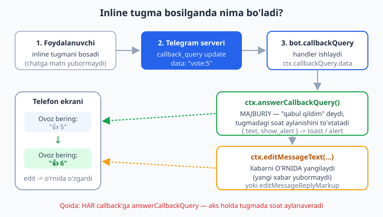
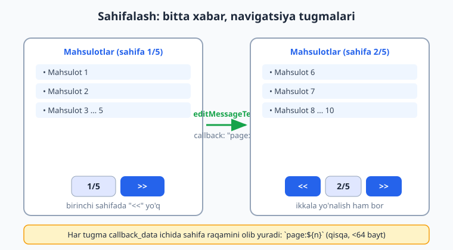
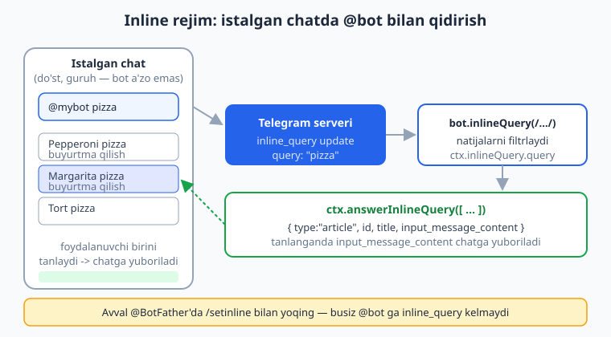

# 07 — Callback query va inline rejim

[⬅️ Oldingi: 06 — Klaviaturalar: reply va inline](./06-klaviaturalar.md) · [🏠 README](./README.md) · [Keyingi: 08 — Conversations — suhbatlar ➡️](./08-conversations.md)

---

> **Bu bobda:** 06-bobda inline klaviatura (`InlineKeyboard`) yasashni o'rgandik, lekin tugma bosilganda nima sodir bo'lishini chala qoldirdik. Endi to'liq yopamiz. Inline tugma bosilsa bot `callback_query` degan maxsus yangilanish (update) oladi — uni `bot.callbackQuery("data", handler)` yoki `bot.callbackQuery(/regex/, handler)` (regex guruhi `ctx.match[1]` da) bilan ushlaymiz. So'ng `ctx.answerCallbackQuery()` orqali "soat aylanishini" to'xtatish va toast/alert ko'rsatishni; `ctx.editMessageText` / `ctx.editMessageReplyMarkup` bilan mavjud xabarni **o'rnida** tahrirlashni (ovoz hisoblagichi, menyu o'tishlari); shu asosda **sahifalash (pagination)** qurishni; `callback_data` ni xavfsiz dizayn qilishni (`kalit:qiymat`, &lt;64 bayt) va nihoyat istalgan chatda `@bot ...` deb yozib ishlatiladigan **inline rejim**ni (`bot.inlineQuery`) o'rganamiz.
>
> **Halollik eslatmasi:** Bobdagi **butun handler mantig'i** — `bot.callbackQuery` (satr va regex), `ctx.answerCallbackQuery({ text, show_alert })`, `ctx.editMessageText` / `ctx.editMessageReplyMarkup`, `callback_data` kodlash/parslash, 64-bayt cheklovi, pagination chegaralari, `"message is not modified"` xatosini ushlash, `bot.inlineQuery` + `ctx.answerInlineQuery` — tokensiz, OFFLINE `bot.handleUpdate` ga soxta `callback_query`/`inline_query` update'ini berib va chiqayotgan API chaqiruvlarini transformer bilan ushlab **haqiqatan ishga tushirib tekshirildi** (13/13 test o'tdi). Jonli natija — tugma bosilganda telefonda toast/alert chiqishi, xabar o'rnida yangilanishi, `@bot` qidiruvi — `@BotFather` token + internet talab qiladi va matnda "illustrativ" deb belgilangan. Hech qayerda soxta "ishladi / xabar yetib bordi" yozilmagan.

---

## Callback query nima?

06-bobda **inline tugma** yasadik: `new InlineKeyboard().text("Ha", "yes")`. Reply tugmadan farqi shu — inline tugma bosilganda **chatga matn yubormaydi**. Uning o'rniga Telegram botingizga **`callback_query`** degan maxsus yangilanish jo'natadi. Bu yangilanish ichida tugmaga oldindan biriktirilgan **`callback_data`** satri keladi (bizning misolda `"yes"`). Handler shu satrga qarab "qaysi tugma bosildi" deb tushunadi.

Oqim quyidagicha:



Uchta asosiy narsa bor, hammasini ketma-ket o'rganamiz:

1. **`callback_data`** — tugmaga yashirin yozib qo'yiladigan satr (1..64 bayt). Masalan `"prod:view:42"`.
2. **`bot.callbackQuery(...)`** — bu satrga (yoki regexga) mos handler.
3. **`ctx.answerCallbackQuery()`** — Telegram'ga "qabul qildim" deb javob berish (MAJBURIY).

> **JS eslatma:** Bu kitob siz JavaScript/Node asoslarini bilasiz deb faraz qiladi (`async/await`, `Promise`, ESM `import`, massiv/obyekt metodlari). Agar bular yangi bo'lsa, avval [JavaScript — 0 dan Expertgacha](../js/README.md) ni o'qing. Biz Telegram/grammY'ga xos narsalarni to'liq tushuntiramiz.

---

## Eng oddiy callback handler

Avval `callback_data` ni oddiy satr sifatida ishlatamiz. 06-bobdagidek inline klaviatura yasaymiz, lekin endi tugma bosilishini ushlaymiz:

```js
// bot.js — eng oddiy callback misoli
import { Bot, InlineKeyboard } from "grammy";

const bot = new Bot(process.env.BOT_TOKEN); // .env dan, kodga YOZILMAYDI

bot.command("start", (ctx) => {
  const kb = new InlineKeyboard()
    .text("Salom ber", "say_hi")
    .text("Yopish", "close");
  return ctx.reply("Tugmani bosing:", { reply_markup: kb });
});

// callback_data === "say_hi" bo'lgan tugma bosilganda ishlaydi
bot.callbackQuery("say_hi", async (ctx) => {
  // Avval answer() — Telegram'ga "qabul qildim" deymiz (pastda batafsil)
  await ctx.answerCallbackQuery({ text: "Salom!" });
  // Endi xabarni o'rnida yangilaymiz
  await ctx.editMessageText("Botdan salom! 👋");
});

bot.callbackQuery("close", async (ctx) => {
  await ctx.answerCallbackQuery();
  // Faqat tugmalarni olib tashlaymiz, matn qoladi
  await ctx.editMessageReplyMarkup(); // markup'siz -> tugmalar yo'qoladi
});

bot.start(); // jonli polling — token+internet kerak (illustrativ)
```

Yangi narsalar:

- **`bot.callbackQuery("say_hi", handler)`** — `message` emas, `callback_query` yangilanishini ushlaydi. Argument — bosilgan tugmaning `callback_data` siga **aniq** mos kelishi kerak bo'lgan satr.
- **`ctx`** — bu yerda ichida `ctx.callbackQuery` bor (`message:text` da `ctx.message` bo'lgani kabi). `ctx.callbackQuery.data` (satr `"say_hi"`), `ctx.from` (kim bosgan), `ctx.callbackQuery.message` (qaysi xabardagi tugma bosilgan). `ctx.msg` ham shu xabarga ishora qiladi.
- **`ctx.answerCallbackQuery(...)`** — Telegram'ga javob. Bunisiz tugmada soat aylanaverib qoladi (pastda).
- **`ctx.editMessageText(...)`** — xabarni **o'rnida** yangilaydi (yangi xabar yubormaydi). `message_id` ni grammY `ctx`'dan avtomatik oladi — siz bermaysiz.

Telefonda bu shunday ko'rinadi (illustrativ — token+internet kerak): foydalanuvchi "Salom ber" tugmasini bosadi, ekran tepasida qisqa "Salom!" toast paydo bo'ladi, xabar matni "Botdan salom! 👋" ga aylanadi.

> **Anti-eskirish:** Internetda ko'p misol **Telegraf** yoki **node-telegram-bot-api** uchun. U yerda `bot.action("say_hi", ctx => ctx.answerCbQuery())` (Telegraf) yoki `bot.on("callback_query", ...)` (node-telegram-bot-api) ko'rasiz — bular grammY EMAS. grammY'da `bot.callbackQuery(...)` va `ctx.answerCallbackQuery(...)` ishlatiladi. Aralashtirmang.

Bu xatti-harakat OFFLINE tasdiqlandi: `say_hi` callback'ida `answerCallbackQuery` chaqiruvi `callback_query_id` bilan ketdi, `editMessageText` esa yangi matn bilan `message_id: 50` (ctx'dagi xabar) ga yo'naltirildi.

---

## `ctx.answerCallbackQuery()` — nega MAJBURIY?

Foydalanuvchi inline tugmani bosganda Telegram klientida tugmada kichik **soat (loading)** aylanishni boshlaydi. Bot `answerCallbackQuery` jo'natmaguncha bu soat ~30 soniya aylanaveradi va foydalanuvchiga "bot javob bermayapti" degan taassurot beradi. Shuning uchun **har** callback handlerida `ctx.answerCallbackQuery()` chaqirish shart — hatto ko'rsatadigan matn bo'lmasa ham (bo'sh chaqiruv).

`answerCallbackQuery` ning ikki ko'rinishi bor:

```js
// 1) TOAST — ekran tepasida qisqa paydo bo'lib yo'qoladi
await ctx.answerCallbackQuery({ text: "Saqlandi!" });

// 2) ALERT — markazda "OK" tugmali oyna, foydalanuvchi yopguncha turadi
await ctx.answerCallbackQuery({
  text: "Diqqat: bu amalni ortga qaytarib bo'lmaydi!",
  show_alert: true,
});

// 3) Bo'sh — hech narsa ko'rsatmaydi, faqat soatni to'xtatadi
await ctx.answerCallbackQuery();
```

- **`text`** — ko'rsatiladigan matn (HTML emas, oddiy matn; ~200 belgigacha).
- **`show_alert: true`** — toast emas, modal oyna (foydalanuvchi diqqatini jalb qiladi).
- **`url`** / **`cache_time`** — kamdan-kam kerak (`url` — o'yin yoki maxsus deep-link uchun, `cache_time` — Telegram javobni necha soniya keshlasin).

> **Qoida:** handlerda imkon qadar **tezroq** `answerCallbackQuery()` chaqiring, og'ir ish (DB so'rovi, fayl) keyin bo'lsin. Aks holda soat uzoq aylanadi. Ko'pincha birinchi qator `await ctx.answerCallbackQuery()` bo'ladi.

`{ text, show_alert: true }` payload'i OFFLINE tasdiqlandi — chiqayotgan `answerCallbackQuery` da `text` va `show_alert: true` to'g'ri ketdi.

---

## `bot.callbackQuery` filtri: satr, regex va `bot.on("callback_query:data")`

Tugmalar ko'paygach, har biriga alohida aniq satr yozish noqulay. grammY uch xil yo'l beradi:

```js
// 1) Aniq satr mosligi
bot.callbackQuery("menu:home", (ctx) => ctx.answerCallbackQuery());

// 2) Regex — guruhlar ctx.match'da. ctx.match[1] = birinchi guruh (STRING!)
bot.callbackQuery(/^page:(\d+)$/, async (ctx) => {
  const page = Number(ctx.match[1]); // "3" -> 3 (qo'lda Number())
  await ctx.answerCallbackQuery();
  // ...
});

// 3) Massiv — bir nechta aniq satr
bot.callbackQuery(["yes", "no"], (ctx) => ctx.answerCallbackQuery());

// 4) Hamma callback_data'li tugma (filtrsiz)
bot.on("callback_query:data", async (ctx) => {
  const data = ctx.callbackQuery.data; // satr
  await ctx.answerCallbackQuery();
});
```

Muhim nuans (OFFLINE tasdiqlandi): regex guruhi `ctx.match[1]` **satr** qaytaradi (`"3"`, son emas). Raqamga aylantirish kerak bo'lsa, o'zingiz `Number(ctx.match[1])` qiling. Bu — 04-bobdagi `bot.hears(/echo (.+)/)` dagi `ctx.match` bilan bir xil mantiq.

> **Eslatma:** `bot.on("callback_query:data")` — bu 04-bobdagi **filter query** (`bot.on("message:text")` kabi). `callback_query:data` "callback_query'da `data` maydoni bor" degani (o'yin tugmalarining `game_short_name` i emas). Aksariyat botlar uchun aynan shu kerak.

---

## `callback_data` dizayni: `kalit:qiymat` va 64-bayt cheklovi

Oddiy satr (`"say_hi"`, `"close"`) kichik botlarda yetadi. Lekin tugmaga **bir nechta** parametr yozish kerak bo'lsa-chi? Masalan "42-mahsulotni ko'rish"? Eng keng tarqalgan yondashuv — `kalit:qiymat` formati: ma'lumotni `:` bilan ajratib bitta satrga yig'ish, handlerda esa `split(":")` bilan parslash.

```js
// Tugma yasashda — kodlash
const productId = 42;
const kb = new InlineKeyboard()
  .text("Ko'rish", `prod:view:${productId}`)
  .text("Sotib olish", `prod:buy:${productId}`);

// Handlerda — parslash
bot.on("callback_query:data", async (ctx) => {
  const [ns, action, idStr] = ctx.callbackQuery.data.split(":");
  if (ns !== "prod") return; // bizning emas
  const id = Number(idStr); // STRING -> NUMBER, o'zimiz aylantiramiz
  await ctx.answerCallbackQuery();
  await ctx.editMessageText(`${id}-mahsulot, amal: ${action}`);
});
```

**Eng muhim cheklov: `callback_data` 64 BAYTdan oshmasligi kerak** (Telegram qoidasi). Oshsa, Telegram tugmani jimgina rad etadi — kodingiz xato bermaydi, lekin tugma "ishlamaydi" (klaviatura yuborishda 400 xatosi keladi). Shuning uchun callback'ga **uzun matn solmang, balki id soling**. Tekshirish uchun kichik yordamchi yozish foydali (OFFLINE tasdiqlandi):

```js
function encodeCb(prefix, ...parts) {
  const data = [prefix, ...parts].join(":");
  if (Buffer.byteLength(data, "utf8") > 64) {
    throw new Error("callback_data 64 baytdan oshdi: " + data);
  }
  return data;
}

encodeCb("prod", "view", 42); // "prod:view:42"  (OK)
encodeCb("x", "y".repeat(70)); // Error: 64 baytdan oshdi
```

> **Diqqat — bayt, belgi emas:** `Buffer.byteLength(data, "utf8")` baytlarni hisoblaydi. Lotin harf 1 bayt, emoji 4 baytgacha bo'lishi mumkin. Shu sabab `data.length` (belgilar soni) emas, **baytlarni** tekshiring.

> **Illustrativ — `@grammyjs/callback-data`:** Murakkab loyihalarda `callback_data` ni qo'lda kodlash/parslash zerikarli bo'lib qoladi. grammY ekotizimida buni soddalashtirib, sxema bilan yasash uchun **`@grammyjs/callback-data`** plagini bor (alohida paket). Bu yerda biz uni o'rnatmadik va sinamadik — faqat nomini eslatib o'tamiz; rasmiy hujjatdan o'rganing: [grammy.dev](https://grammy.dev/plugins). Bizning kitobda hamma joyda qo'lda `kalit:qiymat` yondashuvi yetarli.

---

## Xabarni tahrirlash: `editMessageText` vs `editMessageReplyMarkup`

Inline tugmalar bilan ishlashda eng ko'p ishlatiladigan amallar — mavjud xabarni **o'rnida** o'zgartirish (yangi xabar yubormay). Ikki asosiy metod:

| Metod | Nimani o'zgartiradi | Qachon |
|---|---|---|
| `ctx.editMessageText(text, { reply_markup })` | Xabar **matni** (va ixtiyoriy tugmalar) | Sahifalash, menyu o'tishlari |
| `ctx.editMessageReplyMarkup({ reply_markup })` | Faqat **tugmalar** (matn tegmaydi) | Tugma holatini yangilash (like/ovoz sanog'i) |

```js
// Matnni ham, tugmalarni ham yangilash
await ctx.editMessageText("Yangi sahifa matni", { reply_markup: newKb });

// Faqat tugmalarni yangilash (matn o'sha-o'sha)
await ctx.editMessageReplyMarkup({ reply_markup: newKb });

// Tugmalarni butunlay olib tashlash (markup'siz chaqiring)
await ctx.editMessageReplyMarkup();
```

grammY `message_id` ni `ctx` dan avtomatik oladi (OFFLINE tasdiqlandi: `editMessageText` chiqayotgan payload'da `message_id: 50` — ya'ni callback kelgan xabar — avtomatik turdi). Siz faqat yangi matn/markup berasiz.

### Stateless ovoz hisoblagichi (tekshirilgan)

`callback_data` ichiga joriy qiymatni yozib, har bosishda uni `+1` qilib tugmani yangilash — bot hech qayerda holat saqlamasligini bildiradi (stateless). Kichik holatlar uchun ajoyib:

```js
// vote.js — ovoz hisoblagichi (handler offline tekshirilgan)
import { Bot, InlineKeyboard } from "grammy";

const bot = new Bot(process.env.BOT_TOKEN);

function voteKb(count) {
  return new InlineKeyboard().text(`👍 ${count}`, `vote:${count}`);
}

bot.command("vote", (ctx) =>
  ctx.reply("Ovoz bering:", { reply_markup: voteKb(0) }),
);

bot.callbackQuery(/^vote:(\d+)$/, async (ctx) => {
  const next = Number(ctx.match[1]) + 1;
  await ctx.editMessageReplyMarkup({ reply_markup: voteKb(next) });
  await ctx.answerCallbackQuery({ text: `Ovoz: ${next}` });
});

bot.start();
```

OFFLINE natija (tugma `vote:5` bosildi): chiqayotgan `editMessageReplyMarkup` payload'ida yangi tugma matni `"👍 6"`, `callback_data` esa `"vote:6"` bo'ldi; `answerCallbackQuery` toast matni `"Ovoz: 6"` ketdi.

> **Diqqat — "joriy hisob" qayerda?** Bot hech qayerda joriy sonni **saqlamayapti** — qiymat har tugmaning `callback_data` siga yozilgan va keyingi bosishda undan o'qiladi. Bu juda yengil, lekin cheklangan: bir necha foydalanuvchi bir xabarga ovoz bersa, har biri o'z bosgan tugmasidagi sondan +1 qiladi (umumiy sanoq emas). Haqiqiy umumiy hisob uchun holatni serverda saqlash kerak — buni 10-bobda **sessiya va DB** bilan to'g'rilaymiz.

### Gotcha: `"message is not modified"`

Telegram bir xil matn/markup bilan tahrirlashni **rad etadi** va `400: Bad Request: message is not modified` qaytaradi. Masalan foydalanuvchi allaqachon ochiq sahifaning tugmasini qayta bossa. grammY'da bu `GrammyError` bo'lib otiladi (`bot.catch` ga boradi yoki `try/catch` bilan ushlanadi). Buni nazokat bilan yutish kerak:

```js
import { GrammyError } from "grammy";

bot.callbackQuery(/^page:(\d+)$/, async (ctx) => {
  const { text, kb } = renderPage(Number(ctx.match[1]));
  try {
    await ctx.editMessageText(text, { reply_markup: kb });
  } catch (e) {
    // "message is not modified" — bu xato emas, e'tiborsiz qoldiramiz
    if (
      e instanceof GrammyError &&
      e.description.includes("message is not modified")
    ) {
      // jim turamiz
    } else {
      throw e; // boshqa xatoni yashirmaymiz
    }
  }
  await ctx.answerCallbackQuery();
});
```

OFFLINE tasdiqlandi: transformer `editMessageText` ga 400 + `"message is not modified"` qaytarganda, `try/catch` uni ushladi va yutdi (qayta otmadi), keyin `answerCallbackQuery` baribir chaqirildi.

> **Eslatma:** `ctx.callbackQuery.message` juda eski bo'lsa (Telegram'da ~48 soatdan oshgan), uni tahrirlab bo'lmaydi. Bunday holda `ctx.reply(...)` bilan yangi xabar yuboring.

---

## Sahifalash (pagination) inline tugmalar bilan

Bu — callback'larning eng amaliy qo'llanilishi. Ko'p elementli ro'yxat bor (mahsulotlar, postlar) — uni bir xabarga sig'dirib bo'lmaydi. Yechim: bir vaqtda **bitta sahifa** ko'rsatib, `<<` / `>>` tugmalari bilan ulardan o'tish. Tugma bosilganda **bitta xabar** o'rnida yangilanadi.



Asosiy g'oya: har navigatsiya tugmasining `callback_data` siga **maqsad sahifa raqami** yoziladi (`page:1`, `page:2`, ...). Tugma bosilsa, handler shu raqamga mos sahifani chizadi va `editMessageText` qiladi.

Quyidagi pagination logikasi (chegaralar bilan: birinchi sahifada `<<` yo'q, oxirgisida `>>` yo'q) OFFLINE tekshirildi:

```js
// pagination.js — ro'yxatni sahifalash (logika offline tekshirilgan)
import { Bot, InlineKeyboard, GrammyError } from "grammy";

const bot = new Bot(process.env.BOT_TOKEN);

// Namuna ma'lumot (real loyihada bu DB'dan keladi)
const ITEMS = Array.from({ length: 23 }, (_, i) => `Mahsulot ${i + 1}`);
const PER_PAGE = 5;

const totalPages = () => Math.ceil(ITEMS.length / PER_PAGE); // 5

function renderPage(page) {
  const pages = totalPages();
  page = Math.max(0, Math.min(page, pages - 1)); // chegaradan chiqmaslik
  const start = page * PER_PAGE;
  const chunk = ITEMS.slice(start, start + PER_PAGE);

  const text =
    `<b>Mahsulotlar</b> (sahifa ${page + 1}/${pages})\n\n` +
    chunk.map((name) => `• ${name}`).join("\n");

  const kb = new InlineKeyboard();
  if (page > 0) kb.text("<<", `page:${page - 1}`);
  kb.text(`${page + 1}/${pages}`, "noop"); // joriy sahifa (hech narsa qilmaydi)
  if (page < pages - 1) kb.text(">>", `page:${page + 1}`);

  return { text, kb };
}

bot.command("list", (ctx) => {
  const { text, kb } = renderPage(0);
  return ctx.reply(text, { parse_mode: "HTML", reply_markup: kb });
});

bot.callbackQuery(/^page:(\d+)$/, async (ctx) => {
  const { text, kb } = renderPage(Number(ctx.match[1]));
  try {
    await ctx.editMessageText(text, { parse_mode: "HTML", reply_markup: kb });
  } catch (e) {
    if (
      !(e instanceof GrammyError && e.description.includes("message is not modified"))
    ) {
      throw e;
    }
  }
  await ctx.answerCallbackQuery();
});

// o'rta tugma — faqat soatni to'xtatadi
bot.callbackQuery("noop", (ctx) => ctx.answerCallbackQuery());

bot.start();
```

OFFLINE tekshiruv natijalari (klaviatura quruvchidan o'qib olingan tugma matnlari):

- `totalPages()` = **5** (23 element / 5 = yuqoriga yaxlitlab 5 sahifa).
- Sahifa 0: tugmalar `["1/5", ">>"]` — `<<` yo'q (to'g'ri, birinchi sahifa).
- Sahifa 2: `["<<", "3/5", ">>"]` — ikkala yo'nalish ham bor.
- Sahifa 4 (oxirgi): `["<<", "5/5"]` — `>>` yo'q; mahsulotlar `Mahsulot 21..23` (oxirgi sahifada 3 ta).
- Handler tekshiruvi: `page:1` callback'i kelganda chiqayotgan `editMessageText` matnida `"sahifa 2/5"` va `"Mahsulot 6"` bor edi, so'ng `answerCallbackQuery` chaqirildi. `noop` tugma esa faqat `answerCallbackQuery` qildi.

> **Maslahat:** Real loyihada `ITEMS` o'rniga DB'dan `LIMIT/OFFSET` bilan faqat kerakli sahifani o'qing — butun ro'yxatni xotiraga yuklamang. SQL/baza bilan ishlash uchun [../sql/README.md](../sql/README.md) ga qarang; biz buni 10-bobda bot ichida qilamiz.

> **Python bilan solishtirish:** aiogram (Python) kitobida xuddi shu sahifalash `CallbackData` factory (`pack()`/`unpack()`) bilan tiplangan tarzda yasaladi. grammY'da tayyor factory o'rniga sodda `page:${n}` satri va `Number(ctx.match[1])` ishlatamiz — yengilroq, lekin tipni o'zingiz tiklaysiz. Taqqoslash: [../tgbot-python/README.md](../tgbot-python/README.md).

---

## Inline rejim (`bot.inlineQuery`) — kirish

Hozirgacha bot bilan **uning chatida** ishladik. Inline rejim butunlay boshqacha tajriba beradi: foydalanuvchi **istalgan** chatda (do'sti bilan suhbatda, guruhda) `@botingiz pizza` deb yozadi va bot taklif qilgan natijalardan birini tanlab, o'sha chatga yuboradi — bot o'sha guruhga a'zo bo'lishi shart emas. Mashhur misol — `@gif`, `@vid`, `@wiki` botlari.



Foydalanuvchi `@bot ...` deb yozganda Telegram botga **`inline_query`** yangilanishini yuboradi. Bot unga natijalar ro'yxati bilan javob beradi.

**Birinchi — yoqish.** Inline rejim sukut bo'yicha o'chiq. `@BotFather` ga boring, `/setinline` ni tanlang, botingizni ko'rsating va placeholder matn bering (masalan "pizza qidiring..."). Busiz `@bot` ga hech qanday `inline_query` kelmaydi (jonli qadam — illustrativ).

Endi handler:

```js
// inline.js — inline rejim qidiruvi (handler offline tekshirilgan)
import { Bot } from "grammy";

const bot = new Bot(process.env.BOT_TOKEN);

const PRODUCTS = [
  "Pepperoni pizza",
  "Margarita pizza",
  "Tort pizza",
  "Lavash",
  "Burger",
  "Hot-dog",
];

// /.*/ -> har qanday so'rov (bo'sh ham). Odatda bitta umumiy handler bo'ladi.
bot.inlineQuery(/.*/, async (ctx) => {
  const query = ctx.inlineQuery.query.toLowerCase().trim();

  const found = query
    ? PRODUCTS.filter((p) => p.toLowerCase().includes(query))
    : PRODUCTS;

  // Telegram bir martada 50 tagacha natija qabul qiladi
  const results = found.slice(0, 50).map((name, i) => ({
    type: "article",
    id: String(i), // natijaning NOYOB id si
    title: name, // ro'yxatda ko'rinadigan sarlavha
    description: `${name} buyurtma qilish`, // ostidagi kichik matn
    input_message_content: {
      message_text: `Men <b>${name}</b> tanladim!`,
      parse_mode: "HTML",
    },
  }));

  await ctx.answerInlineQuery(results, {
    cache_time: 10, // Telegram natijani 10 soniya keshlaydi
    is_personal: true, // kesh har foydalanuvchi uchun alohida
  });
});

bot.start();
```

Tushuntirish:

- **`bot.inlineQuery(/.*/, handler)`** — `message`/`callback_query` emas, `inline_query` yangilanishini ushlaydi. Argument — so'rov matniga mos regex (`/.*/` = hammasi). Regex guruhlari `ctx.match` da bo'ladi (`bot.hears` dagidek).
- **`ctx.inlineQuery.query`** — `@bot` dan keyingi matn (foydalanuvchi nima qidirayotgani).
- **`ctx.inlineQuery.offset`** — sahifalash uchun (uzun ro'yxatlarda; pastdagi mashqda).
- **natija obyekti** — bu yerda `type: "article"` (matnli maqola). `id` (noyob bo'lishi shart), `title`, ixtiyoriy `description`, va majburiy `input_message_content` (tanlanganda chatga **nima** yuborilishi). Boshqa turlari ham bor: `type: "photo"`, `type: "document"` va h.k.
- **`input_message_content: { message_text }`** — tanlangan natija chatga matn sifatida yuboriladi.
- **`ctx.answerInlineQuery(results, { cache_time, is_personal })`** — natijalarni Telegram'ga qaytaradi.

OFFLINE tasdiqlandi: `query="pizza"` bilan handler 2 ta natija yasadi (`Pepperoni pizza`, `Margarita pizza`), chiqayotgan `answerInlineQuery` payload'ida `results.length === 2`, birinchi natija `type: "article"`, `title: "Pepperoni pizza"`, `input_message_content.message_text: "Men Pepperoni pizza tanladim!"` (HTML tagi sof matn sifatida saqlanadi, parse_mode bilan), va `cache_time: 10`, `is_personal: true` to'g'ri ketdi.

Regex guruhlari bilan ham ishlaydi (OFFLINE tasdiqlandi) — masalan kalkulyator:

```js
bot.inlineQuery(/^son (\d+)$/, async (ctx) => {
  const n = Number(ctx.match[1]); // "7" -> 7
  await ctx.answerInlineQuery([
    {
      type: "article",
      id: "1",
      title: `Kvadrat: ${n * n}`,
      input_message_content: { message_text: `${n}^2 = ${n * n}` },
    },
  ]);
});

// mos kelmagan so'rovga ham javob shart -> bo'sh ro'yxat
bot.on("inline_query", (ctx) => ctx.answerInlineQuery([]));
```

> **Diqqat — har `inline_query` ga javob bering:** Agar regex mos kelmasa va boshqa handler ushlamasa, Telegram javobsiz qoladi. Shu sabab oxirida `bot.on("inline_query", ...)` bilan **bo'sh ro'yxat** qaytaradigan fallback qo'yish yaxshi odat. OFFLINE: `son 7` -> "Kvadrat: 49", `salom` -> bo'sh ro'yxat (fallback).

> **Diqqat — soxta natija yo'q:** Bu yerda biz handler **funksiyasi to'g'ri ishlashini** (natija obyektlari yasalishi, `answerInlineQuery` chaqirilishi, payload tarkibi) offline tasdiqladik. Telefonda `@bot pizza` qidiruvi haqiqatan ishlashi `@BotFather` da `/setinline` + jonli Telegram talab qiladi — buni kitobda "ishladi" deb yozmaymiz, o'z botingizda sinab ko'rasiz.

---

## Hammasini ulash: kichik to'liq bot

Quyida `callback_data` `kalit:qiymat`, `editMessageText`, `answerCallbackQuery(alert)` va inline rejim bir joyda. Handler qismi offline tekshirilgan idiomlarga tayanadi; `bot.start()` (polling) — jonli, illustrativ.

```js
// app.js — to'liq misol (handlerlar offline-tasdiqlangan idiom; polling jonli)
import { Bot, InlineKeyboard, GrammyError } from "grammy";

const bot = new Bot(process.env.BOT_TOKEN);

const MENU = ["Profil", "Sozlamalar", "Yordam"];

function menuKb() {
  const kb = new InlineKeyboard();
  MENU.forEach((name) => kb.text(name, `menu:${name}`).row());
  kb.text("O'chirish", "del");
  return kb;
}

bot.command("start", (ctx) =>
  ctx.reply("<b>Asosiy menyu</b>", { parse_mode: "HTML", reply_markup: menuKb() }),
);

// menu:<bo'lim> — bo'lim tafsiloti + "Orqaga"
bot.callbackQuery(/^menu:(.+)$/, async (ctx) => {
  const item = ctx.match[1];
  await ctx.answerCallbackQuery();
  const back = new InlineKeyboard().text("⬅️ Orqaga", "back");
  try {
    await ctx.editMessageText(`Siz <b>${item}</b> bo'limini tanladingiz.`, {
      parse_mode: "HTML",
      reply_markup: back,
    });
  } catch (e) {
    if (!(e instanceof GrammyError && e.description.includes("message is not modified"))) {
      throw e;
    }
  }
});

bot.callbackQuery("back", async (ctx) => {
  await ctx.answerCallbackQuery();
  await ctx.editMessageText("<b>Asosiy menyu</b>", {
    parse_mode: "HTML",
    reply_markup: menuKb(),
  });
});

bot.callbackQuery("del", async (ctx) => {
  await ctx.answerCallbackQuery({ text: "Xabar o'chirildi", show_alert: true });
  await ctx.deleteMessage();
});

// Inline rejim — menyu bo'limlarini qidirish
bot.inlineQuery(/.*/, async (ctx) => {
  const q = ctx.inlineQuery.query.toLowerCase().trim();
  const items = q ? MENU.filter((m) => m.toLowerCase().includes(q)) : MENU;
  const results = items.map((name, i) => ({
    type: "article",
    id: String(i),
    title: name,
    input_message_content: { message_text: `Bo'lim: ${name}` },
  }));
  await ctx.answerInlineQuery(results, { cache_time: 5, is_personal: true });
});

bot.start();
```

> **Eslatma — handler tartibi:** grammY handlerlarni **ro'yxatdan o'tgan tartibda** tekshiradi (03-bobdagi Composer mantig'i). Aniqroq filtr (`bot.callbackQuery("back")`) umumiyroq filtrdan (`bot.callbackQuery(/^menu:(.+)$/)` yoki `bot.on("callback_query:data")`) **oldin** turishi kerak, aks holda umumiy handler avval ushlab oladi.

---

## OFFLINE testni o'zingiz yozish

Spec'imizning oltin qoidasi: handlerni jonli Telegram'siz sinash. grammY'da bu juda toza — `bot.handleUpdate(update)` ga soxta `callback_query` update'ini beramiz va `bot.api.config.use(transformer)` bilan chiqayotgan API chaqiruvlarini ushlaymiz. (Bu naqshni 16-bobda Vitest bilan rasmiylashtiramiz.)

```js
// verify.mjs — node verify.mjs bilan ishga tushadi (token+internet kerak emas)
import { Bot, InlineKeyboard } from "grammy";
import assert from "node:assert/strict";

const bot = new Bot("12345:FAKE-OFFLINE-TOKEN");
// init() tarmoqqa chiqmasligi uchun botInfo ni qo'lda beramiz:
bot.botInfo = {
  id: 12345, is_bot: true, first_name: "T", username: "t_bot",
  can_join_groups: true, can_read_all_group_messages: false,
  supports_inline_queries: true, can_connect_to_business: false,
  has_main_web_app: false,
};

const calls = [];
bot.api.config.use((prev, method, payload) => {
  calls.push({ method, payload }); // chiqayotgan API'ni yozib olamiz
  return Promise.resolve({ ok: true, result: true }); // soxta natija
});

// SINALADIGAN handler:
bot.callbackQuery(/^vote:(\d+)$/, async (ctx) => {
  const next = Number(ctx.match[1]) + 1;
  await ctx.editMessageReplyMarkup({
    reply_markup: new InlineKeyboard().text(`👍 ${next}`, `vote:${next}`),
  });
  await ctx.answerCallbackQuery({ text: `Ovoz: ${next}` });
});

// soxta callback_query update (tugma bosilgan):
await bot.handleUpdate({
  update_id: 1,
  callback_query: {
    id: "cbq1",
    from: { id: 777, is_bot: false, first_name: "Ali" },
    chat_instance: "ci",
    data: "vote:5",
    message: {
      message_id: 50, date: 0,
      chat: { id: 777, type: "private" },
      from: { id: 12345, is_bot: true, first_name: "T", username: "t_bot" },
      text: "Ovoz bering:",
    },
  },
});

assert.equal(calls[0].method, "editMessageReplyMarkup");
assert.equal(calls[0].payload.reply_markup.inline_keyboard[0][0].callback_data, "vote:6");
assert.equal(calls[1].method, "answerCallbackQuery");
assert.equal(calls[1].payload.text, "Ovoz: 6");
console.log("O'TDI: vote:5 -> tugma 'vote:6', toast 'Ovoz: 6'");
```

Pattern kaliti:

- **`bot.botInfo = {...}`** — `bot.init()` ni `getMe` uchun tarmoqqa chiqishdan to'xtatadi (soxta token bilan ulanmaymiz).
- **`bot.api.config.use(transformer)`** — chiqayotgan har bir API chaqiruvini ushlaydi, biz qaysi metod va payload borligini tekshiramiz.
- **`callback_query` update** — `message:text` o'rniga `callback_query` obyekti; `data` maydoni tugmaning `callback_data` siga teng. (Buyruq update'idan farqi: bu yerda `bot_command` entity kerak emas — u faqat `/start` kabi buyruqlar uchun edi.)

Bu bobdagi 13 ta tekshiruv aynan shu naqsh bilan yozilib, `13/13` o'tdi.

---

## Tez-tez uchraydigan xatolar

| Xato | Sabab | Yechim |
|---|---|---|
| Tugmada soat aylanaveradi | `ctx.answerCallbackQuery()` chaqirilmagan | HAR callback handlerda chaqiring (bo'sh bo'lsa ham) |
| Tugma "ishlamaydi", xato yo'q | `callback_data` 64 baytdan oshgan | `Buffer.byteLength(data,"utf8") <= 64` ni ta'minlang; uzun matn emas, **id** soling |
| `400: message is not modified` | bir xil matn/markup bilan `editMessageText` | `try/catch` + `GrammyError` da `description.includes("message is not modified")` ni yuting |
| `ctx.match[1]` raqam kutilgan, lekin satr | regex guruhi har doim **string** qaytaradi | `Number(ctx.match[1])` bilan aylantiring |
| `@bot` qidiruvi ishlamaydi | inline rejim yoqilmagan | `@BotFather` da `/setinline` bilan yoqing |
| Inline natija chiqmaydi / Telegram rad etadi | `id` takrorlangan yoki `input_message_content` yo'q | har natijaga **noyob** `id`; `article` da `input_message_content` MAJBURIY |
| `inline_query` javobsiz qoladi | regex mos kelmadi, fallback yo'q | oxirida `bot.on("inline_query", c => c.answerInlineQuery([]))` qo'shing |
| Telegraf/node-telegram-bot-api idiomlari | boshqa kutubxona misoli | grammY: `bot.callbackQuery`, `ctx.answerCallbackQuery`, `bot.inlineQuery` |

---

## Mashqlar

Quyidagi mashqlarning aksariyati OFFLINE tekshiriladi — yuqoridagi "OFFLINE testni o'zingiz yozish" naqshidan foydalaning (`bot.botInfo` + transformer + `bot.handleUpdate(callback_query)`).

### Oson

1. Ikkita tugmali (`callback_data` `"yes"` va `"no"`) klaviatura yasab, "yes" bosilganda toast `"Tasdiqlandi"`, "no" bosilganda alert `"Bekor qilindi"` (`show_alert: true`) chiqaradigan handlerlar yozing.
2. Bitta tugmali "like" yozing: bosilganda `editMessageReplyMarkup` bilan matnini `"👍 N"` dan `"👍 N+1"` ga o'zgartiradi (`callback_data` ichida sanoq yuradi, masalan `like:N`).
3. `ctx.from.first_name` dan foydalanib, tugma bosilganda `"Salom, <ism>!"` deb `editMessageText` qiladigan handler yozing.
4. `callback_data` ni `"clr:red"` formatida yasang; handlerda `split(":")` bilan rangni ajratib oling va `ctx.answerCallbackQuery({ text: "Tanlangan rang: " + rang })` qiling. OFFLINE: toast matni `"Tanlangan rang: red"` ekanini tasdiqlang.
5. `encodeCb` yordamchisini yozing (yuqoridagidek): `"prod:view:42"` ni qaytarsin, 70 belgilik qiymatda `Error` tashlasin. `assert` bilan ikkala holatni tekshiring.

### O'rta

6. 30 elementli ro'yxatni 6 tadan sahifalang (5 sahifa). `renderPage(2)` qaysi elementlarni qaytarishini (`Element 13..18`) va navigatsiya tugmalari matnini (`["<<", "3/5", ">>"]`) `assert` bilan tekshiring.
7. Pagination handleriga `"message is not modified"` ni ushlovchi `try/catch` (+ `GrammyError`) qo'shing. OFFLINE: transformer `editMessageText` ga 400 qaytarsa ham handler yiqilmasligini va `answerCallbackQuery` baribir chaqirilishini tasdiqlang.
8. `callback_data` ni `"item:5"` va `"item:5:3"` (id va ixtiyoriy qty) formatida parslang: `split(":")` natijasiga qarab `qty` bor-yo'qligini aniqlang (`qty` bo'lmasa `null`). Ikkala satr uchun parslangan obyektni `assert` bilan tekshiring.
9. Inline qidiruv handlerini yozing: 10 ta shahar ro'yxatidan `ctx.inlineQuery.query` ga mos kelganlarini `type: "article"` natijalar qilib qaytaring (bo'sh so'rovda hammasini). OFFLINE: `query="tosh"` bilan `Toshkent` qaytishini tasdiqlang.
10. Ovoz hisoblagichiga "Reset" tugmasini qo'shing — bosilganda `editMessageReplyMarkup` bilan qiymatni `0` ga qaytaradi va `show_alert: true` bilan alert ko'rsatadi. Diqqat: alert matnini lotin alifbosida (`"Nollandi"`) yozing, kirillda emas. OFFLINE: yangi tugma `callback_data` si `"vote:0"` ekanini tasdiqlang.

### Qiyin

11. Inline rejimda `offset` bilan sahifalashni amalga oshiring: 100 elementli ro'yxatni 50 tadan ikki "sahifa" qilib, `ctx.answerInlineQuery(results, { next_offset })` bilan qaytaring. Birinchi javobda `next_offset: "50"`, ikkinchisida `next_offset: ""` (boshqa yo'q). OFFLINE: bo'sh `offset` da 50 ta natija va `next_offset === "50"`, `offset="50"` da 50 ta natija va `next_offset === ""` ekanini tasdiqlang.
12. "Savat" botini yozing: `callback_data` `"cart:add:<id>"` / `"cart:remove:<id>"`. Tugmalar savatga qo'shadi/oladi va `editMessageText` bilan joriy savat tarkibini ko'rsatadi. Savatni xotirada `Map` (`userId -> { productId: qty }`) da saqlang (vaqtinchalik — 10-bobda DB bilan to'g'rilanadi). OFFLINE: bir foydalanuvchi `cart:add:1` ni ikki marta bossa, savatda 1-mahsulot `x2` bo'lishini tasdiqlang.
13. To'liq OFFLINE test yozing: 6-mashqdagi pagination handleringizni `bot.handleUpdate` bilan sinang — `page:0` xabaridan `page:1` ga o'tilganda chiqayotgan `editMessageText` matnida `"sahifa 2/5"` borligini va so'ng `answerCallbackQuery` chaqirilishini `assert` bilan tasdiqlang.

<details markdown="1">
<summary>Yechimlar</summary>

### 1-mashq yechimi

```js
import { Bot, InlineKeyboard } from "grammy";
const bot = new Bot(process.env.BOT_TOKEN);

bot.command("confirm", (ctx) =>
  ctx.reply("Tasdiqlaysizmi?", {
    reply_markup: new InlineKeyboard().text("Ha", "yes").text("Yo'q", "no"),
  }),
);

bot.callbackQuery("yes", (ctx) => ctx.answerCallbackQuery({ text: "Tasdiqlandi" })); // toast
bot.callbackQuery("no", (ctx) =>
  ctx.answerCallbackQuery({ text: "Bekor qilindi", show_alert: true }),
); // alert
```

Toast — `show_alert` bermasdan; alert — `show_alert: true`.

### 2-mashq yechimi

```js
function likeKb(count) {
  return new InlineKeyboard().text(`👍 ${count}`, `like:${count}`);
}

bot.command("like", (ctx) => ctx.reply("Yoqdimi?", { reply_markup: likeKb(0) }));

bot.callbackQuery(/^like:(\d+)$/, async (ctx) => {
  const next = Number(ctx.match[1]) + 1;
  await ctx.editMessageReplyMarkup({ reply_markup: likeKb(next) });
  await ctx.answerCallbackQuery();
});
```

`callback_data` ichida joriy sanoq yuradi; regex guruhdan o'qib, `+1` qilamiz va `editMessageReplyMarkup` bilan tugmani yangilaymiz.

### 3-mashq yechimi

```js
bot.callbackQuery("greet", async (ctx) => {
  const name = ctx.from.first_name; // tugmani BOSGAN foydalanuvchi
  await ctx.answerCallbackQuery();
  await ctx.editMessageText(`Salom, ${name}!`);
});
```

`ctx.from` — tugmani **bosgan** foydalanuvchi (xabar egasi — botning o'zi emas).

### 4-mashq yechimi

```js
bot.on("callback_query:data", async (ctx) => {
  const [ns, value] = ctx.callbackQuery.data.split(":");
  if (ns !== "clr") return;
  await ctx.answerCallbackQuery({ text: "Tanlangan rang: " + value });
});
// Tugma: new InlineKeyboard().text("Qizil", "clr:red")
```

OFFLINE tekshirilganda `clr:red` callback'i kelsa, `answerCallbackQuery` payload'ida `text === "Tanlangan rang: red"` bo'ladi.

### 5-mashq yechimi

```js
import assert from "node:assert/strict";

function encodeCb(prefix, ...parts) {
  const data = [prefix, ...parts].join(":");
  if (Buffer.byteLength(data, "utf8") > 64) {
    throw new Error("callback_data 64 baytdan oshdi: " + data);
  }
  return data;
}

assert.equal(encodeCb("prod", "view", 42), "prod:view:42");
assert.throws(() => encodeCb("x", "y".repeat(70)), /64 baytdan oshdi/);
console.log("O'TDI");
```

`Buffer.byteLength(...,"utf8")` baytlarni hisoblaydi (belgi emas) — emoji yoki uzun matn solinsa, oldindan ushlaymiz.

### 6-mashq yechimi

```js
import assert from "node:assert/strict";
import { InlineKeyboard } from "grammy";

const ITEMS = Array.from({ length: 30 }, (_, i) => `Element ${i + 1}`);
const PER_PAGE = 6;
const totalPages = () => Math.ceil(ITEMS.length / PER_PAGE); // 5

function renderPage(page) {
  const pages = totalPages();
  page = Math.max(0, Math.min(page, pages - 1));
  const start = page * PER_PAGE;
  const chunk = ITEMS.slice(start, start + PER_PAGE);
  const kb = new InlineKeyboard();
  if (page > 0) kb.text("<<", `page:${page - 1}`);
  kb.text(`${page + 1}/${pages}`, "noop");
  if (page < pages - 1) kb.text(">>", `page:${page + 1}`);
  return { chunk, kb };
}

const labels = (kb) => kb.inline_keyboard[0].map((b) => b.text);
const p2 = renderPage(2);
assert.deepEqual(p2.chunk, ["Element 13", "Element 14", "Element 15", "Element 16", "Element 17", "Element 18"]);
assert.deepEqual(labels(p2.kb), ["<<", "3/5", ">>"]);
console.log("O'TDI");
```

2-sahifa (0-indeksli) = elementlar 13..18. O'rta sahifada ikkala navigatsiya tugmasi ham bor.

### 7-mashq yechimi

```js
import { GrammyError } from "grammy";

bot.callbackQuery(/^page:(\d+)$/, async (ctx) => {
  const { text, kb } = renderPage(Number(ctx.match[1]));
  try {
    await ctx.editMessageText(text, { reply_markup: kb });
  } catch (e) {
    if (!(e instanceof GrammyError && e.description.includes("message is not modified"))) {
      throw e; // boshqa xatoni yashirmaymiz
    }
  }
  await ctx.answerCallbackQuery();
});
```

OFFLINE: transformer'da `editMessageText` uchun `{ ok:false, error_code:400, description:"Bad Request: message is not modified" }` qaytaring. Handler bu xatoni yutadi (qayta otmaydi) va `answerCallbackQuery` baribir chaqiriladi. Foydalanuvchi joriy ochiq sahifani qayta bosgan holatda aynan shu yuz beradi — bu xato emas.

### 8-mashq yechimi

```js
import assert from "node:assert/strict";

function parseItem(data) {
  const parts = data.split(":"); // ["item","5"] yoki ["item","5","3"]
  return {
    id: Number(parts[1]),
    qty: parts[2] !== undefined ? Number(parts[2]) : null,
  };
}

assert.deepEqual(parseItem("item:5"), { id: 5, qty: null });
assert.deepEqual(parseItem("item:5:3"), { id: 5, qty: 3 });
console.log("O'TDI");
```

`split(":")` natijasi uzunligiga qarab `qty` ixtiyoriy. Bu — Python aiogram'dagi `CallbackData` `Optional` maydoniga teng yondashuv, lekin qo'lda.

### 9-mashq yechimi

```js
import { Bot } from "grammy";
const bot = new Bot(process.env.BOT_TOKEN);

const CITIES = ["Toshkent", "Samarqand", "Buxoro", "Xiva", "Andijon",
  "Namangan", "Farg'ona", "Nukus", "Qarshi", "Termiz"];

bot.inlineQuery(/.*/, async (ctx) => {
  const q = ctx.inlineQuery.query.toLowerCase().trim();
  const found = q ? CITIES.filter((c) => c.toLowerCase().includes(q)) : CITIES;
  const results = found.map((city, i) => ({
    type: "article",
    id: String(i),
    title: city,
    input_message_content: { message_text: `Shahar: ${city}` },
  }));
  await ctx.answerInlineQuery(results, { cache_time: 10, is_personal: true });
});
```

OFFLINE: `query="tosh"` bilan natijalar massivida `title: "Toshkent"` bo'ladi (bo'sh so'rovda hamma 10 shahar).

### 10-mashq yechimi

```js
import { InlineKeyboard } from "grammy";

function voteKb(count) {
  return new InlineKeyboard()
    .text(`👍 ${count}`, `vote:${count}`)
    .text("🔄 Reset", "vote:reset");
}

bot.callbackQuery("vote:reset", async (ctx) => {
  await ctx.editMessageReplyMarkup({ reply_markup: voteKb(0) });
  await ctx.answerCallbackQuery({ text: "Nollandi", show_alert: true });
});
```

> Diqqat: `"vote:reset"` handleri `/^vote:(\d+)$/` regexidan oldin turishi kerak (yoki regex faqat raqam ushlaganidan reset baribir tushib qoladi — `\d+` "reset" ga mos kelmaydi, shuning uchun bu yerda tartib muhim emas, lekin odat sifatida aniqni oldinga qo'ying). Alert matni lotin alifbosida — `"Nollandi"`. OFFLINE: yangi tugma `callback_data` si `"vote:0"` bo'ladi.

### 11-mashq yechimi

```js
import { Bot } from "grammy";
const bot = new Bot(process.env.BOT_TOKEN);

const BIG = Array.from({ length: 100 }, (_, i) => `Element ${i + 1}`);
const PAGE = 50;

bot.inlineQuery(/.*/, async (ctx) => {
  const offset = ctx.inlineQuery.offset ? Number(ctx.inlineQuery.offset) : 0;
  const chunk = BIG.slice(offset, offset + PAGE);
  const results = chunk.map((name, i) => ({
    type: "article",
    id: String(offset + i),
    title: name,
    input_message_content: { message_text: name },
  }));
  const next_offset = offset + PAGE < BIG.length ? String(offset + PAGE) : "";
  await ctx.answerInlineQuery(results, { cache_time: 10, is_personal: true, next_offset });
});
```

Foydalanuvchi natijalar ro'yxatini pastga skroll qilganda Telegram avval bergan `next_offset` qiymati bilan yangi `inline_query` yuboradi. `next_offset: ""` (bo'sh) — "boshqa natija yo'q" degani. OFFLINE: bo'sh `offset` -> 50 natija + `next_offset: "50"`; `offset="50"` -> 50 natija + `next_offset: ""`.

### 12-mashq yechimi

```js
import { Bot, InlineKeyboard, GrammyError } from "grammy";
const bot = new Bot(process.env.BOT_TOKEN);

const PRODUCTS = { 1: "Olma", 2: "Banan", 3: "Uzum" };
// Vaqtinchalik savat: userId -> { productId: qty }. 10-bobda DB bilan to'g'rilanadi.
const CARTS = new Map();

function cartText(userId) {
  const cart = CARTS.get(userId) ?? {};
  const entries = Object.entries(cart);
  if (entries.length === 0) return "<b>Savat bo'sh.</b>";
  const lines = entries.map(([pid, qty]) => `• ${PRODUCTS[pid]} x${qty}`);
  return "<b>Savat:</b>\n" + lines.join("\n");
}

function cartKb() {
  const kb = new InlineKeyboard();
  for (const [pid, name] of Object.entries(PRODUCTS)) {
    kb.text(`➕ ${name}`, `cart:add:${pid}`).text(`➖ ${name}`, `cart:remove:${pid}`).row();
  }
  return kb;
}

bot.command("cart", (ctx) =>
  ctx.reply(cartText(ctx.from.id), { parse_mode: "HTML", reply_markup: cartKb() }),
);

bot.callbackQuery(/^cart:(add|remove):(\d+)$/, async (ctx) => {
  const action = ctx.match[1];
  const pid = ctx.match[2]; // string kalit (obyekt kaliti)
  const uid = ctx.from.id;
  const cart = CARTS.get(uid) ?? {};

  if (action === "add") {
    cart[pid] = (cart[pid] ?? 0) + 1;
  } else {
    if (cart[pid]) {
      cart[pid] -= 1;
      if (cart[pid] <= 0) delete cart[pid];
    }
  }
  CARTS.set(uid, cart);

  await ctx.answerCallbackQuery();
  try {
    await ctx.editMessageText(cartText(uid), { parse_mode: "HTML", reply_markup: cartKb() });
  } catch (e) {
    if (!(e instanceof GrammyError && e.description.includes("message is not modified"))) throw e;
  }
});
```

OFFLINE: `cart:add:1` ni ikki marta yuborsangiz, `CARTS.get(uid)` `{ "1": 2 }` bo'ladi va `cartText` `"• Olma x2"` chiqaradi. Savat xotirada — bot qayta ishga tushsa yo'qoladi (10-bobda DB bilan to'g'rilanadi).

### 13-mashq yechimi

```js
// test_pagination.mjs — node test_pagination.mjs
import { Bot, InlineKeyboard } from "grammy";
import assert from "node:assert/strict";

const ITEMS = Array.from({ length: 30 }, (_, i) => `Element ${i + 1}`);
const PER_PAGE = 6;
const totalPages = () => Math.ceil(ITEMS.length / PER_PAGE);

function renderPage(page) {
  const pages = totalPages();
  page = Math.max(0, Math.min(page, pages - 1));
  const chunk = ITEMS.slice(page * PER_PAGE, (page + 1) * PER_PAGE);
  const text = `Sahifa ${page + 1}/${pages}: ` + chunk.join(", ");
  const kb = new InlineKeyboard();
  if (page > 0) kb.text("<<", `page:${page - 1}`);
  if (page < pages - 1) kb.text(">>", `page:${page + 1}`);
  return { text, kb };
}

const bot = new Bot("12345:FAKE");
bot.botInfo = {
  id: 12345, is_bot: true, first_name: "T", username: "t_bot",
  can_join_groups: true, can_read_all_group_messages: false,
  supports_inline_queries: true, can_connect_to_business: false, has_main_web_app: false,
};
const calls = [];
bot.api.config.use((prev, method, payload) => {
  calls.push({ method, payload });
  return Promise.resolve({ ok: true, result: true });
});

bot.callbackQuery(/^page:(\d+)$/, async (ctx) => {
  const { text, kb } = renderPage(Number(ctx.match[1]));
  await ctx.editMessageText(text, { reply_markup: kb });
  await ctx.answerCallbackQuery();
});

await bot.handleUpdate({
  update_id: 1,
  callback_query: {
    id: "q", from: { id: 2, is_bot: false, first_name: "A" }, chat_instance: "ci",
    data: "page:1",
    message: { message_id: 1, date: 0, chat: { id: 1, type: "private" },
      from: { id: 12345, is_bot: true, first_name: "T", username: "t_bot" }, text: "Sahifa 1/5: ..." },
  },
});

assert.equal(calls[0].method, "editMessageText");
assert.ok(calls[0].payload.text.includes("Sahifa 2/5"));
assert.equal(calls[1].method, "answerCallbackQuery");
console.log("O'TDI: page:1 -> editMessageText(Sahifa 2/5) + answerCallbackQuery");
```

Transformer API chaqiruvlarini yozadi; biz `editMessageText` (sahifa o'tdi, matnda "Sahifa 2/5") va `answerCallbackQuery` (soat to'xtatildi) chaqirilganini tasdiqlaymiz — jonli Telegram'siz.

</details>

---

[⬅️ Oldingi: 06 — Klaviaturalar: reply va inline](./06-klaviaturalar.md) · [🏠 README](./README.md) · [Keyingi: 08 — Conversations — suhbatlar ➡️](./08-conversations.md)
