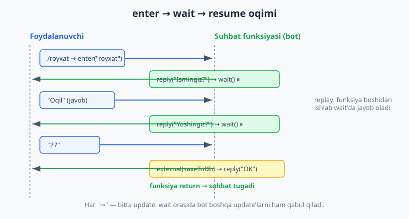
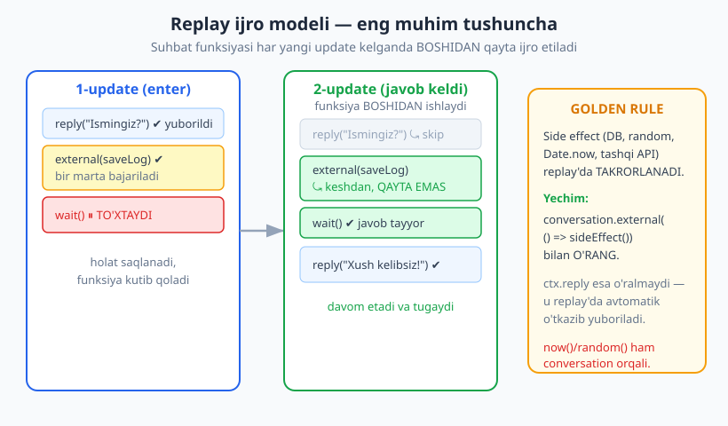
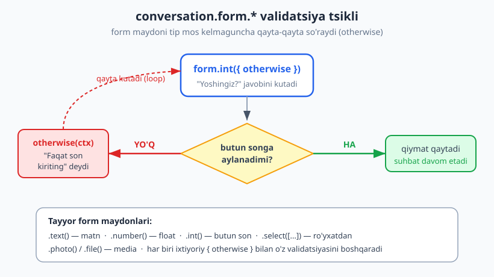

# 08 — Conversations — suhbatlar (ko'p qadamli forma)

[⬅️ Oldingi: 07 — Callback query va inline rejim](./07-callback-inline.md) · [🏠 README](./README.md) · [Keyingi: 09 — Middleware va Composer daraxti ➡️](./09-middleware.md)

---

> **Bu bobda:** botingiz foydalanuvchidan ketma-ket bir nechta narsa so'rashi kerak bo'lganda — ism -> yosh -> shahar -> tasdiq — oddiy handlerlar yetmaydi: har bir javob alohida update bo'lib keladi va siz "qaysi savolda turibmiz?" degan holatni qo'lda saqlashga majbur bo'lasiz. `@grammyjs/conversations` plugini buni hal qiladi: siz oddiy, yuqoridan pastga o'qiladigan funksiya yozasiz, `await conversation.wait()` esa kodni o'sha joyda "to'xtatib", keyingi xabar kelganda davom ettiradi — go'yo `prompt()` chaqirgandek. Biz pluginni o'rnatamiz, `createConversation`/`enter` bilan suhbatga kiramiz, `wait`/`waitFor`/`form.*` bilan javob kutamiz, eng muhimi — **replay modeli** va uning oltin qoidasini (`conversation.external`) tushunamiz. Yakunda to'liq ro'yxatdan o'tish formasini quramiz va aiogram'ning FSM yondashuvi bilan solishtiramiz.

> **Halollik eslatmasi:** bu bobdagi BARCHA suhbat mantig'i — `enter -> waitFor -> reply` tsikli, to'liq forma (`form.text/int/select` + `otherwise`), `waitForCallbackQuery` bilan tasdiq, `external` orqali side-effect, `now()`/`random()` determinizmi, `halt()` va `ctx.conversation.exit()` — **offline ishga tushirilib tekshirilgan** (soxta `Update`'larni `bot.handleUpdate`'ga uzatib va API chaqiruvlarini transformer bilan ushlab; replay engine'ning ichki konteksti uchun transformer `plugins` orqali ulangan). Test natijasi: **6/6 PASS** — bob oxiridagi hisobotda. Jonli Telegram bilan ishlash token va internet talab qiladi.

---

## Muammo: ko'p qadamli muloqotni qanday boshqarish kerak?

Tasavvur qiling, foydalanuvchini ro'yxatdan o'tkazmoqchisiz: ism, yosh va shaharni so'rashingiz kerak. "Oddiy" handlerlar bilan yondashsak, muammo darhol ko'rinadi:

```js
// ❌ YOMON yondashuv — holatni qo'lda saqlash kerak
bot.command("royxat", (ctx) => ctx.reply("Ismingiz?"));

bot.on("message:text", (ctx) => {
  // Bu handler HAR BIR matnga ishlaydi. Lekin kelgan matn ism mi, yosh mi, shahar mi?
  // Biz qaysi qadamda turganimizni qayerdadir saqlashimiz kerak...
  // ...va navbatdagi savolni qo'lda tanlashimiz kerak. Tez orada bu chalkash bo'lib ketadi.
});
```

Har bir javob alohida `update` bo'lib keladi, va handlerlar **holatsiz** (stateless): bitta handler tugagach, hech narsa "eslab qolinmaydi". "Qaysi savolda turibmiz?" degan holatni siz sessiyada (10-bob) qo'lda saqlashga, `if (step === "ism") ... else if (step === "yosh") ...` kabi shoxlarga, va har bir tarmoqni validatsiya qilishga majbur bo'lasiz. Uch-to'rt qadamda bu kod o'qib bo'lmaydigan holga keladi.

**conversations plugini** boshqacha yo'l taklif qiladi: siz suhbatni **oddiy, ketma-ket funksiya** sifatida yozasiz, go'yo terminalda `prompt()` chaqirayotgandek:

```js
async function royxat(conversation, ctx) {
  await ctx.reply("Ismingiz?");
  const { message: m1 } = await conversation.waitFor("message:text"); // KUTADI
  await ctx.reply("Yoshingiz?");
  const { message: m2 } = await conversation.waitFor("message:text"); // KUTADI
  await ctx.reply(`Salom, ${m1.text}! Siz ${m2.text} yoshdasiz.`);
}
```

Kod yuqoridan pastga, tabiiy o'qiladi. `await conversation.waitFor(...)` chaqirig'i funksiyani **o'sha joyda to'xtatadi** va foydalanuvchidan keyingi xabar kelguncha kutadi. Holatni siz boshqarmaysiz — plugin buni siz uchun qiladi.

> **Eslatma:** `@grammyjs/conversations` ikki katta versiyaga bo'linadi. Bu kitob **v2** (`2.1.1`) dan foydalanadi — u v1 dan jiddiy farq qiladi (replay engine, yangi `external`, yangi `form`). Internetdagi eski misollarda `conversation.session`, `conversation.wait()` ning eski shakli yoki boshqa API uchrashi mumkin — ular **bu yerda ishlamaydi**. Har doim v2 hujjatiga tayaning.

---

## O'rnatish va ulash

Plugin alohida paket sifatida keladi:

```bash
npm install @grammyjs/conversations
```

Uni ulash uchun ikki bosqich kerak: avval `conversations()` middleware'ini ulaysiz (u suhbatlar uchun "dvigatel"ni o'rnatadi), keyin har bir suhbat funksiyasini `createConversation()` bilan ro'yxatdan o'tkazasiz:

```js
import { Bot } from "grammy";
import { conversations, createConversation } from "@grammyjs/conversations";

const bot = new Bot(process.env.BOT_TOKEN);

// Suhbat funksiyasi: birinchi argument — conversation handle, ikkinchi — boshlang'ich ctx
async function ism(conversation, ctx) {
  await ctx.reply("Ismingiz?");
  const { message } = await conversation.waitFor("message:text");
  await ctx.reply(`Xush kelibsiz, ${message.text}!`);
}

bot.use(conversations());            // 1) avval plugin dvigateli
bot.use(createConversation(ism));    // 2) keyin har bir suhbat
bot.command("ism", (ctx) => ctx.conversation.enter("ism")); // 3) kirish nuqtasi

bot.start();
```

> **Diqqat — tartib muhim.** `bot.use(conversations())` `createConversation(...)` dan **OLDIN** turishi shart. Aks holda `ctx.conversation` mavjud bo'lmaydi va "Cannot read properties of undefined" yoki shunga o'xshash xato olasiz. Bu eng ko'p uchraydigan birinchi xato.

Bog'lanish zanjiri shunday:

- `conversations()` — `ctx.conversation` ob'ektini va replay dvigatelini o'rnatadi.
- `createConversation(fn)` — `fn` funksiyasini suhbat sifatida ro'yxatdan o'tkazadi. Suhbatning nomi standart holda funksiya nomi bo'ladi (`ism`). Nomni alohida berish ham mumkin: `createConversation(fn, "boshqa-nom")`.
- `ctx.conversation.enter("ism")` — foydalanuvchini suhbatga **kiritadi**. Shu paytdan boshlab, keyingi update'lar suhbat funksiyasidagi `wait` chaqiruvlariga yo'naltiriladi.

---

## Builder funksiyasi: `(conversation, ctx)`

Suhbat funksiyasi (uni **builder** yoki suhbat funksiyasi deb ataymiz) ikki argument oladi:

```js
async function mySuhbat(conversation, ctx) {
  // conversation — suhbatni boshqarish "pulti": wait, waitFor, form, external, halt, ...
  // ctx — suhbatga KIRGAN paytdagi boshlang'ich kontekst (masalan /royxat buyrug'i)
}
```

- **`conversation`** — suhbat handle'i. U orqali keyingi xabarlarni kutasiz (`wait`, `waitFor`), forma maydonlarini olasiz (`form.*`), side-effect'larni o'raysiz (`external`) va suhbatni tugatasiz (`halt`).
- **`ctx`** — bu suhbatga kirgan dastlabki update'ning konteksti. `wait` chaqirgandan keyin esa **yangi** ctx'larni `wait`/`waitFor` qaytaradi — ikkinchi argument `ctx` boshlang'ich holatda qoladi.

Eng muhim usul — `conversation.wait()`:

```js
async function suhbat(conversation, ctx) {
  await ctx.reply("Biror narsa yuboring:");
  const newCtx = await conversation.wait(); // istalgan update'ni kutadi (matn, rasm, callback, ...)
  await ctx.reply("Rahmat!");
}
```

`wait()` istalgan turdagi update'ni kutadi. Lekin ko'pincha bizga aniq tur kerak — matn, rasm yoki callback. Buning uchun **filtrli kutish** usullari bor (filter query'lar — 04-bobdagi `bot.on(...)` filtrlariga o'xshash):

```js
const ctx1 = await conversation.waitFor("message:text");      // faqat matnli xabar
const { message } = await conversation.waitFor("message:text"); // odatda darhol destructure qilamiz
const ctx2 = await conversation.waitFor("message:photo");     // faqat rasm
const ctx3 = await conversation.waitForCallbackQuery("ok");   // faqat callback (data === "ok")
const ctx4 = await conversation.waitForHears(["ha", "yo'q"]);  // matn "ha" yoki "yo'q"
const ctx5 = await conversation.waitForCommand("bekor");      // /bekor buyrug'i
```

`waitFor("message:text")` matn kelmaguncha (masalan rasm kelsa) update'ni **o'tkazib yuboradi** (skip) va kutishda davom etadi. Ya'ni filtr mos kelmagan update suhbatni davom ettirmaydi.



---

## REPLAY MODELI — eng muhim tushuncha

Endi conversations'ning eng muhim (va boshlovchini eng ko'p chalkashtiradigan) jihatiga keldik. **Suhbat funksiyasi oddiy JavaScript funksiyasidek ishlamaydi.**

JavaScript'da `await` haqiqatan ham kodni "to'xtatib", keyin o'sha joydan davom ettiradi. Lekin Telegram boti uzun vaqt kutib o'tira olmaydi: foydalanuvchi javobni 5 daqiqadan keyin yuborishi mumkin, server esa qayta ishga tushishi mumkin. Shuning uchun conversations boshqacha hiyladan foydalanadi: u suhbat funksiyasini **har yangi update kelganda boshidan qaytadan ijro etadi** (bunga **replay** — qayta ijro deyiladi), va `wait` chaqiruvlariga yetganda allaqachon kelgan javoblardan foydalanadi.

Ya'ni:

1. **1-update (enter):** funksiya boshidan ishlaydi. `reply("Ismingiz?")` yuboriladi. Birinchi `wait()`'ga yetganda funksiya **uziladi** (interrupt) va holat saqlanadi.
2. **2-update (foydalanuvchi javobi):** funksiya **yana boshidan** ishlaydi. `reply("Ismingiz?")` chaqirig'i bu safar haqiqatan yuborilmaydi — plugin uni o'tkazib yuboradi (chunki u allaqachon yuborilgan). Birinchi `wait()` endi tayyor javobni qaytaradi va funksiya davom etadi — ikkinchi `wait()`'ga yetguncha.



Bu kuchli model, lekin bitta jiddiy oqibati bor: **funksiya tanasi bir necha marta ishlaydi.** Agar siz funksiya ichida to'g'ridan-to'g'ri `Math.random()`, `Date.now()`, ma'lumotlar bazasiga yozish yoki tashqi API chaqirsangiz — bular **har replay'da takrorlanadi.** Tasodifiy son har safar boshqacha bo'ladi (holat buziladi), DB'ga bir o'rniga uch marta yoziladi.

### GOLDEN RULE — side-effect'ni `conversation.external` bilan o'rang

Oltin qoida: **suhbat ichidagi har qanday "tashqi dunyo" amali — DB, `Math.random`, `Date.now`, tashqi API, fayl o'qish — `conversation.external()` ichiga o'ralishi SHART.** `external` bergan funksiyani faqat **bir marta** (real ijroda) chaqiradi, natijani keshlaydi, va keyingi replay'larda o'sha keshlangan qiymatni qaytaradi.

```js
async function suhbat(conversation, ctx) {
  // ❌ YOMON: replay'da har safar boshqa son bo'ladi -> holat buziladi
  const yomon = Math.random();

  // ✅ YAXSHI: bir marta hisoblanadi, replay'da o'sha qiymat qaytadi
  const yaxshi = await conversation.external(() => Math.random());

  // ✅ DB yozuvi ham external ichida (replay'da takrorlanmaydi)
  const id = await conversation.external(() => saveToDatabase({ user: ctx.from.id }));

  // Tez-tez kerak bo'lgani uchun alohida qisqartmalar ham bor:
  const son = await conversation.random();  // Math.random() ning xavfsiz varianti
  const vaqt = await conversation.now();    // Date.now() ning xavfsiz varianti
}
```

> **Diqqat — `ctx.reply` ni o'ramang.** Telegram API chaqiruvlari (`ctx.reply`, `ctx.api.*`) **istisno**: ularni `external` bilan o'ramaysiz. Plugin replay paytida bu chaqiruvlarni avtomatik tarzda o'tkazib yuboradi (chunki ular allaqachon bajarilgan). Aslida, Bot API chaqirig'ini `external` ichida qilish **xato** — plugin buni taqiqlaydi. Qoida sodda: **Telegram'ga gapirish — to'g'ridan-to'g'ri; boshqa hamma narsa — `external` orqali.**

> **`external` qaytaradigan ma'lumot seriyalanadigan bo'lsin.** `external` natijasi saqlanadi (replay uchun keshlanadi), shuning uchun u JSON'ga aylantirilishi mumkin bo'lishi kerak. ORM ob'ektlarini (masalan Sequelize/Prisma model instansiyasini) to'g'ridan-to'g'ri qaytarmang — ulardagi metodlar yo'qoladi. Faqat oddiy ma'lumot (`id`, son, satr, oddiy ob'ekt) qaytaring.

Quyidagi test buni amalda isbotlaydi (offline ishga tushirilgan): `external`'siz hisoblagich replay'da 3 marta o'sadi, `external` ichidagi esa aynan 1 marta:

```js
let xom = 0, xavfsiz = 0;
async function demo(conversation, ctx) {
  xom++;                                         // har replay'da o'sadi
  await conversation.external(() => { xavfsiz++; }); // faqat bir marta
  await ctx.reply("1-qadam");
  await conversation.waitFor("message:text");
  await ctx.reply("2-qadam");
  await conversation.waitFor("message:text");
  await ctx.reply("3-qadam");
}
// 3 ta update'dan keyin: xom === 3 (takror!), xavfsiz === 1 (to'g'ri)
```

---

## `conversation.form.*` — validatsiyali maydonlar

Ko'pincha bizga shunchaki "matn kutish" emas, balki **muayyan turdagi** javob kerak: butun son (yosh), float (narx), ro'yxatdagi qiymat (shahar). `conversation.form` shu uchun tayyor maydonlarni beradi. Har biri kelgan javobni tekshiradi; mos kelmasa, ixtiyoriy `otherwise` chaqirilib, maydon **yana kutadi** — to'g'ri qiymat kelmaguncha.

```js
async function forma(conversation, ctx) {
  await ctx.reply("Ismingiz?");
  const ism = await conversation.form.text();   // istalgan matn -> string

  await ctx.reply("Yoshingiz? (butun son)");
  const yosh = await conversation.form.int({
    otherwise: (ctx) => ctx.reply("Iltimos, butun son kiriting."),
  });

  await ctx.reply("Narxni kiriting:");
  const narx = await conversation.form.number(); // parseFloat -> number

  await ctx.reply(`${ism}, ${yosh} yosh, narx ${narx}`);
}
```

Eng foydali maydonlar:

| Maydon | Nimani kutadi | Qaytaradi |
|---|---|---|
| `form.text()` | matnli xabar | `string` |
| `form.number()` | songa aylanadigan matn (`parseFloat`) | `number` (float) |
| `form.int({ radix })` | butun songa aylanadigan matn (`parseInt`) | `number` (butun) |
| `form.select(["A","B"])` | ro'yxatdagi satrlardan biri | tanlangan satr |
| `form.photo()` | rasm | `PhotoSize[]` |
| `form.file()` | fayl (`ctx.getFile` chaqiradi) | `File` ob'ekti |

`form.select` ayniqsa klaviatura bilan yaxshi ishlaydi — tugma matnlarini ro'yxat sifatida bersangiz, faqat o'sha qiymatlardan biri qabul qilinadi:

```js
const shaharlar = ["Toshkent", "Samarqand", "Buxoro"];
await ctx.reply("Shaharni tanlang:", {
  reply_markup: new Keyboard()
    .text("Toshkent").text("Samarqand").text("Buxoro")
    .oneTime().resized(),
});
const shahar = await conversation.form.select(shaharlar, {
  otherwise: (ctx) => ctx.reply("Tugmalardan birini tanlang."),
});
```



> **Eslatma:** `otherwise` — kiritma noto'g'ri bo'lganda bir marta chaqiriladigan callback. U faqat foydalanuvchiga xabar berishi kerak; maydonning o'zi avtomatik ravishda yana kutadi. `otherwise` bermasangiz, noto'g'ri kiritma jimgina o'tkazib yuboriladi (foydalanuvchi nima xato qilganini bilmaydi) — shuning uchun deyarli har doim `otherwise` bering.

---

## To'liq misol: ro'yxatdan o'tish formasi

Endi hammasini birlashtiramiz: ism (matn) -> yosh (butun son, validatsiyali) -> shahar (ro'yxatdan tanlash) -> inline tugma bilan tasdiq -> `external` orqali "saqlash". Bu — bobning markaziy, offline tekshirilgan misoli.

```js
import { Bot, InlineKeyboard, Keyboard } from "grammy";
import { conversations, createConversation } from "@grammyjs/conversations";

const bot = new Bot(process.env.BOT_TOKEN);

// "Soxta DB" — haqiqiy loyihada bu better-sqlite3 yoki boshqa baza bo'ladi (10-bob)
const baza = [];
function saqla(yozuv) {
  baza.push(yozuv);
  return baza.length; // yangi yozuv ID'si
}

async function royxat(conversation, ctx) {
  // 1) Ism — oddiy matn
  await ctx.reply("Keling, ro'yxatdan o'tamiz. Ismingiz?");
  const ism = await conversation.form.text();

  // 2) Yosh — butun son, validatsiya bilan
  await ctx.reply("Yoshingiz? (faqat butun son)");
  const yosh = await conversation.form.int({
    otherwise: (ctx) => ctx.reply("Iltimos, butun son kiriting (masalan 25)."),
  });

  // 3) Shahar — ro'yxatdan tanlash (Keyboard bilan)
  const shaharlar = ["Toshkent", "Samarqand", "Buxoro"];
  await ctx.reply("Shaharingizni tanlang:", {
    reply_markup: new Keyboard()
      .text("Toshkent").text("Samarqand").text("Buxoro")
      .oneTime().resized(),
  });
  const shahar = await conversation.form.select(shaharlar, {
    otherwise: (ctx) => ctx.reply("Iltimos, tugmalardan birini tanlang."),
  });

  // 4) Tasdiq — inline tugma bilan
  await ctx.reply(`Tasdiqlaysizmi?\nIsm: ${ism}\nYosh: ${yosh}\nShahar: ${shahar}`, {
    reply_markup: new InlineKeyboard().text("✅ Ha", "ok").text("❌ Yo'q", "cancel"),
  });
  const cq = await conversation.waitForCallbackQuery(["ok", "cancel"]);
  await cq.answerCallbackQuery(); // "soatcha" aylanishini to'xtatamiz (07-bob)

  if (cq.match === "cancel") {
    await ctx.reply("Bekor qilindi. Qaytadan boshlash uchun /royxat.");
    return; // funksiyadan chiqish = suhbat tugaydi
  }

  // 5) Saqlash — SIDE EFFECT, shuning uchun external ichida!
  const id = await conversation.external(() => saqla({ ism, yosh, shahar }));
  await ctx.reply(`Rahmat, ${ism}! Siz ro'yxatdan o'tdingiz (ID: ${id}).`);
}

bot.use(conversations());
bot.use(createConversation(royxat));
bot.command("royxat", (ctx) => ctx.conversation.enter("royxat"));

bot.start();
```

Bu kodni o'qib chiqing: u tabiiy, yuqoridan pastga oqadi — go'yo bitta funksiya doimo ishlab turgandek. Aslida esa har bir `await` orasida funksiya uziladi va keyingi update kelganda boshidan replay qilinadi. `saqla()` faqat `external` ichida bo'lgani uchun, DB'ga aynan bir marta yoziladi — replay'da takrorlanmaydi.

> **Illustrativ:** yuqoridagi `bot.start()` jonli polling boshlaydi (token + internet kerak). Suhbat mantig'ining o'zi esa — `enter`, `form.text/int/select`, `waitForCallbackQuery`, `external` — offline ishga tushirilib tekshirilgan (bob oxiridagi hisobot). `external` aynan bir marta ishlashi, `int`/`select` ning `otherwise` shoxlari ishlashi assert bilan tasdiqlangan.

---

## Suhbatdan chiqish: `return`, `halt()`, `exit()`

Suhbatni tugatishning uch yo'li bor:

**1) Oddiy `return`** — funksiya tabiiy tugaydi. Eng keng tarqalgan usul (yuqoridagi "Bekor" shoxi).

**2) `conversation.halt()`** — suhbat **ichidan** darhol to'xtatish. `return`'dan farqi: `halt` darhol ishlaydi (chuqur ichkarida, ichki funksiyalarda ham), va u `Promise<never>` qaytaradi, shuning uchun undan keyingi kod ishlamaydi.

```js
async function parol(conversation, ctx) {
  await ctx.reply("Parolni kiriting:");
  const { message } = await conversation.waitFor("message:text");
  if (message.text !== process.env.SECRET) {
    await ctx.reply("Noto'g'ri parol. Suhbat tugadi.");
    await conversation.halt(); // darhol to'xtaydi — quyidagi qator ishlamaydi
  }
  await ctx.reply("Kirildi!"); // faqat parol to'g'ri bo'lsa
}
```

**3) `ctx.conversation.exit("nom")`** — suhbatni **tashqaridan**, boshqa handler ichidan to'xtatish. Masalan, foydalanuvchi suhbat o'rtasida `/bekor` yozsa.

> **Diqqat — bu yerda nozik gotcha bor (men duch keldim).** Faol suhbatning `waitFor("message:text")` chaqirig'i matnli har qanday xabarni "yutib" yuboradi — `/bekor` ham matn, shuning uchun u suhbatga tushadi va sizning `bot.command("bekor")` handleringizga **yetib bormaydi.** Yechim: `/bekor` handlerini `conversations()` dan **KEYIN**, lekin `createConversation()` dan **OLDIN** qo'ying. Shunda u faol suhbat update'ni ko'rishidan oldin ishlaydi:

```js
bot.use(conversations());

// /bekor — conversations'dan keyin, createConversation'dan OLDIN
bot.command("bekor", async (ctx) => {
  await ctx.conversation.exit("royxat"); // faol "royxat" suhbatini to'xtatadi
  await ctx.reply("Suhbat bekor qilindi.");
});

bot.use(createConversation(royxat));
bot.command("royxat", (ctx) => ctx.conversation.enter("royxat"));
```

Boshqa foydali boshqaruv usullari:

```js
ctx.conversation.active();          // { royxat: 1 } kabi — qaysi suhbatlar faol
ctx.conversation.active("royxat");  // necha marta faol (0 = faol emas)
await ctx.conversation.exitAll();   // barcha faol suhbatlarni to'xtatish
```

---

## Saqlash (storage) — qayta ishga tushishdan keyin ham

Standart holda suhbat holati **xotirada** saqlanadi: bot qayta ishga tushsa, yarim qolgan suhbatlar yo'qoladi. Production'da buni xohlamaysiz. `conversations()` ga `storage` bering — masalan fayl adapteri (10-bobda DB adapteri bilan ham ko'ramiz):

```js
import { conversations } from "@grammyjs/conversations";
import { FileAdapter } from "@grammyjs/storage-file";

bot.use(conversations({
  storage: {
    type: "key",
    version: 0, // suhbat kodini o'zgartirsangiz, bu raqamni oshiring
    adapter: new FileAdapter({ dirName: "convo-data" }),
  },
}));
```

> **Anti-eskirish:** `version` ni jiddiy qabul qiling. Suhbat funksiyasini o'zgartirsangiz (yangi `wait` qo'shsangiz, tartibni o'zgartirsangiz), eski saqlangan holat yangi kod bilan mos kelmasligi mumkin — bu replay'da xatoga olib keladi. `version` ni oshirish eski (mos kelmaydigan) holatni bekor qiladi.

---

## aiogram FSM bilan solishtirish (Python ekvivalenti)

Agar siz Python'dagi [aiogram kitobining 08-bobini](../tgbot-python/README.md) ko'rgan bo'lsangiz, u yerda **FSM** (Finite State Machine — chekli holatlar mashinasi) ishlatilgan: `StatesGroup`/`State` bilan holatlarni **deklarativ** e'lon qilasiz, har bir holat uchun alohida handler yozasiz, va `state.set_state(...)` bilan holatdan holatga o'tasiz.

| | aiogram (Python) — FSM | grammY (JS) — conversations v2 |
|---|---|---|
| Holatni e'lon qilish | `class Reg(StatesGroup): ism = State()` | Holat yo'q — oddiy lokal o'zgaruvchilar |
| Har qadam | alohida handler + `@router.message(Reg.ism)` | bitta funksiya ichida ketma-ket `await` |
| Holat saqlash | FSM storage (Redis/xotira) | replay engine + `external` |
| Keyingi xabarni olish | yangi handler chaqiriladi | `await conversation.wait()` o'sha joyda |
| Side-effect ehtiyotkorligi | odatiy (handler bir marta ishlaydi) | **`external` SHART** (replay'da takror) |

Qisqasi: aiogram'da siz holatlarni **bo'lib** yozasiz (har holat — alohida handler), grammY'da esa **bitta uzluksiz funksiya** sifatida yozasiz. grammY yondashuvi ko'pincha o'qish uchun qulayroq, lekin replay modeli yangi tushuncha — `external` qoidasini unutmaslik kerak. aiogram'da bunday "replay tuzog'i" yo'q, lekin uning evaziga ko'proq qoziq kod (har holat uchun handler) yoziladi.

---

## Tez-tez uchraydigan xatolar

| Xato | Sabab | Yechim |
|---|---|---|
| `ctx.conversation` undefined | `conversations()` ulanmagan yoki `createConversation` dan keyin ulangan | `bot.use(conversations())` ni `createConversation` dan OLDIN qo'ying |
| Suhbat har replay'da DB'ga qayta yozadi | Side-effect to'g'ridan-to'g'ri funksiya tanasida | `conversation.external(() => saqla())` bilan o'rang |
| `Math.random`/`Date.now` har safar boshqacha | Replay'da qayta hisoblanadi | `conversation.random()` / `conversation.now()` ishlating |
| `/bekor` suhbat ichida "yutilib" ketadi | Faol `waitFor("message:text")` matnni oladi | `/bekor` handlerini `conversations()` dan keyin, `createConversation` dan oldin qo'ying; ichida `ctx.conversation.exit(...)` |
| Bot qayta ishga tushgach suhbat yo'qoladi | Standart storage xotirada | `storage` (FileAdapter yoki DB) bering |
| `external` natijasi saqlanmaydi / xato | ORM/funksiyali ob'ekt qaytarilgan | `external`'dan faqat seriyalanadigan (JSON) ma'lumot qaytaring |
| Eski misoldagi `conversation.session` ishlamaydi | v1 API ishlatilgan | v2'da `external(ctx => ctx.session...)` yoki tashqi session ishlating |
| `wait`'dan keyin eski `ctx` ishlatish | `ctx` boshlang'ich update'da qoladi | yangi ma'lumotni `wait`/`waitFor` qaytargan ctx'dan oling |

---

## Mashqlar

Quyidagi mashqlarning ko'pi **offline tekshiriladi**: soxta `Update`'ni `bot.handleUpdate(...)` ga uzatib, API chaqiruvlarini transformer bilan ushlab. Suhbat testida transformer'ni `plugins` orqali ham ulang (replay engine ichki ctx uchun yangi `Api` quradi) — bob oxiridagi naqshga qarang.

### Oson

1. **Eng sodda suhbat.** Bitta savol beruvchi suhbat yozing: `/salom` -> "Ismingiz?" -> javob -> "Salom, {ism}!". `enter -> waitFor -> reply` tsikli.
2. **Tartib xatosini ko'ring.** `bot.use(conversations())` ni `createConversation(...)` dan KEYIN qo'ying va botni ishga tushiring. Qanday xato chiqadi? Tartibni to'g'rilang.
3. **`form.text` bilan.** 1-mashqni `conversation.form.text()` yordamida qayta yozing (`waitFor` o'rniga).
4. **Ikki qadam.** Ism va shaharni so'rang, ikkalasini bitta xabarda qaytaring: "Salom {ism}, siz {shahar}danmisiz?".

### O'rta

5. **Butun son validatsiyasi.** Yoshni `form.int({ otherwise })` bilan so'rang. "abc" yuborilsa "Faqat son kiriting" desin, "30" yuborilsa qabul qilsin. Offline: noto'g'ri keyin to'g'ri javob bering, ikkala holat ham to'g'ri ishlashini tekshiring.
6. **`select` bilan menyu.** Uchta til (`Uzbekcha`, `Ruscha`, `Inglizcha`) ni `Keyboard` + `form.select` bilan so'rang. Ro'yxatdan tashqari matnga `otherwise` ishlasin.
7. **Inline tasdiq.** Bir savol so'rang, so'ng `waitForCallbackQuery(["ok","cancel"])` bilan tasdiq oling. `cq.match` ga qarab ikki xil javob bering. `answerCallbackQuery` ni unutmang.
8. **`external` bilan saqlash.** Foydalanuvchi ismini massivga "saqlovchi" suhbat yozing. Saqlashni `conversation.external` ichiga oling. Offline: ikki marta update berib, massivda **bitta** yozuv borligini tasdiqlang (replay'da takrorlanmasligi).
9. **`halt` bilan parol.** Parol so'rang; noto'g'ri bo'lsa `halt()` bilan to'xtating, to'g'ri bo'lsa "Kirildi" deng. Offline: xato parol keyin "Kirildi" chiqmasligini tekshiring.

### Qiyin

10. **To'liq forma.** Bobdagi `royxat` suhbatini to'liq qayta quring (ism -> yosh -> shahar -> tasdiq -> external). Offline: noto'g'ri yosh -> noto'g'ri shahar -> to'g'ri qiymatlar -> "ok" ketma-ketligini berib, saqlangan yozuv to'g'ri ekanini va `external` bir marta ishlaganini assert qiling.
11. **Tashqi `/bekor`.** 10-mashqqa `/bekor` qo'shing (`ctx.conversation.exit`). Uni to'g'ri joyga (conversations'dan keyin, createConversation'dan oldin) qo'ying. Offline: suhbatni boshlab, `/bekor` yuborib, suhbat to'xtaganini va keyingi matn suhbatga tushmasligini tekshiring.
12. **Determinizm.** Suhbat boshida `conversation.random()` bilan tasodifiy 4 xonali kod yarating, foydalanuvchidan uni qaytarishni so'rang, tekshiring. Offline: ikki marta ijro (replay) da kod **bir xil** bo'lishini assert qiling (`random()` o'rniga `Math.random()` ishlatib, buzilishini ham ko'ring).
13. **Sikl bilan ro'yxat.** Foydalanuvchidan "yana?" deb so'rab, bir nechta element (masalan vazifalar ro'yxati) yig'ing — `while (true)` ichida `waitFor` va "tugadi" so'zida `break`. Yig'ilgan ro'yxatni `external` bilan saqlang.

<details markdown="1">
<summary>Yechimlar</summary>

> Offline test naqshi (barcha suhbat yechimlari shu skeletdan foydalanadi). `installOffline` transformer'ni `plugins` orqali suhbatning ichki ctx'siga ham ulaydi — bu SHART, aks holda suhbat ichidagi `ctx.reply` haqiqiy tarmoqqa chiqishga urinadi.

```js
import { Bot, InlineKeyboard, Keyboard } from "grammy";
import { conversations, createConversation } from "@grammyjs/conversations";
import assert from "node:assert/strict";

function makeBot() {
  const bot = new Bot("12345:FAKE");
  bot.botInfo = { id: 12345, is_bot: true, first_name: "T", username: "t_bot",
    can_join_groups: true, can_read_all_group_messages: false,
    supports_inline_queries: false, can_connect_to_business: false, has_main_web_app: false };
  const calls = [];
  const tr = (prev, method, payload) => {
    calls.push({ method, payload });
    if (method === "sendMessage")
      return Promise.resolve({ ok: true, result: { message_id: 1, date: 0,
        chat: { id: payload.chat_id, type: "private" }, text: payload.text } });
    return Promise.resolve({ ok: true, result: true });
  };
  bot.api.config.use(tr);
  const installOffline = (ctx, next) => { ctx.api.config.use(tr); return next(); };
  return { bot, calls, installOffline };
}
function mkText(text, id = 1) {
  const m = { message_id: id, date: 0, text, chat: { id: 777, type: "private" },
    from: { id: 777, is_bot: false, first_name: "Ali" } };
  if (text.startsWith("/")) m.entities = [{ type: "bot_command", offset: 0, length: text.split(/\s/)[0].length }];
  return { update_id: id, message: m };
}
function mkCb(data, id = 1) {
  return { update_id: id, callback_query: { id: "c" + id,
    from: { id: 777, is_bot: false, first_name: "Ali" }, chat_instance: "ci", data,
    message: { message_id: 1, date: 0, chat: { id: 777, type: "private" } } } };
}
const texts = (calls) => calls.filter((c) => c.method === "sendMessage").map((c) => c.payload.text);
```

### 1-mashq yechimi

```js
async function salom(conversation, ctx) {
  await ctx.reply("Ismingiz?");
  const { message } = await conversation.waitFor("message:text");
  await ctx.reply(`Salom, ${message.text}!`);
}
const { bot, calls, installOffline } = makeBot();
bot.use(conversations({ plugins: [installOffline] }));
bot.use(createConversation(salom));
bot.command("salom", (ctx) => ctx.conversation.enter("salom"));

await bot.handleUpdate(mkText("/salom", 1));
await bot.handleUpdate(mkText("Oqil", 2));
assert.ok(texts(calls).includes("Salom, Oqil!"));
```

`enter` "Ismingiz?" yuboradi va `waitFor`'da to'xtaydi; ikkinchi update javobni keltiradi va funksiya tugaydi.

### 2-mashq yechimi

```js
// ❌ Noto'g'ri tartib:
bot.use(createConversation(salom)); // ctx.conversation hali yo'q!
bot.use(conversations());
// -> enter chaqirilganda "Cannot read properties of undefined (reading 'enter')" turidagi xato.
// ✅ To'g'risi: conversations() avval, createConversation keyin.
```

`createConversation` `ctx.conversation` ob'ektiga tayanadi, uni esa `conversations()` o'rnatadi — shuning uchun u oldin turishi shart.

### 3-mashq yechimi

```js
async function salom(conversation, ctx) {
  await ctx.reply("Ismingiz?");
  const ism = await conversation.form.text(); // matnni to'g'ridan-to'g'ri string sifatida oladi
  await ctx.reply(`Salom, ${ism}!`);
}
```

`form.text()` `waitFor("message:text")` + matnni ajratib olishni bitta chaqiruvda qiladi.

### 4-mashq yechimi

```js
async function tanish(conversation, ctx) {
  await ctx.reply("Ismingiz?");
  const ism = await conversation.form.text();
  await ctx.reply("Qaysi shahardansiz?");
  const shahar = await conversation.form.text();
  await ctx.reply(`Salom ${ism}, siz ${shahar}danmisiz?`);
}
// Offline: /tanish -> "Oqil" -> "Toshkent" => "Salom Oqil, siz Toshkentdanmisiz?"
```

Ikki ketma-ket `form.text()` — ikki alohida `wait`. Orasida funksiya replay qilinadi, lekin biz buni sezmaymiz.

### 5-mashq yechimi

```js
async function yoshSura(conversation, ctx) {
  await ctx.reply("Yoshingiz?");
  const yosh = await conversation.form.int({
    otherwise: (ctx) => ctx.reply("Faqat son kiriting."),
  });
  await ctx.reply(`Yoshingiz: ${yosh}`);
}
const { bot, calls, installOffline } = makeBot();
bot.use(conversations({ plugins: [installOffline] }));
bot.use(createConversation(yoshSura));
bot.command("y", (ctx) => ctx.conversation.enter("yoshSura"));

await bot.handleUpdate(mkText("/y", 1));
await bot.handleUpdate(mkText("abc", 2)); // otherwise
await bot.handleUpdate(mkText("30", 3));  // qabul
const t = texts(calls);
assert.ok(t.includes("Faqat son kiriting."));
assert.ok(t.includes("Yoshingiz: 30"));
```

`form.int` "abc" ni rad etadi, `otherwise` chaqiriladi, maydon yana kutadi; "30" kelganda qabul qiladi.

### 6-mashq yechimi

```js
async function tilTanla(conversation, ctx) {
  const tillar = ["Uzbekcha", "Ruscha", "Inglizcha"];
  await ctx.reply("Tilni tanlang:", {
    reply_markup: new Keyboard().text("Uzbekcha").text("Ruscha").text("Inglizcha").oneTime().resized(),
  });
  const til = await conversation.form.select(tillar, {
    otherwise: (ctx) => ctx.reply("Ro'yxatdan tanlang."),
  });
  await ctx.reply(`Til: ${til}`);
}
// Offline: /til -> "Fransuzcha" (otherwise) -> "Ruscha" => "Til: Ruscha"
```

`select` faqat ro'yxatdagi qiymatlarni qabul qiladi; tashqi matn `otherwise`'ni chaqiradi. Eslatma: kirill yozuv ishlatmadik — "Ruscha" deb lotinlashtirdik.

### 7-mashq yechimi

```js
async function tasdiq(conversation, ctx) {
  await ctx.reply("Davom etamizmi?", {
    reply_markup: new InlineKeyboard().text("Ha", "ok").text("Yo'q", "cancel"),
  });
  const cq = await conversation.waitForCallbackQuery(["ok", "cancel"]);
  await cq.answerCallbackQuery();
  await ctx.reply(cq.match === "ok" ? "Davom etamiz!" : "To'xtatildi.");
}
const { bot, calls, installOffline } = makeBot();
bot.use(conversations({ plugins: [installOffline] }));
bot.use(createConversation(tasdiq));
bot.command("t", (ctx) => ctx.conversation.enter("tasdiq"));

await bot.handleUpdate(mkText("/t", 1));
await bot.handleUpdate(mkCb("ok", 2));
assert.ok(texts(calls).includes("Davom etamiz!"));
```

`waitForCallbackQuery` faqat callback'ni kutadi; `cq.match` bosilgan tugma `data`'sini beradi. `answerCallbackQuery` tugmadagi "soatcha"ni to'xtatadi.

### 8-mashq yechimi

```js
const baza = [];
async function saqlovchi(conversation, ctx) {
  await ctx.reply("Ismingiz?");
  const ism = await conversation.form.text();
  const id = await conversation.external(() => { baza.push(ism); return baza.length; });
  await ctx.reply(`Saqlandi (ID: ${id}).`);
}
const { bot, installOffline } = makeBot();
bot.use(conversations({ plugins: [installOffline] }));
bot.use(createConversation(saqlovchi));
bot.command("s", (ctx) => ctx.conversation.enter("saqlovchi"));

await bot.handleUpdate(mkText("/s", 1));
await bot.handleUpdate(mkText("Oqil", 2)); // bu replay qiladi, lekin external takrorlanmaydi
assert.equal(baza.length, 1); // BITTA yozuv — external'ning kuchi
```

Ikkinchi update funksiyani boshidan replay qiladi, lekin `baza.push` `external` ichida bo'lgani uchun faqat bir marta ishlaydi.

### 9-mashq yechimi

```js
async function parol(conversation, ctx) {
  await ctx.reply("Parol?");
  const { message } = await conversation.waitFor("message:text");
  if (message.text !== "ochil") {
    await ctx.reply("Noto'g'ri.");
    await conversation.halt();
  }
  await ctx.reply("Kirildi!");
}
const { bot, calls, installOffline } = makeBot();
bot.use(conversations({ plugins: [installOffline] }));
bot.use(createConversation(parol));
bot.command("k", (ctx) => ctx.conversation.enter("parol"));

await bot.handleUpdate(mkText("/k", 1));
await bot.handleUpdate(mkText("xato", 2));
const t = texts(calls);
assert.ok(t.includes("Noto'g'ri."));
assert.ok(!t.includes("Kirildi!")); // halt'dan keyin kod ishlamadi
```

`halt()` `Promise<never>` qaytaradi va suhbatni darhol to'xtatadi — undan keyingi `reply("Kirildi!")` umuman bajarilmaydi.

### 10-mashq yechimi

```js
const baza = [];
async function royxat(conversation, ctx) {
  await ctx.reply("Ismingiz?");
  const ism = await conversation.form.text();
  await ctx.reply("Yoshingiz?");
  const yosh = await conversation.form.int({ otherwise: (c) => c.reply("Son kiriting.") });
  const shaharlar = ["Toshkent", "Samarqand", "Buxoro"];
  await ctx.reply("Shahar:", { reply_markup: new Keyboard().text("Toshkent").text("Samarqand").text("Buxoro").oneTime().resized() });
  const shahar = await conversation.form.select(shaharlar, { otherwise: (c) => c.reply("Tugmadan tanlang.") });
  await ctx.reply(`Tasdiq? ${ism}, ${yosh}, ${shahar}`, { reply_markup: new InlineKeyboard().text("Ha", "ok").text("Yo'q", "cancel") });
  const cq = await conversation.waitForCallbackQuery(["ok", "cancel"]);
  await cq.answerCallbackQuery();
  if (cq.match === "cancel") { await ctx.reply("Bekor."); return; }
  const id = await conversation.external(() => { baza.push({ ism, yosh, shahar }); return baza.length; });
  await ctx.reply(`Saqlandi! ID=${id}`);
}
const { bot, calls, installOffline } = makeBot();
bot.use(conversations({ plugins: [installOffline] }));
bot.use(createConversation(royxat));
bot.command("r", (ctx) => ctx.conversation.enter("royxat"));

await bot.handleUpdate(mkText("/r", 1));
await bot.handleUpdate(mkText("Oqil", 2));
await bot.handleUpdate(mkText("xx", 3));     // int otherwise
await bot.handleUpdate(mkText("27", 4));
await bot.handleUpdate(mkText("Parij", 5));  // select otherwise
await bot.handleUpdate(mkText("Samarqand", 6));
await bot.handleUpdate(mkCb("ok", 7));
assert.equal(baza.length, 1);
assert.deepEqual(baza[0], { ism: "Oqil", yosh: 27, shahar: "Samarqand" });
```

Butun forma bitta funksiyada; `external` ro'yxatga aynan bir marta yozadi. Noto'g'ri yosh va shahar `otherwise`'larni chaqiradi va maydonlar qayta kutadi.

### 11-mashq yechimi

```js
const { bot, calls, installOffline } = makeBot();
bot.use(conversations({ plugins: [installOffline] }));
// /bekor — conversations'dan keyin, createConversation'dan OLDIN
bot.command("bekor", async (ctx) => {
  await ctx.conversation.exit("royxat");
  await ctx.reply("Bekor qilindi.");
});
bot.use(createConversation(royxat)); // (10-mashqdagi royxat)
bot.command("r", (ctx) => ctx.conversation.enter("royxat"));

await bot.handleUpdate(mkText("/r", 1));     // boshlandi: "Ismingiz?"
await bot.handleUpdate(mkText("/bekor", 2)); // exit
const t = texts(calls);
assert.ok(t.includes("Bekor qilindi."));
assert.ok(!t.includes("Yoshingiz?")); // suhbat davom etmadi
```

`/bekor` handleri suhbatdan oldin ulangani uchun update'ni birinchi ko'radi va `exit` bilan faol suhbatni to'xtatadi. Agar uni `createConversation`'dan keyin qo'ysangiz, faol `form.text()` `/bekor` matnini "yutib" yuboradi.

### 12-mashq yechimi

```js
async function kodTekshir(conversation, ctx) {
  // ✅ random() — replay'da bir xil qiymat
  const r = await conversation.random();
  const kod = String(1000 + Math.floor(r * 9000)); // 4 xonali
  await ctx.reply(`Kodni qaytaring: ${kod}`);
  const { message } = await conversation.waitFor("message:text");
  await ctx.reply(message.text === kod ? "To'g'ri!" : "Xato!");
}
// Offline: ikki marta ijro (enter + javob)da `r` bir xil bo'ladi, shuning uchun kod barqaror.
// ❌ Agar `const r = Math.random()` ishlatsangiz: replay'da boshqa kod hosil bo'ladi
//    va foydalanuvchining to'g'ri javobi "Xato!" deb baholanadi.
```

`conversation.random()` qiymatni keshlaydi: enter paytida hisoblanadi, replay'da o'sha qiymat qaytadi — shuning uchun kod o'zgarmaydi. To'g'ridan-to'g'ri `Math.random()` bu kafolatni bermaydi.

### 13-mashq yechimi

```js
const baza = [];
async function vazifalar(conversation, ctx) {
  const royxat = [];
  await ctx.reply("Vazifalarni yuboring. Tugatish uchun 'tugadi' deng.");
  while (true) {
    const { message } = await conversation.waitFor("message:text");
    if (message.text.toLowerCase() === "tugadi") break;
    royxat.push(message.text);
    await ctx.reply(`Qo'shildi (${royxat.length}). Yana?`);
  }
  await conversation.external(() => baza.push({ user: ctx.from.id, items: royxat }));
  await ctx.reply(`Saqlandi: ${royxat.length} ta vazifa.`);
}
// Offline: /v -> "Sut olish" -> "Non olish" -> "tugadi"
//   => baza[0].items = ["Sut olish", "Non olish"]
```

`while (true)` ichidagi `waitFor` har iteratsiyada keyingi xabarni kutadi; "tugadi" da `break`. Yig'ilgan ro'yxat `external` bilan bir marta saqlanadi. Bu — replay modelining go'zalligi: oddiy sikl ham ko'p qadamli muloqotga aylanadi.

</details>

---

> **Keyingi qadam.** Conversations holatni siz uchun boshqaradi, lekin u **middleware** zanjirining bir qismi sifatida ishlaydi — `bot.use` tartibi (ko'rganimizdek) muhim. Keyingi bobda middleware va `Composer` daraxtini chuqur o'rganamiz: `next()`, xatolarni chegaralash (`errorBoundary`), logging va throttling. Suhbatlar ortidagi holat saqlash — sessiya va ma'lumotlar bazasi — esa [10-bobda](./10-sessiya-malumotlar-bazasi.md). DB asoslari uchun [../sql/README.md](../sql/README.md), JS `async/await` uchun [../js/README.md](../js/README.md) kitoblari yordam beradi.

---

[⬅️ Oldingi: 07 — Callback query va inline rejim](./07-callback-inline.md) · [🏠 README](./README.md) · [Keyingi: 09 — Middleware va Composer daraxti ➡️](./09-middleware.md)
