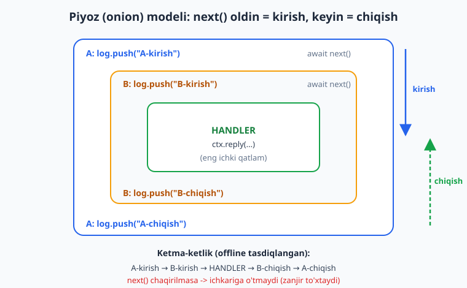
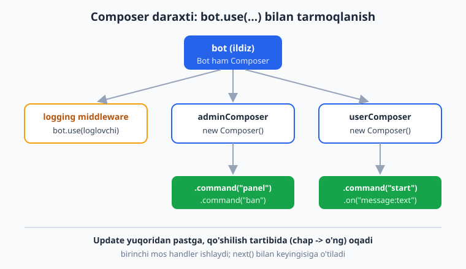
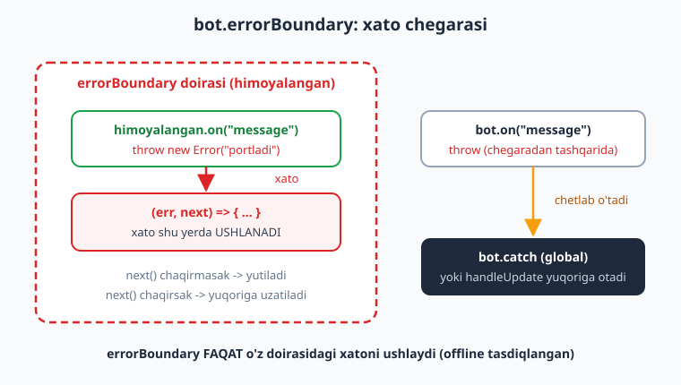

# 09 — Middleware va Composer daraxti

[⬅️ Oldingi: 08 — Conversations — suhbatlar](./08-conversations.md) · [🏠 README](./README.md) · [Keyingi: 10 — Sessiya va ma'lumotlar bazasi ➡️](./10-sessiya-malumotlar-bazasi.md)

---

> **Bu bobda:** grammY'ning yuragi — middleware bilan tanishamiz. Middleware bu `(ctx, next) => {}` ko'rinishidagi funksiya: u har bir update'ni ko'radi va `next()` chaqirib zanjirdagi keyingi funksiyaga uzatadi (yoki chaqirmay zanjirni to'xtatadi). Biz **piyoz (onion) modeli**ni — `next()` dan oldingi kod kirishda, keyingi kod chiqishda ishlashini — o'rganamiz; `bot.use(...)` bilan o'rnatish va **tartibning naqadar muhimligini** ko'ramiz; amaliy middleware'lar yozamiz (logging, vaqt o'lchash, auth/admin tekshirish); `ctx` ga ma'lumot qo'shib downstream'ga uzatamiz; `Composer` bilan handlerlarni daraxtga guruhlaymiz; `bot.errorBoundary` bilan xato chegarasini o'rnatamiz; va oddiy qo'lda **throttling** (flood-control) middleware quramiz. Bu boblardan keyin siz har qanday grammY botini "qatlam-qatlam" arxitektura sifatida ko'ra boshlaysiz.
>
> **Halollik eslatmasi:** Bu bobdagi BARCHA middleware mantig'i — piyoz ketma-ketligi, `next()` to'xtatish, `bot.use` tartibi, `ctx`'ga property qo'shish, `Composer`, `bot.errorBoundary` doirasi, qo'lda throttling va `await next()` unutish gotcha'si — soxta `Update` ni `bot.handleUpdate` ga uzatib, chiqayotgan API chaqiruvlarini transformer bilan ushlab **offline ishga tushirib tasdiqlangan** (`node _verify_09.mjs`, 13/13 o'tdi). Jonli polling/xabar yuborish token va internet talab qiladi — u "illustrativ" deb belgilanadi.

---

## Middleware nima?

Birinchi boblarda biz `bot.command(...)` va `bot.on(...)` bilan handlerlar yozdik. Aslida grammY'da **hammasi middleware** — handler ham middleware'ning maxsus turi. Middleware bu shunchaki funksiya:

```js
async function mening(ctx, next) {
  // ... ctx bilan biror ish ...
  await next(); // zanjirdagi KEYINGI middleware'ga o'tish
}
```

Ikki argument:

- **`ctx`** — Context obyekti (update, `ctx.from`, `ctx.reply` va h.k. — 03-bobda ko'rgan edik).
- **`next`** — funksiya. Uni chaqirsangiz (`await next()`), boshqaruv zanjirdagi **keyingi** middleware'ga o'tadi. Chaqirmasangiz — zanjir **shu yerda to'xtaydi**, keyingi middleware va handlerlar umuman ishlamaydi.

> **Eslatma:** Bu naqsh Express.js, Koa va boshqa Node freymvorklaridan tanish bo'lishi mumkin. Aslida grammY middleware tizimi aynan Koa'ning "onion" modelidan ilhomlangan. Node middleware bilan tanish bo'lsangiz, [Node.js kitobi](../nodejs/README.md) dagi bilim shu yerda ham asqotadi.

`next()` ni chaqirish — bu "vazifamni bajardim, endi navbat boshqalarga" degani. Chaqirmaslik — "men to'xtataman, boshqalar ko'rmasin" degani.

```js
import { Bot } from "grammy";
const bot = new Bot(process.env.BOT_TOKEN);

bot.use(async (ctx, next) => {
  console.log("Update keldi:", ctx.update.update_id);
  await next(); // bularsiz pastdagi handler ISHLAMAYDI
});

bot.command("start", (ctx) => ctx.reply("Salom!"));
bot.start(); // illustrativ: jonli polling token talab qiladi
```

## Piyoz (onion) modeli — eng muhim tushuncha

`next()` ni `await` bilan chaqirganda nima bo'ladi? Boshqaruv ichki qatlamga "kiradi", o'sha yerda hamma ish bajariladi, so'ng **qaytib** sizning funksiyangizga `next()` dan **keyingi** qatorga keladi. Ya'ni har bir middleware'ning ikki "fazasi" bor:

- **`next()` dan OLDINGI kod** — bu *kirish* fazasi (update ichkariga kirayotganda).
- **`next()` dan KEYINGI kod** — bu *chiqish* fazasi (handler tugab, javob qaytayotganda).

Buni piyozning qatlamlariga o'xshatishadi: tashqaridan markazga (handler'ga) kirasiz, so'ng teskari yo'l bilan tashqariga chiqasiz.



Ikki middleware va bitta handler bilan ketma-ketlikni o'lchab ko'raylik:

```js
const log = [];

bot.use(async (ctx, next) => {
  log.push("A-kirish");
  await next();
  log.push("A-chiqish");
});

bot.use(async (ctx, next) => {
  log.push("B-kirish");
  await next();
  log.push("B-chiqish");
});

bot.on("message", (ctx) => {
  log.push("handler");
});
```

Bitta xabar kelganda `log` quyidagicha bo'ladi (offline tasdiqlangan):

```text
["A-kirish", "B-kirish", "handler", "B-chiqish", "A-chiqish"]
```

Diqqat qiling: **kirish** tartib bo'yicha (A, B), **chiqish** esa **teskari** tartibda (B, A). Bu mantiqiy — eng oldin kirgan (A) eng oxirida chiqadi, xuddi steklarda bo'lgani kabi.

> **Diqqat:** `await` ni `next()` oldida UNUTMANG. `await next()` o'rniga shunchaki `next()` yozsangiz, "chiqish" fazasi handler tugashini KUTMAY ishlaydi — vaqt o'lchash, resurs tozalash, transaksiya yopish kabi narsalar buziladi. Buni bobdagi gotcha bo'limida ko'ramiz.

## `bot.use(...)` va tartib

`bot.use(...)` middleware'ni **ro'yxat oxiriga** qo'shadi. Update kelganda grammY ularni **qo'shilgan tartibda** yuqoridan pastga aylanib chiqadi. Demak, **tartib muhim**: kim oldin yozilsa, o'sha oldin ko'radi.

Amaliy qoida: **logging, auth va sessiya kabi "hammaga tegishli" middleware'lar eng oldinga** qo'yiladi, konkret handlerlar pastga. Masalan, agar siz avval `bot.command("start")` ni yozib, keyin logging middleware'ni qo'ysangiz — `/start` log'lanmay qoladi, chunki `command` handler `next()` ni chaqirmasdan zanjirni to'xtatadi.

```js
// TO'G'RI tartib:
bot.use(loggingMiddleware);   // 1. har update'ni yozadi (next chaqiradi)
bot.use(authMiddleware);      // 2. ruxsatni tekshiradi
bot.command("panel", panel);  // 3. konkret handler
```

> **Eslatma:** Handlerlar (`bot.command`, `bot.hears`, `bot.on`) odatda `next()` ni o'zi chaqirmaydi — mos kelsa, ishlaydi va zanjirni to'xtatadi. Shuning uchun "birinchi mos kelgan handler g'olib" qoidasi amal qiladi (03-bobda ko'rgan edik). Bir nechta handler ishlashini xohlasangiz, ulardan `next()` ni qo'lda chaqirishingiz kerak.

### Auth/admin tekshirish: `next()` chaqirmasdan to'xtatish

Eng foydali namuna — ruxsatni tekshiruvchi middleware. Admin bo'lmagan foydalanuvchini darvozada to'xtatamiz:

```js
const ADMIN_ID = 999; // o'zingizning Telegram ID'ingiz (10-bobda DB'dan o'qiymiz)

bot.use(async (ctx, next) => {
  if (ctx.from?.id !== ADMIN_ID) {
    await ctx.reply("Ruxsat yo'q");
    return; // next() YO'Q -> zanjir to'xtaydi, pastdagi handler ishlamaydi
  }
  await next(); // admin -> davom etamiz
});

bot.command("panel", (ctx) => ctx.reply("Admin paneli"));
```

Offline sinovda oddiy foydalanuvchi `"Ruxsat yo'q"` oldi, admin esa `"Admin paneli"` oldi — aynan kutilgandek.

> **Diqqat:** Bu middleware BARCHA handlerlardan oldin turibdi, demak u butun botni admin uchun yopadi. Agar faqat bir qism handlerlarni himoyalamoqchi bo'lsangiz — pastda ko'radigan **`Composer`** yoki `bot.errorBoundary` doirasini ishlating, butun `bot` ga emas.

## Amaliy middleware'lar

### 1. Logging — har update'ni yozish

```js
bot.use(async (ctx, next) => {
  const id = ctx.update.update_id;
  const text = ctx.message?.text ?? "(matnsiz)";
  console.log(`[${id}] ${ctx.from?.first_name}: ${text}`);
  await next();
});
```

Bu eng oddiy va eng foydali middleware. Productionda `console.log` o'rniga to'liq logger (`pino`, `winston`) ishlatiladi — buni [Node.js kitobida](../nodejs/README.md) ko'rgansiz.

### 2. Vaqt o'lchash — `next()` oldin/keyin farqi

Piyoz modeli tufayli javob qancha vaqt olganini o'lchash juda oson: `next()` dan **oldin** vaqtni yozamiz, **keyin** farqni hisoblaymiz.

```js
bot.use(async (ctx, next) => {
  const boshlanish = Date.now();
  await next();                       // butun ichki zanjir shu yerda ishlaydi
  const ketdi = Date.now() - boshlanish;
  console.log(`Update ${ctx.update.update_id} ${ketdi}ms da ishladi`);
});
```

`ketdi` doimo `>= 0` — chunki u handler tugagandan keyin hisoblanadi. Bu sekin handlerlarni topishda asqotadi.

### 3. Auth/admin — yuqorida ko'rdik

Bu uchovi — logging, vaqt o'lchash, auth — har qanday jiddiy botda uchraydi. Ularni odatda alohida fayllarga ajratib, modul sifatida import qilasiz (11-bobda loyiha tuzilishini ko'ramiz).

## `ctx` ga ma'lumot qo'shish (downstream'ga uzatish)

Tez-tez upstream (yuqori) middleware'da biror narsani hisoblab, uni pastdagi handlerga uzatish kerak bo'ladi. Masalan: foydalanuvchi admin'mi, uning DB yozuvi, til sozlamasi. Yechim — `ctx` obyektiga **o'z propertyingizni** qo'shish:

```js
bot.use(async (ctx, next) => {
  ctx.role = (ctx.from?.id === ADMIN_ID) ? "admin" : "user"; // o'z propertysi
  await next();
});

bot.on("message", (ctx) => {
  ctx.reply(`Sizning rolingiz: ${ctx.role}`); // downstream o'qiydi
});
```

Bu ishlaydi, chunki butun zanjir uchun **bitta** `ctx` obyekti ishlatiladi — uni "yuqorida" boyitsangiz, "pastda" o'qiy olasiz.

> **Diqqat — grammY'da `ctx.state` YO'Q!** Telegraf'da maxsus `ctx.state` obyekti bor edi va ko'p o'quvchilar internetda o'shani uchratadi. **grammY'da bunday built-in property mavjud emas** — yangi `ctx` da `ctx.state` `undefined` bo'ladi (buni offline tekshirdik: `assert.equal(ctx.state, undefined)` o'tdi). grammY'da siz to'g'ridan-to'g'ri `ctx.role`, `ctx.user` kabi **o'z propertyingizni** qo'shasiz. Agar Telegraf misolida `ctx.state.x = ...` ko'rsangiz — bu grammY emas, ehtiyot bo'ling.

> **Eslatma — TypeScript bilan tiplash:** Sof JS'da `ctx.role = ...` to'g'ridan-to'g'ri ishlaydi. TypeScript'da esa `ctx` ga yangi propertyni **context flavor** orqali tiplaysiz (`type MyContext = Context & { role: string }`), shunda muharrir avtokomplit beradi va xatoni ushlaydi. Bu kitob JS'da bo'lgani uchun biz oddiy yo'lni ishlatamiz; tiplangan kontekst va loyiha tuzilishini **11-bobda** ko'ramiz. Bu — TS'ning "qo'shimcha foydasi", JS uchun shart emas.

## `Composer` bilan guruhlash

Bot kattalashganda hamma handlerni bitta faylga tiqish noqulay. **`Composer`** — bu handlerlarni guruhlaydigan "quticha". `Composer` ham xuddi `bot` kabi `.command`, `.on`, `.use` metodlariga ega (aslida `Bot` ning o'zi `Composer` dan meros oladi!). Guruhni yig'ib bo'lgach, uni `bot.use(composer)` bilan ulaysiz.

```js
import { Composer } from "grammy";

const adminComposer = new Composer();
adminComposer.command("panel", (ctx) => ctx.reply("Admin paneli"));
adminComposer.command("ban", (ctx) => ctx.reply("Foydalanuvchi bloklandi"));

const userComposer = new Composer();
userComposer.command("start", (ctx) => ctx.reply("Salom!"));
userComposer.on("message:text", (ctx) => ctx.reply("Matningizni oldim"));

bot.use(adminComposer); // butun guruhni botga ulaymiz
bot.use(userComposer);
```

Natijada bot **daraxt** ko'rinishini oladi: ildizda `bot`, undan tarmoqlar (Composer'lar va middleware'lar), tarmoqlar uchida konkret handlerlar.



`Composer` ichida ham xuddi `bot` dagidek **tartib va `next()` qoidalari** amal qiladi: birinchi mos handler ishlaydi va to'xtatadi (offline tasdiqlangan). Bu modullashning asosiy quroli — har bir mavzuni (admin, user, to'lov, guruh) o'z Composer'iga ajratib, alohida faylda saqlaysiz va `bot.use(...)` bilan ulaysiz. Katta loyihada bu naqshni **11-bobda** chuqur ko'ramiz.

> **Eslatma:** `Composer` ga middleware ham bog'lash mumkin: `adminComposer.use(adminAuth)` — shunda `adminAuth` faqat o'sha Composer ichidagi handlerlarga ta'sir qiladi, butun botga emas. Bu "qisman himoya" uchun toza yo'l.

## `bot.errorBoundary` — xato chegarasi

`bot.catch(...)` (08-bobdan) — bu **global** xato tuzog'i: butun bot bo'ylab tutilmagan har qanday xatoni ushlaydi. Lekin ba'zan siz xatoni **lokal** — botning faqat bir qismida — ushlamoqchisiz: masalan, "to'lov moduli yiqilsa, qolgan bot ishlashda davom etsin". Buning uchun **`bot.errorBoundary(handler)`** bor.

`errorBoundary` yangi Composer qaytaradi. O'sha Composer'ga bog'langan handlerlar ichida sodir bo'lgan xato **chegara funksiyasiga** boradi, global `bot.catch` ga emas.

```js
const himoyalangan = bot.errorBoundary((err, next) => {
  // err.error — asl xato (08-bobdagi kabi)
  console.error("To'lov moduli xato berdi:", err.error.message);
  // next() chaqirmasak -> xato shu yerda yutiladi, bot ishlashda davom etadi
});

himoyalangan.command("tolov", (ctx) => {
  throw new Error("portladi"); // bu xato himoyalangan chegarada ushlanadi
});

// BU handler chegaradan TASHQARIDA — uning xatosi global bot.catch'ga boradi
bot.on("message", (ctx) => {
  throw new Error("tashqi xato");
});
```



Offline sinovda biz aniq ko'rdik:

- `himoyalangan.on(...)` ichidagi `throw` — **chegara funksiyasi ushladi**, global tuzoqqa chiqmadi.
- `bot.on(...)` (chegaradan tashqari) ichidagi `throw` — chegarani **chetlab o'tdi** va yuqoriga otildi.

Chegara funksiyasida `next()` ni chaqirsangiz, xatoni "yuqoriga" (keyingi tuzoqqa yoki `bot.catch` ga) **qayta uzatasiz**; chaqirmasangiz — xato **yutiladi** (bot davom etadi).

> **Diqqat — `bot.catch` qachon ishlaydi:** `bot.catch(...)` global tuzog'i bot `bot.start()` yoki `@grammyjs/runner` orqali ishlayotganda tutilmagan xatolarni ushlaydi. Agar siz update'ni **qo'lda** `await bot.handleUpdate(update)` bilan uzatsangiz (masalan test'da yoki webhook'da o'zingiz boshqarsangiz), xato `BotError` sifatida **yuqoriga otiladi** — uni `try/catch` bilan o'zingiz tutishingiz kerak. Buni offline tekshirdik. Webhook'da bu nuansni **13-bobda** ko'ramiz.

## Throttling (flood-control) — qo'lda

Foydalanuvchi botga juda tez-tez xabar yuborsa (flood), uni cheklash kerak. Bu g'oyani **qo'lda** middleware bilan amalga oshirish mumkin: har bir foydalanuvchining oxirgi qabul qilingan vaqtini eslab, juda tez kelgan so'rovni tashlab yuboramiz.

```js
const oxirgi = new Map(); // userId -> oxirgi qabul qilingan vaqt (ms)
const MIN_MS = 1000;      // bir foydalanuvchiga sekundiga 1 ta

bot.use(async (ctx, next) => {
  const id = ctx.from?.id;
  if (id === undefined) return await next();

  const hozir = Date.now();
  const avvalgi = oxirgi.get(id);
  if (avvalgi !== undefined && hozir - avvalgi < MIN_MS) {
    return; // juda tez! next() chaqirmaymiz -> jim tashlab yuboramiz
  }
  oxirgi.set(id, hozir);
  await next();
});
```

Offline sinovda (vaqtni `0`, `500`, `1500` ms qilib boshqarib): `0ms` o'tdi, `500ms` bloklandi (chunki 1000ms o'tmagan), `1500ms` yana o'tdi. Aynan kutilgandek.

> **Diqqat:** Bu oddiy versiya `Map` ni xotirada saqlaydi — bot qayta ishga tushsa, hammasi unutiladi va `Map` cheksiz o'sib boraversa, xotira "sizib" ketishi mumkin (vaqti-vaqti bilan eski yozuvlarni tozalash kerak). Production uchun esa tayyor plagin bor:

> **Anti-eskirish:** Jiddiy flood-control uchun **`@grammyjs/transformer-throttler`** plaginini ishlating — u Telegram'ning chiqayotgan so'rovlarini Bottleneck navbati bilan boshqaradi va rate-limit'ga tushib qolishingizning oldini oladi. Bu **alohida paket** (`bot` ga emas, `bot.api` transformeriga ulanadi). Aniq import va sozlamalarni hujjatdan oling: [grammy.dev/plugins/transformer-throttler](https://grammy.dev/plugins/transformer-throttler). Bu yerda men uning API'sini ixtiro qilmayman — rasmiy hujjatga qarang. Ommaviy tarqatish (broadcast) va `@grammyjs/auto-retry` ni **15-bobda** chuqur ko'ramiz.

## API transformer — chiquvchi so'rovlarni o'zgartirish (qisqacha)

Yuqoridagi middleware **kiruvchi** update'larni qayta ishlaydi. Bundan farqli ravishda **API transformer** **chiquvchi** so'rovlarni (Telegram'ga yuborilayotgan `sendMessage` va h.k.) ushlaydi va o'zgartiradi:

```js
bot.api.config.use((prev, method, payload, signal) => {
  // bu yerda chiqayotgan so'rovni ko'rish/o'zgartirish mumkin
  return prev(method, payload, signal); // davom ettiramiz
});
```

Bu bobdagi offline sinovlarimiz aynan shu transformer mexanizmidan foydalanib chiqayotgan API chaqiruvlarini ushlaydi (tarmoqqa chiqmasdan). Real misol — `@grammyjs/auto-retry`: u xato bo'lgan so'rovni avtomatik qayta yuboradi. API transformer'larni va auto-retry'ni **15-bobda** chuqur ko'ramiz.

> **Eslatma:** Esda tuting — **middleware** (`bot.use`) = *kiruvchi* update'lar uchun; **transformer** (`bot.api.config.use`) = *chiquvchi* API so'rovlari uchun. Ikkalasi ham "zanjir" g'oyasiga asoslanadi, lekin har xil oqimda ishlaydi.

## Tez-tez uchraydigan xatolar

| Xato | Sabab | Yechim |
|---|---|---|
| Handler umuman ishlamayapti | Yuqoridagi middleware `next()` ni chaqirmagan | Middleware oxirida `await next()` chaqiring (to'xtatish ataylab bo'lmasa) |
| Logging `/start` ni ko'rmayapti | `bot.command("start")` logging'dan OLDIN yozilgan | Logging middleware'ni eng oldinga (`bot.use` bilan birinchi) qo'ying |
| "chiqish" kodi noto'g'ri vaqtda ishlaydi | `await next()` o'rniga `next()` yozilgan | `next()` oldida har doim `await` yozing |
| `ctx.state is undefined` | grammY'da `ctx.state` yo'q (Telegraf'niki) | To'g'ridan-to'g'ri `ctx.myProp = ...` qo'shing |
| `errorBoundary` xatoni ushlamayapti | Handler chegara doirasidan TASHQARIDA bog'langan | Handlerni `errorBoundary` qaytargan Composer'ga bog'lang |
| `bot.catch` `handleUpdate` da ishlamayapti | `handleUpdate` xatoni yuqoriga otadi | `handleUpdate` ni `try/catch` ga oling, yoki `bot.start()`/runner ishlating |
| Throttling `Map` xotira yeb boryapti | Eski yozuvlar hech qachon tozalanmaydi | Davriy tozalang yoki `transformer-throttler` plaginini ishlating |

---

## Mashqlar

> Quyidagi mashqlarning ko'pi **offline** tekshiriladi — `bot.handleUpdate(update)` ga soxta update uzatib, `bot.api.config.use(...)` transformer bilan chiqayotgan chaqiruvlarni ushlaysiz yoki `log` massivining tartibini `assert` qilasiz. Buyruq update'iga `entities:[{type:"bot_command",offset:0,length:N}]` qo'shishni unutmang.

### Oson

1. **Piyoz tartibi.** Ikki `bot.use` middleware (A va B) va bitta `bot.on("message")` handler yozing. Har biri `log` massiviga `"X-kirish"`/`"X-chiqish"` qo'shsin. Bitta xabar uzating va `log` aynan `["A-kirish","B-kirish","handler","B-chiqish","A-chiqish"]` ekanini tasdiqlang.

2. **`next()` ni to'xtatish.** `next()` ni chaqirmaydigan middleware yozing. Undan keyin `bot.on("message")` handler qo'ying. Xabar uzating va handler ISHLAMAGANINI tasdiqlang (`log` da faqat middleware bor).

3. **Logging.** Har update'ni `log` ga `update <id>: <text>` ko'rinishida yozadigan middleware yozing (`next()` ni chaqiring). Ikki xabar uzating va tartib saqlanganini tasdiqlang.

4. **`ctx` ga property.** Upstream middleware'da `ctx.salom = "Assalom"` qo'ying. Handler `ctx.salom` ni `ctx.reply` bilan jo'natsin. Transformer bilan chiqqan matn `"Assalom"` ekanini tasdiqlang.

### O'rta

5. **Vaqt o'lchash.** `next()` atrofida `Date.now()` farqini o'lchaydigan middleware yozing va o'lchangan qiymatni tashqi o'zgaruvchiga saqlang. Xabar uzating va qiymat `>= 0` ekanini tasdiqlang.

6. **Admin darvozasi.** `ADMIN_ID` ga teng bo'lmagan foydalanuvchini `"Ruxsat yo'q"` bilan to'xtatadigan middleware yozing. `bot.command("panel")` `"Admin paneli"` qaytarsin. Oddiy va admin foydalanuvchidan `/panel` uzatib, ikki xil javobni tasdiqlang.

7. **`Composer` guruhi.** `Composer` yarating, unga `.command("ping")` (`"pong"` qaytaradi) bog'lang, `bot.use(composer)` qiling. `/ping` uzatib `"pong"` kelganini tasdiqlang.

8. **`ctx.state` yo'qligi.** Middleware ichida `ctx.state` ning `undefined` ekanini `assert` qiling, so'ng `ctx.role` ga qiymat bering. Handler `ctx.role` ni qaytarsin. Tasdiqlang. (grammY'da `ctx.state` yo'qligini eslang.)

### Qiyin

9. **`errorBoundary` ichi.** `bot.errorBoundary` chegarasi yarating; chegara funksiyasi `log` ga `"ushladi"` qo'shsin va `next()` chaqirmasin. Chegaraga `throw` qiladigan `.on("message")` handler bog'lang. Xabar uzating va `log` da `"ushladi"` borligini, xato yuqoriga chiqmaganini tasdiqlang.

10. **`errorBoundary` tashqarisi.** 9-mashqdagi chegaradan TASHQARIDA `throw` qiladigan `bot.on("message")` handler bog'lang. `handleUpdate` ni `try/catch` ga oling va xato yuqoriga otilganini (chegara ushlamaganini) tasdiqlang.

11. **Qo'lda throttling.** Foydalanuvchi bo'yicha `MIN_MS` cheklovi bilan throttling middleware yozing. Vaqtni `ctx` orqali boshqarib (yoki `Date.now` ni mock qilib), `0` / `500` / `1500` ms da uchta xabar uzating va faqat 1- va 3- so'rov o'tganini tasdiqlang.

12. **`await` unutish gotcha'si.** Bir middleware yozing: `log.push("kirish")` -> `next()` (await SIZ) -> `log.push("chiqish")`. Handler `await Promise.resolve()` dan keyin `log.push("handler")` qilsin. `log` ning `["kirish","chiqish","handler"]` ekanini (ya'ni tartib buzilganini) tasdiqlang, so'ng `await next()` qo'shib to'g'rilang.

13. **Composer ichida tartib.** Bitta `Composer` ga ikki `.on("message:text")` handler bog'lang: birinchisi `.filter((ctx) => ctx.msg.text.startsWith("a"), ...)`. `"abc"` uzatib, faqat filtr handleri ishlaganini (umumiy handler emas) tasdiqlang.

<details markdown="1">
<summary>Yechimlar</summary>

> Quyidagi yechimlar `_verify_09.mjs` dagi naqsh bilan offline ishga tushiriladi. Har bir yechim mustaqil `makeBot()` (transformer + `botInfo`) va `mkText(...)` yordamchilaridan foydalanadi (bob boshidagi halollik eslatmasiga qarang). Qisqartirish uchun shu ikki yordamchi takrorlanmaydi.

### 1-mashq yechimi

```js
const { bot } = makeBot();
const log = [];
bot.use(async (ctx, next) => { log.push("A-kirish"); await next(); log.push("A-chiqish"); });
bot.use(async (ctx, next) => { log.push("B-kirish"); await next(); log.push("B-chiqish"); });
bot.on("message", (ctx) => { log.push("handler"); });
await bot.handleUpdate(mkText("salom"));
assert.deepEqual(log, ["A-kirish", "B-kirish", "handler", "B-chiqish", "A-chiqish"]);
```

Piyoz modeli: kirish to'g'ri tartibda, chiqish teskari tartibda. Bu butun bobning poydevori.

### 2-mashq yechimi

```js
const { bot } = makeBot();
const log = [];
bot.use((ctx, next) => { log.push("darvoza"); /* next() YO'Q */ });
bot.on("message", (ctx) => { log.push("handler"); });
await bot.handleUpdate(mkText("salom"));
assert.deepEqual(log, ["darvoza"]); // handler ISHLAMADI
```

`next()` chaqirilmagani uchun zanjir darvozada to'xtadi — handler `log` ga umuman qo'shilmadi.

### 3-mashq yechimi

```js
const { bot } = makeBot();
const log = [];
bot.use(async (ctx, next) => {
  log.push(`update ${ctx.update.update_id}: ${ctx.message?.text ?? ""}`);
  await next();
});
bot.on("message", (ctx) => {});
await bot.handleUpdate(mkText("birinchi", 10));
await bot.handleUpdate(mkText("ikkinchi", 11));
assert.deepEqual(log, ["update 10: birinchi", "update 11: ikkinchi"]);
```

Logging middleware `next()` dan oldin (kirish fazasida) yozadi, shuning uchun update'lar kelish tartibida log'lanadi.

### 4-mashq yechimi

```js
const { bot, calls } = makeBot();
bot.use(async (ctx, next) => { ctx.salom = "Assalom"; await next(); });
bot.on("message", (ctx) => ctx.reply(ctx.salom));
await bot.handleUpdate(mkText("hi"));
const c = calls.find((x) => x.method === "sendMessage");
assert.equal(c.payload.text, "Assalom");
```

Butun zanjir uchun bitta `ctx` ishlatilgani uchun upstream qo'ygan property downstream'da o'qiladi.

### 5-mashq yechimi

```js
const { bot } = makeBot();
let olchangan = -1;
bot.use(async (ctx, next) => {
  const t = Date.now();
  await next();
  olchangan = Date.now() - t;
});
bot.on("message", async (ctx) => { /* ish */ });
await bot.handleUpdate(mkText("salom"));
assert.ok(olchangan >= 0);
```

Vaqt `next()` dan keyin (chiqish fazasida) hisoblanadi — handler tugagach. Shuning uchun u doimo manfiy emas.

### 6-mashq yechimi

```js
const { bot, calls } = makeBot();
const ADMIN_ID = 999;
bot.use(async (ctx, next) => {
  if (ctx.from?.id !== ADMIN_ID) { await ctx.reply("Ruxsat yo'q"); return; }
  await next();
});
bot.command("panel", (ctx) => ctx.reply("Admin paneli"));
await bot.handleUpdate(mkText("/panel", 1, 777)); // oddiy user
await bot.handleUpdate(mkText("/panel", 2, 999)); // admin
const texts = calls.filter((c) => c.method === "sendMessage").map((c) => c.payload.text);
assert.deepEqual(texts, ["Ruxsat yo'q", "Admin paneli"]);
```

Auth middleware eng oldinda turgani uchun oddiy user darvozada to'xtaydi, admin esa `next()` orqali handler'ga o'tadi.

### 7-mashq yechimi

```js
const { bot, calls } = makeBot();
const composer = new Composer();
composer.command("ping", (ctx) => ctx.reply("pong"));
bot.use(composer);
await bot.handleUpdate(mkText("/ping"));
const c = calls.find((x) => x.method === "sendMessage");
assert.equal(c.payload.text, "pong");
```

`Composer` handlerlarni guruhlaydi; `bot.use(composer)` butun guruhni botga ulaydi. (`import { Composer } from "grammy";` kerak.)

### 8-mashq yechimi

```js
const { bot, calls } = makeBot();
bot.use(async (ctx, next) => {
  assert.equal(ctx.state, undefined); // grammY'da ctx.state YO'Q
  ctx.role = ctx.from?.id === 999 ? "admin" : "user";
  await next();
});
bot.on("message", (ctx) => ctx.reply(`Rol: ${ctx.role}`));
await bot.handleUpdate(mkText("salom", 1, 999));
const c = calls.find((x) => x.method === "sendMessage");
assert.equal(c.payload.text, "Rol: admin");
```

`ctx.state` `undefined` (Telegraf'ning property'si, grammY'da yo'q) — shuning uchun o'z `ctx.role` propertyimizni ishlatamiz.

### 9-mashq yechimi

```js
const { bot } = makeBot();
const log = [];
const himoyalangan = bot.errorBoundary((err, next) => {
  log.push("ushladi: " + err.error.message); // next() YO'Q -> yutiladi
});
himoyalangan.on("message", (ctx) => { throw new Error("portladi"); });
await bot.handleUpdate(mkText("salom")); // yuqoriga chiqmaydi
assert.deepEqual(log, ["ushladi: portladi"]);
```

Chegara ichidagi `throw` chegara funksiyasiga boradi; `next()` chaqirilmagani uchun xato yutiladi va `handleUpdate` muvaffaqiyatli yakunlanadi.

### 10-mashq yechimi

```js
const { bot } = makeBot();
const log = [];
const himoyalangan = bot.errorBoundary((err, next) => { log.push("boundary"); });
himoyalangan.command("xavfsiz", (ctx) => ctx.reply("ok"));
bot.on("message", (ctx) => { throw new Error("tashqi xato"); }); // chegaradan TASHQARIDA
let thrown = null;
try { await bot.handleUpdate(mkText("salom")); }
catch (err) { thrown = err; }
assert.equal(log.length, 0);          // boundary ushlamadi
assert.equal(thrown.error.message, "tashqi xato"); // yuqoriga otildi
```

`errorBoundary` faqat O'Z doirasidagi handlerlarni qamrab oladi. Tashqaridagi xato chegarani chetlab `handleUpdate` orqali yuqoriga otiladi (`bot.catch` esa `bot.start()`/runner uchun).

### 11-mashq yechimi

```js
const { bot, calls } = makeBot();
const oxirgi = new Map();
const MIN_MS = 1000;
bot.use(async (ctx, next) => { ctx.now = ctx.update.__now ?? 0; await next(); }); // testda vaqt
bot.use(async (ctx, next) => {
  const id = ctx.from?.id;
  const prev = oxirgi.get(id);
  if (prev !== undefined && ctx.now - prev < MIN_MS) return; // juda tez
  oxirgi.set(id, ctx.now);
  await next();
});
bot.on("message", (ctx) => ctx.reply("qabul qilindi"));
await bot.handleUpdate({ ...mkText("a", 1), __now: 0 });    // o'tadi
await bot.handleUpdate({ ...mkText("b", 2), __now: 500 });  // bloklanadi
await bot.handleUpdate({ ...mkText("c", 3), __now: 1500 }); // o'tadi
const texts = calls.filter((x) => x.method === "sendMessage").map((x) => x.payload.text);
assert.deepEqual(texts, ["qabul qilindi", "qabul qilindi"]); // 2 ta o'tdi
```

Testda vaqtni `update.__now` orqali boshqaramiz (real botda `Date.now()`). `500ms` so'rov `MIN_MS` ichida bo'lgani uchun `next()` chaqirilmay bloklanadi.

### 12-mashq yechimi

```js
const { bot } = makeBot();
const log = [];
bot.use(async (ctx, next) => {
  log.push("kirish");
  next();              // XATO: await UNUTILDI
  log.push("chiqish"); // handler tugashini KUTMAYDI
});
bot.on("message", async (ctx) => { await Promise.resolve(); log.push("handler"); });
await bot.handleUpdate(mkText("salom"));
assert.deepEqual(log, ["kirish", "chiqish", "handler"]); // tartib BUZILGAN!
// To'g'risi: `await next()` -> ["kirish","handler","chiqish"]
```

`await` unutilgani uchun "chiqish" handler tugashini kutmadi va undan oldin yozildi. `await next()` qo'ysangiz tartib `["kirish","handler","chiqish"]` ga to'g'rilanadi.

### 13-mashq yechimi

```js
const { bot } = makeBot();
const composer = new Composer();
const log = [];
composer.on("message:text").filter(
  (ctx) => ctx.msg.text.startsWith("a"),
  (ctx) => { log.push("a-filter"); }
);
composer.on("message:text", (ctx) => { log.push("umumiy"); });
bot.use(composer);
await bot.handleUpdate(mkText("abc"));
assert.deepEqual(log, ["a-filter"]); // umumiy handler ishlamadi
```

`Composer` ichida ham "birinchi mos handler g'olib" qoidasi amal qiladi: `"abc"` filtrga mos kelgani uchun filtr handleri ishladi va `next()` chaqirmasdan zanjirni to'xtatdi — umumiy handler'ga yetib bormadi.

</details>

---

[⬅️ Oldingi: 08 — Conversations — suhbatlar](./08-conversations.md) · [🏠 README](./README.md) · [Keyingi: 10 — Sessiya va ma'lumotlar bazasi ➡️](./10-sessiya-malumotlar-bazasi.md)
