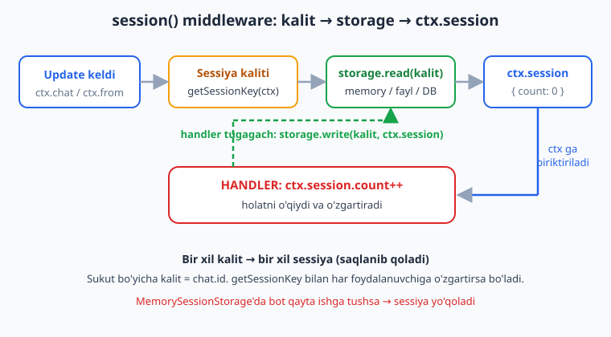
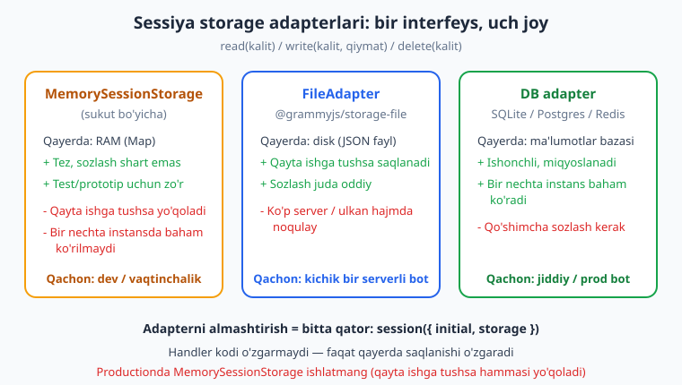
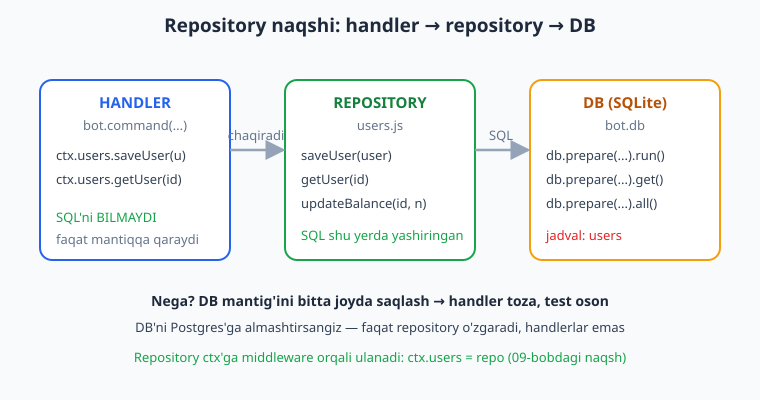

# 10 — Sessiya va ma'lumotlar bazasi

[⬅️ Oldingi: 09 — Middleware va Composer daraxti](./09-middleware.md) · [🏠 README](./README.md) · [Keyingi: 11 — Loyiha tuzilishi va konfiguratsiya ➡️](./11-loyiha-tuzilishi.md)

---

> **Bu bobda:** botimizga **xotira** beramiz. Hozirgacha har bir update mustaqil edi — handler ishlab tugagach, hech narsa eslab qolmasdi. Bu bobda biz ikki turdagi "esda saqlash"ni o'rganamiz. Birinchisi — `session()` middleware: foydalanuvchining **kichik, vaqtinchalik holatini** (hisoblagich, savatcha, "qaysi qadamda" turibdi) handlerlar orasida saqlash. Sessiya **kaliti** qanday hisoblanishini (sukut bo'yicha chat bo'yicha, `getSessionKey` bilan har foydalanuvchi bo'yicha) va **storage adapterlar**ni — `MemorySessionStorage` (xotira), `FileAdapter` (fayl), DB adapter — qaysi qachon ishlatilishini ko'ramiz. Ikkinchisi — **haqiqiy ma'lumotlar bazasi**: `better-sqlite3` bilan jadval yaratish, `prepared statement` orqali foydalanuvchini saqlash (`INSERT OR IGNORE`) va o'qish. Nihoyat, **Repository naqshi** bilan DB mantig'ini handlerdan ajratamiz (`users.js`: `saveUser`/`getUser`/`updateBalance`) va uni middleware orqali `ctx`ga ulaymiz. Bu bobdan keyin siz "vaqtinchalik holat" bilan "doimiy ma'lumot"ni aniq farqlay olasiz va ikkalasini ham to'g'ri joyda saqlay olasiz.
>
> **Halollik eslatmasi:** Bu bobdagi BARCHA kod — `session()` hisoblagichi `ctx.session.count` ning `bot.handleUpdate` orqali 1→2→3 o'sishi, sessiya kaliti (sukut=chat, `getSessionKey`=foydalanuvchi) xulqi, `FileAdapter` faylga yozishi, savatcha massivi, **`better-sqlite3` bilan haqiqiy `CREATE`/`INSERT OR IGNORE`/`get`/`all`/`db.transaction`/`COUNT`**, repository metodlari va sessiyani SQLite ustida saqlash — temp papkadagi haqiqiy DB faylida **offline ishga tushirib tasdiqlangan** (`node _verify_10.mjs` 8/8 va `node _verify_10b.mjs` 4/4 o'tdi; test DB fayli oxirida o'chirildi). Jonli polling/xabar yuborish token va internet talab qiladi — u "illustrativ" deb belgilanadi.

---

## Muammo: handlerlar orasida holatni saqlash

Tasavvur qiling, foydalanuvchi botga necha marta xabar yozganini sanamoqchimiz. Birinchi urinish:

```js
let count = 0; // GLOBAL o'zgaruvchi — XATO!

bot.on("message", (ctx) => {
  count++;
  ctx.reply(`Siz ${count} marta yozdingiz`);
});
```

Bu **ishlamaydi**. Nega? Chunki `count` butun bot uchun **bitta** — barcha foydalanuvchilar bir xil hisoblagichni baham ko'radi. Ali bir marta, Vali bir marta yozsa, ikkalasi ham "2 marta yozdingiz" javobini oladi. Bizga kerak bo'lgan narsa — **har bir foydalanuvchiga (yoki chatga) alohida** holat.

Mana shu muammoni grammY'da `session()` middleware hal qiladi. U har bir chat (yoki foydalanuvchi) uchun alohida "qutichani" saqlaydi va uni handlerga `ctx.session` orqali beradi.

```js
import { Bot, session } from "grammy";
const bot = new Bot(process.env.BOT_TOKEN);

bot.use(session({ initial: () => ({ count: 0 }) }));

bot.on("message", (ctx) => {
  ctx.session.count++;                       // FAQAT shu foydalanuvchiniki
  ctx.reply(`Siz ${ctx.session.count} marta yozdingiz`);
});

bot.start(); // illustrativ: jonli polling token talab qiladi
```

Endi Ali "1 marta", Vali ham alohida "1 marta" oladi. Offline sinovda biz bir xil chatdan uchta xabar uzatdik va `ctx.session.count` aynan `1 → 2 → 3` ga o'sganini tasdiqladik.

> **Eslatma:** `session` — grammY'ning **o'zidan** keladi (`import { session } from "grammy"`), alohida paket emas. Bu 08-bobdagi `conversations` plagini bilan ham birga ishlatiladi (suhbatlar ichida sessiya).

## `session()` qanday ishlaydi

`session({ initial })` ga uzatadigan eng muhim narsa — **`initial`** funksiyasi. U sessiya **birinchi marta** kerak bo'lganda (ya'ni bu chat uchun saqlangan holat yo'q bo'lsa) chaqiriladi va **boshlang'ich qiymat**ni qaytaradi.

```js
bot.use(session({
  initial: () => ({ count: 0, ism: null, savatcha: [] }),
}));
```

> **Diqqat — `initial` FUNKSIYA bo'lsin, obyekt EMAS!** Quyidagi xato juda keng tarqalgan:
>
> ```js
> bot.use(session({ initial: { count: 0 } }));      // ❌ XATO: obyekt
> bot.use(session({ initial: () => ({ count: 0 }) })); // ✅ TO'G'RI: funksiya
> ```
>
> Nega funksiya? Agar obyekt bersangiz, BARCHA foydalanuvchilar **bitta va o'sha** obyektni baham ko'radi — biri `count` ni o'zgartirsa, hammaniki o'zgaradi (xuddi yuqoridagi global o'zgaruvchidek). Funksiya esa **har bir yangi sessiya uchun yangi obyekt** yasaydi. Offline sinovda ikki xil chat alohida `count` ga ega bo'lganini tasdiqladik — bu aynan `initial` funksiya ekani uchun ishlaydi.

Update kelganda nima sodir bo'ladi? Quyidagi oqim:



1. Update keladi (`ctx.chat`, `ctx.from` ma'lum).
2. `session()` middleware **sessiya kalitini** hisoblaydi (sukut bo'yicha `ctx.chat.id`).
3. Shu kalit bo'yicha **storage**dan holat o'qiladi. Topilmasa — `initial()` chaqiriladi.
4. Holat `ctx.session` ga biriktiriladi. Handler uni o'qiydi/o'zgartiradi.
5. Handler tugagach (`next()` qaytgach), `ctx.session` **avtomatik** storage'ga qaytib yoziladi.

5-qadamni ta'kidlaymiz: siz `ctx.session.count++` deysiz, **saqlashni o'zingiz qilmaysiz** — `session()` middleware buni `next()` dan keyin (piyoz modelining "chiqish" fazasida, 09-bobni eslang) avtomatik bajaradi.

## Sessiya kaliti: chat bo'yichami, foydalanuvchi bo'yichami?

Sessiya kim uchun alohida saqlanadi? Bu **sessiya kaliti** bilan belgilanadi. **Sukut bo'yicha kalit = `ctx.chat.id`** — ya'ni sessiya **chat bo'yicha**.

Shaxsiy chatda bu farq qilmaydi (chat = foydalanuvchi). Lekin **guruhda** muhim: sukut bo'yicha butun guruh **bitta** sessiyani baham ko'radi. Agar guruhdagi har bir a'zoga alohida sessiya kerak bo'lsa, `getSessionKey` ni o'zgartirasiz:

```js
bot.use(session({
  initial: () => ({ count: 0 }),
  // Har FOYDALANUVCHI bo'yicha (guruhda ham har kishi alohida):
  getSessionKey: (ctx) => ctx.from?.id?.toString(),
}));
```

Offline sinovda biz bir xil chatda (id `500`) ikki xil foydalanuvchidan (`10` va `20`) xabar uzatdik. `getSessionKey = ctx.from.id` bilan natija `u10:1`, `u20:1`, `u10:2` bo'ldi — ya'ni har foydalanuvchi o'z hisobiga ega bo'ldi. Sukut bo'yicha (chat kaliti) bo'lsa, ikkalasi bitta hisobni baham ko'rardi.

| Kalit | Misol | Qachon |
|---|---|---|
| `ctx.chat.id` (sukut) | guruhda bitta umumiy holat | shaxsiy bot; "butun chat" sozlamasi |
| `ctx.from.id` | guruhda har kishi alohida | guruhda shaxsiy o'yin/savatcha/quiz |
| `${chat}:${from}` | chat **va** foydalanuvchi juftligi | "shu guruhda shu kishi" holati |

> **Diqqat:** `getSessionKey` `undefined` qaytarsa, o'sha update uchun sessiya **o'tkazib yuboriladi** (`ctx.session` ga kirsangiz xato beradi). Bu ataylab — masalan `channel_post` da `ctx.from` bo'lmaydi. Shuning uchun handlerda sessiya kerak bo'lsa, kalitni `?.` bilan ehtiyotkor yozing va sessiya yo'q holatga tayyor bo'ling.

## Storage adapterlar: holat qayerda yashaydi?

`ctx.session` aslida qayerda saqlanadi? **Storage adapter** hal qiladi. grammY uch xil tanlovni beradi va ularning interfeysi bir xil: `read(kalit)`, `write(kalit, qiymat)`, `delete(kalit)`. Shuning uchun adapterni almashtirish **bitta qator** o'zgartirish.



### 1. `MemorySessionStorage` — sukut bo'yicha (xotira)

Hech narsa bermasangiz, grammY xotirada (RAM, `Map`) saqlaydi. Tez va sozlash shart emas, **lekin bot qayta ishga tushganda hammasi yo'qoladi**.

```js
bot.use(session({ initial: () => ({ count: 0 }) })); // = MemorySessionStorage
```

> **Diqqat:** Bu development va test uchun ajoyib, lekin **productionda ishlatmang**. Botni yangilash, qayta ishga tushirish yoki nosozlik tufayli tushib qolish — barcha foydalanuvchilarning sessiyasini o'chiradi. Bir foydalanuvchi savatchasini to'ldirib turganda bot qayta ishga tushsa, savatcha bo'shab qoladi.

### 2. `FileAdapter` — faylga (alohida paket)

Eng oddiy doimiy yechim — sessiyani diskka JSON fayl sifatida yozish. `@grammyjs/storage-file` paketidan keladi:

```js
import { session } from "grammy";
import { FileAdapter } from "@grammyjs/storage-file";

bot.use(session({
  initial: () => ({ count: 0 }),
  storage: new FileAdapter({ dirName: "sessions" }), // sessions/ papkasiga
}));
```

Endi har bir sessiya kaliti uchun `sessions/<kalit>` fayli yaratiladi va bot qayta ishga tushsa ham saqlanadi. Offline sinovda biz `FileAdapter` bilan `count` ni `1 → 2` qildik va `sessions/5` fayli haqiqatan yaratilganini tasdiqladik.

> **Eslatma:** `FileAdapter` kichik, bir serverli botlar uchun yetarli. Lekin minglab foydalanuvchi yoki bir nechta server bo'lsa — ming-minglab kichik fayl noqulay. Bunda DB adapterga o'tasiz.

### 3. DB adapter — ma'lumotlar bazasiga

Jiddiy bot uchun sessiyani DB'da saqlaysiz (SQLite, Postgres, Redis, MongoDB...). grammY ekotizimida ko'p tayyor adapterlar bor ([grammy.dev/plugins/session](https://grammy.dev/plugins/session) — to'liq ro'yxat). Adapter interfeysi shunchalik soddaki, uni o'zingiz ham yozishingiz mumkin — bu bobda quyiroqda `better-sqlite3` ustida bittasini quramiz.

> **Anti-eskirish:** Tayyor adapterlarning aniq paket nomlari va sozlamalari vaqt o'tib o'zgarishi mumkin. Men ularning API'sini bu yerda ixtiro qilmayman — kerakli adapter uchun rasmiy hujjatga ([grammy.dev/plugins/session](https://grammy.dev/plugins/session)) qarang. Bu bobda men faqat **offline ishlatib ko'rgan** narsalarni — `MemorySessionStorage`, `FileAdapter` va o'zim qurgan SQLite adapterini — tasdiqlangan deb beraman.

## session ≠ ma'lumotlar bazasi: farqni tushuning

Bu bob "sessiya" va "ma'lumotlar bazasi"ni bir joyda o'rgatadi, chunki yangi boshlovchilar ularni adashtiradi. Aniq farqlaymiz:

| | **Sessiya (`ctx.session`)** | **Ma'lumotlar bazasi (DB)** |
|---|---|---|
| Nima saqlaydi | kichik, vaqtinchalik **holat** | real, doimiy **ma'lumot** |
| Misol | savatcha tarkibi, "qaysi qadam", til | foydalanuvchilar, buyurtmalar, to'lovlar |
| Hayot davri | suhbat davomida; tozalansa zarari yo'q | doim kerak; yo'qolsa falokat |
| Kim ko'radi | faqat o'sha foydalanuvchi (kalit bo'yicha) | butun tizim (so'rovlar, hisobotlar) |
| So'rov | kalit bo'yicha bitta o'qish | murakkab SQL (filter, join, sanash) |

Oddiy qoida: agar ma'lumot "yo'qolsa ham zarari yo'q, faqat shu foydalanuvchiga, faqat hozir kerak" bo'lsa — **sessiya**. Agar "har doim kerak, boshqa joydan ham so'raladi, hisobotga kiradi" bo'lsa — **DB**.

Masalan: foydalanuvchi ro'yxatdan o'tdi — uning `id`, ismi, balansi **DB**'ga yoziladi (doimiy). U mahsulot tanlab savatchaga qo'shyapti — savatcha **sessiya**da (vaqtinchalik). Buyurtmani tasdiqlaganida savatchadagi narsalar **DB**'ga `buyurtmalar` jadvaliga ko'chiriladi.

> **Eslatma — SQL bilmaysizmi?** Bu bobda biz `CREATE TABLE`, `INSERT`, `SELECT`, `UPDATE` kabi SQL buyruqlarini ishlatamiz. Agar SQL asoslari notanish bo'lsa, [SQL kitobi](../sql/README.md) bilan tanishing — u yerda jadvallar, kalitlar, so'rovlar batafsil. Bu yerda biz faqat botga kerakli minimumni ko'rsatamiz.

## `better-sqlite3` bilan haqiqiy DB

Endi **haqiqiy** ma'lumotlar bazasiga o'tamiz. Biz `better-sqlite3` ni tanlaymiz, chunki u:

- **sodda** — bitta `bot.db` fayli, server o'rnatish shart emas (SQLite — faylli baza);
- **sinxron** — so'rovlar darhol qiymat qaytaradi, `await` kerak emas (buni quyida tushuntiramiz);
- bot uchun **yetarli** — minglab foydalanuvchini bemalol ko'taradi.

O'rnatish:

```bash
npm install better-sqlite3
```

### Jadval yaratish

```js
import Database from "better-sqlite3";

const db = new Database("bot.db");          // fayl yo'q bo'lsa yaratiladi
db.pragma("journal_mode = WAL");            // tezroq, parallel o'qishga qulay

db.exec(`
  CREATE TABLE IF NOT EXISTS users (
    id         INTEGER PRIMARY KEY,
    first_name TEXT NOT NULL,
    balance    INTEGER NOT NULL DEFAULT 0,
    created_at TEXT NOT NULL DEFAULT (datetime('now'))
  );
`);
```

`db.exec(...)` — bir nechta SQL buyruqni bir yo'la bajaradi (natija qaytarmaydi; jadval yaratish, indeks va boshqalar uchun). `IF NOT EXISTS` — jadval allaqachon bor bo'lsa qayta yaratmaydi (bot har ishga tushganda bemalol chaqirsa bo'ladi).

> **Eslatma:** `id` ustuni uchun biz Telegram'ning `ctx.from.id` sini ishlatamiz — u doimiy va noyob, shuning uchun avtomatik raqam (`AUTOINCREMENT`) shart emas. `INTEGER PRIMARY KEY` — bu noyob va indeksli.

### Prepared statement: `prepare(...).run/get/all`

`better-sqlite3` da har bir so'rovni avval **tayyorlaysiz** (`db.prepare(sql)`), keyin qiymat bilan ishga tushirasiz. Bu tezroq (so'rov bir marta kompilyatsiya qilinadi) va **xavfsiz** (`?` o'rinlari avtomatik ekranlanadi — SQL-injection bo'lmaydi).

```js
// 1) YOZISH -> .run() (natija: { changes, lastInsertRowid })
const insert = db.prepare("INSERT OR IGNORE INTO users (id, first_name) VALUES (?, ?)");
const info = insert.run(777, "Ali");
console.log(info.changes); // 1 — bitta qator qo'shildi

// 2) BITTA QATOR -> .get() (natija: obyekt yoki undefined)
const get = db.prepare("SELECT id, first_name, balance FROM users WHERE id = ?");
const user = get.get(777);
console.log(user); // { id: 777, first_name: "Ali", balance: 0 }

// 3) KO'P QATOR -> .all() (natija: massiv)
const all = db.prepare("SELECT id FROM users ORDER BY id").all();
console.log(all); // [{ id: 777 }, { id: 888 }, ...]
```

Uchta metodni eslab qoling: **`.run()`** — yozish (`INSERT`/`UPDATE`/`DELETE`), **`.get()`** — bitta qator, **`.all()`** — barcha qatorlar.

> **Diqqat — `?` ishlating, matnni qo'shmang!** Hech qachon foydalanuvchi kiritgan matnni SQL ga to'g'ridan-to'g'ri ulamang:
>
> ```js
> db.prepare(`SELECT * FROM users WHERE first_name = '${ism}'`).get(); // ❌ SQL-injection!
> db.prepare("SELECT * FROM users WHERE first_name = ?").get(ism);     // ✅ xavfsiz
> ```
>
> `?` (yoki nomli `@ism`) — qiymat **alohida** uzatiladi, SQL'ga aralashmaydi. Foydalanuvchi ismiga `'; DROP TABLE users; --` yozsa ham, u shunchaki matn bo'lib qoladi.

### `INSERT OR IGNORE`: takror foydalanuvchini saqlash

Bot uchun juda keng tarqalgan vazifa: foydalanuvchi `/start` bosganda, agar u DB'da hali yo'q bo'lsa qo'shish, bor bo'lsa hech narsa qilmaslik. `INSERT OR IGNORE` aynan shuni qiladi — `PRIMARY KEY` to'qnashsa, xato bermaydi, shunchaki o'tkazib yuboradi.

```js
const insert = db.prepare("INSERT OR IGNORE INTO users (id, first_name) VALUES (?, ?)");
insert.run(777, "Ali").changes;          // 1 — yangi
insert.run(777, "Ali (boshqa)").changes; // 0 — allaqachon bor, IGNORE qildi
```

Offline sinovda biz aynan shuni ko'rdik: birinchi `insert` `changes: 1`, takror id bilan ikkinchisi `changes: 0` qaytardi. Saqlangan ism `"Ali"` bo'lib qoldi (takror yozilmadi).

### `better-sqlite3` SINXRON — `await` kerak emas

Boshqa Node DB kutubxonalarida (`pg`, `mysql2`, `mongodb`) so'rovlar **asinxron** — `await` qilasiz. `better-sqlite3` esa **sinxron**: `.get()` darhol qiymatni qaytaradi, `Promise` emas.

```js
const user = db.prepare("SELECT * FROM users WHERE id = ?").get(777);
// user — DARHOL obyekt. await KERAK EMAS:
console.log(user.first_name); // to'g'ri ishlaydi
```

Offline sinovda biz natija `Promise` emasligini (`typeof row.then === "undefined"`) tasdiqladik.

> **Diqqat — `await db.prepare(...).get()` YOZMANG.** Bu xato emas (JS `await` ni oddiy qiymatga ham qo'llaydi), lekin keraksiz va chalg'ituvchi. `better-sqlite3` sinxron bo'lgani uchun handlerda DB chaqiruvini to'g'ridan-to'g'ri yozasiz. Lekin shuni bilib qo'ying: sinxron so'rov **butun botni bloklaydi** — juda og'ir so'rov (millionlab qator) Telegram'ga javobni kechiktiradi. Bot uchun odatdagi kichik so'rovlar (bitta foydalanuvchi olish/saqlash) bunga sezilmaydigan darajada tez.

> **Eslatma — Python bilan solishtirish:** [aiogram kitobida](../tgbot-python/README.md) DB odatda `aiosqlite` yoki SQLAlchemy bilan **async** (`await session.execute(...)`) yoziladi, chunki aiogram butunlay asinxron. grammY ham asinxron, lekin `better-sqlite3` sinxron bo'lgani uchun kod soddaroq ko'rinadi — `await` yo'q. Ikki yondashuvning ham o'z o'rni bor.

## Repository naqshi: DB'ni handlerdan ajratish

Yuqoridagi misollarda SQL to'g'ridan-to'g'ri handlerda edi. Bu kichik botda ishlaydi, lekin bot o'sganda har joyda `db.prepare(...)` tarqalib ketadi — bir xil so'rov takrorlanadi, jadval o'zgarsa hamma joyni tuzatish kerak. Yechim — **Repository naqshi**: DB bilan ishlaydigan barcha kodni bitta modulga (masalan `users.js`) yig'ish, handler esa faqat **metod** chaqiradi.



`db/users.js`:

```js
export function makeUsersRepo(db) {
  // Jadvalni ta'minlaymiz va statement'larni BIR MARTA tayyorlaymiz
  db.exec(`CREATE TABLE IF NOT EXISTS users (
    id INTEGER PRIMARY KEY,
    first_name TEXT NOT NULL,
    balance INTEGER NOT NULL DEFAULT 0
  );`);

  const stmts = {
    insert: db.prepare("INSERT OR IGNORE INTO users (id, first_name) VALUES (@id, @first_name)"),
    get: db.prepare("SELECT * FROM users WHERE id = ?"),
    addBalance: db.prepare("UPDATE users SET balance = balance + ? WHERE id = ?"),
  };

  return {
    saveUser(user) {
      stmts.insert.run({ id: user.id, first_name: user.first_name });
    },
    getUser(id) {
      return stmts.get.get(id); // obyekt yoki undefined
    },
    updateBalance(id, delta) {
      return stmts.addBalance.run(delta, id).changes; // o'zgargan qatorlar soni
    },
  };
}
```

E'tibor bering: bu yerda **nomli parametrlar** (`@id`, `@first_name`) ishlatildi — `.run({ id, first_name })` ga obyekt beriladi. Bu ko'p ustunli `INSERT`larda `?` ketma-ketligini sanashdan ko'ra o'qishga oson. Offline sinovda `saveUser` (takror IGNORE), `getUser` (yo'q foydalanuvchiga `undefined`) va `updateBalance` (100+50=150) ning hammasi kutilgandek ishladi.

### Repository'ni `ctx` ga middleware orqali ulash

09-bobda biz "`ctx` ga o'z propertyingizni qo'shish" naqshini ko'rdik. Aynan shuni repository uchun ishlatamiz — botni ishga tushirishda DB'ni ochib, repository'ni yasab, uni **bitta middleware** bilan `ctx`ga ulaymiz:

```js
import { Bot } from "grammy";
import Database from "better-sqlite3";
import { makeUsersRepo } from "./db/users.js";

const db = new Database("bot.db");
const users = makeUsersRepo(db);

const bot = new Bot(process.env.BOT_TOKEN);

// DB repository'ni har handlerga yetkazamiz:
bot.use(async (ctx, next) => {
  ctx.users = users;
  await next();
});

bot.command("start", (ctx) => {
  ctx.users.saveUser({ id: ctx.from.id, first_name: ctx.from.first_name });
  const u = ctx.users.getUser(ctx.from.id);
  ctx.reply(`Xush kelibsiz, ${u.first_name}! Balansingiz: ${u.balance}`);
});

bot.start(); // illustrativ
```

Offline sinovda `/start` update'ini uzatdik: handler `ctx.users.saveUser(...)` bilan foydalanuvchini **haqiqiy SQLite faylga** yozdi, keyin `ctx.users.getUser(...)` bilan o'qidi va `"Saqlandi: Ali (#777)"` javobini qaytardi. DB'da yozuv haqiqatan turibdi.

> **Eslatma:** Repository'ni yangidan har handlerda yasamaymiz — botni ishga tushirishda **bir marta** yasab, middleware orqali `ctx`ga ulaymiz. Prepared statement'lar ham bir marta tayyorlanadi (`makeUsersRepo` ichida), shuning uchun har so'rovda qayta kompilyatsiya bo'lmaydi — bu tezlik uchun muhim.

> **Diqqat — DB faylni `.gitignore` ga qo'ying!** `bot.db` (va `bot.db-wal`, `bot.db-shm`) — bu sizning ma'lumotlaringiz, kod emas. Uni git'ga **kommit qilmang**: u tez o'sadi, foydalanuvchi ma'lumotlarini (ehtimol shaxsiy) oshkor qiladi va merge konfliktlariga sabab bo'ladi. `.gitignore` ga qo'shing:
>
> ```text
> *.db
> *.db-shm
> *.db-wal
> sessions/
> ```
>
> git va `.gitignore` haqida [git/GitHub kitobida](../git-github/README.md) batafsil.

## Sessiyani DB'da saqlash: o'z adapteringizni yozish

Yuqorida storage adapter interfeysi sodda (`read`/`write`/`delete`) deganmiz. Endi `better-sqlite3` ustida o'zimizning sessiya adapterimizni quramiz — shunda sessiya ham doimiy bo'ladi va alohida paket kerak emas.

```js
function makeSqliteStorage(db) {
  db.exec("CREATE TABLE IF NOT EXISTS sessions (key TEXT PRIMARY KEY, value TEXT)");
  const sel = db.prepare("SELECT value FROM sessions WHERE key = ?");
  const ins = db.prepare("INSERT OR REPLACE INTO sessions (key, value) VALUES (?, ?)");
  const del = db.prepare("DELETE FROM sessions WHERE key = ?");
  return {
    read(key) {
      const row = sel.get(key);
      return row ? JSON.parse(row.value) : undefined; // yo'q bo'lsa undefined -> initial() ishlaydi
    },
    write(key, value) {
      ins.run(key, JSON.stringify(value)); // obyektni JSON matnga aylantirib saqlaymiz
    },
    delete(key) {
      del.run(key);
    },
  };
}

// Ishlatish:
bot.use(session({
  initial: () => ({ count: 0 }),
  storage: makeSqliteStorage(db),
}));
```

Diqqat: sessiya holati obyekt, DB ustuni esa matn — shuning uchun `write` da `JSON.stringify`, `read` da `JSON.parse` qilamiz. `read` `undefined` qaytarsa, `session()` `initial()` ni chaqiradi (yangi sessiya). Offline sinovda `count` ni `1 → 2` qildik va `storage.read("777")` haqiqatan `{ count: 2 }` qaytarganini — ya'ni sessiya SQLite jadvalida saqlanganini — tasdiqladik.

> **Eslatma:** Bu sodda adapter o'rgatish uchun ajoyib — siz endi storage adapter "sehr" emasligini, shunchaki uch metodli obyekt ekanini bilasiz. Productionda esa tayyor, sinovdan o'tgan adapterni ([grammy.dev/plugins/session](https://grammy.dev/plugins/session)) ishlatish ma'qul (ular xatolarni, migratsiyani, qulflashni hisobga oladi).

## Cross-link: sessiya, conversations va SQL

- **Conversations bilan bog'liqlik (08-bob):** 08-bobdagi `conversations` plagini ham ichida sessiyadan foydalanadi (suhbat qaysi qadamda turibdini saqlash uchun). Suhbat ichida DB'ga yozish kerak bo'lsa — esda tuting, uni `conversation.external(() => ctx.users.saveUser(...))` ichiga o'rang (08-bobda ko'rgan edik), chunki suhbat dvigateli kodingizni qayta-qayta ijro etadi va DB yozuvi **side-effect** hisoblanadi.
- **SQL chuqurroq:** jadval dizayni, indekslar, `JOIN`, tranzaksiyalar haqida [SQL kitobi](../sql/README.md) ga qarang. Bu yerda biz botga kerakli minimumni oldik.
- **Keyingi qadam:** 11-bobda butun loyihani modullarga ajratamiz — `db/`, `handlers/`, `middleware/` papkalari, konfiguratsiya (`.env`) va toza tuzilish. Repository naqshi o'sha yerda o'z o'rnini topadi.

## Tez-tez uchraydigan xatolar

| Xato | Sabab | Yechim |
|---|---|---|
| `Cannot read properties of undefined (reading 'count')` | `bot.use(session(...))` qo'shilmagan yoki handlerdan **keyin** turibdi | `session()` ni handlerlardan **oldin** `bot.use(...)` qiling |
| Barcha foydalanuvchi bir xil sessiyani baham ko'radi | `initial` funksiya emas, **obyekt** berilgan | `initial: () => ({ ... })` (funksiya) yozing |
| Bot qayta ishga tushganda sessiya yo'qoladi | `MemorySessionStorage` (sukut) ishlatilgan | `FileAdapter` yoki DB adapterga o'ting |
| Guruhda hamma a'zo bir hisobni baham ko'radi | sukut bo'yicha kalit = `chat.id` | `getSessionKey: (ctx) => ctx.from?.id?.toString()` |
| `await db.prepare(...).get()` chalg'itadi | `better-sqlite3` **sinxron**, `Promise` qaytarmaydi | `await` ni olib tashlang, to'g'ridan-to'g'ri qiymat |
| Takror `/start` da `UNIQUE constraint failed` | oddiy `INSERT` ishlatilgan | `INSERT OR IGNORE` (yoki `INSERT OR REPLACE`) ishlating |
| SQL-injection xavfi / noto'g'ri qiymat | matn SQL'ga to'g'ridan ulangan | `?` yoki `@nom` parametrlarini ishlating, hech qachon string interpolatsiya emas |
| `bot.db` git'da, foydalanuvchi ma'lumoti oshkor | DB fayli kommit qilingan | `*.db`, `*.db-wal`, `*.db-shm` ni `.gitignore` ga qo'shing |

---

## Mashqlar

> Quyidagi mashqlarning ko'pi **offline** tekshiriladi. Sessiya mashqlari uchun 09-bobdagi naqshni ishlating: `bot.handleUpdate(update)` ga soxta update uzatib, `bot.api.config.use(...)` transformer bilan chiqayotgan `sendMessage` matnini tekshiring (buyruq update'iga `entities:[{type:"bot_command",...}]` qo'shishni unutmang). DB mashqlari uchun temp papkada haqiqiy `better-sqlite3` faylini yaratib, oxirida o'chiring.

### Oson

1. **Hisoblagich.** `session({ initial: () => ({ count: 0 }) })` ulang. `bot.on("message")` da `ctx.session.count++` qilib, `Hisob: <n>` qaytaring. Bir xil chatdan uchta xabar uzating va matnlar `["Hisob: 1","Hisob: 2","Hisob: 3"]` ekanini tasdiqlang.

2. **`initial` funksiya bo'lsin.** Avval `initial: { count: 0 }` (obyekt) bilan ikki xil chatdan xabar uzatib, ularning **bir** hisobni baham ko'rganini (xato) kuzating. So'ng `initial: () => ({ count: 0 })` ga o'zgartirib, har chat **alohida** hisobga ega bo'lganini tasdiqlang.

3. **Savatcha.** `initial: () => ({ cart: [] })` ulang. `bot.command("add")` da `ctx.session.cart.push("olma")` qilib `Savatda: <uzunlik>` qaytaring. `/add` ni ikki marta uzatib `["Savatda: 1","Savatda: 2"]` ni tasdiqlang.

4. **Jadval yaratish.** Temp faylda `Database` oching, `users (id INTEGER PRIMARY KEY, first_name TEXT NOT NULL)` jadvalini `db.exec` bilan yarating. Bitta foydalanuvchi `INSERT` qilib, `get` bilan o'qing va ismi to'g'ri qaytganini tasdiqlang. DB faylni o'chiring.

### O'rta

5. **`INSERT OR IGNORE`.** Bir xil `id` bilan ikki marta `INSERT OR IGNORE` qiling. Birinchi `.run().changes === 1`, ikkinchisi `=== 0` ekanini tasdiqlang. Keyin `get` bilan saqlangan ism **birinchi** qiymat ekanini tekshiring.

6. **Sessiya kaliti = foydalanuvchi.** `getSessionKey: (ctx) => ctx.from?.id?.toString()` ulang. Bir xil chatda (id `500`) ikki xil foydalanuvchidan (`10`, `20`, yana `10`) xabar uzatib, natija `["u10:1","u20:1","u10:2"]` ekanini tasdiqlang.

7. **`updateBalance`.** `users` jadvali (`balance INTEGER DEFAULT 0`) yarating, bitta foydalanuvchi qo'shing. `UPDATE users SET balance = balance + ? WHERE id = ?` bilan avval `+100`, keyin `+50` qiling. `get` bilan balans `150` ekanini tasdiqlang.

8. **`COUNT(*)`.** `users` jadvaliga `INSERT OR IGNORE` bilan `[1, 2, 2, 3]` id'larini qo'shing. `SELECT COUNT(*) AS n FROM users` ning `3` (noyob) qaytarganini tasdiqlang.

9. **`.all()` bilan ro'yxat.** Uch foydalanuvchi qo'shing. `SELECT id FROM users ORDER BY id` ni `.all()` bilan o'qing va `id`lar massivi to'g'ri tartibda ekanini tasdiqlang.

### Qiyin

10. **Repository.** `makeUsersRepo(db)` ni `saveUser`/`getUser`/`updateBalance` bilan yozing (nomli parametr `@id`, `@first_name` ishlating). `saveUser` ni takror chaqirib IGNORE bo'lganini, `getUser(yo'q_id)` ning `undefined` ekanini va balans yangilanishini tasdiqlang.

11. **Repository'ni `ctx`ga ulash.** 10-mashqdagi repository'ni `bot.use((ctx,next)=>{ctx.users=...})` bilan ulang. `bot.command("start")` foydalanuvchini saqlasin va `Saqlandi: <ism>` qaytarsin. `/start` update'i uzatib, javob matnini **va** DB'da yozuv borligini tasdiqlang.

12. **SQLite sessiya adapteri.** `makeSqliteStorage(db)` (`read`/`write`/`delete`, `JSON.stringify`/`parse` bilan) yozing va `session({ initial, storage })` ga bering. Bir xil chatdan ikki xabar uzatib `count` ni `1→2` qiling. So'ng `storage.read("<chat_id>")` ning `{ count: 2 }` qaytarganini — sessiya haqiqatan DB'da saqlanganini — tasdiqlang.

13. **`db.transaction` (atomik).** `accounts (id, bal)` jadvali yarating (`1→100`, `2→0`). `db.transaction((from,to,sum)=>{...})` bilan ikki `UPDATE` ni o'rab, `1` dan `2` ga `30` ko'chiring. Yakunda `1` da `70`, `2` da `30` ekanini tasdiqlang.

<details markdown="1">
<summary>Yechimlar</summary>

> Sessiya yechimlari `_verify_10.mjs` dagi `makeBot()` (transformer + `botInfo`) va `mkText(text, id, fromId, chatId)` yordamchilaridan foydalanadi. DB yechimlari temp papkada haqiqiy faylga ishlaydi va oxirida `rmSync` bilan o'chiradi. `import { Bot, session } from "grammy"; import Database from "better-sqlite3"; import assert from "node:assert/strict";` — yuqorida bir marta.

### 1-mashq yechimi

```js
const { bot, calls } = makeBot();
bot.use(session({ initial: () => ({ count: 0 }) }));
bot.on("message", (ctx) => { ctx.session.count++; return ctx.reply(`Hisob: ${ctx.session.count}`); });
await bot.handleUpdate(mkText("a", 1));
await bot.handleUpdate(mkText("b", 2));
await bot.handleUpdate(mkText("c", 3));
const texts = calls.filter((c) => c.method === "sendMessage").map((c) => c.payload.text);
assert.deepEqual(texts, ["Hisob: 1", "Hisob: 2", "Hisob: 3"]);
```

Bir xil chat (`mkText` da sukut `chatId=777`) → bir xil sessiya kaliti → `count` saqlanib o'sadi. `session()` `next()` dan keyin holatni avtomatik saqlaydi.

### 2-mashq yechimi

```js
// XATO: initial OBYEKT -> hamma bitta obyektni baham ko'radi
let bot1 = makeBot().bot, calls1 = [];
bot1.api.config.use((p, m, pl) => { if (m === "sendMessage") calls1.push(pl.text); return Promise.resolve({ ok: true, result: { message_id: 1, date: 0, chat: { id: 1, type: "private" }, text: pl.text } }); });
// Eslatma: obyekt-initial bilan grammY ogohlantiradi; g'oyani ko'rsatish uchun:
// TO'G'RI: funksiya
const { bot, calls } = makeBot();
bot.use(session({ initial: () => ({ count: 0 }) }));
bot.on("message", (ctx) => { ctx.session.count++; return ctx.reply(`${ctx.chat.id}:${ctx.session.count}`); });
await bot.handleUpdate(mkText("a", 1, 100, 100));
await bot.handleUpdate(mkText("b", 2, 200, 200));
const texts = calls.filter((c) => c.method === "sendMessage").map((c) => c.payload.text);
assert.deepEqual(texts, ["100:1", "200:1"]); // har chat ALOHIDA
```

Asosiy saboq: `initial` **funksiya** bo'lishi shart. Funksiya har yangi sessiya uchun yangi obyekt yasaydi, shuning uchun `100` va `200` chatlari mustaqil hisobga ega. (Obyekt-initial bilan grammY ogohlantiradi va bitta obyekt baham ko'riladi — shuning uchun amalda doim funksiya yozing.)

### 3-mashq yechimi

```js
const { bot, calls } = makeBot();
bot.use(session({ initial: () => ({ cart: [] }) }));
bot.command("add", (ctx) => { ctx.session.cart.push("olma"); return ctx.reply(`Savatda: ${ctx.session.cart.length}`); });
await bot.handleUpdate(mkText("/add", 1));
await bot.handleUpdate(mkText("/add", 2));
const texts = calls.filter((c) => c.method === "sendMessage").map((c) => c.payload.text);
assert.deepEqual(texts, ["Savatda: 1", "Savatda: 2"]);
```

Sessiyada faqat son emas, **massiv** (yoki ixtiyoriy JSON-mos qiymat) ham saqlash mumkin. Savatcha — sessiyaning klassik namunasi (vaqtinchalik holat).

### 4-mashq yechimi

```js
import { tmpdir } from "node:os";
import { join } from "node:path";
import { existsSync, rmSync } from "node:fs";
const DB = join(tmpdir(), `tgj10-m4-${process.pid}.db`);
const db = new Database(DB);
db.exec("CREATE TABLE IF NOT EXISTS users (id INTEGER PRIMARY KEY, first_name TEXT NOT NULL)");
db.prepare("INSERT INTO users (id, first_name) VALUES (?, ?)").run(777, "Ali");
const u = db.prepare("SELECT first_name FROM users WHERE id = ?").get(777);
assert.equal(u.first_name, "Ali");
db.close();
if (existsSync(DB)) rmSync(DB); // tozalash
```

`db.exec` jadval yaratadi, `prepare(...).run()` yozadi, `prepare(...).get()` bitta qator qaytaradi. SQLite faylli baza — server o'rnatish shart emas.

### 5-mashq yechimi

```js
const db = new Database(":memory:"); // xotiradagi baza — test uchun, fayl ham mumkin
db.exec("CREATE TABLE users (id INTEGER PRIMARY KEY, first_name TEXT)");
const ins = db.prepare("INSERT OR IGNORE INTO users (id, first_name) VALUES (?, ?)");
assert.equal(ins.run(1, "Ali").changes, 1);          // yangi
assert.equal(ins.run(1, "Vali").changes, 0);         // takror -> IGNORE
assert.equal(db.prepare("SELECT first_name FROM users WHERE id=?").get(1).first_name, "Ali"); // birinchi qoldi
db.close();
```

`INSERT OR IGNORE` `PRIMARY KEY` to'qnashuvida xato bermaydi, `changes: 0` qaytaradi va eski qiymat saqlanadi. (`:memory:` — diskka yozmaydigan vaqtinchalik baza; test uchun qulay, tozalash kerak emas.)

### 6-mashq yechimi

```js
const { bot, calls } = makeBot();
bot.use(session({ initial: () => ({ count: 0 }), getSessionKey: (ctx) => ctx.from?.id?.toString() }));
bot.on("message", (ctx) => { ctx.session.count++; return ctx.reply(`u${ctx.from.id}:${ctx.session.count}`); });
await bot.handleUpdate(mkText("a", 1, 10, 500)); // chat 500, user 10
await bot.handleUpdate(mkText("b", 2, 20, 500)); // chat 500, user 20
await bot.handleUpdate(mkText("c", 3, 10, 500)); // chat 500, user 10
const texts = calls.filter((c) => c.method === "sendMessage").map((c) => c.payload.text);
assert.deepEqual(texts, ["u10:1", "u20:1", "u10:2"]);
```

Bir xil chat (`500`) bo'lsa-da, kalit `from.id` bo'lgani uchun har foydalanuvchi alohida hisobga ega. Sukut bo'yicha (chat kaliti) ikkalasi `500:1`, `500:2`, `500:3` ni baham ko'rardi.

### 7-mashq yechimi

```js
const db = new Database(":memory:");
db.exec("CREATE TABLE users (id INTEGER PRIMARY KEY, balance INTEGER NOT NULL DEFAULT 0)");
db.prepare("INSERT INTO users (id) VALUES (?)").run(42);
const add = db.prepare("UPDATE users SET balance = balance + ? WHERE id = ?");
add.run(100, 42);
add.run(50, 42);
assert.equal(db.prepare("SELECT balance FROM users WHERE id=?").get(42).balance, 150);
db.close();
```

`balance = balance + ?` — joriy qiymatga **qo'shadi** (`balance = ?` o'rniga). Bu balansni xavfsiz oshirish/kamaytirish usuli.

### 8-mashq yechimi

```js
const db = new Database(":memory:");
db.exec("CREATE TABLE users (id INTEGER PRIMARY KEY)");
const ins = db.prepare("INSERT OR IGNORE INTO users (id) VALUES (?)");
for (const id of [1, 2, 2, 3]) ins.run(id);
const n = db.prepare("SELECT COUNT(*) AS n FROM users").get().n;
assert.equal(n, 3); // takror 2 -> IGNORE
db.close();
```

`COUNT(*)` qatorlar sonini qaytaradi. `id=2` takror IGNORE bo'lgani uchun noyob foydalanuvchi `3` ta. Bu "nechta foydalanuvchim bor?" statistikasining asosi.

### 9-mashq yechimi

```js
const db = new Database(":memory:");
db.exec("CREATE TABLE users (id INTEGER PRIMARY KEY)");
const ins = db.prepare("INSERT INTO users (id) VALUES (?)");
ins.run(30); ins.run(10); ins.run(20);
const ids = db.prepare("SELECT id FROM users ORDER BY id").all().map((r) => r.id);
assert.deepEqual(ids, [10, 20, 30]); // ORDER BY tartibladi
db.close();
```

`.all()` barcha qatorlarni **massiv** qilib qaytaradi (`.get()` bitta, `.all()` hammasi). `ORDER BY id` tartibni kafolatlaydi.

### 10-mashq yechimi

```js
function makeUsersRepo(db) {
  db.exec(`CREATE TABLE IF NOT EXISTS users (id INTEGER PRIMARY KEY, first_name TEXT NOT NULL, balance INTEGER NOT NULL DEFAULT 0);`);
  const stmts = {
    insert: db.prepare("INSERT OR IGNORE INTO users (id, first_name) VALUES (@id, @first_name)"),
    get: db.prepare("SELECT * FROM users WHERE id = ?"),
    addBalance: db.prepare("UPDATE users SET balance = balance + ? WHERE id = ?"),
  };
  return {
    saveUser: (u) => stmts.insert.run({ id: u.id, first_name: u.first_name }),
    getUser: (id) => stmts.get.get(id),
    updateBalance: (id, delta) => stmts.addBalance.run(delta, id).changes,
  };
}
const db = new Database(":memory:");
const users = makeUsersRepo(db);
users.saveUser({ id: 42, first_name: "Hasan" });
users.saveUser({ id: 42, first_name: "Boshqa" }); // IGNORE
assert.equal(users.getUser(42).first_name, "Hasan");
assert.equal(users.getUser(999), undefined);       // yo'q -> undefined
assert.equal(users.updateBalance(42, 100), 1);
users.updateBalance(42, 50);
assert.equal(users.getUser(42).balance, 150);
db.close();
```

Repository SQL'ni bitta joyda yashiradi. Nomli parametr (`@id`, `@first_name`) ko'p ustunli `INSERT`da `?` ketma-ketligidan o'qishga oson. Handler endi `users.saveUser(...)` deydi, SQL'ni bilmaydi.

### 11-mashq yechimi

```js
const db = new Database(":memory:");
const users = makeUsersRepo(db); // 10-mashqdagi
const { bot, calls } = makeBot();
bot.use(async (ctx, next) => { ctx.users = users; await next(); }); // ctx'ga ulash
bot.command("start", (ctx) => {
  ctx.users.saveUser({ id: ctx.from.id, first_name: ctx.from.first_name });
  const u = ctx.users.getUser(ctx.from.id);
  return ctx.reply(`Saqlandi: ${u.first_name} (#${u.id})`);
});
await bot.handleUpdate(mkText("/start", 1, 777));
const c = calls.find((x) => x.method === "sendMessage");
assert.equal(c.payload.text, "Saqlandi: Ali (#777)");
assert.equal(users.getUser(777).first_name, "Ali"); // DB'da ham bor
db.close();
```

09-bobdagi "ctx ga property qo'shish" naqshi: repository bir marta yasaladi, middleware har handlerga uzatadi. Handler DB'ga **haqiqatan** yozdi va o'qidi.

### 12-mashq yechimi

```js
function makeSqliteStorage(db) {
  db.exec("CREATE TABLE IF NOT EXISTS sessions (key TEXT PRIMARY KEY, value TEXT)");
  const sel = db.prepare("SELECT value FROM sessions WHERE key = ?");
  const ins = db.prepare("INSERT OR REPLACE INTO sessions (key, value) VALUES (?, ?)");
  const del = db.prepare("DELETE FROM sessions WHERE key = ?");
  return {
    read: (k) => { const r = sel.get(k); return r ? JSON.parse(r.value) : undefined; },
    write: (k, v) => ins.run(k, JSON.stringify(v)),
    delete: (k) => del.run(k),
  };
}
const db = new Database(":memory:");
const storage = makeSqliteStorage(db);
const { bot, calls } = makeBot();
bot.use(session({ initial: () => ({ count: 0 }), storage }));
bot.on("message", (ctx) => { ctx.session.count++; return ctx.reply(`c=${ctx.session.count}`); });
await bot.handleUpdate(mkText("a", 1, 777, 777));
await bot.handleUpdate(mkText("b", 2, 777, 777));
assert.deepEqual(calls.filter((c) => c.method === "sendMessage").map((c) => c.payload.text), ["c=1", "c=2"]);
assert.equal(storage.read("777").count, 2); // sessiya SQLite'da haqiqatan saqlandi
db.close();
```

Adapter — shunchaki `read`/`write`/`delete` uchligi. Obyekt ↔ matn aylantirish uchun `JSON.stringify`/`parse`. `INSERT OR REPLACE` mavjud kalitni yangilaydi. Sessiya endi doimiy.

### 13-mashq yechimi

```js
const db = new Database(":memory:");
db.exec("CREATE TABLE accounts (id INTEGER PRIMARY KEY, bal INTEGER)");
db.prepare("INSERT INTO accounts VALUES (1, 100), (2, 0)").run();
const upd = db.prepare("UPDATE accounts SET bal = bal + ? WHERE id = ?");
const transfer = db.transaction((from, to, sum) => {
  upd.run(-sum, from); // bittasidan ayiramiz
  upd.run(sum, to);    // boshqasiga qo'shamiz
});
transfer(1, 2, 30);
const get = db.prepare("SELECT bal FROM accounts WHERE id = ?");
assert.equal(get.get(1).bal, 70);
assert.equal(get.get(2).bal, 30);
db.close();
```

`db.transaction(fn)` — ichidagi barcha so'rovlar **atomik**: hammasi muvaffaqiyatli bo'ladi yoki birortasi xato bersa, **hammasi bekor qilinadi**. Pul o'tkazma kabi "yarim bajarilsa falokat" amallar uchun zarur (`better-sqlite3` da to'liq sinxron).

</details>

---

[⬅️ Oldingi: 09 — Middleware va Composer daraxti](./09-middleware.md) · [🏠 README](./README.md) · [Keyingi: 11 — Loyiha tuzilishi va konfiguratsiya ➡️](./11-loyiha-tuzilishi.md)
