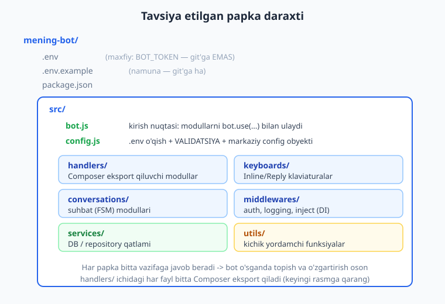
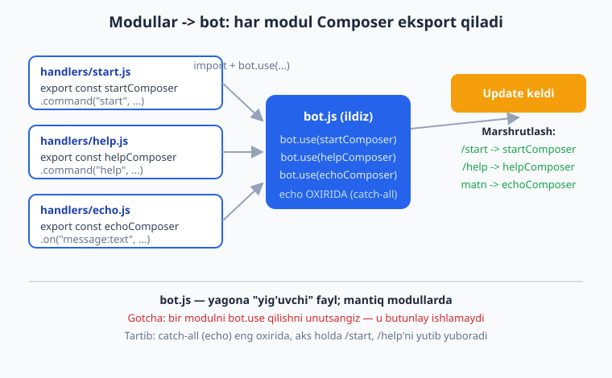
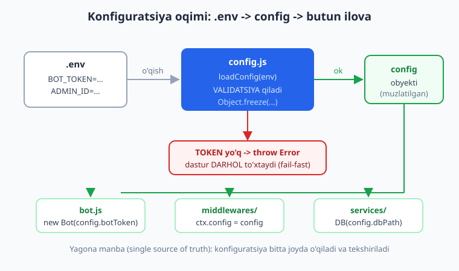

# 11 — Loyiha tuzilishi va konfiguratsiya

[⬅️ Oldingi: 10 — Sessiya va ma'lumotlar bazasi](./10-sessiya-malumotlar-bazasi.md) · [🏠 README](./README.md) · [Keyingi: 12 — Maxsus xususiyatlar va plaginlar ➡️](./12-maxsus-xususiyatlar.md)

---

> **Bu bobda:** botimiz hozirgacha bitta `bot.js` faylida o'sib keldi — endi u juda kattalashib, topish va o'zgartirish qiyinlashadigan paytga keldi. Bu bobda biz **modulli loyiha tuzilishi**ni o'rganamiz: kodni `src/handlers/`, `src/keyboards/`, `src/conversations/`, `src/middlewares/`, `src/services/`, `src/utils/` papkalariga ajratamiz va har bir handler modulini **`Composer`** sifatida eksport qilib, `bot.js` da `bot.use(...)` bilan ulaymiz. So'ng **markazlashtirilgan konfiguratsiya** quramiz: `config.js` `.env` faylni o'qiydi, qiymatlarni **validatsiya** qiladi (`BOT_TOKEN` yo'q bo'lsa dasturni darhol to'xtatadi — "fail-fast"), va butun ilovaga bitta muzlatilgan config obyekti tarqaladi. Bog'liqliklarni (config, DB/repository) **middleware orqali `ctx` ga ulash** (dependency injection) naqshini ko'ramiz, JS'da `ctx` ga o'z propertyni qo'shishni (TS'da bu "context flavor" bilan tiplanadi), va katta botni masshtablash maslahatlarini muhokama qilamiz. Bu boblardan keyin siz har qanday grammY botini "papka-papka, modul-modul" arxitektura sifatida loyihalashtira olasiz — bu aniq 18-kapston loyihasida ishlatiladigan tuzilma.
>
> **Halollik eslatmasi:** Bu bobning markaziy g'oyalari — bir nechta `Composer` modulini `bot.use` bilan ulab `handleUpdate` orqali to'g'ri marshrutlanishini, `config` validatsiya funksiyasini (env yo'q -> aniq xato; ADMIN_ID raqam emas -> aniq xato; to'g'ri env -> muzlatilgan obyekt), bog'liqlikni `ctx` ga middleware orqali ulashni (DI), hamda "Composer'ni `bot.use` qilishni unutish" va "catch-all modulni noto'g'ri tartibda qo'yish" gotcha'larini — soxta `Update` ni `bot.handleUpdate` ga uzatib, chiqayotgan API chaqiruvlarini transformer bilan ushlab **offline ishga tushirib tasdiqlandi** (`node _verify_11.mjs`, 9/9 o'tdi). Papka daraxti, `node --env-file` flagi va jonli polling — tarmoq/disk talab qiladi, ular "illustrativ" deb belgilanadi.

---

## Nega tuzilma kerak?

01-bobdan beri biz hamma narsani bitta `bot.js` ga yozdik. Bu o'rganish uchun ajoyib — bitta fayl, hamma narsa ko'z oldida. Lekin bot o'sgani sayin shu yagona fayl ham o'sadi:

- 5 ta buyruq, 3 ta klaviatura, 2 ta suhbat, sessiya, xato boshqaruvi — va `bot.js` allaqachon 600 qator.
- Bir buyruqni topish uchun butun faylni titkilaysiz.
- Ikki kishi birga ishlasa — doim bir faylda to'qnashasiz (git konflikt).
- Bir handlerni o'chirsangiz, qo'shni handlerni tasodifan buzasiz.

Yechim — **modullashtirish**: har bir mavzuni o'z fayliga ajratish, har faylni o'z vazifasiga javobgar qilish. Buni Node.js'da ESM modullari (`import`/`export`) bilan qilamiz — agar `import`/`export` sizga notanish bo'lsa, [Node.js kitobidagi modullar bobini](../nodejs/README.md) ko'rib oling, bu yerda asqotadi.

> **Eslatma:** "Bitta faylda hamma narsa" yomon emas — kichik, bir maqsadli bot uchun mukammal. Tuzilma — bot **o'sa boshlaganda** kerak bo'ladigan dori. Erta optimallashtirib, kichik botni 12 ta papkaga bo'lib tashlash ham xato. Qoida: og'riq sezganda bo'ling.

### Tavsiya etilgan struktura

Quyidagi tuzilma grammY hamjamiyatida keng tarqalgan va kapstonda ishlatamiz:

```text
mening-bot/
  .env                  # maxfiy: BOT_TOKEN va boshqalar (git'ga EMAS!)
  .env.example          # namuna: kalitlar, qiymatsiz (git'ga ha)
  .gitignore            # .env va node_modules shu yerda
  package.json
  src/
    bot.js              # kirish nuqtasi: modullarni yig'ib bot.use(...) qiladi
    config.js           # .env o'qish + validatsiya + markaziy config obyekti
    handlers/           # Composer eksport qiluvchi modullar
      start.js
      help.js
      echo.js
    keyboards/          # Inline/Reply klaviaturalar (06-bob)
      asosiy.js
    conversations/      # suhbat (FSM) modullari (08-bob)
      royxat.js
    middlewares/        # auth, logging, inject (DI)
      auth.js
      inject.js
    services/           # DB / repository qatlami (10-bob)
      userRepo.js
    utils/              # kichik yordamchilar
      sana.js
```



Har papkaning vazifasi aniq:

| Papka | Nima saqlaydi | Qaysi bobdan |
|---|---|---|
| `handlers/` | foydalanuvchi buyruq/xabarlariga javob beruvchi Composer'lar | 03, 04 |
| `keyboards/` | klaviatura quruvchilar (Inline/Reply) | 06, 07 |
| `conversations/` | ko'p qadamli suhbatlar (conversations v2) | 08 |
| `middlewares/` | logging, auth, dependency inject | 09 |
| `services/` | DB / tashqi API bilan ishlovchi "repository" qatlami | 10 |
| `utils/` | sof yordamchi funksiyalar (sana formati va h.k.) | — |

> **Anti-eskirish:** Bu nomlar majburiy standart EMAS — `handlers/` o'rniga `commands/`, `services/` o'rniga `db/` deyish ham to'g'ri. Muhimi — **izchillik** va **bir papka = bir mas'uliyat**. Faqat papka nomini grammY "rasmiy talabi" deb o'ylamang; bu shunchaki sog'lom amaliyot.

## Har modul `Composer` eksport qiladi

09-bobda `Composer` — handlerlarni guruhlaydigan "quticha" — bilan tanishdik. Modulli tuzilmaning yuragi shu: **har handler fayli bitta `Composer` yaratib, uni eksport qiladi**. `bot.js` esa o'sha Composer'larni import qilib `bot.use(...)` bilan ulaydi.

`src/handlers/start.js`:

```js
import { Composer } from "grammy";

export const startComposer = new Composer();

startComposer.command("start", (ctx) => {
  return ctx.reply("Salom! Botga xush kelibsiz.");
});
```

`src/handlers/help.js`:

```js
import { Composer } from "grammy";

export const helpComposer = new Composer();

helpComposer.command("help", (ctx) => {
  return ctx.reply("Yordam: /start, /help, /echo");
});
```

`src/handlers/echo.js` (oxirgi — "catch-all"):

```js
import { Composer } from "grammy";

export const echoComposer = new Composer();

echoComposer.on("message:text", (ctx) => {
  return ctx.reply("echo: " + ctx.message.text);
});
```

`src/bot.js` — yagona "yig'uvchi" fayl:

```js
import { Bot } from "grammy";
import { config } from "./config.js";
import { startComposer } from "./handlers/start.js";
import { helpComposer } from "./handlers/help.js";
import { echoComposer } from "./handlers/echo.js";

const bot = new Bot(config.botToken);

bot.use(startComposer);
bot.use(helpComposer);
bot.use(echoComposer);   // catch-all -> ENG OXIRIDA

bot.start();             // illustrativ: jonli polling token talab qiladi
```



Offline sinovda biz aynan shu uch modulni `bot.use` bilan ulab, uchta update uzatdik va to'g'ri marshrutlanganini ko'rdik:

```text
/start       -> "Salom! Botga xush kelibsiz."
/help        -> "Yordam: /start, /help, /echo"
oddiy matn   -> "echo: oddiy matn"
```

`bot.js` endi **mantiqdan xoli** — u faqat modullarni yig'adi. Mantiq esa modullarda yashaydi. Yangi buyruq qo'shmoqchimisiz? Yangi fayl yarating va `bot.js` ga ikki qator qo'shing. Buyruqni o'chirmoqchimisiz? Bitta qatorni o'chiring. Bu — masshtablanadigan arxitektura.

> **Eslatma — nima qaytarish:** Yuqorida handlerlar `ctx.reply(...)` ni **`return`** qiladi. grammY handler `Promise` qaytarishini kutadi (yoki `async` bo'lsin) — shunda u javob to'liq yuborilguncha kutadi. `return ctx.reply(...)` yoki `async (ctx) => { await ctx.reply(...); }` — ikkalasi ham to'g'ri.

### GOTCHA #1: Composer'ni `bot.use` qilishni unutish

Bu — modulli tuzilmadagi **eng ko'p uchraydigan xato**. Yangi modul yozasiz, lekin `bot.js` da `bot.use(yangiComposer)` qatorini qo'shishni unutasiz. Natijada: modul mavjud, kod to'g'ri, lekin handler **umuman ishlamaydi** — chunki u botga ulanmagan.

Offline sinovda biz `helpComposer` ni ataylab ulamadik:

```js
bot.use(startComposer);
// bot.use(helpComposer);  <- UNUTILDI!
bot.use(echoComposer);
```

`/help` uzatganda nima bo'ldi? `helpComposer` ulanmagani uchun `/help` handleri ishlamadi — uning o'rniga eng oxirdagi catch-all `echoComposer` `/help` ni oddiy matn deb qabul qilib `"echo: /help"` qaytardi. Ya'ni xato jim o'tib ketdi, dastur yiqilmadi — shuning uchun uni topish qiyin.

> **Diqqat:** Bu gotcha'ni topishning oson yo'li — yangi handler qo'shganingizda `bot.js` ga ham `bot.use(...)` qatorini DARHOL qo'shish odatini qiling. Yana yaxshi yo'l — pastda ko'radigan "barreldagi" markazlashtirilgan ro'yxat.

### GOTCHA #2: catch-all modul tartibi

09-bobdan eslang: grammY middleware/handlerlarni **qo'shilgan tartibda** aylanadi, birinchi mos handler ishlaydi va to'xtatadi. `echoComposer` ichidagi `on("message:text")` — bu **catch-all**: u har qanday matnli xabarni (jumladan `/start`, `/help` ham, chunki ular ham matn!) ushlaydi.

Demak, agar `echoComposer` ni `startComposer` dan **oldin** qo'ysangiz:

```js
bot.use(echoComposer);   // NOTO'G'RI: catch-all oldinda
bot.use(startComposer);
```

`/start` uzatganda `echoComposer` uni birinchi ushlab `"echo: /start"` qaytaradi — `startComposer` ga yetib bormaydi. Offline sinovda buni aniq ko'rdik. Qoida: **umumiy (catch-all) handlerlar doim eng oxirida**, aniq buyruqlar oldinda.

> **Eslatma:** "Birinchi mos handler g'olib" qoidasini 03 va 09-boblarda ko'rgan edik. Modullarga bo'linganda bu qoida **modullar orasida ham** ishlaydi: `bot.use(...)` tartibi = handlerlar tartibi.

## `config.js`: markazlashtirilgan konfiguratsiya

Hozirgacha biz `process.env.BOT_TOKEN` ni to'g'ridan-to'g'ri `bot.js` da o'qidik. Bu ham ishlaydi, lekin loyiha o'sganda muammo tug'diradi:

- `BOT_TOKEN`, `ADMIN_ID`, `DB_PATH` — har biri `process.env` dan tarqoq joylarda o'qiladi.
- `BOT_TOKEN` yo'q bo'lsa, bot ishga tushadi va keyin tushunarsiz tarmoq xatosi beradi — sababini topish qiyin.
- Qiymat tipini (`ADMIN_ID` raqammi?) hech kim tekshirmaydi.

Yechim — **bitta `config.js`**: u `.env` ni bir marta o'qiydi, qiymatlarni validatsiya qiladi, va butun ilovaga tarqaladigan muzlatilgan config obyektini qaytaradi.

### `.env` faylni o'qish

Node v20.6+ da `.env` ni o'qishning **built-in** yo'li bor — `--env-file` flagi (qo'shimcha paket kerak emas):

```bash
node --env-file=.env src/bot.js
```

`package.json` da skript sifatida:

```json
{
  "type": "module",
  "scripts": {
    "start": "node --env-file=.env src/bot.js",
    "dev": "node --env-file=.env --watch src/bot.js"
  }
}
```

> **Eslatma:** Eski Node yoki murakkabroq holatlar uchun `dotenv` paketi ham bor (`import "dotenv/config";`). `--env-file` esa yangi, sodda va paketsiz. Ikkalasi ham `.env` faylni `process.env` ga yuklaydi — `config.js` farqni sezmaydi. Bu kitobda biz `--env-file` ni afzal ko'ramiz.

`.env` fayl (HECH QACHON git'ga qo'ymang — `.gitignore` ga qo'shing):

```text
BOT_TOKEN=123456:ABC-DEF...
ADMIN_ID=999
DB_PATH=data.db
```

`.env.example` (git'ga qo'yiladi — jamoadoshlar qaysi kalitlar kerakligini bilsin):

```text
BOT_TOKEN=
ADMIN_ID=
DB_PATH=data.db
```

### Validatsiya — "fail-fast"

Endi eng muhim qism. `config.js` qiymatlarni **o'qish bilan birga tekshiradi**: agar `BOT_TOKEN` yo'q bo'lsa, dasturni **darhol, aniq xato bilan** to'xtatamiz. Bu "fail-fast" tamoyili — muammoni ishga tushish paytida, tushunarli xabar bilan ushlash; tarmoqqa ulanib, tushunarsiz xato kutmaslik.

`src/config.js`:

```js
function loadConfig(env) {
  const token = env.BOT_TOKEN;
  if (!token) {
    throw new Error("BOT_TOKEN topilmadi! .env faylga BOT_TOKEN=... qo'shing.");
  }

  const adminId = env.ADMIN_ID ? Number(env.ADMIN_ID) : null;
  if (env.ADMIN_ID && Number.isNaN(adminId)) {
    throw new Error("ADMIN_ID raqam bo'lishi kerak, lekin: " + env.ADMIN_ID);
  }

  return Object.freeze({
    botToken: token,
    adminId,
    dbPath: env.DB_PATH ?? "data.db",   // default qiymat
  });
}

export const config = loadConfig(process.env);
```



Diqqat qilishga arzigan uch narsa:

1. **`loadConfig(env)` — `process.env` ni argument sifatida oladi.** Bu test qulayligi uchun: offline sinovda biz unga `{}` (bo'sh) yoki soxta env beramiz, `process.env` ga aralashmaymiz. Faylning oxirida `loadConfig(process.env)` bir marta chaqirilib, natija `config` deb eksport qilinadi.

2. **`Object.freeze(...)`** — config obyektini **muzlatadi**: birorta modul tasodifan `config.botToken = "boshqa"` deb o'zgartira olmaydi. Konfiguratsiya — o'qish uchun, o'zgartirish uchun emas.

3. **Default qiymatlar** — `env.DB_PATH ?? "data.db"`: ixtiyoriy kalit berilmasa, oqilona standart ishlatiladi.

Offline sinovlarimiz `loadConfig` ni har tomonlama tekshirdi:

- `loadConfig({})` -> `Error: BOT_TOKEN topilmadi!` (aynan kutilgan xato matni).
- `loadConfig({ BOT_TOKEN: "12345:ABC", ADMIN_ID: "salom" })` -> `Error: ADMIN_ID raqam bo'lishi kerak...`.
- `loadConfig({ BOT_TOKEN: "12345:ABC", ADMIN_ID: "999" })` -> `{ botToken: "12345:ABC", adminId: 999, dbPath: "data.db" }`, va `config.botToken = "x"` o'zgartirishga urinish xato berdi (muzlatilgan).

> **Diqqat — `BOT_TOKEN` ni hech qachon kodga yozmang!** 02-bobda token xavfsizligini ko'rdik. Token doim `.env` da (yoki serverda muhit o'zgaruvchisida) bo'lsin, `.env` esa `.gitignore` da. Agar token git tarixiga tushib qolsa — BotFather'da `/revoke` qiling. `config.js` faqat o'qiydi, hech qachon log'lamaydi.

> **Eslatma — cross-link:** Deploy paytida `.env` faylni serverga qo'lda nusxalamaysiz — Cloudflare/Railway/VPS panelida muhit o'zgaruvchilarini kiritasiz. Buni va git workflow'ni [git/GitHub kitobida](../git-github/README.md) ko'rasiz. DB sxemasi va `services/` qatlamining ichi esa [SQL kitobida](../sql/README.md) chuqurroq.

## Bog'liqlikni `ctx` ga ulash (dependency injection)

`config` va `db` — bu **bog'liqliklar** (dependencies): handlerlar ularsiz ishlay olmaydi. Ularni handlerga yetkazishning ikki yo'li bor:

1. **Global import** — har handler fayli `import { config } from "../config.js"` qiladi. Ishlaydi, lekin handlerni `config` ga "yopishtiradi" (test qilish va almashtirish qiyin).

2. **Dependency injection (DI)** — `config` va `db` ni **middleware orqali `ctx` ga ulaymiz**. Handler ularni `ctx.config`, `ctx.db` orqali oladi. Bu toza, test qulay, va grammY uslubidagi yo'l.

09-bobda `ctx` ga o'z propertyimizni qo'shishni ko'rgan edik (`ctx.role = ...`). DI — aynan shu g'oyaning kuchli qo'llanilishi. `src/middlewares/inject.js`:

```js
import { Composer } from "grammy";
import { config } from "../config.js";
import { makeUserRepo } from "../services/userRepo.js";

const repo = makeUserRepo(config.dbPath);

export const injectComposer = new Composer();

injectComposer.use(async (ctx, next) => {
  ctx.config = config;   // har handler endi ctx.config ni o'qiy oladi
  ctx.repo = repo;       // va ctx.repo ni (DB qatlami)
  await next();
});
```

`bot.js` da bu middleware **modullardan OLDIN** ulanadi (tartib muhim — `ctx.config` handler chaqirilishidan oldin o'rnatilishi kerak):

```js
bot.use(injectComposer);   // 1. bog'liqliklarni ctx ga ulaydi
bot.use(startComposer);    // 2. handlerlar endi ctx.config / ctx.repo ni o'qiydi
bot.use(echoComposer);
```

Endi handler **global import qilmaydi** — `ctx` dan oladi:

```js
// handlers/start.js
startComposer.command("start", (ctx) => {
  ctx.repo.upsert(ctx.from.id, ctx.from.first_name);
  const rol = ctx.from.id === ctx.config.adminId ? "admin" : "user";
  return ctx.reply(`Rol: ${rol}, ro'yxatdagilar: ${ctx.repo.count()}`);
});
```

Offline sinovda biz `config` va soxta `repo` ni middleware orqali ulab, admin (`id=999`) va oddiy (`id=555`) foydalanuvchidan `/start` uzatdik:

```text
admin   -> "Rol: admin, ro'yxatdagilar: 1"
oddiy   -> "Rol: user, ro'yxatdagilar: 2"
```

`repo.count()` ham `2` ga yetdi — ya'ni ikkala chaqiruv ham **bir xil** `repo` obyektini ishlatdi (yangi nusxa har safar yaratilmadi). Bu DI'ning kuchi: bog'liqlik bir marta yaratiladi, hammaga ulashiladi.

> **Diqqat — DI middleware tartibi:** Inject middleware'ni handler modullaridan **OLDIN** qo'ying. Aks holda handler chaqirilganda `ctx.config` hali `undefined` bo'ladi va `TypeError: Cannot read properties of undefined` olasiz. Offline sinovda inject'ni Composer'dan oldin qo'yib, `ctx.repo.count()` ishlaganini tasdiqladik.

### `ctx` ga property qo'shish va TypeScript "context flavor"

Sof JS'da `ctx.config = config` to'g'ridan-to'g'ri ishlaydi — biz shuni ishlatamiz. Ammo TypeScript'da `ctx` qat'iy tiplangan, shuning uchun yangi property qo'shish uchun **context flavor** kerak:

```ts
// faqat TS uchun illustratsiya — bu kitob JS'da
import { Context } from "grammy";
type MyContext = Context & {
  config: AppConfig;
  repo: UserRepo;
};
const bot = new Bot<MyContext>(token);
```

Shunda muharrir `ctx.config` ga avtokomplit beradi va `ctx.confg` (xato yozsangiz) ni qizil chiziq bilan ushlaydi. Bu — TypeScript'ning "qo'shimcha foydasi", JS uchun shart emas. Alohida TS kitobi mavjud; bu yerda biz JS'da `ctx.config` ni shunchaki yozamiz.

> **Eslatma — JSDoc bilan yarim-tiplash:** Agar JS'da ham avtokomplit istasangiz, JSDoc kommenti yozishingiz mumkin (`/** @type {AppConfig} */`). Bu ixtiyoriy va to'liq TS emas — lekin VS Code'da yordam beradi. Kodning o'zi sof JS bo'lib qoladi.

## "Barrel" — modullarni bitta joydan ulash

Modullar ko'paysa, `bot.js` da `bot.use(...)` qatorlari ham ko'payadi va Gotcha #1 (unutish) xavfi ortadi. Bir yechim — barcha handler modullarini bitta `handlers/index.js` ("barrel") da yig'ish:

```js
// src/handlers/index.js
import { startComposer } from "./start.js";
import { helpComposer } from "./help.js";
import { echoComposer } from "./echo.js";

// TARTIB MUHIM: catch-all (echo) eng oxirida
export const handlers = [startComposer, helpComposer, echoComposer];
```

`bot.js` esa ularni bitta sikl bilan ulaydi:

```js
import { handlers } from "./handlers/index.js";
for (const h of handlers) bot.use(h);
```

Endi yangi modul qo'shish = `index.js` massiviga bitta nom qo'shish. Tartib ham bir joyda ko'rinadi (catch-all oxirida). Bu Gotcha #1 va #2 ni bitta o'qda kamaytiradi.

> **Eslatma:** Barrel'ning kichik kamchiligi — barcha modullar har doim yuklanadi (lazy emas). Telegram boti uchun bu muammo emas (modullar kichik). Juda katta loyihada dinamik `import()` bilan kechiktirib yuklash mumkin, lekin bu kamdan-kam kerak bo'ladi.

## Aylanma import (circular import) muammosi

Modullarga bo'linganda yangi tuzoq paydo bo'ladi: **aylanma import**. Masalan `services/userRepo.js` `config.js` ni import qiladi, `config.js` esa `services/userRepo.js` ni import qiladi — natijada biri ikkinchisini to'liq yuklanmasidan o'qiydi va `undefined` oladi.

```js
// userRepo.js  ->  config.js  ->  userRepo.js  ->  ...  AYLANMA!
```

Belgilari: `Cannot access 'X' before initialization` yoki kutilmagan `undefined`. Yechim — **bog'liqlik yo'nalishini bir tomonlama qiling**:

- `config.js` hech kimni import qilmasin (u eng quyi qatlam).
- `services/` `config.js` ni import qilsin, lekin `config.js` `services/` ni import qilmasin.
- `handlers/` `services/` va `keyboards/` ni import qilsin, teskari emas.

Ya'ni import grafigi **daraxt** bo'lsin, halqa emas. Agar ikki modul bir-biriga kerak bo'lsa — umumiy qismni uchinchi (quyiroq) modulga ajrating yoki bog'liqlikni DI orqali `ctx` dan oling (yuqorida ko'rdik).

## Katta botni masshtablash maslahatlari

Bot juda kattalashganda quyidagilar yordam beradi:

- **Domen bo'yicha bo'lish.** `handlers/` ni mavzularga ajrating: `handlers/admin/`, `handlers/user/`, `handlers/payments/`. Har biri o'z Composer'ini eksport qiladi.
- **Qisman himoya `Composer.use` bilan.** Admin handlerlariga faqat admin middleware'ni qo'llang: `adminComposer.use(adminAuth)` — butun botga emas (09-bob).
- **`errorBoundary` modul atrofida.** "To'lov moduli yiqilsa, qolgan bot ishlasin" uchun `bot.errorBoundary(...)` bilan modulni o'rang (09-bob).
- **Konkurensiya uchun `@grammyjs/runner`.** Yuk ortganda `bot.start()` o'rniga `run(bot)` — ko'p update'ni parallel ishlaydi. Buni 13/16-boblarda ko'ramiz.
- **`services/` ni interfeysga ajrating.** Handler `ctx.repo.getUser(id)` ni chaqiradi, lekin u SQLite'mi yoki Postgres'mi — bilmaydi. DB'ni almashtirsangiz, faqat `services/` o'zgaradi, handlerlar tegilmaydi. DB dizayni: [SQL kitobi](../sql/README.md).

Bu tuzilma **18-kapston** loyihasida to'liq ishlatiladi — u yerda biz haqiqiy, ko'p modulli botni shu papka strukturasi bilan quramiz. Hozir o'rgangan har bir naqsh (Composer modullar, config validatsiya, DI) o'sha yerda qayta uchraydi.

> **Eslatma — Python ekvivalenti:** Agar [aiogram (Python) kitobini](../tgbot-python/README.md) ham o'qisangiz, qiziq taqqoslash ko'rasiz: u yerda modul = `Router` (grammY'dagi `Composer` ga juda o'xshash), `bot.js` = `dp.include_router(...)`, va config esa ko'pincha `pydantic-settings` bilan validatsiya qilinadi. G'oya bir xil: modullarga bo'lish + markaziy, validatsiyalangan config.

## Tez-tez uchraydigan xatolar

| Xato | Sabab | Yechim |
|---|---|---|
| Yangi handler umuman ishlamaydi | Composer'ni `bot.use(...)` qilish unutilgan | `bot.js` ga (yoki barrel massiviga) modulni qo'shing |
| `/start` ham "echo" javobini oladi | catch-all (`on("message:text")`) aniq buyruqdan OLDIN ulangan | catch-all modulni eng oxiriga qo'ying |
| Tushunarsiz tarmoq xatosi ishga tushishda | `BOT_TOKEN` validatsiyasiz, `undefined` token bilan ulangan | `config.js` da `BOT_TOKEN` ni tekshirib, yo'q bo'lsa aniq `throw` qiling |
| `Cannot read properties of undefined (ctx.config)` | inject middleware handler'dan KEYIN ulangan | inject middleware'ni handler modullaridan oldin `bot.use` qiling |
| `Cannot access 'X' before initialization` | aylanma import (circular) | bog'liqlikni bir tomonlama qiling yoki DI orqali `ctx` dan oling |
| `config.botToken = ...` jim o'tmaydi / xato | config muzlatilgan (`Object.freeze`) | config o'qish uchun; o'zgaruvchan holatni boshqa joyda saqlang |
| Token git tarixida ko'rinib qoldi | `.env` `.gitignore` ga qo'shilmagan | `.gitignore` ga `.env` qo'shing; BotFather'da `/revoke` qiling |

---

## Mashqlar

> Quyidagi mashqlarning ko'pi **offline** tekshiriladi — `bot.handleUpdate(update)` ga soxta update uzatib, `bot.api.config.use(...)` transformer bilan chiqayotgan chaqiruvlarni ushlaysiz, yoki `loadConfig(...)` ni soxta `env` obyekti bilan chaqirib `assert.throws` qilasiz. Buyruq update'iga `entities:[{type:"bot_command",offset:0,length:N}]` qo'shishni unutmang. Yechimlar `makeBot()` (transformer + `botInfo`) va `mkText(...)` yordamchilaridan foydalanadi (bob boshidagi halollik eslatmasiga qarang).

### Oson

1. **Ikki modul.** Ikki `Composer` yarating: `pingComposer` (`.command("ping")` -> `"pong"`) va `salomComposer` (`.command("salom")` -> `"Assalom"`). Ikkalasini `bot.use(...)` bilan ulang, `/ping` va `/salom` uzatib, mos javoblarni tasdiqlang.

2. **Catch-all oxirida.** `startComposer` (`.command("start")`) va `echoComposer` (`.on("message:text")`) yarating. Echo'ni OXIRIDA ulang. `/start` uzatib, javob `"echo: /start"` EMAS, balki start javobi ekanini tasdiqlang.

3. **Config: token bor.** `loadConfig(env)` funksiyasini yozing (matndagi kabi). `loadConfig({ BOT_TOKEN: "12345:ABC" })` chaqirib, `config.botToken === "12345:ABC"` va `config.dbPath === "data.db"` (default) ekanini tasdiqlang.

4. **Config: default qiymat.** 3-mashqdagi config'da `DB_PATH` berilmagan -> `dbPath` `"data.db"` ekanini; `DB_PATH: "mybot.db"` berilganda esa `dbPath === "mybot.db"` ekanini tasdiqlang.

### O'rta

5. **Token yo'q -> xato.** `loadConfig({})` (bo'sh env) `Error` otishini va xato matnida `"BOT_TOKEN"` borligini `assert.throws(..., /BOT_TOKEN/)` bilan tasdiqlang.

6. **ADMIN_ID validatsiyasi.** `loadConfig({ BOT_TOKEN: "x", ADMIN_ID: "salom" })` xato otishini tasdiqlang; `loadConfig({ BOT_TOKEN: "x", ADMIN_ID: "999" })` esa `adminId === 999` (raqam, satr emas) qaytarishini tasdiqlang.

7. **Config muzlatilgan.** To'g'ri config oling va `config.botToken = "boshqa"` ga urinish `assert.throws` bilan xato berishini (yoki qiymat o'zgarmasligini) tasdiqlang. (`"use strict"` / ESM modulida `freeze`'lik obyektga yozish `TypeError` beradi.)

8. **DI: config ni ctx ga ulash.** Middleware'da `ctx.config = loadConfig({ BOT_TOKEN: "x", ADMIN_ID: "999" })` qo'ying. `.command("kim")` handleri `ctx.from.id === ctx.config.adminId` bo'lsa `"admin"`, aks holda `"user"` qaytarsin. Admin (`id=999`) va oddiy (`id=1`) dan `/kim` uzatib, ikki javobni tasdiqlang.

### Qiyin

9. **Gotcha: ulanmagan Composer.** `aComposer` (`.command("a")` -> `"A"`) va `bComposer` (`.command("b")` -> `"B"`) yarating, lekin FAQAT `aComposer` ni `bot.use` qiling. `/a` `"A"` qaytarishini, `/b` esa HECH narsa (`sendMessage` chaqiruvi yo'q) qaytarishini tasdiqlang.

10. **Gotcha: catch-all oldinda.** `echoComposer` (`.on("message:text")` -> `"echo: <matn>"`) ni `startComposer` (`.command("start")`) dan OLDIN ulang. `/start` uzatib, javob `"echo: /start"` ekanini (ya'ni start handler'ga yetib bormaganini) tasdiqlang.

11. **DI tartibi gotcha'si.** Inject middleware'ni handler Composer'idan KEYIN ulasangiz nima bo'lishini tekshiring: handler `ctx.config` ga murojaat qilganda `TypeError` (`undefined` ning propertysi) otilishini `handleUpdate` ni `try/catch` ga olib tasdiqlang. So'ng tartibni to'g'rilab (inject OLDIN) javob to'g'ri kelishini tasdiqlang.

12. **Barrel massivi.** Uch Composer (`start`, `help`, `echo` — echo oxirda) ni massivga yig'ing va `for (const h of handlers) bot.use(h)` bilan ulang. `/start`, `/help`, `oddiy matn` uzatib, uchala javob to'g'ri marshrutlanganini tasdiqlang.

13. **`repo` bitta nusxa.** Soxta `repo` (`makeUserRepo()` — `upsert`/`count` bilan) yarating va uni inject middleware orqali `ctx.repo` ga ulang. `.command("qosh")` handleri `ctx.repo.upsert(ctx.from.id, ...)` qilib `ctx.repo.count()` ni qaytarsin. Uch xil `id` dan `/qosh` uzatib, oxirgi javob `"3"` ekanini (ya'ni bir xil `repo` ishlatilganini) tasdiqlang.

<details markdown="1">
<summary>Yechimlar</summary>

> Quyidagi yechimlar `_verify_11.mjs` dagi naqsh bilan offline ishga tushiriladi. Har bir yechim `makeBot()` (transformer + `botInfo`), `mkText(...)` va matndagi `loadConfig(...)` yordamchilaridan foydalanadi. Qisqartirish uchun bu yordamchilar takrorlanmaydi (bob boshidagi halollik eslatmasiga qarang). `import { Bot, Composer } from "grammy"` va `import assert from "node:assert/strict"` kerak.

### 1-mashq yechimi

```js
const { bot, calls } = makeBot();
const pingComposer = new Composer();
pingComposer.command("ping", (ctx) => ctx.reply("pong"));
const salomComposer = new Composer();
salomComposer.command("salom", (ctx) => ctx.reply("Assalom"));
bot.use(pingComposer);
bot.use(salomComposer);
await bot.handleUpdate(mkText("/ping", 1));
await bot.handleUpdate(mkText("/salom", 2));
const texts = calls.filter((c) => c.method === "sendMessage").map((c) => c.payload.text);
assert.deepEqual(texts, ["pong", "Assalom"]);
```

Har modul mustaqil `Composer`; `bot.use(...)` ularni ulaydi va buyruqlar to'g'ri marshrutlanadi.

### 2-mashq yechimi

```js
const { bot, calls } = makeBot();
const startComposer = new Composer();
startComposer.command("start", (ctx) => ctx.reply("Salom!"));
const echoComposer = new Composer();
echoComposer.on("message:text", (ctx) => ctx.reply("echo: " + ctx.message.text));
bot.use(startComposer);
bot.use(echoComposer);   // catch-all OXIRIDA
await bot.handleUpdate(mkText("/start", 1));
const c = calls.find((x) => x.method === "sendMessage");
assert.equal(c.payload.text, "Salom!");   // echo emas
```

Echo oxirida bo'lgani uchun `/start` avval `startComposer` ga tushadi.

### 3-mashq yechimi

```js
const config = loadConfig({ BOT_TOKEN: "12345:ABC" });
assert.equal(config.botToken, "12345:ABC");
assert.equal(config.dbPath, "data.db");   // berilmagan -> default
```

`loadConfig` token bo'lsa muvaffaqiyatli qaytadi; `DB_PATH` berilmagani uchun `?? "data.db"` default ishladi.

### 4-mashq yechimi

```js
assert.equal(loadConfig({ BOT_TOKEN: "x" }).dbPath, "data.db");
assert.equal(loadConfig({ BOT_TOKEN: "x", DB_PATH: "mybot.db" }).dbPath, "mybot.db");
```

`env.DB_PATH ?? "data.db"` — berilsa o'sha, berilmasa default.

### 5-mashq yechimi

```js
assert.throws(() => loadConfig({}), /BOT_TOKEN/);
```

Bo'sh env -> `BOT_TOKEN` yo'q -> `loadConfig` aniq xato otadi (fail-fast). `assert.throws` ning ikkinchi argumenti — xato matniga regex.

### 6-mashq yechimi

```js
assert.throws(() => loadConfig({ BOT_TOKEN: "x", ADMIN_ID: "salom" }), /ADMIN_ID/);
const config = loadConfig({ BOT_TOKEN: "x", ADMIN_ID: "999" });
assert.equal(config.adminId, 999);
assert.equal(typeof config.adminId, "number");   // satr emas, raqam
```

`Number("salom")` `NaN` beradi -> validatsiya xato otadi. To'g'ri qiymat esa `Number("999") === 999` (raqam).

### 7-mashq yechimi

```js
const config = loadConfig({ BOT_TOKEN: "x" });
assert.throws(() => { config.botToken = "boshqa"; });
assert.equal(config.botToken, "x");   // o'zgarmadi
```

`Object.freeze` tufayli muzlatilgan obyektga yozish strict rejimda (ESM doim strict) `TypeError` otadi va qiymat o'zgarmaydi.

### 8-mashq yechimi

```js
const { bot, calls } = makeBot();
const config = loadConfig({ BOT_TOKEN: "x", ADMIN_ID: "999" });
bot.use(async (ctx, next) => { ctx.config = config; await next(); });
const composer = new Composer();
composer.command("kim", (ctx) =>
  ctx.reply(ctx.from.id === ctx.config.adminId ? "admin" : "user")
);
bot.use(composer);
await bot.handleUpdate(mkText("/kim", 1, 999));   // admin
await bot.handleUpdate(mkText("/kim", 2, 1));     // oddiy
const texts = calls.filter((c) => c.method === "sendMessage").map((c) => c.payload.text);
assert.deepEqual(texts, ["admin", "user"]);
```

Config middleware orqali `ctx.config` ga ulanadi; handler global import qilmay, `ctx` dan o'qiydi (DI).

### 9-mashq yechimi

```js
const { bot, calls } = makeBot();
const aComposer = new Composer();
aComposer.command("a", (ctx) => ctx.reply("A"));
const bComposer = new Composer();
bComposer.command("b", (ctx) => ctx.reply("B"));
bot.use(aComposer);
// bot.use(bComposer);  <- ATAYLAB UNUTILDI
await bot.handleUpdate(mkText("/a", 1));
await bot.handleUpdate(mkText("/b", 2));
const texts = calls.filter((c) => c.method === "sendMessage").map((c) => c.payload.text);
assert.deepEqual(texts, ["A"]);   // /b umuman javob bermadi
```

`bComposer` ulanmagani uchun `/b` handleri ishlamadi — kod to'g'ri bo'lsa-da, modul botga ulanmagan (Gotcha #1).

### 10-mashq yechimi

```js
const { bot, calls } = makeBot();
const echoComposer = new Composer();
echoComposer.on("message:text", (ctx) => ctx.reply("echo: " + ctx.message.text));
const startComposer = new Composer();
startComposer.command("start", (ctx) => ctx.reply("Salom!"));
bot.use(echoComposer);    // NOTO'G'RI: catch-all OLDIN
bot.use(startComposer);
await bot.handleUpdate(mkText("/start", 1));
const c = calls.find((x) => x.method === "sendMessage");
assert.equal(c.payload.text, "echo: /start");   // start'ga yetib bormadi
```

Catch-all oldinda bo'lgani uchun u `/start` ni (matn deb) birinchi ushladi va to'xtatdi (Gotcha #2). To'g'rilash: echo'ni oxiriga ko'chiring.

### 11-mashq yechimi

```js
// NOTO'G'RI tartib: inject handler'dan KEYIN
const b1 = makeBot();
const composer = new Composer();
composer.command("kim", (ctx) => ctx.reply(String(ctx.config.adminId)));
b1.bot.use(composer);
b1.bot.use(async (ctx, next) => { ctx.config = { adminId: 999 }; await next(); });
let thrown = null;
try { await b1.bot.handleUpdate(mkText("/kim", 1)); }
catch (err) { thrown = err; }
assert.ok(thrown);   // ctx.config undefined -> TypeError yuqoriga otildi

// TO'G'RI tartib: inject OLDIN
const b2 = makeBot();
b2.bot.use(async (ctx, next) => { ctx.config = { adminId: 999 }; await next(); });
const composer2 = new Composer();
composer2.command("kim", (ctx) => ctx.reply(String(ctx.config.adminId)));
b2.bot.use(composer2);
await b2.bot.handleUpdate(mkText("/kim", 1));
const c = b2.calls.find((x) => x.method === "sendMessage");
assert.equal(c.payload.text, "999");
```

Inject handler'dan keyin bo'lsa, handler chaqirilganda `ctx.config` hali `undefined` -> `TypeError` (`handleUpdate` uni `BotError` sifatida yuqoriga otadi). Inject'ni oldinga qo'yganda hammasi joyiga tushadi.

### 12-mashq yechimi

```js
const { bot, calls } = makeBot();
const startComposer = new Composer();
startComposer.command("start", (ctx) => ctx.reply("Salom!"));
const helpComposer = new Composer();
helpComposer.command("help", (ctx) => ctx.reply("Yordam"));
const echoComposer = new Composer();
echoComposer.on("message:text", (ctx) => ctx.reply("echo: " + ctx.message.text));
const handlers = [startComposer, helpComposer, echoComposer];   // echo oxirda
for (const h of handlers) bot.use(h);
await bot.handleUpdate(mkText("/start", 1));
await bot.handleUpdate(mkText("/help", 2));
await bot.handleUpdate(mkText("oddiy", 3));
const texts = calls.filter((c) => c.method === "sendMessage").map((c) => c.payload.text);
assert.deepEqual(texts, ["Salom!", "Yordam", "echo: oddiy"]);
```

Barrel massivi tartibni bir joyda ushlaydi (echo oxirda) va sikl barcha modullarni ulaydi — yangi modul = massivga bitta nom.

### 13-mashq yechimi

```js
const { bot, calls } = makeBot();
function makeUserRepo() {
  const store = new Map();
  return {
    upsert(id, name) { store.set(id, { id, name }); },
    count() { return store.size; },
  };
}
const repo = makeUserRepo();
bot.use(async (ctx, next) => { ctx.repo = repo; await next(); });   // bir xil repo
const composer = new Composer();
composer.command("qosh", (ctx) => {
  ctx.repo.upsert(ctx.from.id, ctx.from.first_name);
  return ctx.reply(String(ctx.repo.count()));
});
bot.use(composer);
await bot.handleUpdate(mkText("/qosh", 1, 101));
await bot.handleUpdate(mkText("/qosh", 2, 102));
await bot.handleUpdate(mkText("/qosh", 3, 103));
const texts = calls.filter((c) => c.method === "sendMessage").map((c) => c.payload.text);
assert.deepEqual(texts, ["1", "2", "3"]);   // bir xil repo -> count o'sib bordi
```

`repo` bir marta yaratilib, inject orqali har chaqiruvga ulashildi — shuning uchun `count()` `1, 2, 3` ga o'sdi (har safar yangi repo yaratilganda doim `1` bo'lardi). Bu DI'ning asosiy foydasi.

</details>

---

[⬅️ Oldingi: 10 — Sessiya va ma'lumotlar bazasi](./10-sessiya-malumotlar-bazasi.md) · [🏠 README](./README.md) · [Keyingi: 12 — Maxsus xususiyatlar va plaginlar ➡️](./12-maxsus-xususiyatlar.md)
