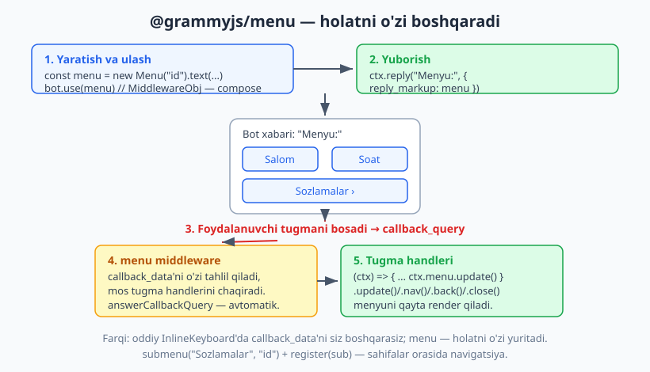
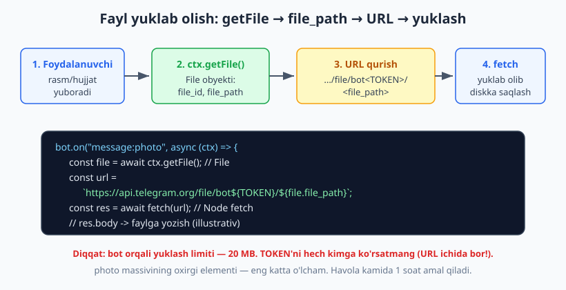
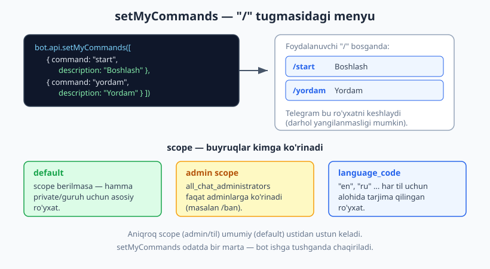

# 12 — Maxsus xususiyatlar va plaginlar

[⬅️ Oldingi: 11 — Loyiha tuzilishi va konfiguratsiya](./11-loyiha-tuzilishi.md) · [🏠 README](./README.md) · [Keyingi: 13 — Webhook va deploy server ➡️](./13-webhook.md)

---

> **Bu bobda:** botingizni "professional" qiladigan bir nechta tayyor vosita bilan tanishamiz. Birinchidan, `@grammyjs/menu` plugini — interaktiv menyu: tugmasi bosilganda holatni o'zi boshqaradigan, sahifadan sahifaga o'tadigan inline klaviatura (07-bobdagi oddiy `InlineKeyboard`'dan keyingi qadam). Ikkinchidan, foydalanuvchi yuborgan rasm yoki hujjatni qanday yuklab olish — `ctx.getFile()` -> `file_path` -> URL qurish -> `fetch` bilan diskka saqlash. Uchinchidan, `bot.api.setMyCommands` bilan foydalanuvchi "/" bosganda chiqadigan buyruqlar menyusini sozlash (scope va tillar bilan). To'rtinchidan, `@grammyjs/hydrate` plugini — `ctx.reply` qaytargan xabarni keyin to'g'ridan-to'g'ri `.editText()`/`.delete()` qilish qulayligi. Yo'l-yo'lakay WebApp tugmasini (23-bobning ko'rsatmasi) eslatamiz va "plagin nima, qanday ulanadi" degan savolga (middleware va transformer) javob beramiz. Yakunda — ko'p uchraydigan xatolar jadvali va 12 dan ortiq mashq.

> **Halollik eslatmasi:** bu bobdagi kod mantig'i **offline ishga tushirilib tekshirilgan** — soxta `Update`'larni `bot.handleUpdate(...)`'ga uzatib va chiqayotgan API chaqiruvlarini transformer bilan ushlab. Aynan tekshirilganlar: `bot.use(menu)` compose bo'lishi va tugma bosilganda (callback_query) handler ishlashi; submenu navigatsiyasi (`editMessage*` chaqiruvi); dinamik range; `ctx.getFile()` -> `file_path` -> to'g'ri yuklash URL'i; `setMyCommands` payload'i (default/admin scope/til); `hydrate()` dan keyin `msg.editText()` va `msg.delete()` to'g'ri `message_id` bilan ketishi; WebApp tugma payload'i. Test natijasi: **8/8 PASS** (bob oxiridagi hisobotda). Haqiqiy faylni Telegram serveridan `fetch` bilan **yuklab olish** va jonli `bot.start()` — token va internet talab qilgani uchun **illustrativ** deb belgilangan; ulardagi grammY API (`getFile`, URL formati) esa manbadan tasdiqlangan.

---

## Plagin nima va qanday ulanadi?

grammY o'zagi ataylab kichik: u Bot API'ning ustidagi yupqa, ishonchli qatlam. Qo'shimcha qulayliklar — menyu, suhbat, sessiya, hydrate — alohida **plaginlar** sifatida keladi (`@grammyjs/*` paketlari). Bu sizga faqat kerakligini o'rnatish imkonini beradi: bot yengil qoladi.

grammY'da plagin ikki shaklning birida ulanadi:

- **Middleware plagini** — `bot.use(...)` orqali ulanadi va update oqimiga qo'shiladi. Ko'pchilik plaginlar shunday: `session()`, `conversations()`, `hydrate()`, va `Menu` ham (u `MiddlewareObj` — ya'ni `bot.use(menu)` qilsa bo'ladi). Bu — 09-bobda ko'rgan **middleware** zanjirining bir qismi.
- **Transformer plagini** — `bot.api.config.use(...)` orqali ulanadi va **chiqayotgan** API chaqiruvlarini o'rab oladi (masalan `@grammyjs/auto-retry`, throttler). U update'ga emas, balki sizning `ctx.reply`/`bot.api.*` chaqiruvlaringizga ta'sir qiladi.

> **Eslatma:** offline testlarimizda biz aynan transformer mexanizmidan foydalanamiz — `bot.api.config.use((prev, method, payload) => ...)` chiqayotgan har bir API chaqirig'ini ushlaydi va tarmoqqa chiqmasdan soxta javob qaytaradi. Ya'ni "transformer" — shunchaki test hiylasi emas, grammY'ning rasmiy kengaytirish nuqtasi.

Endi shu bobning to'rtta amaliy plaginiga/xususiyatiga o'tamiz.

---

## @grammyjs/menu — interaktiv menyu plugini

07-bobda `InlineKeyboard` bilan tugmalar yaratdik va `callback_query`'ni qo'lda boshqardik: har bir tugmaga `callback_data` berdik, keyin `bot.callbackQuery("...")` bilan uni ushladik, `answerCallbackQuery` chaqirdik, kerak bo'lsa xabarni `editMessageText` bilan yangiladik. Ko'p sahifali menyu (masalan "Sozlamalar -> Til -> Orqaga") yasamoqchi bo'lsangiz, bu tez orada chalkash bo'lib ketadi: har bir `callback_data`'ni nomlash, qaysi sahifada turganini eslab qolish, navigatsiyani qo'lda qilish.

**`@grammyjs/menu`** shu ishni soddalashtiradi. Siz menyuni **deklarativ** quryapsiz — qaysi tugma, qaysi qatorda, bosilganda nima bo'ladi — plugin esa `callback_data`'ni, navigatsiyani va `answerCallbackQuery`'ni o'zi boshqaradi.

### O'rnatish va eng sodda menyu

```bash
npm install @grammyjs/menu
```

```js
import { Bot } from "grammy";
import { Menu } from "@grammyjs/menu";

const bot = new Bot(process.env.BOT_TOKEN);

// 1) Menyu yaratamiz. "asosiy" — uning yagona identifikatori (string).
const menu = new Menu("asosiy")
  .text("Salom", (ctx) => ctx.reply("Salom bosildi!")).row()
  .text("Soat", (ctx) => ctx.reply(`Soat: ${new Date().toLocaleTimeString()}`));

// 2) Menyuni ulaymiz — u middleware (MiddlewareObj), shuning uchun bot.use bilan
bot.use(menu);

// 3) Menyuni yuboramiz: reply_markup sifatida menu'ning O'ZINI beramiz
bot.command("menu", (ctx) => ctx.reply("Menyu:", { reply_markup: menu }));

bot.start();
```

Uch qadam: **yarat -> `bot.use` -> `reply_markup: menu`**. Tarkibida:

- `new Menu("asosiy")` — menyu identifikatorini beramiz. Bu satr `callback_data`'larda ishlatiladi va loyihada **noyob** bo'lishi kerak.
- `.text(label, handler)` — matnli tugma. `label` — tugma yozuvi, `handler` — bosilganda ishlaydigan funksiya (oddiy `(ctx) => ...`). Bir nechta handler ham berish mumkin (ular middleware sifatida ketma-ket ishlaydi).
- `.row()` — keyingi tugmalar yangi qatorga tushadi (07-bobdagi `InlineKeyboard.row()` kabi).

> **Diqqat — `reply_markup`'ga menu obyektining O'ZINI bering**, render qilingan klaviaturani emas. `new InlineKeyboard()` da biz tayyor klaviatura quramiz; menyu esa har safar yuborilganda `ctx` asosida o'zini render qiladi. Shuning uchun `reply_markup: menu` — menyu obyekti.



> **Eslatma — `answerCallbackQuery` avtomatik.** Oddiy `InlineKeyboard`'da har bir tugma uchun `ctx.answerCallbackQuery()`'ni o'zingiz chaqirardingiz (07-bob — aks holda tugma "soatcha" aylanib qoladi). Menyu buni **avtomatik** qiladi. Agar o'zingiz boshqarmoqchi bo'lsangiz, `new Menu("id", { autoAnswer: false })` bering.

### `ctx.menu` — boshqaruv pulti

Tugma handleri ichida sizda `ctx.menu` boshqaruv pulti bor. Uning to'rtta asosiy usuli (manbadan tasdiqlangan):

| Usul | Vazifasi |
|---|---|
| `ctx.menu.update()` | Menyuni qayta render qiladi (dinamik yozuv o'zgarsa) |
| `ctx.menu.close()` | Menyuni yopadi (tugmalarni xabar tagidan olib tashlaydi) |
| `ctx.menu.nav("id")` | Boshqa (sub)menyuga o'tadi |
| `ctx.menu.back()` | Ota-menyuga qaytadi |

### Dinamik yozuv (toggle tugmasi)

Tugma yozug'i `ctx`'ga bog'liq bo'lishi mumkin — masalan sessiyadagi (10-bob) qiymatga qarab "Yoq"/"Ochiq" bo'lib turadigan ulagich (toggle). `label` o'rniga **funksiya** beramiz, holatni o'zgartirgach `ctx.menu.update()` chaqiramiz:

```js
// Eslatma: bu yerda ctx.session bor deb faraz qilamiz (10-bob).
const sozlama = new Menu("sozlama")
  .text(
    (ctx) => (ctx.session.obuna ? "Obuna: OCHIQ" : "Obuna: YOQ"), // dinamik yozuv
    (ctx) => {
      ctx.session.obuna = !ctx.session.obuna; // holatni o'zgartiramiz
      ctx.menu.update();                       // menyuni qayta chizish
    },
  );
```

Tugma bosilganda holat almashadi va `update()` yozuvni yangilaydi. Buni offline tekshirdik: bosishdan oldin yozuv "Obuna: OCHIQ" edi, bosgandan keyin `editMessageReplyMarkup` orqali "Obuna: YOQ" bo'lib yangilandi.

### Submenu va navigatsiya

Eng kuchli jihati — sahifalar tarmog'i. Boshqa menyuni `register` bilan ro'yxatdan o'tkazasiz, `submenu(...)` tugmasi unga o'tadi, `back(...)` tugmasi qaytaradi:

```js
import { Menu } from "@grammyjs/menu";

const main = new Menu("bosh")
  .submenu("Sozlamalar", "sozlama").row()      // "sozlama" menyusiga o'tadi
  .text("Yopish", (ctx) => ctx.menu.close());

const settings = new Menu("sozlama")
  .text("Til", (ctx) => ctx.reply("Til tanlandi")).row()
  .back("Orqaga");                              // ota-menyu ("bosh")ga qaytadi

main.register(settings);   // submenu'ni ro'yxatdan o'tkazamiz

bot.use(main);             // FAQAT ota-menyuni bot.use qilamiz (submenu avtomatik faollashadi)
bot.command("menu", (ctx) => ctx.reply("Bosh menyu:", { reply_markup: main }));
```

> **Diqqat — submenu'ni `bot.use` qilish SHART EMAS.** `main.register(settings)` qilgach, `settings` avtomatik ravishda interaktiv bo'ladi. Faqat ota-menyu (`main`) `bot.use`'da turishi yetarli. Submenu'ni alohida `bot.use(settings)` qilsangiz, ikki marta ulanish va kutilmagan xatolarga olib kelishi mumkin.

"Sozlamalar" bosilganda menyu `editMessageText`/`editMessageReplyMarkup` orqali sozlama sahifasiga o'tadi (yangi xabar yubormaydi — bir xabarni qayta yozadi). "Orqaga" esa `bosh` menyuga qaytaradi. Buni offline tekshirdik: submenu tugmasi bosilganda `editMessage*` chaqirildi va yangi klaviaturada "Til" + "Orqaga" tugmalari paydo bo'ldi.

### Dinamik range — ro'yxatdan menyu yasash

Ko'pincha tugmalar ma'lumotdan kelib chiqadi (mahsulotlar ro'yxati, sahifalar). `.dynamic(builder)` har render'da menyuni qayta quradi:

```js
const tovarlar = ["Olma", "Anor", "Banan"];

const tovarMenu = new Menu("tovar").dynamic((ctx, range) => {
  tovarlar.forEach((t, i) => {
    range.text(t, (c) => c.reply(`Tanlandi: ${t}`));
    if (i < tovarlar.length - 1) range.row(); // OXIRGIDAN keyin row() YO'Q!
  });
});
```

> **Gotcha — oxirgi `.row()` bo'sh qator yaratadi (men duch keldim).** Agar har bir tugmadan keyin so'zsiz `.row()` qo'ysangiz, oxirgi `.row()` **bo'sh qator** hosil qiladi (`[[...],[...],[]]`). Telegram bo'sh qatorni rad etishi yoki menyu "siljigan"dek ko'rinishi mumkin. Yechim: yuqoridagidek, oxirgi elementdan keyin `row()` chaqirmang. Buni offline aynan tekshirdim: `.row()` har safar qo'yilsa 4 ta "qator" (oxirgisi bo'sh), to'g'risida esa 3 ta.

`dynamic` builder'iga `range` (`MenuRange`) keladi — uning `.text()`, `.row()`, `.submenu()` usullari xuddi menyuniki kabi. Bu — sessiya ma'lumotidan menyu yasashning standart yo'li.

### Menu va oddiy InlineKeyboard — qachon qaysi?

| | `InlineKeyboard` (07-bob) | `@grammyjs/menu` (bu bob) |
|---|---|---|
| `callback_data` | Siz nomlaysiz va `bot.callbackQuery` bilan ushlasiz | Plugin o'zi boshqaradi |
| `answerCallbackQuery` | Qo'lda chaqirasiz | Avtomatik |
| Navigatsiya (sahifalar) | Qo'lda `editMessageText` | `submenu`/`back`/`nav` |
| Dinamik yozuv | `editMessageReplyMarkup` qo'lda | `ctx.menu.update()` |
| Eng mos | Bir-ikki tugma, sodda holat | Ko'p sahifali, holatga bog'liq menyu |

Sodda "Ha/Yo'q" uchun `InlineKeyboard` yetadi. Ko'p sahifali sozlamalar paneli, ro'yxat bilan navigatsiya uchun — menyu plugini.

> **`@grammyjs/menu`'ning chegarasi:** menyuni `bot.api.sendMessage` orqali to'g'ridan-to'g'ri yuborib bo'lmaydi — faqat `ctx` orqali (`ctx.reply(..., { reply_markup: menu })`). Sababi: menyu yuborilishidan oldin `ctx` asosida render qilinishi kerak.

---

## Fayl yuklab olish: rasm va hujjatni qabul qilib saqlash

Foydalanuvchi botga rasm, hujjat yoki ovozli xabar yuborsa — Telegram faylning o'zini emas, balki uning **identifikatorini** (`file_id`) update ichida beradi. Faylni olish uch qadam:

1. `ctx.getFile()` chaqiramiz — u `File` obyektini qaytaradi, ichida `file_path` bor.
2. `file_path` va bot tokeni bilan **yuklash URL'ini** quramiz.
3. O'sha URL'dan faylni `fetch` bilan yuklab olib, diskka yozamiz.



### `ctx.getFile()` va URL qurish

```js
bot.on("message:photo", async (ctx) => {
  // 1) getFile — eng katta rasm uchun (photo massivining oxirgi elementi)
  const file = await ctx.getFile();
  // file = { file_id, file_unique_id, file_size, file_path: "photos/file_7.jpg" }

  // 2) Yuklash URL'i. DIQQAT: bu URL ichida bot TOKENI bor!
  const token = process.env.BOT_TOKEN;
  const url = `https://api.telegram.org/file/bot${token}/${file.file_path}`;

  await ctx.reply("Rasm qabul qilindi.");
});
```

> **Eslatma — `ctx.getFile()` eng katta rasmni oladi.** Rasm Telegram'da bir nechta o'lchamda keladi (`message.photo` — massiv: kichik, o'rta, katta). `ctx.getFile()` ularning **oxirgisini** (eng kattasini) tanlaydi. Boshqa o'lchamni xohlasangiz, `ctx.api.getFile(ctx.message.photo[0].file_id)` deb aniq `file_id` bering. Buni offline tekshirdik: `getFile` chaqirilganda payload'ga eng katta rasmning `file_id`'si ketdi va URL to'g'ri qurildi.

> **Diqqat — TOKEN URL ichida bo'ladi.** Yuklash havolasi `.../bot<TOKEN>/...` ko'rinishida — ya'ni tokeningiz URL'ning bir qismi. Bu URL'ni log'ga yozmang, foydalanuvchiga ko'rsatmang, frontendga uzatmang. Token sizib chiqsa, butun bot egallab olinadi (02-bobdagi token xavfsizligini eslang).

### Faylni diskka yuklab olish (illustrativ)

URL qo'limizda. Endi Node'ning o'rnatilgan `fetch`'i bilan yuklab, faylga yozamiz:

```js
import { writeFile } from "node:fs/promises";

bot.on("message:photo", async (ctx) => {
  const file = await ctx.getFile();
  const token = process.env.BOT_TOKEN;
  const url = `https://api.telegram.org/file/bot${token}/${file.file_path}`;

  const res = await fetch(url);                 // jonli yuklash — illustrativ
  const buf = Buffer.from(await res.arrayBuffer());
  await writeFile(`yuklab/${file.file_unique_id}.jpg`, buf);

  await ctx.reply("Rasm saqlandi.");
});
```

> **Illustrativ:** yuqoridagi `fetch(url)` jonli Telegram serveriga chiqadi (token + internet kerak), shuning uchun uni offline ishga tushira olmaymiz. Tekshirilgan qism — `getFile` chaqirig'i va `file_path`'dan **to'g'ri URL qurish** mantig'i (assert bilan). `fetch`/`writeFile` — standart Node API.

> **Diqqat — 20 MB limiti.** Bot orqali yuklab olishda fayl hajmi **20 MB** dan oshmasligi kerak (bu Bot API cheklovi, manbadagi izohdan: "bots can download files of up to 20MB in size"). Kattaroq fayllar uchun `getFile` xato qaytaradi. Yuklash havolasi kamida 1 soat amal qiladi; eskirsa, `getFile`'ni qayta chaqiring.

### Hujjat va boshqa turlar

Xuddi shu naqsh boshqa turlar uchun ham ishlaydi — faqat filter query'ni o'zgartiramiz (04-bob):

```js
bot.on("message:document", async (ctx) => {
  const file = await ctx.getFile();             // hujjat fayli
  const nomi = ctx.message.document.file_name ?? "hujjat";
  // ... URL qurish + yuklash (yuqoridagi kabi)
  await ctx.reply(`"${nomi}" qabul qilindi.`);
});

bot.on("message:voice", async (ctx) => {
  const file = await ctx.getFile();             // ovozli xabar (.oga)
  // ...
});
```

> **Anti-eskirish — `@grammyjs/files` plagini.** Agar URL qurish va `fetch`'ni har safar yozish zerikarli tuyulsa, rasmiy **`@grammyjs/files`** plagini bor: u `ctx.getFile()` natijasiga `download()` kabi qulay usullar qo'shadi (faylni to'g'ridan-to'g'ri diskka yoki vaqtinchalik papkaga yuklaydi). Bu kitobda biz uni **faqat eslatamiz** — aniq API'sini rasmiy hujjatdan oling: [https://grammy.dev/plugins/files](https://grammy.dev/plugins/files). Asosiy mantiq (getFile -> file_path -> URL) baribir o'sha; plagin shunchaki qulaylik qatlami.

---

## Buyruqlar menyusi: `setMyCommands`

Telegram'da chat oynasining pastida "/" tugmasi bor — bosilganda botning buyruqlari ro'yxati chiqadi (har biri yonida tavsif bilan). Bu ro'yxatni `bot.api.setMyCommands(...)` bilan siz belgilaysiz. Bu — botingizni "tirik" va o'ylangan ko'rsatadigan kichik, lekin muhim detal.



### Asosiy foydalanish

```js
const bot = new Bot(process.env.BOT_TOKEN);

// Odatda bot ishga tushganda BIR MARTA chaqiriladi
await bot.api.setMyCommands([
  { command: "start", description: "Boshlash" },
  { command: "yordam", description: "Yordam olish" },
  { command: "menu", description: "Menyuni ochish" },
]);
```

`setMyCommands` massiv oladi — har element `{ command, description }`. Bir nechta nuans:

- `command` — `/` siz, kichik harf bilan (`"start"`, `"start"` emas `"/start"`). Faqat lotin harflari, raqamlar va `_`; 1-32 belgi.
- `description` — 1-256 belgi, tavsif.
- Buni `bot.start()` dan oldin chaqirgan ma'qul.

> **Eslatma — `setMyCommands` "/" menyusini sozlaydi, buyruqni RO'YXATDAN O'TKAZMAYDI.** Bu chalkashtirmaslik kerak bo'lgan nozik nuqta: `setMyCommands` faqat foydalanuvchiga ko'rinadigan **ko'rgazmali ro'yxat**. Buyruq aslida ishlashi uchun siz baribir `bot.command("start", ...)` (04-bob) yozishingiz kerak. Ya'ni: `setMyCommands` — vitrinada turgan menyu, `bot.command` — oshxonadagi taom. Ikkalasi ham kerak.

### Scope — buyruqlar kimga ko'rinadi

Buyruqlar ro'yxatini turli auditoriyaga turlicha ko'rsatish mumkin — bu **scope** (qamrov). Eng foydalisi: adminlarga qo'shimcha buyruqlar berish.

```js
// 1) Hammaga (default scope — scope berilmasa shu)
await bot.api.setMyCommands([
  { command: "start", description: "Boshlash" },
  { command: "yordam", description: "Yordam" },
]);

// 2) Faqat guruh adminlariga (qo'shimcha ro'yxat)
await bot.api.setMyCommands(
  [
    { command: "ban", description: "Foydalanuvchini bloklash" },
    { command: "mute", description: "Ovozsiz qilish" },
  ],
  { scope: { type: "all_chat_administrators" } },
);
```

Ikkinchi argument — `other` obyekti; ichida `scope` (va keyingi misolda `language_code`). Tez-tez ishlatiladigan scope turlari:

| `scope.type` | Kimga |
|---|---|
| `default` (yoki bermaslik) | Asosiy ro'yxat — boshqa scope mos kelmasa |
| `all_private_chats` | Faqat shaxsiy chatlar |
| `all_group_chats` | Barcha guruhlar |
| `all_chat_administrators` | Barcha guruhlardagi adminlar |
| `chat`, `chat_id` | Aniq bitta chat |
| `chat_member`, `user_id` | Aniq chatdagi aniq foydalanuvchi |

> **Eslatma — aniqroq scope ustun keladi.** Telegram bir foydalanuvchi uchun eng mos (eng aniq) scope'ni tanlaydi: admin uchun `all_chat_administrators` ro'yxati `default`'dan ustun. Adminlar va guruhlarni 19-21 boblarda chuqurroq ko'ramiz; hozircha shuni bilsangiz yetarli — `/ban` kabi xavfli buyruqlarni faqat adminlarga ko'rsatish uchun scope ishlatiladi.

### Tilga bog'liq buyruqlar

Foydalanuvchining Telegram tili (`language_code`) ga qarab tavsiflarni tarjima qilish mumkin:

```js
// Standart (asosiy) til — masalan o'zbekcha
await bot.api.setMyCommands([
  { command: "start", description: "Boshlash" },
]);

// Inglizcha tarjima
await bot.api.setMyCommands(
  [{ command: "start", description: "Begin" }],
  { language_code: "en" },
);

// Ruscha tarjima (yozuvni lotinlashtiramiz — kitob qoidasi)
await bot.api.setMyCommands(
  [{ command: "start", description: "Nachat" }],
  { language_code: "ru" },
);
```

Buni offline tekshirdik: uchta `setMyCommands` chaqirig'i ketdi — default, `all_chat_administrators` scope bilan, va `language_code: "en"` bilan; har bir payload to'g'ri yetib bordi.

> **Diqqat — Telegram buyruqlar menyusini keshlaydi.** `setMyCommands` chaqirgandan keyin "/" menyusi **darhol yangilanmasligi** mumkin — Telegram mijozi eski ro'yxatni bir muddat keshda saqlaydi. Buni o'zgartirib bo'lmaydi (bu mijoz tomonidagi xatti-harakat). Sinov paytida chatni qayta ochish yoki ilovani qayta ishga tushirish yordam beradi. Shuning uchun `setMyCommands`'ni har update'da emas, **bir marta** (ishga tushishda) chaqiring.

---

## @grammyjs/hydrate — javobni to'g'ridan tahrirlash

Tasavvur qiling: bot xabar yuboradi ("Yuklanmoqda..."), keyin uni **o'sha xabarni** yangilamoqchi ("Tayyor!"). 07-bobda buni `ctx.api.editMessageText(chatId, messageId, ...)` bilan qildik — ya'ni `chat_id` va `message_id`'ni qo'lda uzatib. `@grammyjs/hydrate` plugini buni qulaylashtiradi: `ctx.reply(...)` qaytargan xabar obyektiga to'g'ridan-to'g'ri `.editText()`, `.delete()` kabi usullar qo'shiladi — `chat_id`/`message_id` avtomatik to'ldiriladi.

```bash
npm install @grammyjs/hydrate
```

```js
import { Bot } from "grammy";
import { hydrate } from "@grammyjs/hydrate";

const bot = new Bot(process.env.BOT_TOKEN);

bot.use(hydrate()); // pluginni handlerlardan OLDIN ulaymiz

bot.command("yukla", async (ctx) => {
  const msg = await ctx.reply("Yuklanmoqda...");   // msg — hydrate qilingan xabar
  // ... uzoq ish ...
  await msg.editText("Tayyor!");                    // chat_id/message_id avtomatik
});
```

`msg.editText("Tayyor!")` ichkarida `editMessageText`'ni o'sha xabarning `message_id`'si bilan chaqiradi. Buni offline tekshirdik: `editMessageText` payload'ida matn `"Tahrirlangan matn"` va `message_id` aynan reply qaytargan `42` bo'ldi.

O'chirish ham shunday qulay:

```js
bot.command("ketdi", async (ctx) => {
  const msg = await ctx.reply("Bu xabar 3 soniyada o'chadi");
  setTimeout(() => msg.delete(), 3000);   // chat_id/message_id avtomatik
});
```

hydrate qo'shadigan eng foydali usullar (manba `MessageX` dan tasdiqlangan):

| Usul | Nima qiladi |
|---|---|
| `msg.editText(text, other?)` | Xabar matnini tahrirlash |
| `msg.editReplyMarkup(markup?)` | Faqat tugmalarni yangilash |
| `msg.editCaption(caption?)` | Media izohini tahrirlash |
| `msg.delete()` | Xabarni o'chirish |
| `msg.forward(chatId)` / `msg.copy(chatId)` | Boshqa chatga uzatish/nusxalash |
| `msg.pin()` / `msg.unpin()` | Qadab qo'yish/yechish |
| `msg.react("🔥")` | Reaksiya qo'yish |

> **Eslatma — `hydrate()` ni handlerlardan OLDIN ulang.** Plugin `ctx` va API natijalarini "namlantiradi" (hydrate). Agar `bot.use(hydrate())` `bot.command(...)` dan keyin tursa, o'sha handlerdagi `ctx.reply` natijasiga usullar qo'shilmaydi. Tartib — middleware'ning asosiy qonuni (09-bob).

> **hydrate'siz ham bo'ladi.** Bu plugin — sof qulaylik. Usiz `ctx.api.editMessageText(msg.chat.id, msg.message_id, "...")` deb yozasiz — ishlaydi, lekin uzunroq. hydrate kodingizni o'qilishini yaxshilaydi, ayniqsa "yubor -> keyin tahrirla" naqshlari ko'p bo'lsa.

---

## WebApp tugmasi (kirish — 23-bobda chuqur)

Inline tugmalar orasida alohida turi — **Web App** tugmasi. Bosilganda Telegram ichida to'liq HTML/JS ilova (Mini App) ochiladi. 06-07 boblarda `InlineKeyboard` bilan ko'rgan edik; bu yerda faqat eslatib o'tamiz:

```js
import { InlineKeyboard } from "grammy";

bot.command("app", (ctx) =>
  ctx.reply("Ilovani oching:", {
    reply_markup: new InlineKeyboard().webApp("Ochish", "https://example.com/app"),
  }),
);
```

`.webApp(text, url)` HTTPS manzilni ochuvchi tugma yasaydi. Menyu plugini ham `webApp` tugmasini qo'llab-quvvatlaydi (`menu.webApp("Ochish", url)`). Buni offline tekshirdik: tugma payload'ida `web_app.url` to'g'ri ketdi.

> **Bu faqat kirish.** Mini App'larni to'liq — `initData` validatsiyasi (HMAC), frontend bilan aloqa, foydalanuvchini autentifikatsiya qilish — **23-25 boblarda** ko'ramiz. Hozircha shuni bilsangiz yetarli: WebApp tugmasi — botdan to'liq veb-ilovaga "ko'prik".

---

## aiogram bilan solishtirish (Python ekvivalenti)

Agar [aiogram kitobini](../tgbot-python/README.md) ko'rgan bo'lsangiz, bu bobdagi xususiyatlarning ekvivalentlari:

| Vazifa | grammY (JS) | aiogram (Python) |
|---|---|---|
| Interaktiv menyu | `@grammyjs/menu` (`Menu`, `submenu`) | Odatda qo'lda `InlineKeyboardBuilder` + callback factory |
| Buyruqlar menyusi | `bot.api.setMyCommands([...], { scope })` | `bot.set_my_commands([...], scope=...)` |
| Fayl yuklab olish | `ctx.getFile()` -> URL -> `fetch` | `bot.download(file_id)` / `bot.get_file` |
| Javobni tahrirlash | `@grammyjs/hydrate` -> `msg.editText()` | `message.edit_text()` (o'rnatilgan) |

Qiziq farq: aiogram'da `Message` obyektida `edit_text()`/`delete()` **o'rnatilgan** keladi, grammY esa buni alohida plagin (`hydrate`) bilan qo'shadi — o'zak yengilroq qolishi uchun. Fayl yuklashda aiogram'da `bot.download(...)` qulayligi bor; grammY'da bu `@grammyjs/files` plaginida.

---

## Tez-tez uchraydigan xatolar

| Xato | Sabab | Yechim |
|---|---|---|
| Menyu tugmasi ishlamaydi | `bot.use(menu)` qilinmagan | Menyuni `bot.command`'dan oldin `bot.use(menu)` qiling |
| Submenu ochilmaydi | `register` chaqirilmagan | Ota-menyuda `main.register(sub)` qiling |
| Submenu ikki marta ishlaydi | Submenu alohida `bot.use` qilingan | Faqat ota-menyuni `bot.use` qiling |
| Dinamik menyuda bo'sh qator | Oxirgi tugmadan keyin `.row()` | Oxirgidan keyin `row()` chaqirmang |
| Menyu yozuvi yangilanmaydi | `ctx.menu.update()` chaqirilmagan | Holatni o'zgartirgach `ctx.menu.update()` |
| `getFile` katta faylda xato | Fayl 20 MB dan katta | 20 MB limitini tekshiring; kattalari yuklanmaydi |
| Yuklash URL'i 401/404 | TOKEN noto'g'ri yoki havola eskirgan | `bot${TOKEN}` to'g'ri; havola 1 soatda eskiradi — `getFile`'ni qayta chaqiring |
| "/" menyusi yangilanmadi | Telegram keshlaydi | Bir oz kuting / chatni qayta oching; har update'da chaqirmang |
| Buyruq ko'rinadi, lekin ishlamaydi | `setMyCommands` bor, `bot.command` yo'q | Buyruq mantig'ini `bot.command(...)` bilan ham yozing |
| `msg.editText is not a function` | `hydrate()` ulanmagan yoki kech ulangan | `bot.use(hydrate())` ni handlerlardan oldin qo'ying |
| `setMyCommands` xato: noto'g'ri command | `/` bilan yoki katta harf bilan yozilgan | `command` — `/` siz, kichik harf, 1-32 belgi |

---

## Mashqlar

Mashqlarning ko'pi **offline tekshiriladi** — soxta `Update`'ni `bot.handleUpdate(...)`'ga uzatib, chiqayotgan API chaqiruvlarini transformer bilan ushlab (yechimlardagi `makeBot` skeletiga qarang). Menyu tugmasini "bosish" uchun avval yuborilgan `reply_markup.inline_keyboard`'dan `callback_data`'ni olib, o'shani callback update sifatida uzatamiz.

### Oson

1. **Eng sodda menyu.** Ikki tugmali (`Salom`, `Xayr`) menyu yasang; har biri mos matn bilan javob bersin. `bot.use(menu)` + `/menu` bilan yuboring. Offline: `/menu` `reply_markup` bilan ketishini tekshiring.
2. **Tugmani bosish.** 1-mashqdagi menyuda birinchi tugmaning `callback_data`'sini olib, uni callback update sifatida uzating; "Salom!" javobi kelishini tasdiqlang.
3. **`.row()` bilan ikki qator.** Uch tugmani shunday joylashtiring: birinchi qatorda bitta, ikkinchi qatorda ikkita. Render'da `inline_keyboard` ikki qator ekanini tekshiring.
4. **Buyruqlar menyusi.** `setMyCommands` bilan `start`, `yordam`, `menu` buyruqlarini bering. Offline: payload'da uchta buyruq borligini tasdiqlang.
5. **WebApp tugma.** `InlineKeyboard().webApp("Ochish", "https://example.com")` bilan tugma yuboring; payload'da `web_app.url` to'g'ri ekanini tekshiring.

### O'rta

6. **Admin scope.** `setMyCommands`'ni ikki marta chaqiring: hammaga `start`, adminlarga (`all_chat_administrators`) `ban`. Offline: ikkinchi chaqiruvda `scope.type === "all_chat_administrators"` ekanini tasdiqlang.
7. **`ctx.menu.update()` toggle.** Holatni almashtiruvchi tugma yasang (yozuv `OCHIQ`/`YOQ` bo'lib o'zgaradi). Tugmani bosib, `editMessageReplyMarkup` chaqirilishini va yozuv o'zgarishini tekshiring. (Holat uchun oddiy modul-darajadagi obyekt ishlating.)
8. **Submenu.** Bosh menyuda `submenu("Sozlamalar", "sozlama")` qiling, "sozlama" menyusida `back("Orqaga")` bo'lsin. `register` bilan ulang. Offline: submenu tugmasi bosilganda `editMessage*` chaqirilishini tekshiring.
9. **getFile -> URL.** `message:photo` handlerida `ctx.getFile()` chaqirib, `https://api.telegram.org/file/bot<TOKEN>/<file_path>` URL'ini quring. Offline (transformer `getFile`'ga `file_path` qaytaradi): qurilgan URL to'g'ri ekanini assert qiling.
10. **hydrate editText.** `hydrate()` ulab, `ctx.reply("A")` qaytargan xabarni `.editText("B")` qiling. Offline: `editMessageText` payload'i matni "B" va `message_id` reply'nikiga teng ekanini tekshiring.

### Qiyin

11. **Dinamik menyu ro'yxatdan.** Massivdagi har element uchun tugma yasovchi `.dynamic(...)` menyu quring (oxirgi tugmadan keyin `row()` qo'ymang!). Offline: render'da qator soni element soniga teng ekanini tasdiqlang. Keyin ataylab har tugmadan keyin `row()` qo'yib, bo'sh qator paydo bo'lishini ko'ring.
12. **To'liq sozlamalar paneli.** Bosh menyu: `Sozlamalar` (submenu) + `Yopish` (`ctx.menu.close()`). Sozlamalar menyusi: bitta toggle tugma (`update()` bilan) + `Orqaga` (`back`). Offline: submenu'ga o'tish, toggle bosish (`editMessage*` + yozuv o'zgarishi), `back` ishlashini ketma-ket tekshiring.
13. **hydrate delete + edit.** `hydrate()` ulab, bitta handlerda xabar yuboring, uni `.editText(...)` qiling, keyin `.delete()` qiling. Offline: `editMessageText` ham, `deleteMessage` ham to'g'ri `message_id` bilan chaqirilganini tasdiqlang.
14. **Tilga bog'liq buyruqlar.** `setMyCommands`'ni default va `language_code: "en"` bilan ikki marta chaqiring. Offline: ikkinchi payload'da `language_code === "en"` va tavsif inglizcha ekanini tekshiring.

<details markdown="1">
<summary>Yechimlar</summary>

> Offline test naqshi (barcha menyu/fayl/setMyCommands/hydrate yechimlari shu skeletdan foydalanadi). Transformer `getFile`'ga `file_path` qaytaradi va `sendMessage`'ga to'liq xabar (replay/hydrate uchun `message_id`).

```js
import { Bot, InlineKeyboard } from "grammy";
import { Menu } from "@grammyjs/menu";
import { hydrate } from "@grammyjs/hydrate";
import assert from "node:assert/strict";

function makeBot() {
  const bot = new Bot("12345:FAKE");
  bot.botInfo = { id: 12345, is_bot: true, first_name: "T", username: "t_bot",
    can_join_groups: true, can_read_all_group_messages: false,
    supports_inline_queries: false, can_connect_to_business: false, has_main_web_app: false };
  const calls = [];
  bot.api.config.use((prev, method, payload) => {
    calls.push({ method, payload });
    if (method === "sendMessage")
      return Promise.resolve({ ok: true, result: { message_id: 42, date: 0,
        chat: { id: payload.chat_id, type: "private" }, text: payload.text } });
    if (method === "getFile")
      return Promise.resolve({ ok: true, result: { file_id: payload.file_id,
        file_unique_id: "u1", file_size: 1234, file_path: "photos/file_7.jpg" } });
    return Promise.resolve({ ok: true, result: true });
  });
  return { bot, calls };
}
function mkText(text, id = 1) {
  const m = { message_id: id, date: 0, text, chat: { id: 777, type: "private" },
    from: { id: 777, is_bot: false, first_name: "Ali" } };
  if (text.startsWith("/"))
    m.entities = [{ type: "bot_command", offset: 0, length: text.split(/\s/)[0].length }];
  return { update_id: id, message: m };
}
function mkCb(data, id = 1) {
  return { update_id: id, callback_query: { id: "c" + id,
    from: { id: 777, is_bot: false, first_name: "Ali" }, chat_instance: "ci", data,
    message: { message_id: 100, date: 0, chat: { id: 777, type: "private" }, text: "Menyu:",
      from: { id: 12345, is_bot: true, first_name: "T", username: "t_bot" } } } };
}
function mkPhoto(id = 1) {
  return { update_id: id, message: { message_id: id, date: 0,
    chat: { id: 777, type: "private" }, from: { id: 777, is_bot: false, first_name: "Ali" },
    photo: [{ file_id: "PH_SMALL", file_unique_id: "s", width: 90, height: 90 },
            { file_id: "PH_BIG", file_unique_id: "b", width: 1280, height: 1280 }] } };
}
const texts = (calls) => calls.filter((c) => c.method === "sendMessage").map((c) => c.payload.text);
const firstCbData = (calls) =>
  calls.find((c) => c.method === "sendMessage").payload.reply_markup.inline_keyboard[0][0].callback_data;
```

### 1-mashq yechimi

```js
const menu = new Menu("asosiy")
  .text("Salom", (ctx) => ctx.reply("Salom!")).row()
  .text("Xayr", (ctx) => ctx.reply("Xayr!"));
const { bot, calls } = makeBot();
bot.use(menu);
bot.command("menu", (ctx) => ctx.reply("Menyu:", { reply_markup: menu }));

await bot.handleUpdate(mkText("/menu", 1));
const sent = calls.find((c) => c.method === "sendMessage");
assert.ok(sent.payload.reply_markup.inline_keyboard.length === 2);
```

Menyu `MiddlewareObj` bo'lgani uchun `bot.use(menu)` bilan ulanadi; `reply_markup: menu` yuborilganda u render qilinib, ikki qatorli `inline_keyboard` payload'ga tushadi.

### 2-mashq yechimi

```js
const { bot, calls } = makeBot();
bot.use(menu); // 1-mashqdagi menu
bot.command("menu", (ctx) => ctx.reply("Menyu:", { reply_markup: menu }));

await bot.handleUpdate(mkText("/menu", 1));
const cb = firstCbData(calls);            // birinchi tugmaning callback_data'si
await bot.handleUpdate(mkCb(cb, 2));       // o'shani "bosamiz"
assert.ok(texts(calls).includes("Salom!"));
```

Menyu `callback_data`'ni o'zi yaratadi; biz uni payload'dan o'qib, callback update sifatida qaytaramiz. Menu middleware uni tanib, "Salom" handlerini chaqiradi.

### 3-mashq yechimi

```js
const menu = new Menu("uch")
  .text("A", (c) => c.reply("A")).row()       // 1-qator: A
  .text("B", (c) => c.reply("B"))             // 2-qator: B, C
  .text("C", (c) => c.reply("C"));
const { bot, calls } = makeBot();
bot.use(menu);
bot.command("m", (ctx) => ctx.reply("?", { reply_markup: menu }));

await bot.handleUpdate(mkText("/m", 1));
const kb = calls.find((c) => c.method === "sendMessage").payload.reply_markup.inline_keyboard;
assert.equal(kb.length, 2);
assert.equal(kb[0].length, 1); // A
assert.equal(kb[1].length, 2); // B, C
```

`.row()` faqat bir marta — A dan keyin. B va C orasida `row()` yo'q, shuning uchun ular bir qatorda.

### 4-mashq yechimi

```js
const { bot, calls } = makeBot();
await bot.api.setMyCommands([
  { command: "start", description: "Boshlash" },
  { command: "yordam", description: "Yordam" },
  { command: "menu", description: "Menyu" },
]);
const smc = calls.find((c) => c.method === "setMyCommands");
assert.equal(smc.payload.commands.length, 3);
assert.equal(smc.payload.commands[0].command, "start");
```

`setMyCommands` massivni `commands` payload sifatida yuboradi; transformer uni ushlaydi.

### 5-mashq yechimi

```js
const { bot, calls } = makeBot();
bot.command("app", (ctx) => ctx.reply("Ilova:", {
  reply_markup: new InlineKeyboard().webApp("Ochish", "https://example.com"),
}));
await bot.handleUpdate(mkText("/app", 1));
const btn = calls.find((c) => c.method === "sendMessage").payload.reply_markup.inline_keyboard[0][0];
assert.equal(btn.text, "Ochish");
assert.equal(btn.web_app.url, "https://example.com");
```

`.webApp(text, url)` `web_app: { url }` maydonli inline tugma yasaydi. To'liq Mini App — 23-25 boblarda.

### 6-mashq yechimi

```js
const { bot, calls } = makeBot();
await bot.api.setMyCommands([{ command: "start", description: "Boshlash" }]); // hammaga
await bot.api.setMyCommands(
  [{ command: "ban", description: "Bloklash" }],
  { scope: { type: "all_chat_administrators" } },                            // adminlarga
);
const smc = calls.filter((c) => c.method === "setMyCommands");
assert.equal(smc.length, 2);
assert.equal(smc[1].payload.scope.type, "all_chat_administrators");
```

Ikkinchi argument `other` — `scope`'ni o'sha yerda beramiz. Aniqroq scope (admin) default ustidan ustun keladi.

### 7-mashq yechimi

```js
const state = { obuna: false }; // sodda holat (haqiqiy loyihada ctx.session)
const menu = new Menu("toggle").text(
  () => (state.obuna ? "Obuna: YOQ" : "Obuna: OCHIQ"),
  (ctx) => { state.obuna = !state.obuna; ctx.menu.update(); },
);
const { bot, calls } = makeBot();
bot.use(menu);
bot.command("s", (ctx) => ctx.reply("Sozlama:", { reply_markup: menu }));

await bot.handleUpdate(mkText("/s", 1));
assert.equal(firstCbData(calls).length > 0, true);
const cb = firstCbData(calls);
calls.length = 0;
await bot.handleUpdate(mkCb(cb, 2));
const edit = calls.find((c) => c.method === "editMessageReplyMarkup" || c.method === "editMessageText");
assert.ok(edit);
assert.equal(edit.payload.reply_markup.inline_keyboard[0][0].text, "Obuna: YOQ");
```

Dinamik yozuv (`label` funksiya) + `ctx.menu.update()` -> bosilganda holat o'zgaradi va menyu `editMessageReplyMarkup` orqali yangi yozuv bilan qayta chiziladi.

### 8-mashq yechimi

```js
const main = new Menu("bosh").submenu("Sozlamalar", "sozlama").row()
  .text("Yopish", (ctx) => ctx.menu.close());
const sub = new Menu("sozlama").text("Til", (ctx) => ctx.reply("Til")).row().back("Orqaga");
main.register(sub);
const { bot, calls } = makeBot();
bot.use(main);
bot.command("menu", (ctx) => ctx.reply("Bosh:", { reply_markup: main }));

await bot.handleUpdate(mkText("/menu", 1));
const cb = firstCbData(calls); // "Sozlamalar" submenu tugmasi
calls.length = 0;
await bot.handleUpdate(mkCb(cb, 2));
const edit = calls.find((c) => c.method === "editMessageText" || c.method === "editMessageReplyMarkup");
assert.ok(edit);
assert.equal(edit.payload.reply_markup.inline_keyboard.length, 2); // Til + Orqaga
```

`submenu` bosilganda menyu joriy xabarni `editMessage*` bilan qayta chizadi — yangi xabar yubormaydi. `register` qilingani uchun `sub` avtomatik interaktiv.

### 9-mashq yechimi

```js
const { bot, calls } = makeBot();
let qurilganUrl = null;
bot.on("message:photo", async (ctx) => {
  const file = await ctx.getFile();
  const TOKEN = "12345:FAKE";
  qurilganUrl = `https://api.telegram.org/file/bot${TOKEN}/${file.file_path}`;
});
await bot.handleUpdate(mkPhoto(1));
const gf = calls.find((c) => c.method === "getFile");
assert.equal(gf.payload.file_id, "PH_BIG");             // eng katta rasm
assert.equal(qurilganUrl, "https://api.telegram.org/file/bot12345:FAKE/photos/file_7.jpg");
```

`ctx.getFile()` eng katta rasm (`PH_BIG`) uchun chaqiriladi; transformer `file_path` qaytaradi, biz undan to'g'ri URL quramiz. Haqiqiy `fetch` — illustrativ.

### 10-mashq yechimi

```js
const { bot, calls } = makeBot();
bot.use(hydrate());
bot.command("e", async (ctx) => {
  const msg = await ctx.reply("A");
  await msg.editText("B");
});
await bot.handleUpdate(mkText("/e", 1));
const edit = calls.find((c) => c.method === "editMessageText");
assert.equal(edit.payload.text, "B");
assert.equal(edit.payload.message_id, 42); // reply qaytargan message_id
```

`hydrate()` `ctx.reply` natijasiga `.editText()` qo'shadi; u `editMessageText`'ni o'sha xabarning `message_id` (42) bilan chaqiradi.

### 11-mashq yechimi

```js
const elementlar = ["Olma", "Anor", "Banan"];
// To'g'ri: oxirgidan keyin row() yo'q
const menu = new Menu("dyn").dynamic((ctx, range) => {
  elementlar.forEach((t, i) => {
    range.text(t, (c) => c.reply(t));
    if (i < elementlar.length - 1) range.row();
  });
});
const { bot, calls } = makeBot();
bot.use(menu);
bot.command("d", (ctx) => ctx.reply("?", { reply_markup: menu }));
await bot.handleUpdate(mkText("/d", 1));
const kb = calls.find((c) => c.method === "sendMessage").payload.reply_markup.inline_keyboard;
assert.equal(kb.length, 3); // 3 element = 3 qator (bo'sh qatorsiz)

// ❌ Agar har tugmadan keyin row() qo'ysangiz:
//   range.text(t, ...).row();  ->  kb = [[Olma],[Anor],[Banan],[]] (4 qator, oxirgisi bo'sh)
```

`.dynamic` har render'da menyuni qayta quradi. Oxirgi `.row()` bo'sh qator yaratadi — shuning uchun uni o'tkazib yuboramiz.

### 12-mashq yechimi

```js
const state = { tema: "Yorug'" };
const sub = new Menu("sozlama")
  .text(() => `Tema: ${state.tema}`, (ctx) => {
    state.tema = state.tema === "Yorug'" ? "Qorong'i" : "Yorug'";
    ctx.menu.update();
  }).row()
  .back("Orqaga");
const main = new Menu("bosh")
  .submenu("Sozlamalar", "sozlama").row()
  .text("Yopish", (ctx) => ctx.menu.close());
main.register(sub);
const { bot, calls } = makeBot();
bot.use(main);
bot.command("menu", (ctx) => ctx.reply("Bosh:", { reply_markup: main }));

// 1) menyu yuboriladi
await bot.handleUpdate(mkText("/menu", 1));
const subBtn = firstCbData(calls);
// 2) Sozlamalar -> submenu
calls.length = 0;
await bot.handleUpdate(mkCb(subBtn, 2));
let edit = calls.find((c) => c.method === "editMessageText" || c.method === "editMessageReplyMarkup");
assert.ok(edit); // sozlama menyusi chizildi
const toggleBtn = edit.payload.reply_markup.inline_keyboard[0][0].callback_data;
// 3) toggle bosish
calls.length = 0;
await bot.handleUpdate(mkCb(toggleBtn, 3));
edit = calls.find((c) => c.method === "editMessageReplyMarkup" || c.method === "editMessageText");
assert.equal(edit.payload.reply_markup.inline_keyboard[0][0].text, "Tema: Qorong'i");
```

To'liq panel: `submenu` -> sozlama sahifasi, undagi toggle `ctx.menu.update()` bilan yozuvni o'zgartiradi, `back` ota-menyuga qaytaradi. Har bosish bir xabarni `editMessage*` bilan qayta chizadi.

### 13-mashq yechimi

```js
const { bot, calls } = makeBot();
bot.use(hydrate());
bot.command("x", async (ctx) => {
  const msg = await ctx.reply("Boshlandi");
  await msg.editText("Yangilandi");
  await msg.delete();
});
await bot.handleUpdate(mkText("/x", 1));
const edit = calls.find((c) => c.method === "editMessageText");
const del = calls.find((c) => c.method === "deleteMessage");
assert.equal(edit.payload.message_id, 42);
assert.equal(del.payload.message_id, 42);
```

hydrate qilingan `msg` obyektida `editText` ham, `delete` ham bor; ikkalasi ham o'sha `message_id` (42) bilan ishlaydi — `chat_id`/`message_id`'ni qo'lda yozish shart emas.

### 14-mashq yechimi

```js
const { bot, calls } = makeBot();
await bot.api.setMyCommands([{ command: "start", description: "Boshlash" }]); // default (o'zbekcha)
await bot.api.setMyCommands(
  [{ command: "start", description: "Begin" }],
  { language_code: "en" },                                                   // inglizcha
);
const smc = calls.filter((c) => c.method === "setMyCommands");
assert.equal(smc.length, 2);
assert.equal(smc[1].payload.language_code, "en");
assert.equal(smc[1].payload.commands[0].description, "Begin");
```

`language_code` `other` argument ichida beriladi; har til uchun alohida tavsiflar. Telegram foydalanuvchining tiliga mos ro'yxatni ko'rsatadi.

</details>

---

> **Keyingi qadam.** Endi botingiz menyular, fayllar, buyruq menyusi va hydrate qulayligi bilan jihozlangan. Lekin biz hozirgacha botni `bot.start()` — long polling bilan ishlatdik. Production'da ko'pincha **webhook** ishlatiladi: Telegram update'ni sizning serveringizga to'g'ridan-to'g'ri yuboradi. Keyingi bobda `webhookCallback` bilan Express/Hono serverini quramiz va deploy'ga tayyorlanamiz: [13 — Webhook va deploy server](./13-webhook.md). Server va Node asoslari uchun [../nodejs/README.md](../nodejs/README.md), deploy uchun [../git-github/README.md](../git-github/README.md) kitoblari yordam beradi.

---

[⬅️ Oldingi: 11 — Loyiha tuzilishi va konfiguratsiya](./11-loyiha-tuzilishi.md) · [🏠 README](./README.md) · [Keyingi: 13 — Webhook va deploy server ➡️](./13-webhook.md)
