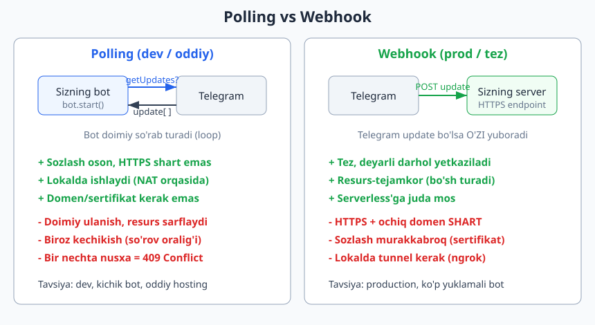
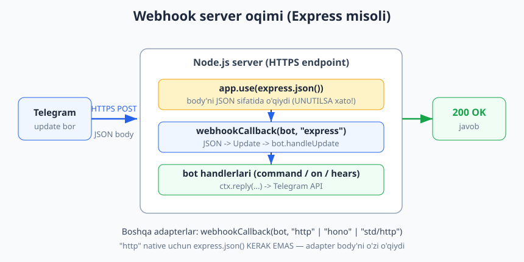
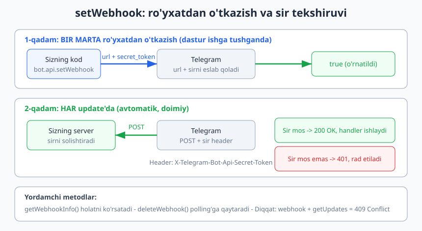

# 13 — Webhook va deploy server

[⬅️ Oldingi: 12 — Maxsus xususiyatlar va plaginlar](./12-maxsus-xususiyatlar.md) · [🏠 README](./README.md) · [Keyingi: 14 — To'lovlar va Telegram Stars ➡️](./14-tolovlar-stars.md)

---

> **Bu bobda:** botingiz Telegram'dan yangiliklarni (update'larni) qanday oladi — buning ikki yo'li bor: **polling** (bot Telegram'dan "yangilik bormi?" deb so'rab turadi) va **webhook** (Telegram sizning serveringizga o'zi POST so'rovi yuboradi). Biz bu ikkalasini chuqur taqqoslaymiz — afzallik/kamchilik jadvali bilan, qachon qaysini tanlash kerakligi bilan. So'ng grammY'ning `webhookCallback` yordamida **Express**, **Hono** va **native Node "http"** serverlarida webhook qabul qiluvchi endpoint quramiz; `bot.api.setWebhook(url, ...)` bilan webhook'ni ro'yxatdan o'tkazamiz, `secret_token` orqali soxta so'rovlardan himoyalanamiz, `getWebhookInfo` va `deleteWebhook` bilan boshqaramiz. Lokal sinov uchun ngrok/tunnel'ni, serverless (Cloudflare Workers / Vercel) eslatmasini, va eng muhim gotcha'ni — polling bilan webhook'ni bir vaqtda ishlatib bo'lmasligini (**409 Conflict**) ko'rib chiqamiz.
>
> **Halollik eslatmasi:** Bu bobdagi kod mantig'i — `webhookCallback(bot, "express")`, `(bot, "http")`, `(bot, "hono")` funksiya qaytarishi; ularning ichida `bot.handleUpdate` orqali handler ishga tushishi; haqiqiy Express va native http server'ni **127.0.0.1** da bo'sh portda ko'tarib, soxta `/start` update'ini POST qilib **200** olish; `secret_token` noto'g'ri bo'lsa **401** rad etish — bularning hammasi **offline ishga tushirib tasdiqlangan** (`node _verify_13.mjs`, 6/6 o'tdi, token va internetsiz). **Jonli `setWebhook`** (tashqi HTTPS domeniga) haqiqiy domen, sertifikat va internet talab qiladi — u "illustrativ" deb belgilangan. ngrok va serverless misollari ham illustrativ.

---

## Update qayerdan keladi? Polling vs webhook

Birinchi boblardan beri biz botni `bot.start()` bilan ishga tushirib keldik. U **long polling** rejimida ishlaydi: bot Telegram serveriga "menga yangi update bormi?" degan so'rov (`getUpdates`) yuboradi, javob kelmaguncha kutadi, kelgach qayta so'raydi — va shu zanjir cheksiz davom etadi. Bu rivojlanish (development) va kichik botlar uchun mukammal: hech narsa sozlash shart emas, faqat token va internet.

Lekin Telegram update'larni yetkazishning **ikkinchi yo'li** ham bor — **webhook**. Bunda siz Telegram'ga "menga update kelganda, mana shu HTTPS manzilimga o'zing POST qilib yubor" deb aytasiz. Endi bot Telegram'dan so'rab turmaydi — aksincha, Telegram update bo'lganda sizning serveringizga keladi. Bu production uchun tez va resurs-tejamkor yondashuv.



Tasavvur qiling: polling — bu pochta qutisiga har daqiqada borib "xat bormi?" deb tekshirish. Webhook — bu pochtachi xat kelganda eshigingizni o'zi taqillatishi. Birinchisi sizdan doimiy harakat talab qiladi; ikkinchisida siz xat kelguncha boshqa ishingiz bilan band bo'lasiz.

### Chuqur taqqoslash

| Jihat | Polling (`bot.start()` / runner) | Webhook (`webhookCallback`) |
| --- | --- | --- |
| Update qanday keladi | Bot Telegram'dan **so'rab** turadi (`getUpdates`) | Telegram serveringizga **POST** qiladi |
| HTTPS / domen | **Shart emas** — NAT/lokal orqasida ham ishlaydi | **Shart** — ochiq HTTPS domen kerak |
| Tezlik | Biroz kechikish bo'lishi mumkin | Deyarli darhol yetkaziladi |
| Resurs | Doimiy ulanish, ozroq band | Bo'sh turadi, update kelganda uyg'onadi |
| Sozlash | Juda oson (token yetarli) | Murakkabroq (server, sertifikat, `setWebhook`) |
| Serverless | Mos emas (doimiy jarayon kerak) | Juda mos (Cloudflare Workers, Vercel) |
| Lokal sinov | To'g'ridan-to'g'ri | Tunnel kerak (ngrok) |
| Bir nechta nusxa | **409 Conflict** (faqat bitta polling) | Bir nechta nusxa yuk taqsimlay oladi |

### Qachon qaysi?

- **Polling tanlang:** rivojlanishda (dev), kichik yoki shaxsiy bot, oddiy VPS/hosting, HTTPS domen sozlashni xohlamasangiz. 17-bobda `@grammyjs/runner` bilan polling'ni production darajasiga ham olib chiqamiz.
- **Webhook tanlang:** production'da yuqori yuklamali bot, deyarli darhol javob kerak bo'lsa, serverless platformaga (Cloudflare Workers, Vercel, Deno Deploy) joylashtirsangiz, yoki bir nechta nusxa orasida yukni taqsimlamoqchi bo'lsangiz.

> **Eslatma:** Ko'pchilik loyihalar dev'da polling, prod'da webhook ishlatadi. Bitta kod bazasida ikkalasini ham qo'llab-quvvatlash oson — handlerlaringiz (`bot.command`, `bot.on`) bir xil qoladi, faqat botni **qanday ishga tushirish** o'zgaradi. Buni bobning oxirida ko'ramiz.

---

## webhookCallback — grammY'ning webhook ko'prigi

grammY webhook'ni qo'lda yozishni talab qilmaydi. `webhookCallback` funksiyasi kelayotgan HTTP so'rovni o'qiydi, uning JSON tanasini `Update` obyektiga aylantiradi va `bot.handleUpdate` orqali sizning handlerlaringizga uzatadi — keyin Telegram'ga `200 OK` javob qaytaradi.

```js
import { webhookCallback } from "grammy";
const handler = webhookCallback(bot, "express"); // funksiya qaytaradi
```

`webhookCallback(bot, framework)` — ikkinchi argument **qaysi freymvork** bilan ishlayotganingizni bildiradi. Qo'llab-quvvatlanadigan qiymatlar:

- `"express"` — Express.js (eng mashhur Node freymvorki).
- `"http"` — Node'ning ichki (native) `http`/`https` moduli, hech qanday freymvorksiz.
- `"hono"` — Hono (zamonaviy, yengil, serverless'ga mos freymvork).
- `"std/http"` — Deno yoki Web-standart `Request`/`Response` muhitlari (Cloudflare Workers va h.k.).



> **Tasdiqlangan:** Men `webhookCallback(bot, "express")`, `(bot, "http")` va `(bot, "hono")` chaqiruvlarining uchalasi ham **funksiya** qaytarishini offline tekshirdim (`typeof === "function"`, 6/6 test o'tdi). Bu funksiyalarni mos freymvork'ga ulaganingizda webhook qabul qiluvchi endpoint hosil bo'ladi.

### Express server misoli

Express — Node'da eng keng tarqalgan veb-freymvork. Webhook endpoint quyidagicha quriladi:

```js
import { Bot, webhookCallback } from "grammy";
import express from "express";

const bot = new Bot(process.env.BOT_TOKEN);

// Handlerlar — pollingdagi bilan AYNAN bir xil
bot.command("start", (ctx) => ctx.reply("Salom! Men webhook orqali ishlayapman."));
bot.on("message:text", (ctx) => ctx.reply(`Siz yozdingiz: ${ctx.message.text}`));

const app = express();
app.use(express.json()); // MUHIM: body'ni JSON sifatida o'qiydi

// Telegram shu manzilga POST qiladi
app.use("/telegraf-yoq-grammy", webhookCallback(bot, "express"));

app.listen(3000, () => console.log("Server 3000-portda ishlamoqda"));
```

Bu yerda nima bo'lyapti:

1. `express.json()` — bu **middleware** Telegram yuborgan JSON tanasini o'qib `req.body` ga qo'yadi. **Buni unutsangiz** `webhookCallback` body'ni topa olmaydi va bot jim qoladi (eng ko'p uchraydigan xato — pastdagi jadvalga qarang).
2. `app.use("/telegraf-yoq-grammy", webhookCallback(bot, "express"))` — `/telegraf-yoq-grammy` manziliga kelgan POST so'rovni `webhookCallback` ishlovchisiga topshiramiz. Manzil yo'lini (path) **maxfiy va tasodifiy** qiling — bu qo'shimcha himoya (lekin `secret_token` dan ko'ra kuchsizroq).
3. `app.listen(3000, ...)` — server portni tinglay boshlaydi.

> **Tasdiqlangan:** Men aynan shu naqsh bilan haqiqiy Express app'ni **127.0.0.1** da bo'sh portda ko'tarib, soxta `/start` update'ini POST qildim. Server **200** qaytardi va ichidagi `bot.command("start", ...)` handleri ishga tushib `sendMessage` chaqirdi (offline transformer bilan ushlandi). Bu "ishladi" deganim — haqiqatan ko'rilgan natija.

> **Diqqat — Express 5:** grammY bilan kelgan zamonaviy Express'da (v5) `express.json()` standart o'rnatilgan. Agar eski qo'llanmalarda `body-parser` paketini alohida o'rnatishni ko'rsangiz — endi shart emas, `express.json()` Express'ning o'zida bor.

### Hono server misoli

Hono — yengil va tez freymvork, ayniqsa serverless (Cloudflare Workers, Vercel Edge, Deno) uchun mashhur. U Web-standart `Request`/`Response` bilan ishlaydi:

```js
import { Bot, webhookCallback } from "grammy";
import { Hono } from "hono";

const bot = new Bot(process.env.BOT_TOKEN);
bot.command("start", (ctx) => ctx.reply("Salom Hono'dan!"));

const app = new Hono();
app.post("/webhook", webhookCallback(bot, "hono"));

// Node muhitida ishga tushirish (serve adapter bilan):
// import { serve } from "@hono/node-server";
// serve({ fetch: app.fetch, port: 3000 });

export default app; // Cloudflare Workers / Deno bevosita app'ni ishlatadi
```

Hono'da `express.json()` ga o'xshash narsa kerak emas — `webhookCallback(bot, "hono")` body'ni o'zi o'qiydi. Endpoint'ni `app.post(...)` bilan ro'yxatdan o'tkazasiz, chunki Telegram faqat **POST** qiladi.

> **Tasdiqlangan:** Men Hono app'ini `app.fetch(new Request(..., { method: "POST", body: JSON.stringify(update) }))` orqali soxta so'rov bilan chaqirdim — `Response` obyektining `status` maydoni **200** bo'ldi va handler ishladi. Bu Node'da haqiqiy server ko'tarmasdan ham (Web-standart fetch interfeysi orqali) tasdiqlanadi.

### Native "http" misoli (freymvorksiz)

Agar qo'shimcha bog'liqlik (dependency) o'rnatishni xohlamasangiz, Node'ning ichki `http` moduli yetarli:

```js
import { Bot, webhookCallback } from "grammy";
import { createServer } from "node:http";

const bot = new Bot(process.env.BOT_TOKEN);
bot.command("start", (ctx) => ctx.reply("Salom native http'dan!"));

const handle = webhookCallback(bot, "http"); // (req, res) ishlovchisi

const server = createServer(handle);
server.listen(3000, () => console.log("Native http server 3000-portda"));
```

Bu yerda diqqat qiling: `"http"` adapteri body'ni **o'zi o'qiydi**, shuning uchun `express.json()` ga o'xshash narsa **kerak emas**. `webhookCallback(bot, "http")` to'g'ridan-to'g'ri `(req, res)` qabul qiluvchi funksiya qaytaradi va `createServer` ga beriladi.

> **Tasdiqlangan:** Men native `http` server'ni 127.0.0.1 da bo'sh portda ko'tarib, soxta `/start` POST qildim — **200** qaytardi va handler `sendMessage` chaqirdi.

> **Eslatma — HTTPS:** Yuqoridagi misollarda biz oddiy HTTP (`http` moduli) ishlatdik, chunki bu lokal sinov uchun. Telegram esa webhook manzili **HTTPS** bo'lishini talab qiladi. Production'da odatda HTTPS'ni Nginx, Caddy yoki bulut platformasi (reverse proxy) qatlami ta'minlaydi, sizning Node serveringiz uning orqasida oddiy HTTP'da turadi. Buni 17-bobda batafsil ko'ramiz.

---

## setWebhook — Telegram'ga manzilingizni aytish

Server tayyor bo'ldi, lekin Telegram hali update'larni qayerga yuborishni bilmaydi. `bot.api.setWebhook` bilan unga aytasiz:

```js
await bot.api.setWebhook("https://mening-domenim.uz/telegraf-yoq-grammy", {
  secret_token: "juda_maxfiy_satr_2026",
  drop_pending_updates: true,
  allowed_updates: ["message", "callback_query"],
});
```



> **Illustrativ:** Yuqoridagi `setWebhook` chaqiruvi haqiqiy HTTPS domen, ochiq port va internet talab qiladi — uni token va serveringiz bilan o'zingiz ishga tushirasiz. Men buni offline tasdiqlay olmadim (tarmoq kerak), shuning uchun **illustrativ** deb belgilayman. Lekin `webhookCallback` qabul qiluvchi tomon — server ichidagi mantiq — yuqorida haqiqatan ishga tushirib tasdiqlangan.

`setWebhook(url, other)` parametrlari (grammY tipi bilan tasdiqlangan):

- **`url`** (birinchi argument) — HTTPS manzil. Bo'sh satr (`""`) yuborilsa webhook o'chiriladi.
- **`secret_token`** — Telegram har POST so'rovida `X-Telegram-Bot-Api-Secret-Token` header'iga shu satrni qo'yib yuboradi. Sizning serveringiz uni tekshiradi (quyida). Faqat `A-Z a-z 0-9 _ -` belgilari, 1-256 ta uzunlik.
- **`drop_pending_updates`** — `true` bo'lsa, webhook o'rnatilguncha to'plangan eski update'larni tashlab yuboradi (bot o'chiq turganda kelganlarni qayta ishlamaslik uchun foydali).
- **`allowed_updates`** — qaysi turdagi update'larni olishni xohlaysiz (masalan `["message", "callback_query"]`). Bo'sh ro'yxat — `chat_member` va reaksiyalardan tashqari hammasini oladi. Eslatma: `chat_member` ni olmoqchi bo'lsangiz uni bu ro'yxatda **aniq** ko'rsatishingiz kerak (19-21 boblardagi guruh boshqaruvida muhim).

> **Anti-eskirish:** Telegram webhook uchun faqat **443, 80, 88, 8443** portlarini qo'llab-quvvatlaydi. Boshqa portni domeningiz reverse proxy orqali shu portlardan biriga yo'naltirishi kerak. Bu Telegram tomonidan belgilangan cheklov — vaqt o'tishi bilan kengayishi mumkin, shuning uchun shubha bo'lsa rasmiy hujjatni tekshiring.

### secret_token bilan xavfsizlik

Webhook manzilingiz ochiq internetda — nazariy jihatdan har kim sizning endpoint'ingizga soxta update POST qilishi mumkin. `secret_token` aynan shuni oldini oladi: Telegram har so'rovga `X-Telegram-Bot-Api-Secret-Token` header'ini qo'shadi, sizning serveringiz uni `webhookCallback` ga bergan sir bilan solishtiradi. Mos kelmasa — so'rov rad etiladi.

```js
app.use(
  "/telegraf-yoq-grammy",
  webhookCallback(bot, "express", { secretToken: "juda_maxfiy_satr_2026" })
);
```

> **Diqqat — nomlash:** `setWebhook` da parametr **`secret_token`** (snake_case, Telegram API uslubi), lekin `webhookCallback` opsiyasida **`secretToken`** (camelCase, grammY uslubi). Ikkalasidagi **satr bir xil** bo'lishi shart. Ikkala joyni ham qo'yishni unutmang — biri Telegram'ga aytadi, ikkinchisi serveringizda tekshiradi.

> **Tasdiqlangan:** Men `webhookCallback(bot, "express", { secretToken: "SUPER_MAXFIY" })` bilan server ko'tarib ikki so'rov yubordim: **noto'g'ri** sir bilan — server **401** (rad), **to'g'ri** sir bilan — **200** (qabul). Demak `secret_token` himoyasi haqiqatan ishlaydi.

### getWebhookInfo va deleteWebhook

Webhook holatini tekshirish va o'chirish uchun:

```js
const info = await bot.api.getWebhookInfo();
console.log(info.url);                  // o'rnatilgan manzil ("" bo'lsa polling)
console.log(info.pending_update_count); // navbatdagi update soni
console.log(info.last_error_message);   // oxirgi xato (agar bo'lsa)

await bot.api.deleteWebhook();                            // webhook o'chadi, polling'ga qaytish mumkin
await bot.api.deleteWebhook({ drop_pending_updates: true }); // + eski update'larni tashlash
```

`getWebhookInfo` ayniqsa **nosozliklarni topishda** qimmatli: agar `last_error_message` da "Wrong response from the webhook: 401" ko'rsangiz — sir mos kelmayapti; "SSL error" ko'rsangiz — HTTPS sertifikati muammosi; `pending_update_count` katta bo'lsa — serveringiz update'larni qabul qila olmayapti.

---

## Lokal sinov: ngrok va tunnellar

Webhook HTTPS domen talab qiladi — lekin kompyuteringizda hali domen yo'q. Yechim: **tunnel** xizmati lokal portingizni vaqtinchalik ommaviy HTTPS manzilga ulaydi. Eng mashhuri — **ngrok**.

```bash
# ngrok o'rnatilgan deb hisoblaymiz
ngrok http 3000
# Chiqishda: Forwarding  https://abc123.ngrok-free.app -> http://localhost:3000
```

So'ng o'sha HTTPS manzilni `setWebhook` ga berasiz:

```js
await bot.api.setWebhook("https://abc123.ngrok-free.app/telegraf-yoq-grammy", {
  secret_token: "juda_maxfiy_satr_2026",
});
```

> **Illustrativ:** ngrok haqiqiy internet ulanishi va ro'yxatdan o'tishni talab qiladi — bu blok illustrativ. Muqobillar: Cloudflare Tunnel (`cloudflared`), `localtunnel`, yoki bulutdagi kichik VPS. ngrok bepul rejasida URL har ishga tushganda o'zgaradi, shuning uchun `setWebhook` ni qayta chaqirish kerak bo'ladi.

> **Eslatma — bitta kod, ikki rejim:** Lokalda tez sinash uchun webhook o'rnatish o'rniga ko'pincha **polling** (`bot.start()`) ishlatish qulayroq — tunnel kerak emas. Webhook'ni faqat lokal webhook mantig'ini sinashda yoqing.

---

## Serverless: Cloudflare Workers va Vercel

Webhook'ning eng kuchli tomoni — u **serverless** platformalarga mukammal mos keladi. Serverless'da doimiy ishlab turuvchi server yo'q; faqat so'rov kelganda funksiyangiz uyg'onadi. Polling bunday muhitda ishlamaydi (doimiy jarayon kerak), lekin webhook xuddi shu uchun yaratilgan.

`webhookCallback` ning `"hono"` va `"std/http"` adapterlari aynan shu muhitlarga mo'ljallangan:

```js
// Cloudflare Workers / Deno Deploy uslubi (Web-standart Request/Response)
import { Bot, webhookCallback } from "grammy";

export default {
  async fetch(request, env) {
    const bot = new Bot(env.BOT_TOKEN); // sirlar env'dan
    bot.command("start", (ctx) => ctx.reply("Serverless'dan salom!"));
    return webhookCallback(bot, "std/http")(request);
  },
};
```

> **Illustrativ:** Serverless deploy haqiqiy platforma hisobini (Cloudflare/Vercel), `wrangler`/`vercel` CLI va internetni talab qiladi — bu blok illustrativ. Lekin g'oya muhim: `webhookCallback` adapteri shu muhitlarga mos, handlerlaringiz esa o'zgarmaydi. Botingizni 17-bobda production'ga chiqarishni batafsil ko'ramiz.

> **Anti-eskirish:** Serverless platformalar va ularning grammY hosting qo'llanmalari tez o'zgaradi. Aniq deploy qadamlari uchun har doim grammY'ning rasmiy "hosting" hujjatini (https://grammy.dev/hosting) tekshiring — bu yerdagi kod naqshi barqaror, lekin platforma sozlamalari yangilanib turadi.

---

## Eng katta gotcha: polling va webhook BIR VAQTDA ishlamaydi (409)

Bu eng ko'p duch keladigan muammo. Telegram bitta bot uchun **bir vaqtning o'zida faqat bitta** update yetkazish usulini qo'llaydi:

- Agar webhook o'rnatilgan bo'lsa, `getUpdates` (polling) **ishlamaydi**.
- Agar siz `bot.start()` (polling) ishlatib turib, yana `setWebhook` qilsangiz — yoki bir nechta polling nusxasini ishga tushirsangiz — Telegram **`409: Conflict`** xatosini qaytaradi.

```text
GrammyError: Call to 'getUpdates' failed! (409: Conflict: terminated by other getUpdates request;
make sure that only one bot instance is running)
```

Yechim — rejimni almashtirishda avval eskisini o'chirish:

```js
// Webhook'dan polling'ga qaytmoqchi bo'lsangiz:
await bot.api.deleteWebhook();
bot.start();

// Polling'dan webhook'ga o'tmoqchi bo'lsangiz:
// bot.start() ni TO'XTATING (jarayonni o'chiring), keyin:
await bot.api.setWebhook("https://domen/path", { secret_token: "..." });
```

> **Diqqat:** `409 Conflict` ko'rsangiz, birinchi gumon — **bir xil bot tokeni bilan ikki marta** ishga tushirgansiz (masalan eski terminal hali ochiq, yoki dev va prod bir tokendan foydalanmoqda). Har muhit uchun **alohida token** ishlating va `getWebhookInfo` bilan holatni tekshiring.

### Bitta kodda ikki rejimni qo'llab-quvvatlash

Amaliy naqsh — muhit o'zgaruvchisiga qarab polling yoki webhook tanlash. Handlerlaringiz o'zgarmaydi:

```js
import { Bot, webhookCallback } from "grammy";
import express from "express";

const bot = new Bot(process.env.BOT_TOKEN);

// --- Handlerlar (har ikki rejimda bir xil) ---
bot.command("start", (ctx) => ctx.reply("Salom!"));
bot.on("message:text", (ctx) => ctx.reply(`Aks-sado: ${ctx.message.text}`));

if (process.env.NODE_ENV === "production") {
  // PROD: webhook
  const app = express();
  app.use(express.json());
  app.use("/webhook", webhookCallback(bot, "express", { secretToken: process.env.WEBHOOK_SECRET }));
  app.listen(3000, () => console.log("Webhook server tayyor"));
} else {
  // DEV: polling
  bot.start(); // illustrativ: jonli polling token talab qiladi
}
```

> **Cross-link:** Botni serverga joylashtirish — VPS, Docker, pm2/systemd, HTTPS sozlash, sirlar (`.env`), graceful shutdown — bularning hammasini **17-bob (Production va deploy)** da batafsil ko'ramiz. Kodni Git bilan boshqarish va serverga yuborish bo'yicha [Git va GitHub kitobi](../git-github/README.md) yordam beradi. Node.js server asoslari uchun [Node.js kitobi](../nodejs/README.md) ga qarang.

> **aiogram bilan solishtirish:** Python'dagi aiogram'da webhook `aiohttp` yoki `FastAPI` bilan `SimpleRequestHandler` orqali quriladi, polling esa `dp.start_polling()` bilan. grammY'ning `webhookCallback` g'oyasi xuddi shu — faqat Node freymvorklariga (Express/Hono/native) moslangan. Taqqoslash uchun [aiogram kitobi](../tgbot-python/README.md) ga qarang.

---

## Tez-tez uchraydigan xatolar

| Xato | Sabab | Yechim |
| --- | --- | --- |
| Bot webhook'da jim, hech narsaga javob bermaydi | Express'da `app.use(express.json())` UNUTILGAN | `webhookCallback` dan **oldin** `app.use(express.json())` qo'shing |
| Telegram "SSL error" / webhook o'rnatilmaydi | URL HTTPS emas yoki sertifikat yaroqsiz | HTTPS ishlating (Telegram HTTP'ni rad etadi); reverse proxy/sertifikat sozlang |
| `409: Conflict` | Polling va webhook bir vaqtda, yoki ikki nusxa ishlamoqda | Avval `deleteWebhook()` qiling; har muhitga alohida token; bitta nusxa qoldiring |
| Soxta so'rovlar / begona POST'lar | `secret_token` tekshirilmagan | `setWebhook`'ga `secret_token`, `webhookCallback`'ga `secretToken` qo'shing |
| `getWebhookInfo`'da `pending_update_count` o'sib bormoqda | Server update'larni qabul qila olmayapti yoki sekin | Server loglarini tekshiring; `last_error_message` ni o'qing; handler tez javob qaytarsin |
| Webhook ishlaydi, lekin `chat_member` kelmaydi | `allowed_updates` da ko'rsatilmagan | `setWebhook`'da `allowed_updates: ["message", "chat_member", ...]` qo'shing |
| Port ishlamaydi | Telegram faqat 443/80/88/8443 portlarini qabul qiladi | Reverse proxy bilan ruxsat etilgan portga yo'naltiring |
| Lokalda webhook test qilolmayapman | localhost ochiq HTTPS emas | ngrok/Cloudflare Tunnel ishlating, yoki dev'da polling'ga qayting |

---

## Mashqlar

Quyidagi mashqlarning ko'pi **offline** tekshiriladi: soxta `Update` ni `bot.handleUpdate` ga (yoki haqiqiy mahalliy server orqali POST qilib) uzatib, chiqayotgan API chaqiruvlarini transformer bilan ushlaymiz. Mock muhit naqshi (bu bobda ishlatilgani):

```js
import { Bot, webhookCallback } from "grammy";
import express from "express";
import http from "node:http";
import assert from "node:assert/strict";

function makeBot() {
  const bot = new Bot("12345:FAKE");
  bot.botInfo = { id: 12345, is_bot: true, first_name: "T", username: "t_bot",
    can_join_groups: true, can_read_all_group_messages: false, supports_inline_queries: false,
    can_connect_to_business: false, has_main_web_app: false };
  const calls = [];
  bot.api.config.use((prev, method, payload) => {
    calls.push({ method, payload });
    if (method === "sendMessage")
      return Promise.resolve({ ok: true, result: { message_id: 1, date: 0,
        chat: { id: payload.chat_id, type: "private" }, text: payload.text } });
    return Promise.resolve({ ok: true, result: true });
  });
  return { bot, calls };
}

function mkUpdate(text, id = 1) {
  const message = { message_id: id, date: 0, text,
    chat: { id: 777, type: "private" }, from: { id: 777, is_bot: false, first_name: "Ali" } };
  if (text.startsWith("/"))
    message.entities = [{ type: "bot_command", offset: 0, length: text.split(/\s/)[0].length }];
  return { update_id: id, message };
}
```

### Oson

1. **webhookCallback turi.** `webhookCallback(bot, "express")`, `(bot, "http")` va `(bot, "hono")` ni chaqiring va uchalasi ham `typeof === "function"` ekanini `assert` bilan tasdiqlang.
2. **handleUpdate bilan handler.** `bot.command("start", (ctx) => ctx.reply("Salom!"))` ni ro'yxatdan o'tkazing, `mkUpdate("/start")` ni `bot.handleUpdate` ga bering va `calls` ichida `sendMessage` matni `"Salom!"` ekanini tekshiring.
3. **Express vs http — qaysisida express.json() kerak?** Ikki misol yozing (`"express"` va `"http"`) va izohda har birida `express.json()` kerakmi yoki yo'qligini yozing. Sababini bir jumlada tushuntiring.
4. **deleteWebhook izohi.** `getUpdates` va webhook bir vaqtda ishlamasligini hisobga olib, webhook'dan polling'ga to'g'ri o'tish ketma-ketligini (kod izohlari bilan) yozing.

### O'rta

5. **Express server 200.** Haqiqiy Express app ni `127.0.0.1` da bo'sh portda ko'taring, soxta `/start` update'ini POST qiling va javob status `200` ekanini tasdiqlang.
6. **http server 200.** Xuddi shu narsani native `"http"` adapteri bilan qiling (`createServer(webhookCallback(bot, "http"))`).
7. **Handler webhook ichida ishladimi.** 5-mashqdagi server ichida `bot.command("start", (ctx) => ctx.reply("Webhook!"))` bo'lsin; POST'dan keyin `calls` ichida `sendMessage` matni `"Webhook!"` ekanini tekshiring.
8. **Hono fetch.** Hono app yarating, `app.post("/webhook", webhookCallback(bot, "hono"))` ulang, `app.fetch(new Request(...))` bilan soxta POST yuboring va `Response.status === 200` ekanini tasdiqlang.

### Qiyin

9. **secret_token himoyasi.** `webhookCallback(bot, "express", { secretToken: "MAXFIY" })` bilan server ko'taring. Ikki POST yuboring: biri noto'g'ri (yoki yo'q) `X-Telegram-Bot-Api-Secret-Token` header bilan, biri to'g'ri. Noto'g'risi `200` BO'LMASLIGINI (rad), to'g'risi `200` ekanini tasdiqlang.
10. **Ikki rejim tanlovi.** `process.env.NODE_ENV` ga qarab polling yoki webhook tanlovchi funksiya yozing (webhook tarmoqqa chiqmasin — faqat `webhookCallback` qaytishini tekshiring). Test'da `NODE_ENV` ni almashtirib har ikki shoxni qoplang.
11. **Bir nechta update ketma-ket.** Express webhook server'ga `/start` keyin oddiy matn (`"salom"`) update'larini ketma-ket POST qiling. `calls` ichida ikkita `sendMessage` borligini va matnlari to'g'ri tartibda ekanini tasdiqlang.
12. **getWebhookInfo'ni mock qilish.** Transformer'da `method === "getWebhookInfo"` bo'lsa soxta `WebhookInfo` (`{ url: "https://x/y", pending_update_count: 0, has_custom_certificate: false }`) qaytaring. `await bot.api.getWebhookInfo()` ni chaqirib `info.url` to'g'ri kelishini tasdiqlang.
13. **Maxfiy path + secret_token birga.** Server'ni maxfiy path (`/sirli-1q2w3e`) va `secretToken` bilan quring. To'g'ri path + to'g'ri sir → `200`; to'g'ri path + noto'g'ri sir → rad; noto'g'ri path → Express `404`. Uchchala holatni tasdiqlang.

<details markdown="1">
<summary>Yechimlar</summary>

### 1-mashq yechimi

```js
import { Bot, webhookCallback } from "grammy";
import assert from "node:assert/strict";
const { bot } = makeBot();
assert.equal(typeof webhookCallback(bot, "express"), "function");
assert.equal(typeof webhookCallback(bot, "http"), "function");
assert.equal(typeof webhookCallback(bot, "hono"), "function");
```

`webhookCallback` har bir freymvork uchun mos ishlovchi **funksiya** qaytaradi. Uni keyin server'ga (`app.use`, `createServer`, `app.post`) ulaysiz.

### 2-mashq yechimi

```js
const { bot, calls } = makeBot();
bot.command("start", (ctx) => ctx.reply("Salom!"));
await bot.handleUpdate(mkUpdate("/start"));
const sent = calls.find((c) => c.method === "sendMessage");
assert.equal(sent.payload.text, "Salom!");
```

`webhookCallback` ichkarida aynan `bot.handleUpdate` ni chaqiradi. Shuning uchun handlerni to'g'ridan-to'g'ri `handleUpdate` orqali sinash webhook oqimining "yuragi"ni tekshiradi — server ko'tarmasdan ham. Buyruq mos kelishi uchun `mkUpdate` `bot_command` entity qo'shganiga e'tibor bering.

### 3-mashq yechimi

```js
// Express: express.json() KERAK — Express body'ni o'zi o'qimaydi
const app = express();
app.use(express.json());                       // <-- shart
app.use("/webhook", webhookCallback(bot, "express"));

// Native http: express.json() KERAK EMAS — "http" adapteri body'ni O'ZI o'qiydi
import { createServer } from "node:http";
const server = createServer(webhookCallback(bot, "http")); // <-- to'g'ridan-to'g'ri
```

Sabab: Express o'zi tana (body) ni o'qimaydi — buni `express.json()` middleware qiladi va `req.body` ga qo'yadi. Native `"http"` adapteri esa so'rov oqimini (stream) o'zi o'qib JSON'ga aylantiradi, shuning uchun qo'shimcha middleware shart emas.

### 4-mashq yechimi

```js
// Webhook'dan polling'ga to'g'ri o'tish:
await bot.api.deleteWebhook();   // 1) Telegram'ga "endi webhook yo'q" deb aytamiz
// (ixtiyoriy) await bot.api.deleteWebhook({ drop_pending_updates: true });
bot.start();                     // 2) endi getUpdates (polling) ishlaydi, 409 chiqmaydi
```

`getUpdates` va webhook bir vaqtda ishlay olmaydi. `deleteWebhook` ni chaqirmasdan `bot.start()` qilsangiz Telegram `409 Conflict` qaytaradi, chunki webhook hali o'rnatilgan deb hisoblaydi.

### 5-mashq yechimi

```js
import http from "node:http";
const { bot } = makeBot();
bot.command("start", (ctx) => ctx.reply("Salom!"));

const app = express();
app.use(express.json());
app.use("/webhook", webhookCallback(bot, "express"));
const server = http.createServer(app);
await new Promise((r) => server.listen(0, "127.0.0.1", r)); // 0 = bo'sh port
const { port } = server.address();

const body = JSON.stringify(mkUpdate("/start"));
const status = await new Promise((resolve, reject) => {
  const req = http.request({ host: "127.0.0.1", port, path: "/webhook", method: "POST",
    headers: { "Content-Type": "application/json", "Content-Length": Buffer.byteLength(body) } },
    (res) => { res.resume(); res.on("end", () => resolve(res.statusCode)); });
  req.on("error", reject); req.write(body); req.end();
});
await new Promise((r) => server.close(r));
assert.equal(status, 200);
```

`listen(0, ...)` operatsion tizimdan bo'sh portni so'raydi — sinov uchun ideal, hech narsa to'qnashmaydi. POST javobi `200` — webhook muvaffaqiyatli qabul qildi.

### 6-mashq yechimi

```js
import { createServer } from "node:http";
const { bot } = makeBot();
bot.command("start", (ctx) => ctx.reply("Salom!"));

const server = createServer(webhookCallback(bot, "http")); // express.json() YO'Q
await new Promise((r) => server.listen(0, "127.0.0.1", r));
const { port } = server.address();
const body = JSON.stringify(mkUpdate("/start"));
const status = await new Promise((resolve, reject) => {
  const req = http.request({ host: "127.0.0.1", port, path: "/", method: "POST",
    headers: { "Content-Type": "application/json", "Content-Length": Buffer.byteLength(body) } },
    (res) => { res.resume(); res.on("end", () => resolve(res.statusCode)); });
  req.on("error", reject); req.write(body); req.end();
});
await new Promise((r) => server.close(r));
assert.equal(status, 200);
```

Native `"http"` adapteri butun `(req, res)` ni o'zi boshqaradi, shuning uchun Express ham, `express.json()` ham kerak emas. Path `/` — chunki butun server faqat webhook'ni xizmat qiladi.

### 7-mashq yechimi

```js
const { bot, calls } = makeBot();
bot.command("start", (ctx) => ctx.reply("Webhook!"));
const app = express();
app.use(express.json());
app.use("/webhook", webhookCallback(bot, "express"));
const server = http.createServer(app);
await new Promise((r) => server.listen(0, "127.0.0.1", r));
const { port } = server.address();
const body = JSON.stringify(mkUpdate("/start"));
await new Promise((resolve, reject) => {
  const req = http.request({ host: "127.0.0.1", port, path: "/webhook", method: "POST",
    headers: { "Content-Type": "application/json", "Content-Length": Buffer.byteLength(body) } },
    (res) => { res.resume(); res.on("end", resolve); });
  req.on("error", reject); req.write(body); req.end();
});
await new Promise((r) => server.close(r));
assert.equal(calls.find((c) => c.method === "sendMessage").payload.text, "Webhook!");
```

POST `200` qaytarishidan tashqari, handler **haqiqatan ishga tushganini** `calls` orqali tasdiqlaymiz — `sendMessage` matni handler bergan `"Webhook!"` bilan mos.

### 8-mashq yechimi

```js
import { Hono } from "hono";
const { bot, calls } = makeBot();
bot.command("start", (ctx) => ctx.reply("Hono!"));
const app = new Hono();
app.post("/webhook", webhookCallback(bot, "hono"));

const res = await app.fetch(new Request("http://localhost/webhook", {
  method: "POST",
  headers: { "Content-Type": "application/json" },
  body: JSON.stringify(mkUpdate("/start")),
}));
assert.equal(res.status, 200);
assert.equal(calls.find((c) => c.method === "sendMessage").payload.text, "Hono!");
```

Hono Web-standart `Request`/`Response` bilan ishlagani uchun haqiqiy port ochmasdan ham `app.fetch(...)` orqali to'liq sinash mumkin — bu serverless muhitidagi ishlashini ham aniq aks ettiradi.

### 9-mashq yechimi

```js
const { bot } = makeBot();
bot.command("start", (ctx) => ctx.reply("Sir!"));
const app = express();
app.use(express.json());
app.use("/webhook", webhookCallback(bot, "express", { secretToken: "MAXFIY" }));
const server = http.createServer(app);
await new Promise((r) => server.listen(0, "127.0.0.1", r));
const { port } = server.address();

function post(secret) {
  const body = JSON.stringify(mkUpdate("/start"));
  const headers = { "Content-Type": "application/json", "Content-Length": Buffer.byteLength(body) };
  if (secret !== undefined) headers["X-Telegram-Bot-Api-Secret-Token"] = secret;
  return new Promise((resolve, reject) => {
    const req = http.request({ host: "127.0.0.1", port, path: "/webhook", method: "POST", headers },
      (res) => { res.resume(); res.on("end", () => resolve(res.statusCode)); });
    req.on("error", reject); req.write(body); req.end();
  });
}
const wrong = await post("YOLGON");
const right = await post("MAXFIY");
await new Promise((r) => server.close(r));
assert.notEqual(wrong, 200); // rad etildi (401)
assert.equal(right, 200);    // qabul qilindi
```

`secretToken` opsiyasi `webhookCallback` ga kelgan har so'rovning `X-Telegram-Bot-Api-Secret-Token` header'ini solishtiradi. Mos kelmasa `401` qaytaradi — soxta update'lardan himoya. (Men buni offline ishga tushirdim: noto'g'ri → `401`, to'g'ri → `200`.)

### 10-mashq yechimi

```js
function ishgaTushir(bot, env) {
  if (env === "production") {
    const app = express();
    app.use(express.json());
    app.use("/webhook", webhookCallback(bot, "express", { secretToken: "S" }));
    return { mode: "webhook", app };
  } else {
    // bot.start() — illustrativ (jonli polling token talab qiladi); testda chaqirmaymiz
    return { mode: "polling" };
  }
}
const { bot } = makeBot();
assert.equal(ishgaTushir(bot, "production").mode, "webhook");
assert.equal(ishgaTushir(bot, "development").mode, "polling");
assert.equal(typeof webhookCallback(bot, "express"), "function"); // webhook shoxi tarmoqqa chiqmaydi
```

Handlerlar ikki rejimda ham bir xil qoladi; faqat **ishga tushirish** o'zgaradi. Test'da `bot.start()` ni chaqirmaymiz (u tarmoq talab qiladi) — uning o'rniga shox tanlovini va `webhookCallback` funksiya qaytishini tekshiramiz.

### 11-mashq yechimi

```js
const { bot, calls } = makeBot();
bot.command("start", (ctx) => ctx.reply("Boshladik!"));
bot.on("message:text", (ctx) => ctx.reply(`Aks-sado: ${ctx.message.text}`));
const app = express();
app.use(express.json());
app.use("/webhook", webhookCallback(bot, "express"));
const server = http.createServer(app);
await new Promise((r) => server.listen(0, "127.0.0.1", r));
const { port } = server.address();

function post(update) {
  const body = JSON.stringify(update);
  return new Promise((resolve, reject) => {
    const req = http.request({ host: "127.0.0.1", port, path: "/webhook", method: "POST",
      headers: { "Content-Type": "application/json", "Content-Length": Buffer.byteLength(body) } },
      (res) => { res.resume(); res.on("end", resolve); });
    req.on("error", reject); req.write(body); req.end();
  });
}
await post(mkUpdate("/start", 1));
await post(mkUpdate("salom", 2));
await new Promise((r) => server.close(r));
const texts = calls.filter((c) => c.method === "sendMessage").map((c) => c.payload.text);
assert.deepEqual(texts, ["Boshladik!", "Aks-sado: salom"]);
```

Har bir POST mustaqil update — webhook ularni ketma-ket qabul qiladi. `update_id` ni har xil bering (1, 2), aks holda grammY takroriy update deb o'tkazib yuborishi mumkin.

### 12-mashq yechimi

```js
const bot = new Bot("12345:FAKE");
bot.botInfo = { id: 12345, is_bot: true, first_name: "T", username: "t_bot",
  can_join_groups: true, can_read_all_group_messages: false, supports_inline_queries: false,
  can_connect_to_business: false, has_main_web_app: false };
bot.api.config.use((prev, method, payload) => {
  if (method === "getWebhookInfo")
    return Promise.resolve({ ok: true, result: {
      url: "https://x/y", pending_update_count: 0, has_custom_certificate: false } });
  return Promise.resolve({ ok: true, result: true });
});
const info = await bot.api.getWebhookInfo();
assert.equal(info.url, "https://x/y");
assert.equal(info.pending_update_count, 0);
```

`getWebhookInfo` jonli holatda Telegram'dan `WebhookInfo` oladi (URL, navbatdagi update soni, oxirgi xato). Offline'da transformer orqali soxta javob qaytarib mantiqni tekshiramiz. Real botda `last_error_message` nosozliklarni topishda eng foydali maydon.

### 13-mashq yechimi

```js
const { bot } = makeBot();
bot.command("start", (ctx) => ctx.reply("Sirli yo'l!"));
const app = express();
app.use(express.json());
app.use("/sirli-1q2w3e", webhookCallback(bot, "express", { secretToken: "MAXFIY" }));
const server = http.createServer(app);
await new Promise((r) => server.listen(0, "127.0.0.1", r));
const { port } = server.address();

function post(path, secret) {
  const body = JSON.stringify(mkUpdate("/start"));
  const headers = { "Content-Type": "application/json", "Content-Length": Buffer.byteLength(body) };
  if (secret !== undefined) headers["X-Telegram-Bot-Api-Secret-Token"] = secret;
  return new Promise((resolve, reject) => {
    const req = http.request({ host: "127.0.0.1", port, path, method: "POST", headers },
      (res) => { res.resume(); res.on("end", () => resolve(res.statusCode)); });
    req.on("error", reject); req.write(body); req.end();
  });
}
const okOk = await post("/sirli-1q2w3e", "MAXFIY");      // to'g'ri yo'l + to'g'ri sir
const okBad = await post("/sirli-1q2w3e", "YOLGON");     // to'g'ri yo'l + noto'g'ri sir
const badPath = await post("/notogri", "MAXFIY");        // noto'g'ri yo'l
await new Promise((r) => server.close(r));
assert.equal(okOk, 200);       // qabul
assert.notEqual(okBad, 200);   // sir rad etdi (401)
assert.equal(badPath, 404);    // Express bu yo'lni topmadi
```

Bu **ikki qatlamli himoya**: maxfiy path begona POST'larni Express darajasida `404` bilan to'sadi, `secret_token` esa to'g'ri yo'lga kelgan soxta so'rovlarni `401` bilan rad etadi. Ikkalasi birga eng ishonchli — `secret_token` asosiy himoya, maxfiy path qo'shimcha.

</details>

---

[⬅️ Oldingi: 12 — Maxsus xususiyatlar va plaginlar](./12-maxsus-xususiyatlar.md) · [🏠 README](./README.md) · [Keyingi: 14 — To'lovlar va Telegram Stars ➡️](./14-tolovlar-stars.md)
