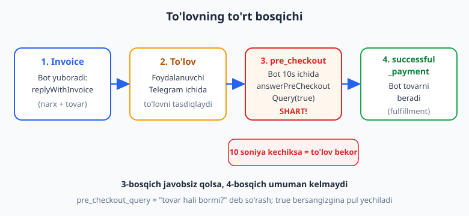
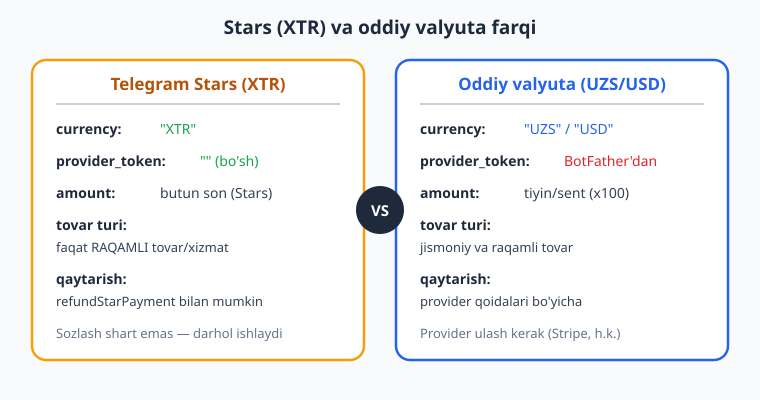
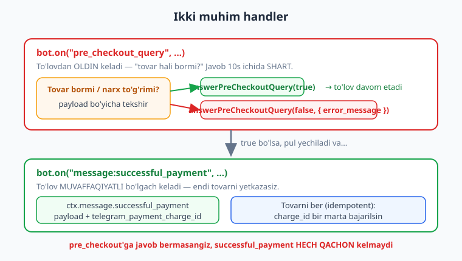

# 14 — To'lovlar va Telegram Stars

[⬅️ Oldingi: 13 — Webhook va deploy server](./13-webhook.md) · [🏠 README](./README.md) · [Keyingi: 15 — Rejalashtirilgan vazifalar va broadcast ➡️](./15-rejalashtirilgan-broadcast.md)

---

> **Bu bobda:** botimizdan pul ishlashni o'rganamiz. Telegram'ning to'lov tizimi qanday ishlashini — `invoice` (hisob-faktura) yuborish, foydalanuvchi to'lashi, `pre_checkout_query` ni 10 soniya ichida tasdiqlash va `successful_payment` kelganda tovarni yetkazib berish — to'rt bosqichli oqim sifatida ko'ramiz. **Telegram Stars (XTR)** — raqamli tovar uchun Telegram'ning ichki valyutasi — bilan ishlaymiz: `currency: "XTR"`, `provider_token` bo'sh, sozlash deyarli shart emas. Oddiy valyuta (UZS/USD) bilan farqini — provider_token, amount birligi, tovar turi — taqqoslaymiz. `ctx.replyWithInvoice(...)`, `bot.on("pre_checkout_query", ...)` va `bot.on("message:successful_payment", ...)` handlerlarini yozamiz. To'lov xavfsizligi — `payload` orqali buyurtmani bog'lash va **idempotent fulfillment** (bir to'lov uchun tovar faqat bir marta beriladi) — ni o'rganamiz, hamda Stars qaytarish (`refundStarPayment`) ni ko'ramiz.
>
> **Halollik eslatmasi:** Bu bobdagi BARCHA handler kodi — `replyWithInvoice` -> `sendInvoice` chaqiruvi (payload, `currency: "XTR"`, `prices`), `bot.api.sendInvoice`, `pre_checkout_query` -> `answerPreCheckoutQuery(true)` va `(false, { error_message })`, `message:successful_payment` -> `ctx.message.successful_payment` o'qish, idempotent fulfillment, oddiy valyuta (UZS) uchun `provider_token` + amount tiyin'da, va `bot.api.refundStarPayment(userId, chargeId)` — soxta `Update` ni `bot.handleUpdate` ga uzatib, chiqayotgan API chaqiruvlarini transformer bilan ushlab **offline ishga tushirib tasdiqlangan** (`node _verify_14.mjs`, 12/12 o'tdi). **Jonli to'lovning o'zi — pulning haqiqatan yechilishi, BotFather'da provider ulash, Stars hisobi — token, internet va haqiqiy hamyon talab qiladi, shuning uchun u "illustrativ" deb belgilanadi.** Bu yerda biz kodning STRUKTURASI to'g'ri ekanini isbotladik; pulni real harakatlantirishni siz o'z botingizda sinab ko'rasiz.

---

## To'lov qanday ishlaydi: to'rt bosqich

Telegram'da to'lov bu shunchaki "tugma bosib pul o'tkazish" emas. Bu **to'rt bosqichli muloqot** bot, foydalanuvchi va Telegram serveri o'rtasida. Avval butun oqimni tushunaylik, keyin har bosqichni kod bilan yozamiz.



1. **Invoice (hisob-faktura) yuborish.** Bot foydalanuvchiga "to'lov kartochkasi" yuboradi: sarlavha, tavsif, narx. Buni `ctx.replyWithInvoice(...)` qiladi. Foydalanuvchi chatda chiroyli "To'lash" tugmasi bilan kartochka ko'radi.
2. **Foydalanuvchi to'laydi.** Foydalanuvchi Telegram ilovasi ichidan to'lovni boshlaydi. Stars bo'lsa — o'z Stars balansidan; oddiy valyuta bo'lsa — bog'langan karta orqali. Bu butunlay Telegram interfeysida kechadi, sizning botingiz aralashmaydi.
3. **`pre_checkout_query` — oxirgi tasdiq (10 soniya!).** Pul yechilishidan **oldin** Telegram botingizga "tovar hali bormi? narx to'g'rimi?" deb so'rov yuboradi. Bot **10 soniya ichida** `answerPreCheckoutQuery(true)` (yoki `false`) bilan javob berishi **SHART**. Javob bermasangiz — Telegram to'lovni **bekor qiladi** va foydalanuvchi xato ko'radi.
4. **`successful_payment` — pul yechildi.** Bot `true` bergach, Telegram pulni yechadi va botga `successful_payment` xabarini yuboradi. **Endi** siz tovarni yetkazasiz: premium ochasiz, faylni jo'natasiz, DB'ga buyurtmani belgilaysiz.

> **Eslatma — nega `pre_checkout_query` kerak?** Tasavvur qiling: foydalanuvchi 1 daqiqa oldin invoice oldi, lekin u to'laguncha sizning tovaringiz tugab qoldi (masalan, cheklangan sonli mahsulot). `pre_checkout_query` — bu pul yechilishidan oldingi oxirgi imkoniyat "to'xta, bu tovar endi yo'q" deyish uchun. Shuning uchun u nafaqat formallik, balki haqiqiy biznes tekshiruvi.

> **Diqqat:** 3 va 4 — ikki **alohida** update. Ular orasida pul yechiladi. Agar 3-bosqichda `true` desangiz-u, 4-bosqichda tovarni bermasangiz — foydalanuvchi puldan ayrildi, tovardan ham. Shuning uchun fulfillment kodingiz **ishonchli** bo'lishi kerak (pastda idempotentlik haqida ko'ramiz).

## Telegram Stars (XTR) va oddiy valyuta

Telegram ikki xil to'lov turini qo'llab-quvvatlaydi. Boshlash uchun **Stars** ancha sodda, shuning uchun ko'p misollarimiz Stars'da bo'ladi.



**Telegram Stars (XTR):**

- `currency: "XTR"` — bu Telegram'ning ichki raqamli valyutasi. Foydalanuvchilar Stars'ni Telegram'dan sotib oladi va botlarda sarflaydi.
- `provider_token: ""` — **bo'sh** bo'ladi (yoki umuman berilmaydi). Hech qanday tashqi to'lov provayderi ulanmaydi.
- `amount` — **butun son** (nechta Star). Masalan, `50` = 50 Star.
- Faqat **raqamli tovar/xizmat** uchun: premium kontent, obuna, o'yin ichidagi narsalar, donat. Jismoniy tovar (kiyim, oziq-ovqat) uchun ishlamaydi.
- **Sozlash shart emas** — `@BotFather` da hech narsa qilmasdan darhol ishlaydi. Boshlovchilar uchun ideal.

**Oddiy valyuta (UZS, USD va h.k.):**

- `currency: "UZS"` yoki `"USD"` va h.k.
- `provider_token` — `@BotFather` orqali to'lov provayderi (masalan, Stripe) ulanib, undan **token olinadi**. Bu token bo'sh bo'lishi mumkin emas.
- `amount` — **eng kichik birlikda**: tiyin (UZS uchun), sent (USD uchun). Ya'ni 50 000 UZS = `5000000` tiyin, 9.99 USD = `999` sent. Bu eng tez-tez uchraydigan xato!
- Jismoniy tovarni ham sotish mumkin (yetkazib berish manzilini so'rash bilan).
- Provayder ulash, hujjat to'ldirish kerak — murakkabroq.

> **Anti-eskirish:** Telegram Stars 2024 yilda joriy qilingan va Telegram'ning rasmiy yo'nalishi raqamli tovarlar uchun **aynan Stars** ishlatish. Apple/Google ilova do'konlari qoidalari sababli raqamli tovar uchun oddiy valyuta provayderlari cheklangan. Eng yangi qoidalar va valyutalar ro'yxatini rasmiy manbadan tekshiring: [core.telegram.org/bots/payments](https://core.telegram.org/bots/payments) va [grammy.dev](https://grammy.dev). Men bu yerda valyuta kodlari yoki provayderlar ro'yxatini ixtiro qilmayman.

## 1-bosqich: invoice yuborish

Invoice'ni `ctx.replyWithInvoice(...)` bilan yuboramiz. Argumentlar tartibi:

```js
ctx.replyWithInvoice(
  title,        // sarlavha (qisqa)
  description,  // tavsif
  payload,      // ICHKI satr — buyurtmani aniqlash uchun (foydalanuvchi ko'rmaydi)
  currency,     // "XTR" yoki "UZS"...
  prices        // [{ label, amount }] massivi
  // , options  // ixtiyoriy: provider_token, photo_url, need_name, ...
);
```

Stars bilan premium kontent sotuvchi eng sodda misol:

```js
import { Bot } from "grammy";
const bot = new Bot(process.env.BOT_TOKEN);

bot.command("buy", (ctx) =>
  ctx.replyWithInvoice(
    "Premium kontent",            // title
    "30 kunlik premium kirish",   // description
    "premium_30",                 // payload (bizning ichki belgimiz)
    "XTR",                        // currency = Telegram Stars
    [{ label: "Premium", amount: 50 }] // 50 Star
  )
);
```

Offline sinovda biz bu handler `sendInvoice` API metodini chaqirishini va `payload` aynan `{ title: "Premium kontent", payload: "premium_30", currency: "XTR", prices: [{ label: "Premium", amount: 50 }] }` ekanini ko'rdik. `chat_id` ni `replyWithInvoice` avtomatik to'ldiradi, `provider_token` esa Stars uchun berilmaydi (bo'sh).

> **Eslatma — `payload` nima?** `payload` — bu foydalanuvchi ko'rmaydigan, faqat siz uchun **ichki belgi**. U `successful_payment` da o'zgarmagan holda qaytib keladi. Shuning uchun unga "qaysi tovar / qaysi buyurtma" ma'lumotini joylaysiz: `"premium_30"`, `"order_42"`, `"book_id=7;user=777"` kabi. Bu — to'lovni buyurtmaga bog'lashning kaliti (pastda ko'ramiz).

### `prices` — narxlar massivi

`prices` bu massiv, har element `{ label, amount }`. Bir nechta qator bo'lishi mumkin (masalan, "Mahsulot" + "Yetkazib berish"):

```js
// Bir nechta qatorli narx (oddiy valyuta misoli):
[
  { label: "Kitob", amount: 5000000 },     // 50 000 UZS
  { label: "Yetkazish", amount: 1000000 }, // 10 000 UZS
]
// Foydalanuvchi jami 60 000 UZS to'laydi
```

Stars'da odatda bitta qator bo'ladi (`amount` butun son, Stars). Esda tuting: **`amount` Stars uchun butun son, oddiy valyuta uchun eng kichik birlik (tiyin/sent).**

### `bot.api.sendInvoice` — handler'dan tashqarida

Agar invoice'ni handler ichida emas, balki, masalan, rejalashtirilgan vazifa yoki broadcast'da (15-bobda ko'ramiz) yubormoqchi bo'lsangiz — `chat_id` ni o'zingiz beradigan `bot.api.sendInvoice` ni ishlating:

```js
await bot.api.sendInvoice(
  chatId,                  // kimga (o'zingiz berasiz)
  "Donat",
  "Loyihani qo'llab-quvvatlash",
  "donate_1",
  "XTR",
  [{ label: "Donat", amount: 100 }]
);
```

`ctx.replyWithInvoice` = "javob yozgan odamga", `bot.api.sendInvoice(chatId, ...)` = "ko'rsatilgan chatga". Bu farqni 03 va 13-boblarda `reply` va `api.sendMessage` da ko'rgan edingiz — bu yerda ham xuddi shu naqsh.

### Invoice'ning qo'shimcha parametrlari

Oxirgi (ixtiyoriy) argument — options obyekti. U yerda invoice'ni boyitadigan ko'p maydon bor:

```js
ctx.replyWithInvoice("VIP", "VIP a'zolik", "vip_1", "XTR",
  [{ label: "VIP", amount: 250 }],
  {
    photo_url: "https://example.com/vip.jpg", // kartochka rasmi
    need_name: true,                          // ism so'ralsinmi
    // need_email, need_phone_number, need_shipping_address ham bor
  }
);
```

To'liq ro'yxatni rasmiy hujjatdan oling — men bu yerda hammasini sanab chiqmayman. Offline sinovda `photo_url` va `need_name` aynan `sendInvoice` ga uzatilganini tasdiqladik.

## 2-bosqich: foydalanuvchi to'laydi

Bu bosqichda kod yozmaysiz — hamma narsa Telegram interfeysida kechadi. Foydalanuvchi "To'lash" tugmasini bosadi, Stars balansidan (yoki kartadan) summani tasdiqlaydi. Sizning botingiz keyingi bosqichda — `pre_checkout_query` da — uyg'onadi.

> **Illustrativ:** Haqiqiy to'lov oynasini ko'rish va Stars yechilishini sinash uchun botingizni Telegram'da ochib, real (yoki test) Stars bilan to'lashingiz kerak. Bu offline tekshirib bo'lmaydi. Quyidagi handlerlar esa — to'lov keltiradigan update'larga botingiz qanday javob berishini — to'liq offline tasdiqlangan.

## 3-bosqich: `pre_checkout_query` ni tasdiqlash

Bu — eng kritik handler. Telegram pul yechishdan oldin botga `pre_checkout_query` yuboradi va **10 soniya** kutadi. Javob bermasangiz — to'lov bekor.



Eng sodda holat — har doim tasdiqlash:

```js
bot.on("pre_checkout_query", (ctx) => ctx.answerPreCheckoutQuery(true));
```

`ctx.answerPreCheckoutQuery(true)` — grammY `pre_checkout_query.id` ni avtomatik to'ldiradi (offline tasdiqladik: chaqiruv `{ ok: true, pre_checkout_query_id: "..." }` bilan ketdi). Sizga faqat `true`/`false` berish qoldi.

### Tovarni haqiqatan tekshirish

Productionda har doim `true` demaslik kerak — `payload` orqali tovar hali mavjudligini tekshiring:

```js
const KATALOG = new Set(["premium_30", "vip_1"]); // mavjud tovarlar (10-bobda DB'da)

bot.on("pre_checkout_query", async (ctx) => {
  const payload = ctx.preCheckoutQuery.invoice_payload;
  if (!KATALOG.has(payload)) {
    // tovar yo'q -> rad etamiz, foydalanuvchiga sabab ko'rsatamiz
    await ctx.answerPreCheckoutQuery(false, {
      error_message: "Bu tovar endi mavjud emas.",
    });
  } else {
    await ctx.answerPreCheckoutQuery(true); // hammasi joyida -> davom etamiz
  }
});
```

Offline sinovda: noma'lum `payload` -> `{ ok: false, error_message: "Bu tovar endi mavjud emas." }`, ma'lum `payload` -> `{ ok: true }`. Aynan kutilgandek.

> **Diqqat — 10 soniya QAT'IY.** `pre_checkout_query` ichida og'ir/sekin ish qilmang (uzoq DB so'rovi, tashqi API chaqiruvi). Telegram 10 soniyadan keyin javobni qabul qilmaydi va to'lov **bekor** bo'ladi. Tez tekshiring (xotiradagi `Set`, indeksli DB so'rovi), og'ir ishni `successful_payment` ga qoldiring.

> **Eslatma:** `false` berganda `error_message` foydalanuvchiga ko'rsatiladi — shuning uchun tushunarli, foydali matn yozing ("Tovar tugadi", "Narx o'zgardi"), texnik xato emas.

## 4-bosqich: `successful_payment` — tovarni yetkazish

Bot `true` bergach, Telegram pulni yechadi va botga `successful_payment` xabarini yuboradi. **Endi** tovarni berasiz:

```js
bot.on("message:successful_payment", async (ctx) => {
  const sp = ctx.message.successful_payment;
  console.log("To'lov keldi:", sp.invoice_payload, sp.total_amount, sp.currency);

  // payload bo'yicha tovarni aniqlab, yetkazamiz
  if (sp.invoice_payload === "premium_30") {
    // ... DB'da foydalanuvchiga premium yoqamiz (10-bob) ...
    await ctx.reply("To'lovingiz uchun rahmat! Premium 30 kunga ochildi.");
  }
});
```

`ctx.message.successful_payment` ichida muhim maydonlar:

| Maydon | Nima |
|---|---|
| `invoice_payload` | Invoice'da bergan `payload` (o'zgarmagan) |
| `total_amount` | To'langan summa (Stars yoki tiyin/sent) |
| `currency` | `"XTR"` yoki `"UZS"`... |
| `telegram_payment_charge_id` | **Telegram'dagi to'lov ID'si** — qaytarish va idempotentlik uchun kerak |
| `provider_payment_charge_id` | Provayderdagi to'lov ID'si (oddiy valyuta) |

Offline sinovda biz `successful_payment` update'ini yuborib, handler `invoice_payload`, `total_amount`, `currency`, `telegram_payment_charge_id` ni to'g'ri o'qiganini va tovar bergan javobni jo'natganini tasdiqladik.

> **Filter query eslatma:** `bot.on("message:successful_payment", ...)` — bu 04-bobda ko'rgan **filter query** sintaksisi. `message:successful_payment` = "ichida `successful_payment` maydoni bor xabar". Faqat shunday xabarlar bu handlerga tushadi.

## To'lov xavfsizligi

Pul bilan ishlaganda ikki xatolik kechirilmaydi: pulni olib tovarni bermaslik, yoki bir tovarni ikki marta berish. Ikki himoya naqshi bor.

### 1. `payload` bilan buyurtmani bog'lash

`payload` — buyurtma va to'lovni bog'lovchi ip. Invoice yuborganda buyurtmani qayd qiling, `pre_checkout` da uni topib tekshiring, `successful_payment` da o'sha buyurtmani bajaring:

```js
const BUYURTMALAR = new Map(); // payload -> { userId, tovar } (10-bobda DB)
BUYURTMALAR.set("order_42", { userId: 777, tovar: "premium_30" });

bot.on("pre_checkout_query", async (ctx) => {
  const order = BUYURTMALAR.get(ctx.preCheckoutQuery.invoice_payload);
  await ctx.answerPreCheckoutQuery(Boolean(order)); // buyurtma bormi?
});

bot.on("message:successful_payment", (ctx) => {
  const order = BUYURTMALAR.get(ctx.message.successful_payment.invoice_payload);
  if (order) {
    // ... order.tovar ni order.userId ga yetkaz ...
  }
});
```

Offline sinovda mavjud `order_42` uchun pre_checkout `true` qaytardi va successful_payment to'g'ri tovarni (`premium_30`) yetkazdi.

### 2. Idempotent fulfillment

**Idempotent** degani: bir xil amalni necha marta qilsangiz ham natija bir xil. To'lovda bu shuni anglatadi — **bir to'lov uchun tovar faqat bir marta beriladi**, hatto `successful_payment` qandaydir sabab bilan ikki marta kelsa ham (qayta ishlash, webhook takrori va h.k.). Buni `telegram_payment_charge_id` ni eslab qolib amalga oshiramiz:

```js
const bajarilgan = new Set(); // bajarilgan charge_id'lar (10-bobda DB'da saqlang!)

bot.on("message:successful_payment", (ctx) => {
  const id = ctx.message.successful_payment.telegram_payment_charge_id;
  if (bajarilgan.has(id)) return; // ALLAQACHON berilgan -> takrorlamaymiz
  bajarilgan.add(id);
  // ... tovarni endi (faqat bir marta) yetkaz ...
});
```

Offline sinovda bir xil `charge_id` ikki marta kelganda tovar **faqat bir marta** berilganini tasdiqladik.

> **Diqqat — xotirada saqlamang!** Yuqoridagi `Set` va `Map` xotirada — bot qayta ishga tushsa, hamma yo'qoladi va idempotentlik buziladi (yoki buyurtmalar yo'qoladi). Productionda buyurtmalarni va bajarilgan `charge_id`'larni **ma'lumotlar bazasida** saqlang. Buni [10-bobda (sessiya va DB)](./10-sessiya-malumotlar-bazasi.md) va [SQL kitobida](../sql/README.md) o'rgangansiz/o'rganasiz. Bu yerda misol soddaligi uchun xotirada.

## Stars qaytarish — `refundStarPayment`

Stars to'lovini foydalanuvchiga qaytarish mumkin. Buning uchun **foydalanuvchi ID'si** va **`telegram_payment_charge_id`** kerak (shuning uchun uni saqlab qo'ying):

```js
// successful_payment da charge_id ni saqlaymiz:
let oxirgiCharge = null;
bot.on("message:successful_payment", (ctx) => {
  oxirgiCharge = ctx.message.successful_payment.telegram_payment_charge_id;
});

// keyin qaytaramiz:
bot.command("refund", async (ctx) => {
  if (oxirgiCharge) {
    await ctx.api.refundStarPayment(ctx.from.id, oxirgiCharge);
    await ctx.reply("Stars qaytarildi.");
  }
});
```

`bot.api.refundStarPayment(userId, telegramPaymentChargeId)` — offline tasdiqladik (`user_id` va `telegram_payment_charge_id` to'g'ri uzatildi). `ctx.api.refundStarPayment(...)` ham xuddi shunday ishlaydi.

> **Anti-eskirish:** `refundStarPayment` aynan **Stars** (XTR) uchun. Oddiy valyuta to'lovlarini qaytarish provayderning (Stripe va h.k.) o'z qoidalari/paneli orqali kechadi, Bot API'da emas. Stars qaytarish qoidalari va vaqt chegaralarini rasmiy hujjatdan tasdiqlang: [core.telegram.org/bots/payments-stars](https://core.telegram.org/bots/payments-stars). Men shartlarni ixtiro qilmayman.

## Python (aiogram) bilan solishtirish

[Telegram bot (Python / aiogram) kitobida](../tgbot-python/README.md) bu mavzu ekvivalent. Tushunchalar **bir xil** (invoice -> pre_checkout 10s -> successful_payment), faqat sintaksis farq qiladi:

| grammY (JS) | aiogram (Python) |
|---|---|
| `ctx.replyWithInvoice(title, desc, payload, currency, prices)` | `message.answer_invoice(title=..., prices=[LabeledPrice(...)])` |
| `bot.on("pre_checkout_query", ...)` | `@dp.pre_checkout_query()` |
| `ctx.answerPreCheckoutQuery(true)` | `pre_checkout_query.answer(ok=True)` |
| `bot.on("message:successful_payment", ...)` | `@dp.message(F.successful_payment)` |

To'rt bosqich, `payload`, `XTR`, idempotentlik — hammasi bir xil g'oya. Bir tilda tushunsangiz, ikkinchisi oson.

## Tez-tez uchraydigan xatolar

| Xato | Sabab | Yechim |
|---|---|---|
| To'lov "bekor qilindi" deb chiqadi | `pre_checkout_query` ga javob berilmadi (yoki 10s kechikdi) | `bot.on("pre_checkout_query", ...)` da darhol `answerPreCheckoutQuery(true/false)` chaqiring |
| Narx 100 baravar noto'g'ri | Oddiy valyutada `amount` so'm/dollarda berilgan | `amount` ni eng kichik birlikda bering: tiyin/sent (UZS 50 000 -> `5000000`) |
| Stars invoice "provider_token kerak" deydi | Stars'da `provider_token` to'ldirilgan/noto'g'ri | Stars (`"XTR"`) uchun `provider_token` ni bo'sh qoldiring (berMANG) |
| `successful_payment` handleri ishlamaydi | `bot.on("successful_payment", ...)` (noto'g'ri filter) | To'g'ri filter: `bot.on("message:successful_payment", ...)` |
| Tovar ikki marta berildi | Idempotentlik yo'q | `telegram_payment_charge_id` ni saqlab, bir marta bajaring |
| `pre_checkout` sekin -> to'lov bekor | Handler ichida og'ir DB/API ishi | Tez tekshiring; og'ir ishni `successful_payment` ga ko'chiring |
| Qaytarish ishlamaydi | `charge_id` saqlanmagan | `successful_payment` da `telegram_payment_charge_id` ni DB'ga yozing |
| Buyurtma chalkashdi | `payload` ishlatilmagan/umumiy | Har invoice'ga noyob `payload` bering, uni `successful_payment` da o'qing |

---

## Mashqlar

> Quyidagi mashqlarning ko'pi **offline** tekshiriladi — `bot.handleUpdate(update)` ga soxta update (matn, `pre_checkout_query`, `successful_payment`) uzatib, `bot.api.config.use(...)` transformer bilan chiqayotgan chaqiruvlarni (`sendInvoice`, `answerPreCheckoutQuery`, `refundStarPayment`) ushlaysiz. Buyruq update'iga `entities:[{type:"bot_command",offset:0,length:N}]` qo'shishni unutmang. `pre_checkout_query` va `successful_payment` update qoliplarini `_verify_14.mjs` dan oling.

### Oson

1. **Stars invoice.** `/buy` buyrug'iga javoban `ctx.replyWithInvoice` bilan `"XTR"` valyutada, `payload: "premium_30"`, narx `[{ label: "Premium", amount: 50 }]` invoice yuboring. Chiqqan `sendInvoice` chaqiruvida `currency === "XTR"` va `payload === "premium_30"` ekanini tasdiqlang.

2. **Narx massivi.** Invoice'da ikki qatorli narx bering: `{ label: "Kitob", amount: 5000000 }` va `{ label: "Yetkazish", amount: 1000000 }` (oddiy valyuta, `"UZS"`). `prices` massivi ikki elementli ekanini tasdiqlang.

3. **Doimiy tasdiq.** `bot.on("pre_checkout_query", ...)` yozing va har doim `answerPreCheckoutQuery(true)` bering. Soxta `pre_checkout_query` update yuborib, chiqqan chaqiruvda `ok === true` ekanini tasdiqlang.

4. **To'lovga rahmat.** `message:successful_payment` handleri yozing: u `"Rahmat!"` deb javob qaytarsin. Soxta `successful_payment` update yuborib, `sendMessage` matni `"Rahmat!"` ekanini tasdiqlang.

### O'rta

5. **`bot.api.sendInvoice`.** Handler'siz, to'g'ridan-to'g'ri `bot.api.sendInvoice(777, "Donat", "...", "donate_1", "XTR", [{ label: "Donat", amount: 100 }])` chaqiring. Chiqqan chaqiruvda `chat_id === 777` va `payload === "donate_1"` ekanini tasdiqlang.

6. **Tovarni tekshirish.** `pre_checkout_query` handleri `payload` `KATALOG` (`Set`) ichida bo'lsa `true`, bo'lmasa `false` (+ `error_message`) qaytarsin. Ikki update (mavjud va yo'q `payload`) yuborib, mos `ok` qiymatlarini tasdiqlang.

7. **`payload` ni o'qish.** `successful_payment` handleri `ctx.message.successful_payment.invoice_payload` ni o'qib, uni javob matniga qo'shsin (`"Buyurtma: <payload>"`). `payload: "order_99"` bilan update yuborib, matnda `order_99` borligini tasdiqlang.

8. **Qo'shimcha options.** Invoice'ga `photo_url` va `need_name: true` qo'shing. Chiqqan `sendInvoice` da bu ikki maydon borligini tasdiqlang.

### Qiyin

9. **Idempotent fulfillment.** `successful_payment` handleri `telegram_payment_charge_id` ni `Set` da eslab, faqat birinchi marta tovar bersin (hisoblagichni oshirsin). Bir xil `charge_id` bilan ikki update yuborib, hisoblagich `1` ekanini tasdiqlang.

10. **`payload` orqali bog'lash.** `BUYURTMALAR` `Map` (`payload -> tovar`) tuzing. `pre_checkout` buyurtma bor-yo'qligini tekshirsin (`true`/`false`), `successful_payment` to'g'ri tovarni "yetkazsin" (massivga qo'shsin). `order_42` uchun pre_checkout `true` va yetkazilgan tovar to'g'ri ekanini tasdiqlang.

11. **`refundStarPayment`.** `successful_payment` da `charge_id` ni saqlang. `/refund` buyrug'i `ctx.api.refundStarPayment(ctx.from.id, charge_id)` chaqirsin. Avval `successful_payment`, keyin `/refund` yuborib, chiqqan `refundStarPayment` chaqiruvida `telegram_payment_charge_id` to'g'ri ekanini tasdiqlang.

12. **Javob bermaslik gotcha'si.** `pre_checkout_query` handleri ataylab **hech narsa qilmasin** (javob bermasin). Update yuborib, `answerPreCheckoutQuery` chaqiruvi **umuman bo'lmaganini** tasdiqlang (jonli holatda bu to'lovni bekor qiladi). So'ng `answerPreCheckoutQuery(true)` qo'shib to'g'rilang.

13. **To'liq oqim (capstone).** Bitta botda barcha to'rt bosqichni ulang: `/buy` invoice yuboradi (`payload: "p1"`), `pre_checkout` katalogni tekshirib `true` beradi, `successful_payment` idempotent tarzda tovar beradi. `/buy` -> `pre_checkout(p1)` -> `successful_payment(p1)` ketma-ketligini yuborib, `sendInvoice`, `answerPreCheckoutQuery(true)`, va bitta fulfillment sodir bo'lganini tasdiqlang.

<details markdown="1">
<summary>Yechimlar</summary>

> Quyidagi yechimlar `_verify_14.mjs` dagi naqsh bilan offline ishga tushiriladi. Har bir yechim `makeBot()` (transformer + `botInfo`) va `mkText`/`mkPreCheckout`/`mkSuccessfulPayment` yordamchilaridan foydalanadi (bob boshidagi halollik eslatmasiga va `_verify_14.mjs` ga qarang). Qisqartirish uchun yordamchilar takrorlanmaydi.

### 1-mashq yechimi

```js
const { bot, calls } = makeBot();
bot.command("buy", (ctx) =>
  ctx.replyWithInvoice("Premium kontent", "30 kunlik premium kirish", "premium_30", "XTR",
    [{ label: "Premium", amount: 50 }])
);
await bot.handleUpdate(mkText("/buy", 10));
const inv = calls.find((c) => c.method === "sendInvoice");
assert.equal(inv.payload.currency, "XTR");
assert.equal(inv.payload.payload, "premium_30");
```

`replyWithInvoice` ichida `sendInvoice` API'ni chaqiradi; `chat_id` ni avtomatik to'ldiradi, Stars uchun `provider_token` berilmaydi.

### 2-mashq yechimi

```js
const { bot, calls } = makeBot();
bot.command("kitob", (ctx) =>
  ctx.replyWithInvoice("Kitob", "PDF + yetkazish", "book_1", "UZS",
    [{ label: "Kitob", amount: 5000000 }, { label: "Yetkazish", amount: 1000000 }])
);
await bot.handleUpdate(mkText("/kitob", 11));
const inv = calls.find((c) => c.method === "sendInvoice");
assert.equal(inv.payload.prices.length, 2);
assert.equal(inv.payload.prices[0].amount, 5000000); // tiyin'da
```

`prices` bir nechta `{ label, amount }` qatordan iborat bo'lishi mumkin; foydalanuvchi jamini to'laydi. `amount` eng kichik birlikda (tiyin).

### 3-mashq yechimi

```js
const { bot, calls } = makeBot();
bot.on("pre_checkout_query", (ctx) => ctx.answerPreCheckoutQuery(true));
await bot.handleUpdate(mkPreCheckout("premium_30", 12));
const ans = calls.find((c) => c.method === "answerPreCheckoutQuery");
assert.equal(ans.payload.ok, true);
```

`answerPreCheckoutQuery(true)` — grammY `pre_checkout_query.id` ni avtomatik qo'shadi. 10 soniya ichida javob berish shart.

### 4-mashq yechimi

```js
const { bot, calls } = makeBot();
bot.on("message:successful_payment", (ctx) => ctx.reply("Rahmat!"));
await bot.handleUpdate(mkSuccessfulPayment("premium_30", 13));
const c = calls.find((x) => x.method === "sendMessage");
assert.equal(c.payload.text, "Rahmat!");
```

`message:successful_payment` filter query faqat to'lov muvaffaqiyatli bo'lgan xabarlarni ushlaydi — bu yerda tovarni yetkazasiz.

### 5-mashq yechimi

```js
const { bot, calls } = makeBot();
await bot.api.sendInvoice(777, "Donat", "Qo'llab-quvvatlash", "donate_1", "XTR",
  [{ label: "Donat", amount: 100 }]);
const inv = calls.find((c) => c.method === "sendInvoice");
assert.equal(inv.payload.chat_id, 777);
assert.equal(inv.payload.payload, "donate_1");
```

`bot.api.sendInvoice` da `chat_id` ni o'zingiz berasiz — handler'dan tashqarida (broadcast, rejalashtirilgan vazifa) ishlatish uchun.

### 6-mashq yechimi

```js
const { bot, calls } = makeBot();
const KATALOG = new Set(["premium_30"]);
bot.on("pre_checkout_query", async (ctx) => {
  const p = ctx.preCheckoutQuery.invoice_payload;
  if (KATALOG.has(p)) await ctx.answerPreCheckoutQuery(true);
  else await ctx.answerPreCheckoutQuery(false, { error_message: "Tovar yo'q." });
});
await bot.handleUpdate(mkPreCheckout("yoq_tovar", 14)); // false
await bot.handleUpdate(mkPreCheckout("premium_30", 15)); // true
const ans = calls.filter((c) => c.method === "answerPreCheckoutQuery");
assert.equal(ans[0].payload.ok, false);
assert.equal(ans[1].payload.ok, true);
```

`ctx.preCheckoutQuery.invoice_payload` orqali tovarni tez tekshiramiz. Yo'q bo'lsa `false` + `error_message` (foydalanuvchi ko'radi).

### 7-mashq yechimi

```js
const { bot, calls } = makeBot();
bot.on("message:successful_payment", (ctx) =>
  ctx.reply("Buyurtma: " + ctx.message.successful_payment.invoice_payload)
);
await bot.handleUpdate(mkSuccessfulPayment("order_99", 16));
const c = calls.find((x) => x.method === "sendMessage");
assert.ok(c.payload.text.includes("order_99"));
```

`invoice_payload` invoice'da bergan `payload` o'zgarmagan holda qaytadi — buyurtmani aniqlashning kaliti.

### 8-mashq yechimi

```js
const { bot, calls } = makeBot();
bot.command("vip", (ctx) =>
  ctx.replyWithInvoice("VIP", "VIP a'zolik", "vip_1", "XTR", [{ label: "VIP", amount: 250 }],
    { photo_url: "https://example.com/vip.jpg", need_name: true })
);
await bot.handleUpdate(mkText("/vip", 17));
const inv = calls.find((c) => c.method === "sendInvoice");
assert.equal(inv.payload.photo_url, "https://example.com/vip.jpg");
assert.equal(inv.payload.need_name, true);
```

Oxirgi (options) argument invoice'ni boyitadi — `photo_url`, `need_name`, `need_email` va h.k. `sendInvoice` ga uzatiladi.

### 9-mashq yechimi

```js
const { bot } = makeBot();
const bajarilgan = new Set();
let soni = 0;
bot.on("message:successful_payment", (ctx) => {
  const id = ctx.message.successful_payment.telegram_payment_charge_id;
  if (bajarilgan.has(id)) return; // takror -> chiqamiz
  bajarilgan.add(id);
  soni++;
});
await bot.handleUpdate(mkSuccessfulPayment("p", 18, "XTR", 50, "DUP_1"));
await bot.handleUpdate(mkSuccessfulPayment("p", 19, "XTR", 50, "DUP_1")); // takror
assert.equal(soni, 1); // faqat bir marta
```

Idempotentlik: `telegram_payment_charge_id` ni eslab qolib, bir to'lov uchun tovarni faqat bir marta beramiz. Productionda `Set` o'rniga DB.

### 10-mashq yechimi

```js
const { bot, calls } = makeBot();
const BUYURTMALAR = new Map([["order_42", { tovar: "premium_30" }]]);
const yetkazilgan = [];
bot.on("pre_checkout_query", (ctx) =>
  ctx.answerPreCheckoutQuery(BUYURTMALAR.has(ctx.preCheckoutQuery.invoice_payload))
);
bot.on("message:successful_payment", (ctx) => {
  const o = BUYURTMALAR.get(ctx.message.successful_payment.invoice_payload);
  if (o) yetkazilgan.push(o.tovar);
});
await bot.handleUpdate(mkPreCheckout("order_42", 20));
await bot.handleUpdate(mkSuccessfulPayment("order_42", 21));
const ans = calls.find((c) => c.method === "answerPreCheckoutQuery");
assert.equal(ans.payload.ok, true);
assert.deepEqual(yetkazilgan, ["premium_30"]);
```

`payload` (`order_42`) butun oqim bo'ylab buyurtmani bog'laydi: pre_checkout tekshiradi, successful_payment to'g'ri tovarni yetkazadi.

### 11-mashq yechimi

```js
const { bot, calls } = makeBot();
let charge = null;
bot.on("message:successful_payment", (ctx) => {
  charge = ctx.message.successful_payment.telegram_payment_charge_id;
});
bot.command("refund", async (ctx) => {
  if (charge) await ctx.api.refundStarPayment(ctx.from.id, charge);
});
await bot.handleUpdate(mkSuccessfulPayment("p", 22, "XTR", 50, "REF_1"));
await bot.handleUpdate(mkText("/refund", 23));
const ref = calls.find((c) => c.method === "refundStarPayment");
assert.equal(ref.payload.telegram_payment_charge_id, "REF_1");
```

`refundStarPayment` uchun `telegram_payment_charge_id` shart — shuning uchun `successful_payment` da uni saqlab qo'yamiz (real botda DB'ga).

### 12-mashq yechimi

```js
const { bot, calls } = makeBot();
bot.on("pre_checkout_query", (ctx) => { /* XATO: javob yo'q */ });
await bot.handleUpdate(mkPreCheckout("p", 24));
assert.equal(calls.find((c) => c.method === "answerPreCheckoutQuery"), undefined);
// To'g'risi: bot.on("pre_checkout_query", (ctx) => ctx.answerPreCheckoutQuery(true));
```

Javob bermaslik -> `answerPreCheckoutQuery` umuman chaqirilmaydi. Jonli holatda Telegram 10 soniyadan keyin to'lovni bekor qiladi. To'g'risi — har doim javob berish.

### 13-mashq yechimi

```js
const { bot, calls } = makeBot();
const KATALOG = new Set(["p1"]);
const bajarilgan = new Set();
const yetkazilgan = [];

bot.command("buy", (ctx) =>
  ctx.replyWithInvoice("Tovar", "Tavsif", "p1", "XTR", [{ label: "Tovar", amount: 50 }])
);
bot.on("pre_checkout_query", (ctx) =>
  ctx.answerPreCheckoutQuery(KATALOG.has(ctx.preCheckoutQuery.invoice_payload))
);
bot.on("message:successful_payment", (ctx) => {
  const id = ctx.message.successful_payment.telegram_payment_charge_id;
  if (bajarilgan.has(id)) return;
  bajarilgan.add(id);
  yetkazilgan.push(ctx.message.successful_payment.invoice_payload);
});

await bot.handleUpdate(mkText("/buy", 25));
await bot.handleUpdate(mkPreCheckout("p1", 26));
await bot.handleUpdate(mkSuccessfulPayment("p1", 27, "XTR", 50, "C1"));

assert.ok(calls.find((c) => c.method === "sendInvoice"));
const ans = calls.find((c) => c.method === "answerPreCheckoutQuery");
assert.equal(ans.payload.ok, true);
assert.deepEqual(yetkazilgan, ["p1"]); // bir marta yetkazildi
```

To'liq oqim bitta botda: invoice -> pre_checkout (katalog tekshiruvi) -> successful_payment (idempotent fulfillment). Bu kapstondagi (26-bob) Stars to'lovining poydevori — clicker o'yinida Stars bilan boyliklar sotamiz.

</details>

---

[⬅️ Oldingi: 13 — Webhook va deploy server](./13-webhook.md) · [🏠 README](./README.md) · [Keyingi: 15 — Rejalashtirilgan vazifalar va broadcast ➡️](./15-rejalashtirilgan-broadcast.md)
