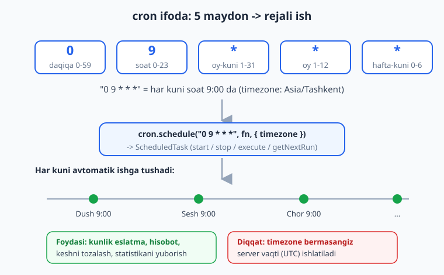
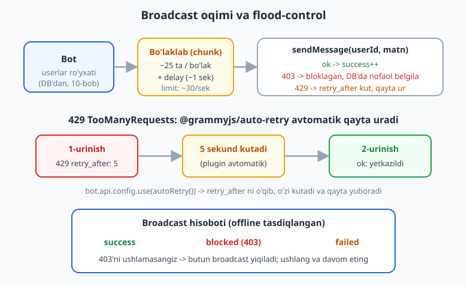
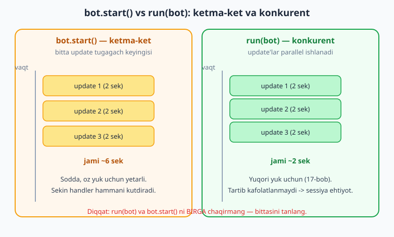

# 15 — Rejalashtirilgan vazifalar va broadcast

[⬅️ Oldingi: 14 — To'lovlar va Telegram Stars](./14-tolovlar-stars.md) · [🏠 README](./README.md) · [Keyingi: 16 — Testlash va xatolarni boshqarish ➡️](./16-testlash-xatolar.md)

---

> **Bu bobda:** botni "jonlantiramiz" — u endi faqat foydalanuvchi xabar yozganda emas, **o'zi** ham harakat qiladi. Avval `node-cron` bilan **rejalashtirilgan vazifalar**ni o'rganamiz: cron ifoda sintaksisini (besh maydon — daqiqa, soat, oy-kuni, oy, hafta-kuni), `cron.schedule(...)` bilan har kuni soat 9:00 da eslatma yuborishni va **vaqt zonasi** (timezone) muammosini. So'ng eng amaliy mavzu — **broadcast** (ommaviy tarqatish): DB'dagi barcha foydalanuvchilar bo'ylab yurib har biriga xabar yuborish. Bu yerda Telegram'ning **flood limiti** (sekundiga ~30 xabar) bilan to'qnashamiz: bloklagan foydalanuvchini (`403`) tashlab ketishni, `429 TooManyRequests` + `retry_after` ni `@grammyjs/auto-retry` plugini bilan **avtomatik qayta urinish**ni, xabarlarni **bo'laklab** (chunk) yuborib **kechikish** (delay) qo'shishni ko'ramiz. Oxirida `@grammyjs/runner` plugini bilan **konkurent** (parallel) update qayta ishlashni va `bot.start()` dan farqini o'rganamiz. Yakunda broadcast natijasini (yuborildi / bloklangan / xato) hisoblab, DB'da nofaol foydalanuvchini belgilaymiz.
>
> **Halollik eslatmasi:** Bu bobdagi **mantiqning hammasi offline ishga tushirib tasdiqlangan** (`node _verify_15.mjs`, 10/10 o'tdi): broadcast siklida transformer aniq N marta chaqirilishi, `403` ni ushlab tashlab ketish, `429 retry_after` ni `autoRetry` bilan qayta urinish (1-urinish 429, 2-urinish muvaffaqiyat) va limit oshganda xato qaytarilishi, `chunk` bo'laklash, `cron.validate(...)` yaroqli/yaroqsiz ifodalarni ajratishi, `cron.schedule(...).execute()` ish funksiyasini chaqirishi, hamda `run(bot)` `RunnerHandle` qaytarib `start`/`stop`/`isRunning` ishlashi. **Jonli** polling, real `getUpdates`, haqiqiy xabar yuborish va aniq vaqtda cron ishga tushishi token va internet talab qiladi — bunday bloklar "illustrativ" deb belgilangan. Bitta muhim haqiqat (offline'da topilgan, pastda batafsil): `autoRetry()` ni mock transformerdan **keyin** ulash kerak, va u **rad etilgan xato emas, qaytgan `{ ok: false }` natijani** tekshiradi.

---

## Kirish: bot endi o'zi harakat qiladi

Hozirgacha botimiz **reaktiv** edi: kimdir `/start` yozsa javob berdi, tugma bossa tahrirladi. Lekin real botlar ko'pincha **o'zi tashabbus** ko'rsatadi:

- Har kuni ertalab 9:00 da obunachilarga "Bugungi yangiliklar" yuborish.
- Yangi mahsulot chiqqanda **barcha** foydalanuvchilarga e'lon (broadcast).
- Har soatda eskirgan keshni tozalash, har kecha hisobot yig'ish.

Bularning ikkita ustuni bor:

1. **Rejalashtirilgan vazifalar** — *qachon* ishlashini belgilash (`node-cron`).
2. **Broadcast** — *ko'p odamga* xabar yuborish, Telegram limitlariga urilmasdan.

Bu ikkalasi ko'pincha birga ishlatiladi: cron har kuni 9:00 da broadcast funksiyasini chaqiradi. Keling, har birini alohida o'rganamiz.

> **Eslatma:** Python/aiogram'da bu ish `APScheduler` (rejalashtirish) va qo'lda `asyncio.sleep` (rate-limit) bilan qilinadi. grammY tomonda mantiq aynan bir xil — faqat vositalar boshqacha. [aiogram kitobidagi mos bobni](../tgbot-python/README.md) ham ko'rib chiqing.

---

## 1-qism: Rejalashtirilgan vazifalar — `node-cron`

### `node-cron` o'rnatish va asosiy g'oya

`node-cron` — bu Node.js uchun kichik kutubxona bo'lib, **cron** sintaksisida vazifalarni rejalashtiradi. cron — Unix dunyosidan kelgan klassik standart: "shu vaqtda shu ishni bajar".

```bash
npm install node-cron
```

> **Eslatma:** Bu kitobda `node-cron@4` ishlatiladi. 3-versiyadan farqi bor: 4-versiyada `schedule(...)` qaytargan obyektda `.start()`, `.stop()`, `.execute()`, `.getNextRun()` metodlari bor, va `scheduled: false` o'rniga vazifani `.stop()` bilan boshqarasiz. Eski internetdagi misollarda `cron.schedule(..., { scheduled: false })` ko'rsangiz — bu eskirgan, ehtiyot bo'ling.

Eng oddiy misol — har daqiqada bir marta konsolga yozish:

```js
import cron from "node-cron";

cron.schedule("* * * * *", () => {
  console.log("Bir daqiqa o'tdi:", new Date().toISOString());
});
```

`"* * * * *"` — bu **cron ifoda**. Beshta maydon (yulduzcha = "har"). Keling, ularni tushunamiz.

### cron ifoda sintaksisi: 5 maydon

cron ifoda beshta bo'shliq bilan ajratilgan maydondan iborat:

```text
 ┌───────── daqiqa        (0 - 59)
 │ ┌─────── soat          (0 - 23)
 │ │ ┌───── oy-kuni       (1 - 31)
 │ │ │ ┌─── oy            (1 - 12)
 │ │ │ │ ┌─ hafta-kuni    (0 - 6, 0 = yakshanba)
 │ │ │ │ │
 *  *  *  *  *
```



Har maydonda quyidagilarni yozish mumkin:

| Belgi | Ma'no | Misol |
|---|---|---|
| `*` | har qiymat | `* * * * *` — har daqiqa |
| son | aniq qiymat | `0 9 * * *` — har kuni 9:00 |
| `*/n` | har `n` da | `*/15 * * * *` — har 15 daqiqa |
| `a-b` | oraliq | `0 9 * * 1-5` — ish kunlari 9:00 |
| `a,b,c` | ro'yxat | `0 0,12 * * *` — yarim tunda va peshinda |

Amaliy ifodalar (offline `cron.validate(...)` bilan tasdiqlangan — yaroqli):

```js
"0 9 * * *"      // har kuni soat 9:00:00
"*/15 * * * *"   // har 15 daqiqada
"0 0 1 * *"      // har oyning 1-kuni yarim tunda
"0 9 * * 1-5"    // dushanbadan jumagacha 9:00
"30 18 * * 5"    // har juma 18:30
```

> **Diqqat:** Maydonlar **daqiqadan** boshlanadi, **soatdan emas**. Ko'p odam `"9 0 * * *"` deb yozib "9:00" demoqchi bo'ladi, aslida bu **00:09** (yarim tundan 9 daqiqa o'tib) bo'ladi. To'g'risi: `"0 9 * * *"` (daqiqa=0, soat=9).

### Ifodani oldindan tekshirish: `cron.validate`

Yaroqsiz ifoda bilan `schedule` chaqirsangiz, xato otiladi. Konfiguratsiyadan (yoki foydalanuvchidan) kelgan ifodani avval tekshiring:

```js
import cron from "node-cron";

cron.validate("0 9 * * *");   // true
cron.validate("*/15 * * * *"); // true
cron.validate("80 9 * * *");   // false  (daqiqa 80 — yo'q)
cron.validate("salom dunyo");  // false
```

Bu `validate` chaqiruvlari **offline tasdiqlangan** — `node _verify_15.mjs` da yaroqli ifodalar `true`, yaroqsizlari `false` qaytardi.

### Har kuni 9:00 da eslatma yuborish (bot bilan)

Endi cron'ni botga ulaymiz. Asosiy g'oya: `cron.schedule` ichidagi funksiya `bot.api.sendMessage(...)` ni chaqiradi. Bunda `ctx` **yo'q** (foydalanuvchi xabar yozmagan) — shuning uchun `ctx.reply` emas, balki `bot.api.sendMessage(chatId, ...)` ishlatamiz (chat ID'ni o'zimiz beramiz).

```js
import { Bot } from "grammy";
import cron from "node-cron";

const bot = new Bot(process.env.BOT_TOKEN);

const ESLATMA_CHAT_ID = 123456789; // kimga yuborilsin (DB'dan olinishi mumkin)

// Har kuni soat 9:00 da (Toshkent vaqti bilan)
cron.schedule(
  "0 9 * * *",
  async () => {
    await bot.api.sendMessage(ESLATMA_CHAT_ID, "Xayrli tong! Bugungi vazifalarni unutmang.");
  },
  { timezone: "Asia/Tashkent" }
);

bot.start(); // illustrativ: jonli polling token talab qiladi
```

> **Illustrativ:** Aniq soat 9:00 da ishga tushishini va haqiqiy xabar yuborilishini sinash uchun bot tunab chiqishi kerak. Mantiqni tez sinash uchun `task.execute()` ishlating (pastda) — u rejani kutmasdan funksiyani **darhol** bir marta chaqiradi. Biz buni offline tasdiqladik.

### `schedule` qaytargan obyekt: `start`, `stop`, `execute`

`cron.schedule(...)` **`ScheduledTask`** obyektini qaytaradi. Eng foydali metodlari:

```js
const task = cron.schedule("0 9 * * *", () => {
  console.log("Ishladi");
}, { timezone: "Asia/Tashkent" });

await task.execute();    // rejani KUTMASDAN funksiyani darhol bir marta ishga tushir
task.stop();             // vaqtincha to'xtatish (qayta ishlamaydi)
task.start();            // qayta yoqish
task.getNextRun();       // keyingi ishga tushish vaqti (Date | null)
await task.destroy();    // butunlay o'chirish (xotiradan olib tashlash)
```

`task.execute()` — biz mantiqni offline tekshirish uchun aynan shuni ishlatdik. Reja vaqtini kutmasdan funksiya chaqirilishini tasdiqlash imkonini beradi:

```js
let ran = 0;
const task = cron.schedule("0 9 * * *", () => { ran++; }, { timezone: "Asia/Tashkent" });
await task.execute();
// ran === 1  (offline tasdiqlangan)
```

### Vaqt zonasi — eng tez-tez uchraydigan tuzoq

`timezone` bermasangiz, cron **server vaqtini** ishlatadi. VPS'lar odatda **UTC** da. Demak `"0 9 * * *"` Toshkentda emas, **UTC 9:00** da (Toshkent 14:00) ishlaydi.

```js
// XATO: server UTC bo'lsa, bu Toshkentda 14:00 da ishlaydi
cron.schedule("0 9 * * *", fn);

// TO'G'RI: vaqt zonasini aniq bering
cron.schedule("0 9 * * *", fn, { timezone: "Asia/Tashkent" });
```

> **Anti-eskirish:** Toshkent vaqt zonasi `Asia/Tashkent` (IANA nomi). `UTC+5` kabi ofset yozmang — yoz/qish vaqti o'zgaradigan zonalar uchun IANA nomi to'g'riroq. Toshkent ofseti o'zgarmasa ham, IANA nomi standart va ishonchli.

---

## 2-qism: Broadcast — ommaviy tarqatish

### Vazifa va asosiy tuzilma

Broadcast — DB'dagi **barcha** foydalanuvchilarga bitta xabar yuborish. Sodda ko'rinishi:

```js
// 10-bobdagi DB repository'dan foydalanuvchi ID'larini olamiz
const userIds = getAllUserIds(); // masalan [101, 102, 103, ...]

for (const id of userIds) {
  await bot.api.sendMessage(id, "Yangi mahsulot chiqdi!");
}
```

Bu "ishlaydi" — kichik bot uchun. Lekin foydalanuvchi 1000, 10000, 100000 ta bo'lsa, ikkita jiddiy muammo paydo bo'ladi:

1. **Flood limit:** Telegram sekundiga **~30 xabar** dan ko'p yuborishga ruxsat bermaydi (global). Oshirsangiz — `429 TooManyRequests`.
2. **Bloklagan foydalanuvchilar:** kimdir botni bloklagan yoki o'chirib tashlagan — ularga yuborishda `403 Forbidden` keladi. Buni ushlamasangiz, butun sikl **birinchi bloklaganda yiqiladi**.

Broadcast oqimini quyidagi diagrammada ko'ring:



### Birinchi muammo: bloklagan foydalanuvchi (`403`)

Eng muhim qoida: **har bir yuborishni `try/catch` ichiga oling**. Bitta foydalanuvchi xato bersa, butun broadcast to'xtamasin.

```js
import { GrammyError } from "grammy";

let success = 0;
const blockedUsers = [];

for (const id of userIds) {
  try {
    await bot.api.sendMessage(id, "Yangilik!");
    success++;
  } catch (err) {
    if (err instanceof GrammyError && err.error_code === 403) {
      // foydalanuvchi botni bloklagan yoki o'chirilgan
      blockedUsers.push(id);
      continue; // tashlab ketamiz, davom etamiz
    }
    throw err; // boshqa xato — yuqoriga uzatamiz
  }
}
```

Bu mantiq **offline tasdiqlangan**: 5 ta foydalanuvchidan 2 tasi (`102`, `104`) `403` bergan transformer bilan, qolgan 3 tasiga yetkazildi va bloklaganlar to'g'ri aniqlandi.

> **Diqqat:** `403` faqat "bloklagan" emas — `"Forbidden: user is deactivated"` (akkaunt o'chirilgan) ham `403`. Ikkalasida ham xulosa bir xil: bu foydalanuvchiga endi yuborib bo'lmaydi, DB'da **nofaol** deb belgilang (pastda).

### Ikkinchi muammo: flood limit va `429`

Agar siklni hech qanday kechikishsiz aylantirsangiz, Telegram tezda `429 TooManyRequests` qaytaradi. `GrammyError` ning `parameters.retry_after` maydonida necha sekund kutish kerakligi keladi:

```js
catch (err) {
  if (err instanceof GrammyError && err.error_code === 429) {
    const waitSec = err.parameters?.retry_after ?? 1;
    console.log(`Flood limit, ${waitSec} sek kutamiz...`);
    // qo'lda kutish va qayta urinish kerak bo'lardi...
  }
}
```

`429`'ni **qo'lda** boshqarish zerikarli va xatoga moyil. Yaxshisi — `@grammyjs/auto-retry` plugini buni avtomatik qiladi.

### `@grammyjs/auto-retry`: `429`'ni avtomatik qayta urinish

```bash
npm install @grammyjs/auto-retry
```

Plugin bitta qatorda ulanadi:

```js
import { Bot } from "grammy";
import { autoRetry } from "@grammyjs/auto-retry";

const bot = new Bot(process.env.BOT_TOKEN);

bot.api.config.use(autoRetry());
```

Shundan keyin har qanday API chaqiruvi `429 retry_after` qaytarsa, plugin **o'zi** `retry_after` sekund kutadi va so'rovni **qayta yuboradi**. Sizning kodingiz hech narsa sezmaydi — `sendMessage` shunchaki biroz kechroq, lekin muvaffaqiyatli qaytadi.

Sozlamalar bilan:

```js
bot.api.config.use(autoRetry({
  maxRetryAttempts: 3,      // ko'pi bilan 3 marta qayta ur (keyin xato otadi)
  maxDelaySeconds: 60,      // retry_after 60 sek dan oshsa — qayta urinmay xato qaytar
}));
```

`maxDelaySeconds` foydali: agar Telegram "1 soat kut" desa, ehtimol o'sha xabarni shunchalik kutib yuborishning ma'nosi yo'q — uni o'tkazib yuborgan ma'qul.

> **Gotcha — men duch keldim (offline'da topildi):** `auto-retry` qanday ishlashini tushunish muhim. Plugin **transformer** (chiquvchi API'ni o'rab oluvchi qatlam). Ikki nuansga e'tibor bering:
>
> 1. **Tartib muhim.** `bot.api.config.use(...)` transformerlarni qatlam-qatlam o'raydi. `autoRetry` **eng tashqi** bo'lib, ichkaridagi haqiqiy yuborishni o'rab olishi kerak. Odatdagi botda muammo yo'q (siz faqat `autoRetry` ni ulaysiz). Lekin offline test/mock yozsangiz, mock transformer'ni **avval**, `autoRetry`'ni **keyin** ulang.
> 2. **`autoRetry` qaytgan natijani tekshiradi, otilgan xatoni emas.** U ichki chaqiruv `{ ok: false, error_code: 429, parameters: { retry_after } }` **qaytarganini** ko'radi (grammY buni keyin `GrammyError` ga aylantiradi). Bu ichki mexanizm — odatdagi kodda ahamiyati yo'q, lekin mock yozsangiz bilib qo'yish kerak.
>
> Biz offline'da tasdiqladik: 1-urinish `429` (retry_after), `autoRetry` kutib qayta urdi, 2-urinish muvaffaqiyatli (jami 2 chaqiruv). `maxRetryAttempts: 2` limitida esa 3 chaqiruvdan keyin `429` xatosi qayta otildi.

### Proaktiv rate-limit: bo'laklab (chunk) + kechikish (delay)

`auto-retry` `429`'ni *tuzatadi*, lekin eng yaxshisi — `429`'ga **umuman urilmaslik**. Buning uchun yuborishni sekinlashtiramiz: foydalanuvchilarni **bo'laklarga** (chunk) ajratamiz va har bo'lak orasida biroz **kutamiz**.

Avval `chunk` yordamchisi (offline tasdiqlangan):

```js
function chunk(arr, size) {
  const out = [];
  for (let i = 0; i < arr.length; i += size) {
    out.push(arr.slice(i, i + size));
  }
  return out;
}

chunk([1, 2, 3, 4, 5, 6, 7, 8, 9, 10, 11, 12], 5);
// -> [[1,2,3,4,5], [6,7,8,9,10], [11,12]]  (3 bo'lak)
```

`sleep` yordamchisi:

```js
const sleep = (ms) => new Promise((resolve) => setTimeout(resolve, ms));
```

To'liq, ehtiyotkor broadcast:

```js
import { GrammyError } from "grammy";

async function broadcast(bot, userIds, text) {
  const stat = { success: 0, blocked: 0, failed: 0 };
  const toDeactivate = []; // DB'da nofaol belgilanadigan ID'lar

  // Bo'laklar: ~25 ta/bo'lak, har bo'lakdan keyin ~1 sek kutamiz.
  // Bu sekundiga ~25 xabar => Telegram ~30/sek limitidan past => xavfsiz.
  for (const part of chunk(userIds, 25)) {
    for (const id of part) {
      try {
        await bot.api.sendMessage(id, text);
        stat.success++;
      } catch (err) {
        if (err instanceof GrammyError && err.error_code === 403) {
          stat.blocked++;
          toDeactivate.push(id);
        } else {
          stat.failed++;
          console.error(`User ${id} ga yuborilmadi:`, err);
        }
      }
    }
    await sleep(1000); // keyingi bo'lakdan oldin biroz nafas
  }

  return { stat, toDeactivate };
}
```

> **Eslatma:** `auto-retry` ulangan bo'lsa, bu kod yanada bardoshli: agar limitga baribir urilsangiz, plugin qayta urinadi. Ikkalasi birga — kamarak `429`, va kelganini ham avtomatik tuzatadi.

### Broadcast natijasini hisoblash va DB'ni yangilash

Broadcast tugagach, foydalanuvchiga hisobot beramiz va bloklaganlarni DB'da **nofaol** deb belgilaymiz — keyingi broadcast'da ularga urinmaslik uchun (vaqt va limitni tejash).

```js
bot.command("broadcast", async (ctx) => {
  // faqat admin (9-bobdagi auth middleware'ni eslang)
  const matn = ctx.match; // /broadcast dan keyingi matn
  if (!matn) return ctx.reply("Foydalanish: /broadcast <xabar matni>");

  await ctx.reply("Broadcast boshlandi...");

  const userIds = getAllActiveUserIds(); // 10-bob: DB repository
  const { stat, toDeactivate } = await broadcast(ctx.api, userIds, matn);

  // bloklaganlarni DB'da nofaol belgilaymiz
  for (const id of toDeactivate) {
    markUserInactive(id); // 10-bob: UPDATE users SET active = 0 WHERE id = ?
  }

  await ctx.reply(
    `Broadcast yakunlandi:\n` +
    `Yuborildi: ${stat.success}\n` +
    `Bloklagan: ${stat.blocked}\n` +
    `Boshqa xato: ${stat.failed}`
  );
});
```

Hisoblash mantig'i **offline tasdiqlangan**: 5 foydalanuvchidan 2 tasi `403` (biri "bloklagan", biri "deactivated") bo'lganda `{ success: 3, blocked: 2, failed: 0 }` chiqdi va nofaol belgilash ro'yxati `[2, 4]` bo'ldi.

> **Diqqat:** `ctx.api` va `bot.api` — bir xil narsa (ikkalasi ham botning API obyekti). Handler ichida `ctx.api` qulayroq, handler tashqarisida (cron ichida) `bot.api` ishlating.

---

## 3-qism: `@grammyjs/runner` — konkurent update qayta ishlash

### `bot.start()` ning chegarasi

Hozirgacha botni `bot.start()` bilan ishga tushirdik. U **long polling** qiladi: Telegram'dan update'larni oladi va ularni **ketma-ket** (birin-ketin) qayta ishlaydi. Bitta update'ni qayta ishlash 2 sekund olsa (masalan, sekin DB so'rovi yoki tashqi API), keyingi update **kutadi**.

Oz yukli botda bu muammo emas. Lekin bot mashhur bo'lib, sekundiga o'nlab update kelsa — navbat o'sib, foydalanuvchilar javobni kech oladi.

### `run(bot)` — parallel qayta ishlash

`@grammyjs/runner` plugini update'larni **konkurent** (parallel) qayta ishlaydi: bir update DB'ni kutayotganda, runner boshqasini ishga tushiradi.

```bash
npm install @grammyjs/runner
```

```js
import { Bot } from "grammy";
import { run } from "@grammyjs/runner";

const bot = new Bot(process.env.BOT_TOKEN);

bot.command("start", (ctx) => ctx.reply("Salom!"));

// bot.start() O'RNIGA:
run(bot);
```

Diqqat: `run(bot)` — bu `bot.start()` ning **o'rnini bosadi**, qo'shimcha emas. Ikkalasini birga chaqirmang.



### Sequential va concurrent — taqqoslash

| | `bot.start()` | `run(bot)` (runner) |
|---|---|---|
| Update tartibi | ketma-ket, birin-ketin | parallel, bir vaqtda ko'p |
| Sekin handler ta'siri | hammani kutdiradi | faqat o'zini |
| Murakkablik | sodda | biroz murakkab |
| Qachon | kichik/o'rta bot | yuqori yukli bot |
| Tartib kafolati | bor (kelgan tartibda) | yo'q (ehtiyot bo'ling) |

`run(bot)` **`RunnerHandle`** qaytaradi — uni boshqarish mumkin:

```js
const handle = run(bot);

handle.isRunning();  // true — hozir ishlayaptimi?
await handle.stop(); // to'xtatish (joriy update'lar tugashini kutadi)
handle.isRunning();  // false
```

Bu **offline tasdiqlangan**: `run(bot)` dan keyin `isRunning()` `true`, `stop()` dan keyin `false` qaytardi (bot.start() o'rniga runner ishga tushdi).

> **Diqqat:** Konkurensiya bilan **sessiya** (10-bob) ehtiyot talab qiladi. Agar bitta foydalanuvchidan ketma-ket ikki xabar kelib, ikkalasi parallel ishlansa — sessiyani bir vaqtda o'zgartirib, ma'lumot buzilishi mumkin (race condition). grammY buni `sequentialize` middleware bilan hal qiladi (bir foydalanuvchining update'larini ketma-ket qiladi). Buni **17-bobda** production kontekstida batafsil ko'ramiz.

> **Anti-eskirish:** `run(bot)` `RunnerHandle` qaytaradi; uni `await handle.stop()` bilan to'xtatish **graceful shutdown** uchun muhim (`SIGINT`/`SIGTERM` da). Buni ham 17-bobda ishlatamiz.

---

## Hammasini birlashtirish: rejali broadcast

Eng keng tarqalgan amaliy holat — cron + broadcast birga. Masalan, har kuni 9:00 da kunlik yangiliklarni barcha obunachilarga yuborish:

```js
import { Bot } from "grammy";
import { autoRetry } from "@grammyjs/auto-retry";
import { run } from "@grammyjs/runner";
import cron from "node-cron";

const bot = new Bot(process.env.BOT_TOKEN);
bot.api.config.use(autoRetry()); // 429'lar avtomatik qayta urinadi

// ... handlerlar ...

// Har kuni 9:00 (Toshkent) da broadcast
cron.schedule(
  "0 9 * * *",
  async () => {
    const userIds = getAllActiveUserIds();
    const { stat, toDeactivate } = await broadcast(bot, userIds, "Bugungi yangiliklar...");
    for (const id of toDeactivate) markUserInactive(id);
    console.log(`Kunlik broadcast: ${stat.success} yuborildi, ${stat.blocked} bloklagan`);
  },
  { timezone: "Asia/Tashkent" }
);

run(bot); // konkurent qayta ishlash
```

> **Illustrativ:** Bu butun blok to'g'ri, lekin jonli ishlashi uchun token, internet va DB kerak. Mantiqning har bo'lagi (broadcast sikli, 403/429 ishlash, cron ifoda, runner) alohida offline tasdiqlangan.

---

## Tez-tez uchraydigan xatolar

| Xato | Sabab | Yechim |
|---|---|---|
| Cron 9:00 emas, 14:00 da ishlaydi | `timezone` berilmagan, server UTC da | `{ timezone: "Asia/Tashkent" }` qo'shing |
| `"9 0 * * *"` 9:00 emas, 00:09 da ishlaydi | Maydon tartibi: birinchi = daqiqa | `"0 9 * * *"` (daqiqa=0, soat=9) |
| Broadcast birinchi foydalanuvchida to'xtaydi | `403`/`429` ushlanmagan, sikl yiqiladi | Har yuborishni `try/catch` ga oling, `403` da `continue` |
| Tez yuborishda `429` ko'payadi | Sekundiga ~30 dan oshib ketgan | `chunk` + `sleep` (~25/sek), `autoRetry()` ulang |
| `autoRetry` ishlamayapti (mock testda) | Tartib teskari / otilgan xato kutilgan | Mock'ni avval, `autoRetry`'ni keyin ulang; u `{ ok:false }` natijani tekshiradi |
| Bloklaganlarga har safar urinaveramiz | DB'da nofaol belgilanmagan | `403` da `markUserInactive(id)`, keyin faqat faollarni ol |
| `run(bot)` va `bot.start()` birga | Ikki polling bir-biriga xalaqit beradi | Faqat bittasini chaqiring |
| Konkurensiyada sessiya buziladi | Bir userning update'lari parallel | `sequentialize` (17-bob) |
| `ctx is not defined` cron ichida | Cron'da `ctx` yo'q (xabar yo'q) | `bot.api.sendMessage(chatId, ...)` ishlating |

---

## Xulosa

Bu bobda bot **proaktiv** bo'ldi:

- **`node-cron`** bilan vazifalarni rejalashtirish: 5 maydonli cron ifoda, `cron.schedule(ifoda, fn, { timezone })`, `task.execute()`/`start()`/`stop()`, va `Asia/Tashkent` vaqt zonasi tuzog'i.
- **Broadcast**: foydalanuvchilar bo'ylab yurish, `403` (bloklagan) ni ushlab tashlash, `429 TooManyRequests` + `retry_after` ni `@grammyjs/auto-retry` bilan avtomatik qayta urinish, `chunk` + `sleep` bilan proaktiv rate-limit, va natijani (`success`/`blocked`/`failed`) hisoblab DB'ni yangilash.
- **`@grammyjs/runner`**: `run(bot)` bilan konkurent qayta ishlash, `bot.start()` (sequential) dan farqi, `RunnerHandle` (`start`/`stop`/`isRunning`).

Keyingi **16-bobda** handlerlarni offline test qilishni (aynan shu bobni tekshirgan `handleUpdate` + transformer mock usulini), Vitest va `bot.catch` bilan xatolarni boshqarishni o'rganamiz. Production'da runner va graceful shutdown — **17-bobda**.

---

## Mashqlar

> Imkon qadar mashqlarni `node _verify_15.mjs` naqshi bilan **offline** sinab ko'ring: soxta transformer ulab, chaqiruvlarni sanang yoki natijani tekshiring. Tokensiz/internetsiz ishlaydi.

### Oson

**1-mashq.** `cron.validate(...)` yordamida quyidagi ifodalardan qaysilari yaroqli ekanini aniqlang va sababini yozing: `"0 12 * * *"`, `"60 * * * *"`, `"*/10 * * * *"`, `"0 9 * * 8"`.

**2-mashq.** "Har juma soat 18:30 da" degan cron ifodani yozing. Daqiqa va soat tartibiga e'tibor bering.

**3-mashq.** `chunk([1,2,3,4,5,6,7], 3)` nima qaytaradi? Qo'lda hisoblang, so'ng `chunk` funksiyasini yozib `console.log` bilan tekshiring.

**4-mashq.** `sleep(ms)` yordamchisini yozing va `await sleep(50)` chindan ~50ms kutishini `Date.now()` bilan o'lchab tasdiqlang.

### O'rta

**5-mashq.** Broadcast siklini yozing: `[201, 202, 203]` ro'yxatiga `sendMessage` yuboradigan funksiya. Soxta transformer ulab, transformer aynan **3 marta** chaqirilganini va `chat_id` lar to'g'ri tartibda kelganini tasdiqlang.

**6-mashq.** Broadcast'da `403` ni ushlab tashlab keting: transformer `id === 202` uchun `403` (`GrammyError`) qaytarsin, qolganlariga `ok`. `success === 2` va `blocked === [202]` ekanini tasdiqlang.

**7-mashq.** `autoRetry()` ulang va mock transformer **birinchi** chaqiruvda `{ ok:false, error_code:429, parameters:{ retry_after: 0 } }`, ikkinchisida `ok` qaytarsin. `sendMessage` muvaffaqiyatli qaytishini va transformer 2 marta chaqirilganini tasdiqlang. (Eslatma: mock'ni avval, `autoRetry`'ni keyin ulang.)

**8-mashq.** `cron.schedule(...)` bilan vazifa yarating, `task.execute()` chaqirib funksiya bir marta ishga tushganini hisoblagich (counter) bilan tasdiqlang, so'ng `task.destroy()` qiling.

**9-mashq.** Broadcast hisobotini hisoblang: 4 foydalanuvchidan biri `403` ("bloklagan"), biri `403` ("deactivated") bersin. `{ success, blocked, failed }` to'g'ri chiqishini va nofaol belgilanadigan ID ro'yxati to'g'riligini tasdiqlang.

### Qiyin

**10-mashq.** `run(bot)` ishlatib `RunnerHandle` oling. `getUpdates` ga bo'sh massiv qaytaradigan transformer ulang (tarmoq simulyatsiyasi), `bot.init()` qiling, so'ng `isRunning()` `true`, `await handle.stop()` dan keyin `false` ekanini tasdiqlang.

**11-mashq.** `autoRetry({ maxRetryAttempts: 1 })` ulang va transformer **har doim** `429` (retry_after: 0) qaytarsin. `sendMessage` oxiri `GrammyError` (error_code 429) **otishini** va transformer aniq **2 marta** (1 asl + 1 retry) chaqirilganini tasdiqlang.

**12-mashq.** Bo'laklab broadcast yozing: 12 foydalanuvchini `chunk(.., 5)` bilan 3 bo'lakka ajrating, har bo'lakdan keyin `sleep(10)` qiling. Barcha 12 taga yuborilganini (transformer 12 marta) va aynan 3 bo'lak bo'lganini tasdiqlang.

**13-mashq.** Admingina `/broadcast <matn>` ishlata oladigan handler yozing (9-bobdagi auth g'oyasi). Mock update yuborib: (a) admin yuborganda broadcast funksiyasi chaqirilishini, (b) admin bo'lmagan yuborganda chaqirilmasdan "Ruxsat yo'q" javobi kelishini tasdiqlang. (Buyruq update'iga `entities:[{type:"bot_command",...}]` qo'shishni unutmang.)

<details markdown="1">
<summary>Yechimlar</summary>

### 1-mashq yechimi

```js
import cron from "node-cron";

console.log(cron.validate("0 12 * * *"));  // true  — har kuni 12:00, hammasi to'g'ri
console.log(cron.validate("60 * * * *"));  // false — daqiqa 0-59, 60 yo'q
console.log(cron.validate("*/10 * * * *")); // true  — har 10 daqiqa
console.log(cron.validate("0 9 * * 8"));   // false — hafta-kuni 0-6 (yoki 0-7), 8 yo'q
```

`validate` ifodaning sintaksisini tekshiradi, mantiqini emas: maydon oralig'idan chiqsa `false`. Daqiqa `0-59`, hafta-kuni `0-6` bo'lgani uchun `60` va `8` yaroqsiz.

### 2-mashq yechimi

```js
"30 18 * * 5"
// daqiqa=30, soat=18, oy-kuni=*, oy=*, hafta-kuni=5 (juma)
```

Eng tez-tez xato — `"18 30 * * 5"` yozish (soat 18, daqiqa 30 demoqchi bo'lib). Aslida birinchi maydon **daqiqa**, ikkinchisi **soat**. To'g'risi `"30 18 * * 5"`.

### 3-mashq yechimi

```js
function chunk(arr, size) {
  const out = [];
  for (let i = 0; i < arr.length; i += size) out.push(arr.slice(i, i + size));
  return out;
}

console.log(chunk([1, 2, 3, 4, 5, 6, 7], 3));
// [[1, 2, 3], [4, 5, 6], [7]]
```

7 element / 3 = 3 bo'lak: ikkitasi to'liq (3+3), oxirgisi qoldiq (1 element). `slice` massiv chegarasidan oshsa, faqat mavjudini oladi.

### 4-mashq yechimi

```js
import assert from "node:assert/strict";

const sleep = (ms) => new Promise((resolve) => setTimeout(resolve, ms));

const t0 = Date.now();
await sleep(50);
const dt = Date.now() - t0;
assert.ok(dt >= 45, "kamida ~50ms kutilishi kerak, kutildi: " + dt);
console.log("OK, kutildi:", dt, "ms");
```

`setTimeout` aniq emas (biroz kechikishi mumkin), shuning uchun `>= 45` (ozgina bo'shlik) tekshiramiz, `=== 50` emas.

### 5-mashq yechimi

```js
import { Bot } from "grammy";
import assert from "node:assert/strict";

const botInfo = { id: 1, is_bot: true, first_name: "T", username: "t_bot",
  can_join_groups: true, can_read_all_group_messages: false, supports_inline_queries: false,
  can_connect_to_business: false, has_main_web_app: false };

const bot = new Bot("12345:FAKE", { botInfo });
const sentTo = [];
let count = 0;
bot.api.config.use((prev, method, payload) => {
  if (method === "sendMessage") {
    count++;
    sentTo.push(payload.chat_id);
    return Promise.resolve({ ok: true, result: { message_id: count, date: 0,
      chat: { id: payload.chat_id, type: "private" }, text: payload.text } });
  }
  return Promise.resolve({ ok: true, result: true });
});

for (const id of [201, 202, 203]) {
  await bot.api.sendMessage(id, "Salom");
}

assert.equal(count, 3);
assert.deepEqual(sentTo, [201, 202, 203]);
console.log("OK: transformer 3 marta, tartib to'g'ri");
```

Transformer chiquvchi har bir `sendMessage` ni ushlaydi — chaqiruv sonini va `chat_id` larni shu yerda sanaymiz.

### 6-mashq yechimi

```js
import { Bot, GrammyError } from "grammy";
import assert from "node:assert/strict";

const botInfo = { id: 1, is_bot: true, first_name: "T", username: "t_bot",
  can_join_groups: true, can_read_all_group_messages: false, supports_inline_queries: false,
  can_connect_to_business: false, has_main_web_app: false };

const bot = new Bot("12345:FAKE", { botInfo });
bot.api.config.use((prev, method, payload) => {
  if (method === "sendMessage") {
    if (payload.chat_id === 202) {
      return Promise.reject(new GrammyError("Call failed!",
        { ok: false, error_code: 403, description: "Forbidden: bot was blocked by the user" },
        method, payload));
    }
    return Promise.resolve({ ok: true, result: { message_id: 1, date: 0,
      chat: { id: payload.chat_id, type: "private" }, text: payload.text } });
  }
  return Promise.resolve({ ok: true, result: true });
});

let success = 0;
const blocked = [];
for (const id of [201, 202, 203]) {
  try {
    await bot.api.sendMessage(id, "Salom");
    success++;
  } catch (err) {
    if (err instanceof GrammyError && err.error_code === 403) { blocked.push(id); continue; }
    throw err;
  }
}

assert.equal(success, 2);
assert.deepEqual(blocked, [202]);
console.log("OK: 403 ushlandi, davom etildi");
```

`403`'da `continue` qilmasak, `202`'dagi xato `for` siklini buzardi va `203`'ga umuman yetib bormas edik.

### 7-mashq yechimi

```js
import { Bot } from "grammy";
import { autoRetry } from "@grammyjs/auto-retry";
import assert from "node:assert/strict";

const botInfo = { id: 1, is_bot: true, first_name: "T", username: "t_bot",
  can_join_groups: true, can_read_all_group_messages: false, supports_inline_queries: false,
  can_connect_to_business: false, has_main_web_app: false };

const bot = new Bot("12345:FAKE", { botInfo });

// MUHIM: mock AVVAL, autoRetry KEYIN — autoRetry mock'ni o'rab oladi.
let attempts = 0;
bot.api.config.use((prev, method, payload) => {
  if (method === "sendMessage") {
    attempts++;
    if (attempts === 1) {
      // 429: otmaymiz, ok:false QAYTARAMIZ (autoRetry shuni tekshiradi)
      return Promise.resolve({ ok: false, error_code: 429,
        description: "Too Many Requests", parameters: { retry_after: 0 } });
    }
    return Promise.resolve({ ok: true, result: { message_id: 2, date: 0,
      chat: { id: payload.chat_id, type: "private" }, text: payload.text } });
  }
  return Promise.resolve({ ok: true, result: true });
});
bot.api.config.use(autoRetry({ maxRetryAttempts: 3 }));

const res = await bot.api.sendMessage(777, "Sinov");
assert.equal(attempts, 2);
assert.equal(res.message_id, 2);
console.log("OK: 429 dan keyin avtomatik qayta urindi");
```

Asosiy nuans: `autoRetry` **qaytgan natija**ni (`{ ok:false, ... }`) tekshiradi, shuning uchun mock'da xato **otmaymiz**, balki ok:false **qaytaramiz**. Tartib: mock avval (ichki), autoRetry keyin (tashqi).

### 8-mashq yechimi

```js
import cron from "node-cron";
import assert from "node:assert/strict";

let ran = 0;
const task = cron.schedule("0 9 * * *", () => { ran++; }, { timezone: "Asia/Tashkent" });

await task.execute(); // rejani kutmasdan darhol ishga tushir
assert.equal(ran, 1);

await task.destroy(); // tozalash
console.log("OK: execute() funksiyani chaqirdi");
```

`task.execute()` reja vaqtini kutmasdan funksiyani darhol bir marta chaqiradi — mantiqni tez sinash uchun ideal. `destroy()` vazifani xotiradan olib tashlaydi (test tugagach jarayon osilmasligi uchun).

### 9-mashq yechimi

```js
import { Bot, GrammyError } from "grammy";
import assert from "node:assert/strict";

const botInfo = { id: 1, is_bot: true, first_name: "T", username: "t_bot",
  can_join_groups: true, can_read_all_group_messages: false, supports_inline_queries: false,
  can_connect_to_business: false, has_main_web_app: false };

const bot = new Bot("12345:FAKE", { botInfo });
const blocked = new Set([2]);    // bloklagan
const deleted = new Set([4]);    // deactivated
bot.api.config.use((prev, method, payload) => {
  if (method === "sendMessage") {
    const id = payload.chat_id;
    if (blocked.has(id)) return Promise.reject(new GrammyError("x",
      { ok: false, error_code: 403, description: "Forbidden: bot was blocked by the user" }, method, payload));
    if (deleted.has(id)) return Promise.reject(new GrammyError("x",
      { ok: false, error_code: 403, description: "Forbidden: user is deactivated" }, method, payload));
    return Promise.resolve({ ok: true, result: { message_id: 1, date: 0,
      chat: { id, type: "private" }, text: payload.text } });
  }
  return Promise.resolve({ ok: true, result: true });
});

const stat = { success: 0, blocked: 0, failed: 0 };
const toDeactivate = [];
for (const id of [1, 2, 3, 4]) {
  try {
    await bot.api.sendMessage(id, "Yangilik");
    stat.success++;
  } catch (err) {
    if (err instanceof GrammyError && err.error_code === 403) { stat.blocked++; toDeactivate.push(id); }
    else stat.failed++;
  }
}

assert.deepEqual(stat, { success: 2, blocked: 2, failed: 0 });
assert.deepEqual(toDeactivate, [2, 4]);
console.log("OK: hisobot to'g'ri, nofaol ro'yxati [2,4]");
```

"Bloklagan" ham, "deactivated" ham `403` — ikkalasi ham `blocked` deb sanaladi va `toDeactivate` ga tushadi.

### 10-mashq yechimi

```js
import { Bot } from "grammy";
import { run } from "@grammyjs/runner";
import assert from "node:assert/strict";

const botInfo = { id: 1, is_bot: true, first_name: "T", username: "t_bot",
  can_join_groups: true, can_read_all_group_messages: false, supports_inline_queries: false,
  can_connect_to_business: false, has_main_web_app: false };

const bot = new Bot("12345:FAKE", { botInfo });
bot.api.config.use((prev, method) => {
  if (method === "getUpdates") return Promise.resolve({ ok: true, result: [] }); // tarmoq simulyatsiyasi
  return Promise.resolve({ ok: true, result: true });
});
bot.on("message", () => {});

await bot.init();
const handle = run(bot);
assert.equal(handle.isRunning(), true);
await handle.stop();
assert.equal(handle.isRunning(), false);
console.log("OK: runner ishladi va to'xtadi");
```

`getUpdates` ga bo'sh massiv qaytarib, real tarmoqqa chiqmasdan runner'ni sinaymiz. `stop()` joriy update'lar tugashini kutadi va `Promise` qaytaradi — `await` qilamiz.

### 11-mashq yechimi

```js
import { Bot, GrammyError } from "grammy";
import { autoRetry } from "@grammyjs/auto-retry";
import assert from "node:assert/strict";

const botInfo = { id: 1, is_bot: true, first_name: "T", username: "t_bot",
  can_join_groups: true, can_read_all_group_messages: false, supports_inline_queries: false,
  can_connect_to_business: false, has_main_web_app: false };

const bot = new Bot("12345:FAKE", { botInfo });
let attempts = 0;
bot.api.config.use((prev, method, payload) => {
  if (method === "sendMessage") {
    attempts++;
    return Promise.resolve({ ok: false, error_code: 429,
      description: "Too Many Requests", parameters: { retry_after: 0 } }); // har doim 429
  }
  return Promise.resolve({ ok: true, result: true });
});
bot.api.config.use(autoRetry({ maxRetryAttempts: 1 }));

let threw = false;
try {
  await bot.api.sendMessage(777, "Sinov");
} catch (err) {
  threw = true;
  assert.ok(err instanceof GrammyError);
  assert.equal(err.error_code, 429);
}
assert.ok(threw);
assert.equal(attempts, 2); // 1 asl + 1 retry
console.log("OK: limit oshganda 429 otildi, 2 chaqiruv");
```

`maxRetryAttempts: 1` => 1 asl chaqiruv + 1 qayta urinish = 2 chaqiruv. Undan keyin ham `429` bo'lsa, grammY uni `GrammyError` ga aylantirib otadi.

### 12-mashq yechimi

```js
import { Bot } from "grammy";
import assert from "node:assert/strict";

const botInfo = { id: 1, is_bot: true, first_name: "T", username: "t_bot",
  can_join_groups: true, can_read_all_group_messages: false, supports_inline_queries: false,
  can_connect_to_business: false, has_main_web_app: false };

function chunk(arr, size) {
  const out = [];
  for (let i = 0; i < arr.length; i += size) out.push(arr.slice(i, i + size));
  return out;
}
const sleep = (ms) => new Promise((r) => setTimeout(r, ms));

const bot = new Bot("12345:FAKE", { botInfo });
let count = 0;
bot.api.config.use((prev, method, payload) => {
  if (method === "sendMessage") {
    count++;
    return Promise.resolve({ ok: true, result: { message_id: count, date: 0,
      chat: { id: payload.chat_id, type: "private" }, text: payload.text } });
  }
  return Promise.resolve({ ok: true, result: true });
});

const users = Array.from({ length: 12 }, (_, i) => 1000 + i);
const parts = chunk(users, 5);
assert.equal(parts.length, 3); // 5 + 5 + 2

for (const part of parts) {
  for (const id of part) await bot.api.sendMessage(id, "Salom");
  await sleep(10);
}

assert.equal(count, 12);
console.log("OK: 3 bo'lak, 12 yuborildi");
```

Bo'laklash mantig'i yuborish sonini o'zgartirmaydi — baribir 12 marta yuboriladi, faqat orada `sleep` bilan sekinlashtiriladi.

### 13-mashq yechimi

```js
import { Bot } from "grammy";
import assert from "node:assert/strict";

const botInfo = { id: 1, is_bot: true, first_name: "T", username: "t_bot",
  can_join_groups: true, can_read_all_group_messages: false, supports_inline_queries: false,
  can_connect_to_business: false, has_main_web_app: false };
const ADMIN_ID = 999;

function buildBot(onBroadcast) {
  const bot = new Bot("12345:FAKE", { botInfo });
  const calls = [];
  bot.api.config.use((prev, method, payload) => {
    if (method === "sendMessage") {
      calls.push(payload.text);
      return Promise.resolve({ ok: true, result: { message_id: 1, date: 0,
        chat: { id: payload.chat_id, type: "private" }, text: payload.text } });
    }
    return Promise.resolve({ ok: true, result: true });
  });

  bot.command("broadcast", async (ctx) => {
    if (ctx.from?.id !== ADMIN_ID) return ctx.reply("Ruxsat yo'q");
    const matn = ctx.match;
    onBroadcast(matn);          // broadcast funksiyasi (bu yerda mock)
    await ctx.reply("Broadcast boshlandi");
  });
  return { bot, calls };
}

function makeUpdate(fromId, text) {
  return { update_id: 1, message: { message_id: 1, date: 0, text,
    chat: { id: fromId, type: "private" },
    from: { id: fromId, is_bot: false, first_name: "U" },
    entities: [{ type: "bot_command", offset: 0, length: "/broadcast".length }] } };
}

// (a) admin
let adminCalled = false;
{
  const { bot, calls } = buildBot(() => { adminCalled = true; });
  await bot.handleUpdate(makeUpdate(ADMIN_ID, "/broadcast Salom hammaga"));
  assert.ok(adminCalled);
  assert.deepEqual(calls, ["Broadcast boshlandi"]);
}

// (b) admin emas
let userCalled = false;
{
  const { bot, calls } = buildBot(() => { userCalled = true; });
  await bot.handleUpdate(makeUpdate(123, "/broadcast Salom"));
  assert.equal(userCalled, false);
  assert.deepEqual(calls, ["Ruxsat yo'q"]);
}

console.log("OK: faqat admin broadcast qila oladi");
```

Buyruq mos kelishi uchun update'da `entities:[{type:"bot_command",...}]` **shart** (4-bobda ko'rgan edik). Auth tekshiruvi `ctx.from.id !== ADMIN_ID` bo'lsa `next()` (yoki broadcast) ga o'tmasdan "Ruxsat yo'q" javobini beradi. Real botda `onBroadcast` o'rniga haqiqiy `broadcast(...)` funksiyasi turadi.

</details>

---

[⬅️ Oldingi: 14 — To'lovlar va Telegram Stars](./14-tolovlar-stars.md) · [🏠 README](./README.md) · [Keyingi: 16 — Testlash va xatolarni boshqarish ➡️](./16-testlash-xatolar.md)
