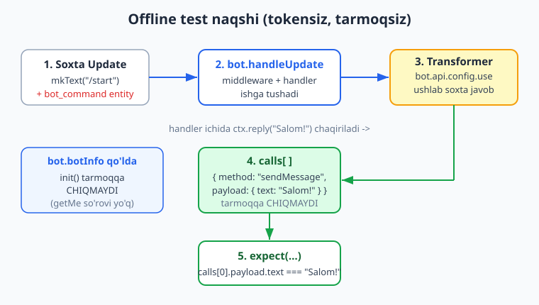
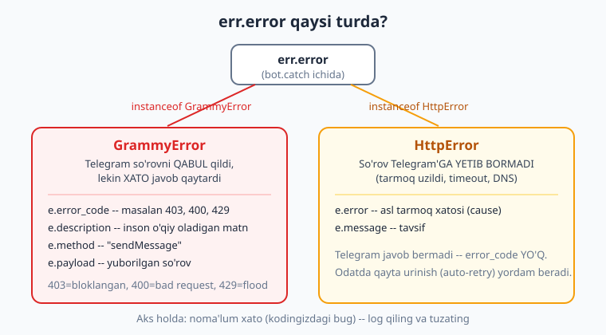
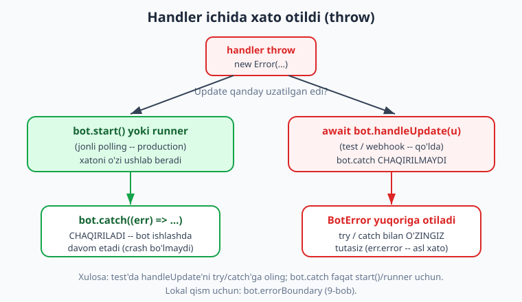

# 16 — Testlash va xatolarni boshqarish

[⬅️ Oldingi: 15 — Rejalashtirilgan vazifalar va broadcast](./15-rejalashtirilgan-broadcast.md) · [🏠 README](./README.md) · [Keyingi: 17 — Production va deploy ➡️](./17-production-deploy.md)

---

> **Bu bobda:** nihoyat butun kitob davomida ishlatib kelgan sirimizni rasmiylashtiramiz — bot mantig'ini **tokensiz va tarmoqsiz** sinashni. Avval *nega* test kerakligini ko'ramiz, so'ng **offline test naqshi**ning to'rt ustunini bir-bir yig'amiz: soxta `bot.botInfo` (init tarmoqqa chiqmasin), `bot.api.config.use(transformer)` bilan chiquvchi API'ni ushlash, `bot.handleUpdate(mockUpdate)` bilan handler'ni ishga tushirish va `calls` massivida nima yuborilganini tekshirish. Keyin bularni **Vitest** test freymvorkiga ko'chiramiz: `describe/it/expect`, `makeBot()` va mock update fabrikasi yordamchilari, `npx vitest run`. Session'ni va `conversations`'ni qanday test qilishni (plagin orqali transformer ulash bilan) ko'ramiz. Ikkinchi yarmida **xatolarni boshqarish**ga o'tamiz: `bot.catch`, `err.error` ning ikki asosiy turi — `GrammyError` (Telegram xato qaytardi: `.error_code`, `.description`) va `HttpError` (tarmoq uzildi) — va `bot.errorBoundary` bilan lokal himoya. Eng muhim nuans: `bot.catch` faqat `bot.start()`/runner uchun ishlaydi, `handleUpdate` esa xatoni `BotError` sifatida yuqoriga otadi — buni test'da `try/catch` bilan tutasiz.
>
> **Halollik eslatmasi:** Bu bobdagi BARCHA test kodi — offline naqsh, Vitest suiti, session va conversation testlari, `bot.catch` bilan `GrammyError`/`HttpError` ni ajratish, `errorBoundary`, va `handleUpdate` xatoni yuqoriga otishi — `grammy-probe` muhitida `grammy@1.43.0` + `vitest@4.1.8` bilan **haqiqatan ishga tushirilgan** (`npx vitest run _bot_test_16.test.js`, **12 passed (12)**). Bob oxiridagi hisobotda aynan o'sha chiqish keltirilgan. Jonli polling, real `sendMessage` va webhook token bilan internet talab qiladi — ular "illustrativ" deb belgilanadi.

---

## Nega test yozamiz?

Bot — bu kod. Har qanday kod kabi u ham buziladi: bitta `if` ni teskari yozdingiz, callback `data` ni noto'g'ri taqqosladingiz, session hisoblagichini noto'g'ri oshirdingiz. Telegram bot'ini "qo'lda" sinash og'riqli:

- Har safar botni ishga tushirish, telefonni ochish, tugmalarni bosish kerak.
- Token va internet kerak — CI/CD serverida (`git push` dan keyin avtomatik tekshiruv) bu yo'q.
- Telegram'ning rate-limit'iga tushib qolasiz (juda ko'p so'rov).
- 403 (bloklangan), 400 (bad request) kabi xatolarni *ataylab* yuzaga keltirish qiyin.

Yechim — **mantiqni tarmoqdan ajratib sinash**. grammY arxitekturasi buni juda qulay qiladi: handler'lar shunchaki funksiyalar, update'lar — oddiy JSON obyektlar, chiquvchi API esa bitta nuqtadan (`bot.api`) o'tadi. Demak biz:

1. Soxta update'ni qo'lda yasaymiz (Telegram kerak emas).
2. `bot.handleUpdate(...)` bilan uni botga "uzatamiz" — aynan polling qiladigan ish.
3. Bot Telegram'ga yubormoqchi bo'lgan har bir so'rovni ushlab qolamiz va soxta javob beramiz (tarmoq kerak emas).
4. Ushlangan so'rovlarni tekshiramiz: "bot to'g'ri matnni to'g'ri chat'ga yubordimi?"

Bu — **siz bu kitob davomida ko'rgan har bir "offline tasdiqlangan" eslatmaning ustidagi mexanizm.** 02-bobdan beri har bob kodi shu usulda tekshirilgan. Endi uni o'zingiz yozadigan qilib rasmiylashtiramiz.

> **Eslatma:** Bu yondashuv umumiy dasturlashdagi *unit/integration test* g'oyasining bot'ga moslashtirilgan ko'rinishi. Agar test tushunchasi yangi bo'lsa, [Node.js kitobidagi testlash bo'limi](../nodejs/README.md) asoslarni beradi. Python'da `aiogram` bilan xuddi shunday qilinadi — solishtirish uchun [tgbot-python kitobiga](../tgbot-python/README.md) qarang (u yerda `Bot`/`Dispatcher` mock qilinadi).

## Offline test naqshi — to'rt ustun

Naqshning butun mohiyati shu rasmda:



Endi har bir ustunni alohida ko'rib chiqamiz.

### 1-ustun: `bot.botInfo` ni qo'lda berish (init'ni to'xtatish)

Bot birinchi marta ishga tushganda grammY Telegram'dan `getMe` so'rovi orqali o'zi haqida ma'lumot oladi (`bot.botInfo`). Bu **tarmoqqa chiqish**. Test'da buni xohlamaymiz — shuning uchun `botInfo` ni **qo'lda** to'ldiramiz. Shunda grammY "men o'zimni bilaman" deb hisoblaydi va `getMe` yubormaydi:

```js
const bot = new Bot("12345:FAKE-OFFLINE-TOKEN"); // soxta token, shakli to'g'ri bo'lsa kifoya
bot.botInfo = {
  id: 12345, is_bot: true, first_name: "TestBot", username: "test_bot",
  can_join_groups: true, can_read_all_group_messages: false,
  supports_inline_queries: false, can_connect_to_business: false,
  has_main_web_app: false,
};
```

> **Diqqat:** `botInfo` ni bermay turib `bot.handleUpdate(...)` yoki `bot.init()` chaqirsangiz, grammY `getMe` so'rovini yuborishga uriniadi — bu test'da tarmoq xatosi yoki "Unauthorized" bilan yiqiladi. Bu eng ko'p uchraydigan offline-test xatosi. Barcha sakkizta maydonni to'ldiring (`grammy@1.43.0` ularning hammasini kutadi).

### 2-ustun: transformer bilan chiquvchi API'ni ushlash

9-bobda **API transformer** bilan tanishgansiz: `bot.api.config.use(...)` chiquvchi so'rovlarga ulanadigan funksiya. Odatda u so'rovni `prev(...)` orqali Telegram'ga uzatadi. Test'da esa biz `prev` ni **umuman chaqirmaymiz** — so'rovni `calls` massiviga yozib, soxta javob qaytaramiz:

```js
const calls = [];
bot.api.config.use((prev, method, payload, signal) => {
  calls.push({ method, payload });       // nima yuborilganini eslab qolamiz
  if (method === "sendMessage") {
    return Promise.resolve({              // soxta "ok" javob
      ok: true,
      result: {
        message_id: 1, date: 0,
        chat: { id: payload.chat_id, type: "private" },
        text: payload.text,
      },
    });
  }
  return Promise.resolve({ ok: true, result: true }); // boshqa metodlar uchun
});
```

`prev` chaqirilmagani uchun **hech narsa tarmoqqa chiqmaydi**. Ba'zi metodlar (masalan `ctx.reply` ortidan `editMessageText`) "Message" obyektini qaytarishni kutadi — shuning uchun `sendMessage`/`editMessageText` uchun to'liqroq soxta `result` beramiz; qolganlari uchun `result: true` yetarli.

> **Eslatma:** `signal` — bu `AbortSignal` (so'rovni bekor qilish uchun). Test'da unga tegmaymiz, lekin transformer imzosida bo'lishi yaxshi odat.

### 3-ustun: `bot.handleUpdate(mockUpdate)` bilan handler'ni ishga tushirish

`bot.handleUpdate(update)` — bu polling/webhook ichida grammY har bir update uchun chaqiradigan metod. Biz uni to'g'ridan-to'g'ri chaqiramiz. Lekin update **to'g'ri shaklda** bo'lishi shart, aks holda handler'lar mos kelmaydi:

```js
await bot.handleUpdate({
  update_id: 1,
  message: {
    message_id: 1, date: 0, text: "/start",
    chat: { id: 777, type: "private" },
    from: { id: 777, is_bot: false, first_name: "Ali" },
    entities: [{ type: "bot_command", offset: 0, length: 6 }], // /start = 6 belgi
  },
});
```

> **Diqqat — eng ko'p uchraydigan gotcha:** Buyruq update'iga `entities: [{ type: "bot_command", offset: 0, length: N }]` qo'shishni UNUTMANG. `bot.command("start")` matnni emas, aynan `bot_command` *entity*'sini qidiradi. Entity'siz `/start` shunchaki oddiy matn bo'lib qoladi va `bot.command` handler'i **mos kelmaydi**. `length` — buyruqning belgilar soni (`/start` -> 6). Buni pastdagi testda alohida tekshiramiz.

### 4-ustun: `calls` massivida tekshirish (assert)

Endi botning nima yuborganini tekshiramiz:

```js
// calls[0] = { method: "sendMessage", payload: { chat_id: 777, text: "Salom!" } }
assert.equal(calls[0].method, "sendMessage");
assert.equal(calls[0].payload.text, "Salom!");
assert.equal(calls[0].payload.chat_id, 777);
```

Mana butun g'oya: **soxta kirish (update) -> handler -> ushlangan chiqish (calls) -> tekshiruv.** Tarmoq, token, telefon — hech biri kerak emas. Test bir necha millisekundda ishlaydi.

## Vitest bilan rasmiy test

Yuqoridagini har safar qo'lda yozish charchatadi. **Vitest** — zamonaviy, tez test freymvork (Jest'ga juda o'xshash, lekin ESM va Vite uchun tug'ma). U bizga `describe`/`it`/`expect` strukturasini, avtomatik ishga tushirishni va chiroyli hisobotni beradi.

### O'rnatish va ishga tushirish

```bash
npm install --save-dev vitest
```

`package.json` ga skript qo'shamiz:

```json
{
  "scripts": {
    "test": "vitest run"
  }
}
```

Endi `npm test` (yoki to'g'ridan-to'g'ri `npx vitest run`) — barcha `*.test.js` fayllarni topib ishga tushiradi. `vitest` (run'siz) esa **watch rejimida** turadi: faylni o'zgartirsangiz, test avtomatik qayta ishlaydi — bu rivojlantirishda juda qulay.

### Yordamchilarni bir marta yozib, qayta ishlatamiz

Naqshning takrorlanadigan qismini ikki yordamchiga ajratamiz: `makeBot()` (transformer + `botInfo`) va `mkText(...)` (mock update fabrikasi). Bu — sinab ko'rilgan, ishlaydigan to'liq fayl:

```js
// _bot_test_16.test.js
import { describe, it, expect } from "vitest";
import { Bot } from "grammy";

// Chiquvchi API'ni ushlab soxta javob qaytaruvchi transformer fabrikasi.
function offlineTransformer(calls) {
  return (prev, method, payload, signal) => {
    calls.push({ method, payload });
    if (method === "sendMessage" || method === "editMessageText") {
      return Promise.resolve({
        ok: true,
        result: {
          message_id: 1, date: 0,
          chat: { id: payload.chat_id, type: "private" },
          text: payload.text,
        },
      });
    }
    return Promise.resolve({ ok: true, result: true });
  };
}

// Soxta botInfo bilan bot: init() tarmoqqa chiqmaydi.
function makeBot() {
  const bot = new Bot("12345:FAKE-OFFLINE-TOKEN");
  bot.botInfo = {
    id: 12345, is_bot: true, first_name: "TestBot", username: "test_bot",
    can_join_groups: true, can_read_all_group_messages: false,
    supports_inline_queries: false, can_connect_to_business: false,
    has_main_web_app: false,
  };
  const calls = [];
  bot.api.config.use(offlineTransformer(calls));
  // conversations replay engine ichki ctx uchun yangi Api quradi -> uni ham ulaymiz
  // (oddiy testlarda kerak emas; conversation testida ishlatamiz)
  const installOffline = (ctx, next) => {
    ctx.api.config.use(offlineTransformer(calls));
    return next();
  };
  return { bot, calls, installOffline };
}

// Soxta matn/buyruq update'i. Buyruq uchun bot_command entity AVTOMATIK qo'shiladi.
function mkText(text, id = 1, fromId = 777) {
  const message = {
    message_id: id, date: 0, text,
    chat: { id: 777, type: "private" },
    from: { id: fromId, is_bot: false, first_name: "Ali" },
  };
  if (text.startsWith("/")) {
    const cmdLen = text.split(/\s/)[0].length;
    message.entities = [{ type: "bot_command", offset: 0, length: cmdLen }];
  }
  return { update_id: id, message };
}
```

`mkText` ichidagi kichik ayyorlik: agar matn `/` bilan boshlansa, birinchi bo'lakning uzunligini hisoblab `bot_command` entity'sini avtomatik qo'shadi. Shunday qilib har safar entity'ni qo'lda yozmaymiz — bitta yordamchi gotcha'ni bartaraf etadi.

### Birinchi testlar: `describe` / `it` / `expect`

```js
describe("16-bob: offline test naqshi", () => {
  it("/start handleri 'Salom!' yuboradi", async () => {
    const { bot, calls } = makeBot();
    bot.command("start", (ctx) => ctx.reply("Salom!"));
    await bot.handleUpdate(mkText("/start"));
    expect(calls).toHaveLength(1);
    expect(calls[0].method).toBe("sendMessage");
    expect(calls[0].payload.text).toBe("Salom!");
    expect(calls[0].payload.chat_id).toBe(777);
  });

  it("buyruq entity'siz bot.command MOS KELMAYDI (gotcha)", async () => {
    const { bot, calls } = makeBot();
    bot.command("start", (ctx) => ctx.reply("Salom!"));
    const upd = mkText("/start");
    delete upd.message.entities;          // entity'ni ataylab olib tashlaymiz
    await bot.handleUpdate(upd);
    expect(calls).toHaveLength(0);        // handler ISHLAMADI
  });
});
```

Ikkinchi test gotcha'ni **isbotlaydi**: entity'siz `/start` handler'ga yetib bormaydi (`calls` bo'sh). Bu — "men duch keldim" turidagi xatoni testga aylantirish; kelajakda kim mock update yozsa, bu test eslatib turadi.

`expect(...)` ning eng ko'p ishlatiladigan matcher'lari:

| Matcher | Ma'nosi |
|---|---|
| `.toBe(x)` | qat'iy tenglik (`===`) — son, satr, boolean uchun |
| `.toEqual(x)` | chuqur tenglik — obyekt/massiv ichini solishtiradi |
| `.toHaveLength(n)` | massiv/satr uzunligi |
| `.toContain(x)` | massivda element bor / satrda qism bor |
| `.toBeInstanceOf(C)` | `x instanceof C` |
| `.not.toBe(x)` | inkor (har qanday matcher oldidan `.not`) |

### Yana bir nechta handler turi

`bot.hears`, `message:text` filtri va `callback_query` ham xuddi shu naqsh bilan sinaladi:

```js
it("bot.hears regex ctx.match'ni to'ldiradi", async () => {
  const { bot, calls } = makeBot();
  bot.hears(/echo (.+)/, (ctx) => ctx.reply(ctx.match[1]));
  await bot.handleUpdate(mkText("echo salom dunyo"));
  expect(calls[0].payload.text).toBe("salom dunyo");
});

it("callback_query: answerCallbackQuery va editMessageText", async () => {
  const { bot, calls } = makeBot();
  bot.callbackQuery("tasdiq", async (ctx) => {
    await ctx.answerCallbackQuery({ text: "OK" });
    await ctx.editMessageText("Tasdiqlandi");
  });
  await bot.handleUpdate(mkCallback("tasdiq"));   // mkCallback — callback fabrikasi
  const methods = calls.map((c) => c.method);
  expect(methods).toContain("answerCallbackQuery");
  expect(methods).toContain("editMessageText");
});
```

`callback_query` uchun alohida fabrika kerak (`mkCallback`), chunki update shakli boshqacha:

```js
function mkCallback(data, id = 1) {
  return {
    update_id: id,
    callback_query: {
      id: "cb" + id, from: { id: 777, is_bot: false, first_name: "Ali" },
      chat_instance: "ci", data,
      message: {
        message_id: 50, date: 0, text: "menyu",
        chat: { id: 777, type: "private" },
        from: { id: 12345, is_bot: true, first_name: "TestBot" },
      },
    },
  };
}
```

## Session'ni test qilish

Session (10-bob) — bu shunchaki `ctx.session` orqali kiriladigan obyekt. Standart (xotiradagi) storage bilan u testda **tabiiy ishlaydi**: bir test ichida ketma-ket update'lar bir xil session'ni ko'radi (chunki `chat.id` bir xil):

```js
import { session } from "grammy";

it("session hisoblagichni saqlaydi", async () => {
  const { bot, calls } = makeBot();
  bot.use(session({ initial: () => ({ count: 0 }) }));
  bot.on("message:text", (ctx) => {
    ctx.session.count++;
    return ctx.reply("count=" + ctx.session.count);
  });
  await bot.handleUpdate(mkText("bir", 1));
  await bot.handleUpdate(mkText("ikki", 2));
  const texts = calls.map((c) => c.payload.text);
  expect(texts).toEqual(["count=1", "count=2"]);  // session saqlandi
});
```

> **Eslatma:** Bu yerda biz **xotiradagi** standart storage'ni ishlatdik — disk yoki DB kerak emas. Agar siz `FileAdapter` yoki `better-sqlite3` storage'ini sinamoqchi bo'lsangiz, har test uchun vaqtinchalik papka/fayl yarating va oxirida o'chiring (`beforeEach`/`afterEach`). Lekin handler **mantig'ini** sinash uchun xotiradagi storage yetarli va tezroq — storage adapterni alohida sinang.

## `conversations`'ni test qilish (transformer'ni plagin orqali ulash)

`conversations` v2 (08-bob) bilan bitta nozik joy bor. Suhbat **replay engine** ustida ishlaydi: u suhbat funksiyasini qayta-qayta ijro etadi va har safar **yangi `Api` obyekti** quradi. Demak `bot.api` ga ulagan transformerimiz suhbat *ichidagi* `ctx.reply` ni ushlamaydi — u yangi, "toza" Api'dan o'tadi va chinakam tarmoqqa chiqishga uriniadi.

Yechim: transformerni `conversations({ plugins: [...] })` orqali ham ulaymiz. `plugins` — bu suhbat ichidagi har bir `ctx` ga qo'llaniladigan middleware'lar ro'yxati. Ulardan birida ichki `ctx.api` ga transformerimizni ulaymiz. Buning uchun `makeBot()` ga bitta qator qo'shib, `installOffline` middleware'ini ham qaytaramiz:

```js
import { conversations, createConversation } from "@grammyjs/conversations";

// makeBot() ichida (yuqoridagi versiyaga qo'shamiz):
//   const installOffline = (ctx, next) => {
//     ctx.api.config.use(offlineTransformer(calls)); // suhbat ichki ctx'iga ham
//     return next();
//   };
//   return { bot, calls, installOffline };

it("conversation ism so'rab javob beradi", async () => {
  const { bot, calls, installOffline } = makeBot();
  async function ism(conversation, ctx) {
    await ctx.reply("Ismingiz?");
    const { message } = await conversation.waitFor("message:text");
    await ctx.reply("Xush kelibsiz, " + message.text + "!");
  }
  bot.use(conversations({ plugins: [installOffline] }));   // <-- transformer plagin orqali
  bot.use(createConversation(ism));
  bot.command("ism", (ctx) => ctx.conversation.enter("ism"));

  await bot.handleUpdate(mkText("/ism", 1));   // suhbatga kiramiz -> "Ismingiz?"
  await bot.handleUpdate(mkText("Oqil", 2));   // javob -> "Xush kelibsiz, Oqil!"
  const texts = calls.map((c) => c.payload.text);
  expect(texts).toContain("Ismingiz?");
  expect(texts).toContain("Xush kelibsiz, Oqil!");
});
```

> **Diqqat:** `plugins: [installOffline]` ni unutsangiz, suhbat ichidagi `ctx.reply("Xush kelibsiz...")` chinakam tarmoqqa chiqishga urinadi va test "Unauthorized"/tarmoq xatosi bilan yiqiladi. Bu — conversations'ni offline sinashdagi yagona, lekin muhim hiyla. (Suhbat ichida DB/`Date.now()`/random ishlatsangiz, ularni `conversation.external(...)` bilan o'rashni ham eslang — 08-bobdan.)

## Xatolarni boshqarish

Test mantiqni *to'g'ri ishlaganda* tekshiradi. Endi mantiq *xato ishlaganda* nima bo'lishini ko'ramiz. Real botda xatolar muqarrar: foydalanuvchi botni bloklaydi, Telegram vaqtincha javob bermaydi, siz bo'sh matn yuborasiz. Bularni boshqarmasangiz, bot qulashi mumkin.

### `bot.catch` — global xato tuzog'i

`bot.catch((err) => {...})` — botning istalgan joyida tutilmagan xatoni ushlaydi. Eng muhim qismi — `err.error` (asl xato). U odatda **uch holatdan biri** bo'ladi:



```js
import { GrammyError, HttpError } from "grammy";

bot.catch((err) => {
  const e = err.error;          // asl xato (err.ctx — qaysi update'da bo'lgani)
  if (e instanceof GrammyError) {
    // Telegram so'rovni QABUL qildi, lekin XATO javob qaytardi
    console.error("Telegram xato:", e.error_code, e.description);
  } else if (e instanceof HttpError) {
    // So'rov Telegram'ga YETIB BORMADI (tarmoq uzildi)
    console.error("Tarmoq xato:", e);
  } else {
    // Sizning kodingizdagi bug (TypeError va h.k.)
    console.error("Noma'lum xato:", e);
  }
});
```

### `GrammyError` — Telegram xato qaytardi

Bu eng tez-tez uchraydigan tur. So'rov Telegram'ga **yetib bordi**, lekin u rad etdi. Foydali maydonlari:

- **`e.error_code`** — HTTP-ga o'xshash kod. Eng muhimlari:
  - `403` — **Forbidden**: foydalanuvchi botni bloklagan yoki guruhdan chiqarib yuborilgan. Eng ko'p uchraydigani.
  - `400` — **Bad Request**: so'rov noto'g'ri (bo'sh matn, noto'g'ri `parse_mode`, eskirgan callback va h.k.).
  - `429` — **Too Many Requests**: rate-limit, "flood". `e.parameters.retry_after` — necha soniya kutish kerakligini aytadi.
- **`e.description`** — inson o'qiy oladigan tavsif, masalan `"Forbidden: bot was blocked by the user"`.
- **`e.method`** — qaysi metod yiqildi (`"sendMessage"`).
- **`e.payload`** — yuborilgan so'rov tanasi.

Offline'da `GrammyError` ni **ataylab** yuzaga keltirib, `bot.catch` uni to'g'ri ushlashini sinaymiz:

```js
it("bot.catch GrammyError'ni .description bilan ushlaydi", async () => {
  const { bot } = makeBot();
  const tutilgan = [];
  bot.catch((err) => {
    const e = err.error;
    if (e instanceof GrammyError) tutilgan.push("grammy: " + e.description);
    else if (e instanceof HttpError) tutilgan.push("http");
    else tutilgan.push("nomalum");
  });
  bot.command("xato", () => {
    throw new GrammyError(
      "Call to 'sendMessage' failed!",
      { ok: false, error_code: 403, description: "Forbidden: bot was blocked by the user" },
      "sendMessage", {},
    );
  });

  let thrown = null;
  try {
    await bot.handleUpdate(mkText("/xato"));   // handleUpdate xatoni YUQORIGA otadi
  } catch (err) {
    thrown = err;
    await bot.errorHandler(err);               // bot.catch'ga QO'LDA uzatamiz
  }
  expect(thrown.error).toBeInstanceOf(GrammyError);
  expect(thrown.error.error_code).toBe(403);
  expect(tutilgan).toEqual(["grammy: Forbidden: bot was blocked by the user"]);
});
```

> **Eslatma:** `bot.errorHandler` — bu `bot.catch(...)` bilan o'rnatgan funksiyangizning ichki saqlangan ko'rinishi. Uni qo'lda chaqirib, test'da `bot.catch` mantig'ini ham sinashimiz mumkin. Real botda buni qilmaysiz — `bot.start()`/runner buni o'zi qiladi (pastda ko'ramiz).

`403` (bloklangan) odatda **kutilgan** xato: ommaviy tarqatishda (15-bob) ba'zi foydalanuvchilar botni bloklagan bo'ladi. To'g'ri yondashuv — uni log qilib, o'sha foydalanuvchini "faol emas" deb belgilash, butun broadcast'ni to'xtatmaslik.

### `HttpError` — tarmoq uzildi

`HttpError` — so'rov Telegram serverigacha **yetib bormadi**: internet uzildi, DNS ishlamadi, timeout bo'ldi. Bu yerda `error_code` **yo'q** (Telegram javob bermagan). `e.error` — asl tarmoq xatosi (cause). Bu turdagi xatoda odatda **qayta urinish** yordam beradi — buni `@grammyjs/auto-retry` (15-bob) avtomatlashtiradi.

```js
it("GrammyError vs HttpError turini ajratadi", async () => {
  const { bot } = makeBot();
  const turlar = [];
  bot.catch((err) => {
    const e = err.error;
    if (e instanceof GrammyError) turlar.push("GrammyError");
    else if (e instanceof HttpError) turlar.push("HttpError");
    else turlar.push("boshqa");
  });
  const grammyErr = new GrammyError(
    "x", { ok: false, error_code: 400, description: "Bad Request: message text is empty" }, "sendMessage", {},
  );
  const httpErr = new HttpError("tarmoq uzildi", new Error("ECONNRESET"));
  await bot.errorHandler({ error: grammyErr, ctx: {} });
  await bot.errorHandler({ error: httpErr, ctx: {} });
  expect(turlar).toEqual(["GrammyError", "HttpError"]);
});
```

### Eng muhim nuans: `bot.catch` `handleUpdate`'da ISHLAMAYDI

Bu — testlash va xatolarni bog'laydigan eng nozik joy:



- `bot.start()` yoki `@grammyjs/runner` botni ishga tushirsa va handler ichida xato otilsa — grammY uni ushlab **`bot.catch`** ga uzatadi. Bot qulamaydi.
- Lekin siz update'ni **qo'lda** `await bot.handleUpdate(update)` bilan uzatsangiz (test'da yoki o'z webhook'ingizda), xato `BotError` sifatida **yuqoriga otiladi** — `bot.catch` chaqirilmaydi. Uni `try/catch` bilan **o'zingiz** tutasiz.

```js
it("handleUpdate xatoni BotError sifatida YUQORIGA otadi (bot.catch emas)", async () => {
  const { bot } = makeBot();
  let catchChaqirildi = false;
  bot.catch(() => { catchChaqirildi = true; });
  bot.on("message", () => { throw new Error("portladi"); });

  let thrown = null;
  try {
    await bot.handleUpdate(mkText("salom"));
  } catch (err) {
    thrown = err;
  }
  expect(catchChaqirildi).toBe(false);        // bot.catch CHAQIRILMADI
  expect(thrown.error.message).toBe("portladi"); // BotError.error = asl xato
});
```

`BotError` — grammY xatolarni o'rab beradigan klass: `thrown.error` asl xatoni, `thrown.ctx` xato sodir bo'lgan context'ni saqlaydi. Test'da xatoni shu tarzda tekshirasiz. Webhook'da bu nuansni 13-bobda ko'rgansiz — `webhookCallback` xatoni ichida boshqaradi.

### `bot.errorBoundary` — lokal himoya

9-bobda ko'rgan `bot.errorBoundary(handler)` botning **bir qismini** o'rab, xatoni lokal ushlaydi (global `bot.catch` ga chiqarmaydi). Test'da ham ishlaydi:

```js
it("bot.errorBoundary qism uchun xatoni lokal ushlaydi", async () => {
  const { bot } = makeBot();
  const log = [];
  const himoyalangan = bot.errorBoundary((err) => {
    log.push("ushladi: " + err.error.message);   // next() YO'Q -> xato yutiladi
  });
  himoyalangan.on("message", () => { throw new Error("modul portladi"); });
  await bot.handleUpdate(mkText("salom"));        // yuqoriga CHIQMAYDI
  expect(log).toEqual(["ushladi: modul portladi"]);
});
```

E'tibor bering: bu yerda `handleUpdate` xato **otmadi** — chunki `errorBoundary` uni ichida ushladi (`next()` chaqirmadi). Yuqoridagi testdan (xato yuqoriga otilgan) farqi shunda: u yerda chegara yo'q edi.

> **Eslatma:** `bot.catch` (global), `bot.errorBoundary` (qism uchun) va handler ichidagi `try/catch` (bitta amal uchun) — bu uch daraja. Maslahat: kutilgan, aniq xatolar (masalan bitta `sendMessage` ning 403'i) uchun handler ichida `try/catch`; modul darajasida `errorBoundary`; eng tashqi "hamma narsa uchun" tuzoq sifatida `bot.catch`. Production'da `bot.catch` ni 17-bobda yana ko'ramiz.

## `vi.fn()` bilan mock — kichik birliklar uchun

Ba'zan butun update oqimini emas, bitta funksiyani izolyatsiyada sinash kerak. Vitest'ning `vi.fn()` — bu chaqiruvlarni eslab qoladigan "spy" (josus) funksiya:

```js
import { vi } from "vitest";

const reply = vi.fn(() => Promise.resolve({}));
const ctx = { reply, from: { id: 777 } };

// sinaladigan toza funksiya (botdan mustaqil)
async function salomBer(ctx) {
  await ctx.reply("Salom, " + ctx.from.id);
}

await salomBer(ctx);
expect(reply).toHaveBeenCalledTimes(1);
expect(reply).toHaveBeenCalledWith("Salom, 777");
```

Bu yondashuv handler mantig'ini `ctx` dan ajratib yozsangiz (sof funksiyalar) juda qulay. Lekin grammY'ning to'liq oqimini (middleware tartibi, filter query'lar, conversations) sinash uchun **transformer naqshi** ishonchliroq — chunki u haqiqiy grammY pipeline'ini ishga tushiradi, soxta `ctx` emas.

> **Anti-eskirish:** Telegram bot test idiomalari (mock kutubxonalar, helper'lar) vaqt o'tib o'zgaradi. `vi.fn()`, `vi.spyOn()`, `vi.useFakeTimers()` (rejalashtirilgan vazifalarni — 15-bob — sinash uchun) kabi Vitest API'lari uchun [vitest.dev](https://vitest.dev) rasmiy hujjatiga qarang. grammY'ning test bo'yicha tavsiyalari uchun [grammy.dev](https://grammy.dev) — men bu yerda mavjud bo'lmagan helper'larni ixtiro qilmayman.

## Debug va logging maslahatlari

Test yiqilganda yoki bot kutilmaganda ishlaganda:

- **`console.log(JSON.stringify(calls, null, 2))`** — bot aslida nima yuborganini ko'ring. Ko'pincha muammo aniq bo'ladi (matn boshqa, chat_id noto'g'ri).
- **`console.log(JSON.stringify(ctx.update, null, 2))`** — handler boshida update'ning haqiqiy shaklini ko'ring. Mock update'ingiz haqiqiysiga mos kelmasligi mumkin.
- **`bot.use((ctx, next) => { console.log(ctx.update); return next(); })`** — eng oldinga qo'yilgan logging middleware (9-bob) har update'ni chop etadi.
- **`DEBUG` muhit o'zgaruvchisi:** grammY `debug` kutubxonasidan foydalanadi. `DEBUG=grammy* node bot.js` (yoki Windows'da `set DEBUG=grammy*`) ichki diagnostikani yoqadi.
- **Production logging:** `console.log` o'rniga `pino`/`winston` kabi structured logger ishlating — buni [Node.js kitobida](../nodejs/README.md) ko'rgansiz. 17-bobda production logging va monitoringni ko'ramiz.

## Tez-tez uchraydigan xatolar

| Xato | Sabab | Yechim |
|---|---|---|
| Test "Unauthorized"/tarmoq xatosi beradi | `bot.botInfo` berilmagan, `init()` `getMe` yubordi | Test'da `bot.botInfo = {...}` ni qo'lda to'liq bering |
| `bot.command` mos kelmayapti | Mock update'da `bot_command` entity yo'q | `entities: [{ type: "bot_command", offset: 0, length: N }]` qo'shing |
| Chiquvchi so'rov tarmoqqa chiqyapti | `bot.api.config.use(transformer)` ulanmagan | Botni yaratgach transformerni darrov ulang (`makeBot`) |
| Conversation testi tarmoqqa chiqyapti | Suhbat ichki ctx'iga transformer ulanmagan | `conversations({ plugins: [installOffline] })` ishlating |
| `bot.catch` test'da chaqirilmayapti | `handleUpdate` xatoni yuqoriga otadi, `bot.catch`'ni chaqirmaydi | `try/catch` bilan tuting; kerak bo'lsa `bot.errorHandler(err)` ni qo'lda chaqiring |
| `HttpError`'da `error_code` `undefined` | Telegram javob bermagan — kod yo'q | Faqat `GrammyError`'da `error_code` bor; turni `instanceof` bilan ajrating |
| Test ba'zan o'tadi, ba'zan yiqiladi (flaky) | `Date.now()`, random, real timer'ga bog'liq | Vaqtni mock qiling (`vi.useFakeTimers`) yoki update'ga `__now` kabi maydon bering |
| `errorBoundary` xatoni ushlamayapti | Handler chegara doirasidan tashqarida | Handlerni `errorBoundary` qaytargan Composer'ga bog'lang (9-bob) |

> **Eslatma — flaky test:** "Flaky" test — ba'zan o'tadigan, ba'zan yiqiladigan beqaror test. Sababi deyarli har doim **boshqarilmaydigan tashqi narsa**: real vaqt (`Date.now()`), tasodifiy son, tarmoq, yoki testlar orasida bo'linadigan umumiy holat (global `Map`). Yechim — har testda yangi `makeBot()` ishlating (umumiy holat yo'q), vaqt/randomni mock qiling, va tarmoqqa hech qachon chiqmang. Bu bobning butun naqshi aynan shu tamoyilga asoslangan.

---

## Mashqlar

> Quyidagi mashqlarning ko'pi **offline** tekshiriladi — `makeBot()` (transformer + `botInfo`) va `mkText(...)`/`mkCallback(...)` yordamchilaridan foydalaning. Buyruq update'iga `bot_command` entity kerakligini (`mkText` buni avtomatik qiladi), conversation testida `plugins: [installOffline]` kerakligini, va `handleUpdate` xatoni yuqoriga otishini unutmang. Har bir mashqni `*.test.js` faylga yozib, `npx vitest run` bilan yashil natijaga olib keling.

### Oson

1. **Birinchi test.** `bot.command("start")` `"Salom!"` qaytarsin. `makeBot()` + `mkText("/start")` bilan test yozing va `calls[0].payload.text === "Salom!"` ekanini `expect` qiling.

2. **Entity gotcha'si.** `mkText("/start")` dan `entities` ni `delete` qiling va `bot.command("start")` handler'i ishlamaganini (`calls` bo'sh) tasdiqlang.

3. **`message:text` filtri.** `bot.on("message:text")` matnni "qabul qilindi: <matn>" bilan qaytarsin. Bitta matnli xabar uzatib, chiqqan matnni tekshiring.

4. **`bot.hears` ctx.match.** `bot.hears(/son (\d+)/, ...)` topilgan sonni `ctx.match[1]` orqali qaytarsin. `"son 42"` uzatib, `"42"` kelganini tasdiqlang.

5. **Bir nechta call.** Handler ketma-ket ikkita `ctx.reply` chaqirsin. `calls` uzunligi `2` ekanini va ikkala matnni `toEqual` bilan tasdiqlang.

### O'rta

6. **Session hisoblagich.** `session({ initial: () => ({ count: 0 }) })` o'rnating; har matnda `count` ni oshirib `"count=N"` qaytaring. Uch xabar uzatib, `["count=1","count=2","count=3"]` ekanini tasdiqlang.

7. **Callback query.** `bot.callbackQuery("ha", ...)` `answerCallbackQuery` chaqirib `editMessageText("Tanlandi")` qilsin. `mkCallback("ha")` uzatib, `editMessageText` chaqirilganini va matnini tekshiring.

8. **`bot.catch` GrammyError.** Handler `403` `GrammyError` otsin. `bot.catch` uni ushlab `.description` ni saqlasin. `try/catch` + `bot.errorHandler(err)` bilan test yozing va tutilgan tavsifni tasdiqlang.

9. **Turni ajratish.** `bot.errorHandler` ga bittadan `GrammyError` va `HttpError` uzating (qo'lda yasab). `bot.catch` ikkalasini to'g'ri ("GrammyError"/"HttpError") ajratganini tasdiqlang.

10. **`vi.fn()` spy.** `ctx.reply` o'rniga `vi.fn()` qo'ying va botdan mustaqil sof funksiyani sinang. `toHaveBeenCalledWith(...)` bilan argumentni tasdiqlang.

### Qiyin

11. **`handleUpdate` xato otadi.** Handler oddiy `Error` otsin. `bot.catch` o'rnatilgan bo'lsa ham, `handleUpdate`'ni `try/catch` ga oling va (a) `bot.catch` chaqirilmaganini, (b) `thrown.error.message` asl xato ekanini tasdiqlang.

12. **`errorBoundary` lokal ushlash.** `bot.errorBoundary` chegarasi yarating (funksiya `next()` chaqirmasin). Chegaraga `throw` qiladigan `.on("message")` bog'lang. `handleUpdate` xato OTMAGANINI va chegara funksiyasi xatoni log qilganini tasdiqlang.

13. **Conversation offline.** `conversation` ism so'rasin (`await conversation.waitFor("message:text")`) va `"Salom, <ism>!"` qaytarsin. `plugins: [installOffline]` bilan ulang, `/ism` keyin `"Bek"` uzating va chiqqan matnlarni tasdiqlang.

14. **Soxta vaqt (flaky'ni davolash).** Rejalashtirilgan logikani (`setTimeout` yoki `Date.now()` ga bog'liq) `vi.useFakeTimers()` + `vi.advanceTimersByTime(...)` bilan sinang. Vaqtni mock qilmasdan bu test flaky bo'lishini tushuntiring.

<details markdown="1">
<summary>Yechimlar</summary>

> Quyidagi yechimlar `_bot_test_16.test.js` dagi naqsh bilan offline ishga tushiriladi. Har bir yechim `makeBot()`, `mkText(...)`, `mkCallback(...)` va (conversation uchun) `installOffline` yordamchilaridan foydalanadi — ular bob boshidagi to'liq faylda berilgan. Qisqartirish uchun yordamchilar bu yerda takrorlanmaydi. Importlar: `import { describe, it, expect, vi } from "vitest";` va `import { Bot, Composer, GrammyError, HttpError, session } from "grammy";`.

### 1-mashq yechimi

```js
it("birinchi test", async () => {
  const { bot, calls } = makeBot();
  bot.command("start", (ctx) => ctx.reply("Salom!"));
  await bot.handleUpdate(mkText("/start"));
  expect(calls[0].payload.text).toBe("Salom!");
});
```

`makeBot()` transformer va `botInfo` ni o'rnatadi; `mkText("/start")` `bot_command` entity'sini avtomatik qo'shadi, shuning uchun `bot.command` mos keladi.

### 2-mashq yechimi

```js
it("entity gotcha'si", async () => {
  const { bot, calls } = makeBot();
  bot.command("start", (ctx) => ctx.reply("Salom!"));
  const upd = mkText("/start");
  delete upd.message.entities;        // entity'siz -> oddiy matn
  await bot.handleUpdate(upd);
  expect(calls).toHaveLength(0);      // handler ishlamadi
});
```

`bot.command` matnni emas, `bot_command` entity'sini qidiradi. Entity'siz `/start` shunchaki matn — handler mos kelmaydi.

### 3-mashq yechimi

```js
it("message:text filtri", async () => {
  const { bot, calls } = makeBot();
  bot.on("message:text", (ctx) => ctx.reply("qabul qilindi: " + ctx.message.text));
  await bot.handleUpdate(mkText("salom"));
  expect(calls[0].payload.text).toBe("qabul qilindi: salom");
});
```

`message:text` filter query — faqat matnli xabarlarga mos keladi. `ctx.message.text` xavfsiz, chunki filtr matn borligini kafolatlaydi.

### 4-mashq yechimi

```js
it("bot.hears ctx.match", async () => {
  const { bot, calls } = makeBot();
  bot.hears(/son (\d+)/, (ctx) => ctx.reply(ctx.match[1]));
  await bot.handleUpdate(mkText("son 42"));
  expect(calls[0].payload.text).toBe("42");
});
```

`bot.hears` regex topganda `ctx.match` ga moslik natijasini qo'yadi; `ctx.match[1]` — birinchi guruh (`42`).

### 5-mashq yechimi

```js
it("bir nechta call", async () => {
  const { bot, calls } = makeBot();
  bot.command("start", async (ctx) => {
    await ctx.reply("birinchi");
    await ctx.reply("ikkinchi");
  });
  await bot.handleUpdate(mkText("/start"));
  expect(calls).toHaveLength(2);
  expect(calls.map((c) => c.payload.text)).toEqual(["birinchi", "ikkinchi"]);
});
```

`calls` har bir chiquvchi so'rovni tartib bo'yicha yozadi, shuning uchun ikkita `reply` ikkita yozuv beradi.

### 6-mashq yechimi

```js
it("session hisoblagich", async () => {
  const { bot, calls } = makeBot();
  bot.use(session({ initial: () => ({ count: 0 }) }));
  bot.on("message:text", (ctx) => {
    ctx.session.count++;
    return ctx.reply("count=" + ctx.session.count);
  });
  await bot.handleUpdate(mkText("a", 1));
  await bot.handleUpdate(mkText("b", 2));
  await bot.handleUpdate(mkText("c", 3));
  expect(calls.map((c) => c.payload.text)).toEqual(["count=1", "count=2", "count=3"]);
});
```

Xotiradagi standart storage bir xil `chat.id` uchun session'ni saqlaydi, shuning uchun hisoblagich update'lar oralig'ida o'sib boradi.

### 7-mashq yechimi

```js
it("callback query", async () => {
  const { bot, calls } = makeBot();
  bot.callbackQuery("ha", async (ctx) => {
    await ctx.answerCallbackQuery();
    await ctx.editMessageText("Tanlandi");
  });
  await bot.handleUpdate(mkCallback("ha"));
  const methods = calls.map((c) => c.method);
  expect(methods).toContain("answerCallbackQuery");
  const edit = calls.find((c) => c.method === "editMessageText");
  expect(edit.payload.text).toBe("Tanlandi");
});
```

`mkCallback("ha")` `callback_query` update'i yasaydi; `bot.callbackQuery("ha")` `data === "ha"` ga mos keladi.

### 8-mashq yechimi

```js
it("bot.catch GrammyError", async () => {
  const { bot } = makeBot();
  let tutilgan = null;
  bot.catch((err) => {
    if (err.error instanceof GrammyError) tutilgan = err.error.description;
  });
  bot.command("xato", () => {
    throw new GrammyError(
      "failed!", { ok: false, error_code: 403, description: "Forbidden: bot was blocked by the user" },
      "sendMessage", {},
    );
  });
  try {
    await bot.handleUpdate(mkText("/xato"));
  } catch (err) {
    await bot.errorHandler(err);   // bot.catch'ga qo'lda uzatamiz
  }
  expect(tutilgan).toBe("Forbidden: bot was blocked by the user");
});
```

`handleUpdate` xatoni otadi; `bot.errorHandler(err)` bilan uni `bot.catch` mantig'iga qo'lda uzatamiz. `403` — foydalanuvchi botni bloklagan.

### 9-mashq yechimi

```js
it("turni ajratish", async () => {
  const { bot } = makeBot();
  const turlar = [];
  bot.catch((err) => {
    const e = err.error;
    if (e instanceof GrammyError) turlar.push("GrammyError");
    else if (e instanceof HttpError) turlar.push("HttpError");
  });
  const ge = new GrammyError("x", { ok: false, error_code: 400, description: "Bad Request" }, "sendMessage", {});
  const he = new HttpError("tarmoq uzildi", new Error("ECONNRESET"));
  await bot.errorHandler({ error: ge, ctx: {} });
  await bot.errorHandler({ error: he, ctx: {} });
  expect(turlar).toEqual(["GrammyError", "HttpError"]);
});
```

`instanceof` ikki turni ajratadi: `GrammyError`'da `error_code` bor (Telegram rad etdi), `HttpError`'da yo'q (so'rov yetib bormadi).

### 10-mashq yechimi

```js
it("vi.fn() spy", async () => {
  const reply = vi.fn(() => Promise.resolve({}));
  const ctx = { reply, from: { id: 777 } };
  async function salomBer(ctx) { await ctx.reply("Salom, " + ctx.from.id); }
  await salomBer(ctx);
  expect(reply).toHaveBeenCalledTimes(1);
  expect(reply).toHaveBeenCalledWith("Salom, 777");
});
```

`vi.fn()` chaqiruvlarni eslab qoladi. Bu sof funksiyalar uchun qulay; to'liq grammY oqimi uchun transformer naqshi ishonchliroq.

### 11-mashq yechimi

```js
it("handleUpdate xato otadi", async () => {
  const { bot } = makeBot();
  let catchChaqirildi = false;
  bot.catch(() => { catchChaqirildi = true; });
  bot.on("message", () => { throw new Error("portladi"); });
  let thrown = null;
  try {
    await bot.handleUpdate(mkText("salom"));
  } catch (err) {
    thrown = err;
  }
  expect(catchChaqirildi).toBe(false);          // bot.catch chaqirilmadi
  expect(thrown.error.message).toBe("portladi"); // BotError.error = asl xato
});
```

`handleUpdate` xatoni `BotError` sifatida yuqoriga otadi va `bot.catch`'ni CHAQIRMAYDI (u faqat `start()`/runner uchun). Shuning uchun `try/catch` shart.

### 12-mashq yechimi

```js
it("errorBoundary lokal ushlash", async () => {
  const { bot } = makeBot();
  const log = [];
  const himoyalangan = bot.errorBoundary((err) => {
    log.push("ushladi: " + err.error.message);  // next() YO'Q -> yutiladi
  });
  himoyalangan.on("message", () => { throw new Error("modul portladi"); });
  let thrown = null;
  try {
    await bot.handleUpdate(mkText("salom"));
  } catch (err) {
    thrown = err;
  }
  expect(thrown).toBeNull();                     // xato OTMADI (chegara ushladi)
  expect(log).toEqual(["ushladi: modul portladi"]);
});
```

`errorBoundary` xatoni o'z doirasida ushlaydi; `next()` chaqirilmagani uchun xato yutiladi va `handleUpdate` muvaffaqiyatli yakunlanadi — yuqoriga otilmaydi.

### 13-mashq yechimi

```js
it("conversation offline", async () => {
  const { bot, calls, installOffline } = makeBot();   // makeBot installOffline'ni ham qaytaradi
  async function ism(conversation, ctx) {
    await ctx.reply("Ismingiz?");
    const { message } = await conversation.waitFor("message:text");
    await ctx.reply("Salom, " + message.text + "!");
  }
  bot.use(conversations({ plugins: [installOffline] }));
  bot.use(createConversation(ism));
  bot.command("ism", (ctx) => ctx.conversation.enter("ism"));

  await bot.handleUpdate(mkText("/ism", 1));
  await bot.handleUpdate(mkText("Bek", 2));
  const texts = calls.map((c) => c.payload.text);
  expect(texts).toContain("Ismingiz?");
  expect(texts).toContain("Salom, Bek!");
});
```

`conversations` replay engine ichki ctx uchun yangi Api quradi — `plugins: [installOffline]` transformer'ni o'sha ichki ctx'ga ulaydi, aks holda suhbat ichidagi `reply` tarmoqqa chiqib yiqiladi. (`import { conversations, createConversation } from "@grammyjs/conversations";`)

### 14-mashq yechimi

```js
it("soxta vaqt bilan flaky'ni davolash", async () => {
  vi.useFakeTimers();
  let bajarildi = false;
  setTimeout(() => { bajarildi = true; }, 5000); // 5 soniyadan keyin
  expect(bajarildi).toBe(false);                 // hali emas
  vi.advanceTimersByTime(5000);                  // vaqtni "tezlashtiramiz"
  expect(bajarildi).toBe(true);                  // endi bajarildi
  vi.useRealTimers();
});
```

Soxta timer'lar real vaqtni kutmasdan vaqtni "oldinga suradi". Mock qilmasdan bu test `5000ms` kutishga majbur bo'lardi va real timer aniqligiga bog'liq holda **flaky** bo'lardi. Rejalashtirilgan vazifalarni (15-bob) sinashda bu juda muhim.

</details>

---

## Yakuniy hisobot

Bu bobning butun test kodi `grammy-probe` muhitida (`grammy@1.43.0`, `@grammyjs/conversations@2.1.1`, `vitest@4.1.8`, Node v24 ESM) `_bot_test_16.test.js` fayliga yozildi va `npx vitest run _bot_test_16.test.js` bilan ishga tushirildi. Haqiqiy chiqish:

```text
 RUN  v4.1.8 C:/Users/imomn/AppData/Local/Temp/grammy-probe

 Test Files  1 passed (1)
      Tests  12 passed (12)
   Start at  22:07:23
   Duration  380ms (transform 45ms, ... tests 28ms ...)
```

**12/12 test o'tdi.** Tasdiqlangan narsalar: (1) offline naqshning to'rt ustuni — `botInfo` init'ni to'xtatadi, transformer chiquvchi API'ni ushlaydi, `handleUpdate` handler'ni ishga tushiradi, `calls` da tekshiriladi; (2) `bot_command` entity gotcha'si — entity'siz `bot.command` mos kelmaydi; (3) `bot.hears`/`ctx.match`, `message:text` filtri, `callback_query` oqimi; (4) session hisoblagichi xotiradagi storage bilan; (5) `conversations` `plugins: [installOffline]` orqali offline; (6) `bot.catch` `GrammyError` (`.error_code` 403, `.description`) va `HttpError` ni `instanceof` bilan ajratadi; (7) eng muhim nuans — `handleUpdate` xatoni `BotError` sifatida yuqoriga otadi va `bot.catch`'ni chaqirmaydi (test'da `try/catch` shart); (8) `bot.errorBoundary` xatoni lokal ushlaydi (yuqoriga otilmaydi).

Jonli polling (`bot.start()`/runner), real `sendMessage` va webhook token bilan internet talab qiladi — ular bu bobda **illustrativ**. Endi sizda har qanday handler, session yoki suhbatni tokensiz, tarmoqsiz, bir necha millisekundda sinaydigan ishonchli usul bor. Keyingi bobda botni production'ga olib chiqamiz va bu testlarni `git push` da avtomatik ishlatamiz.

---

[⬅️ Oldingi: 15 — Rejalashtirilgan vazifalar va broadcast](./15-rejalashtirilgan-broadcast.md) · [🏠 README](./README.md) · [Keyingi: 17 — Production va deploy ➡️](./17-production-deploy.md)
