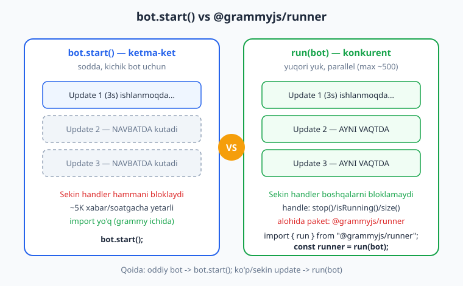
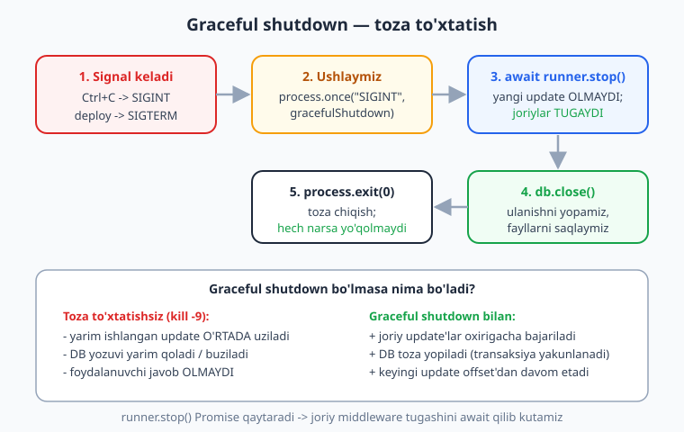
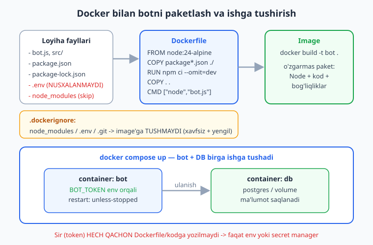

# 17 — Production va deploy

[⬅️ Oldingi: 16 — Testlash va xatolarni boshqarish](./16-testlash-xatolar.md) · [🏠 README](./README.md) · [Keyingi: 18 — Yakuniy kapston: to'liq bot ➡️](./18-kapston.md)

---

> **Bu bobda:** botni "mening kompyuterimda ishlayapti" holatidan **doimiy ishlaydigan xizmat**ga aylantiramiz. Avval **`@grammyjs/runner`** bilan tanishamiz: `run(bot)` update'larni *konkurent* (parallel) qayta ishlaydi va yuqori yukda `bot.start()` (ketma-ket) dan ustun turadi — qaysi birini qachon tanlashni o'rganamiz. So'ng eng muhim mavzu — **graceful shutdown**: `SIGINT`/`SIGTERM` signallarini ushlab, runner yoki bot'ni *toza* to'xtatamiz (yarim ishlangan update'lar tugaydi, DB ulanishi yopiladi). Keyin botni **Docker** image'iga paketlaymiz (Dockerfile, `.dockerignore`, sirlarni `env` orqali, `docker compose` bilan bot + DB), **VPS**'da `pm2` yoki `systemd` bilan ishga tushiramiz, **polling vs webhook** ni production sharoitida solishtiramiz, hamda **logging**, **monitoring**, **health check** va **sirlarni xavfsiz boshqarish** ni ko'rib chiqamiz. Bobning oxirida sizning botingiz qayta ishga tushganda o'zini tiklaydigan, server o'chsa avtomatik qaytadigan, deploy paytida bironta xabarni yo'qotmaydigan jiddiy xizmat bo'ladi.
>
> **Halollik eslatmasi:** `run(bot)` qaytargan handle'ning API'si (`.start()`, `.stop()`, `.isRunning()`, `.size()`, `.task()`), `bot.start()`/`bot.stop()`/`bot.isRunning()` xulqi va **graceful shutdown funksiyasining mantig'i** (`runner.stop()` chaqirilishi -> `isRunning()` darhol `false`; DB `close()` chaqirilishi; `process.once("SIGINT"/"SIGTERM", handler)` listener'ning ro'yxatga olinishi) — bularning hammasi `getUpdates` ni offline transformer bilan ushlab, **tarmoqqa chiqmasdan** ishga tushirilib tasdiqlangan (`node _verify_17.mjs`, 8/8 o'tdi). MUHIM: biz **real `SIGINT`/`SIGTERM` signali yubormadik** (u jarayonni o'ldirib testni uzib qo'yardi) — uning o'rniga shutdown funksiyasini to'g'ridan chaqirib mantiqni sinadik. Jonli polling, Telegram'ga xabar yuborish, Docker build, VPS, `pm2`, `systemd`, webhook server — bularning hammasi token, internet yoki haqiqiy server talab qiladi, shuning uchun **illustrativ** deb belgilangan.

---

## Nega bu bob kerak?

Hozirgacha biz botni `node bot.js` bilan terminalda ishga tushirib keldik. Bu o'rganish uchun ajoyib, lekin **production** (haqiqiy foydalanuvchilar) uchun yetarli emas. Savol tug'iladi:

- Terminalni yopsam yoki kompyuterni o'chirsam, bot ham o'ladi. Foydalanuvchilar 24/7 javob kutadi — bot doimo ishlashi kerak.
- Bot xato bilan "qulab" tushsa, kim uni qayta ishga tushiradi? Tunda-yu?
- Yangi versiyani deploy qilganimda, o'sha paytda kelgan xabar yo'qolmasligi kerak.
- Telegram tokeni kodga yozilgan bo'lsa, kim ko'rishi mumkin? GitHub'ga yuborsam-chi?
- Bot sekundiga 100 ta xabar olsa, ketma-ket qayta ishlash bilan ulgura olamanmi?

Bu bob aynan shu savollarga javob beradi. Avvalo ishlash rejimidan boshlaymiz.

## `@grammyjs/runner` — konkurent (parallel) update qayta ishlash

### `bot.start()` qanday ishlaydi (eslatma)

02-bobdan beri biz `bot.start()` ishlatdik. U **long polling** rejimida: Telegram'dan update'larni `getUpdates` bilan tortib oladi va ularni **ketma-ket** (biri tugamaguncha keyingisini boshlamasdan) qayta ishlaydi.

```js
import { Bot } from "grammy";
const bot = new Bot(process.env.BOT_TOKEN);
bot.command("start", (ctx) => ctx.reply("Salom!"));
bot.start(); // illustrativ: jonli polling token va internet talab qiladi
```

Bu **sodda** va aksariyat botlar uchun mutlaqo yetarli. Lekin bitta nozik joyi bor: agar bir update'ni qayta ishlash uzoq cho'zilsa (masalan, katta fayl yuklash yoki sekin DB so'rovi), boshqa hamma update **navbatda kutadi**. grammY hujjatining tavsiyasi: soatiga ~5000 xabardan ko'p bo'lmasa yoki uzoq operatsiyalar bo'lmasa, `bot.start()` yetarli.

### `run(bot)` — yuqori yuk uchun

Bot ko'p yuk olganda yoki sekin operatsiyalar bo'lsa, **`@grammyjs/runner`** plaginiga o'tamiz. U update'larni **konkurent** (parallel, sukut bo'yicha bir vaqtda ~500 tagacha) qayta ishlaydi — bittasi sekin bo'lsa ham boshqalar bloklanmaydi.

```bash
npm install @grammyjs/runner
```

```js
import { Bot } from "grammy";
import { run } from "@grammyjs/runner";

const bot = new Bot(process.env.BOT_TOKEN);
bot.command("start", (ctx) => ctx.reply("Salom!"));

const runner = run(bot); // illustrativ: jonli polling; lekin handle API offline tasdiqlangan
```

`run(bot)` botni darhol ishga tushiradi va sizga **handle** (boshqaruv dastagi) qaytaradi. Bu handle bilan botni to'xtatish, qayta yoqish va holatini tekshirish mumkin.



### `RunnerHandle` — `.stop()`, `.isRunning()`, `.size()`, `.task()`

`run(bot)` qaytargan handle'da quyidagi metodlar bor (manbadan — `@grammyjs/runner@2.0.3` ning `runner.d.ts` dan — tasdiqlangan):

```js
const runner = run(bot);

runner.isRunning(); // true — run() avtomatik ishga tushiradi
runner.size();      // hozir qayta ishlanayotgan update soni (boshda 0)
runner.task();      // to'xtaguncha resolve bo'ladigan Promise (yoki to'xtagan bo'lsa undefined)
await runner.stop(); // botni to'xtatadi; joriy middleware tugashini KUTADI (Promise)
runner.start();      // qaytadan ishga tushirish (run() allaqachon chaqirgan)
```

Eng muhim metod — **`runner.stop()`**. U:

1. Yangi `getUpdates` so'rovlarini to'xtatadi (yangi update olmaydi).
2. Joriy `getUpdates` so'rovini bekor qiladi.
3. **Promise qaytaradi** — bu Promise *ayni damda ishlayotgan* barcha middleware tugagach resolve bo'ladi. Shuning uchun `await runner.stop()` qilsangiz, bot **butunlay** to'xtaganiga ishonchingiz komil bo'ladi.

Bir nozik nuansni offline tekshirdik: **`runner.stop()` chaqirilishi bilan `runner.isRunning()` darhol `false` qaytaradi** — `stop()` qaytargan Promise hali resolve bo'lmagan bo'lsa ham. Ya'ni "to'xtatish buyrug'i berildimi" bilan "to'xtab bo'ldimi" — bu ikki alohida holat:

```js
const runner = run(bot);
const p = runner.stop();         // to'xtatishni boshladik
runner.isRunning();              // -> false (DARHOL, buyruq berilgani uchun)
await p;                         // bu yerda haqiqatan to'xtab bo'ldi
```

> **Eslatma:** `runner.size()` — bu hozir qayta ishlanayotgan (tugamagan) update soni. Monitoring va health check uchun foydali: agar bu son doimo katta bo'lsa, botingiz yukni ko'tara olmayotgan bo'lishi mumkin. `runner.task()` esa runner to'xtaguncha "kutib turadigan" Promise — uni `await runner.task()` qilib bot ishini kuzatishingiz mumkin (to'xtagandan keyin `undefined` qaytaradi).

### Qachon qaysi birini tanlash?

| Holat | Tanlov | Sabab |
|---|---|---|
| Kichik/o'rta bot, ~5K xabar/soatgacha | `bot.start()` | Sodda, qo'shimcha paket kerak emas |
| Sekin operatsiyalar (katta fayl, og'ir DB) | `run(bot)` | Bittasi sekin bo'lsa boshqalar bloklanmaydi |
| Yuqori yuk (minglab xabar/soat) | `run(bot)` | Konkurent qayta ishlash (~500 parallel) |
| Webhook ishlatyapsiz (13-bob) | ikkalasi ham emas | Webhook'da polling yo'q — `webhookCallback` ishlatasiz |

> **Diqqat:** `run(bot)` konkurent ishlagani uchun, bitta foydalanuvchining ketma-ket xabarlari **tartib bilan kelishiga kafolat yo'q** (update'lar parallel ishlanadi). Agar tartib muhim bo'lsa (masalan, sessiya bilan ishlaganda), `@grammyjs/runner` ning `sequentialize` middleware'ini ishlating — u bir chat'ning update'larini ketma-ket, har xil chat'larnikini parallel qiladi. Buni 10-bobdagi sessiya bilan birga ishlatish kerak bo'lsa, [grammy.dev/plugins/runner](https://grammy.dev/plugins/runner) hujjatiga qarang — men bu yerda uning API'sini ixtiro qilmayman.

## Graceful shutdown — eng muhim production naqshi

Bu bobning **eng muhim** qismi. "Graceful shutdown" (toza to'xtatish) — bu bot to'xtatilayotganda **joriy ishlarni tugatib**, so'ng tozalik bilan chiqish.

### Muammo: nega oddiy `Ctrl+C` yetarli emas?

Tasavvur qiling: botingiz hozir bir foydalanuvchining buyrug'ini bajaryapti — DB'ga yozyapti. Aynan shu paytda siz deploy qilmoqchi bo'lib `Ctrl+C` bossangiz (yoki Docker/Kubernetes botni o'chirsa), nima bo'ladi?

- Update **o'rtada** uzilib qoladi.
- DB yozuvi **yarim** qolishi — ma'lumot buzilishi mumkin.
- Foydalanuvchi javob **olmaydi** — bot "yutib yubordi".
- Eng yomoni: agar `kill -9` (SIGKILL) ishlatilsa, hech qanday tozalash imkoni yo'q.

### Yechim: `SIGINT`/`SIGTERM` ni ushlash

Operatsion tizim jarayonni to'xtatmoqchi bo'lganda unga **signal** yuboradi:

- **`SIGINT`** — `Ctrl+C` bosilganda (terminalda).
- **`SIGTERM`** — `docker stop`, `pm2 stop`, `systemctl stop`, Kubernetes pod o'chirilganda (yumshoq to'xtatish so'rovi).

Node'da bu signallarni `process.once(...)` bilan ushlaymiz va o'z **toza to'xtatish** kodimizni ishga tushiramiz:

```js
import { Bot } from "grammy";
import { run } from "@grammyjs/runner";

const bot = new Bot(process.env.BOT_TOKEN);
// ... handlerlar ...

const runner = run(bot); // illustrativ: jonli polling

// Graceful shutdown funksiyasi — mantig'i offline tasdiqlangan:
async function toxtatish() {
  if (runner.isRunning()) {
    await runner.stop(); // joriy update'lar tugashini KUTADI
  }
  // bu yerda DB ulanishini yoping, fayllarni saqlang va h.k.
  // db.close();
  process.exit(0);
}

process.once("SIGINT", toxtatish);  // Ctrl+C
process.once("SIGTERM", toxtatish); // docker/pm2/systemd stop
```



> **Nega `process.once`, `process.on` emas?** `process.once(...)` listener'ni **bir marta** ishlatib, so'ng o'chiradi. Bu shutdown uchun aynan to'g'ri: signal ikki marta kelsa (foydalanuvchi `Ctrl+C` ni qayta bossa), `toxtatish` funksiyasi ikki marta ishlamaydi — aks holda `runner.stop()` ikki marta chaqirilib chalkashlik chiqishi mumkin. Bizning funksiyamizda yana `if (runner.isRunning())` himoyasi ham bor, shuning uchun u ikki marta chaqirilsa ham xato bermaydi (offline tasdiqlandi).

### `bot.start()` bilan graceful shutdown

Agar `run(bot)` o'rniga oddiy `bot.start()` ishlatsangiz, to'xtatish uchun `bot.stop()` ishlatasiz (u ham Promise qaytaradi):

```js
const bot = new Bot(process.env.BOT_TOKEN);
// ... handlerlar ...

async function toxtatish() {
  await bot.stop(); // pollingni to'xtatadi, oxirgi offset'ni tasdiqlaydi
  // db.close();
  process.exit(0);
}

process.once("SIGINT", toxtatish);
process.once("SIGTERM", toxtatish);

bot.start(); // illustrativ: jonli polling
```

`bot.isRunning()` ham `runner.isRunning()` kabi ishlaydi: `bot.start()` chaqirilishi bilan `true`, `bot.stop()` dan keyin `false` (offline tasdiqlandi). Diqqat: `bot.start()` **cheksiz kutadigan** Promise qaytaradi — bot to'xtaganda u resolve bo'ladi. Shuning uchun odatda `bot.start()` ni `await` qilmaymiz (yoki qilsak, eng oxirgi qator qilib qo'yamiz), shutdown'ni esa signal handler'da bajaramiz.

> **Diqqat — `process.exit()` ni shoshilmang:** `await runner.stop()` (yoki `bot.stop()`) **tugamasdan** `process.exit()` qilsangiz, graceful shutdown'ning butun ma'nosi yo'qoladi — joriy update'lar tugamasdan jarayon o'ladi. Har doim `await` ni `process.exit()` dan **oldin** qo'ying. Yana yaxshisi — `process.exit()` ni umuman chaqirmaslik mumkin: agar barcha resurslar (runner, DB, taymerlar) yopilsa, Node jarayoni o'zi tabiiy ravishda chiqadi. Lekin osilib qolgan ulanish bo'lsa, `process.exit(0)` ishonchli yo'l.

> **Anti-eskirish:** Ba'zi misollarda `process.on("SIGINT", ...)` (yoki hatto signalsiz) ko'rasiz. grammY hujjati graceful shutdown'ni rasman tavsiya qiladi va aynan `runner.stop()`/`bot.stop()` ni signal handler'da chaqirishni ko'rsatadi. Versiyalar yangilanganda ham bu naqsh barqaror qoladi, chunki u Node'ning standart `process` signallariga asoslangan.

## Docker bilan paketlash

Botni serverga "shunchaki fayllarni nusxalab" qo'yish o'rniga, uni **Docker image**'iga paketlash — bugungi standart. Image ichida Node, kodingiz va barcha bog'liqliklar bo'ladi; u har qanday serverda **bir xil** ishlaydi ("mening kompyuterimda ishlaydi" muammosi yo'qoladi).



### `Dockerfile`

Bot uchun oddiy va samarali `Dockerfile`:

```dockerfile
# Yengil rasmiy Node image (Alpine — kichik hajmli)
FROM node:24-alpine

# Ishchi papka
WORKDIR /app

# Avval FAQAT package fayllarini nusxalaymiz (kesh uchun)
COPY package*.json ./

# Faqat production bog'liqliklarini o'rnatamiz (lock'dan, aniq versiyalar)
RUN npm ci --omit=dev

# Endi qolgan kodni nusxalaymiz
COPY . .

# Botni ishga tushiramiz
CMD ["node", "bot.js"]
```

> **Nega `package*.json` ni alohida nusxalaymiz?** Docker har bir `COPY`/`RUN` ni qatlam (layer) sifatida keshlaydi. Agar kodni o'zgartirsangiz-u, `package.json` o'zgarmasa, Docker `npm ci` qatlamini **keshdan** oladi — qayta o'rnatish kerak emas, build tez bo'ladi. Bu — Docker bilan ishlashning klassik optimallashtirishi.

> **Nega `npm ci`, `npm install` emas?** `npm ci` `package-lock.json` dan **aniq** versiyalarni o'rnatadi (takrorlanadigan build) va `node_modules` ni avval tozalaydi. Production uchun aynan shu kerak. `--omit=dev` esa dev-bog'liqliklarni (test, linter) chiqarib tashlaydi — image yengilroq bo'ladi.

### `.dockerignore`

Bu fayl `.gitignore` ga o'xshaydi: u qaysi fayllar image'ga **tushmasligi** kerakligini ko'rsatadi. Eng muhimlari:

```text
node_modules
.env
.git
*.log
sessions
```

- **`node_modules`** — image ichida `npm ci` bilan qaytadan o'rnatiladi, shuning uchun lokal versiyani nusxalash shart emas (va u tez-tez platformaga bog'liq bo'ladi — Windows'dagi `node_modules` Alpine'da ishlamasligi mumkin).
- **`.env`** — bu yerda token va sirlar bor! Uni **HECH QACHON** image'ga tushirmang. Sirlarni ishga tushganda `env` orqali beramiz (pastda).
- **`.git`** — butun versiya tarixi image'ga kerak emas (hajmni shishiradi).

> **Diqqat — eng xavfli xato:** `.dockerignore` da `.env` bo'lmasa va `Dockerfile` da `COPY . .` bo'lsa, sizning **tokeningiz image ichiga "pishirilib" qoladi**. Image'ni kimdir ko'rsa (masalan, ommaviy registry'ga yuborsangiz), token o'g'irlanadi. `.dockerignore` ga `.env` ni qo'shish — majburiy birinchi qadam.

### Sirlarni `env` orqali berish

Tokenni image'ga yozish o'rniga, konteyner ishga tushganda `env` orqali beramiz:

```bash
# Build (token YO'Q — image sirsiz)
docker build -t mening-botim .

# Run (token shu yerda, env orqali)
docker run -e BOT_TOKEN="123:ABC..." mening-botim
```

Kodda esa har doimgidek `process.env.BOT_TOKEN` o'qiymiz. Token kodga ham, image'ga ham yozilmaydi — faqat ishga tushganda beriladi.

### `docker compose` — bot + DB birga

Botingiz DB ishlatsa (PostgreSQL, masalan), `docker compose` bilan ikkalasini bitta faylda boshqarish qulay:

```yaml
# docker-compose.yml (illustrativ)
services:
  bot:
    build: .
    environment:
      - BOT_TOKEN=${BOT_TOKEN}   # .env faylidan o'qiladi (compose lokalda)
      - DATABASE_URL=postgres://bot:secret@db:5432/botdb
    depends_on:
      - db
    restart: unless-stopped       # qulasa avtomatik qayta yoqadi

  db:
    image: postgres:17-alpine
    environment:
      - POSTGRES_USER=bot
      - POSTGRES_PASSWORD=secret
      - POSTGRES_DB=botdb
    volumes:
      - botdata:/var/lib/postgresql/data  # ma'lumot saqlanib qoladi

volumes:
  botdata:
```

```bash
docker compose up -d   # ikkalasini fonda ishga tushiradi
docker compose logs -f bot   # bot loglarini kuzatish
docker compose down    # to'xtatish
```

`restart: unless-stopped` — bot qulasa Docker uni avtomatik qayta yoqadi (siz qo'lda `docker stop` qilmagunizcha). Bu — Docker'ning o'z "autorestart" mexanizmi.

> **Diqqat — graceful shutdown va Docker:** `docker stop` konteynerga **`SIGTERM`** yuboradi (so'ng 10 soniyadan keyin `SIGKILL`). Demak yuqorida yozgan `process.once("SIGTERM", toxtatish)` Docker bilan to'g'ridan-to'g'ri ishlaydi — `docker stop` qilganda botingiz joriy update'larni tugatib, toza to'xtaydi. Lekin sizning `CMD ["node", "bot.js"]` PID 1 sifatida ishlashi kerak (bu yerda shunday) — `npm start` orqali ishlatsangiz, `npm` signalni Node'ga uzatmasligi mumkin, shuning uchun `node` ni to'g'ridan-to'g'ri `CMD` qiling.

> **DB haqida ko'proq:** PostgreSQL, ulanish va so'rovlar bo'yicha [SQL kitobida](../sql/README.md) batafsil ko'rasiz. Bizning botda 10-bobda `better-sqlite3` ishlatdik — u faylga yozadi, shuning uchun Docker'da o'sha faylni `volume` ga qo'ying (aks holda konteyner o'chsa ma'lumot yo'qoladi).

## VPS'da deploy: `pm2` yoki `systemd`

Docker'siz, oddiy VPS (virtual server)'da to'g'ridan-to'g'ri ishlatmoqchi bo'lsangiz, jarayonni "tirik" saqlash uchun **process manager** kerak.

### Variant 1: `pm2`

`pm2` — Node ilovalari uchun mashhur process manager. U botni fonda ishlatadi, qulasa qayta yoqadi va loglarni saqlaydi.

```bash
# o'rnatish
npm install -g pm2

# botni ishga tushirish
pm2 start bot.js --name mening-botim

# loglar
pm2 logs mening-botim

# holat
pm2 status

# qayta yoqish / to'xtatish
pm2 restart mening-botim
pm2 stop mening-botim

# server qayta yuklanganda avtomatik ishga tushishi uchun:
pm2 startup     # bir martalik sozlash (chiqqan buyruqni bajaring)
pm2 save        # joriy ro'yxatni saqlash
```

`pm2 start` sukut bo'yicha **autorestart** yoqadi — bot qulasa, `pm2` uni darhol qayta yoqadi.

> **Diqqat — `pm2 stop` va graceful shutdown:** `pm2 stop` jarayonga `SIGINT` yuboradi (so'ng `SIGKILL`). Demak yuqoridagi `process.once("SIGINT", toxtatish)` `pm2` bilan ham ishlaydi. `pm2` ga toza to'xtatish uchun ko'proq vaqt berish kerak bo'lsa, `--kill-timeout` ni oshiring.

### Variant 2: `systemd` service

Linux serverlarda `systemd` standart. Bot uchun service fayli (illustrativ):

```ini
# /etc/systemd/system/mening-botim.service
[Unit]
Description=Telegram bot (grammY)
After=network.target

[Service]
Type=simple
WorkingDirectory=/opt/mening-botim
ExecStart=/usr/bin/node bot.js
Restart=always            # qulasa HAR DOIM qayta yoqadi
RestartSec=5              # 5 soniyadan keyin
Environment=BOT_TOKEN=123:ABC...   # sir shu yerda (fayl ruxsatlarini cheklang!)
User=botuser

[Install]
WantedBy=multi-user.target
```

```bash
sudo systemctl daemon-reload
sudo systemctl enable --now mening-botim   # yoqish + avtomatik start
sudo systemctl status mening-botim          # holat
sudo journalctl -u mening-botim -f          # loglar
```

`Restart=always` — bot qanday sababdan qulasa ham `systemd` uni qayta yoqadi. `systemctl stop` esa `SIGTERM` yuboradi — graceful shutdown'imiz ishlaydi.

> **Eslatma — sirlarni `systemd` da:** Tokenni service faylga to'g'ridan-to'g'ri yozish o'rniga, alohida `EnvironmentFile=/etc/mening-botim/.env` ishlatib, o'sha faylga `chmod 600` (faqat egasi o'qiy oladigan) ruxsat berish xavfsizroq. VPS sozlash va Linux asoslarini [git va GitHub kitobining](../git-github/README.md) deploy bo'limlarida ham eslatib o'tganmiz.

## Polling vs webhook — production'da

13-bobda webhook'ni o'rgangan edik. Production'da qaysi birini tanlash?

| Mezon | Polling (`bot.start()`/`run`) | Webhook (`webhookCallback`) |
|---|---|---|
| Sozlash qulayligi | Oson — server URL kerak emas | Murakkabroq — HTTPS domen + sertifikat kerak |
| Kichik/o'rta bot | Juda mos | Ortiqcha |
| Juda yuqori yuk / serverless | Kamroq mos | Mos (har update alohida so'rov) |
| Server orqasida (NAT, lokal) | Ishlaydi (chiquvchi ulanish) | Ishlamaydi (kiruvchi so'rov kerak) |

**Amaliy qoida:** boshlovchi va o'rta darajadagi botlar uchun **polling + `pm2`/`runner`** eng oddiy va ishonchli. Webhook'ni faqat juda yuqori yuk yoki serverless (Cloudflare Workers, Vercel) muhitida tanlang. Webhook'ning to'liq sozlamasini — `bot.api.setWebhook(...)`, `webhookCallback(bot, "express")` — **13-bobda** ko'rgansiz.

### Health check

Production'da botingiz "tirikmi" ekanini tekshirish uchun **health check** endpoint qo'yish odat. Webhook'da allaqachon Express server bor, shuning uchun oddiy yo'l:

```js
import express from "express";
import { webhookCallback } from "grammy";

const app = express();
app.use(express.json());

// Health check — monitoring tizimi shu yerga so'rov yuboradi
app.get("/health", (req, res) => res.json({ ok: true, uptime: process.uptime() }));

app.use(webhookCallback(bot, "express")); // illustrativ: webhook (13-bob)
app.listen(3000);
```

Polling rejimida bo'lsangiz ham, kichik HTTP server qo'shib `/health` ochishingiz mumkin (yoki `runner.isRunning()` va `runner.size()` ni qaytarish). Monitoring tizimi (UptimeRobot, masalan) bu URL'ni har daqiqada tekshiradi va bot o'lsa sizga xabar yuboradi.

## Logging, monitoring va sirlar

### Production'da logging

`console.log` lokalda yaxshi, lekin production'da **strukturalangan logger** kerak — log'larni filtrlash, qidirish va tahlil qilish uchun. Node ekotizimida eng mashhuri — **`pino`** (tez, JSON formatida yozadi):

```js
import { pino } from "pino";
const log = pino();

bot.use(async (ctx, next) => {
  log.info({ updateId: ctx.update.update_id, from: ctx.from?.id }, "update keldi");
  await next();
});
```

> **Eslatma:** `pino`, `winston` kabi loggerlar, log darajalari (info/warn/error) va log rotatsiyasi — bularning hammasini [Node.js kitobida](../nodejs/README.md) batafsil ko'rgansiz. Bu yerda asosiy g'oya: production'da `console.log` o'rniga JSON-logger ishlating, shunda log'laringizni mashinada o'qib tahlil qilish mumkin bo'ladi.

9-bobdagi logging middleware'ni eslang — production'da uni `pino` bilan birlashtirib, har update va har xatoni yozasiz. 16-bobdagi `bot.catch(...)` global xato tuzog'i ham log'ga yozishi kerak — shunda kechasi qulagan botning sababini ertalab log'dan topasiz.

### Sirlarni boshqarish

Token va boshqa sirlar (DB paroli, to'lov provayder kaliti) — bularni **hech qachon** kodga yoki git'ga yozmang. Qatlamlar:

1. **Lokal ishlab chiqishda:** `.env` fayli + `.gitignore` da `.env`. Node 24 da `--env-file=.env` flagi bor (yoki `dotenv` paketi):

   ```bash
   node --env-file=.env bot.js
   ```

2. **`.env` ni serverga uzatish:** GitHub'ga yubormang. Serverga `scp` bilan xavfsiz nusxalang yoki to'g'ridan-to'g'ri serverda yarating. Fayl ruxsatini cheklang: `chmod 600 .env`.

3. **Production'da:** Docker'da `-e`/`environment`, `systemd` da `Environment`/`EnvironmentFile`, yoki jiddiy loyihada **secret manager** (HashiCorp Vault, AWS Secrets Manager, Doppler). Kalit hech qachon repozitoriyga tushmaydi.

> **Diqqat:** Agar token allaqachon git'ga tushib ketgan bo'lsa (xato bilan commit qilingan), uni o'chirish yetarli emas — git tarixida qoladi. Bunday holatda darhol **@BotFather** orqali tokenni bekor qilib (`/revoke`), yangisini oling. Token — bu botingizning paroli; u sizib ketsa, kimdir botingizni to'liq boshqaradi.

## Tez-tez uchraydigan xatolar

| Xato | Sabab | Yechim |
|---|---|---|
| Deploy paytida xabarlar yo'qoladi | Graceful shutdown yo'q — bot o'rtada uzildi | `process.once("SIGINT"/"SIGTERM", ...)` da `await runner.stop()` (yoki `bot.stop()`) |
| Token GitHub/image'da ko'rinib qoldi | `.env` `COPY . .` bilan image'ga tushdi | `.dockerignore` ga `.env` qo'shing; tokenni `env` orqali bering; sizgan tokenni `/revoke` qiling |
| Bot qulagach o'lik qoldi | Autorestart yo'q | `pm2` (autorestart standart), `systemd` `Restart=always`, Docker `restart: unless-stopped` |
| Docker image juda katta / sekin build | `node_modules` `.dockerignore` da yo'q | `node_modules` ni `.dockerignore` ga qo'shing; `npm ci --omit=dev` ishlating |
| `docker stop` botni darrov o'ldiryapti | `CMD` `npm start` orqali — signal uzatilmaydi | `CMD ["node", "bot.js"]` (Node PID 1 bo'lsin, signalni to'g'ridan oladi) |
| `process.exit()` joriy ishni uzyapti | `await runner.stop()` tugamasdan exit chaqirildi | `await` ni `process.exit()` dan oldin qo'ying |
| `run(bot)` da update tartibi buzilyapti | Konkurent qayta ishlash tartibni kafolatlamaydi | `sequentialize` middleware (chat bo'yicha ketma-ketlik) ishlating |
| `console.log` log'lari production'da chalkash | Strukturalanmagan log | `pino` (JSON) ga o'ting; log darajalarini ishlating |

---

## Mashqlar

> Quyidagi mashqlarning bir qismi **offline** tekshiriladi — `run(bot)` qaytargan handle'ning metodlari, `bot.start()`/`bot.stop()` xulqi va shutdown funksiyasining mantig'ini `assert` qilasiz. Buning uchun `getUpdates` ni transformer bilan ushlab, bo'sh massiv qaytaring (tarmoqqa chiqmaslik uchun) — bobning halollik eslatmasidagi `makeBot()` naqshiga qarang. Real signal (`SIGINT`/`SIGTERM`) YUBORMANG — u jarayonni o'ldiradi; uning o'rniga shutdown funksiyasini to'g'ridan chaqiring. Docker/`pm2`/`systemd`/webhook mashqlari illustrativ (fayl yozish/tushuntirish).

### Oson

1. **`run(bot)` handle.** Botni `run(bot)` bilan ishga tushiring va `runner` da `stop`, `start`, `isRunning`, `size`, `task` metodlari borligini (`typeof === "function"`) tasdiqlang. So'ng `await runner.stop()` qiling.

2. **`isRunning` true -> false.** `run(bot)` dan keyin `runner.isRunning()` `true` ekanini, `await runner.stop()` dan keyin `false` ekanini tasdiqlang.

3. **`bot.isRunning`.** `bot.start()` chaqirishdan **oldin** `bot.isRunning()` `false`, chaqirgandan keyin `true`, `await bot.stop()` dan keyin yana `false` ekanini tasdiqlang. (`bot.start()` ni `await` qilmang — uni o'zgaruvchiga oling.)

4. **`runner.size()` boshda 0.** `run(bot)` dan so'ng darhol `runner.size()` `0` ekanini tasdiqlang (hali update qayta ishlanmayapti), so'ng `await runner.stop()`.

### O'rta

5. **`stop()` Promise va darhol `isRunning`.** `run(bot)` qiling. `runner.stop()` ni `await` qilmasdan o'zgaruvchiga oling (`const p = ...`). `p` `Promise` ekanini va `runner.isRunning()` **darhol** `false` ekanini tasdiqlang. So'ng `await p`.

6. **`runner.task()`.** `run(bot)` dan so'ng `runner.task()` `Promise` ekanini tasdiqlang. `await runner.stop()` qilib, `await task` ni kuting (resolve bo'lishi kerak). To'xtagandan keyin `runner.task()` `undefined` ekanini tasdiqlang.

7. **Graceful shutdown funksiyasi (runner).** `run(bot)` qiling. `toxtatish` funksiyasi yozing: agar `runner.isRunning()` bo'lsa `await runner.stop()`, so'ng soxta `db.close()` (bayroqni `true` qiladi). Funksiyani **to'g'ridan chaqiring** (signal yubormang). `runner.isRunning()` `false` va db bayrog'i `true` ekanini tasdiqlang.

8. **Shutdown ikki marta xavfsiz.** 7-mashqdagi `toxtatish` ni **ikki marta** `await` qiling. Ikkinchi chaqiruv xato bermasligini va `runner.isRunning()` baribir `false` ekanini tasdiqlang (`if (runner.isRunning())` himoyasi tufayli).

### Qiyin

9. **`bot.stop()` asosida shutdown.** `bot.start()` ni o'zgaruvchiga oling. `toxtatish` funksiyasi `await bot.stop()` qilib `db.close()` chaqirsin. Funksiyani chaqiring, so'ng `await startPromise` (bot to'xtagach resolve bo'ladi). `bot.isRunning()` `false` va db bayrog'i `true` ekanini tasdiqlang.

10. **`process.once` listener ro'yxatga olinishi.** `toxtatish` handler'ni `process.once("SIGINT", handler)` va `process.once("SIGTERM", handler)` bilan ro'yxatga oling. `process.listeners("SIGINT")` va `process.listeners("SIGTERM")` massivlarida `handler` borligini tasdiqlang. **Signal EMIT QILMANG** — handler'ni qo'lda chaqiring, so'ng `process.removeListener` bilan tozalang.

11. **Dockerfile yozish.** Botingiz uchun `Dockerfile` yozing: `node:24-alpine`, `WORKDIR`, `package*.json` ni alohida `COPY`, `npm ci --omit=dev`, `COPY . .`, `CMD ["node", "bot.js"]`. Har bir qatorni izohlang: nega `package*.json` alohida, nega `npm ci`. (Illustrativ — yozib tushuntiring, build qilmang.)

12. **`.dockerignore` va xavf.** `.dockerignore` fayli yozing (`node_modules`, `.env`, `.git`). So'ng tushuntiring: agar `.env` `.dockerignore` da bo'lmasa, `COPY . .` bilan nima xavf yuzaga keladi va token sizib ketsa qanday choralar ko'rasiz. (Illustrativ.)

13. **Polling vs webhook tanlovi.** Uchta stsenariy uchun (a) lokal kompyuterda turgan kichik bot, (b) Cloudflare Workers'dagi serverless bot, (c) NAT orqasidagi server — har biri uchun polling yoki webhook tanlang va sababini bir-ikki jumlada yozing. (Illustrativ.)

<details markdown="1">
<summary>Yechimlar</summary>

> Offline yechimlar `_verify_17.mjs` dagi `makeBot()` naqshi bilan ishga tushiriladi: `getUpdates` transformer bilan ushlanib bo'sh massiv qaytaradi (tarmoqsiz), `botInfo` qo'lda berilgan (init tarmoqqa chiqmasligi uchun). Qisqartirish uchun bu yordamchi har yechimda takrorlanmaydi.

### 1-mashq yechimi

```js
const { bot } = makeBot();
const runner = run(bot);
for (const m of ["stop", "start", "isRunning", "size", "task"]) {
  assert.equal(typeof runner[m], "function");
}
await runner.stop();
```

`run(bot)` `RunnerHandle` qaytaradi — bu yerda undagi barcha metodlarning mavjudligini tekshirdik (`@grammyjs/runner@2.0.3` ga ko'ra).

### 2-mashq yechimi

```js
const { bot } = makeBot();
const runner = run(bot);
assert.equal(runner.isRunning(), true);  // run() avtomatik start qiladi
await runner.stop();
assert.equal(runner.isRunning(), false);
```

`run(bot)` botni darhol ishga tushiradi (`isRunning()` `true`). `stop()` dan keyin `false`.

### 3-mashq yechimi

```js
const { bot } = makeBot();
assert.equal(bot.isRunning(), false);    // hali start qilinmagan
const startPromise = bot.start();        // await QILMAYMIZ (cheksiz kutadi)
assert.equal(bot.isRunning(), true);
await bot.stop();
assert.equal(bot.isRunning(), false);
await startPromise;                      // to'xtagach resolve bo'ladi
```

`bot.start()` cheksiz Promise qaytaradi, shuning uchun uni o'zgaruvchiga olamiz; `isRunning()` darhol `true` bo'ladi, `bot.stop()` dan keyin `false`.

### 4-mashq yechimi

```js
const { bot } = makeBot();
const runner = run(bot);
assert.equal(runner.size(), 0);  // hozir hech qanday update ishlanmayapti
await runner.stop();
```

`runner.size()` faol (tugamagan) update sonini qaytaradi — boshda hech narsa yo'q, shuning uchun `0`.

### 5-mashq yechimi

```js
const { bot } = makeBot();
const runner = run(bot);
const p = runner.stop();             // await QILMAYMIZ
assert.ok(p instanceof Promise);
assert.equal(runner.isRunning(), false);  // DARHOL false (buyruq berilgani uchun)
await p;
```

Muhim nuans: `stop()` qaytargan Promise resolve bo'lmasdan ham `isRunning()` darhol `false` qaytaradi. "To'xtatish buyrug'i" va "to'xtab bo'ldi" — ikki alohida holat.

### 6-mashq yechimi

```js
const { bot } = makeBot();
const runner = run(bot);
const task = runner.task();
assert.ok(task instanceof Promise);
await runner.stop();
await task;                          // to'xtagach resolve bo'ladi
assert.equal(runner.task(), undefined);  // endi ishlamayapti
```

`runner.task()` runner to'xtaguncha kutadigan Promise; to'xtagandan keyin `undefined` qaytaradi (`isRunning()` `false`).

### 7-mashq yechimi

```js
const { bot } = makeBot();
const runner = run(bot);
const yopilgan = { db: false };
const fakeDb = { close: () => { yopilgan.db = true; } };

async function toxtatish() {
  if (runner.isRunning()) await runner.stop();
  fakeDb.close();
}

await toxtatish();   // signal EMAS — to'g'ridan chaqiramiz
assert.equal(runner.isRunning(), false);
assert.equal(yopilgan.db, true);
```

Graceful shutdown funksiyasini real signalsiz sinaymiz: u runner'ni to'xtatadi va DB'ni yopadi. Production'da bu funksiyani `process.once("SIGINT", toxtatish)` ga bog'laymiz.

### 8-mashq yechimi

```js
const { bot } = makeBot();
const runner = run(bot);
const yopilgan = { db: 0 };
async function toxtatish() {
  if (runner.isRunning()) await runner.stop();
  yopilgan.db++;
}
await toxtatish();
await toxtatish();   // ikkinchi marta — xato bermasligi kerak
assert.equal(runner.isRunning(), false);
assert.ok(yopilgan.db >= 1);
```

`if (runner.isRunning())` himoyasi tufayli ikkinchi chaqiruvda `runner.stop()` o'tkazib yuboriladi — funksiya xato bermaydi. Bu signal ikki marta kelganda (foydalanuvchi `Ctrl+C` ni qayta bosganda) muhim.

### 9-mashq yechimi

```js
const { bot } = makeBot();
const startPromise = bot.start();    // await QILMAYMIZ
const yopilgan = { db: false };
async function toxtatish() {
  await bot.stop();
  yopilgan.db = true;
}
await toxtatish();
await startPromise;                  // bot to'xtagach resolve
assert.equal(bot.isRunning(), false);
assert.equal(yopilgan.db, true);
```

`run` o'rniga oddiy `bot.start()` ishlatganda shutdown'da `bot.stop()` chaqiramiz. `bot.start()` qaytargan Promise bot to'xtaganda resolve bo'ladi.

### 10-mashq yechimi

```js
const { bot } = makeBot();
const runner = run(bot);
let chaqirildi = 0;
const handler = async () => { chaqirildi++; if (runner.isRunning()) await runner.stop(); };
process.once("SIGINT", handler);
process.once("SIGTERM", handler);
assert.ok(process.listeners("SIGINT").includes(handler));
assert.ok(process.listeners("SIGTERM").includes(handler));
await handler();                     // signal EMIT QILMAYMIZ — qo'lda chaqiramiz
assert.equal(chaqirildi, 1);
assert.equal(runner.isRunning(), false);
process.removeListener("SIGINT", handler);   // tozalash
process.removeListener("SIGTERM", handler);
```

`process.once(...)` listener'ni ro'yxatga oladi — `process.listeners(...)` bilan buni tekshiramiz. Real signalni emit qilmaymiz (u jarayonni o'ldiradi); o'rniga handler'ni qo'lda chaqirib mantiqni sinaymiz, so'ng `removeListener` bilan tozalaymiz (boshqa testlarga ta'sir qilmasligi uchun).

### 11-mashq yechimi

```dockerfile
FROM node:24-alpine
WORKDIR /app
COPY package*.json ./        # avval FAQAT package fayllari -> kesh uchun
RUN npm ci --omit=dev        # lock'dan aniq versiyalar, dev'siz
COPY . .                     # qolgan kod
CMD ["node", "bot.js"]       # Node PID 1 -> SIGTERM ni to'g'ridan oladi
```

Tushuntirish: `package*.json` ni alohida nusxalash Docker keshini ishlatish imkonini beradi — kod o'zgarsa-yu, bog'liqliklar o'zgarmasa, `npm ci` qaytadan ishlamaydi (build tez). `npm ci` `package-lock.json` dan **takrorlanadigan** o'rnatishni beradi (`npm install` versiyalarni "suzdirishi" mumkin), `--omit=dev` esa image'ni yengillashtiradi.

### 12-mashq yechimi

```text
node_modules
.env
.git
*.log
```

Tushuntirish: agar `.env` `.dockerignore` da bo'lmasa, `COPY . .` uni image ichiga **nusxalaydi** — tokeningiz image'ga "pishirilib" qoladi. Image'ni ko'rgan har kim (ayniqsa ommaviy registry'da) tokenni o'qiy oladi va botingizni egallaydi. Token sizib ketsa: darhol **@BotFather** da `/revoke` qilib tokenni bekor qiling, yangisini oling, va uni faqat `env`/secret manager orqali bering (hech qachon kod yoki image'ga emas).

### 13-mashq yechimi

- **(a) Lokal kompyuterdagi kichik bot:** **polling** (`bot.start()`). Commputerda turgan bot tashqaridan kiruvchi so'rov qabul qila olmaydi (NAT/firewall orqasida), lekin Telegram'ga **chiquvchi** ulanish qila oladi — polling aynan shuni ishlatadi. Webhook esa ochiq HTTPS URL talab qiladi, bu lokalda yo'q.
- **(b) Cloudflare Workers serverless bot:** **webhook**. Serverless muhitda doimiy ishlaydigan jarayon yo'q (har so'rov alohida ishga tushadi), shuning uchun uzluksiz polling mumkin emas — Telegram har update'ni webhook URL'ga yuboradi, Worker o'sha paytda uyg'onib javob beradi.
- **(c) NAT orqasidagi server:** **polling**. Server tashqi internetdan to'g'ridan-to'g'ri kiruvchi so'rov qabul qila olmaydi (port forwarding/ochiq IP yo'q), shuning uchun webhook ishlamaydi; polling chiquvchi ulanish bilan ishlaydi.

</details>

---

[⬅️ Oldingi: 16 — Testlash va xatolarni boshqarish](./16-testlash-xatolar.md) · [🏠 README](./README.md) · [Keyingi: 18 — Yakuniy kapston: to'liq bot ➡️](./18-kapston.md)
