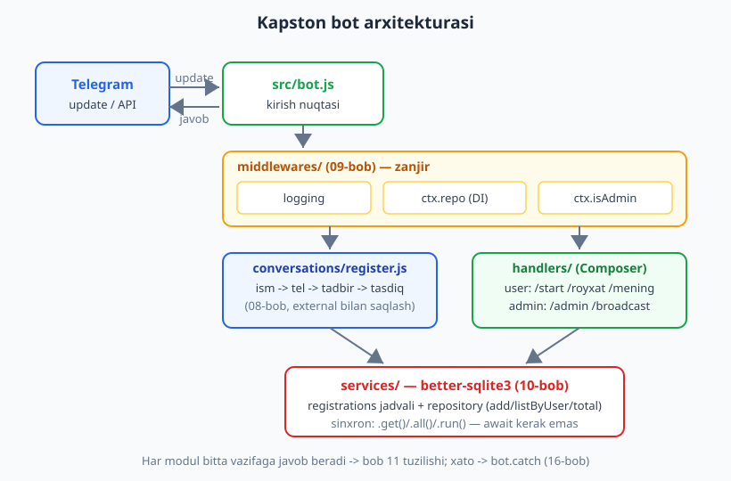
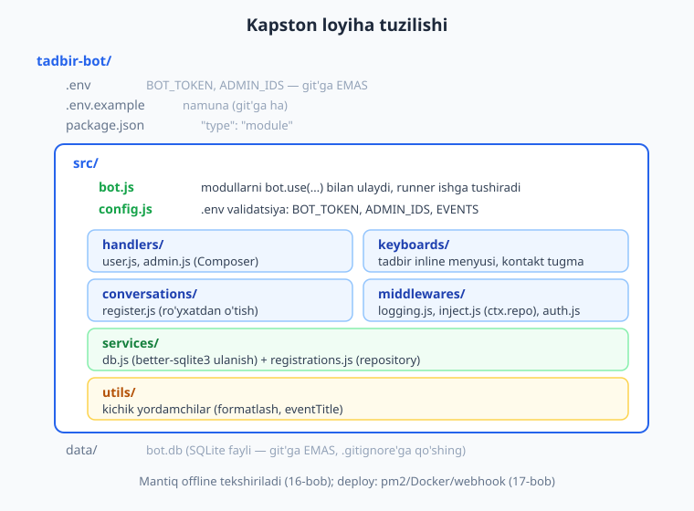
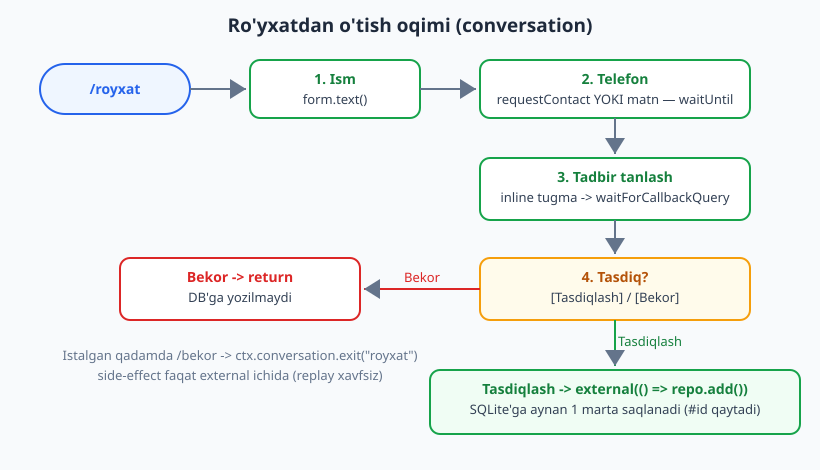

# 18 — Yakuniy kapston: to'liq bot

[⬅️ Oldingi: 17 — Production va deploy](./17-production-deploy.md) · [🏠 README](./README.md) · [Keyingi: 19 — Guruhlarda ishlash ➡️](./19-guruhlar.md)

---

> **Bu bobda:** kitobning I-V qismlarida (01-17) o'rganganlarimizning hammasini **bitta to'liq, ishlaydigan botda** birlashtiramiz — "Tadbirga ro'yxatdan o'tkazuvchi bot". Foydalanuvchi `/royxat` bilan ro'yxatdan o'tadi (ism -> telefon (kontakt yoki matn) -> tadbirni inline tugma bilan tanlash -> tasdiq), arizasi `better-sqlite3` bazasiga saqlanadi; `/mening` bilan o'z arizalarini ko'radi; admin esa `/admin` bilan statistikani va `/broadcast` bilan ro'yxatdan o'tganlarga ommaviy xabarni yuboradi. Yo'l-yo'lakay biz **loyihani modullarga ajratamiz** (11-bob), **conversation forma** quramiz (08-bob), **DB repository** yozamiz (10-bob), **klaviatura va callback** ishlatamiz (06-07), **middleware** (logging + admin tekshirish) ulaymiz (09-bob), **xato chegarasini** o'rnatamiz (16-bob) va deploy variantlarini (13/17-bob) eslaymiz. Bu bob — kitobning birinchi yarmining yakuniy "loyiha"si; har bir bo'lakni qaysi bobda batafsil ko'rganingizga havola beramiz.

> **Halollik eslatmasi:** botning butun **mantig'i** — ro'yxatdan o'tish suhbati (`form.text`/`waitUntil`/`waitForCallbackQuery`/`external`), DB'ga `INSERT` va o'qish (`better-sqlite3`), `/mening` ro'yxat, admin statistika (`COUNT`/`GROUP BY`), `/broadcast` (distinct foydalanuvchilarga `ctx.api.sendMessage`), inline "Bekor" va tashqi `/bekor` (`ctx.conversation.exit`) — **uchma-uch offline ishga tushirib tasdiqlangan**: soxta `Update`'larni `bot.handleUpdate(...)` ga uzatib, chiqayotgan API chaqiruvlarini transformer bilan ushlab, suhbat ichki konteksti uchun transformer'ni `conversations({ plugins: [...] })` orqali ulab. Test DB temp faylda yaratilib, oxirida o'chiriladi. Natija: **9/9 PASS** — bob oxiridagi hisobotda. **Jonli ishlash** — `@BotFather` token bilan polling/webhook orqali xabar yuborish — internet talab qiladi; deploy bo'limidagi `run`/`pm2`/Docker buyruqlari "illustrativ" deb belgilangan.

---

## Nimani quramiz?

Tasavvur qiling, siz konferensiya yoki ustaxona uyushtiryapsiz va odamlarni Telegram orqali ro'yxatga olmoqchisiz. Botimizning vazifalari:

1. **Foydalanuvchi tomoni:**
   - `/start` — tanishtirish va yo'riqnoma.
   - `/royxat` — ko'p qadamli forma: ism -> telefon -> tadbir -> tasdiq. Natija bazaga saqlanadi.
   - `/mening` — foydalanuvchining o'z arizalari ro'yxati.
2. **Admin tomoni** (faqat `.env` dagi `ADMIN_IDS` ro'yxatidagilar):
   - `/admin` — umumiy statistika: nechta ariza, har tadbir bo'yicha taqsimot.
   - `/broadcast <xabar>` — ro'yxatdan o'tgan har bir (takrorlanmas) foydalanuvchiga e'lon.

Bu loyiha kichik, lekin u "haqiqiy" botdir: unda forma, ma'lumotlar bazasi, ruxsat, klaviaturalar va admin-paneli bor — ya'ni amaliy botlarning 80% ana shu ustunlarga tayanadi.



> **Eslatma — nega aynan shu loyiha?** "Ro'yxatdan o'tkazuvchi bot" — eng keng tarqalgan amaliy bot turi (tadbir, kurs, navbat, kichik buyurtma/booking — hammasi shu naqshda). Agar siz buni qurib chiqsangiz, restoran-buyurtma yoki navbat botini ham xuddi shu skelet bilan yozasiz: faqat forma maydonlari va jadval ustunlari o'zgaradi.

---

## Loyiha tuzilishi

11-bobda ko'rgan modul tuzilishimizni shu loyihaga moslaymiz. Har papka bitta vazifaga javob beradi:



```text
tadbir-bot/
  .env                    # BOT_TOKEN, ADMIN_IDS — maxfiy, git'ga EMAS
  .env.example            # namuna (git'ga ha)
  package.json            # "type": "module"
  data/
    bot.db                # SQLite fayli — .gitignore'ga qo'shing
  src/
    config.js             # .env o'qish + validatsiya + EVENTS ro'yxati
    bot.js                # kirish nuqtasi: modullarni ulaydi, runner ishga tushiradi
    services/
      db.js               # better-sqlite3 ulanish + jadval yaratish
      registrations.js    # repository: add / listByUser / total / perEvent / userIds
    middlewares/
      logging.js          # har update'ni yozadi
      inject.js           # ctx.repo va ctx.isAdmin ni o'rnatadi (DI)
    keyboards/
      events.js           # tadbir inline menyusi, kontakt tugma
    conversations/
      register.js         # ro'yxatdan o'tish suhbati
    handlers/
      user.js             # /start /royxat /mening (Composer)
      admin.js            # /admin /broadcast (Composer)
    utils/
      format.js           # eventTitle va matn formatlash
```

> **Eslatma:** quyida har modulni alohida fayl sifatida ko'rsatamiz, lekin **o'qish uchun to'liq** — hech narsa "qisqartirilmaydi". Agar xohlasangiz, hammasini bitta faylga ham yozishingiz mumkin; modullarga ajratish faqat loyiha o'sganda topish va o'zgartirishni osonlashtiradi (11-bobdagi sabablar). Bu bobning offline testi aynan shu kodni bitta faylga yig'ib ishga tushiradi.

---

## 1) Config — `.env` va tadbirlar ro'yxati

Avval markaziy konfiguratsiya. `.env` dan tokenni va admin ID'larni o'qiymiz hamda validatsiya qilamiz (11/17-bobdagi qoida: token yo'q bo'lsa, bot **ishga tushmasin**, jim o'tirib qolmasin).

```js
// src/config.js
import "dotenv/config"; // .env ni process.env ga yuklaydi (npm i dotenv)

const token = process.env.BOT_TOKEN;
if (!token) {
  throw new Error("BOT_TOKEN yo'q! .env faylga BOT_TOKEN=... yozing (02-bob).");
}

// ADMIN_IDS="111,222" -> [111, 222]
const adminIds = (process.env.ADMIN_IDS ?? "")
  .split(",")
  .map((s) => Number(s.trim()))
  .filter((n) => Number.isInteger(n) && n > 0);

// Tadbirlar — bu yerda qattiq kodlangan; xohlasangiz DB'dan ham o'qishingiz mumkin
export const EVENTS = [
  { id: "js", title: "JavaScript intensiv" },
  { id: "py", title: "Python bootcamp" },
  { id: "go", title: "Golang seminari" },
];

export const config = {
  token,
  adminIds,
  dbPath: process.env.DB_PATH ?? "data/bot.db",
};
```

```text
# .env.example
BOT_TOKEN=123456:ABC-DEF...   # @BotFather'dan (02-bob)
ADMIN_IDS=111111111           # vergul bilan ko'p admin: 111,222
DB_PATH=data/bot.db
```

> **Diqqat:** `.env` ni **hech qachon** git'ga qo'shmang (`.gitignore` ga `.env` va `data/` ni yozing). Tokenni kodga yozish — 02-bobda aytganimizdek, eng keng tarqalgan xavfsizlik xatosi. Token sizib ketsa, `@BotFather` da `/revoke` qiling.

---

## 2) Ma'lumotlar bazasi qatlami

10-bobdagi `better-sqlite3` va repository naqshini ishlatamiz. Avval ulanish va jadval:

```js
// src/services/db.js
import Database from "better-sqlite3";
import { config } from "../config.js";

export const db = new Database(config.dbPath);
db.pragma("journal_mode = WAL"); // bir vaqtda o'qish/yozish uchun tezroq

db.exec(`
  CREATE TABLE IF NOT EXISTS registrations (
    id         INTEGER PRIMARY KEY AUTOINCREMENT,
    user_id    INTEGER NOT NULL,
    full_name  TEXT    NOT NULL,
    phone      TEXT    NOT NULL,
    event      TEXT    NOT NULL,
    created_at TEXT    NOT NULL DEFAULT (datetime('now'))
  );
`);
```

Endi **repository** — bazaga kirishni bitta modulga to'playmiz (handler'lar SQL bilan to'g'ridan-to'g'ri ishlamaydi). Bu 10-bobning asosiy g'oyasi: SQL bir joyda, qolgan kod faqat funksiya chaqiradi.

```js
// src/services/registrations.js
import { db } from "./db.js";

// prepared statement'lar — bir marta tayyorlanadi, ko'p marta ishlatiladi
const stmts = {
  insert: db.prepare(
    `INSERT INTO registrations (user_id, full_name, phone, event)
     VALUES (@user_id, @full_name, @phone, @event)`
  ),
  byUser: db.prepare("SELECT * FROM registrations WHERE user_id = ? ORDER BY id"),
  count: db.prepare("SELECT COUNT(*) AS n FROM registrations"),
  countByEvent: db.prepare(
    "SELECT event, COUNT(*) AS n FROM registrations GROUP BY event ORDER BY n DESC, event"
  ),
  distinctUsers: db.prepare("SELECT DISTINCT user_id FROM registrations"),
};

export const registrations = {
  add(reg) {
    // reg = { user_id, full_name, phone, event }
    return stmts.insert.run(reg).lastInsertRowid; // yangi ariza ID'si
  },
  listByUser(userId) {
    return stmts.byUser.all(userId);
  },
  total() {
    return stmts.count.get().n;
  },
  perEvent() {
    return stmts.countByEvent.all(); // [{ event, n }, ...]
  },
  userIds() {
    return stmts.distinctUsers.all().map((r) => r.user_id);
  },
};
```

> **Eslatma — `better-sqlite3` sinxron.** 10-bobda ko'rganimizdek, `.run()`, `.get()`, `.all()` darhol natija qaytaradi — `await` kerak emas. Bu kichik-o'rta botlar uchun ideal: kod sodda, tez. Yuk ko'p bo'lsa yoki PostgreSQL/MySQL kerak bo'lsa, asinxron drayverga o'tasiz — SQL asoslari uchun [../sql/README.md](../sql/README.md). `INSERT ... AUTOINCREMENT` va `GROUP BY` — o'sha kitobdagi tushunchalar.

Kichik yordamchi — tadbir ID'sini chiroyli nomga aylantirish:

```js
// src/utils/format.js
import { EVENTS } from "../config.js";
export const eventTitle = (id) => EVENTS.find((e) => e.id === id)?.title ?? id;
```

---

## 3) Klaviaturalar

06-07-boblardagi quruvchilarni alohida modulga ajratamiz. Tadbirlarni inline tugmalar sifatida ko'rsatamiz (callback `data` = `ev:<id>`), telefon uchun esa `requestContact` tugmasi.

```js
// src/keyboards/events.js
import { InlineKeyboard, Keyboard } from "grammy";
import { EVENTS } from "../config.js";

// Tadbirlar inline menyusi: har tadbir alohida qatorda
export function eventsKeyboard() {
  const kb = new InlineKeyboard();
  for (const e of EVENTS) kb.text(e.title, `ev:${e.id}`).row();
  return kb;
}

// Telefon so'rash: kontakt tugmasi (foydalanuvchi matn ham yozishi mumkin)
export const phoneKeyboard = new Keyboard()
  .requestContact("Raqamni ulashish")
  .resized()
  .oneTime();

// Tasdiq tugmalari
export const confirmKeyboard = new InlineKeyboard()
  .text("Tasdiqlash", "ok")
  .text("Bekor", "cancel");
```

> **Eslatma:** `requestContact(text)` — foydalanuvchi bossa, Telegram uning telefon raqamini `message.contact` ichida yuboradi (06-bob). Lekin ba'zilar tugmani bosmay, raqamni qo'lda yozadi — shuning uchun suhbatda **ikkalasini ham** qabul qilamiz.

---

## 4) Ro'yxatdan o'tish suhbati (conversation)

Botning yuragi — 08-bobdagi `@grammyjs/conversations` v2 bilan yozilgan ko'p qadamli forma. Eslang: suhbat funksiyasi **replay** modelida ishlaydi, shuning uchun har qanday side-effect (DB yozish) **`conversation.external`** ichida bo'lishi shart.



```js
// src/conversations/register.js
import { EVENTS } from "../config.js";
import { eventTitle } from "../utils/format.js";
import { eventsKeyboard, phoneKeyboard, confirmKeyboard } from "../keyboards/events.js";
import { registrations } from "../services/registrations.js";

export async function royxat(conversation, ctx) {
  // --- 1) Ism (oddiy matn, validatsiya bilan) ---
  await ctx.reply("Ro'yxatdan o'tamiz. To'liq ismingizni yozing:");
  const fullName = await conversation.form.text({
    otherwise: (ctx) => ctx.reply("Iltimos, ismingizni matn bilan yuboring."),
  });

  // --- 2) Telefon: kontakt YOKI matn ---
  await ctx.reply("Telefon raqamingizni yuboring (tugma orqali yoki matn):", {
    reply_markup: phoneKeyboard,
  });
  const phoneCtx = await conversation.waitUntil(
    (ctx) => Boolean(ctx.message?.contact || ctx.message?.text),
    { otherwise: (ctx) => ctx.reply("Telefon raqam yoki kontakt yuboring.") }
  );
  const phone = phoneCtx.message.contact?.phone_number ?? phoneCtx.message.text;

  // --- 3) Tadbir tanlash (inline tugma) ---
  await ctx.reply("Qaysi tadbirga yozilasiz?", { reply_markup: eventsKeyboard() });
  const evCtx = await conversation.waitForCallbackQuery(/^ev:(.+)$/, {
    otherwise: (ctx) => ctx.answerCallbackQuery("Tugmalardan birini tanlang."),
  });
  await evCtx.answerCallbackQuery();
  const eventId = evCtx.match[1]; // regexdagi (.+) guruh

  // --- 4) Tasdiq ---
  await ctx.reply(
    `Tekshiring:\nIsm: ${fullName}\nTel: ${phone}\nTadbir: ${eventTitle(eventId)}`,
    { reply_markup: confirmKeyboard }
  );
  const confirm = await conversation.waitForCallbackQuery(["ok", "cancel"]);
  await confirm.answerCallbackQuery();

  if (confirm.match === "cancel") {
    await ctx.reply("Bekor qilindi. Qayta urinish: /royxat", {
      reply_markup: { remove_keyboard: true },
    });
    return; // suhbat tugaydi, DB'ga hech narsa yozilmaydi
  }

  // --- 5) Saqlash: SIDE EFFECT -> external ichida! ---
  const id = await conversation.external(() =>
    registrations.add({
      user_id: ctx.from.id,
      full_name: fullName,
      phone,
      event: eventId,
    })
  );

  await ctx.reply(
    `Rahmat, ${fullName}! Siz "${eventTitle(eventId)}" ga yozildingiz (ariza #${id}).`,
    { reply_markup: { remove_keyboard: true } }
  );
}
```

Bu funksiyani diqqat bilan o'qing — u butun kitobning yarmini bir joyga jamlaydi:

- **`form.text({ otherwise })`** (08-bob) — matn kelguncha kutadi; matn bo'lmasa `otherwise` ogohlantiradi.
- **`waitUntil(predikat, { otherwise })`** (08-bob) — istalgan shartni qondiruvchi update'ni kutish. Bu yerda "kontakt **yoki** matn" mantig'i uchun ishlatamiz — `waitFor("message:text")` faqat matnni olardi, bizga kontakt ham kerak.
- **`waitForCallbackQuery(/regex/ yoki [data])`** (07-08-bob) — inline tugma bosilishini kutadi; regexli variant `ctx.match` ga guruhni beradi.
- **`external(() => registrations.add(...))`** (08-bob, OLTIN QOIDA) — DB yozuvi side-effect, shuning uchun replay'da takrorlanmasligi uchun `external` ichida. Test buni isbotlaydi: 5 ta update kelsa-da, `add` **aynan bir marta** chaqiriladi.
- **`remove_keyboard: true`** (06-bob) — yakunda reply-klaviaturani olib tashlaymiz.

> **Diqqat — `external` dan faqat oddiy qiymat qaytaring.** `registrations.add(...)` `lastInsertRowid` — oddiy son qaytaradi, demak seriyalanadi (08-bobdagi qoida). Agar `add` butun ORM obyektini qaytarsa, uni `external`'dan to'g'ridan-to'g'ri qaytarmang — faqat `id` ni qaytaring.

---

## 5) Foydalanuvchi handlerlari

09-bobdagi `Composer` bilan foydalanuvchi buyruqlarini bitta modulga guruhlaymiz.

```js
// src/handlers/user.js
import { Composer } from "grammy";
import { eventTitle } from "../utils/format.js";

export const userHandlers = new Composer();

userHandlers.command("start", (ctx) =>
  ctx.reply(
    "Salom! Bu — tadbirga ro'yxatdan o'tkazuvchi bot.\n" +
      "/royxat — yozilish\n/mening — arizalaringiz"
  )
);

// Suhbatga kirish nuqtasi (08-bob)
userHandlers.command("royxat", (ctx) => ctx.conversation.enter("royxat"));

userHandlers.command("mening", (ctx) => {
  const rows = ctx.repo.listByUser(ctx.from.id); // ctx.repo — inject middleware'dan
  if (rows.length === 0) {
    return ctx.reply("Sizda hali ariza yo'q. /royxat bilan yoziling.");
  }
  const list = rows
    .map((r) => `#${r.id} — ${eventTitle(r.event)} (${r.phone})`)
    .join("\n");
  return ctx.reply(`Sizning arizalaringiz:\n${list}`);
});
```

> **Eslatma — `ctx.repo` qayerdan keldi?** Biz repository'ni `ctx` ga middleware orqali "in'eksiya" qilamiz (09-bobdagi "ctx ga property qo'shish" + 10-bobdagi `ctx.users` naqshi). Bu handler'larni baza modulidan **bevosita import qilmaslik** imkonini beradi — test va almashtirish osonlashadi. Buni quyida `inject.js` da ko'ramiz.

---

## 6) Admin handlerlari

Admin buyruqlari — statistika va broadcast. Avval **admin-darvozasi** (09-bob): bu Composer ichidagi har bir handler faqat admin uchun ishlaydi.

```js
// src/handlers/admin.js
import { Composer, GrammyError } from "grammy";
import { eventTitle } from "../utils/format.js";

export const adminHandlers = new Composer();

// Darvoza: admin bo'lmasa, jim o'tkazib yuboramiz (next() chaqirmaymiz)
adminHandlers.use(async (ctx, next) => {
  if (ctx.isAdmin) await next();
  // admin bo'lmasa hech narsa qilmaymiz -> /admin oddiy foydalanuvchiga "ko'rinmaydi"
});

adminHandlers.command("admin", (ctx) => {
  const total = ctx.repo.total();
  const per =
    ctx.repo
      .perEvent()
      .map((r) => `${eventTitle(r.event)}: ${r.n}`)
      .join("\n") || "—";
  return ctx.reply(`Statistika\nJami arizalar: ${total}\n${per}`);
});

adminHandlers.command("broadcast", async (ctx) => {
  const text = ctx.match; // "/broadcast" dan keyingi matn (04-bob)
  if (!text) return ctx.reply("Foydalanish: /broadcast <xabar>");

  const ids = ctx.repo.userIds(); // takrorlanmas foydalanuvchilar
  let yuborildi = 0;
  for (const id of ids) {
    try {
      await ctx.api.sendMessage(id, `[E'lon] ${text}`); // chat_id ni o'zimiz beramiz
      yuborildi++;
    } catch (e) {
      // Foydalanuvchi botni bloklagan bo'lishi mumkin -> 403; broadcast davom etsin
      if (!(e instanceof GrammyError)) throw e;
    }
  }
  return ctx.reply(`Yuborildi: ${yuborildi} ta foydalanuvchiga.`);
});
```

Bu yerda bir nechta muhim nuqta bor:

- **`ctx.match`** (04-bob) — `bot.command("broadcast")` da buyruqdan keyingi matnni beradi. `/broadcast Salom hammaga` -> `ctx.match === "Salom hammaga"`.
- **`ctx.api.sendMessage(id, ...)`** (03-bob) — `ctx.reply` joriy chatga yuboradi, lekin broadcast'da boshqa chatlarga yuboramiz, shuning uchun `chat_id` ni o'zimiz beramiz.
- **`try/catch` + `GrammyError`** (16-bob) — foydalanuvchi botni bloklagan bo'lsa, Telegram `403` qaytaradi (`GrammyError`). Biz buni yutib, broadcast'ni davom ettiramiz — bitta bloklagan odam tufayli butun e'lon to'xtamasligi kerak.

> **Anti-eskirish — jiddiy broadcast uchun.** Bu yerdagi oddiy `for` sikli kichik ro'yxatlar uchun yaxshi. Lekin minglab foydalanuvchi bo'lsa, Telegram'ning rate-limit'iga (taxminan soniyasiga ~30 xabar) tushasiz. Production'da **15-bobdagi** `@grammyjs/auto-retry` (xato bo'lganda avtomatik qayta urinish) va `@grammyjs/runner` bilan konkurensiyani, hamda navbat (throttling) g'oyasini ishlating. Bu yerda men plaginlarning aniq sozlamalarini ixtiro qilmayman — 15-bobga va [grammy.dev](https://grammy.dev) hujjatiga qarang.

---

## 7) Middleware'lar: logging va in'eksiya

09-bobdagi ikki middleware: birinchisi har update'ni yozadi, ikkinchisi `ctx.repo` va `ctx.isAdmin` ni o'rnatadi.

```js
// src/middlewares/logging.js
export async function logging(ctx, next) {
  const id = ctx.update.update_id;
  const text = ctx.message?.text ?? ctx.callbackQuery?.data ?? "(boshqa)";
  console.log(`[${id}] ${ctx.from?.first_name ?? "?"}: ${text}`);
  await next(); // bularsiz pastdagi hech narsa ishlamaydi!
}
```

```js
// src/middlewares/inject.js
import { config } from "../config.js";
import { registrations } from "../services/registrations.js";

export async function inject(ctx, next) {
  ctx.repo = registrations; // repository'ni handler'larga uzatamiz
  ctx.isAdmin = ctx.from ? config.adminIds.includes(ctx.from.id) : false;
  await next();
}
```

> **Eslatma — `ctx.role` / `ctx.repo` tiplash.** Sof JS'da `ctx.repo = ...` to'g'ridan-to'g'ri ishlaydi (09-bob). TypeScript ishlatsangiz, buni **context flavor** orqali tiplaysiz (`type MyContext = Context & { repo: typeof registrations; isAdmin: boolean }`). Bu kitob JS'da, shuning uchun oddiy yo'lni tanladik — TS faqat "qo'shimcha foyda".

---

## 8) Hammasini ulash: `bot.js`

Endi kirish nuqtasi — modullarni **to'g'ri tartibda** ulaymiz. Tartib hayotiy muhim (09-bobdagi qoida):

```js
// src/bot.js
import { Bot, GrammyError, HttpError } from "grammy";
import { conversations, createConversation } from "@grammyjs/conversations";
import { run } from "@grammyjs/runner";

import { config } from "./config.js";
import { logging } from "./middlewares/logging.js";
import { inject } from "./middlewares/inject.js";
import { royxat } from "./conversations/register.js";
import { userHandlers } from "./handlers/user.js";
import { adminHandlers } from "./handlers/admin.js";

const bot = new Bot(config.token);

// 1) Umumiy middleware'lar — eng oldinda
bot.use(logging);
bot.use(inject); // ctx.repo, ctx.isAdmin

// 2) conversations dvigateli (createConversation'dan OLDIN)
bot.use(conversations());

// 3) /bekor — conversations'dan KEYIN, createConversation'dan OLDIN (08-bob gotcha'si)
bot.command("bekor", async (ctx) => {
  await ctx.conversation.exit("royxat");
  await ctx.reply("Bekor qilindi.", { reply_markup: { remove_keyboard: true } });
});

// 4) Suhbatni ro'yxatdan o'tkazamiz (nomini aniq beramiz)
bot.use(createConversation(royxat, "royxat"));

// 5) Handler modullari (Composer'lar)
bot.use(userHandlers);
bot.use(adminHandlers);

// 6) Global xato tuzog'i (16-bob)
bot.catch((err) => {
  const e = err.error;
  if (e instanceof GrammyError) console.error("Telegram xato:", e.description);
  else if (e instanceof HttpError) console.error("Tarmoq xato:", e);
  else console.error("Noma'lum xato:", e);
});

// 7) Ishga tushirish (runner bilan konkurensiya — 15/17-bob)
run(bot);
console.log("Bot ishga tushdi.");
```

> **Diqqat — tartib qoidalarini eslang (09-bob):**
> - `logging`/`inject` eng oldinda — ular barcha update'larga tegishli.
> - `conversations()` `createConversation()` dan **oldin** — aks holda `ctx.conversation` undefined bo'ladi.
> - `/bekor` `conversations()` dan **keyin**, `createConversation()` dan **oldin** — shunda faol suhbat `/bekor` matnini "yutib" yubormaydi (08-bobdagi nozik gotcha).
> - Admin darvozasi faqat `adminHandlers` Composer ichida ishlaydi — butun botni yopmaydi.

> **Illustrativ:** `run(bot)` (yoki `bot.start()`) jonli polling boshlaydi — token + internet kerak. Botning butun **mantig'i** offline tasdiqlangan (bob oxiridagi hisobot), lekin Telegram bilan haqiqiy almashinuv tokenni talab qiladi.

---

## 9) Botni offline tekshirish

Endi eng muhim qism — **kapston botning asosiy oqimini uchma-uch offline tekshiramiz**, xuddi 09-10-16-boblardagi naqsh bilan: soxta `Update`'larni `bot.handleUpdate(...)` ga uzatib, chiqayotgan API chaqiruvlarini transformer bilan ushlab. conversations ichidagi kontekstga transformer'ni `plugins` orqali ulaymiz (replay engine ichki `Api` quradi — 08-bob).

Quyida bitta faylga yig'ilgan test skeleti (yuqoridagi modullar bitta faylda):

```js
// _verify_18.mjs (qisqartirilgan skelet — to'liq versiya probe muhitida ishga tushirilgan)
import { Bot, InlineKeyboard, Keyboard, Composer, GrammyError } from "grammy";
import { conversations, createConversation } from "@grammyjs/conversations";
import Database from "better-sqlite3";
import assert from "node:assert/strict";

function offlineTransformer(calls) {
  return (prev, method, payload) => {
    calls.push({ method, payload });
    if (method === "sendMessage")
      return Promise.resolve({ ok: true, result: { message_id: 1, date: 0,
        chat: { id: payload.chat_id, type: "private" }, text: payload.text } });
    return Promise.resolve({ ok: true, result: true });
  };
}

function buildBot(repo, calls) {
  const bot = new Bot("12345:FAKE-OFFLINE");
  bot.botInfo = { id: 12345, is_bot: true, first_name: "EventBot", username: "event_bot",
    can_join_groups: true, can_read_all_group_messages: false,
    supports_inline_queries: false, can_connect_to_business: false, has_main_web_app: false };
  const tr = offlineTransformer(calls);
  bot.api.config.use(tr);
  const installOffline = (ctx, next) => { ctx.api.config.use(tr); return next(); };

  bot.use(async (ctx, next) => { ctx.repo = repo; await next(); });
  bot.use(async (ctx, next) => { ctx.isAdmin = ctx.from?.id === 999; await next(); });
  // MUHIM: conversations ichki ctx'siga ham transformer (plugins orqali)
  bot.use(conversations({ plugins: [installOffline] }));
  bot.command("bekor", async (ctx) => {
    await ctx.conversation.exit("royxat");
    await ctx.reply("Bekor qilindi.", { reply_markup: { remove_keyboard: true } });
  });
  bot.use(createConversation(buildRegisterConversation(repo), "royxat"));
  // ... user + admin Composer'lar (yuqoridagidek) ...
  return bot;
}

// To'liq oqim: ism -> kontakt -> tadbir -> tasdiq -> DB
const calls = [];
const bot = buildBot(repo, calls);
await bot.handleUpdate(mkText("/royxat", 777));
await bot.handleUpdate(mkText("Oqil Imomnazarov", 777));
await bot.handleUpdate(mkContact("+998901112233", 777));
await bot.handleUpdate(mkCb("ev:py", 777));
await bot.handleUpdate(mkCb("ok", 777));
assert.equal(repo.listByUser(777).length, 1);          // DB'da aynan 1 ariza
assert.equal(repo.listByUser(777)[0].event, "py");     // to'g'ri tadbir
```

Soxta update yasovchilarni eslaylik (09-10-bobdan): **buyruq** update'iga `entities:[{type:"bot_command",...}]` shart, callback uchun `callback_query.data`, kontakt uchun `message.contact`:

```js
function mkText(text, fromId = 777) {
  const m = { message_id: 1, date: 0, text, chat: { id: fromId, type: "private" },
    from: { id: fromId, is_bot: false, first_name: "Ali" } };
  if (text.startsWith("/"))
    m.entities = [{ type: "bot_command", offset: 0, length: text.split(/\s/)[0].length }];
  return { update_id: Math.floor(Math.random() * 1e9), message: m };
}
function mkContact(phone, fromId = 777) {
  return { update_id: Math.floor(Math.random() * 1e9), message: { message_id: 1, date: 0,
    chat: { id: fromId, type: "private" }, from: { id: fromId, is_bot: false, first_name: "Ali" },
    contact: { phone_number: phone, first_name: "Ali", user_id: fromId } } };
}
function mkCb(data, fromId = 777) {
  return { update_id: Math.floor(Math.random() * 1e9), callback_query: { id: "c1",
    from: { id: fromId, is_bot: false, first_name: "Ali" }, chat_instance: "ci", data,
    message: { message_id: 1, date: 0, chat: { id: fromId, type: "private" } } } };
}
```

Bobning oxirida bu testlarning to'liq ro'yxati va natijasi (**9/9 PASS**) keltirilgan.

---

## 10) Deploy eslatmasi

Kapston tayyor bo'lgach, uni serverga chiqarish kerak (13/17-boblarni qisqacha eslaymiz):

**Variant 1 — polling + pm2 (eng oddiy).** VPS oling, kodni `git clone` qiling, `npm ci`, `.env` ni to'ldiring va:

```bash
npm i -g pm2
pm2 start src/bot.js --name tadbir-bot
pm2 save && pm2 startup   # qayta yuklanganda avtomatik ishga tushadi
```

**Variant 2 — Docker.** `Dockerfile` bilan tasvir yig'ib, har joyda bir xil ishga tushirasiz:

```text
FROM node:24-slim
WORKDIR /app
COPY package*.json ./
RUN npm ci --omit=dev
COPY . .
CMD ["node", "src/bot.js"]
```

> **Diqqat — `better-sqlite3` va Docker.** `better-sqlite3` nativ modul (C++ bilan kompilatsiya qilinadi). Docker'da `npm ci` paytida u qayta kompilyatsiya bo'lishi uchun `python3`/`make`/`g++` (build-essential) kerak bo'lishi mumkin. `node:24-slim` da ular yo'q — yo `apt-get install -y build-essential python3` qo'shing, yoki to'liq `node:24` image'idan foydalaning. Bu — men ko'p duch kelgan deploy tuzog'i.

**Variant 3 — webhook (server bilan).** Botingiz allaqachon HTTP server ishlatsa (masalan Mini App backend — 25-bob), polling o'rniga webhook qulayroq:

```js
import { webhookCallback } from "grammy";
// app — Express/Hono ilovasi (13-bob)
app.use(webhookCallback(bot, "express"));
// bot.api.setWebhook("https://domeningiz.uz/bot");
```

> **Anti-eskirish:** SQLite fayli (`data/bot.db`) **doimiy disk**ka yozilishi kerak. Ko'p PaaS (Heroku, ba'zi konteyner platformalari) "ephemeral" fayl tizimiga ega — qayta deploy'da fayl yo'qoladi. VPS yoki doimiy volume ishlating, yoki PostgreSQL'ga o'ting. Polling vs webhook tanlash, graceful shutdown va sirlarni boshqarish — **17-bobda** to'liq.

---

## Bob bo'yicha qisqacha xulosa

Biz butun kitobning birinchi yarmini bitta loyihada birlashtirdik:

| Bo'lak | Modul | Bob |
|---|---|---|
| Loyiha tuzilishi, config | `config.js`, papka daraxti | [11](./11-loyiha-tuzilishi.md) |
| Conversation forma | `conversations/register.js` | [08](./08-conversations.md) |
| DB + repository | `services/db.js`, `registrations.js` | [10](./10-sessiya-malumotlar-bazasi.md) · [SQL](../sql/README.md) |
| Klaviatura + callback | `keyboards/events.js`, `waitForCallbackQuery` | [06](./06-klaviaturalar.md) · [07](./07-callback-inline.md) |
| Middleware (logging, inject) | `middlewares/` | [09](./09-middleware.md) |
| Admin + broadcast | `handlers/admin.js` | [04](./04-filtrlar-buyruqlar.md) · [15](./15-rejalashtirilgan-broadcast.md) |
| Xato boshqaruvi | `bot.catch`, `try/catch` | [16](./16-testlash-xatolar.md) |
| Deploy | pm2/Docker/webhook | [13](./13-webhook.md) · [17](./17-production-deploy.md) |

Python'da xuddi shu botni aiogram bilan yozsangiz, FSM (`StatesGroup`) + SQLAlchemy/sqlite3 + `Router` ishlatardingiz — taqqoslash uchun [../tgbot-python/README.md](../tgbot-python/README.md) ga qarang. grammY yondashuvi (conversation = bitta uzluksiz funksiya) ko'pincha o'qish uchun qulayroq, lekin `external` qoidasini unutmaslik kerak.

---

## Mashqlar

> Quyidagi mashqlarning ko'pi **offline tekshiriladi** — kapston botni qurib, soxta `Update`'larni `bot.handleUpdate(...)` ga uzatib, transformer (`bot.api.config.use(...)`) bilan chiqqan chaqiruvlarni yoki DB holatini `assert` qiling. Suhbat testida transformer'ni `conversations({ plugins: [installOffline] })` orqali ham ulang. Buyruq update'iga `entities:[{type:"bot_command",...}]` qo'shishni unutmang. Mashqlar — **botni kengaytirish** turida: mavjud kapstonga yangi imkoniyat qo'shasiz.

### Oson

1. **`/help` buyrug'i.** `userHandlers` ga `/help` qo'shing: u barcha buyruqlar ro'yxatini chiqarsin. Offline: `/help` uzatib, javobda `"/royxat"` borligini tasdiqlang.
2. **Tadbir qo'shish.** `config.js` dagi `EVENTS` ga to'rtinchi tadbir (`{ id: "rs", title: "Rust ustaxonasi" }`) qo'shing. `eventsKeyboard()` uni avtomatik ko'rsatishini va `eventTitle("rs")` to'g'ri nomni qaytarishini tekshiring.
3. **Salomlashuvni boyitish.** `/start` da foydalanuvchining ismini ishlating: `Salom, {ctx.from.first_name}!`. Offline: `/start` uzatib, javobda ism borligini tasdiqlang.
4. **Bo'sh ism tekshiruvi.** `form.text` `otherwise` xabarini "Ism kamida 2 harf bo'lsin" ga o'zgartiring va `conversation.form.text` o'rniga shartli kutish bilan (`waitUntil` orqali matn uzunligini tekshirib) qayta yozing. Offline: bir harfli "A" rad etilsin, "Oqil" qabul qilinsin.

### O'rta

5. **Arizani bekor qilish (o'chirish).** `registrations` repository'ga `remove(id, userId)` qo'shing (`DELETE FROM registrations WHERE id=? AND user_id=?`). `userHandlers` ga `/ochirish <id>` buyrug'i qo'shing (`ctx.match` dan id). Offline: ariza yarating, `/ochirish 1` uzating, `listByUser` bo'sh ekanini tasdiqlang. (Faqat o'z arizasini o'chira olishini ham tekshiring.)
6. **Tadbir limiti.** Har tadbirga maksimal 2 ta odam yozilsin. `register.js` da `external` ichida limit tekshiruvi qo'shing: tadbir to'lgan bo'lsa, "Bu tadbir to'ldi" deb suhbatni `return` bilan tugating. Offline: bitta tadbirga 2 ta ariza yarating, 3-chisi rad etilishini tasdiqlang.
7. **Admin: oxirgi arizalar.** `adminHandlers` ga `/oxirgi` qo'shing: oxirgi 5 ta arizani ko'rsatsin (`SELECT ... ORDER BY id DESC LIMIT 5`). Offline: admin uchun ishlashini, oddiy foydalanuvchiga javob bermasligini tasdiqlang.
8. **`/mening` da bekor tugmasi.** `/mening` ro'yxatidagi har bir arizaga inline "Bekor qilish" tugmasi (`del:<id>`) qo'shing va `bot.callbackQuery(/^del:(\d+)$/, ...)` bilan o'chiring (07-bob). Offline: ariza yarating, `del:1` callback uzating, o'chganini tasdiqlang.

### Qiyin

9. **To'liq oqim regressiya testi.** Bobdagi `royxat` suhbatini to'liq qurib, ketma-ketlikni offline o'tkazing: `/royxat -> "Oqil" -> kontakt -> ev:py -> ok`. So'ng `repo.listByUser` aynan 1 yozuv ekanini, `event === "py"`, `phone` to'g'ri ekanini va `external` (DB yozuvi) **aynan bir marta** ishlaganini (`add`'ni o'rab sanab) assert qiling.
10. **Ikki tilli interfeys.** Foydalanuvchi tilini sessiyada (10-bob) saqlang: `/til` -> Uzbekcha/Inglizcha tanlash. Suhbat va handler matnlari tanlangan tilga qarab chiqsin (oddiy `{ uz, en }` lug'at bilan). Offline: tilni `en` ga o'rnatib, `/start` inglizcha javob berishini tasdiqlang.
11. **Admin darvozasi + errorBoundary.** Admin Composer'ni `bot.errorBoundary(...)` ichiga oling (09-bob): admin handleri xato bersa, bot qolgan qismida ishlashda davom etsin. Offline: `/admin` ataylab `throw` qilsin, xato chegarada ushlanib, keyingi oddiy `/start` hamon ishlashini tasdiqlang.
12. **Tasdiqdan keyin tahrirlash.** Tasdiq xabaridagi inline klaviaturani bosilgandan keyin `editMessageReplyMarkup` bilan olib tashlang (07-bob) — foydalanuvchi qayta bosa olmasin. Offline: `ok` callback'dan keyin `editMessageReplyMarkup` (yoki `editMessageText`) chaqirilganini transformer orqali tasdiqlang.
13. **Davomatni belgilash.** `registrations` ga `attended INTEGER DEFAULT 0` ustuni qo'shing. Admin `/keldi <ariza_id>` bilan kelganni belgilasin. `/admin` statistikasiga "kelganlar: N" qatorini qo'shing. Offline: ariza yarating, `/keldi 1` (admin), statistikada `kelganlar: 1` chiqishini tasdiqlang.

<details markdown="1">
<summary>Yechimlar</summary>

> Quyidagi yechimlar bob oxiridagi `_verify_18.mjs` naqshi bilan offline ishga tushiriladi: `buildBot(repo, calls)` (transformer + `botInfo` + `conversations({ plugins })`), `mkText`/`mkContact`/`mkCb`, va temp DB. Qisqartirish uchun shu yordamchilar takrorlanmaydi — faqat o'zgartirilgan/qo'shilgan qism ko'rsatiladi.

### 1-mashq yechimi

```js
userHandlers.command("help", (ctx) =>
  ctx.reply("Buyruqlar:\n/royxat — yozilish\n/mening — arizalar\n/help — yordam")
);
// Offline: await bot.handleUpdate(mkText("/help", 777));
// assert.ok(sentTexts(calls)[0].includes("/royxat"));
```

`Composer` ga yangi `command` qo'shish — qolgan kodga tegmaymiz. Bu modullashning kuchi.

### 2-mashq yechimi

```js
// config.js
export const EVENTS = [
  { id: "js", title: "JavaScript intensiv" },
  { id: "py", title: "Python bootcamp" },
  { id: "go", title: "Golang seminari" },
  { id: "rs", title: "Rust ustaxonasi" }, // yangi
];
// eventsKeyboard() EVENTS bo'yicha aylanadi -> avtomatik ko'rsatadi
assert.equal(eventTitle("rs"), "Rust ustaxonasi");
```

`eventsKeyboard()` va `eventTitle` `EVENTS` ga tayanadi, shuning uchun yangi tadbir hech qanday boshqa o'zgarishsiz paydo bo'ladi — bu "data-driven" dizaynning afzalligi.

### 3-mashq yechimi

```js
userHandlers.command("start", (ctx) =>
  ctx.reply(`Salom, ${ctx.from.first_name}! /royxat bilan tadbirga yoziling.`)
);
// Offline: mkText("/start") da from.first_name = "Ali" -> "Salom, Ali!"
const c = calls.find((x) => x.method === "sendMessage");
assert.ok(c.payload.text.includes("Salom, Ali!"));
```

`ctx.from.first_name` — Telegram'dan kelgan ism (03-bob). Buyruq update'imizda `from.first_name = "Ali"`.

### 4-mashq yechimi

```js
await ctx.reply("To'liq ismingizni yozing:");
const nameCtx = await conversation.waitUntil(
  (ctx) => (ctx.message?.text?.trim().length ?? 0) >= 2,
  { otherwise: (ctx) => ctx.reply("Ism kamida 2 harf bo'lsin.") }
);
const fullName = nameCtx.message.text.trim();
// Offline: "A" -> otherwise; "Oqil" -> qabul
```

`waitUntil` istalgan shartni tekshiradi; shart yolg'on bo'lsa `otherwise` chaqirilib, maydon yana kutadi (xuddi `form.text`'ning `otherwise`'i kabi, lekin shart bizniki).

### 5-mashq yechimi

```js
// registrations.js
remove: db.prepare("DELETE FROM registrations WHERE id = ? AND user_id = ?"),
// repository obyektiga:
remove(id, userId) { return stmts.remove.run(id, userId).changes; },

// user.js
userHandlers.command("ochirish", (ctx) => {
  const id = Number(ctx.match);
  if (!Number.isInteger(id)) return ctx.reply("Foydalanish: /ochirish <id>");
  const n = ctx.repo.remove(id, ctx.from.id); // faqat O'Z arizasi
  return ctx.reply(n ? `Ariza #${id} o'chirildi.` : "Bunday ariza topilmadi.");
});
// Offline: ariza yarat -> /ochirish 1 -> listByUser bo'sh
```

`WHERE ... AND user_id = ?` boshqa odamning arizasini o'chirishdan himoya qiladi — `changes` 0 qaytadi, "topilmadi" deymiz. Bu — xavfsizlikning oddiy, lekin muhim qoidasi.

### 6-mashq yechimi

```js
// register.js — tasdiqdan keyin, saqlashdan oldin
const result = await conversation.external(() => {
  const band = registrations.perEvent().find((r) => r.event === eventId)?.n ?? 0;
  if (band >= 2) return { full: true };
  const id = registrations.add({ user_id: ctx.from.id, full_name: fullName, phone, event: eventId });
  return { full: false, id };
});
if (result.full) { await ctx.reply("Afsus, bu tadbir to'ldi."); return; }
await ctx.reply(`Yozildingiz (ariza #${result.id}).`);
// Offline: bitta tadbirga 2 ariza yarat, 3-chisi "to'ldi" olsin
```

Limit tekshiruvi va `add` **bitta** `external` ichida — shunda ikkalasi ham replay'da takrorlanmaydi va "tekshir-keyin-yoz" atomar bo'ladi. `external` faqat oddiy obyekt (`{ full, id }`) qaytaradi — seriyalanadi.

### 7-mashq yechimi

```js
// registrations.js
recent: db.prepare("SELECT * FROM registrations ORDER BY id DESC LIMIT 5"),
recent() { return stmts.recent.all(); },

// admin.js
adminHandlers.command("oxirgi", (ctx) => {
  const rows = ctx.repo.recent();
  if (!rows.length) return ctx.reply("Arizalar yo'q.");
  return ctx.reply(rows.map((r) => `#${r.id} ${r.full_name} — ${eventTitle(r.event)}`).join("\n"));
});
// Offline: admin (999) ko'radi; oddiy (777) javob olmaydi (darvoza)
```

Admin darvozasi (`adminHandlers.use(...)`) tufayli oddiy foydalanuvchiga `/oxirgi` umuman javob bermaydi.

### 8-mashq yechimi

```js
// user.js — har arizaga inline tugma
userHandlers.command("mening", (ctx) => {
  const rows = ctx.repo.listByUser(ctx.from.id);
  if (!rows.length) return ctx.reply("Ariza yo'q.");
  for (const r of rows) {
    ctx.reply(`#${r.id} — ${eventTitle(r.event)}`, {
      reply_markup: new InlineKeyboard().text("Bekor qilish", `del:${r.id}`),
    });
  }
});
userHandlers.callbackQuery(/^del:(\d+)$/, async (ctx) => {
  const id = Number(ctx.match[1]);
  ctx.repo.remove(id, ctx.from.id);
  await ctx.answerCallbackQuery("O'chirildi");
  await ctx.editMessageText(`#${id} — bekor qilindi`);
});
// Offline: ariza yarat -> mkCb("del:1") -> remove chaqirildi
```

`bot.callbackQuery(/regex/)` (07-bob) `ctx.match` orqali id'ni beradi; `answerCallbackQuery` "soatcha"ni to'xtatadi, `editMessageText` xabarni yangilaydi.

### 9-mashq yechimi

```js
let addCount = 0;
const orig = repo.add.bind(repo);
repo.add = (reg) => { addCount++; return orig(reg); }; // external sanog'i
const calls = [];
const bot = buildBot(repo, calls);

await bot.handleUpdate(mkText("/royxat", 777));
await bot.handleUpdate(mkText("Oqil", 777));
await bot.handleUpdate(mkContact("+998901112233", 777));
await bot.handleUpdate(mkCb("ev:py", 777));
await bot.handleUpdate(mkCb("ok", 777));

const rows = repo.listByUser(777);
assert.equal(rows.length, 1);
assert.equal(rows[0].event, "py");
assert.equal(rows[0].phone, "+998901112233");
assert.equal(addCount, 1); // external -> replay'da takrorlanmadi
```

Bu — bobning markaziy testi (`_verify_18.mjs` dagi t1+t8). 5 ta update kelsa-da, suhbat funksiyasi ko'p marta replay qilinadi, lekin `repo.add` `external` ichida bo'lgani uchun **aynan bir marta** ishlaydi.

### 10-mashq yechimi

```js
// inject'dan keyin session (10-bob)
bot.use(session({ initial: () => ({ lang: "uz" }) }));
const T = {
  uz: { hi: "Salom!", reg: "Ro'yxatdan o'tish" },
  en: { hi: "Hello!", reg: "Registration" },
};
userHandlers.command("til", async (ctx) => {
  await ctx.reply("Til / Language:", {
    reply_markup: new InlineKeyboard().text("Uzbekcha", "lang:uz").text("English", "lang:en"),
  });
});
userHandlers.callbackQuery(/^lang:(uz|en)$/, async (ctx) => {
  ctx.session.lang = ctx.match[1];
  await ctx.answerCallbackQuery();
  await ctx.reply(T[ctx.session.lang].hi);
});
userHandlers.command("start", (ctx) => ctx.reply(T[ctx.session.lang].hi));
// Offline: lang:en callback -> /start -> "Hello!"
```

Til sessiyada saqlanadi (kalit = chat). `session()` ni `conversations()`'dan oldin ulang. Suhbat ichida tilni o'qish kerak bo'lsa — `external`/session flavor orqali (10-bob).

### 11-mashq yechimi

```js
const himoyalangan = bot.errorBoundary((err) => {
  console.error("Admin moduli xato:", err.error.message); // next() YO'Q -> yutiladi
});
himoyalangan.use(adminHandlers); // admin handlerlari chegara ichida

// Offline:
adminHandlers.command("admin", () => { throw new Error("portladi"); });
await bot.handleUpdate(mkText("/admin", 999)); // chegarada ushlanadi, yuqoriga chiqmaydi
await bot.handleUpdate(mkText("/start", 777));  // hamon ishlaydi
assert.ok(sentTexts(calls).some((t) => t.includes("Salom")));
```

`errorBoundary` admin moduliga "qalqon" qo'yadi: u portlasa ham, qolgan bot (`/start`) ishlashda davom etadi (09-bob). `handleUpdate` bilan testda chegara ichidagi xato yuqoriga otilmaydi (chunki `next()` chaqirilmadi).

### 12-mashq yechimi

```js
// register.js — tasdiqdan keyin (ok shoxida), saqlashdan keyin
await confirm.answerCallbackQuery();
await confirm.editMessageReplyMarkup({ reply_markup: undefined }); // tugmalarni olib tashlash
if (confirm.match === "cancel") { /* ... */ }
// ...
const id = await conversation.external(() => registrations.add({...}));

// Offline: ok callback'dan keyin transformer'da editMessageReplyMarkup borligini tekshir
assert.ok(calls.some((c) => c.method === "editMessageReplyMarkup"));
```

`editMessageReplyMarkup` (yoki `editMessageText`) tugmalarni olib tashlaydi — foydalanuvchi tasdiqdan keyin qayta bosa olmaydi. `reply_markup: undefined` markupni butunlay yo'qotadi.

### 13-mashq yechimi

```js
// db.js migratsiyasi (mavjud jadvalga ustun)
db.exec("ALTER TABLE registrations ADD COLUMN attended INTEGER NOT NULL DEFAULT 0");
// (faqat ustun yo'q bo'lsa; PRAGMA table_info bilan tekshirib qo'shing)

// registrations.js
markAttended: db.prepare("UPDATE registrations SET attended = 1 WHERE id = ?"),
attendedCount: db.prepare("SELECT COUNT(*) AS n FROM registrations WHERE attended = 1"),
markAttended(id) { return stmts.markAttended.run(id).changes; },
attendedCount() { return stmts.attendedCount.get().n; },

// admin.js
adminHandlers.command("keldi", (ctx) => {
  const id = Number(ctx.match);
  const n = ctx.repo.markAttended(id);
  return ctx.reply(n ? `#${id} keldi deb belgilandi.` : "Topilmadi.");
});
// /admin ga qo'shing: `kelganlar: ${ctx.repo.attendedCount()}`
// Offline: ariza yarat -> /keldi 1 (999) -> /admin'da "kelganlar: 1"
```

`ALTER TABLE` bilan mavjud bazaga ustun qo'shamiz (migratsiya — SQL kitobida). Production'da migratsiyalarni alohida fayllarda boshqaring; bu yerda soddalashtirdik.

</details>

---

> **Yo'l yakuni va keyingi qadam.** Tabriklaymiz — siz kitobning I-V qismlarini (asoslar, muloqot, arxitektura, ilg'or, sifat/deploy) **bitta ishlaydigan botda** birlashtirdingiz! Bu skelet bilan siz endi haqiqiy botlar yozishingiz mumkin: kurs/navbat/buyurtma — barchasi shu naqshda. Lekin yo'l hali tugamadi: **VI qism** botingizni **guruh va kanallarga**, so'ng **Mini App** dunyosiga olib chiqadi. [19-bobda](./19-guruhlar.md) botni guruhlarda ishlatishni — privacy mode, `getChatMember` bilan a'zo/admin tekshirish, `my_chat_member` — o'rganamiz; keyin moderatsiya, majburiy obuna, Telegram Web App (Mini App) va Hamster uslubidagi clicker o'yin kapstoniga (26-bob) o'tamiz. Python ekvivalenti uchun aiogram kapstoni — [../tgbot-python/README.md](../tgbot-python/README.md).

---

## Offline tekshirish hisoboti

Bobdagi kapston botning butun mantig'i `_verify_18.mjs` da uchma-uch ishga tushirildi (grammY 1.43.0, @grammyjs/conversations 2.1.1, better-sqlite3 12.10.0, Node v24, ESM). Soxta `Update`'lar `bot.handleUpdate(...)` ga uzatildi, chiqayotgan API chaqiruvlari transformer bilan ushlandi, conversations ichki konteksti uchun transformer `plugins` orqali ulandi, DB temp faylda yaratilib oxirida o'chirildi.

```text
  PASS: To'liq oqim (kontakt): conversation -> DB INSERT -> tasdiq (1 ariza)
  PASS: Matn telefon + /mening: ikki ariza ro'yxatda ko'rsatildi
  PASS: Inline 'Bekor': ariza DB'ga yozilmadi
  PASS: Tashqi /bekor: faol suhbatni to'xtatadi (ctx.conversation.exit)
  PASS: Admin statistika: faqat admin ko'radi, hisob to'g'ri (3 = 2js+1py)
  PASS: Admin broadcast: distinct foydalanuvchilarga yuborildi (2 ta)
  PASS: Broadcast bo'sh matn: foydalanish ko'rsatmasi
  PASS: external: replay bo'lsa-da repo.add aynan 1 marta chaqirildi
  PASS: /mening bo'sh: 'hali ariza yo'q' xabari

HAMMASI O'TDI: 9/9
Test DB tozalandi: true
```

Tasdiqlangan xulosalar: (1) to'liq ro'yxatdan o'tish oqimi (ism -> kontakt/matn telefon -> tadbir tanlash -> tasdiq) bazaga aynan bir ariza yozadi; (2) `external` replay'da takrorlanmaydi — `repo.add` aynan bir marta chaqiriladi; (3) inline "Bekor" va tashqi `/bekor` suhbatni to'xtatadi va DB'ga yozmaydi; (4) `/mening` foydalanuvchining arizalarini to'g'ri ko'rsatadi; (5) admin darvozasi ishlaydi — oddiy foydalanuvchiga `/admin`/`/broadcast` javob bermaydi; (6) broadcast takrorlanmas (distinct) foydalanuvchilarga yuboriladi. **Jonli ishlash** (token bilan polling/webhook, haqiqiy Telegram'ga xabar) — internet talab qiladi; `run()`/pm2/Docker/webhook buyruqlari illustrativ.

---

[⬅️ Oldingi: 17 — Production va deploy](./17-production-deploy.md) · [🏠 README](./README.md) · [Keyingi: 19 — Guruhlarda ishlash ➡️](./19-guruhlar.md)
