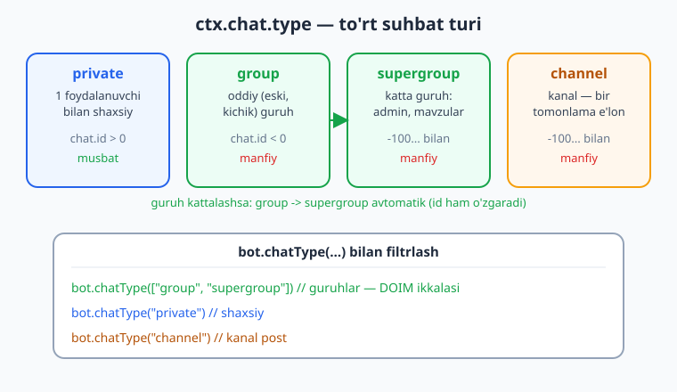
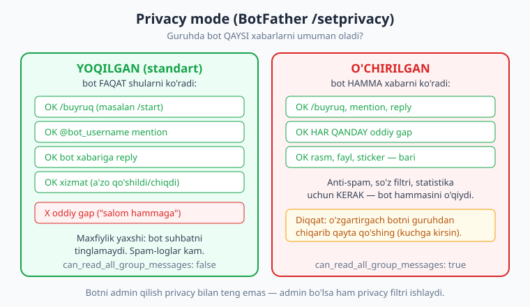
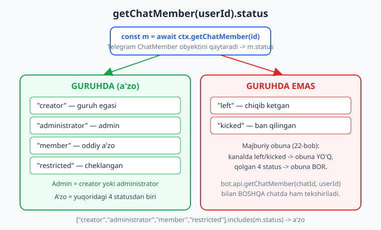

# 19 — Guruhlarda ishlash

[⬅️ Oldingi: 18 — Yakuniy kapston: to'liq bot](./18-kapston.md) · [🏠 README](./README.md) · [Keyingi: 20 — Guruh moderatsiyasi ➡️](./20-guruh-moderatsiya.md)

---

> **Bu bobda:** kitobning **VI qismi — real amaliyot** boshlanadi. Shu paytgacha botimiz deyarli har doim **shaxsiy** (`private`) suhbatda ishladi. Endi uni **guruhga** olib chiqamiz. O'rganamiz: Telegram suhbat turlari — `private`, `group`, `supergroup`, `channel` — va nega guruh filtri **doim** `group` bilan `supergroup` ni birga qamrashi kerak; botni guruhga qanday qo'shish; **privacy mode** (maxfiylik rejimi) — bot guruhda qaysi xabarlarni umuman *ko'radi* va uni `@BotFather` `/setprivacy` orqali yoqish/o'chirish, hamda nega bu eng ko'p "botim guruhda javob bermayapti" muammosining sababi; `bot.chatType(...)` filtri bilan handlerni faqat guruhga (yoki faqat shaxsiyga) yo'naltirish; `ctx.getChatMember(userId)` orqali foydalanuvchining `.status` ini olib **a'zo/admin** ekanini tekshirish (`getChatAdministrators` bilan butun admin ro'yxatini olish); `my_chat_member` bilan botning **o'z statusi** o'zgarganini (guruhga qo'shildi, admin bo'ldi, chiqarildi) ushlash va uni `chat_member` (har qanday a'zo statusi) dan farqlash; `new_chat_members`/`left_chat_member` xizmat xabarlari; va guruhda aynan **kim** yozganini (`ctx.from`) hamda **qaysi** guruhda (`ctx.chat`) ekanini ajratish. Moderatsiyaning o'zi — ban, mute, restrict — keyingi [20-bobda](./20-guruh-moderatsiya.md).
>
> **Halollik eslatmasi:** bu bobdagi handler routing (`bot.chatType` filtri guruh/shaxsiyni to'g'ri ajratishi), a'zolik/admin tekshiruvi (`getChatMember` ning `.status` ini o'qib qaror qabul qilish), `getChatAdministrators` ro'yxati, `my_chat_member` o'tishlari (qo'shildi/admin bo'ldi/chiqarildi), `new_chat_members`/`left_chat_member`, hamda `ctx.from` vs `ctx.chat` — bularning hammasi **offline, tokensiz** ishga tushirilib tasdiqlandi: soxta `Update`'larni `bot.handleUpdate(...)` ga uzatib, chiqayotgan API chaqiruvlarini transformer (`bot.api.config.use(...)`) bilan ushlab. Transformer `getChatMember` so'roviga test uchun tayyorlangan `ChatMember` obyektini ("status" + "user") qaytaradi — Telegram serveri haqiqatan shu shaklda javob beradi. Natija: bob oxiridagi hisobotda **10/10 PASS**. **Jonli qism** — botni real guruhga qo'shish, real a'zo statusini Telegram serveridan olish, haqiqiy `my_chat_member` event'lari va privacy rejimini guruhda his qilish — `@BotFather` tokeni va internet talab qiladi; bunday joylar "illustrativ" deb halol belgilangan.

---

## 1) Nega bu bob? Shaxsiydan guruhga

01-18 boblarda biz qurgan har bir bot bitta foydalanuvchi bilan **yakkama-yakka** gaplashardi: foydalanuvchi yozadi, bot javob beradi. Bu — botlarning katta qismi. Lekin Telegram'ning kuchi — **guruhlar va kanallar**: o'quv guruhi, jamoa chati, mahalla, mijozlar qo'llab-quvvatlash kanali. Guruh boti:

- a'zolarni **kutib oladi** ("Xush kelibsiz!"),
- buyruqlarga javob beradi (`/qoidalar`, `/statistika`),
- **adminlarni** oddiy a'zolardan ajratadi (faqat admin `/tozala` qila olsin),
- guruhga qo'shilganda o'zini tanishtiradi,
- (20-bobda) spam va so'kishni **moderatsiya** qiladi.

Lekin guruh — shaxsiy suhbatdan jiddiy farq qiladi va aynan shu farqlar yangi boshlovchini chalg'itadi. Eng ko'p uchraydigan savol: **"Botimni guruhga qo'shdim, lekin u xabarlarga javob bermayapti — nega?"** Javob deyarli har doim ikkitadan biri: (a) **privacy mode** yoqilgan (bot oddiy gaplarni *ko'rmaydi*), yoki (b) handler `private` ga moslangan, guruhga emas. Shu bobda ikkalasini ham hal qilamiz.

> **Eslatma — aiogram bilan solishtirma.** Python'da aiogram bilan xuddi shu bobni `F.chat.type.in_({ChatType.GROUP, ChatType.SUPERGROUP})` filtri va `bot.get_chat_member(...)` bilan yozasiz. grammY'da bu `bot.chatType(["group","supergroup"])` va `ctx.getChatMember(...)` ga aylanadi — g'oya bir xil. Taqqoslash uchun [../tgbot-python/19-guruhlar.md](../tgbot-python/19-guruhlar.md).

---

## 2) Suhbat turlari: `private`, `group`, `supergroup`, `channel`

Har bir update'ning `ctx.chat` maydoni bor, uning ichida `ctx.chat.type` — suhbat turi. Telegram'da to'rt asosiy tur mavjud:

| `chat.type` | Nima | `chat.id` belgisi |
|---|---|---|
| `private` | Bir foydalanuvchi bilan shaxsiy suhbat | musbat (`> 0`), foydalanuvchi ID'siga teng |
| `group` | Oddiy (eski, kichik) guruh | manfiy (`< 0`) |
| `supergroup` | Katta guruh — admin huquqlari, mavzular (topics), ko'p a'zo | manfiy, odatda `-100...` bilan boshlanadi |
| `channel` | Kanal (bir tomonlama e'lon) — [22-bobda](./22-majburiy-obuna.md) batafsil | manfiy, `-100...` |



**Eng muhim amaliy nuqta:** `group` va `supergroup` — aslida bir narsaning ikki bosqichi. Guruh kattalashsa, unda admin yoqilsa yoki tarix (history) ko'rinadigan qilinsa, Telegram uni **avtomatik** `group` dan `supergroup` ga aylantiradi — va shunda `chat.id` ham **o'zgaradi**. Demak siz "guruh" deganda har doim **ikkalasini** nazarda tutishingiz kerak. Faqat bittasini filtrlasangiz, bot ba'zi guruhlarda jim qolib qoladi.

Shuning uchun butun bu bobda guruh handlerlari uchun ikkala turni birga qamraymiz.

### `bot.chatType(...)` — handlerni suhbat turiga bog'lash

grammY'da `bot.chatType(...)` — bu handlerni **faqat tanlangan tur(lar)dagi** suhbatlar uchun ishlatadigan filtr. Bitta tur uchun satr, bir nechta uchun massiv beriladi:

```js
import { Bot } from "grammy";
const bot = new Bot(process.env.BOT_TOKEN);

// Faqat guruhlar (HAR IKKALA tur) uchun:
bot.chatType(["group", "supergroup"]).command("qoidalar", (ctx) =>
  ctx.reply("Guruh qoidalari:\n1. Hurmat.\n2. Spam yo'q.\n3. Reklama yo'q.")
);

// Faqat shaxsiy suhbat uchun:
bot.chatType("private").command("start", (ctx) =>
  ctx.reply("Salom! Meni guruhga qo'shing, men u yerda yordam beraman.")
);

// Faqat kanal postlari uchun (channel):
bot.chatType("channel").on("channel_post", (ctx) =>
  ctx.reply("Kanal posti qabul qilindi.")
);
```

`bot.chatType([...])` aslida `bot.filter(...)` ning qulay shakli: u `ctx.chat?.type` ni tekshiradi va mos kelsa, keyingi handlerni chaqiradi. U `bot.command`, `bot.on`, `bot.hears` — hammasi bilan zanjir orqali ishlaydi (yuqorida ko'rganimizdek `.command(...)` ni ulang).

> **Eslatma — `ctx.chat` doim bormi?** Deyarli har doim — xabarlar, callback, my_chat_member da `ctx.chat` mavjud. Lekin `inline_query` (07-bob) kabi ba'zi update'larda `ctx.chat` **yo'q** (foydalanuvchi hech qaysi chatda yozmagan). `bot.chatType(...)` bunday update'larni avtomatik o'tkazib yuboradi (mos kelmaydi) — shuning uchun u guruh handlerlari uchun xavfsiz "darvoza".

### `ctx.chat` vs `ctx.from`: guruhda kim yozdi?

Shaxsiy suhbatda `ctx.chat.id` foydalanuvchi ID'siga teng edi, shuning uchun farqi sezilmasdi. Guruhda esa ular **butunlay boshqa**:

- **`ctx.chat`** — suhbatning o'zi: guruh (`ctx.chat.id` — manfiy, `ctx.chat.title` — guruh nomi).
- **`ctx.from`** — xabarni **yozgan odam**: `ctx.from.id`, `ctx.from.first_name`, `ctx.from.username`.

```js
bot.chatType(["group", "supergroup"]).on("message:text", (ctx) => {
  return ctx.reply(
    `Yozgan: ${ctx.from.first_name} (id ${ctx.from.id})\n` +
      `Guruh: ${ctx.chat.title} (id ${ctx.chat.id})`,
    // Guruhda javobni aniq xabarga "reply" qilish odob (kimsa yo'qotmasin):
    { reply_parameters: { message_id: ctx.msg.message_id } }
  );
});
```

Guruhda javob berganda `reply_parameters: { message_id: ctx.msg.message_id }` qo'shish (05-bobda ko'rgan **reply**) yaxshi odat: ko'p odam yozayotgan chatda bot javobi qaysi xabarga tegishli ekani aniq bo'ladi. `ctx.msg` — joriy xabar uchun qulay yorliq (`ctx.message` yoki `ctx.channelPost`).

> **Diqqat — ID belgisiga ishonmang, `type` ga ishoning.** "id manfiy bo'lsa guruh" qoidasi amalda ishlaydi, lekin **mantiqni `chat.id` belgisiga emas, `chat.type` ga quring**. Telegram kelajakda ID formatini o'zgartirsa ham `type` barqaror qoladi. Shuning uchun biz `bot.chatType(...)` ishlatamiz, "id < 0" ni emas.

---

## 3) Botni guruhga qo'shish

Bu — kod emas, sozlash qadami, lekin uni bilmasdan turib hech narsa ishlamaydi.

1. Guruhni oching -> guruh nomini bosing -> **Add members** (a'zo qo'shish).
2. Botingizni username (`@sizning_bot`) bo'yicha qidiring va qo'shing.
3. (Ko'pincha kerak) Botni **admin** qiling: guruh sozlamalari -> Administrators -> Add admin -> botni tanlang. Faqat shunda bot xabar o'chira oladi, a'zoni cheklay oladi va h.k. (20-bob).

Bot guruhga qo'shilgan onda Telegram sizga `my_chat_member` update'ini yuboradi (4-bo'limda batafsil) — bu botning o'zini tanishtirishi uchun ideal moment.

> **Anti-eskirish — "Add to Group" tugmasi.** Botingiz guruhga **umuman qo'shila olishi** uchun `@BotFather` da `/setjoingroups` -> Enable bo'lishi kerak (standart yoqilgan). Agar botni guruhga qo'sha olmasangiz, avval shuni tekshiring. `bot.botInfo.can_join_groups` maydoni bot guruhga qo'shila olishini ko'rsatadi.

---

## 4) Privacy mode — eng ko'p "nega ishlamayapti" sababi

Bu bo'lim — bu bobning **eng muhim** qismi. Yangi boshlovchining 9 ta "botim guruhda javob bermayapti" muammosidan 8 tasi shu yerda.

**Privacy mode (maxfiylik rejimi)** — Telegram'ning xavfsizlik xususiyati. U botning guruhda **qaysi xabarlarni umuman olishini** belgilaydi. Standart holatda u **YOQILGAN**.



### Privacy YOQILGAN bo'lsa (standart)

Bot guruhda **faqat shularni** oladi:

- **Buyruqlar** — `/start`, `/qoidalar` (aniq slash bilan boshlanadigan, bot uchun mo'ljallangan buyruqlar).
- **Mention** — `@sizning_bot` deb chaqirilgan xabarlar.
- **Reply** — botning o'z xabariga javob (reply) qilingan xabarlar.
- **Xizmat xabarlari** — a'zo qo'shildi/chiqdi, sarlavha o'zgardi (`new_chat_members`, `left_chat_member` va h.k.).

Oddiy gaplarni (masalan "salom hammaga") bot **ko'rmaydi** — Telegram ularni botga umuman yubormaydi. Bu — maxfiylik: guruh a'zolari botning ularning har bir gapini eshitmasligiga ishonadi.

### Privacy O'CHIRILGAN bo'lsa

Bot guruhdagi **har bir xabarni** oladi: oddiy gaplar, rasmlar, stikerlar — bari. Bu **anti-spam**, **so'z filtri**, **statistika** kabi botlar uchun kerak — ular hamma xabarni ko'rishi shart.

### Qanday o'zgartirish kerak

`@BotFather` ga boring:

```text
/setprivacy
-> botni tanlang
-> Disable  (o'chirish — bot hamma xabarni ko'rsin)
   yoki Enable (yoqish — standart, faqat buyruq/mention/reply)
```

> **Diqqat — o'zgartirgach botni qayta qo'shing!** Privacy rejimini o'zgartirgach, u faqat botni guruhdan **chiqarib, qayta qo'shganingizdan** keyin kuchga kiradi (mavjud guruhlarda eski rejim qoladi). Bu — men bir necha soat boshim qotgan tuzoq: BotFather'da o'zgartirdim, lekin guruhda hech narsa o'zgarmadi.

> **Eslatma — admin qilish privacy bilan teng emas.** Ko'pchilik o'ylaydiki, "botni admin qilsam, hamma xabarni ko'radi". Yo'q. Privacy mode va adminlik — **ikki alohida** narsa. Bot admin bo'lsa ham, privacy yoqilgan bo'lsa, oddiy gaplarni ko'rmaydi. (Maxsus istisno: admin bo'lgan botda Telegram ba'zan ko'proq ko'rsatadi, lekin bunga tayanmang — kerak bo'lsa privacy'ni **aniq** o'chiring.) Botingizning joriy holatini `bot.botInfo.can_read_all_group_messages` ko'rsatadi: `false` = privacy yoqilgan, `true` = o'chirilgan.

### Buni offline qanday "his qilamiz"?

Privacy mode — **Telegram serveri** tomonidagi filtr (qaysi update botga umuman yuborilishini hal qiladi). Shuning uchun uni offline test bilan to'liq takrorlab bo'lmaydi — bizning soxta update'larimiz allaqachon botga "yetib kelgan". Lekin biz uning **oqibatini** modellashtira olamiz: privacy yoqilgan deb tasavvur qilsak, bizning testimizga faqat buyruq/mention/reply update'larini uzatamiz; o'chirilgan deb hisoblasak — oddiy matn update'ini ham. Bobning kodi privacy'ning **ikkala holatiga ham** to'g'ri ishlaydi (buyruqlar har doim keladi).

> **Illustrativ:** privacy mode'ni haqiqatan his qilish uchun botni real guruhga qo'shib, oddiy gap yozib ko'ring — bot jim qolsa, privacy yoqilgan. So'ng `@BotFather` da Disable qilib, botni qayta qo'shing — endi har gapni ko'radi. Bu qadamlar token + internet talab qiladi.

| Belgisi | Sabab | Yechim |
|---|---|---|
| Bot guruhda oddiy gaplarga javob bermaydi, lekin `/start` ishlaydi | Privacy mode **yoqilgan** (standart) | Anti-spam kerak bo'lsa: `@BotFather` -> `/setprivacy` -> Disable, so'ng botni qayta qo'shing |
| `/qoidalar` ham ishlamaydi | Handler `private` ga moslangan yoki `chatType` filtri noto'g'ri | `bot.chatType(["group","supergroup"]).command(...)` ishlating; faqat `private` qilmang |
| Privacy'ni Disable qildim, baribir ko'rmayapti | O'zgartirishdan keyin bot qayta qo'shilmagan | Botni guruhdan chiqarib, qayta qo'shing |
| Bot guruhda `/buyruq@boshqa_bot` ga ham javob beradi | Buyruq boshqa botga atalgan | grammY `@username` ni o'qiydi; o'zingiznikiga moslang yoki `ignoreCommandsOf` mantig'ini qo'shing |

---

## 5) A'zo va admin tekshirish: `getChatMember`

Guruh botining yana bir asosiy ehtiyoji — "bu odam guruh a'zosimi?", "bu odam adminmi?". Buning uchun `getChatMember` ishlatamiz.

`ctx.getChatMember(userId)` Telegram'dan **`ChatMember`** obyektini qaytaradi. Uning eng muhim maydoni — `.status`:

| `.status` | Ma'nosi | A'zomi? | Adminmi? |
|---|---|---|---|
| `"creator"` | Guruh egasi (yaratuvchi) | ha | ha |
| `"administrator"` | Admin | ha | ha |
| `"member"` | Oddiy a'zo | ha | yo'q |
| `"restricted"` | Cheklangan a'zo (mute va h.k. — 20-bob) | ha (guruhda) | yo'q |
| `"left"` | Chiqib ketgan / hech qachon bo'lmagan | yo'q | yo'q |
| `"kicked"` | Ban qilingan (chetlatilgan) | yo'q | yo'q |



### A'zolik tekshiruvi

```js
bot.chatType(["group", "supergroup"]).command("tekshir", async (ctx) => {
  const m = await ctx.getChatMember(ctx.from.id);
  const azoMi = ["creator", "administrator", "member", "restricted"].includes(m.status);
  await ctx.reply(azoMi ? `Siz a'zosiz (${m.status}).` : `Siz a'zo emassiz (${m.status}).`);
});
```

### Admin tekshiruvi

Admin = `creator` **yoki** `administrator`. Buni qayta-qayta ishlatadigan kichik yordamchi yozamiz:

```js
async function isAdmin(ctx, userId = ctx.from.id) {
  const m = await ctx.getChatMember(userId);
  return m.status === "creator" || m.status === "administrator";
}

bot.chatType(["group", "supergroup"]).command("admincmd", async (ctx) => {
  if (!(await isAdmin(ctx))) {
    return ctx.reply("Bu buyruq faqat adminlar uchun.");
  }
  await ctx.reply("Salom, admin! Boshqaruv paneli ochilmoqda...");
});
```

`administrator` statusidagi `ChatMember` obyektida qo'shimcha **huquq** maydonlari ham bo'ladi: `can_delete_messages`, `can_restrict_members`, `can_pin_messages` va h.k. Botning o'zi admin bo'lsa, qaysi amallarni qila olishini shu maydonlardan bilib olasiz (20-bobda ban/mute uchun kerak):

```js
const me = await ctx.getChatMember(ctx.me.id); // ctx.me — bot haqida ma'lumot
if (me.status === "administrator" && me.can_restrict_members) {
  // bot a'zolarni cheklay oladi (mute/ban)
}
```

> **Eslatma — `ctx.getChatMember` vs `bot.api.getChatMember`.** `ctx.getChatMember(userId)` joriy chat uchun ishlaydi (chat_id ni `ctx` dan oladi) — guruh ichida shuni ishlating. Boshqa chatni tekshirish kerak bo'lsa (masalan **majburiy obuna**: foydalanuvchi *kanalga* obuna bo'lganmi?) — `bot.api.getChatMember(channelId, userId)` ni ishlating, chat_id ni o'zingiz berasiz. Buni [22-bobda](./22-majburiy-obuna.md) batafsil ko'ramiz.

### Butun admin ro'yxati: `getChatAdministrators`

Bitta odamni emas, **barcha** adminlarni olish kerak bo'lsa:

```js
bot.chatType(["group", "supergroup"]).command("adminlar", async (ctx) => {
  const admins = await ctx.getChatAdministrators();
  const ro = admins
    .map((a) => `${a.user.first_name} (${a.status})`)
    .join("\n");
  await ctx.reply(`Guruh adminlari:\n${ro}`);
});
```

`getChatAdministrators` `ChatMember` obyektlari massivini qaytaradi (har biri `creator` yoki `administrator`). Bu — adminlar ro'yxatini bir marta olib **keshlash** uchun qulay (har xabarda `getChatMember` chaqirmaslik uchun — keyingi eslatmaga qarang).

> **Anti-eskirish — `getChatMember` ni har xabarda chaqirmang.** Har bir guruh xabari uchun `getChatMember` chaqirish — Telegram API'ga ortiqcha so'rov (sekin + rate-limit xavfi). Faol guruhlarda adminlar ro'yxatini `getChatAdministrators` bilan bir marta olib, sessiyada yoki xotirada (Map) qisqa muddatga keshlang, vaqti-vaqti bilan yangilang. `my_chat_member`/`chat_member` event'lari (quyida) o'zgarishni bildiradi — keshni o'shanda yangilash mumkin.

---

## 6) `my_chat_member` vs `chat_member`: botning statusi o'zgardi

Guruh boti uchun muhim moment — **botning o'zi** guruhga qo'shilganda, admin bo'lganda yoki chiqarilganda **xabar olish**. Buning uchun Telegram ikkita o'xshash, lekin farqli update beradi:

| Update | Nima haqida | Privacy/allowed_updates |
|---|---|---|
| `my_chat_member` | **Botning O'Z** statusi o'zgardi (qo'shildi, admin bo'ldi, chiqarildi) | Har doim keladi — **alohida sozlama kerak emas** |
| `chat_member` | **Har qanday a'zoning** statusi o'zgardi (kimdir qo'shildi/chiqdi/admin bo'ldi) | **`allowed_updates` ga aniq qo'shilishi** kerak (standart kelmaydi) |

Bu farq juda muhim: `my_chat_member` "men bilan nima bo'ldi", `chat_member` esa "guruhdagi har kim bilan nima bo'ldi".

### `my_chat_member` — bot qo'shildi / admin bo'ldi / chiqarildi

```js
bot.on("my_chat_member", async (ctx) => {
  const oldStatus = ctx.myChatMember.old_chat_member.status;
  const newStatus = ctx.myChatMember.new_chat_member.status;

  const oldinChiqib = oldStatus === "left" || oldStatus === "kicked";
  const endiIchda = newStatus === "member" || newStatus === "administrator";

  // 1) Bot guruhga QO'SHILDI (chetda edi -> endi ichida)
  if (oldinChiqib && endiIchda) {
    await ctx.reply(
      "Salom! Meni guruhga qo'shganingiz uchun rahmat. " +
        "/qoidalar bilan boshlang. Spamni tozalashim uchun meni admin qiling."
    );
    return;
  }

  // 2) Bot ADMIN bo'ldi -> huquqlarni o'qiymiz
  if (oldStatus === "member" && newStatus === "administrator") {
    const m = ctx.myChatMember.new_chat_member;
    await ctx.reply(
      `Endi men adminman. Xabar o'chirish: ${m.can_delete_messages ? "ha" : "yo'q"}, ` +
        `a'zo cheklash: ${m.can_restrict_members ? "ha" : "yo'q"}.`
    );
    return;
  }

  // 3) Bot CHIQARILDI (ichida edi -> endi chetda)
  if (newStatus === "left" || newStatus === "kicked") {
    // Bu yerda reply YUBORIB BO'LMAYDI — bot endi guruhda yo'q!
    console.log(`Bot ${ctx.chat.id} guruhdan chiqarildi.`);
    return;
  }
});
```

E'tibor bering:

- **`ctx.myChatMember`** — update'ning o'zi (`ChatMemberUpdated`). Uning `old_chat_member` va `new_chat_member` maydonlari **eski** va **yangi** holatni beradi — biz o'tishni (transition) ularni solishtirib aniqlaymiz.
- **3-holatda reply yuborilmaydi** — bot guruhdan chiqarilgan, demak u yerga xabar yubora olmaydi (`403` xato bo'ladi). Faqat log yozamiz yoki bazada belgilaymiz.
- `my_chat_member` uchun **hech qanday qo'shimcha sozlama** kerak emas — u har doim keladi.

### `chat_member` — boshqa a'zolar statusi (qo'shimcha sozlama kerak)

Agar siz **boshqa a'zolar**ning statusi o'zgarganini (kim qo'shildi, kim chiqdi, kim admin bo'ldi) `chat_member` orqali kuzatmoqchi bo'lsangiz, u **standart kelmaydi** — uni `allowed_updates` ro'yxatiga aniq qo'shishingiz kerak:

```js
// Polling bilan (15/17-bob): runner yoki bot.start ga allowed_updates beramiz
bot.start({
  allowed_updates: ["message", "callback_query", "my_chat_member", "chat_member"],
});
// Webhook bilan (13-bob): setWebhook'ga beriladi
// await bot.api.setWebhook(url, { allowed_updates: ["message", "chat_member", ...] });
```

> **Diqqat — `chat_member` ni unutib qo'yish.** Bu — eng nozik gotcha: `bot.on("chat_member", ...)` yozasiz, lekin handler **hech qachon ishlamaydi**, chunki `allowed_updates` ga `"chat_member"` qo'shmagansiz. grammY xato bermaydi — update shunchaki kelmaydi. Yodda tuting: `my_chat_member` (bot haqida) avtomatik keladi, `chat_member` (boshqalar haqida) — yo'q. Bu bobda biz asosan `my_chat_member` va xizmat xabarlari (`new_chat_members`) bilan ishlaymiz; `chat_member` ilg'or moderatsiya uchun ([20-bob](./20-guruh-moderatsiya.md)).

> **Eslatma — `allowed_updates` ga qo'shsangiz, hammasini sanang.** `allowed_updates` ni bersangiz, u **butun ro'yxatni almashtiradi** (standart "hammasi"ni emas). Ya'ni `["chat_member"]` desangiz, endi `message` ham kelmaydi! Shuning uchun ro'yxatga botingiz ishlatadigan **barcha** turlarni kiriting (yuqoridagi misol kabi).

---

## 7) `new_chat_members` / `left_chat_member`: kutib olish va xayrlashish

Botning eng mashhur guruh xususiyati — **yangi a'zoni kutib olish**. Buni `my_chat_member` (bu *bot* haqida) bilan ADASHTIRMANG. Yangi *odam* qo'shilganda Telegram **xizmat xabari** yuboradi — uning `message.new_chat_members` maydoni bor (massiv, chunki bir vaqtda bir nechta odam qo'shilishi mumkin):

```js
// Yangi a'zo(lar) qo'shildi -> kutib olamiz
bot.on("message:new_chat_members", async (ctx) => {
  const yangilar = ctx.message.new_chat_members
    .filter((u) => !u.is_bot) // botlarni kutib olmaymiz
    .map((u) => u.first_name)
    .join(", ");
  if (yangilar) {
    await ctx.reply(`Xush kelibsiz, ${yangilar}! Guruh qoidalari: /qoidalar`);
  }
});

// A'zo chiqib ketdi / chiqarildi -> xayrlashamiz
bot.on("message:left_chat_member", async (ctx) => {
  const odam = ctx.message.left_chat_member;
  if (!odam.is_bot) {
    await ctx.reply(`${odam.first_name} bizni tark etdi. Xayr!`);
  }
});
```

Muhim nuqtalar:

- **`new_chat_members` — massiv.** Bir foydalanuvchi bir necha kishini birdan qo'shsa, hammasi shu massivda keladi. Shuning uchun `map`/`filter` bilan ishlaymiz.
- **Botlarni filtrlash** — `u.is_bot` bilan. Aks holda boshqa bot qo'shilganda ham "Xush kelibsiz" deysiz (ko'pincha keraksiz). Botning o'zi qo'shilganda esa bu xizmat xabari emas, balki `my_chat_member` keladi (yoki ikkalasi) — shuning uchun botni filtrlash xavfsiz.
- **Filtr sintaksisi** — `bot.on("message:new_chat_members", ...)` (04-bobdagi "filter query"). `:new_chat_members` aynan shu maydonli xabarlarni qamraydi.

> **Eslatma — `new_chat_members` vs `chat_member`.** `new_chat_members` — guruhdagi **xizmat xabari** (chatda ko'rinadi: "X guruhga qo'shildi"). U privacy yoqilgan bo'lsa ham keladi (xizmat xabarlari istisno). `chat_member` esa — alohida update turi, ko'proq ma'lumot beradi (kim taklif qildi, eski/yangi status), lekin `allowed_updates` talab qiladi. Oddiy "salom" boti uchun `new_chat_members` yetarli va soddaroq.

---

## 8) Hammasini birga: kichik guruh boti (Composer bilan)

Endi yuqoridagilarni 09-bobdagi **`Composer`** bilan bitta modulga yig'amiz — guruhga xos hamma narsa bir joyda, va `bot.use(...)` bilan asosiy botga ulanadi.

```js
// guruh.js — guruh moduli (Composer)
import { Composer } from "grammy";

export const guruh = new Composer();

// Modul ichidagi HAMMA handler faqat guruhlarga (har ikki tur):
const g = guruh.chatType(["group", "supergroup"]);

// admin yordamchisi
async function isAdmin(ctx, userId = ctx.from.id) {
  const m = await ctx.getChatMember(userId);
  return m.status === "creator" || m.status === "administrator";
}

// /qoidalar — hammaga
g.command("qoidalar", (ctx) =>
  ctx.reply("Qoidalar:\n1. Hurmat.\n2. Spam yo'q.\n3. Reklama yo'q.", {
    reply_parameters: { message_id: ctx.msg.message_id },
  })
);

// /adminlar — hozirgi adminlar ro'yxati
g.command("adminlar", async (ctx) => {
  const admins = await ctx.getChatAdministrators();
  await ctx.reply(
    "Adminlar:\n" + admins.map((a) => `- ${a.user.first_name} (${a.status})`).join("\n")
  );
});

// /tozala — FAQAT admin (illustrativ: haqiqiy tozalash 20-bobda)
g.command("tozala", async (ctx) => {
  if (!(await isAdmin(ctx))) return; // oddiy a'zoga jim
  await ctx.reply("Tozalash boshlandi (illustrativ — to'liq moderatsiya 20-bobda).");
});

// Yangi a'zoni kutib olish
g.on("message:new_chat_members", async (ctx) => {
  const yangilar = ctx.message.new_chat_members
    .filter((u) => !u.is_bot)
    .map((u) => u.first_name)
    .join(", ");
  if (yangilar) await ctx.reply(`Xush kelibsiz, ${yangilar}! /qoidalar`);
});

// Bot guruhga qo'shilganda o'zini tanishtirish
guruh.on("my_chat_member", async (ctx) => {
  const o = ctx.myChatMember.old_chat_member.status;
  const n = ctx.myChatMember.new_chat_member.status;
  const chiqdi = o === "left" || o === "kicked";
  const kirdi = n === "member" || n === "administrator";
  if (chiqdi && kirdi) {
    await ctx.reply("Meni qo'shganingiz uchun rahmat! /qoidalar bilan boshlang.");
  }
});
```

```js
// bot.js — asosiy
import { Bot } from "grammy";
import { guruh } from "./guruh.js";

const bot = new Bot(process.env.BOT_TOKEN);
bot.use(guruh); // guruh modulini ulaymiz
// Shaxsiy /start ham qo'shamiz (guruh moduli private'ni qamramaydi):
bot.chatType("private").command("start", (ctx) =>
  ctx.reply("Salom! Meni guruhga qo'shing.")
);
bot.start();
```

> **Diqqat — `my_chat_member` ni `g` ga emas, `guruh` ga uladik.** E'tibor bering, `my_chat_member` ni `guruh.on(...)` ga (ya'ni butun Composer'ga) uladim, `g` (=`guruh.chatType([...])`) ga emas. Sababi: `my_chat_member` update'ida `ctx.chat.type` guruh bo'ladi, demak `g` ham ushlaydi — lekin men buni aniq ko'rsatish uchun ataylab `guruh` ga uladim. Amalda ikkalasi ham ishlaydi (chunki bot guruhga qo'shilganda chat turi guruh). Agar kanalda ham kuzatmoqchi bo'lsangiz, `g` (faqat group/supergroup) cheklamasin uchun butun Composer'ga ulang.

---

## Bob bo'yicha qisqacha xulosa

| Vazifa | grammY usuli | Eslatma |
|---|---|---|
| Suhbat turini bilish | `ctx.chat.type` | `private`/`group`/`supergroup`/`channel` |
| Faqat guruhga handler | `bot.chatType(["group","supergroup"])` | DOIM ikkala tur |
| Guruhda kim yozdi | `ctx.from` (odam) vs `ctx.chat` (guruh) | reply: `reply_parameters` |
| Bot oddiy gaplarni ko'rmaydi | Privacy mode yoqilgan | `/setprivacy` -> Disable + qayta qo'shish |
| A'zo/admin tekshirish | `ctx.getChatMember(id).status` | creator/administrator = admin |
| Boshqa chatda a'zolik | `bot.api.getChatMember(chatId, id)` | majburiy obuna — 22-bob |
| Barcha adminlar | `ctx.getChatAdministrators()` | keshlang, har xabarda chaqirmang |
| Bot statusi o'zgardi | `bot.on("my_chat_member", ...)` | avtomatik keladi |
| Boshqa a'zo statusi | `bot.on("chat_member", ...)` | `allowed_updates` SHART |
| Yangi/ketgan a'zo | `message:new_chat_members` / `message:left_chat_member` | botlarni filtrlang |

Keyingi [20-bobda](./20-guruh-moderatsiya.md) bu poydevor ustiga **moderatsiya**ni quramiz: `banChatMember` (ban), `restrictChatMember` (mute), xabar o'chirish, anti-spam — endi bot guruhni nafaqat *kuzatadi*, balki *boshqaradi*. Majburiy obuna (foydalanuvchini kanalga obuna bo'lishga undash) — [22-bobda](./22-majburiy-obuna.md). Python ekvivalenti — [../tgbot-python/19-guruhlar.md](../tgbot-python/19-guruhlar.md).

---

## Mashqlar

> Quyidagi mashqlarning ko'pi **offline tekshiriladi** — guruh handlerini qurib, soxta `Update`'larni `bot.handleUpdate(...)` ga uzatib, transformer (`bot.api.config.use(...)`) bilan chiqqan chaqiruvlarni `assert` qiling. `getChatMember` ni offline qilish uchun transformerda shu metodga test `ChatMember` obyektini (`{ status, user }`) qaytaring. **Buyruq** update'iga `entities:[{type:"bot_command",offset:0,length:N}]` qo'shishni unutmang, **guruh** uchun `chat:{ id:-1001, type:"supergroup", title:"..." }`, **callback** uchun `callback_query.data`. Soxta update yasovchilar (`mkGroupText`, `mkPrivateText`, `mkMyChatMember`, `mkNewMembers`) bob oxiridagi `_verify_19.mjs` da bor — yechimlarda ularni qayta yozmaymiz.

### Oson

1. **`/qoidalar` faqat guruhda.** `bot.chatType(["group","supergroup"]).command("qoidalar", ...)` yozing: guruh qoidalarini chiqarsin. Offline: guruh `/qoidalar` -> javob keladi; shaxsiy `/qoidalar` -> javob **kelmaydi**.
2. **Suhbat turini aytadigan bot.** `/qayer` buyrug'i `ctx.chat.type` ni qaytarsin (masalan "Bu yer: supergroup"). Offline: guruh va shaxsiyda turli javob kelishini tasdiqlang.
3. **Kim yozdi.** Guruhda har matnga `Yozgan: ${ctx.from.first_name}` deb javob bering, `reply_parameters` bilan o'sha xabarga reply qiling. Offline: javob matnida ism borligini va `reply_parameters.message_id` to'g'ri ekanini tasdiqlang.
4. **Botlarni kutib olmaslik.** `new_chat_members` handlerida `is_bot` larni filtrlang. Offline: bitta odam + bitta bot qo'shilgan update yuboring, salom matnida faqat odam ismi borligini tasdiqlang.

### O'rta

5. **Admin darvozasi.** `isAdmin(ctx)` yordamchisini yozing (`getChatMember` -> creator/administrator). `/admincmd` ni faqat adminlarga ruxsat bering, oddiy a'zoga "faqat adminlar" deb javob bering. Offline: admin (status `administrator`) "salom, admin", oddiy (status `member`) "faqat adminlar" olishini tasdiqlang.
6. **A'zolik tekshiruvi.** `/menazoman` buyrug'i foydalanuvchi a'zo ekanini (`creator/administrator/member/restricted`) yoki yo'qligini (`left/kicked`) aytsin. Offline: transformerda `member` -> "a'zosiz" emas; `kicked` -> "a'zo emassiz" ekanini tasdiqlang.
7. **Adminlar ro'yxati.** `/adminlar` `getChatAdministrators` bilan barcha adminlarni `ism (status)` ko'rinishida chiqarsin. Offline: transformer 2 admin (creator + administrator) qaytarsin, javobda ikkalasi ham borligini tasdiqlang.
8. **Bot qo'shilganda salom.** `my_chat_member` handlerida bot `left -> member` o'tganda guruhga salom yuboring. Offline: `mkMyChatMember("left","member")` yuboring, `sendMessage` chaqirilganini va matnida salom borligini tasdiqlang.

### Qiyin

9. **Bot admin bo'ldi -> huquqlarni e'lon qiling.** `my_chat_member` da `member -> administrator` o'tishni ushlang va `new_chat_member.can_delete_messages` qiymatini xabarda ko'rsating. Offline: `mkMyChatMember("member","administrator")` (huquqlar bilan) yuboring, "O'chirish: ha" chiqishini tasdiqlang. (Maslahat: `mkMyChatMember` administrator holatida huquq maydonlarini qo'shadi.)
10. **Bot chiqarildi -> reply YO'Q.** `member -> kicked` o'tganda **xabar yubormang** (bot guruhda yo'q!), faqat ichki ro'yxatga (massiv) yozing. Offline: `mkMyChatMember("member","kicked")` yuboring, hech qanday `sendMessage` **chaqirilmaganini** va massivga yozilganini tasdiqlang.
11. **Privacy-mantiqdan mustaqil buyruq.** Botingizning guruh buyrug'i (`/qoidalar`) privacy yoqilganda ham ishlashini ko'rsatish uchun: faqat **buyruq** va **mention** update'larini uzating (oddiy matnni emas — go'yo privacy yoqilgan). `/qoidalar` javob bersin, oddiy "salom" matni esa handleringizga umuman bormasligini (sizda `message:text` handleri bo'lsa, u privacy ON da kelmagan deb tasavvur qiling) tushuntiring. Offline: `/qoidalar` -> javob; oddiy matn update'ini **umuman yubormang** va izohlang (privacy serverda filtrlaydi).
12. **A'zolikni keshlash.** `getChatAdministrators` natijasini `Map` (`chatId -> {admins, vaqt}`) da keshlang, 60 soniyada bir marta yangilang. `isAdmin` shu keshdan o'qisin. Offline: ikki marta `/admincmd` (bitta chatda) yuboring, `getChatAdministrators` transformerda **aynan bir marta** chaqirilganini (kesh ishladi) tasdiqlang.
13. **Yangi a'zoga shaxsiy ogohlantirish.** Yangi a'zo qo'shilganda guruhga salom yozing **va** yangi a'zoga shaxsiy (`ctx.api.sendMessage(user.id, ...)`) xabar yuborib ko'ring; lekin foydalanuvchi botni bloklagan bo'lsa (`GrammyError` 403) butun handler yiqilmasin (`try/catch`). Offline: transformer shaxsiy `sendMessage` da xato tashlasin (reject), guruh salomi baribir yuborilganini tasdiqlang.

<details markdown="1">
<summary>Yechimlar</summary>

> Quyidagi yechimlar bob oxiridagi `_verify_19.mjs` naqshi bilan offline ishga tushiriladi: `makeBot(memberFor)` (transformer + `botInfo`; `memberFor(userId)` test `ChatMember` statusini beradi), `mkGroupText`/`mkPrivateText`/`mkMyChatMember`/`mkNewMembers`/`mkLeftMember` soxta update yasovchilar va `sentTexts(calls)` yordamchisi. Qisqartirish uchun bu yordamchilar takrorlanmaydi — faqat o'zgartirilgan/qo'shilgan qism ko'rsatiladi.

### 1-mashq yechimi

```js
bot.chatType(["group", "supergroup"]).command("qoidalar", (ctx) =>
  ctx.reply("Qoidalar:\n1. Hurmat.\n2. Spam yo'q.\n3. Reklama yo'q.")
);
// Offline:
await bot.handleUpdate(mkGroupText("/qoidalar"));   // -> javob keladi
await bot.handleUpdate(mkPrivateText("/qoidalar")); // -> javob KELMAYDI
const t = sentTexts(calls);
assert.equal(t.length, 1);
assert.ok(t[0].includes("Qoidalar"));
```

`bot.chatType(["group","supergroup"])` shaxsiy suhbatni qamramaydi — shuning uchun `private` dagi `/qoidalar` handlerga umuman yetmaydi.

### 2-mashq yechimi

```js
bot.command("qayer", (ctx) => ctx.reply(`Bu yer: ${ctx.chat.type}`));
// Offline:
await bot.handleUpdate(mkGroupText("/qayer"));   // -> "Bu yer: supergroup"
await bot.handleUpdate(mkPrivateText("/qayer")); // -> "Bu yer: private"
const t = sentTexts(calls);
assert.equal(t[0], "Bu yer: supergroup");
assert.equal(t[1], "Bu yer: private");
```

`ctx.chat.type` har qanday suhbatda mavjud — guruhda `supergroup`, shaxsiyda `private`.

### 3-mashq yechimi

```js
bot.chatType(["group", "supergroup"]).on("message:text", (ctx) =>
  ctx.reply(`Yozgan: ${ctx.from.first_name}`, {
    reply_parameters: { message_id: ctx.msg.message_id },
  })
);
// Offline:
await bot.handleUpdate(mkGroupText("salom hammaga", { fromId: 42 }));
const c = calls.find((x) => x.method === "sendMessage");
assert.ok(c.payload.text.includes("Yozgan: Ali"));
assert.deepEqual(c.payload.reply_parameters, { message_id: 1 });
```

`ctx.from` — yozgan odam, `ctx.chat` — guruh. `reply_parameters` javobni aniq xabarga bog'laydi (05-bob).

### 4-mashq yechimi

```js
bot.on("message:new_chat_members", async (ctx) => {
  const yangilar = ctx.message.new_chat_members
    .filter((u) => !u.is_bot)
    .map((u) => u.first_name)
    .join(", ");
  if (yangilar) await ctx.reply(`Xush kelibsiz, ${yangilar}!`);
});
// Offline:
await bot.handleUpdate(mkNewMembers([
  { id: 100, is_bot: false, first_name: "Hasan" },
  { id: 12345, is_bot: true, first_name: "GuruhBot" }, // bot -> filtrlanadi
]));
const t = sentTexts(calls);
assert.equal(t[0], "Xush kelibsiz, Hasan!"); // botning ismi yo'q
```

`filter((u) => !u.is_bot)` botlarni chiqarib tashlaydi — faqat odamlarni kutib olamiz.

### 5-mashq yechimi

```js
async function isAdmin(ctx, userId = ctx.from.id) {
  const m = await ctx.getChatMember(userId);
  return m.status === "creator" || m.status === "administrator";
}
bot.chatType(["group", "supergroup"]).command("admincmd", async (ctx) => {
  if (!(await isAdmin(ctx))) return ctx.reply("Bu buyruq faqat adminlar uchun.");
  return ctx.reply("Salom, admin!");
});
// Offline (memberFor: 999 -> administrator, 777 -> member):
const { bot, calls } = makeBot((uid) => ({ status: uid === 999 ? "administrator" : "member" }));
await bot.handleUpdate(mkGroupText("/admincmd", { fromId: 999 }));
await bot.handleUpdate(mkGroupText("/admincmd", { fromId: 777 }));
const t = sentTexts(calls);
assert.equal(t[0], "Salom, admin!");
assert.equal(t[1], "Bu buyruq faqat adminlar uchun.");
```

`getChatMember` ning `.status` ini transformer beradi; `isAdmin` uni `creator`/`administrator` bilan solishtiradi.

### 6-mashq yechimi

```js
bot.chatType(["group", "supergroup"]).command("menazoman", async (ctx) => {
  const m = await ctx.getChatMember(ctx.from.id);
  const azoMi = ["creator", "administrator", "member", "restricted"].includes(m.status);
  await ctx.reply(azoMi ? `Siz a'zosiz (${m.status}).` : `Siz a'zo emassiz (${m.status}).`);
});
// Offline:
const { bot, calls } = makeBot((uid) => ({ status: uid === 777 ? "member" : "kicked" }));
await bot.handleUpdate(mkGroupText("/menazoman", { fromId: 777 }));
await bot.handleUpdate(mkGroupText("/menazoman", { fromId: 888 }));
const t = sentTexts(calls);
assert.equal(t[0], "Siz a'zosiz (member).");
assert.equal(t[1], "Siz a'zo emassiz (kicked).");
```

A'zolik = `["creator","administrator","member","restricted"]` to'plamida bo'lish; `left`/`kicked` — tashqarida.

### 7-mashq yechimi

```js
bot.chatType(["group", "supergroup"]).command("adminlar", async (ctx) => {
  const admins = await ctx.getChatAdministrators();
  await ctx.reply(admins.map((a) => `${a.user.first_name} (${a.status})`).join("\n"));
});
// Offline (makeBot transformer getChatAdministrators -> [creator, administrator]):
await bot.handleUpdate(mkGroupText("/adminlar"));
const t = sentTexts(calls);
assert.ok(t[0].includes("Ega (creator)"));
assert.ok(t[0].includes("Admin (administrator)"));
```

`getChatAdministrators` `ChatMember` massivini qaytaradi; har birida `user` va `status` bor.

### 8-mashq yechimi

```js
bot.on("my_chat_member", async (ctx) => {
  const o = ctx.myChatMember.old_chat_member.status;
  const n = ctx.myChatMember.new_chat_member.status;
  if ((o === "left" || o === "kicked") && (n === "member" || n === "administrator")) {
    await ctx.reply("Meni qo'shganingiz uchun rahmat!");
  }
});
// Offline:
await bot.handleUpdate(mkMyChatMember("left", "member"));
const t = sentTexts(calls);
assert.ok(t[0].includes("rahmat"));
```

`old_chat_member`/`new_chat_member` statuslarini solishtirib "chetda edi -> ichida" o'tishini aniqlaymiz.

### 9-mashq yechimi

```js
bot.on("my_chat_member", async (ctx) => {
  const nm = ctx.myChatMember.new_chat_member;
  if (ctx.myChatMember.old_chat_member.status === "member" && nm.status === "administrator") {
    await ctx.reply(`Admin bo'ldim. O'chirish: ${nm.can_delete_messages ? "ha" : "yo'q"}`);
  }
});
// Offline (mkMyChatMember administrator holatida can_delete_messages: true qo'shadi):
await bot.handleUpdate(mkMyChatMember("member", "administrator"));
const t = sentTexts(calls);
assert.ok(t[0].includes("O'chirish: ha"));
```

`administrator` statusidagi `ChatMember` huquq maydonlarini (`can_delete_messages` va h.k.) o'z ichiga oladi — botning imkoniyatini shulardan bilamiz.

### 10-mashq yechimi

```js
const chiqarilgan = [];
bot.on("my_chat_member", (ctx) => {
  const n = ctx.myChatMember.new_chat_member.status;
  if (n === "left" || n === "kicked") {
    chiqarilgan.push(ctx.chat.id); // reply YO'Q — bot guruhda emas
  }
});
// Offline:
await bot.handleUpdate(mkMyChatMember("member", "kicked"));
assert.equal(chiqarilgan.length, 1);
assert.equal(chiqarilgan[0], -1001);
assert.equal(sentTexts(calls).length, 0); // hech qanday xabar yuborilmadi
```

Bot chiqarilgach unga xabar yuborib bo'lmaydi (`403`) — shuning uchun faqat ichki ro'yxatga yozamiz. Test `sendMessage` umuman chaqirilmaganini tasdiqlaydi.

### 11-mashq yechimi

```js
bot.chatType(["group", "supergroup"]).command("qoidalar", (ctx) => ctx.reply("Qoidalar..."));
// (faraziy) oddiy matn handleri — privacy ON da bunga update KELMAYDI:
bot.chatType(["group", "supergroup"]).on("message:text", (ctx) => ctx.reply("matn ko'rdim"));

// Offline — privacy YOQILGAN holatni modellaymiz: faqat BUYRUQ uzatamiz,
// oddiy matn update'ini umuman yubormaymiz (serverda filtrlanadi):
await bot.handleUpdate(mkGroupText("/qoidalar"));
// await bot.handleUpdate(mkGroupText("salom"));  // <- privacy ON: bu update KELMAS edi
const t = sentTexts(calls);
assert.equal(t.length, 1);
assert.ok(t[0].includes("Qoidalar"));
```

Privacy mode — **server tomonidagi** filtr: u oddiy matnni botga umuman yubormaydi. Offline testimizda buni "o'sha update'ni uzatmaslik" bilan modellaymiz. Buyruq esa privacy ON da ham keladi — shuning uchun `/qoidalar` har doim ishlaydi. Anti-spam kerak bo'lsa privacy'ni Disable qilasiz (4-bo'lim).

### 12-mashq yechimi

```js
const adminKesh = new Map(); // chatId -> { admins, vaqt }
const KESH_MS = 60_000;
async function getAdmins(ctx) {
  const id = ctx.chat.id;
  const hozir = Date.now();
  const bor = adminKesh.get(id);
  if (bor && hozir - bor.vaqt < KESH_MS) return bor.admins;
  const admins = await ctx.getChatAdministrators();
  adminKesh.set(id, { admins, vaqt: hozir });
  return admins;
}
async function isAdmin(ctx, userId = ctx.from.id) {
  const admins = await getAdmins(ctx);
  return admins.some((a) => a.user.id === userId);
}
bot.chatType(["group", "supergroup"]).command("admincmd", async (ctx) => {
  await ctx.reply((await isAdmin(ctx)) ? "Admin!" : "Admin emas.");
});
// Offline (transformer getChatAdministrators -> [{user:{id:1},status:creator}, {user:{id:2},...}]):
await bot.handleUpdate(mkGroupText("/admincmd", { fromId: 1 }));
await bot.handleUpdate(mkGroupText("/admincmd", { fromId: 1 }));
const chaqirildi = calls.filter((c) => c.method === "getChatAdministrators").length;
assert.equal(chaqirildi, 1); // ikki buyruq, lekin API aynan BIR marta (kesh)
```

Kesh `Map` da chat bo'yicha saqlanadi; 60 soniya ichida ikkinchi `/admincmd` API'ga bormaydi. Bu — rate-limit'dan saqlanishning oddiy usuli (5-bo'limdagi anti-eskirish eslatmasi). Vaqtni `conversation` ichida ishlatmasangiz, oddiy `Date.now()` yetadi.

### 13-mashq yechimi

```js
import { GrammyError } from "grammy";
bot.on("message:new_chat_members", async (ctx) => {
  const odamlar = ctx.message.new_chat_members.filter((u) => !u.is_bot);
  const ismlar = odamlar.map((u) => u.first_name).join(", ");
  if (ismlar) await ctx.reply(`Xush kelibsiz, ${ismlar}!`); // guruhga
  // har bir yangi odamga shaxsiy xabar (bloklagan bo'lsa yiqilmasin)
  for (const u of odamlar) {
    try {
      await ctx.api.sendMessage(u.id, "Guruhga xush kelibsiz! /qoidalar bilan tanishing.");
    } catch (e) {
      if (!(e instanceof GrammyError)) throw e; // 403 (blok) ni yutamiz
    }
  }
});
// Offline: transformer shaxsiy chatga (musbat id) sendMessage'da reject qilsin:
//   if (method === "sendMessage" && payload.chat_id > 0) return Promise.reject(new GrammyError(...));
// Guruh salomi (manfiy chat_id) baribir yuboriladi.
const guruhSalomi = sentTexts(calls).some((t) => t.includes("Xush kelibsiz"));
assert.ok(guruhSalomi); // shaxsiy xato guruh salomini yiqitmadi
```

Foydalanuvchi botni hech qachon ochmagan yoki bloklagan bo'lsa, unga shaxsiy yozib bo'lmaydi (`403` -> `GrammyError`). `try/catch` bilan buni yutamiz, aks holda bitta odam tufayli butun kutib olish handleri yiqiladi (16-bobdagi xato boshqaruvi).

</details>

---

> **Yo'l davomi.** Endi botingiz guruhda *yashaydi*: o'zini tanishtiradi, a'zolarni kutib oladi, kim admin-u kim oddiy a'zo ekanini biladi va privacy mode tuzog'ini chetlab o'tadi. Bu — guruh botining poydevori. [20-bobda](./20-guruh-moderatsiya.md) shu poydevor ustiga **moderatsiya**ni quramiz: `banChatMember`, `restrictChatMember` (mute), xabar o'chirish, anti-flood va so'z filtri — bot endi guruhni boshqaradi. So'ng [22-bobda](./22-majburiy-obuna.md) majburiy obuna (`bot.api.getChatMember` bilan kanal a'zoligini tekshirish) va undan keyin Mini App dunyosiga o'tamiz.

---

## Offline tekshirish hisoboti

Bobdagi guruh handlerlarining butun mantig'i `_verify_19.mjs` da uchma-uch ishga tushirildi (grammY 1.43.0, Node v24, ESM). Soxta `Update`'lar `bot.handleUpdate(...)` ga uzatildi; chiqayotgan API chaqiruvlari transformer (`bot.api.config.use(...)`) bilan ushlandi; `getChatMember`/`getChatAdministrators` so'rovlariga transformer test uchun tayyorlangan `ChatMember` obyektlarini qaytardi (Telegram serveri haqiqatan shu shaklda javob beradi). Tarmoqqa **chiqilmadi**, token ishlatilmadi.

```text
  PASS: t1: bot.chatType guruh/shaxsiy ajratadi (ctx.chat.title)
  PASS: t2: getChatMember .status -> a'zo/emas (member/left/kicked)
  PASS: t3: getChatMember admin tekshiruvi (creator/administrator vs member)
  PASS: t4: getChatAdministrators ro'yxat (creator + administrator)
  PASS: t5: my_chat_member bot qo'shildi (left->member) -> salom xabar
  PASS: t6: my_chat_member admin bo'ldi -> huquqlarni o'qish (can_delete_messages)
  PASS: t7: my_chat_member bot chiqarildi (member->kicked) -> log, reply yo'q
  PASS: t8: new_chat_members (botni filtrlash) / left_chat_member
  PASS: t9: ctx.from (yozgan) vs ctx.chat (guruh) + reply_parameters
  PASS: t10: Composer guruh moduli + admin darvozasi (oddiy -> jim)

HAMMASI O'TDI: 10/10
```

Tasdiqlangan xulosalar: (1) `bot.chatType(["group","supergroup"])` guruhlarni qamraydi va `private` ni o'tkazib yuboradi (aksincha ham); (2) `ctx.getChatMember(id)` qaytargan `.status` orqali a'zolik (`member`/`restricted`/`creator`/`administrator` = a'zo; `left`/`kicked` = emas) va adminlik (`creator`/`administrator`) to'g'ri aniqlanadi; (3) `getChatAdministrators` butun admin ro'yxatini beradi; (4) `my_chat_member` botning o'z statusi o'tishlarini (qo'shildi `left->member`, admin bo'ldi `member->administrator` huquqlar bilan, chiqarildi `member->kicked` — bu holatda xabar yuborilmaydi) to'g'ri ushlaydi; (5) `new_chat_members`/`left_chat_member` yangi/ketgan a'zolarni beradi va botlar `is_bot` bilan filtrlanadi; (6) `ctx.from` (yozgan odam) `ctx.chat` (guruh) dan ajratiladi va `reply_parameters` reply'ni biriktiradi; (7) `Composer` guruh moduli + admin darvozasi oddiy a'zoga jim qoladi. **Jonli qism** — botni real guruhga qo'shish, real a'zo statusini Telegram'dan olish, haqiqiy `my_chat_member` event'lari va privacy mode'ni guruhda his qilish — token + internet talab qiladi, shuning uchun **illustrativ** deb belgilangan.

---

[⬅️ Oldingi: 18 — Yakuniy kapston: to'liq bot](./18-kapston.md) · [🏠 README](./README.md) · [Keyingi: 20 — Guruh moderatsiyasi ➡️](./20-guruh-moderatsiya.md)
