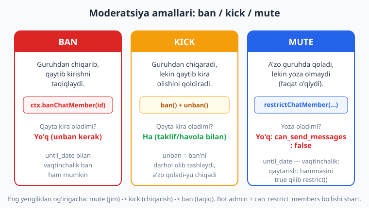
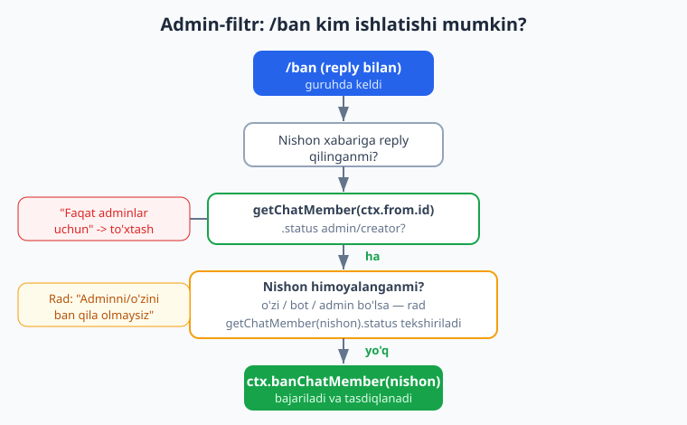
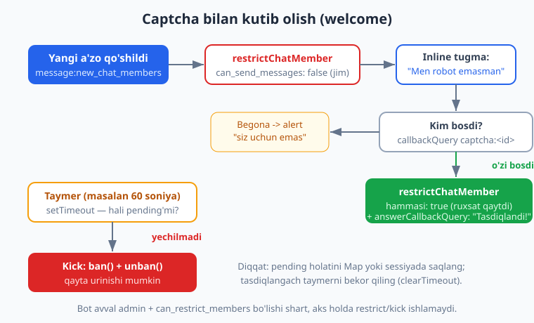

# 20 — Guruh moderatsiyasi

[⬅️ Oldingi: 19 — Guruhlarda ishlash](./19-guruhlar.md) · [🏠 README](./README.md) · [Keyingi: 21 — Kanallar bilan ishlash ➡️](./21-kanallar.md)

---

> **Bu bobda:** botimizni guruhning **qo'riqchisi**ga aylantiramiz. Yangi a'zoni **kutib olishni** (welcome xabari `message:new_chat_members` orqali, ketganni `left_chat_member` bilan) o'rganamiz; so'ng moderatsiyaning uchta tayanch amalini — **ban** (`ctx.banChatMember`), **kick** (ban + unban, qayta kira oladi) va **mute** (`ctx.restrictChatMember` bilan `ChatPermissions`) — qachon va qanday ishlatishni ko'ramiz. Spamni `ctx.deleteMessage` bilan o'chiramiz. Eng muhimi — **admin-filtr**: `/ban` kabi xavfli buyruqni faqat guruh admini ishlatishini, va u o'zini, botni yoki boshqa adminni xato bilan ban qilmasligini `ctx.getChatMember` orqali tekshiramiz. Nihoyat, **captcha** quramiz: yangi a'zoni avval jimlatib (restrict), unga "Men robot emasman" tugmasini beramiz; bossa — ruxsatlarni qaytaramiz, vaqtida yechmasa — kick qilamiz. Yo'l-yo'lakay `ChatPermissions`ning to'liq maydonlarini va `until_date` bilan **vaqtinchalik** ban/mute'ni o'rganamiz. Guruh asoslari [19-bobda](./19-guruhlar.md), callback tugmalari esa [07-bobda](./07-callback-inline.md) yoritilgan — kerakli joyda ularga qaytamiz.

> **Halollik eslatmasi:** bu bobdagi butun **mantiq** — welcome (yangi a'zoga salom, botga emas), `left_chat_member`, `/ban` (banChatMember to'g'ri `user_id` bilan), admin-filtr (oddiy a'zoning rad etilishi, o'zini/botni/adminni ban qilishning oldini olish), `/kick` (ban+unban ketma-ketligi), `/mute` (`can_send_messages:false`, hamda `/mute 5` -> `until_date` ~ hozir+300s), `/unmute`, `/del` (`deleteMessage` to'g'ri `message_id` bilan) va to'liq **captcha** oqimi (restrict -> tugma -> to'g'ri/begona bosish -> timeout kick) — **offline ishga tushirib tasdiqlangan**: soxta `Update`'larni `bot.handleUpdate(...)` ga uzatib, chiqayotgan har bir API chaqiruvini transformer bilan ushlab, `getChatMember`'ni esa mock bilan qaytarib. Natija: **16/16 PASS** (bob oxiridagi hisobotda). **Jonli moderatsiya** — haqiqiy guruhda kimnidir ban qilish — internet, token va botning admin huquqlarini talab qiladi; shularni "illustrativ" deb belgilaymiz.

---

## Nega moderatsiya kerak?

Ochiq Telegram guruhi — bu jonli maydon: foydali suhbat ham bo'ladi, spam, reklama va janjal ham. Inson-adminlar 24/7 kuzata olmaydi. Bot esa **bir zumda**, **bir xil qoida bilan** ishlaydi: yangi kelganni kutib oladi, spamerni jimlatadi, qoidabuzarni chiqaradi va siz uxlab yotganingizda ham guruhni toza saqlaydi.

Bu bobda biz "moderator-bot"ning yadrosini quramiz. Avval bitta tamoyilni mahkam o'rnatib olaylik:

> **Diqqat — botning huquqlari.** Ban, kick, mute, xabar o'chirish — bularning **hammasi** bot **guruh admini** bo'lishini, hamda kerakli huquqlarga ega bo'lishini talab qiladi:
> - **Ban/kick** uchun — "Ban users" (foydalanuvchilarni cheklash) huquqi;
> - **Mute/restrict** uchun — xuddi shu "Restrict members" huquqi;
> - **Xabar o'chirish** uchun — "Delete messages" huquqi.
>
> Agar bot oddiy a'zo bo'lsa, bu chaqiruvlar `GrammyError` ("not enough rights" yoki "CHAT_ADMIN_REQUIRED") bilan qaytadi. Shuning uchun botni guruhga qo'shgach, uni **admin qiling** va kerakli "toggle"larni yoqing.

---

## 1. Yangi a'zoni kutib olish (welcome)

Telegram guruhga kimdir qo'shilganda, guruhga **xizmat xabari** (service message) keladi: `new_chat_members` maydoni bilan. grammY'da buni filter query orqali ushlaymiz:

```js
import { Bot } from "grammy";

const bot = new Bot(process.env.BOT_TOKEN);

bot.on("message:new_chat_members", async (ctx) => {
  for (const u of ctx.message.new_chat_members) {
    if (u.is_bot) continue; // botlarni salomlamaymiz
    await ctx.reply(`Xush kelibsiz, ${u.first_name}! Guruh qoidalari bilan tanishing.`);
  }
});

bot.start();
```

E'tibor bering: `new_chat_members` — bu **massiv**. Bir vaqtda bir nechta odam qo'shilishi mumkin (masalan, kimdir ularni guruhga "qo'shsa"), shuning uchun `for` bilan aylanib chiqamiz. Va `u.is_bot` tekshiruvi — botlarni (jumladan o'zimizni) salomlab o'tirmaslik uchun.

Kimdir guruhni tark etganda esa `left_chat_member` (yakka obyekt) keladi:

```js
bot.on("message:left_chat_member", async (ctx) => {
  const u = ctx.message.left_chat_member;
  if (u.is_bot) return;
  await ctx.reply(`${u.first_name} guruhni tark etdi.`);
});
```

> **Eslatma — `new_chat_members` va `chat_member` farqi.** Yuqoridagi `message:new_chat_members` — bu guruhdagi **xizmat xabari**; u faqat odam guruhga **qo'shilganda** keladi va privacy mode'dan qat'i nazar ishlaydi. Telegram'da yana `chat_member` degan **alohida update** ham bor — u a'zolik statusining **har qanday** o'zgarishini (kirdi, chiqdi, ban bo'ldi, admin bo'ldi, ban olib tashlandi) kuzatadi, lekin uni olish uchun botni `bot.start({ allowed_updates: ["chat_member", ...] })` bilan ishga tushirib, bu update'ni alohida so'rash kerak (chunki u sukut bo'yicha yuborilmaydi). Oddiy "salomlash" uchun `message:new_chat_members` yetarli; kim kim tomonidan qo'shilgani yoki ban tarixini kuzatish kerak bo'lsa — `chat_member`'ni yoqasiz. Buni quyida ko'ramiz.

```js
// Murakkabroq: chat_member update (allowed_updates kerak)
bot.on("chat_member", async (ctx) => {
  const { old_chat_member, new_chat_member } = ctx.chatMember;
  const wasOut = old_chat_member.status === "left" || old_chat_member.status === "kicked";
  const isIn = new_chat_member.status === "member";
  if (wasOut && isIn) {
    await ctx.reply(`${new_chat_member.user.first_name} guruhga qo'shildi!`);
  }
});

// va ishga tushirishda:
bot.start({ allowed_updates: ["message", "callback_query", "chat_member"] });
```

> **Anti-eskirish:** `bot.start({ allowed_updates: [...] })`'da ro'yxat **butun** allowed_updates'ni almashtiradi. Agar `["chat_member"]` deb yozsangiz, oddiy `message` update'lari **kelmay qoladi**! Shuning uchun kerakli barcha turlarni sanang. `@grammyjs/runner` (`run(bot)`) bilan ishlatsangiz, allowed_updates'ni runner sozlamasi orqali beriladi — ekvivalent, lekin sintaksis boshqacha.

---

## 2. Ban, kick, mute — uchta amal, uchta ma'no

Yangilar bu uch atamani tez-tez aralashtiradi. Ular **butunlay boshqa** narsa. Quyidagi diagramma farqni bir qarashda ko'rsatadi:



| Amal | grammY chaqiruvi | Natija | Qayta kira oladimi? |
|------|------------------|--------|---------------------|
| **Mute** | `ctx.restrictChatMember(id, { can_send_messages: false })` | A'zo guruhda **qoladi**, lekin yoza olmaydi (faqat o'qiydi) | — (a'zo bo'lib qoladi) |
| **Kick** | `ctx.banChatMember(id)` keyin `ctx.unbanChatMember(id)` | A'zo guruhdan **chiqariladi** | **Ha** — havola/taklif bilan |
| **Ban** | `ctx.banChatMember(id)` | A'zo chiqariladi va **taqiqlanadi** | **Yo'q** — `unban` qilmaguningizcha |

Eng yengilidan og'irigacha: **mute** (jim) -> **kick** (chiqarish) -> **ban** (taqiq).

### 2.1. Ban

```js
// Nishonni reply'dan olamiz: admin spamer xabariga reply qilib /ban yozadi
bot.command("ban", async (ctx) => {
  const targetId = ctx.message?.reply_to_message?.from?.id;
  if (!targetId) {
    return ctx.reply("Ban qilish uchun foydalanuvchi xabariga reply qiling.");
  }
  await ctx.banChatMember(targetId);
  await ctx.reply("Foydalanuvchi ban qilindi.");
});
```

`ctx.banChatMember(userId)` — joriy chatdagi foydalanuvchini ban qiladi (`chat_id`'ni grammY `ctx`'dan avtomatik oladi). Ikkinchi argument — qo'shimcha sozlamalar:

```js
// Vaqtinchalik ban: 1 soatdan keyin avtomatik olib tashlanadi
await ctx.banChatMember(targetId, {
  until_date: Math.floor(Date.now() / 1000) + 3600, // Unix soniyalarda!
});

// Ban qilganda foydalanuvchining oldingi xabarlarini ham o'chirish
await ctx.banChatMember(targetId, { revoke_messages: true });
```

> **Diqqat — `until_date` formati.** Bu **Unix vaqt tamg'asi soniyalarda** (millisekundlarda EMAS!). JavaScript'da `Date.now()` millisekund qaytaradi, shuning uchun `Math.floor(Date.now() / 1000)` bilan soniyaga aylantiramiz. Yana bir nozik nuqta: agar `until_date` hozirdan **30 soniyadan kam** yoki **366 kundan ko'p** bo'lsa, Telegram uni **abadiy** ban deb qabul qiladi.

Ban'ni olib tashlash — `ctx.unbanChatMember(userId)`. Bu foydalanuvchini guruhga **avtomatik qaytarmaydi**, faqat qora ro'yxatdan chiqaradi — endi u qayta kira oladi.

### 2.2. Kick = ban + unban

Telegram Bot API'da alohida "kick" metodi **yo'q**. "Kick" — bu shunchaki ban qilib, **darhol** ban'ni olib tashlash: a'zo guruhdan chiqib ketadi, lekin qora ro'yxatda qolmaydi, ya'ni keyin qayta kira oladi.

```js
bot.command("kick", async (ctx) => {
  const targetId = ctx.message?.reply_to_message?.from?.id;
  if (!targetId) return ctx.reply("Kick uchun reply qiling.");
  await ctx.banChatMember(targetId);    // chiqaramiz
  await ctx.unbanChatMember(targetId);  // darhol qora ro'yxatdan olib tashlaymiz
  await ctx.reply("Foydalanuvchi guruhdan chiqarildi (qayta kira oladi).");
});
```

> **Eslatma — nega `unbanChatMember`'da `only_if_banned` emas?** `unbanChatMember`'ning ixtiyoriy `only_if_banned: true` parametri bor — u "agar foydalanuvchi ban bo'lmagan bo'lsa, hech narsa qilma" degani. Kick stsenariysida biz **darhol** ban'dan keyin chaqirayotganimiz uchun bu shart emas, lekin "kira olishini tasdiqla" tugmasi kabi joylarda foydali bo'ladi.

### 2.3. Mute (restrict) va ChatPermissions

Mute — foydalanuvchini guruhdan chiqarmasdan, uning **yozish huquqini** olib qo'yish. Buni `ctx.restrictChatMember(userId, permissions)` qiladi, bu yerda `permissions` — `ChatPermissions` obyekti:

```js
bot.command("mute", async (ctx) => {
  const targetId = ctx.message?.reply_to_message?.from?.id;
  if (!targetId) return ctx.reply("Mute uchun reply qiling.");

  // /mute 10  -> 10 daqiqaga; /mute -> muddatsiz
  const minutes = Number(ctx.match) || 0;
  const other = {};
  if (minutes > 0) {
    other.until_date = Math.floor(Date.now() / 1000) + minutes * 60;
  }

  await ctx.restrictChatMember(targetId, { can_send_messages: false }, other);
  await ctx.reply(minutes > 0 ? `Mute qilindi (${minutes} daqiqa).` : "Mute qilindi (muddatsiz).");
});
```

E'tibor bering — `restrictChatMember`'da argumentlar tartibi: `(userId, permissions, other)`. `until_date` — bu uchinchi argument (`other`) ichida, `permissions` ichida emas.

**`ChatPermissions`ning to'liq maydonlari** — har birini alohida `true`/`false` qilib boshqarish mumkin:

| Maydon | Nimani boshqaradi |
|--------|-------------------|
| `can_send_messages` | Oddiy matnli xabar (eng asosiy) |
| `can_send_audios` | Audio fayllar |
| `can_send_documents` | Hujjatlar (fayl) |
| `can_send_photos` | Rasmlar |
| `can_send_videos` | Videolar |
| `can_send_video_notes` | Doira-video (video-xabar) |
| `can_send_voice_notes` | Ovozli xabarlar |
| `can_send_polls` | So'rovnomalar |
| `can_send_other_messages` | Stiker, GIF, o'yin va h.k. |
| `can_add_web_page_previews` | Havola ko'rinishlari (preview) |

> **Diqqat — `restrictChatMember` faqat supergroup'da ishlaydi.** Oddiy "guruh" (basic group) restrict'ni qo'llab-quvvatlamaydi. Agar guruhingiz hali oddiy guruh bo'lsa, mute ishlamaydi. Yechim: guruh sozlamalarida tarix (history)'ni hammaga ochib qo'ysangiz yoki a'zo soni oshsa, Telegram uni avtomatik **supergroup**'ga aylantiradi. Real moderator-botlar deyarli har doim supergroup'larda ishlaydi.

**Mute'ni olib tashlash** — barcha ruxsatlarni qaytadan `true` qilib `restrictChatMember` chaqiramiz:

```js
const FULL_PERMISSIONS = {
  can_send_messages: true,
  can_send_audios: true,
  can_send_documents: true,
  can_send_photos: true,
  can_send_videos: true,
  can_send_video_notes: true,
  can_send_voice_notes: true,
  can_send_polls: true,
  can_send_other_messages: true,
  can_add_web_page_previews: true,
};

bot.command("unmute", async (ctx) => {
  const targetId = ctx.message?.reply_to_message?.from?.id;
  if (!targetId) return ctx.reply("Unmute uchun reply qiling.");
  await ctx.restrictChatMember(targetId, FULL_PERMISSIONS);
  await ctx.reply("Mute olib tashlandi.");
});
```

> **Eslatma — `promoteChatMember`.** Bu — qarama-qarshi amal: foydalanuvchini **adminga ko'tarish** yoki uning admin huquqlarini o'zgartirish. Masalan `ctx.promoteChatMember(userId, { can_delete_messages: true, can_restrict_members: true })`. Bot faqat o'zida bor huquqlarni boshqaga bera oladi, va keyinchalik faqat o'zi ko'targan adminni qaytara oladi. Bu kamroq kerak bo'lgani uchun batafsil to'xtalmaymiz, lekin u ham huddi shu naqshda ishlaydi.

### 2.4. Spam xabarni o'chirish

Reklama yoki spam xabarni o'chirish uchun `ctx.deleteMessage()` (joriy xabarni) yoki `ctx.api.deleteMessage(chatId, messageId)` (aniq xabarni):

```js
bot.command("del", async (ctx) => {
  const replyId = ctx.message?.reply_to_message?.message_id;
  if (!replyId) return ctx.reply("O'chirish uchun reply qiling.");
  await ctx.api.deleteMessage(ctx.chat.id, replyId);
  await ctx.reply("Xabar o'chirildi.");
});
```

> **Diqqat:** bot faqat **48 soatdan yangi** xabarlarni o'chira oladi (Telegram cheklovi), va albatta "Delete messages" huquqi bilan. Ban qilganda eski spam xabarlarni ham tozalamoqchi bo'lsangiz — yuqorida ko'rgan `banChatMember(id, { revoke_messages: true })`'ni ishlating.

---

## 3. Admin-filtr — eng muhim qism

Tasavvur qiling, har kim `/ban`ni reply qilib hammani guruhdan haydab yuborsa nima bo'ladi? Falokat. Shuning uchun **xavfli buyruqlarni faqat adminlar** ishlatishi shart. Buni ikki bosqichda tekshiramiz:

1. **Buyruqni yuborgan odam** admin/creator'mi? (`ctx.getChatMember(ctx.from.id)`)
2. **Nishon** himoyalangan emasmi? (o'zini, botni yoki adminni ban qilib bo'lmaydi)



`ctx.getChatMember(userId)` foydalanuvchining guruhdagi holatini qaytaradi; bizga `.status` kerak. U beshta qiymatdan biri bo'ladi:

```text
"creator"        -> guruh egasi (eng yuqori)
"administrator"  -> admin
"member"         -> oddiy a'zo
"restricted"     -> cheklangan (mute bo'lgan bo'lishi mumkin)
"left"           -> guruhda yo'q
"kicked"         -> ban qilingan
```

Admin-filtrni **middleware** sifatida yozamiz — shunda uni bir nechta buyruqqa qayta-qayta ulashimiz mumkin (middleware'ni [09-bobda](./09-middleware.md) batafsil ko'rgansiz):

```js
// Faqat admin/creator o'tkazadigan "darvoza" middleware
const adminGate = async (ctx, next) => {
  const me = await ctx.getChatMember(ctx.from.id);
  if (me.status !== "administrator" && me.status !== "creator") {
    return ctx.reply("Bu buyruq faqat adminlar uchun.");
  }
  return next(); // admin bo'lsa, keyingi handlerga o'tamiz
};
```

Endi uni buyruqlarga ulaymiz va nishon himoyasini qo'shamiz:

```js
bot.command("ban", adminGate, async (ctx) => {
  const targetId = ctx.message?.reply_to_message?.from?.id;
  if (!targetId) return ctx.reply("Ban qilish uchun xabariga reply qiling.");

  // himoya: o'zini va botni ban qilmaslik
  if (targetId === ctx.from.id) return ctx.reply("O'zingizni ban qila olmaysiz.");
  if (targetId === ctx.me.id)   return ctx.reply("Botni ban qila olmaysiz.");

  // himoya: nishon admin/creator bo'lsa, ban qila olmaymiz
  const tm = await ctx.getChatMember(targetId);
  if (tm.status === "administrator" || tm.status === "creator") {
    return ctx.reply("Adminni ban qila olmaysiz.");
  }

  await ctx.banChatMember(targetId);
  await ctx.reply("Foydalanuvchi ban qilindi.");
});
```

> **Eslatma — `ctx.me`.** `ctx.me` — botning o'zi haqidagi ma'lumot (`botInfo`), ya'ni `ctx.me.id` botning ID'si. Botning o'zini ban qilishga urinishning oldini olish uchun shuni tekshiramiz. (`ctx.from` esa — buyruqni **yuborgan** odam.)

> **Diqqat — `adminGate` qayerga qo'yilsin?** grammY'da `bot.command("ban", adminGate, handler)` ko'rinishida bir nechta middleware berishingiz mumkin: ular **ketma-ket** ishlaydi. `adminGate` `next()` chaqirsagina `handler` ishlaydi. Agar `adminGate`'ni global `bot.use(adminGate)` qilib qo'ysangiz — **hamma** xabar admin tekshiruvidan o'tadi (oddiy chat ham!), bu noto'g'ri. Faqat moderatsiya buyruqlariga ulang.

> **Anti-eskirish — `getChatMember` har safar tarmoqqa chiqadi.** Har bir `/ban`da ikkita `getChatMember` so'rovi ketadi (yuboruvchi + nishon). Katta, faol guruhda bu sekinlashtirishi mumkin. Ilg'or botlar admin ro'yxatini `ctx.getChatAdministrators()` bilan bir marta olib, qisqa muddatli keshda saqlaydi. Boshlanishida esa to'g'ridan-to'g'ri `getChatMember` — eng oddiy va ishonchli yo'l.

---

## 4. Captcha — robotlarga qarshi kutib olish

Spam-botlar guruhga kirib, darhol reklama tashlaydi. Buning oldini olishning klassik usuli — **captcha**: yangi a'zoni avval **jimlatib** (restrict), unga bitta tugma beramiz. Haqiqiy odam tugmani bosadi va yoza boshlaydi; bot esa tugmani bosa olmaydi (yoki bossa ham — biz faqat **o'sha** foydalanuvchining bosishini qabul qilamiz) va belgilangan vaqtdan keyin kick qilinadi.



Oqim quyidagicha:

1. **Yangi a'zo** keladi -> uni `restrictChatMember(id, { can_send_messages: false })` bilan jimlatamiz.
2. Unga **inline tugma** beramiz: "Men robot emasman" (`callback_data: captcha:<userId>`).
3. **Faqat o'sha** foydalanuvchi tugmani bossa -> ruxsatlarni qaytaramiz.
4. **Begona** bossa -> "Bu tugma siz uchun emas" deb rad etamiz.
5. **Vaqtida yechmasa** (taymer) -> kick qilamiz.

Kim captcha kutayotganini eslab qolish uchun holatni saqlash kerak. Soddalik uchun `Map` ishlatamiz (ishlab chiqarishda — [10-bobdagi](./10-sessiya-malumotlar-bazasi.md) sessiya yoki DB'da saqlash mustahkamroq, chunki bot qayta ishga tushsa `Map` yo'qoladi).

```js
import { Bot, InlineKeyboard } from "grammy";

const bot = new Bot(process.env.BOT_TOKEN);

const MUTED = { can_send_messages: false };
const FULL_PERMISSIONS = {
  can_send_messages: true, can_send_audios: true, can_send_documents: true,
  can_send_photos: true, can_send_videos: true, can_send_video_notes: true,
  can_send_voice_notes: true, can_send_polls: true, can_send_other_messages: true,
  can_add_web_page_previews: true,
};

// userId -> { timer } : captcha kutilayotgan a'zolar
const pending = new Map();

// 1) Yangi a'zo: jimlatamiz + tugma beramiz + taymer
bot.on("message:new_chat_members", async (ctx) => {
  for (const u of ctx.message.new_chat_members) {
    if (u.is_bot) continue;
    await ctx.restrictChatMember(u.id, MUTED);

    const kb = new InlineKeyboard().text("Men robot emasman", `captcha:${u.id}`);
    await ctx.reply(`${u.first_name}, davom etish uchun tugmani bosing:`, { reply_markup: kb });

    // 60 soniyada yechmasa -> kick
    const chatId = ctx.chat.id;
    const timer = setTimeout(async () => {
      if (!pending.has(u.id)) return; // allaqachon yechgan
      pending.delete(u.id);
      try {
        await ctx.api.banChatMember(chatId, u.id);
        await ctx.api.unbanChatMember(chatId, u.id); // kick (qayta urinishi mumkin)
      } catch (e) { /* bot huquqi yo'q yoki a'zo allaqachon chiqib ketgan */ }
    }, 60_000);

    pending.set(u.id, { timer });
  }
});

// 2) Tugma bosilganda
bot.callbackQuery(/^captcha:(\d+)$/, async (ctx) => {
  const targetId = Number(ctx.match[1]);

  // faqat o'sha foydalanuvchi o'zi bosishi mumkin
  if (ctx.from.id !== targetId) {
    return ctx.answerCallbackQuery({ text: "Bu tugma siz uchun emas.", show_alert: true });
  }
  const entry = pending.get(targetId);
  if (!entry) {
    return ctx.answerCallbackQuery({ text: "Allaqachon tasdiqlangan." });
  }

  clearTimeout(entry.timer); // taymerni bekor qilamiz
  pending.delete(targetId);

  await ctx.restrictChatMember(targetId, FULL_PERMISSIONS); // ruxsatlarni qaytaramiz
  await ctx.answerCallbackQuery({ text: "Tasdiqlandi!" });
  await ctx.editMessageText("Tasdiqlandi. Xush kelibsiz!");
});

bot.start();
```

Bu kichik kod aslida ko'p narsani birlashtiradi: filter query (`new_chat_members`), restrict (mute), inline tugma ([07-bob](./07-callback-inline.md)), `callbackQuery` regex bilan `ctx.match`, va `setTimeout` bilan vaqt-asoslangan kick.

> **Diqqat — `Map` va qayta ishga tushish.** Yuqorida `pending`ni xotirada (`Map`) saqladik. Bot **qayta ishga tushsa** (deploy, qulash) — `Map` bo'shaydi va o'sha paytda captcha kutayotgan a'zolar "muallaq" qoladi (jim, lekin taymer yo'q). Jiddiy botlarda bu holatni DB'da saqlang va qayta ishga tushganda kutayotganlarni tiklang. O'rganish uchun `Map` mukammal.

> **Eslatma — botlarni captcha'dan o'tkazib yuborish.** `if (u.is_bot) continue;` — boshqa botlar (masalan, statistika botlari) odatda admin tomonidan qo'shiladi; ularni captcha bilan qiynamaymiz. Xohlasangiz, faqat ma'lum botlarga ruxsat berish mantig'ini ham qo'shishingiz mumkin.

---

## 5. Hammasini birlashtirish: moderator-bot skeleti

Yuqoridagi qismlarni bitta tartibli botga yig'amiz. Diqqat: handler tartibi muhim — `conversations`/maxsus middleware bo'lmagani uchun bu yerda asosiy qoida — `adminGate`ni faqat moderatsiya buyruqlariga ulash.

```js
import { Bot, InlineKeyboard, GrammyError, HttpError } from "grammy";

const bot = new Bot(process.env.BOT_TOKEN);

const FULL_PERMISSIONS = { /* ... yuqoridagidek ... */ };

// faqat admin o'tkazadigan darvoza
const adminGate = async (ctx, next) => {
  const me = await ctx.getChatMember(ctx.from.id);
  if (me.status !== "administrator" && me.status !== "creator") {
    return ctx.reply("Bu buyruq faqat adminlar uchun.");
  }
  return next();
};

// nishon ID + himoya tekshiruvi (umumiy yordamchi)
async function resolveTarget(ctx) {
  const targetId = ctx.message?.reply_to_message?.from?.id;
  if (!targetId) { await ctx.reply("Foydalanuvchi xabariga reply qiling."); return null; }
  if (targetId === ctx.from.id) { await ctx.reply("Bu amalni o'zingizga qo'llay olmaysiz."); return null; }
  if (targetId === ctx.me.id) { await ctx.reply("Botga qo'llay olmaysiz."); return null; }
  const tm = await ctx.getChatMember(targetId);
  if (tm.status === "administrator" || tm.status === "creator") {
    await ctx.reply("Adminni cheklash mumkin emas."); return null;
  }
  return targetId;
}

bot.command("ban", adminGate, async (ctx) => {
  const targetId = await resolveTarget(ctx);
  if (!targetId) return;
  await ctx.banChatMember(targetId);
  await ctx.reply("Ban qilindi.");
});

bot.command("kick", adminGate, async (ctx) => {
  const targetId = await resolveTarget(ctx);
  if (!targetId) return;
  await ctx.banChatMember(targetId);
  await ctx.unbanChatMember(targetId);
  await ctx.reply("Guruhdan chiqarildi (qayta kira oladi).");
});

bot.command("mute", adminGate, async (ctx) => {
  const targetId = await resolveTarget(ctx);
  if (!targetId) return;
  const minutes = Number(ctx.match) || 0;
  const other = minutes > 0 ? { until_date: Math.floor(Date.now() / 1000) + minutes * 60 } : {};
  await ctx.restrictChatMember(targetId, { can_send_messages: false }, other);
  await ctx.reply(minutes > 0 ? `Mute (${minutes} daqiqa).` : "Mute (muddatsiz).");
});

bot.command("unmute", adminGate, async (ctx) => {
  const targetId = ctx.message?.reply_to_message?.from?.id;
  if (!targetId) return ctx.reply("Reply qiling.");
  await ctx.restrictChatMember(targetId, FULL_PERMISSIONS);
  await ctx.reply("Mute olib tashlandi.");
});

bot.command("del", adminGate, async (ctx) => {
  const replyId = ctx.message?.reply_to_message?.message_id;
  if (!replyId) return ctx.reply("Reply qiling.");
  await ctx.api.deleteMessage(ctx.chat.id, replyId);
  await ctx.reply("Xabar o'chirildi.");
});

bot.catch((err) => {
  const e = err.error;
  if (e instanceof GrammyError) console.error("Telegram xato:", e.description);
  else if (e instanceof HttpError) console.error("Tarmoq xato:", e);
  else console.error("Noma'lum:", e);
});

bot.start();
```

> **Illustrativ:** yuqoridagi `bot.start()` — jonli polling: u haqiqiy Telegram serveriga ulanadi va token talab qiladi. Biz uni shu yerda ishga tushirmaymiz; o'rniga bobning butun mantig'ini keyingi bo'limdagidek **offline** tekshiramiz.

> **Eslatma — `unmute`'da `adminGate` bor, lekin `resolveTarget` yo'q.** Sababini sezdingizmi? Mute'ni olib tashlash "himoya"ni talab qilmaydi (adminni unmute qilish zararsiz, chunki admin'larga mute baribir ta'sir qilmaydi). Lekin baribir `adminGate` qoldik — chunki har kim emas, faqat admin unmute qilishi kerak.

---

## 6. Offline tekshiruv — "men buni ishga tushirdim"

Spec talab qilganidek, bu bobdagi handlerlarni **haqiqatan ishga tushirib** tekshirdim (tokensiz, tarmoqsiz). Naqsh oldingi boblardagidek: soxta `Update`'ni `bot.handleUpdate(...)` ga uzatamiz, chiqayotgan har bir API chaqiruvini **transformer** bilan ushlaymiz, `getChatMember`'ni esa **mock** bilan qaytaramiz (kim admin, kim oddiy a'zo ekanini biz belgilaymiz).

Transformer va mock'ning yadrosi shunday ko'rinadi:

```js
function offlineTransformer(calls, memberDb) {
  return (prev, method, payload) => {
    calls.push({ method, payload }); // har bir chaqiruvni yozib boramiz
    if (method === "getChatMember") {
      const m = memberDb[payload.user_id] ?? { status: "left" };
      return Promise.resolve({ ok: true, result: { user: { id: payload.user_id }, ...m } });
    }
    if (method === "sendMessage") {
      return Promise.resolve({ ok: true, result: {
        message_id: 1, date: 0, chat: { id: payload.chat_id, type: "supergroup" }, text: payload.text,
      }});
    }
    return Promise.resolve({ ok: true, result: true }); // ban/restrict/delete -> true
  };
}
```

`memberDb` — bizning "kim kim" jadvalimiz: `{ [ADMIN_ID]: { status: "administrator" }, [USER_ID]: { status: "member" }, ... }`. Shu bilan biz "admin /ban yozsa ishlaydi, oddiy a'zo yozsa rad bo'ladi" kabi stsenariylarni real tarmoqsiz tekshira olamiz.

> **Diqqat — buyruq mock'ida `entities` SHART.** `/ban` kabi buyruq tan olinishi uchun mock `message`'da `entities: [{ type: "bot_command", offset: 0, length: 4 }]` bo'lishi shart, aks holda `bot.command("ban", ...)` mos kelmaydi. Bu nuans oldingi boblarda ham bor edi.

Men yozgan `_verify_20.mjs` quyidagilarni tekshiradi (jami **16 ta** test):

| # | Test | Tasdiqlanadi |
|---|------|--------------|
| 1 | Welcome | Yangi a'zoga salom, bot a'zoga emas |
| 2 | `left_chat_member` | Xayrlashuv xabari |
| 3 | `/ban` (admin) | `banChatMember` to'g'ri `user_id` bilan |
| 4 | `/ban` (oddiy a'zo) | Admin-filtr rad etadi, ban yo'q |
| 5 | `/ban` adminni | Rad: admin himoyalangan |
| 6 | `/ban` o'zini/botni | Ikkalasi ham rad |
| 7 | `/kick` | `ban` + `unban` ketma-ket |
| 8 | `/mute` (muddatsiz) | `can_send_messages:false`, `until_date` yo'q |
| 9 | `/mute 5` | `until_date` ~ hozir+300s |
| 10 | `/unmute` | `can_send_messages:true` |
| 11 | `/del` | `deleteMessage` to'g'ri `message_id` |
| 12 | `/ban` reply'siz | Ban yo'q, ko'rsatma |
| 13 | Captcha kelishi | A'zo jimlatildi + tugma |
| 14 | Captcha to'g'ri | O'zi bosdi -> ruxsat qaytdi |
| 15 | Captcha begona | Begona bosdi -> rad, hali pending |
| 16 | Captcha timeout | Yechmasa kick (ban+unban) |

Ishga tushirish (probedagi muhitda):

```bash
node _verify_20.mjs
```

Natija (haqiqiy chiqish):

```text
  PASS: Welcome: yangi a'zoga salom, bot a'zoga salom yo'q
  PASS: left_chat_member: xayrlashuv xabari
  PASS: /ban: admin oddiy a'zoni ban qildi (banChatMember user_id to'g'ri)
  PASS: /ban oddiy a'zo: admin-filtr rad etdi (ban yo'q)
  PASS: /ban adminni: rad etildi (admin himoyalangan)
  PASS: /ban o'zini/botni: ikkalasi ham rad etildi
  PASS: /kick: ban + unban ketma-ket chaqirildi (qayta kira oladi)
  PASS: /mute muddatsiz: restrictChatMember(can_send_messages:false), until_date yo'q
  PASS: /mute 5: until_date hozirdan +5 daqiqa (vaqtinchalik)
  PASS: /unmute: barcha ruxsatlar qaytarildi (can_send_messages:true)
  PASS: /del: spam xabar o'chirildi (deleteMessage to'g'ri message_id)
  PASS: /ban reply'siz: ban qilinmadi, ko'rsatma berildi
  PASS: Captcha: yangi a'zo jimlatildi + 'Men robot emasman' tugmasi
  PASS: Captcha: to'g'ri user bosdi -> ruxsatlar qaytarildi
  PASS: Captcha: begona bosdi -> rad, hali pending (ruxsat qaytmadi)
  PASS: Captcha timeout: yechmagan a'zo kick qilindi (ban+unban), takror yo'q

HAMMASI O'TDI: 16/16
```

Demak, bobning butun mantig'i — welcome, ban/kick/mute/unmute, admin-filtr (himoya bilan), `until_date`, spam o'chirish va captcha — haqiqatan ishlaydi.

---

## 7. Tez-tez uchraydigan xatolar

| Xato | Sabab | Yechim |
|------|-------|--------|
| `ban`/`mute` ishlamaydi: "not enough rights" | Bot **admin emas** yoki "Ban/Restrict" huquqi yo'q | Botni guruhga admin qiling, kerakli "toggle"larni yoqing |
| `restrictChatMember` "method is available only for supergroups" | Guruh hali **basic group** | Supergroup'da ishlating (a'zo oshsa avtomatik aylanadi) |
| `/mute 60` lekin 60 soniyadan keyin tarqaladi | `until_date`'ni millisekundda yoki noto'g'ri hisobladingiz | `Math.floor(Date.now()/1000) + daqiqa*60` (soniyalarda) |
| Vaqtinchalik mute darhol tarqaydi / abadiy bo'ladi | `until_date` < hozir+30s yoki > 366 kun | 30 soniya...366 kun oralig'ida bering |
| Har kim `/ban` qila oladi | Admin-filtr yo'q | `adminGate` middleware'ni moderatsiya buyruqlariga ulang |
| Bot o'zini yoki adminni ban qilib qo'ydi | Nishon himoyasi yo'q | `ctx.me.id`, `ctx.from.id` va nishon `.status`'ni tekshiring |
| `chat_member` update kelmaydi | `allowed_updates`'ga qo'shilmagan | `bot.start({ allowed_updates: [..., "chat_member"] })` |
| `new_chat_members`'da faqat 1 kishi salomlangan | U **massiv**, lekin `for` qilmagansiz | `for (const u of ctx.message.new_chat_members)` |
| Captcha taymeri tugagach to'g'ri bosgan ham kick bo'ladi | Tasdiqlanganda `clearTimeout` qilmagansiz | Bosilganda taymerni bekor qiling, `pending`'dan o'chiring |
| `deleteMessage` xato beradi | Xabar 48 soatdan eski yoki huquq yo'q | Faqat yangi xabarlar; "Delete messages" huquqi |

> **Anti-eskirish:** Telegram vaqti-vaqti bilan `ChatPermissions`ga yangi maydonlar qo'shadi (masalan, `can_send_audios`/`can_send_photos` ilgari bitta `can_send_media_messages` edi, keyin bo'lib yuborildi). grammY versiyasini yangilab tursangiz, tiplar mos keladi; lekin eski qo'llanmalardagi `can_send_media_messages`ni ko'rsangiz — bu eskirgan, hozir alohida maydonlar ishlatiladi.

---

## Mashqlar

Imkon qadar har bir mashqni **offline** (yuqoridagi transformer + mock naqsh bilan) tekshiring. Yodda tuting: buyruq mock'ida `entities: [{ type:"bot_command", offset:0, length:N }]` bo'lishi shart.

### Oson

1. **Boshqa welcome matni.** `message:new_chat_members` handlerini shunday o'zgartiringki, salomda guruh nomi (`ctx.chat.title`) ham bo'lsin: "Salom {ism}, {guruh nomi}ga xush kelibsiz!".
2. **`/rules` buyrug'i.** Guruh qoidalarini qaytaradigan oddiy `bot.command("rules", ...)` yozing. Bu admin-filtr **talab qilmaydi** — hamma ko'ra olishi kerak.
3. **`is_bot` tekshiruvisiz nima bo'ladi?** Welcome handleridan `if (u.is_bot) continue;`ni olib tashlasangiz, qanday muammo yuzaga keladi? Javobni izohda yozing (kod kerak emas).
4. **`/unban` buyrug'i.** Reply qilingan foydalanuvchini ban'dan chiqaradigan `bot.command("unban", adminGate, ...)` yozing (`ctx.unbanChatMember`).

### O'rta

5. **`/mute` daqiqasini cheklash.** `/mute` daqiqasi 1 dan 10080 (1 hafta) gacha bo'lishini ta'minlang; tashqarida bo'lsa, "1...10080 daqiqa oralig'ida bering" deb javob bering.
6. **Faqat rasm yuborishni taqiqlash.** A'zo matn yoza oladi, lekin rasm/media yubora olmaydigan "yarim-mute" qiling: `can_send_messages: true`, lekin `can_send_photos`/`can_send_videos`/`can_send_other_messages: false`.
7. **`/warn` ogohlantirish tizimi.** `Map`da har foydalanuvchining ogohlantirishlar sonini saqlang; `/warn` (reply bilan) sonni oshirsin, 3 ta bo'lganda avtomatik mute qilsin.
8. **Nishonni reply'siz ham olish.** `/ban` ni `/ban 12345` (ID bilan) yoki reply bilan ishlaydigan qiling: agar reply bo'lmasa, `ctx.match`'dan sonni o'qing.
9. **Admin ro'yxatini keshlash.** `getChatMember`'ni har safar chaqirish o'rniga, `ctx.getChatAdministrators()` bilan admin ID'larini bir marta olib, `Set`da saqlang; `adminGate` shu `Set`'dan tekshirsin.

### Qiyin

10. **To'liq captcha oqimi.** 4-bo'limdagi captcha botini qayta yozing va offline tekshiring: yangi a'zo restrict bo'lishi, to'g'ri bosishda ruxsat qaytishi, begona bosishda rad etilishi va timeout'da kick bo'lishini tasdiqlovchi kamida 4 ta test yozing.
11. **Matematik captcha.** Tugma o'rniga "3 + 4 = ?" kabi savol bering, 4 ta inline tugma (bittasi to'g'ri) chiqaring; noto'g'ri bossa qayta urinish berib, 3 marta xato qilsa kick qiling.
12. **Anti-flood (spam tezligi).** `Map`da har foydalanuvchining oxirgi 10 soniyadagi xabarlari sonini saqlang; 5 tadan oshsa, avtomatik 5 daqiqaga mute qiling va ogohlantiring.
13. **Audit-log kanali.** Har bir moderatsiya amali (ban/kick/mute) bo'lganda alohida "log" chatga (`ctx.api.sendMessage(LOG_CHAT_ID, ...)`) "kim, kimni, qachon, qaysi amal" yozuvini yuboring.

<details markdown="1">
<summary>Yechimlar</summary>

### 1-mashq yechimi

```js
bot.on("message:new_chat_members", async (ctx) => {
  for (const u of ctx.message.new_chat_members) {
    if (u.is_bot) continue;
    await ctx.reply(`Salom ${u.first_name}, ${ctx.chat.title}ga xush kelibsiz!`);
  }
});
```

`ctx.chat.title` — guruh nomi (faqat guruh/supergroup/kanalda mavjud, shaxsiy chatda `undefined`).

### 2-mashq yechimi

```js
bot.command("rules", (ctx) =>
  ctx.reply("Guruh qoidalari:\n1. Spam yo'q\n2. Hurmat\n3. Mavzudan chetlashmang")
);
```

Bu yerda `adminGate` **yo'q** — qoidalarni hamma ko'rishi kerak. Admin-filtrni faqat **xavfli** (ban/mute/del) buyruqlarga qo'yamiz.

### 3-mashq yechimi

`if (u.is_bot) continue;`ni olib tashlasak, bot guruhga **o'zi qo'shilganda** ham (yoki boshqa botlar qo'shilganda) salomlash xabarini yuboradi. Eng noxush holat: bot guruhga **birinchi marta** qo'shilganda, `new_chat_members`'da botning o'zi bo'ladi va u "Xush kelibsiz, {bot nomi}!" deb o'ziga salom beradi — bu g'alati va keraksiz spam. Shuning uchun botlarni o'tkazib yuboramiz.

### 4-mashq yechimi

```js
bot.command("unban", adminGate, async (ctx) => {
  const targetId = ctx.message?.reply_to_message?.from?.id;
  if (!targetId) return ctx.reply("Unban uchun reply qiling.");
  await ctx.unbanChatMember(targetId);
  await ctx.reply("Ban olib tashlandi (foydalanuvchi qayta kira oladi).");
});
```

`unbanChatMember` foydalanuvchini qora ro'yxatdan chiqaradi; lekin uni avtomatik guruhga **qaytarmaydi** — u o'zi qayta kirishi kerak.

### 5-mashq yechimi

```js
bot.command("mute", adminGate, async (ctx) => {
  const targetId = await resolveTarget(ctx);
  if (!targetId) return;
  const minutes = Number(ctx.match);
  if (!Number.isInteger(minutes) || minutes < 1 || minutes > 10080) {
    return ctx.reply("1...10080 daqiqa oralig'ida bering. Masalan: /mute 30");
  }
  const until_date = Math.floor(Date.now() / 1000) + minutes * 60;
  await ctx.restrictChatMember(targetId, { can_send_messages: false }, { until_date });
  await ctx.reply(`Mute qilindi (${minutes} daqiqa).`);
});
```

10080 = 7 kun. Telegram cheklovi (366 kun) ichida, lekin amaliyotda haftadan ortiq mute kamdan-kam kerak.

### 6-mashq yechimi

```js
bot.command("mutemedia", adminGate, async (ctx) => {
  const targetId = await resolveTarget(ctx);
  if (!targetId) return;
  await ctx.restrictChatMember(targetId, {
    can_send_messages: true,        // matn — mumkin
    can_send_photos: false,
    can_send_videos: false,
    can_send_audios: false,
    can_send_documents: false,
    can_send_other_messages: false, // stiker/GIF — yo'q
  });
  await ctx.reply("Endi faqat matn yoza oladi (media taqiqlandi).");
});
```

`ChatPermissions`da berilmagan maydonlar `false` deb hisoblanadi, shuning uchun aniqlik uchun kerakli `true`larni ham yozib qo'yish yaxshi.

### 7-mashq yechimi

```js
const warns = new Map(); // userId -> son

bot.command("warn", adminGate, async (ctx) => {
  const targetId = await resolveTarget(ctx);
  if (!targetId) return;
  const n = (warns.get(targetId) ?? 0) + 1;
  warns.set(targetId, n);
  if (n >= 3) {
    warns.delete(targetId);
    await ctx.restrictChatMember(targetId, { can_send_messages: false });
    await ctx.reply(`3-ogohlantirish! Foydalanuvchi mute qilindi.`);
  } else {
    await ctx.reply(`Ogohlantirish ${n}/3.`);
  }
});
```

`Map` xotirada — bot qayta ishga tushsa nollanadi. Doimiy bo'lishi uchun [10-bobdagi](./10-sessiya-malumotlar-bazasi.md) DB'da saqlang.

### 8-mashq yechimi

```js
function getTargetId(ctx) {
  // 1) reply bo'lsa — undan
  const replyId = ctx.message?.reply_to_message?.from?.id;
  if (replyId) return replyId;
  // 2) aks holda /ban 12345 — argumentdan
  const arg = Number(ctx.match);
  return Number.isInteger(arg) && arg > 0 ? arg : null;
}

bot.command("ban", adminGate, async (ctx) => {
  const targetId = getTargetId(ctx);
  if (!targetId) return ctx.reply("Reply qiling yoki /ban <ID> yozing.");
  if (targetId === ctx.from.id || targetId === ctx.me.id) {
    return ctx.reply("Bu foydalanuvchini ban qila olmaysiz.");
  }
  await ctx.banChatMember(targetId);
  await ctx.reply("Ban qilindi.");
});
```

ID bilan ban — agar foydalanuvchi allaqachon guruhdan chiqib ketgan bo'lsa-yu, qayta kirishini taqiqlamoqchi bo'lsangiz foydali.

### 9-mashq yechimi

```js
const adminCache = new Map(); // chatId -> { ids:Set, ts:number }
const TTL = 5 * 60 * 1000;    // 5 daqiqa

async function getAdminIds(ctx) {
  const cached = adminCache.get(ctx.chat.id);
  if (cached && Date.now() - cached.ts < TTL) return cached.ids;
  const admins = await ctx.getChatAdministrators();
  const ids = new Set(admins.map((a) => a.user.id));
  adminCache.set(ctx.chat.id, { ids, ts: Date.now() });
  return ids;
}

const adminGate = async (ctx, next) => {
  const ids = await getAdminIds(ctx);
  if (!ids.has(ctx.from.id)) return ctx.reply("Bu buyruq faqat adminlar uchun.");
  return next();
};
```

`getChatAdministrators` bir so'rovda **barcha** adminlarni qaytaradi — har bir foydalanuvchi uchun alohida `getChatMember`'dan tejamliroq. TTL bilan keshlab, ortiqcha so'rovlarning oldini olamiz.

### 10-mashq yechimi

Bu — bobning offline test naqshi (`_verify_20.mjs`dagi captcha testlari) bilan bir xil. Yadrosi:

```js
import { Bot, InlineKeyboard } from "grammy";
import assert from "node:assert/strict";

function buildCaptchaBot(calls) {
  const bot = new Bot("12345:FAKE");
  bot.botInfo = { id: 12345, is_bot: true, first_name: "B", username: "b_bot",
    can_join_groups: true, can_read_all_group_messages: true,
    supports_inline_queries: false, can_connect_to_business: false, has_main_web_app: false };
  bot.api.config.use((prev, method, payload) => {
    calls.push({ method, payload });
    if (method === "sendMessage") return Promise.resolve({ ok: true,
      result: { message_id: 1, date: 0, chat: { id: payload.chat_id, type: "supergroup" }, text: payload.text } });
    return Promise.resolve({ ok: true, result: true });
  });

  const pending = new Map();
  bot.on("message:new_chat_members", async (ctx) => {
    for (const u of ctx.message.new_chat_members) {
      if (u.is_bot) continue;
      await ctx.restrictChatMember(u.id, { can_send_messages: false });
      pending.set(u.id, true);
      await ctx.reply("Tasdiqlang:", {
        reply_markup: new InlineKeyboard().text("Men robot emasman", `captcha:${u.id}`) });
    }
  });
  bot.callbackQuery(/^captcha:(\d+)$/, async (ctx) => {
    const id = Number(ctx.match[1]);
    if (ctx.from.id !== id) return ctx.answerCallbackQuery({ text: "Siz uchun emas." });
    if (!pending.get(id)) return ctx.answerCallbackQuery({ text: "Tasdiqlangan." });
    pending.delete(id);
    await ctx.restrictChatMember(id, { can_send_messages: true });
    await ctx.answerCallbackQuery({ text: "Tasdiqlandi!" });
  });
  bot.__pending = pending;
  return bot;
}

// ... mkNewMembers / mkCb yordamchilari (bobdagidek) ...
// Test: restrict false (kelish) -> cb to'g'ri (restrict true) -> cb begona (restrict yo'q)
```

To'liq, ishlaydigan variant `_verify_20.mjs` faylida (13-16 testlar). Asosiy g'oya — `pending` Map'ini tekshirib, faqat to'g'ri foydalanuvchiga ruxsat qaytarish.

### 11-mashq yechimi

```js
const captcha = new Map(); // userId -> { answer, tries }

bot.on("message:new_chat_members", async (ctx) => {
  for (const u of ctx.message.new_chat_members) {
    if (u.is_bot) continue;
    await ctx.restrictChatMember(u.id, { can_send_messages: false });
    const a = 2 + Math.floor(Math.random() * 8);
    const b = 2 + Math.floor(Math.random() * 8);
    const answer = a + b;
    captcha.set(u.id, { answer, tries: 0 });

    // 4 variant: bittasi to'g'ri
    const opts = new Set([answer]);
    while (opts.size < 4) opts.add(answer + (Math.floor(Math.random() * 7) - 3));
    const kb = new InlineKeyboard();
    for (const o of [...opts].sort(() => Math.random() - 0.5)) {
      kb.text(String(o), `cap:${u.id}:${o}`);
    }
    await ctx.reply(`${u.first_name}, ${a} + ${b} = ?`, { reply_markup: kb });
  }
});

bot.callbackQuery(/^cap:(\d+):(-?\d+)$/, async (ctx) => {
  const id = Number(ctx.match[1]);
  const chosen = Number(ctx.match[2]);
  if (ctx.from.id !== id) return ctx.answerCallbackQuery({ text: "Siz uchun emas." });
  const state = captcha.get(id);
  if (!state) return ctx.answerCallbackQuery();
  if (chosen === state.answer) {
    captcha.delete(id);
    await ctx.restrictChatMember(id, { can_send_messages: true });
    await ctx.answerCallbackQuery({ text: "To'g'ri!" });
    await ctx.editMessageText("Tasdiqlandi. Xush kelibsiz!");
  } else {
    state.tries++;
    if (state.tries >= 3) {
      captcha.delete(id);
      await ctx.banChatMember(id);
      await ctx.unbanChatMember(id); // kick
      await ctx.answerCallbackQuery({ text: "3 marta xato. Chiqarildingiz." });
    } else {
      await ctx.answerCallbackQuery({ text: `Xato. Qoldi: ${3 - state.tries}` });
    }
  }
});
```

Matematik captcha botlarni qiynaydi, lekin haqiqiy odam uchun oson.

### 12-mashq yechimi

```js
const flood = new Map(); // userId -> number[] (xabar vaqtlari, ms)
const WINDOW = 10_000;   // 10 soniya
const LIMIT = 5;

bot.on("message", async (ctx, next) => {
  const id = ctx.from?.id;
  if (!id) return next();
  const now = Date.now();
  const arr = (flood.get(id) ?? []).filter((t) => now - t < WINDOW);
  arr.push(now);
  flood.set(id, arr);
  if (arr.length > LIMIT) {
    flood.delete(id);
    try {
      await ctx.restrictChatMember(id, { can_send_messages: false },
        { until_date: Math.floor(now / 1000) + 300 });
      await ctx.reply("Spam aniqlandi — 5 daqiqaga mute qilindingiz.");
    } catch (e) { /* admin yoki bot huquqi yo'q */ }
    return; // keyingi handlerlarga o'tkazmaymiz
  }
  return next();
});
```

Bu middleware **boshqa** handlerlardan **oldin** turishi kerak (`bot.use`/`bot.on("message")` tartibi muhim — [09-bob](./09-middleware.md)). `next()`ni faqat flood bo'lmaganda chaqiramiz.

### 13-mashq yechimi

```js
const LOG_CHAT_ID = -1001234567890; // log kanal/guruh ID'si

async function logAction(ctx, action, targetId) {
  const who = ctx.from.first_name;
  const when = new Date().toISOString();
  await ctx.api.sendMessage(LOG_CHAT_ID,
    `[${action}] admin=${who}(${ctx.from.id}) -> nishon=${targetId} | ${when}`);
}

bot.command("ban", adminGate, async (ctx) => {
  const targetId = await resolveTarget(ctx);
  if (!targetId) return;
  await ctx.banChatMember(targetId);
  await logAction(ctx, "BAN", targetId);
  await ctx.reply("Ban qilindi.");
});
```

Audit-log — jiddiy guruhlar uchun muhim: kim qachon qanday amal qilganini kuzatib borasiz. `LOG_CHAT_ID` botning admin bo'lgan alohida (yopiq) guruhi/kanali bo'lishi kerak.

</details>

---

[⬅️ Oldingi: 19 — Guruhlarda ishlash](./19-guruhlar.md) · [🏠 README](./README.md) · [Keyingi: 21 — Kanallar bilan ishlash ➡️](./21-kanallar.md)
