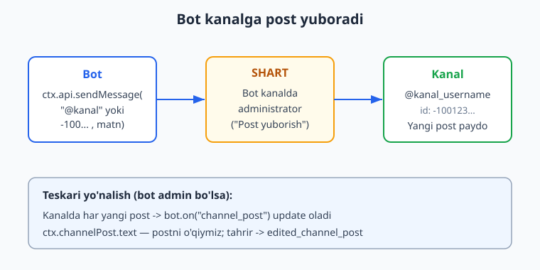
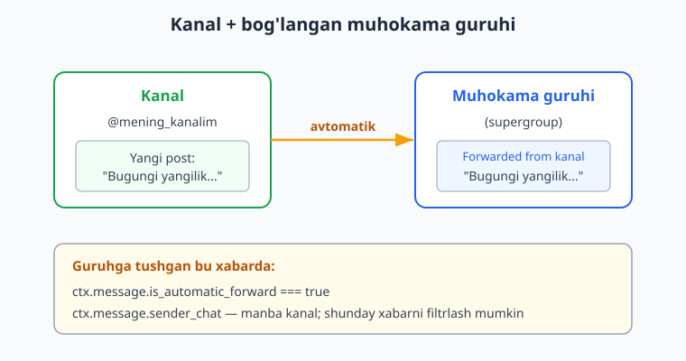
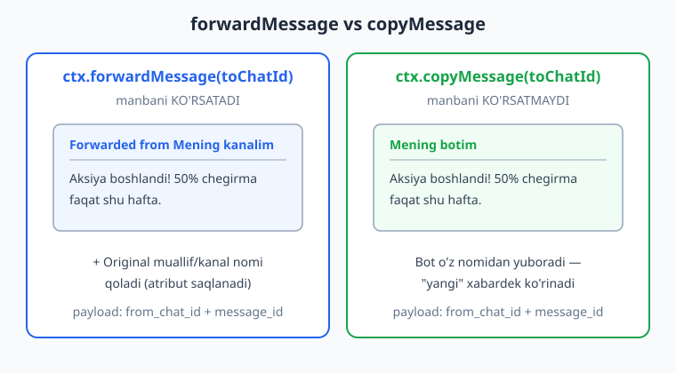

# 21 — Kanallar bilan ishlash

[⬅️ Oldingi: 20 — Guruh moderatsiyasi](./20-guruh-moderatsiya.md) · [🏠 README](./README.md) · [Keyingi: 22 — Majburiy obuna ➡️](./22-majburiy-obuna.md)

---

> **Bu bobda:** botni **kanal** bilan ishlashga o'rgatamiz. Avval botni kanalga **administrator** qilib, `ctx.api.sendMessage("@kanal", ...)` yoki `-100...` ID orqali kanalga post (matn, rasm, tugmali e'lon) yuboramiz. So'ng teskari yo'nalishni — kanalda paydo bo'lgan yangi postni `bot.on("channel_post")` bilan ushlashni, tahrirlangan postni `edited_channel_post` orqali kuzatishni va `ctx.channelPost` xossasini ko'ramiz. Keyin **bog'langan muhokama guruhi**ni o'rganamiz: kanal posti guruhga avtomatik forward bo'lishi (`is_automatic_forward`) va uni qanday filtrlashni. So'ngra `forwardMessage` (manbani ko'rsatadi — "Forwarded from") va `copyMessage` (o'z nomidan, manbasiz) farqini ko'rib chiqamiz. Nihoyat **reaksiyalar** bilan ishlaymiz: post yoki xabarga reaksiya qo'yish (`ctx.react("🔥")`) va kelgan reaksiyaga javob berish (`bot.reaction("👍", ...)` — `message_reaction` update). Kanal postini tahrirlash va mahkamlash (pin) ham shu yerda. Bob oxirida tez-tez uchraydigan xatolar jadvali va 12 dan ortiq mashq bor.

> **Halollik eslatmasi:** bobdagi barcha handler **mantig'i** — `channel_post:text` / `edited_channel_post:text`, kanalga `sendMessage` (`@username` va `-100` ID), inline tugmali e'lon, `ctx.forwardMessage` / `ctx.copyMessage` payload'i (`chat_id` + `from_chat_id` + `message_id`), `bot.reaction("👍", ...)` ning `message_reaction` update'ida ishlashi va emoji bo'yicha filtrlanishi, `ctx.react("🔥")` ning Telegram'ning `setMessageReaction` metodiga aylanishi, `ctx.reactions()` helperi (`emojiAdded`/`emojiRemoved`), `is_automatic_forward` filtri va `ctx.api.editMessageText("@kanal", post_id, ...)` — **grammy@1.43.0 da offline ishga tushirib tasdiqlangan**: soxta `Update`'larni `bot.handleUpdate(...)` ga uzatib, chiqayotgan API chaqiruvlarini transformer bilan ushlab. Natija: **10/10 PASS** (+ qo'shimcha 2 tekshiruv) — bob oxiridagi hisobotda. **Jonli ishlash** — haqiqiy kanalga post yuborish, real reaksiyalarni qabul qilish — token, internet va botni kanalga admin qo'shishni talab qiladi; bunday qadamlar "illustrativ" deb belgilangan.

---

## Kanal nima va u guruhdan nimasi bilan farq qiladi?

20-bobda **guruhlar**ni ko'rdik — u yerda hamma yozadi, bot moderatsiya qiladi. **Kanal** esa bir tomonlama efir: faqat administratorlar post qo'yadi, obunachilar o'qiydi (va reaksiya bildiradi). Telegram'da kanal — bu `type: "channel"` bo'lgan maxsus chat turi.

Bot uchun eng muhim farqlar:

1. **Botning xabari "kim"dan keladi?** Kanalda post bot nomidan emas, **kanal nomidan** chiqadi. Ya'ni obunachi "Mening botim yozdi" emas, "Mening kanalim post qo'ydi" deb ko'radi.
2. **Bot administrator bo'lishi SHART.** Botni kanalga oddiy a'zo qilib bo'lmaydi — kanalga faqat adminlar yoza oladi. Demak post yuborish uchun bot kanalda admin va unda "Post yuborish" (Post Messages) huquqi bo'lishi kerak.
3. **`channel_post` update.** Kanaldagi har bir yangi post `message` emas, alohida `channel_post` update sifatida keladi (bot admin bo'lsa).

> **Eslatma — Python bilan solishtirish.** aiogram'da bu `@dp.channel_post()` va `bot.send_message(chat_id, ...)` orqali bo'ladi (qarang [../tgbot-python/README.md](../tgbot-python/README.md)). grammY'da esa `bot.on("channel_post", ...)` va `ctx.api.sendMessage(...)` — mantiq bir xil, faqat sintaksis grammY uslubida.

---

## 1. Botni kanalga admin qilish

Bu bobdagi hamma narsa shu qadamga tayanadi, shuning uchun avval uni bajaramiz (bu — Telegram ilovasida, qo'lda):

1. Kanalingizni oching -> **kanal nomi** ustiga bosing -> **Administrators** (Administratorlar).
2. **Add Administrator** (Admin qo'shish) -> botingizni `@username` bo'yicha qidiring.
3. Kamida **"Post Messages"** (Post yuborish) huquqini yoqing. Postlarni tahrirlash/o'chirish uchun **"Edit Messages"** va **"Delete Messages"** ni ham yoqing.

> **Diqqat:** agar bot admin bo'lmasa, kanalga `sendMessage` qilganingizda Telegram `400: Bad Request: not enough rights to send text messages to the chat` (yoki `chat not found`) xatosini qaytaradi. Buni `bot.catch` da ushlab, tushunarli xabar bering (16-bob).



---

## 2. Kanalga post yuborish

### `@username` orqali

Eng oddiy yo'l — kanalning **ommaviy username**'ini ishlatish:

```js
import { Bot } from "grammy";

const bot = new Bot(process.env.BOT_TOKEN);

bot.command("post", async (ctx) => {
  // Bot @mening_kanalim da admin bo'lishi SHART
  await ctx.api.sendMessage("@mening_kanalim", "Salom, kanal obunachilari!");
  await ctx.reply("Post yuborildi.");
});

bot.start();
```

Bu yerda `ctx.api.sendMessage(chatId, matn)` — biz `chat_id` ni o'zimiz beramiz (oddiy `ctx.reply` esa joriy chatga yuboradi). `chat_id` o'rniga `"@kanal_username"` string'ini berdik.

### `-100...` ID orqali (yopiq kanallar uchun)

Agar kanal **maxfiy** (username'siz) bo'lsa, `@username` ishlamaydi — uning **raqamli ID**'sini ishlatasiz. Kanal va supergruppa ID'lari doim `-100` bilan boshlanadi:

```js
const KANAL_ID = -1001234567890; // sizning kanalingiz ID'si

bot.command("postid", async (ctx) => {
  await ctx.api.sendMessage(KANAL_ID, "Yopiq kanalga post.");
});
```

> **Eslatma — kanal ID'sini qayerdan olaman?** Eng oson yo'l: botni kanalga admin qiling, kanalga biror narsa post qiling, keyin `bot.on("channel_post", (ctx) => console.log(ctx.chat.id))` bilan ID'ni konsoldan ko'ring (pastda `channel_post`ni o'rganamiz). Bu ID `-100...` ko'rinishida bo'ladi.

### HTML formatlash va inline tugmalar

Post chiroyli bo'lishi uchun `parse_mode` va inline klaviatura (06-07-bob) qo'shamiz:

```js
import { Bot, InlineKeyboard } from "grammy";

const bot = new Bot(process.env.BOT_TOKEN);

bot.command("elon", async (ctx) => {
  const matn = "<b>Yangi kurs!</b>\n\nJavaScript bilan Telegram bot yozishni o'rganing.";
  const kb = new InlineKeyboard().url("Batafsil", "https://ioqil.uz");

  await ctx.api.sendMessage("@mening_kanalim", matn, {
    parse_mode: "HTML",
    reply_markup: kb,
  });
});
```

> **Eslatma — kanalda qanday tugmalar ishlaydi?** Kanal postlarida odatda **URL tugmalar** (`.url(...)`) va WebApp tugmalar ishlatiladi. Oddiy `.text(...)` (callback) tugmalar ham qo'yiladi, lekin kanalda obunachi bosgan callback'ni bot oddiy kanal-update sifatida olmaydi (kanaldagi callback'lar boshqacha boriladi) — shuning uchun kanal postlarida ko'pincha URL yoki WebApp tugma afzal.

### Rasm/media post

Matn o'rniga rasm post qilish ham xuddi `ctx.reply` dagidek, faqat `ctx.api.*` va kanal `chat_id` bilan:

```js
import { InputFile } from "grammy";

bot.command("rasm_post", async (ctx) => {
  // URL yoki file_id bilan:
  await ctx.api.sendPhoto("@mening_kanalim", "https://picsum.photos/600/400", {
    caption: "Bugungi rasm",
  });

  // Lokal fayl bilan:
  // await ctx.api.sendPhoto("@mening_kanalim", new InputFile("rasm.jpg"));
});
```

> **Illustrativ:** yuqoridagi `sendMessage`/`sendPhoto` chaqiruvlari haqiqiy kanalga post qo'yadi — bu token, internet va botning kanalda admin bo'lishini talab qiladi. Quyida (9-bo'lim) biz ularning **payload**'ini offline tekshiramiz: qaysi `chat_id`, qaysi `parse_mode`, qaysi tugma jo'natilayotganini soxta transformer bilan ushlab ko'ramiz.

---

## 3. `channel_post`: kanaldagi yangi postni ushlash

Bot kanalda admin bo'lsa, kanalda paydo bo'lgan **har bir yangi post** botga `channel_post` update sifatida keladi (hatto post boshqa admin tomonidan qo'yilgan bo'lsa ham). Bu `message` update'idan alohida turadi:

```js
// Kanaldagi matnli yangi post
bot.on("channel_post:text", async (ctx) => {
  console.log("Kanalda yangi post:", ctx.channelPost.text);
  console.log("Kanal ID:", ctx.chat.id); // -100...
});

// Har qanday kanal posti (matn, rasm, video...)
bot.on("channel_post", (ctx) => {
  console.log("Yangi kanal posti, message_id:", ctx.channelPost.message_id);
});
```

Diqqat qiling: kanal postini `ctx.message` orqali emas, **`ctx.channelPost`** orqali olamiz. `ctx.msg` esa universal — u `message` ham, `channel_post` ham bo'lsa, ishlaydi (mosini avtomatik tanlaydi). Demak `ctx.msg.text` va `ctx.msg.message_id` ikkala holatda ham to'g'ri ishlaydi.

> **Diqqat — `channel_post` da `ctx.from` YO'Q.** Kanal posti "kim"dan kelganini Telegram odatda oshkor qilmaydi (post kanal nomidan chiqadi). Shuning uchun `ctx.from` `undefined` bo'lishi mumkin — `ctx.from.id` ga ishonmang. Buning o'rniga `ctx.chat.id` (kanal ID'si) va `ctx.senderChat` (agar bo'lsa) bilan ishlang.

### Tahrirlangan post: `edited_channel_post`

Kanalda biror post **tahrirlanganda** alohida `edited_channel_post` update keladi:

```js
bot.on("edited_channel_post:text", async (ctx) => {
  console.log("Post tahrirlandi, yangi matn:", ctx.editedChannelPost.text);
});
```

Bu, masalan, "post tarixini" yuritish yoki tahrirlarni log qilish uchun foydali.

> **Eslatma — `channel_post` kelmayaptimi?** Sabablari: (1) bot kanalda admin emas; (2) bot adminligida "Post yuborish" huquqisiz — ba'zan bu update'larni cheklaydi; (3) siz `bot.on("message", ...)` yozgansiz, lekin kanal posti `message` EMAS, `channel_post`. Universal variant uchun `bot.on(":text", ...)` ishlating — u `message` va `channel_post` ning ikkalasidagi `:text` ni ham qamrab oladi (SPEC dagi `bot.on(":photo")` shu printsipda).

---

## 4. Bog'langan muhokama guruhi va `is_automatic_forward`

Telegram'da kanalga **muhokama guruhi** (discussion group) bog'lash mumkin. Shunda kanalga qo'yilgan har bir post **avtomatik ravishda** bog'langan guruhga forward bo'ladi va obunachilar o'sha forward ostida izoh yozadi.

Botga bu guruhda tushgan avtomatik-forward xabarida maxsus bayroq bo'ladi: **`is_automatic_forward: true`**. Buni bilish muhim — aks holda bot kanalning avtomatik-forwardiga ham xuddi oddiy izohdek javob berib, "shovqin" qiladi.



```js
// Bog'langan guruhda: kanaldan kelgan avtomatik forwardni filtrlaymiz
bot.on("message").filter(
  (ctx) => ctx.message.is_automatic_forward === true,
  async (ctx) => {
    // Bu kanal postining guruhdagi "ildizi" — odatda unga javob bermaymiz
    console.log("Kanaldan avtomatik forward, sender_chat:", ctx.message.sender_chat?.title);
  }
);

// Oddiy izohlar (avtomatik forward EMAS) — ularga reaksiya berishimiz mumkin
bot.on("message:text").filter(
  (ctx) => !ctx.message.is_automatic_forward,
  async (ctx) => {
    // Foydalanuvchi izohi
  }
);
```

> **Eslatma — `sender_chat`.** Kanaldan kelgan xabarlarda `ctx.message.sender_chat` to'ldiriladi — bu xabarni yuborgan **kanal** (yoki anonim admin) haqida ma'lumot. Oddiy foydalanuvchi izohida esa `sender_chat` bo'lmaydi, `ctx.from` bo'ladi. Bu ikkovini farqlash — guruh-moderatsiyada (20-bob) ham kerak bo'ladi.

---

## 5. `forwardMessage` vs `copyMessage`

Ko'pincha bir chatdagi xabarni boshqasiga "ko'chirish" kerak bo'ladi — masalan, foydalanuvchi yuborgan postni kanalga, yoki kanal postini boshqa chatga. Buning ikki yo'li bor va ular **muhim** farq qiladi:

- **`forwardMessage`** — xabarni **manbasi bilan** uzatadi. Qabul qiluvchi "**Forwarded from ...**" yorlig'ini ko'radi. Original muallif/kanal atributi saqlanadi.
- **`copyMessage`** — xabarning **nusxasini** yuboradi, **manbasiz**. "Forwarded from" yo'q — go'yo bot uni o'zi yozgandek "yangi" xabar bo'lib ko'rinadi.



```js
// Foydalanuvchi yuborgan xabarni kanalga FORWARD qilamiz (manbasi ko'rinadi)
bot.command("forward", async (ctx) => {
  // ctx.forwardMessage(toChatId) — joriy xabarni toChatId ga uzatadi
  await ctx.forwardMessage("@mening_kanalim");
});

// Joriy xabarni kanalga COPY qilamiz (manbasiz, bot nomidan)
bot.command("copy", async (ctx) => {
  await ctx.copyMessage("@mening_kanalim");
});
```

`ctx.forwardMessage(toChatId)` va `ctx.copyMessage(toChatId)` — joriy update'dagi xabar (`ctx.msg`) ni `toChatId` ga uzatadi. Ichkarida ular Telegram'ga shunday payload jo'natadi:

```text
forwardMessage / copyMessage payload:
  chat_id       -> qabul qiluvchi (toChatId)
  from_chat_id  -> manba chat (joriy ctx.chat.id)
  message_id    -> uzatilayotgan xabar (ctx.msg.message_id)
```

To'liq nazorat kerak bo'lsa, `ctx.api` versiyasini ham ishlatishingiz mumkin (har uchala maydonni o'zingiz berasiz):

```js
// Aniq xabarni bir chatdan boshqasiga ko'chirish
await ctx.api.copyMessage(
  destChatId,   // chat_id — qayerga
  srcChatId,    // from_chat_id — qayerdan
  messageId     // message_id — qaysi xabar
);
```

> **Eslatma — qachon qaysi biri?** Kanaldagi postni o'z botingiz nomidan boshqa joyga "qayta e'lon" qilmoqchi bo'lsangiz — `copyMessage`. Manba kanalga e'tibor (kredit) bermoqchi yoki "bu o'sha kanaldan" deyishni xohlasangiz — `forwardMessage`. Ommaviy tarqatish (broadcast — 15-bob) uchun ko'pincha `copyMessage` ishlatiladi, chunki "Forwarded from" yorlig'isiz toza ko'rinadi.

> **Diqqat — `copyMessage` `message_id` qaytaradi, `forwardMessage` esa to'liq `Message`.** `copyMessage` natijasi `{ message_id }` (chunki u "yangi" xabar yaratadi), `forwardMessage` esa to'liq `Message` obyektini qaytaradi. Agar yuborilgan postni keyin tahrirlamoqchi/o'chirmoqchi bo'lsangiz, qaytgan `message_id` ni saqlab qo'ying.

---

## 6. Reaksiyalar bilan ishlash

Telegram'da xabar/postga **emoji reaksiya** qo'yish mumkin (👍 🔥 ❤️ ...). Bot ikki tomonda ishtirok etadi:

1. **Reaksiya qo'yish** — bot biror xabar/postga o'zi reaksiya bosadi: `ctx.react("🔥")`.
2. **Reaksiyaga javob berish** — kimdir bot postiga reaksiya qo'yganda bot xabardor bo'ladi: `bot.reaction("👍", handler)` (`message_reaction` update).

### `ctx.react` — reaksiya qo'yish

```js
// Har bir matnli xabarga "olov" reaksiya qo'yamiz
bot.on("message:text", async (ctx) => {
  await ctx.react("🔥");
});

// Kanaldagi yangi postga reaksiya
bot.on("channel_post:text", async (ctx) => {
  await ctx.react("👍");
});
```

`ctx.react("🔥")` ichkarida Telegram'ning **`setMessageReaction`** metodiga aylanadi va shunday payload jo'natadi:

```json
{ "chat_id": 123, "message_id": 5, "reaction": [{ "type": "emoji", "emoji": "🔥" }] }
```

Buni biz offline tasdiqladik (9-bo'lim, Test 1 va qo'shimcha tekshiruv).

> **Diqqat — faqat ruxsat etilgan emoji'lar.** Telegram standart reaksiya emoji'lari ro'yxati cheklangan (👍 👎 ❤️ 🔥 🥰 👏 😁 ... ). Ro'yxatda yo'q emoji bersangiz, `400: Bad Request: REACTION_INVALID` xatosi keladi. Agar bot biror xabarga reaksiya qo'ya olmasa (huquq yo'q yoki chat reaksiyalarni cheklagan), `bot.catch` da ushlang.

### `bot.reaction` — kelgan reaksiyaga javob

Kimdir bot postiga (yoki sizning kanalingiz postiga) reaksiya qo'yganda Telegram **`message_reaction`** update jo'natadi. `bot.reaction(emoji, handler)` aynan kerakli emoji uchun ishga tushadi:

```js
bot.reaction("👍", async (ctx) => {
  await ctx.reply("Reaksiyangiz uchun rahmat!");
});

// Bir nechta emoji uchun:
bot.reaction(["👍", "🔥", "❤️"], async (ctx) => {
  // qaysi emoji qo'yilganini bilish uchun ctx.reactions() ishlatamiz (pastda)
});
```

`bot.reaction("👍", ...)` — faqat `👍` qo'yilganda ishga tushadi; boshqa emoji (masalan `😢`) qo'yilsa — ishlamaydi. Buni ham offline tasdiqladik (Test 6 va 7).

### `ctx.reactions()` — nima qo'shildi/olib tashlandi

Reaksiya update'ida `old_reaction` (avvalgi) va `new_reaction` (hozirgi) holatlar keladi. grammY buni qulay ajratib beradi:

```js
bot.on("message_reaction", async (ctx) => {
  const { emojiAdded, emojiRemoved, emoji } = ctx.reactions();
  console.log("Qo'shildi:", emojiAdded);   // masalan ["👍"]
  console.log("Olib tashlandi:", emojiRemoved); // masalan ["🔥"]
  console.log("Hozirgi:", emoji);          // hozirgi barcha emoji'lar
  console.log("Kim:", ctx.from?.id);       // reaksiya qo'ygan foydalanuvchi
  console.log("Qaysi xabarga:", ctx.messageReaction.message_id);
});
```

Biz `ctx.reactions().emojiAdded` / `emojiRemoved` ni offline tekshirdik (qo'shimcha test): `old: 🔥`, `new: 👍` bo'lganda `emojiAdded: ["👍"]`, `emojiRemoved: ["🔥"]` chiqdi.

> **Diqqat — `allowed_updates` SHART.** `message_reaction` va `message_reaction_count` update'lari Telegram tomonidan **standart yuborilmaydi**. Ularni olish uchun siz `allowed_updates` ro'yxatiga aniq qo'shishingiz kerak:

```js
// Polling bilan:
bot.start({
  allowed_updates: ["message", "channel_post", "message_reaction"],
});
// Webhook bilan: bot.api.setWebhook(url, { allowed_updates: [...] })
```

Agar `allowed_updates` da `message_reaction` bo'lmasa, `bot.reaction(...)` **hech qachon** ishga tushmaydi — bu juda tez-tez uchraydigan xato. Bundan tashqari, individual foydalanuvchi reaksiyalarini (anonim emas) olish uchun bot guruh/kanalda admin bo'lishi kerak.

---

## 7. Kanal postini tahrirlash va mahkamlash (pin)

Yuborilgan kanal postini keyinroq tahrirlash mumkin — buning uchun postning `message_id` si va kanal `chat_id` si kerak:

```js
// Avval postni yuboramiz va message_id ni saqlaymiz
const sent = await ctx.api.sendMessage("@mening_kanalim", "Boshlang'ich matn");

// Keyinroq o'sha postni tahrirlaymiz
await ctx.api.editMessageText("@mening_kanalim", sent.message_id, "Yangilangan matn");

// Faqat tugmalarni almashtirish:
const yangiKb = new InlineKeyboard().url("Yangi link", "https://ioqil.uz");
await ctx.api.editMessageReplyMarkup("@mening_kanalim", sent.message_id, {
  reply_markup: yangiKb,
});
```

Postni kanalda **mahkamlash** (pin) va o'chirish:

```js
// Postni mahkamlash
await ctx.api.pinChatMessage("@mening_kanalim", sent.message_id);

// Postni o'chirish
await ctx.api.deleteMessage("@mening_kanalim", sent.message_id);
```

> **Diqqat — tahrirlash uchun ham huquq kerak.** Postni tahrirlash uchun bot "Edit Messages" huquqiga, o'chirish uchun "Delete Messages" huquqiga ega bo'lishi kerak. Aks holda `400: Bad Request: message can't be edited` yoki shunga o'xshash xato keladi. Mahkamlash uchun esa "Pin Messages" huquqi.

> **Eslatma — eski postni tahrirlab bo'lmaydi.** Telegram 48 soatdan eski xabarlarni tahrirlashga (ba'zi cheklovlar bilan) ruxsat bermasligi mumkin. Bu post-jadval (rejalashtirilgan postlar) uchun muhim — qarang [15-bob](./15-rejalashtirilgan-broadcast.md).

---

## 8. To'liq misol: kanal-menejer bot

Endi o'rganganlarimizni bitta amaliy botda birlashtiramiz. Bu bot adminlarga kanalni boshqarishda yordam beradi:

```js
import { Bot, InlineKeyboard, GrammyError, HttpError } from "grammy";

const bot = new Bot(process.env.BOT_TOKEN);
const KANAL = process.env.KANAL || "@mening_kanalim";
const ADMIN_IDS = (process.env.ADMIN_IDS || "").split(",").map(Number);

// Faqat adminlarga ruxsat (09-bob middleware'idek, lekin sodda tekshiruv)
function adminOnly(ctx) {
  return ctx.from ? ADMIN_IDS.includes(ctx.from.id) : false;
}

// /post <matn> — kanalga matnli post
bot.command("post", async (ctx) => {
  if (!adminOnly(ctx)) return ctx.reply("Faqat adminlar uchun.");
  const matn = ctx.match; // buyruqdan keyingi matn
  if (!matn) return ctx.reply("Foydalanish: /post <matn>");

  const kb = new InlineKeyboard().url("Saytimiz", "https://ioqil.uz");
  const sent = await ctx.api.sendMessage(KANAL, matn, {
    parse_mode: "HTML",
    reply_markup: kb,
  });
  await ctx.reply(`Post yuborildi (id: ${sent.message_id}).`);
});

// Foydalanuvchi yuborgan xabarni kanalga COPY qilish (manbasiz)
bot.command("share", async (ctx) => {
  if (!adminOnly(ctx)) return ctx.reply("Faqat adminlar uchun.");
  if (!ctx.msg.reply_to_message) {
    return ctx.reply("Kanalga ulashmoqchi bo'lgan xabarga REPLY qilib /share yozing.");
  }
  // Reply qilingan xabarni kanalga ko'chiramiz
  await ctx.api.copyMessage(KANAL, ctx.chat.id, ctx.msg.reply_to_message.message_id);
  await ctx.reply("Kanalga ulashildi (nusxa).");
});

// Kanaldagi yangi postlarni log qilamiz va avtomatik reaksiya qo'yamiz
bot.on("channel_post:text", async (ctx) => {
  console.log(`[${ctx.chat.title}] yangi post: ${ctx.channelPost.text.slice(0, 40)}`);
  await ctx.react("👍"); // o'z postimizga "tasdiq" reaksiyasi
});

// Kimdir reaksiya qo'ysa — log qilamiz
bot.on("message_reaction", (ctx) => {
  const { emojiAdded } = ctx.reactions();
  if (emojiAdded.length) {
    console.log(`Reaksiya qo'shildi: ${emojiAdded.join(" ")} (post ${ctx.messageReaction.message_id})`);
  }
});

// Global xato tuzog'i (16-bob) — huquq xatolarini chiroyli ushlaymiz
bot.catch((err) => {
  const e = err.error;
  if (e instanceof GrammyError) {
    if (e.description.includes("not enough rights")) {
      console.error("Bot kanalda yetarli huquqqa ega emas. Adminlik sozlamalarini tekshiring.");
    } else {
      console.error("Telegram xato:", e.description);
    }
  } else if (e instanceof HttpError) {
    console.error("Tarmoq xato:", e);
  } else {
    console.error("Noma'lum xato:", e);
  }
});

// message_reaction olish uchun allowed_updates SHART!
bot.start({
  allowed_updates: ["message", "channel_post", "edited_channel_post", "message_reaction"],
});
```

> **Illustrativ:** `bot.start({...})` jonli polling boshlaydi — token + internet + botning kanalda adminligi kerak. Botning **mantig'i** (buyruqlar, copy, channel_post handler, reaksiya log) quyida offline tasdiqlangan; haqiqiy kanalga yuborish/qabul qilish Telegram bilan jonli almashinuvni talab qiladi.

> **Eslatma — `ctx.match` buyruq argumenti.** `bot.command("post", ...)` da `ctx.match` — buyruqdan keyingi matn (`/post Salom` -> `ctx.match === "Salom"`). Bu 04-bobda ko'rgan idiomamiz, kanal postlari uchun ham qulay.

---

## 9. Hammasini offline tekshirish

Endi eng muhim qism — bobdagi kalit API'larni **haqiqatan ishga tushirib** tekshiramiz (tokensiz, tarmoqsiz), xuddi oldingi boblardagi naqsh bilan: soxta `Update`'larni `bot.handleUpdate(...)` ga uzatib, chiqayotgan API chaqiruvlarini transformer bilan ushlab.

```js
// _verify_21.mjs (qisqartirilgan skelet — to'liq versiya probe muhitida ishga tushirilgan)
import { Bot, InlineKeyboard } from "grammy";
import assert from "node:assert/strict";

function makeBot() {
  const bot = new Bot("12345:FAKE-OFFLINE");
  bot.botInfo = { id: 12345, is_bot: true, first_name: "KanalBot", username: "kanal_bot",
    can_join_groups: true, can_read_all_group_messages: false,
    supports_inline_queries: false, can_connect_to_business: false, has_main_web_app: false };
  const calls = [];
  bot.api.config.use((prev, method, payload) => {
    calls.push({ method, payload });
    if (method === "sendMessage")
      return Promise.resolve({ ok: true, result: { message_id: 100, date: 0,
        chat: { id: payload.chat_id, type: "channel" }, text: payload.text } });
    if (method === "copyMessage") return Promise.resolve({ ok: true, result: { message_id: 200 } });
    return Promise.resolve({ ok: true, result: true });
  });
  return { bot, calls };
}

// channel_post + ctx.react -> setMessageReaction
const { bot, calls } = makeBot();
bot.on("channel_post:text", (ctx) => ctx.react("🔥"));
await bot.handleUpdate({ update_id: 1, channel_post: {
  message_id: 55, date: 0, text: "Yangi post!",
  chat: { id: -1001234567890, type: "channel", title: "Mening kanalim" } } });
assert.equal(calls[0].method, "setMessageReaction");
assert.deepEqual(calls[0].payload.reaction, [{ type: "emoji", emoji: "🔥" }]);
```

To'liq skript (`_verify_21.mjs`) quyidagilarni tekshiradi va **hammasi o'tdi**:

| # | Nima tekshirildi | Natija |
|---|------------------|--------|
| 1 | `channel_post:text` handler + `ctx.react("🔥")` -> `setMessageReaction` payload (`reaction: [{type:"emoji",emoji}]`) | PASS |
| 2 | `edited_channel_post:text` -> `ctx.editedChannelPost.text` | PASS |
| 3 | `ctx.api.sendMessage("@username", ..., {parse_mode:"HTML"})` payload | PASS |
| 4 | Kanalga `-100...` ID + `InlineKeyboard.url(...)` payload | PASS |
| 5 | `ctx.forwardMessage` / `ctx.copyMessage` payload (`chat_id`, `from_chat_id`, `message_id`) | PASS |
| 6 | `bot.reaction("👍", ...)` `message_reaction` update'da ishga tushadi | PASS |
| 7 | `bot.reaction` faqat ko'rsatilgan emoji'da ishlaydi (`😢` da ishlamaydi) | PASS |
| 8 | `is_automatic_forward` filtri (linked guruh) — faqat avto-forwardga reaksiya | PASS |
| 9 | `ctx.api.editMessageText("@username", post_id, ...)` payload | PASS |
| 10 | `bot.chatType("channel")` kanal update'larini filtrlaydi | PASS |
| + | `ctx.reactions()` -> `emojiAdded: ["👍"]`, `emojiRemoved: ["🔥"]`, `ctx.messageReaction`, `ctx.from` | PASS |
| + | `ctx.react("👏")` `message:text` kontekstida ham `setMessageReaction` ga aylanadi | PASS |

```text
=== 10/10 PASS ===   (+ 2 qo'shimcha nuans-tekshiruv PASS)
```

> **Halollik:** bu jadvaldagi natijalar haqiqatan ko'rilgan (`node _verify_21.mjs`). Soxta "ishladi" yozilmadi — payload'lardagi har bir maydon (`chat_id`, `from_chat_id`, `message_id`, `reaction`, `parse_mode`) `assert` bilan tekshirildi.

---

## 10. Tez-tez uchraydigan xatolar

| Xato | Sabab | Yechim |
|------|-------|--------|
| `Bad Request: not enough rights to send text messages` | Bot kanalda admin emas yoki "Post Messages" huquqisiz | Botni kanalga admin qiling, "Post yuborish" huquqini yoqing |
| `Bad Request: chat not found` | `@username` noto'g'ri, yoki yopiq kanalga `@username` bilan murojaat | Yopiq kanal uchun `-100...` ID ishlating; username'ni tekshiring |
| `channel_post` handler ishlamayapti | `bot.on("message", ...)` yozilgan — kanal posti `message` EMAS | `bot.on("channel_post", ...)` yoki universal `bot.on(":text", ...)` ishlating |
| `bot.reaction(...)` hech qachon ishga tushmaydi | `allowed_updates` da `message_reaction` yo'q | `bot.start({ allowed_updates: ["message_reaction", ...] })` qo'shing |
| `Bad Request: REACTION_INVALID` | Emoji Telegram ruxsat etgan ro'yxatda yo'q | Faqat standart emoji'lar (👍 🔥 ❤️ 👏 ...) ishlating |
| `ctx.from` `undefined` (kanal postida) | Kanal posti foydalanuvchi nomidan emas, kanal nomidan | `ctx.chat.id` / `ctx.senderChat` ishlating, `ctx.from` ga ishonmang |
| Bot avtomatik forwardga ham javob beradi | `is_automatic_forward` tekshirilmadi | `if (ctx.message.is_automatic_forward) return;` bilan filtrlang |
| `forwardMessage` da "Forwarded from" kerak emas edi | `forwardMessage` o'rniga `copyMessage` kerak edi | Manbasiz nusxa uchun `copyMessage` ishlating |
| `message can't be edited` | Bot "Edit Messages" huquqisiz yoki post juda eski | "Edit Messages" huquqini yoqing; eski postni qaytadan yuboring |

---

## Xulosa

Bu bobda kanal — bir tomonlama efir kanali — bilan ishlashning to'liq to'plamini ko'rdik:

- **Post yuborish:** `ctx.api.sendMessage("@kanal" yoki -100..., ...)`; bot kanalda **admin** bo'lishi SHART; HTML, inline URL tugma, rasm bilan.
- **`channel_post` / `edited_channel_post`:** kanaldagi yangi/tahrirlangan postni ushlash; `ctx.channelPost` / `ctx.editedChannelPost`; `ctx.from` bo'lmasligi mumkin.
- **Bog'langan guruh:** kanal posti guruhga avtomatik forward bo'ladi (`is_automatic_forward`), uni filtrlash.
- **`forwardMessage` vs `copyMessage`:** birinchisi manbani ko'rsatadi ("Forwarded from"), ikkinchisi o'z nomidan toza nusxa.
- **Reaksiyalar:** `ctx.react("🔥")` (qo'yish, `setMessageReaction`), `bot.reaction("👍", ...)` (javob, `message_reaction` update), `ctx.reactions()` (`emojiAdded`/`emojiRemoved`), `allowed_updates` SHART.
- **Tahrirlash/pin:** `editMessageText`/`editMessageReplyMarkup`/`pinChatMessage` post `message_id` bilan.

Keyingi bobda kanalni boshqa tomondan ishlatamiz: foydalanuvchini kanalga **majburiy obuna** qilishni ([22-bob](./22-majburiy-obuna.md)) — bot biror funksiyani faqat kanalga obuna bo'lganlarga ochadi. Ommaviy postlarni jadval bo'yicha yuborish (broadcast) esa [15-bobda](./15-rejalashtirilgan-broadcast.md) ko'rilgan edi.

---

## Mashqlar

Quyidagi mashqlarni imkon qadar **offline** (yuqoridagi naqsh — `bot.handleUpdate` + transformer) bilan tekshiring. Yechimlar pastda.

### Oson

1. **Kanalga oddiy post.** `/elon` buyrug'i `@mening_kanalim` kanalga `"Bugungi e'lon"` matnini yuborsin. Offline: `calls[0].method === "sendMessage"` va `chat_id === "@mening_kanalim"`.
2. **HTML post.** `/html` buyrug'i kanalga `"<b>Muhim!</b>"` matnini `parse_mode: "HTML"` bilan yuborsin. Offline: `parse_mode === "HTML"` ekanini tekshiring.
3. **`channel_post` log.** `channel_post:text` handler kanaldagi yangi post matnini o'zgaruvchiga saqlasin. Offline: soxta `channel_post` update yuboring va matn to'g'ri olinganini tekshiring.
4. **`ctx.react` qo'yish.** Har bir `message:text` ga `ctx.react("👏")` qo'ying. Offline: `calls[0].method === "setMessageReaction"` va emoji `"👏"` ekanini tekshiring.

### O'rta

5. **`-100` ID + tugma.** `/postid` buyrug'i `-1001234567890` kanalga `InlineKeyboard.url("Sayt", "https://ioqil.uz")` tugmali post yuborsin. Offline: `chat_id` va tugma `url` ini tekshiring.
6. **`forwardMessage` vs `copyMessage`.** Ikkita buyruq yozing: `/fwd` joriy xabarni `999` chatga forward qilsin, `/cpy` esa copy qilsin. Offline: `forwardMessage` va `copyMessage` payload'larida `from_chat_id` va `message_id` to'g'ri ekanini tekshiring.
7. **`bot.reaction` javobi.** Kimdir `👍` qo'yganda bot `"Rahmat!"` yozsin. Offline: `message_reaction` update yuboring (`new_reaction: [{type:"emoji",emoji:"👍"}]`) va `sendMessage` chaqirilganini tekshiring.
8. **`edited_channel_post`.** Post tahrirlanganda yangi matnni log qiling. Offline: soxta `edited_channel_post` yuboring, `ctx.editedChannelPost.text` ni tekshiring.
9. **`is_automatic_forward` filtri.** Bog'langan guruhda: avtomatik-forward bo'lgan xabarga javob bermang, oddiy izohga "Izoh qabul qilindi" deb javob bering. Offline: ikki xil `message` yuboring va faqat oddiy izohga javob borligini tekshiring.

### Qiyin

10. **`ctx.reactions()` analiz.** `message_reaction` handler `emojiAdded` va `emojiRemoved` ni aniqlasin. `old_reaction: [🔥]`, `new_reaction: [👍]` bo'lganda log qilsin: "olib tashlandi 🔥, qo'shildi 👍". Offline: `emojiAdded === ["👍"]`, `emojiRemoved === ["🔥"]` ni tekshiring.
11. **Reaksiyaga qarab harakat.** `bot.reaction("👎", ...)` ishga tushganda postni o'chirishni *rejalashtirgan* botni yozing: handler `ctx.api.deleteMessage` ni `ctx.messageReaction.chat.id` va `ctx.messageReaction.message_id` bilan chaqirsin. Offline: `deleteMessage` payload'idagi `chat_id` va `message_id` ni tekshiring.
12. **`/share` reply orqali copy.** `/share` buyrug'i (reply qilingan xabarga) o'sha xabarni kanalga `copyMessage` qilsin (`from_chat_id = ctx.chat.id`, `message_id = reply_to_message.message_id`). Offline: `copyMessage` payload'idagi uchala maydonni tekshiring.
13. **Post yuborib, keyin tahrirlash.** `/post_va_tahrir` buyrug'i avval kanalga `"v1"` yuborsin, qaytgan `message_id` ni olib, keyin o'sha postni `"v2"` ga `editMessageText` bilan tahrirlasin. Offline: `sendMessage` keyin `editMessageText` chaqirilganini va `editMessageText` `message_id` i `sendMessage` qaytargani bilan mosligini tekshiring.

<details markdown="1">
<summary>Yechimlar</summary>

Quyidagi har bir yechimni `_verify_21.mjs` dagidek transformer bilan ishga tushirishingiz mumkin. Soddalik uchun bot qurish va transformer'ni bir marta yozamiz:

```js
import { Bot, InlineKeyboard } from "grammy";
import assert from "node:assert/strict";

function makeBot() {
  const bot = new Bot("12345:FAKE-OFFLINE");
  bot.botInfo = { id: 12345, is_bot: true, first_name: "KanalBot", username: "kanal_bot",
    can_join_groups: true, can_read_all_group_messages: false,
    supports_inline_queries: false, can_connect_to_business: false, has_main_web_app: false };
  const calls = [];
  bot.api.config.use((prev, method, payload) => {
    calls.push({ method, payload });
    if (method === "sendMessage")
      return Promise.resolve({ ok: true, result: { message_id: 100, date: 0,
        chat: { id: payload.chat_id, type: "channel" }, text: payload.text } });
    if (method === "copyMessage") return Promise.resolve({ ok: true, result: { message_id: 200 } });
    return Promise.resolve({ ok: true, result: true });
  });
  return { bot, calls };
}

// Buyruq update'i uchun yordamchi (bot_command entity SHART!)
function cmd(update_id, text) {
  return { update_id, message: { message_id: 1, date: 0, text,
    chat: { id: 777, type: "private" },
    from: { id: 777, is_bot: false, first_name: "Admin" },
    entities: [{ type: "bot_command", offset: 0, length: text.split(" ")[0].length }] } };
}
```

### 1-mashq yechimi

```js
const { bot, calls } = makeBot();
bot.command("elon", (ctx) => ctx.api.sendMessage("@mening_kanalim", "Bugungi e'lon"));
await bot.handleUpdate(cmd(1, "/elon"));
assert.equal(calls[0].method, "sendMessage");
assert.equal(calls[0].payload.chat_id, "@mening_kanalim");
assert.equal(calls[0].payload.text, "Bugungi e'lon");
```

`ctx.api.sendMessage(chatId, matn)` — `chat_id` ni o'zimiz `@username` sifatida beramiz. `ctx.reply` joriy chatga yuborardi; bu yerda boshqa chatga yuboryapmiz.

### 2-mashq yechimi

```js
const { bot, calls } = makeBot();
bot.command("html", (ctx) =>
  ctx.api.sendMessage("@mening_kanalim", "<b>Muhim!</b>", { parse_mode: "HTML" }));
await bot.handleUpdate(cmd(2, "/html"));
assert.equal(calls[0].payload.parse_mode, "HTML");
assert.equal(calls[0].payload.text, "<b>Muhim!</b>");
```

Uchinchi argument — `Other` opsiyalari. `parse_mode` u yerda jo'natiladi; payload'da uni ko'ramiz.

### 3-mashq yechimi

```js
const { bot } = makeBot();
let post = null;
bot.on("channel_post:text", (ctx) => { post = ctx.channelPost.text; });
await bot.handleUpdate({ update_id: 3, channel_post: {
  message_id: 55, date: 0, text: "Kanal posti",
  chat: { id: -1001234567890, type: "channel", title: "Kanal" } } });
assert.equal(post, "Kanal posti");
```

Kanal posti `ctx.message` emas, **`ctx.channelPost`** orqali olinadi. `:text` filtri faqat matnli postlarni qoldiradi.

### 4-mashq yechimi

```js
const { bot, calls } = makeBot();
bot.on("message:text", (ctx) => ctx.react("👏"));
await bot.handleUpdate({ update_id: 4, message: { message_id: 5, date: 0, text: "salom",
  chat: { id: 1, type: "private" }, from: { id: 1, is_bot: false, first_name: "A" } } });
assert.equal(calls[0].method, "setMessageReaction");
assert.deepEqual(calls[0].payload.reaction, [{ type: "emoji", emoji: "👏" }]);
```

`ctx.react("👏")` ichkarida `setMessageReaction` ga aylanadi — emoji `reaction` massivida `{ type:"emoji", emoji }` ko'rinishida ketadi.

### 5-mashq yechimi

```js
const { bot, calls } = makeBot();
const kb = new InlineKeyboard().url("Sayt", "https://ioqil.uz");
bot.command("postid", (ctx) =>
  ctx.api.sendMessage(-1001234567890, "Tugmali post", { reply_markup: kb }));
await bot.handleUpdate(cmd(5, "/postid"));
assert.equal(calls[0].payload.chat_id, -1001234567890);
assert.equal(calls[0].payload.reply_markup.inline_keyboard[0][0].url, "https://ioqil.uz");
```

Yopiq kanal uchun `-100...` ID. `InlineKeyboard.url(text, url)` — URL tugma; payload'da `inline_keyboard[0][0].url` bo'lib chiqadi.

### 6-mashq yechimi

```js
const { bot, calls } = makeBot();
bot.command("fwd", (ctx) => ctx.forwardMessage(999));
bot.command("cpy", (ctx) => ctx.copyMessage(999));
await bot.handleUpdate(cmd(6, "/fwd"));
await bot.handleUpdate(cmd(7, "/cpy"));
const fwd = calls.find((c) => c.method === "forwardMessage");
const cpy = calls.find((c) => c.method === "copyMessage");
assert.equal(fwd.payload.chat_id, 999);        // qabul qiluvchi
assert.equal(fwd.payload.from_chat_id, 777);   // manba (joriy chat)
assert.equal(fwd.payload.message_id, 1);
assert.equal(cpy.payload.chat_id, 999);
assert.equal(cpy.payload.from_chat_id, 777);
```

`ctx.forwardMessage(toChatId)` / `ctx.copyMessage(toChatId)` joriy xabarni (`ctx.msg`) `toChatId` ga uzatadi. Payload: `chat_id` (qayerga), `from_chat_id` (qayerdan), `message_id` (qaysi xabar). Farq faqat metod nomida — `forwardMessage` "Forwarded from" ko'rsatadi, `copyMessage` esa yo'q.

### 7-mashq yechimi

```js
const { bot, calls } = makeBot();
bot.reaction("👍", (ctx) => ctx.reply("Rahmat!"));
await bot.handleUpdate({ update_id: 8, message_reaction: {
  chat: { id: 777, type: "private" }, message_id: 10,
  user: { id: 555, is_bot: false, first_name: "User" }, date: 0,
  old_reaction: [], new_reaction: [{ type: "emoji", emoji: "👍" }] } });
assert.equal(calls[0].method, "sendMessage");
assert.equal(calls[0].payload.text, "Rahmat!");
```

`bot.reaction("👍", ...)` `message_reaction` update'ida, `new_reaction` da `👍` paydo bo'lganda ishga tushadi. **Eslatma:** jonli botda buning ishlashi uchun `bot.start({ allowed_updates: ["message_reaction", ...] })` SHART.

### 8-mashq yechimi

```js
const { bot } = makeBot();
let yangi = null;
bot.on("edited_channel_post:text", (ctx) => { yangi = ctx.editedChannelPost.text; });
await bot.handleUpdate({ update_id: 9, edited_channel_post: {
  message_id: 55, date: 0, edit_date: 1, text: "Tahrirlangan",
  chat: { id: -1001234567890, type: "channel", title: "Kanal" } } });
assert.equal(yangi, "Tahrirlangan");
```

Tahrirlangan kanal posti `edited_channel_post` update'i sifatida keladi; matni `ctx.editedChannelPost.text`.

### 9-mashq yechimi

```js
const { bot, calls } = makeBot();
// Avtomatik forward — javob YO'Q (faqat log/o'tkazib yuborish)
bot.on("message:text").filter(
  (ctx) => ctx.message.is_automatic_forward === true,
  () => { /* javob bermaymiz */ }
);
// Oddiy izoh — javob bor
bot.on("message:text").filter(
  (ctx) => !ctx.message.is_automatic_forward,
  (ctx) => ctx.reply("Izoh qabul qilindi")
);

// 1) Avtomatik forward
await bot.handleUpdate({ update_id: 10, message: { message_id: 70, date: 0, text: "post",
  is_automatic_forward: true, chat: { id: -1009, type: "supergroup", title: "M" },
  sender_chat: { id: -1001, type: "channel", title: "Kanal" } } });
// 2) Oddiy izoh
await bot.handleUpdate({ update_id: 11, message: { message_id: 71, date: 0, text: "izoh",
  chat: { id: -1009, type: "supergroup", title: "M" },
  from: { id: 555, is_bot: false, first_name: "U" } } });

const replies = calls.filter((c) => c.method === "sendMessage");
assert.equal(replies.length, 1);
assert.equal(replies[0].payload.text, "Izoh qabul qilindi");
```

`is_automatic_forward` bayrog'i kanaldan guruhga avtomatik tushgan postni ajratadi. Faqat oddiy izohga javob beramiz — shunda bot kanalning har postiga "shovqin" qilmaydi.

### 10-mashq yechimi

```js
const { bot } = makeBot();
let log = null;
bot.on("message_reaction", (ctx) => {
  const { emojiAdded, emojiRemoved } = ctx.reactions();
  log = { emojiAdded, emojiRemoved };
});
await bot.handleUpdate({ update_id: 12, message_reaction: {
  chat: { id: 777, type: "private" }, message_id: 10,
  user: { id: 555, is_bot: false, first_name: "U" }, date: 0,
  old_reaction: [{ type: "emoji", emoji: "🔥" }],
  new_reaction: [{ type: "emoji", emoji: "👍" }] } });
assert.deepEqual(log.emojiAdded, ["👍"]);
assert.deepEqual(log.emojiRemoved, ["🔥"]);
```

`ctx.reactions()` `old_reaction`/`new_reaction` ni solishtirib, nima qo'shilgan (`emojiAdded`) va nima olib tashlangan (`emojiRemoved`) ni qulay massiv qilib beradi. Bu reaksiya analitikasi uchun ajoyib.

### 11-mashq yechimi

```js
const { bot, calls } = makeBot();
bot.reaction("👎", (ctx) =>
  ctx.api.deleteMessage(ctx.messageReaction.chat.id, ctx.messageReaction.message_id));
await bot.handleUpdate({ update_id: 13, message_reaction: {
  chat: { id: -1001234567890, type: "channel", title: "Kanal" }, message_id: 88,
  actor_chat: { id: -1001234567890, type: "channel" }, date: 0,
  old_reaction: [], new_reaction: [{ type: "emoji", emoji: "👎" }] } });
const del = calls.find((c) => c.method === "deleteMessage");
assert.equal(del.payload.chat_id, -1001234567890);
assert.equal(del.payload.message_id, 88);
```

`ctx.messageReaction` — to'liq reaksiya obyekti; undan `chat.id` va `message_id` ni olamiz. Bu real botda "ko'p 👎 olgan postni avtomatik o'chirish" moderatsiyasi uchun ishlatiladi (lekin ehtiyot bo'ling — bu agressiv harakat).

### 12-mashq yechimi

```js
const { bot, calls } = makeBot();
const KANAL = "@mening_kanalim";
bot.command("share", (ctx) => {
  if (!ctx.msg.reply_to_message) return ctx.reply("Reply qiling.");
  return ctx.api.copyMessage(KANAL, ctx.chat.id, ctx.msg.reply_to_message.message_id);
});
await bot.handleUpdate({ update_id: 14, message: { message_id: 50, date: 0, text: "/share",
  chat: { id: 777, type: "private" },
  from: { id: 777, is_bot: false, first_name: "Admin" },
  entities: [{ type: "bot_command", offset: 0, length: 6 }],
  reply_to_message: { message_id: 42, date: 0, text: "Ko'chiriladigan xabar",
    chat: { id: 777, type: "private" },
    from: { id: 1, is_bot: false, first_name: "X" } } } });
const cpy = calls.find((c) => c.method === "copyMessage");
assert.equal(cpy.payload.chat_id, "@mening_kanalim"); // qayerga
assert.equal(cpy.payload.from_chat_id, 777);          // qayerdan (joriy chat)
assert.equal(cpy.payload.message_id, 42);             // reply qilingan xabar
```

`ctx.api.copyMessage(dest, src, msgId)` — uchala maydonni o'zimiz beramiz: kanalga, joriy chatdan, reply qilingan xabarni. Reply update'ida `reply_to_message` to'ldiriladi.

### 13-mashq yechimi

```js
const { bot, calls } = makeBot();
bot.command("post_va_tahrir", async (ctx) => {
  const sent = await ctx.api.sendMessage("@mening_kanalim", "v1");
  await ctx.api.editMessageText("@mening_kanalim", sent.message_id, "v2");
});
await bot.handleUpdate(cmd(15, "/post_va_tahrir"));
assert.equal(calls[0].method, "sendMessage");
assert.equal(calls[0].payload.text, "v1");
assert.equal(calls[1].method, "editMessageText");
assert.equal(calls[1].payload.text, "v2");
// transformer sendMessage uchun message_id: 100 qaytaradi
assert.equal(calls[1].payload.message_id, 100); // sendMessage qaytargani bilan mos
```

Avval `sendMessage` natijasidan `message_id` ni olamiz (bizning transformer'da `100`), keyin o'sha ID bilan `editMessageText` chaqiramiz. Jonli botda bu post yuborib, keyin uni yangilash uchun ishlatiladi — real botda `message_id` ni DB'ga saqlab qo'ying (10-bob).

</details>

---

[⬅️ Oldingi: 20 — Guruh moderatsiyasi](./20-guruh-moderatsiya.md) · [🏠 README](./README.md) · [Keyingi: 22 — Majburiy obuna ➡️](./22-majburiy-obuna.md)
