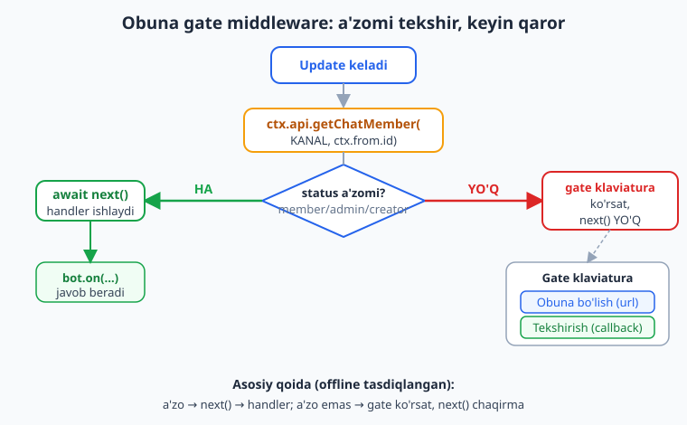
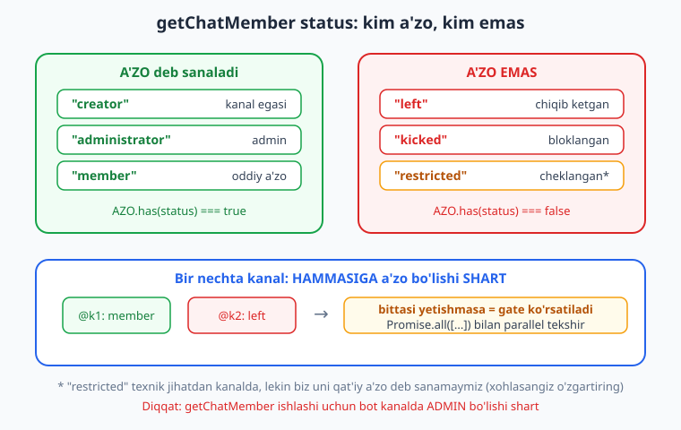
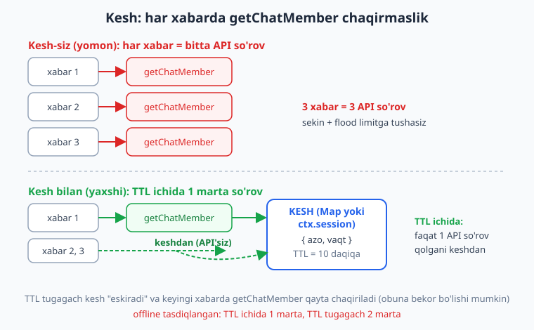

# 22 — Majburiy obuna

[⬅️ Oldingi: 21 — Kanallar bilan ishlash](./21-kanallar.md) · [🏠 README](./README.md) · [Keyingi: 23 — Telegram Web App (Mini App) asoslari ➡️](./23-webapp-asoslari.md)

---

> **Bu bobda:** "Majburiy obuna" naqshini — foydalanuvchi botdan foydalanishdan **oldin** bir yoki bir nechta kanalga obuna bo'lishi shartligini — to'liq quramiz. Avval g'oyani (nega marketingda ishlatiladi va qachon zarar keltiradi) tushunamiz, so'ng **obuna gate middleware**'ni yozamiz: u har xabardan oldin `getChatMember` bilan a'zolikni tekshiradi, a'zo bo'lmasa "Obuna bo'ling" klaviaturasini (kanal havolasi + "Tekshirish" tugmasi) ko'rsatib `next()` ni **chaqirmaydi**, a'zo bo'lsa o'tkazadi. `getChatMember` qaytargan `status` qiymatlarini (`"creator"`/`"administrator"`/`"member"` = a'zo; `"left"`/`"kicked"`/`"restricted"` = yo'q) o'rganamiz; **bir nechta kanal**ni `Promise.all` bilan tekshiramiz; "Tekshirish" callback'ini yozamiz; har xabarda `getChatMember` chaqirish sekin va flood xavfli bo'lgani uchun natijani **TTL bilan keshlaymiz** (`Map` yoki `ctx.session`); va private kanal uchun `chat_join_request` -> `approveChatJoinRequest`/`declineChatJoinRequest` hamda `createChatInviteLink` bilan join-request havolasini ko'ramiz.
>
> **Halollik eslatmasi:** Bu bobdagi BARCHA mantiq — gate middleware'ning a'zo/a'zo-emas ikki yo'li (`next()` chaqirish yoki to'xtatish), `status` xaritasi, bir nechta kanal, "Tekshirish" callback (tasdiq + `editMessageText` yoki `show_alert`), kesh TTL ichida/tashqarisida `getChatMember` chaqirilish soni, `chat_join_request` approve/decline va `createChatInviteLink` — soxta `Update` ni `bot.handleUpdate` ga uzatib, chiqayotgan API chaqiruvlarini (`getChatMember` javobini mock qilib) transformer bilan ushlab **offline ishga tushirib tasdiqlangan** (`node _verify_22.mjs`, 13/13 o'tdi). Jonli kanal a'zoligi, real havola yaratish va join-request'larni Telegram tomonidan yuborilishi token, internet va botning kanalda **admin** bo'lishini talab qiladi — u "illustrativ" deb belgilanadi.

---

## Majburiy obuna nima?

"Majburiy obuna" (yoki "obuna gate", "force subscribe") — bu botning shunday sozlanishi: foydalanuvchi botning asosiy funksiyasidan foydalana olishidan **oldin** bir yoki bir nechta kanalga (yoki guruhga) obuna bo'lishi **shart**. Obuna bo'lmaguncha bot har bir xabarga "Avval obuna bo'ling" deb javob beradi va tugmalar ko'rsatadi.

Bu — eng keng tarqalgan Telegram marketing usullaridan biri. Mantiq oddiy: botning qiymatli kontenti (kino, kitob, kod, AI javoblari) "to'lov" sifatida kanal obunasini talab qiladi. Kanal egasi shu yo'l bilan auditoriya yig'adi.

> **Diqqat — bu qilich ikki tomonlama:** Majburiy obuna foydalanuvchini **bezovta qiladi**. Ko'p kanallar talab qilish, obuna bo'lib darrov chiqib ketish (faqat botdan foydalanish uchun), past sifatli "majburiy" auditoriya — bularning hammasi real muammo. Telegram'ning o'zi ham bunday botlarni vaqti-vaqti bilan cheklaydi. Shuning uchun: **kerak bo'lsa 1 ta kanal**, foydalanuvchiga aniq tushuntiring, va botning asosiy qiymati obunaga arziydigan bo'lsin. Texnikani o'rganamiz, lekin uni mas'uliyat bilan ishlating.

Texnik jihatdan bu naqsh uchta blokdan iborat:

1. **Gate middleware** — har update'dan oldin a'zolikni tekshiradi (09-bobdagi middleware g'oyasi).
2. **`getChatMember`** — Telegram'dan foydalanuvchining kanaldagi statusini so'raydi (21-bobdagi kanal ishi).
3. **Kesh** — har xabarda Telegram'ga so'rov yubormaslik uchun natijani vaqtincha saqlaydi (10-bobdagi sessiya/kesh g'oyasi).

Uchchalasini birma-bir quramiz.

## Obuna gate middleware

Eng muhim qism — **gate middleware**. U 09-bobdagi `(ctx, next) => {}` naqshining aniq qo'llanishi: a'zo bo'lsa `next()` chaqiradi (botning qolgan handlerlari ishlaydi), a'zo bo'lmasa `next()` ni **chaqirmaydi** va gate klaviaturasini ko'rsatadi.



```js
import { Bot, InlineKeyboard } from "grammy";

const bot = new Bot(process.env.BOT_TOKEN);

const KANAL = "@mychannel";                 // bot ADMIN bo'lgan kanal username'i
const KANAL_URL = "https://t.me/mychannel"; // ochiq havola (tugma uchun)
const AZO = new Set(["member", "administrator", "creator"]); // "a'zo" statuslari

bot.use(async (ctx, next) => {
  // /start kabi ba'zi narsalarni gate'siz o'tkazmoqchi bo'lsangiz, bu yerda istisno qiling
  const userId = ctx.from?.id;
  if (userId === undefined) return await next(); // foydalanuvchisiz update (kanal posti va h.k.)

  const azo = await ctx.api.getChatMember(KANAL, userId);
  if (!AZO.has(azo.status)) {
    const kb = new InlineKeyboard()
      .url("Obuna bo'lish", KANAL_URL).row()
      .text("Tekshirish", "obuna:tekshir");
    await ctx.reply("Botdan foydalanish uchun avval kanalga obuna bo'ling:", {
      reply_markup: kb,
    });
    return; // next() YO'Q -> pastdagi handlerlar ishlamaydi (gate yopiq)
  }

  await next(); // a'zo -> davom etamiz, qolgan bot ochiq
});

// Bu handlerlar faqat a'zo foydalanuvchilarga yetib boradi:
bot.command("start", (ctx) => ctx.reply("Salom! Botga xush kelibsiz."));
bot.on("message:text", (ctx) => ctx.reply("Sizning xabaringizni oldim."));

bot.start(); // illustrativ: jonli polling token talab qiladi
```

Offline sinovda biz ikki holatni ham tekshirdik:

- **A'zo foydalanuvchi** (`status: "member"`) — gate `next()` ni chaqirdi, handler ishladi, foydalanuvchi `"Sizning xabaringizni oldim."` oldi (gate matni umuman chiqmadi).
- **A'zo emas** (`status: "left"`) — gate `"Botdan foydalanish uchun..."` matnini va klaviaturani ko'rsatdi, handler **ishlamadi** (`next()` chaqirilmadi). Klaviaturada `url` tugma (kanal havolasi) va `callback_data: "obuna:tekshir"` tugma bor edi.

> **Eslatma — tartib muhim (09-bob):** Gate middleware botning **eng oldida** turishi kerak — boshqa barcha handlerlardan oldin. Aks holda gate'dan oldin yozilgan handler `next()` ni chaqirmay zanjirni to'xtatib qo'yadi va gate umuman ishlamaydi. `bot.use(gate)` ni handlerlardan oldin yozing.

> **Diqqat — `/start` ni gate'dan tashqarida qoldirish:** Ko'pincha `/start` buyrug'i gate'ga **tushmasligi** kerak — chunki yangi foydalanuvchi botni endigina ochganda unga umumiy salom va obuna ko'rsatmasini berish kerak, "Avval obuna bo'ling" jumlasi emas. Buning ikki yo'li bor: (1) gate ichida `if (ctx.message?.text === "/start") return await next();` deb istisno qilish, yoki (2) `/start` ni gate'dan **oldin** ro'yxatdan o'tkazib, qolgan hamma narsani gate ostidagi `Composer` ga joylashtirish (pastda "Gate'ni qisman qo'llash" bo'limida ko'ramiz). Buni offline tasdiqladik.

## `getChatMember` va `status` tekshirish

Gate'ning yuragi — `getChatMember`. Bu Telegram Bot API metodi foydalanuvchining ma'lum chatdagi (kanal/guruh) holatini qaytaradi. grammY'da uni ikki shaklda chaqirish mumkin:

```js
// 1) ctx.api orqali (chat_id ni o'zingiz berasiz) — gate middleware uchun shu qulay:
const azo = await ctx.api.getChatMember(KANAL, userId);

// 2) ctx alias orqali (HOZIRGI chat uchun, chat_id avtomatik) — guruh ichidagi handlerda:
const azo2 = await ctx.getChatMember(userId); // 21-bobdagi kabi
```

Qaytgan obyektning eng muhim maydoni — `status`. U quyidagi qiymatlardan birini oladi:



| `status` | Ma'nosi | A'zo deb sanaymizmi? |
|---|---|---|
| `"creator"` | Kanal egasi | Ha |
| `"administrator"` | Admin | Ha |
| `"member"` | Oddiy a'zo | Ha |
| `"restricted"` | Cheklangan (a'zo, lekin huquqlari kesilgan) | Odatda yo'q* |
| `"left"` | Chiqib ketgan / hech qachon a'zo bo'lmagan | Yo'q |
| `"kicked"` | Bloklangan (banlangan) | Yo'q |

\* `"restricted"` nozik holat: foydalanuvchi texnik jihatdan kanalda, lekin huquqlari cheklangan. Biz **qat'iy** yondashib uni a'zo deb sanamaymiz (ko'pchilik botlar shunday qiladi). Xohlasangiz, o'z `AZO` to'plamingizga `"restricted"` ni qo'shishingiz mumkin — bu siyosat qarori.

Shuning uchun a'zolikni tekshirishning eng toza yo'li — **to'plam**:

```js
const AZO = new Set(["member", "administrator", "creator"]);
const azoMi = AZO.has(azo.status); // true yoki false
```

Bu `if (status === "member" || status === "administrator" || ...)` dan ancha o'qiluvchan va xatosiz.

> **Diqqat — eng ko'p uchraydigan xato:** `getChatMember` ishlashi uchun **bot kanalda admin bo'lishi shart**. Aks holda Telegram `Bad Request: member list is inaccessible` yoki shunga o'xshash xato qaytaradi (`GrammyError`). Demak: botni kanalga admin qiling (kamida "a'zolarni ko'rish" huquqi bilan), keyin gate ishlaydi. Buni botingiz `bot.catch` (08-bob) bilan ushlab, log'lab boring — gate xato berganda butun bot qotmasin.

### Bir nechta kanal — hammasiga a'zo bo'lishi shart

Agar bir nechta kanalga obunani talab qilsangiz, **har biri** uchun `getChatMember` chaqirib, **hammasiga** a'zo ekanini tekshirasiz. So'rovlarni ketma-ket emas, **parallel** (`Promise.all`) yuborgan ma'qul — tezroq:

```js
const KANALLAR = ["@kanal1", "@kanal2"];

async function yetishmaganlar(ctx) {
  const userId = ctx.from.id;
  const natijalar = await Promise.all(
    KANALLAR.map((k) => ctx.api.getChatMember(k, userId))
  );
  // a'zo BO'LMAGAN kanallar ro'yxati:
  return KANALLAR.filter((k, i) => !AZO.has(natijalar[i].status));
}
```

Gate'da:

```js
bot.use(async (ctx, next) => {
  if (ctx.from?.id === undefined) return await next();

  const qoldi = await yetishmaganlar(ctx);
  if (qoldi.length > 0) {
    const kb = new InlineKeyboard();
    for (const k of qoldi) {
      // har kanal uchun tugma (username'dan havola yasaymiz)
      kb.url(`Obuna: ${k}`, `https://t.me/${k.replace("@", "")}`).row();
    }
    kb.text("Tekshirish", "obuna:tekshir");
    await ctx.reply("Quyidagi kanallarga obuna bo'ling:", { reply_markup: kb });
    return;
  }
  await next();
});
```

Offline sinovda foydalanuvchi `@k1` da a'zo, `@k2` da emas edi — gate aynan `"@k2"` ni ko'rsatdi va `next()` ni chaqirmadi. Faqat **yetishmagan** kanallar tugma sifatida chiqdi.

## "Tekshirish" callback

Foydalanuvchi kanalga obuna bo'lgach, "Tekshirish" tugmasini bosadi. Bizning callback handlerimiz **qayta** `getChatMember` chaqiradi va natijaga qarab ish ko'radi (07-bobdagi callback bilimi):

```js
bot.callbackQuery("obuna:tekshir", async (ctx) => {
  const userId = ctx.from.id;
  const azo = await ctx.api.getChatMember(KANAL, userId);

  if (AZO.has(azo.status)) {
    // Obuna tasdiqlandi -> gate'ni olib tashlaymiz va davom etamiz
    await ctx.answerCallbackQuery({ text: "Rahmat! Endi botdan foydalanishingiz mumkin." });
    await ctx.editMessageText("Obuna tasdiqlandi. /start ni bosing yoki xabar yuboring.");
  } else {
    // Hali ham obuna emas -> ogohlantiruvchi oyna (gate qoladi)
    await ctx.answerCallbackQuery({
      text: "Siz hali obuna bo'lmadingiz. Obuna bo'ling va qaytadan bosing.",
      show_alert: true, // foydalanuvchiga katta oyna ko'rsatadi
    });
  }
});
```

Offline ikki holatni ham tasdiqladik:

- **Endi a'zo** (`"member"`) — `answerCallbackQuery` toast (`"Rahmat!..."`) + `editMessageText` bilan gate xabari "Obuna tasdiqlandi" ga almashtirildi.
- **Hali a'zo emas** (`"left"`) — `answerCallbackQuery` `show_alert: true` bilan ogohlantirish oynasi chiqdi, `editMessageText` **chaqirilmadi** (gate xabari o'rnida qoldi).

> **Eslatma — `show_alert`:** `answerCallbackQuery({ text, show_alert: false })` ekranning tepasida kichik "toast" ko'rsatadi (bir necha soniya). `show_alert: true` esa foydalanuvchi "OK" bosguncha turadigan modal oyna chiqaradi — muhim xabar uchun (masalan "Siz hali obuna emassiz") shu yaxshiroq.

> **Diqqat — `answerCallbackQuery` ni unutmang:** Har bir callback'ga `answerCallbackQuery` chaqirilishi **shart**, aks holda tugmada "soat" aylanaverib qoladi (07-bobda ko'rgan edik). Hatto matnsiz `ctx.answerCallbackQuery()` ham yetadi.

## Kesh — har xabarda `getChatMember` chaqirmaslik

Gate middleware **har bir** update'da ishlaydi. Agar har xabarda `getChatMember` chaqirsangiz, ikki muammo paydo bo'ladi:

1. **Sekinlik** — har xabarga Telegram'ga qo'shimcha so'rov, ya'ni qo'shimcha kechikish.
2. **Flood / rate-limit** — faol bot uchun bu juda ko'p so'rov; Telegram limitlari (`429 Too Many Requests`) ga tushib qolishingiz mumkin.

Yechim — a'zolik holatini **TTL** (yashash muddati) bilan **keshlash**: bir marta tekshirib, natijani vaqtincha eslab qolasiz va TTL tugamaguncha qayta so'ramaysiz.



### Map bilan kesh (eng sodda)

```js
const obunaKesh = new Map();          // userId -> { azo: boolean, vaqt: number }
const KESH_TTL = 10 * 60 * 1000;      // 10 daqiqa (ms)

async function obunaTekshir(ctx) {
  const userId = ctx.from.id;
  const yozuv = obunaKesh.get(userId);
  const hozir = Date.now();

  // Kesh yangimi? -> keshdan qaytar (getChatMember CHAQIRILMAYDI)
  if (yozuv && hozir - yozuv.vaqt < KESH_TTL) {
    return yozuv.azo;
  }

  // Kesh yo'q yoki eskirdi -> Telegram'dan so'raymiz va keshga yozamiz
  const azo = await ctx.api.getChatMember(KANAL, userId);
  const natija = AZO.has(azo.status);
  obunaKesh.set(userId, { azo: natija, vaqt: hozir });
  return natija;
}

bot.use(async (ctx, next) => {
  if (ctx.from?.id === undefined) return await next();
  if (await obunaTekshir(ctx)) {
    await next();
  } else {
    const kb = new InlineKeyboard()
      .url("Obuna bo'lish", KANAL_URL).row()
      .text("Tekshirish", "obuna:tekshir");
    await ctx.reply("Avval kanalga obuna bo'ling:", { reply_markup: kb });
  }
});
```

Offline sinovda (vaqtni `now` o'zgaruvchisi bilan boshqarib):

- Birinchi xabar -> `getChatMember` **1 marta** chaqirildi, natija keshga yozildi.
- TTL ichidagi ikkinchi xabar -> **keshdan** olindi, `getChatMember` **chaqirilmadi** (jami hali 1 marta).
- TTL tugagandan keyingi xabar -> kesh "eskirdi", `getChatMember` **qayta** chaqirildi (jami 2 marta).

Aynan kutilganidek: TTL ichida 1, TTL tashqarisida qayta.

> **Diqqat — "Tekshirish" tugmasi keshni yangilashi kerak:** Agar callback'da yangi a'zolikni tekshirib, keshni **yangilamasangiz**, foydalanuvchi obuna bo'lib "Tekshirish" bossa ham, gate middleware eski keshlangan `false` ni o'qib uni yana to'xtatishi mumkin. Yechim: "Tekshirish" callback'ida `obunaKesh.set(userId, { azo: true, vaqt: Date.now() })` deb keshni darrov yangilang (yoki `obunaKesh.delete(userId)` bilan tozalang, keyingi xabarda qaytadan tekshirilsin).

### `ctx.session` bilan kesh (10-bob)

`Map` xotirada yashaydi — bot qayta ishga tushsa yo'qoladi va cheksiz o'sib xotira "sizdirishi" mumkin (09-bobdagi throttling `Map` bilan bir muammo). Jiddiyroq variant — a'zolik holatini foydalanuvchining **sessiyasida** saqlash (10-bob):

```js
import { session } from "grammy";

bot.use(session({ initial: () => ({ obuna: null }) })); // { azo, vaqt } yoki null

bot.use(async (ctx, next) => {
  if (ctx.from?.id === undefined) return await next();
  const s = ctx.session;
  const hozir = Date.now();

  let azo;
  if (s.obuna && hozir - s.obuna.vaqt < KESH_TTL) {
    azo = s.obuna.azo;                                   // keshdan
  } else {
    const m = await ctx.api.getChatMember(KANAL, ctx.from.id);
    azo = AZO.has(m.status);
    s.obuna = { azo, vaqt: hozir };                      // sessiyaga yoz
  }

  if (azo) return await next();
  const kb = new InlineKeyboard().url("Obuna", KANAL_URL).row().text("Tekshirish", "obuna:tekshir");
  await ctx.reply("Avval obuna bo'ling:", { reply_markup: kb });
});
```

Offline sinovda sessiya keshi ham aynan ishladi: TTL ichidagi ikki xabar uchun `getChatMember` **1 marta** chaqirildi. Sessiyani `FileAdapter` yoki SQLite (10-bob) bilan doimiy qilsangiz, kesh bot qayta ishga tushganda ham saqlanadi.

> **Anti-eskirish:** Hozir grammY ekotizimida obuna-gate'ni avtomatlashtiradigan rasmiy plagin **yo'q** — bu naqshni odatda qo'lda quramiz (bobdagi kabi). Internetda turli "force-sub" kutubxonalari uchrashi mumkin, lekin ular grammY'ning rasmiy qismi emas; ishlatishdan oldin manbasini va `getChatMember`/kesh mantig'ini tekshiring. Bu yerda men hech qanday tashqi plagin API'sini ixtiro qilmayman — qo'lda yondashuv eng ishonchli va shaffof.

## Private kanal: `chat_join_request`

Yuqoridagi gate **ochiq** (public) kanal uchun ishlaydi: foydalanuvchi havolaga bosib darrov a'zo bo'ladi. Ammo **private** (yopiq) kanalda ochiq username yo'q, va a'zolik **admin tasdig'i** orqali bo'ladi. Bu yerda boshqa naqsh ishlatiladi: **join-request (qo'shilish so'rovi)**.

Oqim shunday:

1. Siz private kanalga **join-request rejimli** invite-havola yaratasiz (`createChatInviteLink({ creates_join_request: true })`).
2. Foydalanuvchi havolaga bosadi -> Telegram darrov a'zo qilmaydi, balki **so'rov** yuboradi.
3. Botingizga `chat_join_request` update keladi.
4. Bot so'rovni **tasdiqlaydi** (`approveChatJoinRequest`) yoki **rad etadi** (`declineChatJoinRequest`) — masalan to'lov qilganlarni avtomatik tasdiqlash.

```js
const RUXSAT = new Set([111, 222]); // ruxsat etilgan foydalanuvchilar (masalan to'lov qilganlar)

bot.on("chat_join_request", async (ctx) => {
  const userId = ctx.from.id;       // so'rov yuborgan foydalanuvchi
  // ctx.chat — so'rov yuborilgan kanal (21-bobda ko'rgan edik)

  if (RUXSAT.has(userId)) {
    await ctx.approveChatJoinRequest(userId); // tasdiqlaymiz
    // Foydalanuvchiga shaxsiy xabar yuborish mumkin (5 daqiqa oynasi bor):
    await ctx.api.sendMessage(userId, "Kanalga qo'shildingiz, xush kelibsiz!");
  } else {
    await ctx.declineChatJoinRequest(userId); // rad etamiz
  }
});
```

Offline sinovda biz ikki yo'lni ham ko'rdik:

- Ruxsat etilgan foydalanuvchi (`777`, `RUXSAT` da bor) -> `approveChatJoinRequest` `user_id: 777` bilan chaqirildi.
- Ruxsat etilmagan (`555`) -> `declineChatJoinRequest` `user_id: 555` bilan chaqirildi, `approve` umuman chaqirilmadi.

> **Eslatma — `ctx.from` va `ctx.chat` join-request'da:** `chat_join_request` update'ida `ctx.from` = so'rov yuborgan **foydalanuvchi**, `ctx.chat` = so'rov yuborilgan **kanal**. Shuning uchun `ctx.approveChatJoinRequest(ctx.from.id)` to'g'ri ishlaydi — chat_id ham, user_id ham `ctx` dan keladi. Update tuzilishi `manage.d.ts` da tasdiqlangan.

> **Diqqat — `user_chat_id` (5 daqiqalik oyna):** Update'da `ctx.chatJoinRequest.user_chat_id` bo'ladi — bu foydalanuvchi bilan **shaxsiy chat** ID'si. Bot uni so'rov **qayta ishlanmaguncha** (5 daqiqa) foydalanuvchiga to'g'ridan-to'g'ri xabar yuborish uchun ishlatishi mumkin, foydalanuvchi botni ilgari ishga tushirmagan bo'lsa ham. Ko'p hollarda `user_chat_id` foydalanuvchi `id` siga teng bo'ladi.

### Join-request havolasini yaratish

Private kanal uchun invite-havolani bot yaratadi (bot kanalda admin va `can_invite_users` huquqiga ega bo'lishi shart):

```js
bot.command("havola", async (ctx) => {
  // Diqqat: bu komandani private kanal ichida YOKI api'ga chat_id berib chaqiring.
  // Bu yerda HOZIRGI chat uchun (ctx alias) yaratamiz:
  const link = await ctx.createChatInviteLink({
    creates_join_request: true, // havola = darrov a'zo emas, SO'ROV yuboradi
    name: "Reklama kampaniyasi", // ixtiyoriy nom (admin paneli uchun)
  });
  await ctx.reply(`Join-request havola:\n${link.invite_link}`);
});
```

Offline sinovda `createChatInviteLink` `creates_join_request: true` va `name: "Reklama"` bilan chaqirildi va qaytgan `invite_link` (`https://t.me/+...` ko'rinishida) o'qildi.

> **Illustrativ:** Real havola yaratish, foydalanuvchi unga bosishi va `chat_join_request` update'ining kelishi jonli kanal, internet va botning kanalda `can_invite_users` huquqli admin bo'lishini talab qiladi. Yuqoridagi kod naqshlari offline tasdiqlangan, lekin "havola ishladi, foydalanuvchi qo'shildi" deyish uchun jonli muhit kerak — bu qism illustrativ.

> **Anti-eskirish — `chat_join_request` ni eshitish uchun `allowed_updates`:** Polling/webhook'da `chat_join_request` update'lari **standart** keladi (u Telegram'ning standart `allowed_updates` ro'yxatida). Lekin agar siz `bot.start({ allowed_updates: [...] })` yoki `setWebhook({ allowed_updates: [...] })` da ro'yxatni **qo'lda** chekladingiz va `"chat_join_request"` ni unutdingiz, update'lar **kelmaydi**. grammY'ning [`@grammyjs/types`](https://grammy.dev) yordamida to'liq ro'yxatni olishingiz mumkin. Aniq sintaksisni rasmiy hujjatdan oling — bu yerda ixtiro qilmayman.

## Gate'ni qisman qo'llash (`Composer` bilan)

Ba'zan butun botni gate ostiga olish noto'g'ri — masalan `/start`, `/help` ochiq bo'lishi, qolgan funksiyalar yopiq bo'lishi kerak. 09-bobdagi `Composer` aynan shu uchun:

```js
import { Composer } from "grammy";

// Ochiq buyruqlar (gate'dan TASHQARIDA):
bot.command("start", (ctx) => ctx.reply("Xush kelibsiz! Botdan foydalanish uchun obuna bo'ling."));
bot.command("help", (ctx) => ctx.reply("Yordam: ..."));

// Qolgan hamma narsa gate ostida:
const himoyalangan = new Composer();
himoyalangan.use(async (ctx, next) => {
  const m = await ctx.api.getChatMember(KANAL, ctx.from.id);
  if (!AZO.has(m.status)) {
    await ctx.reply("Bu funksiya uchun obuna shart.", {
      reply_markup: new InlineKeyboard().url("Obuna", KANAL_URL).row().text("Tekshirish", "obuna:tekshir"),
    });
    return;
  }
  await next();
});
himoyalangan.on("message:text", (ctx) => ctx.reply("Maxsus kontent (faqat obunachilar uchun)"));

bot.use(himoyalangan);
```

Offline sinovda `/start` gate'siz ishladi (`"Xush kelibsiz!..."`), oddiy matn esa gate'da to'xtadi (`"Bu funksiya uchun obuna shart."`). Bu — eng moslashuvchan naqsh: ochiq va yopiq qismlarni aniq ajratasiz.

> **Eslatma — Python ekvivalenti:** aiogram'da bu naqsh `Router` va outer-middleware bilan quriladi, `getChatMember` esa `bot.get_chat_member(...)` deb chaqiriladi. Mantiq aynan bir xil (a'zolik tekshir -> o'tkaz yoki to'xtat). Solishtirib ko'rishni xohlasangiz, [Telegram bot (Python/aiogram) kitobining 22-bobiga](../tgbot-python/22-majburiy-obuna.md) qarang.

## Tez-tez uchraydigan xatolar

| Xato | Sabab | Yechim |
|---|---|---|
| `getChatMember` `Bad Request: member list is inaccessible` beradi | Bot kanalda admin emas | Botni kanalga admin qiling (a'zolarni ko'rish huquqi bilan) |
| Gate hech qachon ishlamayapti, hamma o'tib ketyapti | `getChatMember` xato berib `bot.catch` da yutilyapti yoki `AZO` to'plami noto'g'ri | Xatoni log'lang; `status` qiymatlarini tekshiring (`"member"`/`"administrator"`/`"creator"`) |
| Bot juda sekin / `429 Too Many Requests` | Har xabarda `getChatMember` chaqirilyapti (kesh yo'q) | Natijani TTL bilan keshlang (`Map` yoki `ctx.session`) |
| Foydalanuvchi obuna bo'ldi, lekin gate hali ham to'xtatyapti | Kesh eski `false` ni saqlab turibdi | "Tekshirish" callback'ida keshni yangilang yoki `delete` qiling |
| Tugmadagi "soat" aylanaverib qolyapti | `answerCallbackQuery` chaqirilmagan | Har callback oxirida `ctx.answerCallbackQuery()` ni chaqiring |
| Private kanal havolasi darrov a'zo qilyapti (so'rov emas) | `creates_join_request: true` berilmagan | `createChatInviteLink({ creates_join_request: true })` ishlating |
| `chat_join_request` update kelmayapti | `allowed_updates` da `"chat_join_request"` yo'q yoki bot admin emas | `allowed_updates` ro'yxatiga qo'shing; botni admin qiling (`can_invite_users`) |
| Gate `/start` ni ham bloklayapti (yangi foydalanuvchi qiynaladi) | `/start` gate ostida | `/start` ni gate'dan oldin yoki `Composer` tashqarisida ro'yxatdan o'tkazing |

---

## Mashqlar

> Quyidagi mashqlarning ko'pi **offline** tekshiriladi — `bot.handleUpdate(update)` ga soxta update uzatib, `getChatMember` javobini transformer'da mock qilasiz (a'zo/a'zo-emas) va chiqayotgan chaqiruvlarni (`sendMessage`, `answerCallbackQuery`, `approveChatJoinRequest`, ...) `assert` qilasiz. Buyruq update'iga `entities:[{type:"bot_command",offset:0,length:N}]` qo'shishni unutmang. Transformer naqshi: `getChatMember` da `payload.user_id`/`payload.chat_id` ga qarab kerakli `status` qaytaring.

### Oson

1. **A'zo o'tadi.** `status: "member"` qaytaradigan mock bilan gate middleware yozing. A'zo foydalanuvchidan oddiy matn uzating va handler ishlaganini (gate matni chiqmaganini) tasdiqlang.

2. **A'zo emas to'xtaydi.** `status: "left"` mock bilan gate yozing. Xabar uzating va (a) handler ISHLAMAGANINI, (b) gate matni `"...obuna bo'ling"` chiqqanini tasdiqlang.

3. **`AZO` to'plami.** `const AZO = new Set(["member","administrator","creator"])` yarating. `AZO.has("creator")`, `AZO.has("administrator")`, `AZO.has("member")` `true`; `AZO.has("left")`, `AZO.has("kicked")`, `AZO.has("restricted")` `false` ekanini `assert` qiling.

4. **Gate klaviaturasi.** A'zo emas holatda gate yuborgan `reply_markup` ichida birinchi qatorda `url` tugma, ikkinchi qatorda `callback_data: "obuna:tekshir"` tugma borligini tasdiqlang.

### O'rta

5. **Bir nechta kanal.** Ikki kanal (`@k1`, `@k2`). Mock'da foydalanuvchi faqat `@k1` da a'zo (`@k2` da `"left"`). Gate `Promise.all` bilan tekshirsin va gate matnida faqat `@k2` ko'rsatilganini tasdiqlang. Handler ishlamaganini ham.

6. **Hammasiga a'zo.** 5-mashqdagi sozlama, lekin mock ikkala kanalda ham `"member"` qaytarsin. Handler ISHLAGANINI (gate o'tkazganini) tasdiqlang.

7. **Tekshirish callback — a'zo.** `obuna:tekshir` callback handleri yozing. Mock `"member"` qaytarsin. `answerCallbackQuery` matni `"Rahmat!..."` va `editMessageText` chaqirilganini tasdiqlang.

8. **Tekshirish callback — a'zo emas.** 7-mashq, lekin mock `"left"` qaytarsin. `answerCallbackQuery` `show_alert: true` bilan chaqirilganini va `editMessageText` CHAQIRILMAGANINI tasdiqlang.

### Qiyin

9. **Kesh TTL ichida.** `Map` kesh + `obunaTekshir(ctx)` yozing (TTL = 10 daqiqa, vaqtni `now` o'zgaruvchisi bilan boshqaring). Ikki xabarni TTL ichida uzating va `getChatMember` FAQAT 1 marta chaqirilganini tasdiqlang.

10. **Kesh TTL tugagach.** 9-mashq, lekin ikkinchi xabarni `now += TTL + 1` dan keyin uzating. `getChatMember` 2 marta chaqirilganini tasdiqlang.

11. **`chat_join_request` approve/decline.** `RUXSAT = new Set([777])`. `chat_join_request` handler yozing. (a) `777` join-request uzating -> `approveChatJoinRequest(777)` chaqirilganini; (b) `555` uzating -> `declineChatJoinRequest(555)` chaqirilganini (approve emas) tasdiqlang.

12. **Join-request havola.** `bot.command("havola")` yozing: `createChatInviteLink({ creates_join_request: true, name: "Reklama" })` chaqirsin. Mock havola qaytarsin. Chaqiruv payload'ida `creates_join_request === true` va `name === "Reklama"` ekanini, hamda javobdagi `invite_link` ishlatilganini tasdiqlang.

13. **Kesh + Tekshirish.** Gate `Map` kesh ishlatadi. Foydalanuvchi avval `"left"` (gate to'xtatadi), keyin obuna bo'ladi (mock `"member"` ga o'tadi). "Tekshirish" callback keshni yangilasin (`kesh.set(id, {azo:true, ...})`). Keyingi xabarda handler ISHLAGANINI (gate o'tkazganini) `getChatMember` qayta chaqirmasdan tasdiqlang.

<details markdown="1">
<summary>Yechimlar</summary>

> Quyidagi yechimlar `_verify_22.mjs` dagi naqsh bilan offline ishga tushiriladi. `makeBot(statusMap)` transformer'i `getChatMember` ni `statusMap[user_id]` (default `"left"`) bilan mock qiladi; `mkText`, `mkCallback`, `mkJoinRequest` — soxta update yordamchilari. Qisqartirish uchun bu yordamchilar takrorlanmaydi (bob boshidagi halollik eslatmasiga qarang). `AZO`, `KANAL`, `KANAL_URL` — bobdagidek.

### 1-mashq yechimi

```js
const { bot, calls } = makeBot({ 777: "member" });
let handlerRan = false;
bot.use(async (ctx, next) => {
  const m = await ctx.api.getChatMember(KANAL, ctx.from.id);
  if (!AZO.has(m.status)) { await ctx.reply("Avval obuna bo'ling"); return; }
  await next();
});
bot.on("message:text", (ctx) => { handlerRan = true; return ctx.reply("Salom, a'zo!"); });
await bot.handleUpdate(mkText("salom"));
assert.equal(handlerRan, true);
const texts = calls.filter((c) => c.method === "sendMessage").map((c) => c.payload.text);
assert.deepEqual(texts, ["Salom, a'zo!"]); // gate matni YO'Q
```

A'zo (`"member"`) bo'lgani uchun `AZO.has` `true`, gate `next()` chaqirdi va handler ishladi. Gate matni umuman chiqmadi.

### 2-mashq yechimi

```js
const { bot, calls } = makeBot({ 777: "left" });
let handlerRan = false;
bot.use(async (ctx, next) => {
  const m = await ctx.api.getChatMember(KANAL, ctx.from.id);
  if (!AZO.has(m.status)) { await ctx.reply("Avval obuna bo'ling"); return; }
  await next();
});
bot.on("message:text", (ctx) => { handlerRan = true; });
await bot.handleUpdate(mkText("salom"));
assert.equal(handlerRan, false);                       // handler ishlamadi
const sm = calls.filter((c) => c.method === "sendMessage");
assert.equal(sm[0].payload.text, "Avval obuna bo'ling"); // gate matni chiqdi
```

`"left"` -> `AZO.has` `false` -> gate matni yuborildi va `next()` chaqirilmadi, shuning uchun handler `false` bo'lib qoldi.

### 3-mashq yechimi

```js
const AZO = new Set(["member", "administrator", "creator"]);
assert.equal(AZO.has("creator"), true);
assert.equal(AZO.has("administrator"), true);
assert.equal(AZO.has("member"), true);
assert.equal(AZO.has("left"), false);
assert.equal(AZO.has("kicked"), false);
assert.equal(AZO.has("restricted"), false); // qat'iy: restricted a'zo emas
```

`Set` bilan a'zolik tekshiruvi `if (status === ... || ...)` dan toza. `"restricted"` ni biz a'zo deb sanamaymiz (siyosat qarori).

### 4-mashq yechimi

```js
const { bot, calls } = makeBot({ 777: "left" });
bot.use(async (ctx, next) => {
  const m = await ctx.api.getChatMember(KANAL, ctx.from.id);
  if (!AZO.has(m.status)) {
    const kb = new InlineKeyboard().url("Obuna bo'lish", KANAL_URL).row().text("Tekshirish", "obuna:tekshir");
    await ctx.reply("Avval obuna bo'ling", { reply_markup: kb });
    return;
  }
  await next();
});
bot.on("message:text", (ctx) => {});
await bot.handleUpdate(mkText("salom"));
const rows = calls.find((c) => c.method === "sendMessage").payload.reply_markup.inline_keyboard;
assert.equal(rows[0][0].url, KANAL_URL);
assert.equal(rows[1][0].callback_data, "obuna:tekshir");
```

`InlineKeyboard` ikki qatorli klaviatura yasaydi: 1-qatorda `url` tugma, 2-qatorda `callback_data` tugma. grammY uni `reply_markup.inline_keyboard` massiviga aylantiradi.

### 5-mashq yechimi

```js
const KANALLAR = ["@k1", "@k2"];
const { bot, calls } = makeBot();
bot.api.config.use((prev, method, payload) => {
  if (method === "getChatMember") {
    const member = payload.chat_id === "@k1"; // faqat @k1 da a'zo
    return Promise.resolve({ ok: true, result: { status: member ? "member" : "left", user: { id: payload.user_id, is_bot: false, first_name: "U" } } });
  }
  return prev(method, payload);
});
let handlerRan = false;
bot.use(async (ctx, next) => {
  const r = await Promise.all(KANALLAR.map((k) => ctx.api.getChatMember(k, ctx.from.id)));
  const qoldi = KANALLAR.filter((k, i) => !AZO.has(r[i].status));
  if (qoldi.length) { await ctx.reply(`Obuna bo'ling: ${qoldi.join(", ")}`); return; }
  await next();
});
bot.on("message:text", (ctx) => { handlerRan = true; });
await bot.handleUpdate(mkText("salom"));
assert.equal(handlerRan, false);
assert.equal(calls.find((c) => c.method === "sendMessage").payload.text, "Obuna bo'ling: @k2");
```

`Promise.all` ikkala kanalni parallel tekshirdi; `filter` faqat a'zo bo'lmagan `@k2` ni qoldirdi va gate o'shani ko'rsatdi.

### 6-mashq yechimi

```js
const KANALLAR = ["@k1", "@k2"];
const { bot } = makeBot();
bot.api.config.use((prev, method, payload) => {
  if (method === "getChatMember") {
    return Promise.resolve({ ok: true, result: { status: "member", user: { id: payload.user_id, is_bot: false, first_name: "U" } } }); // har ikkisida a'zo
  }
  return prev(method, payload);
});
let handlerRan = false;
bot.use(async (ctx, next) => {
  const r = await Promise.all(KANALLAR.map((k) => ctx.api.getChatMember(k, ctx.from.id)));
  if (KANALLAR.some((k, i) => !AZO.has(r[i].status))) { await ctx.reply("Obuna shart"); return; }
  await next();
});
bot.on("message:text", (ctx) => { handlerRan = true; });
await bot.handleUpdate(mkText("salom"));
assert.equal(handlerRan, true); // hammasiga a'zo -> o'tdi
```

Ikkala kanalda ham `"member"` bo'lgani uchun `some(... !AZO.has ...)` `false` — gate `next()` chaqirdi va handler ishladi.

### 7-mashq yechimi

```js
const { bot, calls } = makeBot({ 777: "member" });
bot.callbackQuery("obuna:tekshir", async (ctx) => {
  const m = await ctx.api.getChatMember(KANAL, ctx.from.id);
  if (AZO.has(m.status)) {
    await ctx.answerCallbackQuery({ text: "Rahmat! Endi botdan foydalanishingiz mumkin." });
    await ctx.editMessageText("Obuna tasdiqlandi.");
  } else {
    await ctx.answerCallbackQuery({ text: "Hali ham obuna emassiz.", show_alert: true });
  }
});
await bot.handleUpdate(mkCallback("obuna:tekshir"));
assert.equal(calls.find((c) => c.method === "answerCallbackQuery").payload.text, "Rahmat! Endi botdan foydalanishingiz mumkin.");
assert.ok(calls.find((c) => c.method === "editMessageText"));
```

A'zo bo'lgani uchun callback tasdiq toast'i va `editMessageText` (gate xabarini almashtirish) chaqirildi.

### 8-mashq yechimi

```js
const { bot, calls } = makeBot({ 777: "left" });
bot.callbackQuery("obuna:tekshir", async (ctx) => {
  const m = await ctx.api.getChatMember(KANAL, ctx.from.id);
  if (AZO.has(m.status)) {
    await ctx.answerCallbackQuery({ text: "Rahmat!" });
    await ctx.editMessageText("Tasdiqlandi");
  } else {
    await ctx.answerCallbackQuery({ text: "Hali ham obuna emassiz.", show_alert: true });
  }
});
await bot.handleUpdate(mkCallback("obuna:tekshir"));
const acq = calls.find((c) => c.method === "answerCallbackQuery");
assert.equal(acq.payload.show_alert, true);
assert.equal(calls.find((c) => c.method === "editMessageText"), undefined); // gate qoladi
```

A'zo emas -> `show_alert: true` ogohlantirish oynasi chiqdi, `editMessageText` chaqirilmadi (gate xabari o'rnida qoldi).

### 9-mashq yechimi

```js
const { bot, calls } = makeBot({ 777: "member" });
const kesh = new Map();
const TTL = 10 * 60 * 1000;
let now = 1000;
async function azoMi(ctx) {
  const id = ctx.from.id;
  const y = kesh.get(id);
  if (y && now - y.vaqt < TTL) return y.azo;           // keshdan
  const m = await ctx.api.getChatMember(KANAL, id);
  const azo = AZO.has(m.status);
  kesh.set(id, { azo, vaqt: now });
  return azo;
}
bot.use(async (ctx, next) => { if (await azoMi(ctx)) await next(); });
bot.on("message:text", (ctx) => {});
await bot.handleUpdate(mkText("a", 1));
now += 1000;                                            // TTL ICHIDA
await bot.handleUpdate(mkText("b", 2));
assert.equal(calls.filter((c) => c.method === "getChatMember").length, 1); // FAQAT 1 marta
```

Ikkinchi xabar TTL ichida kelgani uchun natija keshdan olindi — `getChatMember` qayta chaqirilmadi.

### 10-mashq yechimi

```js
const { bot, calls } = makeBot({ 777: "member" });
const kesh = new Map();
const TTL = 10 * 60 * 1000;
let now = 1000;
async function azoMi(ctx) {
  const id = ctx.from.id;
  const y = kesh.get(id);
  if (y && now - y.vaqt < TTL) return y.azo;
  const m = await ctx.api.getChatMember(KANAL, id);
  const azo = AZO.has(m.status);
  kesh.set(id, { azo, vaqt: now });
  return azo;
}
bot.use(async (ctx, next) => { if (await azoMi(ctx)) await next(); });
bot.on("message:text", (ctx) => {});
await bot.handleUpdate(mkText("a", 1));
now += TTL + 1;                                         // TTL TUGADI
await bot.handleUpdate(mkText("b", 2));
assert.equal(calls.filter((c) => c.method === "getChatMember").length, 2); // qayta tekshirildi
```

Ikkinchi xabar TTL tugagandan keyin kelgani uchun kesh "eskirdi" va `getChatMember` qayta chaqirildi.

### 11-mashq yechimi

```js
const { bot, calls } = makeBot();
const RUXSAT = new Set([777]);
bot.on("chat_join_request", async (ctx) => {
  if (RUXSAT.has(ctx.from.id)) await ctx.approveChatJoinRequest(ctx.from.id);
  else await ctx.declineChatJoinRequest(ctx.from.id);
});
await bot.handleUpdate(mkJoinRequest(777));
assert.equal(calls.find((c) => c.method === "approveChatJoinRequest").payload.user_id, 777);
await bot.handleUpdate(mkJoinRequest(555));
assert.equal(calls.find((c) => c.method === "declineChatJoinRequest").payload.user_id, 555);
```

`chat_join_request` da `ctx.from` so'rov yuborgan foydalanuvchi. Ruxsat etilganga `approve`, qolganiga `decline` chaqirildi.

### 12-mashq yechimi

```js
const { bot, calls } = makeBot(); // transformer createChatInviteLink uchun {invite_link:"https://t.me/+FAKEINVITE"} qaytaradi
let link = null;
bot.command("havola", async (ctx) => {
  const res = await ctx.createChatInviteLink({ creates_join_request: true, name: "Reklama" });
  link = res.invite_link;
  await ctx.reply(`Havola: ${link}`);
});
await bot.handleUpdate(mkText("/havola"));
const cil = calls.find((c) => c.method === "createChatInviteLink");
assert.equal(cil.payload.creates_join_request, true);
assert.equal(cil.payload.name, "Reklama");
assert.equal(link, "https://t.me/+FAKEINVITE");
```

`createChatInviteLink` join-request rejimida havola yaratdi (`creates_join_request: true`); qaytgan `invite_link` o'qildi.

### 13-mashq yechimi

```js
const { bot, calls } = makeBot();
let status = "left"; // boshida a'zo emas, keyin obuna bo'ladi
bot.api.config.use((prev, method, payload) => {
  if (method === "getChatMember") {
    return Promise.resolve({ ok: true, result: { status, user: { id: payload.user_id, is_bot: false, first_name: "U" } } });
  }
  return prev(method, payload);
});
const kesh = new Map();
const TTL = 600000; let now = 1000;
async function azoMi(ctx) {
  const id = ctx.from.id;
  const y = kesh.get(id);
  if (y && now - y.vaqt < TTL) return y.azo;
  const m = await ctx.api.getChatMember(KANAL, id);
  const azo = AZO.has(m.status);
  kesh.set(id, { azo, vaqt: now });
  return azo;
}
bot.use(async (ctx, next) => {
  if (ctx.callbackQuery) return await next(); // callback gate'dan o'tsin
  if (await azoMi(ctx)) await next(); else await ctx.reply("Obuna shart");
});
bot.callbackQuery("obuna:tekshir", async (ctx) => {
  const m = await ctx.api.getChatMember(KANAL, ctx.from.id);
  const azo = AZO.has(m.status);
  kesh.set(ctx.from.id, { azo, vaqt: now }); // KESHNI YANGILA
  await ctx.answerCallbackQuery();
});
let handlerRan = false;
bot.on("message:text", (ctx) => { handlerRan = true; });

await bot.handleUpdate(mkText("a", 1));        // "left" -> gate to'xtatadi (kesh: false)
assert.equal(handlerRan, false);
status = "member";                              // foydalanuvchi obuna bo'ldi
await bot.handleUpdate(mkCallback("obuna:tekshir", 2)); // keshni true ga yangilaydi
const oldin = calls.filter((c) => c.method === "getChatMember").length;
await bot.handleUpdate(mkText("b", 3));         // keshdan true -> o'tadi
assert.equal(handlerRan, true);
assert.equal(calls.filter((c) => c.method === "getChatMember").length, oldin); // qayta chaqirilmadi
```

"Tekshirish" callback keshni `true` ga yangilagani uchun keyingi xabarda gate `getChatMember` ni **qayta chaqirmasdan** keshdan o'qib o'tkazdi. Bu — kesh + callback'ni to'g'ri bog'lashning kaliti (bobdagi "Tekshirish keshni yangilashi kerak" diqqatiga qarang).

</details>

---

[⬅️ Oldingi: 21 — Kanallar bilan ishlash](./21-kanallar.md) · [🏠 README](./README.md) · [Keyingi: 23 — Telegram Web App (Mini App) asoslari ➡️](./23-webapp-asoslari.md)
