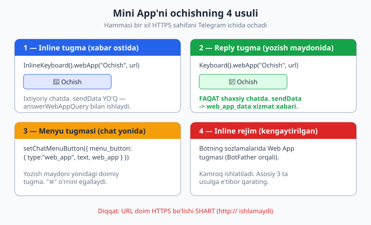
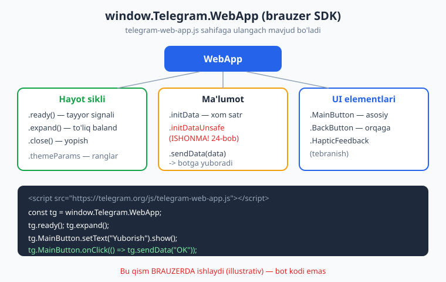
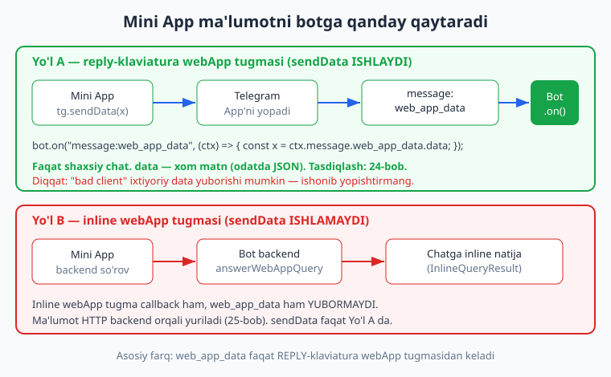

# 23 — Telegram Web App (Mini App) asoslari

[⬅️ Oldingi: 22 — Majburiy obuna](./22-majburiy-obuna.md) · [🏠 README](./README.md) · [Keyingi: 24 — Web App xavfsizligi: initData ➡️](./24-webapp-xavfsizlik.md)

---

> **Bu bobda:** Telegram'ning eng kuchli kengaytmasi — **Mini App** (eski nomi Web App) bilan tanishamiz. Mini App — bu Telegram ichida, alohida brauzer ochmasdan ko'rinadigan **to'liq HTML/CSS/JS sahifa**. Hamster Kombat, Notcoin kabi mashhur "clicker"lar, do'kon ilovalari, anketalar — hammasi Mini App'lar. Bu bobda biz to'rtta ochish usulini o'rganamiz: (1) inline tugma `InlineKeyboard().webApp(...)`, (2) reply klaviatura `Keyboard().webApp(...)`, (3) chat yonidagi menyu tugmasi `bot.api.setChatMenuButton(...)`, (4) inline rejim. Brauzer tomonida ishlaydigan `telegram-web-app.js` SDK'sini — `window.Telegram.WebApp` obyektining `.ready()`, `.expand()`, `.MainButton`, `.BackButton`, `.HapticFeedback`, `.sendData()` va `.initData` xossalarini — ko'rib chiqamiz. Eng muhimi: Mini App botingizga ma'lumotni qanday qaytaradi — `WebApp.sendData()` orqali yuborilgan ma'lumotni `bot.on("message:web_app_data")` handler'ida `ctx.message.web_app_data.data` dan o'qishni o'rganamiz.
>
> **Halollik eslatmasi:** Bobning **bot tomonidagi** kodi — `message:web_app_data` handler'i, `InlineKeyboard.webApp` / `Keyboard.webApp` tugma tuzilmasi, `setChatMenuButton` payload'i — `node`'da **offline ishga tushirib tekshirilgan** (`_verify_23.mjs`, 9/9 o'tdi): soxta bot qurib, `bot.api.config.use(...)` transformeri bilan chiqayotgan payload va kelayotgan `web_app_data` o'qilishini tasdiqladik. **Brauzer tomonidagi** kod (`window.Telegram.WebApp`, `.ready()`, `.MainButton`, `.sendData()`) — bu Telegram klientining JavaScript SDK'si, faqat real Telegram ilovasida ishlaydi; bunday joylar **"illustrativ"** deb belgilangan. `initData`ni tasdiqlash — keyingi **24-bobda** chuqur ochiladi.

---

## Mini App nima va u botdan nimasi bilan farq qiladi

Hozirgacha biz qurgan botlar **xabar almashish** orqali ishlardi: foydalanuvchi `/start` yuboradi, bot matn yoki tugma qaytaradi. Bu — chat interfeysi. Lekin ba'zi vazifalar uchun chat tor: tovarlar katalogini varaqlash, kalendardan sana tanlash, xaritada nuqta belgilash, murakkab forma to'ldirish. Bularning hammasi uchun bizga **to'liq grafik interfeys** kerak.

Aynan shu yerda **Mini App** yordamga keladi. Mini App — bu siz yozgan **oddiy veb-sahifa** (HTML + CSS + JavaScript), Telegram uni o'z ilovasi ichida, alohida oynada ochadi. Foydalanuvchi Telegram'dan chiqmaydi, brauzer ochilmaydi — sahifa Telegram interfeysiga "yopishgandek" ko'rinadi. Telegram bu sahifaga maxsus JavaScript SDK beradi (`window.Telegram.WebApp`), uning yordamida siz Telegram'ning rangiga moslashishingiz, "asosiy tugma" chiqarishingiz, telefonni tebratish (haptic) va ma'lumotni botga qaytarishingiz mumkin.

Mashhur misollar — barchasi Mini App:

- **Hamster Kombat**, **Notcoin** — "clicker" o'yinlari (bularni 26-bobda o'zimiz quramiz).
- Do'kon botlari — savatcha, to'lov, katalog.
- Bank/hamyon botlari — balans, o'tkazma.

> **Eslatma:** "Web App" va "Mini App" — bir narsa. Telegram 2023-yilda brendni "Mini Apps"ga o'zgartirdi, lekin API'da hamon `web_app`, `WebApp`, `web_app_data` nomlari ishlatiladi. Shuning uchun kodda har doim `web_app` ko'rasiz, gapda esa "Mini App" deymiz.

### Bot vs Mini App — kim nima qiladi

| | Oddiy bot (chat) | Mini App (veb-sahifa) |
|---|---|---|
| Interfeys | Xabarlar, tugmalar | To'liq HTML/CSS/JS |
| Qayerda ishlaydi | Telegram serverlari + sizning bot kodingiz | Foydalanuvchi qurilmasidagi brauzer dvigateli (Telegram ichida) |
| Til | Node.js (grammY) — server | HTML/CSS/JS — frontend |
| Hosting | Bot serveri (polling/webhook) | HTTPS veb-server (sahifani beradi) |
| Ma'lumot almashish | `ctx.reply`, `callback_query` | `WebApp.sendData()`, HTTP so'rovlar |

Eng muhim tushuncha: **bot va Mini App — ikki ALOHIDA dastur.** Bot — Node.js serverda ishlaydi (siz o'rgangan grammY kodi). Mini App — foydalanuvchi qurilmasida ochiladigan veb-sahifa, uni siz **alohida HTTPS manzilda** joylashtirasiz. Ular bir-biri bilan ikki yo'l orqali "gaplashadi": (A) Mini App `sendData()` orqali botga matn yuboradi, (B) Mini App backend'ga HTTP so'rov yuboradi (25-bobda).

> **Diqqat:** Mini App URL'i **doimo HTTPS** bo'lishi shart. `http://` manzil ishlamaydi — Telegram uni ochmaydi. Mahalliy ishlab chiqishda `ngrok` yoki `localtunnel` kabi vositalar bilan vaqtinchalik HTTPS tunnel quriladi (buni 25-bobda ko'ramiz).

---

## Mini App'ni ochishning 4 usuli

Mini App'ni foydalanuvchiga ochib berishning to'rtta yo'li bor. Hammasi bir xil HTTPS sahifani ochadi, lekin tugma turi va ma'lumot qaytarish imkoniyati farq qiladi.



### Usul 1 — Inline tugma (`InlineKeyboard().webApp`)

Eng ko'p ishlatiladigan usul. Xabar ostiga "yopishgan" inline tugma quyiladi, bosilganda Mini App ochiladi:

```js
import { Bot, InlineKeyboard } from "grammy";

const bot = new Bot(process.env.BOT_TOKEN);

bot.command("ilova", (ctx) => {
  const ik = new InlineKeyboard().webApp("🚀 Ilovani ochish", "https://mywebapp.example");
  return ctx.reply("Quyidagi tugmadan ilovani oching:", { reply_markup: ik });
});
```

Bu tugmaning ichki tuzilmasi (offline tasdiqlangan):

```js
const ik = new InlineKeyboard().webApp("Ochish", "https://mywebapp.example");
console.log(ik.inline_keyboard[0][0].text);          // "Ochish"
console.log(ik.inline_keyboard[0][0].web_app.url);    // "https://mywebapp.example"
console.log(ik.inline_keyboard[0][0].callback_data);  // undefined — bu CALLBACK emas!
```

> **Diqqat:** Inline `.webApp()` tugmasi `callback_data` **saqlamaydi**. Demak `bot.callbackQuery(...)` uni hech qachon ushlamaydi (06-07 boblardagi inline tugmalar bilan adashtirmang). Bu tugma bosilganda bot'ga update kelmaydi — faqat sahifa ochiladi. Ma'lumot qaytarish uchun yo `answerWebAppQuery` (quyida), yo HTTP backend kerak.

### Usul 2 — Reply klaviatura (`Keyboard().webApp`)

Yozish maydoni o'rnida turadigan reply tugma orqali ochish. **Bu usulning maxsus afzalligi bor:** faqat shu yo'l bilan ochilgan Mini App `sendData()` orqali botga to'g'ridan-to'g'ri ma'lumot yubora oladi (pastda batafsil).

```js
import { Keyboard } from "grammy";

bot.command("forma", (ctx) => {
  const kb = new Keyboard()
    .webApp("📱 Formani to'ldirish", "https://mywebapp.example/form")
    .resized();
  return ctx.reply("Formani ochish uchun tugmani bosing:", { reply_markup: kb });
});
```

Tuzilma (offline tasdiqlangan):

```js
const kb = new Keyboard().webApp("Ilovani ochish", "https://mywebapp.example").resized();
console.log(kb.keyboard[0][0].text);          // "Ilovani ochish"
console.log(kb.keyboard[0][0].web_app.url);    // "https://mywebapp.example"
```

> **Diqqat:** Reply klaviatura `.webApp()` tugmasi **faqat shaxsiy chatda** ishlaydi (guruhda emas). Bu Telegram cheklovi — `sendData` mexanizmi shaxsiy suhbatga bog'langan.

### Usul 3 — Chat menyu tugmasi (`setChatMenuButton`)

Yozish maydoni yonidagi doimiy tugma. Odatda u yerda "≡" (buyruqlar menyusi) turadi, lekin uni Mini App ochadigan tugmaga almashtirib qo'yish mumkin:

```js
await bot.api.setChatMenuButton({
  menu_button: {
    type: "web_app",
    text: "Do'kon",
    web_app: { url: "https://mywebapp.example/shop" },
  },
});
```

Bu yuboradigan payload (offline tasdiqlangan):

```js
// calls dagi setChatMenuButton chaqiruvi:
// {
//   method: "setChatMenuButton",
//   payload: { menu_button: { type:"web_app", text:"Do'kon",
//                             web_app:{ url:"https://mywebapp.example/shop" } } }
// }
```

`chat_id` bermasangiz — bu **standart** (default) menyu tugmasi, ya'ni hamma foydalanuvchilarga ko'rinadi. Aniq `chat_id` bersangiz — faqat o'sha foydalanuvchiga. Standart holatga qaytarish uchun `menu_button: { type: "commands" }` yoki `{ type: "default" }` yuboring.

> **Eslatma:** Joriy menyu tugmasini o'qish uchun `bot.api.getChatMenuButton({ chat_id })` bor — u `MenuButton` qaytaradi (`type` "commands" | "web_app" | "default"). Ko'pincha buni BotFather orqali bir marta sozlab qo'yish ham yetarli, lekin kod orqali har foydalanuvchiga moslab qo'yish kuchli.

### Usul 4 — Inline rejim

Bot sozlamalarida (BotFather: `/setmenubutton` yoki bot profilidagi maxsus tugma) Mini App'ni ulash mumkin. Bu kamroq ishlatiladi; amalda yuqoridagi uchta usul yetarli. Inline rejim (`inlineQuery`) bilan ham Mini App ochilishi mumkin, lekin u alohida mavzu (07-bobdagi inline rejimga qarang).

---

## Brauzer tomoni: `telegram-web-app.js` SDK (illustrativ)

Endi Mini App'ning **ichiga** kiramiz. Sahifangiz Telegram ichida ochilganda, sizga `window.Telegram.WebApp` degan global obyekt beriladi. Bu kod **brauzerda** (Telegram ilovasining ichki veb-ko'rinishida) ishlaydi — bot kodingizdan butunlay alohida.



SDK'ni ulash uchun sahifangizning `<head>`'iga bitta `<script>` qo'shasiz:

```html
<script src="https://telegram.org/js/telegram-web-app.js"></script>
```

> **Illustrativ:** Quyidagi barcha `window.Telegram.WebApp` kodi — brauzerda, real Telegram ichida ishlaydi. Uni `node`'da test qilib bo'lmaydi (chunki `window` yo'q). Shuning uchun bu qism halollik bilan "illustrativ" deb belgilangan. Bot tomonidagi qabul qilish kodi esa offline tasdiqlangan.

### Hayot sikli: `.ready()` va `.expand()`

```js
// (brauzerda) — illustrativ
const tg = window.Telegram.WebApp;

tg.ready();   // Telegram'ga "sahifa yuklandi" deb signal beradi (yuklanish indikatorini o'chiradi)
tg.expand();  // oynani to'liq balandlikka kengaytiradi (aks holda yarim ekran bo'lib qoladi)
```

> **Diqqat:** `.ready()`ni **doimo** chaqiring, sahifa interfeysidan keyin. Aks holda Telegram sahifa hali yuklanmoqda deb hisoblaydi va yuklanish belgisi qotib qoladi — foydalanuvchi "ilova osilgan" deb o'ylaydi. Bu eng tez-tez uchraydigan boshlovchi xatosi.

### Mavzu (theme) va ranglar

Telegram foydalanuvchining mavzusini (och/qorong'i) sizga uzatadi, shunda sahifangiz Telegram bilan bir xil ko'rinadi:

```js
// (brauzerda) — illustrativ
const tg = window.Telegram.WebApp;
document.body.style.backgroundColor = tg.themeParams.bg_color;
document.body.style.color = tg.themeParams.text_color;
// CSS o'zgaruvchilari ham bor: var(--tg-theme-bg-color), var(--tg-theme-text-color), ...
```

### `.MainButton` va `.BackButton`

Telegram sahifa pastida joylashgan **asosiy tugma**ni va yuqorida **orqaga tugmasi**ni boshqarish imkonini beradi. Bular Telegram'ning o'z UI elementlari — ular sahifangizning bir qismi emas, lekin siz ularni kod bilan boshqarasiz:

```js
// (brauzerda) — illustrativ
const tg = window.Telegram.WebApp;

tg.MainButton.setText("Buyurtmani yuborish");
tg.MainButton.show();
tg.MainButton.onClick(() => {
  // tugma bosilganda nima bo'lishini shu yerga yozasiz
  tg.sendData(JSON.stringify({ mahsulot: "Olma", soni: 3 }));
});

tg.BackButton.show();
tg.BackButton.onClick(() => tg.close()); // orqaga bosilsa ilovani yopadi
```

### `.HapticFeedback` (tebranish)

Tugma bosilganda telefonni "titratish" — mobil ilova tuyg'usini beradi:

```js
// (brauzerda) — illustrativ
tg.HapticFeedback.impactOccurred("medium"); // "light" | "medium" | "heavy"
tg.HapticFeedback.notificationOccurred("success"); // "error" | "success" | "warning"
```

### `.initData` va `.initDataUnsafe` — DIQQAT

Telegram Mini App'ga foydalanuvchi haqida ma'lumot beradi: kim ochdi, qaysi tilda, qachon. Ikki ko'rinishda:

```js
// (brauzerda) — illustrativ
tg.initData;        // XOM satr: "query_id=...&user=...&auth_date=...&hash=..."
tg.initDataUnsafe;  // PARSLANGAN obyekt: { user: { id, first_name, ... }, auth_date, hash, ... }
```

> **Diqqat (juda muhim):** `initDataUnsafe` nomida "unsafe" (xavfli) so'zi bejiz emas. Bu ma'lumotni brauzer beradi va uni **soxtalashtirish mumkin** — yomon niyatli foydalanuvchi `initDataUnsafe.user.id`ni o'zgartirib, boshqa odam nomidan ish qilishi mumkin. Shuning uchun uni faqat **ko'rsatish** uchun ishlating (masalan "Salom, Ali!"), lekin hech qachon unga ishonib **muhim qaror** qabul qilmang (to'lov, balans, ruxsat). To'g'ri yo'l: xom `initData`ni botingiz serveriga yuborib, u yerda HMAC bilan **tasdiqlash**. Bu — keyingi **24-bobning** asosiy mavzusi.

### `.sendData()` va `.close()`

```js
// (brauzerda) — illustrativ
tg.sendData("matn yoki JSON-string"); // botga yuboradi VA ilovani avtomatik yopadi
tg.close();                            // ilovani shunchaki yopadi
```

`sendData` haqida keyingi bo'limda batafsil — bu Mini App'dan botga ma'lumot qaytarishning asosiy yo'li.

---

## Ma'lumotni botga qaytarish: `sendData` oqimi

Mana eng muhim qism. Mini App'da foydalanuvchi nimadir tanladi (rang, mahsulot, sana) — buni botga qanday qaytaramiz?



Ikki butunlay boshqacha yo'l bor, va ularni adashtirish — keng tarqalgan xato.

### Yo'l A — `sendData` (faqat reply-klaviatura webApp tugmasi)

Agar Mini App **reply klaviatura** `.webApp()` tugmasidan ochilgan bo'lsa, brauzerda `tg.sendData(x)` chaqirilganda:

1. Telegram Mini App'ni avtomatik **yopadi**.
2. Botga `message` update'i keladi, ichida `web_app_data` xizmat xabari bo'ladi.
3. Bot uni `bot.on("message:web_app_data")` bilan ushlaydi va matnni `ctx.message.web_app_data.data` dan o'qiydi.

Bot tomonidagi handler (offline tasdiqlangan):

```js
bot.on("message:web_app_data", (ctx) => {
  const raw = ctx.message.web_app_data.data; // Mini App yuborgan xom matn
  return ctx.reply(`Qabul qilindi: ${raw}`);
});
```

Odatda Mini App JSON yuboradi, biz uni `JSON.parse` bilan ochamiz (offline tasdiqlangan):

```js
bot.on("message:web_app_data", (ctx) => {
  const raw = ctx.message.web_app_data.data;
  let payload;
  try {
    payload = JSON.parse(raw);
  } catch {
    return ctx.reply("Ma'lumot formati noto'g'ri.");
  }
  return ctx.reply(`Buyurtma: ${payload.mahsulot} x${payload.soni}`);
});
```

`web_app_data` obyektida `button_text` maydoni ham bor — qaysi tugma orqali ochilganini bildiradi (offline tasdiqlangan):

```js
bot.on("message:web_app_data", (ctx) => {
  console.log(ctx.message.web_app_data.button_text); // masalan "Formani to'ldirish"
});
```

> **Diqqat:** `web_app_data.data` — bu **ishonchsiz** ma'lumot. grammY tiplarida ham yozilgan: "a bad client can send arbitrary data in this field" (yomon klient bu maydonga ixtiyoriy ma'lumot yuborishi mumkin). Demak undan kelgan narsani DB'ga to'g'ridan-to'g'ri yozmang, validatsiyadan o'tkazing. To'liq ishonch uchun `initData` orqali tasdiqlash kerak — 24-bob.

### Yo'l B — Inline / menyu tugmasi: `sendData` ISHLAMAYDI

Agar Mini App **inline** `.webApp()` tugmasidan yoki **menyu** tugmasidan ochilgan bo'lsa, `tg.sendData()` **ishlamaydi** — bot hech qanday `web_app_data` olmaydi. Bu holatda ikki variant:

1. **`answerWebAppQuery`** — Mini App'da inline natija tayyorlab, uni chatga "joylash". Bu murakkabroq oqim: Mini App backend'ga so'rov yuboradi, backend `bot.api.answerWebAppQuery(web_app_query_id, result)` chaqiradi, natija chatga inline xabar sifatida tushadi.
2. **HTTP backend** — eng moslashuvchan yo'l: Mini App `fetch()` bilan o'z backend'ingizga so'rov yuboradi, backend ma'lumotni saqlaydi yoki bot orqali xabar yuboradi. Bu — **25-bobning** asosiy mavzusi.

Inline tugma callback ham, `web_app_data` ham yubormasligini offline tasdiqladik:

```js
bot.command("ilova", (ctx) =>
  ctx.reply("?", { reply_markup: new InlineKeyboard().webApp("Ochish", "https://mywebapp.example") }));
bot.callbackQuery(/.*/, (ctx) => ctx.answerCallbackQuery({ text: "Bu hech qachon chaqirilmaydi" }));
// /ilova dan keyin hech qanday callback kelmaydi -> answerCallbackQuery hech qachon ishlamadi.
```

> **Eslatma:** Qoidani esda saqlang: **`sendData` -> `web_app_data` faqat REPLY-klaviatura `.webApp()` tugmasidan keladi.** Agar `web_app_data` handleringiz hech qachon ishlamasa — birinchi navbatda tugmani inline'dan reply klaviaturaga o'zgartiring.

---

## Oddiy Mini App HTML skeleti (illustrativ)

Mana eng kichik to'liq Mini App. Bu fayl HTTPS serverda joylashadi (masalan `https://mywebapp.example/index.html`), bot esa unga `.webApp()` tugmasi orqali havola beradi. Backend qism — 25-bobda.

```html
<!doctype html>
<html lang="uz">
<head>
  <meta charset="utf-8" />
  <meta name="viewport" content="width=device-width, initial-scale=1" />
  <title>Mening Mini App</title>
  <script src="https://telegram.org/js/telegram-web-app.js"></script>
</head>
<body>
  <h1>Rang tanlang</h1>
  <button id="qizil">Qizil</button>
  <button id="kok">Ko'k</button>

  <script>
    const tg = window.Telegram.WebApp;
    tg.ready();   // Telegram'ga tayyor signali
    tg.expand();  // to'liq balandlik

    // Telegram mavzusiga moslashish
    document.body.style.backgroundColor = tg.themeParams.bg_color || "#ffffff";

    function tanla(rang) {
      tg.HapticFeedback.impactOccurred("light");
      // sendData faqat reply-klaviatura webApp tugmasidan ochilganda ishlaydi:
      tg.sendData(JSON.stringify({ rang }));
      // sendData o'zi ilovani yopadi.
    }

    document.getElementById("qizil").onclick = () => tanla("qizil");
    document.getElementById("kok").onclick = () => tanla("kok");
  </script>
</body>
</html>
```

Bot tomonida bu ma'lumotni qabul qiluvchi handler (offline tasdiqlangan):

```js
import { Bot, Keyboard } from "grammy";

const bot = new Bot(process.env.BOT_TOKEN);

bot.command("rang", (ctx) => {
  const kb = new Keyboard()
    .webApp("🎨 Rang tanlash", "https://mywebapp.example/index.html")
    .resized();
  return ctx.reply("Rang tanlash uchun tugmani bosing:", { reply_markup: kb });
});

bot.on("message:web_app_data", (ctx) => {
  const { rang } = JSON.parse(ctx.message.web_app_data.data);
  return ctx.reply(`Siz "${rang}" rangni tanladingiz!`, {
    reply_markup: { remove_keyboard: true },
  });
});

bot.start(); // illustrativ: jonli polling token + internet talab qiladi
```

> **Anti-eskirish:** Internetda eski Telegraf yoki node-telegram-bot-api uchun "web_app" misollarini ko'p uchratasiz — ular `ctx.webAppData` yoki boshqa nomlardan foydalanadi. grammY'da bunday emas: ma'lumot **doimo** `ctx.message.web_app_data.data` dan o'qiladi (filter query `message:web_app_data`). Bu Telegram Bot API'ning standart maydoni, grammY uni o'zgartirmaydi.

> **Eslatma:** Python ekvivalenti — aiogram ([Python kitobi](../tgbot-python/README.md)) da bu `@dp.message(F.web_app_data)` va `message.web_app_data.data` ko'rinishida bo'ladi. Tushuncha bir xil; faqat sintaksis farq qiladi.

---

## Cross-link: keyingi qadamlar

Bu bob — Mini App'lar olamiga kirish eshigi. To'rt bob bu mavzuni davom ettiradi:

- **24-bob — Web App xavfsizligi: `initData`.** `initDataUnsafe`ga nega ishonib bo'lmasligi va xom `initData`ni HMAC bilan qanday tasdiqlash. Real ilovada bu **majburiy**.
- **25-bob — Mini App backend.** HTTPS hosting, `fetch` bilan backend'ga so'rov, `answerWebAppQuery`, ma'lumotni DB'da saqlash.
- **26-bob — Clicker o'yini.** Hamster-uslubidagi to'liq Mini App: ball sanash, sessiya, real vaqt.
- Klaviaturalar asoslari (`.webApp()` tugmalari) — **06-bob**da batafsil ko'rilgan; agar `Keyboard`/`InlineKeyboard` quruvchilarini eslamasangiz, qaytib ko'ring.

---

## Tez-tez uchraydigan xatolar

| Xato | Sabab | Yechim |
|---|---|---|
| Tugma bosilsa "URL invalid" | URL `http://` (HTTPS emas) | Mini App URL'i doimo `https://` bo'lsin |
| Mini App ochiladi, lekin yuklanish belgisi qotadi | `tg.ready()` chaqirilmagan | Sahifa yuklangach `WebApp.ready()` chaqiring |
| Mini App yarim ekranda qoladi | `tg.expand()` chaqirilmagan | `WebApp.expand()` qo'shing |
| `web_app_data` handler hech qachon ishlamaydi | Inline yoki menyu tugmasidan ochilgan | `sendData` faqat **reply** klaviatura `.webApp()` tugmasidan ishlaydi |
| Reply webApp tugma guruhda ishlamaydi | Telegram cheklovi | Reply webApp + sendData faqat **shaxsiy chatda** |
| `bot.callbackQuery` webApp tugmani ushlamaydi | webApp tugma callback yubormaydi | Reply + `web_app_data` yoki HTTP backend ishlating |
| `initDataUnsafe.user.id`ga ishonib to'lov ochildi | u soxtalashtirilishi mumkin | Xom `initData`ni serverda HMAC bilan tasdiqlang (24-bob) |
| `JSON.parse(web_app_data.data)` xato beradi | Mini App matn yubordi, JSON emas | `try/catch` bilan o'rang, validatsiya qiling |
| `window.Telegram` undefined | SDK script ulanmagan | `<script src="...telegram-web-app.js">` qo'shing |

---

## Mashqlar

Quyidagi mashqlarning ko'pi **offline tekshiriladi** — naqsh `_verify_23.mjs` dagi bilan bir xil: `makeBot()` soxta bot quradi, `bot.api.config.use(...)` transformeri chiqayotgan payload'ni ushlaydi; tugma tuzilmasini esa to'g'ridan-to'g'ri `ik.inline_keyboard` / `kb.keyboard` orqali `assert` qilamiz. `web_app_data` update'ini esa `mkWebAppData(data, buttonText)` yordamchisi bilan mock qilamiz. Buyruq update'iga `entities:[{type:"bot_command",...}]` qo'shishni unutmang. Brauzer (`window.Telegram.WebApp`) qismi offline tekshirilmaydi — uni illustrativ deb qoldiring.

### Oson

1. **Inline webApp tugma.** `new InlineKeyboard().webApp("Ochish", "https://x.example")` quring va `ik.inline_keyboard[0][0].web_app.url` to'g'ri ekanini, `callback_data` esa `undefined` ekanini `assert` qiling.
2. **Reply webApp tugma.** `new Keyboard().webApp("Ochish", "https://x.example").resized()` quring va `kb.keyboard[0][0].web_app.url` hamda `kb.resize_keyboard === true` ekanini tekshiring.
3. **`web_app_data` o'qish.** `bot.on("message:web_app_data")` handler yozing, u `ctx.message.web_app_data.data`ni o'qib `ctx.reply` bilan qaytarsin. `mkWebAppData("salom", "Tugma")` update yuborib, javob matni `salom`ni o'z ichiga olganini tekshiring.
4. **`button_text` maydoni.** `mkWebAppData("x", "Yuborish")` update yuboring va handler ichida `ctx.message.web_app_data.button_text === "Yuborish"` ekanini `assert` qiling.

### O'rta

5. **`setChatMenuButton` payload.** `bot.api.setChatMenuButton({ menu_button: { type:"web_app", text:"Do'kon", web_app:{ url:"https://x.example" } } })` chaqiring va transformer ushlagan payload'da `menu_button.type === "web_app"` va `menu_button.web_app.url` to'g'ri ekanini tekshiring.
6. **Handler inline webApp tugmani payload'da uzatadi.** `/ilova` buyrug'iga inline `.webApp(...)` tugmali xabar yuboruvchi handler yozing; transformer ushlagan `sendMessage` payload'ida `reply_markup.inline_keyboard[0][0].web_app.url` to'g'ri ekanini `assert` qiling.
7. **JSON ma'lumotni parslash.** `web_app_data` handler `JSON.parse(ctx.message.web_app_data.data)` qilib `{mahsulot, soni}` o'qisin va `Buyurtma: Olma x3` qaytarsin. `mkWebAppData('{"mahsulot":"Olma","soni":3}', "Buyurtma")` bilan tekshiring.
8. **Noto'g'ri JSON himoyasi.** 7-mashqdagi handler'ga `try/catch` qo'shing: agar `JSON.parse` xato bersa `Format noto'g'ri` qaytarsin. `mkWebAppData("bu json emas", "X")` yuborib, javob `Format noto'g'ri` ekanini `assert` qiling.
9. **Inline webApp callback YUBORMAYDI.** `/ilova`ga inline `.webApp(...)` tugmali xabar va `bot.callbackQuery(/.*/, ...)` handler yozing. `/ilova`dan keyin (callback update yubormay) `answerCallbackQuery` **hech qachon chaqirilmaganini** (`calls`da yo'qligini) tekshiring.

### Qiyin

10. **To'liq oqim: reply webApp -> sendData -> qabul.** `/rang` buyrug'i reply `.webApp(...)` tugmasi chiqarsin; `web_app_data` handler kelgan rangni o'qib, `remove_keyboard: true` bilan tasdiq yuborsin. `/rang`, keyin `mkWebAppData('{"rang":"qizil"}', "Rang")` yuboring va: (a) birinchi `sendMessage` reply_markup'ida `keyboard` borligini, (b) ikkinchi `sendMessage` matnida `qizil` borligini va `reply_markup.remove_keyboard === true` ekanini `assert` qiling.
11. **Menyu tugmasini standartga qaytarish.** Avval `setChatMenuButton` bilan `web_app` tugma o'rnating, keyin `{ menu_button: { type: "commands" } }` bilan qaytaring. `calls`da ikki `setChatMenuButton` borligini va ikkinchisining `type === "commands"` ekanini tekshiring.
12. **`callback_data` yo'qligini ikkala tugma turi uchun isbotlash.** Bitta funksiyada bir xil URL bilan `InlineKeyboard().webApp(...)` va `Keyboard().webApp(...)` quring. Inline'da `web_app.url` borligini va `callback_data` yo'qligini, reply'da `keyboard` maydoni borligini hamda `inline_keyboard` yo'qligini `assert` qiling.
13. **Dinamik webApp menyusi.** `tovarMenyusi(tovarlar)` funksiya yozing: massivdan har bir tovar uchun alohida qatorda inline `.webApp(nom, "https://shop.example/" + id)` tugma qursin. `[{id:1,nom:"Olma"},{id:2,nom:"Anor"}]` bilan chaqirib, ikkala tugma `web_app.url`'i `https://shop.example/1` va `https://shop.example/2` ekanini tekshiring.

<details markdown="1">
<summary>Yechimlar</summary>

Hammasini `$env:TEMP\grammy-probe` ichida `.mjs` fayl sifatida saqlab `node fayl.mjs` bilan ishga tushiring. Umumiy yordamchilar (`makeBot`, `mkText`, `mkWebAppData`) `_verify_23.mjs`dagi bilan bir xil — bu yerda qaytarmaymiz.

### 1-mashq yechimi

```js
import { InlineKeyboard } from "grammy";
import assert from "node:assert/strict";

const ik = new InlineKeyboard().webApp("Ochish", "https://x.example");
assert.equal(ik.inline_keyboard[0][0].text, "Ochish");
assert.equal(ik.inline_keyboard[0][0].web_app.url, "https://x.example");
assert.equal(ik.inline_keyboard[0][0].callback_data, undefined);
console.log("1-mashq: OK");
```

webApp inline tugma `web_app.url` saqlaydi, `callback_data` esa yo'q — u callback emas.

### 2-mashq yechimi

```js
import { Keyboard } from "grammy";
import assert from "node:assert/strict";

const kb = new Keyboard().webApp("Ochish", "https://x.example").resized();
assert.equal(kb.keyboard[0][0].web_app.url, "https://x.example");
assert.equal(kb.resize_keyboard, true);
console.log("2-mashq: OK");
```

Reply klaviatura tugmasi ham `web_app.url`'ni saqlaydi, lekin `keyboard` massivida (`inline_keyboard` emas).

### 3-mashq yechimi

```js
// makeBot, mkWebAppData — _verify_23.mjs dan
import assert from "node:assert/strict";
const { bot, calls } = makeBot();
bot.on("message:web_app_data", (ctx) =>
  ctx.reply(`Qabul: ${ctx.message.web_app_data.data}`));
await bot.handleUpdate(mkWebAppData("salom", "Tugma", 1));
const c = calls.find((x) => x.method === "sendMessage");
assert.equal(c.payload.text, "Qabul: salom");
console.log("3-mashq: OK");
```

`message:web_app_data` filter query xizmat xabarini ushlaydi; ma'lumot `ctx.message.web_app_data.data` da.

### 4-mashq yechimi

```js
import assert from "node:assert/strict";
const { bot } = makeBot();
let bt = null;
bot.on("message:web_app_data", (ctx) => { bt = ctx.message.web_app_data.button_text; });
await bot.handleUpdate(mkWebAppData("x", "Yuborish", 1));
assert.equal(bt, "Yuborish");
console.log("4-mashq: OK");
```

`web_app_data` obyektida `data` bilan birga `button_text` — qaysi tugma orqali ochilgani.

### 5-mashq yechimi

```js
import assert from "node:assert/strict";
const { bot, calls } = makeBot();
await bot.api.setChatMenuButton({
  menu_button: { type: "web_app", text: "Do'kon", web_app: { url: "https://x.example" } },
});
const c = calls.find((x) => x.method === "setChatMenuButton");
assert.equal(c.payload.menu_button.type, "web_app");
assert.equal(c.payload.menu_button.web_app.url, "https://x.example");
console.log("5-mashq: OK");
```

`setChatMenuButton` — bu `bot.api` metodi; payload to'g'ridan-to'g'ri `menu_button` obyektini oladi.

### 6-mashq yechimi

```js
import { InlineKeyboard } from "grammy";
import assert from "node:assert/strict";
// makeBot, mkText — _verify_23.mjs dan
const { bot, calls } = makeBot();
bot.command("ilova", (ctx) =>
  ctx.reply("Oching:", { reply_markup: new InlineKeyboard().webApp("Ochish", "https://x.example") }));
await bot.handleUpdate(mkText("/ilova", 1));
const c = calls.find((x) => x.method === "sendMessage");
assert.equal(c.payload.reply_markup.inline_keyboard[0][0].web_app.url, "https://x.example");
console.log("6-mashq: OK");
```

Transformer chiqayotgan `sendMessage`ni ushlaydi; `reply_markup` ichida quruvchi qurgan `inline_keyboard` turadi.

### 7-mashq yechimi

```js
import assert from "node:assert/strict";
const { bot, calls } = makeBot();
bot.on("message:web_app_data", (ctx) => {
  const p = JSON.parse(ctx.message.web_app_data.data);
  return ctx.reply(`Buyurtma: ${p.mahsulot} x${p.soni}`);
});
await bot.handleUpdate(mkWebAppData('{"mahsulot":"Olma","soni":3}', "Buyurtma", 1));
const c = calls.find((x) => x.method === "sendMessage");
assert.equal(c.payload.text, "Buyurtma: Olma x3");
console.log("7-mashq: OK");
```

Mini App odatda JSON yuboradi — `JSON.parse` bilan ochib, maydonlardan foydalanamiz.

### 8-mashq yechimi

```js
import assert from "node:assert/strict";
const { bot, calls } = makeBot();
bot.on("message:web_app_data", (ctx) => {
  let p;
  try { p = JSON.parse(ctx.message.web_app_data.data); }
  catch { return ctx.reply("Format noto'g'ri"); }
  return ctx.reply(`Buyurtma: ${p.mahsulot}`);
});
await bot.handleUpdate(mkWebAppData("bu json emas", "X", 1));
const c = calls.find((x) => x.method === "sendMessage");
assert.equal(c.payload.text, "Format noto'g'ri");
console.log("8-mashq: OK");
```

`web_app_data.data` ishonchsiz — `try/catch` bilan noto'g'ri formatdan himoyalanamiz.

### 9-mashq yechimi

```js
import { InlineKeyboard } from "grammy";
import assert from "node:assert/strict";
// makeBot, mkText — _verify_23.mjs dan
const { bot, calls } = makeBot();
bot.command("ilova", (ctx) =>
  ctx.reply("?", { reply_markup: new InlineKeyboard().webApp("Ochish", "https://x.example") }));
bot.callbackQuery(/.*/, (ctx) => ctx.answerCallbackQuery({ text: "Hech qachon" }));
await bot.handleUpdate(mkText("/ilova", 1));
assert.ok(calls.every((c) => c.method !== "answerCallbackQuery"));
console.log("9-mashq: OK (webApp tugma callback yubormaydi)");
```

Inline webApp tugma callback yubormaydi — shuning uchun biz callback update yubormaymiz va handler hech qachon ishga tushmaydi.

### 10-mashq yechimi

```js
import { Keyboard } from "grammy";
import assert from "node:assert/strict";
// makeBot, mkText, mkWebAppData — _verify_23.mjs dan
const { bot, calls } = makeBot();
bot.command("rang", (ctx) =>
  ctx.reply("Rang tanlang:", {
    reply_markup: new Keyboard().webApp("Rang", "https://x.example").resized(),
  }));
bot.on("message:web_app_data", (ctx) => {
  const { rang } = JSON.parse(ctx.message.web_app_data.data);
  return ctx.reply(`Tanlandi: ${rang}`, { reply_markup: { remove_keyboard: true } });
});
await bot.handleUpdate(mkText("/rang", 1));
await bot.handleUpdate(mkWebAppData('{"rang":"qizil"}', "Rang", 2));

const msgs = calls.filter((c) => c.method === "sendMessage");
assert.ok(msgs[0].payload.reply_markup.keyboard, "1-xabar reply klaviatura bo'lishi kerak");
assert.ok(msgs[1].payload.text.includes("qizil"));
assert.equal(msgs[1].payload.reply_markup.remove_keyboard, true);
console.log("10-mashq: OK");
```

To'liq oqim: reply webApp tugma -> Mini App sendData -> `web_app_data` -> bot tasdiq yuborib klaviaturani olib tashlaydi.

### 11-mashq yechimi

```js
import assert from "node:assert/strict";
const { bot, calls } = makeBot();
await bot.api.setChatMenuButton({
  menu_button: { type: "web_app", text: "Do'kon", web_app: { url: "https://x.example" } },
});
await bot.api.setChatMenuButton({ menu_button: { type: "commands" } });
const mb = calls.filter((c) => c.method === "setChatMenuButton");
assert.equal(mb.length, 2);
assert.equal(mb[1].payload.menu_button.type, "commands");
console.log("11-mashq: OK");
```

Menyu tugmasini standartga qaytarish — `type: "commands"` (yoki `"default"`) yuborish.

### 12-mashq yechimi

```js
import { Keyboard, InlineKeyboard } from "grammy";
import assert from "node:assert/strict";

function ikkalasi(url) {
  return {
    inline: new InlineKeyboard().webApp("Ochish", url),
    reply: new Keyboard().webApp("Ochish", url),
  };
}
const { inline, reply } = ikkalasi("https://x.example");

assert.equal(inline.inline_keyboard[0][0].web_app.url, "https://x.example");
assert.equal(inline.inline_keyboard[0][0].callback_data, undefined);
assert.equal(inline.keyboard, undefined);

assert.equal(reply.keyboard[0][0].web_app.url, "https://x.example");
assert.equal(reply.inline_keyboard, undefined);
console.log("12-mashq: OK");
```

Ikkala tugma ham `web_app.url` saqlaydi, lekin inline `inline_keyboard` maydonida (callback_data'siz), reply esa `keyboard` maydonida.

### 13-mashq yechimi

```js
import { InlineKeyboard } from "grammy";
import assert from "node:assert/strict";

function tovarMenyusi(tovarlar) {
  const ik = new InlineKeyboard();
  tovarlar.forEach((t, i) => {
    ik.webApp(t.nom, `https://shop.example/${t.id}`);
    if (i < tovarlar.length - 1) ik.row(); // OXIRGISIDAN keyin .row() YO'Q
  });
  return ik;
}
const ik = tovarMenyusi([{ id: 1, nom: "Olma" }, { id: 2, nom: "Anor" }]);
assert.equal(ik.inline_keyboard.length, 2);
assert.equal(ik.inline_keyboard[0][0].web_app.url, "https://shop.example/1");
assert.equal(ik.inline_keyboard[1][0].web_app.url, "https://shop.example/2");
console.log("13-mashq: OK");
```

Har tovar uchun `.webApp(...)`, va `.row()`ni **faqat oxirgisidan oldin** qo'yamiz. **Gotcha:** agar har tugmadan keyin `.row()` qo'ysangiz (oxirgisi ham), grammY oxirida **bo'sh qator** (`[]`) qoldiradi va `inline_keyboard.length` 1 taga oshib ketadi. Shuning uchun yo oxirgi `.row()`ni tashlab keting, yo bo'sh qatorni hisobga oling.

</details>

---

## Yakunda

Bu bobda Mini App'lar olamiga kirdik:

- **Mini App** — Telegram ichida ochiladigan to'liq HTML/CSS/JS sahifa; bot bilan **ikki alohida dastur**. Sahifa HTTPS serverda joylashadi.
- **Ochish usullari:** inline `InlineKeyboard().webApp(...)`, reply `Keyboard().webApp(...)`, menyu `setChatMenuButton({ menu_button: { type:"web_app", ... } })`, inline rejim.
- **Brauzer SDK** (`telegram-web-app.js`, illustrativ): `WebApp.ready()` / `.expand()` / `.MainButton` / `.BackButton` / `.HapticFeedback` / `.sendData()` / `.close()` va `.initData` / `.initDataUnsafe`.
- **Ma'lumot qaytarish:** `WebApp.sendData(x)` -> `bot.on("message:web_app_data")` -> `ctx.message.web_app_data.data`. **Faqat reply-klaviatura `.webApp()` tugmasi** bu mexanizmni ishga tushiradi; inline/menyu tugmalari uchun `answerWebAppQuery` yoki HTTP backend kerak.

Bot tomonidagi tugma tuzilmalari, `setChatMenuButton` payload'i va `web_app_data` o'qilishi offline tasdiqlandi (9/9). Lekin biz hali bitta muhim narsani qoldirdik: `initData` orqali kelgan foydalanuvchi haqiqatan o'sha odam ekanini qanday isbotlash? `initDataUnsafe`ga ishonib bo'lmaydi. Buni — HMAC-SHA256 bilan tasdiqlashni — keyingi **24-bobda** o'rganamiz. Bu real Mini App uchun **majburiy** qadam.

---

[⬅️ Oldingi: 22 — Majburiy obuna](./22-majburiy-obuna.md) · [🏠 README](./README.md) · [Keyingi: 24 — Web App xavfsizligi: initData ➡️](./24-webapp-xavfsizlik.md)
