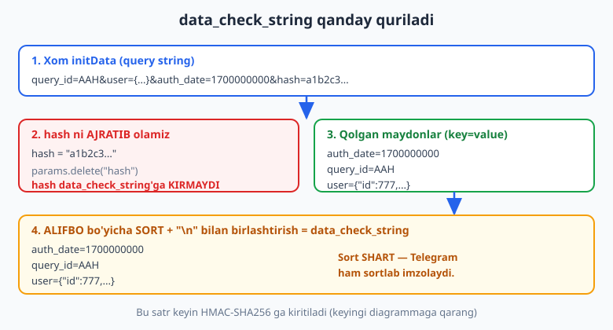
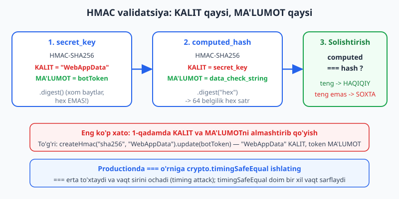
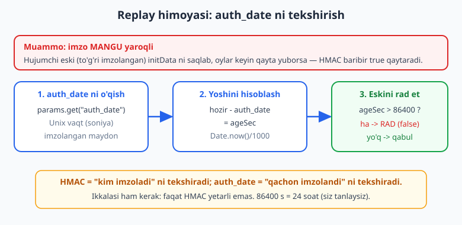

# 24 — Web App xavfsizligi: initData

[⬅️ Oldingi: 23 — Telegram Web App (Mini App) asoslari](./23-webapp-asoslari.md) · [🏠 README](./README.md) · [Keyingi: 25 — Mini App backend ➡️](./25-miniapp-backend.md)

---

> **Bu bobda:** Mini App ichidan kelgan ma'lumotga **qachon ishonish mumkin, qachon yo'q** ekanini o'rganamiz — bu butun kitobdagi eng muhim xavfsizlik darsi. Asosiy haqiqat shu: `window.Telegram.WebApp.initDataUnsafe.user.id` — bu brauzerda ishlovchi JavaScript bergan qiymat, foydalanuvchi uni DevTools'da bir soniyada o'zgartirishi mumkin. Shuning uchun serverda **HAR DOIM** xom `initData` ni HMAC bilan tekshirish SHART. Telegram `initData` ni bot tokeningiz bilan imzolaydi; faqat sizning serveringiz (token egasi) bu imzoni tekshira oladi. Algoritmni qadam-baqadam — `hash` ni ajratish, qolgan maydonlarni alifbo bo'yicha sortlab `data_check_string` qurish, `secret_key = HMAC-SHA256("WebAppData", botToken)`, `computed = HMAC-SHA256(secret_key, data_check_string)`, `computed === hash` — Node `crypto.createHmac` bilan **qo'lda** yozamiz va ishlatamiz. Timing attack'dan himoyalanish uchun `===` o'rniga `crypto.timingSafeEqual` ni, eski imzoni qayta yuborish (replay) hujumidan himoya uchun `auth_date` tekshiruvini qo'shamiz. `initDataUnsafe` (qulay, parslangan) va `initData` (xom, imzolangan) farqini aniq ajratamiz. Oxirida tayyor kutubxona `@telegram-apps/init-data-node` ni eslab o'tamiz — lekin avval algoritmni o'z qo'limiz bilan tushunamiz, chunki xavfsizlikni "qora quti"ga ishonib qo'yish xavfli.
>
> **Halollik eslatmasi:** Bu bobdagi `validateInitData` funksiyasi — `secret_key = HMAC-SHA256(key="WebAppData", botToken)`, `data_check_string` (hash'siz, sortlangan, `\n` bilan), `computed = HMAC-SHA256(key=secret_key, data_check_string).hex`, `computed === hash` — Node'ning haqiqiy `node:crypto` (`createHmac`, `timingSafeEqual`) moduli bilan **offline ishga tushirib tasdiqlangan** (`node _verify_24.mjs`, 10/10 o'tdi). Test o'z ichida: to'g'ri imzo -> `true`; **buzilgan** initData (hujumchi `user.id` ni o'zgartirgan) -> `false`; noto'g'ri token bilan -> `false`; `auth_date` 25 soat eskirgan -> rad; `timingSafeEqual` teng/farqli holatlari; HMAC kalitlarini almashtirib qo'yish xatosi -> `false`. **Token, internet yoki haqiqiy Telegram serveri TALAB QILINMADI** — `data_check_string` ni o'zimiz Telegram'ning aynan algoritmi bilan imzolab, keyin validatorni unga qarshi ishlatdik. Demak bu yerda ko'rsatilgan kod soxta "ishladi" emas, balki haqiqatan ishlovchi kriptografik tekshiruv.

---

## Nega `initDataUnsafe` ga ishonib bo'lmaydi

23-bobda Mini App'ni ishga tushirdik va `Telegram.WebApp` obyektini ko'rdik. U yerda foydalanuvchi haqida ma'lumot bor edi:

```js
// Mini App ICHIDAGI brauzer kodi (frontend):
const tg = window.Telegram.WebApp;
console.log(tg.initDataUnsafe.user.id);        // 777
console.log(tg.initDataUnsafe.user.first_name); // "Ali"
```

Qulay ko'rinadi. Lekin nomidagi **`Unsafe`** so'zi bejiz emas — Telegram ataylab ogohlantirgan: bu ma'lumotga ishonish **xavfli**.

Buni tushunish uchun savol bering: bu `user.id = 777` qiymati qayerdan keldi? U **foydalanuvchining brauzerida** (Telegram'ning WebView ichida) ishlovchi JavaScript'dan keldi. Foydalanuvchi esa o'z brauzerini to'liq nazorat qiladi. U DevTools konsolini ochib:

```js
// Hujumchining brauzer konsolida:
window.Telegram.WebApp.initDataUnsafe.user.id = 1; // admin id si!
```

deb yozsa, sizning frontend kodingiz endi `id = 1` ni "ko'radi". Agar siz bu `id` ni serverga yuborib, server unga ishonib "ha, bu admin" desa — hujum muvaffaqiyatli.

> **Diqqat — bu nazariy emas.** Web App'ingiz oddiy veb-sahifa. Uni brauzerda ochish, `fetch` so'rovlarini ushlash, request body'ni o'zgartirish — bularning hammasi har qanday foydalanuvchi uchun ochiq. "Lekin men `initDataUnsafe.user.id` ni `fetch` body'ga solib yuboraman-ku" desangiz — body'ni ham o'zgartirish mumkin. **Frontend hech qachon kimligini "isbotlay olmaydi".**

Demak qoida: **identifikatsiya (kim ekanini aniqlash) HAR DOIM serverda, imzoni tekshirish orqali bo'ladi.** Yaxshi xabar — Telegram bizga buni qilish uchun imzolangan `initData` beradi.

## `initData` nima: imzolangan query string

`initDataUnsafe` yonida xom, **imzolangan** versiya ham bor: `tg.initData`. Bu — oddiy URL query string ko'rinishidagi satr:

```text
query_id=AAHdF6IQAAAAAN0XohDhrOrc&user=%7B%22id%22%3A777%2C%22first_name%22%3A%22Ali%22%7D&auth_date=1700000000&hash=c5f9...e2
```

Ichida nimalar bor:

| Maydon | Ma'nosi |
| --- | --- |
| `user` | Foydalanuvchi (JSON, URL-encoded): `{id, first_name, username, ...}` |
| `auth_date` | Mini App ochilgan vaqt (Unix soniya) — replay himoyasi uchun muhim |
| `query_id` | So'rov identifikatori (inline natija yuborishda ishlatiladi) |
| `hash` | **Imzo** — qolgan barcha maydonlarning bot token bilan HMAC'i |

Eng muhimi — `hash`. Telegram bu satrni **sizning bot tokeningiz** bilan imzolagan. Token faqat sizda (va Telegram serverida) bor. Demak agar siz `hash` ni tekshirib, u to'g'ri chiqsa — bu ma'lumot **haqiqatan Telegram'dan kelgan va yo'lda o'zgartirilmagan** ekaniga ishonch hosil qilasiz. Hujumchi tokenni bilmagani uchun to'g'ri `hash` yasab bera olmaydi.



> **Eslatma — `initData` ni serverga qanday yuboramiz?** Frontend `tg.initData` (xom satr) ni har bir API so'rovida serverga jo'natadi — odatda `Authorization: tma <initData>` sarlavhasida yoki request body'da. Server uni **birinchi ish sifatida** tekshiradi. Buni 25-bobda to'liq backend bilan ko'ramiz; bu bobda esa aynan tekshirish ALGORITMINI o'rganamiz.

## Validatsiya algoritmi: qadam-baqadam

Telegram'ning imzo qo'yish usulini teskari aylantirib tekshiramiz. To'rt qadam:

**1-qadam — `hash` ni ajratib olish.** `initData` ni `URLSearchParams` bilan parslab, `hash` qiymatini olamiz va uni qolgan maydonlardan **olib tashlaymiz**. `hash` o'zi `data_check_string` ga **kirmaydi** (u — tekshiriladigan natija, kiritma emas).

**2-qadam — `data_check_string` qurish.** Qolgan har bir maydonni `key=value` ko'rinishida yozamiz, ularni **alifbo bo'yicha sortlaymiz** va `\n` (yangi qator) belgisi bilan birlashtiramiz. Sortlash — kritik: Telegram ham aynan sortlab imzolaydi, biz sortlamasak `data_check_string` boshqa chiqadi va hash hech qachon mos kelmaydi.

**3-qadam — `secret_key` hisoblash.** Bu yerda eng ko'p adashadigan joy: `secret_key = HMAC-SHA256(key="WebAppData", message=botToken)`. Ya'ni **kalit** — `"WebAppData"` (qat'iy satr), **ma'lumot** — bot tokeningiz. Natijani `.digest()` bilan **xom baytlar** sifatida olamiz (hex emas!).

**4-qadam — `computed_hash` va solishtirish.** `computed_hash = HMAC-SHA256(key=secret_key, message=data_check_string)` ni **hex** ko'rinishda olamiz. Agar `computed_hash === hash` bo'lsa — `initData` haqiqiy. Aks holda — soxta yoki buzilgan.



> **Diqqat — KALIT va MA'LUMOT joyi.** HMAC ikki kirish oladi: kalit va ma'lumot. 1-qadamda kalit `"WebAppData"`, ma'lumot — token. Bularni **almashtirib qo'yish** (token kalit, `"WebAppData"` ma'lumot) — eng ko'p uchraydigan xato. Almashtirsangiz, kod xato bermaydi, lekin hash **hech qachon** mos kelmaydi, va siz "nega ishlamayapti?" deb soatlab qidirasiz. Pastdagi verify testida (9-test) buni ataylab sinadik: almashtirilgan kalitlar -> `false`.

## Node `crypto` bilan to'liq `validateInitData`

Endi algoritmni Node'ning o'rnatilgan `node:crypto` moduli bilan yozamiz. Hech qanday tashqi kutubxona kerak emas:

```js
import { createHmac } from "node:crypto";

function validateInitData(initData, botToken) {
  const params = new URLSearchParams(initData);
  const hash = params.get("hash");
  params.delete("hash"); // hash data_check_string'ga kirmaydi

  const dataCheckString = [...params.entries()]
    .map(([k, v]) => `${k}=${v}`)
    .sort()                  // ALIFBO bo'yicha — SHART
    .join("\n");

  const secretKey = createHmac("sha256", "WebAppData")
    .update(botToken)
    .digest();               // xom baytlar (Buffer), hex EMAS

  const computed = createHmac("sha256", secretKey)
    .update(dataCheckString)
    .digest("hex");          // bu safar hex

  return computed === hash;
}
```

Bu — SPEC'da tasdiqlangan, biz offline ishlatib tekshirgan funksiya. Bir necha nozik nuqta:

- `secretKey` da `.digest()` (argumentsiz) — **Buffer** qaytaradi. Keyingi `createHmac("sha256", secretKey)` da kalit sifatida shu Buffer ishlatiladi. Agar bu yerda xato qilib `.digest("hex")` qilsangiz, kalit boshqa bo'lib qoladi — natija noto'g'ri.
- `computed` da `.digest("hex")` — `hash` ham hex satr bo'lgani uchun ikkalasini to'g'ridan-to'g'ri solishtirish mumkin.
- `[...params.entries()]` — `URLSearchParams` iteratorini massivga aylantiradi, shunda `.map().sort().join()` qila olamiz.

### Test: haqiqatan ishlaydimi?

Tekshirishimiz uchun "Telegram qanday imzolaydi"ni taqlid qilamiz (test imzo yasaymiz), keyin validatorni unga qarshi ishlatamiz. Imzo yasash — validatsiyaning aynan teskarisi:

```js
import { createHmac } from "node:crypto";

// FAQAT TEST UCHUN: Telegram serverining o'rnini bosamiz
function signInitData(fields, botToken) {
  const dataCheckString = Object.entries(fields)
    .map(([k, v]) => `${k}=${v}`).sort().join("\n");
  const secretKey = createHmac("sha256", "WebAppData").update(botToken).digest();
  const hash = createHmac("sha256", secretKey).update(dataCheckString).digest("hex");
  const params = new URLSearchParams(fields);
  params.set("hash", hash);
  return params.toString();
}

const TOKEN = "123456:FAKE_TOKEN";
const user = JSON.stringify({ id: 777, first_name: "Ali" });
const now = Math.floor(Date.now() / 1000);

const initData = signInitData({ query_id: "AAH", user, auth_date: String(now) }, TOKEN);
console.log(validateInitData(initData, TOKEN)); // true
```

Offline sinovda (`_verify_24.mjs`) bu aynan `true` chiqdi. Endi eng muhim qism — **hujumni** sinaymiz.

### Buzilgan initData -> `false`

Hujumchi `initData` ni ushlab, `user.id` ni admin id'siga o'zgartirsa nima bo'ladi? `hash` esa eski (token bilan imzolangan) bo'lib qoladi, chunki hujumchi tokenni bilmaydi:

```js
const params = new URLSearchParams(initData);
params.set("user", JSON.stringify({ id: 1, first_name: "Hacker" })); // SOXTA
const tampered = params.toString();

console.log(validateInitData(tampered, TOKEN)); // false ✓
```

`user` o'zgardi, lekin `hash` o'zgarmadi -> `computed` endi `hash` ga mos kelmaydi -> `false`. Aynan shu — bizni himoya qilayotgan mexanizm. Verify testida (2-test) bu `false` chiqdi.

> **Eslatma — nega hujumchi to'g'ri hash yasay olmaydi?** To'g'ri `hash` yasash uchun `secret_key`, u uchun esa **bot token** kerak. Token faqat sizning serveringizda (`.env`, 02-bobga qarang). Hujumchida token yo'q -> u `user` ni o'zgartira oladi, lekin unga mos `hash` ni hisoblay olmaydi. Bu — asimmetriya: o'zgartirish oson, lekin imzolash imkonsiz.

## Timing attack va `timingSafeEqual`

`computed === hash` — ishlaydi, lekin xavfsizlikka jiddiy yondashganda bir nozik muammosi bor: `===` (va satr taqqoslash umuman) **birinchi farq topilganda darhol to'xtaydi**. Demak ikki satr necha belgida farq qilishiga qarab taqqoslash **turlicha vaqt** oladi. Hujumchi javob vaqtini juda aniq o'lchab, hash'ni belgima-belgi taxmin qilishga urinishi mumkin — bu **timing attack**.

Yechim — `crypto.timingSafeEqual`, u **doim bir xil vaqt** sarflaydi (qaysi belgida farq bo'lishidan qat'i nazar):

```js
import { createHmac, timingSafeEqual } from "node:crypto";

function validateInitDataSafe(initData, botToken, maxAgeSec = 86400) {
  const params = new URLSearchParams(initData);
  const hash = params.get("hash");
  if (!hash) return false; // hash umuman yo'q -> darhol rad

  params.delete("hash");
  const dataCheckString = [...params.entries()]
    .map(([k, v]) => `${k}=${v}`).sort().join("\n");

  const secretKey = createHmac("sha256", "WebAppData").update(botToken).digest();
  const computed = createHmac("sha256", secretKey).update(dataCheckString).digest("hex");

  // Xavfsiz, doimiy-vaqtli taqqoslash
  const a = Buffer.from(computed, "hex");
  const b = Buffer.from(hash, "hex");
  if (a.length !== b.length || !timingSafeEqual(a, b)) return false;

  // Replay himoyasi (pastda batafsil)
  const authDate = Number(params.get("auth_date"));
  if (!Number.isFinite(authDate)) return false;
  const ageSec = Math.floor(Date.now() / 1000) - authDate;
  if (ageSec > maxAgeSec) return false;

  return true;
}
```

> **Diqqat — `timingSafeEqual` uzunlikni o'zi tekshirmaydi.** Agar ikki Buffer **uzunligi har xil** bo'lsa, `timingSafeEqual` **xato (throw)** qiladi. Shuning uchun avval `a.length !== b.length` ni tekshiramiz. Bizning holatda ikkalasi ham SHA-256 hex (64 belgi -> 32 bayt), shuning uchun normal holatda uzunlik teng; lekin `hash` buzib yuborilgan bo'lsa himoya bo'ladi. Verify testida (7-test) `timingSafeEqual` teng -> `true`, farqli -> `false` ekanini ko'rdik.

> **Eslatma:** Boshlovchi loyihada `===` ham yetarli — asosiy himoya HMAC'ning o'zida. Lekin productionda, ayniqsa pulga oid ilovalarda (26-bobdagi clicker, Stars), `timingSafeEqual` — to'g'ri odat. "Nega bunchalik ehtiyot?" — chunki imzo tekshiruvi — butun xavfsizligingizning poydevori; uni bir marta to'g'ri yozib qo'yganingiz ma'qul.

## Replay himoyasi: `auth_date`

HMAC bizga "bu ma'lumotni token egasi imzolagan va u o'zgartirilmagan" deb aytadi. Lekin u bir narsani **aytmaydi**: bu imzo **qachon** qo'yilgan. Imzo o'z-o'zidan **mangu yaroqli** — agar hujumchi to'g'ri imzolangan eski `initData` ni qo'lga kiritsa (masalan, loglardan, yoki o'z hisobidan), uni **oylar keyin** ham serveringizga yuborsa, HMAC baribir `true` qaytaradi.



Bunga qarshi himoya — `auth_date` ni tekshirish. U imzolangan maydon (uni o'zgartirib bo'lmaydi — o'zgartirsa hash yiqiladi), va u Mini App **qachon ochilganini** ko'rsatadi. Qoida sodda: agar `initData` juda eski bo'lsa (masalan, 24 soatdan oshgan) — rad etamiz:

```js
const authDate = Number(params.get("auth_date"));         // Unix soniya
const ageSec = Math.floor(Date.now() / 1000) - authDate;  // necha soniya o'tdi
if (ageSec > 86400) return false;                          // 24 soatdan eski -> rad
```

Verify testida (5-test) buni aniq ko'rdik: `auth_date` ni 25 soat oldingi qilib imzolasak, `validateInitData` (faqat HMAC) `true` qaytaradi (imzo **o'zi to'g'ri**), lekin `validateInitDataSafe` (auth_date tekshiruvli) — `false` (eskirgan). Bu ikkalasi **birga** kerakligini ko'rsatadi.

> **Anti-eskirish:** 86400 (24 soat) — bu **siz tanlaydigan** chegara, Telegram tomonidan majburiy emas. Bank ilovasida 5 daqiqa qilishingiz, oddiy o'yinda 24 soat qoldirishingiz mumkin. Rasmiy tavsiyalar vaqt o'tib o'zgarishi mumkin — eng yangi yo'riqnomani [core.telegram.org/bots/webapps](https://core.telegram.org/bots/webapps) va [grammy.dev](https://grammy.dev) dan tekshiring. Men bu yerda aniq "majburiy" raqamni ixtiro qilmayman; muhimi — **tekshiruvning o'zi** bo'lishi.

## `initDataUnsafe` vs `initData` — qachon qaysi biri

Endi ikkala obyektning roli aniq bo'ldi. Ularni adashtirmaslik kerak:

| | `initDataUnsafe` | `initData` |
| --- | --- | --- |
| Turi | Parslangan obyekt (`{ user: {...}, auth_date, ... }`) | Xom satr (query string) |
| Qulaylik | Yuqori — to'g'ridan-to'g'ri `.user.id` o'qiysiz | Past — o'zingiz parslaysiz |
| Ishonchli? | **YO'Q** (frontend'da o'zgartirilishi mumkin) | **HA**, lekin faqat **server tekshirgandan keyin** |
| Qayerda ishlatiladi | Faqat **UI** uchun (ismni ko'rsatish, tugma) | **Serverga** yuborib, HMAC tekshirish uchun |

Amaliy qoida:

- **Frontend'da, UI uchun** `initDataUnsafe` ni bemalol ishlating: foydalanuvchi ismini ekranga chiqarish, avatar ko'rsatish. Bu xavfsiz, chunki bu ma'lumot foydalanuvchining **o'ziga** ko'rsatiladi — uni aldab o'z ismini o'zgartirsa, faqat o'zini "aldaydi".
- **Serverda, har qanday qaror uchun** (kim bu? unga ruxsat bormi? balansiga qancha qo'shamiz?) **faqat** tekshirilgan `initData` dan chiqqan `user.id` ga ishoning.

> **Diqqat — "men ikkalasini ham yuboraman" tuzog'i.** Ko'pchilik xato: frontend `initDataUnsafe.user.id` ni **alohida** maydon sifatida body'ga solib yuboradi va server o'shanga ishonadi. Bu — `initData` ni tekshirishni **butunlay behuda** qiladi! To'g'risi: server xom `initData` ni tekshiradi, keyin **o'sha tekshirilgan satr ichidagi** `user` ni parslab ishlatadi — body'dagi alohida `user_id` ni **e'tiborsiz** qoldiradi.

## Tayyor kutubxona: `@telegram-apps/init-data-node`

Algoritmni o'z qo'limiz bilan yozib, tushunib oldik. Productionda ko'pincha tayyor, sinovdan o'tgan kutubxonadan foydalaniladi — bu chekka holatlarni (kodlangan belgilar, maydon turlari) o'zi to'g'ri ishlaydi:

- **`@telegram-apps/init-data-node`** — Telegram Mini Apps jamoasining rasmiy Node kutubxonasi. `validate(initData, token)` va parslab beruvchi `parse(initData)` funksiyalari bor. Havola: [docs.telegram-mini-apps.com](https://docs.telegram-mini-apps.com).

> **Eslatma — nega avval qo'lda o'rgandik?** Chunki xavfsizlikni "qora quti"ga ko'r-ko'rona ishonib qo'yish xavfli. Endi kutubxona ichida nima sodir bo'layotganini bilasiz: u ham aynan shu HMAC'ni hisoblaydi. Agar kutubxona xato bersa yoki versiyasi o'zgarsa — siz nima buzilganini tushuna olasiz. Qaysi birini ishlatish sizning ixtiyoringizda; ikkalasi ham bir xil kriptografiyaga asoslanadi. grammY **yadrosida** initData validatori yo'q — shuning uchun yoki yuqoridagi qo'lda yozilgan funksiya, yoki bu kutubxona ishlatiladi.

> **Anti-eskirish:** Paket nomlari va API'lari vaqt o'tib o'zgaradi. `@telegram-apps/init-data-node` ni ishlatishdan oldin uning joriy README'sini va versiyasini npm'da tekshiring. Men bu yerda uning aniq funksiya imzolarini ixtiro qilmayman — yuqoridagi `node:crypto` varianti esa Node'ning barqaror standart moduliga tayanadi va offline tasdiqlangan.

## Hammasini birlashtirish: backend himoyasi qanday ko'rinadi

25-bobda to'liq backend yozamiz, lekin tasvirni hozir ko'raylik. Web App'dan kelgan har bir so'rovda server avval `initData` ni tekshiradi:

```js
// Soddalashtirilgan namuna (25-bobda to'liq Express bilan):
function himoyalanganHandler(req) {
  const initData = req.headers["authorization"]?.replace("tma ", "");
  if (!initData || !validateInitDataSafe(initData, process.env.BOT_TOKEN)) {
    return { status: 401, body: "Ruxsat yo'q" }; // soxta yoki eski -> rad
  }
  // FAQAT shu yerdan keyin user'ga ishonamiz:
  const params = new URLSearchParams(initData);
  const user = JSON.parse(params.get("user"));
  return { status: 200, body: `Salom, ${user.first_name}! id=${user.id}` };
}
```

E'tibor bering: `user` ni **tekshirilgan `initData` ichidan** olamiz, request body'dan emas. Bu — to'g'ri tartib.

> **Eslatma — aiogram bilan solishtirish.** Python'da ekvivalent `hmac.new(...)` va `hmac.compare_digest` (timing-safe) bilan yoziladi — algoritm **bir xil** (HMAC-SHA256, `"WebAppData"` kaliti). Til boshqa, kriptografiya bir xil. Python versiyasini [tgbot-python kitobining mos bobida](../tgbot-python/README.md) ko'rishingiz mumkin.

## Tez-tez uchraydigan xatolar

| Xato | Sabab | Yechim |
| --- | --- | --- |
| `initDataUnsafe.user.id` ga serverda ishonish | "Unsafe" — frontend qiymati, o'zgartiriladi | Faqat tekshirilgan `initData` dan chiqqan `user` ga ishonish |
| Maydonlarni **sortlamaslik** | Telegram sortlab imzolaydi; sortsiz `data_check_string` boshqa chiqadi | `.sort()` ni unutmang (alifbo bo'yicha) |
| HMAC kalit/ma'lumotni **almashtirib qo'yish** | `secret_key` da `"WebAppData"` KALIT, token MA'LUMOT bo'lishi kerak | `createHmac("sha256", "WebAppData").update(botToken)` aynan shu tartibda |
| `secret_key` ni `.digest("hex")` qilish | Keyingi HMAC kaliti **xom baytlar** (Buffer) bo'lishi kerak | `.digest()` (argumentsiz) -> Buffer |
| `hash` ni `data_check_string` ichida qoldirish | `hash` — natija, kiritma emas | `params.delete("hash")` ni avval qiling |
| `===` bilan taqqoslash (timing attack) | `===` erta to'xtaydi, vaqt sirini ochadi | `crypto.timingSafeEqual` (uzunlikni avval tekshiring) |
| `auth_date` ni **tekshirmaslik** | Imzo mangu yaroqli -> eski initData replay qilinadi | `ageSec > maxAge` bo'lsa rad eting |
| `timingSafeEqual` ga turli uzunlikdagi Buffer berish | Funksiya **throw** qiladi | Avval `a.length !== b.length` ni tekshiring |

## Mashqlar

Quyidagi mashqlar OFFLINE tekshiriladi — `node:crypto` haqiqiy HMAC bilan. Har biri uchun yuqoridagi `validateInitData` / `signInitData` yordamchilardan foydalaning (`signInitData` — Telegram serverining o'rnini bosadi). Test naqsh:

```js
import { createHmac, timingSafeEqual } from "node:crypto";
import assert from "node:assert/strict";

const TOKEN = "123456:FAKE_TOKEN";
const now = () => Math.floor(Date.now() / 1000);

function signInitData(fields, botToken) {
  const dcs = Object.entries(fields).map(([k, v]) => `${k}=${v}`).sort().join("\n");
  const secretKey = createHmac("sha256", "WebAppData").update(botToken).digest();
  const hash = createHmac("sha256", secretKey).update(dcs).digest("hex");
  const params = new URLSearchParams(fields);
  params.set("hash", hash);
  return params.toString();
}
```

### Oson

1. **`validateInitData` ni yozing va to'g'ri imzoni tasdiqlang.** `signInitData` bilan to'g'ri `initData` yasang (user, auth_date), `validateInitData(initData, TOKEN)` `true` qaytarishini `assert` qiling.
2. **Noto'g'ri token rad etiladimi?** Bitta `initData` ni `TOKEN` bilan imzolang, lekin `validateInitData(initData, "boshqa:TOKEN")` chaqiring. Natija `false` bo'lishini tekshiring.
3. **`hash` ni ajratib oling.** Berilgan `initData` satridan `URLSearchParams` bilan `hash` ni o'qing va uni o'chiring (`delete`). Qolgan maydonlar ichida `hash` **yo'q**ligini `assert` qiling.
4. **`data_check_string` ni qo'lda qurib ko'ring.** `{ b: "2", a: "1" }` maydonlari uchun sortlangan `data_check_string` aynan `"a=1\nb=2"` bo'lishini tekshiring.

### O'rta

5. **Buzilgan `user` -> `false`.** To'g'ri `initData` yasang, keyin `user` ni soxta `{ id: 1 }` ga o'zgartiring (`hash` ni tegmang). `validateInitData` `false` qaytarishini `assert` qiling.
6. **Maydon tartibi muhim emas.** `{ a: "1", b: "2" }` va `{ b: "2", a: "1" }` ni alohida imzolang. Ikkala holatda ham `hash` **bir xil** chiqishini tekshiring (sort tufayli).
7. **`auth_date` eskirgan -> rad.** `validateInitDataSafe` yozing. `auth_date` ni 25 soat oldingi qilib imzolang. Faqat-HMAC `validateInitData` `true`, lekin `validateInitDataSafe` `false` qaytarishini tekshiring.
8. **`hash` umuman yo'q -> `false`.** `hash` maydoni bo'lmagan satr bering (`"user=...&auth_date=..."`). `validateInitDataSafe` `false` qaytarsin (throw qilmasin).
9. **`timingSafeEqual` ni sinang.** Ikki bir xil 32 baytli Buffer -> `true`, bitta bayti farqli -> `false` ekanini `assert` qiling.

### Qiyin

10. **HMAC kalitlarini almashtirish xatosi.** `secret_key` da kalit va ma'lumotni almashtirib qo'ygan **noto'g'ri** validator yozing (`createHmac("sha256", botToken).update("WebAppData")`). To'g'ri imzolangan `initData` da ham u `false` qaytarishini ko'rsating (xato manbai).
11. **Sortsiz `data_check_string` xavfi.** Sort **qilmaydigan** `data_check_string` quruvchi funksiya yozing. Bir xil maydonlarni ikki xil kirish tartibida bersangiz, natija **farqli** chiqishini `assert` qiling (nega sort shart ekanini isbotlovchi test).
12. **To'liq xavfsiz validator.** `validateInitDataSafe` ni to'liq yozing (HMAC + `timingSafeEqual` + uzunlik tekshiruvi + `auth_date`). Uni 4 holatga qarshi sinang: (a) yangi to'g'ri -> `true`; (b) buzilgan user -> `false`; (c) eskirgan -> `false`; (d) hash yo'q -> `false`.
13. **`initData` dan `user` ni xavfsiz ajratish.** Tekshirilgan `initData` dan `user` ni parslab, `user.id` ni qaytaradigan funksiya yozing — lekin **avval** `validateInitDataSafe` `false` qaytarsa, `null` qaytaring (tekshirilmagan ma'lumotga ishonmaslik). To'g'ri va soxta holatlarni sinang.

<details markdown="1">
<summary>Yechimlar</summary>

Barcha yechimlar yuqoridagi `signInitData` yordamchisidan foydalanadi. To'liq validatorlar:

```js
import { createHmac, timingSafeEqual } from "node:crypto";

function validateInitData(initData, botToken) {
  const params = new URLSearchParams(initData);
  const hash = params.get("hash");
  params.delete("hash");
  const dcs = [...params.entries()].map(([k, v]) => `${k}=${v}`).sort().join("\n");
  const secretKey = createHmac("sha256", "WebAppData").update(botToken).digest();
  const computed = createHmac("sha256", secretKey).update(dcs).digest("hex");
  return computed === hash;
}

function validateInitDataSafe(initData, botToken, maxAgeSec = 86400) {
  const params = new URLSearchParams(initData);
  const hash = params.get("hash");
  if (!hash) return false;
  params.delete("hash");
  const dcs = [...params.entries()].map(([k, v]) => `${k}=${v}`).sort().join("\n");
  const secretKey = createHmac("sha256", "WebAppData").update(botToken).digest();
  const computed = createHmac("sha256", secretKey).update(dcs).digest("hex");
  const a = Buffer.from(computed, "hex");
  const b = Buffer.from(hash, "hex");
  if (a.length !== b.length || !timingSafeEqual(a, b)) return false;
  const authDate = Number(params.get("auth_date"));
  if (!Number.isFinite(authDate)) return false;
  if (Math.floor(Date.now() / 1000) - authDate > maxAgeSec) return false;
  return true;
}
```

### 1-mashq yechimi

```js
const user = JSON.stringify({ id: 777, first_name: "Ali" });
const initData = signInitData({ query_id: "AAH", user, auth_date: String(now()) }, TOKEN);
assert.equal(validateInitData(initData, TOKEN), true);
```

To'g'ri imzolangan `initData` ni o'z tokeni bilan tekshirsak — `computed === hash` -> `true`. Bu — asosiy holat.

### 2-mashq yechimi

```js
const initData = signInitData({ user: "{}", auth_date: String(now()) }, TOKEN);
assert.equal(validateInitData(initData, "999:BOSHQA"), false);
```

Boshqa token -> boshqa `secret_key` -> boshqa `computed` -> `hash` ga mos kelmaydi. Faqat to'g'ri token egasi (siz) imzoni tasdiqlay oladi.

### 3-mashq yechimi

```js
const initData = signInitData({ user: "{}", auth_date: "1" }, TOKEN);
const params = new URLSearchParams(initData);
params.delete("hash");
assert.equal(params.has("hash"), false);
assert.ok([...params.keys()].length >= 1); // boshqa maydonlar qoldi
```

`hash` — tekshiriladigan natija, shuning uchun `data_check_string` qurishdan oldin uni olib tashlaymiz.

### 4-mashq yechimi

```js
const dcs = [["a", "1"], ["b", "2"]].map(([k, v]) => `${k}=${v}`).sort().join("\n");
assert.equal(dcs, "a=1\nb=2");
```

`data_check_string` — sortlangan `key=value` qatorlar, `\n` bilan. Bu — HMAC ga kiritiladigan aynan satr.

### 5-mashq yechimi

```js
const initData = signInitData({ user: "{}", auth_date: String(now()) }, TOKEN);
const params = new URLSearchParams(initData);
params.set("user", JSON.stringify({ id: 1, first_name: "Hacker" })); // hash tegilmaydi
assert.equal(validateInitData(params.toString(), TOKEN), false);
```

`user` o'zgardi, `hash` eski qoldi -> `computed` endi mos kelmaydi. Bu — initData validatsiyasi to'sib qo'yadigan asosiy hujum.

### 6-mashq yechimi

```js
const i1 = signInitData({ a: "1", b: "2", auth_date: "1" }, TOKEN);
const i2 = signInitData({ b: "2", a: "1", auth_date: "1" }, TOKEN);
assert.equal(new URLSearchParams(i1).get("hash"), new URLSearchParams(i2).get("hash"));
```

`signInitData` ham, validator ham `.sort()` qiladi — shuning uchun kirish tartibi natija hash'iga ta'sir qilmaydi. Aynan shu sababli sort **majburiy**.

### 7-mashq yechimi

```js
const old = signInitData({ user: "{}", auth_date: String(now() - 25 * 3600) }, TOKEN);
assert.equal(validateInitData(old, TOKEN), true);       // imzo o'zi to'g'ri
assert.equal(validateInitDataSafe(old, TOKEN), false);  // lekin eskirgan -> rad
```

HMAC "kim imzolagan"ni, `auth_date` "qachon"ni tekshiradi. Imzo to'g'ri bo'lsa ham, juda eski bo'lsa rad etamiz (replay himoyasi).

### 8-mashq yechimi

```js
const noHash = "user=" + encodeURIComponent("{}") + "&auth_date=" + now();
assert.equal(validateInitDataSafe(noHash, TOKEN), false);
```

`if (!hash) return false` — `hash` yo'q bo'lsa darhol rad. Throw qilmaslik muhim: noto'g'ri kirish dasturni yiqitmasligi kerak.

### 9-mashq yechimi

```js
const x = Buffer.from("a".repeat(64), "hex"); // 32 bayt
const y = Buffer.from("a".repeat(64), "hex");
const z = Buffer.from("b".repeat(64), "hex");
assert.equal(timingSafeEqual(x, y), true);
assert.equal(timingSafeEqual(x, z), false);
```

`timingSafeEqual` mazmunan teng -> `true`, farqli -> `false`, lekin **doimiy vaqtda** (timing attack'ga qarshi). Buferlar bir xil uzunlikda bo'lishi shart.

### 10-mashq yechimi

```js
function validateWRONG(initData, botToken) {
  const params = new URLSearchParams(initData);
  const hash = params.get("hash");
  params.delete("hash");
  const dcs = [...params.entries()].map(([k, v]) => `${k}=${v}`).sort().join("\n");
  // XATO: kalit va ma'lumot almashtirilgan
  const secretKey = createHmac("sha256", botToken).update("WebAppData").digest();
  const computed = createHmac("sha256", secretKey).update(dcs).digest("hex");
  return computed === hash;
}
const good = signInitData({ user: "{}", auth_date: "1" }, TOKEN);
assert.equal(validateWRONG(good, TOKEN), false);
```

KALIT (`"WebAppData"`) va MA'LUMOT (token) almashtirilsa, `secret_key` butunlay boshqa chiqadi -> hash hech qachon mos kelmaydi. Kod xato bermaydi, shuning uchun bu xatoni topish qiyin — tartibni yodda tuting.

### 11-mashq yechimi

```js
function dcsNoSort(initData) {
  const p = new URLSearchParams(initData);
  p.delete("hash");
  return [...p.entries()].map(([k, v]) => `${k}=${v}`).join("\n"); // sortsiz
}
const d1 = dcsNoSort("user=x&auth_date=1&query_id=q");
const d2 = dcsNoSort("auth_date=1&query_id=q&user=x");
assert.notEqual(d1, d2); // tartib boshqa -> satr boshqa
```

Sortsiz `data_check_string` kirish tartibiga bog'liq bo'lib qoladi. Telegram sortlab imzolagani uchun, biz sortlamasak hash hech qachon mos kelmaydi -> validatsiya har doim yiqiladi.

### 12-mashq yechimi

```js
const user = JSON.stringify({ id: 777, first_name: "Ali" });
// (a) yangi to'g'ri
const good = signInitData({ user, auth_date: String(now()) }, TOKEN);
assert.equal(validateInitDataSafe(good, TOKEN), true);
// (b) buzilgan user
const p = new URLSearchParams(good);
p.set("user", JSON.stringify({ id: 1 }));
assert.equal(validateInitDataSafe(p.toString(), TOKEN), false);
// (c) eskirgan
const old = signInitData({ user, auth_date: String(now() - 25 * 3600) }, TOKEN);
assert.equal(validateInitDataSafe(old, TOKEN), false);
// (d) hash yo'q
assert.equal(validateInitDataSafe("user=" + encodeURIComponent(user), TOKEN), false);
```

To'liq validator to'rt himoya qatlamini birlashtiradi: imzo (HMAC), o'zgartirishga qarshi (buzilgan -> false), timing-safe taqqoslash, va replay (auth_date). Bu — productionga tayyor namuna.

### 13-mashq yechimi

```js
function getVerifiedUser(initData, botToken) {
  if (!validateInitDataSafe(initData, botToken)) return null; // ishonchsiz -> null
  const params = new URLSearchParams(initData);
  try {
    return JSON.parse(params.get("user"));
  } catch {
    return null;
  }
}
const user = JSON.stringify({ id: 777, first_name: "Ali" });
const good = signInitData({ user, auth_date: String(now()) }, TOKEN);
assert.equal(getVerifiedUser(good, TOKEN).id, 777);          // to'g'ri -> user
assert.equal(getVerifiedUser("user=" + user, TOKEN), null);  // tekshirilmagan -> null
```

To'g'ri tartib: avval **tekshir**, keyin **tekshirilgan satr ichidan** `user` ni parsla. Validatsiya yiqilsa — hech qanday ma'lumotga ishonmay `null` qaytaramiz. Request body'dagi alohida `user_id` ga **hech qachon** ishonmaymiz.

</details>

---

[⬅️ Oldingi: 23 — Telegram Web App (Mini App) asoslari](./23-webapp-asoslari.md) · [🏠 README](./README.md) · [Keyingi: 25 — Mini App backend ➡️](./25-miniapp-backend.md)
