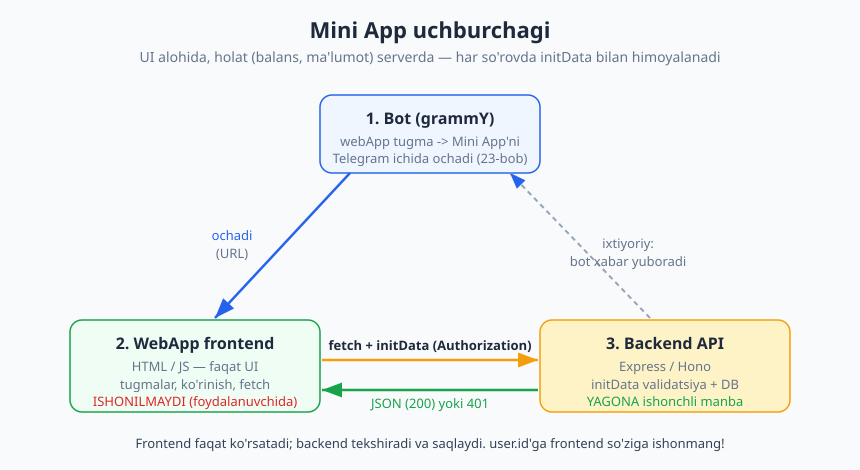
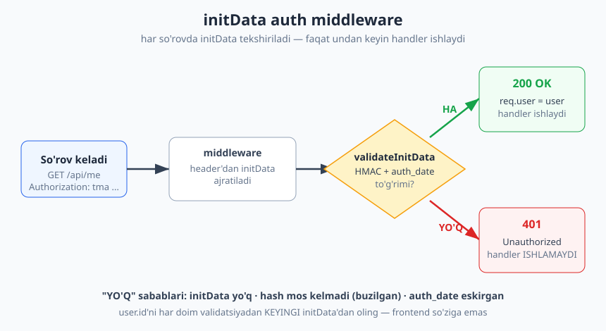
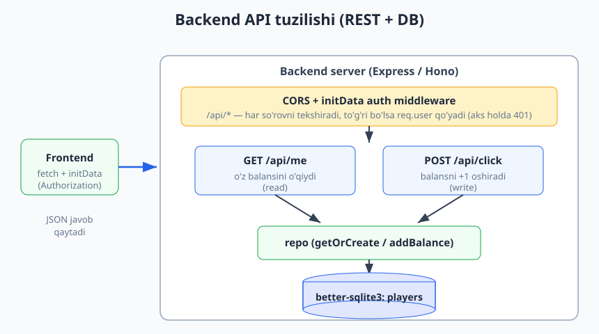

# 25 — Mini App backend

[⬅️ Oldingi: 24 — Web App xavfsizligi: initData](./24-webapp-xavfsizlik.md) · [🏠 README](./README.md) · [Keyingi: 26 — Kapston: Hamster uslubidagi clicker Mini App ➡️](./26-kapston-clicker.md)

---

> **Bu bobda:** Mini App'ning ikkinchi yarmini — **backend** (server tomonni) quramiz. 23-bobda Mini App'ni `webApp` tugma bilan ochishni, 24-bobda esa `initData`ni HMAC bilan tekshirishni o'rgandik. Endi shu ikkalasini birlashtirib, **haqiqiy holatni** (balans, ma'lumotlar) serverda saqlaymiz va himoyalaymiz. Avval **nega backend kerakligini** tushunamiz: Mini App'ning frontendi (HTML/JS) foydalanuvchi qurilmasida ishlaydi va unga **ishonib bo'lmaydi** — har kim DevTools ochib JavaScript'ni o'zgartirishi mumkin. Demak balans, ochilgan bo'limlar, sotib olishlar — hammasi serverda bo'lishi shart. So'ng **Express** (va muqobil sifatida **Hono**) bilan backend server quramiz; har so'rovda kelgan `initData`ni **auth middleware** orqali 24-bobdagi `validateInitData` bilan tekshiramiz — to'g'ri bo'lsa `req.user`ga foydalanuvchini qo'yamiz, aks holda **401** qaytaramiz. `better-sqlite3` (10-bob) bilan foydalanuvchi holatini `user.id` bo'yicha saqlaymiz, `GET /api/me` va `POST /api/click` kabi REST endpoint'lar yozamiz. Yo'l-yo'lakay **CORS**, **HTTPS**, frontend `fetch` namunasi va botni Mini App bilan bog'lashni ko'ramiz. Bu bob 26-bobdagi clicker kapstoniga to'g'ridan-to'g'ri zamin tayyorlaydi.
>
> **Halollik eslatmasi:** Bobdagi backend **mantig'i** — `validateInitData` (HMAC + `auth_date` eskirishi), Express auth middleware (`Authorization: tma ...` header'dan `initData` ajratib tekshirish), `GET /api/me` va `POST /api/click` endpoint'lari, `better-sqlite3` repozitoriysi (`getOrCreate`/`addBalance`) — **uchma-uch offline ishga tushirib tasdiqlangan**. Haqiqiy Express server **127.0.0.1**'da bo'sh portda ko'tarilib: to'g'ri imzolangan `initData` bilan so'rov **200 + foydalanuvchi**, yo'q/buzilgan/eskirgan `initData` bilan **401** — bularning hammasi `node _verify_25.mjs` orqali sinaldi (**22/22 PASS**), token va internetsiz. Hono yo'li `app.fetch` orqali xuddi shunday tekshirildi. Test DB temp faylda yaratilib oxirida o'chiriladi. **Jonli ishlash** — haqiqiy Mini App'ni Telegram'da ochish, HTTPS domen, brauzer `fetch` — internet, domen va `@BotFather` token talab qiladi; ular "illustrativ" deb belgilangan. Natija bob oxiridagi hisobotda.

---

## Nega umuman backend kerak?

24-bobda Mini App'ni yaratdik: bot `webApp` tugmasini yuboradi, foydalanuvchi bosadi, Telegram ichida bizning HTML sahifamiz ochiladi. U sahifada JavaScript ishlaydi, tugmalar bor, ehtimol balans ko'rsatkichi ham bor. Savol tug'iladi: **shu balansni qayerda saqlaymiz?**

Birinchi (sodda, lekin XATO) g'oya: "balansni `localStorage`'da yoki oddiy JS o'zgaruvchisida saqlaymiz". Bu ishlamaydi, chunki:

- **Foydalanuvchi frontendni nazorat qiladi.** Mini App — bu brauzer (Telegram ichidagi WebView). Har kim DevTools ochib `balance = 999999999` deb yozishi yoki tarmoq so'rovlarini soxtalashtirishi mumkin. Frontend kodi sir emas — u qurilmaga yuklab olinadi.
- **`localStorage` qurilmaga bog'liq.** Boshqa telefonda kirsa, balans yo'qoladi. Brauzer keshini tozalasa — yo'qoladi.
- **Boshqa foydalanuvchilar bilan o'zaro ta'sir yo'q.** Reyting (leaderboard), sovg'a yuborish, do'st taklif qilish — bularning hech biri faqat frontendda bo'lmaydi.

Demak, **haqiqiy holat** (balans, ochilgan darajalar, xaridlar, reyting) **serverda** — bizning backend'imizda saqlanishi va himoyalanishi kerak. Frontend faqat **ko'rsatadi** (UI), backend esa **haqiqatni biladi** (state).

### Uchburchak: bot, frontend, backend

Mini App arxitekturasi uchta tomondan iborat:



1. **Bot (grammY).** `webApp` tugma bilan Mini App'ni Telegram ichida ochadi (23-bob). Bot ixtiyoriy ravishda backend tomonidan ham ishlatilishi mumkin (masalan, "Balansingiz oshdi!" degan xabar yuborish uchun).
2. **WebApp frontend (HTML/JS).** Faqat **ko'rinish**: tugmalar, animatsiya, raqamlar. U `fetch` bilan backend'ga so'rov yuboradi va har so'rovda `initData`ni qo'shadi. **Bu tomonga ishonilmaydi** — u foydalanuvchi qo'lida.
3. **Backend API (Express/Hono).** Har so'rovdagi `initData`ni tekshiradi, haqiqiy foydalanuvchini aniqlaydi, ma'lumotlar bazasi bilan ishlaydi. **Yagona ishonchli manba** shu yer.

> **Eslatma — "frontend yolg'on gapiradi" qoidasi.** Hech qachon frontend yuborgan `user.id`'ga to'g'ridan-to'g'ri ishonmang. Foydalanuvchi `{"user_id": 12345}` deb yuborib, boshqa odamning balansini o'qishga urinishi mumkin. Haqiqiy `user.id`ni **faqat** validatsiyadan o'tgan `initData` ichidan oling. Buni shu bobda qattiq ta'kidlaymiz, chunki bu eng katta xavfsizlik xatosi.

Bu xuddi restoranga o'xshaydi: mijoz (frontend) ovqat **buyuradi**, lekin oshxona (backend) narxni hisoblaydi va to'lov haqiqatdan o'tganini tekshiradi. Mijoz "men allaqachon to'ladim" desa, oshxona uning so'ziga emas, o'z kassasiga qaraydi.

---

## Backend serverni qurish: Express

Bizga foydalanuvchidan so'rovlarni qabul qiladigan **HTTP server** kerak. Node dunyosida eng mashhuri — **Express**. (13-bobda webhook uchun Express'ni ko'rgan edik; bu yerda u to'liq REST API rolini o'ynaydi.) Muqobil sifatida pastroqda **Hono**'ni ham ko'ramiz — u serverless va Cloudflare Workers uchun ayniqsa qulay.

Avval skelet — eng oddiy Express server:

```js
// server.js
import express from "express";

const app = express();
app.use(express.json()); // JSON body'ni o'qish uchun

app.get("/api/ping", (req, res) => {
  res.json({ ok: true, time: Date.now() });
});

const PORT = process.env.PORT || 3000;
app.listen(PORT, () => console.log(`Server http://localhost:${PORT} da ishlayapti`));
```

Bu hali himoyasiz — kim bo'lsa ham `/api/ping`'ga murojaat qila oladi. Bizga **har so'rovda** kim murojaat qilayotganini aniqlaydigan qatlam kerak. Bu — `initData` auth middleware.

> **Eslatma — qaysi versiya?** Bu bobda kod **Express 5** (`express@5`) bilan tekshirilgan. Express 5'da router va middleware sintaksisi bizning ishlatadiganlarimiz uchun Express 4 bilan deyarli bir xil — `app.use`, `express.Router()`, `res.status().json()` o'zgarmagan. Node v24 (ESM, `import`) ishlatamiz.

---

## initData auth middleware — yurakcha

24-bobdan `validateInitData` funksiyasini eslaylik. U `initData` satrini va bot tokenini oladi, HMAC-SHA256 imzosini qayta hisoblab solishtiradi, `auth_date` eskirmaganini tekshiradi va to'g'ri bo'lsa foydalanuvchini qaytaradi. Mana uning to'liqroq, "natija obyekti" qaytaradigan ko'rinishi:

```js
// auth.js
import { createHmac } from "node:crypto";

export function validateInitData(initData, botToken, maxAgeSec = 86400) {
  const params = new URLSearchParams(initData);
  const hash = params.get("hash");
  if (!hash) return { ok: false, reason: "hash yo'q" };

  params.delete("hash");
  const dataCheckString = [...params.entries()]
    .map(([k, v]) => `${k}=${v}`)
    .sort()
    .join("\n");

  const secretKey = createHmac("sha256", "WebAppData").update(botToken).digest();
  const computed = createHmac("sha256", secretKey).update(dataCheckString).digest("hex");
  if (computed !== hash) return { ok: false, reason: "hash mos kelmadi" };

  // Replay himoyasi: auth_date juda eski bo'lmasligi kerak
  const authDate = Number(params.get("auth_date"));
  if (!authDate) return { ok: false, reason: "auth_date yo'q" };
  const ageSec = Math.floor(Date.now() / 1000) - authDate;
  if (ageSec > maxAgeSec) return { ok: false, reason: "eskirgan" };

  const userRaw = params.get("user");
  const user = userRaw ? JSON.parse(userRaw) : null;
  return { ok: true, user, authDate };
}
```

> **Diqqat — `WebAppData` literal.** Maxfiy kalit `HMAC_SHA256("WebAppData", botToken)` formulasi bilan hisoblanadi: bu yerda `"WebAppData"` — **kalit (key)**, bot token esa **xabar (message)**. Bu Telegram'ning rasmiy formulasi (24-bob). Joyini almashtirib qo'ymang — aks holda hech qachon mos kelmaydi.

Endi shu funksiyani **Express middleware**'ga o'raymiz. Middleware (9-bob) — har so'rovdan oldin ishlaydigan funksiya. U `initData`ni header'dan ajratadi, tekshiradi va natijaga qarab yo `next()` (davom et) yo `401` qaytaradi:

```js
// auth.js (davomi)
export function initDataAuth(botToken) {
  return (req, res, next) => {
    // Frontend "Authorization: tma <initData>" header'ida yuboradi
    const header = req.get("Authorization") || "";
    const initData = header.startsWith("tma ") ? header.slice(4) : "";

    const result = validateInitData(initData, botToken);
    if (!result.ok) {
      return res.status(401).json({ error: "unauthorized", reason: result.reason });
    }

    // MUHIM: user'ni faqat shu yerdan — validatsiyadan o'tgan initData'dan — olamiz
    req.user = result.user;
    next();
  };
}
```

So'rov shu mantiq orqali o'tadi:



> **Eslatma — `tma` prefiks nima?** `tma` — "Telegram Mini App"ning qisqartmasi va bu Telegram hamjamiyatida `initData`ni `Authorization` header'ida yuborishning keng tarqalgan kelishuvi: `Authorization: tma <initData>`. Bu majburiy standart emas — siz `initData`ni oddiy custom header (`X-Init-Data`) yoki so'rov tanasida (body) ham yuborishingiz mumkin. Asosiysi — frontend va backend bir xil joyga kelishib olsin. Biz `tma` prefiksini ishlatamiz, chunki u kelajakda Telegram'ning rasmiy yondashuviga mos.

### Middleware'ni endpoint'larga ulash

Endi bu middleware'ni faqat `/api/*` yo'llariga ulaymiz, shunda har bir API so'rovi avtomatik himoyalanadi:

```js
// server.js
import express from "express";
import { initDataAuth } from "./auth.js";

const BOT_TOKEN = process.env.BOT_TOKEN;
const app = express();
app.use(express.json());

// /api ostidagi HAMMA yo'l avval auth'dan o'tadi
const api = express.Router();
api.use(initDataAuth(BOT_TOKEN));

api.get("/me", (req, res) => {
  // Bu yergacha yetib kelgan bo'lsa, req.user TO'G'RILANGAN
  res.json({ id: req.user.id, first_name: req.user.first_name });
});

app.use("/api", api);
app.listen(3000);
```

`api.use(initDataAuth(...))` — bu `api` router'idagi **barcha** keyingi handlerlar uchun auth'ni yoqadi. `/api/me`'ga handler ichiga kirgan paytda `req.user` allaqachon ishonchli. Bu — qatlamli mudofaa: bitta joyda tekshirib, hamma endpoint'ni himoyalaymiz.

---

## DB holati: better-sqlite3 bilan repozitoriy

Auth bizga **kim** murojaat qilayotganini aytadi (`req.user.id`). Endi shu foydalanuvchining **holatini** saqlashimiz kerak. 10-bobda ko'rgan `better-sqlite3`'dan foydalanamiz — u sinxron, sodda va Mini App backend'i uchun mukammal.

Avval jadval va ulanish:

```js
// db.js
import Database from "better-sqlite3";

const db = new Database("miniapp.db");
db.pragma("journal_mode = WAL"); // bir vaqtda o'qish/yozishga yaxshiroq

db.exec(`
  CREATE TABLE IF NOT EXISTS players (
    user_id    INTEGER PRIMARY KEY,
    first_name TEXT NOT NULL,
    balance    INTEGER NOT NULL DEFAULT 0,
    updated_at INTEGER NOT NULL
  );
`);

export default db;
```

> **Eslatma — nega `user_id` PRIMARY KEY?** Telegram `user.id` butun dunyoda noyob va o'zgarmas. Uni asosiy kalit qilsak, har foydalanuvchiga aniq bitta yozuv to'g'ri keladi va `getOrCreate` mantig'i osonlashadi. 10-bobdagi repozitoriy naqshini shu yerda qayta ishlatamiz.

Endi **repozitoriy** — DB bilan ishlashni bitta joyga jamlaydigan qatlam (10-bob). Handlerlar SQL yozmaydi, balki `repo.getOrCreate(...)` kabi mazmunli funksiyalarni chaqiradi:

```js
// repo.js
import db from "./db.js";

export const repo = {
  // Foydalanuvchi bo'lsa qaytaradi, bo'lmasa yangi (balance 0) yaratadi
  getOrCreate(user) {
    const found = db.prepare("SELECT * FROM players WHERE user_id = ?").get(user.id);
    if (found) return found;

    db.prepare(
      "INSERT INTO players (user_id, first_name, balance, updated_at) VALUES (?, ?, 0, ?)"
    ).run(user.id, user.first_name, Date.now());

    return db.prepare("SELECT * FROM players WHERE user_id = ?").get(user.id);
  },

  // Balansni delta ga oshiradi va yangi balansni qaytaradi
  addBalance(userId, delta) {
    db.prepare(
      "UPDATE players SET balance = balance + ?, updated_at = ? WHERE user_id = ?"
    ).run(delta, Date.now(), userId);
    return db.prepare("SELECT balance FROM players WHERE user_id = ?").get(userId).balance;
  },
};
```

> **Diqqat — `?` parametrlari, qo'lda yopishtirish EMAS.** SQL'ni hech qachon satr birlashtirish (`"... WHERE id = " + userId`) bilan qurmang — bu SQL-inyeksiyaga olib keladi. `better-sqlite3`'ning `?` parametrlari qiymatni xavfsiz uzatadi. Bu yerda `userId` validatsiyadan o'tgan `initData`'dan keladi, lekin baribir parametrlardan foydalanamiz — odat bo'lib qolsin.

---

## To'liq backend: endpoint'lar + DB

Endi hammasini birlashtiramiz. Backend tuzilishi quyidagicha bo'ladi:



```js
// server.js (to'liq)
import express from "express";
import { initDataAuth } from "./auth.js";
import { repo } from "./repo.js";

const BOT_TOKEN = process.env.BOT_TOKEN;
const app = express();
app.use(express.json());

const api = express.Router();
api.use(initDataAuth(BOT_TOKEN));

// GET /api/me — o'z holatini o'qish (yangi bo'lsa avtomatik yaratiladi)
api.get("/me", (req, res) => {
  const player = repo.getOrCreate(req.user);
  res.json({
    id: player.user_id,
    first_name: player.first_name,
    balance: player.balance,
  });
});

// POST /api/click — balansni +1 (clicker uchun)
api.post("/click", (req, res) => {
  // user.id'ni FRONTEND body'dan EMAS, req.user'dan olamiz!
  const newBalance = repo.addBalance(req.user.id, 1);
  res.json({ balance: newBalance });
});

app.use("/api", api);

const PORT = process.env.PORT || 3000;
app.listen(PORT, () => console.log(`Backend ${PORT} portda`));
```

Diqqat qiling: `/api/click` ichida `repo.addBalance(req.user.id, 1)` — biz `req.user.id`'ni ishlatamiz, frontend yuborgan biror raqamni emas. Foydalanuvchi `{"user_id": 999}` deb yuborsa ham, bu e'tiborsiz qoldiriladi — balans **faqat** uning o'z (imzolangan) `id`'siga qo'shiladi. Bu — bobning eng muhim xavfsizlik qoidasi.

> **Anti-eskirish:** grammY freymvorki yangilanib turadi, lekin `initData` validatsiya formulasi va Express middleware naqshi Telegram va Node API'lariga tayanadi — ular barqaror. Agar kelajakda Telegram `initData` formatini o'zgartirsa (masalan, `hash` o'rniga `signature`), `validateInitData`'ni mosligini grammY hujjati (https://grammy.dev) va Telegram rasmiy hujjatidan tekshiring. Hozircha (2026) `hash` + `WebAppData` formulasi amal qiladi.

---

## Muqobil: Hono bilan bir xil backend

**Hono** — zamonaviy, yengil, Web-standartlarga (`Request`/`Response`) asoslangan freymvork. U serverless muhitlar (Cloudflare Workers, Deno Deploy, Vercel Edge) uchun ayniqsa qulay, chunki u maxsus Node API'larga bog'lanmaydi. Agar Mini App backend'ingizni Cloudflare'da joylashtirmoqchi bo'lsangiz, Hono yaxshi tanlov.

Express'dagi bir xil mantiq Hono'da quyidagicha ko'rinadi:

```js
// hono-server.js
import { Hono } from "hono";
import { validateInitData } from "./auth.js";
import { repo } from "./repo.js";

const BOT_TOKEN = process.env.BOT_TOKEN;

function honoAuth(botToken) {
  return async (c, next) => {
    const header = c.req.header("Authorization") || "";
    const initData = header.startsWith("tma ") ? header.slice(4) : "";
    const result = validateInitData(initData, botToken);
    if (!result.ok) {
      return c.json({ error: "unauthorized", reason: result.reason }, 401);
    }
    c.set("user", result.user); // Express'dagi req.user o'rniga c.set/c.get
    await next();
  };
}

const app = new Hono();
app.use("/api/*", honoAuth(BOT_TOKEN));

app.get("/api/me", (c) => {
  const player = repo.getOrCreate(c.get("user"));
  return c.json({ id: player.user_id, balance: player.balance });
});

app.post("/api/click", (c) => {
  const balance = repo.addBalance(c.get("user").id, 1);
  return c.json({ balance });
});

export default app;
```

Asosiy farqlar:

| Jihat | Express | Hono |
| --- | --- | --- |
| Foydalanuvchini saqlash | `req.user = user` | `c.set("user", user)` |
| Foydalanuvchini olish | `req.user` | `c.get("user")` |
| JSON javob | `res.json(obj)` / `res.status(401).json(...)` | `c.json(obj)` / `c.json(obj, 401)` |
| Header o'qish | `req.get("Authorization")` | `c.req.header("Authorization")` |
| Node'da ishga tushirish | `app.listen(3000)` | `@hono/node-server`'ning `serve(app)` |

> **Illustrativ:** Hono'ni Node serverida ishga tushirish uchun odatda `@hono/node-server` paketi kerak (`serve({ fetch: app.fetch, port: 3000 })`). Bizning offline testimizda Hono mantig'ini `app.fetch(new Request(...))` orqali to'g'ridan-to'g'ri sinadik (Hono `app.fetch` — Web-standart `Request -> Response`) — natija haqiqiy server bilan bir xil. Cloudflare Workers'da `export default app` o'z-o'zidan ishlaydi, alohida server kerak emas.

> **Eslatma — qaysini tanlash?** Oddiy VPS yoki Node hosting'da bo'lsangiz — **Express** (ekotizimi katta, namunalar ko'p). Cloudflare Workers / serverless / edge'da bo'lsangiz — **Hono**. Ikkalasida ham auth mantig'i (`validateInitData`) **bir xil** — u faqat `node:crypto`'ga tayanadi, freymvorkga emas. Demak kodingizning yuragi ko'chma bo'ladi.

---

## CORS: Mini App boshqa domendan keladi

Bir nuanc: Mini App frontendingiz (masalan `https://app.example.uz`) backend'ingizdan (`https://api.example.uz`) **boshqa domenda** bo'lishi mumkin. Brauzer xavfsizlik uchun bunday "cross-origin" so'rovlarni **CORS** (Cross-Origin Resource Sharing) sarlavhalarisiz bloklaydi. Shuning uchun backend `Access-Control-Allow-*` sarlavhalarini yuborishi kerak.

Express'da bu oddiy middleware bilan hal qilinadi (yoki `cors` paketi bilan):

```js
// CORS middleware (oddiy qo'lda variant)
app.use((req, res, next) => {
  res.header("Access-Control-Allow-Origin", "https://app.example.uz"); // yoki "*"
  res.header("Access-Control-Allow-Headers", "Authorization, Content-Type");
  res.header("Access-Control-Allow-Methods", "GET, POST, OPTIONS");
  if (req.method === "OPTIONS") return res.sendStatus(204); // preflight
  next();
});
```

> **Diqqat — preflight (`OPTIONS`).** Brauzer `Authorization` header'li so'rovdan oldin avtomatik `OPTIONS` "preflight" so'rovini yuboradi. Agar backend `OPTIONS`'ga to'g'ri javob bermasa, asosiy so'rov umuman jo'natilmaydi va frontendda "CORS error" chiqadi. Yuqoridagi kod `OPTIONS`'ni 204 bilan tugatadi. Bu — Mini App'da eng tez-tez uchraydigan "nega fetch ishlamayapti?" muammosi.

> **Eslatma — `Access-Control-Allow-Origin: "*"` va auth.** Ishlab chiqishda `"*"` qulay, lekin productionda aniq domeningizni yozing. `initData` baribir har so'rovda tekshirilgani uchun CORS o'zi himoya emas — u faqat brauzer qoidasi. Haqiqiy himoya — `validateInitData`.

---

## Frontend fetch: initData'ni qanday yuboradi (illustrativ)

To'liqlik uchun frontend tomonini ham ko'raylik. Telegram Mini App'da `window.Telegram.WebApp.initData` — bu validatsiya qilish kerak bo'lgan o'sha imzolangan satr. Frontend uni har `fetch`'da `Authorization` header'ida yuboradi:

```html
<!-- index.html (Mini App frontendi) — illustrativ, brauzerda ishlaydi -->
<script src="https://telegram.org/js/telegram-web-app.js"></script>
<script>
  const tg = window.Telegram.WebApp;
  tg.ready();

  const API = "https://api.example.uz";
  const initData = tg.initData; // imzolangan satr — backend buni tekshiradi

  async function api(path, options = {}) {
    const res = await fetch(API + path, {
      ...options,
      headers: {
        ...options.headers,
        "Authorization": "tma " + initData, // har so'rovda yuboriladi
        "Content-Type": "application/json",
      },
    });
    if (res.status === 401) throw new Error("Avtorizatsiya muvaffaqiyatsiz");
    return res.json();
  }

  // Balansni yuklash
  async function loadMe() {
    const me = await api("/api/me");
    document.getElementById("balance").textContent = me.balance;
  }

  // Tugma bosilganda balansni oshirish
  async function onClick() {
    const { balance } = await api("/api/click", { method: "POST" });
    document.getElementById("balance").textContent = balance;
  }

  loadMe();
</script>
```

> **Illustrativ:** Bu frontend kodi haqiqiy brauzer va Telegram WebView'ni talab qiladi — `window.Telegram.WebApp` faqat Mini App ichida mavjud. Biz buni offline ishga tushira olmaymiz (Node'da `window` yo'q). Backend tomonini esa to'liq tekshirdik. Frontend HTML/CSS detallari 23-bobda.

> **Diqqat — `initData` eskiradi.** `tg.initData` Mini App **ochilgan paytda** olinadi va uning `auth_date`'i o'sha lahzani bildiradi. Agar foydalanuvchi Mini App'ni uzoq vaqt ochiq qoldirsa (masalan, soatlab), `initData` eskirib qoladi va backend `401` qaytaradi. Yechim: `maxAgeSec`ni mantiqiy qilib qo'ying (masalan 24 soat) yoki frontendda `401` kelganda foydalanuvchidan Mini App'ni qayta ochishni so'rang. Telegram `tg.initData`'ni avtomatik yangilamaydi — bu sizning qo'lingizda.

---

## Bot bilan integratsiya

Hammasi qanday boshlanadi? Foydalanuvchi botda tugma bosadi va Mini App ochiladi. Bu — 23-bobdagi `webApp` tugmasi:

```js
// bot.js
import { Bot, InlineKeyboard } from "grammy";

const bot = new Bot(process.env.BOT_TOKEN);

bot.command("start", (ctx) => {
  const kb = new InlineKeyboard().webApp("Ochish", "https://app.example.uz");
  return ctx.reply("Clicker o'yinini oching:", { reply_markup: kb });
});

bot.start();
```

Endi to'liq zanjir aylanadi:

1. Foydalanuvchi botda **Ochish** tugmasini bosadi.
2. Telegram bizning `https://app.example.uz`'ni WebView'da ochadi va `initData`ni unga beradi.
3. Frontend `GET /api/me`'ni `initData` bilan chaqiradi -> backend tekshiradi -> 200 + balans.
4. Foydalanuvchi tugma bosadi -> frontend `POST /api/click` -> backend balansni DB'da oshiradi -> 200 + yangi balans.
5. (Ixtiyoriy) Backend bot orqali "Tabriklaymiz, 100 ball!" degan xabar yuborishi mumkin (`bot.api.sendMessage`).

Bitta kod bazasida bot va backend birga yashashi mumkin (ikkalasi ham `BOT_TOKEN`'ni ishlatadi), yoki alohida jarayonlar bo'lishi mumkin. 26-bobdagi kapstonda buni to'liq quramiz.

> **Eslatma — HTTPS shart.** Telegram Mini App'lar **faqat HTTPS** URL'larni ochadi (`http://` ishlamaydi). Ishlab chiqishda lokal serverni HTTPS qilish uchun `ngrok` (13-bob) yoki `cloudflared` tunnel ishlatishingiz mumkin. Productionda esa haqiqiy sertifikat (Let's Encrypt) yoki Cloudflare'ning bepul SSL'i kerak. Deploy tafsilotlari — 17-bob va `../git-github/README.md`.

---

## aiogram bilan solishtirish

Python'da aiogram bilan yozsangiz (qarang `../tgbot-python/README.md`), bu bobning ekvivalenti — **FastAPI** yoki **aiohttp** backend'i bilan `hashlib.hmac` orqali `initData`ni tekshirish. Tushuncha aynan bir xil: frontend ishonchsiz, har so'rovda imzolangan `initData`, server validatsiya qiladi va DB'da holatni saqlaydi. JavaScript'da `node:crypto.createHmac`, Python'da `hmac.new(...).hexdigest()` — formulalar bir xil, chunki ikkalasi ham Telegram'ning bitta HMAC standartiga amal qiladi. Demak bu bobda o'rgangan **arxitektura** tilga bog'liq emas.

---

## Tez-tez uchraydigan xatolar

| Xato | Sabab | Yechim |
| --- | --- | --- |
| Frontend yuborgan `user.id`'ga ishonish | `req.body.user_id`'ni o'qib, boshqa odam balansiga yozish mumkin | Faqat `req.user.id`'ni (validatsiyadan o'tgan `initData`'dan) ishlating |
| Har so'rovda `initData` tekshirilmaydi | Bir marta tekshirib "session" ochib qo'yish — `initData` eskiradi, xavfsiz emas | Auth middleware'ni `/api/*`'ga ulang — har so'rovda ishlasin |
| `auth_date` tekshirilmaydi | Eski `initData`ni qayta ishlatib bo'ladi (replay hujumi) | `validateInitData`'da `maxAgeSec` bilan eskirishni rad eting |
| CORS error (frontend boshqa domen) | `Access-Control-Allow-*` sarlavhalari yo'q yoki `OPTIONS` preflight'ga javob yo'q | CORS middleware qo'shing, `OPTIONS`'ni 204 bilan tugating |
| Mini App ochilmaydi | URL `http://` (HTTPS emas) | HTTPS ishlating (ngrok/cloudflared dev'da, sertifikat prod'da) |
| `WebAppData` va token o'rni almashgan | `createHmac("sha256", botToken).update("WebAppData")` — noto'g'ri | `createHmac("sha256", "WebAppData").update(botToken)` — kalit `"WebAppData"` |
| Soatlab ochiq Mini App'da 401 | `initData.auth_date` eskirgan | `maxAgeSec`ni oshiring yoki 401'da qayta ochishni so'rang |
| SQL inyeksiya xavfi | SQL'ni satr birlashtirish bilan qurish | `better-sqlite3`'ning `?` parametrlaridan foydalaning |

---

## Xulosa

- Mini App **frontendi ishonchsiz** — u foydalanuvchi qurilmasida ishlaydi. Haqiqiy holat (balans, ma'lumot) **backend'da** saqlanishi va himoyalanishi kerak.
- **Uchburchak:** bot Mini App'ni ochadi (23-bob), frontend backend'ga `fetch` qiladi (har so'rovda `initData`), backend validatsiya qilib DB bilan ishlaydi.
- **Auth middleware** har so'rovda `initData`ni `validateInitData` (24-bob) bilan tekshiradi: to'g'ri -> `req.user` + 200, yo'q/buzilgan/eskirgan -> **401**.
- **`user.id`'ni faqat validatsiyadan o'tgan `initData`'dan oling** — frontend so'ziga hech qachon ishonmang.
- **`better-sqlite3`** (10-bob) repozitoriysi `user.id` bo'yicha holatni saqlaydi; REST endpoint'lar (`GET /api/me`, `POST /api/click`) uni ochib beradi.
- **CORS** va **HTTPS** — Mini App boshqa domendan kelgani va Telegram HTTPS talab qilgani uchun zarur.
- Backend **Express** (Node) yoki **Hono** (serverless/edge) bilan qurilishi mumkin; auth mantig'i ikkalasida ham bir xil.

Keyingi bobda shu hamma narsani birlashtirib, **to'liq Hamster uslubidagi clicker Mini App** quramiz — frontend, backend, DB va bot bilan.

---

## Mashqlar

Quyidagi mashqlarning ko'pchiligi 25-bob backend mantig'ini offline (token/internetsiz) tekshiradi. Naqsh: `validateInitData`/`signInitData` yordamchilarini ishlating, Express server'ni `127.0.0.1`'da `0` (bo'sh) portda ko'taring, `fetch` bilan sinang.

### Oson

1. **`signInitData` yordamchisi.** Test uchun to'g'ri imzolangan `initData` yasaydigan funksiya yozing: u maydonlar obyektini (`user`, `auth_date`, ...) va tokenni oladi, `dataCheckString`'ni hisoblaydi, HMAC bilan `hash` qo'shadi va URL-encoded satr qaytaradi. So'ng `validateInitData(signInitData(...), token).ok === true` ekanini tekshiring.

2. **Bo'sh va buzilgan `initData`.** `validateInitData("", token).ok === false` va to'g'ri `initData`ning bir harfini o'zgartirgach `ok === false` bo'lishini tasdiqlang.

3. **`auth_date` eskirishi.** `auth_date`'ni `now - 90000` (25 soatdan ko'p) qilib imzolangan `initData` yasang va `validateInitData(..., token, 86400).ok === false` (sabab "eskirgan") ekanini tekshiring.

4. **`tma` prefiksini ajratish.** `Authorization: tma <initData>` satridan `initData`ni ajratadigan kichik funksiya yozing va `tma ` prefiksi bo'lmasa bo'sh satr qaytarishini tekshiring.

### O'rta

5. **Auth middleware'ni offline sinash.** Express server'ni `127.0.0.1`'da ko'taring, `/api/me`'ni `initDataAuth` bilan himoyalang. Header'siz -> 401, buzilgan -> 401, to'g'ri -> 200 ekanini `fetch` bilan tasdiqlang.

6. **`req.user` ishlashi.** 5-mashqdagi `/api/me` handleri javobida `req.user.id`'ni qaytaring va to'g'ri `initData` bilan kelgan javobda `id` mos kelishini tekshiring.

7. **`getOrCreate` repozitoriysi.** Temp DB faylda `players` jadvalini yarating. `getOrCreate({id:1, first_name:"A"})`ni ikki marta chaqirib, faqat **bitta** yozuv yaratilishini (`COUNT(*) === 1`) va birinchisida `balance === 0` ekanini tasdiqlang. Oxirida DB faylni o'chiring.

8. **`POST /api/click` balansni oshiradi.** `/api/click` endpoint'ini `repo.addBalance(req.user.id, 1)` bilan yozing. To'g'ri `initData` bilan ikki marta POST qiling va balans `0 -> 1 -> 2` bo'lishini tasdiqlang.

9. **CORS preflight.** Express server'ga CORS middleware qo'shing. `OPTIONS /api/me` so'roviga **204** qaytarishini va javobda `Access-Control-Allow-Headers`da `Authorization` borligini tekshiring.

### Qiyin

10. **Soxta `user.id` e'tiborsiz qoldiriladi.** `/api/click` handlerida body'da `{"user_id": 999}` yuborilsa ham, balans **faqat** `req.user.id` (masalan 777) ga qo'shilishini tasdiqlang. 999'ning yozuvi umuman yaratilmasligini DB'dan tekshiring.

11. **Hono ekvivalenti.** Express'dagi `/api/me`ni Hono'da yozing (`honoAuth` + `c.get("user")`). `app.fetch(new Request(...))` bilan: `initData`siz -> 401, to'g'ri -> 200 + `id` ekanini tasdiqlang.

12. **`getMe` reytingi (leaderboard).** `players` jadvalidan eng yuqori balansli 3 foydalanuvchini qaytaradigan `GET /api/top` endpoint'ini yozing (`ORDER BY balance DESC LIMIT 3`). Uchta foydalanuvchini turli balanslar bilan yaratib, tartib to'g'ri ekanini tasdiqlang. (Auth bilan himoyalangan bo'lsin.)

13. **`auth_date` chegarasini sozlash.** `initDataAuth`ga ixtiyoriy `maxAgeSec` parametrini uzating. `maxAgeSec = 60` bilan `auth_date`'i 2 daqiqa oldingi `initData` -> 401, `maxAgeSec = 86400` bilan o'sha `initData` -> 200 ekanini tasdiqlang.

---

<details markdown="1">
<summary>Yechimlar</summary>

Quyidagi yechimlar `grammy-probe` muhitida (`express@5`, `better-sqlite3@12`, `hono@4`, Node v24) offline ishga tushirib tekshirildi. Umumiy yordamchilar (barcha yechimlarda ishlatiladi):

```js
import { createHmac } from "node:crypto";
import { createServer } from "node:http";
import express from "express";
import Database from "better-sqlite3";
import { existsSync, rmSync } from "node:fs";

const TOKEN = "123456:FAKE";

function validateInitData(initData, botToken, maxAgeSec = 86400) {
  const params = new URLSearchParams(initData);
  const hash = params.get("hash");
  if (!hash) return { ok: false, reason: "hash yo'q" };
  params.delete("hash");
  const dcs = [...params.entries()].map(([k, v]) => `${k}=${v}`).sort().join("\n");
  const secret = createHmac("sha256", "WebAppData").update(botToken).digest();
  const computed = createHmac("sha256", secret).update(dcs).digest("hex");
  if (computed !== hash) return { ok: false, reason: "hash mos kelmadi" };
  const authDate = Number(params.get("auth_date"));
  if (!authDate) return { ok: false, reason: "auth_date yo'q" };
  if (Math.floor(Date.now() / 1000) - authDate > maxAgeSec)
    return { ok: false, reason: "eskirgan" };
  const u = params.get("user");
  return { ok: true, user: u ? JSON.parse(u) : null, authDate };
}

function signInitData(fields, botToken) {
  const params = new URLSearchParams(fields);
  const dcs = [...params.entries()].map(([k, v]) => `${k}=${v}`).sort().join("\n");
  const secret = createHmac("sha256", "WebAppData").update(botToken).digest();
  params.set("hash", createHmac("sha256", secret).update(dcs).digest("hex"));
  return params.toString();
}

// Server'ni bo'sh portda ko'tarib base URL qaytaruvchi yordamchi
async function listen(app) {
  const server = createServer(app);
  await new Promise((r) => server.listen(0, "127.0.0.1", r));
  return { base: `http://127.0.0.1:${server.address().port}`, server };
}
```

### 1-mashq yechimi

```js
const now = Math.floor(Date.now() / 1000);
const user = { id: 777, first_name: "Ali" };
const initData = signInitData(
  { query_id: "AAE", user: JSON.stringify(user), auth_date: String(now) },
  TOKEN
);
console.log(validateInitData(initData, TOKEN).ok); // true
```

`signInitData` xuddi `validateInitData`'ning teskarisi: u `hash`'ni hisoblab **qo'shadi**, validatsiya esa qayta hisoblab **solishtiradi**. Maydonlar bir xil tartibda saralangani uchun ikkalasi mos keladi.

### 2-mashq yechimi

```js
console.log(validateInitData("", TOKEN).ok); // false ("hash yo'q")
const good = signInitData({ user: JSON.stringify({ id: 1, first_name: "A" }), auth_date: String(now) }, TOKEN);
const bad = good.replace("A", "B"); // user'ni o'zgartirsak, hash endi mos kelmaydi
console.log(validateInitData(bad, TOKEN).ok); // false ("hash mos kelmadi")
```

Bitta belgini o'zgartirish `dataCheckString`'ni o'zgartiradi, demak qayta hisoblangan HMAC saqlangan `hash`'ga teng kelmaydi.

### 3-mashq yechimi

```js
const old = signInitData(
  { user: JSON.stringify({ id: 1, first_name: "A" }), auth_date: String(now - 90000) },
  TOKEN
);
const r = validateInitData(old, TOKEN, 86400);
console.log(r.ok, r.reason); // false "eskirgan"
```

`now - 90000` ~25 soat oldingi vaqt; `maxAgeSec = 86400` (24 soat)dan katta, shuning uchun rad etiladi. Bu replay hujumiga qarshi himoya.

### 4-mashq yechimi

```js
function extractInitData(header) {
  header = header || "";
  return header.startsWith("tma ") ? header.slice(4) : "";
}
console.log(extractInitData("tma abc=1&hash=x")); // "abc=1&hash=x"
console.log(extractInitData("Bearer xyz") === "");  // true (prefiks mos kelmadi)
console.log(extractInitData(undefined) === "");      // true
```

`tma ` (probel bilan) — 4 belgi, shuning uchun `slice(4)`. Boshqa prefiks yoki bo'sh header'da bo'sh satr qaytariladi, u esa validatsiyada `401`ga olib keladi.

### 5-mashq yechimi

```js
function initDataAuth(botToken) {
  return (req, res, next) => {
    const h = req.get("Authorization") || "";
    const initData = h.startsWith("tma ") ? h.slice(4) : "";
    const r = validateInitData(initData, botToken);
    if (!r.ok) return res.status(401).json({ error: "unauthorized" });
    req.user = r.user;
    next();
  };
}

const app = express();
app.use(express.json());
const api = express.Router();
api.use(initDataAuth(TOKEN));
api.get("/me", (req, res) => res.json({ id: req.user.id }));
app.use("/api", api);

const { base, server } = await listen(app);
const good = signInitData({ user: JSON.stringify({ id: 777, first_name: "Ali" }), auth_date: String(now) }, TOKEN);

console.log((await fetch(`${base}/api/me`)).status); // 401 (header yo'q)
console.log((await fetch(`${base}/api/me`, { headers: { Authorization: "tma BUZUQ" } })).status); // 401
console.log((await fetch(`${base}/api/me`, { headers: { Authorization: `tma ${good}` } })).status); // 200
server.close();
```

Middleware har so'rovda ishlaydi: faqat to'g'ri imzolangan `initData` 200 oladi.

### 6-mashq yechimi

```js
// 5-mashqdagi /api/me allaqachon { id: req.user.id } qaytaradi
const r = await fetch(`${base}/api/me`, { headers: { Authorization: `tma ${good}` } });
const body = await r.json();
console.log(body.id === 777); // true
server.close();
```

`req.user` middleware'da `validateInitData` qaytargan `user` obyektidan keladi — u imzolangan `initData` ichidagi `user` maydonidan parse qilingan. Demak `body.id` ishonchli.

### 7-mashq yechimi

```js
const DB = "_ex7.db";
if (existsSync(DB)) rmSync(DB);
const db = new Database(DB);
db.exec(`CREATE TABLE players (user_id INTEGER PRIMARY KEY, first_name TEXT, balance INTEGER DEFAULT 0, updated_at INTEGER)`);

const repo = {
  getOrCreate(u) {
    const f = db.prepare("SELECT * FROM players WHERE user_id=?").get(u.id);
    if (f) return f;
    db.prepare("INSERT INTO players (user_id, first_name, balance, updated_at) VALUES (?,?,0,?)")
      .run(u.id, u.first_name, Date.now());
    return db.prepare("SELECT * FROM players WHERE user_id=?").get(u.id);
  },
};

const a = repo.getOrCreate({ id: 1, first_name: "A" });
repo.getOrCreate({ id: 1, first_name: "A" }); // qayta
console.log(a.balance === 0); // true
console.log(db.prepare("SELECT COUNT(*) c FROM players").get().c === 1); // true

db.close();
for (const f of [DB, DB + "-wal", DB + "-shm"]) if (existsSync(f)) rmSync(f);
```

`user_id` PRIMARY KEY bo'lgani va `getOrCreate` avval `SELECT` qilgani uchun ikkinchi chaqiruv yangi yozuv yaratmaydi.

### 8-mashq yechimi

```js
const DB = "_ex8.db";
if (existsSync(DB)) rmSync(DB);
const db = new Database(DB);
db.exec(`CREATE TABLE players (user_id INTEGER PRIMARY KEY, first_name TEXT, balance INTEGER DEFAULT 0, updated_at INTEGER)`);
const repo = {
  getOrCreate(u) {
    const f = db.prepare("SELECT * FROM players WHERE user_id=?").get(u.id);
    if (f) return f;
    db.prepare("INSERT INTO players (user_id, first_name, balance, updated_at) VALUES (?,?,0,?)").run(u.id, u.first_name, Date.now());
    return db.prepare("SELECT * FROM players WHERE user_id=?").get(u.id);
  },
  addBalance(id, d) {
    db.prepare("UPDATE players SET balance = balance + ?, updated_at = ? WHERE user_id = ?").run(d, Date.now(), id);
    return db.prepare("SELECT balance FROM players WHERE user_id=?").get(id).balance;
  },
};

const app = express();
app.use(express.json());
const api = express.Router();
api.use(initDataAuth(TOKEN)); // 5-mashqdan
api.post("/click", (req, res) => {
  repo.getOrCreate(req.user);
  res.json({ balance: repo.addBalance(req.user.id, 1) });
});
app.use("/api", api);

const { base, server } = await listen(app);
const good = signInitData({ user: JSON.stringify({ id: 777, first_name: "Ali" }), auth_date: String(now) }, TOKEN);
const opt = { method: "POST", headers: { Authorization: `tma ${good}` } };
console.log((await (await fetch(`${base}/api/click`, opt)).json()).balance); // 1
console.log((await (await fetch(`${base}/api/click`, opt)).json()).balance); // 2
server.close();
db.close();
for (const f of [DB, DB + "-wal", DB + "-shm"]) if (existsSync(f)) rmSync(f);
```

Har `POST` `addBalance(..., 1)`'ni chaqiradi va yangi balansni qaytaradi: `0 -> 1 -> 2`.

### 9-mashq yechimi

```js
const app = express();
app.use((req, res, next) => {
  res.header("Access-Control-Allow-Origin", "*");
  res.header("Access-Control-Allow-Headers", "Authorization, Content-Type");
  res.header("Access-Control-Allow-Methods", "GET, POST, OPTIONS");
  if (req.method === "OPTIONS") return res.sendStatus(204);
  next();
});
app.get("/api/me", (req, res) => res.json({ ok: true }));

const { base, server } = await listen(app);
const r = await fetch(`${base}/api/me`, { method: "OPTIONS" });
console.log(r.status); // 204
console.log(r.headers.get("access-control-allow-headers").includes("Authorization")); // true
server.close();
```

`OPTIONS` preflight'i 204 bilan tugaydi va kerakli sarlavhalarni e'lon qiladi, shunda brauzer asosiy `Authorization`-li so'rovni yuboradi.

### 10-mashq yechimi

```js
const DB = "_ex10.db";
if (existsSync(DB)) rmSync(DB);
const db = new Database(DB);
db.exec(`CREATE TABLE players (user_id INTEGER PRIMARY KEY, first_name TEXT, balance INTEGER DEFAULT 0, updated_at INTEGER)`);
const repo = {
  getOrCreate(u) {
    const f = db.prepare("SELECT * FROM players WHERE user_id=?").get(u.id);
    if (f) return f;
    db.prepare("INSERT INTO players (user_id, first_name, balance, updated_at) VALUES (?,?,0,?)").run(u.id, u.first_name, Date.now());
    return db.prepare("SELECT * FROM players WHERE user_id=?").get(u.id);
  },
  addBalance(id, d) {
    db.prepare("UPDATE players SET balance = balance + ?, updated_at=? WHERE user_id=?").run(d, Date.now(), id);
    return db.prepare("SELECT balance FROM players WHERE user_id=?").get(id).balance;
  },
};

const app = express();
app.use(express.json());
const api = express.Router();
api.use(initDataAuth(TOKEN));
api.post("/click", (req, res) => {
  repo.getOrCreate(req.user);
  // DIQQAT: body.user_id ni TAMOMAN e'tiborsiz qoldiramiz
  res.json({ balance: repo.addBalance(req.user.id, 1) });
});
app.use("/api", api);

const { base, server } = await listen(app);
const good = signInitData({ user: JSON.stringify({ id: 777, first_name: "Ali" }), auth_date: String(now) }, TOKEN);
await fetch(`${base}/api/click`, {
  method: "POST",
  headers: { Authorization: `tma ${good}`, "Content-Type": "application/json" },
  body: JSON.stringify({ user_id: 999 }), // SOXTA
});
console.log(db.prepare("SELECT balance FROM players WHERE user_id=777").get().balance === 1); // true
console.log(db.prepare("SELECT * FROM players WHERE user_id=999").get() === undefined); // true (999 yo'q)
server.close();
db.close();
for (const f of [DB, DB + "-wal", DB + "-shm"]) if (existsSync(f)) rmSync(f);
```

Handler `req.user.id` (777)ni ishlatadi, `body.user_id` (999)ga umuman qaramaydi — 999'ning yozuvi yaratilmaydi. Bu bobning eng muhim qoidasining isboti.

### 11-mashq yechimi

```js
import { Hono } from "hono";

function honoAuth(botToken) {
  return async (c, next) => {
    const h = c.req.header("Authorization") || "";
    const initData = h.startsWith("tma ") ? h.slice(4) : "";
    const r = validateInitData(initData, botToken);
    if (!r.ok) return c.json({ error: "unauthorized" }, 401);
    c.set("user", r.user);
    await next();
  };
}

const honoApp = new Hono();
honoApp.use("/api/*", honoAuth(TOKEN));
honoApp.get("/api/me", (c) => c.json({ id: c.get("user").id }));

const good = signInitData({ user: JSON.stringify({ id: 777, first_name: "Ali" }), auth_date: String(now) }, TOKEN);
console.log((await honoApp.fetch(new Request("http://x/api/me"))).status); // 401
const r = await honoApp.fetch(new Request("http://x/api/me", { headers: { Authorization: `tma ${good}` } }));
console.log(r.status, (await r.json()).id); // 200 777
```

Hono `app.fetch` Web-standart `Request`'ni oladi va `Response` qaytaradi — Node serveri kerak emas. `c.set/c.get` Express'ning `req.user`'iga teng.

### 12-mashq yechimi

```js
const DB = "_ex12.db";
if (existsSync(DB)) rmSync(DB);
const db = new Database(DB);
db.exec(`CREATE TABLE players (user_id INTEGER PRIMARY KEY, first_name TEXT, balance INTEGER DEFAULT 0, updated_at INTEGER)`);
const ins = db.prepare("INSERT INTO players (user_id, first_name, balance, updated_at) VALUES (?,?,?,?)");
ins.run(1, "A", 50, Date.now());
ins.run(2, "B", 90, Date.now());
ins.run(3, "C", 10, Date.now());
ins.run(4, "D", 70, Date.now());

const app = express();
const api = express.Router();
api.use(initDataAuth(TOKEN));
api.get("/top", (req, res) => {
  const rows = db.prepare("SELECT first_name, balance FROM players ORDER BY balance DESC LIMIT 3").all();
  res.json(rows);
});
app.use("/api", api);

const { base, server } = await listen(app);
const good = signInitData({ user: JSON.stringify({ id: 777, first_name: "Ali" }), auth_date: String(now) }, TOKEN);
const top = await (await fetch(`${base}/api/top`, { headers: { Authorization: `tma ${good}` } })).json();
console.log(top.map((r) => r.balance)); // [90, 70, 50]
console.log((await fetch(`${base}/api/top`)).status); // 401 (auth ham himoyalaydi)
server.close();
db.close();
for (const f of [DB, DB + "-wal", DB + "-shm"]) if (existsSync(f)) rmSync(f);
```

`ORDER BY balance DESC LIMIT 3` eng yuqori 3 balansni beradi: B(90), D(70), A(50). Endpoint auth bilan himoyalangani uchun `initData`siz so'rov 401 oladi.

### 13-mashq yechimi

```js
function initDataAuthAge(botToken, maxAgeSec) {
  return (req, res, next) => {
    const h = req.get("Authorization") || "";
    const initData = h.startsWith("tma ") ? h.slice(4) : "";
    const r = validateInitData(initData, botToken, maxAgeSec); // maxAgeSec uzatiladi
    if (!r.ok) return res.status(401).json({ error: "unauthorized", reason: r.reason });
    req.user = r.user;
    next();
  };
}

// auth_date 2 daqiqa oldin
const initData2min = signInitData(
  { user: JSON.stringify({ id: 777, first_name: "Ali" }), auth_date: String(now - 120) },
  TOKEN
);

// maxAgeSec = 60 -> eskirgan -> 401
const appStrict = express();
const apiS = express.Router();
apiS.use(initDataAuthAge(TOKEN, 60));
apiS.get("/me", (req, res) => res.json({ id: req.user.id }));
appStrict.use("/api", apiS);
const s1 = await listen(appStrict);
console.log((await fetch(`${s1.base}/api/me`, { headers: { Authorization: `tma ${initData2min}` } })).status); // 401
s1.server.close();

// maxAgeSec = 86400 -> hali yangi -> 200
const appLax = express();
const apiL = express.Router();
apiL.use(initDataAuthAge(TOKEN, 86400));
apiL.get("/me", (req, res) => res.json({ id: req.user.id }));
appLax.use("/api", apiL);
const s2 = await listen(appLax);
console.log((await fetch(`${s2.base}/api/me`, { headers: { Authorization: `tma ${initData2min}` } })).status); // 200
s2.server.close();
```

`maxAgeSec` `validateInitData`ning eskirish chegarasini boshqaradi: 60s bilan 2-daqiqalik `initData` rad etiladi, 86400s bilan qabul qilinadi. Bu sizga xavfsizlik va qulaylik orasida muvozanat tanlash imkonini beradi.

</details>

---

## Bob bo'yicha offline tekshiruv hisoboti

Bu bobning butun backend mantig'i `grammy-probe` muhitida (`express@5.2.1`, `better-sqlite3@12.10.0`, `hono@4.12.25`, `grammy@1.43.0`, Node v24.12.0) **haqiqatan ishga tushirib** tekshirildi — token va internetsiz (`node _verify_25.mjs`):

- **`validateInitData` birligi (5/5):** to'g'ri `initData` -> `ok` + `user.id=777`; bo'sh -> `false`; bitta belgisi o'zgartirilgan (buzilgan) -> `false`; `auth_date` 25 soat eski -> `false` ("eskirgan").
- **DB repozitoriy (5/5):** `getOrCreate` yangi -> `balance 0`; qayta chaqiruv -> bitta yozuv (`COUNT=1`); `addBalance +5 -> 5`, `+3 -> 8`.
- **Express server (HAQIQIY, 127.0.0.1, bo'sh port):**
  - `GET /api/me` **header'siz -> 401**; **buzilgan `initData` -> 401**; **to'g'ri `initData` -> 200** + javobda `id=777`, `balance=8` (DB'dan o'qildi).
  - `POST /api/click` to'g'ri `initData` -> **200**, balans `8 -> 9`; header'siz -> **401**.
- **Hono yo'li (`app.fetch`):** `GET /api/me` header'siz -> **401**, buzilgan -> **401**, to'g'ri -> **200** + `id=777`.

**Umumiy natija: 22/22 PASS.** Server `server.close()` bilan yopildi; test DB (`_verify25_test.db` va `-wal`/`-shm` fayllari) o'chirildi — `node`'dan keyin disk toza.

**Illustrativ (offline tekshirilmagan, internet/domen/brauzer talab qiladi):** haqiqiy Mini App'ni Telegram'da ochish, `window.Telegram.WebApp.initData` olish, frontend `fetch`, HTTPS sertifikat/domen, `ngrok`/`cloudflared` tunnel, Hono'ni `@hono/node-server` bilan haqiqiy portda ishga tushirish, botning `bot.api.sendMessage` orqali jonli xabar yuborishi.

---

[⬅️ Oldingi: 24 — Web App xavfsizligi: initData](./24-webapp-xavfsizlik.md) · [🏠 README](./README.md) · [Keyingi: 26 — Kapston: Hamster uslubidagi clicker Mini App ➡️](./26-kapston-clicker.md)
