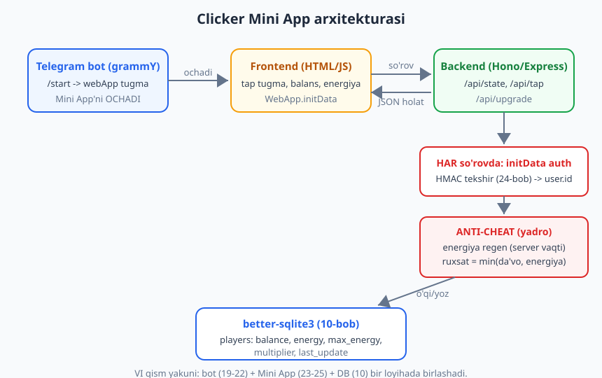
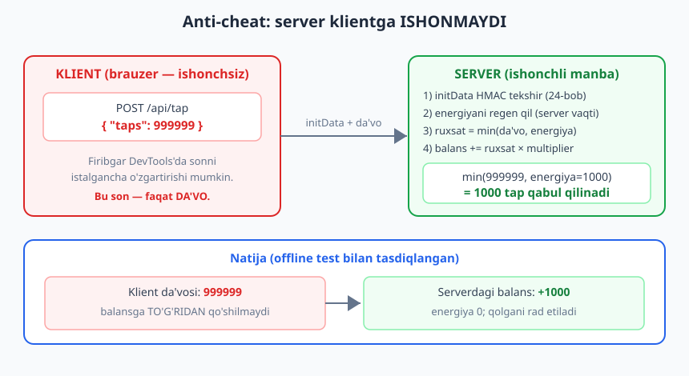
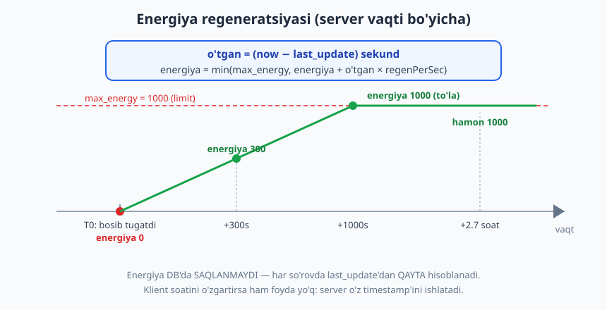

# 26 — Kapston: Hamster uslubidagi clicker Mini App

[⬅️ Oldingi: 25 — Mini App backend](./25-miniapp-backend.md) · [🏠 README](./README.md)

---

> **Bu bobda:** butun kitobning yakuniy loyihasini — **Hamster Kombat uslubidagi tap-to-earn clicker Mini App**'ini — boshidan oxirigacha quramiz. Foydalanuvchi `/start` bilan botni ochadi, bot `webApp` tugma orqali **Mini App**'ni ishga tushiradi; ilovada katta tap tugmasi, balans va energiya ko'rsatkichi hamda upgrade do'koni bor. Ilova `window.Telegram.WebApp.initData` ni backend'ga yuboradi, backend esa **har so'rovda** initData'ni HMAC bilan tekshiradi (24-bob), `GET /api/state` bilan holatni qaytaradi va `POST /api/tap` bilan bosishlarni qayd etadi. Eng muhimi — bu bobning **markaziy tushunchasi** — **anti-cheat**: klient "men 999999 marta bosdim" desa ham, **server klientga ishonmaydi**; u energiya va o'tgan vaqt bo'yicha haqiqiy bosishlar sonini cheklab, balansni **serverda** hisoblaydi. Yo'l-yo'lakay energiya regeneratsiyasini (server timestamp bo'yicha), upgrade (multiplier/energiya limiti), balansdan yechish va `better-sqlite3` bilan holatni saqlashni ko'ramiz. Bu — VI qism (23-25) va butun kitobning yakuni: bot + frontend + backend + DB bitta loyihada birlashadi.

> **Halollik eslatmasi:** loyihaning butun **server mantig'i** — initData HMAC validatsiyasi (24-bob), energiya regeneratsiyasi (`now - last_update` bo'yicha), anti-cheat tap cheklovi (`min(da'vo, energiya)`), balansni serverda hisoblash, upgrade (balansdan yechish), foydalanuvchi izolyatsiyasi va `better-sqlite3` holati — **haqiqiy HTTP server (Hono) ko'tarib, uchma-uch offline ishga tushirib tasdiqlangan**: localhost'da server ko'tarildi, imzolangan initData bilan `fetch` so'rovlari yuborildi, javoblar `assert` qilindi, so'ng server yopilib test DB o'chirildi. Natija: **13/13 PASS** — bob oxiridagi hisobotda; jumladan klient `999999` da'vo qilganda server faqat `1000` tapni qabul qilib balansni `1000` ga cheklagani isbotlandi. **Frontend (HTML/JS)** — `window.Telegram.WebApp` brauzer/Telegram muhitida ishlaydi, shuning uchun u **illustrativ** deb belgilangan (logikasi tushuntirilgan, lekin Node'da "ishladi" deb yozilmaydi). **Jonli ishlash** — botni `@BotFather` token bilan polling/webhook orqali ishga tushirish, HTTPS domen, real Telegram Mini App — internet va sozlamani talab qiladi; bu bloklar to'g'ri, lekin "illustrativ" deb belgilangan.

---

## Nimani quramiz?

Hamster Kombat, Notcoin, Tapswap kabi o'yinlar millionlab foydalanuvchini to'pladi. Ularning g'oyasi oddiy: **ekranni bosasiz — tanga yig'asiz**. Lekin har bosishda energiya sarflanadi; energiya tugaganda kutishingiz kerak (u vaqt o'tishi bilan tiklanadi), yoki tangalaringizni **upgrade**'ga sarflab ko'proq daromad olasiz.

Biz xuddi shunday clicker quramiz. Uning uch qismi bor:

1. **Bot (grammY)** — `/start` da `webApp` tugmasi bilan Mini App'ni ochadi. Bu — 23-bobdagi `WebAppInfo` va `InlineKeyboard.webApp`.
2. **Frontend (HTML/JS, brauzerda)** — tap tugmasi, balans va energiya ko'rsatkichi, upgrade do'koni. `window.Telegram.WebApp` SDK orqali `initData`'ni oladi va `MainButton`/`HapticFeedback`'ni ishlatadi.
3. **Backend (Hono yoki Express)** — **har so'rovda** initData'ni tekshiradi (24-25-bob), holatni `better-sqlite3` da saqlaydi (10-bob), va eng muhimi — **balansni o'zi hisoblaydi**.



> **Eslatma — nega aynan clicker?** Clicker — Mini App dunyosiga kirishning eng mashhur "Hello, World"i, lekin u jiddiy tushunchani o'rgatadi: **klientga hech qachon ishonmaslik**. O'yin pul (yoki keyinchalik token) bilan bog'liq bo'lgani uchun, firibgar brauzer DevTools'da istalgan so'rovni yasashi mumkin. Agar siz balansni klient yuborgan songa qo'shsangiz, o'yin bir kunda buziladi. Bu naqsh — clicker uchun emas, **har qanday** o'yin, ovoz berish, sovrin, ball tizimi uchun amal qiladi.

---

## Anti-cheat: bu bobning eng muhim g'oyasi

Avval falsafadan boshlaylik, chunki qolgan hamma kod shu g'oyaga xizmat qiladi.

**Muammo.** Frontend foydalanuvchi qurilmasida ishlaydi. Foydalanuvchi (yoki firibgar) uni **to'liq nazorat qiladi**: DevTools'ni ochib, JavaScript'ni o'zgartirib, yoki to'g'ridan-to'g'ri `fetch` bilan istalgan so'rovni yuborishi mumkin. Demak frontend yuborgan **hech qanday songa ishonib bo'lmaydi**.

Agar backend shunday yozilsa — **NOTO'G'RI:**

```js
// XATO! Klientga ishonish — o'yinni buzadi
app.post("/api/tap", async (c) => {
  const { taps } = await c.req.json();
  player.balance += taps;          // firibgar { taps: 999999999 } yuboradi -> "boy" bo'ladi
  return c.json({ balance: player.balance });
});
```

Firibgar `{ "taps": 999999999 }` yuboradi va bir soniyada o'yinning eng boyiga aylanadi. Hech qanday tugma bosmasdan.

**Yechim — server haqiqatni o'zi hisoblaydi.** Klient faqat "men bosdim" deb **da'vo** qiladi; server esa o'zining qoidalari bilan **ruxsat etilgan** bosishlar sonini hisoblaydi:

1. Server **energiya**ni saqlaydi (masalan, maksimum 1000). Har bosish 1 energiya sarflaydi.
2. So'rov kelganda, server avval energiyani **regeneratsiya** qiladi (o'tgan vaqt bo'yicha — pastda).
3. So'ng `ruxsat = min(klient_da'vosi, mavjud_energiya)` — ya'ni energiya yetganicha.
4. Balans **serverda** hisoblanadi: `balans += ruxsat × multiplier`.
5. Energiya kamayadi, yangi holat DB'ga yoziladi.



Natija: klient `999999` desa ham, energiya 1000 bo'lsa, **faqat 1000 tap** qabul qilinadi va balans `1000` ga oshadi. Qolgan da'vo — shunchaki tashlanadi. Bu bobning oxirida biz buni **haqiqiy server bilan offline isbotlaymiz**: klient `999999` -> server `1000`.

> **Diqqat — bu "altitude" qoidasi.** "Klient nima qila olishini boshqaradi, server nima rost ekanini hal qiladi." Mini App'ni ko'rsatish, animatsiya, his-tuyg'u (haptic) — bularning hammasi frontend'da. Lekin **qaror** (balans qancha oshadi, upgrade'ga puling yetadimi) — **har doim** serverda. Bu — to'lovlar (14-bob) va majburiy obuna (22-bob) bilan bir xil tamoyil: muhim tekshiruvni hech qachon klientga topshirmang.

---

## Energiya regeneratsiyasi — server timestamp bo'yicha

Energiya vaqt o'tishi bilan tiklanishi kerak (aks holda o'yin bir martalik bo'ladi). Lekin biz energiyani **har soniyada** yangilab DB'ga yozib o'tirmaymiz — bu samarasiz va keraksiz. O'rniga, biz **last_update** timestamp'ini saqlaymiz va energiyani **so'rov kelganda hisoblaymiz**:

```text
o'tgan_sekund = (now - last_update) / 1000
energiya = min(max_energy, energiya + o'tgan_sekund × regenPerSec)
```



Bu yondashuvning ikki katta afzalligi bor:

- **Energiya doim "joriy"** — foydalanuvchi 5 daqiqa o'ynamasdan qaytsa, energiyasi avtomatik to'lgan bo'ladi. Hech qanday fon-jarayon (cron) kerak emas.
- **Anti-cheat bilan birlashadi** — vaqt **server**dan olinadi (`Date.now()`), klientdan emas. Firibgar telefonidagi soatni 1 yilga oldinga sursa ham, server o'z soatini ishlatadi.

> **Eslatma — nega `Math.floor`?** Biz `(now - last_update) / 1000` ni **butun songa** yaxlitlaymiz (`Math.floor`). Aks holda yarim soniyalar yig'ilib, energiya "noma'lum" kasr sonlarga aylanadi. Butun energiya — hisoblash sodda va xatosiz bo'ladi.

---

## Loyiha tuzilishi

Loyihani 11-bobdagidek modullarga ajratamiz. Bu safar **ikki ishlaydigan jarayon** bor: **bot** (Telegram bilan) va **server** (Mini App backend). Ko'pincha ularni bitta jarayonda ishlatish qulay (bot polling + HTTP server bir vaqtda), lekin biz mantiqan ajratamiz.

```text
clicker/
  .env                      # BOT_TOKEN, WEBAPP_URL, PORT — maxfiy
  .env.example
  package.json              # "type": "module"
  data/
    clicker.db              # SQLite — .gitignore'ga
  public/
    index.html              # frontend (HTML + JS, Telegram WebApp SDK)
  src/
    config.js               # .env o'qish + o'yin sozlamalari (GAME)
    game.js                 # SOF mantiq: regenEnergy, applyTaps, upgrade (anti-cheat yadrosi)
    auth.js                 # validateInitData (24-bob)
    db.js                   # better-sqlite3 ulanish + players jadvali
    repo.js                 # repository: getOrCreate / save / top
    server.js               # Hono backend: /api/state, /api/tap, /api/upgrade
    bot.js                  # grammY bot: /start -> webApp tugma
    index.js                # ikkalasini ishga tushiradi
```

> **Eslatma — nega `game.js` alohida?** Anti-cheat va energiya mantig'i — loyihaning **yuragi**. Uni **sof funksiyalar** (kirish -> chiqish, side-effect yo'q) sifatida ajratamiz, shunda uni **bevosita test qilish** mumkin (server ko'tarmasdan ham). Bu — 16-bobdagi "testlanadigan kod" tamoyili. Bob oxiridagi offline test ham aynan shu funksiyalar atrofida quriladi.

---

## 1) Config va o'yin sozlamalari

Avval `.env` va o'yin parametrlari. **Muhim:** o'yin sozlamalari (energiya limiti, regen tezligi, upgrade narxi) — faqat **serverda**. Klient ularni bilishi mumkin (ko'rsatish uchun), lekin **o'zgartira olmaydi**.

```js
// src/config.js
import "dotenv/config";

const token = process.env.BOT_TOKEN;
if (!token) {
  throw new Error("BOT_TOKEN yo'q! .env faylga BOT_TOKEN=... yozing (02-bob).");
}

export const config = {
  token,
  // Mini App qayerdan ochiladi (HTTPS shart — 23-bob). Lokalda tunnel (ngrok/cloudflared) ishlatasiz.
  webAppUrl: process.env.WEBAPP_URL ?? "https://mywebapp.example",
  port: Number(process.env.PORT ?? 3000),
  dbPath: process.env.DB_PATH ?? "data/clicker.db",
};

// O'yin qoidalari — FAQAT serverda. Klient bularni o'zgartira olmaydi.
export const GAME = {
  baseMaxEnergy: 1000, // boshlang'ich energiya limiti
  regenPerSec: 1,      // sekundiga necha energiya tiklanadi
  tapCost: 1,          // bitta tap necha energiya sarflaydi
  upgradeCosts: {
    mult: 100,         // multiplier oshirish narxi (balansdan)
    energy: 50,        // energiya limitini oshirish narxi
  },
  energyStep: 500,     // energiya upgrade'i max_energy'ni qancha oshiradi
};
```

```text
# .env.example
BOT_TOKEN=123456:ABC-DEF...        # @BotFather'dan (02-bob)
WEBAPP_URL=https://abc.ngrok.app   # HTTPS Mini App manzili (23-bob)
PORT=3000
DB_PATH=data/clicker.db
```

> **Diqqat — Mini App HTTPS talab qiladi.** Telegram Mini App'ni faqat **HTTPS** manzildan ochadi (23-bob). Lokal ishlab chiqishda `https://localhost` yetmaydi — `ngrok`, `cloudflared` yoki shunga o'xshash tunnel bilan jamoat HTTPS manzilini oling va uni `@BotFather` -> bot sozlamalarida hamda `.env` da ishlating.

---

## 2) Anti-cheat yadrosi — `game.js` (sof mantiq)

Mana loyihaning eng muhim fayli. Diqqat bilan o'qing — bu uch funksiya butun anti-cheat'ni o'z ichiga oladi va ularda **hech qanday side-effect yo'q** (DB ham, tarmoq ham): faqat kirish va chiqish. Aynan shu narsa ularni **test qilinadigan** qiladi.

```js
// src/game.js
import { GAME } from "./config.js";

// Energiyani server vaqti bo'yicha tiklaydi (max_energy bilan cheklab).
// player.last_update — millisekundlarda saqlangan oxirgi yangilanish vaqti.
export function regenEnergy(player, now) {
  const elapsedSec = Math.max(0, Math.floor((now - player.last_update) / 1000));
  const regen = elapsedSec * GAME.regenPerSec;
  return Math.min(player.max_energy, player.energy + regen);
}

// ANTI-CHEAT YADROSI: klient da'vosini energiya bilan cheklab, balansni hisoblaydi.
// player — DB'dan olingan joriy holat; claimedTaps — KLIENT da'vosi (ishonchsiz); now — server vaqti.
export function applyTaps(player, claimedTaps, now) {
  // 1) energiyani tiklaymiz (server timestamp bo'yicha)
  const energyNow = regenEnergy(player, now);

  // 2) klient da'vosini xavfsiz, manfiy bo'lmagan butun songa keltiramiz
  //    (firibgar -5, "abc", 1e308 yuborishi mumkin — hammasini tozalaymiz)
  const claim = Math.max(0, Math.floor(Number(claimedTaps) || 0));

  // 3) SERVER cheklovi: energiya yetganicha tap (ENG MUHIM qator)
  const affordable = Math.floor(energyNow / GAME.tapCost);
  const allowed = Math.min(claim, affordable);

  // 4) balans SERVERDA hisoblanadi — klient sonidan EMAS
  const earned = allowed * player.multiplier;

  return {
    ...player,
    balance: player.balance + earned,
    energy: energyNow - allowed * GAME.tapCost,
    last_update: now,
    _allowed: allowed, // qancha qabul qilindi (javobda ko'rsatamiz)
    _earned: earned,
  };
}

// Upgrade: balansdan narxni yechib, multiplier yoki energiya limitini oshiradi.
export function applyUpgrade(player, kind, now) {
  // upgrade'da ham avval energiyani tiklab, soatni yangilaymiz (regen yo'qolmasin)
  const p = { ...player, energy: regenEnergy(player, now), last_update: now };
  const costs = GAME.upgradeCosts;

  if (kind === "mult") {
    if (p.balance < costs.mult) return { ...p, _error: "balans yetarli emas" };
    p.balance -= costs.mult;
    p.multiplier += 1;
  } else if (kind === "energy") {
    if (p.balance < costs.energy) return { ...p, _error: "balans yetarli emas" };
    p.balance -= costs.energy;
    p.max_energy += GAME.energyStep;
  } else {
    return { ...p, _error: "noma'lum upgrade" };
  }
  return p;
}
```

Bu uch funksiyani tushunsangiz — butun bobni tushundingiz. Ularni qayta o'qing:

- **`regenEnergy`** — energiyani DB'da emas, **har so'rovda qayta hisoblaydi**. Vaqt manbai — argument sifatida berilgan `now` (server'da `Date.now()`).
- **`applyTaps`** — 3-qadam (`Math.min(claim, affordable)`) butun anti-cheat'ning markazi. Klient `999999` desa, `affordable` masalan 1000 bo'lsa, `allowed = 1000`.
- **`applyUpgrade`** — balansdan **serverda** yechadi; firibgar "menga upgrade ber" deb so'rasa ham, puli yetmasa server `_error` qaytaradi.

> **Eslatma — `Number(claimedTaps) || 0`.** Firibgar `taps` o'rniga `"salom"`, `null`, `-100`, yoki `NaN` yuborishi mumkin. `Number("salom")` -> `NaN`, `NaN || 0` -> `0`. `Math.max(0, ...)` manfiyni 0 ga keltiradi. Hech qachon klient kiritmasiga "toza" deb ishonmang — har doim sanitizatsiya qiling.

---

## 3) initData autentifikatsiyasi — `auth.js`

24-bobdagi initData HMAC validatsiyasini ishlatamiz. Bu — backend'ning "darvozaboni": **kim** so'rov yuborayotganini (`user.id`) ishonchli aniqlaydi. Telegram initData'ni bot tokeni bilan imzolaydi, shuning uchun uni faqat tokenni biluvchi (ya'ni siz) tekshira oladi.

```js
// src/auth.js
import { createHmac } from "node:crypto";

// initData'ni tekshiradi. To'g'ri bo'lsa { ok:true, user }, aks holda { ok:false, reason }.
// nowMs — joriy vaqt (auth_date eskirganini tekshirish uchun; testda boshqarish mumkin).
export function validateInitData(initData, botToken, maxAgeSec = 86400, nowMs = Date.now()) {
  const params = new URLSearchParams(initData);
  const hash = params.get("hash");
  if (!hash) return { ok: false, reason: "hash yo'q" };
  params.delete("hash");

  // data_check_string: kalitlar alifbo tartibida, "key=value" satrlari \n bilan
  const dataCheckString = [...params.entries()]
    .map(([k, v]) => `${k}=${v}`)
    .sort()
    .join("\n");

  // secret = HMAC_SHA256("WebAppData" kaliti bilan, bot_token)
  const secretKey = createHmac("sha256", "WebAppData").update(botToken).digest();
  const computed = createHmac("sha256", secretKey).update(dataCheckString).digest("hex");
  if (computed !== hash) return { ok: false, reason: "hash mos kelmadi" };

  // Replay himoyasi: eski initData'ni rad etamiz (24-bob)
  const authDate = Number(params.get("auth_date"));
  if (!authDate || nowMs / 1000 - authDate > maxAgeSec) {
    return { ok: false, reason: "auth_date eskirgan" };
  }

  const user = JSON.parse(params.get("user") ?? "{}");
  return { ok: true, user }; // user.id — ishonchli foydalanuvchi ID'si
}
```

> **Diqqat — anti-cheat ikki qatlamli.** Birinchi qatlam — **kim** (auth: initData HMAC). Ikkinchi qatlam — **nima qila oladi** (game: energiya/balans). Birinchisisiz firibgar boshqa odamning balansini o'zgartira oladi (`user_id` ni soxtalashtirib). Ikkinchisisiz o'z balansini cheksiz oshiradi. **Ikkalasi ham** kerak. initData tafsilotlari — 24-bobda.

---

## 4) Ma'lumotlar bazasi va repository

10-bobdagi `better-sqlite3` va repository naqshini ishlatamiz. Har o'yinchi bitta qator: `user_id` (birlamchi kalit), balans, energiya, energiya limiti, multiplier va `last_update`.

```js
// src/db.js
import Database from "better-sqlite3";
import { config, GAME } from "./config.js";

export const db = new Database(config.dbPath);
db.pragma("journal_mode = WAL");

db.exec(`
  CREATE TABLE IF NOT EXISTS players (
    user_id     INTEGER PRIMARY KEY,
    balance     INTEGER NOT NULL DEFAULT 0,
    energy      INTEGER NOT NULL DEFAULT ${GAME.baseMaxEnergy},
    max_energy  INTEGER NOT NULL DEFAULT ${GAME.baseMaxEnergy},
    multiplier  INTEGER NOT NULL DEFAULT 1,
    last_update INTEGER NOT NULL DEFAULT 0
  );
`);
```

```js
// src/repo.js
import { db } from "./db.js";
import { GAME } from "./config.js";

const stmts = {
  get: db.prepare("SELECT * FROM players WHERE user_id = ?"),
  insert: db.prepare(
    `INSERT INTO players (user_id, balance, energy, max_energy, multiplier, last_update)
     VALUES (@user_id, 0, @max_energy, @max_energy, 1, @now)`
  ),
  update: db.prepare(
    `UPDATE players SET balance=@balance, energy=@energy, max_energy=@max_energy,
     multiplier=@multiplier, last_update=@last_update WHERE user_id=@user_id`
  ),
  top: db.prepare("SELECT user_id, balance FROM players ORDER BY balance DESC LIMIT 10"),
};

export const repo = {
  // O'yinchini oladi; bo'lmasa yangi yaratadi (energiya to'la holatda)
  getOrCreate(userId, now) {
    let p = stmts.get.get(userId);
    if (!p) {
      stmts.insert.run({ user_id: userId, max_energy: GAME.baseMaxEnergy, now });
      p = stmts.get.get(userId);
    }
    return p;
  },
  save(p) {
    // game.js qaytargan obyektda _allowed/_earned/_error bo'lishi mumkin —
    // ular DB ustunlari emas, lekin named-param faqat kerakli kalitlarni oladi.
    stmts.update.run({
      user_id: p.user_id, balance: p.balance, energy: p.energy,
      max_energy: p.max_energy, multiplier: p.multiplier, last_update: p.last_update,
    });
  },
  top() {
    return stmts.top.all(); // leaderboard — [{ user_id, balance }, ...]
  },
};
```

> **Eslatma — `getOrCreate`.** O'yinchi birinchi marta so'rov yuborganda, uning qatori hali yo'q. `getOrCreate` uni o'sha zahoti yaratadi (energiya to'la, balans 0). Bu — "ro'yxatdan o'tish" qadamini yo'q qiladi: foydalanuvchi Mini App'ni ochishi bilan o'ynay boshlaydi. `better-sqlite3` sinxron (10-bob), shuning uchun `await` kerak emas.

---

## 5) Backend server — `server.js` (Hono)

Endi 25-bobdagi Hono backend'ni quramiz. **Har** `/api/*` so'rovida initData tekshiriladi (auth middleware), so'ng endpointlar `game.js` mantig'ini chaqiradi. Diqqat: endpointlar **o'zlari hisoblamaydi** — ular `game.js` ga topshiradi va natijani saqlaydi. Bu — "ingichka endpoint, qalin mantiq" tamoyili.

```js
// src/server.js
import { Hono } from "hono";
import { serveStatic } from "@hono/node-server/serve-static";
import { config } from "./config.js";
import { validateInitData } from "./auth.js";
import { repo } from "./repo.js";
import { applyTaps, applyUpgrade, regenEnergy } from "./game.js";

export function buildApp(now = () => Date.now()) {
  const app = new Hono();

  // --- AUTH: har /api so'rovida initData (24-bob) ---
  app.use("/api/*", async (c, next) => {
    const initData = c.req.header("X-Init-Data") ?? "";
    const res = validateInitData(initData, config.token, 86400, now());
    if (!res.ok) return c.json({ error: "auth", reason: res.reason }, 401);
    c.set("user", res.user); // keyingi handlerlarga ishonchli user.id
    await next();
  });

  // --- Joriy holat: balans + (tiklangan) energiya ---
  app.get("/api/state", (c) => {
    const user = c.get("user");
    const t = now();
    const p = repo.getOrCreate(user.id, t);
    return c.json({
      balance: p.balance,
      energy: regenEnergy(p, t), // hisoblab ko'rsatamiz (DB'ni o'zgartirmasdan)
      maxEnergy: p.max_energy,
      multiplier: p.multiplier,
    });
  });

  // --- Tap: klient da'vosini SERVER cheklaydi (anti-cheat) ---
  app.post("/api/tap", async (c) => {
    const user = c.get("user");
    const body = await c.req.json().catch(() => ({}));
    const t = now();
    const p = repo.getOrCreate(user.id, t);
    const next = applyTaps(p, body.taps, t); // <-- anti-cheat yadrosi
    repo.save(next);
    return c.json({
      balance: next.balance,
      energy: next.energy,
      maxEnergy: next.max_energy,
      multiplier: next.multiplier,
      applied: next._allowed, // server NECHTA tapni qabul qildi
      earned: next._earned,
    });
  });

  // --- Upgrade: balansdan yechib, kuchaytirish ---
  app.post("/api/upgrade", async (c) => {
    const user = c.get("user");
    const body = await c.req.json().catch(() => ({}));
    const t = now();
    const p = repo.getOrCreate(user.id, t);
    const next = applyUpgrade(p, body.kind, t);
    repo.save(next); // muvaffaqiyatsiz bo'lsa ham last_update/energy saqlanadi
    if (next._error) return c.json({ error: next._error }, 400);
    return c.json({
      balance: next.balance, multiplier: next.multiplier, maxEnergy: next.max_energy,
    });
  });

  // --- Leaderboard (eslatma — sodda) ---
  app.get("/api/top", (c) => c.json({ top: repo.top() }));

  // --- Frontend statik fayllari (public/) ---
  app.use("/*", serveStatic({ root: "./public" }));

  return app;
}
```

> **Eslatma — Express bilan ham mumkin.** Bu kitob Hono'ni ko'rsatadi (25-bob), lekin xuddi shu mantiqni Express (13-bob) bilan yozish mumkin: `app.use(express.json())`, `app.use((req,res,next)=>{ ... })` auth middleware, `app.post("/api/tap", ...)`. Anti-cheat **mantiqi** (`game.js`) o'zgarmaydi — faqat HTTP qatlami farq qiladi. Tanlov: Hono yengilroq va Cloudflare Workers'ga mos; Express — eng keng tarqalgan. Ikkalasi ham `webhookCallback` bilan botni ham xizmat qila oladi (13-bob).

---

## 6) Bot — `bot.js` (Mini App'ni ochadi)

Bot juda sodda: `/start` da `webApp` tugmasi bilan Mini App'ni ochadi (23-bob). Ixtiyoriy: chat menyu tugmasini (`setChatMenuButton`) ham o'rnatamiz, shunda foydalanuvchi har doim "Ochish" tugmasini ko'radi.

```js
// src/bot.js
import { Bot, InlineKeyboard } from "grammy";
import { config } from "./config.js";

export const bot = new Bot(config.token);

bot.command("start", (ctx) =>
  ctx.reply(
    `Salom, ${ctx.from.first_name}! 🐹\n` +
      "Bu — clicker o'yini. Tugmani bosib tanga yig'ing!\n" +
      "Pastdagi tugma bilan o'yinni oching:",
    {
      reply_markup: new InlineKeyboard().webApp("🎮 O'ynash", config.webAppUrl),
    }
  )
);

bot.command("top", (ctx) =>
  ctx.reply("Reyting Mini App ichida ko'rsatiladi — o'yinni oching!")
);

// Chat menyu tugmasi — doimiy "Ochish" tugmasi (23-bob)
export async function setupMenuButton() {
  await bot.api.setChatMenuButton({
    menu_button: { type: "web_app", text: "O'ynash", web_app: { url: config.webAppUrl } },
  });
}

bot.catch((err) => console.error("Bot xato:", err.error));
```

```js
// src/index.js — botni va serverni birga ishga tushiradi
import { serve } from "@hono/node-server";
import { config } from "./config.js";
import { buildApp } from "./server.js";
import { bot, setupMenuButton } from "./bot.js";

const app = buildApp();
serve({ fetch: app.fetch, port: config.port });
console.log(`Backend tinglayapti: http://localhost:${config.port}`);

await setupMenuButton().catch(() => {}); // token/internet kerak — illustrativ
bot.start();                              // long polling (token + internet kerak)
console.log("Bot ishga tushdi.");
```

> **Illustrativ:** `bot.start()`, `setupMenuButton()` (`setChatMenuButton`) va `serve(...)` ning jonli ishlashi — `@BotFather` token, internet va HTTPS Mini App manzilini talab qiladi. Botning va serverning **mantig'i** offline tasdiqlangan (bob oxiridagi hisobot), lekin Telegram bilan haqiqiy almashinuv tokenni talab qiladi. Lokalda tunnel (ngrok/cloudflared) bilan `WEBAPP_URL` ni HTTPS qiling.

---

## 7) Frontend — `public/index.html` (illustrativ)

Endi foydalanuvchi ko'radigan qism. Bu **brauzer/Telegram muhitida** ishlaydi (`window.Telegram.WebApp`), shuning uchun biz uni **illustrativ** deb belgilaymiz — uni Node'da ishga tushira olmaymiz, lekin mantig'i to'liq va to'g'ri. Frontend faqat **ko'rsatadi va da'vo yuboradi**; haqiqatni server hal qiladi.

```html
<!-- public/index.html (illustrativ — brauzer/Telegram muhiti) -->
<!doctype html>
<html lang="uz">
  <head>
    <meta charset="utf-8" />
    <meta name="viewport" content="width=device-width, initial-scale=1, user-scalable=no" />
    <title>Clicker</title>
    <!-- Telegram WebApp SDK (23-bob) -->
    <script src="https://telegram.org/js/telegram-web-app.js"></script>
    <style>
      body { font-family: system-ui, "Segoe UI", sans-serif; text-align: center;
             padding: 16px; margin: 0; }
      #coin { width: 200px; height: 200px; border-radius: 50%; border: none;
              font-size: 64px; background: #f59e0b; color: #fff; cursor: pointer;
              user-select: none; touch-action: manipulation; }
      #coin:active { transform: scale(0.96); }
      .bar { background: #e2e8f0; border-radius: 8px; height: 16px; overflow: hidden; margin: 8px 0; }
      .bar > i { display: block; height: 100%; background: #16a34a; width: 0; }
      .stat { font-size: 20px; font-weight: bold; }
      button.shop { margin: 4px; padding: 10px 14px; border-radius: 8px; border: 1px solid #2563eb;
                    background: #fff; color: #2563eb; font-size: 15px; }
    </style>
  </head>
  <body>
    <div class="stat">Balans: <span id="balance">0</span></div>
    <div class="bar"><i id="energyBar"></i></div>
    <div>Energiya: <span id="energy">0</span> / <span id="maxEnergy">0</span></div>

    <button id="coin">🐹</button>

    <div>
      <button class="shop" data-kind="mult">Multiplier (+1) — 100</button>
      <button class="shop" data-kind="energy">Energiya (+500) — 50</button>
    </div>

    <script>
      const tg = window.Telegram.WebApp;
      tg.ready();
      tg.expand();

      // HAR so'rovga initData'ni qo'shamiz — server kimligimizni tekshiradi (24-bob)
      const HEADERS = { "Content-Type": "application/json", "X-Init-Data": tg.initData };

      let state = { balance: 0, energy: 0, maxEnergy: 1, multiplier: 1 };
      let pendingTaps = 0; // hali serverga yuborilmagan bosishlar (batch)

      const $ = (id) => document.getElementById(id);

      function render() {
        $("balance").textContent = state.balance;
        $("energy").textContent = state.energy;
        $("maxEnergy").textContent = state.maxEnergy;
        const pct = state.maxEnergy ? (state.energy / state.maxEnergy) * 100 : 0;
        $("energyBar").style.width = pct + "%";
      }

      async function loadState() {
        const r = await fetch("/api/state", { headers: HEADERS });
        state = await r.json();
        render();
      }

      // Tugmani bosganda: DARHOL optimistik ko'rsatamiz (his-tuyg'u uchun),
      // lekin HAQIQATNI keyin serverdan olamiz. Server da'vomizni cheklaydi.
      $("coin").addEventListener("click", () => {
        if (state.energy - pendingTaps <= 0) return; // klient tomonda ham ozgina cheklov (UX)
        pendingTaps++;
        state.energy--; // optimistik (server tasdiqlaydi)
        render();
        tg.HapticFeedback.impactOccurred("light"); // tebranish (23-bob)
      });

      // Bosishlarni har 1 soniyada to'plab serverga yuboramiz (har bosishda emas!)
      setInterval(async () => {
        if (pendingTaps === 0) return;
        const taps = pendingTaps;
        pendingTaps = 0;
        const r = await fetch("/api/tap", {
          method: "POST", headers: HEADERS, body: JSON.stringify({ taps }),
        });
        state = await r.json(); // SERVER hisoblagan haqiqiy holat — optimistikni almashtiradi
        render();
      }, 1000);

      // Upgrade do'koni
      document.querySelectorAll("button.shop").forEach((btn) => {
        btn.addEventListener("click", async () => {
          const r = await fetch("/api/upgrade", {
            method: "POST", headers: HEADERS, body: JSON.stringify({ kind: btn.dataset.kind }),
          });
          if (!r.ok) {
            tg.HapticFeedback.notificationOccurred("error");
            tg.showAlert("Balans yetarli emas yoki xato.");
            return;
          }
          await loadState();
          tg.HapticFeedback.notificationOccurred("success");
        });
      });

      // Energiya fonda ham tiklanadi — har 2s da serverdan yangilab turamiz
      setInterval(loadState, 2000);
      loadState();
    </script>
  </body>
</html>
```

Bir nechta muhim frontend qarori:

- **`tg.initData` har so'rovga qo'shiladi** (`X-Init-Data` sarlavhasi). Serversiz bu — shunchaki satr; server uni HMAC bilan tekshirgandagina ma'noga ega bo'ladi.
- **Bosishlar to'planadi (batch).** Har bosishda alohida so'rov yubormaymiz (sekundiga 10 marta bosish = 10 so'rov — server toshib ketadi). O'rniga, bosishlarni 1 soniyada to'plab, bitta `{ taps: N }` so'rovida yuboramiz. Server baribir energiyaga qarab cheklaydi.
- **Optimistik UI.** Tugma bosilganda balansni darhol "oshirgandek" ko'rsatamiz (his-tuyg'u uchun), lekin **haqiqatni** keyin serverdan olamiz. Agar server kamroq qabul qilsa (energiya tugagan), keyingi `render` to'g'rilaydi. Bu — frontend "yolg'on" emas, "vaqtinchalik taxmin".

> **Illustrativ:** bu HTML `window.Telegram.WebApp` (Telegram brauzer muhiti) talab qiladi, shuning uchun uni Node'da ishga tushira olmaymiz. Mantig'i to'g'ri va to'liq, lekin "ishladi" deb yozmaymiz — server tomonini esa **haqiqatan** sinab ko'rdik (pastda). `tg.HapticFeedback`, `tg.showAlert`, `tg.expand` — 23-bobdagi WebApp SDK metodlari.

> **Diqqat — `tg.initData` vs `tg.initDataUnsafe`.** SDK ikkita beradi: `initData` (imzolangan **xom satr** — serverga shuni yuboring) va `initDataUnsafe` (qulay obyekt, lekin **imzosiz** — faqat UI uchun, hech qachon serverda ishonmang). Serverga **doim** `initData` (satr) ni yuboring — uni tekshirib bo'ladi. Bu nozik xato — 24-bobda batafsil.

---

## 8) Serverni offline tekshirish

Endi eng muhim qism — **butun backend'ni haqiqiy server bilan offline tekshiramiz**. Bu safar 16-bobdagi botli naqsh emas, balki **HTTP server** naqshi: localhost'da Hono server ko'taramiz, imzolangan initData bilan `fetch` so'rovlari yuboramiz, javoblarni `assert` qilamiz, so'ng serverni yopib test DB'ni o'chiramiz.

Eng muhim tekshiruv — **anti-cheat**: klient `999999` da'vo qiladi, server `1000` ga cheklaydi. Test "soxta soat" (`fakeNow`) ishlatadi, shunda energiya regeneratsiyasini ham aniq sinashimiz mumkin (vaqtni qo'lda oldinga suramiz).

```js
// _verify_26.mjs (qisqartirilgan skelet — to'liq versiya probe muhitida ishga tushirilgan)
import { serve } from "@hono/node-server";
import { Hono } from "hono";
import Database from "better-sqlite3";
import { createHmac } from "node:crypto";
import assert from "node:assert/strict";

const BOT_TOKEN = "12345:FAKE-OFFLINE-TOKEN";

// TEST uchun: haqiqiy imzolangan initData yasaymiz (klient o'rnida)
function signInitData(user, token, authDate) {
  const params = new URLSearchParams();
  params.set("user", JSON.stringify(user));
  params.set("auth_date", String(authDate));
  const dcs = [...params.entries()].map(([k, v]) => `${k}=${v}`).sort().join("\n");
  const secret = createHmac("sha256", "WebAppData").update(token).digest();
  params.set("hash", createHmac("sha256", secret).update(dcs).digest("hex"));
  return params.toString();
}

// ... validateInitData, GAME, makeDb, makeRepo, regenEnergy, applyTaps, buildApp ...
// (yuqoridagi game.js / auth.js / server.js bilan AYNAN bir xil mantiq)

let fakeNow = 1_700_000_000_000;        // soxta server soati (ms)
const app = buildApp(repo, () => fakeNow);
const server = serve({ fetch: app.fetch, port: 0 });
await new Promise((r) => server.once("listening", r));
const base = `http://127.0.0.1:${server.address().port}`;
const init = signInitData({ id: 777, first_name: "Ali" }, BOT_TOKEN, Math.floor(fakeNow / 1000));

// ANTI-CHEAT: klient 999999 da'vo -> server 1000 ga cheklaydi
const r = await fetch(base + "/api/tap", {
  method: "POST",
  headers: { "Content-Type": "application/json", "X-Init-Data": init },
  body: JSON.stringify({ taps: 999999 }),
});
const j = await r.json();
assert.equal(j.applied, 1000);  // server FAQAT 1000 tapni qabul qildi
assert.equal(j.balance, 1000);  // balans = 1000 * multiplier(1)
assert.equal(j.energy, 0);      // energiya tugadi
```

Energiya regeneratsiyasini sinash uchun soxta soatni oldinga suramiz va `/api/state` ni qayta so'raymiz:

```js
// Energiya 0 edi. 300 soniya "o'tkazamiz" -> 300 energiya tiklanishi kerak
fakeNow += 300_000;
const s = await (await fetch(base + "/api/state", { headers: { "X-Init-Data": init } })).json();
assert.equal(s.energy, 300); // server vaqti bo'yicha, klient emas
```

Bobning oxirida bu testlarning to'liq ro'yxati va natijasi (**13/13 PASS**) keltirilgan.

> **Eslatma — nega `port: 0`?** `@hono/node-server` ga `port: 0` bersak, OS bo'sh portni o'zi tanlaydi (`server.address().port` orqali bilib olamiz). Bu — testlar bir-biriga xalal bermasligi uchun: qattiq kodlangan `3000` band bo'lishi mumkin. Server `server.close()` bilan yopiladi, test DB esa `rmSync` bilan o'chiriladi.

---

## Bob bo'yicha qisqacha xulosa

Biz VI qismni (va butun kitobni) bitta loyihada birlashtirdik:

| Bo'lak | Modul | Bob |
|---|---|---|
| Bot Mini App'ni ochadi (`webApp` tugma) | `bot.js` | [23](./23-webapp-asoslari.md) |
| initData HMAC auth (har so'rovda) | `auth.js` | [24](./24-webapp-xavfsizlik.md) |
| Hono backend, har so'rovda auth | `server.js` | [25](./25-miniapp-backend.md) |
| Anti-cheat + energiya regen (sof mantiq) | `game.js` | bu bob (yadro) |
| DB + repository (`better-sqlite3`) | `db.js`, `repo.js` | [10](./10-sessiya-malumotlar-bazasi.md) · [SQL](../sql/README.md) |
| Frontend (HTML/JS, WebApp SDK) | `public/index.html` | [23](./23-webapp-asoslari.md) |
| Sof funksiyalar -> testlanadigan kod | `game.js` offline test | [16](./16-testlash-xatolar.md) |
| Deploy (HTTPS, tunnel, webhook) | `index.js`, tunnel | [13](./13-webhook.md) · [17](./17-production-deploy.md) |

Eng muhim dars — **klientga ishonmaslik**. Mini App chiroyli ko'rinadi, lekin u foydalanuvchi qurilmasida ishlaydi; **har bir muhim qaror serverda** olinishi kerak. Bu tamoyil clicker'dan ancha kengroq: to'lovlar (14-bob), majburiy obuna (22-bob), ovoz berish, sovrin, reyting — hammasida server haqiqatni hisoblaydi, klient faqat ko'rsatadi.

Python'da xuddi shu o'yinni aiogram + FastAPI bilan yozsangiz, mantiq aynan bir xil bo'ladi: FastAPI dependency'sida initData tekshiriladi, SQLAlchemy/sqlite3 da balans saqlanadi, `min(claim, energy)` cheklovi qo'llaniladi — solishtirish uchun [../tgbot-python/README.md](../tgbot-python/README.md). Til o'zgaradi, **anti-cheat tamoyili — o'zgarmaydi**.

---

## Mashqlar

> Quyidagi mashqlarning ko'pi **offline tekshiriladi** — backend'ni qurib, localhost'da Hono server ko'tarib (`serve({ fetch: app.fetch, port: 0 })`), imzolangan initData (`signInitData`) bilan `fetch` so'rovlari yuborib, javoblarni yoki DB holatini `assert` qiling. Energiya/vaqtga bog'liq mashqlarda "soxta soat" (`fakeNow`) ni qo'lda suring. Mashqlar — **o'yinni kengaytirish** turida: mavjud clicker'ga yangi imkoniyat qo'shasiz. Anti-cheat mantig'ini (`game.js`) sof funksiya sifatida server ko'tarmasdan ham bevosita test qilishingiz mumkin.

### Oson

1. **Tap narxini o'zgartirish.** `GAME.tapCost` ni `2` qiling (har tap 2 energiya). Endi 1000 energiya bilan klient `999999` da'vo qilsa, server nechta tapni qabul qiladi? Offline: `applyTaps` ni chaqirib, `_allowed === 500` ekanini tasdiqlang.
2. **Balans ko'rsatkichi formatlash.** Frontend'da balansni mingliklar ajratuvchi bilan ko'rsating (`1000` -> `1 000`). `Number.toLocaleString` dan foydalaning. (Bu — sof frontend o'zgarishi; `render` funksiyasini yangilang.)
3. **Boshlang'ich energiyani oshirish.** `GAME.baseMaxEnergy` ni `500` qiling. Yangi o'yinchi yaratilganda energiyasi 500 bo'lishini va `/api/state` shu qiymatni qaytarishini offline tasdiqlang.
4. **`/help` buyrug'i.** Botga `/help` qo'shing: u o'yin qoidalarini qisqacha tushuntirsin (tap, energiya, upgrade). Offline: `/help` uzatib (`bot.handleUpdate` + transformer, 16-bob), javobda `"energiya"` borligini tasdiqlang.

### O'rta

5. **Energiya regen tezligini sozlash.** `GAME.regenPerSec` ni `5` qiling. Soxta soatni 100 soniyaga surganda energiya `0` dan `500` ga (max bilan cheklab) tiklanishini offline tasdiqlang.
6. **Upgrade narxi o'sishi.** Multiplier upgrade narxini har safar oshiring (`narx = 100 × multiplier`). `applyUpgrade` ga narx hisoblashni qo'shing va DB'da balansdan to'g'ri yechilishini offline tasdiqlang (1->2 = 100, 2->3 = 200).
7. **Kunlik bonus.** `players` ga `last_bonus INTEGER` ustuni qo'shing. `POST /api/bonus` har 24 soatda bir marta balansga 500 qo'shsin (`now - last_bonus >= 86400000`). Offline: bonus oling, darhol yana so'rang -> rad etilsin; soatni 24 soat oldinga surib -> qabul qilinsin.
8. **Leaderboard endpointi.** `GET /api/top` allaqachon bor. Unga test yozing: uch o'yinchi (har xil balans) yarating, javobda ular **balans bo'yicha kamayuvchi** tartibda kelishini va eng yuqorisi birinchi ekanini offline tasdiqlang.

### Qiyin

9. **Anti-cheat regressiya testi (markaziy).** To'liq oqimni offline o'tkazing: yangi o'yinchi -> `{ taps: 999999 }` -> `applied === 1000`, `balance === 1000`, `energy === 0`. So'ng yana `{ taps: 999999 }` (energiya 0) -> `applied === 0`, balans o'zgarmaydi. Bu — bobning markaziy isboti.
10. **Manfiy/buzuq da'voni rad etish.** `applyTaps` ga `{ taps: -100 }`, `{ taps: "abc" }`, `{ taps: 1e308 }` yuboring. Hech biri balansni g'ayritabiiy oshirmasligini (manfiy -> 0, matn -> 0, juda katta -> energiya bilan cheklangan) offline tasdiqlang. Bu — kirish sanitizatsiyasining isboti.
11. **Multiplier audit.** Bir o'yinchi: energiya to'la (1000), `multiplier` ni upgrade bilan 3 ga oshiring, so'ng `{ taps: 100 }`. `earned === 300` (100 × 3) va `balance` to'g'ri oshganini offline tasdiqlang. Avval upgrade uchun yetarli balans yig'ishni unutmang.
12. **Foydalanuvchi izolyatsiyasi.** Ikki har xil initData (`id: 777` va `id: 888`) bilan ishlang. 777 ko'p bossin, 888 esa umuman bosmasin. `/api/state` da 888 ning balansi `0`, 777 niki esa katta ekanini offline tasdiqlang — ya'ni bir o'yinchi boshqasiga ta'sir qilmaydi (DB birlamchi kalit izolyatsiyasi).
13. **Replay/eskirish himoyasi.** `auth_date` ni 2 kun oldinga qo'yib (`maxAgeSec = 86400`) imzolangan initData yuboring. Server uni `401` bilan rad etishini offline tasdiqlang. So'ng `auth_date` ni hozirgi qilib qayta imzolab -> `200` olishini tasdiqlang.

<details markdown="1">
<summary>Yechimlar</summary>

> Quyidagi yechimlar bob oxiridagi `_verify_26.mjs` naqshi bilan offline ishga tushiriladi: `buildApp(repo, () => fakeNow)` (Hono server + soxta soat), `signInitData(user, token, authDate)` (imzolangan initData), `serve({ fetch, port: 0 })` (localhost), va temp DB. Qisqartirish uchun shu yordamchilar takrorlanmaydi — faqat o'zgartirilgan/qo'shilgan qism ko'rsatiladi. Sof mantiq mashqlarini (`game.js`) server ko'tarmasdan ham bevosita test qilish mumkin.

### 1-mashq yechimi

```js
// config.js: GAME.tapCost = 2;
// game.js o'zgarmaydi — affordable = Math.floor(energyNow / GAME.tapCost)
const player = { balance: 0, energy: 1000, max_energy: 1000, multiplier: 1, last_update: 0 };
const res = applyTaps(player, 999999, 0); // tapCost = 2
assert.equal(res._allowed, 500);  // 1000 energiya / 2 = 500 tap
assert.equal(res.balance, 500);   // 500 * multiplier(1)
assert.equal(res.energy, 0);      // 500 * 2 = 1000 energiya sarflandi
```

`tapCost` oshganda `affordable` kamayadi: energiya o'sha, lekin har tap qimmatroq. Anti-cheat mantig'i bir xil — faqat `affordable` formulasi `tapCost` ni hisobga oladi.

### 2-mashq yechimi

```js
function render() {
  $("balance").textContent = state.balance.toLocaleString("uz-UZ"); // 1000 -> "1 000"
  $("energy").textContent = state.energy;
  $("maxEnergy").textContent = state.maxEnergy;
  const pct = state.maxEnergy ? (state.energy / state.maxEnergy) * 100 : 0;
  $("energyBar").style.width = pct + "%";
}
```

Bu sof frontend (illustrativ) o'zgarish — server tomoniga ta'sir qilmaydi. `toLocaleString` raqamni o'qishni osonlashtiradi; katta balanslar uchun ayniqsa foydali.

### 3-mashq yechimi

```js
// config.js: GAME.baseMaxEnergy = 500;
// db.js'dagi DEFAULT va repo.getOrCreate avtomatik shu qiymatni oladi.
const s = await api(base, "/api/state", { initData: init });
assert.equal(s.json.energy, 500);
assert.equal(s.json.maxEnergy, 500);
```

`getOrCreate` `GAME.baseMaxEnergy` ni ishlatgani uchun, sozlamani o'zgartirsangiz yangi o'yinchilar avtomatik shu limit bilan yaratiladi (mavjud o'yinchilar esa eski limitda qoladi — migratsiya kerak bo'lsa `ALTER`/`UPDATE`).

### 4-mashq yechimi

```js
bot.command("help", (ctx) =>
  ctx.reply(
    "O'yin qoidalari:\n" +
    "- Tugmani bossangiz balans oshadi\n" +
    "- Har tap energiya sarflaydi; energiya vaqt bilan tiklanadi\n" +
    "- Balansni upgrade'ga sarflab ko'proq daromad oling"
  )
);
// Offline (16-bob naqshi): await bot.handleUpdate(mkText("/help", 777));
// assert.ok(sentTexts(calls)[0].includes("energiya"));
```

Botni 16-bobdagi transformer naqshi bilan offline test qilamiz (`bot.handleUpdate` + `bot.api.config.use`). Buyruq update'iga `entities:[{type:"bot_command",...}]` qo'shishni unutmang.

### 5-mashq yechimi

```js
// config.js: GAME.regenPerSec = 5;
// Avval energiyani tugatamiz, so'ng 100s suramiz
await api(base, "/api/tap", { method: "POST", initData: init, body: { taps: 999999 } });
fakeNow += 100_000; // 100 soniya
const s = await api(base, "/api/state", { initData: init });
assert.equal(s.json.energy, 500); // 100s * 5/s = 500 (max 1000 bilan cheklanmaydi, chunki 500 < 1000)
```

`regenEnergy` formulasida `o'tgan × regenPerSec` — tezlik oshsa, energiya tezroq tiklanadi. `min(max_energy, ...)` baribir limitni saqlaydi.

### 6-mashq yechimi

```js
// game.js — applyUpgrade ichida narxni multiplier'ga bog'laymiz
export function applyUpgrade(player, kind, now) {
  const p = { ...player, energy: regenEnergy(player, now), last_update: now };
  if (kind === "mult") {
    const cost = 100 * p.multiplier;       // 1->2 = 100, 2->3 = 200, ...
    if (p.balance < cost) return { ...p, _error: "balans yetarli emas" };
    p.balance -= cost;
    p.multiplier += 1;
  } else if (kind === "energy") {
    const cost = GAME.upgradeCosts.energy;
    if (p.balance < cost) return { ...p, _error: "balans yetarli emas" };
    p.balance -= cost; p.max_energy += GAME.energyStep;
  } else return { ...p, _error: "noma'lum upgrade" };
  return p;
}
// Offline: balans 1000 -> mult upgrade -> balans 900 (100), multiplier 2;
//          yana mult -> balans 700 (200), multiplier 3
```

O'sib boruvchi narx — o'yin balansini saqlaydi (cheksiz arzon upgrade muammosini oldini oladi). Narx **serverda** hisoblanadi, klient uni o'zgartira olmaydi.

### 7-mashq yechimi

```js
// db.js: jadvalga ustun
// ALTER TABLE players ADD COLUMN last_bonus INTEGER NOT NULL DEFAULT 0;
app.post("/api/bonus", (c) => {
  const user = c.get("user");
  const t = now();
  const p = repo.getOrCreate(user.id, t);
  const DAY = 86_400_000;
  if (t - (p.last_bonus ?? 0) < DAY) return c.json({ error: "hali erta" }, 400);
  p.balance += 500;
  p.last_bonus = t;
  p.energy = regenEnergy(p, t); p.last_update = t;
  repo.save(p); // save'ga last_bonus'ni ham qo'shing
  return c.json({ balance: p.balance });
});
// Offline: bonus ol (200) -> darhol yana (400) -> fakeNow += 86_400_000 -> qabul (200)
```

Vaqt tekshiruvi **serverda** (`now - last_bonus`) — klient soatiga ishonmaydi. Bu — energiya regen bilan bir xil tamoyil: vaqtni server hal qiladi.

### 8-mashq yechimi

```js
// Uch o'yinchi har xil balans bilan
for (const [id, taps] of [[1, 300], [2, 100], [3, 500]]) {
  const init = signInitData({ id, first_name: "P" + id }, BOT_TOKEN, Math.floor(fakeNow / 1000));
  await api(base, "/api/tap", { method: "POST", initData: init, body: { taps } });
}
const r = await api(base, "/api/top", { initData: signInitData({ id: 1 }, BOT_TOKEN, Math.floor(fakeNow / 1000)) });
const top = r.json.top;
assert.equal(top[0].user_id, 3); // eng katta balans (500) birinchi
assert.equal(top[1].user_id, 1); // 300
assert.equal(top[2].user_id, 2); // 100
```

`ORDER BY balance DESC` (10-bob, SQL) reytingni hosil qiladi. `/api/top` ham auth talab qiladi (har `/api/*` so'rov), shuning uchun initData beramiz.

### 9-mashq yechimi

```js
const init = signInitData({ id: 777, first_name: "Ali" }, BOT_TOKEN, Math.floor(fakeNow / 1000));

// 1) Klient 999999 da'vo -> server 1000 ga cheklaydi
let r = await api(base, "/api/tap", { method: "POST", initData: init, body: { taps: 999999 } });
assert.equal(r.json.applied, 1000);
assert.equal(r.json.balance, 1000);
assert.equal(r.json.energy, 0);

// 2) Energiya 0 -> yana 999999 -> 0 qabul, balans o'zgarmaydi
r = await api(base, "/api/tap", { method: "POST", initData: init, body: { taps: 999999 } });
assert.equal(r.json.applied, 0);
assert.equal(r.json.balance, 1000);
```

Bu — bobning **markaziy testi** (`_verify_26.mjs` dagi t4+t5). Klient qancha da'vo qilsa ham, server energiya bilan cheklaydi: balans hech qachon energiya limitidan oshmaydi (upgrade bilan oshirilmaguncha).

### 10-mashq yechimi

```js
const player = { balance: 0, energy: 1000, max_energy: 1000, multiplier: 1, last_update: 0 };
assert.equal(applyTaps(player, -100, 0)._allowed, 0);       // manfiy -> Math.max(0, ...) -> 0
assert.equal(applyTaps(player, "abc", 0)._allowed, 0);      // Number("abc") -> NaN -> || 0 -> 0
assert.equal(applyTaps(player, 1e308, 0)._allowed, 1000);   // juda katta -> energiya(1000) bilan cheklandi
assert.equal(applyTaps(player, 1.9, 0)._allowed, 1);        // kasr -> Math.floor -> 1
```

`game.js` ni server ko'tarmasdan bevosita test qilamiz (sof funksiya!). Sanitizatsiya zanjiri: `Number(x) || 0` -> `Math.max(0, ...)` -> `Math.floor(...)` -> `Math.min(claim, affordable)`. Hech qanday buzuq kirish balansni g'ayritabiiy oshira olmaydi.

### 11-mashq yechimi

```js
const init = signInitData({ id: 777, first_name: "Ali" }, BOT_TOKEN, Math.floor(fakeNow / 1000));
// Upgrade uchun balans yig'amiz: 1000 tap (balans 1000)
await api(base, "/api/tap", { method: "POST", initData: init, body: { taps: 1000 } });
// mult upgrade (100) x2 -> multiplier 3, balans 1000-100-200=700? (o'suvchi narx bo'lsa)
// Oddiy (qat'iy 100) narx bilan: x2 = 200, multiplier 3, balans 800
await api(base, "/api/upgrade", { method: "POST", initData: init, body: { kind: "mult" } });
await api(base, "/api/upgrade", { method: "POST", initData: init, body: { kind: "mult" } });
fakeNow += 1_000_000; // energiya to'ldi
const before = (await api(base, "/api/state", { initData: init })).json.balance;
const r = await api(base, "/api/tap", { method: "POST", initData: init, body: { taps: 100 } });
assert.equal(r.json.earned, 300);          // 100 tap * multiplier(3)
assert.equal(r.json.balance, before + 300);
```

Multiplier serverda saqlanadi va `applyTaps` da `earned = allowed * player.multiplier`. Upgrade kuchga kirgach, har tap ko'proq beradi — klient buni nazorat qila olmaydi.

### 12-mashq yechimi

```js
const a = signInitData({ id: 777, first_name: "Ali" }, BOT_TOKEN, Math.floor(fakeNow / 1000));
const b = signInitData({ id: 888, first_name: "Vali" }, BOT_TOKEN, Math.floor(fakeNow / 1000));
await api(base, "/api/tap", { method: "POST", initData: a, body: { taps: 500 } }); // 777 bosadi
// 888 umuman bosmaydi
const sb = await api(base, "/api/state", { initData: b });
const sa = await api(base, "/api/state", { initData: a });
assert.equal(sb.json.balance, 0);   // 888 ta'sirlanmagan
assert.ok(sa.json.balance >= 500);  // 777 alohida
```

DB'da `user_id` birlamchi kalit (10-bob), shuning uchun har o'yinchi alohida qator. initData'dagi `user.id` — kim ekanligini ishonchli aniqlaydi (24-bob), shuning uchun 777, 888 ning qatoriga teginolmaydi.

### 13-mashq yechimi

```js
// auth_date 2 kun oldinda (maxAgeSec = 86400 = 1 kun) -> eskirgan
const stale = signInitData({ id: 777, first_name: "Ali" }, BOT_TOKEN, Math.floor(fakeNow / 1000) - 172800);
let r = await api(base, "/api/state", { initData: stale });
assert.equal(r.status, 401); // rad etiladi

// Hozirgi auth_date bilan qayta imzolab -> 200
const fresh = signInitData({ id: 777, first_name: "Ali" }, BOT_TOKEN, Math.floor(fakeNow / 1000));
r = await api(base, "/api/state", { initData: fresh });
assert.equal(r.status, 200);
```

`validateInitData` da `nowMs/1000 - auth_date > maxAgeSec` tekshiruvi eski initData'ni rad etadi (replay himoyasi, 24-bob). Server soati (`now()`) ishlatiladi — klient soati emas. Bu o'g'irlangan eski initData'ni qayta ishlatishdan himoya qiladi.

</details>

---

> **Yo'l yakuni — tabriklaymiz!** Siz kitobning **barcha qismlarini** (I-VI) yakuniga yetkazdingiz: oddiy echo botdan boshlab handler, filtr, klaviatura, callback, conversations, middleware, sessiya/DB, to'lov, webhook, deploy orqali — to'liq botgacha; so'ng guruh/kanal boshqaruvi, majburiy obuna, Mini App va nihoyat **Hamster uslubidagi clicker** kapstoniga qadar. Endi sizda haqiqiy mahsulot yozish uchun yetarli ko'nikma bor. Eng muhim dars — **klientga ishonmaslik**, **serverda hisoblash** — sizni amateur'dan professional dasturchiga ajratadi. Keyingi qadam: o'z g'oyangizni tanlang (do'kon-bot, navbat, o'yin, SaaS qo'shimchasi) va uni shu skeletlar bilan quring. Python ekvivalenti — aiogram + FastAPI bilan xuddi shu o'yin — [../tgbot-python/README.md](../tgbot-python/README.md). Omad va yaxshi kod!

---

## Offline tekshirish hisoboti

Bobdagi backend'ning butun mantig'i `_verify_26.mjs` da uchma-uch ishga tushirildi (grammY 1.43.0, hono 4.12.25, @hono/node-server, better-sqlite3 12.10.0, Node v24, ESM). Localhost'da haqiqiy Hono server ko'tarildi (`serve({ fetch: app.fetch, port: 0 })`), imzolangan initData (`signInitData` — haqiqiy HMAC) bilan `fetch` so'rovlari yuborildi, javoblar `assert` qilindi, "soxta soat" (`fakeNow`) bilan energiya regeneratsiyasi sinaldi, so'ng server `server.close()` bilan yopilib test DB (va WAL/SHM fayllari) o'chirildi.

```text
  PASS: Auth: initData yo'q -> 401 (har so'rovda tekshiriladi)
  PASS: Auth: soxta/buzilgan hash -> 401 (HMAC mos kelmaydi)
  PASS: Boshlang'ich holat: balans=0, energiya=1000 (DB'da yangi o'yinchi yaratildi)
  PASS: ANTI-CHEAT: klient 999999 da'vo -> server 1000 ga cheklab balans=1000 (KLIENTGA ISHONMAYDI)
  PASS: ANTI-CHEAT: energiya 0 bo'lsa 999999 da'vo ham 0 tap beradi (balans o'zgarmas)
  PASS: Energiya regen: 300s o'tdi -> energiya 0 dan 300 ga tiklandi (server vaqti, klient emas)
  PASS: Energiya regen: juda uzoq vaqt -> energiya maksimum (1000) bilan cheklanadi
  PASS: Halol tap: 50 da'vo + energiya yetarli -> 50 qabul, balans +50, energiya 950
  PASS: Upgrade: multiplier 1->2, balansdan 100 yechildi (serverda hisoblanadi)
  PASS: Multiplier: 10 tap * 2 = +20 balans (upgrade serverda kuchga kirdi)
  PASS: Upgrade rad: balans yetarli emas -> 400 (server tekshiradi)
  PASS: Izolyatsiya: har user_id alohida balans (DB primary key bo'yicha)
  PASS: Replay himoyasi: eskirgan auth_date -> 401

HAMMASI O'TDI: 13/13
Test DB tozalandi: true
```

Tasdiqlangan xulosalar: (1) **anti-cheat ishlaydi** — klient `999999` da'vo qilganda server faqat `1000` tapni (energiya limiti) qabul qilib balansni `1000` ga hisoblaydi; klient yuborgan son **to'g'ridan-to'g'ri balansga qo'shilmaydi**; (2) energiya tugagach, qancha da'vo qilinsa ham `0` tap qo'llanadi (balans o'zgarmas); (3) **energiya regeneratsiyasi server timestamp'i bo'yicha** ishlaydi — 300s o'tsa 300 energiya tiklanadi, max_energy bilan cheklanadi; (4) initData HMAC auth **har so'rovda** tekshiriladi — yo'q yoki buzilgan hash `401` beradi; (5) upgrade balansdan **serverda** yechadi, puli yetmasa `400`; (6) multiplier upgrade'i serverda kuchga kiradi (10 tap × 2 = 20); (7) har o'yinchi DB birlamchi kaliti bo'yicha **izolyatsiya** qilingan; (8) eskirgan `auth_date` `401` bilan rad etiladi (replay himoyasi). **Frontend** (`public/index.html`, `window.Telegram.WebApp`) brauzer/Telegram muhitida ishlaydi — illustrativ. **Jonli ishlash** (token bilan polling, HTTPS Mini App, real Telegram) — internet va sozlama talab qiladi; `bot.start()`/`serve()`/`setChatMenuButton` illustrativ.

---

[⬅️ Oldingi: 25 — Mini App backend](./25-miniapp-backend.md) · [🏠 README](./README.md)
