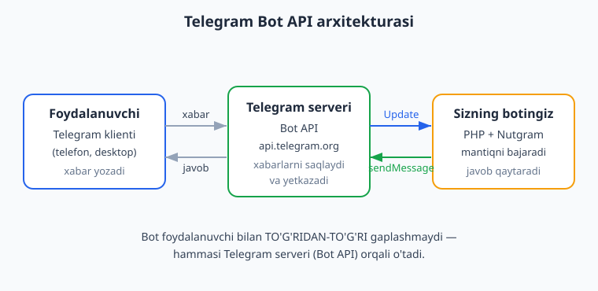
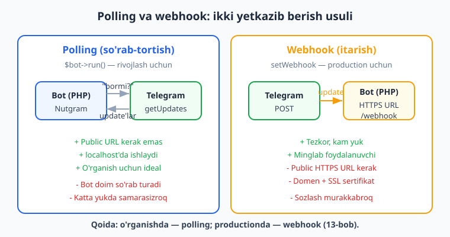
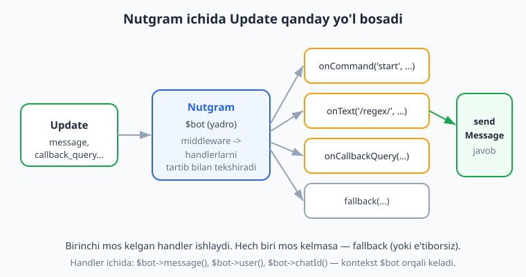

# 01 — Telegram bot va Nutgram bilan tanishuv

[🏠 README](./README.md) · [🏠 README](./README.md) · [Keyingi: 02 — Birinchi bot: /start va echo ➡️](./02-birinchi-bot.md)

---

> **Bu bobda:** Telegram bot aslida nima ekanini va "klient — Telegram serveri — bot" uchligi qanday ishlashini tushunamiz. Bot API'ning rolini, @BotFather'dan `/newbot` orqali token olishni va tokenni `.env` faylida xavfsiz saqlashni o'rganamiz. Polling va webhook usullarini umumiy ko'rinishda solishtiramiz: qaysi biri qachon kerak. Nega aynan **Nutgram** (PHP 8 uchun zamonaviy, fluent API, `FakeNutgram` bilan test, conversations) tanlanishini ko'rib chiqamiz, uni `composer require nutgram/nutgram` bilan o'rnatamiz va ekotizimini tanishtiramiz. Oxirida Python/aiogram versiyasi bilan solishtiramiz.
>
> Bu kitob siz PHP asoslarini (sinf, namespace, composer, closure, type hints, PDO) bilasiz deb faraz qiladi — kerak bo'lsa [../php/README.md](../php/README.md) ga qayting. Bu yerda esa Telegram va Nutgram'ga xos HAR narsani noldan tushuntiramiz.
>
> **Halol eslatma (verifikatsiya):** Bu bobdagi handler marshruti (routing) va versiya tekshiruvi kodi haqiqatan **offline** (tokensiz, internetsiz) ishga tushirib tekshirildi — `Nutgram::fake()` (FakeNutgram) ga soxta xabar uzatib, javob `assertReplyText` bilan tasdiqlandi. Muhit: Nutgram **4.46.0**, PHP **8.4.0**. Ammo jonli botni Telegram'ga ulash (long-polling, real xabar yuborish, `getMe`) BotFather'dan olingan **haqiqiy token + internet** talab qiladi — bunday bloklarni "illustrativ — jonli Telegram kerak" deb halol belgilab qo'yganmiz.

---

## 1. Telegram bot nima?

Telegram bot — bu Telegram ichida ishlaydigan **maxsus dastur**. U xuddi oddiy foydalanuvchi kabi xabar oladi va yuboradi, lekin orqasida jonli odam emas, balki **siz yozgan kod** turadi. Bot tugma bosishlariga javob beradi, ma'lumotlar bazasidan o'qiydi, API'larga so'rov yuboradi, fayl yuboradi — qisqasi, siz dasturlay olgan hamma narsani qila oladi.

Oddiy foydalanuvchi akkauntidan farqi:

- Botda telefon raqami yo'q; u **token** orqali tanilinadi.
- Bot odamga **birinchi** yozolmaydi — foydalanuvchi avval botga yozishi (yoki guruhga qo'shishi) kerak.
- Bot xabarlarni faqat o'ziga yuborilganda yoki guruhda chaqirilganda ko'radi (maxfiylik uchun).
- Bot maxsus imkoniyatlarga ega: inline tugmalar, klaviaturalar, to'lovlar, Web App va hokazo.

Bot bilan ishlash uchun Telegram **Bot API** degan rasmiy interfeysni beradi. Sizning kodingiz hech qachon foydalanuvchining telefoni bilan to'g'ridan-to'g'ri gaplashmaydi — hammasi Telegram serveri orqali o'tadi.

## 2. Bot API qanday ishlaydi: klient — server — bot

Eng muhim tushuncha: **bot va foydalanuvchi o'rtasida har doim Telegram serveri turadi.** Hech kim hech kim bilan to'g'ridan-to'g'ri bog'lanmaydi.



Oqimni qadamma-qadam ko'rib chiqaylik:

1. **Foydalanuvchi** Telegram klientida (telefon yoki desktop) botga "Salom" deb yozadi.
2. Bu xabar Telegram serveriga (`api.telegram.org`) boradi va u yerda saqlanadi.
3. Telegram bu xabarni **Update** (yangilik) ko'rinishida sizning botingizga yetkazadi.
4. Sizning kodingiz Update'ni o'qiydi, mantiqni bajaradi va `sendMessage` chaqiruvi bilan javob qaytaradi.
5. Telegram bu javobni foydalanuvchining ekraniga yetkazadi.

**Update** — bu Telegram sizga yuboradigan "nimadir bo'ldi" signali. Update turlari ko'p: yangi xabar (`message`), tugma bosildi (`callback_query`), xabar tahrirlandi (`edited_message`), guruhga a'zo qo'shildi va hokazo. Bu kitob davomida ko'pincha `message` va `callback_query` bilan ishlaymiz.

Bot API — REST uslubidagi HTTP API: siz `https://api.telegram.org/bot<TOKEN>/<metod>` manziliga so'rov yuborasiz. Masalan, xabar yuborish metodi `sendMessage`. Yaxshi yangilik — Nutgram bu chaqiruvlarni siz uchun bajaradi, siz `$bot->sendMessage(text: 'Salom')` deb yozasiz, xolos. Lekin orqada nima bo'layotganini bilish foydali.

> **Eslatma:** Bot API bilan **Telegram MTProto API** (MadelineProto kabi kutubxonalar ishlatadigan) — boshqa-boshqa narsalar. Bot API rasmiy, sodda va botlar uchun mo'ljallangan. Bu kitob faqat Bot API bilan ishlaydi.

## 3. @BotFather'dan token olish

Botingiz mavjud bo'lishi uchun avval uni **ro'yxatdan o'tkazish** kerak. Buni Telegram'ning rasmiy boti — **@BotFather** qiladi. BotFather — botlarni yaratuvchi bot.

Qadamlar:

1. Telegram'da [@BotFather](https://t.me/BotFather) ni oching (rasmiy, ko'k tasdiq belgili).
2. `/newbot` buyrug'ini yuboring.
3. Botingizga **ko'rinadigan nom** bering (masalan, `Mening Birinchi Botim`).
4. So'ng **username** bering — u albatta `bot` bilan tugashi kerak (masalan, `mening_birinchi_bot`) va noyob bo'lishi shart.
5. BotFather sizga **tokenni** beradi. U taxminan shunday ko'rinadi:

```text
123456789:AAH-Abc1234DefGhIjKlMnOpQrStUvWxYz0
```

Bu token — botingizning **paroli**. Token bilan kim botingizni boshqara oladi. Shuning uchun:

- Tokenni **hech kimga** bermang, GitHub'ga, skrinshotga, video'ga qo'ymang.
- Agar token sizib chiqsa, BotFather'da `/revoke` bilan yangisini oling.

BotFather'ning boshqa foydali buyruqlari:

```text
/mybots         - botlaringiz ro'yxati va sozlamalari
/setname        - bot nomini o'zgartirish
/setdescription - bot tavsifi (chat ochilganda ko'rinadi)
/setuserpic     - bot avatari
/setcommands    - / bosilganda chiqadigan buyruqlar menyusi
/token          - mavjud bot tokenini qayta ko'rsatish
/revoke         - tokenni bekor qilib, yangisini olish
/deletebot      - botni o'chirish
```

> Token olish jonli Telegram ilovasida amalga oshiriladi — buni kod bilan tekshirib bo'lmaydi (illustrativ qadam). Lekin pastda tokenni `.env` da xavfsiz o'qishni va offline tekshirishni ko'rsatamiz.

## 4. Tokenni xavfsiz saqlash: `.env`

Tokenni **hech qachon kod ichiga yozmang**. Agar yozsangiz va kodni GitHub'ga qo'ysangiz, token ochiq qoladi. To'g'ri yo'l — uni `.env` faylida saqlash va kodda muhit o'zgaruvchisi (environment variable) sifatida o'qish.

`vlucas/phpdotenv` paketini o'rnatamiz (keyingi boblarda ham ishlatamiz):

```bash
composer require vlucas/phpdotenv
```

Loyiha papkasida `.env` faylini yarating:

```text
BOT_TOKEN=123456789:AAH-Abc1234DefGhIjKlMnOpQrStUvWxYz0
```

Va `.gitignore` ga `.env` ni albatta qo'shing, toki u Git'ga tushib qolmasin:

```text
/vendor/
.env
```

Endi kodda tokenni shunday o'qiymiz:

```php
<?php

require __DIR__ . '/vendor/autoload.php';

// .env faylidagi o'zgaruvchilarni $_ENV / getenv ga yuklaydi
$dotenv = Dotenv\Dotenv::createImmutable(__DIR__);
$dotenv->load();

$token = $_ENV['BOT_TOKEN'] ?? null;
if (!$token) {
    throw new RuntimeException('BOT_TOKEN topilmadi! .env faylini tekshiring.');
}
```

> **Sof PHP varianti:** agar qo'shimcha paket o'rnatmoqchi bo'lmasangiz, tokenni operatsion tizimning muhit o'zgaruvchisidan ham olsa bo'ladi: `$token = getenv('BOT_TOKEN');`. Asosiy qoida bir xil — token kodga yozilmaydi.

Token noto'g'ri bo'lsa, buni faqat jonli `getMe` chaqiruvi aniqlaydi (illustrativ — internet kerak). Lekin tokenning **formatini** offline tekshirsa bo'ladi — masalan, oddiy regex bilan:

```php
<?php

function tokenFormatTogrimi(string $s): bool
{
    // Telegram token: raqamli bot_id ":" so'ngra harf/raqam/-/_ ketma-ketligi
    return (bool) preg_match('/^\d+:[A-Za-z0-9_-]{30,}$/', $s);
}

var_dump(tokenFormatTogrimi('123456789:AAH-Abc1234DefGhIjKlMnOpQrStUvWxYz0')); // true
var_dump(tokenFormatTogrimi('salom-dunyo'));                                    // false
```

> **Offline tekshirildi:** yuqoridagi `tokenFormatTogrimi` mantig'i format tekshiruvi — soxta-lekin-to'g'ri-formatdagi token `true`, buzilgani `false` qaytaradi. Bu Telegram'ga ulanish emas; token haqiqiy ishlashini faqat jonli `getMe` bilan bilish mumkin.

## 5. Polling va webhook: ikki yetkazib berish usuli

Telegram update'larni botingizga ikki xil yo'l bilan yetkazadi. Ikkalasini ham bilish kerak, lekin **rivojlash bosqichida har doim polling** ishlatamiz.



### Polling (so'rab-tortish)

Botning o'zi Telegram'dan muntazam ravishda "menga yangi xabar bormi?" deb so'raydi (`getUpdates` metodi). Telegram bo'lsa, yangiliklarni qaytaradi. Nutgram'da bu **long-polling** ko'rinishida amalga oshadi — `$bot->run()` chaqiruvi (polling running-mode'da) shu ishni qiladi.

- **Afzalligi:** hech qanday public URL kerak emas, kompyuteringizdagi `localhost`da ham ishlaydi. Rivojlash va o'rganish uchun ideal.
- **Kamchiligi:** bot doimiy so'rab turadi, juda katta yuklamalarda biroz samarasiz.

### Webhook (itarish)

Bu yerda aksincha: siz Telegram'ga "yangi xabar kelganda, mana shu HTTPS manzilga o'zing yubor" deysiz. Telegram update'ni sizning serveringizdagi URL'ga `POST` qiladi.

- **Afzalligi:** tezkor, kam yuk, minglab foydalanuvchili botlar uchun mos.
- **Kamchiligi:** sizda **public HTTPS URL** (domen + SSL sertifikat) bo'lishi shart. Sozlash murakkabroq.

**Qoida:** o'rganayotganda va lokal ishlaganda — **polling**. Productionga chiqarishda, server tayyor bo'lganda — webhook'ni ko'rib chiqamiz (13-bob, webhook va running mode). Bu kitobning katta qismi polling bilan ishlaydi.

Nutgram'da running-mode (qaysi usulda update olish) sozlanadi — buni 13-bobda batafsil ko'ramiz. Hozircha yodda tuting: bir xil handler kodi ham polling, ham webhook'da o'zgarishsiz ishlaydi; faqat update'ni qabul qilish usuli farq qiladi.

> Polling ham, webhook ham jonli Telegram serveri va token talab qiladi — ularni offline ishga tushirib bo'lmaydi (illustrativ). Lekin handler mantig'ini token va internetsiz `Nutgram::fake()` orqali to'liq tekshirsa bo'ladi — buni 9-bo'limda ko'rasiz.

## 6. Nega Nutgram?

Telegram bot yozish uchun PHP'da bir nechta kutubxona bor. Eng mashhurlari: **Nutgram**, **Telegram Bot SDK** (`irazasyed/telegram-bot-sdk`), **BotMan**, `php-telegram-bot/core`. Bu kitob **Nutgram** ni tanlaydi. Sabablari:

- **Zamonaviy PHP 8** — Nutgram named arguments, enum, attribute kabi PHP 8 imkoniyatlarini to'liq ishlatadi. Siz PHP'da type hints va closure bilan tanish bo'lsangiz, o'zingizni uyda his qilasiz.
- **Fluent (ravon) API** — `$bot->onCommand('start', fn(Nutgram $bot) => $bot->sendMessage(text: 'Salom'))` kabi qisqa, o'qishga oson e'lonlar. Klaviatura va so'rovlar ham `->addRow(...)` uslubida zanjirlanadi.
- **`FakeNutgram` bilan test** — `Nutgram::fake()` botni tarmoqsiz, tokensiz **offline** sinash imkonini beradi. Bu kitobdagi deyarli har bir kod aynan shu bilan tekshirilgan.
- **Conversations (suhbat)** — ko'p qadamli suhbatlar (masalan, anketa to'ldirish) uchun ichki qurilgan tizim — aiogram'dagi FSM analogi.
- **Middleware, storage, framework integratsiyasi** — middleware, foydalanuvchi/global data saqlash va Laravel/Symfony bilan integratsiya o'rnatilgan.
- **Faol hujjatlar** — [nutgram.dev](https://nutgram.dev/) yangilanib turadi.

Solishtirish uchun: Python ekotizimida shunga o'xshash vazifani **aiogram** bajaradi — agar Python bilan ishlamoqchi bo'lsangiz, [../tgbot-python/README.md](../tgbot-python/README.md) ga qarang. Tushunchalar (Update, polling, webhook, handler) bir xil, faqat til va sintaksis farq qiladi. Quyida (10-bo'lim) ikki freymvorkni yonma-yon qo'yamiz.

## 7. Nutgram'ni o'rnatish

Nutgram 4.x PHP 8.2+ talab qiladi. Bu kitob **PHP 8.4** va **Nutgram 4.46** bilan tekshirilgan.

Avval loyiha papkasini yarating va composer bilan ishga tushiring (composer — PHP paket menejeri; agar tanish bo'lmasangiz [../php/README.md](../php/README.md) ga qarang):

```bash
mkdir mening-botim
cd mening-botim
composer init --no-interaction --name="men/mening-botim"
```

So'ng Nutgram'ni o'rnating:

```bash
composer require nutgram/nutgram
```

O'rnatilganini tekshiramiz. Composer o'rnatilgan paket versiyalarini `Composer\InstalledVersions` orqali beradi:

```php
<?php

require __DIR__ . '/vendor/autoload.php';

echo Composer\InstalledVersions::getPrettyVersion('nutgram/nutgram'), PHP_EOL;
echo 'PHP ', PHP_VERSION, PHP_EOL;
```

Natija (illustrativ — sizning versiyangiz yangiroq bo'lishi mumkin; bu kitob aynan shu chiqishni oldi):

```text
4.46.0
PHP 8.4.0
```

Terminaldan ham ko'rsa bo'ladi:

```bash
composer show nutgram/nutgram | findstr versions
```

> **Eslatma (Windows):** Linux/macOS'da `findstr` o'rniga `grep` ishlating: `composer show nutgram/nutgram | grep versions`.

## 8. Nutgram ekotizimi: nimadan iborat?

Nutgram bitta kutubxona, lekin ichida ko'p qism bor. Hozir nomlari bilan tanishib qo'ying — har birini alohida bobda chuqur ko'ramiz:

| Komponent | Nima qiladi | Qaysi bobda |
|---|---|---|
| `Nutgram` (`$bot`) | Yadro: update qabul qiladi, handlerga yo'naltiradi, Bot API'ni chaqiradi | 02, 03 |
| Handlerlar (`onCommand`, `onText`, `onCallbackQuery`, `fallback`...) | Qaysi update qaysi koddan o'tishini hal qiladi | 03, 04 |
| Klaviatura klasslari (`InlineKeyboardMarkup`, `ReplyKeyboardMarkup`) | Tugmalar va inline tugmalar yasaydi | 06, 07 |
| `Conversation` | Ko'p qadamli suhbatlar (FSM analogi) uchun holat saqlaydi | 08 |
| Middleware | Har update'dan oldin/keyin umumiy mantiq | 09 |
| Storage (`setUserData`, `getGlobalData`...) | Foydalanuvchi/chat/global ma'lumotni saqlaydi | 09, 10 |
| `FakeNutgram` (`Nutgram::fake()`) | Botni tarmoqsiz offline sinash | 16 |

Update bot ichida qanday yo'l bosishini sxemada ko'rib chiqaylik:



Mantiq sodda: **Update** keladi -> `Nutgram` (`$bot`) uni qabul qiladi -> avval middleware'lardan o'tkazadi -> so'ng ro'yxatdan o'tgan handlerlarni **tartib bilan** tekshiradi -> birinchi **mos kelgan handler** ishlaydi. Hech bir handler mos kelmasa, `fallback` chaqiriladi (agar ro'yxatdan o'tkazgan bo'lsangiz), aks holda update e'tiborsiz qoldiriladi (bu xato emas).

Handler ichida butun kontekst `$bot` orqali keladi — `$bot->message()` (kelgan xabar), `$bot->user()` (jo'natuvchi), `$bot->chatId()`, `$bot->userId()`. Bu aiogram'dan muhim farq: u yerda kontekst handler argumentlariga (`message: Message`) keladi, Nutgram'da esa hammasi `$bot` ichida.

## 9. Birinchi "kostyumsiz" misol va uni OFFLINE tekshirish

Keyingi bobda to'liq botni yozamiz, lekin hozir Nutgram idiomi qanday ko'rinishini ko'ring. Bu kod handler'larni ro'yxatdan o'tkazadi va — eng muhimi — biz uni **token va internetsiz** ishlatib, marshrut to'g'ri ishlashini isbotlay olamiz.

Mana to'liq, ishlaydigan tekshiruv skripti (biz uni haqiqatan ishga tushirdik):

```php
<?php

require __DIR__ . '/vendor/autoload.php';

use SergiX44\Nutgram\Nutgram;

// Nutgram::fake() — tokensiz, tarmoqsiz "soxta" bot (FakeNutgram qaytaradi).
// Real Telegram'ga hech narsa ketmaydi; sendMessage chaqiruvlari xotirada to'planadi.
$bot = Nutgram::fake();

$bot->onCommand('start', function (Nutgram $bot) {
    // $bot->user() — jo'natuvchi; bu yerda FakeNutgram default foydalanuvchini beradi
    $bot->sendMessage(text: 'Salom! Men birinchi botingizman.');
});

// fallback — hech qaysi handlerga mos kelmagan update shu yerga tushadi
$bot->fallback(function (Nutgram $bot) {
    $bot->sendMessage(text: 'Buyruqni tushunmadim.');
});

// Telegram o'rniga update'ni "qo'lda" beramiz:
// hearText('/start') soxta xabarni quradi, ->reply() esa handlerni ishga tushiradi
$bot->hearText('/start')->reply();
$bot->assertReplyText('Salom! Men birinchi botingizman.');
echo "/start -> start handler: PASS", PHP_EOL;
```

Natija (haqiqatan ishga tushirildi):

```text
/start -> start handler: PASS
```

Endi marshrutning ikkinchi tomonini — oddiy matn `fallback`ga borishini — tekshiramiz. Bunda yangi `Nutgram::fake()` olamiz, chunki har test o'z toza holatidan boshlangani ma'qul:

```php
<?php

require __DIR__ . '/vendor/autoload.php';

use SergiX44\Nutgram\Nutgram;

$bot = Nutgram::fake();
$bot->onCommand('start', fn (Nutgram $bot) => $bot->sendMessage(text: 'Salom!'));
$bot->fallback(fn (Nutgram $bot) => $bot->sendMessage(text: 'Tushunmadim.'));

// "/start" emas, oddiy matn -> hech qaysi onCommand mos kelmaydi -> fallback
$bot->hearText('boshqa matn')->reply();
$bot->assertReplyText('Tushunmadim.');
echo "oddiy matn -> fallback: PASS", PHP_EOL;
```

Natija (haqiqatan ishga tushirildi):

```text
oddiy matn -> fallback: PASS
```

E'tibor bering:

- `Nutgram::fake()` — `FakeNutgram` qaytaradi. Bu bilan token va internetsiz, real bot bilan bir xil API'ni sinaymiz.
- `$bot->onCommand('start', ...)` — `/start` buyrug'iga handler. Closure'ning birinchi argumenti har doim `Nutgram $bot` — kontekst shu orqali keladi.
- `$bot->fallback(...)` — boshqa hech qaysi handler mos kelmaganda chaqiriladigan "zaxira" handler.
- `$bot->hearText('/start')->reply()` — Telegram o'rniga matnli update'ni qo'lda berib, botni ishga tushirish. Aynan shu bizga **tokensiz, internetsiz** tekshirish imkonini beradi.
- `$bot->assertReplyText('...')` — bot aynan shu matnli javob yuborganini tasdiqlaydi. Mos kelmasa, test xato beradi.
- Real bot bo'lsa, `sendMessage` Telegram'ga chinakam xabar yuborardi; bu yerda esa u FakeNutgram ichida "tutiladi" va `assertReplyText` bilan tekshiriladi.

> **Halol farq:** Yuqoridagi kod handler **marshrutini** isbotlaydi — `/start` `start` handlerga, oddiy matn `fallback`ga bordi va to'g'ri javob shakllandi. Lekin foydalanuvchi ekranida "Salom" **ko'rinishi** — bu jonli Telegram + token talab qiladigan qism (illustrativ). FakeNutgram tarmoqqa chiqmaydi; mantiqning to'g'riligi esa to'liq tekshirildi. Versiya satri ham (`4.46.0`, `PHP 8.4.0`) shu muhitda o'qildi.

## 10. Nutgram (PHP) va aiogram (Python): yonma-yon

Agar Python/aiogram kitobini ko'rgan bo'lsangiz, tushunchalar tanish. Quyidagi jadval ikki freymvorkning bir xil g'oyalarini taqqoslaydi — bu sizga bir tildan ikkinchisiga "tarjima" qilishda yordam beradi. To'liq Python versiyasi: [../tgbot-python/README.md](../tgbot-python/README.md).

| Tushuncha | Nutgram (PHP) | aiogram (Python) |
|---|---|---|
| Asosiy ob'ekt | `$bot = new Nutgram($token)` | `bot = Bot(token)` + `dp = Dispatcher()` |
| Buyruq handleri | `$bot->onCommand('start', fn(Nutgram $bot) => ...)` | `@router.message(CommandStart())` |
| Kontekst | `$bot` ichida: `$bot->message()`, `$bot->user()` | handler argumenti: `message: Message` |
| Javob yuborish | `$bot->sendMessage(text: '...')` | `await message.answer('...')` |
| Ishga tushirish (polling) | `$bot->run()` | `await dp.start_polling(bot)` |
| Ko'p qadamli suhbat | `Conversation` klassi | FSM (`StatesGroup`, `FSMContext`) |
| Offline test | `Nutgram::fake()` + `assertReplyText` | `dp.feed_update(...)` + mock session |
| Dasturlash modeli | sinxron (closure) | asinxron (`async/await`) |

Eng katta farq — **dasturlash modeli**. aiogram `asyncio` ustiga qurilgan (`async/await`), Nutgram esa odatdagi sinxron PHP kodi bilan ishlaydi: handler — oddiy closure, ichida `await` yo'q. PHP'da ham async (ReactPHP/Swoole) bor, lekin Nutgram bilan boshlash uchun bu shart emas — bu kitob sinxron uslubda boradi.

> **Maslahat:** internetda Telegram bot bo'yicha eski PHP misollar (longman/`getUpdates`ni qo'lda chaqirish, yoki boshqa SDK'lar) ko'p uchraydi. Ular Nutgram'da **ishlamaydi**. Shubha tug'ilsa, har doim [nutgram.dev/docs](https://nutgram.dev/docs) ga qarang — bu kitobdagi har bir kod faqat Nutgram 4.x idiomida yozilgan va tekshirilgan.

## 11. Yo'l xaritasi: keyin nima bo'ladi

Endi tushunchalar joyida. Keyingi yo'limiz:

- **02-bob** — birinchi to'liq botni yozamiz: `.env`, `new Nutgram($token)`, `/start` va echo (foydalanuvchi yozganini qaytaruvchi), `$bot->run()` bilan jonli ishga tushirish.
- **03–04** — handlerlar, routing, filtrlar va buyruqlar chuqurroq.
- **05–07** — xabar formatlash, media, klaviaturalar, callback va inline rejim.
- **08** — `Conversation` bilan ko'p qadamli suhbatlar (anketa).
- **09–10** — middleware va ma'lumotlar bazasi (PDO; [../sql/README.md](../sql/README.md) bilan bog'liq).
- Keyin — to'lovlar, deploy, guruh/kanal, va Telegram Web App (Mini App). Laravel bilan integratsiya uchun [../laravel/README.md](../laravel/README.md), kengaytirilgan PHP mavzulari uchun [../php-expert/README.md](../php-expert/README.md) foydali bo'ladi.

---

## Mashqlar

### Oson

1. **Uchlikni chizing.** Foydalanuvchi botga "Salom" yozganda xabar qaysi yo'ldan o'tadi? Klient, Telegram serveri va bot orasidagi 4–5 qadamni o'z so'zlaringiz bilan tartibda yozing.

2. **Token formati.** Quyidagilardan qaysi biri Telegram bot tokeniga o'xshaydi, qaysi biri yo'q? Sababini ayting: (a) `123456789:AAH-Abc123DefGhi`, (b) `salom-dunyo`, (c) `abcdef`.

3. **Polling yoki webhook?** Quyidagi vaziyatlar uchun qaysi usul to'g'ri keladi: (a) uyda noutbukda o'rganyapsiz, (b) minglab foydalanuvchili botni public serverda ishlatyapsiz, (c) sizda HTTPS domen yo'q.

4. **BotFather buyruqlari.** Botingiz nomini o'zgartirish, `/` menyusidagi buyruqlarni o'rnatish va tokenni bekor qilish uchun BotFather'ning qaysi buyruqlaridan foydalanasiz?

5. **`.env` xavfsizligi.** Nega tokenni to'g'ridan-to'g'ri `.php` faylga yozish xavfli? `.env` faylini Git'ga tushib qolishidan qanday himoya qilamiz?

6. **Versiyani tekshiring.** Loyihangizda Nutgram qaysi versiyada o'rnatilganini ko'rsatadigan PHP qatorini va terminal buyrug'ini yozing.

### O'rta

7. **Kontekst farqi.** aiogram'da xabar handlerga `message: Message` argumenti orqali keladi. Nutgram'da xuddi shu xabarni va jo'natuvchini qaysi chaqiruvlar bilan olasiz? Closure imzosini ham yozing.

8. **fallback nima qiladi.** Botda faqat `onCommand('start', ...)` bo'lsa va foydalanuvchi `salom` (buyruq emas) yozsa nima bo'ladi? `fallback` qo'shilsa-chi? Ikki holatni so'z bilan tushuntiring.

9. **Marshrutni isbotlang.** 9-bo'limdagi birinchi skriptga `onCommand('help', ...)` qo'shing va `help` matnli javob bersin. So'ng `hearText('/help')->reply()` bilan yuborib, `assertReplyText` orqali aynan shu javob kelganini offline tekshiring.

10. **Token format funksiyasi.** 4-bo'limdagi `tokenFormatTogrimi` ni uchta satr — `123456:AAH-FakeTest_abcdefghijklmnop12345`, `salom`, `''` (bo'sh) — uchun chaqiring va har birining natijasini bashorat qiling, so'ng tekshiring.

11. **Bog'liqliklar.** `composer require nutgram/nutgram` ishga tushganda `vendor/` papkasida nima paydo bo'ladi? `composer.json` va `composer.lock` farqi nimada?

12. **Solishtiruv jadvali.** 10-bo'limdagi jadvaldan foydalanib, "buyruq handleri" va "polling'ni boshlash"ni Nutgram va aiogram'da yonma-yon yozing.

### Qiyin

13. **Ikki buyruqli marshrut.** `Nutgram::fake()` bilan `/start` va `/help` uchun ikki handler va bitta `fallback` ro'yxatdan o'tkazing. So'ng uchta update yuboring: `/start`, `/help`, `oddiy matn`. Har biri to'g'ri javob berganini uchta `assertReplyText` bilan isbotlang. (Maslahat: har update'dan keyin yangi `Nutgram::fake()` olish toza holat beradi.)

14. **assertNoReply.** Faqat `onCommand('start', ...)` bo'lgan (fallback YO'Q) botga oddiy matn yuborsangiz nima bo'ladi? Nutgram'da bunday holatni `assertNoReply()` bilan tekshiring va nega hech qanday javob ketmaganini tushuntiring.

15. **Format qoidasini kengaytiring.** `tokenFormatTogrimi` regex'i qaysi to'g'ri tokenni noto'g'ri rad etishi mumkin? Kamida bitta chegaraviy holatni (masalan, juda qisqa ikkinchi qism) o'ylab toping va regex'ni shunga moslab tuzating. Yangi versiyani 3-4 misolda sinab ko'ring.

16. **Xavfsizlik tahlili.** Bir do'stingiz bot tokenini xabarda yuborib yubordi. Qanday xavf bor va u darhol nima qilishi kerak? BotFather'ning qaysi buyrug'i muammoni hal qiladi? `.env` + `.gitignore` bunday hodisaning oldini qanday oladi?

---

<details markdown="1">
<summary>Yechimlar</summary>

### Oson

**1.** Oqim: (1) Foydalanuvchi Telegram klientida "Salom" yozadi. (2) Xabar Telegram serveriga (`api.telegram.org`) boradi. (3) Telegram uni `Update` ko'rinishida botga yetkazadi (polling yoki webhook orqali). (4) Bot kodi update'ni o'qib, mantiqni bajaradi va `sendMessage` chaqiradi. (5) Telegram javobni foydalanuvchi ekraniga yetkazadi. Asosiy g'oya: bot va foydalanuvchi hech qachon to'g'ridan-to'g'ri bog'lanmaydi — har doim Telegram serveri orasida turadi.

**2.** (a) `123456789:AAH-Abc123DefGhi` — tokenga o'xshaydi: `raqamlar:harf-belgilar` ko'rinishida, ikki nuqta bilan ajralgan. (b) `salom-dunyo` va (c) `abcdef` — token EMAS, chunki ikki nuqta (`:`) va boshida raqamli `bot_id` qismi yo'q. Offline tekshirish (4-bo'limdagi funksiya bilan):
```php
foreach (['123456789:AAH-Abc123DefGhi', 'salom-dunyo', 'abcdef'] as $s) {
    echo $s, ' -> ', tokenFormatTogrimi($s) ? 'format to\'g\'ri' : 'token EMAS', PHP_EOL;
}
```
(Eslatma: `AAH-Abc123DefGhi` 30 belgidan qisqa bo'lsa, qattiq regex uni ham rad etishi mumkin — 15-mashqqa qarang.)

**3.** (a) Uyda o'rganish -> **polling** (public URL kerakmas). (b) Minglab foydalanuvchili public bot -> **webhook** (tezkor, kam yuk). (c) HTTPS domen yo'q -> **polling** (webhook HTTPS URL talab qiladi).

**4.** Nomni o'zgartirish: `/setname`. Buyruqlar menyusi: `/setcommands`. Tokenni bekor qilib yangisini olish: `/revoke`. (Botlar ro'yxati: `/mybots`.)

**5.** `.php` faylga yozish xavfli, chunki kodni GitHub'ga yoki birovga bersangiz, token ham ochiq ketadi — token bilan kim botingizni to'liq boshqaradi. Himoya: tokenni `.env` da saqlash va `.gitignore` ga `.env` ni qo'shish — shunda u Git'ga umuman tushmaydi.

**6.** Kod ichida:
```php
echo Composer\InstalledVersions::getPrettyVersion('nutgram/nutgram'), PHP_EOL;
```
Terminalda:
```bash
composer show nutgram/nutgram
```

### O'rta

**7.** Nutgram'da kontekst `$bot` ichidan olinadi:
```php
$bot->onMessage(function (SergiX44\Nutgram\Nutgram $bot) {
    $xabar = $bot->message();   // kelgan Message
    $user  = $bot->user();      // jo'natuvchi User
    $matn  = $bot->message()->text;
});
```
aiogram'da bular handler argumentlariga keladi (`async def h(message: Message)`), Nutgram'da esa hammasi `$bot` orqali. Closure'ning birinchi argumenti har doim `Nutgram $bot`.

**8.** Faqat `onCommand('start', ...)` bo'lsa va foydalanuvchi `salom` yozsa — hech qaysi handler mos kelmaydi, shuning uchun bot **hech narsa qilmaydi** (update e'tiborsiz qoldiriladi, bu xato emas). `fallback` qo'shilsa, mos kelmagan har qanday update aynan `fallback`ga tushadi — shunda botga "Tushunmadim" kabi javob berishni o'rgatish mumkin.

**9.**
```php
<?php
require __DIR__ . '/vendor/autoload.php';
use SergiX44\Nutgram\Nutgram;

$bot = Nutgram::fake();
$bot->onCommand('start', fn (Nutgram $bot) => $bot->sendMessage(text: 'Salom! Men birinchi botingizman.'));
$bot->onCommand('help', fn (Nutgram $bot) => $bot->sendMessage(text: 'Yordam matni'));

$bot->hearText('/help')->reply();
$bot->assertReplyText('Yordam matni');
echo '/help -> help handler: PASS', PHP_EOL;
```

**10.** Bashorat: 1-chi `true` (raqam, ikki nuqta, uzun harf-qism), 2-chi `false` (ikki nuqta yo'q), 3-chi `false` (bo'sh). Tekshirish:
```php
var_dump(tokenFormatTogrimi('123456:AAH-FakeTest_abcdefghijklmnop12345')); // true
var_dump(tokenFormatTogrimi('salom'));                                     // false
var_dump(tokenFormatTogrimi(''));                                          // false
```

**11.** `composer require` ishga tushganda: `vendor/` papkasida Nutgram va uning bog'liqliklari (masalan `nutgram/hydrator`, guzzle HTTP klient va boshqalar) hamda `vendor/autoload.php` paydo bo'ladi. `composer.json` — siz **so'ragan** paketlar va versiya cheklovlari (`^4.46`). `composer.lock` — aynan **o'rnatilgan** versiyalarning qat'iy ro'yxati (masalan `4.46.0`), shu bilan boshqa kompyuterda ham xuddi shu versiyalar o'rnatiladi.

**12.**
```text
Buyruq handleri:
  Nutgram:  $bot->onCommand('start', fn(Nutgram $bot) => $bot->sendMessage(text: 'Salom'));
  aiogram:  @router.message(CommandStart())  async def start(message): await message.answer('Salom')

Polling'ni boshlash:
  Nutgram:  $bot->run();
  aiogram:  await dp.start_polling(bot)
```

### Qiyin

**13.** To'liq, offline tekshiriladigan misol:
```php
<?php
require __DIR__ . '/vendor/autoload.php';
use SergiX44\Nutgram\Nutgram;

function yasa(): Nutgram {
    $bot = Nutgram::fake();
    $bot->onCommand('start', fn (Nutgram $bot) => $bot->sendMessage(text: 'Salom!'));
    $bot->onCommand('help',  fn (Nutgram $bot) => $bot->sendMessage(text: 'Yordam'));
    $bot->fallback(fn (Nutgram $bot) => $bot->sendMessage(text: 'Tushunmadim.'));
    return $bot;
}

$b = yasa(); $b->hearText('/start')->reply();      $b->assertReplyText('Salom!');
$b = yasa(); $b->hearText('/help')->reply();       $b->assertReplyText('Yordam');
$b = yasa(); $b->hearText('oddiy matn')->reply();  $b->assertReplyText('Tushunmadim.');
echo 'Uchala marshrut to\'g\'ri: PASS', PHP_EOL;
```
Har update'dan oldin `yasa()` yangi `Nutgram::fake()` qaytarib, toza holat beradi — shunday qilib bir test ikkinchisiga ta'sir qilmaydi.

**14.** Fallback YO'Q bo'lsa va oddiy matn kelsa — hech qaysi handler mos kelmagani uchun bot **hech qanday javob yubormaydi**. Buni `assertNoReply()` bilan tasdiqlaymiz:
```php
<?php
require __DIR__ . '/vendor/autoload.php';
use SergiX44\Nutgram\Nutgram;

$bot = Nutgram::fake();
$bot->onCommand('start', fn (Nutgram $bot) => $bot->sendMessage(text: 'Salom!'));
// fallback YO'Q

$bot->hearText('oddiy matn')->reply();
$bot->assertNoReply();   // hech qanday sendMessage ketmadi
echo 'Mos handler yo\'q -> javob yo\'q: PASS', PHP_EOL;
```
Sababi: `onCommand('start')` faqat `/start` ga mos keladi; oddiy matn esa hech qaysi shartga tushmaydi va `fallback` ham yo'q, shuning uchun Bot API'ga hech narsa yuborilmaydi.

**15.** `tokenFormatTogrimi` da `{30,}` cheklovi bor — bu real tokenlar uchun odatda to'g'ri, lekin BotFather'ning ba'zi qisqaroq sinov yoki maxsus formatdagi tokenlarini (yoki ikkinchi qismi 30 belgidan kam bo'lgan soxta-test tokenni) noto'g'ri rad etishi mumkin. Yumshatilgan, ishonchliroq variant — uzunlik o'rniga "raqam : kamida bir nechta ruxsat etilgan belgi" ni talab qilish:
```php
function tokenFormatTogrimi2(string $s): bool
{
    // bot_id (raqam) : sir (harf/raqam/_/- dan kamida bittasi)
    return (bool) preg_match('/^\d+:[A-Za-z0-9_-]+$/', $s);
}

var_dump(tokenFormatTogrimi2('123456:AAH-FakeTest_abc')); // true (qisqa bo'lsa ham o'tadi)
var_dump(tokenFormatTogrimi2('123456789:AAH-Abc123DefGhi')); // true
var_dump(tokenFormatTogrimi2('salom-dunyo'));             // false (ikki nuqta yo'q)
var_dump(tokenFormatTogrimi2('123:'));                    // false (sir bo'sh)
```
Xulosa: format tekshiruvi faqat "shaklga o'xshashlik"ni baholaydi. Token haqiqiy ishlashini esa faqat jonli `getMe` aniqlaydi — shuning uchun formatni juda qattiq qilib, to'g'ri tokenni rad etishdan ehtiyot bo'lish kerak.

**16.** Xavf: token — botning paroli; uni bilgan har kim botingiz nomidan xabar yuboradi, ma'lumotlarni o'qiydi, botni "o'g'irlaydi". Darhol qilinadigan ish: BotFather'da `/revoke` buyrug'i bilan eski tokenni **bekor qilish** va yangi token olish; so'ng `.env` da yangi tokenni qo'yish. Eski token shu zahoti ishlamay qoladi, shuning uchun sizib chiqqani endi zarar bera olmaydi. `.env` + `.gitignore` esa bunday hodisaning **oldini** oladi: token kodga yozilmagani va Git'ga tushmagani uchun u GitHub'ga yoki kod ulashilganda umuman chiqib ketmaydi.

</details>

---

[🏠 README](./README.md) · [🏠 README](./README.md) · [Keyingi: 02 — Birinchi bot: /start va echo ➡️](./02-birinchi-bot.md)
