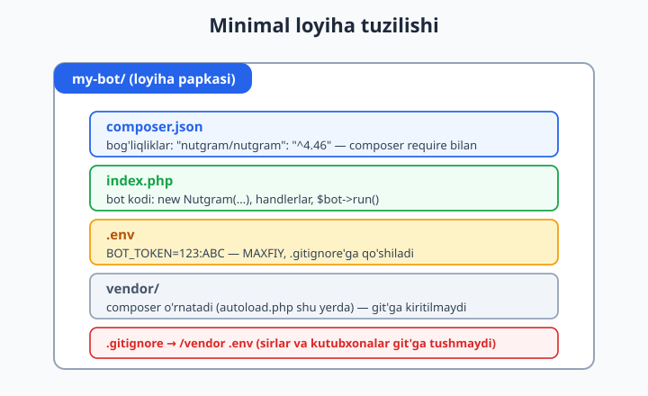
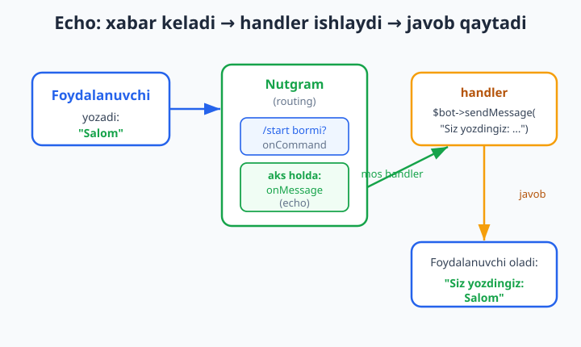
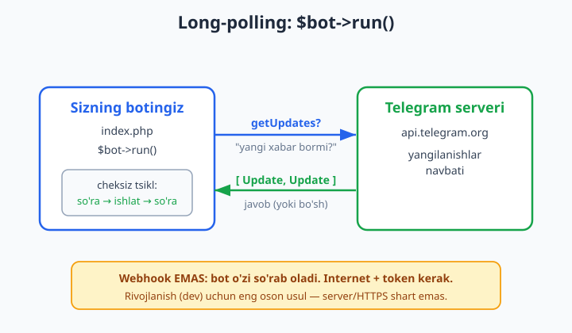

# 02 — Birinchi bot: /start va echo

[⬅️ Oldingi: 01 — Telegram bot va Nutgram bilan tanishuv](./01-nutgram-tanishuv.md) · [🏠 README](./README.md) · [Keyingi: 03 — Handlerlar va routing ➡️](./03-handlerlar-routing.md)

---

> **Bu bobda:** birinchi ishlaydigan botni noldan yig'amiz. Loyiha papkasini ochamiz, `composer require nutgram/nutgram` bilan kutubxonani o'rnatamiz va `index.php` yozamiz: `new Nutgram($token)`, `/start` buyrug'iga javob (`onCommand`), istalgan matnni qaytaradigan **echo** (`onMessage`), va botni ishga tushiradigan `$bot->run()` (long-polling). Tokenni **kodga yozmaymiz** — uni `.env` faylidan (yoki `getenv`) o'qiymiz va `.gitignore`'ga qo'shamiz. Bob oxirida — mashqlar va yechimlar.
>
> **Halollik eslatmasi:** botning **mantig'i** (handlerlar to'g'ri ulanishi va to'g'ri javob qaytarishi) shu yerda OFFLINE — `Nutgram::fake()` (FakeNutgram) bilan, haqiqatan ishga tushirib tekshirildi (PHP 8.4, Nutgram 4.46, PHPUnit 12.5: `/start`, `/help` va echo — hammasi PASS). Jonli `$bot->run()` esa real Telegram token va internet talab qiladi — uni siz o'z botingizda ishga tushirasiz; bu qism bu yerda **illustrativ** deb belgilanadi (soxta "xabar yetdi" yozilmaydi).

---

## Tayyorgarlik: nima kerak?

Birinchi botni qurishdan oldin uchta narsa kerak:

1. **PHP 8.2+** (bu kitobda **8.4**). Tekshirish: terminalda `php -v`.
2. **Composer** — PHP'ning paket menejeri (`composer -V` bilan tekshiring). Agar yo'q bo'lsa: [getcomposer.org](https://getcomposer.org).
3. **Bot tokeni** — buni 01-bobda [@BotFather](https://t.me/BotFather)'dan `/newbot` orqali oldingiz. Token shunday ko'rinishda bo'ladi: `8123456789:AAH-xxxxxxxxxxxxxxxxxxxxxxxxxxxxxx`.

> PHP, composer, sinf, namespace va closure tushunchalari sizga tanish deb faraz qilamiz. Agar eslatish kerak bo'lsa — [PHP qo'llanmasi](../php/README.md)ga qarang. Bu yerda biz faqat **Telegram/Nutgram'ga xos** qismni batafsil tushuntiramiz.

---

## Loyiha papkasini tayyorlash

Bo'sh papka ochamiz va Nutgram'ni o'rnatamiz. Terminalda (PowerShell yoki bash — farqi yo'q):

```bash
mkdir my-bot
cd my-bot
composer require nutgram/nutgram
```

`composer require` ikki ishni qiladi:

- `composer.json` faylini yaratadi (loyihangizning bog'liqliklari ro'yxati);
- `vendor/` papkasini yaratib, unga Nutgram va uning bog'liqliklarini yuklab oladi. `vendor/autoload.php` — bu sinflarni avtomatik yuklaydigan fayl, uni har doim ulaymiz.

Natijada `composer.json` taxminan shunday bo'ladi:

```json
{
    "require": {
        "nutgram/nutgram": "^4.46"
    }
}
```

Loyiha tuzilishi quyidagicha bo'ladi:



| Fayl/papka | Vazifasi |
|---|---|
| `composer.json` | Bog'liqliklar ro'yxati (Nutgram) |
| `index.php` | Bot kodi — biz yozamiz |
| `.env` | **Maxfiy** token (kodga emas, shu yerga) |
| `vendor/` | Composer o'rnatgan kutubxonalar (git'ga kiritilmaydi) |
| `.gitignore` | `vendor/` va `.env`'ni git'dan yashiradi |

---

## Tokenni xavfsiz saqlash (`.env`)

**Tokenni hech qachon kod ichiga yozmang.** Token — bu botingizning paroli: uni qo'lga kiritgan har kim sizning botingiz nomidan xabar yubora oladi. Agar token kodda bo'lsa va siz kodni GitHub'ga yuborsangiz — token ochiq qoladi.

Yechim: tokenni alohida `.env` fayliga yozamiz va uni `.gitignore`'ga qo'shamiz.

`.env` faylini yarating:

```bash
BOT_TOKEN=8123456789:AAH-bu_yerda_haqiqiy_tokeningiz
```

`.gitignore` faylini yarating (token va kutubxonalar git'ga tushmasligi uchun):

```gitignore
/vendor/
.env
```

`.env` faylini PHP'da o'qishning ikki yo'li bor:

**1-usul — `vlucas/phpdotenv` paketi (tavsiya etiladi).** Bu paket `.env` faylini o'qib, qiymatlarni `getenv()` orqali kirish mumkin qiladi:

```bash
composer require vlucas/phpdotenv
```

```php
$dotenv = Dotenv\Dotenv::createImmutable(__DIR__);
$dotenv->load();

$token = $_ENV['BOT_TOKEN'];
```

**2-usul — operatsion tizim muhit o'zgaruvchisi.** Agar `.env` paketi ishlatmasangiz, tokenni terminalda muhit o'zgaruvchisi sifatida o'rnatib, `getenv()` bilan o'qiysiz:

```bash
# PowerShell:
$env:BOT_TOKEN = "8123456789:AAH-..."

# bash / Linux:
export BOT_TOKEN="8123456789:AAH-..."
```

```php
$token = getenv('BOT_TOKEN');
```

Bu bobda biz `getenv()`'ni ishlatamiz (qo'shimcha paketsiz). Kod token yo'qligini ham xushmuomalalik bilan tekshiradi.

---

## `new Nutgram($token)` — bot obyekti

Endi `index.php` yozamiz. Eng birinchi qadam — Nutgram obyektini yaratish. Bu obyekt — butun botning markazi: handlerlarni ro'yxatga olamiz va u orqali Telegram'ga xabar yuboramiz.

```php
<?php

require __DIR__ . '/vendor/autoload.php';

use SergiX44\Nutgram\Nutgram;

$token = getenv('BOT_TOKEN');

if (!$token) {
    exit("Xato: BOT_TOKEN o'rnatilmagan. Avval tokenni muhit o'zgaruvchisiga qo'ying.\n");
}

$bot = new Nutgram($token);
```

Bu yerda:

- `require __DIR__ . '/vendor/autoload.php'` — Composer autoloaderini ulaydi (sinflar avtomatik yuklanadi).
- `use SergiX44\Nutgram\Nutgram` — Nutgram sinfining to'liq nomi (namespace). Endi qisqa `Nutgram` deb yozsak bo'ladi.
- `new Nutgram($token)` — bot obyektini yaratadi. Token noto'g'ri bo'lsa ham bu qator xato bermaydi (token faqat birinchi so'rovda Telegram'ga yuboriladi); shuning uchun token bor-yo'qligini o'zimiz tekshiramiz.

---

## `/start` buyrug'iga javob — `onCommand`

Telegram'da `/` bilan boshlanadigan so'zlar — **buyruqlar** (commands). Eng muhimi `/start`: foydalanuvchi botni birinchi marta ochganda Telegram avtomatik shu buyruqni yuboradi.

Buyruqni qayta ishlash uchun `onCommand` ishlatamiz:

```php
$bot->onCommand('start', function (Nutgram $bot) {
    $bot->sendMessage('Salom! Men sizning birinchi botingizman. Menga istalgan matn yozing — qaytarib beraman.');
});
```

Tushuntirib o'tamiz:

- `onCommand('start', ...)` — `/start` buyrug'i kelganda ikkinchi argumentdagi **closure** (anonim funksiya) ishlaydi. Diqqat: `/` belgisini yozmaymiz — faqat `'start'`.
- Closure'ga `Nutgram $bot` keladi. Bu — o'sha bot obyekti; handler ichida u orqali javob yuboramiz.
- `$bot->sendMessage('...')` — joriy suhbatga matn yuboradi. Nutgram qaysi chatga yuborishni o'zi biladi (kelgan xabardan oladi), shuning uchun `chat_id` yozish shart emas.

Bir-ikkita buyruq ko'p uchraydi. Keling, `/help` ham qo'shamiz:

```php
$bot->onCommand('help', function (Nutgram $bot) {
    $bot->sendMessage("Buyruqlar:\n/start — boshlash\n/help — yordam\n\nIstalgan matn yozsangiz, men uni takrorlayman (echo).");
});
```

`\n` — yangi qator. Telegram xabarida bir nechta qator chiqarish uchun shunday yozamiz (qo'sh tirnoq `"..."` ichida `\n` ishlaydi, bir tirnoq `'...'` ichida — yo'q).

---

## Echo — istalgan matnni qaytarish (`onMessage`)

Endi botimizni "echo" qilamiz: foydalanuvchi nima yozsa — botimiz o'shani qaytaradi. Buning uchun `onMessage` ishlatamiz — u **istalgan** xabar kelganda ishlaydi (matn, rasm, stiker — hammasi).

```php
$bot->onMessage(function (Nutgram $bot) {
    $text = $bot->message()?->text;

    if ($text === null) {
        $bot->sendMessage('Men hozircha faqat matnni qaytara olaman.');
        return;
    }

    $bot->sendMessage("Siz yozdingiz: {$text}");
});
```

Bu yerda eng muhim narsa:

- `$bot->message()` — kelgan xabar obyektini (Message) qaytaradi. Handler ichida `$bot` orqali kontekstga (kim, qaysi chat, qanaqa xabar) kirasiz: `$bot->message()`, `$bot->user()`, `$bot->chatId()`, `$bot->userId()`.
- `$bot->message()?->text` — xabardagi matn. **Null-safe operator** `?->` muhim: agar foydalanuvchi rasm yoki stiker yuborsa, `text` `null` bo'ladi (matn yo'q). Shuni tekshirib, xushmuomalalik bilan javob beramiz.
- `"Siz yozdingiz: {$text}"` — qo'sh tirnoq ichida o'zgaruvchini `{$text}` deb joylash — bu **string interpolation**.

### Tartib muhim: `onCommand` `onMessage`dan oldin

Nutgram handlerlarni **ro'yxatga olingan tartibda** tekshiradi va birinchi mosini ishga tushiradi (3-bobda routing'ni chuqurroq o'rganamiz). Shuning uchun `onCommand('start')`'ni `onMessage`'dan **oldin** yozamiz. Aks holda `/start` ham oddiy matn sifatida echo bo'lib qaytadi.

Mana to'liq oqim:



---

## `$bot->run()` — botni ishga tushirish (long-polling)

Hamma handlerlar ulangach, eng oxirida botni ishga tushiramiz:

```php
$bot->run();
```

`$bot->run()` — bu **long-polling** rejimida ishlaydi: bot doimiy ravishda Telegram serveridan "menga yangi xabar bormi?" deb so'rab turadi (`getUpdates`), kelgan har bir yangilanishni mos handlerga uzatadi va yana so'raydi. Bu — cheksiz tsikl; dastur to'xtamaguncha ishlaydi (`Ctrl+C` bilan to'xtatasiz).



Long-polling — rivojlanish (dev) uchun eng oson usul: **public server ham, HTTPS ham, domen ham kerak emas.** Faqat internet va token kifoya. (Production uchun ko'pincha **webhook** ishlatiladi — buni 13-bobda ko'ramiz.)

---

## To'liq `index.php`

Hamma qismni birlashtiramiz. Bu — to'liq, ishlaydigan birinchi botingiz:

```php
<?php

require __DIR__ . '/vendor/autoload.php';

use SergiX44\Nutgram\Nutgram;

$token = getenv('BOT_TOKEN');

if (!$token) {
    exit("Xato: BOT_TOKEN o'rnatilmagan.\n");
}

$bot = new Nutgram($token);

// 1) /start buyrug'i
$bot->onCommand('start', function (Nutgram $bot) {
    $bot->sendMessage('Salom! Men sizning birinchi botingizman. Menga istalgan matn yozing — qaytarib beraman.');
});

// 2) /help buyrug'i
$bot->onCommand('help', function (Nutgram $bot) {
    $bot->sendMessage("Buyruqlar:\n/start — boshlash\n/help — yordam\n\nIstalgan matn yozsangiz, men uni takrorlayman (echo).");
});

// 3) Echo — buyruq bo'lmagan istalgan matnni qaytaradi
$bot->onMessage(function (Nutgram $bot) {
    $text = $bot->message()?->text;

    if ($text === null) {
        $bot->sendMessage('Men hozircha faqat matnni qaytara olaman.');
        return;
    }

    $bot->sendMessage("Siz yozdingiz: {$text}");
});

// 4) Botni ishga tushirish (long-polling)
$bot->run();
```

Ishga tushirish:

```bash
# Avval tokenni muhit o'zgaruvchisiga qo'ying:
# PowerShell:  $env:BOT_TOKEN = "..."
# bash:        export BOT_TOKEN="..."

php index.php
```

Endi Telegram'da botingizga `/start` yoki istalgan matn yuboring — javob kelishi kerak. To'xtatish: `Ctrl+C`.

> **Halollik:** yuqoridagi `php index.php` qadami **illustrativ** — u haqiqiy token va internet talab qiladi, shuning uchun bu kitobni yozish jarayonida jonli ishga tushirilmadi. Ammo botning **mantig'i** quyida ko'rsatilganidek OFFLINE haqiqatan tekshirildi va o'tdi.

---

## Tekshirish: botni internet va tokensiz sinash (FakeNutgram)

Bizga savol tug'iladi: handlerlar to'g'ri ulanganini, `/start` to'g'ri javob qaytarishini — token va internetsiz, telefonni qo'lga olmasdan **qanday** tekshiramiz?

Javob: Nutgram'da `Nutgram::fake()` bor — bu **soxta bot** (FakeNutgram). U Telegram'ga umuman ulanmaydi; o'rniga siz "kelgan xabar"ni qo'lda beraysiz va bot qanday javob qaytarganini tekshirasiz. Internet ham, token ham kerak emas — bu sof mantiq sinovi.

Buning uchun test kutubxonasi kerak:

```bash
composer require --dev phpunit/phpunit
```

Mantiqni qayta ishlatish uchun handlerlarni alohida funksiyaga ajratamiz (`bot_logic.php`):

```php
<?php
declare(strict_types=1);

use SergiX44\Nutgram\Nutgram;

function registerHandlers(Nutgram $bot): void
{
    $bot->onCommand('start', function (Nutgram $bot) {
        $bot->sendMessage('Salom! Men sizning birinchi botingizman. Menga istalgan matn yozing — qaytarib beraman.');
    });

    $bot->onMessage(function (Nutgram $bot) {
        $text = $bot->message()?->text;
        if ($text === null) {
            $bot->sendMessage('Men hozircha faqat matnni qaytara olaman.');
            return;
        }
        $bot->sendMessage("Siz yozdingiz: {$text}");
    });
}
```

`index.php` esa shu funksiyani chaqiradi: `registerHandlers($bot); $bot->run();`.

Endi test (`EchoBotTest.php`):

```php
<?php
declare(strict_types=1);

use PHPUnit\Framework\TestCase;
use SergiX44\Nutgram\Nutgram;

require_once __DIR__ . '/bot_logic.php';

final class EchoBotTest extends TestCase
{
    private function makeBot(): Nutgram
    {
        $bot = Nutgram::fake();   // soxta bot — internet/token kerak emas
        registerHandlers($bot);   // o'sha haqiqiy handlerlar
        return $bot;
    }

    public function test_start_javob_beradi(): void
    {
        $bot = $this->makeBot();
        $bot->hearText('/start')->reply();            // "/start" kelgandek qil
        $bot->assertReplyText('Salom! Men sizning birinchi botingizman. Menga istalgan matn yozing — qaytarib beraman.');
    }

    public function test_echo_matnni_qaytaradi(): void
    {
        $bot = $this->makeBot();
        $bot->hearText('Salom dunyo')->reply();
        $bot->assertReplyText('Siz yozdingiz: Salom dunyo');
    }
}
```

Tushuntirib o'tamiz:

- `Nutgram::fake()` — soxta bot obyekti. Telegram'ga so'rov yubormaydi; barcha "yuborilgan" xabarlarni xotirada saqlaydi.
- `$bot->hearText('/start')` — go'yo foydalanuvchi `/start` yozgandek qilib soxta yangilanish yaratadi; `->reply()` esa botga uni qayta ishlatadi (mos handlerni ishga tushiradi).
- `$bot->assertReplyText('...')` — bot oxirgi qanaqa matn yuborganini tekshiradi. Mos kelmasa — test FAIL. (Boshqa foydali tekshiruvlar: `assertReplyMessage`, `assertCalled`, `assertRaw`.)

Ishga tushirish:

```bash
vendor/bin/phpunit EchoBotTest.php
```

Natija (haqiqatan ishlatib ko'rildi — PHP 8.4, Nutgram 4.46.0, PHPUnit 12.5):

```text
PHPUnit 12.5.29 by Sebastian Bergmann and contributors.

..                                                                  2 / 2 (100%)

Time: 00:00.075, Memory: 8.00 MB

OK (2 tests, 4 assertions)
```

Demak handlerlar to'g'ri ulangan va to'g'ri javob qaytaradi — **buni Telegram'ga ulanmasdan ham aniq bilamiz.** Testlash mavzusiga 16-bobda batafsil qaytamiz.

---

## Mashqlar

### Oson

1. Yangi `my-bot` papkasini oching va `composer require nutgram/nutgram` bilan Nutgram'ni o'rnating. `vendor/` papkasi va `composer.json` paydo bo'lganini tasdiqlang.
2. `.env` fayli va `.gitignore` yarating. `.gitignore`'ga `/vendor/` va `.env` qo'shing. Nega tokenni `.gitignore`'ga qo'shish muhimligini bir jumlada yozing.
3. Yuqoridagi `index.php`'ga `/about` buyrug'ini qo'shing: u bot haqida qisqa ma'lumot yuborsin (masalan bot nomi va muallifi).
4. Echo javobini o'zgartiring: matn oldidan emoji qo'shing — `"🔁 {$text}"`.
5. `/help` javobini `\n` bilan uch qatorli qilib yozing: birinchi qator — sarlavha, keyin ikkita buyruq.
6. `getenv('BOT_TOKEN')` `null` qaytarsa, kod qanday xabar chiqarishini tushuntiring. Tokenni o'rnatmasdan `php index.php` ishlatib, natijani ko'ring.

### O'rta

1. `onMessage` ichida: agar matn `salom` (kichik harf) bo'lsa — `"Va alaykum salom!"` deb javob bering; aks holda odatdagi echo qiling. (Maslahat: `strtolower($text)` bilan solishtiring.)
2. Echo javobiga matn uzunligini qo'shing: `"Siz yozdingiz: {$text} ({mb_strlen($text)} ta belgi)"`. `mb_strlen`'dan nega `strlen` o'rniga foydalanish kerakligini izohlang (o'zbek/kirill harflari).
3. Handlerlarni `index.php`'dan `bot_logic.php`dagi `registerHandlers()` funksiyasiga ko'chiring. `index.php` faqat tokenni o'qib, `registerHandlers($bot)` va `$bot->run()` chaqirsin.
4. FakeNutgram bilan yangi test yozing: `/help` yuborilganda javob ichida `/start` matni borligini tekshiring. (Maslahat: `assertReplyText` to'liq mos kelishni talab qiladi — to'liq matnni yozing yoki `assertReplyMessage` bilan qisman tekshiring.)
5. Foydalanuvchi rasm yuborganda (matn yo'q) bot `"Men hozircha faqat matnni qaytara olaman."` deyishini ta'minlang. `$bot->message()?->text === null` shartini tekshiruvchi test yozishga harakat qiling.
6. `composer.json`'da `"scripts"` bo'limi qo'shing: `"start": "php index.php"` va `"test": "phpunit"`. Endi `composer start` va `composer test` ishlashini tekshiring.

### Qiyin

1. Handlerlar tartibini ataylab buzing: `onMessage`'ni `onCommand('start')`dan **oldin** qo'ying. `/start` yuborganda nima bo'ladi? Nega? FakeNutgram testi bilan bu xatti-harakatni isbotlang, so'ng to'g'rilang.
2. Echo botni "aks-sado kuchaytirgich"ga aylantiring: foydalanuvchi `3| Salom` deb yozsa (raqam, `|`, matn), bot `Salom`ni 3 marta yangi qatordan yuborsin. Noto'g'ri formatga (`|` yo'q yoki raqam emas) xushmuomala xato javob bering. Mantiqni `registerHandlers` ichiga joylang va kamida 3 ta FakeNutgram testi bilan qoplang (to'g'ri format, raqamsiz, `|`siz).

<details markdown="1">
<summary>Yechimlar</summary>

**Oson 3 — `/about` buyrug'i:**

```php
$bot->onCommand('about', function (Nutgram $bot) {
    $bot->sendMessage("Echo bot v1.0\nMuallif: Oqil Imomnazarov\nNutgram bilan qurilgan.");
});
```

**Oson 4 — emojili echo:**

```php
$bot->onMessage(function (Nutgram $bot) {
    $text = $bot->message()?->text;
    if ($text === null) return;
    $bot->sendMessage("🔁 {$text}");
});
```

**Oson 6 — token yo'qligi:** `getenv('BOT_TOKEN')` token o'rnatilmagan bo'lsa `false` qaytaradi. `if (!$token)` sharti `false`'ni ushlaydi va `exit(...)` xabar chiqarib dasturni to'xtatadi — bu `new Nutgram()`'ga `null` o'tib, keyin tushunarsiz xatoga uchrashdan ko'ra ancha aniqroq.

**O'rta 1 — "salom"ga maxsus javob:**

```php
$bot->onMessage(function (Nutgram $bot) {
    $text = $bot->message()?->text;
    if ($text === null) {
        $bot->sendMessage('Men hozircha faqat matnni qaytara olaman.');
        return;
    }
    if (strtolower(trim($text)) === 'salom') {
        $bot->sendMessage('Va alaykum salom!');
        return;
    }
    $bot->sendMessage("Siz yozdingiz: {$text}");
});
```

**O'rta 2 — uzunlik bilan:**

```php
$len = mb_strlen($text);
$bot->sendMessage("Siz yozdingiz: {$text} ({$len} ta belgi)");
```

`mb_strlen` — multibayt-xabardor: o'zbek lotin diakritikasi yoki kirill/emoji belgilarini **bittadan** sanaydi. `strlen` esa baytlarni sanaydi, shuning uchun `Salom` bo'lmagan UTF-8 belgilar uchun noto'g'ri (kattaroq) son chiqaradi.

**O'rta 6 — composer scripts:**

```json
{
    "require": { "nutgram/nutgram": "^4.46" },
    "require-dev": { "phpunit/phpunit": "^12.5" },
    "scripts": {
        "start": "php index.php",
        "test": "phpunit"
    }
}
```

**Qiyin 1 — tartib muammosi:** agar `onMessage` birinchi ro'yxatga olingan bo'lsa, Nutgram `/start` kelganda **birinchi mos** handlerni ishlatadi — bu `onMessage` (u istalgan xabarni ushlaydi). Natijada `/start` echo bo'lib `"Siz yozdingiz: /start"` qaytadi va `onCommand('start')` umuman ishlamaydi. Tekshiruvchi test:

```php
public function test_tartib_muhim(): void
{
    $bot = Nutgram::fake();
    // ATAYLAB noto'g'ri tartib:
    $bot->onMessage(fn(Nutgram $bot) => $bot->sendMessage('Siz yozdingiz: ' . $bot->message()?->text));
    $bot->onCommand('start', fn(Nutgram $bot) => $bot->sendMessage('Salom!'));

    $bot->hearText('/start')->reply();
    $bot->assertReplyText('Siz yozdingiz: /start');  // echo "yutdi", start emas
}
```

To'g'rilash: `onCommand('start')`'ni `onMessage`dan oldin yozing.

**Qiyin 2 — aks-sado kuchaytirgich:**

`bot_logic.php`:

```php
<?php
declare(strict_types=1);

use SergiX44\Nutgram\Nutgram;

function registerHandlers(Nutgram $bot): void
{
    $bot->onMessage(function (Nutgram $bot) {
        $text = $bot->message()?->text;
        if ($text === null) {
            $bot->sendMessage('Men hozircha faqat matnni qaytara olaman.');
            return;
        }

        // Format: "N| matn"  (masalan "3| Salom")
        if (!str_contains($text, '|')) {
            $bot->sendMessage("Format: <son>| <matn>\nMasalan: 3| Salom");
            return;
        }

        [$nRaw, $msg] = explode('|', $text, 2);
        $n = trim($nRaw);
        $msg = trim($msg);

        if (!ctype_digit($n) || (int)$n < 1 || (int)$n > 10) {
            $bot->sendMessage("Birinchi qism 1 dan 10 gacha son bo'lishi kerak.");
            return;
        }

        $lines = array_fill(0, (int)$n, $msg);
        $bot->sendMessage(implode("\n", $lines));
    });
}
```

Testlar (`EchoTest.php`):

```php
<?php
declare(strict_types=1);

use PHPUnit\Framework\TestCase;
use SergiX44\Nutgram\Nutgram;

require_once __DIR__ . '/bot_logic.php';

final class EchoTest extends TestCase
{
    private function bot(): Nutgram
    {
        $bot = Nutgram::fake();
        registerHandlers($bot);
        return $bot;
    }

    public function test_togri_format(): void
    {
        $bot = $this->bot();
        $bot->hearText('3| Salom')->reply();
        $bot->assertReplyText("Salom\nSalom\nSalom");
    }

    public function test_raqamsiz(): void
    {
        $bot = $this->bot();
        $bot->hearText('x| Salom')->reply();
        $bot->assertReplyText("Birinchi qism 1 dan 10 gacha son bo'lishi kerak.");
    }

    public function test_quvursiz(): void
    {
        $bot = $this->bot();
        $bot->hearText('Salom')->reply();
        $bot->assertReplyText("Format: <son>| <matn>\nMasalan: 3| Salom");
    }
}
```

Bu yechim — sof mantiq, shuning uchun FakeNutgram bilan to'liq, internet/tokensiz tekshiriladi.

</details>

---

[⬅️ Oldingi: 01 — Telegram bot va Nutgram bilan tanishuv](./01-nutgram-tanishuv.md) · [🏠 README](./README.md) · [Keyingi: 03 — Handlerlar va routing ➡️](./03-handlerlar-routing.md)
