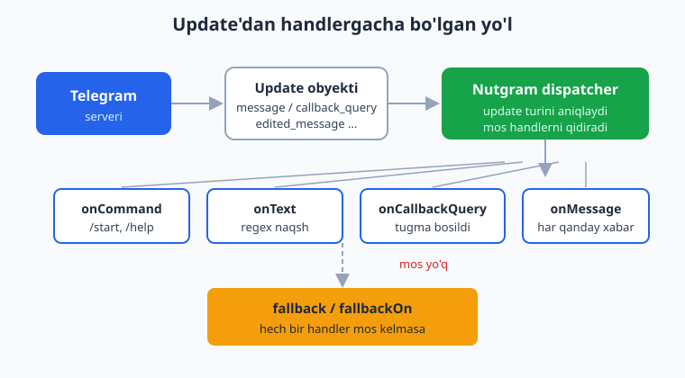
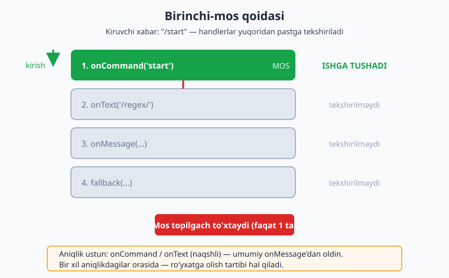
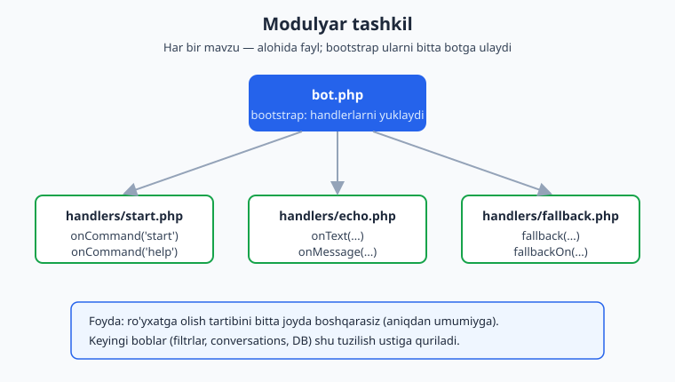

# 03 — Handlerlar va routing

[⬅️ Oldingi: 02 — Birinchi bot: /start va echo](./02-birinchi-bot.md) · [🏠 README](./README.md) · [Keyingi: 04 — Filtrlar va buyruqlar ➡️](./04-filtrlar-buyruqlar.md)

---

> **Bu bobda:** Botingiz har soniyada Telegram'dan turli xil **update** (yangilanish) qabul qiladi — matnli xabar, buyruq, tugma bosilishi, tahrirlangan xabar va h.k. **Handler** — bu shunday update'larga javob beradigan funksiya, **routing** esa qaysi update qaysi handlerga borishini hal qilish jarayoni. Biz Nutgram'ning asosiy handler turlarini (`onMessage`, `onCommand`, `onText`, `onCallbackQuery`) o'rganamiz; ularni ro'yxatga olish **tartibi** va **birinchi-mos qoidasi** routing'ni qanday boshqarishini ko'ramiz; `fallback`/`fallbackOn` bilan "hech narsa mos kelmadi" holatini ushlaymiz; handler ichida update haqida ma'lumotni `$bot->message()`, `$bot->user()`, `$bot->chatId()`, `$bot->userId()` orqali olamiz; va update turlari bilan tanishamiz. Oxirida handlerlarni alohida fayllarga ajratib, **modulyar** tashkil qilamiz — bu butun kitobning keyingi boblari (filtrlar, conversations, ma'lumotlar bazasi) uchun poydevor bo'ladi.
>
> **Halol eslatma:** bu bobdagi barcha bot mantig'i (routing, parametr olish, fallback, accessorlar) **offline** ravishda `Nutgram::fake()` (FakeNutgram) yordamida Nutgram 4.46 da haqiqatan ishga tushirilib tekshirilgan. Jonli Telegram bilan ulanish (long-polling/webhook orqali real xabar yetib kelishi) — illustrativ; uni jonli token va server bilan sinab ko'rasiz. Routing mantig'i ikkala holatda bir xil ishlaydi.

---

## Update nima va u qayerdan keladi

Foydalanuvchi botga xabar yozganda, tugma bosganda yoki guruhga qo'shilganda, Telegram serveri **update** degan obyekt yaratadi. Update — bu "nimadir sodir bo'ldi" degan xabarnoma. Uning ichida aynan nima sodir bo'lganini bildiruvchi maydon bo'ladi: oddiy xabar bo'lsa `message`, tugma bosilsa `callback_query`, xabar tahrirlansa `edited_message` va hokazo.

Bot bu update'larni ikki yo'l bilan oladi (buni 13-bobda batafsil ko'ramiz):

- **Long-polling** — bot Telegram'dan "menga yangi update bormi?" deb doimiy so'rab turadi. Lokal ishlab chiqishda eng qulay.
- **Webhook** — Telegram update'larni sizning HTTPS serveringizga o'zi yuboradi. Production'da.

Qaysi usul bo'lishidan qat'i nazar, update botga yetib kelgach, Nutgram uning turini aniqlaydi va **mos handlerni** qidiradi. Mana shu jarayon — routing.



> PHP asoslari (closure, type hints, namespace) sizga tanish deb faraz qilamiz — agar takrorlash kerak bo'lsa, [../php/README.md](../php/README.md) ga qarang. Bu yerda biz faqat Telegram/Nutgram'ga xos narsalarni tushuntiramiz.

---

## Handler — bu nima

Handler — bu Telegram'dan kelgan ma'lum turdagi update'ga javob beradigan funksiya (odatda closure). Uni botga "ro'yxatga olasiz" (`register`), keyin bot ishga tushganda mos update kelganda Nutgram uni chaqiradi.

Eng oddiy handler — har qanday xabarga javob beruvchi `onMessage`:

```php
<?php
use SergiX44\Nutgram\Nutgram;

$bot->onMessage(function (Nutgram $bot) {
    $bot->sendMessage('Men har qanday xabarga shunday javob beraman.');
});
```

Closure'ning birinchi argumenti — `Nutgram $bot`. Nutgram uni avtomatik uzatadi (dependency injection). Handler ichida `$bot` orqali ham javob yuborasiz, ham kelgan update haqidagi ma'lumotni o'qiysiz.

---

## Asosiy handler turlari

Nutgram update turiga qarab ko'plab handler metodlarini taqdim etadi. Eng ko'p ishlatiladigan to'rttasini ko'rib chiqamiz.

### `onCommand` — buyruqlar (`/start`, `/help`)

Telegram **buyruq** — `/` bilan boshlanadigan matn (masalan `/start`). `onCommand` aynan shularni ushlaydi. Buyruq nomini `/` siz yozasiz:

```php
$bot->onCommand('start', function (Nutgram $bot) {
    $bot->sendMessage('Salom! Botga xush kelibsiz.');
});

$bot->onCommand('help', function (Nutgram $bot) {
    $bot->sendMessage('Mavjud buyruqlar: /start, /help');
});
```

**Buyruqdan parametr olish.** `onCommand` jingalak qavslar bilan parametrli naqshni qo'llab-quvvatlaydi. Qabul qilingan qiymat closure'ga argument sifatida uzatiladi:

```php
// Foydalanuvchi yozadi: /order 1024
$bot->onCommand('order {id}', function (Nutgram $bot, $id) {
    $bot->sendMessage("Buyurtma raqami: {$id}");
});
```

Bu yerda `{id}` joyidagi `1024` qiymati `$id` ga tushadi. Argument nomi naqshdagi nom bilan bir xil bo'lishi shart emas, lekin **tartibi** muhim.

### `onText` — matn naqshi (regex)

`onText` xabar matnini **regulyar ifoda** (regex) bilan solishtiradi. Bu buyruq bo'lmagan, lekin ma'lum shaklga mos matnlarni ushlash uchun qulay:

```php
// "salom" so'zini o'z ichiga olgan har qanday xabar
$bot->onText('.*salom.*', function (Nutgram $bot) {
    $bot->sendMessage('Va alaykum salom!');
});
```

Regexdagi **guruhlar** (`( )`) ham closure argumentlariga uzatiladi:

```php
// Foydalanuvchi yozadi: hisobla 20 + 22
$bot->onText('hisobla (\d+) \+ (\d+)', function (Nutgram $bot, $a, $b) {
    $bot->sendMessage('Natija: ' . ((int) $a + (int) $b));
});
```

Bu yerda birinchi `(\d+)` -> `$a`, ikkinchisi -> `$b`. Natija: `Natija: 42`.

> **Eslatma:** `onText` naqshi butun matnga emas, balki to'liq matnga qarshi tekshiriladi — ya'ni naqsh matnning bir qismiga mos kelsa ham ishlaydi (Nutgram naqshni `preg_match` bilan ishlatadi). Aniq boshlanish/tugashni xohlasangiz `^...$` langar belgilarini qo'shing. Filtrlar va aniqroq moslikni 04-bobda ko'ramiz.

### `onCallbackQuery` — inline tugma bosilishi

Inline klaviaturadagi (xabar ostidagi) tugma bosilganda Telegram `callback_query` update yuboradi. Klaviaturalarni 06–07-boblarda batafsil quramiz, lekin routing nuqtai nazaridan ikki metod bor:

- `onCallbackQuery` — har qanday tugma bosilishini ushlaydi.
- `onCallbackQueryData('naqsh', ...)` — `callback_data` ma'lum naqshga mos kelsa.

```php
// Aniq naqshli callback_data: "like:7"
$bot->onCallbackQueryData('like:{post}', function (Nutgram $bot, $post) {
    $bot->answerCallbackQuery(text: "Post #{$post} yoqdi!");
});

// Har qanday boshqa tugma
$bot->onCallbackQuery(function (Nutgram $bot) {
    $bot->answerCallbackQuery(text: 'Tugma bosildi.');
});
```

`onCallbackQueryData` ham `onCommand` kabi `{post}` parametrini qo'llab-quvvatlaydi. `answerCallbackQuery` — Telegram talab qiladigan "tugmani bosildi deb tasdiqlash" javobi (aks holda foydalanuvchi tugmada aylanuvchi belgini ko'raveradi).

### `onMessage` — har qanday xabar

`onMessage` — eng umumiy matn-xabar handleri: turidan qat'i nazar har qanday `message` update'ni ushlaydi (matn, rasm, stiker — barchasi). Uni odatda **eng oxirida** "qolgan hamma narsa uchun" ishlatadi:

```php
$bot->onMessage(function (Nutgram $bot) {
    $bot->sendMessage('Echo: ' . $bot->message()->text);
});
```

---

## Birinchi-mos qoidasi va ro'yxatga olish tartibi

Mana bobning **eng muhim** tushunchasi. Bir update kelganda Nutgram handlerlarni tekshiradi va **faqat bittasini** ishga tushiradi — birinchi mos kelganini. Mos topilgach, qolganlari tekshirilmaydi.



Bu yerda ikkita qoida birga ishlaydi:

**1. Aniqlik ustun (priority).** Aniq naqshli handlerlar (`onCommand`, naqshli `onText`) umumiy `onMessage`'dan ustun turadi — ularni qaysi tartibda ro'yxatga olishingizdan qat'i nazar. Ya'ni `/start` buyrug'i, hatto `onMessage` undan oldin ro'yxatga olingan bo'lsa ham, `onCommand('start')` ga boradi:

```php
$bot->onMessage(fn (Nutgram $bot) => $bot->sendMessage('UMUMIY'));
$bot->onCommand('start', fn (Nutgram $bot) => $bot->sendMessage('BUYRUQ'));

// Foydalanuvchi /start yozsa -> "BUYRUQ" (onMessage oldin bo'lsa ham!)
// Foydalanuvchi "salom" yozsa -> "UMUMIY"
```

**2. Bir xil aniqlikdagilar orasida — tartib hal qiladi.** Agar ikkita `onText` naqshi ham mos kelsa, **birinchi ro'yxatga olingani** ishlaydi:

```php
$bot->onText('sa.*', fn (Nutgram $bot) => $bot->sendMessage('BIRINCHI'));
$bot->onText('salom', fn (Nutgram $bot) => $bot->sendMessage('IKKINCHI'));

// "salom" yozilsa ikkalasi ham mos, lekin -> "BIRINCHI"
```

**Amaliy xulosa:** handlerlaringizni **aniqdan umumiyga** tartibda joylashtiring — avval aniq buyruqlar va naqshlar, eng oxirida `onMessage` va `fallback`. Shunda har bir xabar to'g'ri joyga boradi.

> **Yana bir muhim nuqta:** har bir update uchun faqat **bitta** handler ishlaydi. Bu shuni anglatadiki, `onText` mos kelib ishlasa, undan keyingi `onMessage` **ishlamaydi** — ikkalasi ham birdaniga chaqirilmaydi. (Buni offline test bilan tasdiqladik: bir xabar -> aniq bir javob.)

---

## `fallback` va `fallbackOn` — "hech narsa mos kelmadi"

Hech bir handler mos kelmasa, foydalanuvchi javobsiz qolmasligi kerak. `fallback` — aynan shu "tutib qolish" mexanizmi:

```php
$bot->onCommand('start', fn (Nutgram $bot) => $bot->sendMessage('Salom!'));

// Boshqa hech narsaga mos kelmasa:
$bot->fallback(function (Nutgram $bot) {
    $bot->sendMessage('Buni tushunmadim. /start ni sinab ko\'ring.');
});
```

`fallbackOn` esa fallback'ni **ma'lum update turi** bilan cheklaydi. Masalan, faqat eskirgan/noma'lum inline tugmalar uchun alohida javob:

```php
use SergiX44\Nutgram\Telegram\Properties\UpdateType;

$bot->onCallbackQueryData('ok', fn (Nutgram $bot) => $bot->answerCallbackQuery(text: 'OK'));

// Faqat callback_query turidagi, naqshga mos kelmagan update'lar uchun:
$bot->fallbackOn(UpdateType::CALLBACK_QUERY, function (Nutgram $bot) {
    $bot->answerCallbackQuery(text: 'Bu tugma endi ishlamaydi.', show_alert: true);
});
```

> **Diqqat — `onMessage` bilan `fallback`:** agar siz `onMessage` ro'yxatga olgan bo'lsangiz, u **har qanday** matn-xabar update'ini ushlaydi, shuning uchun matnli xabarlar uchun `fallback` deyarli hech qachon ishlamaydi. `fallback` ko'proq `onMessage` qo'yilmagan holatda yoki matn bo'lmagan, boshqa hech qaysi handlerga mos kelmagan update'lar uchun ishlaydi. Strategiyangizni shunga qarab tanlang: yoki keng `onMessage`, yoki keng `fallback` — ikkalasini bir vaqtda keng qilib qo'ymang.

---

## Handler ichida ma'lumot olish

Handler chaqirilganda, sizga "kim, qayerdan, nima yubordi" kerak bo'ladi. `$bot` obyekti shu ma'lumotlarni qulay metodlar orqali beradi.

| Metod | Qaytaradi | Tavsif |
|---|---|---|
| `$bot->message()` | `Message` yoki `null` | Joriy xabar obyekti (matn — `->text`, jo'natuvchi — `->from`) |
| `$bot->callbackQuery()` | `CallbackQuery` yoki `null` | Joriy callback (tugma) obyekti (`->data`) |
| `$bot->user()` | `User` yoki `null` | Update'ni boshlagan foydalanuvchi (`->id`, `->first_name`, `->username`) |
| `$bot->chatId()` | `int` yoki `null` | Joriy chat ID (xabar yuborish manzili) |
| `$bot->userId()` | `int` yoki `null` | Foydalanuvchi ID (`$bot->user()->id` qisqartmasi) |
| `$bot->update()` | `Update` | Xom update obyekti (kerak bo'lsa) |

Misol — barcha asosiy ma'lumotlarni ko'rsatuvchi handler:

```php
$bot->onCommand('whoami', function (Nutgram $bot) {
    $user = $bot->user();
    $ism  = $user?->first_name ?? 'noma\'lum';

    $bot->sendMessage(sprintf(
        "Foydalanuvchi ID: %d\nChat ID: %d\nIsm: %s\nUsername: @%s",
        $bot->userId(),
        $bot->chatId(),
        $ism,
        $user?->username ?? '—'
    ));
});
```

> `$bot->user()` `null` bo'lishi mumkin (masalan, ba'zi kanal/servis update'larida foydalanuvchi yo'q), shuning uchun `?->` (nullsafe) va `??` (null-coalescing) bilan himoyalaning. `chatId()` — xabarni qayerga yuborishni bilish uchun kalit: `sendMessage` uni avtomatik joriy chatdan oladi, lekin boshqa chatga yubormoqchi bo'lsangiz `chat_id:` ni qo'lda berasiz.

---

## Update turlari

Nutgram message va callback'dan ko'ra ko'proq update turini qo'llab-quvvatlaydi. `UpdateType` enum'ida ularning to'liq ro'yxati bor. Eng muhimlari va ularni ushlovchi handlerlar:

| Update turi (`UpdateType`) | Handler | Qachon keladi |
|---|---|---|
| `MESSAGE` | `onMessage`, `onCommand`, `onText` | Oddiy xabar / buyruq |
| `EDITED_MESSAGE` | `onEditedMessage` | Foydalanuvchi xabarini tahrirladi |
| `CALLBACK_QUERY` | `onCallbackQuery`, `onCallbackQueryData` | Inline tugma bosildi |
| `CHANNEL_POST` | `onChannelPost` | Kanalga yangi post |
| `EDITED_CHANNEL_POST` | `onEditedChannelPost` | Kanal posti tahrirlandi |
| `MY_CHAT_MEMBER` | `onMyChatMember` | Botning o'zining a'zolik holati o'zgardi (qo'shildi/chiqarildi) |
| `CHAT_MEMBER` | `onChatMember` | Boshqa a'zoning holati o'zgardi (admin kerak) |
| `CHAT_JOIN_REQUEST` | `onChatJoinRequest` | Qo'shilish so'rovi (19–22-boblar) |
| `PRE_CHECKOUT_QUERY` | `onPreCheckoutQuery` | To'lovdan oldingi tekshiruv (14-bob) |

Bularning aksariyatini keyingi boblarda kontekst bilan ko'ramiz (guruhlar — 19–20, kanallar — 21, to'lovlar — 14). Hozircha eslab qoling: **har bir update turi uchun maxsus `on...` handleri bor**, va `onMessageType` orqali xabar ichidagi tur (rasm, stiker, lokatsiya) bo'yicha ham filtrlash mumkin:

```php
use SergiX44\Nutgram\Telegram\Properties\MessageType;

// Faqat rasm yuborilganda
$bot->onMessageType(MessageType::PHOTO, function (Nutgram $bot) {
    $bot->sendMessage('Chiroyli rasm! Lekin men matnni afzal ko\'raman.');
});
```

---

## Handlerlarni modulyar tashkil qilish (poydevor)

Hamma handlerni bitta `bot.php` faylga to'plash kichik bot uchun yetarli. Ammo bot o'sgani sayin (filtrlar, conversations, ma'lumotlar bazasi, to'lovlar) bitta fayl boshqarib bo'lmas holga keladi. Yechim — handlerlarni **mavzu bo'yicha alohida fayllarga** ajratish va bootstrap faylida ulash.



Yondashuv oddiy: har bir handler fayli **closure qaytaradi**, u `$bot` ni qabul qilib, o'z handlerlarini ro'yxatga oladi.

`handlers/start.php`:

```php
<?php
use SergiX44\Nutgram\Nutgram;

return function (Nutgram $bot): void {
    $bot->onCommand('start', function (Nutgram $bot) {
        $ism = $bot->user()?->first_name ?? 'do\'st';
        $bot->sendMessage("Salom, {$ism}! Botga xush kelibsiz.");
    });

    $bot->onCommand('help', function (Nutgram $bot) {
        $bot->sendMessage('Buyruqlar: /start, /help');
    });
};
```

`handlers/echo.php`:

```php
<?php
use SergiX44\Nutgram\Nutgram;

return function (Nutgram $bot): void {
    $bot->onMessage(function (Nutgram $bot) {
        $bot->sendMessage('Echo: ' . $bot->message()->text);
    });
};
```

`handlers/fallback.php`:

```php
<?php
use SergiX44\Nutgram\Nutgram;

return function (Nutgram $bot): void {
    $bot->fallback(function (Nutgram $bot) {
        $bot->sendMessage('Bu turdagi xabarni hali tushunmayman.');
    });
};
```

Endi bootstrap fayli ularni **aniqdan umumiyga** tartibda yuklaydi:

`bot.php`:

```php
<?php
require __DIR__ . '/vendor/autoload.php';

use SergiX44\Nutgram\Nutgram;

$bot = new Nutgram(getenv('BOT_TOKEN'));

// Tartib muhim: aniq -> umumiy -> fallback
foreach (['start', 'echo', 'fallback'] as $modul) {
    (require __DIR__ . "/handlers/{$modul}.php")($bot);
}

$bot->run(); // long-polling (13-bobda webhook'ni ko'ramiz)
```

`(require "...")($bot)` — `require` fayldan qaytgan closure'ni darhol `$bot` bilan chaqiradi. Natijada barcha handlerlar ro'yxatdagi tartibda botga qo'shiladi.

> **Nega bu poydevor.** Keyingi boblarda biz aynan shu tuzilishni kengaytiramiz: 04-bobda filtrlarni qo'shamiz, 08-bobda conversations modullarini, 09-bobda middleware, 10-bobda ma'lumotlar bazasi qatlamini. Ro'yxatga olish tartibini bitta `bot.php` joyida boshqarish — botingiz qancha o'smasin, routing'ni nazoratda saqlaydi. (11-bobda to'liq loyiha tuzilishini standartlashtiramiz.)

---

## Offline tekshirish — FakeNutgram bilan

Yuqoridagi barcha mantiqni jonli Telegram'siz tekshirish mumkin. `Nutgram::fake()` haqiqiy bot o'rniga **FakeNutgram** qaytaradi: u xuddi haqiqiy bot kabi handlerlarni ro'yxatga oladi, lekin xabarlarni Telegram'ga emas, ichki "tarix"ga yozadi — va siz `assert...` metodlari bilan natijani tekshirasiz. Buning uchun dev-bog'liqlik sifatida `phpunit/phpunit` kerak (16-bobda batafsil).

Mana modulyar botning o'zini tekshiruvchi skript (`verify.php`) — uni `php verify.php` bilan ishga tushirasiz:

```php
<?php
require __DIR__ . '/vendor/autoload.php';

use SergiX44\Nutgram\Nutgram;

// Modulyar bootstrap (jonli bot bilan bir xil tartib)
function makeBot(): Nutgram {
    $bot = Nutgram::fake();
    foreach (['start', 'echo', 'fallback'] as $modul) {
        (require __DIR__ . "/handlers/{$modul}.php")($bot);
    }
    return $bot;
}

// 1. /start salomlashadi
$bot = makeBot();
$bot->hearText('/start')->reply();
$bot->assertReplyText('Salom, ' . ($bot->user()?->first_name ?? 'do\'st') . '! Botga xush kelibsiz.');

// 2. Oddiy matn -> echo
$bot = makeBot();
$bot->hearText('qoraqalpoq')->reply();
$bot->assertReplyText('Echo: qoraqalpoq');

// 3. Birinchi-mos: /start echoga TUSHMAYDI
$bot = makeBot();
$bot->hearText('/start')->reply();
$bot->assertReplyText('Salom, ' . ($bot->user()?->first_name ?? 'do\'st') . '! Botga xush kelibsiz.');

// 4. Naqshga mos kelmagan callback -> fallback
$bot = makeBot();
$bot->hearCallbackQueryData('nimadir')->reply();
$bot->assertReplyText('Bu turdagi xabarni hali tushunmayman.');

echo "Hammasi OK\n";
```

`hearText('...')` — kiruvchi matnli xabarni simulyatsiya qiladi; `hearCallbackQueryData('...')` — tugma bosilishini; `->reply()` — botni shu update ustida ishga tushiradi; `assertReplyText('...')` — bot aynan shu matnni yuborganini tekshiradi. Agar tekshiruv buzilsa, skript xato bilan to'xtaydi.

> **Bu bobni yozishda** mana shu uslubdagi 10 ta tekshiruv (har bir handler turi, birinchi-mos qoidasi, parametr olish, fallback/fallbackOn, accessorlar, `onMessageType`) Nutgram 4.46 da haqiqatan ishga tushirilib, hammasi muvaffaqiyatli o'tdi. Demak, yuqoridagi kod sxemalar emas — ishlaydigan kod.

---

## Mashqlar

### Oson

1. `onCommand('ping', ...)` handleri yozing — u "pong" deb javob bersin. FakeNutgram bilan tekshiring.
2. `onCommand('echo {matn}', ...)` yozing — foydalanuvchi `/echo salom` yozsa, bot `salom` deb qaytarsin.
3. Bir botga `onCommand('start')` va `onMessage` ni shu tartibda qo'shing. `/start` qaysi handlerga borishini ayting (va nega).
4. `$bot->user()?->first_name` dan foydalanib foydalanuvchini ismi bilan salomlovchi `/salom` buyrug'ini yozing.
5. `fallback` qo'shing — u `/start` dan boshqa har qanday matnga "Buyruqlardan foydalaning: /start" deb javob bersin.
6. `onText('.*rahmat.*', ...)` yozing — "rahmat" so'zi bo'lgan har qanday xabarga "Arzimaydi!" deb javob bersin.

### O'rta

1. `onText('jami (\d+) (\d+) (\d+)', ...)` yozing — uchta sonni qabul qilib, yig'indisini qaytarsin. (Maslahat: closure'ga uch argument.)
2. Aniqlik ustunligini ko'rsatuvchi tajriba o'tkazing: `onMessage` ni `onCommand('start')` dan **oldin** ro'yxatga oling, keyin FakeNutgram bilan `/start` ning baribir `onCommand` ga borishini tasdiqlang.
3. Ikkita `onText` naqshini yozing (`sa.*` va `salom`) — ikkalasi ham mos keladigan matn yuborib, qaysi biri ishlashini tekshiring. Natijani izohlang.
4. `fallbackOn(UpdateType::CALLBACK_QUERY, ...)` yozing — naqshga mos kelmagan tugma bosilganda `answerCallbackQuery` bilan ogohlantirish chiqarsin. FakeNutgram'ning `assertCalled('answerCallbackQuery')` bilan tekshiring.
5. `/whoami` buyrug'ini yozing — `userId()`, `chatId()` va `user()->username` ni bitta xabarda ko'rsatsin. `username` `null` bo'lsa `—` chiqarsin.
6. `onMessageType(MessageType::PHOTO, ...)` yozing — rasm yuborilganda "Rasmni qabul qildim" deb javob bersin.

### Qiyin

1. Handlerlaringizni modulyar qiling: `handlers/start.php`, `handlers/text.php`, `handlers/fallback.php` yarating (har biri closure qaytarsin) va `bot.php` ularni **aniqdan umumiyga** tartibda yuklasin. Keyin `verify.php` yozib, har bir modulning ishini FakeNutgram bilan tasdiqlang.
2. "Mini-router" yozing: bitta `onMessage` ichida `$bot->message()->text` ni o'qib, `match` bilan o'zingiz routing qiling (masalan, "narx" -> narxlar, "aloqa" -> kontakt). Buni Nutgram'ning o'rnatilgan routing'i bilan solishtiring — qaysi biri qulayroq va nega?
3. `onCommand('order {id}', ...)` va `onText('order (\d+)', ...)` ni bitta botga qo'shing. `/order 5` va `order 5` (slashsiz) har xil ishlashini ko'rsating. Slashli buyruq nega `onText` ga ham mos kelishi/kelmasligini muhokama qiling.

<details markdown="1"><summary>Yechimlar</summary>

**Oson 1.**
```php
$bot->onCommand('ping', fn (Nutgram $bot) => $bot->sendMessage('pong'));
// Tekshirish:
$bot->hearText('/ping')->reply();
$bot->assertReplyText('pong');
```

**Oson 2.**
```php
$bot->onCommand('echo {matn}', function (Nutgram $bot, $matn) {
    $bot->sendMessage($matn);
});
// /echo salom -> "salom"
```

**Oson 3.** `/start` `onCommand('start')` ga boradi. Sababi — **aniqlik ustun**: `onCommand` (aniq buyruq) umumiy `onMessage`'dan ustun turadi, hatto `onMessage` oldin ro'yxatga olingan bo'lsa ham.

**Oson 4.**
```php
$bot->onCommand('salom', function (Nutgram $bot) {
    $ism = $bot->user()?->first_name ?? 'do\'st';
    $bot->sendMessage("Salom, {$ism}!");
});
```

**Oson 5.**
```php
$bot->onCommand('start', fn (Nutgram $bot) => $bot->sendMessage('Asosiy menyu.'));
$bot->fallback(fn (Nutgram $bot) => $bot->sendMessage('Buyruqlardan foydalaning: /start'));
```

**Oson 6.**
```php
$bot->onText('.*rahmat.*', fn (Nutgram $bot) => $bot->sendMessage('Arzimaydi!'));
```

**O'rta 1.**
```php
$bot->onText('jami (\d+) (\d+) (\d+)', function (Nutgram $bot, $a, $b, $c) {
    $bot->sendMessage('Jami: ' . ((int) $a + (int) $b + (int) $c));
});
// "jami 1 2 3" -> "Jami: 6"
```

**O'rta 2.**
```php
$bot = Nutgram::fake();
$bot->onMessage(fn (Nutgram $bot) => $bot->sendMessage('UMUMIY'));
$bot->onCommand('start', fn (Nutgram $bot) => $bot->sendMessage('BUYRUQ'));
$bot->hearText('/start')->reply();
$bot->assertReplyText('BUYRUQ'); // tasdiqlandi: aniqlik ustun
```

**O'rta 3.**
```php
$bot->onText('sa.*', fn (Nutgram $bot) => $bot->sendMessage('BIRINCHI'));
$bot->onText('salom', fn (Nutgram $bot) => $bot->sendMessage('IKKINCHI'));
$bot->hearText('salom')->reply();
$bot->assertReplyText('BIRINCHI');
```
Ikkalasi ham mos, lekin bir xil aniqlikda — shuning uchun **birinchi ro'yxatga olingan** (`sa.*`) ishlaydi.

**O'rta 4.**
```php
use SergiX44\Nutgram\Telegram\Properties\UpdateType;

$bot->onCallbackQueryData('ok', fn (Nutgram $bot) => $bot->answerCallbackQuery(text: 'OK'));
$bot->fallbackOn(UpdateType::CALLBACK_QUERY, function (Nutgram $bot) {
    $bot->answerCallbackQuery(text: 'Bu tugma endi ishlamaydi.', show_alert: true);
});
// Tekshirish:
$bot->hearCallbackQueryData('eskirgan')->reply();
$bot->assertCalled('answerCallbackQuery');
```

**O'rta 5.**
```php
$bot->onCommand('whoami', function (Nutgram $bot) {
    $u = $bot->user();
    $bot->sendMessage(sprintf(
        "ID: %d | Chat: %d | Username: @%s",
        $bot->userId(),
        $bot->chatId(),
        $u?->username ?? '—'
    ));
});
```

**O'rta 6.**
```php
use SergiX44\Nutgram\Telegram\Properties\MessageType;

$bot->onMessageType(MessageType::PHOTO, fn (Nutgram $bot) =>
    $bot->sendMessage('Rasmni qabul qildim'));
```

**Qiyin 1.** `handlers/start.php`, `handlers/text.php`, `handlers/fallback.php` — har biri `return function (Nutgram $bot) { ... };`. `bot.php`:
```php
foreach (['start', 'text', 'fallback'] as $m) {
    (require __DIR__ . "/handlers/{$m}.php")($bot);
}
```
`verify.php` da `Nutgram::fake()` ustiga aynan shu tartibda yuklab, `hearText/hearCallbackQueryData` + `assertReplyText` bilan har bir modulni tekshiring. Tartib aniqdan umumiyga — shuning uchun `fallback` oxirida.

**Qiyin 2.**
```php
$bot->onMessage(function (Nutgram $bot) {
    $javob = match (mb_strtolower(trim($bot->message()->text ?? ''))) {
        'narx'  => 'Narxlar: ...',
        'aloqa' => 'Aloqa: @admin',
        default => 'Tushunmadim.',
    };
    $bot->sendMessage($javob);
});
```
Qo'lda `match`-routing kichik holatda ishlaydi, lekin: parametr olish (`{id}`), aniqlik ustunligi, fallback va testlash — hammasini o'zingiz qurishingiz kerak. Nutgram'ning o'rnatilgan routing'i bularni bepul beradi va o'qilishi tozaroq. Modulyar `onCommand`/`onText` deyarli doim afzal.

**Qiyin 3.**
```php
$bot->onCommand('order {id}', fn (Nutgram $bot, $id) => $bot->sendMessage("Buyruq: {$id}"));
$bot->onText('order (\d+)', fn (Nutgram $bot, $n) => $bot->sendMessage("Matn: {$n}"));
```
`/order 5` -> `onCommand` (aniqlik ustun) -> "Buyruq: 5". `order 5` (slashsiz) -> `onCommand` ga mos kelmaydi (buyruq `/` talab qiladi), shuning uchun `onText` -> "Matn: 5". `/order 5` `onText('order (\d+)')` naqshiga matn sifatida texnik jihatdan mos kelsa-da, aniqlik ustunligi tufayli `onCommand` birinchi ushlaydi va `onText` ga yetib bormaydi.

</details>

---

[⬅️ Oldingi: 02 — Birinchi bot: /start va echo](./02-birinchi-bot.md) · [🏠 README](./README.md) · [Keyingi: 04 — Filtrlar va buyruqlar ➡️](./04-filtrlar-buyruqlar.md)
