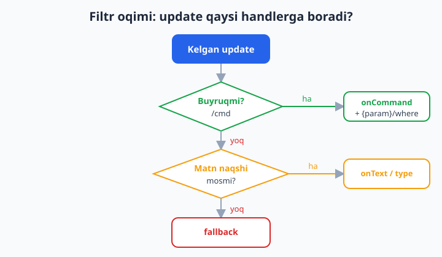
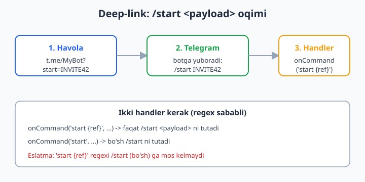
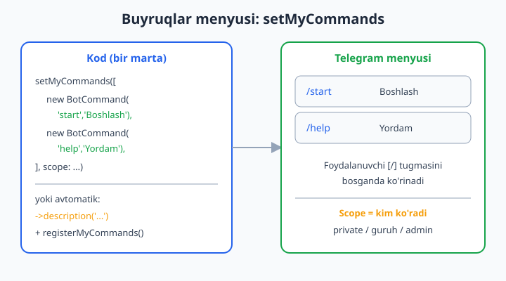

# 04 — Filtrlar va buyruqlar

[⬅️ Oldingi: 03 — Handlerlar va routing](./03-handlerlar-routing.md) · [🏠 README](./README.md) · [Keyingi: 05 — Xabar yuborish, formatlash va media ➡️](./05-xabar-formatlash-media.md)

---

> **Bu bobda:** O'tgan bobda handlerlar update'ni qanday ushlashini ko'rdik. Endi *aniqroq* ushlashni o'rganamiz: parametrli buyruqlar (`/start INVITE42` — deep-link payload), `onText` bilan regex naqshlar va nomli parametrlar (`{name}`), parametrlarga cheklov qo'yish (`where`, `whereNumber`, `whereIn`, `insensitive`), update-turi bo'yicha filtrlash (`onMessageType`, `fallback`, `fallbackOn`), bir nechta shartni birga ishlatish, sinf-asosli buyruqlar (`Command` klassi) va — eng muhimi — botingiz menyusiga buyruq ro'yxatini chiqarish (`setMyCommands` va avtomatik `registerMyCommands`). Bobning oxirida PHP 8 atributlari mavzusiga ham to'xtalamiz: Nutgram yadrosi handlerlarni atributlar bilan ro'yxatdan o'tkazmaydi, shuning uchun o'zimiz Reflection bilan kichik atribut-skaner yozamiz (illustrativ DIY pattern).
>
> **Halol eslatma:** Bu bobdagi barcha handler, filtr, constraint va `setMyCommands` mantig'i `Nutgram::fake()` (FakeNutgram) bilan **offline tekshirilgan** — token va jonli Telegram kerak emas. Faqat menyuning telefon ekranida real ko'rinishi va deep-link havolasini bosish Telegram ilovasida sodir bo'ladi — o'sha qism *illustrativ* (jonli Telegram kerak), kod va mantiq esa to'g'ri.

---

## 1. Filtr nima va nega kerak?

Botga har xil update keladi: matn, buyruq, foto, hujjat, lokatsiya, callback... Handler esa har birini emas, **aniq turini** ushlashi kerak. Nutgram'da filtrlash uchun alohida "filter" ob'ekti yo'q (aiogram'dagi kabi) — uning o'rniga **handler metodining o'zi filtr vazifasini bajaradi**:

- `onCommand('start', ...)` — faqat `/start` buyrug'i;
- `onText('/[0-9]+/', ...)` — faqat naqshga mos matn;
- `onMessageType(MessageType::PHOTO, ...)` — faqat foto;
- `fallback(...)` — boshqa hech narsa mos kelmaganda.

Update kelganda Nutgram handlerlarni ketma-ket "sinab ko'radi": birinchi mos kelgani ishga tushadi va to'xtaydi (3-bobdagi routing). Quyidagi diagramma bu oqimni ko'rsatadi.



> O'quvchi PHP'ni biladi deb faraz qilamiz (sinf, closure, type-hint, regex). Agar regex bilan tanish bo'lmasangiz, PHP qo'llanmasidagi `preg_match` bo'limiga qarang: [../php/README.md](../php/README.md). Bu yerda Telegram va Nutgram'ga xos qismni to'liq tushuntiramiz.

---

## 2. `onCommand` — buyruqlarni ushlash

Eng oddiy holat — argumentsiz buyruq:

```php
<?php
$bot->onCommand('start', function (Nutgram $bot) {
    $bot->sendMessage('Salom! Men ishga tushdim.');
});
```

`onCommand('start', ...)` ichki ravishda `/start` naqshini yaratadi. Diqqat: buyruq nomini **`/` belgisisiz** beriladi — Nutgram `/` ni o'zi qo'shadi.

### `@botname` avtomatik tozalanadi

Guruhlarda foydalanuvchilar ko'pincha `/start@MyBot` deb yozadi (Telegram bir nechta bot bo'lganda shunday taklif qiladi). Nutgram bot nomini bilsa, `@MyBot` qismini avtomatik olib tashlaydi va `onCommand('start', ...)` baribir ishlaydi. Buning uchun bot konfiguratsiyasida `botName` o'rnatilgan bo'lishi kerak:

```php
<?php
use SergiX44\Nutgram\Configuration;

$bot = new Nutgram($token, new Configuration(botName: 'MyBot'));
// endi /start, /start@MyBot, /start@MyBot ABC — hammasi to'g'ri ishlaydi
```

> **Tekshirildi:** `Nutgram::fake(config: new Configuration(botName: 'mybot'))` bilan `/start@mybot DEEPLINK` -> handler `DEEPLINK` ni payload sifatida oldi. `botName` o'rnatilmasa, `@botname` qismi tozalanmaydi — shuning uchun guruh botlarida uni doim o'rnating.

---

## 3. Parametrli buyruqlar va deep-link (`/start <payload>`)

Telegram'ning eng kuchli xususiyatlaridan biri — **deep-link**. `https://t.me/MyBot?start=INVITE42` havolasini bosgan foydalanuvchi botni ochadi va Telegram avtomatik ravishda `/start INVITE42` xabarini yuboradi. Bu bilan siz: kim kimni taklif qilganini (referral), qaysi reklamadan kelganini, yoki qaysi mahsulotni ko'rmoqchi ekanini bilib olasiz.



### Nomli parametr: `{name}`

Nutgram naqshda **jingalak qavs** ichida nomli parametr e'lon qilishga ruxsat beradi. U handlerga argument sifatida uzatiladi:

```php
<?php
$bot->onCommand('start {ref}', function (Nutgram $bot, string $ref) {
    $bot->sendMessage("Xush kelibsiz! Taklif kodi: {$ref}");
});
```

Foydalanuvchi `/start INVITE42` yozsa, `$ref` qiymati `'INVITE42'` bo'ladi. Parametr nomi (`ref`) handler argumenti nomi bilan **bir xil bo'lishi shart emas** — Nutgram parametrlarni *tartib bo'yicha* uzatadi (birinchi parametr -> birinchi argument).

### MUHIM: bo'sh `/start` uchun alohida handler kerak

Bu — eng ko'p uchraydigan tuzoq. `'start {ref}'` naqshi ichki ravishda `/^\/start (?<ref>.*?)$/` regexiga aylanadi. E'tibor bering: `/start` so'zidan keyin **bo'sh joy** majburiy. Demak:

- `/start INVITE42` -> mos keladi (`$ref = 'INVITE42'`);
- `/start` (payloadsiz) -> **mos kelmaydi** (bo'sh joy yo'q).

Shuning uchun *ikkala holatni* qoplash uchun ikkita handler yozasiz:

```php
<?php
// Payload BOR holat
$bot->onCommand('start {ref}', function (Nutgram $bot, string $ref) {
    $bot->sendMessage("Taklif orqali keldingiz: {$ref}");
});

// Payload YO'Q holat — oddiy /start
$bot->onCommand('start', function (Nutgram $bot) {
    $bot->sendMessage('Salom! Botga xush kelibsiz.');
});
```

> **Tekshirildi (FakeNutgram):** `/start INVITE42` -> birinchi handler; `/start` (bo'sh) -> ikkinchi handler. Tartib muhim emas — Nutgram aniqroq mos kelganini topadi.

### Deep-link havolasini yaratish

Botingiz username'i `MyBot` bo'lsa, havola shunday:

```
https://t.me/MyBot?start=INVITE42
```

`start` parametri qiymatiga cheklov bor: faqat `A-Z a-z 0-9 _ -` (1-64 belgi). Agar murakkabroq ma'lumot (masalan, JSON yoki ID+sana) joylamoqchi bo'lsangiz, uni `base64url` bilan kodlang:

```php
<?php
// Havola yaratish (server tomonda)
$payload = base64_encode(json_encode(['ref' => 42, 'src' => 'ads']));
$payload = rtrim(strtr($payload, '+/', '-_'), '=');   // base64url
$link = "https://t.me/MyBot?start={$payload}";

// Botda qabul qilish va dekodlash
$bot->onCommand('start {ref}', function (Nutgram $bot, string $ref) {
    $decoded = base64_decode(strtr($ref, '-_', '+/'));
    $data = json_decode($decoded, true) ?: [];
    $bot->sendMessage('Manba: ' . ($data['src'] ?? 'nomalum'));
});
```

> **Illustrativ qism:** havolani bosib botning ochilishi va Telegram'ning `/start <payload>` yuborishi — jonli Telegram'da sodir bo'ladi. Kod va dekodlash mantig'i offline tekshirilgan; havola ochilishini real qurilmada sinab ko'rasiz.

---

## 4. Parametrlarga cheklov (constraints)

Nomli parametr har qanday matnni qabul qiladi. Ko'pincha esa biz uni *cheklaymiz*: faqat raqam, faqat harf, yoki ro'yxatdan biri. Nutgram bunda zanjir (chain) uslubidagi `where*` metodlarini beradi:

| Metod | Vazifasi | Ichki regex |
|---|---|---|
| `whereNumber('id')` | Faqat raqam | `[0-9]+` |
| `whereAlpha('name')` | Faqat harf | `[a-zA-Z]+` |
| `whereAlphaNumeric('code')` | Harf yoki raqam | `[a-zA-Z0-9]+` |
| `whereIn('lang', ['uz','ru'])` | Ro'yxatdan biri | `uz\|ru` |
| `where('slug', '[a-z\-]+')` | O'z regexingiz | beradiganingiz |
| `insensitive()` | Katta-kichik harf farqsiz | — |

```php
<?php
// Faqat raqamli ID
$bot->onCommand('order {id}', function (Nutgram $bot, string $id) {
    $bot->sendMessage("Buyurtma #{$id} qidirilmoqda...");
})->whereNumber('id');

// Faqat ruxsat etilgan tillar
$bot->onCommand('lang {code}', function (Nutgram $bot, string $code) {
    $bot->sendMessage("Til o'zgartirildi: {$code}");
})->whereIn('code', ['uz', 'ru', 'en']);
```

Agar parametr cheklovga **mos kelmasa**, handler umuman ishga tushmaydi — go'yo bu naqsh yo'qdek. Masalan `/order abc` (raqam emas) `whereNumber` tufayli rad etiladi va keyingi handlerga (yoki `fallback`'ga) o'tadi.

### Bir nechta parametr va bir nechta cheklov

```php
<?php
$bot->onCommand('give {user} {amount}', function (Nutgram $bot, string $user, string $amount) {
    $bot->sendMessage("{$user} foydalanuvchiga {$amount} ball berildi");
})
    ->where('user', '@?[a-zA-Z0-9_]+')   // ixtiyoriy @ bilan username
    ->whereNumber('amount');             // ball — faqat raqam
```

`where` massiv ham qabul qiladi (bir martada bir nechta):

```php
->where(['user' => '@?[a-zA-Z0-9_]+', 'amount' => '[0-9]+'])
```

> **Tekshirildi:** `/order 777` -> `$id='777'`; `/order abc` -> handler ishlamadi (constraint rad etdi); `/lang uz` -> qabul; `/give ali 100` -> `$user='ali', $amount='100'`.

---

## 5. `onText` — regex naqsh bilan matn ushlash

Buyruq emas, **oddiy matnni** naqsh bo'yicha ushlash uchun `onText` ishlatamiz. U ham nomli parametr (`{...}`), ham sof regexni qabul qiladi.

### Nomli parametr bilan

```php
<?php
$bot->onText('Buyurtma #{id}', function (Nutgram $bot, string $id) {
    $bot->sendMessage("#{$id} raqamli buyurtma topildi.");
})->whereNumber('id');
```

Foydalanuvchi `Buyurtma #512` deb yozsa -> `$id = '512'`.

### Sof regex bilan

Naqsh ichida jingalak qavs bo'lmasa, u **to'liq regex** sifatida ishlaydi (Nutgram uni `/^...$/mu` bilan o'raydi):

```php
<?php
// "ha" yoki "yoq" javobini ushlash
$bot->onText('(ha|yoq)', function (Nutgram $bot) {
    $bot->sendMessage('Javobingiz qabul qilindi.');
});

// Telefon raqami (oddiy misol)
$bot->onText('\+998[0-9]{9}', function (Nutgram $bot) {
    $bot->sendMessage('Raqam saqlandi.');
});
```

`insensitive()` ni qo'shsangiz, naqsh katta-kichik harfga e'tibor bermaydi:

```php
<?php
$bot->onText('salom', fn (Nutgram $bot) => $bot->sendMessage('Va alaykum assalom!'))
    ->insensitive();   // SALOM, Salom, salom — hammasi mos
```

> **`onCommand` va `onText` farqi:** `onCommand` faqat `/buyruq` shaklini ushlaydi va `@botname` ni tozalaydi; `onText` esa istalgan matn naqshini ushlaydi. Buyruq uchun har doim `onCommand` ni afzal ko'ring.

> **Tekshirildi:** `Buyurtma #512` -> `$id='512'`; `ha` -> javob qabul; `SALOM` -> `insensitive()` tufayli mos keldi.

---

## 6. Update-turi bo'yicha filtrlash

Matndan tashqari turlar uchun (foto, hujjat, lokatsiya...) maxsus metodlar bor. Eng universal — `onMessageType`:

```php
<?php
use SergiX44\Nutgram\Telegram\Properties\MessageType;

$bot->onMessageType(MessageType::PHOTO, function (Nutgram $bot) {
    $bot->sendMessage('Rasm qabul qilindi.');
});

$bot->onMessageType(MessageType::DOCUMENT, function (Nutgram $bot) {
    $bot->sendMessage('Hujjat qabul qilindi.');
});
```

`MessageType` enum'ida: `TEXT`, `PHOTO`, `VIDEO`, `AUDIO`, `VOICE`, `DOCUMENT`, `STICKER`, `LOCATION`, `CONTACT`, `POLL`, `ANIMATION` va boshqalar. Qisqartma metodlar ham bor: `onPhoto`, `onDocument`, `onLocation`, `onContact`, `onSticker`, `onVoice` va h.k. — ular `onMessageType(MessageType::X, ...)` bilan teng.

### `fallback` va `fallbackOn` — hech narsa mos kelmaganda

`fallback` — barcha handlerlar sinab bo'lingach, hech biri mos kelmasa ishga tushadi. Foydalanuvchini "tushunmadim" deb javob berish yoki menyuga yo'naltirish uchun ideal:

```php
<?php
$bot->onCommand('start', fn (Nutgram $bot) => $bot->sendMessage('Boshladik!'));

$bot->fallback(function (Nutgram $bot) {
    $bot->sendMessage('Buyruqni tushunmadim. /help ni sinab ko\'ring.');
});
```

`fallbackOn` esa faqat **ma'lum update turi** uchun zaxira handler beradi:

```php
<?php
use SergiX44\Nutgram\Telegram\Properties\UpdateType;

// Faqat oddiy xabar (message) uchun zaxira
$bot->fallbackOn(UpdateType::MESSAGE, function (Nutgram $bot) {
    $bot->sendMessage('Bu xabarga mos buyruq yoq.');
});

// Faqat callback uchun alohida zaxira (07-bobda batafsil)
$bot->fallbackOn(UpdateType::CALLBACK_QUERY, function (Nutgram $bot) {
    $bot->answerCallbackQuery(text: 'Eskirgan tugma.');
});
```

> **Tekshirildi:** foto yuborildi -> `onMessageType(PHOTO)` ishladi; mos handler yo'q matn -> `fallback`; `fallbackOn(MESSAGE)` faqat message update'ida ishga tushdi.

---

## 7. Sinf-asosli buyruqlar (`Command` klassi)

Bot kattalashganda, har bir buyruqni alohida closure'da yozish noqulay. Nutgram **`Command` klassini kengaytirib** buyruqni alohida sinfga ajratishga ruxsat beradi. Bu — buyruq mantig'ini, tavsifini va ko'rinish doirasini (scope) bir joyda saqlash uchun toza yo'l.

```php
<?php
namespace App\Commands;

use SergiX44\Nutgram\Nutgram;
use SergiX44\Nutgram\Handlers\Type\Command;

class HelpCommand extends Command
{
    protected string $command = 'help';                 // /help
    protected ?string $description = 'Yordam menyusi';  // menyuda ko'rinadi

    public function handle(Nutgram $bot): void
    {
        $bot->sendMessage(
            "Mavjud buyruqlar:\n" .
            "/start — boshlash\n" .
            "/help — yordam"
        );
    }
}
```

Ro'yxatdan o'tkazish:

```php
<?php
use App\Commands\HelpCommand;

$bot->registerCommand(HelpCommand::class);   // klass nomi bilan
// yoki nusxa bilan: $bot->registerCommand(new HelpCommand());
```

`handle` metodi `onCommand` closure'i bilan bir xil — `$bot` ni oladi (zaruratga qarab parametrlarni ham, masalan `handle(Nutgram $bot, string $id)`). Klass-asosli buyruqning ustunligi: `description` va `scope` to'g'ridan-to'g'ri sinf ichida e'lon qilinadi va keyingi bo'limdagi avtomatik menyu registratsiyasiga qo'shiladi.

> **Tekshirildi:** `HelpCommand` ro'yxatdan o'tkazilib, `/help` yuborilganda `handle` ishga tushdi va matn qaytdi.

---

## 8. Buyruqlar menyusi — `setMyCommands`

Telegram'da matn maydonidagi **`/` (slash) tugmasi** yoki menyu tugmasi bosilganda buyruqlar ro'yxati chiqadi (nom + tavsif). Bu ro'yxatni siz `setMyCommands` bilan o'rnatasiz.



### Qo'lda o'rnatish

```php
<?php
use SergiX44\Nutgram\Telegram\Types\Command\BotCommand;

$bot->setMyCommands([
    new BotCommand('start', 'Botni ishga tushirish'),
    new BotCommand('help',  'Yordam olish'),
    new BotCommand('lang',  'Tilni o\'zgartirish'),
]);
```

Buni odatda **bir marta** (deploy paytida yoki alohida skriptda) chaqirasiz — har xabarda emas. Buyruqlar Telegram serverida saqlanadi.

### Scope — kim qaysi buyruqlarni ko'radi

`scope` parametri buyruqlar **kimga** ko'rinishini belgilaydi. Masalan, admin buyruqlarini oddiy foydalanuvchidan yashirish:

```php
<?php
use SergiX44\Nutgram\Telegram\Types\Command\BotCommand;
use SergiX44\Nutgram\Telegram\Types\Command\BotCommandScopeAllPrivateChats;
use SergiX44\Nutgram\Telegram\Types\Command\BotCommandScopeChat;

// Hammaga (shaxsiy chatlarda)
$bot->setMyCommands([
    new BotCommand('start', 'Boshlash'),
    new BotCommand('help',  'Yordam'),
], scope: new BotCommandScopeAllPrivateChats());

// Faqat bitta admin chatga (qo'shimcha buyruqlar)
$bot->setMyCommands([
    new BotCommand('stats', 'Statistika'),
    new BotCommand('broadcast', 'Ommaviy xabar'),
], scope: new BotCommandScopeChat(chat_id: $adminChatId));
```

Mavjud scope klasslari: `BotCommandScopeDefault`, `BotCommandScopeAllPrivateChats`, `BotCommandScopeAllGroupChats`, `BotCommandScopeAllChatAdministrators`, `BotCommandScopeChat`, `BotCommandScopeChatAdministrators`, `BotCommandScopeChatMember`. `language_code` parametri bilan tilga qarab boshqa tavsif berish ham mumkin.

### Avtomatik registratsiya — `registerMyCommands`

Eng zo'r usul: agar buyruqlaringizda `description` bo'lsa (closure'da `->description(...)` yoki sinfda `$description`), Nutgram ularni avtomatik yig'ib menyuga o'rnatadi:

```php
<?php
$bot->onCommand('start', fn (Nutgram $bot) => $bot->sendMessage('Salom!'))
    ->description('Botni ishga tushirish');

$bot->onCommand('help', fn (Nutgram $bot) => $bot->sendMessage('Yordam'))
    ->description('Yordam olish');

// Barcha tavsifli buyruqlarni Telegram menyusiga yuboradi
$bot->registerMyCommands();
```

`registerMyCommands()` har bir buyruqning `description` va `scope` larini hisobga olib kerakli `setMyCommands` so'rovlarini o'zi yuboradi. Tavsifsiz buyruqlar (`isHidden`) menyuga chiqmaydi — ya'ni ichki/yashirin buyruqlarni `description`siz qoldirasiz.

> **Tekshirildi:** `setMyCommands([...], scope: AllPrivateChats)` chaqirilganda FakeNutgram `assertCalled('setMyCommands', 1)` ni tasdiqladi. `BotCommand('start', 'Botni ishga tushirish')->toBotCommand()` to'g'ri `command` va `description` qaytardi.
>
> **Illustrativ qism:** menyuning telefon ekranida real ko'rinishi jonli Telegram'da bo'ladi. Qaysi so'rov yuborilishini offline tasdiqladik, vizual render — qurilmada.

---

## 9. Bir nechta shartni birga ishlatish

Amalda bitta handler bir nechta shartni birlashtiradi. Nutgram'da bu zanjir (chain) orqali bo'ladi — har bir `where*`/`insensitive` o'zini qaytaradi:

```php
<?php
// /promo <KOD> — faqat 6-10 ta katta harf/raqam, harf-katta-kichik farqsiz
$bot->onCommand('promo {code}', function (Nutgram $bot, string $code) {
    $bot->sendMessage('Promo-kod tekshirilmoqda: ' . strtoupper($code));
})
    ->where('code', '[A-Za-z0-9]{6,10}')
    ->insensitive();
```

Agar mantiq murakkab bo'lsa (masalan, "faqat admin VA faqat guruhda"), buni filtr emas, **middleware** bilan hal qilamiz — bu 09-bob mavzusi. Filtrlar update *shaklini* tekshiradi; middleware esa kim/qayerda/qachon kabi *kontekst* shartlarini.

> **Maslahat:** bir handlerga juda ko'p shart yuklamang. Agar `/promo` ham deep-link, ham guruh, ham admin tekshiruvini talab qilsa — uni mayda handler + middleware'larga bo'ling. Toza filtr = toza routing.

---

## 10. PHP 8 atributlari bilan handler — Nutgram qo'llaydimi?

PHP 8 da **atributlar** (`#[Attribute]`) bor. Symfony Routing yoki ba'zi paketlar handlerni `#[Route('/path')]` kabi atribut bilan e'lon qiladi. Tabiiy savol: Nutgram'da ham `#[Command('start')]` deb yozsa bo'ladimi?

**Halol javob:** Nutgram **4.46** yadrosi handlerlarni PHP atributlari orqali ro'yxatdan o'tkazmaydi. Manba kodini tekshirdik — `#[Attribute]` faqat ichki *type-resolver* sinflarida (masalan `ChatMemberResolver`) ishlatiladi, handler routing uchun emas. Routing usullari faqat ikkita:

1. **Metod-asosli:** `$bot->onCommand(...)`, `$bot->onText(...)` (yuqorida ko'rgan barcha misollar);
2. **Sinf-asosli:** `Command` klassini kengaytirib `registerCommand(...)` (7-bo'lim).

Demak, Nutgram'da atribut-handler "tayyor" mavjud emas — uni *o'zingiz* yasashingiz mumkin (ixtiyoriy). Quyida kichik, illustrativ DIY pattern: o'z atributingizni e'lon qilib, kontroller metodlarini Reflection bilan skanerlab, `onCommand`'ga avtomatik bog'laymiz.

```php
<?php
use SergiX44\Nutgram\Nutgram;

// 1) O'z atributimiz
#[Attribute(Attribute::TARGET_METHOD)]
class OnCommand
{
    public function __construct(public string $command) {}
}

// 2) Kontroller — metodlar atribut bilan belgilangan
class BotController
{
    #[OnCommand('ping')]
    public function ping(Nutgram $bot): void
    {
        $bot->sendMessage('pong');
    }

    #[OnCommand('time')]
    public function time(Nutgram $bot): void
    {
        $bot->sendMessage('Hozir: ' . date('H:i'));
    }
}

// 3) Avtomatik registratsiya — Reflection bilan skaner
function registerController(Nutgram $bot, object $controller): void
{
    $ref = new ReflectionObject($controller);
    foreach ($ref->getMethods() as $method) {
        foreach ($method->getAttributes(OnCommand::class) as $attr) {
            $command = $attr->newInstance()->command;
            $name = $method->getName();
            $bot->onCommand($command, fn (Nutgram $bot) => $controller->$name($bot));
        }
    }
}

// 4) Ishlatish
registerController($bot, new BotController());
// endi /ping -> "pong", /time -> joriy vaqt
```

Bu pattern katta loyihada buyruqlarni toza sinflarga ajratishga yordam beradi. Lekin bu — *sizning kodingiz*, Nutgram'ning o'rnatilgan imkoniyati emas. Oddiy loyihalarda `onCommand` yoki `Command` klassi yetarli; atributlar faqat shaxsiy uslub masalasi.

> **Tekshirildi (FakeNutgram):** yuqoridagi `registerController` + `BotController` -> `/ping` yuborilganda Reflection metodni topdi, `onCommand` ga bog'ladi va bot `pong` qaytardi.

---

## 11. Buni qanday OFFLINE tekshirdim?

Bu bobdagi har bir kod namunasi `Nutgram::fake()` (FakeNutgram) bilan token va internetsiz tekshirildi. Tipik test (Pest/PHPUnit uslubida):

```php
<?php
use SergiX44\Nutgram\Nutgram;
use SergiX44\Nutgram\Telegram\Properties\MessageType;
use SergiX44\Nutgram\Telegram\Properties\UpdateType;

// Parametrli buyruq
$bot = Nutgram::fake();
$bot->onCommand('start {ref}', fn (Nutgram $bot, string $ref) =>
    $bot->sendMessage("Taklif kodi: {$ref}"));
$bot->hearText('/start INVITE42')->reply();
$bot->assertReplyText('Taklif kodi: INVITE42');

// Constraint rad etishi
$bot = Nutgram::fake();
$hit = false;
$bot->onCommand('order {id}', function () use (&$hit) { $hit = true; })
    ->whereNumber('id');
$bot->hearText('/order abc')->reply();   // raqam emas
assert($hit === false);                   // handler ishlamadi

// Update turi
$bot = Nutgram::fake();
$bot->onMessageType(MessageType::PHOTO, fn (Nutgram $bot) =>
    $bot->sendMessage('Rasm qabul qilindi'));
$bot->hearUpdateType(UpdateType::MESSAGE, [
    'from' => [],
    'photo' => [['file_id' => 'x', 'file_unique_id' => 'y', 'width' => 1, 'height' => 1]],
])->reply();
$bot->assertReplyText('Rasm qabul qilindi');

// setMyCommands so'rovi
$bot = Nutgram::fake();
$bot->setMyCommands([new \SergiX44\Nutgram\Telegram\Types\Command\BotCommand('start', 'Boshlash')]);
$bot->assertCalled('setMyCommands', 1);
```

Asosiy FakeNutgram metodlari: `hearText(...)`, `hearUpdateType(UpdateType, [...])`, `hearCallbackQueryData(...)` -> `->reply()` -> `assertReplyText(...)`, `assertReplyMessage([...])`, `assertCalled('metod', N)`, `assertRaw(...)`. Testni `composer require --dev nutgram/nutgram phpunit/phpunit` bilan o'rnatilgan muhitda ishlatasiz (16-bobda batafsil).

**Jonli (illustrativ) qism — soxta "ishladi" deb yozmaymiz:** deep-link havolasini bosish, buyruqlar menyusining ekranda real ko'rinishi, `@botname` ni guruhda real yozish — bularning hammasi jonli Telegram va real qurilmani talab qiladi. Kod va mantiq to'g'ri (offline tasdiqlangan); o'sha vizual/jonli qadamni o'zingiz sinab ko'rasiz.

---

## Mashqlar

### Oson

1. `/echo {text}` buyrug'ini yozing: foydalanuvchi `/echo salom` yozsa, bot `salom` deb qaytarsin. Bo'sh `/echo` uchun "Matn kiriting" deb javob bering (ikkita handler).
2. `/dice {n}` buyrug'iga `whereNumber('n')` qo'ying. `/dice 6` qabul qilinsin, `/dice abc` esa `fallback`'ga o'tsin.
3. `onText` bilan "rahmat" so'zini (katta-kichik harf farqsiz) ushlab, "Arzimaydi!" deb javob bering.
4. `onMessageType(MessageType::LOCATION, ...)` bilan lokatsiyani ushlab, "Joylashuvingiz qabul qilindi" deb javob bering.
5. `fallback` qo'shing: tanilmagan har qanday matnga "Buyruqni tushunmadim, /help ni sinang" deb javob bersin.
6. `setMyCommands` bilan `start` va `help` buyruqlarini menyuga (tavsif bilan) o'rnating.

### O'rta

1. `/lang {code}` buyrug'iga `whereIn('code', ['uz','ru','en'])` qo'ying. To'g'ri til qabul qilinsin, boshqasi `fallback`'ga o'tsin.
2. Deep-link uchun `/start {ref}` va oddiy `/start` ikkita handlerini yozing. `ref` ni `base64url` dekodlab, ichidan `src` maydonini chiqaring.
3. `onText('Buyurtma #{id}', ...)` ni `whereNumber('id')` bilan yozing. `Buyurtma #42` -> "#42 topildi"; `Buyurtma #abc` -> hech narsa.
4. `HelpCommand` sinfini `Command` dan kengaytirib yozing (`$command`, `$description`, `handle`), `registerCommand` bilan ulang.
5. `registerMyCommands()` dan foydalaning: 3 ta buyruqqa `->description(...)` bering va menyuni avtomatik registratsiya qiling.
6. `fallbackOn(UpdateType::MESSAGE, ...)` va `fallbackOn(UpdateType::CALLBACK_QUERY, ...)` ni alohida yozing.

### Qiyin

1. 10-bo'limdagi DIY `#[OnCommand(...)]` atribut-skanerini kengaytiring: `#[OnText('naqsh')]` atributini ham qo'shing, kontroller metodlarini avtomatik `onText`'ga bog'lang.
2. `/promo {code}` handlerini yozing: `where('code', '[A-Za-z0-9]{6,10}')` + `insensitive()`. FakeNutgram bilan yaxshi va yomon kodni tekshiruvchi 2 ta test yozing.
3. Admin uchun alohida `BotCommandScopeChat` bilan `stats`/`broadcast` buyruqlarini, oddiy foydalanuvchi uchun `BotCommandScopeAllPrivateChats` bilan `start`/`help` ni o'rnating. `assertCalled('setMyCommands', 2)` bilan tasdiqlang.
4. `Command` klassiga `handle(Nutgram $bot, string $id)` qo'shing (parametrli sinf-buyruq, masalan `/user {id}`). FakeNutgram bilan parametr to'g'ri uzatilishini tekshiring.

<details markdown="1">
<summary>Yechimlar</summary>

### Oson

**1. /echo {text}**
```php
<?php
$bot->onCommand('echo {text}', fn (Nutgram $bot, string $text) =>
    $bot->sendMessage($text));
$bot->onCommand('echo', fn (Nutgram $bot) =>
    $bot->sendMessage('Matn kiriting: /echo <matn>'));
```

**2. /dice {n} whereNumber**
```php
<?php
$bot->onCommand('dice {n}', fn (Nutgram $bot, string $n) =>
    $bot->sendMessage("Tashlandi: {$n}"))
    ->whereNumber('n');
$bot->fallback(fn (Nutgram $bot) => $bot->sendMessage('Notogri buyruq'));
// /dice 6 -> qabul; /dice abc -> fallback
```

**3. "rahmat" (insensitive)**
```php
<?php
$bot->onText('rahmat', fn (Nutgram $bot) => $bot->sendMessage('Arzimaydi!'))
    ->insensitive();
```

**4. Lokatsiya**
```php
<?php
use SergiX44\Nutgram\Telegram\Properties\MessageType;

$bot->onMessageType(MessageType::LOCATION, fn (Nutgram $bot) =>
    $bot->sendMessage('Joylashuvingiz qabul qilindi'));
```

**5. fallback**
```php
<?php
$bot->fallback(fn (Nutgram $bot) =>
    $bot->sendMessage('Buyruqni tushunmadim, /help ni sinang'));
```

**6. setMyCommands**
```php
<?php
use SergiX44\Nutgram\Telegram\Types\Command\BotCommand;

$bot->setMyCommands([
    new BotCommand('start', 'Botni ishga tushirish'),
    new BotCommand('help',  'Yordam olish'),
]);
```

### O'rta

**1. /lang whereIn**
```php
<?php
$bot->onCommand('lang {code}', fn (Nutgram $bot, string $code) =>
    $bot->sendMessage("Til: {$code}"))
    ->whereIn('code', ['uz', 'ru', 'en']);
$bot->fallback(fn (Nutgram $bot) => $bot->sendMessage('Bunday til yoq'));
```

**2. Deep-link base64url**
```php
<?php
$bot->onCommand('start {ref}', function (Nutgram $bot, string $ref) {
    $json = base64_decode(strtr($ref, '-_', '+/'));
    $data = json_decode($json, true) ?: [];
    $bot->sendMessage('Manba: ' . ($data['src'] ?? 'nomalum'));
});
$bot->onCommand('start', fn (Nutgram $bot) =>
    $bot->sendMessage('Xush kelibsiz!'));
```

**3. onText Buyurtma #{id}**
```php
<?php
$bot->onText('Buyurtma #{id}', fn (Nutgram $bot, string $id) =>
    $bot->sendMessage("#{$id} topildi"))
    ->whereNumber('id');
```

**4. HelpCommand klass**
```php
<?php
namespace App\Commands;

use SergiX44\Nutgram\Nutgram;
use SergiX44\Nutgram\Handlers\Type\Command;

class HelpCommand extends Command
{
    protected string $command = 'help';
    protected ?string $description = 'Yordam menyusi';

    public function handle(Nutgram $bot): void
    {
        $bot->sendMessage("/start — boshlash\n/help — yordam");
    }
}

// ro'yxatga olish:
$bot->registerCommand(\App\Commands\HelpCommand::class);
```

**5. registerMyCommands**
```php
<?php
$bot->onCommand('start', fn (Nutgram $bot) => $bot->sendMessage('Salom'))
    ->description('Boshlash');
$bot->onCommand('help', fn (Nutgram $bot) => $bot->sendMessage('Yordam'))
    ->description('Yordam olish');
$bot->onCommand('lang {code}', fn (Nutgram $bot, string $code) => $bot->sendMessage($code))
    ->description('Tilni o\'zgartirish');

$bot->registerMyCommands();
```

**6. fallbackOn**
```php
<?php
use SergiX44\Nutgram\Telegram\Properties\UpdateType;

$bot->fallbackOn(UpdateType::MESSAGE, fn (Nutgram $bot) =>
    $bot->sendMessage('Mos buyruq topilmadi'));
$bot->fallbackOn(UpdateType::CALLBACK_QUERY, fn (Nutgram $bot) =>
    $bot->answerCallbackQuery(text: 'Eskirgan tugma'));
```

### Qiyin

**1. #[OnText] qo'shilgan skaner**
```php
<?php
use SergiX44\Nutgram\Nutgram;

#[Attribute(Attribute::TARGET_METHOD)]
class OnCommand { public function __construct(public string $command) {} }

#[Attribute(Attribute::TARGET_METHOD)]
class OnText { public function __construct(public string $pattern) {} }

class BotController
{
    #[OnCommand('ping')]
    public function ping(Nutgram $bot): void { $bot->sendMessage('pong'); }

    #[OnText('salom')]
    public function hi(Nutgram $bot): void { $bot->sendMessage('Va alaykum'); }
}

function registerController(Nutgram $bot, object $c): void
{
    $ref = new ReflectionObject($c);
    foreach ($ref->getMethods() as $m) {
        $name = $m->getName();
        foreach ($m->getAttributes(OnCommand::class) as $a) {
            $bot->onCommand($a->newInstance()->command, fn (Nutgram $b) => $c->$name($b));
        }
        foreach ($m->getAttributes(OnText::class) as $a) {
            $bot->onText($a->newInstance()->pattern, fn (Nutgram $b) => $c->$name($b));
        }
    }
}

registerController($bot, new BotController());
```

**2. /promo + testlar**
```php
<?php
// Handler
$bot->onCommand('promo {code}', fn (Nutgram $bot, string $code) =>
    $bot->sendMessage('Kod: ' . strtoupper($code)))
    ->where('code', '[A-Za-z0-9]{6,10}')
    ->insensitive();

// Test (FakeNutgram)
$bot = Nutgram::fake();
$bot->onCommand('promo {code}', fn (Nutgram $b, string $code) =>
    $b->sendMessage('Kod: ' . strtoupper($code)))
    ->where('code', '[A-Za-z0-9]{6,10}');
$bot->hearText('/promo abc123')->reply();
$bot->assertReplyText('Kod: ABC123');          // yaxshi kod

$bot2 = Nutgram::fake();
$hit = false;
$bot2->onCommand('promo {code}', function () use (&$hit) { $hit = true; })
    ->where('code', '[A-Za-z0-9]{6,10}');
$bot2->hearText('/promo ab')->reply();          // 2 ta belgi — qisqa
assert($hit === false);                          // rad etildi
```

**3. Admin/oddiy scope**
```php
<?php
use SergiX44\Nutgram\Telegram\Types\Command\BotCommand;
use SergiX44\Nutgram\Telegram\Types\Command\BotCommandScopeChat;
use SergiX44\Nutgram\Telegram\Types\Command\BotCommandScopeAllPrivateChats;

$adminChatId = 123456;

$bot->setMyCommands([
    new BotCommand('start', 'Boshlash'),
    new BotCommand('help',  'Yordam'),
], scope: new BotCommandScopeAllPrivateChats());

$bot->setMyCommands([
    new BotCommand('stats',     'Statistika'),
    new BotCommand('broadcast', 'Ommaviy xabar'),
], scope: new BotCommandScopeChat(chat_id: $adminChatId));

// Test
$bot->assertCalled('setMyCommands', 2);
```

**4. Parametrli sinf-buyruq**
```php
<?php
namespace App\Commands;

use SergiX44\Nutgram\Nutgram;
use SergiX44\Nutgram\Handlers\Type\Command;

class UserCommand extends Command
{
    protected string $command = 'user {id}';
    protected ?string $description = 'Foydalanuvchini korish';

    public function handle(Nutgram $bot, string $id): void
    {
        $bot->sendMessage("Foydalanuvchi #{$id}");
    }
}

// Test (FakeNutgram)
$bot = Nutgram::fake();
$bot->registerCommand(\App\Commands\UserCommand::class);
$bot->hearText('/user 99')->reply();
$bot->assertReplyText('Foydalanuvchi #99');
```

</details>

---

[⬅️ Oldingi: 03 — Handlerlar va routing](./03-handlerlar-routing.md) · [🏠 README](./README.md) · [Keyingi: 05 — Xabar yuborish, formatlash va media ➡️](./05-xabar-formatlash-media.md)
