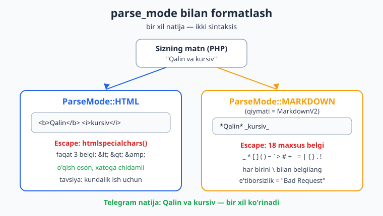
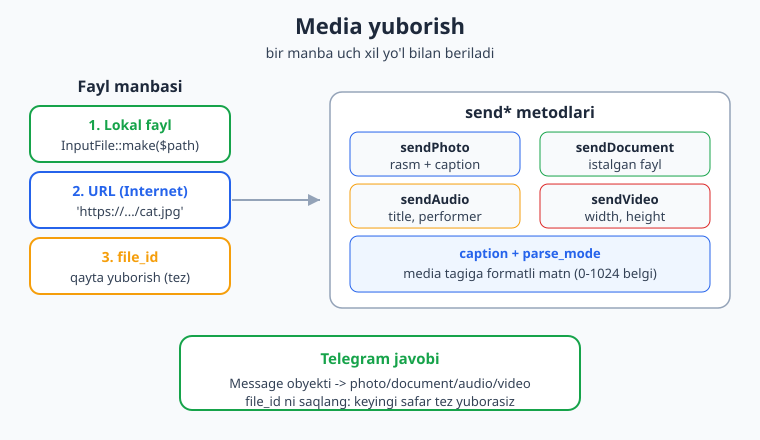
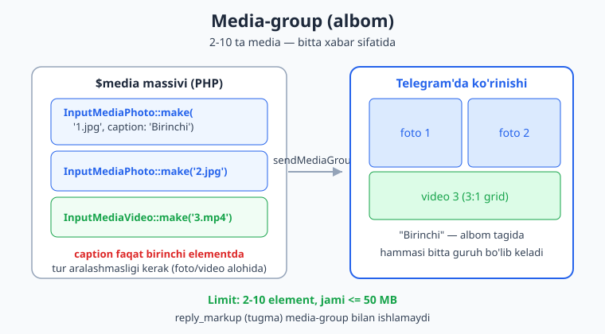

# 05 — Xabar yuborish, formatlash va media

[⬅️ Oldingi: 04 — Filtrlar va buyruqlar](./04-filtrlar-buyruqlar.md) · [🏠 README](./README.md) · [Keyingi: 06 — Klaviaturalar: reply va inline ➡️](./06-klaviaturalar.md)

---

> **Bu bobda:** botingiz oddiy matn yuborishdan chiroyli, formatlangan va media-boy xabarlarga o'tadi. `sendMessage` ning to'liq imkoniyatlarini, `parse_mode` orqali **HTML** va **MarkdownV2** formatlashni, maxsus belgilarni xavfsiz **escape** qilishni o'rganamiz. So'ng rasm, hujjat, audio va video yuborishni (`sendPhoto`, `sendDocument`, `sendAudio`, `sendVideo`), fayl manbalarini (`InputFile::make`, URL, `file_id`), **caption** (media tagidagi matn), bir necha medianing **albomi** (`sendMediaGroup`), hamda xabarga **javob berish** (`reply_to_message_id`), **forward** va **copy** qilishni ko'rib chiqamiz.
>
> **Halol eslatma:** bu bobdagi bot mantig'i — handlerlar, escape funksiyalari, media va albom qurish — `Nutgram::fake()` (FakeNutgram) yordamida **offline** sinab ko'rilgan (`assertReply` / `assertRaw` / `assertCalled`); test fayli 11 ta tekshiruv, 38 ta assertion bilan o'tdi. Jonli qism — xabarning real Telegram'ga yetib borishi, rasmning haqiqiy ko'rinishi — faqat ishlayotgan token va internetda namoyon bo'ladi; uni "ishladi" deb soxtalashtirmaymiz, balki tushuntirish sifatida beramiz.

---

## sendMessage: shunchaki matndan ko'proq

3-bobda biz `$bot->sendMessage('Salom')` ni ko'rgandik. Aslida bu metod ko'plab ixtiyoriy parametrlarga ega. Nutgram'da uning imzosi (eng muhim qismlari) shunday:

```php
$bot->sendMessage(
    string $text,                 // 1-o'rinda — yuboriladigan matn
    string|int|null $chat_id = null,   // kimga (handler ichida avtomatik)
    ParseMode|string|null $parse_mode = null,  // HTML / MarkdownV2
    ?bool $disable_notification = null,        // ovozsiz xabar
    ?bool $protect_content = null,             // nusxalash/forward'ni taqiqlash
    ?int $reply_to_message_id = null,          // qaysi xabarga javob
    InlineKeyboardMarkup|ReplyKeyboardMarkup|... $reply_markup = null, // tugmalar
    // ... va boshqalar
);
```

Diqqat qiladigan ikki narsa:

1. **`$text` birinchi argument**, `$chat_id` ikkinchi. Handler ichida `$chat_id` ni berishingiz shart emas — Nutgram joriy chatdan avtomatik oladi (3-bobda ko'rgan "ergonomika"). Tashqarida (masalan, cron yoki broadcast'da) chat_id ni aniq berasiz.
2. Argumentlar ko'p, shuning uchun **nomli argumentlar** (PHP 8.0+) eng aniq usul:

```php
$bot->onCommand('start', function (Nutgram $bot) {
    $bot->sendMessage(
        text: 'Botga xush kelibsiz!',
        disable_notification: true,   // foydalanuvchini bezovta qilmasdan
    );
});
```

Tashqi joydan aniq chat'ga yuborish (masalan, admin'ga xabar):

```php
$adminId = 123456789;
$bot->sendMessage(text: 'Yangi buyurtma keldi', chat_id: $adminId);
```

> PHP'ning nomli argumentlari haqida eslatma: ular tartibni emas, **nom**ni ishlatadi, shuning uchun faqat kerakli parametrlarni berib, qolganini sukut bo'yicha qoldirasiz. Bu Telegram API'sining o'nlab ixtiyoriy maydonlari bilan ishlashda hayot qutqaradi. (PHP asoslari kerak bo'lsa: [../php/README.md](../php/README.md).)

`protect_content: true` — xabarni boshqa joyga forward qilish va nusxalashni o'chiradi (pullik kontent yoki maxfiy ma'lumot uchun foydali).

## parse_mode: matnni chiroyli qilish

Sukut bo'yicha Telegram matnni "tekis" (oddiy) ko'rsatadi. Qalin, kursiv, havola yoki kod bloki kerak bo'lsa — `parse_mode` ni belgilaysiz. Nutgram bu uchun **enum** beradi:

```php
use SergiX44\Nutgram\Telegram\Properties\ParseMode;

ParseMode::HTML            // qiymati: "HTML"
ParseMode::MARKDOWN        // qiymati: "MarkdownV2"  (eng yangi Markdown)
ParseMode::MARKDOWN_LEGACY // qiymati: "Markdown"    (eski, ishlatmang)
```

**Muhim nozik nuqta:** `ParseMode::MARKDOWN` aslida Telegram'ning **MarkdownV2** rejimini bildiradi (uning `value` qiymati aniq `"MarkdownV2"`). Eski "Markdown" (V1) cheklangan va eskirgan — yangi loyihada uni ishlatmang. Bu kichik tafsilotni bilmaslik ko'p chalkashlikka olib keladi, shuning uchun bobda biz uni aniqlab oldik.



### HTML rejimi (tavsiya etilgan)

HTML — eng o'qish oson va eng kam xatoga olib keladigan rejim. Telegram qo'llab-quvvatlaydigan teglar cheklangan to'plam: `<b>`, `<i>`, `<u>`, `<s>`, `<code>`, `<pre>`, `<a href="...">`, `<span class="tg-spoiler">`, `<blockquote>` va boshqalar.

```php
$bot->onCommand('html_demo', function (Nutgram $bot) {
    $bot->sendMessage(
        text: "<b>Qalin</b>, <i>kursiv</i>, <u>tagchiziq</u>\n"
            . "<code>monospace kod</code>\n"
            . "<a href=\"https://core.telegram.org\">Havola</a>\n"
            . "<span class=\"tg-spoiler\">yashirin matn</span>",
        parse_mode: ParseMode::HTML,
    );
});
```

Kod blokini sintaksis bilan ko'rsatish (`pre` + `code` + til):

```php
$bot->sendMessage(
    text: "<pre><code class=\"language-php\">echo 'Salom';</code></pre>",
    parse_mode: ParseMode::HTML,
);
```

### MarkdownV2 rejimi

MarkdownV2 yengilroq ko'rinadi, lekin **escape qoidalari qattiq** — pastda ko'ramiz.

```php
$bot->onCommand('md_demo', function (Nutgram $bot) {
    $bot->sendMessage(
        text: "*Qalin*, _kursiv_, __tagchiziq__\n"
            . "`monospace kod`\n"
            . "[Havola](https://core.telegram.org)\n"
            . "||yashirin matn||",
        parse_mode: ParseMode::MARKDOWN,
    );
});
```

## Maxsus belgilarni escape qilish (eng muhim ko'nikma)

Bu — yangi botchilar eng ko'p qoqiladigan joy. Agar matningiz ichida format belgisi (`<`, `_`, `*`, `.` va h.k.) "tasodifan" bo'lsa va siz uni escape qilmasangiz, Telegram xatolikka uchraydi (`Bad Request: can't parse entities`) yoki matn buzilib ko'rinadi.

**Asosiy qoida:** o'zgaruvchidan (foydalanuvchi ismi, mahsulot nomi, baza qiymati) kelgan **har qanday matnni** formatga qo'shishdan oldin escape qiling. O'zingiz yozgan teglarni emas — faqat "ishonchsiz" qiymatlarni.

### HTML uchun escape

HTML'da atigi **3 ta** belgi xavfli: `<`, `>`, `&`. PHP'ning o'rnatilgan funksiyasi aynan shu ish uchun:

```php
function htmlEscape(string $text): string
{
    return htmlspecialchars($text, ENT_QUOTES | ENT_HTML5, 'UTF-8');
}

// Foydalanish:
$name = $bot->user()?->first_name ?? 'mehmon';   // foydalanuvchi nomi — ishonchsiz
$bot->sendMessage(
    text: '<b>Salom, ' . htmlEscape($name) . '!</b>',
    parse_mode: ParseMode::HTML,
);
```

Agar `$name` ichida `<script>` bo'lsa ham, `htmlspecialchars` uni `&lt;script&gt;` ga aylantiradi — format buzilmaydi va hech qanday "in'eksiya" bo'lmaydi.

### MarkdownV2 uchun escape

MarkdownV2'da **18 ta** belgi maxsus hisoblanadi va `\` bilan oldindan belgilanishi shart:

```
_  *  [  ]  (  )  ~  `  >  #  +  -  =  |  {  }  .  !
```

Telegram'ning o'zi shu ro'yxatni rasmiy hujjatda beradi. Funksiya:

```php
function md2Escape(string $text): string
{
    $special = ['_', '*', '[', ']', '(', ')', '~', '`', '>',
                '#', '+', '-', '=', '|', '{', '}', '.', '!'];
    foreach ($special as $ch) {
        $text = str_replace($ch, '\\' . $ch, $text);
    }
    return $text;
}

// Foydalanish (e'tibor bering: 5.000 dagi nuqta ham escape bo'ladi):
$narx = '5.000 so\'m (chegirma!)';
$bot->sendMessage(
    text: '*Narx:* ' . md2Escape($narx),
    parse_mode: ParseMode::MARKDOWN,
);
// Yuboriladi: *Narx:* 5\.000 so'm \(chegirma\!\)
```

> **Diqqat:** escape qilingan matnni **format teglari ichida** ishlating — masalan `*Narx:*` qismi (format) escape qilinmaydi, lekin `$narx` (ma'lumot) qilinadi. Hammasini aralashtirib escape qilsangiz, qalin/kursiv ham ishlamay qoladi. Shu nozikligi tufayli amaliyotda **HTML rejimi ko'pincha qulayroq**: bitta `htmlspecialchars` chaqiruvi yetadi.

### Qaysisini tanlash?

| Mezon | HTML | MarkdownV2 |
|---|---|---|
| Escape belgilari | 3 ta (`< > &`) | 18 ta |
| O'qish/tahrirlash | Oson | Tig'iz |
| Xatoga chidamlilik | Yuqori | Past (har nuqta muhim) |
| Til sintaksisi (kod bloki) | `class="language-php"` | ` ```php ` |
| Tavsiya | **Kundalik ish** | Ixcham, oddiy matnlar |

Bu kitobda biz keyingi boblarda asosan **HTML** ishlatamiz.

## Rasm yuborish: sendPhoto

Endi mediaga o'tamiz. Eng oddiy — rasm:

```php
$bot->onCommand('rasm', function (Nutgram $bot) {
    $bot->sendPhoto(
        photo: 'https://placekitten.com/600/400',  // URL orqali
        caption: '<b>Mana mushuk!</b>',
        parse_mode: ParseMode::HTML,
    );
});
```

`caption` — rasm tagidagi matn (0-1024 belgi). Unga ham `parse_mode` qo'llanadi, demak escape qoidalari xuddi `sendMessage` dagidek.

## Fayl manbalari: URL, file_id va InputFile

Telegram'ga media uch xil yo'l bilan beriladi:



**1. URL** — internetdagi ochiq havola. Telegram o'zi yuklab oladi:

```php
$bot->sendPhoto(photo: 'https://example.com/banner.jpg');
```

**2. `file_id`** — Telegram'ga avval yuborilgan faylning identifikatori. Bir marta yuborganingizdan keyin javobdagi `file_id` ni saqlab qo'ysangiz, **keyingi safar internetga yuklamasdan, darhol** qayta yuborasiz. Eng tez usul:

```php
// Avval yuborilgan rasmning file_id sini bazadan oldik
$savedFileId = 'AgACAgIAAxkBAA...';   // misol qiymat
$bot->sendPhoto(photo: $savedFileId);
```

**3. Lokal fayl** — serveringizdagi fayl. Buning uchun `InputFile::make()` ishlatamiz:

```php
use SergiX44\Nutgram\Telegram\Types\Internal\InputFile;

$bot->sendPhoto(
    photo: InputFile::make(__DIR__ . '/rasmlar/banner.jpg'),
    caption: 'Lokal fayldan yuborildi',
);
```

> **Namespace eslatmasi:** `InputFile` aniq `SergiX44\Nutgram\Telegram\Types\Internal` ichida joylashgan. IDE'da avtomatik import yoki yuqoridagi `use` bilan qo'shing. `InputFile::make($path)` faylni ochib, multipart yuklash uchun tayyorlaydi.

`InputFile::make()` ikkinchi argument — fayl nomi (`filename`) ham qabul qiladi, agar Telegram'da boshqa nom ko'rsatmoqchi bo'lsangiz:

```php
$bot->sendDocument(
    document: InputFile::make($tmpPath, 'hisobot-2026.pdf'),
);
```

## Hujjat, audio va video

Boshqa media metodlari xuddi shu naqsh bo'yicha ishlaydi — birinchi argument media, keyin caption va boshqalar.

**Hujjat** (istalgan fayl turi — pdf, zip, docx ...):

```php
$bot->onCommand('hisobot', function (Nutgram $bot) {
    $path = __DIR__ . '/files/hisobot.pdf';
    $bot->sendDocument(
        document: InputFile::make($path),
        caption: 'Oylik hisobot tayyor',
    );
});
```

**Audio** (musiqa sifatida, ijro qiluvchi bilan):

```php
$bot->sendAudio(
    audio: InputFile::make(__DIR__ . '/song.mp3'),
    title: 'Qo\'shiq nomi',
    performer: 'Ijrochi',
    duration: 210,   // soniyada (ixtiyoriy)
);
```

**Video**:

```php
$bot->sendVideo(
    video: 'https://example.com/clip.mp4',
    caption: 'Yangi video',
    width: 1280,
    height: 720,
    supports_streaming: true,   // brauzerda oqim sifatida ko'rinadi
);
```

> **`sendDocument` vs `sendAudio`/`sendVideo` farqi:** `sendDocument` faylni "biriktirma" sifatida (ichki pleer yo'q) yuboradi; `sendAudio`/`sendVideo` esa Telegram ichida o'ynaydigan pleer beradi. Bir xil mp3'ni hujjat sifatida ham, audio sifatida ham yuborish mumkin — maqsadingizga qarab tanlang.

## Caption va parse_mode birgalikda

Har bir media metodida `caption` + `parse_mode` ishlaydi, demak escape qoidalari aynan bir xil:

```php
$mahsulotNomi = $row['name'];   // bazadan — ishonchsiz
$bot->sendPhoto(
    photo: $row['photo_url'],
    caption: '<b>' . htmlEscape($mahsulotNomi) . '</b>' . "\n"
           . 'Narx: ' . htmlEscape($row['price']) . ' so\'m',
    parse_mode: ParseMode::HTML,
);
```

## Albom: bir necha mediani birga yuborish (sendMediaGroup)

Bir nechta rasm yoki videoni **bitta guruh** (albom) bo'lib yuborish uchun `sendMediaGroup` ishlatiladi. U `InputMedia*` obyektlari massivini qabul qiladi.



```php
use SergiX44\Nutgram\Telegram\Types\Input\InputMediaPhoto;
use SergiX44\Nutgram\Telegram\Types\Input\InputMediaVideo;

$bot->onCommand('albom', function (Nutgram $bot) {
    $bot->sendMediaGroup(media: [
        InputMediaPhoto::make('https://example.com/1.jpg', caption: 'Bizning mahsulotlar'),
        InputMediaPhoto::make('https://example.com/2.jpg'),
        InputMediaVideo::make('https://example.com/demo.mp4'),
    ]);
});
```

Albom qoidalari (ularni bilmaslik xatolarga olib keladi):

- **2 dan 10 gacha** element. Bittadan kam yoki o'ndan ko'p bo'lsa, xato.
- **`caption` faqat birinchi** elementga qo'yiladi — u butun albom tagida ko'rinadi. Boshqalariga caption yozsangiz ham, Telegram odatda faqat birinchisini ko'rsatadi.
- Foto va video bitta albomda **aralashishi** mumkin, lekin hujjat/audio ularga **aralashmaydi** — `InputMediaDocument` lar alohida albom, `InputMediaAudio` lar alohida albom bo'ladi.
- **`reply_markup` (tugmalar) media-group bilan ishlamaydi** — Telegram API'si bunga ruxsat bermaydi.
- Lokal fayllar uchun ham `InputFile::make()`:

```php
InputMediaPhoto::make(InputFile::make(__DIR__ . '/photos/a.jpg'), caption: 'Birinchi'),
```

## Xabarga javob berish: reply

Foydalanuvchining aynan o'sha xabariga "javob" (reply) ulab yuborish uchun `reply_to_message_id` ni bering. Joriy xabar ID'sini `$bot->messageId()` qaytaradi:

```php
$bot->onCommand('javob', function (Nutgram $bot) {
    $bot->sendMessage(
        text: 'Bu — sizning xabaringizga javob.',
        reply_to_message_id: $bot->messageId(),
    );
});
```

Telegram'da bu xabar foydalanuvchining xabariga "tortilgan" (quote) holda ko'rinadi — guruhlarda kim nimaga javob berayotgani aniq bo'ladi.

## Forward va copy: boshqa chatdagi xabarni uzatish

Ba'zan tayyor xabarni boshqa chatga uzatish kerak. Ikki usul bor:

**`forwardMessage`** — "Forwarded from ..." yorlig'i bilan, asl muallifni ko'rsatib uzatadi:

```php
$bot->forwardMessage(
    chat_id: $maqsadChatId,       // qayerga
    from_chat_id: $manbaChatId,   // qayerdan
    message_id: $xabarId,         // qaysi xabar
);
```

**`copyMessage`** — xabar mazmunini **nusxalaydi**, lekin "forward" yorlig'isiz, go'yo yangi xabardek. Bunda hatto caption'ni qayta yozish ham mumkin:

```php
$bot->copyMessage(
    chat_id: $maqsadChatId,
    from_chat_id: $manbaChatId,
    message_id: $xabarId,
    caption: 'Yangilangan izoh',   // ixtiyoriy — original caption o'rniga
);
```

Farqi: `forwardMessage` manbani oshkor qiladi va asl tartibni saqlaydi; `copyMessage` esa "toza" nusxa — broadcast yoki kanaldan kanalga ko'chirishda ko'p ishlatiladi.

## Offline tekshiruv: FakeNutgram bilan

Yuqoridagi mantiqni jonli token bo'lmasa ham sinab ko'rsa bo'ladi. `Nutgram::fake()` haqiqiy HTTP so'rovlarni emas, balki ularni **yozib boradigan** soxta bot beradi; keyin `assertReply` / `assertRaw` bilan tekshiramiz. (To'liqroq — 16-bobda.)

```php
use SergiX44\Nutgram\Nutgram;
use SergiX44\Nutgram\Telegram\Properties\ParseMode;

$bot = Nutgram::fake();

$bot->onCommand('rasm', function (Nutgram $bot) {
    $bot->sendPhoto(
        photo: 'https://example.com/cat.jpg',
        caption: '<b>Mushuk</b>',
        parse_mode: ParseMode::HTML,
    );
});

$bot->hearText('/rasm')->reply();

// Bot aynan sendPhoto ni shu parametrlar bilan chaqirganini tasdiqlaymiz:
$bot->assertReply('sendPhoto', [
    'photo'      => 'https://example.com/cat.jpg',
    'caption'    => '<b>Mushuk</b>',
    'parse_mode' => 'HTML',
]);
```

`assertReply` ikkinchi argument — kutilgan parametrlarning **qism to'plami** (subset); siz faqat e'tibor beradigan maydonlarni yozasiz. Murakkabroq tanani (masalan, albom JSON'ini) tekshirish uchun `assertRaw` so'rov tanasiga to'g'ridan-to'g'ri kirish beradi:

```php
$bot->assertRaw(function ($request) {
    $body = (string) $request->getBody();
    // media massivi JSON sifatida tanada bo'lishi kerak
    return str_contains($body, '"type":"document"');
});
```

> Bu bobning kodi aynan shunday testlar bilan tekshirildi (`assertReply`, `assertRaw`, `assertCalled`; jami 11 test / 38 assertion o'tdi). Demak handler mantig'i, escape funksiyalari va media qurish **haqiqatan ishlaydi**. Faqat xabarning real Telegram'ga yetib borishi va vizual ko'rinishi jonli muhitda tasdiqlanadi.

## Mashqlar

### Oson

1. `/qalin` buyrug'iga javoban HTML rejimida `Bu matn qalin` (qalin holatda) yuboruvchi handler yozing.
2. Foydalanuvchi `first_name` ini olib, `Salom, <ism>!` deb HTML rejimida xavfsiz (escape qilingan) yuboruvchi handler yozing.
3. `htmlEscape` funksiyasini yozing va `<a>tegli</a> matn` qatorini undan o'tkazib, natijani izohda yozing.
4. URL orqali bitta rasm yuboruvchi `/rasm` handlerini yozing (caption'siz).
5. `ParseMode::MARKDOWN` enum'ining `value` qiymati nima ekanini ayting va nega "Markdown" emasligini tushuntiring.
6. `sendMessage` da `disable_notification: true` nima qiladi — bir jumlada yozing.

### O'rta

1. `md2Escape` funksiyasini yozing va `Narx: 5.000 (aksiya!)` qatorini escape qiling. Natijada qaysi belgilar `\` oldi bilan chiqishini ko'rsating.
2. Lokal `hisobot.pdf` faylini `InputFile::make` orqali, "Oylik hisobot" caption'i bilan yuboruvchi handler yozing.
3. Bitta mp3'ni avval `sendAudio` (title + performer bilan), keyin xuddi shu faylni `sendDocument` bilan yuboruvchi ikki handler yozing va farqini izohlang.
4. Uchta rasm va bitta videodan iborat albomni `sendMediaGroup` bilan yuboring; caption faqat birinchi rasmda bo'lsin.
5. `/javob` buyrug'iga foydalanuvchining o'sha xabariga reply qilib javob yozing (`reply_to_message_id`).
6. Bir xil matnni avval HTML, keyin MarkdownV2 rejimida yuboradigan `/ikki` handlerini yozing (ikkala natija bir xil ko'rinishi kerak).

### Qiyin

1. Mahsulot massivini (`name`, `price`, `photo_url`) qabul qilib, har biri uchun `sendPhoto` chaqiradigan, caption'ni HTML'da xavfsiz formatlovchi funksiya yozing. `name`/`price` — ishonchsiz, escape qiling.
2. `Nutgram::fake()` yordamida 4-mashqdagi albom kodini tekshiruvchi test yozing: `assertCalled('sendMediaGroup', 1)` va `assertRaw` bilan tanada barcha URL'lar borligini tasdiqlang.
3. `copyMessage` va `forwardMessage` farqini namoyish qiluvchi ikkita handler yozing; har birida qachon qaysi birini ishlatish kerakligini izohda yozing.
4. Universal `sendFormatted(Nutgram $bot, string $tpl, array $vars)` yordamchi funksiyasini yozing: `$tpl` ichidagi `{ism}` kabi o'rinbosarlarni `$vars` dagi (escape qilingan) qiymatlar bilan almashtirib, HTML rejimida yuborsin.

<details markdown="1"><summary>Yechimlar</summary>

### Oson

**1.**
```php
$bot->onCommand('qalin', fn (Nutgram $bot) => $bot->sendMessage(
    text: '<b>Bu matn qalin</b>',
    parse_mode: ParseMode::HTML,
));
```

**2.**
```php
$bot->onCommand('salom', function (Nutgram $bot) {
    $ism = $bot->user()?->first_name ?? 'mehmon';
    $bot->sendMessage(
        text: 'Salom, ' . htmlspecialchars($ism, ENT_QUOTES | ENT_HTML5, 'UTF-8') . '!',
        parse_mode: ParseMode::HTML,
    );
});
```

**3.** `htmlEscape('<a>tegli</a> matn')` natija: `&lt;a&gt;tegli&lt;/a&gt; matn`. Teglar matn sifatida ko'rsatiladi, format buzilmaydi.
```php
function htmlEscape(string $t): string {
    return htmlspecialchars($t, ENT_QUOTES | ENT_HTML5, 'UTF-8');
}
```

**4.**
```php
$bot->onCommand('rasm', fn (Nutgram $bot) => $bot->sendPhoto(
    photo: 'https://placekitten.com/600/400',
));
```

**5.** `ParseMode::MARKDOWN->value` aynan `"MarkdownV2"` ga teng. Bu — Telegram'ning yangi, to'liq Markdown rejimi. Eski "Markdown" (V1) `ParseMode::MARKDOWN_LEGACY` bo'lib, eskirgan va cheklangan; yangi loyihada ishlatilmaydi.

**6.** `disable_notification: true` — xabarni jimgina (ovoz/tebranishsiz) yetkazadi; foydalanuvchini bezovta qilmaydi.

### O'rta

**1.**
```php
echo md2Escape('Narx: 5.000 (aksiya!)');
// Natija: Narx: 5\.000 \(aksiya\!\)
// Escape bo'lgan belgilar: . ( ) !
```

**2.**
```php
$bot->onCommand('hisobot', fn (Nutgram $bot) => $bot->sendDocument(
    document: InputFile::make(__DIR__ . '/files/hisobot.pdf'),
    caption: 'Oylik hisobot',
));
```

**3.**
```php
$mp3 = __DIR__ . '/song.mp3';
$bot->onCommand('audio', fn (Nutgram $bot) => $bot->sendAudio(
    audio: InputFile::make($mp3), title: 'Qo\'shiq', performer: 'Ijrochi',
));
$bot->onCommand('fayl', fn (Nutgram $bot) => $bot->sendDocument(
    document: InputFile::make($mp3),
));
// sendAudio -> ichki pleer bilan musiqa; sendDocument -> oddiy biriktirma (pleersiz).
```

**4.**
```php
$bot->onCommand('albom', fn (Nutgram $bot) => $bot->sendMediaGroup(media: [
    InputMediaPhoto::make('https://example.com/1.jpg', caption: 'Bizning rasmlar'),
    InputMediaPhoto::make('https://example.com/2.jpg'),
    InputMediaPhoto::make('https://example.com/3.jpg'),
    InputMediaVideo::make('https://example.com/demo.mp4'),
]));
```

**5.**
```php
$bot->onCommand('javob', fn (Nutgram $bot) => $bot->sendMessage(
    text: 'Sizning xabaringizga javob.',
    reply_to_message_id: $bot->messageId(),
));
```

**6.**
```php
$bot->onCommand('ikki', function (Nutgram $bot) {
    $bot->sendMessage(text: '<b>Qalin</b> matn', parse_mode: ParseMode::HTML);
    $bot->sendMessage(text: '*Qalin* matn', parse_mode: ParseMode::MARKDOWN);
});
```

### Qiyin

**1.**
```php
function yuborMahsulotlar(Nutgram $bot, array $mahsulotlar): void
{
    $esc = fn (string $s) => htmlspecialchars($s, ENT_QUOTES | ENT_HTML5, 'UTF-8');
    foreach ($mahsulotlar as $m) {
        $bot->sendPhoto(
            photo: $m['photo_url'],
            caption: '<b>' . $esc($m['name']) . '</b>' . "\n"
                   . 'Narx: ' . $esc((string) $m['price']) . ' so\'m',
            parse_mode: ParseMode::HTML,
        );
    }
}
```

**2.**
```php
$bot = Nutgram::fake();
$bot->onCommand('albom', fn (Nutgram $b) => $b->sendMediaGroup(media: [
    InputMediaPhoto::make('https://example.com/1.jpg', caption: 'Rasmlar'),
    InputMediaPhoto::make('https://example.com/2.jpg'),
    InputMediaPhoto::make('https://example.com/3.jpg'),
    InputMediaVideo::make('https://example.com/demo.mp4'),
]));
$bot->hearText('/albom')->reply();

$bot->assertCalled('sendMediaGroup', 1);
$bot->assertRaw(function ($request) {
    $body = (string) $request->getBody();
    return str_contains($body, '1.jpg')
        && str_contains($body, '2.jpg')
        && str_contains($body, 'demo.mp4');
});
```

**3.**
```php
// forwardMessage — manbani oshkor qiladi ("Forwarded from ..."). Asl muallifni
// ko'rsatish kerak bo'lganda (masalan, e'lonni qayta tarqatish) ishlatiladi.
$bot->onCommand('uzat', fn (Nutgram $bot) => $bot->forwardMessage(
    chat_id: $bot->chatId(), from_chat_id: $bot->chatId(), message_id: 100,
));

// copyMessage — "toza" nusxa, forward yorlig'isiz. Broadcast yoki kanaldan
// kanalga ko'chirishda, manbani yashirish kerak bo'lganda ishlatiladi.
$bot->onCommand('nusxa', fn (Nutgram $bot) => $bot->copyMessage(
    chat_id: $bot->chatId(), from_chat_id: $bot->chatId(), message_id: 100,
    caption: 'Yangi izoh',
));
```

**4.**
```php
function sendFormatted(Nutgram $bot, string $tpl, array $vars): void
{
    $esc = fn (string $s) => htmlspecialchars($s, ENT_QUOTES | ENT_HTML5, 'UTF-8');
    $text = $tpl;
    foreach ($vars as $key => $val) {
        $text = str_replace('{' . $key . '}', $esc((string) $val), $text);
    }
    $bot->sendMessage(text: $text, parse_mode: ParseMode::HTML);
}

// Foydalanish:
sendFormatted($bot, '<b>Salom, {ism}!</b> Balans: {balans} so\'m', [
    'ism'    => $bot->user()?->first_name ?? 'mehmon',
    'balans' => '10.000',
]);
```

</details>

---

[⬅️ Oldingi: 04 — Filtrlar va buyruqlar](./04-filtrlar-buyruqlar.md) · [🏠 README](./README.md) · [Keyingi: 06 — Klaviaturalar: reply va inline ➡️](./06-klaviaturalar.md)
