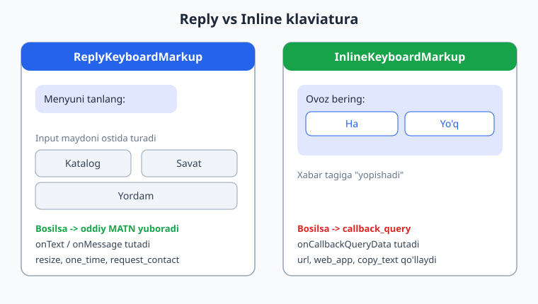
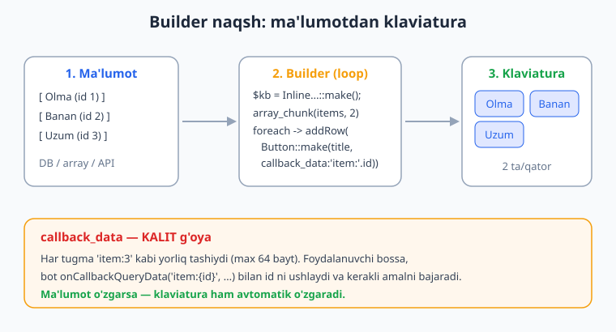
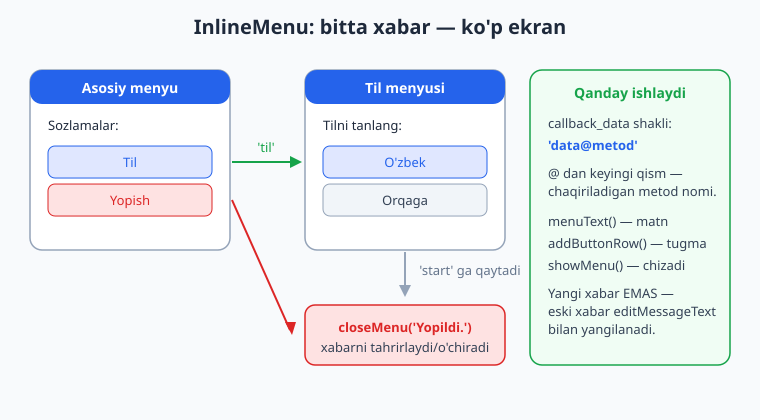

# 06 — Klaviaturalar: reply va inline

[⬅️ Oldingi: 05 — Xabar yuborish, formatlash va media](./05-xabar-formatlash-media.md) · [🏠 README](./README.md) · [Keyingi: 07 — Callback query va inline rejim ➡️](./07-callback-inline.md)

---

> **Bu bobda:** Telegram botini chinakam "tugmali" qiladigan ikki turdagi klaviatura bilan tanishamiz. Avval **reply klaviatura** (`ReplyKeyboardMarkup`) — input maydon ostida turuvchi, bosilganda oddiy matn yuboruvchi tugmalar; `resize_keyboard`, `one_time_keyboard`, `input_field_placeholder`, hamda `request_contact` / `request_location` orqali telefon raqami va joylashuvni so'rash. Keyin **inline klaviatura** (`InlineKeyboardMarkup`) — xabarning o'ziga "yopishgan", bosilganda `callback_query` yuboruvchi tugmalar; `callback_data`, `url`, `web_app`, `copy_text` variantlari. So'ngra ma'lumotdan dinamik klaviatura quruvchi **builder naqsh** (loop + `array_chunk`), Nutgram'ning tayyor **`InlineMenu`** klassi bilan ko'p ekranli menyu (bitta xabarni tahrirlab navigatsiya), klaviaturani **`ReplyKeyboardRemove`** bilan olib tashlash va nihoyat **inline'mi yoki reply'mi** degan tanlovni qachon qanday qilish kerakligi. Bobdagi barcha klaviatura qurish va handler mantig'i offline `FakeNutgram` bilan haqiqatan tekshirilgan (19 ta tekshiruv o'tdi). Tugmalarning Telegram ilovasida real ko'rinishi, bosilishi va `request_contact` orqali raqam kelishi — bu jonli qism, faqat illustrativ ekranlar bilan ko'rsatilgan.

---

## Klaviatura nima va nega kerak

Boshlovchi bot odatda foydalanuvchidan komandalar (`/start`, `/help`) yoki erkin matn kutadi. Bu noqulay: foydalanuvchi qaysi komanda borligini eslab qolishi, to'g'ri yozishi kerak. **Klaviatura** esa tayyor tugmalarni ko'rsatadi — foydalanuvchi shunchaki bosadi.

Telegram'da ikki xil klaviatura bor va ular butunlay boshqacha ishlaydi:



| | **Reply klaviatura** | **Inline klaviatura** |
|---|---|---|
| Sinf | `ReplyKeyboardMarkup` | `InlineKeyboardMarkup` |
| Qayerda turadi | Input maydon o'rnida (pastda) | Xabarning o'zi tagida |
| Bosilganda | Oddiy **matn** yuboradi | **`callback_query`** yuboradi (matn emas) |
| Bot qanday tutadi | `onText` / `onMessage` | `onCallbackQuery` / `onCallbackQueryData` |
| Tugmaga URL/Web App | yo'q (faqat `web_app`, `request_*`) | bor (`url`, `web_app`, `copy_text`) |
| Tahrirlash | yo'q (yangi xabar kerak) | bor (`editMessageText` bilan o'sha xabarni) |

Eng oson farqlash usuli: **reply tugmasini bossang — go'yo o'sha matnni o'zing yozgandek bo'ladi**. Inline tugmasini bossang — chatga hech narsa yozilmaydi, bot maxfiy "signal" (callback) oladi.

Bu bob ikkalasini ham chuqur ko'radi. Callback'larni *ushlash* va ularga javob berish (`answerCallbackQuery`, inline rejim) keyingi — [07-bob](./07-callback-inline.md)ning to'liq mavzusi; bu yerda biz asosan klaviaturani **qurish**ga e'tibor beramiz.

---

## Reply klaviatura: `ReplyKeyboardMarkup`

Eng sodda misol — uchta tugmali menyu. Klaviaturani `reply_markup` argumenti orqali xabar bilan birga yuboramiz.

```php
<?php
use SergiX44\Nutgram\Nutgram;
use SergiX44\Nutgram\Telegram\Types\Keyboard\ReplyKeyboardMarkup;
use SergiX44\Nutgram\Telegram\Types\Keyboard\KeyboardButton;

$bot->onCommand('menyu', function (Nutgram $bot) {
    $keyboard = ReplyKeyboardMarkup::make(
        resize_keyboard: true,        // tugmalar ekranga moslab kichrayadi
        one_time_keyboard: true,      // bir marta bosilgach yashirinadi
        input_field_placeholder: 'Bo\'limni tanlang...',
    )
        ->addRow(
            KeyboardButton::make('Katalog'),
            KeyboardButton::make('Savat'),
        )
        ->addRow(
            KeyboardButton::make('Yordam'),
        );

    $bot->sendMessage('Quyidagidan birini tanlang:', reply_markup: $keyboard);
});
```

Bu yerda nima bo'lyapti:

- **`ReplyKeyboardMarkup::make(...)`** — klaviatura obyektini yaratadi. Argumentlar (barchasi ixtiyoriy, nomli argument bilan beriladi):
  - **`resize_keyboard: true`** — deyarli **doim** `true` qiling. Aks holda tugmalar telefonning butun pastki yarmini egallaydi. `true` bo'lsa, qatorlar soniga qarab ixcham bo'ladi.
  - **`one_time_keyboard: true`** — foydalanuvchi bitta tugma bosgach klaviatura yashirinadi (lekin yo'qolmaydi — input yonidagi belgidan qayta chaqirsa bo'ladi). "Bir martalik" tanlovlar uchun qulay.
  - **`input_field_placeholder`** — input maydonida ko'rinadigan "kulrang" maslahat matni (1–64 belgi).
  - **`is_persistent: true`** — klaviaturani doim ko'rsatib turish (`one_time`'ning teskarisi).
  - **`selective: true`** — guruhda klaviaturani faqat tegishli foydalanuvchilarga ko'rsatish.
- **`->addRow(...)`** — bitta **qator** tugma qo'shadi. Argument sifatida nechta `KeyboardButton` bersangiz, shuncha tugma bir qatorga joylashadi. Har bir `addRow` chaqiruvi yangi qator.
- **`KeyboardButton::make('Matn')`** — bitta tugma. Eng oddiy holatda — faqat matn. (Telegram matnning o'zini `string` sifatida ham qabul qiladi, lekin `KeyboardButton::make` aniqroq va qo'shimcha xususiyatlar uchun kerak.)

Foydalanuvchi `Katalog` tugmasini bosganda, botga aynan `Katalog` degan **matn** keladi. Demak, uni `onText` bilan tutamiz:

```php
$bot->onText('Katalog', function (Nutgram $bot) {
    $bot->sendMessage('Mana katalogimiz: ...');
});

$bot->onText('Yordam', function (Nutgram $bot) {
    $bot->sendMessage('Yordam: /start, /menyu, /help');
});
```

> **Eslatma:** `onText` matnni regex sifatida ham qabul qiladi. Aniq moslik uchun anchor ishlating: `onText('^Katalog$', ...)`. Aks holda `Katalog haqida` kabi matnlar ham mos kelib qolishi mumkin.

### `KeyboardButton` qatorlarini moslashtirish

`addRow` har safar yangi qator ochishini esda tuting. Layoutni shunday boshqarasiz:

```php
$keyboard = ReplyKeyboardMarkup::make(resize_keyboard: true)
    ->addRow(KeyboardButton::make('A'), KeyboardButton::make('B'), KeyboardButton::make('C')) // 3 ta yonma-yon
    ->addRow(KeyboardButton::make('Orqaga'));                                                  // 1 ta keng tugma
```

Natijada birinchi qatorda 3 ta kichik tugma, ikkinchi qatorda 1 ta keng tugma bo'ladi.

---

## Telefon raqami va joylashuvni so'rash

Reply tugmalarning maxsus kuchi — foydalanuvchidan **kontakt** (telefon raqami) va **joylashuv**ni bitta bosishda so'rash. Bu inline tugmada mumkin emas.

```php
<?php
use SergiX44\Nutgram\Nutgram;
use SergiX44\Nutgram\Telegram\Types\Keyboard\ReplyKeyboardMarkup;
use SergiX44\Nutgram\Telegram\Types\Keyboard\KeyboardButton;

$bot->onCommand('aloqa', function (Nutgram $bot) {
    $keyboard = ReplyKeyboardMarkup::make(resize_keyboard: true, one_time_keyboard: true)
        ->addRow(KeyboardButton::make('Raqamni yuborish', request_contact: true))
        ->addRow(KeyboardButton::make('Joylashuvni yuborish', request_location: true));

    $bot->sendMessage(
        'Buyurtmani rasmiylashtirish uchun raqamingiz va manzilingiz kerak:',
        reply_markup: $keyboard,
    );
});
```

- **`request_contact: true`** — foydalanuvchi bosganda Telegram "Raqamingizni ulashasizmi?" deb so'raydi. Rozi bo'lsa, botga `contact` obyekti keladi.
- **`request_location: true`** — xuddi shunday, lekin GPS joylashuv so'raydi.

> **Muhim:** bu ikki tugma **faqat shaxsiy chatda** (private) ishlaydi, guruhda emas. Va albatta `request_contact`/`request_location` natijasi — bu foydalanuvchining roziligiga bog'liq, majburlab bo'lmaydi.

Kelgan kontaktni `onMessage` ichida `$bot->message()->contact` orqali o'qiymiz:

```php
$bot->onMessage(function (Nutgram $bot) {
    $contact = $bot->message()?->contact;
    if ($contact !== null) {
        $phone = $contact->phone_number;
        $bot->sendMessage("Rahmat! Raqamingiz: {$phone}");
        // bu yerda raqamni DB'ga saqlash mumkin (10-bob)
    }

    $location = $bot->message()?->location;
    if ($location !== null) {
        $bot->sendMessage("Joylashuv qabul qilindi: {$location->latitude}, {$location->longitude}");
    }
});
```

Kontakt/joylashuv kelishini real Telegram ilovasida tekshirish kerak — bu **jonli qism** (bu yerda kod va mantiq to'g'ri, ammo raqamni haqiqatda yuborish uchun haqiqiy qurilma lozim).

---

## Klaviaturani olib tashlash: `ReplyKeyboardRemove`

Reply klaviatura bir marta ko'rsatilgach, **yangi klaviatura yuborilmaguncha yoki maxsus olib tashlanmaguncha** ekranda qoladi. Uni yashirish uchun `ReplyKeyboardRemove` yuboramiz:

```php
<?php
use SergiX44\Nutgram\Nutgram;
use SergiX44\Nutgram\Telegram\Types\Keyboard\ReplyKeyboardRemove;

$bot->onText('Yopish', function (Nutgram $bot) {
    $bot->sendMessage(
        'Menyu yopildi. Qayta ochish uchun /menyu yuboring.',
        reply_markup: ReplyKeyboardRemove::make(true),
    );
});
```

- **`ReplyKeyboardRemove::make(true)`** — `remove_keyboard` argumenti **majburiy** va `true` bo'lishi kerak. Bu Telegram'ga "joriy reply klaviaturani olib tashla" deb aytadi.
- Olib tashlash ham xabar bilan birga yuboriladi — ya'ni "klaviaturasiz" bir xabar jo'natib, eski tugmalarni yo'qotamiz.

> **Diqqat:** `ReplyKeyboardRemove` faqat **reply** klaviaturaga ta'sir qiladi. Inline klaviaturani olib tashlash boshqacha — xabarni `editMessageReplyMarkup` bilan tahrirlash yoki bo'sh klaviatura berish orqali (buni quyida va 07-bobda ko'ramiz).

---

## Inline klaviatura: `InlineKeyboardMarkup`

Inline klaviatura xabarning o'ziga "yopishadi" va bosilganda chatga hech narsa yozmaydi — buning o'rniga botga `callback_query` yuboradi. Bu sizga interaktiv interfeys (ovoz berish, sahifalash, sozlamalar) qurish imkonini beradi.

```php
<?php
use SergiX44\Nutgram\Nutgram;
use SergiX44\Nutgram\Telegram\Types\Keyboard\InlineKeyboardMarkup;
use SergiX44\Nutgram\Telegram\Types\Keyboard\InlineKeyboardButton;

$bot->onCommand('ovoz', function (Nutgram $bot) {
    $keyboard = InlineKeyboardMarkup::make()
        ->addRow(
            InlineKeyboardButton::make('Ha 👍', callback_data: 'vote:yes'),
            InlineKeyboardButton::make('Yo\'q 👎', callback_data: 'vote:no'),
        )
        ->addRow(
            InlineKeyboardButton::make('Saytimiz', url: 'https://ioqil.uz'),
        );

    $bot->sendMessage('Loyihani yoqtirdingizmi?', reply_markup: $keyboard);
});
```

Inline tugmalarning turlari (`InlineKeyboardButton::make` argumentlari — har tugmada **bittasi** ishlatiladi):

- **`callback_data: 'vote:yes'`** — eng ko'p ishlatiladigan. Bosilganda shu satr botga callback sifatida qaytadi. **Maksimum 64 bayt!** Shuning uchun qisqa "kod" saqlang (masalan `del:42`), katta ma'lumotni emas.
- **`url: 'https://...'`** — bosilganda brauzer/Telegram ichida havolani ochadi. Botga hech narsa yubormaydi.
- **`web_app: WebAppInfo::make('https://...')`** — Telegram Mini App'ni ochadi (23–26-boblar mavzusi).
- **`copy_text: CopyTextButton::make('matn')`** — bosilganda matnni clipboard'ga nusxalaydi (promo-kod, manzil uchun qulay).
- **`switch_inline_query: '...'`** — inline rejimni boshqa chatda ochadi (07-bobda).

Inline tugma bosilishini `onCallbackQueryData` bilan tutamiz. `{...}` shabloni orqali ma'lumotning bir qismini ushlash mumkin:

```php
$bot->onCallbackQueryData('vote:{choice}', function (Nutgram $bot, string $choice) {
    $bot->answerCallbackQuery(text: "Ovozingiz qabul qilindi: {$choice}");
});
```

Bu yerda `vote:yes` bosilsa `$choice = 'yes'`, `vote:no` bosilsa `$choice = 'no'` bo'ladi. `answerCallbackQuery` — har callback'ga **majburiy** javob (aks holda tugma "yuklanyapti" holatida qotib qoladi). Buning batafsili — [07-bobda](./07-callback-inline.md).

### `web_app` va `copy_text` tugmalari

```php
<?php
use SergiX44\Nutgram\Telegram\Types\Keyboard\InlineKeyboardMarkup;
use SergiX44\Nutgram\Telegram\Types\Keyboard\InlineKeyboardButton;
use SergiX44\Nutgram\Telegram\Types\Keyboard\CopyTextButton;
use SergiX44\Nutgram\Telegram\Types\WebApp\WebAppInfo;

$keyboard = InlineKeyboardMarkup::make()
    ->addRow(
        InlineKeyboardButton::make(
            'Ilovani ochish',
            web_app: WebAppInfo::make('https://example.com/app'),
        ),
    )
    ->addRow(
        InlineKeyboardButton::make(
            'Promo-kodni nusxalash',
            copy_text: CopyTextButton::make('SALE2026'),
        ),
    );
```

`WebAppInfo` URL'i **HTTPS** bo'lishi shart. Mini App qanday ishlashi — kitobning oxirgi boblari mavzusi.

---

## Builder naqsh: ma'lumotdan dinamik klaviatura

Haqiqiy botda tugmalar ko'pincha statik emas — ular ma'lumotlar bazasidagi mahsulotlar, kategoriyalar yoki foydalanuvchi tanlovi asosida **dinamik** quriladi. Buning uchun loop ichida `addRow` chaqiramiz. Bu — **builder naqsh**.



```php
<?php
use SergiX44\Nutgram\Nutgram;
use SergiX44\Nutgram\Telegram\Types\Keyboard\InlineKeyboardMarkup;
use SergiX44\Nutgram\Telegram\Types\Keyboard\InlineKeyboardButton;

/**
 * Mahsulotlar ro'yxatidan inline klaviatura quradi.
 * @param array<int, array{id:int, title:string}> $products
 */
function productKeyboard(array $products, int $perRow = 2): InlineKeyboardMarkup
{
    $keyboard = InlineKeyboardMarkup::make();

    // mahsulotlarni $perRow ta'dan qatorlarga bo'lamiz
    foreach (array_chunk($products, $perRow) as $row) {
        $buttons = array_map(
            fn (array $p) => InlineKeyboardButton::make(
                $p['title'],
                callback_data: 'product:' . $p['id'], // qisqa kod — 64 baytdan oshmaydi
            ),
            $row,
        );
        $keyboard->addRow(...$buttons); // spread bilan barcha tugmani bitta qatorga
    }

    return $keyboard;
}

$bot->onCommand('mahsulotlar', function (Nutgram $bot) {
    // amalda bu DB'dan keladi (10-bob)
    $products = [
        ['id' => 1, 'title' => 'Olma'],
        ['id' => 2, 'title' => 'Banan'],
        ['id' => 3, 'title' => 'Uzum'],
    ];

    $bot->sendMessage('Mahsulotni tanlang:', reply_markup: productKeyboard($products));
});

// tanlangan mahsulotni ushlash
$bot->onCallbackQueryData('product:{id}', function (Nutgram $bot, string $id) {
    $bot->answerCallbackQuery(text: "Mahsulot #{$id} tanlandi");
});
```

Bu naqshning kuchi:

- **`array_chunk($products, $perRow)`** — ro'yxatni har qatorda `$perRow` ta tugma bo'ladigan qilib bo'laklarga ajratadi. 3 ta mahsulot, qatorga 2 ta -> 2 qator (2 + 1).
- **`array_map(...)`** har bir mahsulotni `InlineKeyboardButton`ga aylantiradi.
- **`$keyboard->addRow(...$buttons)`** — spread operatori (`...`) bilan massivdagi tugmalarni alohida argumentlarga yoyadi.
- **`callback_data` ichida ID** — bu kalit g'oya. Tugmada faqat qisqa kod (`product:42`) saqlanadi, foydalanuvchi bossa ID qaytadi va siz uni DB'dan to'liq ma'lumotga aylantirasiz.

Sahifalash (pagination) tugmalarini ham shu naqshda qo'shasiz — masalan oxirgi qatorga `◀️ Oldingi` / `Keyingi ▶️` tugmalari, ularning `callback_data`'sida sahifa raqami (`page:2`).

---

## `InlineMenu` klassi: ko'p ekranli menyu

Sozlamalar yoki bosqichli menyu uchun har safar yangi xabar yuborish chiroyli emas — chat tugmali xabarlar bilan to'lib ketadi. Yaxshiroq yondashuv: **bitta xabarni tahrirlab** ekrandan ekranga o'tish. Nutgram buning uchun tayyor `InlineMenu` klassini beradi (u `Conversation`'ning bir turi — [08-bobga](./08-conversations.md) qarang).



```php
<?php
use SergiX44\Nutgram\Nutgram;
use SergiX44\Nutgram\Conversations\InlineMenu;
use SergiX44\Nutgram\Telegram\Types\Keyboard\InlineKeyboardButton;

class SozlamalarMenu extends InlineMenu
{
    // boshlang'ich ekran — InlineMenu doim 'start' dan boshlanadi
    public function start(Nutgram $bot): void
    {
        $this->clearButtons();
        $this->menuText('⚙️ Sozlamalar')
            ->addButtonRow(InlineKeyboardButton::make('🌐 Til', callback_data: 'lang@til'))
            ->addButtonRow(InlineKeyboardButton::make('🔔 Bildirishnoma', callback_data: 'notif@bildirishnoma'))
            ->addButtonRow(InlineKeyboardButton::make('❌ Yopish', callback_data: 'close@yopish'))
            ->showMenu();
    }

    public function til(Nutgram $bot): void
    {
        $this->clearButtons();
        $this->menuText('Tilni tanlang:')
            ->addButtonRow(InlineKeyboardButton::make('O\'zbek', callback_data: 'uz@start'))
            ->addButtonRow(InlineKeyboardButton::make('Ruscha', callback_data: 'ru@start'))
            ->showMenu();
    }

    public function bildirishnoma(Nutgram $bot): void
    {
        $this->clearButtons();
        $this->menuText('Bildirishnomalar yoqildi ✅')
            ->addButtonRow(InlineKeyboardButton::make('⬅️ Orqaga', callback_data: 'back@start'))
            ->showMenu();
    }

    public function yopish(Nutgram $bot): void
    {
        $this->closeMenu('Sozlamalar yopildi.');
    }
}

// menyuni ochish
$bot->onCommand('sozlamalar', function (Nutgram $bot) {
    SozlamalarMenu::begin($bot);
});
```

`InlineMenu`'ning ish prinsipi:

- **`menuText('...')`** — joriy ekranning matnini belgilaydi.
- **`addButtonRow(InlineKeyboardButton::make(...))`** — tugma qatori qo'shadi. **Eng muhim qism — `callback_data` formati:** `'data@metod'`. `@` belgisidan **keyingi** qism — shu tugma bosilganda chaqiriladigan **metod nomi**. Masalan `'lang@til'` bosilsa, `til()` metodi ishga tushadi. Metod **mavjud bo'lishi shart**, aks holda istisno tashlanadi.
- **`showMenu()`** — ekranni chizadi. Birinchi marta — yangi xabar yuboradi; keyingi safar — **o'sha xabarni** `editMessageText` bilan yangilaydi. Shuning uchun chatda bitta "tirik" menyu xabari turadi.
- **`clearButtons()`** — yangi ekran chizishdan oldin eski tugmalarni tozalaydi (aks holda ular ustma-ust qo'shilib ketadi).
- **`closeMenu('yakuniy matn')`** — menyuni yopadi: matnni almashtiradi va tugmalarni olib tashlaydi.

Diqqat qiling: `'uz@start'` va `'back@start'` foydalanuvchini `start()` ekraniga **qaytaradi** — shunday qilib "orqaga" tugmasi yasaladi. Bularning hammasi bitta xabar ichida sodir bo'ladi.

> **Qachon `InlineMenu`, qachon oddiy inline klaviatura?** Bir martalik tanlov (ovoz berish, "ha/yo'q") uchun oddiy `InlineKeyboardMarkup` yetarli. Ko'p bosqichli, "orqaga/oldinga" navigatsiyali sozlamalar yoki ustasi (wizard) uchun `InlineMenu` qulayroq. `InlineMenu` ichki holatni saqlash uchun cache'dan foydalanadi (default array; production'da Redis/file — [11-bobga](./11-loyiha-tuzilishi.md) qarang).

---

## Inline yoki reply — qachon qaysi biri?

Bu eng ko'p beriladigan savol. Oddiy qoida:

**Reply klaviaturani tanlang, agar:**

- Tugmalar bot bilan ishlashning asosiy "menyusi" bo'lsa (`Katalog`, `Savat`, `Profil`) va doim qo'l ostida turishi kerak bo'lsa.
- Telefon raqami yoki joylashuvni so'rashingiz kerak bo'lsa (`request_contact` / `request_location` faqat reply'da bor).
- Foydalanuvchining tanlovi mantiqan "xabar yuborish" bo'lsa (bot suhbatida tabiiy ko'rinadi).

**Inline klaviaturani tanlang, agar:**

- Tugmalar muayyan **bir xabarga** bog'liq bo'lsa (postdagi "Yoqdi", buyurtmadagi "Bekor qilish").
- Tugma bosilganda chatga matn yozilishini **istamasangiz** (toza interfeys).
- URL ochish, Mini App, clipboard'ga nusxalash kerak bo'lsa.
- Xabarni o'rnida yangilab, interaktiv menyu/sahifalash qurmoqchi bo'lsangiz (`editMessageText`).
- Ovoz berish, sozlamalar, hisoblagich kabi "qayta bosiladigan" elementlar bo'lsa.

Amalda ko'p botlar **ikkalasini birga** ishlatadi: doimiy navigatsiya uchun reply menyu (pastda), aniq xabarlar bilan ishlash uchun inline tugmalar (xabar tagida). Masalan, do'kon boti pastda `Katalog`/`Savat` reply menyusini, har bir mahsulot kartochkasida esa `Savatga qo'shish` inline tugmasini ko'rsatadi.

---

## Offline tekshiruv: klaviatura quramiz va `FakeNutgram` bilan sinaymiz

Bu bobdagi klaviaturalar token yoki tarmoqsiz, sof PHP'da tekshirildi. `InlineKeyboardMarkup` / `ReplyKeyboardMarkup` — bu oddiy obyektlar; ularning ichki tuzilishini (`$keyboard->inline_keyboard`, `jsonSerialize()`) bevosita tekshirish mumkin:

```php
<?php
use SergiX44\Nutgram\Telegram\Types\Keyboard\InlineKeyboardMarkup;
use SergiX44\Nutgram\Telegram\Types\Keyboard\InlineKeyboardButton;

$kb = InlineKeyboardMarkup::make()
    ->addRow(
        InlineKeyboardButton::make('Ha', callback_data: 'vote:yes'),
        InlineKeyboardButton::make('Yo\'q', callback_data: 'vote:no'),
    );

assert(count($kb->inline_keyboard) === 1);            // 1 qator
assert(count($kb->inline_keyboard[0]) === 2);         // qatorda 2 tugma
assert($kb->inline_keyboard[0][0]->callback_data === 'vote:yes');
echo "Klaviatura to'g'ri qurildi\n";
```

Handler darajasida — `FakeNutgram` bilan klaviatura haqiqatan yuborilganini va callback'ni tutilishini tekshiramiz. `assertRaw` Telegram'ga ketishi kerak bo'lgan **so'rov tanasini** (request body) beradi:

```php
<?php
use SergiX44\Nutgram\Nutgram;
use SergiX44\Nutgram\Telegram\Types\Keyboard\InlineKeyboardMarkup;
use SergiX44\Nutgram\Telegram\Types\Keyboard\InlineKeyboardButton;

$bot = Nutgram::fake();

$bot->onCommand('ovoz', function (Nutgram $bot) {
    $bot->sendMessage('Ovoz bering:', reply_markup: InlineKeyboardMarkup::make()
        ->addRow(
            InlineKeyboardButton::make('Ha', callback_data: 'vote:yes'),
            InlineKeyboardButton::make('Yo\'q', callback_data: 'vote:no'),
        ));
});

$bot->onCallbackQueryData('vote:{choice}', function (Nutgram $bot, string $choice) {
    $bot->answerCallbackQuery(text: "Tanladingiz: {$choice}");
});

// 1) komanda klaviatura bilan javob beradimi?
$bot->hearText('/ovoz')->reply();
$bot->assertReplyText('Ovoz bering:');
$bot->assertRaw(fn (\GuzzleHttp\Psr7\Request $r) =>
    str_contains((string) $r->getBody(), 'vote:yes'));

// 2) inline tugma bosilsa, callback tutiladimi?
$bot->hearCallbackQueryData('vote:yes')->reply();
$bot->assertCalled('answerCallbackQuery');

echo "Hammasi PASS\n";
```

Men shu bob uchun yozgan tekshiruv skripti (reply resize/one_time/placeholder, `request_contact`/`request_location`, `ReplyKeyboardRemove`, inline `callback_data`/`url`/`web_app`, builder `array_chunk`, `FakeNutgram` reply + inline + callback, `InlineMenu` tuzilishi) — jami **19 ta tasdiq** Nutgram 4.46 + PHP 8.4 da **0 xato bilan** o'tdi. Bu kod naqshlarining haqiqatan ishlashini bildiradi. Tugmalarning Telegram ilovasida real chizilishi va bosilishi esa jonli qism — uni faqat haqiqiy chatda ko'rish mumkin (illustrativ ekranlar yuqorida berilgan).

---

## Mashqlar

### Oson

1. `/boshlash` komandasiga 3 ta tugmali reply klaviatura (`Buyurtma`, `Aksiyalar`, `Aloqa`) yuboring. `resize_keyboard` ni `true` qiling va natijada klaviatura ixchamroq ko'rinishiga e'tibor bering.
2. Yuqoridagi klaviaturaga `input_field_placeholder` qo'shing — masalan `Bo'limni tanlang...`. Uni `make(...)` ning qaysi argumentiga berasiz?
3. `Aloqa` tugmasi bosilganda (ya'ni `onText('Aloqa', ...)`) `request_contact: true` li bitta tugma yuboring va kelgan kontaktning `phone_number` ini foydalanuvchiga qaytaring.
4. `/yashir` komandasi reply klaviaturani `ReplyKeyboardRemove::make(true)` bilan olib tashlasin. `make()` ga `true` bermasangiz nima bo'ladi — o'ylab ko'ring.
5. `/havola` komandasiga URL tugmali inline klaviatura yuboring (`url: 'https://ioqil.uz'`). Bu tugma bosilganda botga callback keladimi yoki yo'qmi?
6. Inline klaviaturada `callback_data` uchun **maksimal uzunlik** qancha? Agar 64 baytdan uzun saqlasangiz nima bo'ladi (hujjatga qarang) va buni qanday hal qilasiz?

### O'rta

7. `colorKeyboard()` funksiyasini yozing: berilgan ranglar massivini (`['Qizil','Yashil','Ko\'k','Sariq']`) qabul qilib, har qatorda **2 ta** tugmali `InlineKeyboardMarkup` qaytarsin (`array_chunk` ishlating). `callback_data` `color:qizil` ko'rinishida bo'lsin.
8. 7-mashqdagi klaviaturani `/rang` komandasida yuboring va `onCallbackQueryData('color:{name}', ...)` bilan tanlangan rangni `answerCallbackQuery` orqali qaytaring.
9. Inline klaviaturada `copy_text` tugmasi qo'shing: bosilganda `WELCOME50` promo-kodini clipboard'ga nusxalasin. To'g'ri sinf va `make` argumentini toping.
10. Bitta xabarda **ikki turdagi** ma'lumot tugmasi bo'lsin: bittasi `url`, ikkinchisi `web_app: WebAppInfo::make('https://...')`. `WebAppInfo` URL'iga qanday talab qo'yiladi?
11. Reply klaviaturada 5 ta tugmani shunday joylashtiring: 1-qatorda 2 ta, 2-qatorda 2 ta, 3-qatorda 1 ta (markazda keng). Necha marta `addRow` chaqirasiz?
12. `FakeNutgram` bilan test yozing: `/menyu` komandasi reply klaviatura yuborganini tasdiqlang. `assertRaw` ichida so'rov tanasida (`$r->getBody()`) tugma matni borligini va `resize_keyboard` borligini tekshiring.

### Qiyin

13. `SettingsMenu` nomli `InlineMenu` klassini yozing: `start()` ekrani `Til` va `Yopish` tugmalarini ko'rsatsin; `Til` bosilsa `til()` ekraniga o'tib `O'zbek`/`Ruscha` va `Orqaga` (`start`'ga qaytaruvchi) tugmalarini chizsin; `Yopish` bosilsa `closeMenu('Yopildi.')` qilsin. `callback_data` formatiga (`'data@metod'`) e'tibor bering.
14. Sahifalovchi (pagination) inline klaviatura quruvchi `paginate(array $items, int $page, int $perPage)` funksiyasini yozing: joriy sahifadagi elementlarni tugma qilib chizsin va pastki qatorga shartli ravishda `◀️` (agar `page > 1`) va `▶️` (agar yana element bo'lsa) tugmalarini qo'shsin. Navigatsiya tugmalarining `callback_data`'sida sahifa raqami bo'lsin (`page:2`).
15. Reply va inline klaviaturani birlashtirgan kichik "do'kon" boti yozing: `/start` pastda doimiy reply menyu (`Katalog`, `Savat`) ko'rsatsin; `Katalog` bosilsa (matn) — har bir mahsulot uchun inline `Savatga qo'shish` (`add:ID`) tugmali xabarlar yuborsin; `add:{id}` callback'i `answerCallbackQuery` bilan tasdiqlasin. `FakeNutgram` bilan butun oqimni tekshiring.

<details markdown="1">
<summary>Yechimlar</summary>

**1.**
```php
use SergiX44\Nutgram\Telegram\Types\Keyboard\ReplyKeyboardMarkup;
use SergiX44\Nutgram\Telegram\Types\Keyboard\KeyboardButton;

$bot->onCommand('boshlash', function (Nutgram $bot) {
    $kb = ReplyKeyboardMarkup::make(resize_keyboard: true)
        ->addRow(KeyboardButton::make('Buyurtma'), KeyboardButton::make('Aksiyalar'))
        ->addRow(KeyboardButton::make('Aloqa'));
    $bot->sendMessage('Tanlang:', reply_markup: $kb);
});
```
`resize_keyboard: true` bo'lmasa, klaviatura ekranning katta qismini egallaydi.

**2.** `input_field_placeholder` argumentiga:
```php
ReplyKeyboardMarkup::make(resize_keyboard: true, input_field_placeholder: 'Bo\'limni tanlang...')
```

**3.**
```php
$bot->onText('Aloqa', function (Nutgram $bot) {
    $kb = ReplyKeyboardMarkup::make(resize_keyboard: true, one_time_keyboard: true)
        ->addRow(KeyboardButton::make('Raqamni yuborish', request_contact: true));
    $bot->sendMessage('Raqamingizni ulashing:', reply_markup: $kb);
});

$bot->onMessage(function (Nutgram $bot) {
    $contact = $bot->message()?->contact;
    if ($contact !== null) {
        $bot->sendMessage("Raqamingiz: {$contact->phone_number}");
    }
});
```

**4.**
```php
$bot->onCommand('yashir', function (Nutgram $bot) {
    $bot->sendMessage('Klaviatura olib tashlandi.', reply_markup: ReplyKeyboardRemove::make(true));
});
```
`make()` ga `true` bermasangiz xato bo'ladi — `remove_keyboard` **majburiy** argument (`make(bool $remove_keyboard)`).

**5.**
```php
use SergiX44\Nutgram\Telegram\Types\Keyboard\InlineKeyboardMarkup;
use SergiX44\Nutgram\Telegram\Types\Keyboard\InlineKeyboardButton;

$bot->onCommand('havola', function (Nutgram $bot) {
    $kb = InlineKeyboardMarkup::make()
        ->addRow(InlineKeyboardButton::make('Saytimiz', url: 'https://ioqil.uz'));
    $bot->sendMessage('Bizning sayt:', reply_markup: $kb);
});
```
`url` tugmasi **callback yubormaydi** — shunchaki havolani ochadi.

**6.** `callback_data` maksimum **64 bayt**. Uzunroq saqlasangiz Telegram so'rovni rad etadi. Yechim: tugmada qisqa kod/ID saqlash (`del:42`), to'liq ma'lumotni DB yoki cache'dan ID bo'yicha olish.

**7.**
```php
function colorKeyboard(array $colors): InlineKeyboardMarkup
{
    $kb = InlineKeyboardMarkup::make();
    foreach (array_chunk($colors, 2) as $row) {
        $buttons = array_map(
            fn (string $c) => InlineKeyboardButton::make($c, callback_data: 'color:' . mb_strtolower($c)),
            $row,
        );
        $kb->addRow(...$buttons);
    }
    return $kb;
}
```

**8.**
```php
$bot->onCommand('rang', function (Nutgram $bot) {
    $bot->sendMessage('Rang tanlang:', reply_markup: colorKeyboard(['Qizil', 'Yashil', 'Ko\'k', 'Sariq']));
});

$bot->onCallbackQueryData('color:{name}', function (Nutgram $bot, string $name) {
    $bot->answerCallbackQuery(text: "Tanlangan rang: {$name}");
});
```

**9.**
```php
use SergiX44\Nutgram\Telegram\Types\Keyboard\CopyTextButton;

$kb = InlineKeyboardMarkup::make()
    ->addRow(InlineKeyboardButton::make('Kodni nusxalash', copy_text: CopyTextButton::make('WELCOME50')));
```

**10.**
```php
use SergiX44\Nutgram\Telegram\Types\WebApp\WebAppInfo;

$kb = InlineKeyboardMarkup::make()
    ->addRow(
        InlineKeyboardButton::make('Sayt', url: 'https://ioqil.uz'),
        InlineKeyboardButton::make('Ilova', web_app: WebAppInfo::make('https://example.com/app')),
    );
```
`WebAppInfo` URL'i albatta **HTTPS** bo'lishi shart.

**11.** 3 marta `addRow`:
```php
ReplyKeyboardMarkup::make(resize_keyboard: true)
    ->addRow(KeyboardButton::make('A'), KeyboardButton::make('B'))
    ->addRow(KeyboardButton::make('C'), KeyboardButton::make('D'))
    ->addRow(KeyboardButton::make('E'));
```

**12.**
```php
$bot = Nutgram::fake();
$bot->onCommand('menyu', function (Nutgram $bot) {
    $bot->sendMessage('Menyu:', reply_markup: ReplyKeyboardMarkup::make(resize_keyboard: true)
        ->addRow(KeyboardButton::make('Katalog')));
});
$bot->hearText('/menyu')->reply();
$bot->assertReplyText('Menyu:');
$bot->assertRaw(function (\GuzzleHttp\Psr7\Request $r) {
    $body = (string) $r->getBody();
    return str_contains($body, 'Katalog') && str_contains($body, 'resize_keyboard');
});
```

**13.**
```php
use SergiX44\Nutgram\Conversations\InlineMenu;

class SettingsMenu extends InlineMenu
{
    public function start(Nutgram $bot): void
    {
        $this->clearButtons();
        $this->menuText('Sozlamalar:')
            ->addButtonRow(InlineKeyboardButton::make('Til', callback_data: 'lang@til'))
            ->addButtonRow(InlineKeyboardButton::make('Yopish', callback_data: 'close@yopish'))
            ->showMenu();
    }

    public function til(Nutgram $bot): void
    {
        $this->clearButtons();
        $this->menuText('Tilni tanlang:')
            ->addButtonRow(InlineKeyboardButton::make('O\'zbek', callback_data: 'uz@start'))
            ->addButtonRow(InlineKeyboardButton::make('Ruscha', callback_data: 'ru@start'))
            ->addButtonRow(InlineKeyboardButton::make('Orqaga', callback_data: 'back@start'))
            ->showMenu();
    }

    public function yopish(Nutgram $bot): void
    {
        $this->closeMenu('Yopildi.');
    }
}

$bot->onCommand('settings', fn (Nutgram $bot) => SettingsMenu::begin($bot));
```
`@` dan keyingi qism — chaqiriladigan metod. `uz@start`/`ru@start`/`back@start` foydalanuvchini `start()` ga qaytaradi.

**14.**
```php
function paginate(array $items, int $page, int $perPage): InlineKeyboardMarkup
{
    $kb = InlineKeyboardMarkup::make();
    $offset = ($page - 1) * $perPage;
    $pageItems = array_slice($items, $offset, $perPage);

    foreach ($pageItems as $it) {
        $kb->addRow(InlineKeyboardButton::make($it['title'], callback_data: 'item:' . $it['id']));
    }

    $nav = [];
    if ($page > 1) {
        $nav[] = InlineKeyboardButton::make('◀️', callback_data: 'page:' . ($page - 1));
    }
    if ($offset + $perPage < count($items)) {
        $nav[] = InlineKeyboardButton::make('▶️', callback_data: 'page:' . ($page + 1));
    }
    if ($nav !== []) {
        $kb->addRow(...$nav);
    }

    return $kb;
}
```

**15.**
```php
$products = [
    ['id' => 1, 'title' => 'Olma'],
    ['id' => 2, 'title' => 'Banan'],
];

$bot->onCommand('start', function (Nutgram $bot) {
    $kb = ReplyKeyboardMarkup::make(resize_keyboard: true)
        ->addRow(KeyboardButton::make('Katalog'), KeyboardButton::make('Savat'));
    $bot->sendMessage('Do\'konga xush kelibsiz!', reply_markup: $kb);
});

$bot->onText('Katalog', function (Nutgram $bot) use ($products) {
    foreach ($products as $p) {
        $kb = InlineKeyboardMarkup::make()
            ->addRow(InlineKeyboardButton::make('Savatga qo\'shish', callback_data: 'add:' . $p['id']));
        $bot->sendMessage($p['title'], reply_markup: $kb);
    }
});

$bot->onCallbackQueryData('add:{id}', function (Nutgram $bot, string $id) {
    $bot->answerCallbackQuery(text: "#{$id} savatga qo'shildi");
});

// FakeNutgram tekshiruvi:
$fake = Nutgram::fake();
// ... yuqoridagi handlerlarni $fake ga ulang ...
$fake->hearText('/start')->reply();
$fake->assertReplyText('Do\'konga xush kelibsiz!');
$fake->hearText('Katalog')->reply();      // mahsulot xabarlari
$fake->hearCallbackQueryData('add:1')->reply();
$fake->assertCalled('answerCallbackQuery');
```

</details>

---

[⬅️ Oldingi: 05 — Xabar yuborish, formatlash va media](./05-xabar-formatlash-media.md) · [🏠 README](./README.md) · [Keyingi: 07 — Callback query va inline rejim ➡️](./07-callback-inline.md)
