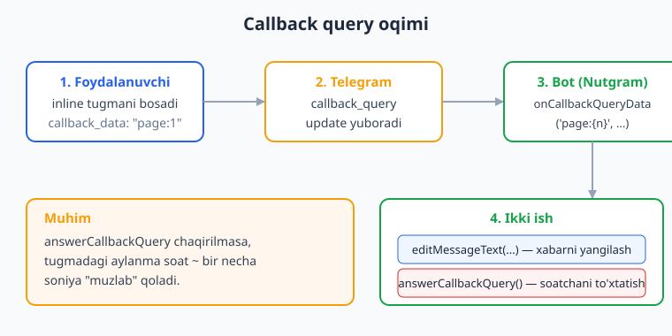
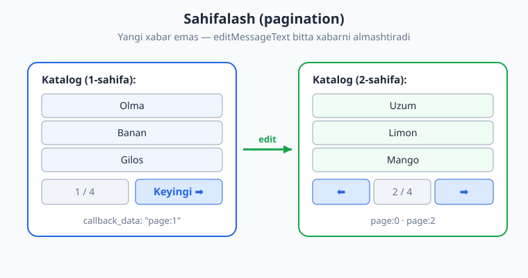
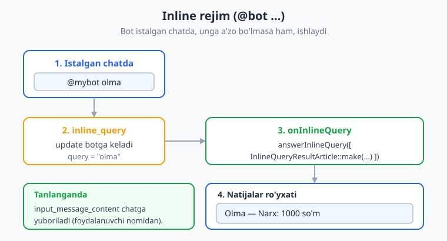

# 07 — Callback query va inline rejim

[⬅️ Oldingi: 06 — Klaviaturalar: reply va inline](./06-klaviaturalar.md) · [🏠 README](./README.md) · [Keyingi: 08 — Conversations (suhbat / FSM) ➡️](./08-conversations.md)

---

> **Bu bobda:** o'tgan bobda inline tugmalarni *yaratishni* o'rgandik. Endi ularni *jonlantiramiz*. Foydalanuvchi inline tugmani bosganda Telegram botga maxsus `callback_query` yangilanishini yuboradi — biz uni `onCallbackQuery` va parametrli `onCallbackQueryData('page:{n}', ...)` bilan ushlaymiz. `answerCallbackQuery` orqali tugmadagi aylanma soatni to'xtatamiz yoki yengil ogohlantirish (toast / alert) ko'rsatamiz. Yangi xabar yubormasdan, mavjud xabarni `editMessageText` va `editMessageReplyMarkup` bilan o'rnida yangilaymiz — shu asosda chiroyli **sahifalash (pagination)** quramiz. Oxirida **inline rejim** (`@bot ...`) bilan tanishamiz: bot a'zo bo'lmagan istalgan chatda `onInlineQuery` + `answerInlineQuery` orqali natija ro'yxatini qaytaradi.
>
> **Halol eslatma:** bu bobdagi bot mantig'i (callback marshrutlash, parametr ajratish, xabar tahrirlash, pagination, inline natijalari) **offline `FakeNutgram` bilan haqiqatan ham tekshirilgan** — Nutgram 4.46 + PHPUnit 12, 6 ta test, hammasi yashil. Faqat jonli Telegram ichidagi render (tugmalarning ko'rinishi, inline natijalarning chiqishi) illustrativ — uni siz o'z botingizda real ko'rasiz.

---

## Callback query nima?

Inline tugma (`InlineKeyboardButton`) — bu xabar *ostiga* yopishgan tugma. Reply-klaviatura matn yuboradi, inline tugma esa hech qanday ko'rinadigan xabar yubormaydi: u botga maxfiy `callback_data` qatorini jo'natadi. Bu `callback_query` deb ataladigan yangilanish ichida keladi.



Oqim juda muhim, uni yodda tuting:

1. Foydalanuvchi tugmani bosadi — Telegram tugmaning `callback_data` qiymatini olib `callback_query` yangilanishini yuboradi.
2. Tugmada **kichik aylanma soat** paydo bo'ladi va u botning javobini kutadi.
3. Bot handleri ishlaydi: kerakli ishni bajaradi (xabarni tahrirlaydi, ma'lumot saqlaydi va h.k.).
4. Bot **`answerCallbackQuery()`** chaqiradi — bu soatni to'xtatadi. Agar chaqirmasangiz, soat bir necha soniya "muzlab" turadi va foydalanuvchiga bot xato qilgandek tuyuladi.

> **Oltin qoida:** har bir callback handleri oxirida `answerCallbackQuery()` ni chaqiring — matn bilan (toast) yoki matnsiz (faqat soatni to'xtatish uchun).

## `onCallbackQuery` — barcha callbacklarni ushlash

Eng sodda variant — barcha callback querylar uchun bitta handler:

```php
use SergiX44\Nutgram\Nutgram;

$bot->onCallbackQuery(function (Nutgram $bot) {
    // Bosilgan tugmaning callback_data qiymati
    $data = $bot->callbackQuery()->data;

    $bot->answerCallbackQuery(text: "Siz bosdingiz: $data");
});
```

Bu yerda:

- `$bot->callbackQuery()` — kelgan `CallbackQuery` obyektini qaytaradi (`->data`, `->id`, `->from`, `->message`).
- `$bot->answerCallbackQuery(text: ...)` — Telegramga "javob berdim" deydi va foydalanuvchiga yengil **toast** (ekran tepasida sekundga chiqib yo'qoladigan xabarcha) ko'rsatadi.

`callback_query_id` ni qo'lda berishingiz shart emas — Nutgram uni joriy yangilanishdan avtomatik oladi.

## `answerCallbackQuery` — toast va alert

Bu metod ikki rejimga ega:

```php
// 1) Toast — ekran tepasida qisqa xabarcha (show_alert: false yoki umuman bermang)
$bot->answerCallbackQuery(text: 'Saqlandi!');

// 2) Alert — ekran o'rtasida "OK" tugmali muloqot oynasi (e'tibor talab qiladi)
$bot->answerCallbackQuery(text: 'Diqqat: bu amalni ortga qaytarib bo\'lmaydi!', show_alert: true);

// 3) Hech narsa ko'rsatmasdan — faqat soatni to'xtatish
$bot->answerCallbackQuery();
```

Metod imzosi (Nutgram 4.46):

```php
answerCallbackQuery(
    ?string $callback_query_id = null, // bermang — avto
    ?string $text = null,
    ?bool   $show_alert = null,        // true -> alert, aks holda toast
    ?string $url = null,               // o'yin yoki t.me/bot?start=... uchun
    ?int    $cache_time = null,
): ?bool
```

> **Eslatma:** `text` uzunligi 200 belgidan oshmasligi kerak (Telegram cheklovi). Toast — qisqa fikrlar uchun (`Rahmat!`, `Bekor qilindi`), uzun ma'lumot uchun esa xabarning o'zini tahrirlang.

## Parametrli callback: `onCallbackQueryData('pattern', ...)`

Real botda har xil tugmalar bo'ladi: "sahifa 2", "mahsulot #5 ni tanlash", "buyurtmani tasdiqlash #42". Har biri uchun alohida `if` yozish — qiyin. Nutgram **pattern** (naqsh) bilan callbacklarni marshrutlaydi va `{...}` ichidagi qismni avtomatik ajratib, handlerga **argument** sifatida uzatadi:

```php
// callback_data = "item:5" bo'lsa, $idx = "5" bo'ladi
$bot->onCallbackQueryData('item:{idx}', function (Nutgram $bot, string $idx) {
    $bot->answerCallbackQuery(text: "Mahsulot #$idx tanlandi");
});

// Bir nechta parametr ham mumkin
$bot->onCallbackQueryData('order:{id}:{action}', function (Nutgram $bot, string $id, string $action) {
    // order:42:confirm -> $id = "42", $action = "confirm"
    $bot->answerCallbackQuery(text: "Buyurtma #$id -> $action");
});
```

Bu qanday ishlaydi? Nutgram naqshdagi har bir `{nom}` ni regex guruhga (`(?<nom>.*?)`) aylantiradi, kelgan `callback_data` ga moslaydi va topilgan qiymatlarni handler argumentlariga **tartib bo'yicha** beradi. Argument nomlari ahamiyatga ega emas — tartib muhim.

> **Ogohlantirish:** `callback_data` uzunligi **64 baytdan** oshmasligi kerak (Telegram cheklovi). Shuning uchun unga uzun JSON yoki butun obyekt tiqmang — faqat ID/kalit joylang (`item:5`), to'liq ma'lumotni esa bazadan oqib oling.

## Xabarni tahrirlash: `editMessageText` va `editMessageReplyMarkup`

Callback handleri ko'pincha **mavjud xabarni** o'zgartiradi, yangisini yubormaydi. Buning ikki asosiy metodi bor.

### `editMessageText` — matn (va, ixtiyoriy, klaviatura) ni almashtirish

```php
use SergiX44\Nutgram\Telegram\Properties\ParseMode;
use SergiX44\Nutgram\Telegram\Types\Keyboard\InlineKeyboardButton;
use SergiX44\Nutgram\Telegram\Types\Keyboard\InlineKeyboardMarkup;

$bot->onCallbackQueryData('refresh', function (Nutgram $bot) {
    $bot->editMessageText(
        text: '<b>Yangilandi:</b> ' . date('H:i:s'),
        parse_mode: ParseMode::HTML,
        reply_markup: InlineKeyboardMarkup::make()->addRow(
            InlineKeyboardButton::make('🔄 Yana yangilash', callback_data: 'refresh'),
        ),
    );
    $bot->answerCallbackQuery();
});
```

`chat_id` va `message_id` ni qo'lda berishingiz shart emas — callback ichida Nutgram ularni joriy xabardan oladi.

### `editMessageReplyMarkup` — faqat tugmalarni almashtirish

Matnga tegmasdan, faqat klaviaturani yangilash kerak bo'lsa (masalan, "like" hisobini oshirish):

```php
$bot->onCallbackQueryData('like:{n}', function (Nutgram $bot, string $n) {
    $yangi = (int) $n + 1;

    $bot->editMessageReplyMarkup(
        reply_markup: InlineKeyboardMarkup::make()->addRow(
            InlineKeyboardButton::make("👍 $yangi", callback_data: "like:$yangi"),
        ),
    );
    $bot->answerCallbackQuery(text: 'Rahmat!');
});
```

> **Tez-tez uchraydigan xato — "message is not modified":** agar siz xabarni **aynan bir xil** matn va klaviatura bilan tahrirlasangiz, Telegram `400: message is not modified` xatosini qaytaradi. Buni oldini olish uchun: (a) yangi qiymat eskisidan farq qilishiga ishonch hosil qiling, yoki (b) `onApiError` orqali bu xatoni e'tiborsiz qoldiring. Masalan, sahifalashda "joriy sahifa" tugmasi bosilsa, hech narsani tahrirlamang — faqat `answerCallbackQuery()` chaqiring.

## Sahifalash (pagination) inline tugmalar bilan

Endi hammasini birlashtiramiz. Faraz qilaylik, 10 ta mahsulotni har sahifada 3 tadan ko'rsatmoqchimiz, va foydalanuvchi `⬅️` / `➡️` tugmalari bilan **bitta xabar ichida** sahifalarni almashtirsin.



Asosiy g'oya: har bir navigatsiya tugmasining `callback_data` siga **borish kerak bo'lgan sahifa raqamini** joylaymiz (`page:1`). Tugma bosilganda xabarni o'sha sahifa bilan **tahrirlaymiz** — yangi xabar yubormaymiz.

```php
use SergiX44\Nutgram\Nutgram;
use SergiX44\Nutgram\Telegram\Types\Keyboard\InlineKeyboardButton;
use SergiX44\Nutgram\Telegram\Types\Keyboard\InlineKeyboardMarkup;

const PER_PAGE = 3;

function mahsulotlar(): array
{
    return ['Olma', 'Banan', 'Gilos', 'Uzum', 'Limon',
            'Mango', 'Nok', 'Olcha', 'Shaftoli', 'Anor'];
}

// Berilgan sahifa uchun inline klaviatura quradi
function sahifaKlaviaturasi(int $sahifa): InlineKeyboardMarkup
{
    $hammasi = mahsulotlar();
    $oxirgi  = (int) ceil(count($hammasi) / PER_PAGE) - 1; // 0-indeksli oxirgi sahifa

    $kb    = InlineKeyboardMarkup::make();
    $boshi = $sahifa * PER_PAGE;

    // Shu sahifadagi mahsulotlar — har biri alohida qatorda
    foreach (array_slice($hammasi, $boshi, PER_PAGE) as $i => $nom) {
        $idx = $boshi + $i;
        $kb->addRow(InlineKeyboardButton::make($nom, callback_data: "item:$idx"));
    }

    // Navigatsiya qatori: ⬅️  [2/4]  ➡️
    $nav = [];
    if ($sahifa > 0) {
        $nav[] = InlineKeyboardButton::make('⬅️', callback_data: 'page:' . ($sahifa - 1));
    }
    $nav[] = InlineKeyboardButton::make(($sahifa + 1) . '/' . ($oxirgi + 1), callback_data: 'noop');
    if ($sahifa < $oxirgi) {
        $nav[] = InlineKeyboardButton::make('➡️', callback_data: 'page:' . ($sahifa + 1));
    }
    $kb->addRow(...$nav);

    return $kb;
}

// 1-sahifani ko'rsatuvchi buyruq
$bot->onCommand('katalog', function (Nutgram $bot) {
    $bot->sendMessage('Katalog (1-sahifa):', reply_markup: sahifaKlaviaturasi(0));
});

// Sahifani almashtirish: yangi xabar EMAS, mavjudini tahrirlash
$bot->onCallbackQueryData('page:{sahifa}', function (Nutgram $bot, string $sahifa) {
    $bot->editMessageText(
        text: 'Katalog (' . ($sahifa + 1) . '-sahifa):',
        reply_markup: sahifaKlaviaturasi((int) $sahifa),
    );
    $bot->answerCallbackQuery();
});

// Mahsulotni tanlash -> toast
$bot->onCallbackQueryData('item:{idx}', function (Nutgram $bot, string $idx) {
    $nom = mahsulotlar()[(int) $idx] ?? 'noma\'lum';
    $bot->answerCallbackQuery(text: "Tanlandi: $nom");
});

// "Joriy sahifa" tugmasi (2/4) — hech narsa qilmaymiz, faqat soatni to'xtatamiz
// (xabarni tahrirlamaymiz -> "message is not modified" xatosi chiqmaydi)
$bot->onCallbackQueryData('noop', function (Nutgram $bot) {
    $bot->answerCallbackQuery();
});
```

E'tibor bering:

- `page:{sahifa}` handleri **`editMessageText`** ni chaqiradi — shuning uchun ekranda yangi xabar paydo bo'lmaydi, xuddi shu xabar joyida o'zgaradi.
- "joriy sahifa" tugmasiga `noop` callback_data berdik. Uni bosganda xabarni **tahrirlamaymiz** — aks holda Telegram "message is not modified" deb xato berardi. Faqat `answerCallbackQuery()` bilan soatni to'xtatamiz.
- `callback_data` ichida faqat sahifa raqami va indeks bor — 64 bayt cheklovidan ancha kichik.

> **Real loyihada:** mahsulotlarni `mahsulotlar()` massividan emas, ma'lumotlar bazasidan `LIMIT/OFFSET` bilan oqiting (10-bobga qarang). Klaviatura qurish mantig'i o'zgarmaydi — faqat ma'lumot manbasi o'zgaradi.

## Inline rejim: `@bot ...`

Inline rejim — Telegramning eng kuchli imkoniyatlaridan biri. Foydalanuvchi **istalgan chatda** (hatto botingiz a'zo bo'lmagan guruhda ham) yozish maydoniga `@sizning_bot qidiruv` deb yozsa, bot real vaqtda natija ro'yxatini taklif qiladi. Tanlangan natija foydalanuvchi nomidan o'sha chatga yuboriladi. Bu — `@gif`, `@wiki`, `@vid` kabi mashhur rasmiy botlar ishlash usuli.



> **Avval yoqish kerak:** inline rejim sukut bo'yicha o'chiq. @BotFather ga boring -> `/setinline` -> botingizni tanlang -> placeholder matnini kiriting (masalan, `Mahsulot qidirish...`). Shundan keyingina Telegram `inline_query` yangilanishlarini yuboradi.

### `onInlineQuery` + `answerInlineQuery`

```php
use SergiX44\Nutgram\Nutgram;
use SergiX44\Nutgram\Telegram\Types\Inline\InlineQueryResultArticle;
use SergiX44\Nutgram\Telegram\Types\Input\InputTextMessageContent;

$bot->onInlineQuery(function (Nutgram $bot) {
    // Foydalanuvchi yozgan matn (@bot dan keyingi qism)
    $q = mb_strtolower(trim($bot->inlineQuery()->query));

    $natijalar = [];
    foreach (mahsulotlar() as $i => $nom) {
        // Bo'sh so'rovda hammasini, aks holda mos kelganini ko'rsatamiz
        if ($q === '' || str_contains(mb_strtolower($nom), $q)) {
            $natijalar[] = InlineQueryResultArticle::make(
                id: (string) $i,                 // har bir natija uchun noyob ID
                title: $nom,                      // ro'yxatda ko'rinadigan sarlavha
                description: "Narx: " . (($i + 1) * 1000) . " so'm",
                // Foydalanuvchi natijani tanlaganda chatga AYNAN shu yuboriladi:
                input_message_content: InputTextMessageContent::make("Mahsulot: $nom"),
            );
        }
    }

    $bot->answerInlineQuery(
        $natijalar,
        cache_time: 10,    // Telegram natijani 10 soniya keshlaydi
        is_personal: true, // kesh faqat shu foydalanuvchi uchun (ma'lumot shaxsiy bo'lsa)
    );
});
```

Muhim tushunchalar:

- **`$bot->inlineQuery()->query`** — foydalanuvchi yozayotgan matn. U har bir harfda yangilanadi, shuning uchun handler tez ishlashi kerak (sekin bo'lsa, javob keshlanadi yoki kechikadi).
- **`InlineQueryResultArticle`** — eng ko'p ishlatiladigan natija turi (matnli maqola). Boshqa turlar ham bor: `InlineQueryResultPhoto`, `...Gif`, `...Video`, `...Document`, va keshlangan (`Cached...`) variantlari.
- **`input_message_content`** — natija **tanlangach** chatga aslida nima yuborilishini belgilaydi. Buni `title` bilan adashtirmang: `title`/`description` faqat *ro'yxatdagi ko'rinish*, `input_message_content` esa *yuboriladigan xabar*.
- **`answerInlineQuery` qoidalari:** bir so'rovga **50 tadan** ko'p natija qaytarib bo'lmaydi; har bir natija `id` si noyob bo'lishi shart; `next_offset` orqali sahifalash (lazy-loading) qilish mumkin.

> **Maxfiylik:** inline so'rov istalgan chatdan kelishi mumkin va siz uni qaytadan ko'rmasligingiz mumkin. Shaxsiy/maxfiy ma'lumotni inline natijada qaytarmang, `is_personal: true` bilan keshni cheklang.

### Tanlangan natijani kuzatish (ixtiyoriy)

Qaysi natija aniq tanlanganini bilmoqchi bo'lsangiz (statistika uchun), @BotFather da `/setinlinefeedback` ni yoqib, `onChosenInlineResult` handlerini qo'shing:

```php
$bot->onChosenInlineResult(function (Nutgram $bot) {
    $tanlangan = $bot->chosenInlineResult();
    // $tanlangan->result_id, $tanlangan->query, $tanlangan->from
    // Masalan: bazaga "X mahsuloti Y marta ulashildi" deb yozish
});
```

## Offline tekshiruv: `FakeNutgram`

Yuqoridagi mantiqni jonli botsiz, tokensiz tekshirsa bo'ladi. `Nutgram::fake()` soxta bot yaratadi; `hearCallbackQueryData(...)` callback yangilanishini "eshittiradi", `reply()` esa handlerni ishga tushiradi. Keyin `assertReply` / `assertCalled` bilan natijani tekshiramiz.

```php
use PHPUnit\Framework\TestCase;
use SergiX44\Nutgram\Nutgram;
use SergiX44\Nutgram\Telegram\Properties\UpdateType;

final class CallbackInlineTest extends TestCase
{
    private function bot(): Nutgram
    {
        $bot = Nutgram::fake();
        registerHandlers($bot); // handlerlarimiz alohida funksiyada ulangan
        return $bot;
    }

    public function test_page_callback_xabarni_tahrirlaydi(): void
    {
        $bot = $this->bot();
        $bot->hearCallbackQueryData('page:1')->reply();

        $bot->assertCalled('editMessageText');
        $bot->assertReply('editMessageText', ['text' => 'Katalog (2-sahifa):'], index: 0);
        $bot->assertCalled('answerCallbackQuery');
    }

    public function test_item_callback_toast_chiqaradi(): void
    {
        $bot = $this->bot();
        $bot->hearCallbackQueryData('item:0')->reply(); // idx 0 = Olma

        $bot->assertReply('answerCallbackQuery', ['text' => 'Tanlandi: Olma'], index: 0);
    }

    public function test_inline_query_natija_qaytaradi(): void
    {
        $bot = $this->bot();
        // Inline so'rovni "eshittirish": query = "ol"
        $bot->hearUpdateType(UpdateType::INLINE_QUERY, ['query' => 'ol'])->reply();

        $bot->assertCalled('answerInlineQuery');
        $bot->assertRaw(function ($request) {
            $params  = \SergiX44\Nutgram\Testing\FakeNutgram::getActualData($request, []);
            $results = json_decode($params['results'], true);
            $titles  = array_column($results, 'title');
            return in_array('Olma', $titles, true) && in_array('Olcha', $titles, true);
        });
    }
}
```

Bu testlar haqiqatan o'tadi (PHPUnit `OK (6 tests)`). Diqqat:

- Callback handleri **bir nechta** so'rov yuborishi mumkin (`editMessageText` + `answerCallbackQuery`). Shuning uchun `assertReply`/`assertRaw` ga aniq `index:` bering yoki `assertSequence` ishlating.
- `assertRaw($request)` closure'ga Guzzle `Request` keladi (massiv emas!). Parametrlarni `FakeNutgram::getActualData($request, [])` bilan oqib olib, JSON maydonlarni (`results`, `reply_markup`) qo'lda `json_decode` qiling.
- Inline so'rov uchun maxsus `hear...` yo'q, ammo `hearUpdateType(UpdateType::INLINE_QUERY, ['query' => '...'])` istalgan turdagi yangilanishni yasab beradi.

Testlash bo'yicha to'liq bobni keyinroq ko'ramiz ([16-bob: Testlash](./16-testlash.md)). Hozircha shuni biling: callback/inline mantig'ini real Telegramsiz, soniyaning ulushida tekshirish mumkin.

---

## Mashqlar

### Oson

1. `onCallbackQuery` bilan bitta umumiy handler yozing: u bosilgan tugmaning `callback_data` sini toast qilib qaytarsin (`Siz bosdingiz: ...`).
2. `answerCallbackQuery` ning `show_alert: true` va `show_alert: false` variantlarini sinab ko'ring. Qaysi biri ekran o'rtasida "OK" tugmali oyna chiqaradi?
3. `onCallbackQueryData('lang:{kod}', ...)` handlerini yozing: `lang:uz` -> "Til: uz", `lang:en` -> "Til: en" toastini ko'rsatsin.
4. "🔄 Yangilash" tugmali xabar yuboring. Tugma bosilganda `editMessageText` bilan joriy vaqtni (`date('H:i:s')`) ko'rsating va shu tugmani qoldiring.
5. `editMessageReplyMarkup` yordamida bosilganda matni "✅ Tanlangan" ga o'zgaradigan tugma yasang (`callback_data` ni ham yangilang).
6. Inline rejimni @BotFather da `/setinline` orqali yoqing va `onInlineQuery` da har doim bitta `InlineQueryResultArticle` ("Salom dunyo") qaytaring.

### O'rta

1. 12 ta elementli ro'yxat uchun bobdagi pagination'ni qayta yozing, har sahifada 4 tadan. Oxirgi sahifada `➡️`, birinchisida `⬅️` ko'rinmasligiga ishonch hosil qiling.
2. Paginationga "🏠 Boshiga" tugmasini qo'shing (`page:0`), u 1-sahifadan tashqari har doim ko'rinsin.
3. `item:{idx}` ni o'zgartiring: mahsulot tanlanganda toast o'rniga xabarni `editMessageText` bilan mahsulot **tafsilotlariga** almashtiring, pastida "⬅️ Ro'yxatga" tugmasi bo'lsin (`page:0`).
4. "message is not modified" xatosini qasddan keltiring (bir xil matn bilan ikki marta `editMessageText`). Keyin uni `onApiError` bilan ushlab, e'tiborsiz qoldiring.
5. Inline rejimda mahsulotlarni `mb_strtolower` bilan registrga befarq qidiradigan filtr yozing. Bo'sh so'rovda hammasini qaytaring.
6. `InlineQueryResultArticle` ga `reply_markup` (inline tugma bilan) qo'shing — natija chatga yuborilganda tugma ham birga kelsin.

### Qiyin

1. **`next_offset` bilan lazy pagination:** 200 ta natijali inline so'rovda har gal 20 tadan qaytaring va `next_offset` orqali keyingisini yuklang (foydalanuvchi pastga aylantirganda). `assertRaw` bilan `next_offset` to'g'ri o'rnatilganini tekshiring.
2. **Savatcha (cart) holati:** "➕ Qo'shish" / "➖ Olib tashlash" tugmalari bilan xabar yasang. Har bosishda `getUserData`/`setUserData` orqali sonni saqlang va `editMessageText` bilan jami narxni yangilang. Buni `FakeNutgram` bilan ketma-ket bosishlarni `hearCallbackQueryData` qilib tekshiring.
3. **Tasdiqlash oqimi:** "🗑 O'chirish" tugmasi bosilsa, avval `editMessageReplyMarkup` bilan "✅ Ha / ❌ Yo'q" tugmalarini ko'rsating. "✅ Ha" -> xabarni "O'chirildi" ga aylantiring; "❌ Yo'q" -> dastlabki holatga qaytaring. Hammasini bitta xabar ichida, parametrli callbacklar (`del:ask:{id}`, `del:yes:{id}`, `del:no:{id}`) bilan quring va `FakeNutgram` bilan uchala yo'lni tekshiring.

<details markdown="1"><summary>Yechimlar</summary>

**Oson 1.**
```php
$bot->onCallbackQuery(function (Nutgram $bot) {
    $bot->answerCallbackQuery(text: 'Siz bosdingiz: ' . $bot->callbackQuery()->data);
});
```

**Oson 2.** `show_alert: true` -> ekran o'rtasida "OK" tugmali **alert** oynasi. `show_alert: false` (yoki bermaslik) -> tepada qisqa **toast**.

**Oson 3.**
```php
$bot->onCallbackQueryData('lang:{kod}', function (Nutgram $bot, string $kod) {
    $bot->answerCallbackQuery(text: "Til: $kod");
});
```

**Oson 4.**
```php
use SergiX44\Nutgram\Telegram\Types\Keyboard\{InlineKeyboardButton, InlineKeyboardMarkup};

$bot->onCommand('vaqt', fn (Nutgram $bot) => $bot->sendMessage(
    'Vaqt: ' . date('H:i:s'),
    reply_markup: InlineKeyboardMarkup::make()->addRow(
        InlineKeyboardButton::make('🔄 Yangilash', callback_data: 'vaqt:refresh'),
    ),
));

$bot->onCallbackQueryData('vaqt:refresh', function (Nutgram $bot) {
    $bot->editMessageText(
        text: 'Vaqt: ' . date('H:i:s'),
        reply_markup: InlineKeyboardMarkup::make()->addRow(
            InlineKeyboardButton::make('🔄 Yangilash', callback_data: 'vaqt:refresh'),
        ),
    );
    $bot->answerCallbackQuery();
});
```
> Eslatma: agar bir soniya ichida ikki marta bossangiz, vaqt o'zgarmay "message is not modified" chiqishi mumkin — buni 4-o'rta mashqdagidek ushlash mumkin.

**Oson 5.**
```php
$bot->onCallbackQueryData('toggle:{n}', function (Nutgram $bot, string $n) {
    $bot->editMessageReplyMarkup(
        reply_markup: InlineKeyboardMarkup::make()->addRow(
            InlineKeyboardButton::make('✅ Tanlangan', callback_data: 'toggle:done'),
        ),
    );
    $bot->answerCallbackQuery();
});
```

**Oson 6.**
```php
use SergiX44\Nutgram\Telegram\Types\Inline\InlineQueryResultArticle;
use SergiX44\Nutgram\Telegram\Types\Input\InputTextMessageContent;

$bot->onInlineQuery(function (Nutgram $bot) {
    $bot->answerInlineQuery([
        InlineQueryResultArticle::make(
            id: '1',
            title: 'Salom',
            input_message_content: InputTextMessageContent::make('Salom dunyo'),
        ),
    ]);
});
```

**O'rta 1.** Bobdagi `sahifaKlaviaturasi` ni `PER_PAGE = 4` va 12 elementli ro'yxat bilan ishlating. Shartlar (`$sahifa > 0`, `$sahifa < $oxirgi`) avtomatik ⬅️/➡️ ni yashiradi/ko'rsatadi.

**O'rta 2.** Navigatsiya qatoridan oldin qo'shing:
```php
if ($sahifa > 0) {
    $kb->addRow(InlineKeyboardButton::make('🏠 Boshiga', callback_data: 'page:0'));
}
```

**O'rta 3.**
```php
$bot->onCallbackQueryData('item:{idx}', function (Nutgram $bot, string $idx) {
    $nom = mahsulotlar()[(int) $idx] ?? null;
    if ($nom === null) { $bot->answerCallbackQuery(text: 'Topilmadi'); return; }
    $bot->editMessageText(
        text: "<b>$nom</b>\nTafsilotlar...",
        parse_mode: \SergiX44\Nutgram\Telegram\Properties\ParseMode::HTML,
        reply_markup: InlineKeyboardMarkup::make()->addRow(
            InlineKeyboardButton::make('⬅️ Ro\'yxatga', callback_data: 'page:0'),
        ),
    );
    $bot->answerCallbackQuery();
});
```

**O'rta 4.**
```php
use SergiX44\Nutgram\Telegram\Exceptions\TelegramException;

$bot->onApiError(function (Nutgram $bot, TelegramException $e) {
    if (str_contains($e->getMessage(), 'message is not modified')) {
        return; // jimgina e'tiborsiz qoldiramiz
    }
    throw $e; // boshqa xatolarni qayta uloqtiramiz
});
```

**O'rta 5.**
```php
$bot->onInlineQuery(function (Nutgram $bot) {
    $q = mb_strtolower(trim($bot->inlineQuery()->query));
    $res = [];
    foreach (mahsulotlar() as $i => $nom) {
        if ($q === '' || str_contains(mb_strtolower($nom), $q)) {
            $res[] = InlineQueryResultArticle::make(
                id: (string) $i, title: $nom,
                input_message_content: InputTextMessageContent::make($nom),
            );
        }
    }
    $bot->answerInlineQuery($res);
});
```

**O'rta 6.** `InlineQueryResultArticle::make(..., reply_markup: InlineKeyboardMarkup::make()->addRow(InlineKeyboardButton::make('Batafsil', callback_data: 'info:1')))`. Eslatma: inline natijaga `callback_data` li tugma qo'shsangiz, xabar boshqa chatda paydo bo'lgani uchun, callback'ni ushlash uchun bot o'sha tugmaga `onCallbackQueryData('info:{n}', ...)` handleriga ega bo'lishi kerak.

**Qiyin 1.**
```php
$bot->onInlineQuery(function (Nutgram $bot) {
    $hammasi = range(1, 200);
    $offset  = (int) ($bot->inlineQuery()->offset ?: 0); // bo'sh -> 0
    $bolak   = array_slice($hammasi, $offset, 20);

    $res = array_map(fn ($n) => InlineQueryResultArticle::make(
        id: (string) $n, title: "Element #$n",
        input_message_content: InputTextMessageContent::make("Element #$n"),
    ), $bolak);

    $keyingi = $offset + 20;
    $bot->answerInlineQuery(
        $res,
        next_offset: $keyingi < count($hammasi) ? (string) $keyingi : '', // '' -> tugadi
    );
});
```
Test: `hearUpdateType(UpdateType::INLINE_QUERY, ['query' => 'x'])->reply()` -> `assertRaw` da `getActualData($req)['next_offset'] === '20'`.

**Qiyin 2.** (Asosiy g'oya — to'liq holat `setUserData` da)
```php
$render = function (Nutgram $bot, int $soni) {
    $bot->editMessageText(
        text: "Savatcha: $soni dona · Jami: " . ($soni * 1000) . " so'm",
        reply_markup: InlineKeyboardMarkup::make()->addRow(
            InlineKeyboardButton::make('➖', callback_data: 'cart:minus'),
            InlineKeyboardButton::make("$soni", callback_data: 'noop'),
            InlineKeyboardButton::make('➕', callback_data: 'cart:plus'),
        ),
    );
};
$bot->onCallbackQueryData('cart:{amal}', function (Nutgram $bot, string $amal) use ($render) {
    $soni = (int) ($bot->getUserData('cart') ?? 0);
    $soni = max(0, $soni + ($amal === 'plus' ? 1 : -1));
    $bot->setUserData('cart', $soni);
    $render($bot, $soni);
    $bot->answerCallbackQuery();
});
```
Test: `Nutgram::fake()` da bir nechta `hearCallbackQueryData('cart:plus')->reply()` ketma-ket; oxirgi `assertReply('editMessageText', ...)` bilan jami narxni tekshiring. (`setUserData` keshi `FakeNutgram` da ishlaydi.)

**Qiyin 3.**
```php
// 1) so'rash: tugmalarni "Ha/Yo'q" ga almashtiramiz
$bot->onCallbackQueryData('del:ask:{id}', function (Nutgram $bot, string $id) {
    $bot->editMessageReplyMarkup(
        reply_markup: InlineKeyboardMarkup::make()->addRow(
            InlineKeyboardButton::make('✅ Ha', callback_data: "del:yes:$id"),
            InlineKeyboardButton::make('❌ Yo\'q', callback_data: "del:no:$id"),
        ),
    );
    $bot->answerCallbackQuery();
});
// 2) tasdiq: xabarni "O'chirildi" ga aylantiramiz
$bot->onCallbackQueryData('del:yes:{id}', function (Nutgram $bot, string $id) {
    $bot->editMessageText(text: "#$id o'chirildi.");
    $bot->answerCallbackQuery(text: 'Bajarildi');
});
// 3) bekor: dastlabki tugmaga qaytaramiz
$bot->onCallbackQueryData('del:no:{id}', function (Nutgram $bot, string $id) {
    $bot->editMessageReplyMarkup(
        reply_markup: InlineKeyboardMarkup::make()->addRow(
            InlineKeyboardButton::make('🗑 O\'chirish', callback_data: "del:ask:$id"),
        ),
    );
    $bot->answerCallbackQuery(text: 'Bekor qilindi');
});
```
Test (uchala yo'l): `hearCallbackQueryData('del:ask:5')->reply()` -> `assertCalled('editMessageReplyMarkup')`; alohida fake'larda `del:yes:5` -> `assertReply('editMessageText', ['text' => "#5 o'chirildi."])`; `del:no:5` -> yana `editMessageReplyMarkup`.

</details>

---

[⬅️ Oldingi: 06 — Klaviaturalar: reply va inline](./06-klaviaturalar.md) · [🏠 README](./README.md) · [Keyingi: 08 — Conversations (suhbat / FSM) ➡️](./08-conversations.md)
