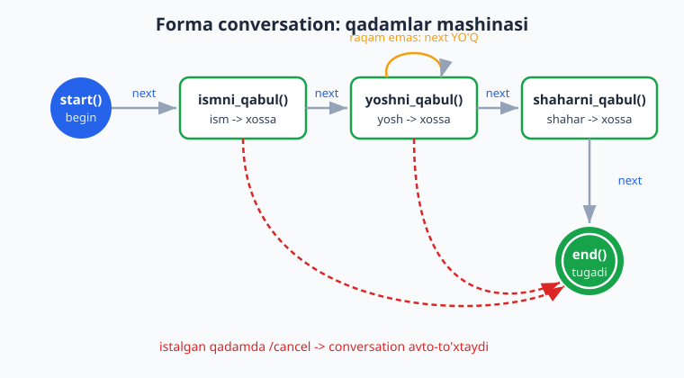
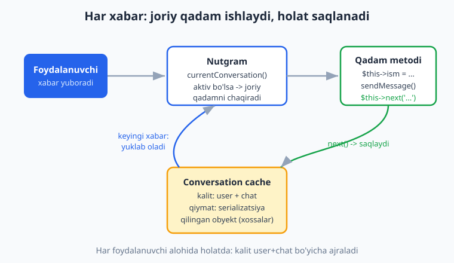
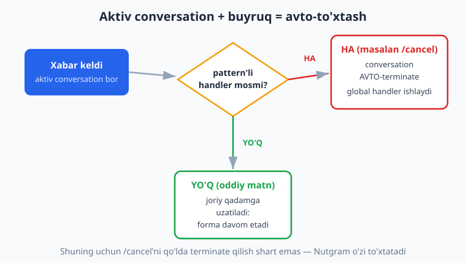

# 08 — Conversations (suhbat / FSM)

[⬅️ Oldingi: 07 — Callback query va inline rejim](./07-callback-inline.md) · [🏠 README](./README.md) · [Keyingi: 09 — Middleware ➡️](./09-middleware.md)

---

> **Bu bobda:** Hozirgacha har bir xabar mustaqil edi — bot xabarni oldi, javob berdi, unutdi. Lekin ko'p real botlar **suhbat** olib boradi: "Ismingizni yozing" -> "Yoshingizni yozing" -> "Shahringizni yozing". Bot avval qaysi savol berganini, foydalanuvchi qaysi qadamda turganini **eslab turishi** kerak. Python/aiogram dunyosida buni **FSM** (Finite State Machine — chekli holatlar mashinasi) `StatesGroup` orqali hal qiladi; Nutgram'da esa buning ekvivalenti — **`Conversation` klassi**. Bu bobda `Conversation`dan meros olgan klass yozishni (`class Forma extends Conversation`), qadam metodlarini (`start`, va o'zingiz nomlagan metodlar), `$this->next('metod')` bilan keyingi qadamga o'tishni, `$this->end()` bilan tugatishni, ko'p qadamli forma/so'rovnoma qurishni, holatni **avtomatik saqlash** (oddiy public xossalar!), `Forma::begin($bot)` bilan boshlashni, validatsiya uchun "qadamda qolish"ni va `/cancel` bilan bekor qilishni o'rganamiz. Oxirida bir muhim nozik joy — aktiv suhbat paytida buyruq kelganda nima bo'lishini ham aniq tushuntiramiz.
>
> **Halol eslatma:** Bobdagi conversation oqimi, qadam o'tishlari (`next`/`end`), public xossalar orqali holatning qadamlar oralig'ida avtomatik saqlanishi, validatsiya bilan qadamda qolish, takroriy qadam (qayta urinish) va `/cancel` bilan avto-to'xtash — hammasi tokensiz, OFFLINE `Nutgram::fake()` (FakeNutgram) + `hearText(...)->reply()` + `assertReplyText`/`assertActiveConversation`/`assertNoConversation` bilan **haqiqatan ishga tushirib tekshirildi** (Nutgram 4.46, PHP 8.4, hech qanday tarmoq chaqiruvisiz). Jonli natija — telefonda savol-javob ketma-ketligi ko'rinishi — `@BotFather` token + internet talab qiladi va "illustrativ" deb belgilangan. Hech qayerda soxta "bot ishladi / xabar yetib bordi" yozilmagan.

---

## Suhbat (conversation) nima va nega kerak?

Tasavvur qiling, bot foydalanuvchidan ro'yxatdan o'tish uchun uch narsa so'raydi: ism, yosh, shahar. Foydalanuvchi `"Oqil"` deb yozadi. Bot buni nima deb tushunsin? Ism deb? Yosh deb? Bot **kontekstni** bilishi kerak: "men hozir foydalanuvchidan ISMni so'ragan edim, demak bu javob — ism".

Ana shu "men hozir qaysi qadamdaman" degan ma'lumot — **holat (state)**. Nutgram'da bu g'oya **`Conversation` klassi** ko'rinishida amalga oshirilgan:

- Foydalanuvchi har lahzada conversation'ning **bitta qadamida** turadi (yoki hech qaysi conversation'da emas — "bo'sh").
- Har bir javob foydalanuvchini **keyingi qadamga** o'tkazadi (`$this->next(...)`).
- Forma tugagach conversation **tugaydi** (`$this->end()`) — foydalanuvchi yana "bo'sh" holatga qaytadi.



> **PHP eslatma:** Bu kitob PHP bilasiz deb faraz qiladi (sinf, namespace, meros olish, type hints — [../php/README.md](../php/README.md)). `Conversation` — bu oddiy abstrakt sinf, siz undan meros olasiz va metodlar yozasiz. Telegram/Nutgram'ga xos HAR narsani bu bobda to'liq tushuntiramiz; PHP asoslarini esa qayta o'rgatmaymiz.

Eng muhim narsa: holat **har bir foydalanuvchi uchun alohida** saqlanadi. Bir vaqtda yuz odam botingiz bilan ishlashi mumkin — biri ism qadamida, ikkinchisi yosh qadamida. Nutgram buni avtomatik ajratib turadi (kalit = foydalanuvchi + chat).

> **Python bilan solishtirish:** Agar aiogram (Python) ko'rgan bo'lsangiz ([../tgbot-python/README.md](../tgbot-python/README.md)), u yerda holat `StatesGroup`/`State` + `FSMContext` (`set_state`, `update_data`, `clear`) bilan boshqariladi. Nutgram boshqacha, **OOP** yondashuvni tanlagan: holat — bu sinf obyektining o'zi, har bir savol — alohida metod, ma'lumotlar esa oddiy **public xossalar**. Bu PHP dasturchisiga ancha tanish tuyuladi.

---

## Birinchi conversation: bitta savol

Eng oddiy holatdan boshlaymiz — bitta savolli "fikr-mulohaza" formasi. `Conversation`dan meros olamiz va bitta `start()` metodi yozamiz:

```php
<?php

use SergiX44\Nutgram\Nutgram;
use SergiX44\Nutgram\Conversations\Conversation;

class Fikr extends Conversation
{
    public function start(Nutgram $bot)
    {
        $bot->sendMessage('Fikringizni yozing:');
        $this->next('qabul');          // keyingi xabar 'qabul' metodiga boradi
    }

    public function qabul(Nutgram $bot)
    {
        $matn = $bot->message()->text;
        // bu yerda fikrni DB'ga yozish mumkin (10-bob)
        $bot->sendMessage('Rahmat! Fikringiz qabul qilindi.');
        $this->end();                  // conversation tugadi
    }
}
```

Diqqat qiladigan uch narsa:

1. **`start()` — boshlang'ich qadam.** Conversation'ning birinchi qadami doim `start` deb nomlanadi (buni o'zgartirsa bo'ladi, lekin standart shu). Conversation boshlanganda aynan shu metod chaqiriladi.
2. **`$this->next('qabul')`** — "keyingi xabar `qabul` metodiga uzatilsin" degani. Conversation joriy qadamni eslab qoladi.
3. **`$this->end()`** — conversation'ni tugatadi. Bundan keyin foydalanuvchi xabarlari yana oddiy handlerlarga boradi.

Conversation'ni **handler ichidan boshlaymiz** — odatda biror buyruq orqali:

```php
$bot->onCommand('fikr', fn(Nutgram $bot) => Fikr::begin($bot));
```

`Forma::begin($bot)` — statik metod, conversation obyektini yaratadi va `start()` qadamini darhol ishga tushiradi. Yodda tuting: `begin` — `Conversation` sinfidan kelgan tayyor metod, uni o'zingiz yozmaysiz.

> **`next` matni = metod nomi.** `$this->next('qabul')` dagi `'qabul'` — bu shu sinfdagi metod nomi (satr ko'rinishida). Xato yozsangiz (`'qbul'`), keyingi xabar kelganda Nutgram "step not found" xatosini beradi. Metod nomini aniq yozing.

---

## Ko'p qadamli forma va holatni saqlash

Endi eng qiziq qism. Uch qadamli so'rovnoma — ism, yosh, shahar. Bu yerda eng muhim savol: **to'plangan ma'lumot qayerda saqlanadi?** Javob hayratlanarli darajada oddiy — **oddiy public xossalarda**:

```php
<?php

use SergiX44\Nutgram\Nutgram;
use SergiX44\Nutgram\Conversations\Conversation;

class Survey extends Conversation
{
    // Holat shu yerda saqlanadi — oddiy public xossalar.
    // Nutgram ularni qadamlar oralig'ida AVTOMATIK saqlaydi/tiklaydi.
    public ?string $ism = null;
    public ?int $yosh = null;
    public ?string $shahar = null;

    public function start(Nutgram $bot)
    {
        $bot->sendMessage('Salom! Ismingizni yozing:');
        $this->next('ismni_qabul');
    }

    public function ismni_qabul(Nutgram $bot)
    {
        $this->ism = $bot->message()->text;           // xossaga yozdik
        $bot->sendMessage("Yaxshi, {$this->ism}! Yoshingizni yozing (faqat raqam):");
        $this->next('yoshni_qabul');
    }

    public function yoshni_qabul(Nutgram $bot)
    {
        $text = $bot->message()->text;

        // Validatsiya: raqam emas bo'lsa, next() chaqirMAymiz -> shu qadamda QOLAMIZ
        if (!ctype_digit($text)) {
            $bot->sendMessage('Iltimos, yoshni faqat raqam bilan yozing. Masalan: 25');
            return;
        }

        $this->yosh = (int) $text;
        $bot->sendMessage('Qaysi shaharda yashaysiz?');
        $this->next('shaharni_qabul');
    }

    public function shaharni_qabul(Nutgram $bot)
    {
        $this->shahar = $bot->message()->text;

        // Endi uchala xossa ham to'la — yakuniy xabar:
        $bot->sendMessage(
            "Rahmat! Ma'lumotlaringiz:\n" .
            "Ism: {$this->ism}\n" .
            "Yosh: {$this->yosh}\n" .
            "Shahar: {$this->shahar}"
        );
        $this->end();
    }
}
```

Boshlash:

```php
$bot->onCommand('start', fn(Nutgram $bot) => Survey::begin($bot));
```

### Holat qanday avtomatik saqlanadi?

Bu — Nutgram conversation'ining eng nozik va eng qulay qismi. `$this->ism` ni `ismni_qabul()` da o'rnatdingiz, lekin uni `shaharni_qabul()` da ham o'qiy oldingiz — orada ikkita boshqa xabar (yosh, shahar) kelganiga qaramay. Qanday?

`$this->next(...)` chaqirilganda Nutgram conversation obyektini **butunligicha serializatsiya qiladi** (PHP `__serialize` orqali — barcha public/protected xossalar) va uni **conversation cache**'ga (kalit = foydalanuvchi + chat) saqlaydi. Keyingi xabar kelganda obyekt **qaytadan tiklanadi** (deserializatsiya) va saqlangan xossalar joyida bo'ladi.



Demak siz hech qanday `set_data`/`get_data` chaqirmaysiz — shunchaki obyekt xossasiga yozasiz, Nutgram qolganini bajaradi. Bu PHP OOP'ning tabiiy uslubi.

> **Diqqat — serializatsiya qilinadigan narsa.** Faqat oddiy, serializatsiya qilinadigan qiymatlarni xossaga yozing (satr, son, massiv, oddiy obyekt). PDO ulanish, fayl handle yoki yopilmaydigan resurs xossaga solinsa serializatsiya buziladi. `$bot` obyektining o'zi avtomatik chiqarib tashlanadi (`unset($attributes['bot'])`), shuning uchun u haqida qayg'urmang.

Diqqat qiladigan boshqa nuqtalar:

1. **`$bot->message()->text`** — joriy xabar matni. Conversation qadami ham oddiy handler kabi `$bot` orqali updatega kiradi (`message()`, `user()`, `chatId()` — hammasi ishlaydi).
2. **Validatsiya = `next()`siz `return`.** `yoshni_qabul()` da raqam bo'lmasa, biz `next()` chaqirMAymiz va shunchaki `return` qilamiz. Natijada conversation hali ham `yoshni_qabul` qadamida turadi — foydalanuvchi qayta urinadi. Bu juda kuchli naqsh.
3. **`(int) $text`** — yoshni songa o'giramiz, chunki xossa `?int`.

### Buni qanday OFFLINE tekshirdik

`begin()` ham, qadamlar ham jonli Telegram talab qilmaydi — `Nutgram::fake()` (FakeNutgram) bilan tokensiz to'liq tekshirsa bo'ladi. Ko'p qadamli suhbat uchun bitta nozik joy bor: FakeNutgram odatda har bir `hearText()->reply()` ni mustaqil deb biladi. Ketma-ket xabarlar **bitta** foydalanuvchidan ekanini bildirish uchun **`willStartConversation()`** chaqiramiz — shunda FakeNutgram foydalanuvchi va chat'ni eslab qoladi:

```php
<?php
use SergiX44\Nutgram\Nutgram;

$bot = Nutgram::fake();
$bot->onCommand('start', fn(Nutgram $bot) => Survey::begin($bot));

$bot->willStartConversation();      // <- ko'p qadamli suhbat uchun SHART

$bot->hearText('/start')->reply();
$bot->assertReplyText('Salom! Ismingizni yozing:');
$bot->assertActiveConversation();   // conversation aktiv

$bot->hearText('Oqil')->reply();
$bot->assertReplyText('Yaxshi, Oqil! Yoshingizni yozing (faqat raqam):');
$bot->assertActiveConversation();

$bot->hearText('yosh emas')->reply();   // raqam EMAS -> qadamda qoladi
$bot->assertReplyText('Iltimos, yoshni faqat raqam bilan yozing. Masalan: 25');
$bot->assertActiveConversation();       // hali ham aktiv, yosh qadamida

$bot->hearText('30')->reply();
$bot->assertReplyText('Qaysi shaharda yashaysiz?');

$bot->hearText('Toshkent')->reply();
$bot->assertReplyText("Rahmat! Ma'lumotlaringiz:\nIsm: Oqil\nYosh: 30\nShahar: Toshkent");
$bot->assertNoConversation();           // end() chaqirildi -> conversation YO'Q
```

Bu sinov **haqiqatan o'tdi** (Nutgram 4.46, tokensiz). Natija aniq quyidagicha bo'ldi:

```text
/start      -> "Salom! Ismingizni yozing:"        (conversation aktiv)
Oqil        -> "Yaxshi, Oqil! Yoshingizni..."     (ism xossaga saqlandi)
yosh emas   -> "Iltimos, yoshni faqat raqam..."   (yosh qadamida QOLDI)
30          -> "Qaysi shaharda yashaysiz?"
Toshkent    -> "Rahmat! ... Ism: Oqil Yosh: 30 Shahar: Toshkent"  (conversation TUGADI)
```

E'tibor bering: `"yosh emas"` raqam bo'lmagani uchun forma o'sha qadamda qoldi, keyin `"30"` to'g'ri qabul qilindi; yakunda uchala xossa (`ism`, `yosh`, `shahar`) — uch xil qadamda yozilgan bo'lsa-da — bitta xabarda birga chiqdi. Bu xossalar avtomatik saqlanganini **isbotlaydi**. Bu soxta emas — sinov tom ma'noda shu natijani berdi.

> **Jonli ko'rinish (illustrativ — token+internet kerak):** Telefonda bu shunday ko'rinardi — bot "Ismingizni yozing" deydi, siz "Oqil" deysiz, bot "Yoshingizni yozing" deydi va hokazo. Biz buni real Telegram'da ishga tushirmadik (`@BotFather` token kerak), lekin conversation mantig'i yuqoridagidek aniq tekshirilgan.

---

## Holatni qayerda saqlash kerak? — Conversation cache

`Conversation` obyekti o'zi qayerga saqlanishini hal qilmaydi — u **cache** orqali ishlaydi. Cache — bu "kalit -> serializatsiya qilingan obyekt" omborxonasi. Kalit foydalanuvchi va chat'dan tuziladi, shuning uchun foydalanuvchilar bir-biriga aralashmaydi.

Cache qaysi turda bo'lishini bot konfiguratsiyasida belgilaysiz:

| Cache turi | Qayerda | Bot qayta ishga tushsa | Qachon |
|---|---|---|---|
| `ArrayCache` (default) | Bot protsessining RAM'ida | Hamma suhbat **o'chadi** | O'rganish, lokal sinov |
| Fayl cache | Diskda | **Saqlanadi** | Kichik bot, bitta server |
| Redis cache | Tashqi Redis serverda | **Saqlanadi** + ko'p server | Production, gorizontal masshtab |

Default `ArrayCache` bilan bot to'xtab qayta ishga tushsa, yarmida qolgan forma "yo'qoladi" — foydalanuvchi navbatdagi savolga javob yozsa, bot uni tushunmaydi (suhbat o'chgan). Production'da doimiy cache (fayl yoki Redis) afzal: bot deploy paytida restart bo'lsa ham, suhbat joyida qoladi.

Cache'ni `Configuration` orqali beriladi (illustrativ — Redis uchun server kerak; konfiguratsiya bobida batafsil — [11-bob](./11-loyiha-tuzilishi.md)):

```php
<?php
use SergiX44\Nutgram\Nutgram;
use SergiX44\Nutgram\Configuration;

// Default: ArrayCache (RAM) — hech narsa kerak emas
$bot = new Nutgram($token);

// Doimiy cache uchun PSR-16 cache implementatsiyasini beriladi
// (masalan symfony/cache yoki Redis adapteri):
$config = new Configuration(cache: $psr16Cache);
$bot = new Nutgram($token, $config);
```

> **Eslatma:** Bu kitobning misollarida default `ArrayCache` ishlatamiz — u tokensiz, hech qanday tashqi xizmatsiz ishlaydi va o'rganish uchun ideal. Production'ga chiqishda faqat cache implementatsiyasini almashtirasiz, conversation kodi o'zgarmaydi. Redis va deploy haqida ko'proq: [17-bob](./17-production-deploy.md) va SQL bo'limi ([../sql/README.md](../sql/README.md)).

---

## Bekor qilish — `/cancel`

Foydalanuvchi forma o'rtasida fikridan qaytishi mumkin. Unga "chiqish yo'li" berish **shart** — aks holda u boshqa hech narsa qila olmay qoladi (bot doim javob kutib turadi). Bu yerda Nutgram'ning juda muhim, kam yoziladigan xulqi bor:

> **Aktiv conversation paytida buyruq (pattern'li handler) kelsa, Nutgram conversation'ni AVTOMATIK to'xtatadi va shu buyruq handlerini ishga tushiradi.**

Ya'ni siz shunchaki global `/cancel` handler yozasiz — qo'lda hech narsa to'xtatish kerak emas:

```php
$bot->onCommand('start', fn(Nutgram $bot) => Survey::begin($bot));

// Aktiv forma o'rtasida bu kelsa, Nutgram forma'ni o'zi to'xtatadi:
$bot->onCommand('cancel', function (Nutgram $bot) {
    $bot->sendMessage('Amal bekor qilindi. Qaytadan boshlash: /start');
});
```

Nima uchun bunday? Nutgram aktiv conversation paytida ham oddiy handlerlarni tekshiradi, va agar **pattern'li** handler (masalan `onCommand` — buyruqlar pattern'ga ega) mos kelsa, conversation'ni to'xtatib (`terminate`) o'sha handlerga "qochib chiqadi". Oddiy matn esa pattern'ga ega emas — u joriy qadamga uzatiladi, forma davom etadi.



Buni OFFLINE ikki holatda tekshirdik:

```php
// 1) Bo'sh holatda /cancel — oddiygina ishlaydi
$bot = Nutgram::fake();
$bot->onCommand('cancel', fn(Nutgram $b) => $b->sendMessage('Amal bekor qilindi. Qaytadan boshlash: /start'));
$bot->willStartConversation();
$bot->hearText('/cancel')->reply();
$bot->assertReplyText('Amal bekor qilindi. Qaytadan boshlash: /start');
$bot->assertNoConversation();

// 2) Forma O'RTASIDA /cancel — Nutgram conversation'ni AVTO-to'xtatadi
$bot = Nutgram::fake();
$bot->onCommand('start', fn(Nutgram $b) => Survey::begin($b));
$bot->onCommand('cancel', fn(Nutgram $b) => $b->sendMessage('Amal bekor qilindi. Qaytadan boshlash: /start'));
$bot->willStartConversation();
$bot->hearText('/start')->reply();
$bot->hearText('Oqil')->reply();        // yosh qadamida turibmiz
$bot->assertActiveConversation();
$bot->hearText('/cancel')->reply();     // <- conversation avto-to'xtaydi
$bot->assertReplyText('Amal bekor qilindi. Qaytadan boshlash: /start');
$bot->assertNoConversation();           // forma tugadi
```

Ikkala holat ham **o'tdi**. Demak `/cancel`'ni qo'lda terminate qilish shart emas — Nutgram o'zi bajaradi.

> **Tozalash kodi kerakmi?** Agar conversation tugagan/bekor qilingan paytda biror tozalash (masalan vaqtinchalik fayl o'chirish, log yozish) qilmoqchi bo'lsangiz, `Conversation` ichida `protected function closing(Nutgram $bot)` metodini yozing — u `end()`'da ham, avto-terminate'da ham chaqiriladi.

---

## Takroriy qadam: qayta urinish va branching

`next()` har doim oldinga yurish shart emas — **o'sha qadamning o'ziga** yoki **oldingi qadamga** ham qaytishingiz mumkin. Bu validatsiya va "qayta urinish" uchun ajoyib:

```php
<?php
use SergiX44\Nutgram\Nutgram;
use SergiX44\Nutgram\Conversations\Conversation;

class Quiz extends Conversation
{
    public function start(Nutgram $bot)
    {
        $bot->sendMessage('2 + 2 nechchi?');
        $this->next('check');
    }

    public function check(Nutgram $bot)
    {
        if ($bot->message()->text === '4') {
            $bot->sendMessage("To'g'ri!");
            $this->end();
        } else {
            $bot->sendMessage("Xato, qayta urinib ko'ring: 2 + 2?");
            $this->next('check');           // SHU qadamga qaytamiz -> qayta so'raydi
        }
    }
}
```

`$this->next('check')` o'zining ichidan o'ziga ko'rsatadi — natijada noto'g'ri javob berilsa, bot qayta so'raydi va xato javoblar cheksiz qabul qilinadi, to'g'ri javob esa yakunlaydi. Buni OFFLINE tekshirdik: `5` (xato) -> qayta so'radi va aktiv qoldi, `4` (to'g'ri) -> "To'g'ri!" va conversation tugadi. Ishladi.

> **Shartli `next` (ilg'or).** `next()` ikkinchi argument ham qabul qiladi — `UpdateType`, `MessageType` yoki `Closure`. Masalan `$this->next('rasm_qadami', UpdateType::MESSAGE)` — keyingi update turiga qarab boshqa qadamga yo'naltirish uchun. Boshlovchi formalar uchun bu kamdan-kam kerak; oddiy `$this->next('metod')` deyarli har doim yetarli.

---

## Bir foydalanuvchi = bir suhbat (izolyatsiya)

Yana bir bor ta'kidlaymiz, chunki bu juda muhim: conversation **kalit** bo'yicha saqlanadi (foydalanuvchi + chat). Demak:

- Foydalanuvchi A `ismni_qabul` qadamida, foydalanuvchi B `yoshni_qabul` qadamida bo'lishi mumkin — bir-biriga ta'sir qilmaydi.
- Bir foydalanuvchining xossalari (`$this->ism` va h.k.) boshqasiga aralashmaydi — har biriga alohida obyekt serializatsiya qilinadi.

Bu sizning kodingizda hech qanday qo'shimcha mehnat talab qilmaydi — Nutgram cache kalitini foydalanuvchi+chat bo'yicha avtomatik ajratadi. FakeNutgram bilan testda esa, agar bitta test ichida bitta foydalanuvchi ketma-ketligini sinasangiz, `willStartConversation()` ni unutmang.

> **Node.js bilan solishtirish:** Agar Node.js bot freymvorklarini ko'rgan bo'lsangiz ([../nodejs/README.md](../nodejs/README.md)), u yerda ko'pincha sessiya/state'ni o'zingiz `ctx.session` orqali boshqarasiz. Nutgram'da `Conversation` bu ishni tuzilgan, OOP holat mashinasi sifatida — qadam metodlari + avtomatik serializatsiya bilan — birlashtirib beradi. Kod ancha tartibli bo'ladi.

---

## Yo'l xaritasi: forma yozishning standart shabloni

Har safar ko'p qadamli forma yozganda shu qadamlarni bajaring:

1. `Conversation`dan meros olgan klass yozing: `class Forma extends Conversation`.
2. To'planadigan ma'lumot uchun **public xossalar** e'lon qiling (`public ?string $ism = null;`).
3. `start()` metodi — birinchi savolni bering, `$this->next('keyingi_qadam')`.
4. Har bir savol uchun bitta metod: javobni xossaga yozing -> `$this->next('keyingi')`. Validatsiya kerak bo'lsa, noto'g'rida `next()`siz `return` qiling (qadamda qoladi).
5. Oxirgi qadamda: ishni bajaring (DB'ga yozish va h.k.) -> `$this->end()`.
6. Conversation'ni handler ichidan boshlang: `Forma::begin($bot)`.
7. Global `/cancel` handler qo'shing — Nutgram aktiv forma'ni o'zi to'xtatadi.
8. Production uchun doimiy cache (Redis/fayl) sozlang; o'rganishda default `ArrayCache` yetarli.

---

## Mashqlar

### Oson

1. `Conversation`dan meros olgan eng kichik klass yozing: `start()` da "Salom!" deb yozsin va darhol `$this->end()` qilsin. Buni `Salom::begin($bot)` bilan `/salom` buyrug'iga ulang.
2. `$this->next('qabul')` dagi `'qabul'` — bu aslida nima (satrmi, metodmi)? Agar uni xato yozsangiz (mavjud bo'lmagan metod nomi), keyingi xabar kelganda nima bo'ladi?
3. Conversation holati (xossalar) qaysi metod chaqirilganda saqlanadi: `start()` boshida, `next()` da, yoki `end()` da? Bir jumlada ayting.
4. `$this->end()` va `$this->next('start')` orasidagi farq nima? Qaysi biri conversation'ni tugatadi, qaysi biri qayta boshlaydi?
5. Default cache (`ArrayCache`) bilan bot qayta ishga tushsa, yarmida qolgan forma bilan nima bo'ladi? Buni qaysi cache turi hal qiladi?
6. Bitta savolli "taklif" (`/taklif`) formasi yozing: bot "Taklifingizni yozing" deydi -> foydalanuvchi matn yuboradi -> bot "Rahmat!" deydi va `end()` qiladi.

### O'rta

7. Ikki qadamli `/login` formasi yozing: avval `username`, keyin `password` so'raydi (ikkita public xossa). Oxirida "Xush kelibsiz, {username}!" deb javob bersin. `Nutgram::fake()` + `willStartConversation()` bilan offline tekshiring.
8. 7-mashqdagi formaga global `/cancel` qo'shing: forma o'rtasida `/cancel` yozilsa, "Bekor qilindi" deyilsin va conversation tugasin. Buni offline tasdiqlang (`assertNoConversation`). Eslatma: qo'lda terminate qilish shartmi?
9. `yoshni_qabul` qadamida foydalanuvchi raqam o'rniga matn yozsa, qadamda qolib qayta so'raydigan validatsiya yozing. Yosh 1..120 oralig'ida ekanini ham tekshiring (oraliqdan tashqari bo'lsa ham qayta so'rasin).
10. `Quiz` formasi (matnda ko'rdik) ni `assertReplyText` bilan offline tekshiring: avval xato javob (`5`) bering — bot qayta so'rasin va aktiv qolsin; keyin to'g'ri javob (`4`) bering — "To'g'ri!" va `assertNoConversation`.
11. Forma yakunida uchala xossani (`ism`, `yosh`, `shahar`) bitta formatli xabarga jamlab chiqaring. Agar shahar kiritilmagan bo'lsa "ko'rsatilmagan" deb yozsin (xossa `null` bo'lsa).
12. `Conversation` ichida `protected function closing(Nutgram $bot)` metodi yozing — u conversation tugaganda "Suhbat yopildi" deb yuborsin. `end()`'dan keyin u chaqirilishini tekshiring.

### Qiyin

13. So'rovnomaga "orqaga" imkonini qo'shing: `shaharni_qabul` qadamida foydalanuvchi "orqaga" desa, `yoshni_qabul` qadamiga qaytsin (yoshni qayta so'rasin). `$this->next('yoshni_qabul')` bilan amalga oshiring va offline `hearText('orqaga')` bilan tekshiring.
14. Ikki xil foydalanuvchi (`user_id` 100 va 200) parallel bir formani to'ldirayotganda holatlari aralashmasligini tushuntiring: Nutgram cache kalitini nimadan tuzadi? (Kod yozish shart emas, lekin `willStartConversation()` ning bitta-foydalanuvchi cheklovini ham aytib o'ting.)
15. `start()` da `Survey::begin($bot, userId: 123, chatId: 123, data: ['manba' => 'reklama'])` ko'rinishida boshlang'ich ma'lumot uzating. `start()` metodi bu `$data` ni qanday qabul qiladi (`public function start(Nutgram $bot, string $manba)`)? Hujjatga qarab tushuntiring (`begin` ning `$data` argumenti `start`ga uzatiladi).
16. Bitta "buyurtma" formasi yozing: `mahsulot` -> `miqdor` (raqam, validatsiya bilan) -> `tasdiqlash` (inline tugma "Ha"/"Yo'q"). "Ha"da buyurtmani saqlash xabarini bering, "Yo'q"da `end()` qiling. Inline tugma callback'ini conversation ichida qanday qabul qilasiz — eslang, `next()` da update turini ham bersa bo'ladi ([07-bob](./07-callback-inline.md) callback). Offline qism uchun matn qadamlarini `assertReplyText` bilan tekshiring; jonli inline qism — illustrativ.

<details markdown="1"><summary>Yechimlar</summary>

**1-mashq.**

```php
<?php
use SergiX44\Nutgram\Nutgram;
use SergiX44\Nutgram\Conversations\Conversation;

class Salom extends Conversation
{
    public function start(Nutgram $bot)
    {
        $bot->sendMessage('Salom!');
        $this->end();
    }
}

$bot->onCommand('salom', fn(Nutgram $bot) => Salom::begin($bot));
```

`start()` darhol `end()` chaqirgani uchun conversation bir xabardan keyin tugaydi — bu eng kichik to'liq conversation.

---

**2-mashq.** `'qabul'` — bu **satr**, lekin u shu sinfdagi **metod nomini** bildiradi. `next()` keyingi xabarni shu nomli metodga yo'naltiradi. Xato yozsangiz (mavjud bo'lmagan metod), keyingi xabar kelganda Nutgram `RuntimeException: Conversation step '...' not found` xatosini tashlaydi. Shuning uchun metod nomini aniq yozing.

---

**3-mashq.** Holat (xossalar) `$this->next(...)` chaqirilganda saqlanadi — `next()` obyektni serializatsiya qilib cache'ga yozadi. `start()` boshida emas, `end()` da emas (`end()` aksincha cache'dan o'chiradi).

---

**4-mashq.** `$this->end()` conversation'ni **tugatadi** — cache'dan o'chiradi, foydalanuvchi "bo'sh" holatga qaytadi. `$this->next('start')` esa conversation'ni **`start` qadamiga qaytaradi** (qayta boshlaydi) — lekin xossalar saqlanib qoladi (yangi obyekt yaratilmaydi). Forma tugagach `end()` ishlatish kerak.

---

**5-mashq.** `ArrayCache` bilan suhbat bot protsessining RAM'ida — bot qayta ishga tushsa hamma suhbat **o'chadi**, yarmida qolgan forma yo'qoladi (foydalanuvchi keyingi javobi tushunilmaydi). Doimiy cache (Redis yoki fayl) buni hal qiladi: bot restart bo'lsa ham suhbat joyida qoladi.

---

**6-mashq.**

```php
<?php
use SergiX44\Nutgram\Nutgram;
use SergiX44\Nutgram\Conversations\Conversation;

class Taklif extends Conversation
{
    public function start(Nutgram $bot)
    {
        $bot->sendMessage('Taklifingizni yozing:');
        $this->next('qabul');
    }

    public function qabul(Nutgram $bot)
    {
        // $bot->message()->text ni DB'ga yozish mumkin (10-bob)
        $bot->sendMessage('Rahmat!');
        $this->end();
    }
}

$bot->onCommand('taklif', fn(Nutgram $bot) => Taklif::begin($bot));
```

`["/taklif", "Tungi rejim qo'shing"]` bilan offline tekshirilganda taklif to'g'ri qabul qilindi va conversation tugadi.

---

**7-mashq.**

```php
<?php
use SergiX44\Nutgram\Nutgram;
use SergiX44\Nutgram\Conversations\Conversation;

class Login extends Conversation
{
    public ?string $username = null;

    public function start(Nutgram $bot)
    {
        $bot->sendMessage('Login (username) yozing:');
        $this->next('uname');
    }

    public function uname(Nutgram $bot)
    {
        $this->username = $bot->message()->text;
        $bot->sendMessage('Parolni yozing:');
        $this->next('pwd');
    }

    public function pwd(Nutgram $bot)
    {
        // parol — $bot->message()->text; real botda yodda saqlamang, maxfiy ishlang
        $bot->sendMessage("Xush kelibsiz, {$this->username}!");
        $this->end();
    }
}

// Offline test:
$bot = Nutgram::fake();
$bot->onCommand('login', fn(Nutgram $b) => Login::begin($b));
$bot->willStartConversation();
$bot->hearText('/login')->reply();
$bot->hearText('oqil')->reply();
$bot->hearText('secret')->reply();
$bot->assertReplyText('Xush kelibsiz, oqil!');
$bot->assertNoConversation();
```

Bu offline o'tdi — `username` birinchi qadamda saqlanib, uchinchi qadamda ishlatildi. Diqqat: parol — bu o'quv misol; real botda parolni yodda saqlamaslik/maxfiy ishlash kerak.

---

**8-mashq.**

```php
$bot->onCommand('login', fn(Nutgram $b) => Login::begin($b));
$bot->onCommand('cancel', fn(Nutgram $b) => $b->sendMessage('Bekor qilindi.'));

// Offline:
$bot = Nutgram::fake();
$bot->onCommand('login', fn(Nutgram $b) => Login::begin($b));
$bot->onCommand('cancel', fn(Nutgram $b) => $b->sendMessage('Bekor qilindi.'));
$bot->willStartConversation();
$bot->hearText('/login')->reply();
$bot->hearText('oqil')->reply();        // pwd qadamida
$bot->assertActiveConversation();
$bot->hearText('/cancel')->reply();
$bot->assertReplyText('Bekor qilindi.');
$bot->assertNoConversation();
```

Qo'lda terminate qilish **shart emas** — `/cancel` pattern'li (buyruq) handler bo'lgani uchun, aktiv conversation paytida Nutgram uni o'zi to'xtatib, `/cancel` handlerini ishga tushiradi. Offline tasdiqlandi: forma o'rtasida `/cancel` -> conversation yo'qoldi.

---

**9-mashq.**

```php
public function yoshni_qabul(Nutgram $bot)
{
    $text = $bot->message()->text;

    if (!ctype_digit($text)) {
        $bot->sendMessage('Faqat raqam yozing. Masalan: 25');
        return;                          // qadamda qoladi
    }

    $age = (int) $text;
    if ($age < 1 || $age > 120) {
        $bot->sendMessage('Yosh 1 dan 120 gacha bo\'lishi kerak. Qayta yozing:');
        return;                          // qadamda qoladi
    }

    $this->yosh = $age;
    $bot->sendMessage('Shahringiz?');
    $this->next('shaharni_qabul');
}
```

Ikki bosqichli tekshiruv: avval raqam ekanini (`ctype_digit`), keyin oraliqni (`if`). Har ikkalasi ham `next()` chaqirmagani uchun foydalanuvchi `yoshni_qabul` qadamida qoladi va qayta urinadi.

---

**10-mashq.**

```php
$bot = Nutgram::fake();
$bot->onCommand('quiz', fn(Nutgram $b) => Quiz::begin($b));
$bot->willStartConversation();

$bot->hearText('/quiz')->reply();
$bot->assertReplyText('2 + 2 nechchi?');

$bot->hearText('5')->reply();           // xato
$bot->assertReplyText("Xato, qayta urinib ko'ring: 2 + 2?");
$bot->assertActiveConversation();        // hali aktiv

$bot->hearText('4')->reply();           // to'g'ri
$bot->assertReplyText("To'g'ri!");
$bot->assertNoConversation();            // tugadi
```

Xato javobda `next('check')` o'ziga qaytdi (aktiv qoldi), to'g'ri javobda `end()` chaqirildi. Offline o'tdi.

---

**11-mashq.**

```php
public function shaharni_qabul(Nutgram $bot)
{
    $this->shahar = $bot->message()->text;

    $shahar = $this->shahar ?? 'ko\'rsatilmagan';
    $bot->sendMessage(
        "Ma'lumotlaringiz:\n" .
        "Ism: {$this->ism}\n" .
        "Yosh: {$this->yosh}\n" .
        "Shahar: {$shahar}"
    );
    $this->end();
}
```

`?? 'ko\'rsatilmagan'` — agar xossa `null` bo'lsa default qiymat ishlatiladi. (Bu yerda shahar har doim to'ladi, lekin ixtiyoriy maydonlar uchun shu naqsh ishlatiladi.)

---

**12-mashq.**

```php
class Survey extends Conversation
{
    // ... qadamlar ...

    protected function closing(Nutgram $bot)
    {
        $bot->sendMessage('Suhbat yopildi.');
    }
}
```

`closing()` — `Conversation` sinfining tayyor "hook" metodi; u `end()` chaqirilganda (va aktiv conversation buyruq bilan to'xtatilganda) avtomatik ishga tushadi. Tozalash (fayl o'chirish, log) uchun ideal joy.

---

**13-mashq.**

```php
public function shaharni_qabul(Nutgram $bot)
{
    if (mb_strtolower($bot->message()->text) === 'orqaga') {
        $bot->sendMessage('Yoshingizni qayta yozing:');
        $this->next('yoshni_qabul');     // OLDINGI qadamga qaytamiz
        return;
    }

    $this->shahar = $bot->message()->text;
    $bot->sendMessage("Tugadi! Shahar: {$this->shahar}");
    $this->end();
}
```

`next('yoshni_qabul')` orqaga ko'rsatadi. Offline `hearText('orqaga')` yuborilganda forma `yoshni_qabul` qadamiga qaytdi va aktiv qoldi; keyin yangi yosh qabul qilinib davom etdi.

---

**14-mashq.** Nutgram conversation cache kalitini **foydalanuvchi (userId) + chat (chatId)** (va kerak bo'lsa thread id) dan tuzadi. Shu sababli foydalanuvchi 100 va 200 ning suhbatlari butunlay alohida saqlanadi — biri `yoshni_qabul`, ikkinchisi `ismni_qabul` qadamida bo'lsa ham aralashmaydi. Hech qanday qo'shimcha kod kerak emas. Eslatma: FakeNutgram'da `willStartConversation()` faqat **bitta** (oxirgi) foydalanuvchi/chat'ni eslab qoladi, shuning uchun offline testda odatda bitta foydalanuvchi ketma-ketligini sinaymiz; ikki foydalanuvchini ajratish — jonli Nutgram'ning cache kaliti vazifasi.

---

**15-mashq.**

```php
class Survey extends Conversation
{
    public ?string $manba = null;

    public function start(Nutgram $bot, string $manba = '')
    {
        $this->manba = $manba;            // begin'dan kelgan $data shu yerga uzatiladi
        $bot->sendMessage('Salom! Ismingizni yozing:');
        $this->next('ismni_qabul');
    }
}

// Boshlash — $data massivi start()ga argument bo'lib uzatiladi:
Survey::begin($bot, userId: 123, chatId: 123, data: ['reklama']);
```

`begin($bot, $userId, $chatId, $data)` ning `$data` massivi `start(Nutgram $bot, ...$data)` ga "spread" qilib uzatiladi. Shuning uchun `start()` qo'shimcha argumentlarni qabul qila oladi. (`userId`/`chatId` ikkalasini birga berish kerak — biri berilsa, ikkinchisi ham shart, aks holda `InvalidArgumentException`.)

---

**16-mashq.**

```php
<?php
use SergiX44\Nutgram\Nutgram;
use SergiX44\Nutgram\Conversations\Conversation;
use SergiX44\Nutgram\Telegram\Types\Keyboard\InlineKeyboardMarkup;
use SergiX44\Nutgram\Telegram\Types\Keyboard\InlineKeyboardButton;

class Buyurtma extends Conversation
{
    public ?string $mahsulot = null;
    public ?int $miqdor = null;

    public function start(Nutgram $bot)
    {
        $bot->sendMessage('Mahsulot nomi?');
        $this->next('mahsulotni_qabul');
    }

    public function mahsulotni_qabul(Nutgram $bot)
    {
        $this->mahsulot = $bot->message()->text;
        $bot->sendMessage('Miqdori? (raqam)');
        $this->next('miqdorni_qabul');
    }

    public function miqdorni_qabul(Nutgram $bot)
    {
        $text = $bot->message()->text;
        if (!ctype_digit($text)) {
            $bot->sendMessage('Faqat raqam yozing:');
            return;                       // qadamda qoladi
        }
        $this->miqdor = (int) $text;

        $kb = InlineKeyboardMarkup::make()->addRow(
            InlineKeyboardButton::make('Ha', callback_data: 'ha'),
            InlineKeyboardButton::make("Yo'q", callback_data: 'yoq'),
        );
        $bot->sendMessage(
            "Buyurtma: {$this->mahsulot} x {$this->miqdor}. Tasdiqlaysizmi?",
            reply_markup: $kb
        );
        // Keyingi qadam — callback query bo'lishini kutamiz:
        $this->next('tasdiq');
    }

    public function tasdiq(Nutgram $bot)
    {
        $data = $bot->callbackQuery()?->data;
        $bot->answerCallbackQuery();
        if ($data === 'ha') {
            // bu yerda DB'ga yozish (10-bob)
            $bot->sendMessage("Buyurtma saqlandi: {$this->mahsulot} x {$this->miqdor}");
        } else {
            $bot->sendMessage('Buyurtma bekor qilindi.');
        }
        $this->end();
    }
}
```

Matn qadamlari (`mahsulot`, `miqdor`) offline `hearText(...)->reply()` + `assertReplyText` bilan tekshiriladi (validatsiya: raqam emas -> qadamda qoladi). Yakuniy inline tasdiqni offline `hearCallbackQueryData('ha')->reply()` bilan sinash mumkin, lekin tugmaning **jonli render** bo'lishi va real bosilishi — Telegram talab qiladi, "illustrativ". Eslatma: bu yerda `tasdiq` qadami callback query'ni kutadi — agar foydalanuvchi tugma o'rniga matn yozsa, qadamni mustahkamlash uchun `next('tasdiq', UpdateType::CALLBACK_QUERY)` shartli yo'naltirishidan ham foydalanish mumkin (ilg'or).

</details>

---

[⬅️ Oldingi: 07 — Callback query va inline rejim](./07-callback-inline.md) · [🏠 README](./README.md) · [Keyingi: 09 — Middleware ➡️](./09-middleware.md)
