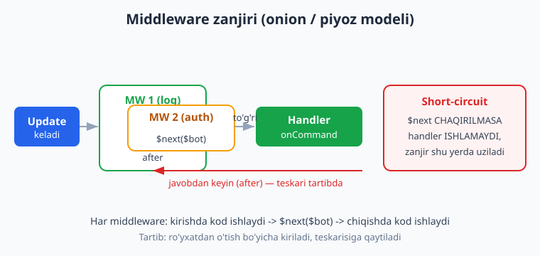
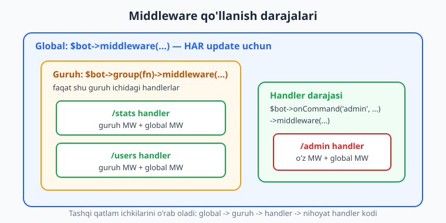
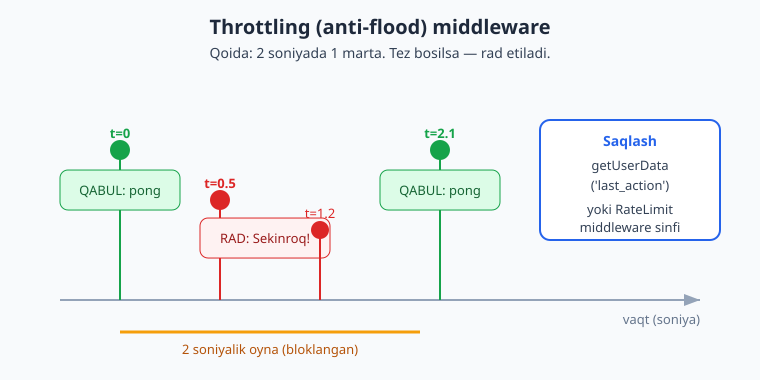

# 09 — Middleware

[⬅️ Oldingi: 08 — Conversations (suhbat / FSM)](./08-conversations.md) · [🏠 README](./README.md) · [Keyingi: 10 — Ma'lumotlar bazasi bilan ishlash ➡️](./10-malumotlar-bazasi.md)

---

> **Bu bobda:** Nutgram'da **middleware** — bu har bir update (xabar, callback, ...) handlergacha yetib borishidan oldin va keyin ishga tushadigan "oraliq qatlam". Quyidagilarni o'rganamiz: middleware'ning asosiy shakli (`$bot->middleware(function (Nutgram $bot, $next) { ...; $next($bot); })`), `$next($bot)` chaqirig'ining ma'nosi va **before/after** mantig'i (piyoz / onion modeli), **short-circuit** (zanjirni uzish — `$next` chaqirmaslik bilan handlerni butunlay to'xtatish), middleware'ni **uchta darajada** qo'llash (global / guruh / handler), **throttling / anti-flood** (qo'lda `getUserData` orqali va Nutgram'ning tayyor `RateLimit` middleware sinfi bilan), middleware orqali **ma'lumot ulashish** (`setUserData`/`getUserData` yoki konteyner), hamda **class-based** (sinf, `__invoke`) middleware. Majburiy-obuna middleware bu yerda asos sifatida ko'riladi, to'liq amaliyot esa [22-bobda](./22-majburiy-obuna.md).
>
> Halol eslatma: bu bobdagi BARCHA middleware mantig'i (before/after tartibi, short-circuit, throttle, RateLimit, ma'lumot ulashish, guruh-gate) `Nutgram::fake()` (FakeNutgram) bilan **offline, tarmoqsiz va tokensiz HAQIQATAN ishga tushirilib tekshirilgan** — natijalar quyida. Jonli Telegram'ga xabar yuborish (real `sendMessage`) — bu illustrativ qism, u jonli bot ishga tushganda ko'rinadi.

---

## Middleware nima va u nima uchun kerak?

Tasavvur qiling: sizda 20 ta buyruq bor va ularning ko'pchiligida bir xil tekshiruv kerak — "foydalanuvchi bloklangan emasmi?", "u admin'mi?", "har bir so'rovni log qilaylik", "spam'ni cheklaylik". Bularni har bir handler ichiga ko'chirib yozish — takror va xato manbai.

**Middleware** — aynan shu muammoni hal qiladi. U handler bilan update orasiga turadigan funksiya: update kelganda handlergacha **birinchi** middleware ishlaydi, u keyingisini chaqiradi, ... oxirida handler ishlaydi, so'ng nazorat **teskari** tartibda middleware'larga qaytadi.

Bu Laravel'dagi middleware bilan deyarli bir xil tushuncha (qarang [../laravel/README.md](../laravel/README.md)) — agar Laravel'ni bilsangiz, idea tanish bo'ladi.



## Eng oddiy middleware: shakli va `$next($bot)`

Middleware — bu ikki parametrli funksiya: `Nutgram $bot` va `$next` (keyingi bosqichni chaqiruvchi callable). Ichida ish bajariladi, so'ng **`$next($bot)`** chaqiriladi — bu "nazoratni keyingi bosqichga (boshqa middleware yoki handler'ga) uzat" degani.

```php
<?php
use SergiX44\Nutgram\Nutgram;

$bot = new Nutgram($_ENV['TELEGRAM_TOKEN']);

// Global middleware: HAR bir update uchun ishlaydi
$bot->middleware(function (Nutgram $bot, $next) {
    // 1) "before" qism — handlergacha
    $start = microtime(true);

    $next($bot); // <-- keyingi bosqich (boshqa MW yoki handler) ishlaydi

    // 2) "after" qism — handler tugagandan keyin
    $ms = round((microtime(true) - $start) * 1000);
    error_log("Update {$bot->updateId()} ishlov vaqti: {$ms} ms");
});

$bot->onCommand('start', function (Nutgram $bot) {
    $bot->sendMessage('Salom!');
});

$bot->run();
```

Bu yerda muhim g'oya — **piyoz (onion) modeli**:

- `$next($bot)` chaqirig'idan **oldin** yozgan kod — handlergacha (kirishda) ishlaydi;
- `$next($bot)` chaqirig'idan **keyin** yozgan kod — handler tugagach (chiqishda) ishlaydi.

Buni FakeNutgram bilan tekshirib ko'rdik. Quyidagi mini-test `before -> handler -> after` tartibini tasdiqlaydi:

```php
<?php
$order = [];

$bot = Nutgram::fake();
$bot->middleware(function (Nutgram $bot, $next) use (&$order) {
    $order[] = 'before';
    $next($bot);
    $order[] = 'after';
});
$bot->onCommand('start', function (Nutgram $bot) use (&$order) {
    $order[] = 'handler';
    $bot->sendMessage('Salom!');
});

$bot->hearText('/start')->reply();
$bot->assertReplyText('Salom!');

// $order === ['before', 'handler', 'after']  ✓ (tekshirildi)
```

> **DIQQAT:** Agar `$next($bot)` ni **chaqirishni unutsangiz**, handler **hech qachon ishlamaydi**. Bu eng ko'p uchraydigan middleware xatosi. "Bot javob bermayapti" desangiz — birinchi navbatda middleware'da `$next` borligini tekshiring.

## Short-circuit: zanjirni ataylab uzish (gate / qo'riqchi)

Aslida `$next` ni **chaqirmaslik** — bu xato emas, balki kuchli vosita. Agar shart bajarilmasa (masalan, foydalanuvchi admin emas), `$next` ni chaqirmasdan funksiyadan chiqib ketamiz — handler ishlamaydi. Buni **short-circuit** (qisqa tutashuv) yoki **gate** (qo'riqchi) deyiladi.

```php
<?php
$admins = [111111111, 222222222]; // admin Telegram ID'lari

$bot->onCommand('admin', function (Nutgram $bot) {
    $bot->sendMessage('Admin panelga xush kelibsiz.');
})->middleware(function (Nutgram $bot, $next) use ($admins) {
    if (!in_array($bot->userId(), $admins, true)) {
        $bot->sendMessage('Kechirasiz, bu buyruq faqat adminlar uchun.');
        return; // <-- $next CHAQIRILMAYDI => handler ishlamaydi
    }
    $next($bot); // admin bo'lsagina davom etamiz
});
```

Bu yerda `->middleware(...)` to'g'ridan-to'g'ri **bitta handlerga** biriktirilgan — global emas. Faqat `/admin` uchun ishlaydi.

FakeNutgram bilan ikkala tarmoq ham tekshirilgan (ruxsatli ID -> handler ishladi; ruxsatsiz ID -> "Ruxsat yo'q" javobi, handler ishlamadi):

```php
<?php
$allowed = [123 => true, 456 => false];

$bot = Nutgram::fake();
$bot->onCommand('admin', fn (Nutgram $bot) => $bot->sendMessage('Admin panel'))
    ->middleware(function (Nutgram $bot, $next) use ($allowed) {
        if (!($allowed[$bot->userId()] ?? false)) {
            $bot->sendMessage('Ruxsat yoq.');
            return;
        }
        $next($bot);
    });

// id=123 -> ruxsat bor
$bot->hearMessage(['text' => '/admin', 'from' => ['id' => 123]])->reply();
$bot->assertReplyText('Admin panel');          // ✓

// id=456 -> ruxsat yo'q (short-circuit)
$bot->hearMessage(['text' => '/admin', 'from' => ['id' => 456]])->reply();
$bot->assertReplyText('Ruxsat yoq.');          // ✓ handler ishlamadi
```

> Testda `hearMessage(['from' => ['id' => N]])` orqali foydalanuvchi ID'sini qo'lda beramiz. `hearText('/admin')` esa tasodifiy foydalanuvchi yaratadi — gate'ni sinash uchun ID'ni qotirish kerak.

## Uchta daraja: global, guruh, handler

Nutgram middleware'ni uch joyda biriktirishga ruxsat beradi. Tashqi qatlam ichkilarini o'rab oladi.



### 1) Global — `$bot->middleware(...)`

Har bir update uchun ishlaydi (buyruq, matn, callback, hammasi). Logging, til aniqlash, foydalanuvchini DB'da ro'yxatga olish kabilar uchun ideal.

```php
<?php
$bot->middleware(function (Nutgram $bot, $next) {
    // har update da: foydalanuvchini "ko'rdim" deb belgilab qo'yamiz
    if ($bot->userId() !== null) {
        $bot->setUserData('last_seen', time());
    }
    $next($bot);
});
```

### 2) Guruh — `$bot->group(...)->middleware(...)`

Bir nechta handlerga **umumiy** middleware kerak bo'lsa, ularni guruhga o'rab, guruhga middleware biriktiramiz. Masalan, butun admin bo'limini bitta gate bilan himoyalash:

```php
<?php
$bot->group(function (Nutgram $bot) {
    $bot->onCommand('stats', fn (Nutgram $bot) => $bot->sendMessage('Statistika'));
    $bot->onCommand('users', fn (Nutgram $bot) => $bot->sendMessage('Foydalanuvchilar'));
    $bot->onCommand('broadcast', fn (Nutgram $bot) => $bot->sendMessage('Tarqatish...'));
})->middleware(function (Nutgram $bot, $next) {
    if (!in_array($bot->userId(), [111111111], true)) {
        $bot->sendMessage('Bu bolim adminlarga.');
        return; // guruhdagi BARCHA handler bloklanadi
    }
    $next($bot);
});
```

Guruh-gate FakeNutgram bilan tekshirilgan: admin `/stats` ni ishlatdi, begona foydalanuvchi esa `/users` da ham bloklandi — ya'ni bitta middleware butun guruhni qoplaydi.

### 3) Handler — `->middleware(...)`

Yuqorida ko'rdik: faqat bitta handlerga biriktiriladi. Eng tor doira.

```php
<?php
$bot->onCommand('delete', fn (Nutgram $bot) => $bot->sendMessage("O'chirildi"))
    ->middleware($confirmMiddleware); // faqat shu buyruq uchun
```

> **Qanday tanlash?** Tekshiruv hammaga kerakmi — global. Bir necha bog'liq handlerga kerakmi — guruh. Faqat bittasiga kerakmi — handler. Doirani imkon qadar tor qiling: ortiqcha global middleware har update'ni sekinlashtiradi.

## Middleware tartibi va zanjiri

Bir nechta middleware qo'shsangiz, ular **ro'yxatdan o'tgan tartibda** kiriladi va **teskari** tartibda chiqiladi (onion modeli). Nutgram'da global middleware'lar uchun tartib — `$bot->middleware()` chaqirilgan tartib:

```php
<?php
$trace = [];

$bot = Nutgram::fake();
$bot->middleware(function (Nutgram $bot, $next) use (&$trace) {
    $trace[] = 'A-in';
    $next($bot);
    $trace[] = 'A-out';
});
$bot->middleware(function (Nutgram $bot, $next) use (&$trace) {
    $trace[] = 'B-in';
    $next($bot);
    $trace[] = 'B-out';
});
$bot->onCommand('x', function (Nutgram $bot) use (&$trace) {
    $trace[] = 'handler';
    $bot->sendMessage('ok');
});

$bot->hearText('/x')->reply();
// $trace: A-in -> B-in -> handler -> B-out -> A-out
```

Ya'ni **birinchi qo'shilgan A — eng tashqi qatlam** (birinchi kiradi, oxirida chiqadi), B esa ichkarida. Bu juda muhim: agar autentifikatsiya middleware'i logging'dan oldin turishi kerak bo'lsa, uni oldinroq ro'yxatdan o'tkazing. (Tekshirildi: ijro tartibi `A -> B` ko'rinishida.)

> **Texnik nozik nuqta (qiziquvchilar uchun):** Nutgram ichkarida global middleware'larni `array_unshift` bilan saqlaydi, lekin keyin handlerga qo'llaganda chaqiruv natijasida amaliy ijro tartibi yuqoridagidek — `$bot->middleware()` chaqirilish tartibida bo'ladi. Shuning uchun amalda "birinchi yozgan birinchi ishlaydi" deb yodda tutsangiz kifoya. Shubha bo'lsa — yuqoridagidek kichik FakeNutgram testi bilan o'zingiz tasdiqlang.

## Throttling / anti-flood

Foydalanuvchi tugmani juda tez bossa yoki spam yuborsa, botni va tashqi API'larni himoyalash kerak. **Throttling** — ma'lum vaqt oynasida so'rovlar sonini cheklash.



### Variant A — qo'lda, `getUserData`/`setUserData` bilan

Oddiy "2 soniyada 1 marta" qoidasi:

```php
<?php
$throttle = function (Nutgram $bot, $next) {
    $now  = time();
    $last = $bot->getUserData('last_action', default: 0);

    if ($now - $last < 2) {           // oynada — bloklaymiz
        $bot->sendMessage('Sekinroq! Bir oz kuting.');
        return;                       // short-circuit
    }

    $bot->setUserData('last_action', $now);
    $next($bot);
};

$bot->onCommand('ping', fn (Nutgram $bot) => $bot->sendMessage('pong'))
    ->middleware($throttle);
```

FakeNutgram bilan tekshirilgan: birinchi `/ping` -> `pong`, darhol takror `/ping` -> `Sekinroq!` (handler ishlamadi).

> **Eslatma:** soniya darajasidagi bu usul oddiy holatlar uchun yetarli. Aniqroq "N soniyada M marta" cheklash uchun Nutgram'ning tayyor `RateLimit` middleware'idan foydalaning (pastda).

### Variant B — Nutgram'ning tayyor `RateLimit` middleware'i

Nutgram qutidan chiqdi-chiqmasdan `RateLimit` middleware sinfini beradi. U `maxAttempts` (necha marta) va `decaySeconds` (qancha vaqt oynasida) ni oladi va limit oshganda foydalanuvchiga **bir marta** ogohlantirish yuboradi.

```php
<?php
use SergiX44\Nutgram\Middleware\RateLimit;

// 60 soniyada eng ko'pi 5 marta:
$bot->onCommand('hi', fn (Nutgram $bot) => $bot->sendMessage('hello'))
    ->middleware(new RateLimit(maxAttempts: 5, decaySeconds: 60));
```

Standart ogohlantirish matnini o'zgartirmoqchi bo'lsangiz — to'rtinchi argument `warningCallback` ni bering:

```php
<?php
$bot->onCommand('hi', fn (Nutgram $bot) => $bot->sendMessage('hello'))
    ->middleware(new RateLimit(
        maxAttempts: 5,
        decaySeconds: 60,
        warningCallback: function (Nutgram $bot, int $availableIn) {
            $bot->sendMessage("Juda tez! {$availableIn} soniyadan keyin urinib koring.");
        },
    ));
```

FakeNutgram bilan tekshirilgan (`maxAttempts: 1`): birinchi `/hi` -> `hello`, ikkinchi `/hi` -> standart ogohlantirish matni.

> **Muhim:** `RateLimit` kaliti `userId:chatId` bo'yicha hisoblanadi va sanoqni saqlash uchun **cache**'dan foydalanadi (PSR-16 `CacheInterface`). Standart holatda bu xotiradagi massiv — bot qayta ishga tushsa nollanadi. Production'da Redis yoki fayl-cache ulang (cache sozlash [11-bobda](./11-loyiha-tuzilishi.md)). Test paytida limit sezilishi uchun `userId` **va** `chatId` ikkalasini ham qotirish kerak (FakeNutgram har safar tasodifiy chat yaratadi).

## Middleware orqali ma'lumot ulashish

Middleware ko'pincha biror narsani "tayyorlab", uni handlerga uzatadi: foydalanuvchining roli, tili, DB'dan yuklangan profil va h.k. Buning ikki yo'li bor.

### Yo'l 1 — `setUserData` / `getUserData` (oddiy)

```php
<?php
$bot->middleware(function (Nutgram $bot, $next) {
    // amalda bu DB'dan o'qiladi (10-bobga qarang)
    $role = $bot->userId() === 111111111 ? 'admin' : 'user';
    $bot->setUserData('role', $role);
    $next($bot);
});

$bot->onCommand('whoami', function (Nutgram $bot) {
    $bot->sendMessage('Sizning rolingiz: ' . $bot->getUserData('role'));
});
```

Tekshirilgan: middleware `role=admin` ni yozdi, handler `getUserData('role')` orqali o'qib chiqardi.

> `setUserData`/`getUserData` ma'lumotni **cache**'da saqlaydi va u so'rovlar orasida ham yashaydi (foydalanuvchiga "yopishtirilgan"). Agar ma'lumot faqat **shu bitta update doirasida** kerak bo'lsa (keyin esa yaroqsiz), keyingi yo'l toza.

### Yo'l 2 — DI konteyneri (faqat shu update doirasi uchun)

Nutgram ichida DI konteyner bor. Middleware'da bir obyektni konteynerga `set` qilib, handlerda parametr orqali olishingiz mumkin — bu request-scope ma'lumot uchun toza:

```php
<?php
$bot->middleware(function (Nutgram $bot, $next) {
    // masalan, DB'dan yuklangan profil obyekti
    $profile = (object) ['id' => $bot->userId(), 'tier' => 'pro'];
    $bot->getContainer()->set('profile', $profile);
    $next($bot);
});

$bot->onCommand('plan', function (Nutgram $bot) {
    $profile = $bot->getContainer()->get('profile');
    $bot->sendMessage('Tarifingiz: ' . $profile->tier);
});
```

> Sodda loyihalarda `setUserData` yetarli. Konteyner yondashuvi yirikroq, sinflarga asoslangan loyihalarda foydali ([11-bobda](./11-loyiha-tuzilishi.md) chuqurroq).

## Class-based middleware (tartibli, qayta ishlatiladigan)

Closure'lar kichik mantiq uchun yaxshi, lekin middleware murakkablashsa yoki uni bir nechta joyda ishlatmoqchi bo'lsangiz — uni **sinf** sifatida yozing. Sinfda `__invoke(Nutgram $bot, $next)` metodi bo'lishi kifoya:

```php
<?php
namespace App\Middleware;

use SergiX44\Nutgram\Nutgram;

class EnsureAdmin
{
    /** @param int[] $admins */
    public function __construct(private array $admins) {}

    public function __invoke(Nutgram $bot, $next): void
    {
        if (!in_array($bot->userId(), $this->admins, true)) {
            $bot->sendMessage('Faqat adminlar uchun.');
            return; // short-circuit
        }
        $next($bot);
    }
}
```

Ishlatish — closure o'rniga obyekt (yoki class-string) beramiz:

```php
<?php
use App\Middleware\EnsureAdmin;

$adminGate = new EnsureAdmin([111111111, 222222222]);

$bot->onCommand('panel', fn (Nutgram $bot) => $bot->sendMessage('Panel ochildi'))
    ->middleware($adminGate);

// yoki guruhga:
$bot->group(function (Nutgram $bot) {
    $bot->onCommand('ban', fn (Nutgram $bot) => $bot->sendMessage('Ban...'));
    $bot->onCommand('kick', fn (Nutgram $bot) => $bot->sendMessage('Kick...'));
})->middleware($adminGate);
```

Tekshirilgan: admin ID `/panel` ni ishlatdi (`Panel ochildi`), begona ID rad etildi (`Faqat adminlar uchun.`).

> Sinfli middleware'lar test qilish va qayta ishlatish uchun qulay. Konstruktor orqali sozlamalarni (adminlar ro'yxati, limitlar) berib yuborasiz.

## Amaliy mavzu: majburiy-obuna (asos)

Tez-tez kerak bo'ladigan vazifa — "botdan foydalanish uchun avval falon kanalga obuna bo'ling". Bu **aynan middleware uchun** mukammal vazifa: gate qo'yamiz, agar foydalanuvchi obuna emas bo'lsa — short-circuit qilib, obuna tugmasini ko'rsatamiz.

Asosiy g'oya (to'liq amaliyot va FakeNutgram tarmoq-testi [22-bobda](./22-majburiy-obuna.md)):

```php
<?php
use SergiX44\Nutgram\Nutgram;
use SergiX44\Nutgram\Telegram\Properties\ChatMemberStatus;

$forceSubscribe = function (Nutgram $bot, $next) {
    $channel = '@mychannel';

    $member = $bot->getChatMember($channel, $bot->userId());
    $obuna = in_array($member->status, [
        ChatMemberStatus::CREATOR,
        ChatMemberStatus::ADMINISTRATOR,
        ChatMemberStatus::MEMBER,
    ], true);

    if (!$obuna) {
        $bot->sendMessage("Davom etish uchun {$channel} kanaliga obuna boling.");
        return; // short-circuit
    }
    $next($bot);
};

$bot->middleware($forceSubscribe);
```

> Bu yerda `getChatMember` jonli Telegram'ni talab qiladi (bot kanalga qo'shilgan bo'lishi kerak) — shuning uchun bu qism **illustrativ**. Lekin gate **mantig'i** (status -> obuna -> short-circuit) sof middleware bo'lib, [22-bobda](./22-majburiy-obuna.md) FakeNutgram bilan `getChatMember` javobini soxtalashtirib to'liq tekshiramiz.

## Bobni qanday tekshirdik (halol eslatma)

Yuqoridagi misollarning mantig'i `Nutgram::fake()` (FakeNutgram) bilan offline ishga tushirilib tasdiqlandi — token va internet kerak emas. Tekshirilgan jihatlar:

- `before -> handler -> after` tartibi va `$next($bot)` semantikasi;
- short-circuit (gate) — `$next` chaqirilmaganda handler ishlamasligi;
- bir nechta middleware ijro tartibi (`A -> B`);
- throttle (qo'lda `getUserData`) — ikkinchi tez so'rov bloklanishi;
- tayyor `RateLimit` middleware — limit oshganda ogohlantirish;
- middleware -> handler ma'lumot ulashish (`role`);
- class-based middleware (`__invoke`) ruxsat/rad tarmoqlari;
- guruh (group) middleware butun guruhni qoplashi.

Jonli `sendMessage`, real `getChatMember`/majburiy-obuna va Redis-cache esa jonli muhitni talab qiladi — ular illustrativ.

## Mashqlar

### Oson

1. Global middleware yozing: har update uchun `error_log` ga `userId` va update turini chiqarsin (`$bot->update()->getType()`). `$next($bot)` ni qo'shishni unutmang.
2. `/secret` buyrug'iga handler-middleware biriktiring: faqat `userId === SIZNING_ID` bo'lsa "Maxfiy ma'lumot", aks holda "Ruxsat yo'q" yuborsin.
3. Yuqoridagi 2-mashqni FakeNutgram bilan tekshiring: bitta ruxsatli, bitta ruxsatsiz `hearMessage(['from' => ['id' => ...]])` bilan ikkala tarmoqni `assertReplyText` orqali tasdiqlang.
4. "before/after" log middleware yozing: handler ishlash vaqtini (`microtime`) o'lchab, `after` qismida millisekundda chiqarsin.
5. `$next($bot)` ni **ataylab** olib tashlang va botda nima bo'lishini kuzating (handler ishlamasligini). So'ng qaytaring.
6. Ikki global middleware qo'shing (A va B), ularda `before`/`after` log qiling va ijro tartibini (`A-in, B-in, handler, B-out, A-out`) FakeNutgram bilan tasdiqlang.

### O'rta

1. `EnsureAdmin` class-based middleware yozing (konstruktorda `int[] $admins`). Uni bitta handlerga va bitta guruhga biriktiring; ikkalasini ham FakeNutgram bilan tekshiring.
2. Qo'lda throttle middleware yozing: "3 soniyada 1 marta". Birinchi so'rov o'tishi, darhol takror so'rov bloklanishi, va vaqt o'tib qaytadan o'tishini (testda `setUserData('last_action', time() - 4)` bilan vaqtni "orqaga surib") tekshiring.
3. Nutgram'ning `RateLimit` middleware'idan foydalaning (`maxAttempts: 2, decaySeconds: 60`) va `warningCallback` orqali ogohlantirish matnini o'zbekchaga o'zgartiring. FakeNutgram'da `userId` va `chatId` ni qotirib, uchinchi so'rovda ogohlantirish chiqishini tekshiring.
4. Til-aniqlash middleware yozing: foydalanuvchi `language_code` ga qarab `setUserData('lang', ...)` qo'ysin; handlerda `getUserData('lang')` orqali "uz"/"en" salomini chiqaring.
5. Guruh middleware yozing: nojo'ya so'z (masalan, "spam") borligini tekshirib, agar bor bo'lsa short-circuit qilsin va "Bu so'z taqiqlangan" yuborsin; aks holda davom etsin.
6. DI konteyner orqali ma'lumot ulashing: middleware'da `getContainer()->set('profile', ...)`, handlerda `get('profile')`. Nega bu `setUserData` dan farqli ekanini izohlang.

### Qiyin

1. **Tartib-bog'liq zanjir:** uchta global middleware (Auth -> Throttle -> Log) yozing. Auth short-circuit qilsa, Throttle va Log umuman ishlamasligini (ya'ni gate eng tashqarida turishini) FakeNutgram bilan tasdiqlang. Trace massivi yordamida har bosqichni qayd qiling.
2. **Konfiguratsiya bo'yicha throttle:** class-based throttle middleware yozing — konstruktorda `maxPerWindow` va `windowSeconds` oladi, `getUserData` da urinishlar tarixini (timestamp massivini) saqlaydi va eski yozuvlarni tozalaydi. Bir necha ssenariyni (oynaga sig'gan/sig'magan) test qiling.
3. **Majburiy-obuna gate (mantiq qismi):** `getChatMember` javobini parametr sifatida qabul qiladigan sof funksiya `isSubscribed(string $status): bool` yozing (`CREATOR`/`ADMINISTRATOR`/`MEMBER` -> true, `LEFT`/`KICKED` -> false). Uni phpunit/oddiy assert bilan har status uchun tekshiring. (Jonli `getChatMember` bilan ulash — [22-bob](./22-majburiy-obuna.md).)
4. **Guruh + handler middleware birgalikda:** bir handlerga ham guruh middleware (gate), ham handler middleware (throttle) ta'sir qiladigan holat quring. Ikkala middleware ham qaysi tartibda ishlashini trace bilan aniqlang va izohlang.

<details markdown="1"><summary>Yechimlar</summary>

**Oson 1.**
```php
<?php
$bot->middleware(function (\SergiX44\Nutgram\Nutgram $bot, $next) {
    error_log('user=' . $bot->userId() . ' type=' . $bot->update()?->getType()?->value);
    $next($bot);
});
```

**Oson 2–3.**
```php
<?php
use SergiX44\Nutgram\Nutgram;

const MY_ID = 111111111;

$bot = Nutgram::fake();
$bot->onCommand('secret', fn (Nutgram $bot) => $bot->sendMessage("Maxfiy ma'lumot"))
    ->middleware(function (Nutgram $bot, $next) {
        if ($bot->userId() !== MY_ID) {
            $bot->sendMessage("Ruxsat yo'q");
            return;
        }
        $next($bot);
    });

$bot->hearMessage(['text' => '/secret', 'from' => ['id' => MY_ID]])->reply();
$bot->assertReplyText("Maxfiy ma'lumot");

$bot->hearMessage(['text' => '/secret', 'from' => ['id' => 999]])->reply();
$bot->assertReplyText("Ruxsat yo'q");
```

**Oson 4.**
```php
<?php
$bot->middleware(function (\SergiX44\Nutgram\Nutgram $bot, $next) {
    $t0 = microtime(true);
    $next($bot);
    error_log('ishlov vaqti: ' . round((microtime(true) - $t0) * 1000) . ' ms');
});
```

**Oson 5.** `$next($bot)` ni olib tashlasangiz, middleware kodi ishlaydi-yu, handler hech qachon chaqirilmaydi — bot "jim" qoladi. Qaytarib qo'ying. Bu — `$next` ning ahamiyatini ko'rsatuvchi mashq.

**Oson 6.**
```php
<?php
use SergiX44\Nutgram\Nutgram;

$trace = [];
$bot = Nutgram::fake();
$bot->middleware(function (Nutgram $bot, $next) use (&$trace) { $trace[] = 'A-in'; $next($bot); $trace[] = 'A-out'; });
$bot->middleware(function (Nutgram $bot, $next) use (&$trace) { $trace[] = 'B-in'; $next($bot); $trace[] = 'B-out'; });
$bot->onCommand('x', function (Nutgram $bot) use (&$trace) { $trace[] = 'handler'; $bot->sendMessage('ok'); });

$bot->hearText('/x')->reply();
assert($trace === ['A-in', 'B-in', 'handler', 'B-out', 'A-out']);
```

**O'rta 1.**
```php
<?php
namespace App\Middleware;
use SergiX44\Nutgram\Nutgram;

class EnsureAdmin
{
    public function __construct(private array $admins) {}
    public function __invoke(Nutgram $bot, $next): void
    {
        if (!in_array($bot->userId(), $this->admins, true)) {
            $bot->sendMessage('Faqat adminlar uchun.');
            return;
        }
        $next($bot);
    }
}
// Test:
$gate = new EnsureAdmin([10, 20]);
$bot = Nutgram::fake();
$bot->onCommand('panel', fn (Nutgram $bot) => $bot->sendMessage('Panel'))->middleware($gate);
$bot->hearMessage(['text' => '/panel', 'from' => ['id' => 10]])->reply();
$bot->assertReplyText('Panel');
$bot->hearMessage(['text' => '/panel', 'from' => ['id' => 99]])->reply();
$bot->assertReplyText('Faqat adminlar uchun.');
```

**O'rta 2.**
```php
<?php
use SergiX44\Nutgram\Nutgram;

$throttle = function (Nutgram $bot, $next) {
    $now = time();
    $last = $bot->getUserData('last_action', default: 0);
    if ($now - $last < 3) { $bot->sendMessage('Sekinroq!'); return; }
    $bot->setUserData('last_action', $now);
    $next($bot);
};
$bot = Nutgram::fake();
$bot->onCommand('ping', fn (Nutgram $bot) => $bot->sendMessage('pong'))->middleware($throttle);

$msg = ['text' => '/ping', 'from' => ['id' => 5]];
$bot->hearMessage($msg)->reply();  $bot->assertReplyText('pong');
$bot->hearMessage($msg)->reply();  $bot->assertReplyText('Sekinroq!');
// vaqtni "orqaga surib" oyna o'tganini simulyatsiya qilamiz:
$bot->setUserData('last_action', time() - 4, userId: 5);
$bot->hearMessage($msg)->reply();  $bot->assertReplyText('pong');
```

**O'rta 3.**
```php
<?php
use SergiX44\Nutgram\Nutgram;
use SergiX44\Nutgram\Middleware\RateLimit;

$bot = Nutgram::fake();
$bot->onCommand('hi', fn (Nutgram $bot) => $bot->sendMessage('salom'))
    ->middleware(new RateLimit(
        maxAttempts: 2,
        decaySeconds: 60,
        warningCallback: fn (Nutgram $bot, int $availableIn) => $bot->sendMessage("Juda tez! {$availableIn}s kuting."),
    ));

$msg = ['text' => '/hi', 'from' => ['id' => 7], 'chat' => ['id' => 7, 'type' => 'private']];
$bot->hearMessage($msg)->reply(); $bot->assertReplyText('salom');
$bot->hearMessage($msg)->reply(); $bot->assertReplyText('salom');
$bot->hearMessage($msg)->reply(); // uchinchi -> oshdi
$bot->assertReply('sendMessage'); // ogohlantirish yuborildi
```

**O'rta 4.**
```php
<?php
use SergiX44\Nutgram\Nutgram;
$bot->middleware(function (Nutgram $bot, $next) {
    $code = $bot->user()?->language_code ?? 'en';
    $bot->setUserData('lang', str_starts_with($code, 'uz') ? 'uz' : 'en');
    $next($bot);
});
$bot->onCommand('hi', function (Nutgram $bot) {
    $bot->sendMessage($bot->getUserData('lang') === 'uz' ? 'Salom!' : 'Hello!');
});
```

**O'rta 5.**
```php
<?php
use SergiX44\Nutgram\Nutgram;
$bot->group(function (Nutgram $bot) {
    $bot->onText('.*', fn (Nutgram $bot) => $bot->sendMessage('Qabul qilindi'));
})->middleware(function (Nutgram $bot, $next) {
    if (str_contains(strtolower($bot->message()?->text ?? ''), 'spam')) {
        $bot->sendMessage("Bu so'z taqiqlangan");
        return;
    }
    $next($bot);
});
```

**O'rta 6.**
```php
<?php
use SergiX44\Nutgram\Nutgram;
$bot->middleware(function (Nutgram $bot, $next) {
    $bot->getContainer()->set('profile', (object) ['id' => $bot->userId(), 'tier' => 'pro']);
    $next($bot);
});
$bot->onCommand('plan', function (Nutgram $bot) {
    $bot->sendMessage('Tarif: ' . $bot->getContainer()->get('profile')->tier);
});
```
Farqi: konteynerdagi qiymat faqat **shu update** doirasida yashaydi (har update yangi konteyner-doirasi); `setUserData` esa cache'da saqlanib, **keyingi** so'rovlarda ham mavjud bo'ladi.

**Qiyin 1.**
```php
<?php
use SergiX44\Nutgram\Nutgram;
$trace = [];
$auth     = function (Nutgram $bot, $next) use (&$trace) {
    $trace[] = 'auth';
    if ($bot->userId() !== 10) { $bot->sendMessage('rad'); return; } // short-circuit
    $next($bot);
};
$throttle = function (Nutgram $bot, $next) use (&$trace) { $trace[] = 'throttle'; $next($bot); };
$log      = function (Nutgram $bot, $next) use (&$trace) { $trace[] = 'log'; $next($bot); };

$bot = Nutgram::fake();
$bot->middleware($auth);
$bot->middleware($throttle);
$bot->middleware($log);
$bot->onCommand('x', function (Nutgram $bot) use (&$trace) { $trace[] = 'handler'; $bot->sendMessage('ok'); });

$bot->hearMessage(['text' => '/x', 'from' => ['id' => 99]])->reply();
$bot->assertReplyText('rad');
assert($trace === ['auth']); // throttle/log/handler ISHLAMADI
```

**Qiyin 2.**
```php
<?php
namespace App\Middleware;
use SergiX44\Nutgram\Nutgram;

class SlidingWindowThrottle
{
    public function __construct(private int $maxPerWindow, private int $windowSeconds) {}
    public function __invoke(Nutgram $bot, $next): void
    {
        $now = time();
        $hits = array_filter(
            $bot->getUserData('hits', default: []),
            fn ($ts) => $now - $ts < $this->windowSeconds
        );
        if (count($hits) >= $this->maxPerWindow) {
            $bot->sendMessage('Limit oshdi, kuting.');
            $bot->setUserData('hits', array_values($hits));
            return;
        }
        $hits[] = $now;
        $bot->setUserData('hits', array_values($hits));
        $next($bot);
    }
}
```

**Qiyin 3.**
```php
<?php
use SergiX44\Nutgram\Telegram\Properties\ChatMemberStatus;

function isSubscribed(string $status): bool
{
    return in_array($status, [
        ChatMemberStatus::CREATOR->value,
        ChatMemberStatus::ADMINISTRATOR->value,
        ChatMemberStatus::MEMBER->value,
    ], true);
}
assert(isSubscribed('member') === true);
assert(isSubscribed('creator') === true);
assert(isSubscribed('left') === false);
assert(isSubscribed('kicked') === false);
```

**Qiyin 4.** Guruh middleware (gate) handler middleware (throttle) dan **tashqarida** turadi: avval guruh-gate, so'ng handler-throttle, so'ng handler. Buni trace bilan tasdiqlang:
```php
<?php
use SergiX44\Nutgram\Nutgram;
$trace = [];
$bot = Nutgram::fake();
$bot->group(function (Nutgram $bot) use (&$trace) {
    $bot->onCommand('do', function (Nutgram $bot) use (&$trace) { $trace[] = 'handler'; $bot->sendMessage('ok'); })
        ->middleware(function (Nutgram $bot, $next) use (&$trace) { $trace[] = 'throttle'; $next($bot); });
})->middleware(function (Nutgram $bot, $next) use (&$trace) { $trace[] = 'gate'; $next($bot); });

$bot->hearText('/do')->reply();
// $trace: gate -> throttle -> handler  (guruh tashqarida, handler-MW ichkarida)
```
</details>

---

[⬅️ Oldingi: 08 — Conversations (suhbat / FSM)](./08-conversations.md) · [🏠 README](./README.md) · [Keyingi: 10 — Ma'lumotlar bazasi bilan ishlash ➡️](./10-malumotlar-bazasi.md)
