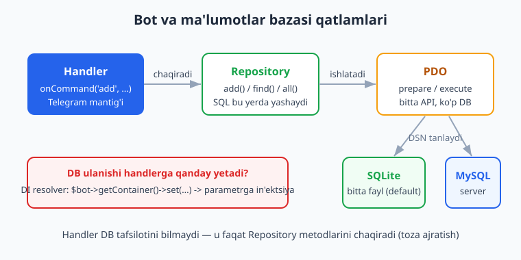
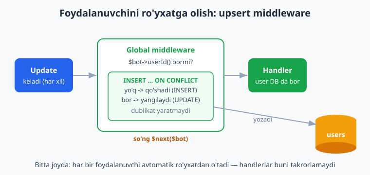
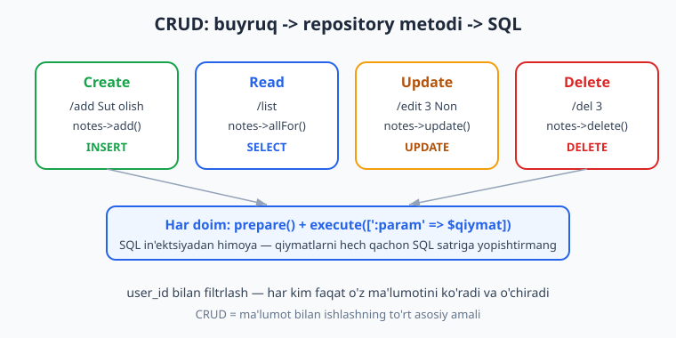

# 10 — Ma'lumotlar bazasi bilan ishlash

[⬅️ Oldingi: 09 — Middleware](./09-middleware.md) · [🏠 README](./README.md) · [Keyingi: 11 — Loyiha tuzilishi va konfiguratsiya ➡️](./11-loyiha-tuzilishi.md)

---

> **Bu bobda:** Botingiz endi xabar yuboradi, klaviatura ko'rsatadi, suhbat oladi — lekin u **hech narsani eslab qolmaydi**. Bot qayta ishga tushsa, hamma narsa yo'qoladi. Bu bobda botga **xotira** beramiz: ma'lumotni ma'lumotlar bazasiga saqlaymiz. O'rganamiz: PHP'ning **PDO** kengaytmasi orqali bazaga ulanish (default **SQLite** — bitta fayl, o'rnatish shart emas; va **MySQL** — bir qator o'zgartirish bilan); oddiy **migratsiya** (jadval yaratish); **repository naqsh** (SQL'ni handlerdan ajratish); foydalanuvchilarni **middleware orqali ro'yxatga olish** (`INSERT ... ON CONFLICT` — upsert, dublikatsiz); DB ulanishini handlerga **Nutgram DI resolver/konteyner** orqali (yoki global) berish; va to'liq **CRUD** (Create/Read/Update/Delete) bot buyruqlari sifatida. SQL'ni chuqurroq o'rganish uchun [../sql/README.md](../sql/README.md), PDO va PHP asoslari uchun [../php/README.md](../php/README.md).
>
> Halol eslatma: bu bobdagi BARCHA DB mantig'i — migratsiya, repository metodlari, upsert (dublikat yaratmaslik), middleware orqali ro'yxatga olish, resolver orqali repository in'ektsiyasi va CRUD oqimi — **`PDO sqlite::memory:` + `Nutgram::fake()` (FakeNutgram) bilan offline, tarmoqsiz va tokensiz HAQIQATAN ishga tushirilib tekshirilgan** (14 ta tekshiruv, hammasi o'tdi — natijalar quyida). Jonli Telegram'ga xabar yuborish va production'da fayl/MySQL serverga real ulanish — illustrativ qism, u jonli bot ishga tushganda ko'rinadi.

---

## Nega botga ma'lumotlar bazasi kerak?

Oldingi boblardagi botlar ma'lumotni **xotirada** (`setUserData`, oddiy massiv) saqladi. Bu vaqtinchalik: PHP jarayoni to'xtasa yoki bot qayta ishga tushsa — ma'lumot yo'qoladi. Haqiqiy bot esa eslab qolishi kerak:

- **kim** botdan foydalangan (foydalanuvchilar ro'yxati, broadcast uchun, statistika uchun);
- foydalanuvchining **sozlamalari** (til, bildirishnoma yoqilganmi);
- foydalanuvchi yaratgan **ma'lumotlar** (eslatmalar, buyurtmalar, ballar — clicker o'yinidagi tangalar kabi).

Bularning hammasi **doimiy xotira** — ma'lumotlar bazasini talab qiladi. Biz PHP'ning standart **PDO** (PHP Data Objects) kengaytmasidan foydalanamiz: u bitta umumiy API orqali turli bazalar (SQLite, MySQL, PostgreSQL, ...) bilan ishlashga imkon beradi. SQL tilini bu yerda noldan o'rgatmaymiz — agar `INSERT`, `SELECT`, `WHERE` tanish bo'lmasa, avval [../sql/README.md](../sql/README.md) ni ko'ring. PDO'ning o'zi haqida [../php/README.md](../php/README.md) da batafsil.



Yuqoridagi diagramma butun bobning xaritasi: **handler** Telegram mantig'ini biladi, lekin SQL yozmaydi; u **repository**'ni chaqiradi; repository **PDO** orqali bazaga boradi; PDO esa SQLite yoki MySQL bilan ishlaydi. DB ulanishi handlerga DI resolver orqali yetadi. Endi har bir qatlamni quramiz.

## PDO bilan ulanish: SQLite (default)

**SQLite** — bot loyihalari uchun eng qulay boshlang'ich tanlov: u **server talab qilmaydi**, ma'lumot bitta `.sqlite` faylda yashaydi, va PHP'da `pdo_sqlite` odatda yoqilgan bo'ladi. Kichik-o'rta bot uchun bu yetarli.

Ulanish — bitta `PDO` obyekti yaratish:

```php
<?php
function makeDb(string $path = __DIR__ . '/storage/bot.sqlite'): PDO
{
    $pdo = new PDO('sqlite:' . $path);
    // Xato bo'lsa istisno (exception) tashlasin — eng muhim sozlama
    $pdo->setAttribute(PDO::ATTR_ERRMODE, PDO::ERRMODE_EXCEPTION);
    // SELECT natijasi assotsiativ massiv bo'lsin: ['name' => '...'] ko'rinishida
    $pdo->setAttribute(PDO::ATTR_DEFAULT_FETCH_MODE, PDO::FETCH_ASSOC);
    return $pdo;
}
```

DSN (`'sqlite:' . $path`) — bu baza manzili. Maxsus holat: `sqlite::memory:` — baza faqat **xotirada** yashaydi va jarayon tugashi bilan yo'qoladi. Bu **test uchun ideal**: har test toza, bo'sh bazadan boshlanadi. Aynan shuni bu bobni tekshirishda ishlatdik.

> **Ikki sozlama nega muhim?** `ERRMODE_EXCEPTION'siz` PDO xatolarni "jim" yutadi — noto'g'ri SQL hech narsa demay ishlamay qoladi, debug qiyinlashadi. `FETCH_ASSOC'siz` esa har qator ham raqamli, ham nomli kalitlar bilan keladi (ikki barobar katta massiv). Bu ikkovini **doim** o'rnating.

## MySQL'ga o'tish: faqat DSN o'zgaradi

PDO'ning kuchi shunda: kod deyarli o'zgarmaydi, faqat **DSN va login** boshqacha bo'ladi. SQLite'dan MySQL'ga o'tish uchun ulanish funksiyasini almashtirsangiz kifoya — repository va handlerlar **teginmaydi**:

```php
<?php
function makeDbMysql(): PDO
{
    $host = $_ENV['DB_HOST'] ?? '127.0.0.1';
    $name = $_ENV['DB_NAME'] ?? 'mybot';
    $user = $_ENV['DB_USER'] ?? 'root';
    $pass = $_ENV['DB_PASS'] ?? '';

    $dsn = "mysql:host={$host};dbname={$name};charset=utf8mb4";
    $pdo = new PDO($dsn, $user, $pass);
    $pdo->setAttribute(PDO::ATTR_ERRMODE, PDO::ERRMODE_EXCEPTION);
    $pdo->setAttribute(PDO::ATTR_DEFAULT_FETCH_MODE, PDO::FETCH_ASSOC);
    return $pdo;
}
```

Farqlar:

- DSN endi `mysql:host=...;dbname=...;charset=utf8mb4` — `utf8mb4` o'zbekcha matn va emoji uchun shart;
- login va parol kerak — ular **`.env`** dan o'qiladi, kodga yozilmaydi (xuddi bot tokeni kabi — [11-bobga](./11-loyiha-tuzilishi.md) qarang);
- MySQL serveri ishlab turishi va baza oldindan yaratilgan bo'lishi kerak.

> **Diqqat — kichik dialekt farqlari bor.** SQLite va MySQL SQL'i 95% bir xil, lekin ba'zi joylar farq qiladi: avtomatik ID (`INTEGER PRIMARY KEY AUTOINCREMENT` vs `INT AUTO_INCREMENT PRIMARY KEY`), vaqt (`CURRENT_TIMESTAMP` ikkovida ham bor) va upsert sintaksisi. Bu bobda **SQLite** sintaksisini ishlatamiz (chunki offline tekshirdik); MySQL ekvivalentlarini mos joyda eslatamiz. Dialekt tafsilotlari — [../sql/README.md](../sql/README.md).

## Migratsiya: jadvallarni yaratish

Baza bo'sh — unda **jadvallar** kerak. Jadvallarni yaratuvchi SQL'ni bir joyda saqlash va botni birinchi marta ishga tushganda yurgizish — bu sodda **migratsiya**. (Yirik loyihalarda alohida migratsiya kutubxonasi bo'ladi; biz bu yerda eng oddiy "kerak bo'lsa yarat" usulini ko'ramiz.)

Ikki jadval quramiz: foydalanuvchilar (`users`) va eslatmalar (`notes`):

```php
<?php
function migrate(PDO $pdo): void
{
    $pdo->exec(<<<SQL
        CREATE TABLE IF NOT EXISTS users (
            id          INTEGER PRIMARY KEY,
            telegram_id INTEGER NOT NULL UNIQUE,
            first_name  TEXT,
            username    TEXT,
            created_at  TEXT NOT NULL DEFAULT CURRENT_TIMESTAMP,
            last_seen   TEXT
        )
    SQL);

    $pdo->exec(<<<SQL
        CREATE TABLE IF NOT EXISTS notes (
            id      INTEGER PRIMARY KEY AUTOINCREMENT,
            user_id INTEGER NOT NULL,
            body    TEXT NOT NULL,
            FOREIGN KEY (user_id) REFERENCES users(telegram_id)
        )
    SQL);
}
```

Muhim nuqtalar:

- **`CREATE TABLE IF NOT EXISTS`** — jadval allaqachon bor bo'lsa, qayta yaratmaydi (xato bermaydi). Shuning uchun har ishga tushganda chaqirsa bo'ladi.
- **`telegram_id ... UNIQUE`** — bu Telegram foydalanuvchining ID'si. `UNIQUE` bo'lgani uchun bitta odam ikki marta yozilmaydi — bu **upsert**ning asosi (pastda).
- **`exec()`** natija qaytarmaydigan SQL (CREATE, ba'zan DELETE) uchun ishlatiladi. Ma'lumot qaytaruvchi (`SELECT`) uchun esa `query()` yoki `prepare()` ishlatamiz.

> **MySQL farqi:** u yerda `id INTEGER PRIMARY KEY` o'rniga `id INT AUTO_INCREMENT PRIMARY KEY`, `TEXT DEFAULT CURRENT_TIMESTAMP` o'rniga `TIMESTAMP DEFAULT CURRENT_TIMESTAMP` yoziladi. Tuzilma g'oyasi bir xil.

## Repository naqsh: SQL'ni handlerdan ajrating

SQL'ni to'g'ridan-to'g'ri handler ichiga yozish mumkin, lekin tez orada bu chalkashlikka aylanadi: bir xil so'rov bir necha joyda takrorlanadi, o'zgartirish qiyin, test qilib bo'lmaydi. **Repository naqsh** — yechim: bitta jadval bilan ishlashning **barcha** SQL'ini bitta sinfga jamlaymiz. Handler faqat metod chaqiradi (`$users->find(123)`), SQL'ni ko'rmaydi.

```php
<?php
final class UserRepository
{
    public function __construct(private PDO $pdo) {}

    public function upsert(int $tgId, ?string $firstName, ?string $username): void
    {
        $st = $this->pdo->prepare(<<<SQL
            INSERT INTO users (telegram_id, first_name, username, last_seen)
            VALUES (:tid, :fn, :un, CURRENT_TIMESTAMP)
            ON CONFLICT(telegram_id) DO UPDATE SET
                first_name = excluded.first_name,
                username   = excluded.username,
                last_seen  = CURRENT_TIMESTAMP
        SQL);
        $st->execute(['tid' => $tgId, 'fn' => $firstName, 'un' => $username]);
    }

    public function find(int $tgId): ?array
    {
        $st = $this->pdo->prepare('SELECT * FROM users WHERE telegram_id = :tid');
        $st->execute(['tid' => $tgId]);
        return $st->fetch() ?: null; // qator yo'q bo'lsa null
    }

    public function count(): int
    {
        return (int) $this->pdo->query('SELECT COUNT(*) FROM users')->fetchColumn();
    }
}
```

Diqqat qiling — **har doim `prepare()` + `execute([':param' => $qiymat])`**, hech qachon qiymatni SQL satriga yopishtirmaymiz. Bu **SQL in'ektsiya**dan himoya: agar foydalanuvchi nomi `'; DROP TABLE users; --` bo'lsa ham, u oddiy matn sifatida saqlanadi, kod sifatida ishlamaydi. Bu bot xavfsizligining eng muhim qoidalaridan biri.

`upsert()` ichidagi **`INSERT ... ON CONFLICT(telegram_id) DO UPDATE`** — eng muhim usul. Uni alohida ko'ramiz.

> **MySQL upsert farqi:** SQLite'da `ON CONFLICT(telegram_id) DO UPDATE SET col = excluded.col`. MySQL'da esa `INSERT ... ON DUPLICATE KEY UPDATE col = VALUES(col)`. Mantiq bir xil: "bor bo'lsa yangila, yo'q bo'lsa qo'sh".

## Foydalanuvchilarni middleware orqali ro'yxatga olish (upsert)

Endi eng amaliy qism. Biz **har bir update**da (xabar, callback, hamma narsa) foydalanuvchini avtomatik ro'yxatga olishni xohlaymiz — bu [9-bobdagi](./09-middleware.md) middleware uchun mukammal vazifa: bitta joyda yozamiz, hamma handler buni "tekin" oladi.



Muammo: agar har update'da oddiy `INSERT` qilsak, ikkinchi xabarda **dublikat** yoki `UNIQUE` xato chiqadi. Yechim — **upsert**: "agar yo'q bo'lsa qo'sh, agar bor bo'lsa yangila". Aynan shu uchun `telegram_id` ustuniga `UNIQUE` qo'ydik va `ON CONFLICT(telegram_id) DO UPDATE` yozdik.

```php
<?php
use SergiX44\Nutgram\Nutgram;

$users = new UserRepository($pdo); // $pdo yuqorida yaratilgan

$bot->middleware(function (Nutgram $bot, $next) use ($users) {
    if ($bot->userId() !== null) {          // kanal posti kabi userId yo'q holatlar bor
        $u = $bot->user();
        $users->upsert($bot->userId(), $u?->first_name, $u?->username);
    }
    $next($bot);                            // <-- davom: handler ishlaydi
});
```

Bu middleware: birinchi `/start`da foydalanuvchini **qo'shadi**, keyingi har bir update'da esa uning `first_name`/`username` va `last_seen` ni **yangilaydi** — yangi qator yaratmaydi. Buni FakeNutgram bilan tasdiqladik (quyida).

> **Nega `$bot->userId() !== null` tekshiruvi?** Kanal posti, ba'zi service-update'larda foydalanuvchi bo'lmasligi mumkin. `null` ID'ni bazaga yozish mantiqsiz — shuning uchun avval tekshiramiz. Bu [9-bobdagi](./09-middleware.md) "before" mantig'i: `$next`dan oldin ishlaydi.

## DB ulanishini handlerga berish: Nutgram resolver / konteyner

Repository tayyor, lekin handler ichida unga qanday yetib boramiz? Uch yo'l bor. Eng tozasi — Nutgram'ning **DI konteyneri** (resolver): obyektni bir marta konteynerga `set` qilamiz, so'ng handler **parametr orqali** (type-hint bo'yicha) avtomatik oladi.

```php
<?php
use SergiX44\Nutgram\Nutgram;

// Boshda bir marta: repository'larni konteynerga ro'yxatdan o'tkazamiz
$bot->getContainer()->set(PDO::class, $pdo);
$bot->getContainer()->set(UserRepository::class, new UserRepository($pdo));
$bot->getContainer()->set(NoteRepository::class, new NoteRepository($pdo));

// Handler parametr orqali oladi — Nutgram type-hint'ni ko'rib o'zi in'ektsiya qiladi
$bot->onCommand('stats', function (Nutgram $bot, UserRepository $users) {
    $bot->sendMessage('Jami foydalanuvchilar: ' . $users->count());
});
```

Bu yerda `UserRepository $users` parametri — Nutgram konteynerdan o'sha obyektni topib, handlerga uzatadi. Handler `new UserRepository(...)` yozishi shart emas, global o'zgaruvchiga ham tayanmaydi — bu **toza** va **test qilish oson** (testda boshqa repository "ulashingiz" mumkin).

**Muqobil yo'llar:**

- **Global / `use`:** kichik, bir faylli botda repository'ni shunchaki o'zgaruvchida ushlab, handlerga `use ($users)` orqali bering (yuqoridagi middleware kabi). Sodda, lekin yiriklashganda chalkash.
- **Konteyner orqali qo'lda olish:** `$repo = $bot->getContainer()->get(UserRepository::class);` — parametr in'ektsiyasi noqulay bo'lgan joyda.

> **Tavsiya:** o'rta-yirik botda **resolver (parametr in'ektsiyasi)** ni ishlating — handlerlar tashqi holatga bog'lanmaydi. Loyiha tuzilishi va konteynerni to'liqroq sozlash [11-bobda](./11-loyiha-tuzilishi.md). Konteyner [9-bobdagi](./09-middleware.md) "ma'lumot ulashish" bilan bir mexanizm.

## To'liq CRUD: eslatma boti

Endi hamma narsani birlashtirib, kichik **eslatma** botini quramiz — bu klassik **CRUD** (Create, Read, Update, Delete) namunasi. Har foydalanuvchi o'z eslatmalarini qo'shadi, ko'radi va o'chiradi.



Avval `notes` repository'si:

```php
<?php
final class NoteRepository
{
    public function __construct(private PDO $pdo) {}

    // CREATE
    public function add(int $userId, string $body): int
    {
        $st = $this->pdo->prepare('INSERT INTO notes (user_id, body) VALUES (:u, :b)');
        $st->execute(['u' => $userId, 'b' => $body]);
        return (int) $this->pdo->lastInsertId(); // yangi yozuv ID'si
    }

    // READ — faqat shu foydalanuvchining eslatmalari
    /** @return array<int,array> */
    public function allFor(int $userId): array
    {
        $st = $this->pdo->prepare('SELECT id, body FROM notes WHERE user_id = :u ORDER BY id');
        $st->execute(['u' => $userId]);
        return $st->fetchAll();
    }

    // DELETE — faqat o'z eslatmasini (user_id sharti muhim!)
    public function delete(int $userId, int $id): bool
    {
        $st = $this->pdo->prepare('DELETE FROM notes WHERE id = :id AND user_id = :u');
        $st->execute(['id' => $id, 'u' => $userId]);
        return $st->rowCount() > 0; // rost = haqiqatan o'chirildi
    }
}
```

> **Xavfsizlik nozikligi:** `delete()` va `allFor()` da har doim **`WHERE user_id = :u`** bor. Busiz foydalanuvchi `/del 5` deb **boshqa odamning** eslatmasini o'chira olardi. ID'ni doim joriy foydalanuvchiga bog'lang — bu "ruxsatni baza darajasida tekshirish".

Endi handlerlar (resolver orqali `NoteRepository` keladi). E'tibor bering: `onCommand('add {body}', ...)` da `{body}` — buyruqdan keyingi matnni ushlab, handlerga `string $body` parametri sifatida beradi ([04-bobdagi](./04-filtrlar-buyruqlar.md) buyruq parametrlari):

```php
<?php
use SergiX44\Nutgram\Nutgram;

// CREATE: /add Sut olish
$bot->onCommand('add {body}', function (Nutgram $bot, NoteRepository $notes, string $body) {
    $id = $notes->add($bot->userId(), $body);
    $bot->sendMessage("Eslatma #{$id} saqlandi.");
});

// READ: /list
$bot->onCommand('list', function (Nutgram $bot, NoteRepository $notes) {
    $rows = $notes->allFor($bot->userId());
    if (!$rows) {
        $bot->sendMessage('Eslatma yoq.');
        return;
    }
    $text = "Eslatmalar:\n";
    foreach ($rows as $r) {
        $text .= "#{$r['id']} {$r['body']}\n";
    }
    $bot->sendMessage(trim($text));
});

// DELETE: /del 3
$bot->onCommand('del {id}', function (Nutgram $bot, NoteRepository $notes, int $id) {
    $bot->sendMessage(
        $notes->delete($bot->userId(), $id)
            ? "Eslatma #{$id} o'chirildi."
            : "Bunday eslatma topilmadi."
    );
});
```

**Update (CRUD'ning "U"si)** ham shu naqshda: `onCommand('edit {id} {body}', ...)` -> `UPDATE notes SET body = :b WHERE id = :id AND user_id = :u`. Uni o'zingiz qo'shishni mashqlarda topshiramiz.

> **Foydalanuvchi avval `users` da bormi?** `notes.user_id` `users.telegram_id` ga ishora qiladi. Shuning uchun ro'yxatga oluvchi upsert-middleware **global** bo'lishi kerak — u har handlerdan oldin ishlaydi va foydalanuvchi bazada borligini kafolatlaydi.

## Bobni qanday tekshirdik (halol eslatma)

Yuqoridagi BARCHA DB mantig'i `PDO sqlite::memory:` (har test toza, bo'sh baza) + `Nutgram::fake()` (FakeNutgram) bilan offline, tarmoqsiz va tokensiz **ishga tushirilib tasdiqlandi** — 14 ta tekshiruv, hammasi o'tdi:

```text
OK   migrate: users jadvali 6 ustun
OK   upsert: yangi user qoshildi
OK   upsert: takror INSERT emas UPDATE (count=1)
OK   upsert: first_name yangilandi
OK   notes: 2 ta qoshildi
OK   notes: ochirish ishladi
OK   notes: ochirgandan keyin 1 ta
OK   notes: yoq id ochirish false
OK   middleware upsert: /start da user DB ga yozildi
OK   middleware upsert: first_name DB da
OK   middleware upsert: takror start dublikat yaratmadi
OK   CRUD: /add eslatma yozdi (resolver bilan NoteRepository keldi)
OK   CRUD: /list eslatmalarni DB dan oqib chiqardi
OK   CRUD: bosh royxat 'Eslatma yoq.'
```

Tekshirilgan jihatlar: migratsiya (jadval va ustunlar), `upsert` (yangi qo'shish + takror UPDATE, dublikat yaratmaslik), repository CRUD metodlari (`add`/`allFor`/`delete`, jumladan "o'z ma'lumoti" sharti), middleware orqali avtomatik ro'yxatga olish, resolver orqali `NoteRepository` ni handler parametriga in'ektsiya qilish, va to'liq `/add` -> `/list` oqimi (jumladan bo'sh ro'yxat tarmog'i). Quyida shu test mantig'ining qisqartirilgan ko'rinishi:

```php
<?php
use SergiX44\Nutgram\Nutgram;

$pdo = new PDO('sqlite::memory:');
$pdo->setAttribute(PDO::ATTR_ERRMODE, PDO::ERRMODE_EXCEPTION);
$pdo->setAttribute(PDO::ATTR_DEFAULT_FETCH_MODE, PDO::FETCH_ASSOC);
migrate($pdo);

$users = new UserRepository($pdo);
$notes = new NoteRepository($pdo);

$bot = Nutgram::fake();
$bot->getContainer()->set(NoteRepository::class, $notes);
$bot->middleware(function (Nutgram $bot, $next) use ($users) {
    if ($bot->userId() !== null) {
        $users->upsert($bot->userId(), $bot->user()?->first_name, $bot->user()?->username);
    }
    $next($bot);
});
$bot->onCommand('add {body}', function (Nutgram $bot, NoteRepository $notes, string $body) {
    $id = $notes->add($bot->userId(), $body);
    $bot->sendMessage("Eslatma #{$id} saqlandi.");
});

$from = ['id' => 777, 'is_bot' => false, 'first_name' => 'Vali'];
$bot->hearMessage(['text' => '/add Sut olish', 'from' => $from])->reply();
$bot->assertReplyText('Eslatma #1 saqlandi.'); // ✓
// upsert: foydalanuvchi DB da bor, takror /add dublikat user yaratmaydi ✓
```

Jonli Telegram'ga real `sendMessage`, production'da fayl-SQLite yoki MySQL serverga ulanish, ko'p jarayonli yuk ostidagi xatti-harakat (qulflash, tranzaksiya konkurensiyasi) esa jonli muhitni talab qiladi — bu qismlar **illustrativ**. Kod va mantiq to'g'ri; faqat real ulanish jonli muhitda ko'rinadi.

## Mashqlar

### Oson

1. `makeDb()` funksiyasini yozing: `sqlite::memory:` ga ulanib, `ERRMODE_EXCEPTION` va `FETCH_ASSOC` ni o'rnatsin, `PDO` qaytarsin. Bitta `CREATE TABLE` bilan sinab ko'ring.
2. `migrate()` ga uchinchi ustun qo'shing: `users` jadvaliga `lang TEXT DEFAULT 'uz'`. `PRAGMA table_info(users)` orqali ustun qo'shilganini tasdiqlang.
3. `UserRepository::count()` metodini yozing (`SELECT COUNT(*)` + `fetchColumn()`). Bo'sh bazada `0`, ikki upsert'dan keyin `2` qaytishini tekshiring.
4. Nega SQL'da qiymatlarni `prepare()/execute()` orqali beramiz, satrga yopishtirmaymiz? Bir jumlada SQL in'ektsiya xavfini tushuntiring.
5. `find()` metodi mavjud bo'lmagan ID uchun `null` qaytarishini bitta `assert` bilan tekshiring.
6. SQLite va MySQL uchun DSN satrlarini yonma-yon yozing. Qaysi qismlar (host, parol, charset) faqat MySQL'da kerakligini belgilang.

### O'rta

1. `NoteRepository` ga **`update(int $userId, int $id, string $body): bool`** metodini qo'shing (`UPDATE ... WHERE id = :id AND user_id = :u`). `rowCount() > 0` qaytarsin. Bittasini yangilab, qiymat o'zgarganini tekshiring.
2. `/edit {id} {body}` handlerini yozing va uni `NoteRepository::update` ga ulang. FakeNutgram bilan: avval `/add`, so'ng `/edit 1 Yangi matn`, so'ng `/list` da yangi matn chiqishini `assertReplyText` bilan tasdiqlang.
3. Upsert-middleware'ni yozing va FakeNutgram bilan tekshiring: bir foydalanuvchi `/start` ni **ikki marta** yuborsa ham `users` jadvalida **bitta** qator bo'lishini (`count() === 1`) tasdiqlang.
4. `delete()` da `user_id` shartini **olib tashlang**, so'ng tiklang. Nega bu shart xavfsizlik uchun zarurligini (boshqa odamning eslatmasi) izohlang.
5. `users` jadvaliga `is_blocked INTEGER DEFAULT 0` ustun qo'shing va `UserRepository::block(int $tgId)` metodini yozing. Bloklangan foydalanuvchini middleware'da short-circuit qilib, "Siz bloklangansiz" yuboring ([9-bob](./09-middleware.md) gate'i).
6. `NoteRepository::allFor` ni FakeNutgram'da ikki **xil** foydalanuvchi bilan sinang: A foydalanuvchi qo'shgan eslatma B foydalanuvchining `/list` ida **ko'rinmasligini** tasdiqlang (ma'lumot ajratilishi).

### Qiyin

1. **Tranzaksiya:** `NoteRepository` ga `addMany(int $userId, array $bodies): void` metodini yozing — barcha eslatmalarni bitta `beginTransaction()` / `commit()` ichida qo'shsin, xato bo'lsa `rollBack()`. Qisman yozilmasligini (atomik) sodda test bilan ko'rsating (masalan, ataylab bo'sh `body` da istisno tashlab, hech narsa yozilmaganini tekshiring).
2. **Statistika handleri:** `/stats` ni yozing — resolver orqali `UserRepository` ni olib, jami foydalanuvchilar sonini va (qo'shimcha jadval bilan) bugun faol bo'lganlar sonini chiqarsin. FakeNutgram'da bir necha foydalanuvchini "ko'rsatib", sonni `assertReplyText` bilan tekshiring.
3. **Repository'ni interfeys orqali ulang:** `NoteRepositoryInterface` yarating, `PdoNoteRepository` uni amalga oshirsin. Testda esa xotiradagi soxta `InMemoryNoteRepository` ni konteynerga `set` qiling. Handler **o'zgarmasdan** ikkala implementatsiya bilan ishlashini ko'rsating (haqiqiy DI kuchi).
4. **Sahifalash (pagination) + DB:** `/list` ni har sahifada 5 ta eslatma ko'rsatadigan qilib, `LIMIT 5 OFFSET :off` bilan yozing va inline tugmalar (`◀️ / ▶️`) orqali sahifalarni almashtiring ([07-bob](./07-callback-inline.md) callback). FakeNutgram'da 12 ta eslatma qo'shib, ikkinchi sahifada 6–10 chiqishini tekshiring.

<details markdown="1"><summary>Yechimlar</summary>

**Oson 1.**
```php
<?php
function makeDb(): PDO
{
    $pdo = new PDO('sqlite::memory:');
    $pdo->setAttribute(PDO::ATTR_ERRMODE, PDO::ERRMODE_EXCEPTION);
    $pdo->setAttribute(PDO::ATTR_DEFAULT_FETCH_MODE, PDO::FETCH_ASSOC);
    return $pdo;
}
$pdo = makeDb();
$pdo->exec('CREATE TABLE t (id INTEGER PRIMARY KEY, x TEXT)');
$pdo->exec("INSERT INTO t (x) VALUES ('salom')");
assert($pdo->query('SELECT COUNT(*) FROM t')->fetchColumn() === 1);
```

**Oson 2.**
```php
<?php
$pdo->exec("ALTER TABLE users ADD COLUMN lang TEXT DEFAULT 'uz'");
// yoki migrate() ichidagi CREATE ga: lang TEXT DEFAULT 'uz' qatorini qo'shing
$cols = $pdo->query('PRAGMA table_info(users)')->fetchAll();
$names = array_column($cols, 'name');
assert(in_array('lang', $names, true));
```

**Oson 3.**
```php
<?php
public function count(): int
{
    return (int) $this->pdo->query('SELECT COUNT(*) FROM users')->fetchColumn();
}
// Test:
$users = new UserRepository($pdo);
assert($users->count() === 0);
$users->upsert(1, 'A', null);
$users->upsert(2, 'B', null);
assert($users->count() === 2);
```

**Oson 4.** Qiymatni SQL satriga yopishtirsangiz, foydalanuvchi kiritgan matn **SQL kodi** sifatida bajarilishi mumkin — masalan `'; DROP TABLE users; --` butun jadvalni o'chiradi (SQL in'ektsiya). `prepare()/execute()` da qiymat **doim ma'lumot** sifatida ketadi, hech qachon kod sifatida emas.

**Oson 5.**
```php
<?php
$users = new UserRepository($pdo);
assert($users->find(123456) === null); // hech kim yo'q
```

**Oson 6.**
```php
<?php
$sqlite = 'sqlite:' . __DIR__ . '/bot.sqlite';                     // fayl yo'li yetarli
$mysql  = 'mysql:host=127.0.0.1;dbname=mybot;charset=utf8mb4';     // host + dbname + charset
// MySQL: + foydalanuvchi va parol (new PDO($mysql, $user, $pass)); SQLite'da login kerak emas.
```

**O'rta 1.**
```php
<?php
public function update(int $userId, int $id, string $body): bool
{
    $st = $this->pdo->prepare('UPDATE notes SET body = :b WHERE id = :id AND user_id = :u');
    $st->execute(['b' => $body, 'id' => $id, 'u' => $userId]);
    return $st->rowCount() > 0;
}
// Test:
$notes = new NoteRepository($pdo);
$id = $notes->add(5, 'eski');
assert($notes->update(5, $id, 'yangi') === true);
assert($notes->allFor(5)[0]['body'] === 'yangi');
```

**O'rta 2.**
```php
<?php
use SergiX44\Nutgram\Nutgram;
$bot->onCommand('edit {id} {body}', function (Nutgram $bot, NoteRepository $notes, int $id, string $body) {
    $bot->sendMessage($notes->update($bot->userId(), $id, $body)
        ? "#{$id} yangilandi." : "Topilmadi.");
});
// Test:
$from = ['id' => 3, 'is_bot' => false, 'first_name' => 'X'];
$bot->hearMessage(['text' => '/add eski', 'from' => $from])->reply();
$bot->hearMessage(['text' => '/edit 1 yangi matn', 'from' => $from])->reply();
$bot->assertReplyText('#1 yangilandi.');
$bot->hearMessage(['text' => '/list', 'from' => $from])->reply();
$bot->assertReplyText("Eslatmalar:\n#1 yangi matn");
```

**O'rta 3.**
```php
<?php
use SergiX44\Nutgram\Nutgram;
$users = new UserRepository($pdo);
$bot = Nutgram::fake();
$bot->middleware(function (Nutgram $bot, $next) use ($users) {
    if ($bot->userId() !== null) {
        $users->upsert($bot->userId(), $bot->user()?->first_name, $bot->user()?->username);
    }
    $next($bot);
});
$bot->onCommand('start', fn (Nutgram $bot) => $bot->sendMessage('ok'));

$msg = ['text' => '/start', 'from' => ['id' => 42, 'is_bot' => false, 'first_name' => 'Z']];
$bot->hearMessage($msg)->reply();
$bot->hearMessage($msg)->reply();        // ikkinchi marta
assert($users->count() === 1);           // dublikat YO'Q
```

**O'rta 4.** `user_id` shartisiz `DELETE FROM notes WHERE id = :id` har qanday eslatmani — jumladan **boshqa foydalanuvchining** eslatmasini — ID bo'yicha o'chiradi. ID'lar ketma-ket (1, 2, 3...) bo'lgani uchun kimdir `/del 1` deb birovning eslatmasini o'chirib yuborardi. `AND user_id = :u` "faqat o'zingnikini" kafolatlaydi.

**O'rta 5.**
```php
<?php
$pdo->exec('ALTER TABLE users ADD COLUMN is_blocked INTEGER DEFAULT 0');
// repository:
public function block(int $tgId): void
{
    $st = $this->pdo->prepare('UPDATE users SET is_blocked = 1 WHERE telegram_id = :t');
    $st->execute(['t' => $tgId]);
}
public function isBlocked(int $tgId): bool
{
    $st = $this->pdo->prepare('SELECT is_blocked FROM users WHERE telegram_id = :t');
    $st->execute(['t' => $tgId]);
    return (bool) $st->fetchColumn();
}
// middleware gate:
$bot->middleware(function (\SergiX44\Nutgram\Nutgram $bot, $next) use ($users) {
    if ($bot->userId() && $users->isBlocked($bot->userId())) {
        $bot->sendMessage('Siz bloklangansiz.');
        return; // short-circuit
    }
    $next($bot);
});
```

**O'rta 6.**
```php
<?php
$notes = new NoteRepository($pdo);
$notes->add(100, 'A ning eslatmasi');
assert(count($notes->allFor(100)) === 1);
assert(count($notes->allFor(200)) === 0); // B ning ro'yxati bo'sh — ajratilgan
```

**Qiyin 1.**
```php
<?php
public function addMany(int $userId, array $bodies): void
{
    $this->pdo->beginTransaction();
    try {
        $st = $this->pdo->prepare('INSERT INTO notes (user_id, body) VALUES (:u, :b)');
        foreach ($bodies as $b) {
            if ($b === '') {
                throw new \InvalidArgumentException('bo\'sh body');
            }
            $st->execute(['u' => $userId, 'b' => $b]);
        }
        $this->pdo->commit();
    } catch (\Throwable $e) {
        $this->pdo->rollBack();
        throw $e;
    }
}
// Test (atomik): xato bo'lsa HECH NARSA yozilmasligi kerak
$notes = new NoteRepository($pdo);
try { $notes->addMany(1, ['a', '', 'c']); } catch (\Throwable) {}
assert(count($notes->allFor(1)) === 0); // rollback => 'a' ham yo'q
```

**Qiyin 2.**
```php
<?php
use SergiX44\Nutgram\Nutgram;
$bot->getContainer()->set(UserRepository::class, $users);
$bot->onCommand('stats', function (Nutgram $bot, UserRepository $users) {
    $bot->sendMessage('Jami: ' . $users->count());
});
// Test: 3 foydalanuvchini upsert qilamiz (middleware orqali yoki to'g'ridan)
foreach ([1, 2, 3] as $id) {
    $bot->hearMessage(['text' => '/start', 'from' => ['id' => $id, 'is_bot' => false, 'first_name' => 'U']])->reply();
}
$bot->hearMessage(['text' => '/stats', 'from' => ['id' => 1, 'is_bot' => false, 'first_name' => 'U']])->reply();
$bot->assertReplyText('Jami: 3');
```
("Bugun faol" uchun `WHERE date(last_seen) = date('now')` shartli `COUNT` qo'shing.)

**Qiyin 3.**
```php
<?php
interface NoteRepositoryInterface
{
    public function add(int $userId, string $body): int;
    public function allFor(int $userId): array;
}

final class PdoNoteRepository implements NoteRepositoryInterface
{
    public function __construct(private PDO $pdo) {}
    public function add(int $userId, string $body): int { /* INSERT ... */ return 1; }
    public function allFor(int $userId): array { /* SELECT ... */ return []; }
}

final class InMemoryNoteRepository implements NoteRepositoryInterface
{
    private array $rows = [];
    private int $seq = 0;
    public function add(int $userId, string $body): int
    {
        $id = ++$this->seq;
        $this->rows[] = ['id' => $id, 'user_id' => $userId, 'body' => $body];
        return $id;
    }
    public function allFor(int $userId): array
    {
        return array_values(array_filter($this->rows, fn ($r) => $r['user_id'] === $userId));
    }
}
// Handler interfeysga bog'lanadi:
$bot->onCommand('add {body}', function (\SergiX44\Nutgram\Nutgram $bot, NoteRepositoryInterface $notes, string $body) {
    $bot->sendMessage('#' . $notes->add($bot->userId(), $body) . ' saqlandi.');
});
// Testda soxta implementatsiyani ulaymiz:
$bot->getContainer()->set(NoteRepositoryInterface::class, new InMemoryNoteRepository());
// Production'da: ->set(NoteRepositoryInterface::class, new PdoNoteRepository($pdo));
```
Handler **o'zgarmaydi** — faqat konteynerga qaysi implementatsiya ulanishi farq qiladi. Bu DI'ning asosiy foydasi: test tez (DB kerak emas), kod almashtiriladigan.

**Qiyin 4.**
```php
<?php
// Repository:
public function page(int $userId, int $limit, int $offset): array
{
    $st = $this->pdo->prepare('SELECT id, body FROM notes WHERE user_id = :u ORDER BY id LIMIT :lim OFFSET :off');
    $st->bindValue(':u', $userId, PDO::PARAM_INT);
    $st->bindValue(':lim', $limit, PDO::PARAM_INT);
    $st->bindValue(':off', $offset, PDO::PARAM_INT);
    $st->execute();
    return $st->fetchAll();
}
// Handler (07-bob inline tugmalari bilan):
use SergiX44\Nutgram\Telegram\Types\Keyboard\InlineKeyboardMarkup;
use SergiX44\Nutgram\Telegram\Types\Keyboard\InlineKeyboardButton;

$perPage = 5;
$bot->onCommand('list', function (Nutgram $bot, NoteRepository $notes) use ($perPage) {
    $rows = $notes->page($bot->userId(), $perPage, 0);
    $kb = InlineKeyboardMarkup::make()->addRow(
        InlineKeyboardButton::make('▶️', callback_data: 'page:1')
    );
    $bot->sendMessage($this->render($rows), reply_markup: $kb);
});
// callback: 'page:N' -> offset = N * $perPage, edit qilib yangi sahifa ko'rsatish.
// Test: 12 eslatma qo'shib, page(uid, 5, 5) 6–10-yozuvlarni qaytarishini tekshiring.
```
> `LIMIT`/`OFFSET` uchun `bindValue(..., PDO::PARAM_INT)` ishlating — aks holda SQLite ularni satr deb qabul qilib xato berishi mumkin.

</details>

---

[⬅️ Oldingi: 09 — Middleware](./09-middleware.md) · [🏠 README](./README.md) · [Keyingi: 11 — Loyiha tuzilishi va konfiguratsiya ➡️](./11-loyiha-tuzilishi.md)
