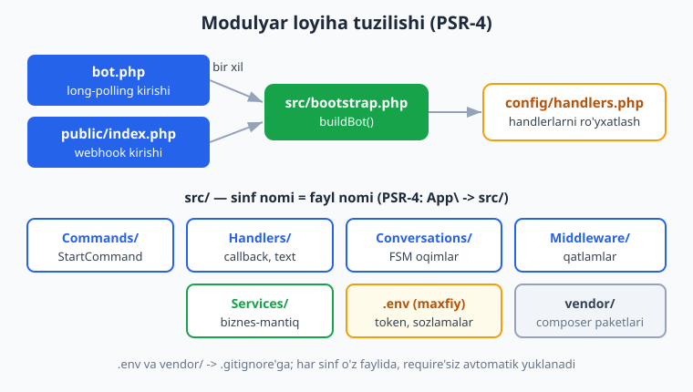
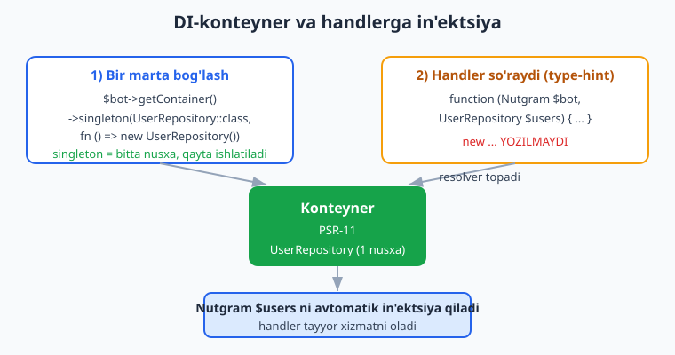
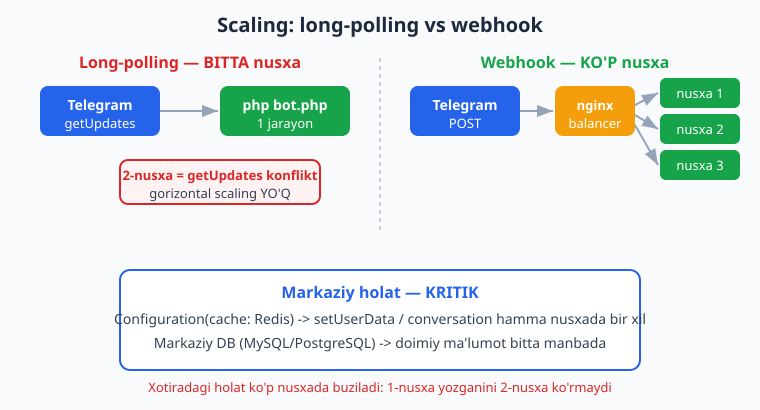

# 11 — Loyiha tuzilishi va konfiguratsiya

[⬅️ Oldingi: 10 — Ma'lumotlar bazasi bilan ishlash](./10-malumotlar-bazasi.md) · [🏠 README](./README.md) · [Keyingi: 12 — Maxsus xususiyatlar ➡️](./12-maxsus-xususiyatlar.md)

---

> **Bu bobda:** shu paytgacha botimizning hamma kodi bitta `bot.php` faylida edi. Bu o'rganish uchun qulay, lekin bot o'sgani sayin bitta fayl yuzlab qatorga aylanadi va undan boshqarish jin urgan ish bo'ladi. Bu bobda **katta botni modullashtiramiz**: kodni mantiqiy papkalarga (`src/Commands/`, `src/Handlers/`, `src/Conversations/`, `src/Middleware/`, `src/Services/`, `config/`) ajratamiz; **composer PSR-4 autoload** bilan har bir sinfni o'z fayliga chiqaramiz (`require`'siz, avtomatik yuklanadi); **konfiguratsiyani** `.env` faylga olib chiqamiz va `vlucas/phpdotenv` bilan o'qiymiz (token kodga YOZILMAYDI); Nutgram'ning **DI-konteyneri** (`$bot->getContainer()` — PSR-11) bilan xizmatlarni `bind`/`singleton` qilamiz va ularni **handler parametrlariga avtomatik in'ektsiya** qildiramiz; **markaziy bootstrap** (`buildBot()`) yozamiz — uni `bot.php` (long-polling) ham, `public/index.php` (webhook) ham bir xil chaqiradi; handlerlarni **alohida ro'yxatlash fayli** (`config/handlers.php`) orqali biriktiramiz; oxirida **scaling** (gorizontal kengaytirish) tushunchasiga to'xtalamiz.
>
> Halol eslatma: bu bobdagi modulyar tuzilish (PSR-4 autoload, `.env` -> `$_ENV`, konteynerga `singleton` bog'lash, handlerga DI in'ektsiya, invokable-sinf va `[Sinf, metod]` shaklida ro'yxatlash, bir bootstrap'ni FakeNutgram bilan ham PROD bilan ham ishlatish) — **haqiqiy modulyar loyihada offline, tarmoqsiz va tokensiz HAQIQATAN ishga tushirilib tekshirilgan** (PHP 8.4, Nutgram 4.46, phpdotenv 5.6; 6/6 tekshiruv o'tdi). Jonli `bot.php run()` (long-polling) va webhook qabul qilish — illustrativ qism, u jonli serverda ishga tushganda ko'rinadi.

---

## Nega bitta fayl yetmaydi?

Boshlanishida hamma narsa `bot.php` da: token, bir nechta handler, ikkita klaviatura. Yaxshi. Lekin real bot tez o'sadi: 20 ta buyruq, 5 ta conversation, middleware'lar, ma'lumotlar bazasi, tashqi API'lar bilan ishlovchi xizmatlar... Bularning hammasini bitta faylda ushlab turish — quyidagi muammolarni keltiradi:

- **Topib bo'lmaydi** — `/payment` buyrug'i qayerda ekanligini topish uchun 800 qator orasidan qidirasiz.
- **Konflikt** — jamoada ikki kishi bir faylni tahrir qilsa, git har safar "merge conflict" beradi.
- **Qayta ishlatib bo'lmaydi** — bir mantiqni boshqa joyda kerak bo'lsa, copy-paste qilasiz.
- **Test qilish qiyin** — hamma narsa bog'lanib ketgan, alohida qismni ajratib test qilolmaysiz.

Yechim — **modulyarlik**: har bir "javobgarlik"ni o'z fayliga, mantiqiy papkalarga ajratish. PHP'da buni qulay qiladigan ikki ustun bor: **namespace + PSR-4 autoload** (sinf -> fayl) va **DI-konteyner** (bog'liqliklarni boshqarish). Ikkalasini ham shu bobda ishga solamiz.



> PHP namespace, `composer`, autoload va PSR-standartlari haqida asoslar [../php/README.md](../php/README.md) da; xizmat (service) va konteyner naqshlari chuqurroq [../php-expert/README.md](../php-expert/README.md) da. Bu yerda biz ularni aynan Telegram bot kontekstida qo'llaymiz.

## Tavsiya etilgan papka tuzilishi

Bitta "to'g'ri" tuzilish yo'q, lekin o'sgan bot uchun quyidagi taqsimot amalda juda qulay:

```text
mening-botim/
├── bot.php               # kirish nuqtasi: long-polling (CLI)
├── public/
│   └── index.php         # kirish nuqtasi: webhook (HTTP)
├── config/
│   └── handlers.php      # handlerlarni ro'yxatlash (alohida fayl)
├── src/
│   ├── bootstrap.php      # botni quradigan markaziy joy: buildBot()
│   ├── Commands/          # buyruq-handlerlar: StartCommand, HelpCommand...
│   ├── Handlers/          # boshqa handlerlar: callback, text, ...
│   ├── Conversations/     # Conversation sinflari (FSM)
│   ├── Middleware/        # middleware sinflari
│   └── Services/          # biznes-mantiq: UserRepository, PaymentService...
├── .env                  # MAXFIY: token va sozlamalar (git'ga TUSHMAYDI)
├── .env.example          # namuna (git'ga tushadi, qiymatlarsiz)
├── composer.json
└── vendor/               # composer paketlari (git'ga TUSHMAYDI)
```

Mantiq oddiy: **fayl nomi = sinf nomi**, papka = mas'uliyat turi. `StartCommand` -> `src/Commands/StartCommand.php`, `RequireSubscription` middleware -> `src/Middleware/RequireSubscription.php` va hokazo. Bu Laravel'dagi struktura ruhiga yaqin (qarang [../laravel/README.md](../laravel/README.md)).

> **`.env` va `vendor/` ni `.gitignore` ga qo'ying.** `.env` da maxfiy token bor — u hech qachon repozitoriyga tushmasligi kerak. `vendor/` esa `composer install` bilan tiklanadi, uni saqlash shart emas.

## PSR-4 autoload: sinf -> fayl, `require`'siz

Eng birinchi qadam — `composer.json` ga **PSR-4 autoload** qoidasini qo'shish. Bu Composer'ga "`App\` bilan boshlanadigan namespace `src/` papkasiga mos keladi" deb aytadi:

```json
{
    "require": {
        "nutgram/nutgram": "^4.46",
        "vlucas/phpdotenv": "^5.6"
    },
    "require-dev": {
        "phpunit/phpunit": "^12.5"
    },
    "autoload": {
        "psr-4": {
            "App\\": "src/"
        }
    }
}
```

So'ng bir marta:

```bash
composer dump-autoload
```

Endi `App\Commands\StartCommand` sinfini ishlatsangiz, Composer uni avtomatik `src/Commands/StartCommand.php` dan yuklaydi — siz hech qanday `require` yozmaysiz. Qoida shunchaki:

- `App\Commands\StartCommand` -> `src/Commands/StartCommand.php`
- `App\Services\UserRepository` -> `src/Services/UserRepository.php`

Sinf fayli aynan shunday ko'rinadi:

```php
<?php
// src/Services/UserRepository.php
namespace App\Services;

class UserRepository
{
    private array $users = [];

    public function remember(int $id): void { $this->users[$id] = true; }
    public function count(): int { return count($this->users); }
}
```

> **Diqqat (Windows/Linux farqi):** PSR-4 da fayl nomi katta-kichik harfgacha sinf nomiga **aynan** mos kelishi shart. Windows'da `startcommand.php` ishlab ketishi mumkin, lekin Linux serverda (production) ishlamaydi va botingiz "Class not found" bilan yiqiladi. Doim `StartCommand.php` deb, sinf nomi bilan **bir xil** yozing.

## Konfiguratsiya: `.env` + `vlucas/phpdotenv`

Token, ma'lumotlar bazasi parolari, admin ID'lari — bularni **kodga yozish mumkin emas** (xavfsizlik) va har muhitda (dev/prod) boshqacha bo'ladi. Yechim — `.env` fayl:

```bash
# .env  (git'ga TUSHMAYDI)
TELEGRAM_TOKEN=123456:AAH-your-real-token-from-BotFather
ADMIN_IDS=10,20
DB_DSN=sqlite:database.sqlite
```

`vlucas/phpdotenv` paketi bu faylni o'qib, qiymatlarni `$_ENV` (va `getenv()`) ga joylaydi:

```bash
composer require vlucas/phpdotenv
```

```php
<?php
require __DIR__ . '/vendor/autoload.php';

use Dotenv\Dotenv;

// .env ni o'qiydi -> $_ENV / $_SERVER ga joylaydi
$dotenv = Dotenv::createImmutable(__DIR__);
$dotenv->safeLoad();   // .env yo'q bo'lsa xato bermaydi (prod'da getenv ishlatiladi)

$token   = $_ENV['TELEGRAM_TOKEN'];
$admins  = array_map('intval', explode(',', $_ENV['ADMIN_IDS'] ?? ''));
```

- `createImmutable(...)` — agar tizimda allaqachon o'rnatilgan muhit o'zgaruvchisi bo'lsa, uni **bekor qilmaydi** (immutable). Production'da ko'pincha o'zgaruvchilar serverning o'zida (systemd, Docker `-e`, panel) o'rnatiladi — `safeLoad()` `.env` bo'lmasa shovqinsiz o'tib ketadi.
- Majburiy o'zgaruvchilarni talab qilish uchun: `$dotenv->required(['TELEGRAM_TOKEN'])->notEmpty();` — yo'q bo'lsa, **darhol** tushunarli xato beradi (botning kechikkan "nima uchun ishlamayapti" muammosidan yaxshiroq).

Endi token kodda emas:

```php
<?php
$bot = new Nutgram($_ENV['TELEGRAM_TOKEN']);   // token .env'dan, repozitoriyga tushmaydi
```

## Nutgram konfiguratsiyasi: `Configuration`

Token'dan tashqari Nutgram'ning o'z sozlamalari ham bor (cache, logger, polling parametrlari, conversation TTL...). Ularni `Configuration` obyekti orqali beriladi:

```php
<?php
use SergiX44\Nutgram\Configuration;
use SergiX44\Nutgram\Nutgram;

$config = new Configuration(
    cache: $psr16Cache,          // PSR-16: holatni Redis/fayl'da saqlash uchun
    logger: $psr3Logger,         // PSR-3: log
    conversationTtl: 3600,       // conversation 1 soatdan keyin eskiradi (soniya)
    pollingTimeout: 30,          // long-polling so'rovi uchun timeout
);

$bot = new Nutgram($_ENV['TELEGRAM_TOKEN'], $config);
```

Eng muhim ikkita sozlama — **cache** va **conversationTtl**. Standart holatda Nutgram holatni (`setUserData`, conversation qadami...) **xotirada** saqlaydi — bu bot qayta ishga tushganda yo'qoladi va bir nechta jarayon (scaling) o'rtasida bo'linmaydi. Production'da bu yerga PSR-16 cache (Redis yoki fayl) ulanadi — pastdagi "Scaling" bo'limiga qarang.

> `conversationTtl: 3600` — foydalanuvchi suhbatni yarmida tashlab ketsa, holat 1 soatdan keyin avtomatik tozalanadi. `null` bersangiz — hech qachon eskirmaydi (xotira/kalitlar to'planib qoladi). Conversation'lar haqida [8-bob](./08-conversations.md).

## DI-konteyner: `$bot->getContainer()`

Botingiz o'sganda handlerlarga ko'p bog'liqlik (dependency) kerak bo'ladi: ma'lumotlar bazasi, repozitoriylar, tashqi API mijozlari. Ularni har handlerda `new ...` bilan yaratish — sekin va testlab bo'lmaydigan kod. Yechim — **DI-konteyner** (Dependency Injection container): bir joyda "qaysi sinf qanday yaratiladi" deb e'lon qilasiz, qolgan joyda esa shunchaki **so'raysiz**.

Nutgram ichida **PSR-11** mosligi bo'lgan konteyner bor. Unga `$bot->getContainer()` orqali kirasiz:

```php
<?php
use App\Services\UserRepository;

$container = $bot->getContainer();

// singleton: butun bot davomida BIR martagina yaratiladi, keyin qayta ishlatiladi
$container->singleton(UserRepository::class, fn () => new UserRepository());

// bind: har so'raganda YANGI obyekt
$container->bind(SomeService::class, fn () => new SomeService());

// interfeysni implementatsiyaga bog'lash
$container->bind(LoggerInterface::class, MyFileLogger::class);
```

- **`singleton`** — bir marta yaratiladi, keyingi har so'rovda o'sha **bir xil** obyekt qaytadi (DB ulanishi, repozitoriy uchun ideal).
- **`bind`** — har so'rovda yangi nusxa.
- `get($id)` — konteynerdan obyektni olish; `has($id)` — bormi-yo'qligini tekshirish.

> **Tashqi konteynerni ulash (ixtiyoriy).** Allaqachon o'z PSR-11 konteyneringiz bo'lsa (masalan, PHP-DI yoki Symfony container), uni `Configuration(container: $sizningKonteyner)` orqali bering — Nutgram unga **delegatsiya** qiladi (sizning bog'lashlaringiz `$bot->getContainer()` orqali ham hal qilinadi). Eslatma: `$bot->getContainer()` baribir Nutgram'ning o'rab oluvchi (wrapping) nusxasini qaytaradi, lekin sizning xizmatlaringiz undan topiladi. Oddiy botlar uchun esa Nutgram'ning ichki konteyneri yetarli.

### Eng kuchli qism: handlerga avtomatik in'ektsiya

Nutgram handlerni chaqirayotganda uning **parametrlarini konteynerdan hal qiladi** (resolver). Ya'ni handler funksiyasiga `Nutgram $bot` dan keyin yana xizmat tip-belgisini (type-hint) qo'shsangiz, Nutgram uni konteynerdan topib **avtomatik beradi**:

```php
<?php
use App\Services\UserRepository;
use SergiX44\Nutgram\Nutgram;

$bot->onCommand('start', function (Nutgram $bot, UserRepository $users) {
    //                                  ^^^^^^^^^^^^^^^^^^^^^^^ avtomatik in'ektsiya
    $users->remember($bot->userId());
    $bot->sendMessage("Salom! Siz {$users->count()}-foydalanuvchisiz.");
});
```

`new UserRepository()` yozish shart emas — konteynerda `singleton` qilingani uchun Nutgram o'sha bitta nusxani in'ektsiya qiladi. Bu modulyar botning yuragi: handlerlar bog'liqliklarni **so'raydi**, yaratmaydi.

## Handlerlarni alohida fayllarga chiqarish

Endi handlerni anonim funksiya o'rniga **alohida sinf** qilib, o'z fayliga chiqaramiz. Nutgram uch xil shaklni qabul qiladi (uchalasi ham tekshirilgan):

**1) Invokable sinf** (`__invoke` metodi bilan) — eng toza:

```php
<?php
// src/Commands/StartCommand.php
namespace App\Commands;

use App\Services\UserRepository;
use SergiX44\Nutgram\Nutgram;

class StartCommand
{
    // UserRepository shu yerda ham avtomatik in'ektsiya qilinadi
    public function __invoke(Nutgram $bot, UserRepository $users): void
    {
        $users->remember($bot->userId());
        $bot->sendMessage("Salom! Siz {$users->count()}-foydalanuvchisiz.");
    }
}
```

**2) `[Sinf, metod]` massiv-callable** — bir sinfda bir nechta buyruq bo'lsa qulay:

```php
<?php
// src/Commands/StatsCommand.php
namespace App\Commands;

use App\Services\UserRepository;
use SergiX44\Nutgram\Nutgram;

class StatsCommand
{
    public function handle(Nutgram $bot, UserRepository $users): void
    {
        $bot->sendMessage("Foydalanuvchilar: {$users->count()}");
    }
}
```

Ro'yxatlash esa **alohida `config/handlers.php`** faylida — handlerlar ro'yxatini bir joyda ko'rasiz:

```php
<?php
// config/handlers.php
use App\Commands\StartCommand;
use App\Commands\StatsCommand;
use SergiX44\Nutgram\Nutgram;

return function (Nutgram $bot): void {
    $bot->onCommand('start', StartCommand::class);             // invokable sinf
    $bot->onCommand('stats', [StatsCommand::class, 'handle']); // [sinf, metod]
};
```

> Sinf nomini berganingizda (`StartCommand::class`) Nutgram sinfni **konteyner orqali** yaratadi — demak sinfning konstruktoriga ham bog'liqliklarni in'ektsiya qilish mumkin. Anonim funksiya o'rniga sinf ishlatishning afzalligi: testlab bo'ladi, qayta ishlatsa bo'ladi, va `git diff` toza chiqadi.



## Markaziy bootstrap: `buildBot()`

Endi hammasini bir joyga yig'amiz. **Bootstrap** — botni quradigan yagona funksiya. Uning ahamiyati: long-polling kirish nuqtasi (`bot.php`), webhook kirish nuqtasi (`public/index.php`) **va testlar** — uchalasi ham bir xil botni oladi. Sozlash bir joyda, takror yo'q.

```php
<?php
// src/bootstrap.php
use App\Services\UserRepository;
use Dotenv\Dotenv;
use SergiX44\Nutgram\Nutgram;

function buildBot(?Nutgram $bot = null): Nutgram
{
    // 1) .env -> $_ENV (token kodga yozilmaydi)
    if (file_exists(dirname(__DIR__) . '/.env')) {
        Dotenv::createImmutable(dirname(__DIR__))->safeLoad();
    }

    // 2) Bot. Test paytida tashqaridan FakeNutgram beriladi, aks holda real Nutgram.
    $bot ??= new Nutgram($_ENV['TELEGRAM_TOKEN']);

    // 3) DI: xizmatlarni bir marta bog'laymiz
    $bot->getContainer()->singleton(UserRepository::class, fn () => new UserRepository());

    // 4) Handlerlarni alohida fayldan ro'yxatlaymiz
    $register = require dirname(__DIR__) . '/config/handlers.php';
    $register($bot);

    return $bot;
}
```

`?Nutgram $bot = null` parametri — kichik, lekin **muhim hiyla**: test paytida `buildBot(Nutgram::fake())` deb FakeNutgram'ni uzatamiz, prod'da esa `buildBot()` o'zi real `Nutgram` yaratadi. Ikkala holatda ham **aynan bir xil** sozlash va handler-ro'yxatlash kodi ishlaydi — bu testning haqiqiy bot bilan mosligini kafolatlaydi.

### Kirish nuqtalari: `bot.php` va `public/index.php`

Endi kirish nuqtalari juda yupqa — faqat bootstrap'ni chaqirib, ishga tushiradi:

```php
<?php
// bot.php — LONG-POLLING (CLI'da: php bot.php)
require __DIR__ . '/vendor/autoload.php';
require __DIR__ . '/src/bootstrap.php';

$bot = buildBot();
$bot->run();   // jonli: Telegram'dan update'larni so'rab turadi (illustrativ — jonli token kerak)
```

```php
<?php
// public/index.php — WEBHOOK (HTTP server orqali)
require __DIR__ . '/../vendor/autoload.php';
require __DIR__ . '/../src/bootstrap.php';

use SergiX44\Nutgram\RunningMode\Webhook;

$bot = buildBot();
$bot->setRunningMode(Webhook::class);
$bot->run();   // jonli: Telegram POST qilgan update'ni qabul qiladi (illustrativ — public HTTPS kerak)
```

> `run()` ning ikki rejimi (long-polling va webhook) va deploy tafsilotlari [13-bob](./13-webhook-deploy.md) da batafsil. Bu yerda asosiy g'oya — **bitta `buildBot()`, ikki kirish nuqtasi**.

## Hammasini birga: offline tekshiruv

Yuqoridagi tuzilishni haqiqiy modulyar loyihada FakeNutgram bilan ishga tushirib tekshirdik. Diqqat: test ham **aynan o'sha** `buildBot()` ni chaqiradi — faqat unga FakeNutgram'ni uzatadi:

```php
<?php
require __DIR__ . '/vendor/autoload.php';
require __DIR__ . '/src/bootstrap.php';

use SergiX44\Nutgram\Nutgram;

// FakeNutgram'ni bootstrap'ga uzatamiz -> PROD bilan AYNAN bir kod yo'li
$bot = buildBot(Nutgram::fake());

// /start -> invokable StartCommand, UserRepository DI bilan
$bot->hearText('/start')->reply();
$bot->assertReplyText('Salom! Siz 1-foydalanuvchisiz.');

// /stats -> [StatsCommand, handle]; SINGLETON repo, shuning uchun count saqlanadi
$bot->hearText('/stats')->reply();
$bot->assertReplyText('Foydalanuvchilar: 1');
```

Natija (haqiqatan ishga tushirilgan):

```text
OK   /start invokable + DI
OK   /stats [class,method] + singleton holati saqlandi
OK   PSR-4 autoload App\Commands\StartCommand
OK   PSR-4 autoload App\Services\UserRepository
OK   .env TELEGRAM_TOKEN yuklandi
OK   singleton bir xil instance

JAMI: pass=6 fail=0
```

`/start` foydalanuvchini eslab qoldi, keyin `/stats` o'sha **bir xil** `UserRepository` nusxasidan sanog'ini o'qidi — bu `singleton` to'g'ri ishlayotganini va DI butun bot bo'ylab bitta holatni ulashayotganini isbotlaydi.

## Scaling: bir nechta nusxada ishlatish

"Scaling" — bot yukini ko'tara olishi, ya'ni ko'p foydalanuvchini bir vaqtda xizmat qilishi. Bu yerda asosiy tushunchalarni beramiz (amaliy deploy [13](./13-webhook-deploy.md) va [17](./17-production-deploy.md)-boblarda):

- **Long-polling — bitta jarayon.** `php bot.php` faqat **bitta** nusxada ishlashi kerak: ikki nusxa bir vaqtda Telegram'dan update so'rasa, `getUpdates` konflikti chiqadi. Long-polling kichik/o'rta botlar uchun yetarli, lekin gorizontal scaling'ga mos kelmaydi.

- **Webhook — gorizontal scaling.** Telegram update'ni sizning HTTPS endpoint'ingizga POST qiladi. Oldiga **load balancer** (nginx) qo'yib, orqada bir nechta PHP-FPM nusxasini (yoki Docker konteynerini) ishlatish mumkin — har bir update mustaqil HTTP so'rov, ular orasida balanslanadi. Yuqori yuk uchun standart yo'l shu.

- **Holatni baham ko'rish — KRITIK.** Bir nechta nusxa bo'lsa, holat (`setUserData`, conversation qadami, throttle hisoblagichi) **xotirada bo'lishi mumkin emas** — 1-nusxa yozgan holatni 2-nusxa ko'rmaydi. Yechim: `Configuration(cache: ...)` ga **Redis** (yoki kamida fayl) PSR-16 cache ulash. Shunda hamma nusxa bir xil markaziy holatdan o'qiydi.

  ```php
  <?php
  // Misol: Redis'ni PSR-16 cache sifatida (symfony/cache yoki shunga o'xshash adapter bilan)
  $config = new Configuration(
      cache: $redisPsr16Cache,   // holat hamma nusxa uchun markaziy
      conversationTtl: 3600,
  );
  $bot = new Nutgram($_ENV['TELEGRAM_TOKEN'], $config);
  ```

- **Ma'lumotlar bazasi — bitta markaz.** Foydalanuvchilar, to'lovlar va boshqa doimiy ma'lumot SQLite (bitta fayl, bitta server) emas, balki markazlashgan MySQL/PostgreSQL'da bo'lishi kerak — shunda hamma nusxa bir manbadan ishlaydi (DB [10-bob](./10-malumotlar-bazasi.md); ulanish, indekslar [../sql/README.md](../sql/README.md)).



> **Qoida:** modulyar tuzilish + tashqi cache + markaziy DB — bu uchligi botni "bitta serverda bitta jarayon"dan "bir nechta serverda parallel nusxalar"ga o'tkazishni mumkin qiladi. Kichik bot uchun ortiqcha; lekin kod birinchi kundanoq holatni `setUserData`/cache orqali boshqarsa (xotiradagi global o'zgaruvchiga emas), keyinchalik scaling'ga o'tish og'riqsiz bo'ladi.

## Mashqlar

### Oson

**Oson 1.** `composer.json` da `App\` namespace'ini `src/` ga bog'laydigan PSR-4 qoidasini yozing va qaysi buyruq autoload-jadvalini qayta quradi (`composer ...`)?

**Oson 2.** `.env` faylga `TELEGRAM_TOKEN` va `ADMIN_IDS` yozing, so'ng phpdotenv bilan o'qib, `$_ENV['TELEGRAM_TOKEN']` ni chiqaring. `.env` ni `.gitignore` ga qo'shishni unutmang — nega muhim?

**Oson 3.** `src/Services/Clock.php` da `App\Services\Clock` sinfini yozing (`now(): int` -> `time()` qaytaradi). PSR-4 bo'yicha fayl nomi qanday bo'lishi shart?

**Oson 4.** `$bot->getContainer()->singleton(...)` va `->bind(...)` orasidagi farqni bir jumlada ayting. Repozitoriy uchun qaysi birini tanlaysiz?

**Oson 5.** Handler funksiyasiga `function (Nutgram $bot, Clock $clock)` deb yozsangiz, Nutgram `$clock` ni qayerdan oladi?

**Oson 6.** Nega `vendor/` papkasini git'ga qo'shmaymiz, lekin `composer.json` ni qo'shamiz?

### O'rta

**O'rta 1.** `HelpCommand` invokable sinfini `src/Commands/HelpCommand.php` da yozing (`/help` -> yordam matni) va uni `config/handlers.php` da `$bot->onCommand('help', HelpCommand::class)` bilan ro'yxatlang. FakeNutgram bilan tekshiring.

**O'rta 2.** `config/handlers.php` ni "callback handlerlar" uchun ikkinchi `config/callbacks.php` ga ajrating va `buildBot()` da ikkalasini ham chaqiring.

**O'rta 3.** `buildBot(?Nutgram $bot = null)` ni shunday yozingki, test `buildBot(Nutgram::fake())` ni, prod esa `buildBot()` ni chaqirsin. Nega bu testni haqiqiy bot bilan moslashtiradi?

**O'rta 4.** `UserRepository` ni `singleton` qiling, `/inc` buyrug'i `count` ni oshirsin, `/show` esa ko'rsatsin. FakeNutgram'da `/inc` ni ikki marta, so'ng `/show` ni chaqirib, natija `2` ekanini tekshiring (singleton holatni saqlaganini isbotlang).

**O'rta 5.** `Configuration` orqali `conversationTtl: 3600` va `pollingTimeout: 30` bering. Bu ikki sozlama nimani anglatadi?

**O'rta 6.** `$dotenv->required(['TELEGRAM_TOKEN'])->notEmpty();` ni qo'shing va `.env` dan tokenni o'chirib, qanday xato chiqishini kuzating. Nega bu "shovqinsiz noto'g'ri ishlash"dan yaxshiroq?

### Qiyin

**Qiyin 1.** Interfeysga asoslangan DI: `NotifierInterface` (`notify(string $msg): string`) va ikki implementatsiya — `LogNotifier`, `NullNotifier`. Konteynerda `bind(NotifierInterface::class, LogNotifier::class)` qiling, handler `NotifierInterface` ni so'rasin. Test: handler `LogNotifier` natijasini qaytarishini tasdiqlang; so'ng bog'lashni `NullNotifier` ga almashtirib, kodga tegmasdan xulq o'zgarganini ko'rsating.

**Qiyin 2.** To'liq modulyar skelet: `bot.php`, `public/index.php`, `src/bootstrap.php`, `config/handlers.php`, `src/Commands/StartCommand.php`, `src/Services/UserRepository.php`. `buildBot(Nutgram::fake())` bilan `/start` ni ishga tushirib, javobni va `UserRepository` da foydalanuvchi eslab qolinganini tekshiring.

**Qiyin 3.** Scaling stsenariysi: nega long-polling'da bot **bitta** nusxada ishlashi kerak, lekin webhook'da **bir nechta** nusxa bo'lishi mumkin? Bir nechta nusxa bo'lganda `setUserData` ni xotirada saqlash nima uchun buziladi va `Configuration(cache: Redis)` buni qanday hal qiladi? (Kod talab qilinmaydi — tushuntirib bering.)

<details markdown="1">
<summary>Yechimlar</summary>

**Oson 1.**
```json
{
    "autoload": { "psr-4": { "App\\": "src/" } }
}
```
Qayta quradi: `composer dump-autoload` (yoki `composer install`/`update` ham autoload-jadvalini yangilaydi).

**Oson 2.**
```php
<?php
require __DIR__ . '/vendor/autoload.php';
use Dotenv\Dotenv;

Dotenv::createImmutable(__DIR__)->safeLoad();
echo $_ENV['TELEGRAM_TOKEN'];
$admins = array_map('intval', explode(',', $_ENV['ADMIN_IDS']));
```
`.env` ni `.gitignore` ga qo'shamiz, chunki unda **maxfiy token** bor — repozitoriyga (ayniqsa public'ga) tushsa, har kim botingizni boshqara oladi.

**Oson 3.**
```php
<?php
// src/Services/Clock.php
namespace App\Services;

class Clock
{
    public function now(): int { return time(); }
}
```
Fayl nomi aynan `Clock.php` (sinf nomi bilan bir xil, katta `C` bilan) bo'lishi shart — Linux serverda katta-kichik harf farqlanadi.

**Oson 4.** `singleton` — bir marta yaratiladi, hamma so'rovda **bir xil** obyekt; `bind` — har so'rovda yangi nusxa. Repozitoriy uchun `singleton` (bitta DB ulanishi/holatni baham ko'rish uchun).

**Oson 5.** Nutgram handler parametrlarini **konteynerdan** hal qiladi (resolver): `Clock` tip-belgisini ko'rib, uni konteynerdan (yoki konstruktorini avtomatik) yaratib in'ektsiya qiladi.

**Oson 6.** `vendor/` ni `composer install` har doim `composer.json`/`composer.lock` dan tiklaydi — uni saqlash repozitoriyni shishiradi. `composer.json` esa loyihaning bog'liqliklar ro'yxati — uni saqlash shart (har kim bir xil paketlarni o'rnatadi).

**O'rta 1.**
```php
<?php
// src/Commands/HelpCommand.php
namespace App\Commands;
use SergiX44\Nutgram\Nutgram;

class HelpCommand
{
    public function __invoke(Nutgram $bot): void
    {
        $bot->sendMessage("Buyruqlar:\n/start — boshlash\n/help — yordam");
    }
}
```
```php
<?php
// config/handlers.php ichida
$bot->onCommand('help', \App\Commands\HelpCommand::class);
```
```php
<?php
$bot = buildBot(Nutgram::fake());
$bot->hearText('/help')->reply();
$bot->assertReplyText("Buyruqlar:\n/start — boshlash\n/help — yordam");
```

**O'rta 2.**
```php
<?php
// config/callbacks.php
use SergiX44\Nutgram\Nutgram;
return function (Nutgram $bot): void {
    $bot->onCallbackQueryData('like', fn (Nutgram $bot) => $bot->answerCallbackQuery(text: 'Yoqdi!'));
};
```
```php
<?php
// bootstrap.php ichida, handlers'dan keyin:
(require dirname(__DIR__) . '/config/callbacks.php')($bot);
```
Mantiqiy ajratish: buyruqlar bir faylda, callbacklar boshqasida — har biri kichik va aniq.

**O'rta 3.**
```php
<?php
function buildBot(?Nutgram $bot = null): Nutgram
{
    $bot ??= new Nutgram($_ENV['TELEGRAM_TOKEN']);
    // ... DI + handler ro'yxatlash (test va prod uchun BIR XIL) ...
    return $bot;
}
```
Test ham, prod ham **aynan o'sha** sozlash va ro'yxatlash kodini bosib o'tadi — faqat bot obyekti farqli (fake yoki real). Shuning uchun test "haqiqiy" bot xulqini tekshiradi, soxta nusxani emas.

**O'rta 4.**
```php
<?php
// config/handlers.php
use App\Services\UserRepository;
use SergiX44\Nutgram\Nutgram;
return function (Nutgram $bot): void {
    $bot->onCommand('inc',  fn (Nutgram $bot, UserRepository $r) => $r->remember(random_int(1, PHP_INT_MAX)));
    $bot->onCommand('show', fn (Nutgram $bot, UserRepository $r) => $bot->sendMessage((string) $r->count()));
};
```
```php
<?php
$bot = buildBot(Nutgram::fake());
$bot->hearText('/inc')->reply();
$bot->hearText('/inc')->reply();
$bot->hearText('/show')->reply();
$bot->assertReplyText('2'); // singleton -> count saqlandi
```

**O'rta 5.** `conversationTtl: 3600` — boshlangan conversation 3600 soniyadan (1 soat) keyin avtomatik eskirib, holati tozalanadi (foydalanuvchi suhbatni tashlab ketsa kalitlar to'planib qolmaydi). `pollingTimeout: 30` — long-polling rejimida `getUpdates` so'rovi yangi update bo'lmasa ham server tomonda 30 soniya kutib turadi (long-polling samaradorligi uchun).

**O'rta 6.**
```php
<?php
$dotenv = Dotenv::createImmutable(__DIR__);
$dotenv->load();
$dotenv->required(['TELEGRAM_TOKEN'])->notEmpty();
```
Token yo'q bo'lsa, `RuntimeException` darhol, ishga tushish paytida chiqadi. Bu "shovqinsiz noto'g'ri ishlash"dan yaxshiroq, chunki aks holda bot ishga tushadi, lekin token bo'sh bo'lgani uchun keyinroq, kutilmagan joyda (API xatosi) yiqiladi — sabab esa noaniq qoladi.

**Qiyin 1.**
```php
<?php
// src/Services/NotifierInterface.php
namespace App\Services;
interface NotifierInterface { public function notify(string $msg): string; }

// src/Services/LogNotifier.php
namespace App\Services;
class LogNotifier implements NotifierInterface {
    public function notify(string $msg): string { return "LOG: {$msg}"; }
}

// src/Services/NullNotifier.php
namespace App\Services;
class NullNotifier implements NotifierInterface {
    public function notify(string $msg): string { return ''; }
}
```
```php
<?php
use App\Services\{NotifierInterface, LogNotifier, NullNotifier};
use SergiX44\Nutgram\Nutgram;

$bot = Nutgram::fake();
$bot->getContainer()->bind(NotifierInterface::class, LogNotifier::class);
$bot->onCommand('go', function (Nutgram $bot, NotifierInterface $n) {
    $bot->sendMessage($n->notify('salom'));
});
$bot->hearText('/go')->reply();
$bot->assertReplyText('LOG: salom');

// Endi faqat bog'lashni almashtiramiz — handler kodiga TEGMAYMIZ:
$bot2 = Nutgram::fake();
$bot2->getContainer()->bind(NotifierInterface::class, NullNotifier::class);
$bot2->onCommand('go', function (Nutgram $bot, NotifierInterface $n) {
    $bot->sendMessage('xulq: [' . $n->notify('salom') . ']');
});
$bot2->hearText('/go')->reply();
$bot2->assertReplyText('xulq: []'); // NullNotifier bo'sh qaytardi
```
Mohiyat: handler interfeysga bog'langani uchun implementatsiyani konteynerda almashtirish kifoya — handler kodi o'zgarmaydi (testlash va kengaytirishning kaliti).

**Qiyin 2.** Yuqoridagi bobdagi to'liq skelet (`bootstrap.php` + `config/handlers.php` + `StartCommand` + `UserRepository`) aynan shu mashqning yechimi. Test:
```php
<?php
require __DIR__ . '/vendor/autoload.php';
require __DIR__ . '/src/bootstrap.php';
use SergiX44\Nutgram\Nutgram;

$bot = buildBot(Nutgram::fake());
$bot->hearText('/start')->reply();
$bot->assertReplyText('Salom! Siz 1-foydalanuvchisiz.');
// UserRepository singleton: count = 1
$repo = $bot->getContainer()->get(\App\Services\UserRepository::class);
assert($repo->count() === 1);
```
(Bu skelet `C:` temp'da haqiqatan ishga tushirilib, 6/6 tekshiruv o'tdi.)

**Qiyin 3.**
- **Long-polling — bitta nusxa:** `getUpdates` Telegram'dan update'lar oqimini "tortib" oladi. Ikki nusxa bir vaqtda tortsa, Telegram konflikt qaytaradi (`terminated by other getUpdates request`) va update'lar bo'linib/yo'qolib ketadi. Shuning uchun long-polling faqat **bitta** jarayonda.
- **Webhook — ko'p nusxa:** Telegram har update'ni mustaqil HTTP POST sifatida sizning endpoint'ingizga yuboradi. Oldida load balancer bo'lsa, bu so'rovlar bir nechta PHP-FPM/konteyner nusxasiga balanslanadi — har bir so'rov mustaqil, konflikt yo'q.
- **Xotiradagi holat buziladi:** `setUserData` ni jarayon xotirasida saqlasangiz, 1-nusxa yozgan ma'lumotni 2-nusxa ko'rmaydi (har nusxaning o'z xotirasi). Conversation yarmida foydalanuvchi boshqa nusxaga tushib qolsa — holat yo'q, suhbat buziladi.
- **Yechim — markaziy cache:** `Configuration(cache: $redisPsr16)` bersangiz, Nutgram holatni Redis'da (hamma nusxa ko'radigan markaziy joy) saqlaydi. Endi qaysi nusxa update'ni olishidan qat'i nazar, hammasi bir xil holatdan o'qiydi — scaling buzilmaydi.

</details>

---

[⬅️ Oldingi: 10 — Ma'lumotlar bazasi bilan ishlash](./10-malumotlar-bazasi.md) · [🏠 README](./README.md) · [Keyingi: 12 — Maxsus xususiyatlar ➡️](./12-maxsus-xususiyatlar.md)
