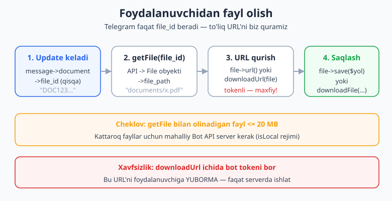
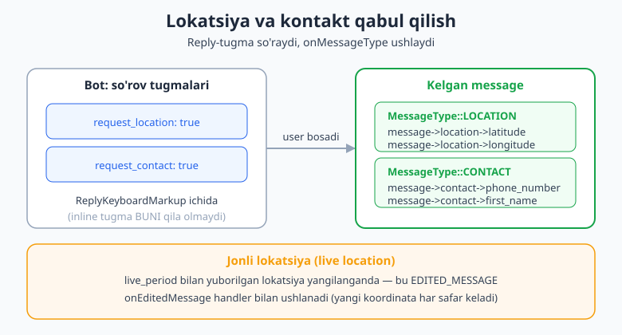
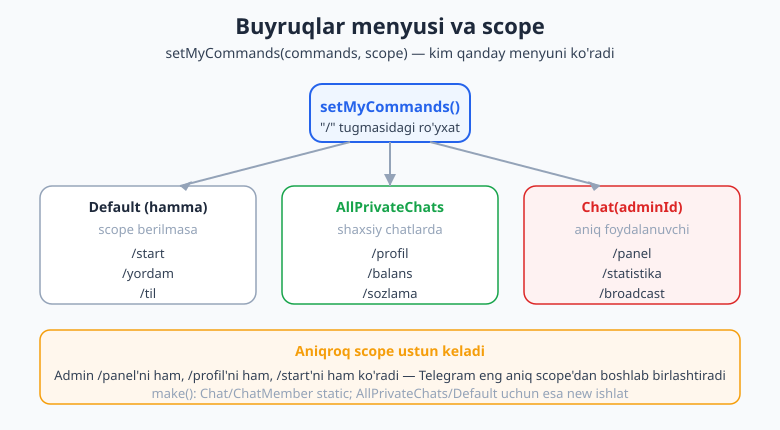

# 12 — Maxsus xususiyatlar

[⬅️ Oldingi: 11 — Loyiha tuzilishi va konfiguratsiya](./11-loyiha-tuzilishi.md) · [🏠 README](./README.md) · [Keyingi: 13 — Webhook va running mode ➡️](./13-webhook-deploy.md)

---

> **Bu bobda:** botingizni "tirik" qiladigan amaliy maxsus xususiyatlarni yig'amiz. Foydalanuvchi yuborgan **faylni yuklab olish** (`getFile` -> `file_path` -> `downloadUrl`/`file->url()`/`file->save()`), bir necha media kelganda **media group** (albom) ni qabul qilish, **lokatsiya** va **kontakt** ni so'rash va o'qish (`onMessageType(MessageType::LOCATION/CONTACT)` + `request_location`/`request_contact` tugmalari), **bot buyruqlar menyusi** ni `setMyCommands` va **scope** bilan moslash (default, shaxsiy chat, aniq foydalanuvchi), xabarni **forward / copy** qilish, **jonli lokatsiya** (live location) ni `onEditedMessage` orqali kuzatish va **WebApp tugmasi** orqali Mini App'ni ochish (to'liq mavzu — [23-bob](./23-webapp-asoslari.md)). Oxirida bularni birlashtiruvchi aralash amaliy retseptlar.
>
> **Halol eslatma:** bu bobdagi bot mantig'i — fayl yuklab olish oqimi, lokatsiya/kontakt handlerlari, `request_*` tugmalari, `setMyCommands` + scope, forward/copy va jonli lokatsiya — `Nutgram::fake()` (FakeNutgram) yordamida **offline** sinab ko'rilgan (phpunit: 8 test / 22 assertion o'tdi). Jonli qism — faylning Telegram serveridan haqiqiy yuklab olinishi, lokatsiyaning real qurilmadan kelishi, menyuning Telegram ilovasida ko'rinishi — faqat ishlayotgan token va internetda namoyon bo'ladi; uni "ishladi" deb soxtalashtirmaymiz, balki tushuntirish sifatida beramiz.

---

## Foydalanuvchi yuborgan faylni yuklab olish

Telegram fayllarni o'ziga xos tarzda beradi. Foydalanuvchi rasm, hujjat yoki ovozli xabar yuborganda, sizning botingiz **faylning o'zini emas**, balki uning qisqa identifikatori — `file_id` ni oladi. Faylni serveringizga yuklab olish uchun ikki qadam kerak:

1. `getFile($file_id)` — bu Telegram'dan `File` obyektini qaytaradi; uning eng muhim maydoni — `file_path` (Telegram serveridagi nisbiy yo'l).
2. To'liq URL'ni qurish (`downloadUrl` / `file->url()`) yoki to'g'ridan-to'g'ri diskka saqlash (`downloadFile` / `file->save()`).



### Eng qisqa yo'l: file->save()

Nutgram'da `File` obyektining o'zida `save()` metodi bor — u ichida `downloadFile` ni chaqiradi, demak siz bitta satrda faylni diskka tushirasiz:

```php
use SergiX44\Nutgram\Nutgram;
use SergiX44\Nutgram\Telegram\Properties\MessageType;

$bot->onMessageType(MessageType::DOCUMENT, function (Nutgram $bot) {
    $doc = $bot->message()->document;          // Document obyekti

    $file = $bot->getFile($doc->file_id);      // 1-qadam: File (file_path bilan)
    $file->save(__DIR__ . '/storage/' . $doc->file_name);   // 2-qadam: diskka yozish

    $bot->sendMessage("Fayl qabul qilindi: {$doc->file_name}");
});
```

`save()` ga **katalog** bersangiz (mavjud papka yo'li), Nutgram fayl nomini avtomatik tanlaydi:

```php
$file->save(__DIR__ . '/storage/');   // ichida storage/file_5.pdf bo'lib saqlanadi
```

### URL kerak bo'lsa: file->url() / downloadUrl()

Faylni diskka emas, balki uning to'g'ridan-to'g'ri yuklash havolasini olmoqchi bo'lsangiz:

```php
$file = $bot->getFile($doc->file_id);
$url  = $file->url();                  // yoki: $bot->downloadUrl($file)
// $url -> https://api.telegram.org/file/bot<TOKEN>/documents/file_5.pdf
```

> **Xavfsizlik — diqqat!** Bu URL ichida **bot tokeningiz** bor (`/file/bot<TOKEN>/...`). Kim bu havolani bilsa, tokenni ham biladi va botingizni nazoratga oladi. Shuning uchun bu URL'ni foydalanuvchiga **hech qachon yubormang** va logga ham yozmang. Uni faqat serveringiz ichida ishlating — masalan, Guzzle/cURL bilan o'zingiz yuklab olib, so'ng o'chiring.

### `onMessageType` — turi bo'yicha ushlash

Yuqorida `onMessageType(MessageType::DOCUMENT, ...)` ishlatdik. Bu handler — xabar **aynan** shu turda bo'lganda ishga tushadi. `MessageType` enum'ida (`SergiX44\Nutgram\Telegram\Properties\MessageType`) bizga kerakli turlar:

| Tur | message maydoni | Qaysi fayl |
|---|---|---|
| `MessageType::PHOTO` | `->photo` (massiv: o'lchamlar) | rasm |
| `MessageType::DOCUMENT` | `->document` | istalgan fayl |
| `MessageType::VIDEO` | `->video` | video |
| `MessageType::AUDIO` | `->audio` | musiqa |
| `MessageType::VOICE` | `->voice` | ovozli xabar |
| `MessageType::LOCATION` | `->location` | lokatsiya |
| `MessageType::CONTACT` | `->contact` | kontakt |

> **Rasm nozikligi:** `message()->photo` — bu **massiv** (`PhotoSize[]`), chunki Telegram bir rasmni bir necha o'lchamda saqlaydi. Eng katta (eng sifatli) nusxa — odatda massivning oxirgi elementi: `$bot->message()->photo[count(...)-1]->file_id` yoki `end($bot->message()->photo)->file_id`.

```php
$bot->onMessageType(MessageType::PHOTO, function (Nutgram $bot) {
    $photos = $bot->message()->photo;       // PhotoSize massivi
    $largest = end($photos);                // eng katta nusxa
    $file = $bot->getFile($largest->file_id);
    $file->save(__DIR__ . '/storage/photo_' . $largest->file_unique_id . '.jpg');
    $bot->sendMessage('Rasm saqlandi.');
});
```

> **Cheklov:** `getFile` orqali yuklab olinadigan fayl hajmi **20 MB** bilan chegaralangan (Telegram Bot API qoidasi). Undan kattaroq fayllar uchun o'zingizning **lokal Bot API serveringizni** ishga tushirib, Nutgram'ni `isLocal: true` rejimida sozlash kerak (deploy mavzusi — [17-bob](./17-production-deploy.md)).

## Media group (albom) qabul qilish

5-bobda biz albomni **yuborishni** ko'rdik (`sendMediaGroup`). Endi teskari tomon: foydalanuvchi bir necha rasmni **bitta albom** qilib yuborsa, Telegram ularni alohida-alohida xabarlar qilib jo'natadi, lekin har biriga **bir xil `media_group_id`** beradi. Botingiz bu xabarlarni guruhlash uchun shu ID'ga qaraydi.

```php
use SergiX44\Nutgram\Nutgram;
use SergiX44\Nutgram\Telegram\Properties\MessageType;

$bot->onMessageType(MessageType::PHOTO, function (Nutgram $bot) {
    $msg = $bot->message();

    if ($msg->media_group_id !== null) {
        // Albomning bir qismi — vaqtincha to'plamga yig'amiz
        $key = 'album:' . $msg->media_group_id;
        $items = $bot->getUserData($key) ?? [];
        $items[] = end($msg->photo)->file_id;     // eng katta nusxa file_id'si
        $bot->setUserData($key, $items);

        // Soddalik uchun: birinchi rasmda javob beramiz
        if (count($items) === 1) {
            $bot->sendMessage('Albom qabul qilinmoqda...');
        }
    } else {
        $bot->sendMessage('Bitta rasm qabul qilindi.');
    }
});
```

> **Amaliy tafsilot:** har bir albom xabari alohida update bo'lib kelgani uchun, "albom to'liq keldi" degan aniq signal yo'q. Real loyihada odatda qisqa **debounce** (masalan, 1-2 soniya kutib, shu vaqt ichida kelgan bir xil `media_group_id` li xabarlarni yig'ish) ishlatiladi. Bu — keshga (Redis) bog'liq bo'lib, ko'pincha rejalashtirilgan/kechiktirilgan vazifa bilan birga qilinadi ([15-bob](./15-rejalashtirilgan-broadcast.md)). Yuqoridagi misol esa albom xabarlarini `getUserData`/`setUserData` (11-bobda ko'rgan holat saqlash) bilan yig'ishning sodda ko'rinishi.

`media_group_id` — bu `string` (yoki yo'q bo'lsa `null`), demak uni shart bilan tekshirib, oddiy bitta rasmdan ajratamiz.

## Lokatsiya va kontakt qabul qilish

Telegram foydalanuvchidan ikki maxsus narsani — **joriy joylashuvi** (lokatsiya) va **telefon raqami** (kontakt) ni so'rashga imkon beradi. Buning ikki tomoni bor:

1. **So'rash:** `ReplyKeyboardMarkup` ichidagi maxsus tugmalar (`request_location` / `request_contact`).
2. **Qabul qilish:** `onMessageType(MessageType::LOCATION / CONTACT)` handlerlari.



### So'rash: request tugmalari

Bu tugmalar **faqat `ReplyKeyboardMarkup`** ichida ishlaydi — inline tugma bunday so'rovni yubora olmaydi (Telegram cheklovi).

```php
use SergiX44\Nutgram\Nutgram;
use SergiX44\Nutgram\Telegram\Types\Keyboard\KeyboardButton;
use SergiX44\Nutgram\Telegram\Types\Keyboard\ReplyKeyboardMarkup;

$bot->onCommand('joylashuv', function (Nutgram $bot) {
    $kb = ReplyKeyboardMarkup::make(resize_keyboard: true, one_time_keyboard: true)
        ->addRow(
            KeyboardButton::make('📍 Lokatsiyani yuborish', request_location: true),
        )
        ->addRow(
            KeyboardButton::make('📱 Raqamni yuborish', request_contact: true),
        );

    $bot->sendMessage('Iltimos, joylashuvingiz yoki raqamingizni yuboring:', reply_markup: $kb);
});
```

> Foydalanuvchi tugmani bossa, Telegram ruxsat so'raydi va tasdiqlasa — lokatsiya yoki kontakt **xabar sifatida** sizning botingizga keladi. Foydalanuvchi tugmani bosmasdan, klaviaturadagi "biriktirma -> Location/Contact" orqali ham yuborishi mumkin — handler ikkala holatda ham ishlaydi.

### Qabul qilish: LOCATION va CONTACT handlerlari

```php
use SergiX44\Nutgram\Telegram\Properties\MessageType;

$bot->onMessageType(MessageType::LOCATION, function (Nutgram $bot) {
    $loc = $bot->message()->location;     // Location obyekti
    $bot->sendMessage(sprintf(
        "Joylashuvingiz qabul qilindi:\nKenglik: %.5f\nUzunlik: %.5f",
        $loc->latitude,
        $loc->longitude,
    ));
});

$bot->onMessageType(MessageType::CONTACT, function (Nutgram $bot) {
    $c = $bot->message()->contact;        // Contact obyekti
    $bot->sendMessage(
        "Raqamingiz: {$c->phone_number}\n" .
        "Ism: {$c->first_name}"
    );
});
```

`Location` obyektining maydonlari: `latitude`, `longitude`, hamda jonli lokatsiya uchun `live_period`, `heading`, `horizontal_accuracy`. `Contact` obyektida: `phone_number`, `first_name`, `last_name` (ixtiyoriy), `user_id` (agar kontakt Telegram foydalanuvchisi bo'lsa), `vcard`.

> **Xavfsizlik nozikligi:** `contact->user_id` — bu kontaktning Telegram ID'si, lekin u **xabarni yuboruvchi** ID'siga teng bo'lishi shart emas! Foydalanuvchi boshqa odamning kontaktini ham yuborishi mumkin. Agar siz "foydalanuvchining o'z raqamini" tasdiqlamoqchi bo'lsangiz, `contact->user_id === $bot->userId()` ekanini tekshiring.

## Bot buyruqlar menyusi: setMyCommands va scope

Telegram'da matn maydoni yonidagi "/" tugmasini bosganda chiqadigan buyruqlar ro'yxati — bu `setMyCommands` orqali o'rnatiladigan **menyu**. Eng kuchli jihati — uni **scope** (qamrov) bilan turli foydalanuvchilarga turlicha ko'rsatish mumkin: hammaga bir xil, shaxsiy chatlarga boshqacha, adminga esa maxfiy buyruqlarni qo'shimcha.



### Oddiy menyu (hammaga)

```php
use SergiX44\Nutgram\Nutgram;
use SergiX44\Nutgram\Telegram\Types\Command\BotCommand;

$bot->setMyCommands([
    BotCommand::make('start', 'Botni ishga tushirish'),
    BotCommand::make('yordam', 'Yordam olish'),
    BotCommand::make('til', 'Tilni o\'zgartirish'),
]);
```

`BotCommand::make($command, $description)` — birinchi argument buyruq nomi (boshida `/` **yozilmaydi**, faqat `start`), ikkinchisi — menyuda ko'rinadigan tavsif. Bu odatda **bir marta** (deploy paytida yoki maxsus `/setup` buyrug'ida) chaqiriladi, har handlerda emas.

### Scope bilan: adminlarga alohida menyu

`setMyCommands` ikkinchi argumenti — `scope`. Scope sinflari `SergiX44\Nutgram\Telegram\Types\Command\` ichida:

```php
use SergiX44\Nutgram\Telegram\Types\Command\BotCommand;
use SergiX44\Nutgram\Telegram\Types\Command\BotCommandScopeChat;
use SergiX44\Nutgram\Telegram\Types\Command\BotCommandScopeAllPrivateChats;

// 1) Shaxsiy chatlardagilar uchun:
$bot->setMyCommands(
    [
        BotCommand::make('profil', 'Profilim'),
        BotCommand::make('balans', 'Balansim'),
    ],
    scope: new BotCommandScopeAllPrivateChats(),
);

// 2) Aniq bir adminga (uning user_id si bo'yicha):
$adminId = 123456789;
$bot->setMyCommands(
    [
        BotCommand::make('panel', 'Admin panel'),
        BotCommand::make('statistika', 'Statistika'),
        BotCommand::make('broadcast', 'Ommaviy xabar'),
    ],
    scope: BotCommandScopeChat::make($adminId),
);
```

> **Nutgram nozikligi (`make` static emas!):** bu kitob versiyasida (Nutgram 4.46) **parametr qabul qiladigan** scope'lar — `BotCommandScopeChat::make($chatId)`, `BotCommandScopeChatMember::make(...)` — `static` `make()` ga ega, ya'ni `::make(...)` ishlatiladi. Lekin **parametrsiz** scope'lar — `BotCommandScopeAllPrivateChats`, `BotCommandScopeAllGroupChats`, `BotCommandScopeAllChatAdministrators`, `BotCommandScopeDefault` — da `make()` `static` **emas**, shuning uchun ularni `new BotCommandScopeAllPrivateChats()` deb yaratish kerak (`::make()` ishlamaydi, "non-static method ... cannot be called statically" xatosini beradi). Bu nozik tafsilotni bilmaslik chalkashlikka olib keladi, shuning uchun aniqlab oldik.

**Scope'lar qanday birlashadi?** Telegram eng aniq (eng tor) scope'dan boshlab buyruqlar ro'yxatini quradi. Demak admin `/panel` (Chat scope), `/profil` (AllPrivateChats), `/start` (default) — uchchalasini ham ko'radi. Oddiy foydalanuvchi esa faqat `/profil` va `/start` ni ko'radi. Shu tufayli adminga maxfiy buyruqlarni faqat uning `Chat` scope'iga qo'shasiz — boshqalar ularni menyusida umuman ko'rmaydi (lekin diqqat: bu **menyu**ni yashiradi, **kirishni** emas — buyruqning o'zini handlerda haqlik bilan himoyalash kerak; bu — middleware mavzusi, [9-bob](./09-middleware.md)).

### Menyu tugmasi (chap pastdagi tugma)

Matn maydonining chap tomonidagi menyu tugmasini ham boshqarish mumkin (`setChatMenuButton`). U buyruqlarni ko'rsatishi yoki WebApp ochishi mumkin — pastdagi "WebApp tugmasi" bo'limida ko'ramiz.

## Xabarni forward va copy qilish

Bu metodlarni 5-bobda qisqacha ko'rgandik; bu yerda ularni amaliy retsept bilan mustahkamlaymiz, chunki ko'p maxsus xususiyatlar (e'lon tarqatish, kanaldan ko'chirish) shularga tayanadi.

**`forwardMessage`** — xabarni "Forwarded from ..." yorlig'i bilan, asl manbani ko'rsatib uzatadi:

```php
$bot->forwardMessage(
    chat_id: $maqsadChatId,
    from_chat_id: $manbaChatId,
    message_id: $xabarId,
);
```

**`copyMessage`** — mazmunni nusxalaydi, lekin yorliqsiz (go'yo yangi xabar). Caption'ni qayta yozish ham mumkin:

```php
$bot->copyMessage(
    chat_id: $maqsadChatId,
    from_chat_id: $manbaChatId,
    message_id: $xabarId,
    caption: 'Yangilangan izoh',   // ixtiyoriy
);
```

> Foydali amaliy holat: **"savol-javob" boti**. Foydalanuvchi botga yozadi, bot xabarni admin chatiga `copyMessage` bilan ko'chiradi (manbani yashirib), admin javobini esa qaytadan foydalanuvchiga `copyMessage` qiladi — natijada anonim ko'prik hosil bo'ladi.

## Jonli lokatsiya (live location)

Foydalanuvchi oddiy lokatsiya o'rniga **jonli lokatsiya** (15 daqiqadan 8 soatgacha real vaqtda yangilanadigan) yuborishi mumkin. Bunda eng muhim tushuncha: koordinata o'zgarganda Telegram **yangi xabar yubormaydi**, balki o'sha xabarni **tahrirlaydi**. Demak bu — `edited_message` update'i. Uni `onEditedMessage` bilan ushlaymiz:

```php
use SergiX44\Nutgram\Nutgram;

$bot->onEditedMessage(function (Nutgram $bot) {
    $loc = $bot->message()->location;     // edited_message ham message() orqali keladi
    if ($loc === null) {
        return;   // tahrir lokatsiya bilan bog'liq emas
    }

    // Jonli lokatsiya yangilandi — yangi koordinata
    $bot->sendMessage(sprintf(
        'Yangi joylashuv: %.5f, %.5f',
        $loc->latitude,
        $loc->longitude,
    ));
});
```

> **Nozik nuqta:** `onEditedMessage` — har qanday xabar tahriri uchun ishlaydi (matn tahriri ham). Shu sababli ichida `if ($loc === null) return;` bilan faqat lokatsiyali tahrirlarni ajratamiz. Birinchi (jonli) lokatsiya esa odatdagidek `onMessageType(MessageType::LOCATION)` orqali keladi — uni `location->live_period !== null` bo'yicha jonli ekanidan ajratish mumkin.

Bot **o'zi** jonli lokatsiya yuborib, uni yangilab turishi ham mumkin: `sendLocation(..., live_period: 600)` bilan yuborib, keyin `editMessageLiveLocation(latitude, longitude, message_id: ...)` bilan yangilaysiz va `stopMessageLiveLocation` bilan to'xtatasiz. Bu — kuryer/taksi kuzatuvi kabi botlar uchun.

## WebApp tugmasi orqali Mini App'ni ochish

Maxsus xususiyatlarning eng zamonaviysi — **Telegram Web App (Mini App)**: bot ichida to'liq HTML/JS sahifa ochiladigan tugma. Bu yerda faqat **kirish nuqtasini** ko'rsatamiz; to'liq mavzu — [23-bob (asoslari)](./23-webapp-asoslari.md), [24-bob (xavfsizlik: initData)](./24-webapp-xavfsizlik.md) va [25-bob (backend)](./25-miniapp-backend.md).

Mini App'ni ochishning ikki asosiy yo'li:

**1) Inline tugma orqali (xabar ichida):**

```php
use SergiX44\Nutgram\Telegram\Types\Keyboard\InlineKeyboardButton;
use SergiX44\Nutgram\Telegram\Types\Keyboard\InlineKeyboardMarkup;
use SergiX44\Nutgram\Telegram\Types\WebApp\WebAppInfo;

$bot->onCommand('app', function (Nutgram $bot) {
    $kb = InlineKeyboardMarkup::make()->addRow(
        InlineKeyboardButton::make(
            'Ilovani ochish',
            web_app: WebAppInfo::make(url: 'https://example.com/miniapp'),
        ),
    );
    $bot->sendMessage('Mini App tayyor:', reply_markup: $kb);
});
```

**2) Menyu tugmasi orqali (chap pastdagi doimiy tugma):**

```php
use SergiX44\Nutgram\Telegram\Types\Command\MenuButtonWebApp;
use SergiX44\Nutgram\Telegram\Types\WebApp\WebAppInfo;

// Diqqat: MenuButtonWebApp::make() bu versiyada static EMAS — `new` ishlatamiz
$bot->setChatMenuButton(menu_button: new MenuButtonWebApp(
    text: 'Ilova',
    web_app: WebAppInfo::make(url: 'https://example.com/miniapp'),
));
```

> **Eslatma:** WebApp tugmasidagi URL **HTTPS** bo'lishi shart (Telegram talabi). Mini App backend'i foydalanuvchini tasdiqlash uchun har so'rovda `initData` ni serverda tekshiradi — bu xavfsizlikning kaliti va [24-bobda](./24-webapp-xavfsizlik.md) batafsil. Hozircha shuni yodda tuting: WebApp tugmasi — bu shunchaki HTTPS sahifani ochadigan kirish nuqtasi.

## Aralash amaliy retsept: "Profil to'ldirish" boti

Endi bir nechta xususiyatni bitta oqimga birlashtiramiz: foydalanuvchidan **rasm**, **lokatsiya** va **kontakt** so'rab, hammasini yig'ib, profil sifatida saqlaymiz. (To'liq ko'p-qadamli oqim uchun **Conversations** — [8-bob](./08-conversations.md); bu yerda soddalashtirilgan handler-asosli ko'rinish.)

```php
use SergiX44\Nutgram\Nutgram;
use SergiX44\Nutgram\Telegram\Properties\MessageType;
use SergiX44\Nutgram\Telegram\Types\Command\BotCommand;
use SergiX44\Nutgram\Telegram\Types\Keyboard\KeyboardButton;
use SergiX44\Nutgram\Telegram\Types\Keyboard\ReplyKeyboardMarkup;

// 1) Menyuni o'rnatamiz (bir marta)
$bot->onCommand('setup', fn (Nutgram $bot) => $bot->setMyCommands([
    BotCommand::make('profil', 'Profil to\'ldirish'),
]));

// 2) Profil to'ldirishni boshlash
$bot->onCommand('profil', function (Nutgram $bot) {
    $bot->setUserData('profil', []);   // bo'sh profil
    $kb = ReplyKeyboardMarkup::make(resize_keyboard: true)
        ->addRow(KeyboardButton::make('📍 Lokatsiya', request_location: true))
        ->addRow(KeyboardButton::make('📱 Raqam', request_contact: true));
    $bot->sendMessage('Avval rasm yuboring, so\'ng lokatsiya va raqam:', reply_markup: $kb);
});

// 3) Rasm
$bot->onMessageType(MessageType::PHOTO, function (Nutgram $bot) {
    $p = $bot->getUserData('profil');
    if ($p === null) return;                       // profil rejimida emas
    $p['photo'] = end($bot->message()->photo)->file_id;
    $bot->setUserData('profil', $p);
    $bot->sendMessage('Rasm qabul qilindi. Endi lokatsiya yuboring.');
});

// 4) Lokatsiya
$bot->onMessageType(MessageType::LOCATION, function (Nutgram $bot) {
    $p = $bot->getUserData('profil');
    if ($p === null) return;
    $loc = $bot->message()->location;
    $p['lat'] = $loc->latitude;
    $p['lon'] = $loc->longitude;
    $bot->setUserData('profil', $p);
    $bot->sendMessage('Joylashuv qabul qilindi. Endi raqam yuboring.');
});

// 5) Kontakt -> yakun
$bot->onMessageType(MessageType::CONTACT, function (Nutgram $bot) {
    $p = $bot->getUserData('profil');
    if ($p === null) return;
    $p['phone'] = $bot->message()->contact->phone_number;
    $bot->setUserData('profil', $p);

    $bot->sendMessage(sprintf(
        "Profil to'ldirildi!\nRasm: %s\nJoylashuv: %.4f, %.4f\nRaqam: %s",
        isset($p['photo']) ? 'bor' : 'yo\'q',
        $p['lat'] ?? 0,
        $p['lon'] ?? 0,
        $p['phone'],
    ));
    $bot->setUserData('profil', null);   // tozalash
});
```

> Bu oqim handler-asosli va soddalashtirilgan (har qadamda `getUserData('profil')` borligini tekshiramiz). Real loyihada **Conversations** ([8-bob](./08-conversations.md)) toza, izchil holat boshqaruvini beradi; ma'lumotni doimiy saqlash uchun esa bazaga yozasiz ([10-bob](./10-malumotlar-bazasi.md)).

## Offline tekshiruv: FakeNutgram bilan

Bu bobning barcha mantig'i jonli token bo'lmasa ham sinab ko'rildi. `Nutgram::fake()` haqiqiy HTTP so'rovlarni emas, balki ularni **yozib boradigan** soxta bot beradi; lokatsiya/kontakt/hujjat update'larini `hearMessage([...])` bilan "kiritamiz", `getFile` javobini esa `willReceive([...])` bilan soxtalashtiramiz. (To'liqroq — [16-bob](./16-testlash.md).)

```php
use SergiX44\Nutgram\Nutgram;
use SergiX44\Nutgram\Telegram\Properties\MessageType;

$bot = Nutgram::fake();

$bot->onMessageType(MessageType::DOCUMENT, function (Nutgram $bot) {
    $doc  = $bot->message()->document;
    $file = $bot->getFile($doc->file_id);
    $bot->sendMessage("Fayl: {$doc->file_name}, yo'l: {$file->file_path}");
});

// getFile javobini soxtalashtiramiz:
$bot->willReceive([
    'file_id'        => 'DOC123',
    'file_unique_id' => 'u1',
    'file_size'      => 2048,
    'file_path'      => 'documents/file_5.pdf',
]);

// Hujjatli xabarni "kiritamiz":
$bot->hearMessage([
    'document' => [
        'file_id'        => 'DOC123',
        'file_unique_id' => 'u1',
        'file_name'      => 'hisobot.pdf',
        'mime_type'      => 'application/pdf',
    ],
])->reply();

// getFile chaqirilgani va to'g'ri javob yuborilgani tasdiqlanadi
$bot->assertCalled('getFile', 1);
$bot->assertReply('sendMessage', [
    'text' => 'Fayl: hisobot.pdf, yo\'l: documents/file_5.pdf',
], index: 1);   // index 0 — getFile, index 1 — sendMessage
```

> **Tekshiruvga oid muhim nozik nuqta:** `getFile` ham bir API chaqiruvi, shuning uchun u so'rovlar tarixida **0-indeks**da turadi, `sendMessage` esa **1-indeks**da. `assertReply(..., index: 1)` ni shuning uchun aniq ko'rsatdik. Lokatsiya/kontakt handlerlarida esa boshqa API chaqiruv yo'q, shuning uchun `assertReplyText('...')` indekssiz ishlaydi.

Lokatsiya handlerini tekshirish:

```php
$bot = Nutgram::fake();
$bot->onMessageType(MessageType::LOCATION, function (Nutgram $bot) {
    $loc = $bot->message()->location;
    $bot->sendMessage(sprintf('Lokatsiya: %.4f, %.4f', $loc->latitude, $loc->longitude));
});
$bot->hearMessage(['location' => ['latitude' => 41.3111, 'longitude' => 69.2797]])->reply();
$bot->assertReplyText('Lokatsiya: 41.3111, 69.2797');
```

> Bu bobning kodi aynan shunday testlar bilan tekshirildi (fayl yuklash mantig'i, lokatsiya/kontakt handlerlari, `request_*` tugmalari serializatsiyasi, `setMyCommands` + scope, forward/copy, jonli lokatsiya — jami 8 test / 22 assertion o'tdi). Demak handler mantig'i **haqiqatan ishlaydi**. Faqat faylning Telegram serveridan real yuklab olinishi, lokatsiyaning haqiqiy qurilmadan kelishi va menyuning ilovada ko'rinishi jonli muhitda tasdiqlanadi.

## Mashqlar

### Oson

1. `onMessageType(MessageType::VOICE, ...)` bilan ovozli xabarni qabul qilib, "Ovozli xabar qabul qilindi" deb javob yozuvchi handler yozing.
2. `MessageType::PHOTO` handleridagi `message()->photo` nima uchun **massiv** ekanini va eng katta nusxani qanday olishni bir-ikki jumlada tushuntiring.
3. `BotCommand::make('start', 'Boshlash')` da buyruq nomining boshida `/` yozilishi kerakmi? Javobingizni asoslang.
4. `request_location: true` tugmasi qaysi klaviatura turida ishlaydi — `ReplyKeyboardMarkup` mi yoki `InlineKeyboardMarkup`? Nega?
5. `file->url()` qaytargan havolada nima xavfli, nega uni foydalanuvchiga yubormaslik kerak — bir jumlada yozing.
6. `MessageType::CONTACT` handlerida `contact->phone_number` va `contact->first_name` ni o'qib, bitta xabarda yuboruvchi handler yozing.

### O'rta

1. Foydalanuvchi hujjat yuborsa, uni `__DIR__ . '/storage/'` ga `file->save()` bilan saqlab, "<nom> saqlandi" deb javob yozuvchi handler yozing.
2. `/menyu` buyrug'iga ikkita `request` tugmali (`request_location`, `request_contact`) `ReplyKeyboardMarkup` yuboruvchi handler yozing (ikkala tugma alohida qatorda).
3. `setMyCommands` ni ikki marta chaqiring: birinchisi default (hammaga), ikkinchisi `BotCommandScopeAllPrivateChats` bilan (shaxsiy chatlarga). Har birida 2 ta buyruq bo'lsin. `AllPrivateChats` ni qanday yaratasiz — `::make()` mi yoki `new`?
4. `onEditedMessage` handler yozing: agar tahrirlangan xabarda `location` bo'lsa, yangi koordinatani yuborsin; bo'lmasa, hech narsa qilmasin.
5. `forwardMessage` va `copyMessage` farqini ko'rsatuvchi ikki handler yozing va izohda qaysi biri manbani yashirishini ayting.
6. `contact->user_id === $bot->userId()` tekshiruvi nima uchun kerakligini (foydalanuvchi boshqaning kontaktini yuborishi mumkinligini) tushuntiring va shu tekshiruvli kontakt handlerini yozing.

### Qiyin

1. Albom qabul qiluvchi handler yozing: `media_group_id` bor bo'lsa, shu ID bo'yicha `setUserData('album:'.$id, [...])` ga rasm `file_id` larini yig'sin; yo'q bo'lsa, "bitta rasm" deb javob bersin.
2. `Nutgram::fake()` bilan hujjat yuklash handlerini tekshiruvchi test yozing: `willReceive` bilan `getFile` javobini bering, `hearMessage` bilan hujjatli xabar kiriting, so'ng `assertCalled('getFile', 1)` va `assertReply('sendMessage', [...], index: 1)` bilan tasdiqlang.
3. "Anonim ko'prik" boti yozing: foydalanuvchi yozgan xabarni admin chatiga `copyMessage` bilan ko'chirsin (manbani yashirib). Admin ID'sini o'zgaruvchidan oling.
4. Bobning "Profil to'ldirish" retseptini Conversations ([8-bob](./08-conversations.md)) bilan qayta yozing: `start` -> `photo` -> `location` -> `contact` -> `end` qadamlari bilan. (Eslatma: live emas, oddiy oqim.)

<details markdown="1"><summary>Yechimlar</summary>

### Oson

**1.**
```php
$bot->onMessageType(MessageType::VOICE, fn (Nutgram $bot) =>
    $bot->sendMessage('Ovozli xabar qabul qilindi'));
```

**2.** `message()->photo` massiv, chunki Telegram bir rasmni bir necha o'lchamda (thumbnail'dan to to'liq sifatgacha) saqlaydi. Eng katta (eng sifatli) nusxa — massivning oxirgi elementi: `end($bot->message()->photo)->file_id`.

**3.** Yo'q, `/` yozilmaydi. `BotCommand::make('start', ...)` da faqat `start` beriladi; Telegram menyuda uni `/start` qilib ko'rsatadi. `/start` deb yozsangiz, buyruq `//start` bo'lib buziladi.

**4.** Faqat `ReplyKeyboardMarkup` da. Inline tugmalar `callback_data`, `url` yoki `web_app` bilan ishlaydi, lekin lokatsiya/kontakt so'rovini yubora olmaydi — bu Telegram'ning maxsus reply-tugma imkoniyati.

**5.** `file->url()` ichida bot tokeni bor (`/file/bot<TOKEN>/...`); kim havolani bilsa, tokenni biladi va botni egallaydi. Shuning uchun uni foydalanuvchiga yubormaslik kerak.

**6.**
```php
$bot->onMessageType(MessageType::CONTACT, function (Nutgram $bot) {
    $c = $bot->message()->contact;
    $bot->sendMessage("Raqam: {$c->phone_number}, Ism: {$c->first_name}");
});
```

### O'rta

**1.**
```php
$bot->onMessageType(MessageType::DOCUMENT, function (Nutgram $bot) {
    $doc  = $bot->message()->document;
    $file = $bot->getFile($doc->file_id);
    $file->save(__DIR__ . '/storage/' . $doc->file_name);
    $bot->sendMessage("{$doc->file_name} saqlandi");
});
```

**2.**
```php
$bot->onCommand('menyu', function (Nutgram $bot) {
    $kb = ReplyKeyboardMarkup::make(resize_keyboard: true)
        ->addRow(KeyboardButton::make('📍 Lokatsiya', request_location: true))
        ->addRow(KeyboardButton::make('📱 Raqam', request_contact: true));
    $bot->sendMessage('Tanlang:', reply_markup: $kb);
});
```

**3.** `AllPrivateChats` parametrsiz, shuning uchun `new BotCommandScopeAllPrivateChats()` (uning `make()` static emas).
```php
$bot->setMyCommands([
    BotCommand::make('start', 'Boshlash'),
    BotCommand::make('yordam', 'Yordam'),
]);
$bot->setMyCommands([
    BotCommand::make('profil', 'Profilim'),
    BotCommand::make('balans', 'Balansim'),
], scope: new BotCommandScopeAllPrivateChats());
```

**4.**
```php
$bot->onEditedMessage(function (Nutgram $bot) {
    $loc = $bot->message()->location;
    if ($loc === null) return;
    $bot->sendMessage(sprintf('Yangi joylashuv: %.5f, %.5f', $loc->latitude, $loc->longitude));
});
```

**5.**
```php
// forwardMessage — "Forwarded from ..." yorlig'i bilan, manbani OSHKOR qiladi.
$bot->onCommand('uzat', fn (Nutgram $bot) => $bot->forwardMessage(
    chat_id: $bot->chatId(), from_chat_id: $bot->chatId(), message_id: 100,
));
// copyMessage — yorliqsiz "toza" nusxa, manbani YASHIRADI.
$bot->onCommand('nusxa', fn (Nutgram $bot) => $bot->copyMessage(
    chat_id: $bot->chatId(), from_chat_id: $bot->chatId(), message_id: 100,
));
```

**6.** Foydalanuvchi tugma orqali o'z raqamini yuboradi, lekin biriktirma orqali **boshqa odamning** kontaktini ham yuborishi mumkin — u holda `contact->user_id` jo'natuvchiga teng bo'lmaydi. "O'z raqamini" tasdiqlash uchun tekshiramiz:
```php
$bot->onMessageType(MessageType::CONTACT, function (Nutgram $bot) {
    $c = $bot->message()->contact;
    if ($c->user_id !== $bot->userId()) {
        $bot->sendMessage('Iltimos, o\'zingizning raqamingizni yuboring.');
        return;
    }
    $bot->sendMessage("Raqamingiz tasdiqlandi: {$c->phone_number}");
});
```

### Qiyin

**1.**
```php
$bot->onMessageType(MessageType::PHOTO, function (Nutgram $bot) {
    $msg = $bot->message();
    if ($msg->media_group_id !== null) {
        $key = 'album:' . $msg->media_group_id;
        $items = $bot->getUserData($key) ?? [];
        $items[] = end($msg->photo)->file_id;
        $bot->setUserData($key, $items);
    } else {
        $bot->sendMessage('Bitta rasm');
    }
});
```

**2.**
```php
$bot = Nutgram::fake();
$bot->onMessageType(MessageType::DOCUMENT, function (Nutgram $bot) {
    $doc  = $bot->message()->document;
    $file = $bot->getFile($doc->file_id);
    $bot->sendMessage("Fayl: {$doc->file_name}, yo'l: {$file->file_path}");
});
$bot->willReceive([
    'file_id' => 'DOC123', 'file_unique_id' => 'u1',
    'file_size' => 2048, 'file_path' => 'documents/file_5.pdf',
]);
$bot->hearMessage(['document' => [
    'file_id' => 'DOC123', 'file_unique_id' => 'u1',
    'file_name' => 'hisobot.pdf', 'mime_type' => 'application/pdf',
]])->reply();

$bot->assertCalled('getFile', 1);
$bot->assertReply('sendMessage', [
    'text' => 'Fayl: hisobot.pdf, yo\'l: documents/file_5.pdf',
], index: 1);
```

**3.**
```php
$adminChatId = 999000111;   // admin chat ID

$bot->onMessage(function (Nutgram $bot) use ($adminChatId) {
    // Faqat oddiy foydalanuvchidan kelgan xabarni adminga ko'chiramiz
    if ($bot->chatId() === $adminChatId) return;
    $bot->copyMessage(
        chat_id: $adminChatId,
        from_chat_id: $bot->chatId(),
        message_id: $bot->messageId(),
    );
});
// copyMessage manbani yashiradi -> admin kim yozganini "forward" yorlig'isiz ko'radi
// (real botda foydalanuvchi ID'sini alohida xabarda yoki bazada bog'lab qo'yiladi).
```

**4.**
```php
use SergiX44\Nutgram\Conversations\Conversation;
use SergiX44\Nutgram\Nutgram;
use SergiX44\Nutgram\Telegram\Properties\MessageType;

class ProfilForma extends Conversation
{
    public ?string $photo = null;
    public ?float $lat = null;
    public ?float $lon = null;

    public function start(Nutgram $bot)
    {
        $bot->sendMessage('Rasm yuboring:');
        $this->next('photo');
    }

    public function photo(Nutgram $bot)
    {
        if ($bot->message()?->getType() !== MessageType::PHOTO) {
            $bot->sendMessage('Iltimos, rasm yuboring.');
            return;   // shu qadamda qolamiz
        }
        $this->photo = end($bot->message()->photo)->file_id;
        $bot->sendMessage('Endi lokatsiya yuboring:');
        $this->next('location');
    }

    public function location(Nutgram $bot)
    {
        $loc = $bot->message()?->location;
        if ($loc === null) {
            $bot->sendMessage('Iltimos, lokatsiya yuboring.');
            return;
        }
        $this->lat = $loc->latitude;
        $this->lon = $loc->longitude;
        $bot->sendMessage('Endi raqam yuboring:');
        $this->next('contact');
    }

    public function contact(Nutgram $bot)
    {
        $c = $bot->message()?->contact;
        if ($c === null) {
            $bot->sendMessage('Iltimos, raqam yuboring.');
            return;
        }
        $bot->sendMessage(sprintf(
            "Profil tayyor!\nRasm: %s\nJoylashuv: %.4f, %.4f\nRaqam: %s",
            $this->photo ? 'bor' : 'yo\'q', $this->lat, $this->lon, $c->phone_number,
        ));
        $this->end();
    }
}

// Boshlash:
$bot->onCommand('profil', fn (Nutgram $bot) => ProfilForma::begin($bot));
```

</details>

---

[⬅️ Oldingi: 11 — Loyiha tuzilishi va konfiguratsiya](./11-loyiha-tuzilishi.md) · [🏠 README](./README.md) · [Keyingi: 13 — Webhook va running mode ➡️](./13-webhook-deploy.md)
