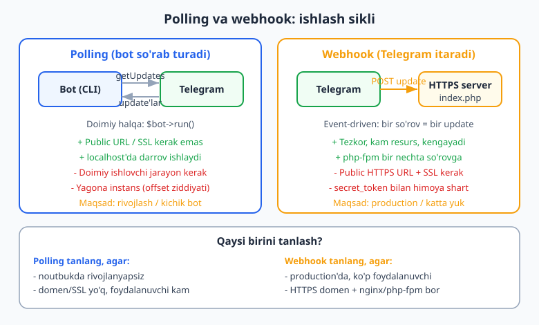
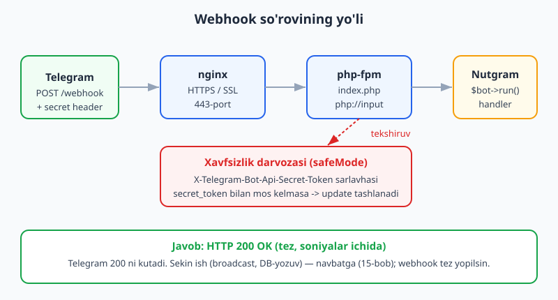
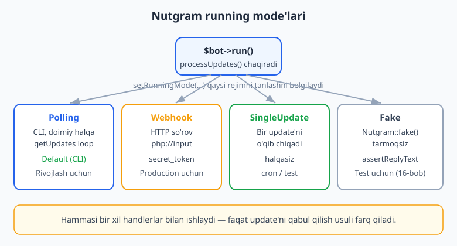

# 13 — Webhook va running mode

[⬅️ Oldingi: 12 — Maxsus xususiyatlar](./12-maxsus-xususiyatlar.md) · [🏠 README](./README.md) · [Keyingi: 14 — To'lovlar va Telegram Stars ➡️](./14-tolovlar-stars.md)

---

> **Bu bobda:** Botingiz Telegram'dan update'larni qanday **qabul qiladi** — ana shu masalani chuqur ko'ramiz. Ikki yo'l bor: **polling** (bot o'zi Telegram'dan "yangilik bormi?" deb so'rab turadi) va **webhook** (Telegram update'ni botning HTTPS manziliga o'zi itarib yuboradi). Avval ikkalasining ichki mexanikasini, afzallik/kamchiligini va qachon qaysi birini tanlashni tushunamiz. So'ng Nutgram'ning **running mode** tushunchasini o'rganamiz: `Polling`, `Webhook`, `SingleUpdate`, `Fake` sinflari, `setRunningMode()`/`getRunningMode()` va `$bot->run()` ularni qanday boshqarishi. Keyin webhook'ni amalda sozlaymiz: `setWebhook` / `deleteWebhook` / `getWebhookInfo`, webhook **endpoint** (`index.php`, nginx + php-fpm orqali), `secret_token` bilan himoya (`safeMode`), SSL talablari va `hash_equals` bilan **doimiy-vaqtli** taqqoslash. Oxirida polling↔webhook o'rtasida xavfsiz almashish va tipik xatolar (502, "Webhook is already set", sekin javob) ko'rib chiqiladi.
>
> **Halol eslatma (verifikatsiya):** Running mode mantig'i — `Webhook` sinfini yaratish, `secretToken` / `safeMode` (`setSafeMode` fluent qaytishi), `setRunningMode()` -> `getRunningMode()` reflektsiyasi, `setWebhook`/`deleteWebhook`/`getWebhookInfo` metodlari mavjudligi, `hash_equals` bilan token taqqoslash va webhook handler'i `Nutgram::fake()` ostida — bularning hammasi **offline, tokensiz, internetsiz HAQIQATAN ishga tushirilib tekshirildi** (Nutgram 4.46, PHP 8.4; 22/22 tekshiruv o'tdi). Ammo **jonli webhook** — bu public HTTPS URL, real domen/SSL sertifikat va BotFather tokenini talab qiladi: shuning uchun `setWebhook` chaqiruvi, nginx/php-fpm konfiguratsiyasi va Telegram'ning real POST so'rovi **illustrativ** — "jonli HTTPS hosting kerak" deb belgilangan. Kod va mantiq to'g'ri; faqat jonli yetkazib berish qismi o'zingizning serveringizda ko'rinadi.

---

## 1. Muammo: update qayerdan keladi?

Avvalgi boblarda biz handler yozdik (`onCommand`, `onText`, `onCallbackQuery`), klaviatura qurdik, conversation va middleware ishlatdik. Lekin bitta savol fonda turardi: **handlergacha update qanday yetib keladi?** Botingiz qayerdadir ishlab turishi va Telegram serveridan yangi xabarlarni olishi kerak. Buning ikki yo'li bor.

- **Polling (so'rab-tortish, _pull_):** botingiz Telegram'ga `getUpdates` so'rovini doimiy yuboradi: "men uchun yangilik bormi?". Telegram javob beradi (yangi update'lar yoki bo'sh ro'yxat), bot ularni qayta ishlaydi va yana so'raydi. Bu cheksiz halqa. Aynan shuni `$bot->run()` CLI'da bajaradi (1-bobdan beri ishlatib kelgan usul).
- **Webhook (itarish, _push_):** siz Telegram'ga "har bir update'ni mana shu HTTPS manzilimga POST qilib yubor" deb aytasiz. Endi bot doimiy so'rab turmaydi — Telegram update kelishi bilan o'zi sizning serveringizga so'rov yuboradi. Bot esa oddiy veb-ilova kabi ishlaydi: so'rov keldi -> bitta update'ni qayta ishladi -> javob qaytardi -> tugadi.



Bu — "men do'konga har 5 daqiqada qo'ng'iroq qilib, buyurtma bormi deb so'rayman" (polling) va "do'kon menga buyurtma kelishi bilan o'zi qo'ng'iroq qiladi" (webhook) farqiga o'xshaydi. Ikkinchisi tezroq va resursni tejaydi, lekin sizda do'kon qo'ng'iroq qila oladigan **doimiy raqam** (public HTTPS URL) bo'lishi shart.

> Polling va webhook bilan birinchi marta 1-bobda umumiy tanishgan edik. Bu bobda esa ichki mexanikani, Nutgram sinflarini va production sozlamasini chuqur ochamiz.

## 2. Polling chuqurroq

Polling — `getUpdates` metodiga asoslangan. Nutgram'ning `Polling` running mode sinfi soddalashtirilgan ko'rinishda quyidagicha ishlaydi (bu **kontseptual** ko'rinish — siz bu kodni yozmaysiz, Nutgram o'zi bajaradi):

```php
<?php
// Polling running mode'ning soddalashtirilgan ichki mantig'i (illustrativ)
$offset = null;
while (true) {
    // long polling: timeout soniyagacha kutadi, update kelsa darrov qaytaradi
    $updates = $bot->getUpdates(
        offset: $offset,
        limit: 100,
        timeout: 25,          // long polling oynasi (soniya)
    );

    foreach ($updates as $update) {
        $bot->processUpdate($update);     // handlerlarni ishga tushiradi
        $offset = $update->update_id + 1; // keyingi safar shu update'dan keyin
    }
}
```

Bu yerda ikki muhim tushuncha bor:

- **`offset` (siljish):** har bir update'da `update_id` bo'ladi. `offset`ni "oxirgi ko'rgan `update_id` + 1" qilib yuborsangiz, Telegram allaqachon olganlaringizni qayta yubormaydi — ya'ni `offset` "tasdiq" (acknowledge) vazifasini bajaradi. Buni Nutgram avtomatik boshqaradi.
- **Long polling:** `timeout` parametri tufayli `getUpdates` darhol bo'sh javob qaytarmaydi — Telegram update kelguncha (yoki `timeout` tugaguncha) ulanishni ochiq ushlab turadi. Shu sabab "har soniyada minglab bo'sh so'rov" bo'lmaydi; bu **long polling**, oddiy "short polling" emas.

Polling'ning eng muhim cheklovi: **bir vaqtda faqat bitta** polling-jarayon ishlashi kerak. Agar ikki nusxa bir xil token bilan `getUpdates` chaqirsa, ular `offset` uchun "urishadi" va update'lar tartibsiz bo'linib ketadi (Telegram `409 Conflict` qaytarishi mumkin). Shuningdek, polling **doimiy ishlovchi jarayon** talab qiladi — uni `systemd`/`supervisor` bilan tirik ushlab turish kerak (17-bobda batafsil).

Polling muhim plyusi: **public URL ham, SSL ham, domen ham kerak emas**. Noutbukingizda, lokalda, hatto NAT orqasida ham ishlaydi — chiquvchi ulanish yetarli. Shuning uchun rivojlanish uchun ideal.

## 3. Webhook chuqurroq

Webhook'da rollar teskari. Siz bir marta Telegram'ga aytasiz: "endi update'larni `https://bot.example.uz/webhook` manziliga POST qil". Shundan keyin har bir yangi update — bu sizning serveringizga keladigan **bitta HTTP so'rov**. So'rov tanasida (`php://input`) bitta update'ning JSON'i bo'ladi.



Yo'lni qadamma-qadam ko'ramiz:

1. Foydalanuvchi botga xabar yozadi -> Telegram serveriga boradi.
2. Telegram darhol `https://bot.example.uz/webhook` manziliga **POST** so'rovini yuboradi; tanasida update JSON, sarlavhada (agar siz so'ragan bo'lsangiz) `X-Telegram-Bot-Api-Secret-Token`.
3. **nginx** 443-portda (HTTPS) so'rovni qabul qiladi, SSL'ni hal qiladi va uni **php-fpm**'ga uzatadi.
4. php-fpm `index.php`'ni ishga tushiradi; u `php://input`'dan JSON'ni o'qiydi.
5. Nutgram (`Webhook` running mode) update'ni o'qiydi, kerak bo'lsa `secret_token`'ni tekshiradi va handler'ni ishga tushiradi.
6. Skript `200 OK` qaytaradi va tugaydi. Telegram `200` ni oladi va update'ni "yetkazilgan" deb belgilaydi.

Eng muhim farq: webhook'da bot **doimiy halqa emas**. Har bir so'rov uchun PHP skripti yangidan ishga tushadi, bitta update'ni qayta ishlaydi va o'ladi — xuddi oddiy veb-sahifa kabi. Bu php-fpm modeliga juda mos: o'nlab so'rov bir vaqtda parallel ishlanaveradi, "yagona jarayon" cheklovi yo'q.

**Telegram 200-javobini tez kutadi.** Agar `index.php` sekin ishlasa (masalan, ichida minglab odamga broadcast qilsa), Telegram bu update'ni "yetkazilmadi" deb qayta-qayta yuborishi yoki webhook'ni "sog'lom emas" deb belgilashi mumkin. Qoida: **webhook handler'i tez yopilsin**; og'ir ish (broadcast, tashqi API, sekin DB-yozuv) navbatga (queue) qo'yilsin va alohida worker bajarsin (15-bob).

## 4. Nutgram running mode'lari

Polling ham, webhook ham bir xil narsani qiladi: update oladi va `processUpdate()` orqali handlerlarga uzatadi. Faqat **update'ni qabul qilish usuli** farq qiladi. Nutgram buni **running mode** degan tushuncha bilan ajratadi — bu `processUpdates(Nutgram $bot)` metodiga ega sinf. `$bot->run()` aslida shunchaki **joriy running mode**'ning `processUpdates()`'ini chaqiradi.



Nutgram'da to'rt running mode bor:

| Running mode | Sinf | Update qayerdan | Qachon |
|---|---|---|---|
| **Polling** | `RunningMode\Polling` | `getUpdates` halqasi (CLI) | Rivojlanish, kichik bot. CLI'da **default** |
| **Webhook** | `RunningMode\Webhook` | `php://input` (HTTP POST) | Production, public HTTPS server |
| **SingleUpdate** | `RunningMode\SingleUpdate` | Bitta update'ni o'qiydi, halqasiz | cron / bir martalik qayta ishlash |
| **Fake** | `RunningMode\Fake` | Test uchun soxta update'lar | `Nutgram::fake()` (16-bob) |

`setRunningMode()` rejimni o'rnatadi, `getRunningMode()` esa joriy rejim **sinf nomini** (string) qaytaradi. Buni offline tekshirib ko'rdik:

```php
<?php
use SergiX44\Nutgram\Nutgram;
use SergiX44\Nutgram\RunningMode\Webhook;
use SergiX44\Nutgram\RunningMode\Polling;

$bot = Nutgram::fake();

$bot->setRunningMode(new Webhook(secretToken: 'tok'));
echo $bot->getRunningMode();   // SergiX44\Nutgram\RunningMode\Webhook

$bot->setRunningMode(Polling::class);
echo $bot->getRunningMode();   // SergiX44\Nutgram\RunningMode\Polling
```

`setRunningMode()` ham **instans** (`new Webhook(...)`), ham **sinf nomi** (`Polling::class`) qabul qiladi. Instans kerak bo'lsa — masalan `Webhook`'ga `secret_token` uzatish uchun — yangi obyekt yarating; sozlama kerak bo'lmasa, sinf nomini bering yetarli.

> **Diqqat:** `Polling` running mode faqat **CLI**'da (`php bot.php`) yaratiladi — konstruktori SAPI'ni tekshiradi va veb-so'rovda `RuntimeException` tashlaydi. Bu mantiqiy: veb-server ichida cheksiz halqa ishlatib bo'lmaydi. Webhook esa aksincha — u veb-so'rov ichida ishlaydi.

## 5. Webhook'ni o'rnatish: `setWebhook`

Telegram'ga "update'larni mana shu URL'ga yubor" deyish uchun bir marta `setWebhook` chaqiriladi. Bu metod tasdiqlangan imzoga ega:

```php
setWebhook(
    string $url,
    ?InputFile $certificate = null,
    ?string $ip_address = null,
    ?int $max_connections = null,
    ?array $allowed_updates = ...,
    ?bool $drop_pending_updates = null,
    ?string $secret_token = null
): ?bool
```

Odatda buni alohida **bir martalik skript** (yoki Artisan-uslubidagi komanda) sifatida yozasiz va deploy paytida bir marta ishga tushirasiz:

```php
<?php
// set-webhook.php — bir marta ishga tushiriladigan skript
// ILLUSTRATIV: jonli ishlashi uchun haqiqiy token + public HTTPS URL kerak.
require __DIR__ . '/vendor/autoload.php';

use SergiX44\Nutgram\Nutgram;

$bot = new Nutgram($_ENV['TELEGRAM_TOKEN']);

$ok = $bot->setWebhook(
    url: 'https://bot.example.uz/webhook',
    secret_token: $_ENV['WEBHOOK_SECRET'],   // Telegram har so'rovda shu sarlavhani qo'shadi
    drop_pending_updates: true,              // eski navbatdagi update'larni tashlab yubor
    // allowed_updates: ['message', 'callback_query'], // faqat keraklilarini ol (ixtiyoriy)
);

var_dump($ok); // true — webhook o'rnatildi
```

Muhim parametrlar:

- **`url`** — HTTPS bo'lishi **shart** (HTTP qabul qilinmaydi). Telegram faqat 443, 80, 88, 8443 portlarini qo'llaydi.
- **`secret_token`** — 1–256 belgili maxfiy satr (`A–Z a–z 0–9 _ -`). Telegram har bir POST so'rovda uni `X-Telegram-Bot-Api-Secret-Token` sarlavhasida qaytaradi. Bu — webhook'ingizga **faqat Telegram** so'rov yuborayotganini tasdiqlash usuli (6-bo'limda ishlatamiz). Tokenni `.env`'da saqlang.
- **`drop_pending_updates: true`** — ag'darilishdan oldin polling/eski rejimda yig'ilib qolgan update'larni tashlaydi (ko'pincha deploy paytida foydali).
- **`allowed_updates`** — faqat kerakli update turlarini cheklash; berilmasa Nutgram oqilona default ro'yxatni yuboradi.

> **HALOL:** Bu skriptni RUN qilib "webhook o'rnatildi" deb tasdiqlay olmaymiz — `setWebhook` Telegram'ga real tarmoq so'rovi yuboradi va public HTTPS URL hamda haqiqiy token talab qiladi. Metod imzosi va parametrlari esa o'rnatilgan Nutgram 4.46 manbasidan **tekshirildi** — xayoliy emas.

## 6. Webhook endpoint: `index.php`

Server tomonida webhook — bu oddiy bitta fayl: `public/index.php`. nginx + php-fpm uni har bir POST so'rovda ishga tushiradi. Bu fayl Nutgram'ni quradi, running mode'ni `Webhook` qilib o'rnatadi va `$bot->run()` chaqiradi:

```php
<?php
// public/index.php — webhook endpoint
// ILLUSTRATIV jonli qism: nginx/php-fpm + public HTTPS kerak. Mantiq esa to'g'ri.
require __DIR__ . '/../vendor/autoload.php';

use SergiX44\Nutgram\Nutgram;
use SergiX44\Nutgram\RunningMode\Webhook;

$bot = new Nutgram($_ENV['TELEGRAM_TOKEN']);

// 1) Webhook running mode + secret_token tekshiruvini yoqamiz
$bot->setRunningMode(
    (new Webhook(secretToken: $_ENV['WEBHOOK_SECRET']))
        ->setSafeMode(true)   // sarlavha mos kelmasa update e'tiborsiz qoldiriladi
);

// 2) Handlerlar — polling'dagi bilan AYNAN bir xil
$bot->onCommand('start', function (Nutgram $bot) {
    $bot->sendMessage('Salom! Bu bot webhook orqali ishlayapti.');
});

// 3) run() — Webhook mode'da php://input dan bitta update'ni o'qib qayta ishlaydi
$bot->run();
```

E'tibor bering: **handlerlar o'zgarmadi**. Polling'dan webhook'ga o'tish — bu faqat "update qayerdan keladi" masalasi; bot mantig'i (handler, conversation, middleware) bir xil qoladi. Aynan shuning uchun rivojlanishni polling'da qilib, production'da webhook'ga o'tish oson.

`setSafeMode(true)` — `Webhook` sinfining ichki himoyasini yoqadi: kelgan so'rovdagi `X-Telegram-Bot-Api-Secret-Token` sarlavhasini siz bergan `secretToken` bilan solishtiradi; mos kelmasa update **shunchaki tashlanadi** (`processUpdate` chaqirilmaydi). Buni offline tasdiqladik:

```php
<?php
use SergiX44\Nutgram\RunningMode\Webhook;

$wh = new Webhook(secretToken: 'super-secret-123');
var_dump($wh->isSafeMode());          // bool(false) — default o'chiq
$wh->setSafeMode(true);
var_dump($wh->isSafeMode());          // bool(true)
// setSafeMode fluent — o'zini qaytaradi, shuning uchun zanjirlash mumkin:
$wh = (new Webhook(secretToken: 'x'))->setSafeMode(true);
```

> **Eslatma — `secretToken` (camelCase) konstruktor parametri.** `Webhook` PHP sinfining konstruktor parametri nomi `secretToken`. Telegram tomonidagi (`setWebhook` metodida) parametr esa `secret_token` (snake_case). Ikkalasiga ham **bir xil qiymat** bering — biri Telegram'ga "shu tokenni qaytar" deydi, ikkinchisi serverda "shu token kelganini tekshir" deydi.

## 7. `secret_token` bilan himoya va doimiy-vaqtli taqqoslash

Webhook URL'ingiz ochiq internetda. Agar kimdir uni topib qolsa, soxta "update" yuborib botingizni aldashga urinishi mumkin. `secret_token` aynan shundan himoya qiladi: faqat Telegram to'g'ri sarlavhani biladi.

`setSafeMode(true)` ichki tekshiruvni yoqadi, lekin tekshiruvni **qo'lda** ham yozish foydali — mantiqni tushunish va o'z endpoint'ingizda nazorat qilish uchun. Eng muhim qoida: tokenlarni **`hash_equals()`** bilan solishtiring, oddiy `===` bilan emas.

```php
<?php
// Qo'lda secret_token tekshiruvi (Slim yoki sof PHP endpoint uchun)
$expected = $_ENV['WEBHOOK_SECRET'];
$received = $_SERVER['HTTP_X_TELEGRAM_BOT_API_SECRET_TOKEN'] ?? '';

// hash_equals — DOIMIY VAQTLI taqqoslash: timing-attack'dan himoya qiladi
if (!hash_equals($expected, $received)) {
    http_response_code(403);
    exit; // Telegram emas — rad etamiz
}
```

Nega `===` emas? Oddiy satr taqqoslash birinchi farq qilgan belgida to'xtaydi — ya'ni taqqoslash **vaqti** to'g'ri belgilar soniga bog'liq. Hujumchi shu mikro-farqni o'lchab tokenni belgi-belgi tiklashga urinishi mumkin (timing attack). `hash_equals()` esa har doim bir xil vaqt sarflaydi. Buni tekshirdik:

```php
<?php
$expected = 'my-secret-token';
var_dump(hash_equals($expected, 'my-secret-token')); // bool(true)
var_dump(hash_equals($expected, 'soxta'));           // bool(false)
var_dump(hash_equals($expected, ''));                // bool(false)
```

> Maxfiy ma'lumotlarni (token, parol, HMAC) solishtirganda **doim** `hash_equals()` ishlating. Bu xuddi Web App `initData`'ni tekshirgandagi qoida bilan bir xil (24-bobda batafsil).

## 8. SSL va nginx (production konturi)

Webhook **albatta HTTPS** bo'lishi kerak. Ikki yo'l:

1. **Ishonchli sertifikat** (Let's Encrypt / `certbot` orqali bepul) — eng keng tarqalgan. Telegram sertifikatni avtomatik ishonadi, `setWebhook`'da sertifikat yuborish shart emas.
2. **Self-signed sertifikat** — o'zingiz imzolagan; bu holda uni `setWebhook`'ga `certificate: InputFile::make('cert.pem')` orqali yuborishingiz kerak. Production uchun tavsiya etilmaydi — Let's Encrypt osonroq va bepul.

nginx konfiguratsiyasining illustrativ namunasi (server tomonida, bu kitobdan tashqarida ishlaydi):

```nginx
# /etc/nginx/sites-available/bot — ILLUSTRATIV (jonli server kerak)
server {
    listen 443 ssl;
    server_name bot.example.uz;

    ssl_certificate     /etc/letsencrypt/live/bot.example.uz/fullchain.pem;
    ssl_certificate_key /etc/letsencrypt/live/bot.example.uz/privkey.pem;

    root /var/www/bot/public;   # index.php shu yerda
    index index.php;

    location /webhook {
        try_files $uri /index.php?$query_string;
    }

    location ~ \.php$ {
        include fastcgi_params;
        fastcgi_pass unix:/run/php/php8.4-fpm.sock;   # php-fpm
        fastcgi_param SCRIPT_FILENAME $document_root$fastcgi_script_name;
    }
}
```

Oqim: `https://bot.example.uz/webhook` -> nginx (SSL'ni yechadi) -> php-fpm soketi -> `index.php` -> Nutgram. Telegram POST tanasi `php://input`'da, `secret_token` sarlavhasi `$_SERVER['HTTP_X_TELEGRAM_BOT_API_SECRET_TOKEN']`'da bo'ladi.

> **HALOL:** Bu nginx bloki va SSL sertifikatlari **illustrativ** — ularni jonli serverda (VPS, Let's Encrypt bilan) sinab ko'rasiz. Tokensiz/serversiz bu qismni RUN qilib bo'lmaydi. Production deploy'ning to'liq retsepti — 17-bobda.

## 9. Webhook holatini tekshirish va o'chirish

Webhook to'g'ri o'rnatilganini bilish uchun `getWebhookInfo` chaqiriladi — u joriy URL, kutilayotgan update'lar soni va **oxirgi xato**ni qaytaradi (debug uchun oltin):

```php
<?php
// ILLUSTRATIV: jonli token + tarmoq kerak.
$info = $bot->getWebhookInfo();

echo $info->url;                      // 'https://bot.example.uz/webhook' yoki bo'sh
echo $info->pending_update_count;     // kutilayotgan update'lar soni
echo $info->last_error_message ?? ''; // oxirgi xato (masalan, "Wrong response from the webhook: 502")
```

`last_error_message` — webhook ishlamayotganda birinchi qaraydigan joy. "502 Bad Gateway" -> php-fpm/nginx muammosi; "SSL error" -> sertifikat muammosi; bo'sh -> hammasi joyida.

Webhook'ni o'chirib, polling'ga qaytish uchun `deleteWebhook`:

```php
<?php
// ILLUSTRATIV: jonli token + tarmoq kerak.
$bot->deleteWebhook(drop_pending_updates: true);
// Endi $bot->run() ni CLI'da polling sifatida ishlatish mumkin
```

**Muhim qoida:** bir bot bir vaqtning o'zida **yo polling, yo webhook** — ikkalasi birga emas. Agar webhook o'rnatilgan bo'lsa va siz `getUpdates` (polling) chaqirsangiz, Telegram `409 Conflict` yoki "Conflict: can't use getUpdates method while webhook is active" xatosini qaytaradi. Polling'ga o'tishdan oldin **avval `deleteWebhook` chaqiring**.

## 10. Qachon polling, qachon webhook?

Qaror jadvali:

| Holat | Tavsiya |
|---|---|
| Lokalda rivojlanyapsiz, noutbukda | **Polling** — sozlash 0, darrov ishlaydi |
| Domen/SSL hali yo'q, foydalanuvchi kam | **Polling** |
| Production, public HTTPS domen bor | **Webhook** |
| Minglab foydalanuvchi, yuqori yuk | **Webhook** — kam resurs, kengayadi |
| Serverless / faqat HTTP so'rovga javob (cron emas) | **Webhook** |
| cron orqali vaqti-vaqti bilan update yig'ish | **SingleUpdate** |
| Avtomatik test | **Fake** (`Nutgram::fake()`, 16-bob) |

Amaliy yo'l ko'pchilik loyihalarda: **rivojlanishda polling**, **deploy'da webhook**. Kod bir xil — faqat `index.php`'da running mode'ni almashtirasiz va bir marta `setWebhook` ishlatasiz. Polling'dan webhook'ga (yoki teskari) o'tishda **avval eskisini bekor qiling** (`deleteWebhook` yoki polling jarayonini to'xtatish), so'ng yangisini yoqing — `409 Conflict`dan shunday qochiladi.

## 11. SingleUpdate: cron uslubidagi rejim

`SingleUpdate` — kam ishlatiladigan, lekin foydali rejim. U `Polling`'dan meros oladi, lekin halqasiz: bitta update'ni o'qiydi, qayta ishlaydi va chiqadi. Bu — webhook o'rnatib bo'lmaydigan, lekin doimiy jarayon ham xohlamaydigan holatlar uchun (masalan, har daqiqada `cron` orqali "yangilik bormi?" deb tekshirish):

```php
<?php
// run-once.php — cron har daqiqada ishga tushiradi (illustrativ; jonli token kerak)
use SergiX44\Nutgram\Nutgram;
use SergiX44\Nutgram\RunningMode\SingleUpdate;

$bot = new Nutgram($_ENV['TELEGRAM_TOKEN']);
$bot->setRunningMode(SingleUpdate::class);

$bot->onCommand('start', fn (Nutgram $bot) => $bot->sendMessage('Salom!'));

$bot->run(); // bitta update'ni oladi va chiqadi
```

Bu webhook bilan polling o'rtasidagi "o'rta yo'l": doimiy jarayon kerak emas, public URL ham kerak emas, lekin javob real vaqtda emas — cron qadami bilan kechikadi.

## 12. Tipik xatolar va ularni hal qilish

- **`409 Conflict` / "can't use getUpdates while webhook is active":** webhook o'rnatilgan, lekin polling ham ishlayapti. Yechim: `deleteWebhook` chaqiring yoki webhook'da qoling.
- **Telegram 502/504 qaytaradi (`last_error_message`da):** nginx php-fpm bilan bog'lanolmayapti yoki skript halok bo'ldi/sekin. php-fpm log'ini va `fastcgi_pass` soketini tekshiring.
- **Update'lar kelmayapti, lekin xato yo'q:** `allowed_updates`da kerakli tur cheklanib qolganmi? Masalan `callback_query`ni qo'shmagan bo'lsangiz, inline tugma bosishlari kelmaydi. `getWebhookInfo`'da `allowed_updates`ni tekshiring.
- **Soxta so'rovlar:** `secret_token` o'rnatmagansiz. `setSafeMode(true)` + `secretToken` bilan yoping.
- **Webhook sekin, Telegram qayta yuborayapti:** og'ir ish (broadcast, tashqi API) handler ichida sinxron bajarilyapti. Uni navbatga (queue) ko'chiring (15-bob) — webhook tez `200` qaytarsin.
- **HTTP URL ishlamayapti:** Telegram faqat HTTPS qabul qiladi. SSL sertifikat o'rnating (Let's Encrypt).

> **Solishtirish (Python/aiogram):** aiogram'da ekvivalent — `bot.set_webhook(...)` va `aiohttp`/ASGI server bilan endpoint, polling esa `dp.start_polling(bot)`. G'oya bir xil; faqat PHP'da webhook php-fpm so'rov-modeliga (har so'rov = yangi skript), aiogram'da esa doimiy ASGI jarayoniga tayanadi. Qarang [../tgbot-python/README.md](../tgbot-python/README.md).

## Mashqlar

### Oson

1. Polling va webhook orasidagi asosiy farqni bir jumlada ayting: "kim kimga so'rov yuboradi?". Har biriga bittadan misol holat keltiring.
2. `setRunningMode()` ham instans, ham sinf nomi qabul qiladi. `Polling` uchun qaysi shaklni ishlatish qulay, `Webhook` (secret_token bilan) uchun qaysi shaklni — va nega?
3. `Webhook` running mode'ni `secretToken: 'abc'` bilan yarating va `isSafeMode()` qiymatini tekshiring. Default qiymat qanaqa?
4. `setSafeMode(true)` chaqiruvi nima qaytaradi? Nega bu "fluent" deb ataladi va u nimaga yordam beradi?
5. Telegram webhook uchun qaysi protokol (HTTP yoki HTTPS) talab qilinadi? `setWebhook`'ga `http://...` bersangiz nima bo'ladi?
6. `getWebhookInfo` qaytargan ma'lumotda webhook ishlamayotganini debug qilish uchun qaysi maydon eng foydali?

### O'rta

1. `hash_equals($expected, $received)` uchun uchta holatni tekshiruvchi `assert` yozing: to'g'ri token, soxta token, bo'sh satr. Nega `===` o'rniga `hash_equals` ishlatamiz?
2. `setRunningMode(new Webhook(...))` -> `getRunningMode()` to'liq sinf nomini (string) qaytaradi. `Nutgram::fake()` bilan buni `assert` orqali tasdiqlang (Webhook, keyin Polling).
3. Bir martalik `set-webhook.php` skriptini yozing: `url`, `secret_token` (`.env`'dan) va `drop_pending_updates: true` bilan `setWebhook` chaqirsin. Nega bu alohida skript, `index.php` ichida emas?
4. `index.php` endpoint'da handler (`onCommand('start', ...)`) yozing va uni `Nutgram::fake()` bilan offline tekshiring (`hearText('/start')->reply()` + `assertReplyText`). Handler webhook va polling'da bir xil ishlashini izohlang.
5. `allowed_updates: ['message', 'callback_query']` bersangiz, qaysi update turlari **kelmaydi**? Bu nima uchun foydali (resurs/maxfiylik)?
6. Webhook'dan polling'ga xavfsiz o'tish ketma-ketligini yozing (qaysi metodlar, qaysi tartibda) va nega `409 Conflict`dan shunday qochish mumkinligini tushuntiring.

### Qiyin

1. Sof PHP `validateWebhookRequest()` funksiyasini yozing: u `$_SERVER` sarlavhasidan `secret_token`ni oladi, kutilgan token bilan `hash_equals` orqali solishtiradi, mos kelmasa `403` qaytaradi. Funksiyani `assert` bilan (to'g'ri/soxta token) tekshiring (`$_SERVER`ni qo'lda to'ldiring).
2. Webhook handler'i Telegram'ni kuttirmasligi uchun "og'ir ish"ni qanday ajratish kerakligini tushuntiring. Sxema yozing: webhook `200` qaytaradi -> ish navbatga qo'yiladi -> alohida worker bajaradi. Nega sinxron broadcast webhook ichida yomon?
3. `getWebhookInfo`dan keladigan `last_error_message`'ning uchta tipik qiymatini (502, SSL, conflict) sanab, har biriga sabab va yechim yozing.
4. `https`/`host` mavjudligini tekshiruvchi `validWebhookUrl(string $url): bool` yozing (`parse_url` bilan). Uni uchta holatda (`https://...` valid, `http://...` invalid, hostsiz invalid) `assert` bilan tasdiqlang.

<details markdown="1"><summary>Yechimlar</summary>

**Oson 1.** Polling — **bot** Telegram'ga "yangilik bormi?" deb so'rab turadi (`getUpdates`); misol: lokalda rivojlanish. Webhook — **Telegram** botning HTTPS URL'iga update'ni o'zi POST qiladi; misol: public domenli production bot.

**Oson 2.** `Polling` uchun **sinf nomi** qulay: `setRunningMode(Polling::class)` — qo'shimcha sozlama kerak emas. `Webhook` (secret_token bilan) uchun **instans** kerak: `setRunningMode(new Webhook(secretToken: '...'))` — chunki tokenni konstruktorga uzatish lozim.

**Oson 3.**
```php
<?php
use SergiX44\Nutgram\RunningMode\Webhook;
$wh = new Webhook(secretToken: 'abc');
var_dump($wh->isSafeMode()); // bool(false) — default O'CHIQ
```
Default `safeMode` — `false`, ya'ni `setSafeMode(true)` chaqirmasangiz secret_token avtomatik tekshirilmaydi.

**Oson 4.** `setSafeMode(true)` — `$this` (ya'ni `Webhook` obyektining o'zini) qaytaradi. "Fluent" deyiladi, chunki natijani darrov zanjirlash mumkin: `(new Webhook(secretToken: 'x'))->setSafeMode(true)`. Bu yangi obyektni yaratib, darhol sozlab, `setRunningMode`'ga bir qatorda uzatishga yordam beradi.

**Oson 5.** Faqat **HTTPS**. `http://...` bersangiz Telegram webhook'ni rad etadi (xato qaytaradi) — shifrlanmagan ulanish qabul qilinmaydi.

**Oson 6.** `last_error_message` — webhook'ning oxirgi xatosini matn ko'rinishida beradi (masalan "Wrong response from the webhook: 502"). `pending_update_count` ham foydali (navbat to'lib ketganini ko'rsatadi).

**O'rta 1.**
```php
<?php
$expected = 'my-secret-token';
assert(hash_equals($expected, 'my-secret-token') === true);
assert(hash_equals($expected, 'soxta') === false);
assert(hash_equals($expected, '') === false);
```
`hash_equals` — **doimiy vaqtli** taqqoslash: u har doim bir xil vaqt sarflaydi, shu sabab timing-attack orqali tokenni belgi-belgi tiklab bo'lmaydi. `===` esa birinchi farqda to'xtaydi va vaqt sizib chiqishi mumkin.

**O'rta 2.**
```php
<?php
use SergiX44\Nutgram\Nutgram;
use SergiX44\Nutgram\RunningMode\Webhook;
use SergiX44\Nutgram\RunningMode\Polling;

$bot = Nutgram::fake();
$bot->setRunningMode(new Webhook(secretToken: 'tok'));
assert($bot->getRunningMode() === Webhook::class);
$bot->setRunningMode(Polling::class);
assert($bot->getRunningMode() === Polling::class);
```

**O'rta 3.**
```php
<?php
// set-webhook.php
require __DIR__ . '/vendor/autoload.php';
use SergiX44\Nutgram\Nutgram;

$bot = new Nutgram($_ENV['TELEGRAM_TOKEN']);
$ok = $bot->setWebhook(
    url: 'https://bot.example.uz/webhook',
    secret_token: $_ENV['WEBHOOK_SECRET'],
    drop_pending_updates: true,
);
var_dump($ok);
```
Bu alohida skript, chunki `setWebhook` faqat **bir marta** (deploy paytida) ishlatiladi. Agar uni har bir webhook so'rovida (`index.php`) chaqirsangiz — bu har bir update uchun Telegram'ga ortiqcha tarmoq so'rovi bo'lardi: sekin va keraksiz.

**O'rta 4.**
```php
<?php
use SergiX44\Nutgram\Nutgram;

$bot = Nutgram::fake();
$bot->onCommand('start', fn (Nutgram $bot) => $bot->sendMessage('Salom! Webhook orqali.'));
$bot->hearText('/start')->reply();
$bot->assertReplyText('Salom! Webhook orqali.');
```
Handler webhook va polling'da bir xil ishlaydi, chunki running mode faqat **update'ni qabul qilish** usulini o'zgartiradi; `processUpdate` -> handler oqimi bir xil.

**O'rta 5.** `allowed_updates: ['message', 'callback_query']` bersangiz, faqat shu ikki tur keladi; `edited_message`, `my_chat_member`, `chat_member`, `poll` va boshqalar **kelmaydi**. Foydasi: keraksiz update'larni qabul qilmaslik -> kam tarmoq/resurs sarfi va maxfiylik (masalan a'zolik o'zgarishlarini olishni xohlamasangiz).

**O'rta 6.**
```php
<?php
// 1) Webhook'ni o'chir (eskisini bekor qil)
$bot->deleteWebhook(drop_pending_updates: true);
// 2) Endi CLI'da polling: setRunningMode(Polling::class) -> $bot->run()
```
Avval `deleteWebhook` chaqirilgani uchun Telegram'da webhook faol qolmaydi; shuning uchun `getUpdates` (polling) `409 Conflict` bermaydi. Webhook va polling hech qachon bir vaqtda faol bo'lmasligi kerak.

**Qiyin 1.**
```php
<?php
function validateWebhookRequest(string $expected): bool
{
    $received = $_SERVER['HTTP_X_TELEGRAM_BOT_API_SECRET_TOKEN'] ?? '';
    if (!hash_equals($expected, $received)) {
        http_response_code(403);
        return false;
    }
    return true;
}

// Test (CLI'da $_SERVER'ni qo'lda to'ldiramiz)
$_SERVER['HTTP_X_TELEGRAM_BOT_API_SECRET_TOKEN'] = 'secret123';
assert(validateWebhookRequest('secret123') === true);

$_SERVER['HTTP_X_TELEGRAM_BOT_API_SECRET_TOKEN'] = 'soxta';
assert(validateWebhookRequest('secret123') === false);

unset($_SERVER['HTTP_X_TELEGRAM_BOT_API_SECRET_TOKEN']);
assert(validateWebhookRequest('secret123') === false); // header yo'q -> bo'sh -> false
```

**Qiyin 2.** Webhook handler'i Telegram'dan `200` javobini **tez** kutadi (bir necha soniya). Agar handler ichida minglab odamga sinxron `sendMessage` qilsangiz, skript uzoq ishlaydi, Telegram `200`ni kutmay update'ni "yetkazilmadi" deb **qayta yuboradi** — natijada bir xil ish takror bajariladi (double-send) va webhook "sog'lom emas" deb belgilanishi mumkin. Yechim sxemasi:
```
Telegram POST -> index.php:
   1) update'ni navbatga qo'y (DB/Redis queue) — tez
   2) 200 OK qaytar (skript yopiladi)
Alohida worker (cron/daemon):
   3) navbatdan oladi -> broadcast/og'ir ishni bajaradi
```
Ya'ni webhook faqat "qabul qildim" deydi; haqiqiy og'ir ish fon-worker'da bajariladi (15-bob).

**Qiyin 3.**
- **"Wrong response from the webhook: 502 Bad Gateway"** — sabab: nginx php-fpm bilan bog'lanolmadi yoki skript halok bo'ldi. Yechim: `fastcgi_pass` soketi/portini, php-fpm xizmati ishlayotganini va PHP xato log'ini tekshiring.
- **"SSL error" / "certificate verify failed"** — sabab: SSL sertifikat noto'g'ri/muddati o'tgan/zanjir to'liq emas. Yechim: Let's Encrypt sertifikatini yangilang, `fullchain.pem` ishlating.
- **"Conflict: can't use getUpdates while webhook is active"** — sabab: webhook o'rnatilgan, lekin polling ham ishlayapti. Yechim: polling'ni to'xtating yoki `deleteWebhook` chaqiring.

**Qiyin 4.**
```php
<?php
function validWebhookUrl(string $url): bool
{
    $p = parse_url($url);
    return ($p['scheme'] ?? '') === 'https' && !empty($p['host']);
}

assert(validWebhookUrl('https://bot.example.uz/webhook') === true);
assert(validWebhookUrl('http://bot.example.uz/webhook') === false); // https emas
assert(validWebhookUrl('https:///webhook') === false);              // host yo'q
```

</details>

---

[⬅️ Oldingi: 12 — Maxsus xususiyatlar](./12-maxsus-xususiyatlar.md) · [🏠 README](./README.md) · [Keyingi: 14 — To'lovlar va Telegram Stars ➡️](./14-tolovlar-stars.md)
