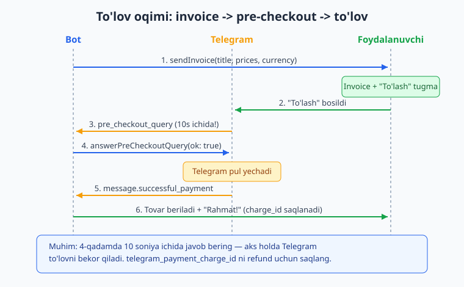
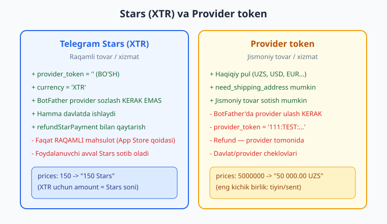
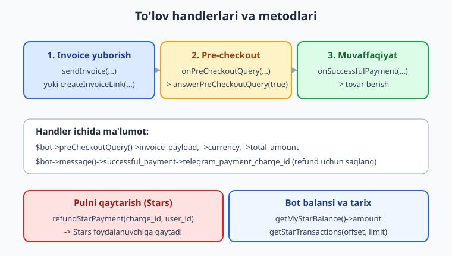

# 14 — To'lovlar va Telegram Stars

[⬅️ Oldingi: 13 — Webhook va running mode](./13-webhook-deploy.md) · [🏠 README](./README.md) · [Keyingi: 15 — Rejalashtirilgan vazifalar va broadcast ➡️](./15-rejalashtirilgan-broadcast.md)

---

> **Bu bobda:** Telegram bot orqali **pul ishlash** — to'lovlarni qabul qilish. Telegram'da to'lov uch qadamli oqim bilan ishlaydi: bot **invoice** (hisob-faktura) yuboradi (`sendInvoice`), foydalanuvchi "To'lash" tugmasini bossa Telegram botga **pre-checkout query** yuboradi va bot **10 soniya** ichida `answerPreCheckoutQuery` bilan tasdiqlashi kerak, so'ng to'lov amalga oshgach **`successful_payment`** xabari keladi (`onSuccessfulPayment`). Quyidagilarni o'rganamiz: ikki xil to'lov turi — **Telegram Stars (XTR)** (raqamli tovar uchun, provider token KERAK EMAS) va **provider token** (jismoniy tovar / haqiqiy valyuta, BotFather orqali ulanadi); `LabeledPrice` va narxni **eng kichik birlikda** ko'rsatish; `onPreCheckoutQuery` / `answerPreCheckoutQuery` (tasdiq va rad etish); `onSuccessfulPayment` va `telegram_payment_charge_id`'ni bazaga saqlash; **`refundStarPayment`** bilan Stars'ni qaytarish; **`createInvoiceLink`** bilan ulashiladigan to'lov havolasi; `getMyStarBalance` / `getStarTransactions` bilan bot balansini ko'rish; payload validatsiyasi va xavfsizlik (narxni hech qachon foydalanuvchidan olma).
>
> Halol eslatma: bu bobdagi to'lov **oqimi va handlerlari** (`sendInvoice` chaqiruvi, `onPreCheckoutQuery` -> `answerPreCheckoutQuery`, `onSuccessfulPayment`, `refundStarPayment`, `createInvoiceLink`, `getMyStarBalance`, payload validatsiyasi va charge_id'ni SQLite'ga saqlash) `Nutgram::fake()` (FakeNutgram) bilan **offline, tarmoqsiz va tokensiz HAQIQATAN ishga tushirilib tekshirilgan** — natijalar quyida. Lekin **haqiqiy to'lov** — illustrativ: u **jonli provider token** (BotFather'da ulangan) va/yoki real Stars hisobi, jonli Telegram mijozini talab qiladi. Pul aslida o'tishi, "to'lov muvaffaqiyatli" degan haqiqiy natija faqat jonli botda ko'rinadi; bu yerda kod va mantiq to'g'ri, faqat pul harakatining o'zi illustrativ.

---

## Telegram to'lovlari qanday ishlaydi?

Telegram'ning to'lov tizimi — bu bot foydalanuvchiga **invoice** (hisob-faktura) yuboradigan, foydalanuvchi esa Telegram interfeysi ichida to'lashi mumkin bo'lgan mexanizm. Bot pulni o'zi qabul qilmaydi — Telegram vositachi bo'ladi. Butun oqim shunday:

1. **Bot** `sendInvoice(...)` yuboradi — foydalanuvchi chatida "To'lash" tugmali maxsus xabar paydo bo'ladi.
2. **Foydalanuvchi** "To'lash"ni bosadi, karta/Stars ma'lumotini kiritadi.
3. **Telegram** botga `pre_checkout_query` yuboradi — bu "so'nggi tekshiruv": tovar hali mavjudmi, narx to'g'rimi? Bot **10 soniya ichida** `answerPreCheckoutQuery(true)` bilan javob berishi SHART.
4. Bot tasdiqlasa, **Telegram pulni yechadi** va botga `successful_payment` maydoni bilan xabar yuboradi.
5. Bot tovarni beradi (masalan, obunani yoqadi) va `telegram_payment_charge_id`'ni saqlaydi.



Bu oqim Python `aiogram` kitobidagi to'lovlar bilan deyarli aynan bir xil — agar uni ko'rgan bo'lsangiz (qarang [../tgbot-python/README.md](../tgbot-python/README.md)), Nutgram'da faqat sintaksis o'zgaradi, mantiq bir xil.

## Ikki xil to'lov: Stars va provider token

Telegram'da to'lovning ikki yo'li bor, va ular **butunlay boshqacha** maqsadlar uchun:

| | **Telegram Stars (XTR)** | **Provider token** |
|---|---|---|
| Nima uchun | Raqamli tovar/xizmat (obuna, kontent, o'yin ichidagi narsalar) | Jismoniy tovar, haqiqiy valyutadagi xizmat |
| `provider_token` | `''` (bo'sh string) | BotFather'dan olingan token, masalan `'111:TEST:abc'` |
| `currency` | `'XTR'` | `'UZS'`, `'USD'`, `'EUR'` ... |
| BotFather sozlash | KERAK EMAS | Provider (Stripe, ...) ulash KERAK |
| Refund | `refundStarPayment` orqali botning o'zi | Provider tomonida |
| Cheklov | Faqat raqamli mahsulot (Apple/Google qoidasi) | Davlat/provider cheklovlari |



**Tavsiya:** raqamli mahsulot (obuna, premium funksiya) sotyapsizmi — **Stars** ishlating, u eng sodda yo'l: hech qanday provider ulash, hujjat to'ldirish kerak emas, dunyoning hamma joyida ishlaydi. Jismoniy tovar yoki haqiqiy pul kerak bo'lsagina provider token bilan ovora bo'ling.

> **Diqqat — App Store / Google Play qoidasi:** iOS/Android'dagi Telegram ilovasida raqamli tovarni faqat **Stars** orqali sotish mumkin. Raqamli mahsulot uchun haqiqiy valyuta (provider token) ishlatsangiz, mobil mijozda to'lov ko'rsatilmaydi. Shu sababli raqamli narsa = Stars.

## `LabeledPrice` va narx — eng kichik birlik

Narx har doim **eng kichik birlikda, butun son** sifatida beriladi — float emas:

- **Stars (XTR)** uchun `amount` = Stars soni. `150` -> "150 Stars".
- **Valyuta** uchun `amount` = eng kichik birlik. UZS uchun bu tiyin, USD uchun sent. `50000.00 UZS` -> `5000000`. `1.45 USD` -> `145`.

```php
<?php
use SergiX44\Nutgram\Telegram\Types\Payment\LabeledPrice;

// 150 Stars
$prices = [LabeledPrice::make('Pro obuna', 150)];

// 50 000.00 UZS  (50000 * 100 tiyin)
$pricesFiat = [LabeledPrice::make('Kitob', 5000000)];

// Bir nechta qator (mahsulot + soliq + chegirma)
$pricesMulti = [
    LabeledPrice::make('Mahsulot', 1000),
    LabeledPrice::make('Soliq', 120),
    LabeledPrice::make('Chegirma', -200), // manfiy ham mumkin
];
```

`prices` — bu massiv: har bir element foydalanuvchiga ko'rinadigan bir qator. Ularning yig'indisi yakuniy summa bo'ladi. Nutgram bu massivni avtomatik JSON'ga aylantirib yuboradi.

## Invoice yuborish: `sendInvoice`

Eng oddiy Stars invoice'i. `provider_token: ''` va `currency: 'XTR'` — bu Stars to'lovi degani:

```php
<?php
use SergiX44\Nutgram\Nutgram;
use SergiX44\Nutgram\Telegram\Types\Payment\LabeledPrice;

$bot = new Nutgram($_ENV['TELEGRAM_TOKEN']);

$bot->onCommand('buy', function (Nutgram $bot) {
    $bot->sendInvoice(
        title: 'Pro obuna',           // 1-32 belgi
        description: '30 kun reklamasiz', // 1-255 belgi
        payload: 'sub_pro_30',        // ICHKI identifikator (foydalanuvchiga ko'rinmaydi)
        provider_token: '',           // Stars uchun BO'SH
        currency: 'XTR',
        prices: [LabeledPrice::make('Pro obuna', 150)],
    );
});

$bot->run();
```

`payload` — bu eng muhim maydon: u foydalanuvchiga **ko'rinmaydi**, lekin keyingi qadamlarda (pre-checkout va successful_payment) qaytib keladi. Bu yerga "qaysi mahsulot, qaysi tarif, qaysi buyurtma" degan ichki ma'lumotni joylashtiramiz — masalan `sub_pro_30`, `order_42`, yoki JSON.

> **OFFLINE tekshirildi:** FakeNutgram bilan `/buy` chaqirildi -> `sendInvoice` aynan `currency: 'XTR'`, `provider_token: ''`, `payload: 'sub_pro_30'` bilan jo'natildi; `prices` JSON'ga to'g'ri serializatsiya bo'lib, `amount: 150` qiymati saqlandi.

Provider token bilan (haqiqiy valyuta) — faqat `provider_token` va `currency` o'zgaradi:

```php
<?php
$bot->onCommand('buyfiat', function (Nutgram $bot) {
    $bot->sendInvoice(
        title: 'Kitob (qogoz nusxa)',
        description: 'Yetkazib berish bilan',
        payload: 'book_42',
        provider_token: $_ENV['PROVIDER_TOKEN'], // BotFather'dan, .env'da
        currency: 'UZS',
        prices: [LabeledPrice::make('Kitob', 5000000)], // 50 000.00 UZS
        need_shipping_address: true, // jismoniy tovar -> manzil so'rash
        need_phone_number: true,
    );
});
```

> **HALOL:** `provider_token` BotFather'da to'lov providerini (masalan, bank yoki Stripe) ulashni talab qiladi va jonli token bilan ishlaydi — uni kodga **yozmang**, `.env`'dan o'qing (qarang [11-bob](./11-loyiha-tuzilishi.md)). Bu chaqiruvning o'zi (parametrlar to'g'riligi) offline tekshirildi; real to'lov jonli token bilan ishlaganda yuz beradi.

## Pre-checkout: `onPreCheckoutQuery` va `answerPreCheckoutQuery`

Foydalanuvchi "To'lash"ni bosgach, Telegram botga `pre_checkout_query` yuboradi. Bu — **so'nggi imkoniyat** to'lovni to'xtatish uchun: tovar hali bormi? Narx o'zgarmadimi? Bot **10 soniya ichida** javob berishi shart, aks holda Telegram to'lovni bekor qiladi.

```php
<?php
$bot->onPreCheckoutQuery(function (Nutgram $bot) {
    $query = $bot->preCheckoutQuery();

    // payload orqali mahsulotni aniqlaymiz
    if ($query->invoice_payload === 'sub_pro_30') {
        // hammasi joyida -> tasdiqlaymiz
        $bot->answerPreCheckoutQuery(true);
    } else {
        // noma'lum yoki mavjud bo'lmagan mahsulot -> rad etamiz
        $bot->answerPreCheckoutQuery(
            ok: false,
            error_message: 'Kechirasiz, bu mahsulot endi mavjud emas.',
        );
    }
});
```

`$bot->preCheckoutQuery()` orqali `PreCheckoutQuery` obyektiga kiramiz. Foydali maydonlari:

- `->invoice_payload` — biz yuborgan ichki payload;
- `->currency` va `->total_amount` — valyuta va summa (eng kichik birlikda);
- `->from` — to'layotgan foydalanuvchi.

> **Eng muhim qoida:** `answerPreCheckoutQuery(true)` ni faqat tovarni HAQIQATAN bera olsangiz chaqiring. Tasdiqlagandan keyin pul yechiladi — agar shundan keyin tovaringiz tugab qolsa, foydalanuvchidan pul olib, hech narsa bermagan bo'lasiz. Tekshiruvni shu yerda qiling.

> **OFFLINE tekshirildi:** `pre_checkout_query` (payload `sub_pro_30`) yuborildi -> bot `answerPreCheckoutQuery(ok: true)` chaqirdi. Noma'lum payload (`NOMALUM`) yuborilganda esa `answerPreCheckoutQuery(ok: false, error_message: 'Mahsulot mavjud emas')` chaqirildi — ya'ni rad etish ham ishlaydi.

Agar bir nechta mahsulotingiz bo'lsa, payload'ni naqsh (regex) bo'yicha ushlash uchun `onPreCheckoutQueryPayload` qulay:

```php
<?php
// payload 'sub_' bilan boshlanadigan barcha obunalar uchun
$bot->onPreCheckoutQueryPayload('sub_(.*)', function (Nutgram $bot) {
    $bot->answerPreCheckoutQuery(true);
});
```

> **OFFLINE tekshirildi:** `onPreCheckoutQueryPayload('sub_(.*)')` `sub_pro_30` payloadiga mos keldi va `answerPreCheckoutQuery(true)` chaqirildi.

## To'lov muvaffaqiyatli: `onSuccessfulPayment`

Pre-checkout tasdiqlangach va pul yechilgach, Telegram botga oddiy xabar yuboradi, lekin unda `successful_payment` maydoni bo'ladi. Buni `onSuccessfulPayment` ushlaydi:

```php
<?php
$bot->onSuccessfulPayment(function (Nutgram $bot) {
    $payment = $bot->message()->successful_payment;

    // 1) Tovarni beramiz (obunani yoqamiz, kontentni ochamiz, ...)
    // 2) charge_id'ni saqlaymiz — keyin REFUND uchun kerak bo'ladi
    $chargeId = $payment->telegram_payment_charge_id;
    $payload  = $payment->invoice_payload; // qaysi mahsulot
    $amount   = $payment->total_amount;    // qancha to'landi

    // ... bazaga yozish (quyida) ...

    $bot->sendMessage("To'lovingiz uchun rahmat! Pro obuna faollashtirildi. 🎉");
});
```

`successful_payment` ning muhim maydonlari:

- `->telegram_payment_charge_id` — **to'lov ID'si**. Buni saqlash SHART — refund (qaytarish) faqat shu ID bilan mumkin.
- `->invoice_payload` — biz yuborgan payload (qaysi mahsulot to'landi).
- `->total_amount` va `->currency` — qancha va qaysi valyutada.
- `->is_recurring`, `->subscription_expiration_date` — obuna (recurring) to'lovlari uchun.

> **OFFLINE tekshirildi:** `successful_payment` maydonli xabar yuborildi -> handler `telegram_payment_charge_id = 'tg_charge_777'`, `total_amount = 150`, `invoice_payload = 'sub_pro_30'` qiymatlarini to'g'ri o'qidi va "To'lov qabul qilindi! Rahmat." javobini qaytardi.

### charge_id'ni bazaga saqlash (refund uchun)

Refund qilish kerak bo'lganda `telegram_payment_charge_id` bo'lishi shart. Shuning uchun har bir to'lovni bazaga yozamiz (DB asoslari uchun [10-bob](./10-malumotlar-bazasi.md)):

```php
<?php
$bot->onSuccessfulPayment(function (Nutgram $bot) use ($pdo) {
    $sp = $bot->message()->successful_payment;

    $stmt = $pdo->prepare(
        'INSERT INTO purchases (user_id, payload, charge_id, amount, created_at)
         VALUES (?, ?, ?, ?, ?)'
    );
    $stmt->execute([
        $bot->userId(),
        $sp->invoice_payload,
        $sp->telegram_payment_charge_id,
        $sp->total_amount,
        time(),
    ]);

    $bot->sendMessage("To'lov saqlandi. Rahmat!");
});
```

> **OFFLINE tekshirildi:** SQLite (`:memory:`) jadvaliga `successful_payment` ma'lumotlari yozildi va qayta o'qildi — `charge_id = 'tg_charge_777'`, `amount = 150`, `user_id = 555` to'g'ri saqlandi.



## Pulni qaytarish: `refundStarPayment`

Stars to'lovini qaytarish — botning o'zi `refundStarPayment` bilan qila oladi. Saqlangan `charge_id` va `user_id` kerak:

```php
<?php
$bot->onCommand('refund', function (Nutgram $bot) use ($pdo) {
    // Oxirgi to'lovni bazadan topamiz
    $stmt = $pdo->prepare('SELECT charge_id FROM purchases WHERE user_id = ? ORDER BY created_at DESC LIMIT 1');
    $stmt->execute([$bot->userId()]);
    $chargeId = $stmt->fetchColumn();

    if (!$chargeId) {
        $bot->sendMessage("To'lov topilmadi.");
        return;
    }

    $bot->refundStarPayment(
        telegram_payment_charge_id: $chargeId,
        user_id: $bot->userId(),
    );
    $bot->sendMessage('Stars qaytarildi.');
});
```

> **OFFLINE tekshirildi:** `refundStarPayment` aynan `telegram_payment_charge_id: 'tg_charge_777'` va `user_id: 555` bilan chaqirildi.

> **HALOL:** Refund haqiqatan Stars'ni foydalanuvchiga qaytarishi — jonli, real Stars hisobi va Telegram serveri bilan amalga oshadi (illustrativ). Bu yerda chaqiruv to'g'riligi tasdiqlangan; pul harakatining o'zi jonli botda ko'rinadi. Provider token (valyuta) to'lovlarida refund esa odatda provider tomonida qilinadi.

## Ulashiladigan havola: `createInvoiceLink`

`sendInvoice` invoice'ni to'g'ridan-to'g'ri chatga yuboradi. Agar to'lov **havolasini** (URL) yaratib, uni boshqa joyda (kanal, sayt, tugma) ulashmoqchi bo'lsangiz — `createInvoiceLink` ishlatiladi. U `Message` emas, balki **string (URL)** qaytaradi:

```php
<?php
$bot->onCommand('donate', function (Nutgram $bot) {
    $link = $bot->createInvoiceLink(
        title: "Loyihani qo'llab-quvvatlash",
        description: 'Donat — rahmat!',
        payload: 'donate_50',
        provider_token: '', // Stars
        currency: 'XTR',
        prices: [LabeledPrice::make('Donat', 50)],
    );

    $bot->sendMessage("Donat havolasi:\n{$link}");
});
```

Bu havolani istalgan joyga qo'yish mumkin — masalan inline tugmaga `url:` sifatida. Pre-checkout va successful_payment oqimi `sendInvoice`'dagi bilan **aynan bir xil** bo'ladi.

> **OFFLINE tekshirildi:** `createInvoiceLink` `currency: 'XTR'` va `payload: 'donate_50'` bilan chaqirildi (havolaning o'zi Telegram'dan keladi — jonli qism).

## Bot balansi va tranzaksiyalar

Stars to'lovlaridan tushgan mablag'ni va tranzaksiyalar tarixini ko'rish:

```php
<?php
$bot->onCommand('balance', function (Nutgram $bot) {
    $balance = $bot->getMyStarBalance(); // StarAmount
    $bot->sendMessage("Bot balansi: {$balance->amount} Stars");
});

$bot->onCommand('history', function (Nutgram $bot) {
    $tx = $bot->getStarTransactions(offset: 0, limit: 10); // StarTransactions
    $count = count($tx->transactions ?? []);
    $bot->sendMessage("Oxirgi tranzaksiyalar soni: {$count}");
});
```

> **OFFLINE tekshirildi:** `getMyStarBalance()` chaqirildi va soxta javob (`amount: 1250`) `StarAmount` obyektiga hidratsiya qilinib, `->amount` 1250 sifatida o'qildi.

## Xavfsizlik: narxni hech qachon foydalanuvchidan olma

To'lovda eng muhim xavfsizlik qoidasi:

1. **Narxni doim serverda aniqlang.** `payload`'ga "qaysi mahsulot" degan kalitni qo'ying (masalan `sub_pro_30`), narxni esa o'zingiz mahsulot katalogidan oling. Hech qachon callback_data yoki foydalanuvchi yuborgan matndan narx olmang — aks holda kimdir narxni 1 Star qilib o'zgartirishi mumkin.

```php
<?php
// XAVFLI: narx tashqaridan keladi -> manipulyatsiya mumkin
// $price = $userInput;

// TO'G'RI: payload -> katalogdan narx
$catalog = [
    'sub_pro_30'  => ['nom' => 'Pro obuna',  'narx' => 150],
    'sub_pro_365' => ['nom' => 'Pro yillik', 'narx' => 1500],
];

$bot->onCommand('buy', function (Nutgram $bot) use ($catalog) {
    $item = $catalog['sub_pro_30'];
    $bot->sendInvoice(
        title: $item['nom'],
        description: '...',
        payload: 'sub_pro_30',
        provider_token: '',
        currency: 'XTR',
        prices: [LabeledPrice::make($item['nom'], $item['narx'])],
    );
});
```

2. **Pre-checkout'da mavjudlikni tekshiring** va faqat tovar bor bo'lsa `true` qaytaring.
3. **`total_amount`'ni tekshiring** (ixtiyoriy, lekin foydali): pre-checkout/successful_payment'da kelgan summa kutilgan narxga mosligini solishtiring.
4. **`charge_id`'ni saqlang** — refund va qo'llab-quvvatlash uchun.
5. **Idempotentlik:** bitta to'lov ikki marta qayta ishlanmasligi uchun `charge_id` bo'yicha takror tekshiring (bazaga `UNIQUE` qo'ying).

## Mashqlar

### Oson

1. `/buy` buyrug'i 100 Stars'lik "Premium" invoice'ini yuborsin (`sendInvoice`, `currency: 'XTR'`, `provider_token: ''`).
2. `onPreCheckoutQuery` handler yozing: payload `premium` bo'lsa `answerPreCheckoutQuery(true)`, aks holda `false`.
3. `onSuccessfulPayment` handler yozing va `telegram_payment_charge_id`'ni `error_log` orqali chiqaring.
4. `LabeledPrice` bilan 49 999.00 UZS narxni to'g'ri `amount` (eng kichik birlik) qilib yozing.
5. `createInvoiceLink` bilan 25 Stars'lik "Kofe" donat havolasini yarating va matnda yuboring.
6. `/balance` buyrug'i `getMyStarBalance()->amount` ni ko'rsatsin.

### O'rta

7. Mahsulot katalogini massiv qilib tuzing (3 ta tovar) va `/shop` buyrug'i har bir tovar uchun callback tugma chiqarsin; tugma bosilganda mos `sendInvoice` yuborilsin (narx katalogdan, payload'da mahsulot kaliti).
8. `onPreCheckoutQueryPayload` bilan `order_(\d+)` naqshi orqali buyurtma to'lovlarini ushlang.
9. `onSuccessfulPayment`'da `total_amount` kutilgan narxga mos kelmasa, to'lovni log qilib, foydalanuvchiga ogohlantirish yuboring.
10. SQLite jadval yarating (`purchases`, `charge_id` UNIQUE) va har bir to'lovni saqlang; takror `charge_id` kelganda qayta ishlamang (idempotentlik).
11. `/refund` buyrug'i foydalanuvchining oxirgi to'lovini bazadan topib, `refundStarPayment` chaqirsin.
12. Provider token bilan (UZS) jismoniy tovar invoice'i yuboring — `need_shipping_address: true` va `need_phone_number: true` bilan.

### Qiyin

13. To'liq "obuna" oqimini yozing: `/subscribe` -> invoice -> pre-checkout (tekshiruv) -> successful_payment -> bazada `expires_at = time() + 30*86400` saqlash; `/status` obuna muddati tugaganini tekshirib ko'rsatsin.
14. FakeNutgram bilan to'liq oqim testi yozing (`onPreCheckoutQuery` + `onSuccessfulPayment`): `hearUpdateType(UpdateType::PRE_CHECKOUT_QUERY, ...)` va `successful_payment`li xabar yuborib, `assertReply`/`assertCalled` bilan tekshiring.
15. Stars va provider token to'lovlarini bitta botda birga ishlating: payload prefiksi (`stars_` / `fiat_`) bo'yicha qaysi turini aniqlab, mos `provider_token`/`currency` bilan invoice yuborishni real qiling.

<details markdown="1"><summary>Yechimlar</summary>

**1.**
```php
$bot->onCommand('buy', function (Nutgram $bot) {
    $bot->sendInvoice(
        title: 'Premium',
        description: 'Premium imkoniyatlar',
        payload: 'premium',
        provider_token: '',
        currency: 'XTR',
        prices: [LabeledPrice::make('Premium', 100)],
    );
});
```

**2.**
```php
$bot->onPreCheckoutQuery(function (Nutgram $bot) {
    $ok = $bot->preCheckoutQuery()->invoice_payload === 'premium';
    $bot->answerPreCheckoutQuery(
        ok: $ok,
        error_message: $ok ? null : 'Mahsulot mavjud emas',
    );
});
```

**3.**
```php
$bot->onSuccessfulPayment(function (Nutgram $bot) {
    $id = $bot->message()->successful_payment->telegram_payment_charge_id;
    error_log("Charge ID: {$id}");
    $bot->sendMessage('Rahmat!');
});
```

**4.** 49 999.00 UZS — tiyinda: `4999900`.
```php
$prices = [LabeledPrice::make('Mahsulot', 4999900)];
```

**5.**
```php
$bot->onCommand('coffee', function (Nutgram $bot) {
    $link = $bot->createInvoiceLink(
        title: 'Kofe', description: 'Menga kofe oling',
        payload: 'coffee_25', provider_token: '', currency: 'XTR',
        prices: [LabeledPrice::make('Kofe', 25)],
    );
    $bot->sendMessage("Havola: {$link}");
});
```

**6.**
```php
$bot->onCommand('balance', function (Nutgram $bot) {
    $bal = $bot->getMyStarBalance();
    $bot->sendMessage("Balans: {$bal->amount} Stars");
});
```

**7.**
```php
use SergiX44\Nutgram\Telegram\Types\Keyboard\InlineKeyboardMarkup;
use SergiX44\Nutgram\Telegram\Types\Keyboard\InlineKeyboardButton;

$catalog = [
    'p_pro'   => ['nom' => 'Pro',   'narx' => 150],
    'p_team'  => ['nom' => 'Team',  'narx' => 500],
    'p_extra' => ['nom' => 'Extra', 'narx' => 50],
];

$bot->onCommand('shop', function (Nutgram $bot) use ($catalog) {
    $kb = InlineKeyboardMarkup::make();
    foreach ($catalog as $key => $item) {
        $kb->addRow(InlineKeyboardButton::make(
            "{$item['nom']} — {$item['narx']} ⭐",
            callback_data: "buy:{$key}"
        ));
    }
    $bot->sendMessage('Tovarni tanlang:', reply_markup: $kb);
});

$bot->onCallbackQueryData('buy:(.*)', function (Nutgram $bot, string $key) use ($catalog) {
    $bot->answerCallbackQuery();
    $item = $catalog[$key] ?? null;
    if (!$item) { return; }
    $bot->sendInvoice(
        title: $item['nom'], description: '...',
        payload: $key, provider_token: '', currency: 'XTR',
        prices: [LabeledPrice::make($item['nom'], $item['narx'])],
    );
});
```

**8.**
```php
$bot->onPreCheckoutQueryPayload('order_(\d+)', function (Nutgram $bot, string $orderId) {
    // $orderId — buyurtma raqami; bazadan mavjudligini tekshir
    $bot->answerPreCheckoutQuery(true);
});
```

**9.**
```php
$expected = ['sub_pro_30' => 150];
$bot->onSuccessfulPayment(function (Nutgram $bot) use ($expected) {
    $sp = $bot->message()->successful_payment;
    $want = $expected[$sp->invoice_payload] ?? null;
    if ($want !== null && $sp->total_amount !== $want) {
        error_log("Summa mos emas: {$sp->total_amount} != {$want}");
        $bot->sendMessage("To'lov tekshirilmoqda, qo'llab-quvvatlashga murojaat qiling.");
        return;
    }
    $bot->sendMessage('Rahmat!');
});
```

**10.**
```php
$pdo->exec('CREATE TABLE IF NOT EXISTS purchases (
    charge_id TEXT UNIQUE, user_id INTEGER, payload TEXT, amount INTEGER, created_at INTEGER
)');

$bot->onSuccessfulPayment(function (Nutgram $bot) use ($pdo) {
    $sp = $bot->message()->successful_payment;
    // takror to'lovmi?
    $check = $pdo->prepare('SELECT 1 FROM purchases WHERE charge_id = ?');
    $check->execute([$sp->telegram_payment_charge_id]);
    if ($check->fetchColumn()) {
        return; // allaqachon ishlangan — idempotent
    }
    $pdo->prepare('INSERT INTO purchases (charge_id, user_id, payload, amount, created_at) VALUES (?,?,?,?,?)')
        ->execute([$sp->telegram_payment_charge_id, $bot->userId(), $sp->invoice_payload, $sp->total_amount, time()]);
    $bot->sendMessage('Rahmat!');
});
```

**11.**
```php
$bot->onCommand('refund', function (Nutgram $bot) use ($pdo) {
    $stmt = $pdo->prepare('SELECT charge_id FROM purchases WHERE user_id = ? ORDER BY created_at DESC LIMIT 1');
    $stmt->execute([$bot->userId()]);
    $id = $stmt->fetchColumn();
    if (!$id) { $bot->sendMessage("To'lov yo'q."); return; }
    $bot->refundStarPayment(telegram_payment_charge_id: $id, user_id: $bot->userId());
    $bot->sendMessage('Qaytarildi.');
});
```

**12.**
```php
$bot->onCommand('order', function (Nutgram $bot) {
    $bot->sendInvoice(
        title: 'Futbolka', description: 'Yetkazib berish bilan',
        payload: 'fiat_shirt_1', provider_token: $_ENV['PROVIDER_TOKEN'],
        currency: 'UZS', prices: [LabeledPrice::make('Futbolka', 12000000)],
        need_shipping_address: true, need_phone_number: true,
    );
});
```

**13.**
```php
$pdo->exec('CREATE TABLE IF NOT EXISTS subs (user_id INTEGER PRIMARY KEY, expires_at INTEGER)');

$bot->onCommand('subscribe', function (Nutgram $bot) {
    $bot->sendInvoice(
        title: 'Pro obuna (30 kun)', description: 'Reklamasiz',
        payload: 'sub_pro_30', provider_token: '', currency: 'XTR',
        prices: [LabeledPrice::make('Pro obuna', 150)],
    );
});

$bot->onPreCheckoutQueryPayload('sub_(.*)', fn (Nutgram $bot) => $bot->answerPreCheckoutQuery(true));

$bot->onSuccessfulPayment(function (Nutgram $bot) use ($pdo) {
    $expires = time() + 30 * 86400;
    $pdo->prepare('INSERT INTO subs (user_id, expires_at) VALUES (?, ?)
                   ON CONFLICT(user_id) DO UPDATE SET expires_at = excluded.expires_at')
        ->execute([$bot->userId(), $expires]);
    $bot->sendMessage('Obuna 30 kunga faollashtirildi!');
});

$bot->onCommand('status', function (Nutgram $bot) use ($pdo) {
    $stmt = $pdo->prepare('SELECT expires_at FROM subs WHERE user_id = ?');
    $stmt->execute([$bot->userId()]);
    $exp = $stmt->fetchColumn();
    if ($exp && $exp > time()) {
        $kun = ceil(($exp - time()) / 86400);
        $bot->sendMessage("Obuna faol. Qolgan: {$kun} kun.");
    } else {
        $bot->sendMessage("Obuna yo'q yoki muddati tugagan.");
    }
});
```

**14.**
```php
use SergiX44\Nutgram\Telegram\Properties\UpdateType;

// pre-checkout
$bot = Nutgram::fake();
$bot->onPreCheckoutQuery(fn (Nutgram $bot) => $bot->answerPreCheckoutQuery(true));
$bot->hearUpdateType(UpdateType::PRE_CHECKOUT_QUERY, [
    'id' => 'q1', 'from' => ['id' => 1, 'is_bot' => false, 'first_name' => 'A'],
    'currency' => 'XTR', 'total_amount' => 150, 'invoice_payload' => 'sub_pro_30',
])->reply();
$bot->assertReply('answerPreCheckoutQuery', ['ok' => true]);

// successful payment
$bot2 = Nutgram::fake();
$bot2->onSuccessfulPayment(fn (Nutgram $bot) => $bot->sendMessage('Rahmat!'));
$bot2->hearUpdateType(UpdateType::MESSAGE, [
    'from' => ['id' => 1, 'is_bot' => false, 'first_name' => 'A'],
    'chat' => ['id' => 1, 'type' => 'private'],
    'successful_payment' => [
        'currency' => 'XTR', 'total_amount' => 150, 'invoice_payload' => 'sub_pro_30',
        'telegram_payment_charge_id' => 'c1', 'provider_payment_charge_id' => '',
    ],
])->reply();
$bot2->assertReplyText('Rahmat!');
```

**15.**
```php
$catalog = [
    'stars_pro'  => ['nom' => 'Pro',  'narx' => 150,     'token' => '',                    'cur' => 'XTR'],
    'fiat_book'  => ['nom' => 'Kitob','narx' => 5000000, 'token' => $_ENV['PROVIDER_TOKEN'], 'cur' => 'UZS'],
];

$bot->onCallbackQueryData('buy:(.*)', function (Nutgram $bot, string $key) use ($catalog) {
    $bot->answerCallbackQuery();
    $item = $catalog[$key] ?? null;
    if (!$item) { return; }
    $bot->sendInvoice(
        title: $item['nom'], description: '...',
        payload: $key, provider_token: $item['token'],
        currency: $item['cur'],
        prices: [LabeledPrice::make($item['nom'], $item['narx'])],
        // fiat tovar bo'lsa manzil so'rash
        need_shipping_address: str_starts_with($key, 'fiat_') ? true : null,
    );
});
```

</details>

---

[⬅️ Oldingi: 13 — Webhook va running mode](./13-webhook-deploy.md) · [🏠 README](./README.md) · [Keyingi: 15 — Rejalashtirilgan vazifalar va broadcast ➡️](./15-rejalashtirilgan-broadcast.md)
