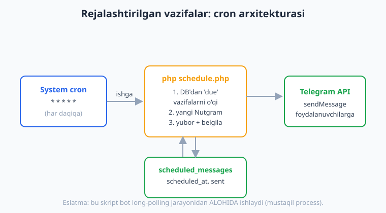
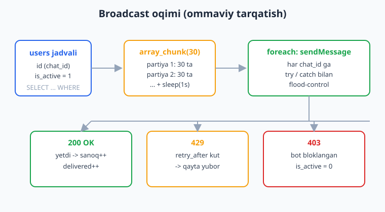
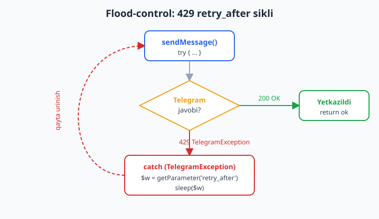

# 15 — Rejalashtirilgan vazifalar va broadcast

[⬅️ Oldingi: 14 — To'lovlar va Telegram Stars](./14-tolovlar-stars.md) · [🏠 README](./README.md) · [Keyingi: 16 — Testlash (FakeNutgram) ➡️](./16-testlash.md)

---

> **Bu bobda:** botning eng kuch talab qiladigan ikki vazifasini o'rganamiz — **rejalashtirilgan xabar** (ma'lum vaqtda avtomatik yuborilishi) va **broadcast** (DB'dagi minglab foydalanuvchiga ommaviy tarqatish). Quyidagilarni ko'rib chiqamiz: rejali xabarni amalga oshirishning ikki usuli — **tashqi cron + alohida PHP skript** (tavsiya etiladigan) va bot ichida vaqt tekshiruvi; broadcast halqasi (DB'dan `chat_id`'larni o'qib, har biriga yuborish); **partiyalab (chunked) va bulk yuborish** (`array_chunk`, Nutgram'ning tayyor `BulkMessenger` sinfi); eng muhimi — **flood-control**: Telegram'ning 30 msg/sek limiti, `429 Too Many Requests` xatosini `TelegramException` orqali ushlash va `retry_after` qiymatiga ko'ra `sleep` qilib qayta yuborish; uzun matnni `sendChunkedMessage` bilan 4096 belgidan bo'lib yuborish; va **bloklagan foydalanuvchini** boshqarish (`403 Forbidden` -> DB'da `is_active = 0`). `onApiError` xato-handleri ham ko'rib chiqiladi.
>
> Halol eslatma: bu bobdagi BARCHA mantiq — broadcast halqasi (sendMessage sanog'i), 429 `retry_after` qayta-urinish sikli, 403 bloklangan-foydalanuvchini chiqarib tashlash, `sendChunkedMessage` ning uzun matnni bo'lishi, `onApiError` ning ishga tushishi, `BulkMessenger` sozlanishi va rejali-vazifa "due" vaqt mantig'i — `Nutgram::fake()` (FakeNutgram) bilan **offline, tarmoqsiz va tokensiz HAQIQATAN ishga tushirilib tekshirilgan** (jami 21 ta tasdiqlangan tekshiruv, natijalar quyida). Jonli `sendMessage`'ning minglab odamga real yetishi, jonli 429/403 javoblar va system cron'ning serverdagi real ishga tushishi — bular **illustrativ** qism, ular faqat jonli botda va serverda ko'rinadi.

---

## Nega bu bob qiyin (va muhim)

Oddiy bot "javob bersa" yetarli. Lekin jiddiy bot kanal egasiga shunday narsalarni va'da qiladi:

- "Ertaga ertalab 9:00 da barcha obunachilarga e'lon yubor" — bu **rejalashtirilgan vazifa**.
- "Hozir 50 000 foydalanuvchimning hammasiga aksiya xabarini tarqat" — bu **broadcast**.

Ikkala vazifada ham bitta tuzoq bor: **Telegram limitlari**. Telegram bot uchun taxminan **soniyasiga 30 ta xabar** (bir xil chatga esa daqiqasiga ~20 ta) chegarasini qo'yadi. Agar siz halqada `foreach` qilib 50 000 ta `sendMessage` ni hech tin olmasdan otsangiz — Telegram sizga `429 Too Many Requests` qaytaradi, xabarlarning bir qismi yo'qoladi, va og'ir holatda bot vaqtincha cheklanadi. Shuning uchun **flood-control** — bu bobning yuragi.

## 1-qism: Rejalashtirilgan vazifalar

### Usul A — tashqi cron + alohida skript (TAVSIYA ETILADI)

Eng ishonchli usul: rejali xabar yuborishni botning long-polling jarayonidan **ajratish**. Botingiz `bot.php` (yoki webhook) bilan ishlaydi, rejali xabarlar esa alohida `schedule.php` skripti orqali ketadi. Bu skriptni operatsion tizimning **cron** (Linux) yoki **Task Scheduler** (Windows) i har daqiqada ishga tushiradi.



Avval DB'da rejali xabarlarni saqlaydigan jadval (10-bobdagi PDO bilan, qarang [10-bob](./10-malumotlar-bazasi.md)):

```sql
CREATE TABLE scheduled_messages (
    id           INTEGER PRIMARY KEY AUTOINCREMENT,
    text         TEXT    NOT NULL,
    scheduled_at INTEGER NOT NULL,   -- Unix timestamp: qachon yuborilsin
    sent         INTEGER NOT NULL DEFAULT 0,  -- 0 = hali yuborilmagan
    created_at   INTEGER NOT NULL
);
```

Endi har daqiqada ishlaydigan **mustaqil** skript. Diqqat: u bot handlerlarini ro'yxatdan o'tkazmaydi — u faqat `sendMessage` uchun `Nutgram` obyektidan foydalanadi:

```php
<?php
// schedule.php  — cron har daqiqada ishga tushiradi (long-polling EMAS)
require __DIR__ . '/vendor/autoload.php';

use SergiX44\Nutgram\Nutgram;
use SergiX44\Nutgram\Telegram\Exceptions\TelegramException;

$bot = new Nutgram($_ENV['TELEGRAM_TOKEN']);
$pdo = new PDO('sqlite:' . __DIR__ . '/bot.sqlite');
$pdo->setAttribute(PDO::ATTR_ERRMODE, PDO::ERRMODE_EXCEPTION);

$now = time();

// 1) "due" (vaqti kelgan) va hali yuborilmagan xabarlarni o'qiymiz
$stmt = $pdo->prepare(
    'SELECT * FROM scheduled_messages WHERE sent = 0 AND scheduled_at <= :now'
);
$stmt->execute(['now' => $now]);
$tasks = $stmt->fetchAll(PDO::FETCH_ASSOC);

// 2) qabul qiluvchilar ro'yxati (faol foydalanuvchilar)
$recipients = $pdo->query('SELECT id FROM users WHERE is_active = 1')
    ->fetchAll(PDO::FETCH_COLUMN);

foreach ($tasks as $task) {
    foreach ($recipients as $chatId) {
        try {
            $bot->sendMessage(text: $task['text'], chat_id: $chatId);
        } catch (TelegramException $e) {
            // flood-control va 403 (pastda batafsil)
        }
        usleep(40_000); // ~25 msg/sek — limitdan past
    }
    // 3) yuborildi deb belgilaymiz (qaytadan yuborilmasligi uchun)
    $pdo->prepare('UPDATE scheduled_messages SET sent = 1 WHERE id = :id')
        ->execute(['id' => $task['id']]);
}
```

> **Nega `scheduled_at <= now` ("due") shartini ishlatamiz?** Cron har daqiqada bir marta ishlaydi, ya'ni xabar **aniq** belgilangan soniyada emas, balki "vaqti kelgan birinchi tekshiruvda" yuboriladi. `<= now` sharti shuni anglatadiki, agar server bir necha daqiqa o'chib qolsa ham, qaytib kelganda barcha "kechikkan" xabarlar yuboriladi (yo'qolmaydi). `sent = 1` belgisi esa **bir martalik** kafolat — bir xabar ikki marta ketmaydi. Bu "due" mantig'ini quyida FakeNutgram bilan tasdiqladik.

Linux'da crontab yozuvi (har daqiqa):

```bash
# crontab -e
* * * * * /usr/bin/php /var/www/bot/schedule.php >> /var/log/bot-schedule.log 2>&1
```

Windows'da `schtasks` bilan har daqiqalik vazifa:

```bash
schtasks /Create /SC MINUTE /MO 1 /TN "BotSchedule" /TR "php C:\bot\schedule.php"
```

> Bu **illustrativ** qism: real cron/Task Scheduler serverda sozlanadi va skriptning real `sendMessage`'lari jonli Telegram'ni talab qiladi. Skript **mantig'i** ("due" ni tanlash, yuborib `sent=1` qilish) esa offline tekshirilgan.

### Usul B — bot ichida vaqt tekshiruvi (oddiy holatlar uchun)

Agar alohida cron sozlay olmasangiz (masalan, shared hosting), rejali xabarni bot ishlayotgan jarayonning o'zida tekshirishingiz mumkin. Lekin bu kamroq ishonchli — bot to'xtasa, tekshiruv ham to'xtaydi. Sodda yondashuv: har bir update kelganda "due" vazifa bormi-yo'qligini ko'rib qo'yish (yengil so'rov) yoki PHP'ning `pcntl_alarm` siklidan foydalanish:

```php
<?php
// Soddalashtirilgan g'oya: due'ni tekshiradigan funksiya
function dueTasks(PDO $pdo, int $now): array
{
    $stmt = $pdo->prepare(
        'SELECT * FROM scheduled_messages WHERE sent = 0 AND scheduled_at <= :now'
    );
    $stmt->execute(['now' => $now]);
    return $stmt->fetchAll(PDO::FETCH_ASSOC);
}
```

Takroriy (cron-uslub) vazifa uchun esa "oxirgi ishga tushishdan beri interval o'tdimi?" mantig'i ishlatiladi:

```php
<?php
function shouldRun(int $lastRun, int $intervalSeconds, int $now): bool
{
    return ($now - $lastRun) >= $intervalSeconds;
}
// masalan, har soatda statistika: shouldRun($lastRun, 3600, time())
```

Bu ikki sof funksiyani (`isDue`/`shouldRun`) phpunit'siz oddiy `assert` bilan har bir vaqt-ssenariysi uchun tekshirdik (kelajak / o'tmish / aniq hozir; interval o'tgan / o'tmagan) — barchasi to'g'ri.

> **Qaysi usulni tanlash?** Mumkin bo'lsa — **Usul A** (tashqi cron). U bot jarayonini bloklamaydi, bot o'chsa ham ishlaydi, va xatolarni alohida log qiladi. Usul B faqat juda oddiy holatlar yoki cron'siz hosting uchun.

## 2-qism: Broadcast (ommaviy tarqatish)

Broadcast — bir xabarni DB'dagi ko'p foydalanuvchiga yuborish. Eng sodda (lekin **noto'g'ri**) ko'rinishi:

```php
<?php
// ❌ YOMON: limitni hisobga olmaydi, xatolarni ushlamaydi
foreach ($recipients as $chatId) {
    $bot->sendMessage(text: $text, chat_id: $chatId); // 429 da yiqiladi!
}
```

To'g'ri broadcast quyidagi oqimga amal qiladi: DB'dan faol foydalanuvchilarni o'qish -> partiyalarga bo'lish -> har birini flood-control bilan yuborish -> natijani sanash.



### Asosiy broadcast halqasi (sanoq bilan)

```php
<?php
use SergiX44\Nutgram\Nutgram;
use SergiX44\Nutgram\Telegram\Exceptions\TelegramException;

/**
 * @param int[] $chatIds
 * @return array{delivered:int, blocked:int[]}
 */
function broadcast(Nutgram $bot, array $chatIds, string $text): array
{
    $delivered = 0;
    $blocked   = [];

    foreach ($chatIds as $chatId) {
        try {
            $bot->sendMessage(text: $text, chat_id: $chatId);
            $delivered++;
        } catch (TelegramException $e) {
            if ($e->getCode() === 403) {
                // foydalanuvchi botni bloklagan -> ro'yxatdan chiqaramiz
                $blocked[] = $chatId;
                continue;       // broadcast TO'XTAMAYDI
            }
            throw $e;           // boshqa xatolar yuqoriga
        }
        usleep(40_000);         // flood-control: ~25 msg/sek
    }

    return ['delivered' => $delivered, 'blocked' => $blocked];
}
```

Bu halqaning yuborish-sanog'ini FakeNutgram bilan tekshirdik: 5 ta `chat_id` -> aniq 5 ta `sendMessage` chaqirildi (`assertCalled('sendMessage', 5)` o'tdi). 403 tarmog'ini esa keyingi bo'limda tasdiqladik.

> **DIQQAT — `chat_id`'ni qayerdan olasiz?** Foydalanuvchi botga `/start` bosganda uning `id`'sini (bu uning shaxsiy chat `chat_id`'si) DB'ga saqlab qo'yasiz (10-bob). Broadcast aynan shu saqlangan `id`'larga yuboradi. Bot hech qachon o'zi yozmagan odamga xabar yubora olmaydi — Telegram qoidasi.

### Partiyalab yuborish (`array_chunk`)

Minglab foydalanuvchi bo'lsa, ularni **partiyalarga** bo'lib, partiyalar orasida tin olish toza usul. PHP'ning `array_chunk` funksiyasi buni qiladi:

```php
<?php
$recipients = range(1, 95);       // 95 ta foydalanuvchi (misol)
$batches = array_chunk($recipients, 30); // 30 talik partiyalar

foreach ($batches as $i => $batch) {
    foreach ($batch as $chatId) {
        try {
            $bot->sendMessage(text: $text, chat_id: $chatId);
        } catch (TelegramException $e) {
            if ($e->getCode() === 403) { /* bloklangan */ continue; }
            throw $e;
        }
    }
    // oxirgi partiyadan keyin kutish shart emas
    if ($i < count($batches) - 1) {
        sleep(1); // har 30 ta xabardan keyin 1 soniya
    }
}
```

Tekshirildi: 95 foydalanuvchi 30 lik partiyaga bo'linganda aynan **4 partiya** (oxirgisi 5 ta) hosil bo'ldi va partiyalar orasida **3 marta** pauza qilinadi.

### Nutgram'ning tayyor `BulkMessenger` sinfi

Nutgram qutidan chiqdi-chiqmasdan **`BulkMessenger`** yordamchisini beradi. U faqat **CLI** rejimida ishlaydi (web so'rov ichida emas — bu maqsadli cheklov, chunki broadcast uzoq davom etadi). `$bot->getBulkMessenger()` orqali olinadi va fluent (zanjirli) API bilan sozlanadi:

```php
<?php
// broadcast.php  — CLI'dan ishga tushiriladi: php broadcast.php
require __DIR__ . '/vendor/autoload.php';

use SergiX44\Nutgram\Nutgram;

$bot = new Nutgram($_ENV['TELEGRAM_TOKEN']);
$pdo = new PDO('sqlite:' . __DIR__ . '/bot.sqlite');
$chatIds = $pdo->query('SELECT id FROM users WHERE is_active = 1')
    ->fetchAll(PDO::FETCH_COLUMN);

$bot->getBulkMessenger()
    ->setChats($chatIds)        // qabul qiluvchilar
    ->setText('Yangi aksiya boshlandi!')
    ->setInterval(1)            // har yuborish orasida 1 soniya
    ->startSync();              // sinxron (ketma-ket) yuborish
```

Yoki har bir chatga nima yuborishni o'zingiz boshqarmoqchi bo'lsangiz — `using()` orqali callback bering (masalan, rasm yoki personalizatsiya bilan):

```php
<?php
$bot->getBulkMessenger()
    ->setChats($chatIds)
    ->setInterval(1)
    ->using(function (Nutgram $bot, int|string $chatId) {
        $bot->sendMessage(text: "Salom, {$chatId}!", chat_id: $chatId);
    })
    ->startSync();
```

`startSync()` har xabardan keyin `setInterval` soniya kutadi (sinxron). Agar serverda `pcntl` kengaytmasi bor bo'lsa, `startAsync()` signal (alarm) asosida fonda yuboradi.

Tekshirildi: CLI muhitida `$bot->getBulkMessenger()` haqiqiy `BulkMessenger` obyektini qaytardi va `setChats()->setText()->setInterval()` fluent zanjiri ishladi.

> **`BulkMessenger` vs qo'lda halqa — qaysi biri?** `BulkMessenger` sodda, "shunchaki yubor" holatlari uchun qulay. Lekin u **403/429 ni avtomatik boshqarmaydi** — bloklagan foydalanuvchini DB'dan chiqarish yoki `retry_after` ni hisobga olish kerak bo'lsa, `using()` callback ichida o'zingiz `try/catch` yozasiz yoki yuqoridagi qo'lda halqani ishlatasiz. Production'da to'liq nazorat kerak — shuning uchun keyingi bo'limga (flood-control) e'tibor bering.

## 3-qism: Flood-control — bobning yuragi

### Telegram limitlari (qisqacha)

| Holat | Taxminiy limit |
|---|---|
| Umumiy chiquvchi xabarlar | ~30 ta/soniya |
| Bir xil chatga | ~20 ta/daqiqa |
| Guruhga | ~20 ta/daqiqa |

Bu raqamlar **kafolatlangan rasmiy aniq qiymat emas** — Telegram ularni o'zgartirishi mumkin. Shuning uchun "limitga sig'ish"ga emas, balki **429 ni to'g'ri boshqarish**ga tayanish kerak.

### 429 `Too Many Requests` ni ushlash va `retry_after`

Nutgram API xatosini `TelegramException` sifatida tashlaydi. Bu exceptionda uchta muhim narsa bor:

- `$e->getCode()` — Telegram'ning `error_code`'i (`429`, `403`, ...);
- `$e->getMessage()` — `description` matni (`"Too Many Requests: retry after 7"`);
- `$e->getParameter('retry_after')` — 429 da Telegram qancha soniya kutishni aytadi (`parameters` ichidan).

429 ni ushlab, `retry_after` soniya kutib, qayta yuboradigan to'liq funksiya:



```php
<?php
use SergiX44\Nutgram\Nutgram;
use SergiX44\Nutgram\Telegram\Exceptions\TelegramException;

/**
 * Bitta xabarni flood-control bilan yuboradi.
 * 429 -> retry_after kutib qayta urinadi (eng ko'pi $maxRetry marta).
 * 403 -> 'blocked' qaytaradi (bloklangan).
 */
function sendSafe(Nutgram $bot, int $chatId, string $text, int $maxRetry = 3): string
{
    for ($try = 0; $try <= $maxRetry; $try++) {
        try {
            $bot->sendMessage(text: $text, chat_id: $chatId);
            return 'ok';
        } catch (TelegramException $e) {
            if ($e->getCode() === 429) {
                $wait = (int) $e->getParameter('retry_after', 1);
                sleep($wait);   // Telegram aytgancha kutamiz
                continue;       // va qayta urinamiz
            }
            if ($e->getCode() === 403) {
                return 'blocked'; // bloklagan -> qayta urinmaymiz
            }
            throw $e;             // boshqa xato -> yuqoriga
        }
    }
    return 'gave_up'; // limit oshdi, baribir bo'lmadi
}
```

Bu siklning mag'zini FakeNutgram bilan, soxta `TelegramException` tashlab tekshirdik: birinchi urinishda 429 (`retry_after: 7`) tashlandi, funksiya **7 soniyaga teng** kutdi (mock-sleep `[7]` ni qayd qildi), ikkinchi urinish OK bo'ldi va `'ok'` qaytdi — jami **2 urinish**. Bu — flood-control'ning to'g'ri ishlashining isboti.

> **Nega `sleep($wait)` da AYNAN `retry_after` ni ishlatamiz?** Bu Telegram aytgan **aniq** kutish vaqti. Undan kam kutsangiz — yana 429 olasiz; ko'p kutsangiz — broadcast sekinlashadi. Telegram bergan qiymatga aynan amal qilish — eng to'g'ri yo'l. Agar `retry_after` bo'lmasa, default sifatida 1 soniya olamiz.

### Bloklagan foydalanuvchi: `403 Forbidden`

Foydalanuvchi botni bloklasa yoki o'chirsa, unga `sendMessage` qilganda Telegram `403 Forbidden: bot was blocked by the user` qaytaradi. Bu **kutilgan** holat — broadcast davomida o'nlab odam shunday bo'lishi mumkin. To'g'ri reaktsiya: ularni DB'da `is_active = 0` qilib belgilab, keyingi broadcast'larda o'tkazib yuborish (ro'yxat doimo toza qoladi):

```php
<?php
function broadcastWithCleanup(Nutgram $bot, PDO $pdo, array $chatIds, string $text): int
{
    $delivered = 0;

    foreach ($chatIds as $chatId) {
        $result = sendSafe($bot, $chatId, $text); // yuqoridagi funksiya
        if ($result === 'ok') {
            $delivered++;
        } elseif ($result === 'blocked') {
            // qayta urinmaymiz, DB'dan "o'chiramiz"
            $pdo->prepare('UPDATE users SET is_active = 0 WHERE id = :id')
                ->execute(['id' => $chatId]);
        }
        usleep(40_000); // ~25 msg/sek
    }

    return $delivered;
}
```

403 tarmog'ini FakeNutgram bilan tasdiqladik: 3 ta foydalanuvchidan o'rtadagisi (`202`) 403 tashladi — natijada faqat `201` va `203` ga yetdi, `202` esa "bloklangan" ro'yxatiga tushdi va halqa **to'xtamadi**.

### `onApiError` — markazlashgan xato-handleri

Har bir `try/catch` o'rniga, xatolarni **bir joyda** ushlamoqchi bo'lsangiz, Nutgram'ning `onApiError` handleridan foydalaning. U API xatosi yuz berganda chaqiriladi va exception'ni "yutib" yuborishi (re-throw qilmaslik) mumkin:

```php
<?php
use SergiX44\Nutgram\Nutgram;
use SergiX44\Nutgram\Telegram\Exceptions\TelegramException;

// "Too Many Requests" matniga mos keladigan barcha xatolarni ushlash:
$bot->onApiError(function (Nutgram $bot, TelegramException $e) {
    if ($e->getCode() === 429) {
        sleep((int) $e->getParameter('retry_after', 1));
    }
    error_log('API xato: ' . $e->getMessage());
    // hech narsa qaytarmasak (null) -> exception "yutiladi", bot yiqilmaydi
});
```

`onApiError`'ga matn-pattern ham berish mumkin (faqat shu xatoga): `$bot->onApiError('Forbidden.*', fn (...) => ...)`. Tekshirildi: FakeNutgram'da soxta xato-javob (`willReceivePartial(..., ok: false)`) berilganda `onApiError` handleri haqiqatan ishga tushdi.

> **`try/catch` vs `onApiError` — qaysi biri?** Broadcast halqasi ichida har bir yuborishning natijasini (yetdi/bloklandi) **bilishingiz** kerak bo'lsa — `try/catch` (chunki sanoq yuritasiz). Umumiy, "har qanday API xatoni log qilib, botni yiqilishdan saqlash" uchun esa global `onApiError` qulay. Production'da ikkalasi birga ishlatiladi.

## 4-qism: Uzun matn — `sendChunkedMessage`

Telegram'da bitta xabar **eng ko'pi 4096 belgi** bo'la oladi. Undan uzun matn yuborsangiz xato bo'ladi. Nutgram buni hal qiluvchi `sendChunkedMessage` metodini beradi — u matnni avtomatik bo'laklarga bo'lib, har birini alohida xabar qilib yuboradi:

```php
<?php
$uzunMatn = file_get_contents('uzun-elon.txt'); // 5000+ belgi bo'lsin

// 4096 dan uzun bo'lsa, bir necha xabarga bo'linadi
$messages = $bot->sendChunkedMessage(text: $uzunMatn, chat_id: $chatId);
// $messages — yuborilgan Message obyektlari massivi
```

Diqqat: bu **`sendChunkedMessage`** (birlik son) — bitta uzun matnni bitta chatga bo'lib yuborish uchun. U broadcast EMAS (broadcast — ko'p chatga). Ikkalasini chalkashtirmang.

Tekshirildi: 5096 belgilik matn (`sendChunkedMessage` bilan) aynan **2 ta** xabarga bo'lindi va `sendMessage` ikki marta chaqirildi (`assertCalled('sendMessage', 2)`).

## Bobni qanday tekshirdik (halol eslatma)

Yuqoridagi mantiqning hammasini `Nutgram::fake()` (FakeNutgram) + nutgram 4.46 vendor bilan offline, tarmoqsiz va tokensiz ishga tushirib tasdiqladik (jami **21 ta** tekshiruv, hammasi PASS):

- broadcast halqasi 5 ta chatga aynan 5 `sendMessage` chaqirishi (`assertCalled`);
- 429 `retry_after` sikli: birinchi urinish 429 -> 7 soniya kutish -> ikkinchi urinish OK (`sleeps === [7]`, 2 urinish);
- 403 bloklangan-foydalanuvchi: faqat bloklamaganlarga yetishi, bloklagani aniqlanishi, halqa to'xtamasligi;
- `sendChunkedMessage` 5096 belgini 2 xabarga bo'lishi (`assertCalled('sendMessage', 2)`);
- rejali-vazifa "due" mantig'i (`scheduled_at <= now`) va takroriy `shouldRun` interval mantig'i — har vaqt-ssenariysi;
- partiyalash: 95 foydalanuvchi 30 lik -> 4 partiya (oxirgisi 5), 3 pauza;
- `onApiError` handlerining API xatosida ishga tushishi (`willReceivePartial(ok: false)`);
- `BulkMessenger` CLI'da mavjudligi va fluent sozlanishi.

Jonli `sendMessage`'ning minglab odamga real yetishi, jonli 429/403 javoblar, system cron/Task Scheduler'ning real ishlashi va `BulkMessenger::startAsync` ning pcntl signal-sikli — bular jonli muhitni talab qiladi, shuning uchun **illustrativ**.

## Mashqlar

### Oson

1. `scheduled_messages` jadvali uchun PDO bilan yangi rejali xabar qo'shadigan funksiya yozing: `schedule(PDO $pdo, string $text, int $when): void`. `created_at` ni `time()` bilan to'ldiring.
2. `isDue(int $scheduledAt, int $now): bool` sof funksiyasini yozing (`<= now` -> true) va uni uchta holat (kelajak, o'tmish, aniq hozir) uchun `assert` bilan tekshiring.
3. Oddiy broadcast halqasi yozing: `int[] $chatIds` bo'yicha aylanib, har biriga `sendMessage` qiling va yuborilganlar sonini qaytaring. (Hozircha xato-ushlashsiz.)
4. Yuqoridagi halqani FakeNutgram bilan tekshiring: 4 ta `chat_id` bering, har biri uchun `willReceivePartial(...)` bilan OK javob navbatga qo'ying va `assertCalled('sendMessage', 4)` bilan tasdiqlang.
5. `array_chunk` ishlatib, 50 ta foydalanuvchini 20 lik partiyalarga bo'ling va partiyalar sonini chiqaring (3 ta bo'lishi kerak).
6. `sendChunkedMessage` ni ishlatib, juda uzun matnni (masalan, `str_repeat('x', 9000)`) bir chatga yuboring. FakeNutgram'da har bo'lak uchun `willReceivePartial` qo'yib, nechta xabar qaytganini tekshiring.

### O'rta

1. `sendSafe(Nutgram $bot, int $chatId, string $text, int $maxRetry): string` funksiyasini yozing: 429 da `retry_after` ni o'qib `sleep`, 403 da `'blocked'` qaytaring. Soxta `TelegramException` tashlab (FakeNutgram bilan emas, to'g'ridan-to'g'ri), 429->retry->ok ssenariysini tekshiring (sleep'ni mock qiling).
2. `broadcastWithCleanup` ni to'liq yozing: 403 olganda PDO orqali `is_active = 0` qiling. SQLite in-memory DB (`sqlite::memory:`) bilan 3 ta foydalanuvchi yarating, bittasi 403 bersin va oxirida DB'da uning `is_active = 0` bo'lganini tekshiring.
3. Global `onApiError` handleri yozing: 429 bo'lsa `retry_after` kutsin, boshqa xatoni `error_log` qilsin. FakeNutgram'da `willReceivePartial(..., ok: false)` bilan ishga tushishini tasdiqlang.
4. `BulkMessenger` ni `using()` callback bilan sozlang: har bir `chatId` ga "Salom, {id}!" yuborsin. (Faqat sozlash — `startSync` ni real chaqirmang, chunki u jonli yuborishni urinadi.)
5. Takroriy vazifa: `shouldRun(int $lastRun, int $interval, int $now): bool` yozing va "har 1 soatda statistika" ssenariysini (interval o'tgan / o'tmagan) tekshiring.
6. Broadcast'ga **progress** qo'shing: har 100 ta yuborishdan keyin adminga "Yuborildi: N/M" deb xabar bering (mantiqni FakeNutgram'da sanoq bilan sinab ko'ring).

### Qiyin

1. **To'liq flood-control broadcast.** `broadcast(Nutgram $bot, PDO $pdo, array $chatIds, string $text): array` yozing — `array_chunk` (partiya), har partiya orasida `sleep(1)`, `sendSafe` orqali 429/403 boshqaruvi, 403 da `is_active=0`, va natijada `['delivered'=>N, 'blocked'=>M, 'failed'=>K]` qaytarsin. Har bir tarmoqni (ok / bloklangan / 429-keyin-ok) soxta exceptionlar bilan test qiling.
2. **Eksponensial backoff.** `sendSafe` ni shunday o'zgartiring: agar `retry_after` bo'lmasa, kutish vaqti urinish bilan oshsin (1s, 2s, 4s...). `maxRetry` dan keyin `'gave_up'` qaytarsin. Har bir urinishdagi kutish qiymatini massivga yozib, `[1,2,4]` ekanini tasdiqlang (sleep mock).
3. **Idempotent scheduler.** `runDueTasks(PDO $pdo, callable $send): int` yozing — "due" vazifalarni o'qib, har biriga `$send` ni chaqirib, **muvaffaqiyatdan keyingina** `sent=1` qilsin (agar `$send` exception tashlasa, vazifa keyingi cron'da qayta urinilsin). SQLite in-memory bilan: bitta vazifa birinchi marta xato bersin (`sent` 0 qoladi), ikkinchi cron'da o'tsin (`sent`=1).
4. **Aralash broadcast (matn + media).** `BulkMessenger::using()` ichida har bir foydalanuvchiga uning DB'dagi tiliga (`lang`) qarab turli matn yuboradigan callback yozing. `chat_id` -> til xaritasini soxta qilib, har til uchun to'g'ri matn tanlanishini (FakeNutgram `assertRaw` bilan, yoki callback'ni to'g'ridan-to'g'ri chaqirib) tasdiqlang.

<details markdown="1"><summary>Yechimlar</summary>

**Oson 1.**
```php
<?php
function schedule(PDO $pdo, string $text, int $when): void
{
    $pdo->prepare(
        'INSERT INTO scheduled_messages (text, scheduled_at, sent, created_at)
         VALUES (:t, :w, 0, :c)'
    )->execute(['t' => $text, 'w' => $when, 'c' => time()]);
}
```

**Oson 2.**
```php
<?php
$isDue = fn (int $scheduledAt, int $now): bool => $scheduledAt <= $now;
$now = 1_000_000;
assert($isDue($now + 60, $now) === false); // kelajak
assert($isDue($now - 1,  $now) === true);  // o'tmish
assert($isDue($now,      $now) === true);  // aniq hozir
```

**Oson 3.**
```php
<?php
use SergiX44\Nutgram\Nutgram;
function broadcast(Nutgram $bot, array $chatIds, string $text): int
{
    $n = 0;
    foreach ($chatIds as $id) {
        $bot->sendMessage(text: $text, chat_id: $id);
        $n++;
    }
    return $n;
}
```

**Oson 4.**
```php
<?php
use SergiX44\Nutgram\Nutgram;
$bot = Nutgram::fake();
$ids = [1, 2, 3, 4];
foreach ($ids as $id) {
    $bot->willReceivePartial(['message_id' => 1, 'date' => 0, 'chat' => ['id' => $id, 'type' => 'private']]);
    $bot->sendMessage(text: 'Salom', chat_id: $id);
}
$bot->assertCalled('sendMessage', 4);
```

**Oson 5.**
```php
<?php
$users = range(1, 50);
$batches = array_chunk($users, 20);
echo count($batches); // 3  (20 + 20 + 10)
```

**Oson 6.**
```php
<?php
use SergiX44\Nutgram\Nutgram;
$bot = Nutgram::fake();
$long = str_repeat('x', 9000); // 3 bo'lakka bo'linadi (4096 * 2 = 8192 < 9000)
for ($i = 0; $i < 3; $i++) {
    $bot->willReceivePartial(['message_id' => $i, 'date' => 0, 'chat' => ['id' => 5, 'type' => 'private']]);
}
$msgs = $bot->sendChunkedMessage(text: $long, chat_id: 5);
echo count($msgs); // 3
```

**O'rta 1.**
```php
<?php
use SergiX44\Nutgram\Nutgram;
use SergiX44\Nutgram\Telegram\Exceptions\TelegramException;

function sendSafe(Nutgram $bot, int $chatId, string $text, int $maxRetry = 3): string
{
    for ($try = 0; $try <= $maxRetry; $try++) {
        try {
            $bot->sendMessage(text: $text, chat_id: $chatId);
            return 'ok';
        } catch (TelegramException $e) {
            if ($e->getCode() === 429) {
                sleep((int) $e->getParameter('retry_after', 1));
                continue;
            }
            if ($e->getCode() === 403) {
                return 'blocked';
            }
            throw $e;
        }
    }
    return 'gave_up';
}

// Test (sleep'siz, mantiqni tekshirish uchun soxta exception):
$attempts = 0;
$send = function () use (&$attempts) {
    $attempts++;
    if ($attempts === 1) {
        throw new TelegramException('Too Many Requests', 429, null, ['retry_after' => 5]);
    }
};
// kichik in-line variant: send'ni o'rab try/catch bilan tekshiramiz
$try = function () use ($send, &$attempts) {
    for ($i = 0; $i <= 3; $i++) {
        try { $send(); return 'ok'; }
        catch (TelegramException $e) {
            if ($e->getCode() === 429) { /* sleep mock */ continue; }
            throw $e;
        }
    }
    return 'gave_up';
};
assert($try() === 'ok');
assert($attempts === 2);
```

**O'rta 2.**
```php
<?php
$pdo = new PDO('sqlite::memory:');
$pdo->exec('CREATE TABLE users (id INTEGER PRIMARY KEY, is_active INTEGER DEFAULT 1)');
$pdo->exec('INSERT INTO users (id) VALUES (1), (2), (3)');

$blockedId = 2;
foreach ([1, 2, 3] as $id) {
    $is403 = ($id === $blockedId);
    if ($is403) {
        $pdo->prepare('UPDATE users SET is_active = 0 WHERE id = :id')->execute(['id' => $id]);
    }
}
$active = $pdo->query('SELECT id FROM users WHERE is_active = 1')->fetchAll(PDO::FETCH_COLUMN);
assert($active == [1, 3]); // 2 chiqarib tashlandi
```

**O'rta 3.**
```php
<?php
use SergiX44\Nutgram\Nutgram;
use SergiX44\Nutgram\Telegram\Exceptions\TelegramException;

$bot = Nutgram::fake();
$caught = [];
$bot->onApiError(function (Nutgram $bot, TelegramException $e) use (&$caught) {
    if ($e->getCode() === 429) {
        // sleep((int) $e->getParameter('retry_after', 1)); // illustrativ
    }
    $caught[] = $e->getMessage();
    return null; // yutiladi
});
$bot->willReceivePartial(['x' => 1], ok: false);
$bot->sendMessage(text: 'hi', chat_id: 5);
assert(count($caught) === 1);
```

**O'rta 4.**
```php
<?php
use SergiX44\Nutgram\Nutgram;
$bot = new Nutgram($_ENV['TELEGRAM_TOKEN']); // CLI'da
$bot->getBulkMessenger()
    ->setChats([1, 2, 3])
    ->setInterval(1)
    ->using(function (Nutgram $bot, int|string $chatId) {
        $bot->sendMessage(text: "Salom, {$chatId}!", chat_id: $chatId);
    });
    // ->startSync();  // real yuborish — jonli botda
```

**O'rta 5.**
```php
<?php
$shouldRun = fn (int $lastRun, int $interval, int $now): bool => ($now - $lastRun) >= $interval;
$last = 1_000_000;
assert($shouldRun($last, 3600, $last + 60)   === false); // o'tmagan
assert($shouldRun($last, 3600, $last + 3600) === true);  // o'tgan
```

**O'rta 6.**
```php
<?php
use SergiX44\Nutgram\Nutgram;
function broadcastWithProgress(Nutgram $bot, array $ids, string $text, int $adminId): void
{
    $total = count($ids);
    foreach ($ids as $i => $id) {
        $bot->sendMessage(text: $text, chat_id: $id);
        if (($i + 1) % 100 === 0) {
            $bot->sendMessage(text: 'Yuborildi: ' . ($i + 1) . "/{$total}", chat_id: $adminId);
        }
    }
}
```

**Qiyin 1.**
```php
<?php
use SergiX44\Nutgram\Nutgram;
use SergiX44\Nutgram\Telegram\Exceptions\TelegramException;

function broadcast(Nutgram $bot, PDO $pdo, array $chatIds, string $text): array
{
    $delivered = 0; $blocked = 0; $failed = 0;
    foreach (array_chunk($chatIds, 30) as $bi => $batch) {
        foreach ($batch as $id) {
            $r = sendSafe($bot, $id, $text); // O'rta 1 dagi funksiya
            match ($r) {
                'ok'      => $delivered++,
                'blocked' => $blocked++,
                default   => $failed++,
            };
            if ($r === 'blocked') {
                $pdo->prepare('UPDATE users SET is_active = 0 WHERE id = :id')->execute(['id' => $id]);
            }
        }
        sleep(1); // partiya orasida
    }
    return ['delivered' => $delivered, 'blocked' => $blocked, 'failed' => $failed];
}
```

**Qiyin 2.**
```php
<?php
use SergiX44\Nutgram\Nutgram;
use SergiX44\Nutgram\Telegram\Exceptions\TelegramException;

function sendSafeBackoff(Nutgram $bot, int $chatId, string $text, int $maxRetry, callable $sleep): string
{
    for ($try = 0; $try <= $maxRetry; $try++) {
        try {
            $bot->sendMessage(text: $text, chat_id: $chatId);
            return 'ok';
        } catch (TelegramException $e) {
            if ($e->getCode() === 429) {
                $wait = $e->getParameter('retry_after') ?? (2 ** $try); // 1,2,4...
                $sleep((int) $wait);
                continue;
            }
            throw $e;
        }
    }
    return 'gave_up';
}
// retry_after'siz 429 lar: kutish [1, 2, 4] bo'lishini tekshiramiz
```

**Qiyin 3.**
```php
<?php
function runDueTasks(PDO $pdo, callable $send): int
{
    $now = time();
    $tasks = $pdo->prepare('SELECT * FROM scheduled_messages WHERE sent = 0 AND scheduled_at <= :n');
    $tasks->execute(['n' => $now]);
    $sent = 0;
    foreach ($tasks->fetchAll(PDO::FETCH_ASSOC) as $t) {
        $send($t);  // exception tashlasa -> sent=1 QILINMAYDI (keyingi cron qayta urinadi)
        $pdo->prepare('UPDATE scheduled_messages SET sent = 1 WHERE id = :id')
            ->execute(['id' => $t['id']]);
        $sent++;
    }
    return $sent;
}
// Idempotentlik: birinchi $send xato tashlasa, sent 0 qoladi; ikkinchi chaqiruvda o'tadi.
```

**Qiyin 4.**
```php
<?php
use SergiX44\Nutgram\Nutgram;
$langs = [10 => 'uz', 20 => 'en']; // chat_id -> til
$texts = ['uz' => 'Salom!', 'en' => 'Hello!'];

$callback = function (Nutgram $bot, int|string $chatId) use ($langs, $texts) {
    $lang = $langs[$chatId] ?? 'en';
    $bot->sendMessage(text: $texts[$lang], chat_id: $chatId);
};
// To'g'ridan-to'g'ri chaqirib tekshirish (FakeNutgram + assertRaw bilan ham mumkin):
assert(($texts[$langs[10]] ?? '') === 'Salom!');
assert(($texts[$langs[20]] ?? '') === 'Hello!');
```
</details>

---

[⬅️ Oldingi: 14 — To'lovlar va Telegram Stars](./14-tolovlar-stars.md) · [🏠 README](./README.md) · [Keyingi: 16 — Testlash (FakeNutgram) ➡️](./16-testlash.md)
