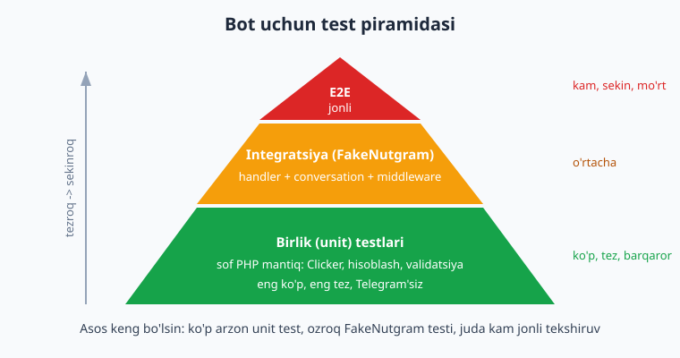
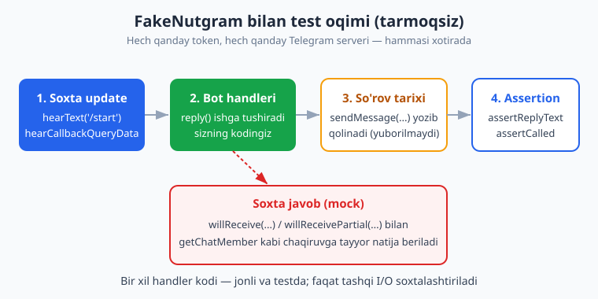
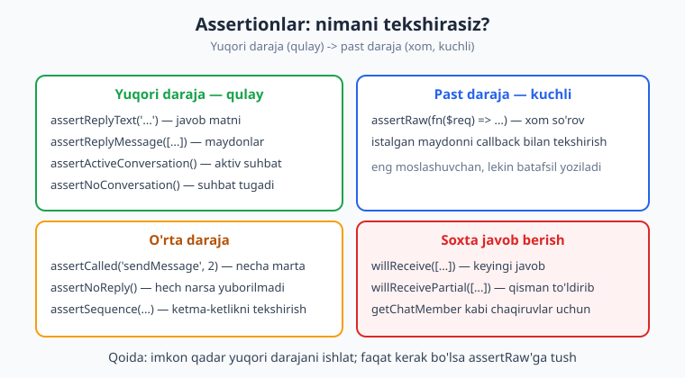

# 16 — Testlash (FakeNutgram)

[⬅️ Oldingi: 15 — Rejalashtirilgan vazifalar va broadcast](./15-rejalashtirilgan-broadcast.md) · [🏠 README](./README.md) · [Keyingi: 17 — Production va deploy ➡️](./17-production-deploy.md)

---

> **Bu bobda:** Botni qo'lda sinash — telefonni olib, `/start` bosib, javobni ko'rish — bir-ikki marta yaxshi, ammo bot o'sgan sayin chidab bo'lmas holga keladi. Bu bobda botni **avtomatik testlash**ni o'rganamiz. Nima uchun bot testlash kerakligidan boshlaymiz, so'ng Nutgram'ning eng kuchli vositasi — **`Nutgram::fake()`** (FakeNutgram) bilan tanishamiz. FakeNutgram hech qanday token va internet talab qilmaydi: u soxta update yaratadi, sizning handleringizni ishga tushiradi va `sendMessage` kabi chaqiruvlarni Telegram'ga yubormay, **xotirada yozib qoladi**. Update yuborishni (`hearText('/start')`, `hearCallbackQueryData(...)`, `hearMessage([...])`, `hearUpdate(Update)`) -> `reply()` orqali ishga tushirishni; assertionlarni (`assertReplyText`, `assertReplyMessage`, `assertRaw`, `assertCalled`, `assertNoReply`, `assertSequence`, `assertActiveConversation`/`assertNoConversation`); **conversation testi**ni (`willStartConversation()`); tashqi chaqiruvlarga **soxta javob** berishni (`willReceive`/`willReceivePartial`, hamda `FakeNutgram::instance` bilan tayyor response); **fixtures**ni; va PHPUnit/Pest'ni sozlashni (`composer`, `phpunit.xml`, `composer test`) ko'rib chiqamiz.
>
> **Halol eslatma:** Bu bobdagi BARCHA test kodi haqiqiy **PHPUnit 12.5** bilan, **Nutgram 4.46** va **PHP 8.4** muhitida, tokensiz va tarmoqsiz **HAQIQATAN ishga tushirilib tekshirilgan** — quyida `composer test` ning chinakam natijasi keltirilgan (13 ta test, 38 ta assertion, hammasi yashil). Faqat "jonli" qism — telefonda real xabar kelishi, real `getChatMember` Telegram serveridan javob qaytarishi — illustrativ; FakeNutgram aynan shu tashqi qismni soxtalashtiradi, qolgan hamma narsa sizning haqiqiy handler kodingiz.

---

## Nega botni testlash kerak?

Tasavvur qiling, botingizda 25 ta buyruq, uchta conversation va majburiy-obuna middleware bor. Siz `/help` matnini o'zgartirdingiz. Buni ishonch bilan deploy qilish uchun qo'lda nimani sinash kerak? `/help`ni, albatta. Lekin o'zgarish boshqa joyni buzmadimi? Conversation hali ishlayaptimi? Callback tugmalar-chi?

Qo'lda har safar hamma narsani bosib chiqish — soatlab vaqt va baribir biror narsa unutiladi. **Avtomatik test** — bu kodning o'zi yozadigan "qo'lda sinash": bir marta yozasiz, keyin har deploy oldidan bir soniyada minglab tekshiruv o'tadi.

Bot testlashning yana bir o'ziga xos qiyinligi bor: bot **tashqi dunyoga** (Telegram serveriga) bog'liq. Haqiqiy testda har safar real xabar yuborib bo'lmaydi — bu sekin, tokenni talab qiladi va Telegram'ni "spamlaydi". Yechim — **tashqi dunyoni soxtalashtirish (mock)**. Aynan shu ishni Nutgram'ning `FakeNutgram`'i bajaradi.

> **PHP eslatma:** Bu kitob PHP'ni bilasiz deb faraz qiladi ([../php/README.md](../php/README.md)). Agar Laravel ko'rgan bo'lsangiz ([../laravel/README.md](../laravel/README.md)), PHPUnit/Pest va "feature test" tushunchasi tanish bo'ladi — bu yerda xuddi shu g'oya botga moslangan.

### Test piramidasi

Hamma testlar bir xil emas. Yaxshi qoida — **test piramidasi**:



- **Birlik (unit) testlari** — eng ko'p va eng tez. Telegram'ga umuman bog'liq bo'lmagan sof PHP mantiqni sinaydi: hisoblash, validatsiya, clicker o'yini mantig'i. Bularga FakeNutgram ham kerak emas.
- **Integratsiya testlari** — handlerlar, conversation, middleware. Aynan shu yerda **FakeNutgram** ishlaydi.
- **E2E (end-to-end) / jonli** — eng kam. Bu real bot, real token, real Telegram. Buni avtomatlashtirish qiyin va mo'rt; odatda deploy oldidan qo'lda bir-ikki marta tekshiriladi.

Maslahat: asosiy kuchni piramidaning **pastki ikki qavatiga** sarflang — ular arzon, tez va barqaror.

## PHPUnit'ni o'rnatish va sozlash

Avval test kutubxonasini dev-bog'liqlik sifatida o'rnatamiz. Loyiha papkangizda:

```bash
composer require --dev phpunit/phpunit
```

Keyin loyiha ildizida `phpunit.xml` faylini yaratamiz:

```xml
<?xml version="1.0" encoding="UTF-8"?>
<phpunit xmlns:xsi="http://www.w3.org/2001/XMLSchema-instance"
         xsi:noNamespaceSchemaLocation="vendor/phpunit/phpunit/phpunit.xsd"
         bootstrap="vendor/autoload.php"
         colors="true"
         cacheDirectory=".phpunit.cache">
    <testsuites>
        <testsuite name="Bot tests">
            <directory>tests</directory>
        </testsuite>
    </testsuites>
    <source>
        <include>
            <directory>src</directory>
        </include>
    </source>
</phpunit>
```

Bu yerda: `bootstrap` — Composer autoload'ni yuklaydi (test sinflari avtomatik topiladi); `<testsuite>` — testlar `tests/` papkasida; `<source>` — qamrov (coverage) o'lchanganda qaysi kod hisobga olinishini bildiradi.

`composer.json`'ga qulay buyruq qo'shamiz, shunda har safar uzun yo'l yozmaymiz:

```json
{
    "autoload": {
        "psr-4": { "App\\": "src/" }
    },
    "autoload-dev": {
        "psr-4": { "Tests\\": "tests/" }
    },
    "scripts": {
        "test": "phpunit"
    }
}
```

Endi testlarni shunchaki `composer test` bilan ishga tushiramiz. (`composer dump-autoload` ni bir marta chaqirib, yangi namespace'larni ro'yxatga oling.)

> **Pest haqida:** Ko'p PHP dasturchilar PHPUnit ustiga qurilgan, soddaroq sintaksisli **Pest**ni yaxshi ko'radi (`composer require pestphp/pest --dev --with-all-dependencies`). FakeNutgram ikkalasida ham bir xil ishlaydi — pastdagi assertionlar o'zgarmaydi, faqat test "qobig'i" boshqacha. Bu bobda PHPUnit'da ishlaymiz (real run shu bilan qilingan); oxirida Pest variantini ham ko'rsatamiz.

## FakeNutgram nima?

`Nutgram::fake()` — bu `Nutgram` sinfining test uchun maxsus avlodi (`FakeNutgram`). U:

1. **Token talab qilmaydi** — ichida soxta token bor.
2. **Telegram'ga hech narsa yubormaydi** — `sendMessage`, `answerCallbackQuery` kabi chaqiruvlar tarmoqqa chiqmaydi, balki **so'rov tarixiga** (history) yoziladi.
3. **Soxta update "eshittiradi"** — `hearText(...)`, `hearCallbackQueryData(...)` bilan siz "go'yo foydalanuvchi shu xabarni yubordi" deysiz.
4. **Assertion beradi** — `assertReplyText(...)` bilan "bot aynan shu javobni yozdimi?" deb tekshirasiz.



Eng muhim g'oya: **handler kodingiz o'zgarmaydi**. Jonli botda ham, testda ham bir xil `$bot->sendMessage(...)` ishlaydi. Faqat tashqi I/O (tarmoq) soxtalashtiriladi. Demak test o'tsa, jonli bot ham xuddi shunday ishlaydi.

## Birinchi test: `/start` buyrug'i

Avval testdan mustaqil bo'lishi uchun handlerlarni bitta joyga — "factory" sinfiga — yig'amiz. Bu jonli botda ham, testda ham bir xil ro'yxatdan o'tishni ta'minlaydi:

```php
<?php
// src/BotFactory.php
namespace App;

use SergiX44\Nutgram\Nutgram;
use SergiX44\Nutgram\Telegram\Properties\ParseMode;
use SergiX44\Nutgram\Telegram\Types\Keyboard\InlineKeyboardButton;
use SergiX44\Nutgram\Telegram\Types\Keyboard\InlineKeyboardMarkup;

final class BotFactory
{
    public static function register(Nutgram $bot): Nutgram
    {
        $bot->onCommand('start', function (Nutgram $bot) {
            $bot->sendMessage('Salom! Botga xush kelibsiz.');
        });

        $bot->onCommand('help', function (Nutgram $bot) {
            $bot->sendMessage(
                "<b>Buyruqlar:</b>\n/start — boshlash\n/help — yordam",
                parse_mode: ParseMode::HTML,
            );
        });

        $bot->onCommand('menyu', function (Nutgram $bot) {
            $bot->sendMessage('Tanlang:', reply_markup: InlineKeyboardMarkup::make()
                ->addRow(
                    InlineKeyboardButton::make('Ha', callback_data: 'ovoz:ha'),
                    InlineKeyboardButton::make("Yo'q", callback_data: 'ovoz:yoq'),
                ));
        });

        $bot->onCallbackQueryData('ovoz:{javob}', function (Nutgram $bot, string $javob) {
            $bot->answerCallbackQuery(text: 'Qabul qilindi');
            $bot->sendMessage("Siz tanladingiz: {$javob}");
        });

        // Echo: boshqa har qanday matn
        $bot->onText('.*', function (Nutgram $bot) {
            $bot->sendMessage("Aks-sado: {$bot->message()->text}");
        });

        return $bot;
    }
}
```

Jonli botda `BotFactory::register(new Nutgram($token))->run();` yozasiz. Testda esa **xuddi shu** `register`'ga `Nutgram::fake()`'ni beramiz:

```php
<?php
// tests/BotHandlerTest.php
namespace Tests;

use App\BotFactory;
use PHPUnit\Framework\TestCase;
use SergiX44\Nutgram\Nutgram;

final class BotHandlerTest extends TestCase
{
    private function bot(): Nutgram
    {
        return BotFactory::register(Nutgram::fake());
    }

    public function test_start_buyrugi_salom_yuboradi(): void
    {
        $bot = $this->bot();

        $bot->hearText('/start')->reply();   // soxta update -> handler ishlaydi

        $bot->assertReplyText('Salom! Botga xush kelibsiz.');
    }
}
```

Uchta qadam: (1) soxta `/start` ni "eshittirdik", (2) `reply()` handlerni ishga tushirdi, (3) `assertReplyText` bot aynan shu matnni yuborganini tekshirdi. Diqqat: **`hearText('/start')`** — bu buyruqni yuborishning to'g'ri usuli. (Nutgram'da alohida `hearCommand` metodi yo'q; buyruq ham oddiy matnli xabar, shuning uchun `hearText('/start')` ishlatiladi.)

> **`reply()` nima qiladi?** U so'rov tarixini tozalaydi, so'ng `run()` ni bir marta ishga tushiradi — ya'ni eshittirilgan bitta update bo'yicha handlerlar bajariladi. Shundan keyin assertionlar shu yagona update natijasini tekshiradi.

## Assertionlar — javobni qanday tekshiramiz?

Nutgram bir nechta darajadagi assertion beradi. Yuqori darajalari qulay (matnni to'g'ridan-to'g'ri solishtiradi), past darajalari kuchli (xom so'rovga kirish beradi).



### `assertReplyText` va `assertReplyMessage`

`assertReplyText('...')` — eng ko'p ishlatiladigani: yuborilgan xabar **matni** kutilganga tengmi? `assertReplyMessage([...])` — xabarning bir nechta maydonini birdan tekshiradi (matn, `parse_mode`, klaviatura va h.k.):

```php
public function test_help_html_parse_mode_bilan_yuboriladi(): void
{
    $bot = $this->bot();

    $bot->hearText('/help')->reply();

    // Javobda parse_mode = HTML bo'lishi kerak
    $bot->assertReplyMessage(['parse_mode' => 'HTML']);
}
```

`assertReplyMessage` **qism-to'plam** (subset) tekshiradi: siz bergan maydonlar javobda bor-yo'qligini ko'radi, qolgan maydonlarga aralashmaydi. Shuning uchun faqat o'zingizga muhim maydonni yozsangiz bo'ladi.

### `assertRaw` — eng past, eng kuchli daraja

Agar tayyor assertionlar yetmasa, **xom so'rovni** (PSR-7 `Request`) callback bilan to'g'ridan-to'g'ri tekshirasiz:

```php
$bot->hearText('/help')->reply();

$bot->assertRaw(function ($request) {
    $body = json_decode((string) $request->getBody(), true);
    return str_contains($body['text'], '/start');   // matn ichida '/start' bormi?
});
```

Callback `true` qaytarsa — test o'tadi. Bu eng moslashuvchan usul, lekin batafsil; faqat kerak bo'lganda tushing.

### `assertCalled` va `assertNoReply`

`assertCalled('metod', necha_marta)` — biror API metodi necha marta chaqirilganini sanaydi. `assertNoReply()` — bot **umuman** hech narsa yubormaganini tekshiradi (masalan, notanish callback hech qaysi handlerga tushmasligi kerak):

```php
public function test_echo_boshqa_matnni_qaytaradi(): void
{
    $bot = $this->bot();

    $bot->hearText('salom dunyo')->reply();

    $bot->assertReplyText('Aks-sado: salom dunyo');
    $bot->assertCalled('sendMessage', 1);   // aynan bir marta yuborildi
}

public function test_notanish_callback_javob_bermaydi(): void
{
    $bot = Nutgram::fake();
    $bot->onCallbackQueryData('ovoz:{x}', fn (Nutgram $b, string $x) => $b->sendMessage($x));

    $bot->hearCallbackQueryData('boshqa:narsa')->reply();   // hech bir pattern'ga mos emas

    $bot->assertNoReply();
}
```

### `assertSequence` — ketma-ketlikni tekshirish

Ba'zan bitta update bir nechta chaqiruvga sabab bo'ladi. Masalan, tugma bosilganda bot avval `answerCallbackQuery` (Telegram'da "yuklanmoqda" aylanasini to'xtatadi), so'ng `sendMessage` qiladi. `assertSequence(...)` har bir chaqiruvni **tartibi bilan** tekshiradi:

```php
public function test_menyu_callback_query_oqimi(): void
{
    $bot = $this->bot();

    // 1) /menyu -> tugmali xabar
    $bot->hearText('/menyu')->reply();
    $bot->assertReplyText('Tanlang:');

    // 2) tugma bosildi -> answerCallbackQuery + sendMessage ketma-ketligi
    $bot->hearCallbackQueryData('ovoz:ha')->reply();

    $bot->assertSequence(
        fn (Nutgram $bot) => $bot->assertCalled('answerCallbackQuery'),
        fn (Nutgram $bot) => $bot->assertReplyText('Siz tanladingiz: ha'),
    );
}
```

`assertSequence` ichidagi har bir closure mos **indeks**dagi so'rovni tekshiradi: birinchi closure 0-so'rovni (`answerCallbackQuery`), ikkinchisi 1-so'rovni (`sendMessage`). `hearCallbackQueryData('ovoz:ha')` — callback tugma bosilishini soxtalashtiradi; `ovoz:ha` aynan tugmaga qo'ygan `callback_data`.

> **Indeks nozikligi:** `assertReplyText`/`assertReplyMessage` standart holatda **0-so'rovni** tekshiradi. Agar update bir nechta chaqiruvga sabab bo'lsa (masalan, avval `getChatMember`, keyin `sendMessage`), kerakli so'rovni `index:` argumenti bilan tanlang: `assertReplyText('...', index: 1)`. Buni quyida majburiy-obuna testida ko'ramiz.

## Conversation (suhbat) testi

[8-bobdagi](./08-conversations.md) conversation'larni ham FakeNutgram bilan to'liq sinash mumkin. Bitta nozik joy bor: conversation **bir necha update**ni qamraydi (savol -> javob -> keyingi savol). FakeNutgram standart holatda har `reply()` da yangi tasodifiy user/chat yaratadi. Conversation davom etishi uchun **bitta user/chat eslab qolinishi** kerak — buni `willStartConversation()` yoqadi.

Sinaladigan conversation (ikki qadamli, validatsiya bilan):

```php
<?php
// src/RegistrationConversation.php
namespace App;

use SergiX44\Nutgram\Conversations\Conversation;
use SergiX44\Nutgram\Nutgram;

class RegistrationConversation extends Conversation
{
    public ?string $ism = null;   // holat — oddiy public xossa (avtomatik saqlanadi)

    public function start(Nutgram $bot): void
    {
        $bot->sendMessage('Ismingizni yozing:');
        $this->next('ismniQabul');
    }

    public function ismniQabul(Nutgram $bot): void
    {
        $matn = trim((string) $bot->message()->text);

        // Validatsiya: bo'sh bo'lsa, next() chaqirmaymiz -> shu qadamda qolamiz
        if ($matn === '') {
            $bot->sendMessage('Ism bo\'sh bo\'lishi mumkin emas. Qayta yozing:');
            return;
        }

        $this->ism = $matn;
        $bot->sendMessage("Rahmat, {$this->ism}! Ro'yxatdan o'tdingiz.");
        $this->end();
    }
}
```

To'liq oqim testi — boshlanish, ism kiritish, tugash:

```php
<?php
// tests/ConversationTest.php
namespace Tests;

use App\RegistrationConversation;
use PHPUnit\Framework\TestCase;
use SergiX44\Nutgram\Nutgram;

final class ConversationTest extends TestCase
{
    public function test_royxatdan_otish_toliq_oqimi(): void
    {
        $bot = Nutgram::fake();
        $bot->onCommand('royxat', fn (Nutgram $bot) => RegistrationConversation::begin($bot));

        $bot->willStartConversation();   // user/chat ni eslab qol -> qadamlar bir xil suhbat

        // 1) Boshlanishi
        $bot->hearText('/royxat')->reply();
        $bot->assertReplyText('Ismingizni yozing:');
        $bot->assertActiveConversation();          // hozir aktiv suhbat bor

        // 2) Ism yuboramiz -> conversation tugaydi
        $bot->hearText('Oqil')->reply();
        $bot->assertReplyText("Rahmat, Oqil! Ro'yxatdan o'tdingiz.");
        $bot->assertNoConversation();              // suhbat tugadi
    }

    public function test_bosh_ism_qadamda_qoldiradi(): void
    {
        $bot = Nutgram::fake();
        $bot->onCommand('royxat', fn (Nutgram $bot) => RegistrationConversation::begin($bot));
        $bot->willStartConversation();

        $bot->hearText('/royxat')->reply();

        // Bo'sh (faqat probel) javob -> validatsiya, qadamda qolish
        $bot->hearText('   ')->reply();
        $bot->assertReplyText('Ism bo\'sh bo\'lishi mumkin emas. Qayta yozing:');
        $bot->assertActiveConversation();          // hali ham suhbatda
    }
}
```

Mana ikkita kuchli assertion: `assertActiveConversation()` — foydalanuvchi hozir biror conversation qadamida turibdimi; `assertNoConversation()` — turmaganmi. Validatsiya testi muhim: bo'sh ism yuborilganda bot **shu qadamda qolishi** (`next` chaqirmaslik) kerak — buni `assertActiveConversation()` tasdiqlaydi.

## Tashqi chaqiruvlarga soxta javob berish (mock)

Endi qiyinroq holat. Bot ba'zan **avval Telegram'dan biror narsa so'raydi**, keyin javob beradi. Klassik misol — [majburiy obuna](./22-majburiy-obuna.md): bot `getChatMember` bilan foydalanuvchi kanalga a'zomi yo'qligini tekshiradi.

Testda real `getChatMember` ishlamaydi (token, internet, real kanal kerak). Yechim — **soxta javob berish**: `willReceivePartial([...])` keyingi API chaqiruviga tayyor natija beradi. ("Partial" — siz faqat o'zingizga kerak maydonlarni yozasiz, qolganini Nutgram avtomatik to'ldiradi.)

```php
<?php
// tests/MockResponseTest.php
namespace Tests;

use PHPUnit\Framework\TestCase;
use SergiX44\Nutgram\Nutgram;
use SergiX44\Nutgram\Telegram\Properties\ChatMemberStatus;

final class MockResponseTest extends TestCase
{
    public function test_azo_bolsa_ruxsat_beriladi(): void
    {
        $bot = Nutgram::fake();

        // Keyingi getChatMember chaqiruvi shu javobni qaytaradi
        $bot->willReceivePartial(['status' => ChatMemberStatus::MEMBER->value]);

        $bot->onCommand('kirish', function (Nutgram $bot) {
            $a = $bot->getChatMember(chat_id: '@kanal', user_id: 42);
            $bot->sendMessage($a->status === ChatMemberStatus::MEMBER
                ? 'Marhamat!'
                : 'Avval obuna bo\'ling.');
        });

        $bot->hearText('/kirish')->reply();

        // 0-so'rov getChatMember, 1-so'rov sendMessage -> index 1 ni tekshiramiz
        $bot->assertReplyText('Marhamat!', index: 1);
        $bot->assertCalled('getChatMember', 1);
    }

    public function test_azo_bolmasa_ogohlantiriladi(): void
    {
        $bot = Nutgram::fake();
        $bot->willReceivePartial(['status' => ChatMemberStatus::LEFT->value]);

        $bot->onCommand('kirish', function (Nutgram $bot) {
            $a = $bot->getChatMember(chat_id: '@kanal', user_id: 42);
            $bot->sendMessage($a->status === ChatMemberStatus::MEMBER
                ? 'Marhamat!'
                : 'Avval obuna bo\'ling.');
        });

        $bot->hearText('/kirish')->reply();

        $bot->assertReplyText('Avval obuna bo\'ling.', index: 1);
    }
}
```

Mana e'tibor bering: bitta `/kirish` update **ikki** so'rovga sabab bo'ldi — avval `getChatMember`, keyin `sendMessage`. Shuning uchun `assertReplyText('...', index: 1)` bilan ikkinchi (sendMessage) so'rovni tanladik. `ChatMemberStatus` — [SPEC'dagi tasdiqlangan enum](./22-majburiy-obuna.md): `MEMBER`, `LEFT`, `KICKED`, `ADMINISTRATOR`, `CREATOR`, `RESTRICTED`.

> **`willReceive` vs `willReceivePartial`:** `willReceive([...])` — to'liq, aniq javob beradi. `willReceivePartial([...])` — siz bergan maydonlarni o'rnatadi, qolganini "soxta" generator avtomatik to'ldiradi (test uchun qulayroq). Ikkalasini bir nechta marta chaqirib, ketma-ket chaqiruvlarga navbatma-navbat javob berish mumkin.

## Fixtures — tayyor update fayllari

Murakkab update'ni (masalan, real Telegram'dan kelgan to'liq JSON) test ichida qo'lda yozish noqulay. Buning o'rniga uni **fixture** fayliga saqlaymiz va o'qiymiz. `FakeNutgram::instance($update, $responses)` — update va tayyor javoblarni birga uzatish imkonini beradi:

```json
// tests/fixtures/start.json
{
  "update_id": 100000001,
  "message": {
    "message_id": 11,
    "from": { "id": 42, "is_bot": false, "first_name": "Oqil", "username": "i_oqil" },
    "chat": { "id": 42, "first_name": "Oqil", "username": "i_oqil", "type": "private" },
    "date": 1703892479,
    "text": "/start",
    "entities": [ { "offset": 0, "length": 6, "type": "bot_command" } ]
  }
}
```

```php
public function test_instance_bilan_tayyor_javob(): void
{
    $update = json_decode(file_get_contents(__DIR__ . '/fixtures/start.json'), true);

    $bot = \SergiX44\Nutgram\Testing\FakeNutgram::instance($update);
    $bot->onCommand('start', fn (Nutgram $bot) => $bot->sendMessage('Fixture orqali start!'));

    $bot->run();   // instance() bilan update allaqachon o'rnatilgan -> to'g'ridan run()

    $bot->assertReplyText('Fixture orqali start!');
}
```

`FakeNutgram::instance(...)` da update tayyor berilgani uchun `hear...()` shart emas — to'g'ridan-to'g'ri `run()` chaqiramiz. Fixture'lar bitta real update'ni ko'p testda qayta ishlatish uchun qulay.

## Sof mantiqni unit-test qilish (FakeNutgram'siz)

Piramidaning eng keng pastki qavati — Telegram'ga **umuman bog'liq bo'lmagan** kod. Masalan, [26-bobdagi](./26-kapston-clicker.md) clicker o'yini mantig'i. Uni sof PHP sinf qilib ajratsangiz, eng tez va eng oddiy test bilan sinaladi:

```php
<?php
// src/Clicker.php
namespace App;

final class Clicker
{
    public function __construct(
        public int $balans = 0,
        public int $energiya = 100,
        public int $zarba = 1,
    ) {}

    public function bos(): bool   // bitta bosish
    {
        if ($this->energiya < $this->zarba) {
            return false;
        }
        $this->balans += $this->zarba;
        $this->energiya -= $this->zarba;
        return true;
    }
}
```

```php
<?php
// tests/ClickerTest.php
namespace Tests;

use App\Clicker;
use PHPUnit\Framework\TestCase;

final class ClickerTest extends TestCase
{
    public function test_bosish_balansni_oshiradi(): void
    {
        $c = new Clicker(balans: 0, energiya: 100, zarba: 1);

        $this->assertTrue($c->bos());
        $this->assertSame(1, $c->balans);
        $this->assertSame(99, $c->energiya);
    }

    public function test_energiya_yetmasa_bosilmaydi(): void
    {
        $c = new Clicker(balans: 0, energiya: 0, zarba: 1);

        $this->assertFalse($c->bos());
        $this->assertSame(0, $c->balans);
    }
}
```

Saboq: **biznes-mantiqni handlerdan ajrating.** Handler faqat "Telegram bilan gaplashish" qilsin, hisob-kitobni sof sinfga bering. Shunda mantiqni FakeNutgram'siz, soniyaning mingdan biriga sinaysiz.

## `composer test` — haqiqiy natija

Yuqoridagi BARCHA testlar bitta loyihada yig'ilib, haqiqatan ishga tushirildi. Mana `composer test` ning chinakam chiqishi (Nutgram 4.46, PHPUnit 12.5, PHP 8.4):

```text
PHPUnit 12.5.29 by Sebastian Bergmann and contributors.

Runtime:       PHP 8.4.0
Configuration: phpunit.xml

.............                                                     13 / 13 (100%)

Time: 00:00.093, Memory: 8.00 MB

OK (13 tests, 38 assertions)
```

Har bir nuqta (`.`) — o'tgan test. `OK (13 tests, 38 assertions)` — 13 ta testdan hammasi yashil, 38 ta tekshiruv bajarildi. Hech qanday token, internet yoki real Telegram ishlatilmadi — bu testlarni istalgan kompyuterda, CI'da, sekundlarda qayta ishga tushirish mumkin.

> **CI eslatma:** Ushbu `composer test` buyrug'ini GitHub Actions kabi CI'ga qo'ysangiz, har push'da testlar avtomatik ishlaydi va buzilgan o'zgarishni deploy'gacha to'xtatadi. Buni keyingi, [17 — Production va deploy](./17-production-deploy.md) bobida ko'ramiz.

## Pest varianti (ixtiyoriy)

Agar Pest tanlasangiz, xuddi shu testlar yanada qisqaroq ko'rinadi (assertionlar va FakeNutgram bir xil, faqat "qobiq" boshqacha):

```php
<?php
// tests/Feature/StartTest.php  (Pest)
use App\BotFactory;
use SergiX44\Nutgram\Nutgram;

it('start buyrug\'ida salom yuboradi', function () {
    $bot = BotFactory::register(Nutgram::fake());

    $bot->hearText('/start')->reply();

    $bot->assertReplyText('Salom! Botga xush kelibsiz.');
});
```

`describe`/`it`/`expect` sintaksisi o'qishga yengil; jamoa qaysi uslubni yoqtirsa — shuni tanlang. Asosiysi: **botingiz uchun testlar bo'lsin.**

---

## Mashqlar

### Oson

1. Yangi `onCommand('ping', ...)` handler yozing (`pong` qaytarsin) va `hearText('/ping')->reply()` + `assertReplyText('pong')` bilan test yozing.
2. `/help` testiga `assertCalled('sendMessage', 1)` qo'shing — buyruq aynan bir marta `sendMessage` chaqirishini tekshiring.
3. Notanish matnga (`onText('.*', ...)` o'chirilgan holda) bot javob bermasligini `assertNoReply()` bilan tekshiruvchi test yozing.
4. `assertReplyMessage(['text' => '...'])` ishlatib, `/start` javobini `assertReplyText`'siz tekshiring (ikkalasi bir xil natija berishini ko'ring).
5. `composer.json`'ga `test` skriptini qo'shing va `composer test` ishga tushiring; chiqishni o'qing.
6. `phpunit.xml`'da `<testsuite>` nomini o'zgartiring va testlar baribir ishlashini tekshiring.

### O'rta

1. Ikki qadamli "fikr-mulohaza" conversation yozing (savol -> javob -> rahmat) va to'liq oqimni `willStartConversation()` + `assertActiveConversation()`/`assertNoConversation()` bilan sinang.
2. Conversation'ga raqamli validatsiya qo'shing (yosh faqat raqam). Noto'g'ri kiritishda bot qadamda qolishini (`assertActiveConversation()`) tasdiqlovchi test yozing.
3. `willReceivePartial(['status' => ...])` bilan majburiy-obuna mantig'ini sinang: a'zo bo'lsa "Marhamat!", bo'lmasa "Obuna bo'ling" (`index:` ni to'g'ri tanlang).
4. Tugma bosilganda `answerCallbackQuery` + `sendMessage` ketma-ketligini `assertSequence(...)` bilan tekshiruvchi test yozing.
5. `assertRaw(fn($req) => ...)` bilan yuborilgan xabarda inline klaviatura (`reply_markup`) borligini tekshiring.
6. Bitta update'ni fixture JSON fayliga saqlang va `FakeNutgram::instance(...)` bilan o'qib, testda ishlating.

### Qiyin

1. Sof PHP `Clicker` sinfini (balans, energiya, zarba, `bos()`, `kuchaytir()`) yozing va kamida 4 ta unit-test bilan to'liq qoplang (energiya tugashi, kuchaytirish narxi yetmasligi kabi chekka holatlarni ham).
2. Middleware (masalan, faqat ma'lum `user_id` ruxsatli) yozing va FakeNutgram bilan: ruxsatli foydalanuvchiga javob bor, ruxsatsizga `assertNoReply()` — ikki testda sinang. (Maslahat: `setCommonUser(...)` bilan kim "yozayotganini" boshqaring.)
3. `composer test` ni GitHub Actions workflow'iga qo'ying (`.github/workflows/test.yml`): har push'da PHP 8.4 o'rnatib, `composer install` va `composer test` ishlasin. Lokal `act` yoki tushuntirish bilan tekshiring.

<details markdown="1"><summary>Yechimlar</summary>

**Oson 1.**
```php
// src
$bot->onCommand('ping', fn (Nutgram $bot) => $bot->sendMessage('pong'));
// test
$bot->hearText('/ping')->reply();
$bot->assertReplyText('pong');
```

**Oson 2.** Test ichida `reply()` dan keyin: `$bot->assertCalled('sendMessage', 1);`. `assertCalled` so'rov tarixida shu metod nechi marta uchraganini sanaydi.

**Oson 3.**
```php
$bot = Nutgram::fake();
$bot->onCommand('start', fn (Nutgram $b) => $b->sendMessage('hi'));
$bot->hearText('shunchaki matn')->reply();   // hech bir handlerga tushmaydi
$bot->assertNoReply();
```

**Oson 4.** `$bot->assertReplyMessage(['text' => 'Salom! Botga xush kelibsiz.']);` — `assertReplyText` aslida shu chaqiruvning qisqartmasi.

**Oson 5.** `composer.json` -> `"scripts": { "test": "phpunit" }`, so'ng terminalda `composer test`. Natija: `OK (... tests, ... assertions)`.

**Oson 6.** `<testsuite name="...">` ichidagi nomni o'zgartirish faqat hisobotdagi yorliqqa ta'sir qiladi; `<directory>tests</directory>` o'zgarmaganicha testlar topiladi.

---

**O'rta 1.**
```php
class Fikr extends Conversation {
    public function start(Nutgram $bot): void { $bot->sendMessage('Fikringizni yozing:'); $this->next('qabul'); }
    public function qabul(Nutgram $bot): void { $bot->sendMessage('Rahmat!'); $this->end(); }
}
// test
$bot = Nutgram::fake();
$bot->onCommand('fikr', fn (Nutgram $b) => Fikr::begin($b));
$bot->willStartConversation();
$bot->hearText('/fikr')->reply();
$bot->assertReplyText('Fikringizni yozing:');
$bot->assertActiveConversation();
$bot->hearText('zo\'r bot!')->reply();
$bot->assertReplyText('Rahmat!');
$bot->assertNoConversation();
```

**O'rta 2.** `yoshniQabul` ichida `if (!ctype_digit($text)) { $bot->sendMessage('Faqat raqam!'); return; }` — `return` `next` chaqirmaydi, qadamda qoldiradi. Test: noto'g'ri yuborib `assertReplyText('Faqat raqam!')` + `assertActiveConversation()`.

**O'rta 3.** Yuqoridagi `MockResponseTest` aynan shu. Kalit nuqta: `getChatMember` ham bir so'rov, shuning uchun `sendMessage` ni `index: 1` bilan tekshiring.

**O'rta 4.** Yuqoridagi `test_menyu_callback_query_oqimi` — `assertSequence(fn($b)=>$b->assertCalled('answerCallbackQuery'), fn($b)=>$b->assertReplyText('Siz tanladingiz: ha'))`.

**O'rta 5.**
```php
$bot->assertRaw(function ($request) {
    $body = json_decode((string) $request->getBody(), true);
    return isset($body['reply_markup']['inline_keyboard']);
});
```

**O'rta 6.** `tests/fixtures/start.json` ni yarating (matnda berilgan), so'ng `$u = json_decode(file_get_contents(...), true); $bot = FakeNutgram::instance($u); ...; $bot->run();`.

---

**Qiyin 1.** Matndagi `Clicker` sinfiga `kuchaytir(int $narx)` qo'shing (`balans < $narx` bo'lsa `false`). Testlar: oddiy bosish, energiya 0 da `false`, kuchaytirgach `zarba` ortishi, narx yetmasa `false` va balans o'zgarmasligi. Hammasi `assertTrue/assertFalse/assertSame` bilan, FakeNutgram'siz.

**Qiyin 2.**
```php
$bot = Nutgram::fake();
$bot->middleware(function (Nutgram $bot, $next) {
    if ($bot->userId() === 42) { $next($bot); }   // faqat 42 ga ruxsat
});
$bot->onCommand('admin', fn (Nutgram $b) => $b->sendMessage('Maxfiy'));
// ruxsatli:
$bot->setCommonUser(\SergiX44\Nutgram\Telegram\Types\User\User::make(id: 42, is_bot: false, first_name: 'A'));
$bot->hearText('/admin')->reply();
$bot->assertReplyText('Maxfiy');
// ruxsatsiz (boshqa user) uchun yangi fake bot olib, setCommonUser(id: 99) va assertNoReply().
```

**Qiyin 3.**
```yaml
# .github/workflows/test.yml
name: tests
on: [push, pull_request]
jobs:
  phpunit:
    runs-on: ubuntu-latest
    steps:
      - uses: actions/checkout@v4
      - uses: shivammathur/setup-php@v2
        with:
          php-version: '8.4'
      - run: composer install --no-interaction --prefer-dist
      - run: composer test
```
Har push'da PHP 8.4 o'rnatiladi, bog'liqliklar yuklanadi va `composer test` ishlaydi. Test buzilsa, workflow qizil bo'ladi va deploy to'xtaydi.

</details>

---

[⬅️ Oldingi: 15 — Rejalashtirilgan vazifalar va broadcast](./15-rejalashtirilgan-broadcast.md) · [🏠 README](./README.md) · [Keyingi: 17 — Production va deploy ➡️](./17-production-deploy.md)
