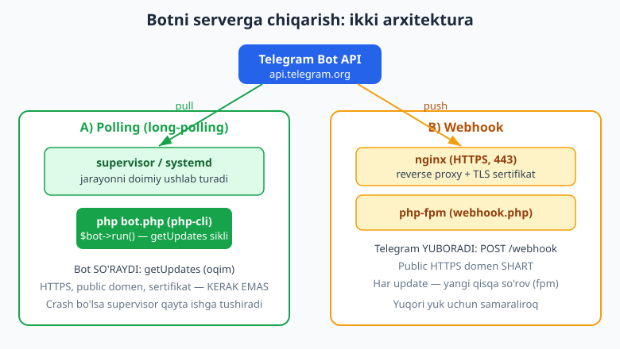
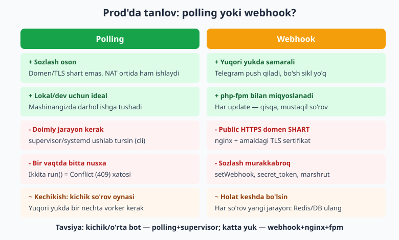
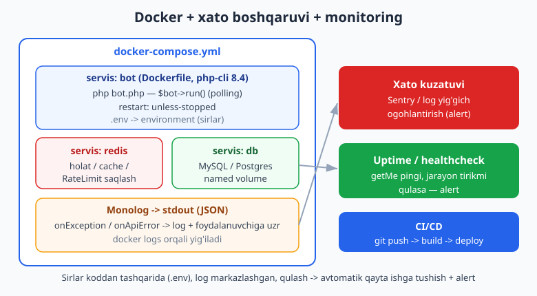

# 17 — Production va deploy

[⬅️ Oldingi: 16 — Testlash (FakeNutgram)](./16-testlash.md) · [🏠 README](./README.md) · [Keyingi: 18 — Yakuniy kapston: to'liq bot ➡️](./18-kapston.md)

---

> **Bu bobda:** botni mashinangizdan **haqiqiy serverga** chiqaramiz va uni shu yerda **ishonchli, doimiy** ishlatishni o'rganamiz. Mavzular: ikki arxitektura va ularning prod xulqi (**polling** vs **webhook**); polling botini doimiy ushlash uchun **supervisor** va **systemd** (avtomatik qayta ishga tushirish, log); webhook uchun **nginx + php-fpm** (TLS, marshrut, `secret_token`); **`.env` va sirlarni** koddan ajratish (token hech qachon kodga yozilmaydi); **Docker** (`Dockerfile` php-cli va php-fpm uchun, `docker-compose.yml` bilan bot + Redis + DB); **xato boshqaruvi** (`onException` / `onApiError`, **Monolog** bilan strukturali logging); **graceful** (texnik ish rejimi / kill-switch, signal bilan to'xtash); **monitoring** (healthcheck, uptime, Sentry kabi xato kuzatuvi); va prod'da **holatni keshda** saqlash zarurati. CI/CD'ni faqat eslatib o'tamiz — to'liqrog'i [../git-github/](../git-github/README.md) da.
>
> Halol eslatma: bu bobning serverga oid qismi (supervisor/systemd/nginx/php-fpm/Docker) bu muhitda **jonli ishga tushirilmaydi** — konfiguratsiya fayllari va buyruqlar **illustrativ** (lekin to'g'ri yozilgan, real serverga ko'chirib ishlatsa bo'ladi). Botning PHP **mantig'i** esa — `onException` xatoni tutishi (umumiy va turga bog'liq), texnik-ish kill-switch'i handlerni bloklashi, `.env` parseri — `Nutgram::fake()` (FakeNutgram) bilan **offline, tokensiz HAQIQATAN tekshirilgan** (7/7 PASS). "Bot serverda ishladi / xabar yetkazildi" kabi soxta tasdiq YOZMAYMIZ — jonli qismni siz o'z serveringizda ko'rasiz.

---

## Avval: lokal `run()` nega prod uchun yetarli emas?

Oldingi boblarda biz botni shunchaki `php bot.php` bilan ishga tushirdik:

```php
<?php
require __DIR__ . '/vendor/autoload.php';

use SergiX44\Nutgram\Nutgram;

$bot = new Nutgram($_ENV['TELEGRAM_TOKEN']);
$bot->onCommand('start', fn (Nutgram $bot) => $bot->sendMessage('Salom!'));
$bot->run(); // <-- long-polling sikli: getUpdates, ishlov, takror...
```

Bu **lokalda** ajoyib. Ammo prod'da uch muammo bor:

1. **Terminalni yopsangiz — bot o'ladi.** SSH uzilsa yoki server qayta yuklansa, jarayon to'xtaydi va bot "jim" qoladi.
2. **Crash bo'lsa — hech kim ko'tarmaydi.** Bot xato bilan to'xtasa, uni qayta ishga tushiruvchi yo'q.
3. **Hech kim kuzatmaydi.** Bot tirikmi, xatolar bormi — bilmaysiz.

Prod'ga chiqish demak — shu uch muammoni hal qilish: **doimiy ishlatish**, **avtomatik qayta tiklash** va **kuzatuv**. Boshlaymiz arxitekturani tanlashdan.



## Ikki arxitektura: polling vs webhook (prod nuqtai nazaridan)

Telegram botingizga update'larni ikki yo'l bilan yetkazadi (bu [01-bob](./01-nutgram-tanishuv.md) va [13-bobda](./13-webhook-deploy.md) ko'rilgan; bu yerda **prod** jihatiga qaraymiz):

- **Polling (long-polling):** *bot* Telegram'dan so'raydi (`getUpdates`). Bot doimiy ishlab turishi kerak. Public domen, TLS, ochiq port — **kerak emas**. Sozlash eng oson.
- **Webhook:** *Telegram* sizga HTTP POST yuboradi. Public **HTTPS** domen va amaldagi TLS sertifikat **shart**. Har update — alohida qisqa so'rov; php-fpm bilan yaxshi miqyoslanadi.



**Qaysi birini tanlash?**

| Mezon | Polling | Webhook |
|---|---|---|
| Sozlash | Oson (domen/TLS shart emas) | Murakkabroq (nginx + TLS) |
| Talab | Doimiy jarayon (supervisor/systemd) | Public HTTPS + php-fpm |
| Yuqori yuk | Bir nechta vorker kerak | Tabiiy miqyoslanadi |
| Bir vaqtda nusxa | **Faqat bitta** (aks holda 409 Conflict) | Cheklov yo'q |
| Lokal/dev | Ideal | Noqulay (tunnel kerak) |

> **Amaliy maslahat:** kichik va o'rta hajmdagi bot uchun **polling + supervisor** — eng sodda va ishonchli yo'l. Sekundiga yuzlab update keladigan katta bot uchun **webhook + nginx + php-fpm** miqyoslanadi. Ko'p loyihalar polling'dan boshlab, kerak bo'lganda webhook'ga o'tadi.

> **DIQQAT (409 Conflict):** polling rejimida bot **bir vaqtning o'zida faqat bitta** nusxada ishlashi mumkin. Ikkita `run()` jarayonini birga ishga tushirsangiz, Telegram `409 Conflict: terminated by other getUpdates request` qaytaradi. Deploy paytida eski nusxani **to'xtatib**, keyin yangisini ishga tushiring. Polling va webhook ikkalasini birga yoqib qo'ymang — webhook yoqiq bo'lsa `getUpdates` ishlamaydi (avval `deleteWebhook` qiling).

---

## Sirlar: `.env` va token (koddan TASHQARIDA)

Birinchi va eng muhim prod qoidasi: **token va boshqa sirlar hech qachon kodga yoki git'ga tushmaydi.** Token kim qo'liga tushsa, botingizni to'liq egallaydi.

Sirlarni `.env` faylida saqlaymiz va uni `.gitignore` ga qo'shamiz:

```bash
# .env  (git'ga TUSHMAYDI)
TELEGRAM_TOKEN=123456:AAH-RealTokenFromBotFather
APP_ENV=production
DB_DSN=mysql:host=db;dbname=botdb
DB_USER=bot
DB_PASS=super-secret
REDIS_URL=redis://redis:6379
SENTRY_DSN=
```

```bash
# .gitignore
/.env
/vendor/
*.log
```

Loyihaga namuna sifatida **`.env.example`** (sirlarsiz, faqat kalitlar) qo'shing — uni git'ga tushiring, yangi dasturchi nusxa olib to'ldiradi:

```bash
# .env.example  (git'da bor, qiymatlar bo'sh)
TELEGRAM_TOKEN=
APP_ENV=local
DB_DSN=
DB_USER=
DB_PASS=
REDIS_URL=
SENTRY_DSN=
```

Kodda `.env` ni o'qish uchun amalda `vlucas/phpdotenv` ishlatiladi (loyiha tuzilishi [11-bobda](./11-loyiha-tuzilishi.md)):

```php
<?php
require __DIR__ . '/vendor/autoload.php';

$dotenv = Dotenv\Dotenv::createImmutable(__DIR__);
$dotenv->load(); // .env -> $_ENV / getenv()

$token = $_ENV['TELEGRAM_TOKEN'] ?? getenv('TELEGRAM_TOKEN');
if (!$token) {
    fwrite(STDERR, "TELEGRAM_TOKEN topilmadi! .env ni tekshiring.\n");
    exit(1);
}

$bot = new SergiX44\Nutgram\Nutgram($token);
```

Tushunish uchun "qanday ishlashini" sodda parser bilan ko'rsatamiz (bu mantiqni offline tekshirdik — `.env` matnidan token o'qildi, `#` izoh tashlandi):

```php
<?php
function parseEnv(string $text): array
{
    $out = [];
    foreach (explode("\n", $text) as $line) {
        $line = trim($line);
        if ($line === '' || str_starts_with($line, '#')) {
            continue; // bo'sh qator yoki izohni tashlaymiz
        }
        [$key, $val] = array_pad(explode('=', $line, 2), 2, '');
        $out[trim($key)] = trim($val);
    }
    return $out;
}
```

> **Konteyner muhitida:** Docker/Kubernetes ishlatsangiz, ko'pincha sirlarni `.env` o'rniga to'g'ridan-to'g'ri **environment variable** sifatida beriladi (`docker-compose` `environment:` yoki secret-manager). `getenv()` ikkala holatda ham ishlaydi. Asosiy qoida bir xil: **sir koddan tashqarida.**

---

## Variant A — Polling'ni prod'da doimiy ishlatish

Polling botini "doimiy" qilish demak — uni nazoratchi jarayon ostiga qo'yish, u qulasa qayta tiklasin. Ikki keng tarqalgan vosita: **supervisor** va **systemd**.

### supervisor bilan

`supervisor` — uzoq ishlovchi jarayonlarni boshqaruvchi vosita. Konfiguratsiya (illustrativ — real Linux serverda `/etc/supervisor/conf.d/mybot.conf`):

```ini
[program:mybot]
command=/usr/bin/php /var/www/mybot/bot.php
directory=/var/www/mybot
autostart=true
autorestart=true
startretries=5
stopwaitsecs=10
user=www-data
redirect_stderr=true
stdout_logfile=/var/log/mybot/bot.log
stdout_logfile_maxbytes=10MB
stdout_logfile_backups=5
environment=APP_ENV="production"
```

Muhim sozlamalar: `autorestart=true` — bot qulasa avtomatik qayta ishga tushadi; `startretries` — necha marta urinish; `stopwaitsecs` — to'xtatishda jarayonga "tugatish" uchun beriladigan vaqt (graceful, pastda).

Boshqaruv buyruqlari (illustrativ):

```bash
sudo supervisorctl reread        # konfigni qayta o'qish
sudo supervisorctl update        # o'zgarishlarni qo'llash
sudo supervisorctl start mybot
sudo supervisorctl status mybot
sudo supervisorctl restart mybot # deploy'dan keyin
sudo supervisorctl tail -f mybot # loglarni kuzatish
```

### systemd bilan (alternativa)

Ko'p zamonaviy serverlarda `systemd` mavjud — alohida supervisor o'rnatish shart emas. Servis fayli (illustrativ — `/etc/systemd/system/mybot.service`):

```ini
[Unit]
Description=My Telegram Bot (Nutgram polling)
After=network.target

[Service]
Type=simple
User=www-data
WorkingDirectory=/var/www/mybot
ExecStart=/usr/bin/php /var/www/mybot/bot.php
Restart=always
RestartSec=3
StandardOutput=journal
StandardError=journal
EnvironmentFile=/var/www/mybot/.env

[Install]
WantedBy=multi-user.target
```

Boshqaruv (illustrativ):

```bash
sudo systemctl daemon-reload
sudo systemctl enable --now mybot     # yoqish + ishga tushirish
sudo systemctl status mybot
sudo systemctl restart mybot          # deploy'dan keyin
journalctl -u mybot -f                # loglarni jonli kuzatish
```

`Restart=always` + `RestartSec=3` — bot qulasa 3 soniyada qayta tiklanadi. `EnvironmentFile` orqali `.env` to'g'ridan-to'g'ri jarayon muhitiga yuklanadi.

> **Polling deploy oqimi:** `git pull` → `composer install --no-dev --optimize-autoloader` → migratsiyalar (DB) → `systemctl restart mybot` (yoki `supervisorctl restart`). Restart paytida eski jarayon to'xtaydi, yangisi ko'tariladi — shuning uchun 409 Conflict bo'lmaydi.

---

## Variant B — Webhook'ni nginx + php-fpm bilan

Webhook'da Telegram sizga so'rov yuboradi, demak siz **public HTTPS endpoint** taqdim etasiz. Nutgram'da running-mode'ni `Webhook` ga o'tkazamiz (bu metodlar tekshirildi — `setRunningMode`, `RunningMode\Webhook` mavjud).

Webhook kirish nuqtasi (`public/webhook.php`):

```php
<?php
require __DIR__ . '/../vendor/autoload.php';

use SergiX44\Nutgram\Nutgram;
use SergiX44\Nutgram\RunningMode\Webhook;

$dotenv = Dotenv\Dotenv::createImmutable(__DIR__ . '/..');
$dotenv->load();

$bot = new Nutgram($_ENV['TELEGRAM_TOKEN']);
$bot->setRunningMode(Webhook::class);

// ... handlerlarni ro'yxatdan o'tkazing (alohida faylda) ...
$bot->onCommand('start', fn (Nutgram $bot) => $bot->sendMessage('Salom!'));

$bot->run(); // webhook rejimida: kelgan POST'ni bir marta ishlab, javob qaytaradi
```

Webhook'ni Telegram'da **bir marta** ro'yxatdan o'tkazasiz (alohida skript yoki Artisan-stil buyruq orqali). Bu jonli Telegram'ni talab qiladi — **illustrativ**:

```php
<?php
// register-webhook.php  (bir marta ishga tushiriladi)
$bot->setWebhook(
    'https://bot.example.uz/webhook.php',
    secret_token: $_ENV['WEBHOOK_SECRET'], // qo'shimcha himoya (pastda)
);
// Tekshirish: $bot->getWebhookInfo();
// Bekor qilish (polling'ga qaytish): $bot->deleteWebhook();
```

nginx konfiguratsiyasi (illustrativ — `/etc/nginx/sites-available/mybot`):

```nginx
server {
    listen 443 ssl http2;
    server_name bot.example.uz;

    ssl_certificate     /etc/letsencrypt/live/bot.example.uz/fullchain.pem;
    ssl_certificate_key /etc/letsencrypt/live/bot.example.uz/privkey.pem;

    root /var/www/mybot/public;
    index webhook.php;

    location /webhook.php {
        include fastcgi_params;
        fastcgi_pass unix:/run/php/php8.4-fpm.sock;
        fastcgi_param SCRIPT_FILENAME $document_root$fastcgi_script_name;
    }

    # boshqa hamma narsani rad etamiz
    location / { return 404; }
}
```

> **TLS sertifikat:** bepul sertifikatni Let's Encrypt (`certbot`) bilan olasiz. Telegram o'z-o'zidan imzolangan (self-signed) sertifikatni ham qabul qiladi, lekin amaldagi (CA imzolagan) sertifikat soddaroq.

### Webhook xavfsizligi: `secret_token`

Webhook URL'ingizni kimdir bilib qolsa, soxta update yuborishi mumkin. `setWebhook` ning `secret_token` parametri buni bartaraf etadi: Telegram har so'rovda `X-Telegram-Bot-Api-Secret-Token` sarlavhasini yuboradi, siz uni tekshirasiz. Nutgram'ning `Webhook` running-mode'i buni qo'llab-quvvatlaydi — sirni `.env` da saqlang.

> **Webhook holat-tuzog'i:** webhook'da har update **yangi php-fpm jarayoni** bo'lib ishlaydi — xotiradagi massiv (default storage) so'rovlar orasida yashamaydi. Shuning uchun webhook prod'da `setUserData`/conversation holatini **albatta Redis yoki DB** ga saqlash kerak (cache sozlash [11-bobda](./11-loyiha-tuzilishi.md)). Polling'da bitta uzoq jarayon bo'lgani uchun bu unchalik kritik emas, lekin restart'da xotira nollanadi — baribir tashqi storage tavsiya etiladi.

---

## Docker bilan paketlash

Docker bot va uning bog'liqliklarini (Redis, DB) bitta takrorlanadigan to'plamga joylaydi — "menda ishladi, serverda ishlamadi" muammosini yo'qotadi.



### `Dockerfile` — polling (php-cli)

```dockerfile
FROM php:8.4-cli-alpine

# kerakli kengaytmalar
RUN docker-php-ext-install pdo pdo_mysql pcntl \
    && apk add --no-cache git

# composer
COPY --from=composer:2 /usr/bin/composer /usr/bin/composer

WORKDIR /app

# avval faqat bog'liqlik fayllari — kesh qatlamini saqlash uchun
COPY composer.json composer.lock ./
RUN composer install --no-dev --no-scripts --optimize-autoloader --no-interaction

# so'ng kod
COPY . .

CMD ["php", "bot.php"]
```

> `pcntl` kengaytmasini qo'shdik — graceful to'xtash uchun signallarni tutishga kerak bo'ladi (pastda). Polling botida `restart: unless-stopped` Docker'ning o'zi nazoratchi rolini bajaradi — supervisor shart emas.

### `Dockerfile` — webhook (php-fpm)

Webhook variantida cli o'rniga fpm bazasi va nginx kerak:

```dockerfile
FROM php:8.4-fpm-alpine
RUN docker-php-ext-install pdo pdo_mysql opcache
COPY --from=composer:2 /usr/bin/composer /usr/bin/composer
WORKDIR /app
COPY composer.json composer.lock ./
RUN composer install --no-dev --optimize-autoloader --no-interaction
COPY . .
# php-fpm 9000-portda kutadi; nginx alohida konteynerda reverse-proxy qiladi
EXPOSE 9000
```

### `docker-compose.yml` — bot + Redis + DB (polling misoli)

```yaml
services:
  bot:
    build: .
    restart: unless-stopped
    env_file: .env
    depends_on:
      - redis
      - db
    # CMD: php bot.php (Dockerfile'dan)

  redis:
    image: redis:7-alpine
    restart: unless-stopped
    volumes:
      - redis-data:/data

  db:
    image: mysql:8
    restart: unless-stopped
    environment:
      MYSQL_DATABASE: botdb
      MYSQL_USER: bot
      MYSQL_PASSWORD: ${DB_PASS}
      MYSQL_ROOT_PASSWORD: ${DB_ROOT_PASS}
    volumes:
      - db-data:/var/lib/mysql

volumes:
  redis-data:
  db-data:
```

Buyruqlar (illustrativ):

```bash
docker compose up -d --build   # qurish + fonda ishga tushirish
docker compose logs -f bot     # bot loglarini kuzatish
docker compose restart bot     # deploy'dan keyin
docker compose down            # to'xtatish
```

> **Nega `restart: unless-stopped`?** Bot qulasa yoki server qayta yuklansa, Docker konteynerni avtomatik qayta ko'taradi — bu polling uchun supervisor/systemd'ning Docker'dagi ekvivalenti. `env_file: .env` sirlarni koddan tashqarida tutadi (`.env` ni image ichiga `COPY` qilmang!).

---

## Xato boshqaruvi: `onException` va `onApiError`

Prod'da bitta tutilmagan xato butun botni qulatishi mumkin. Nutgram ikki maxsus handler beradi (ikkalasi ham tekshirildi — `SpecialListeners` da mavjud):

- **`onException`** — handleringiz ichida har qanday PHP exception otilsa, shu yerga tushadi.
- **`onApiError`** — Telegram API xato qaytarsa (masalan, "bot was blocked by the user"), shu yerga tushadi.

### `onException` — umumiy tutgich

```php
<?php
use SergiX44\Nutgram\Nutgram;

$bot->onException(function (Nutgram $bot, \Throwable $e) {
    // 1) xatoni log qiling (foydalanuvchiga texnik tafsilot KO'RSATMANG)
    error_log('[BOT XATO] ' . $e->getMessage());

    // 2) foydalanuvchiga muloyim javob
    $bot->sendMessage('Kechirasiz, kutilmagan xatolik yuz berdi. Birozdan keyin urinib koring.');
});

$bot->onCommand('hisobot', function (Nutgram $bot) {
    throw new \RuntimeException('DB ulanmadi'); // misol uchun
});
```

Buni FakeNutgram bilan **offline tekshirdik**: handler ichida `RuntimeException` otilganda `onException` uni tutdi (`$e->getMessage() === 'DB ulanmadi'`) va foydalanuvchiga uzr xabari yuborildi.

### Turga bog'liq `onException` (aniqroq ishlov)

`onException` ning birinchi argumentiga **exception sinfini** berib, faqat shu turga ishlov bera olasiz. Mos tur uchun maxsus handler, qolganlari uchun umumiy:

```php
<?php
// Faqat DB xatolari uchun
$bot->onException(\PDOException::class, function (Nutgram $bot, \Throwable $e) {
    error_log('[DB XATO] ' . $e->getMessage());
    $bot->sendMessage('Bazaga ulanishda muammo. Tez orada tuzatamiz.');
});

// Boshqa hamma narsa uchun "tutib qoluvchi"
$bot->onException(function (Nutgram $bot, \Throwable $e) {
    error_log('[BOSHQA XATO] ' . $e::class . ': ' . $e->getMessage());
    $bot->sendMessage('Kutilmagan xatolik. Birozdan keyin urinib koring.');
});
```

Tekshirildi: `InvalidArgumentException` otilganda turga mos handler tanlandi (umumiy emas) — Nutgram exception sinfiga qarab to'g'ri tutgichni topdi.

### `onApiError` — Telegram javob bergan xatolar

Eng tez-tez uchraydigan API xato: foydalanuvchi botni bloklagan yoki chatni o'chirgan. Broadcast'da (qarang [15-bob](./15-rejalashtirilgan-broadcast.md)) bu muqarrar. `onApiError` matn-naqsh (pattern) bo'yicha ishlaydi:

```php
<?php
// "blocked" so'zi bor xatolarni tutamiz
$bot->onApiError('.*blocked.*', function (Nutgram $bot, \Throwable $e) {
    // foydalanuvchini DB'da "nofaol" deb belgilaymiz, qayta urinmaymiz
    error_log('Foydalanuvchi botni bloklagan: ' . $bot->userId());
});

// Umumiy API xato tutgichi
$bot->onApiError(function (Nutgram $bot, \Throwable $e) {
    error_log('[API XATO] ' . $e->getMessage());
});
```

> **Tartib:** `onApiError(pattern, ...)` da naqsh Telegram qaytargan xato matniga moslanadi. Aniq naqshlarni (masalan, `.*blocked.*`, `.*chat not found.*`) umumiy tutgichdan **oldin** qo'ying. Aniq mos kelmasa, umumiy (naqshsiz) handler ishlaydi.

---

## Strukturali logging: Monolog

`error_log` lokalda yetadi, lekin prod'da loglar **strukturali** (JSON) va **markazlashgan** bo'lgani ma'qul — keyin ularni qidirish, filtrlash, alert qo'yish oson. PHP olamida standart vosita — **Monolog** (`composer require monolog/monolog`).

```php
<?php
use Monolog\Logger;
use Monolog\Handler\StreamHandler;
use Monolog\Formatter\JsonFormatter;
use SergiX44\Nutgram\Nutgram;

$log = new Logger('bot');
// stdout'ga JSON yozamiz — Docker/systemd loglarni shu yerdan yig'adi
$stream = new StreamHandler('php://stdout', Logger::INFO);
$stream->setFormatter(new JsonFormatter());
$log->pushHandler($stream);

// Nutgram'ning xato handlerlariga ulaymiz:
$bot->onException(function (Nutgram $bot, \Throwable $e) use ($log) {
    $log->error('Tutilmagan exception', [
        'exception' => $e::class,
        'message'   => $e->getMessage(),
        'user_id'   => $bot->userId(),
        'update_id' => $bot->update()?->update_id,
    ]);
    $bot->sendMessage('Kechirasiz, xatolik yuz berdi.');
});

$bot->onApiError(function (Nutgram $bot, \Throwable $e) use ($log) {
    $log->warning('Telegram API xato', ['message' => $e->getMessage()]);
});
```

> **Nega `php://stdout`?** Konteyner va systemd dunyosida "12-factor" yondashuvi: ilova loglarni **fayl boshqarmaydi**, balki stdout'ga oqim qilib chiqaradi. `docker logs` yoki `journalctl` ularni yig'adi, keyin tashqi yig'gichga (Loki, ELK, CloudWatch) uzatadi. Log fayllarini o'zingiz aylantirishingiz (rotate) shart bo'lmaydi.

> **DIQQAT:** logga **token, parol, foydalanuvchining shaxsiy ma'lumotlarini** yozmang. `JsonFormatter` butun kontekstni yozadi — unga sirlarni qo'shmang.

---

## Graceful: texnik-ish rejimi va toza to'xtash

### Kill-switch / texnik-ish rejimi (maintenance mode)

Ba'zan botni vaqtincha "o'chirib", foydalanuvchilarga xabar berishingiz kerak (migratsiya, yangilanish). Buni eng toza yo'l — **global middleware** (qarang [09-bob](./09-middleware.md)) bilan short-circuit:

```php
<?php
use SergiX44\Nutgram\Nutgram;

$bot->middleware(function (Nutgram $bot, $next) {
    $maintenance = ($_ENV['MAINTENANCE'] ?? '0') === '1';
    if ($maintenance) {
        $bot->sendMessage('Bot vaqtincha texnik ishlar tufayli oflayn. Tez orada qaytamiz!');
        return; // $next chaqirilmaydi -> hamma handler bloklanadi
    }
    $next($bot);
});
```

Bu mantiqni FakeNutgram bilan **tekshirdik**: `MAINTENANCE=1` bo'lganda `/start` handleri **umuman ishlamadi**, foydalanuvchi faqat texnik-ish xabarini oldi. Rejimni yoqish/o'chirish — `.env` da `MAINTENANCE` ni o'zgartirib, botni restart qilish (yoki Redis bayrog'i orqali restart'siz).

### Signal bilan toza to'xtash (polling, php-cli)

Polling botini supervisor/systemd to'xtatganda u `SIGTERM` signali yuboradi. `pcntl` bilan buni tutib, joriy update'ni tugatib, keyin chiqishingiz mumkin — yarmida uzilib qolmaslik uchun:

```php
<?php
declare(ticks=1);

$shuttingDown = false;
if (function_exists('pcntl_signal')) {
    pcntl_signal(SIGTERM, function () use (&$shuttingDown) {
        $shuttingDown = true; // joriy ishni tugatib, keyin chiqamiz
        error_log('SIGTERM oldim, toza to\'xtayapman...');
    });
}
```

> **Eslatma:** Nutgram'ning `run()` siklini siz to'g'ridan-to'g'ri boshqarmaysiz, shuning uchun amalda eng ishonchli graceful — `stopwaitsecs` (supervisor) yoki `TimeoutStopSec` (systemd) ni yetarli qo'yib, qisqa update'lar yozish. Webhook'da har so'rov allaqachon qisqa va mustaqil — graceful muammosi deyarli yo'q.

---

## Monitoring: bot tirikmi va xatolar oqimi

Deploy qilib bo'lib, eng so'nggi qadam — **kuzatuv**. Uch qatlam:

1. **Healthcheck / uptime.** Bot jarayoni tirikmi? Eng sodda yo'l — vaqti-vaqti bilan `getMe` chaqirib, javob kelishini tekshirish (cron yoki tashqi uptime-xizmat). systemd/Docker `restart` siyosati jarayon qulashidan himoya qiladi, lekin "jarayon tirik, ammo Telegram bilan aloqa yo'q" holatini healthcheck ushlaydi.

   ```php
   <?php
   // healthcheck.php — cron har 5 daqiqada ishga tushiradi (illustrativ)
   try {
       $me = $bot->getMe();
       echo "OK: @{$me->username}\n"; // exit 0
   } catch (\Throwable $e) {
       fwrite(STDERR, 'BOT NOSOG\'LOM: ' . $e->getMessage() . "\n");
       exit(1); // uptime-monitor alert yuboradi
   }
   ```

2. **Xato kuzatuvi (Sentry kabi).** `onException`/`onApiError` ichida xatolarni Sentry'ga yuboring — har bir xato bo'yicha guruhlangan, stack-trace bilan ogohlantirish olasiz. Monolog'ning `SentryHandler` i buni avtomatlashtiradi.

3. **Metrikalar.** Update'lar soni, ishlov vaqti, xatolar ulushi — buni global middleware'da o'lchab (qarang [09-bob](./09-middleware.md) — before/after timing), Prometheus/Grafana ga uzatish mumkin.

> **Eng kam to'plam:** kichik bot uchun `restart=always` (systemd/Docker) + `onException` log + tashqi uptime-monitor (UptimeRobot kabi) — yetarli va deyarli bepul boshlanish.

---

## CI/CD haqida qisqacha

Har deploy'da qo'lda SSH qilib `git pull && composer install && restart` qilish — xato manbai. Buni **avtomatlashtiring**: git'ga push qilganda testlar ([16-bob](./16-testlash.md)) ishga tushsin, o'tsa — serverga avtomatik deploy bo'lsin.

To'liq CI/CD ssenariysi (GitHub Actions, pipeline, sirlar sozlash) — **[../git-github/](../git-github/README.md)** bo'limida. Telegram bot uchun tipik pipeline:

```text
push -> composer install -> phpunit/pest -> (yashil bo'lsa) -> server'ga deploy -> restart
```

> **Bot uchun nozik nuqta:** deploy bosqichida albatta **eski nusxani to'xtatib, keyin yangisini ishga tushiring** (polling 409 Conflict'dan qochish uchun). Webhook'da bu muammo yo'q — fpm jarayonlari deploy'dan keyin avtomatik yangi kodni oladi.

---

## Bobni qanday tekshirdik (halol eslatma)

Botning **PHP mantig'i** `Nutgram::fake()` (FakeNutgram) bilan offline, tokensiz va tarmoqsiz **haqiqatan ishga tushirilib** tasdiqlandi (7/7 PASS):

- `onException` — handler ichidagi exception'ni tutishi va foydalanuvchiga uzr yuborishi;
- **turga bog'liq** `onException` — mos exception sinfini umumiy tutgichdan ajratib tanlashi;
- texnik-ish **kill-switch** (global middleware short-circuit) — `MAINTENANCE` yoqilganda handlerni bloklashi;
- `.env` parseri — token va kalitlarni o'qishi, `#` izohni tashlashi.

`onApiError`, `setRunningMode(Webhook::class)`, `setWebhook`/`deleteWebhook`/`getWebhookInfo`, `setMyCommands`, `getMe` — Nutgram 4.46 manbasida **mavjudligi** tekshirildi (xayoliy metod yo'q).

Quyidagilar **jonli muhitni** talab qiladi va shuning uchun **illustrativ** (kod/konfiguratsiya to'g'ri, lekin bu yerda RUN qilinmaydi): supervisor/systemd jarayoni, nginx + php-fpm, real TLS sertifikat, Docker build/up, jonli `setWebhook` va Telegram'ning POST yuborishi, jonli `getMe`/healthcheck, Sentry/uptime alertlari. "Bot serverda ishladi / xabar yetkazildi" deb soxta tasdiq bermaymiz — bularni o'z serveringizda ko'rasiz.

---

## Mashqlar

### Oson

1. `.env` va `.env.example` fayllarini yarating (token, `APP_ENV`, `DB_DSN`). `.env` ni `.gitignore` ga qo'shing, `.env.example` ni esa qo'shmang. Nega farqli ekanini bir jumlada izohlang.
2. Yuqoridagi `parseEnv()` funksiyasini yozing va `"TOKEN=abc\n# izoh\nENV=prod\n"` matnida sinab ko'ring: `TOKEN`/`ENV` o'qilsin, izoh tashlansin.
3. `onException` umumiy handler yozing: xatoni `error_log` ga chiqarsin va foydalanuvchiga "Xatolik yuz berdi" yuborsin. Bilib turib `/test` handlerda exception oting.
4. Polling vs webhook farqini 3 ta nuqtada (kim so'raydi, HTTPS kerakmi, bir vaqtda nechta nusxa) jadval qilib yozing.
5. systemd servis faylida `Restart=always` va `RestartSec=3` nima qilishini izohlang. Bularsiz bot qulaganda nima bo'ladi?
6. `docker-compose.yml` da `restart: unless-stopped` ni `restart: no` ga o'zgartirsangiz, server qayta yuklanganda bot bilan nima bo'ladi?

### O'rta

1. Texnik-ish rejimini middleware bilan yozing: `MAINTENANCE=1` bo'lsa har bir handlerni bloklab, foydalanuvchiga xabar bersin. FakeNutgram bilan ikkala holatni (`1` va `0`) tekshiring: `1` da handler ishlamasligi, `0` da ishlashi.
2. Turga bog'liq `onException` yozing: `\PDOException` uchun "Baza muammosi", boshqa har qanday exception uchun "Kutilmagan xato". FakeNutgram bilan ikkala tarmoqni tasdiqlang (`assertReplyText`).
3. `onApiError('.*blocked.*', ...)` handler yozing: bloklagan foydalanuvchini logga "nofaol" deb yozsin, qayta xabar yubormasin. Bu broadcast'da nega muhim ekanini izohlang.
4. Monolog'ni `php://stdout` ga JSON formatda sozlang va `onException` ichida xatoni `user_id`, `update_id` kontekst bilan log qiling. Nega faylga emas, stdout'ga yozish konteynerda afzal?
5. Polling botini supervisor bilan ishlatish uchun to'liq `.conf` yozing (`autorestart`, `stdout_logfile`, `user`). Keyin deploy oqimini (pull → install → restart) bandlar bilan yozing.
6. Webhook kirish nuqtasi (`webhook.php`) yozing: `setRunningMode(Webhook::class)`, bitta `/start` handler. Alohida `register-webhook.php` da `setWebhook` ni `secret_token` bilan chaqiring. (Jonli setWebhook illustrativ.)

### Qiyin

1. **To'liq Docker to'plami:** `Dockerfile` (php-cli, pdo + pcntl), `docker-compose.yml` (bot + redis + db, `restart: unless-stopped`, `env_file`) va `.dockerignore` (`.env`, `vendor/`, `.git`) yozing. Nega `.env` ni image ichiga `COPY` qilmaslik kerakligini, va nega webhook prod'da holatni Redis'ga saqlash zarurligini izohlang.
2. **Xato boshqaruvi qatlamlari:** `onException` (turga bog'liq `\PDOException` + umumiy) va `onApiError` (`.*blocked.*` + umumiy) ni birga sozlang, hammasini Monolog'ga ulang. FakeNutgram bilan: (a) `\PDOException` otilganda DB-handler ishlashini, (b) boshqa exception umumiy handlerga tushishini tasdiqlang. (`onApiError` jonli API talab qiladi — uni illustrativ qoldiring.)
3. **Healthcheck + alert mantig'i:** `getMe` muvaffaqiyatli bo'lsa `exit(0)`, xato bo'lsa `exit(1)` qaytaradigan `healthcheck.php` yozing. Buni cron/uptime-monitor bilan qanday bog'lashni va systemd `restart` dan farqini (jarayon tirik, ammo Telegram aloqasi yo'q holati) tushuntiring. (Jonli `getMe` illustrativ.)
4. **Polling → webhook migratsiyasi:** mavjud polling botini webhook'ga o'tkazish rejasini yozing: (1) `deleteWebhook`/`setWebhook` tartibi va nega ikkalasi birga ishlamasligi, (2) holatni xotiradan Redis'ga ko'chirish, (3) nginx + php-fpm marshruti, (4) 409 Conflict'dan qochish uchun deploy ketma-ketligi. Har qadamni qisqa izohlang.

<details markdown="1"><summary>Yechimlar</summary>

**Oson 1.** `.env` da haqiqiy sirlar (token, parol) bor — u **hech qachon** git'ga tushmaydi (`.gitignore`). `.env.example` esa faqat **kalitlar ro'yxati** (qiymatsiz) — uni git'ga qo'shamiz, yangi dasturchi nusxa olib (`cp .env.example .env`) o'z qiymatlari bilan to'ldiradi.

**Oson 2.**
```php
<?php
function parseEnv(string $text): array {
    $out = [];
    foreach (explode("\n", $text) as $line) {
        $line = trim($line);
        if ($line === '' || str_starts_with($line, '#')) continue;
        [$k, $v] = array_pad(explode('=', $line, 2), 2, '');
        $out[trim($k)] = trim($v);
    }
    return $out;
}
$env = parseEnv("TOKEN=abc\n# izoh\nENV=prod\n");
assert($env['TOKEN'] === 'abc');
assert($env['ENV'] === 'prod');
assert(!isset($env['# izoh']));
```

**Oson 3.**
```php
<?php
use SergiX44\Nutgram\Nutgram;
$bot->onException(function (Nutgram $bot, \Throwable $e) {
    error_log('[XATO] ' . $e->getMessage());
    $bot->sendMessage('Xatolik yuz berdi');
});
$bot->onCommand('test', fn (Nutgram $bot) => throw new \RuntimeException('sinov'));
```

**Oson 4.**

| | Polling | Webhook |
|---|---|---|
| Kim so'raydi | Bot (`getUpdates`) | Telegram (POST) |
| HTTPS domen | Kerak emas | Shart |
| Bir vaqtda nusxa | Faqat bitta (409 Conflict) | Cheklov yo'q |

**Oson 5.** `Restart=always` — jarayon qanday tugashidan qat'i nazar systemd uni qayta ishga tushiradi; `RestartSec=3` — 3 soniya kutib, keyin. Bularsiz bot qulaganda **o'chiq qoladi**, kimdir qo'lda ishga tushirmaguncha javob bermaydi.

**Oson 6.** `restart: no` bo'lsa, server qayta yuklanganda (yoki bot qulasa) konteyner **avtomatik ko'tarilmaydi** — bot o'chiq qoladi. `unless-stopped` esa siz ataylab to'xtatmagan bo'lsangiz qayta ishga tushiradi.

**O'rta 1.**
```php
<?php
use SergiX44\Nutgram\Nutgram;

function makeBot(bool $maintenance): Nutgram {
    $bot = Nutgram::fake();
    $bot->middleware(function (Nutgram $bot, $next) use ($maintenance) {
        if ($maintenance) { $bot->sendMessage('Texnik ishlar, tez orada qaytamiz!'); return; }
        $next($bot);
    });
    $bot->onCommand('start', fn (Nutgram $bot) => $bot->sendMessage('Salom'));
    return $bot;
}
// maintenance ON
$on = makeBot(true);
$on->hearText('/start')->reply();
$on->assertReplyText('Texnik ishlar, tez orada qaytamiz!');
// maintenance OFF
$off = makeBot(false);
$off->hearText('/start')->reply();
$off->assertReplyText('Salom');
```

**O'rta 2.**
```php
<?php
use SergiX44\Nutgram\Nutgram;
$bot = Nutgram::fake();
$bot->onException(\PDOException::class, fn (Nutgram $bot, \Throwable $e) => $bot->sendMessage('Baza muammosi'));
$bot->onException(fn (Nutgram $bot, \Throwable $e) => $bot->sendMessage('Kutilmagan xato'));

$bot->onCommand('db', fn (Nutgram $bot) => throw new \PDOException('x'));
$bot->onCommand('other', fn (Nutgram $bot) => throw new \RuntimeException('y'));

$bot->hearText('/db')->reply();
$bot->assertReplyText('Baza muammosi');
$bot->hearText('/other')->reply();
$bot->assertReplyText('Kutilmagan xato');
```

**O'rta 3.**
```php
<?php
use SergiX44\Nutgram\Nutgram;
$bot->onApiError('.*blocked.*', function (Nutgram $bot, \Throwable $e) {
    error_log('Nofaol (bloklagan): ' . $bot->userId());
    // qayta sendMessage QILMAYMIZ — baribir yetmaydi
});
```
Broadcast'da minglab foydalanuvchiga yuborganda, ko'pchiligi botni bloklagan bo'lishi mumkin. Bu xatoni tutib, ularni "nofaol" deb belgilamasak — har broadcast'da bekorga API'ga uramiz va xatolar oqim qiladi.

**O'rta 4.**
```php
<?php
use Monolog\Logger;
use Monolog\Handler\StreamHandler;
use Monolog\Formatter\JsonFormatter;
use SergiX44\Nutgram\Nutgram;

$log = new Logger('bot');
$h = new StreamHandler('php://stdout', Logger::INFO);
$h->setFormatter(new JsonFormatter());
$log->pushHandler($h);

$bot->onException(function (Nutgram $bot, \Throwable $e) use ($log) {
    $log->error('exception', [
        'class' => $e::class, 'msg' => $e->getMessage(),
        'user_id' => $bot->userId(), 'update_id' => $bot->update()?->update_id,
    ]);
    $bot->sendMessage('Xatolik yuz berdi');
});
```
stdout afzal: konteyner/systemd loglarni shu oqimdan yig'adi (`docker logs`, `journalctl`), fayl aylantirish (rotate) va disk to'lishi haqida o'ylash shart emas — "12-factor" yondashuvi.

**O'rta 5.**
```ini
[program:mybot]
command=/usr/bin/php /var/www/mybot/bot.php
directory=/var/www/mybot
autostart=true
autorestart=true
startretries=5
user=www-data
redirect_stderr=true
stdout_logfile=/var/log/mybot/bot.log
```
Deploy oqimi:
1. `git pull`
2. `composer install --no-dev --optimize-autoloader`
3. migratsiyalar (DB sxema o'zgarsa)
4. `sudo supervisorctl restart mybot` (eski nusxa to'xtaydi, yangisi ko'tariladi → 409 yo'q)

**O'rta 6.**
```php
<?php
// webhook.php
require __DIR__ . '/../vendor/autoload.php';
use SergiX44\Nutgram\Nutgram;
use SergiX44\Nutgram\RunningMode\Webhook;

$bot = new Nutgram(getenv('TELEGRAM_TOKEN'));
$bot->setRunningMode(Webhook::class);
$bot->onCommand('start', fn (Nutgram $bot) => $bot->sendMessage('Salom!'));
$bot->run();
```
```php
<?php
// register-webhook.php (bir marta — jonli, illustrativ)
$bot->setWebhook('https://bot.example.uz/webhook.php', secret_token: getenv('WEBHOOK_SECRET'));
```

**Qiyin 1.**
```dockerfile
# Dockerfile
FROM php:8.4-cli-alpine
RUN docker-php-ext-install pdo pdo_mysql pcntl && apk add --no-cache git
COPY --from=composer:2 /usr/bin/composer /usr/bin/composer
WORKDIR /app
COPY composer.json composer.lock ./
RUN composer install --no-dev --no-scripts --optimize-autoloader --no-interaction
COPY . .
CMD ["php", "bot.php"]
```
```yaml
# docker-compose.yml
services:
  bot:
    build: .
    restart: unless-stopped
    env_file: .env
    depends_on: [redis, db]
  redis:
    image: redis:7-alpine
    restart: unless-stopped
    volumes: ["redis-data:/data"]
  db:
    image: mysql:8
    restart: unless-stopped
    environment:
      MYSQL_DATABASE: botdb
      MYSQL_USER: bot
      MYSQL_PASSWORD: ${DB_PASS}
      MYSQL_ROOT_PASSWORD: ${DB_ROOT_PASS}
    volumes: ["db-data:/var/lib/mysql"]
volumes:
  redis-data:
  db-data:
```
```text
# .dockerignore
.env
vendor/
.git
*.log
```
`.env` ni image'ga `COPY` qilmaymiz, chunki image registry'ga yuklansa sir tarqaydi; uni runtime'da `env_file` orqali beramiz. Webhook'da har so'rov yangi fpm jarayoni — xotiradagi holat yashamaydi, shuning uchun `setUserData`/conversation Redis'da saqlanishi shart.

**Qiyin 2.**
```php
<?php
use SergiX44\Nutgram\Nutgram;
// (Monolog sozlash O'rta 4 dagidek — $log)
$bot = Nutgram::fake();
$bot->onException(\PDOException::class, function (Nutgram $bot, \Throwable $e) use ($log) {
    $log->error('db', ['msg' => $e->getMessage()]);
    $bot->sendMessage('Baza muammosi');
});
$bot->onException(function (Nutgram $bot, \Throwable $e) use ($log) {
    $log->error('other', ['class' => $e::class]);
    $bot->sendMessage('Kutilmagan xato');
});
// onApiError jonli API talab qiladi — illustrativ:
$bot->onApiError('.*blocked.*', fn (Nutgram $bot, \Throwable $e) => $log->warning('blocked'));
$bot->onApiError(fn (Nutgram $bot, \Throwable $e) => $log->warning('api', ['msg' => $e->getMessage()]));

$bot->onCommand('db', fn (Nutgram $bot) => throw new \PDOException('x'));
$bot->onCommand('boom', fn (Nutgram $bot) => throw new \LogicException('y'));

$bot->hearText('/db')->reply();   $bot->assertReplyText('Baza muammosi');
$bot->hearText('/boom')->reply(); $bot->assertReplyText('Kutilmagan xato');
```

**Qiyin 3.**
```php
<?php
// healthcheck.php (jonli getMe — illustrativ)
try {
    $me = $bot->getMe();
    fwrite(STDOUT, "OK: @{$me->username}\n");
    exit(0);
} catch (\Throwable $e) {
    fwrite(STDERR, 'NOSOG\'LOM: ' . $e->getMessage() . "\n");
    exit(1);
}
```
Cron har 5 daqiqada ishga tushiradi; `exit(1)` bo'lsa uptime-monitor (UptimeRobot/cron-mail) alert yuboradi. systemd `Restart=always` faqat **jarayon qulaganda** ishlaydi; healthcheck esa "jarayon tirik, lekin Telegram bilan aloqa uzilgan / token bekor qilingan" holatini ham ushlaydi — bu systemd ko'rmaydigan turdagi nosozlik.

**Qiyin 4.** Polling → webhook migratsiyasi:
1. **`deleteWebhook` shart emas, `setWebhook` o'zi yetadi** (webhook o'rnatilishi bilan `getUpdates` ishlamay qoladi) — lekin avval polling jarayonini **to'xtating** (`systemctl stop mybot`), aks holda u `getUpdates` ni davom ettirib 409 beradi. Polling va webhook **bir vaqtda yoqilib bo'lmaydi**: webhook yoqiq bo'lsa Telegram getUpdates'ga ruxsat bermaydi.
2. Holat: xotiradagi `setUserData`/conversation webhook'da yashamaydi (har so'rov yangi fpm) → cache'ni Redis'ga ko'chiring ([11-bob](./11-loyiha-tuzilishi.md)).
3. nginx: `location /webhook.php` → `fastcgi_pass` php-fpm soketiga; root `public/`; qolgani `404`.
4. Deploy ketma-ketligi: kod deploy → `setWebhook(url, secret_token)` → tekshirish `getWebhookInfo`. Webhook'da deploy'da to'xtatish/ishga tushirish bosqichi yo'q (fpm yangi kodni avtomatik oladi), shuning uchun 409 muammosi umuman yo'q.
</details>

---

[⬅️ Oldingi: 16 — Testlash (FakeNutgram)](./16-testlash.md) · [🏠 README](./README.md) · [Keyingi: 18 — Yakuniy kapston: to'liq bot ➡️](./18-kapston.md)
