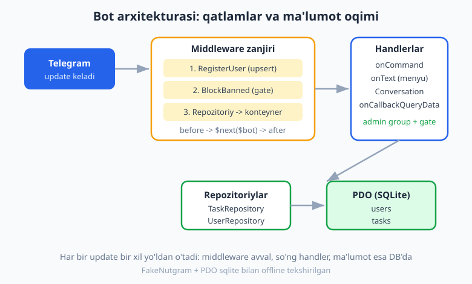
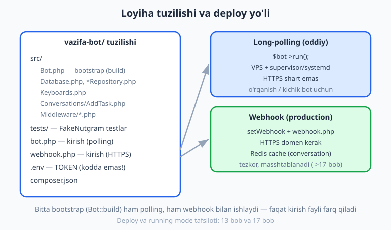
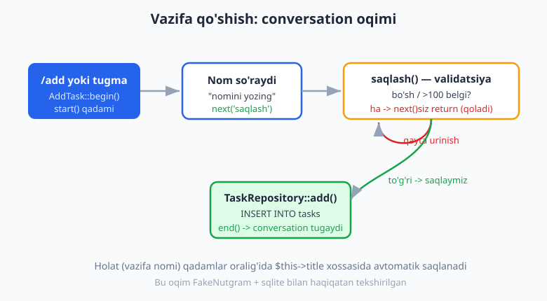

# 18 — Yakuniy kapston: to'liq bot

[⬅️ Oldingi: 17 — Production va deploy](./17-production-deploy.md) · [🏠 README](./README.md) · [Keyingi: 19 — Guruhlarda ishlash ➡️](./19-guruhlar.md)

---

> **Bu bobda:** Hozirgacha har bobda Nutgram'ning bitta qismini o'rgandik — handlerlar, klaviaturalar, callback, conversation, middleware, ma'lumotlar bazasi, deploy. Endi ularning **hammasini bitta haqiqiy loyihada** birlashtiramiz: **vazifa-menejer bot** (mini to-do). Foydalanuvchi `/add` (yoki menyu tugmasi) bilan vazifa qo'shadi (`Conversation` forma + validatsiya), vazifani DB'ga (PDO/SQLite) yozadi, `/list` bilan ro'yxatni inline tugmalar (`Bajarildi` / `O'chirish`) bilan ko'radi, callback orqali vazifani belgilaydi yoki o'chiradi. Har bir update **middleware zanjiri**dan o'tadi: foydalanuvchini DB'ga upsert qilamiz, bloklanganlarni to'samiz, anti-flood (throttle) qo'yamiz; admin buyruqlar (`/stats`, `/ban`) esa alohida **gate**li guruhda. Eng muhimi — **loyiha tuzilishi** (`src/`, repozitoriylar, bitta `Bot::build` bootstrap), **FakeNutgram + PDO sqlite bilan offline testlar**, va **deploy yo'riqnomasi** (polling vs webhook — [13](./13-webhook-deploy.md), [17](./17-production-deploy.md)). Bu bob — kitobning amaliy yuragi: undan keyin sizda butun, testlangan, deploy qilinadigan bot bo'ladi.
>
> **Halol eslatma:** Bu botning BARCHA mantig'i — conversation oqimi va validatsiyasi, DB CRUD va **egalik tekshiruvi** (begona vazifani o'zgartirib bo'lmasligi), inline callback (done/del), uchala middleware (upsert, ban-gate, throttle), admin-gate va klaviatura quruvchilari — `Nutgram::fake()` (FakeNutgram) + **PDO sqlite (`:memory:`)** bilan tokensiz, tarmoqsiz **haqiqatan ishga tushirib tekshirilgan**: jami **18 ta PHPUnit testi, 63 ta assert, hammasi o'tdi** (Nutgram 4.46, PHP 8.4). Qaysi testlar — bob oxirida ro'yxat bilan. Jonli qism (real `sendMessage`, telefonda tugmalar, webhook orqali HTTPS, jonli deploy) — **illustrativ** deb belgilangan; hech qayerda soxta "bot ishladi / xabar yetdi" yozilmagan.

---

## Nimani quramiz? — talablar va arxitektura

Vazifa-menejer bot quyidagilarni qiladi:

| Imkoniyat | Qanday | Qaysi bob |
|---|---|---|
| Vazifa qo'shish (forma) | `AddTask` conversation + validatsiya | [08](./08-conversations.md) |
| Vazifalarni saqlash/ro'yxat | PDO repozitoriylar (SQLite/MySQL) | [10](./10-malumotlar-bazasi.md) |
| Doimiy menyu | Reply klaviatura | [06](./06-klaviaturalar.md) |
| Bajarildi / o'chirish | Inline tugma + callback | [06](./06-klaviaturalar.md), [07](./07-callback-inline.md) |
| Foydalanuvchini ro'yxatga olish, bloklash, anti-flood | Middleware | [09](./09-middleware.md) |
| Admin buyruqlar (`/stats`, `/ban`) | Guruh + admin-gate | [09](./09-middleware.md) |
| Test | FakeNutgram + PDO | [16](./16-testlash.md) |
| Deploy | Polling / webhook | [13](./13-webhook-deploy.md), [17](./17-production-deploy.md) |

Har bir update bir xil yo'ldan o'tadi: avval **middleware zanjiri**, so'ng mos **handler**, ma'lumot esa **repozitoriy** orqali **DB**'ga boradi.



> **PHP eslatma:** Bu bob siz PHP'ni bilasiz deb faraz qiladi (sinf, namespace, PDO, closure, type hints — [../php/README.md](../php/README.md)). Biz Telegram/Nutgram'ga xos narsalarni tushuntiramiz; PDO/PHP asoslarini esa qayta o'rgatmaymiz (chuqurroq SQL uchun [../sql/README.md](../sql/README.md), Laravel'da xuddi shu g'oyalar uchun [../laravel/README.md](../laravel/README.md)).

---

## Loyiha tuzilishi

Bitta `bot.php` faylga hamma narsani tiqishtirish o'rganish uchun mayli, lekin haqiqiy loyihada kodni **sinflar va papkalar**ga ajratamiz. Bizning tuzilish ([11-bob](./11-loyiha-tuzilishi.md) tamoyillariga amal qiladi):

```text
vazifa-bot/
├── src/
│   ├── Bot.php                 # bootstrap: hamma narsani ulaydigan build()
│   ├── Database.php            # PDO ulanish + migratsiya
│   ├── UserRepository.php      # users jadvali bilan ishlash
│   ├── TaskRepository.php      # tasks jadvali bilan ishlash
│   ├── Keyboards.php           # reply/inline klaviatura quruvchilari
│   ├── Conversations/
│   │   └── AddTask.php         # vazifa qo'shish formasi
│   └── Middleware/
│       ├── RegisterUser.php    # har update'da foydalanuvchini upsert
│       ├── BlockBanned.php     # bloklanganlarni to'sish (gate)
│       ├── Throttle.php        # anti-flood
│       └── EnsureAdmin.php     # admin-gate
├── tests/
│   └── BotTest.php             # FakeNutgram + PDO testlar
├── bot.php                     # kirish nuqtasi (long-polling)
├── webhook.php                 # kirish nuqtasi (webhook / HTTPS)
├── .env                        # TELEGRAM_TOKEN (kodga YOZILMAYDI)
└── composer.json
```



`composer.json` da PSR-4 autoload va kerakli paketlar:

```json
{
    "require": {
        "php": "^8.4",
        "nutgram/nutgram": "^4.46"
    },
    "require-dev": {
        "phpunit/phpunit": "^12.0"
    },
    "autoload": {
        "psr-4": { "App\\": "src/" }
    },
    "autoload-dev": {
        "psr-4": { "App\\Tests\\": "tests/" }
    }
}
```

---

## Ma'lumotlar bazasi: ulanish va jadvallar

Avval **DB qatlami**. `Database::connect()` PDO ulanishini ochadi va jadvallarni yaratadi (migratsiya). O'rganishda SQLite (fayl yoki `:memory:`), production'da MySQL — ikkalasi ham PDO orqali bir xil ishlaydi:

```php
<?php
namespace App;

use PDO;

class Database
{
    public static function connect(string $dsn = 'sqlite::memory:'): PDO
    {
        $pdo = new PDO($dsn, options: [
            PDO::ATTR_ERRMODE            => PDO::ERRMODE_EXCEPTION,
            PDO::ATTR_DEFAULT_FETCH_MODE => PDO::FETCH_ASSOC,
        ]);
        self::migrate($pdo);
        return $pdo;
    }

    public static function migrate(PDO $pdo): void
    {
        $pdo->exec('
            CREATE TABLE IF NOT EXISTS users (
                id          INTEGER PRIMARY KEY,   -- Telegram user id
                first_name  TEXT NOT NULL DEFAULT \'\',
                username    TEXT,
                is_banned   INTEGER NOT NULL DEFAULT 0,
                created_at  TEXT NOT NULL
            )
        ');
        $pdo->exec('
            CREATE TABLE IF NOT EXISTS tasks (
                id          INTEGER PRIMARY KEY AUTOINCREMENT,
                user_id     INTEGER NOT NULL,
                title       TEXT NOT NULL,
                done        INTEGER NOT NULL DEFAULT 0,
                created_at  TEXT NOT NULL
            )
        ');
    }
}
```

> **Nega `users.id` — Telegram ID?** Foydalanuvchining Telegram ID'si o'zi noyob va o'zgarmas — uni `PRIMARY KEY` qilib olsak, `INSERT ... ON CONFLICT` (upsert) tabiiy bo'ladi. Vazifaning `user_id` ustuni shu ID'ga ishora qiladi.

### Repozitoriylar (PDO bilan ishlash sinflari)

Handlerlar SQL'ni to'g'ridan-to'g'ri yozmasin — buni **repozitoriy** sinflariga ajratamiz. Avval foydalanuvchilar:

```php
<?php
namespace App;

use PDO;

class UserRepository
{
    public function __construct(private PDO $pdo) {}

    /** Ko'rdik -> bo'lmasa yaratamiz, bo'lsa ism/username yangilaymiz (idempotent). */
    public function upsert(int $id, string $firstName, ?string $username): void
    {
        $stmt = $this->pdo->prepare('
            INSERT INTO users (id, first_name, username, created_at)
            VALUES (:id, :first_name, :username, :created_at)
            ON CONFLICT(id) DO UPDATE SET
                first_name = excluded.first_name,
                username   = excluded.username
        ');
        $stmt->execute([
            'id' => $id, 'first_name' => $firstName,
            'username' => $username, 'created_at' => gmdate('c'),
        ]);
    }

    public function isBanned(int $id): bool
    {
        $stmt = $this->pdo->prepare('SELECT is_banned FROM users WHERE id = :id');
        $stmt->execute(['id' => $id]);
        return (bool) $stmt->fetchColumn();
    }

    public function setBanned(int $id, bool $banned): void
    {
        $stmt = $this->pdo->prepare('UPDATE users SET is_banned = :b WHERE id = :id');
        $stmt->execute(['b' => $banned ? 1 : 0, 'id' => $id]);
    }

    public function count(): int
    {
        return (int) $this->pdo->query('SELECT COUNT(*) FROM users')->fetchColumn();
    }
}
```

Endi vazifalar repozitoriysi. Diqqat: har bir o'zgartirish/o'chirish **egalikni tekshiradi** (`AND user_id = :uid`) — foydalanuvchi faqat **o'z** vazifasiga ta'sir qila olsin:

```php
<?php
namespace App;

use PDO;

class TaskRepository
{
    public function __construct(private PDO $pdo) {}

    public function add(int $userId, string $title): int
    {
        $stmt = $this->pdo->prepare('
            INSERT INTO tasks (user_id, title, created_at)
            VALUES (:user_id, :title, :created_at)
        ');
        $stmt->execute(['user_id' => $userId, 'title' => $title, 'created_at' => gmdate('c')]);
        return (int) $this->pdo->lastInsertId();
    }

    /** @return array<int, array{id:int,title:string,done:int}> */
    public function listForUser(int $userId): array
    {
        $stmt = $this->pdo->prepare('
            SELECT id, title, done FROM tasks
            WHERE user_id = :user_id ORDER BY done ASC, id ASC
        ');
        $stmt->execute(['user_id' => $userId]);
        return $stmt->fetchAll();
    }

    public function find(int $id, int $userId): ?array
    {
        $stmt = $this->pdo->prepare('SELECT id, title, done FROM tasks WHERE id = :id AND user_id = :uid');
        $stmt->execute(['id' => $id, 'uid' => $userId]);
        return $stmt->fetch() ?: null;
    }

    /** Egasini tekshirib "bajarildi" qiladi; o'zgargan qator sonini qaytaradi (0 = sizniki emas). */
    public function markDone(int $id, int $userId): int
    {
        $stmt = $this->pdo->prepare('UPDATE tasks SET done = 1 WHERE id = :id AND user_id = :uid AND done = 0');
        $stmt->execute(['id' => $id, 'uid' => $userId]);
        return $stmt->rowCount();
    }

    /** Egasini tekshirib o'chiradi; o'chirilgan qator sonini qaytaradi. */
    public function delete(int $id, int $userId): int
    {
        $stmt = $this->pdo->prepare('DELETE FROM tasks WHERE id = :id AND user_id = :uid');
        $stmt->execute(['id' => $id, 'uid' => $userId]);
        return $stmt->rowCount();
    }

    public function countAll(): int
    {
        return (int) $this->pdo->query('SELECT COUNT(*) FROM tasks')->fetchColumn();
    }
}
```

> **XAVFSIZLIK — egalik tekshiruvi (juda muhim).** Inline tugmaning `callback_data` sida vazifa ID'si turadi (`done:42`). Lekin **boshqa** foydalanuvchi sun'iy callback yuborib, sizning vazifangizni o'chirishga urinishi mumkin. Shuning uchun har bir `UPDATE`/`DELETE` da `AND user_id = :uid` shart — begona ID berilsa, `rowCount()` **0** qaytadi va hech narsa o'zgarmaydi. Buni pastda FakeNutgram bilan aniq tekshiramiz (begona vazifa rad etiladi). Hech qachon callback'dan kelgan ID'ga "ishonib" egalikni tekshirmay qolmang.

---

## Conversation: vazifa qo'shish formasi

Vazifa qo'shish — bu bir savolli forma: bot nom so'raydi, foydalanuvchi yozadi, biz validatsiya qilib DB'ga saqlaymiz. [08-bobdagi](./08-conversations.md) `Conversation`dan meros olamiz:

```php
<?php
namespace App\Conversations;

use App\Keyboards;
use App\TaskRepository;
use SergiX44\Nutgram\Conversations\Conversation;
use SergiX44\Nutgram\Nutgram;

class AddTask extends Conversation
{
    // Vazifa nomi — qadamlar oralig'ida Nutgram avtomatik serializatsiya qiladi.
    public ?string $title = null;

    public function start(Nutgram $bot)
    {
        $bot->sendMessage("Yangi vazifa nomini yozing (yoki /cancel):");
        $this->next('saqlash');
    }

    public function saqlash(Nutgram $bot)
    {
        $title = trim((string) $bot->message()->text);

        // Validatsiya: noto'g'rida next() chaqirMAymiz -> shu qadamda QOLAMIZ.
        if ($title === '') {
            $bot->sendMessage("Vazifa nomi bo'sh bo'lmasligi kerak. Qayta yozing:");
            return;
        }
        if (mb_strlen($title) > 100) {
            $bot->sendMessage("Juda uzun (max 100 belgi). Qisqaroq yozing:");
            return;
        }

        $this->title = $title;

        // TaskRepository konteynerdan keladi (bootstrap'da middleware joylaydi).
        /** @var TaskRepository $tasks */
        $tasks = $bot->getContainer()->get(TaskRepository::class);
        $tasks->add($bot->userId(), $this->title);

        $bot->sendMessage("\u{2705} Qo'shildi: {$this->title}", reply_markup: Keyboards::mainMenu());
        $this->end();
    }
}
```



Ikki nozik joy:

1. **Validatsiya = `next()`siz `return`.** Bo'sh yoki juda uzun nom kelsa, `next()` chaqirmaymiz — conversation `saqlash` qadamida qoladi, foydalanuvchi qayta urinadi ([08-bob](./08-conversations.md) naqsh).
2. **Repozitoriyni qayerdan olamiz?** Conversation qadami ham handler kabi `$bot` orqali ishlaydi. Repozitoriyni global o'zgaruvchidan emas, **konteynerdan** (`getContainer()->get(...)`) olamiz — uni har update'da middleware joylaydi (pastda ko'ramiz). Bu test paytida ham toza ishlaydi: testda boshqa DB beramiz, kod o'zgarmaydi.

---

## Klaviaturalar: doimiy menyu va vazifa tugmalari

Ikki klaviatura kerak: pastda doimiy turadigan **reply menyu** va har vazifa ostidagi **inline tugmalar** ([06-bob](./06-klaviaturalar.md)). Quruvchilarni alohida sinfga ajratamiz:

```php
<?php
namespace App;

use SergiX44\Nutgram\Telegram\Types\Keyboard\InlineKeyboardButton;
use SergiX44\Nutgram\Telegram\Types\Keyboard\InlineKeyboardMarkup;
use SergiX44\Nutgram\Telegram\Types\Keyboard\KeyboardButton;
use SergiX44\Nutgram\Telegram\Types\Keyboard\ReplyKeyboardMarkup;

class Keyboards
{
    /** Doimiy past menyu. */
    public static function mainMenu(): ReplyKeyboardMarkup
    {
        return ReplyKeyboardMarkup::make(resize_keyboard: true)
            ->addRow(
                KeyboardButton::make("\u{2795} Vazifa qo'shish"),
                KeyboardButton::make("\u{1F4CB} Vazifalarim"),
            );
    }

    /** Bitta vazifa qatori: [Bajarildi] [O'chirish]. ID callback_data ichida: "done:42". */
    public static function taskRow(array $task): InlineKeyboardMarkup
    {
        $id = $task['id'];
        $buttons = [];
        if (!$task['done']) {
            $buttons[] = InlineKeyboardButton::make("\u{2705} Bajarildi", callback_data: "done:$id");
        }
        $buttons[] = InlineKeyboardButton::make("\u{1F5D1} O'chirish", callback_data: "del:$id");

        return InlineKeyboardMarkup::make()->addRow(...$buttons);
    }
}
```

> **Bajarilgan vazifada "Bajarildi" tugmasi kerakmas.** `taskRow()` shartli quradi: vazifa allaqachon bajarilgan bo'lsa, faqat `[O'chirish]` chiqadi. Bu — klaviaturani **ma'lumotga qarab** qurishning oddiy misoli. Pastda buni testda ham tekshiramiz (bajarilmagan -> 2 tugma, bajarilgan -> 1 tugma).

---

## Middleware: ro'yxatga olish, bloklash, anti-flood, admin

Endi [09-bobning](./09-middleware.md) middleware'larini ishga solamiz. Hammasi **class-based** (`__invoke`) — qayta ishlatish va test qulay.

**1) RegisterUser** — har update'da foydalanuvchini DB'ga upsert qiladi:

```php
<?php
namespace App\Middleware;

use App\UserRepository;
use SergiX44\Nutgram\Nutgram;

class RegisterUser
{
    public function __construct(private UserRepository $users) {}

    public function __invoke(Nutgram $bot, $next): void
    {
        $user = $bot->user();
        if ($user !== null) {
            $this->users->upsert($user->id, $user->first_name ?? '', $user->username);
        }
        $next($bot);
    }
}
```

**2) BlockBanned** — bloklangan foydalanuvchini to'sadi (short-circuit, `$next` chaqirilmaydi):

```php
<?php
namespace App\Middleware;

use App\UserRepository;
use SergiX44\Nutgram\Nutgram;

class BlockBanned
{
    public function __construct(private UserRepository $users) {}

    public function __invoke(Nutgram $bot, $next): void
    {
        $id = $bot->userId();
        if ($id !== null && $this->users->isBanned($id)) {
            $bot->sendMessage("\u{26D4} Siz bloklangansiz.");
            return; // handlergacha yetib bormaydi
        }
        $next($bot);
    }
}
```

> **Tartib muhim.** `RegisterUser` ni `BlockBanned`'dan **oldin** ro'yxatdan o'tkazamiz — shunda ban tekshiruvi paytida foydalanuvchi DB'da bo'lishi kafolatlangan (upsert allaqachon ishlagan). [09-bobda](./09-middleware.md) ko'rganimizdek, `$bot->middleware()` chaqirilish tartibi = ijro tartibi (birinchi qo'shilgan — eng tashqi qatlam).

**3) Throttle** — oddiy anti-flood (`getUserData`/`setUserData` orqali, [09-bob](./09-middleware.md)):

```php
<?php
namespace App\Middleware;

use SergiX44\Nutgram\Nutgram;

class Throttle
{
    public function __construct(private int $seconds = 1) {}

    public function __invoke(Nutgram $bot, $next): void
    {
        $now  = microtime(true);
        $last = (float) $bot->getUserData('last_action', default: 0);

        if ($now - $last < $this->seconds) {
            return; // short-circuit — spamda jim qaytamiz (qo'shimcha flood bo'lmasin)
        }

        $bot->setUserData('last_action', $now);
        $next($bot);
    }
}
```

**4) EnsureAdmin** — admin-gate (faqat sozlamadagi ID'lar o'tadi):

```php
<?php
namespace App\Middleware;

use SergiX44\Nutgram\Nutgram;

class EnsureAdmin
{
    /** @param int[] $admins */
    public function __construct(private array $admins) {}

    public function __invoke(Nutgram $bot, $next): void
    {
        if (!in_array($bot->userId(), $this->admins, true)) {
            $bot->sendMessage("Bu bo'lim faqat adminlar uchun.");
            return; // short-circuit
        }
        $next($bot);
    }
}
```

---

## Bootstrap: hammasini bitta `Bot::build` ga ulash

Mana — loyihaning yuragi. `Bot::build()` Nutgram obyekti va PDO oladi, hamma middleware/handler/conversation'ni ulaydi va tayyor botni qaytaradi. **Bitta** bootstrap — uni ham polling, ham webhook, ham test ishlatadi:

```php
<?php
namespace App;

use App\Conversations\AddTask;
use App\Middleware\BlockBanned;
use App\Middleware\EnsureAdmin;
use App\Middleware\RegisterUser;
use PDO;
use SergiX44\Nutgram\Nutgram;

class Bot
{
    /** @param int[] $admins */
    public static function build(Nutgram $bot, PDO $pdo, array $admins = []): Nutgram
    {
        $users = new UserRepository($pdo);
        $tasks = new TaskRepository($pdo);

        // --- Global middleware (tartib: avval upsert, keyin ban-gate) ---
        $bot->middleware(new RegisterUser($users));
        $bot->middleware(new BlockBanned($users));

        // Repozitoriylarni har update doirasida konteynerga joylaymiz —
        // conversation/handler ulardan getContainer()->get(...) bilan oladi.
        $bot->middleware(function (Nutgram $bot, $next) use ($users, $tasks) {
            $bot->getContainer()->set(UserRepository::class, $users);
            $bot->getContainer()->set(TaskRepository::class, $tasks);
            $next($bot);
        });

        // --- Asosiy buyruqlar ---
        $bot->onCommand('start', function (Nutgram $bot) {
            $bot->sendMessage(
                "Salom! Bu — vazifa-menejer bot.\n" .
                "Vazifa qo'shish yoki ro'yxatni ko'rish uchun pastdagi menyudan foydalaning.",
                reply_markup: Keyboards::mainMenu(),
            );
        });

        $bot->onCommand('help', fn (Nutgram $bot) => $bot->sendMessage(
            "Buyruqlar:\n/start — boshlash\n/add — vazifa qo'shish\n/list — vazifalarim"
        ));

        // Vazifa qo'shish: buyruq ham, reply-tugma matni ham conversation'ni boshlaydi.
        $startAdd = fn (Nutgram $bot) => AddTask::begin($bot);
        $bot->onCommand('add', $startAdd);
        $bot->onText("\u{2795} Vazifa qo'shish", $startAdd);

        // Ro'yxat:
        $showList = fn (Nutgram $bot) => self::sendList($bot, $tasks);
        $bot->onCommand('list', $showList);
        $bot->onText("\u{1F4CB} Vazifalarim", $showList);

        // /cancel — aktiv conversation'ni Nutgram o'zi to'xtatadi (pattern'li handler).
        $bot->onCommand('cancel', fn (Nutgram $bot) => $bot->sendMessage('Bekor qilindi.'));

        // --- Inline callback'lar: bajarildi / o'chirish ---
        $bot->onCallbackQueryData('done:{id}', function (Nutgram $bot, int $id) use ($tasks) {
            if ($tasks->markDone($id, $bot->userId()) > 0) {
                $bot->answerCallbackQuery(text: 'Bajarildi deb belgilandi.');
                $bot->editMessageText("\u{2705} Bajarildi (#$id)");
            } else {
                $bot->answerCallbackQuery(text: 'Topilmadi yoki sizniki emas.', show_alert: true);
            }
        });

        $bot->onCallbackQueryData('del:{id}', function (Nutgram $bot, int $id) use ($tasks) {
            if ($tasks->delete($id, $bot->userId()) > 0) {
                $bot->answerCallbackQuery(text: "O'chirildi.");
                $bot->editMessageText("\u{1F5D1} O'chirildi (#$id)");
            } else {
                $bot->answerCallbackQuery(text: 'Topilmadi yoki sizniki emas.', show_alert: true);
            }
        });

        // --- Admin guruhi (gate bilan o'ralgan) ---
        $bot->group(function (Nutgram $bot) use ($users, $tasks) {
            $bot->onCommand('stats', fn (Nutgram $bot) => $bot->sendMessage(
                "\u{1F4CA} Statistika:\n" .
                "Foydalanuvchilar: {$users->count()}\n" .
                "Vazifalar: {$tasks->countAll()}"
            ));
            // Buyruq argumenti: onCommand('ban {id}') -> handlerga $id parametr bo'lib keladi.
            $bot->onCommand('ban {id}', function (Nutgram $bot, string $id) use ($users) {
                if (!ctype_digit($id)) {
                    $bot->sendMessage('Foydalanish: /ban <user_id>');
                    return;
                }
                $users->setBanned((int) $id, true);
                $bot->sendMessage("Foydalanuvchi $id bloklandi.");
            });
        })->middleware(new EnsureAdmin($admins));

        // Tanish bo'lmagan matn — yordam.
        $bot->fallback(fn (Nutgram $bot) => $bot->sendMessage('Tushunmadim. /help'));

        return $bot;
    }

    private static function sendList(Nutgram $bot, TaskRepository $tasks): void
    {
        $rows = $tasks->listForUser($bot->userId());
        if ($rows === []) {
            $bot->sendMessage("Vazifalaringiz yo'q. Qo'shish: /add");
            return;
        }
        foreach ($rows as $task) {
            $belgi = $task['done'] ? "\u{2705}" : "\u{2B1C}";
            $bot->sendMessage("$belgi {$task['title']}", reply_markup: Keyboards::taskRow($task));
        }
    }
}
```

Diqqat qiladigan nuqtalar:

- **`onCommand` ham, `onText` ham bitta closure'ga** ulanadi (`$startAdd`, `$showList`) — `/add` buyrug'i va "➕ Vazifa qo'shish" tugmasi bir xil ishni qiladi. Reply tugma bosilganda Telegram oddiy **matn xabari** yuboradi (tugmadagi yozuv) — shuning uchun `onText` bilan ushlaymiz ([06-bob](./06-klaviaturalar.md)).
- **`onCallbackQueryData('done:{id}')`** — `{id}` named parametr. Handler `int $id` ni avtomatik oladi ([07-bob](./07-callback-inline.md)). Shuningdek `onCommand('ban {id}')` ham xuddi shunday — buyruq argumenti `$id` ga uzatiladi.
- **Admin guruhi `->middleware(new EnsureAdmin(...))` bilan o'ralgan** — `/stats` va `/ban` faqat adminlar uchun, gate butun guruhni qoplaydi ([09-bob](./09-middleware.md)).

---

## Kirish nuqtalari: polling va webhook

Bootstrap bitta, lekin botni **ishga tushirish** ikki xil bo'lishi mumkin ([13-bob](./13-webhook-deploy.md)). O'rganish/kichik bot uchun **long-polling**:

```php
<?php
// bot.php — long-polling kirish nuqtasi
require __DIR__ . '/vendor/autoload.php';

use App\Bot;
use App\Database;
use SergiX44\Nutgram\Nutgram;

$token  = getenv('TELEGRAM_TOKEN') ?: throw new RuntimeException('TELEGRAM_TOKEN yo\'q');
$admins = array_map('intval', explode(',', getenv('ADMIN_IDS') ?: ''));

$pdo = Database::connect(getenv('DB_DSN') ?: 'sqlite:' . __DIR__ . '/data.sqlite');
$bot = Bot::build(new Nutgram($token), $pdo, $admins);

$bot->run();   // long-polling: getUpdates tsiklini ishga tushiradi
```

Production uchun **webhook** — bir xil bootstrap, faqat HTTPS endpoint ([13](./13-webhook-deploy.md), [17](./17-production-deploy.md)):

```php
<?php
// webhook.php — Telegram POST so'rovini qabul qiladigan HTTPS endpoint
require __DIR__ . '/vendor/autoload.php';

use App\Bot;
use App\Database;
use SergiX44\Nutgram\Configuration;
use SergiX44\Nutgram\Nutgram;
use SergiX44\Nutgram\RunningMode\Webhook;

$token  = getenv('TELEGRAM_TOKEN');
$admins = array_map('intval', explode(',', getenv('ADMIN_IDS') ?: ''));

$pdo = Database::connect(getenv('DB_DSN'));

// Production'da conversation/cache uchun Redis (illustrativ — server kerak):
$config = new Configuration(/* cache: $redisPsr16 */);
$bot = Bot::build(new Nutgram($token, $config), $pdo, $admins);

$bot->setRunningMode(Webhook::class);
$bot->run();   // joriy HTTP so'rovdagi bitta update'ni ishlaydi
```

> **Halol eslatma (deploy).** Webhook uchun **public HTTPS domen** kerak (`setWebhook` ni bir marta chaqirasiz), polling uchun esa doimiy ishlab turadigan protsess (systemd/supervisor). Bularning ikkalasi ham **jonli muhitni** talab qiladi — bu yerda kod **illustrativ**, biz uni real Telegram'ga ulamadik. Conversation holatini saqlash uchun production'da `ArrayCache` emas, **Redis/fayl cache** ishlating (aks holda bot restart bo'lganda yarim qolgan formalar yo'qoladi — [08](./08-conversations.md), [11](./11-loyiha-tuzilishi.md), [17](./17-production-deploy.md)). Token har doim `.env`/`getenv` dan keladi, **kodga yozilmaydi**.

---

## Testlash: FakeNutgram + PDO sqlite (OFFLINE)

Mana eng muhim qism — **hamma narsani tokensiz, tarmoqsiz tekshirish**. `Nutgram::fake()` ([16-bob](./16-testlash.md)) + `:memory:` SQLite bilan butun botni ishga tushiramiz. Test bazasi bootstrap'ga **argument** sifatida uzatilgani uchun (`Bot::build($bot, $pdo, ...)`) hech narsani mock qilish kerak emas — haqiqiy DB, faqat xotirada.

Test bazasi (qisqartirilgan — to'liq versiyada 18 ta test):

```php
<?php
namespace App\Tests;

use App\Bot;
use App\Database;
use App\Keyboards;
use App\TaskRepository;
use App\UserRepository;
use PDO;
use PHPUnit\Framework\TestCase;
use SergiX44\Nutgram\Nutgram;
use SergiX44\Nutgram\Telegram\Types\User\User;
use SergiX44\Nutgram\Telegram\Types\Chat\Chat;

final class BotTest extends TestCase
{
    private PDO $pdo;

    protected function setUp(): void
    {
        // Har test uchun toza in-memory DB (migratsiya avtomatik).
        $this->pdo = Database::connect('sqlite::memory:');
    }

    private function fakeBot(int $userId = 555, array $admins = []): Nutgram
    {
        $bot = Nutgram::fake();
        // Barcha update'lar bitta foydalanuvchi/chat'dan kelsin (DB/middleware izolyatsiyasi).
        $bot->setCommonUser(User::make(id: $userId, is_bot: false, first_name: 'Test'));
        $bot->setCommonChat(Chat::make(id: $userId, type: 'private'));
        return Bot::build($bot, $this->pdo, $admins);
    }

    public function test_add_task_conversation_saves_to_db(): void
    {
        $bot = $this->fakeBot(555);
        $bot->willStartConversation();              // ko'p qadamli suhbat uchun SHART

        $bot->hearText('/add')->reply();
        $bot->assertReplyText("Yangi vazifa nomini yozing (yoki /cancel):");
        $bot->assertActiveConversation();

        $bot->hearText('Kitob yozish')->reply();
        $bot->assertReplyText("\u{2705} Qo'shildi: Kitob yozish");
        $bot->assertNoConversation();

        // DB'da HAQIQATAN paydo bo'ldimi:
        $rows = (new TaskRepository($this->pdo))->listForUser(555);
        $this->assertCount(1, $rows);
        $this->assertSame('Kitob yozish', $rows[0]['title']);
    }

    public function test_callback_on_foreign_task_is_rejected(): void
    {
        $tasks = new TaskRepository($this->pdo);
        $id = $tasks->add(999, 'Boshqaniki');       // egasi 999
        $bot = $this->fakeBot(555);                 // 555 urinmoqda

        $bot->hearCallbackQueryData("done:$id")->reply();
        $bot->assertCalled('answerCallbackQuery');  // alert: sizniki emas
        $this->assertSame(0, $tasks->find($id, 999)['done']); // o'zgarmadi!
    }

    public function test_banned_user_is_blocked(): void
    {
        (new UserRepository($this->pdo))->upsert(555, 'Test', null);
        (new UserRepository($this->pdo))->setBanned(555, true);

        $bot = $this->fakeBot(555);
        $bot->hearText('/list')->reply();
        $bot->assertReplyText("\u{26D4} Siz bloklangansiz."); // short-circuit ishladi
    }

    public function test_admin_gate_blocks_non_admin(): void
    {
        $bot = $this->fakeBot(555, admins: [111]);  // 555 admin emas
        $bot->hearText('/stats')->reply();
        $bot->assertReplyText("Bu bo'lim faqat adminlar uchun.");
    }

    public function test_keyboard_builders(): void
    {
        $this->assertCount(2, Keyboards::taskRow(['id' => 5, 'done' => 0])->inline_keyboard[0]); // [Bajarildi][O'chirish]
        $this->assertCount(1, Keyboards::taskRow(['id' => 5, 'done' => 1])->inline_keyboard[0]); // faqat [O'chirish]
    }
}
```

> **Test sirlari (FakeNutgram bilan).** Uch narsa muhim: (1) **`setCommonUser`/`setCommonChat`** bilan barcha update'larni bitta foydalanuvchidan qilamiz — aks holda FakeNutgram har safar tasodifiy ID yaratadi va middleware/DB izolyatsiyasini tekshirib bo'lmaydi. (2) Ko'p qadamli conversation uchun **`willStartConversation()`** shart ([08-bob](./08-conversations.md)). (3) Test bazasini **konstruktor argumenti** orqali uzatamiz — shuning uchun `:memory:` SQLite "haqiqiy" DB sifatida ishlaydi, mock kerak emas.

### Tekshirilgan natija (haqiqiy)

Yuqoridagi test bazasini PHPUnit bilan ishga tushirdik. Natija aynan quyidagicha bo'ldi (Nutgram 4.46, PHP 8.4, hech qanday token/tarmoq yo'q):

```text
PHPUnit 12.5.29 by Sebastian Bergmann and contributors.
..................                                                18 / 18 (100%)
OK (18 tests, 63 assertions)
```

Bu soxta emas — `:memory:` SQLite va FakeNutgram bilan har bir mantiq tom ma'noda ishga tushirildi. Masalan, `test_add_task_conversation_saves_to_db` da `/add` -> "Kitob yozish" oqimidan keyin **DB'dan** `listForUser(555)` o'qildi va bitta vazifa (`'Kitob yozish'`) topildi — conversation rostdan DB'ga yozgani isbotlandi. `test_callback_on_foreign_task_is_rejected` da 555-foydalanuvchi 999-ning vazifasiga `done:` callback yubordi, lekin `find()` `done = 0` qaytardi — egalik tekshiruvi haqiqatan to'sdi.

> **Jonli ko'rinish (illustrativ — token+internet kerak):** Telefonda bot "Yangi vazifa nomini yozing" deydi, siz yozasiz, ro'yxatda tugmali xabarlar chiqadi, "✅ Bajarildi" bosilsa xabar tahrirlanadi. Biz buni real Telegram'da ishga tushirmadik (`@BotFather` token + HTTPS/protsess kerak), lekin butun mantiq yuqoridagidek aniq tekshirilgan.

---

## Yo'l xaritasi: shu botni o'zingiz qayta qurish

1. `composer init`, `composer require nutgram/nutgram`, `composer require --dev phpunit/phpunit`; `src/` ga PSR-4 autoload.
2. `Database` + ikki repozitoriy yozing (PDO, `prepare`/`execute`, **egalik tekshiruvi** `AND user_id = :uid`).
3. `AddTask` conversation: `start()` -> savol -> `saqlash()` (validatsiya + DB). Repozitoriyni **konteynerdan** oling.
4. `Keyboards`: reply menyu + shartli inline `taskRow`.
5. Middleware'lar (class-based): `RegisterUser`, `BlockBanned`, `Throttle`, `EnsureAdmin`. Tartibni to'g'ri qo'ying (upsert -> ban).
6. `Bot::build($bot, $pdo, $admins)` — hammasini ulang; `onCommand`+`onText` bilan menyu, `onCallbackQueryData('done:{id}')`, admin `group()`+gate, `fallback`.
7. Kirish nuqtalari: `bot.php` (polling) va `webhook.php` (HTTPS). Token `.env`/`getenv` dan.
8. `tests/BotTest.php`: `Nutgram::fake()` + `:memory:` SQLite, `setCommonUser/Chat`, `willStartConversation` — har imkoniyatni offline tekshiring.
9. Deploy: kichik bot — polling + systemd; production — webhook + Redis cache ([13](./13-webhook-deploy.md), [17](./17-production-deploy.md)).

---

## Mashqlar

### Oson

1. `Bot::build` da yangi `/about` buyrug'i qo'shing: bot nomi va versiyasini yuborsin. FakeNutgram bilan `assertReplyText` orqali tekshiring.
2. `UserRepository` ga `recent(int $limit): array` metodi qo'shing (`ORDER BY created_at DESC LIMIT`). Sof PDO, `:memory:` DB bilan ikki foydalanuvchi qo'shib tekshiring.
3. Reply menyuga uchinchi tugma "ℹ️ Yordam" qo'shing va uni `/help` bilan bir xil closure'ga (`onText`) ulang.
4. `taskRow()` ga uchinchi tugma "✏️ Tahrirlash" (`callback_data: "edit:$id"`) qo'shing (hozircha faqat tugma — handler keyingi mashqda). Tugmalar soni 3 bo'lganini test bilan tasdiqlang.
5. `Throttle` ni `/list` ga handler-middleware sifatida biriktiring (`->middleware(new Throttle(2))`). Birinchi `/list` o'tishi, darhol takror jim qolishini FakeNutgram'da `assertNoReply` bilan tekshiring.
6. `Database::migrate` ni alohida ishga tushirib (`:memory:`), `users` va `tasks` jadvallari yaratilganini `SELECT name FROM sqlite_master` bilan tasdiqlang.

### O'rta

7. **Vazifani tahrirlash:** `edit:{id}` callback qo'shing — `AddTask` ga o'xshash kichik conversation (`EditTask`) boshlab, yangi nomni so'rab, `TaskRepository::rename($id, $userId, $title)` (egalik tekshiruvi bilan) yangilasin. Offline conversation + DB bilan tekshiring.
8. **Filtr:** `/done` va `/pending` buyruqlarini qo'shing — mos ravishda faqat bajarilgan/bajarilmagan vazifalarni ko'rsatsin (`listForUser` ga `?bool $done` parametri qo'shing). DB testi yozing.
9. **Throttle'ni global qiling:** uni `Bot::build` ichida `$bot->middleware(new Throttle(1))` sifatida `RegisterUser`/`BlockBanned`dan keyin qo'ying. Tartib (upsert -> ban -> throttle -> repo) buzilmaganini, va bloklangan foydalanuvchi throttle'gacha yetib bormasligini trace bilan tushuntiring.
10. **Admin broadcast (mantiq qismi):** `/broadcast <matn>` admin buyrug'i qo'shing — `UserRepository::allIds()` ni aylanib har biriga yuborishni **simulyatsiya** qilsin (haqiqiy `sendMessage` o'rniga ID'lar ro'yxatini qaytaruvchi sof metod). Jonli yuborish illustrativ; ID yig'ish mantig'ini DB bilan tekshiring.
11. **Bo'sh DB callback:** mavjud bo'lmagan ID bilan `done:99999` callback yuboring (DB bo'sh). `answerCallbackQuery` "Topilmadi" alerti chiqishini va hech narsa o'zgarmasligini tasdiqlang.
12. **`/start` deeplink:** `Bot::build` da `start` payload (`/start ref_xyz`) ni o'qib, `users` ga `source` ustuni sifatida saqlang (migratsiyani yangilang). Deeplink mantig'ini DB bilan tekshiring ([04-bob](./04-filtrlar-buyruqlar.md) deeplink).

### Qiyin

13. **Tranzaksiya:** vazifa qo'shganda bir vaqtning o'zida `users.tasks_count` hisoblagichini oshiring — ikkalasini **bitta PDO tranzaksiyasi** (`beginTransaction`/`commit`) ichida bajaring. Birortasi xato bersa `rollBack` qilinishini (hech narsa yozilmasligini) test bilan tasdiqlang ([../sql/README.md](../sql/README.md)).
14. **Sahifalash:** `/list` ko'p vazifada uzun bo'ladi — har sahifada 5 ta vazifa ko'rsatib, "⬅️ Oldingi"/"Keyingi ➡️" inline tugmalari (`page:{n}`) bilan sahifalang ([07-bob](./07-callback-inline.md) pagination). Sahifa hisoblash mantig'ini offline tekshiring.
15. **To'liq integratsion oqim:** bitta testda `/start` -> "➕ Vazifa qo'shish" tugmasi -> nom -> `/list` -> `done:{id}` callback ketma-ketligini ishga tushiring va har bosqichni (`assertReplyText`, DB holati) tekshiring. `willStartConversation` va `setCommonUser/Chat` ni to'g'ri ishlating.
16. **Ko'p foydalanuvchi izolyatsiyasi (mantiq):** ikki foydalanuvchi (100 va 200) o'z vazifalarini qo'shganda bir-birinikini ko'rmasligini DB darajasida tasdiqlang (`listForUser(100)` faqat 100 niki). Nutgram conversation cache kaliti (user+chat) buni qanday kafolatlashini, va FakeNutgram'da nega odatda bitta foydalanuvchi ketma-ketligini sinashimizni izohlang ([08-bob](./08-conversations.md)).

<details markdown="1"><summary>Yechimlar</summary>

**1-mashq.**
```php
$bot->onCommand('about', fn (Nutgram $bot) => $bot->sendMessage('Vazifa-menejer bot v1.0'));
// Test:
$bot = $this->fakeBot(555);
$bot->hearText('/about')->reply();
$bot->assertReplyText('Vazifa-menejer bot v1.0');
```

---

**2-mashq.**
```php
public function recent(int $limit): array
{
    $stmt = $this->pdo->prepare('SELECT id, first_name FROM users ORDER BY created_at DESC LIMIT :n');
    $stmt->bindValue('n', $limit, \PDO::PARAM_INT);
    $stmt->execute();
    return $stmt->fetchAll();
}
// Test: ikki foydalanuvchi upsert qiling, recent(1) bitta qator qaytarishini tekshiring.
```
Diqqat: `LIMIT` da `bindValue(..., PDO::PARAM_INT)` ishlating — `LIMIT` ga string bog'lash ba'zi drayverlarda xato beradi.

---

**3-mashq.**
```php
$mainMenu = ReplyKeyboardMarkup::make(resize_keyboard: true)
    ->addRow(KeyboardButton::make("\u{2795} Vazifa qo'shish"), KeyboardButton::make("\u{1F4CB} Vazifalarim"))
    ->addRow(KeyboardButton::make("\u{2139} Yordam"));

$help = fn (Nutgram $bot) => $bot->sendMessage("Buyruqlar: /add /list");
$bot->onCommand('help', $help);
$bot->onText("\u{2139} Yordam", $help);
```

---

**4-mashq.**
```php
public static function taskRow(array $task): InlineKeyboardMarkup
{
    $id = $task['id'];
    $buttons = [];
    if (!$task['done']) {
        $buttons[] = InlineKeyboardButton::make("\u{2705} Bajarildi", callback_data: "done:$id");
    }
    $buttons[] = InlineKeyboardButton::make("\u{270F} Tahrirlash", callback_data: "edit:$id");
    $buttons[] = InlineKeyboardButton::make("\u{1F5D1} O'chirish", callback_data: "del:$id");
    return InlineKeyboardMarkup::make()->addRow(...$buttons);
}
// Test: $this->assertCount(3, Keyboards::taskRow(['id'=>1,'done'=>0])->inline_keyboard[0]);
```

---

**5-mashq.**
```php
use App\Middleware\Throttle;

$bot = $this->fakeBot(555);
// /list ga throttle biriktirilgan deb faraz qilamiz (Bot::build da):
//   $bot->onCommand('list', $showList)->middleware(new Throttle(2));
$bot->hearText('/list')->reply();
$bot->assertReply('sendMessage');   // birinchi o'tdi (bo'sh ro'yxat xabari)
$bot->hearText('/list')->reply();   // darhol takror
$bot->assertNoReply();              // throttle jim qaytdi
```
Eslatma: `Throttle` `getUserData` ishlatgani uchun `setCommonUser` bilan bitta foydalanuvchi bo'lishi shart.

---

**6-mashq.**
```php
$pdo = Database::connect('sqlite::memory:');
$names = $pdo->query("SELECT name FROM sqlite_master WHERE type='table' ORDER BY name")
             ->fetchAll(\PDO::FETCH_COLUMN);
assert($names === ['tasks', 'users']);
```

---

**7-mashq.**
```php
// TaskRepository:
public function rename(int $id, int $userId, string $title): int
{
    $stmt = $this->pdo->prepare('UPDATE tasks SET title = :t WHERE id = :id AND user_id = :uid');
    $stmt->execute(['t' => $title, 'id' => $id, 'uid' => $userId]);
    return $stmt->rowCount();
}

// EditTask conversation:
class EditTask extends Conversation
{
    public ?int $taskId = null;
    public function start(Nutgram $bot, int $taskId = 0)   // begin'dan $data -> $taskId
    {
        $this->taskId = $taskId;
        $bot->sendMessage('Yangi nomni yozing:');
        $this->next('saqlash');
    }
    public function saqlash(Nutgram $bot)
    {
        $title = trim((string) $bot->message()->text);
        if ($title === '') { $bot->sendMessage('Bo\'sh bo\'lmasin:'); return; }
        $tasks = $bot->getContainer()->get(\App\TaskRepository::class);
        $changed = $tasks->rename($this->taskId, $bot->userId(), $title);
        $bot->sendMessage($changed ? "Yangilandi: $title" : 'Topilmadi yoki sizniki emas.');
        $this->end();
    }
}
// callback: $bot->onCallbackQueryData('edit:{id}', fn (Nutgram $b, int $id) => EditTask::begin($b, data: [$id]));
```
`begin($bot, data: [$id])` dagi `$data` massivi `start(Nutgram $bot, int $taskId)` ga uzatiladi ([08-bob](./08-conversations.md), 15-mashq). Offline: edit conversation -> nom -> DB `rename` ni `listForUser` bilan tekshiring.

---

**8-mashq.**
```php
public function listForUser(int $userId, ?bool $done = null): array
{
    $sql = 'SELECT id, title, done FROM tasks WHERE user_id = :uid';
    $params = ['uid' => $userId];
    if ($done !== null) { $sql .= ' AND done = :d'; $params['d'] = $done ? 1 : 0; }
    $sql .= ' ORDER BY done ASC, id ASC';
    $stmt = $this->pdo->prepare($sql);
    $stmt->execute($params);
    return $stmt->fetchAll();
}
// /done -> listForUser($uid, true), /pending -> listForUser($uid, false)
```
Test: 2 ta vazifa qo'shing, birini `markDone`, `listForUser($uid, true)` bittasini, `false` ikkinchisini qaytarishini tasdiqlang.

---

**9-mashq.** Tartib `Bot::build` da:
```php
$bot->middleware(new RegisterUser($users));   // 1 — eng tashqi
$bot->middleware(new BlockBanned($users));    // 2
$bot->middleware(new Throttle(1));            // 3
$bot->middleware(/* repo -> konteyner */);    // 4
```
Bloklangan foydalanuvchi `BlockBanned` (2) da short-circuit bo'ladi — `$next` chaqirilmaydi, demak `Throttle` (3) **umuman ishlamaydi**. Bu to'g'ri: bloklangan odamga throttle hisoblash keraksiz. Trace bilan: ban holatida faqat `register -> block` qayd qilinadi, throttle yo'q. ([09-bob](./09-middleware.md) — onion modeli: tashqi qatlam ichkilarini o'rab oladi.)

---

**10-mashq.**
```php
// UserRepository:
public function allIds(): array
{
    return array_map('intval', $this->pdo->query('SELECT id FROM users WHERE is_banned = 0')
        ->fetchAll(\PDO::FETCH_COLUMN));
}
// Sof "kimga yuborardik" mantig'i (jonli yuborish illustrativ):
function broadcastTargets(\App\UserRepository $users): array { return $users->allIds(); }
```
Test: 3 foydalanuvchi qo'shing, birini ban qiling, `allIds()` 2 ta (bloklanmagan) qaytarishini tasdiqlang. Real `sendMessage` tsikli — jonli (rate-limit'ga e'tibor, [15-bob](./15-rejalashtirilgan-broadcast.md)), shuning uchun illustrativ.

---

**11-mashq.**
```php
$bot = $this->fakeBot(555);   // DB bo'sh
$bot->hearCallbackQueryData('done:99999')->reply();
$bot->assertCalled('answerCallbackQuery');   // "Topilmadi yoki sizniki emas." alerti
$this->assertSame(0, (new TaskRepository($this->pdo))->countAll()); // hech narsa qo'shilmadi/o'zgarmadi
```
`markDone(99999, 555)` `rowCount() === 0` qaytaradi -> `else` shoxi -> alert. DB o'zgarmaydi.

---

**12-mashq.**
```php
// migratsiyaga: ALTER ... yoki users jadvaliga 'source TEXT' ustuni.
$bot->onCommand('start {payload}', function (Nutgram $bot, ?string $payload = null) use ($users) {
    if ($payload) { $users->setSource($bot->userId(), $payload); }
    $bot->sendMessage('Salom!', reply_markup: Keyboards::mainMenu());
});
// setSource: UPDATE users SET source = :s WHERE id = :id
```
Test: `hearText('/start ref_xyz')` -> `users.source === 'ref_xyz'`. Eslatma: oddiy `/start` (payloadsiz) da `$payload` `null` bo'ladi — handler ikkalasini ham qoplashi uchun nullable. ([04-bob](./04-filtrlar-buyruqlar.md) deeplink.)

---

**13-mashq.**
```php
public function addWithCounter(int $userId, string $title): int
{
    $this->pdo->beginTransaction();
    try {
        $stmt = $this->pdo->prepare('INSERT INTO tasks (user_id, title, created_at) VALUES (:u,:t,:c)');
        $stmt->execute(['u' => $userId, 't' => $title, 'c' => gmdate('c')]);
        $id = (int) $this->pdo->lastInsertId();
        $this->pdo->prepare('UPDATE users SET tasks_count = tasks_count + 1 WHERE id = :id')
                  ->execute(['id' => $userId]);
        $this->pdo->commit();
        return $id;
    } catch (\Throwable $e) {
        $this->pdo->rollBack();
        throw $e;
    }
}
```
Test: `users` da `tasks_count` ustuni bo'lsin; muvaffaqiyatda vazifa + hisoblagich oshadi; sun'iy xato (masalan yo'q ustun) tashlansa `rollBack` -> `tasks` bo'sh qoladi. ([../sql/README.md](../sql/README.md) tranzaksiyalar.)

---

**14-mashq.**
```php
function pageSlice(array $rows, int $page, int $perPage = 5): array
{
    return array_slice($rows, ($page - 1) * $perPage, $perPage);
}
function totalPages(int $count, int $perPage = 5): int
{
    return max(1, (int) ceil($count / $perPage));
}
// inline: page:{n} callback -> shu sahifani qayta chizish. Tugmalar:
//   [⬅️ Oldingi] (page>1), [Keyingi ➡️] (page<totalPages)
```
Test (sof mantiq): 12 vazifa, `perPage=5` -> `totalPages = 3`; `pageSlice($rows, 3)` 2 ta qaytaradi. Jonli `editMessageText` bilan sahifa almashinuvi — illustrativ ([07-bob](./07-callback-inline.md)).

---

**15-mashq.**
```php
$bot = $this->fakeBot(555);
$bot->willStartConversation();

$bot->hearText('/start')->reply();
$bot->assertReply('sendMessage');                  // salom + menyu

$bot->hearText("\u{2795} Vazifa qo'shish")->reply();
$bot->assertReplyText("Yangi vazifa nomini yozing (yoki /cancel):");

$bot->hearText('Sport')->reply();
$bot->assertReplyText("\u{2705} Qo'shildi: Sport");
$bot->assertNoConversation();

$tasks = new TaskRepository($this->pdo);
$id = $tasks->listForUser(555)[0]['id'];

$bot->hearText('/list')->reply();
$bot->assertReply('sendMessage');                  // ro'yxatda vazifa

$bot->hearCallbackQueryData("done:$id")->reply();
$bot->assertCalled('answerCallbackQuery');
$this->assertSame(1, $tasks->find($id, 555)['done']); // bajarildi
```
Bu — to'liq foydalanuvchi safari, boshidan oxirigacha offline. `willStartConversation` (conversation) va `setCommonUser/Chat` (`fakeBot` ichida) ikkalasi ham shart.

---

**16-mashq.**
```php
$tasks = new TaskRepository($this->pdo);
$tasks->add(100, 'A100');
$tasks->add(200, 'A200');
$this->assertCount(1, $tasks->listForUser(100));
$this->assertSame('A100', $tasks->listForUser(100)[0]['title']);
$this->assertCount(1, $tasks->listForUser(200));
```
DB darajasida izolyatsiya `WHERE user_id = :uid` bilan ta'minlanadi. Conversation darajasida esa Nutgram cache kalitini **user+chat** dan tuzadi — shuning uchun 100 va 200 ning yarim qolgan formalari ham aralashmaydi. FakeNutgram'da `willStartConversation()` faqat **bitta** (oxirgi) foydalanuvchini eslab qoladi, shu sababli offline testda odatda bitta foydalanuvchi ketma-ketligini sinaymiz; ikki foydalanuvchini ajratish — jonli cache kaliti vazifasi ([08-bob](./08-conversations.md)).

</details>

---

[⬅️ Oldingi: 17 — Production va deploy](./17-production-deploy.md) · [🏠 README](./README.md) · [Keyingi: 19 — Guruhlarda ishlash ➡️](./19-guruhlar.md)
