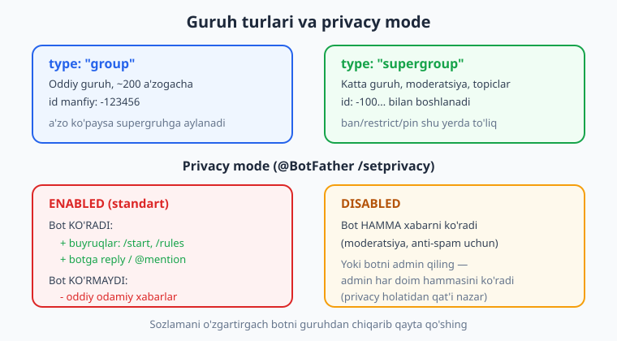
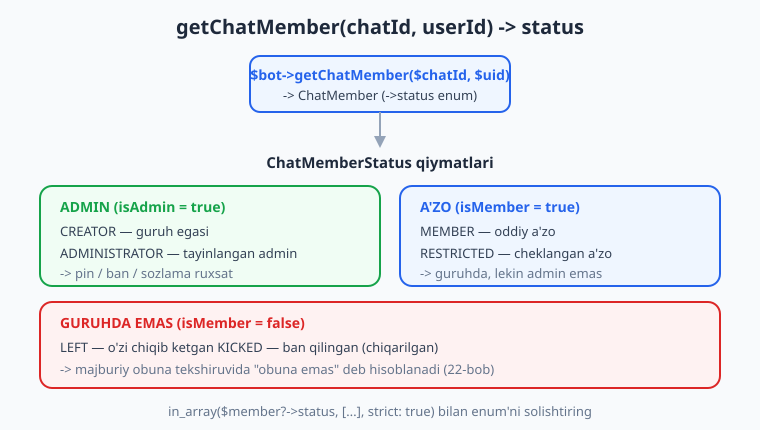
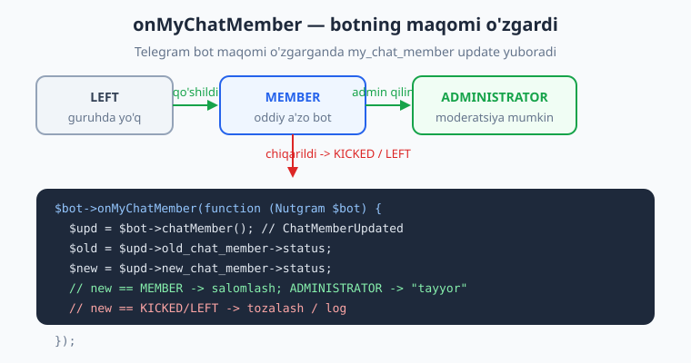

# 19 — Guruhlarda ishlash

[⬅️ Oldingi: 18 — Yakuniy kapston: to'liq bot](./18-kapston.md) · [🏠 README](./README.md) · [Keyingi: 20 — Guruh moderatsiyasi ➡️](./20-guruh-moderatsiya.md)

---

> **Bu bobda:** Hozirgacha botimiz asosan **shaxsiy chat**da (private) ishladi — bitta odam botga yozadi, bot javob beradi. Endi botni **guruh**ga olib chiqamiz. Avval **chat turlari**ni ajratamiz: `private`, `group`, `supergroup` (va keyingi boblarda `channel`) — ularning farqi va id'lari qanday. So'ng eng muhim, boshlovchini ko'p chalg'itadigan narsa — **privacy mode** (`@BotFather` `/setprivacy`): standart holatda bot guruhda HAR xabarni emas, faqat buyruq, reply va mention'larni ko'radi; nega ba'zan bot "indamay turadi" — javob shu yerda. Keyin **guruhga xos buyruqlar** yozamiz (`/rules`, `/id`) va ularni **chat turi bo'yicha filtr**laymiz, ya'ni shaxsiy chatda bir, guruhda boshqacha ishlaydi. Markaziy texnik mavzu — **`getChatMember($chatId, $userId)`**: u `ChatMember` qaytaradi, undagi **`->status`** (`ChatMemberStatus` enum: CREATOR, ADMINISTRATOR, MEMBER, RESTRICTED, LEFT, KICKED) orqali foydalanuvchi **a'zomi**, **adminmi** yoki **chiqib ketganmi** — buni biz qo'lda aniqlaymiz va admin-only buyruqlarni shunga qarab himoyalaymiz. Nihoyat **`onMyChatMember`** bilan bot guruhga **qo'shilgan / admin qilingan / chiqarilgan** lahzalarini ushlaymiz va guruh ichidagi bot huquqlarini tushunamiz. Ban/restrict/pin kabi haqiqiy moderatsiya amallari — keyingi, [20-bob](./20-guruh-moderatsiya.md)da.
>
> **Halol eslatma:** Bobning BARCHA mantig'i — chat-turi filtri (`isGroup`), a'zolik/admin tekshiruvi (`isMember`/`isAdmin` orqali `getChatMember` `status`'ini o'qish) va `onMyChatMember` routing'i — `Nutgram::fake()` (FakeNutgram) bilan tokensiz, tarmoqsiz **haqiqatan ishga tushirib tekshirilgan**: `getChatMember` javobini `willReceive([...])` bilan mock qilib, admin/a'zo/chiqqan tarmoqlarini sinadik — **9 ta PHPUnit testi, 16 ta assert, hammasi o'tdi** (Nutgram 4.46, PHP 8.4, PHPUnit 12). Jonli qism (bot guruhda real xabar yuborishi, real pin/ban, telefonda guruhga qo'shish) — **illustrativ** deb belgilangan; hech qayerda soxta "bot guruhga yozdi" yozilmagan.

---

## Chat turlari: private, group, supergroup

Har bir update'da bot qaysi **chat**dan kelganini biladi. `$bot->chat()` `Chat` obyektini qaytaradi, undagi `->type` esa `ChatType` enum (`SergiX44\Nutgram\Telegram\Properties\ChatType`):

| `type` | Nima | id ko'rinishi |
|---|---|---|
| `ChatType::PRIVATE` | Shaxsiy chat (bitta odam ↔ bot) | musbat, foydalanuvchi id'siga teng |
| `ChatType::GROUP` | Oddiy guruh (kichik, ~200 a'zogacha) | manfiy, masalan `-123456789` |
| `ChatType::SUPERGROUP` | Katta guruh (moderatsiya, topiclar) | `-100` bilan boshlanadi, masalan `-1001234567890` |
| `ChatType::CHANNEL` | Kanal (bir tomonlama) | `-100...` — [21-bob](./21-kanallar.md) |



Eng birinchi bilish kerak bo'lgan amaliy buyruq — **`/id`**: u joriy chatning turini va id'sini qaytaradi. Bu siz uchun keyinchalik (admin guruhini `.env`ga yozish, broadcast qilish) kerak bo'ladi:

```php
<?php
use SergiX44\Nutgram\Nutgram;
use SergiX44\Nutgram\Telegram\Properties\ChatType;

$bot->onCommand('id', function (Nutgram $bot) {
    $type = $bot->chat()?->type;
    // ChatType enum -> string qiymati ('private' / 'group' / 'supergroup')
    $typeStr = $type instanceof ChatType ? $type->value : (string) $type;

    $bot->sendMessage("Chat turi: {$typeStr}\nChat id: {$bot->chatId()}\nSizning id: {$bot->userId()}");
});
```

> **`group` → `supergroup`.** Telegram oddiy `group`ni, a'zo ko'paygach yoki admin sozlama o'zgartirgach, avtomatik `supergroup`ga **aylantiradi**. Bunda chat id ham o'zgaradi (`-123456` → `-100...`). Shu sababli guruh id'sini doim eng so'nggi update'dan oling, eskini "qotirib" saqlamang. Real moderatsiya (ban, restrict, pin, topiclar) faqat `supergroup`da to'liq ishlaydi.

> **PHP eslatma:** Bu bob siz PHP'ni bilasiz deb faraz qiladi — enum, `match`, `in_array`, null-safe `?->` ([../php/README.md](../php/README.md)). Biz Telegram/Nutgram'ga xos narsalarni tushuntiramiz, PHP asoslarini qayta o'rgatmaymiz.

---

## Privacy mode — nega bot guruhda "indamaydi"?

Bu — boshlovchilar duch keladigan eng katta "nega ishlamayapti" muammosi. Botni guruhga qo'shasiz, oddiy xabar yozasiz — bot javob bermaydi. Sabab: **privacy mode**.

Standart holatda (privacy **ENABLED**) bot guruhda **HAR** xabarni emas, faqat quyidagilarni **ko'radi**:

- **buyruqlar**: `/start`, `/rules` (va `/rules@mening_botim` ko'rinishi);
- botning xabariga **reply** qilingan xabarlar;
- bot **@mention** qilingan xabarlar;
- service xabarlar (a'zo qo'shildi/chiqdi, va h.k.).

Oddiy "salom hammaga" tipidagi xabarlarni bot **ko'rmaydi**. Bu — maxfiylik va samaradorlik uchun maxsus qilingan: aks holda har bir guruh xabari botga yuborilib, ortiqcha yuk va maxfiylik muammosi bo'lardi.

Privacy holatini `@BotFather` orqali o'zgartirasiz:

```text
@BotFather -> /setprivacy -> botni tanlang -> Disable yoki Enable

  Enable   (standart) — bot faqat buyruq/reply/mention'ni ko'radi
  Disable           — bot guruhdagi HAMMA xabarni ko'radi
```

Privacy'ni **Disable** qilish kerak bo'ladigan holatlar: anti-spam, har xabarni tekshiruvchi moderatsiya, kalit so'zga reaksiya. Aks holda **Enable** qoldiring — bu xavfsizroq va tezroq.

> **Muhim nozik nuqta:** privacy sozlamasini o'zgartirgach, u **eski guruhlarda** darhol kuchga kirmaydi — botni guruhdan **chiqarib, qayta qo'shish** kerak. Yana: agar bot guruhda **admin** bo'lsa, u privacy holatidan **qat'i nazar HAMMA xabarni** ko'radi. Ya'ni "botni admin qilish" ham privacy'ni amalda o'chiradi.

Privacy ENABLED bo'lsa ham buyruqlar har doim yetib keladi, shuning uchun guruh botini odatda **buyruqlar** asosida quramiz:

```php
<?php
use SergiX44\Nutgram\Nutgram;

// Privacy ENABLED bo'lsa ham bu yetib keladi (chunki bu buyruq):
$bot->onCommand('rules', function (Nutgram $bot) {
    $bot->sendMessage('Guruh qoidalari:\n1. Hurmatli bo\'ling.\n2. Spam yo\'q.');
});

// Bu esa privacy ENABLED holatda guruhda ODATDA yetib KELMAYDI
// (faqat botga reply / @mention bo'lsa keladi):
$bot->onText('/salom (.+)/', function (Nutgram $bot, string $kim) {
    $bot->sendMessage("Salom, {$kim}!");
});
```

> **Halol eslatma:** privacy mode'ni **kodda sinab bo'lmaydi** — u `@BotFather` sozlamasi va jonli Telegram serverida hal bo'ladi (Telegram qaysi update'ni botga yuborishini hal qiladi). Biz buni **illustrativ** deb belgilaymiz. Kodimiz esa to'g'ri: yetib kelgan har bir update'ni biz to'g'ri yo'naltiramiz — buni offline tekshiramiz.

---

## Buyruqni chat turiga qarab filtrlash

Bir xil buyruq shaxsiy chatda va guruhda turlicha ishlashi mumkin — yoki umuman faqat bittasida ishlashi kerak. Buni handler ichida **`$bot->chat()?->type`** ni tekshirib qilamiz. Avval qulay yordamchi:

```php
<?php
use SergiX44\Nutgram\Nutgram;
use SergiX44\Nutgram\Telegram\Properties\ChatType;

/** Joriy update guruh yoki supergruhdanmi? */
function isGroup(Nutgram $bot): bool
{
    $type = $bot->chat()?->type;
    return $type === ChatType::GROUP || $type === ChatType::SUPERGROUP;
}
```

Endi buyruqni guruhga "qulflaymiz":

```php
<?php
$bot->onCommand('rules', function (Nutgram $bot) {
    if (!isGroup($bot)) {
        $bot->sendMessage('Bu buyruq faqat guruhda ishlaydi. Botni guruhga qo\'shing.');
        return;
    }
    $bot->sendMessage('Guruh qoidalari: hurmatli bo\'ling, spam yo\'q.');
});
```

Yoki aksincha — buyruq faqat shaxsiy chatda ishlasin (masalan, sozlamalar menyusi):

```php
<?php
$bot->onCommand('sozlama', function (Nutgram $bot) {
    if (isGroup($bot)) {
        $bot->sendMessage('Sozlamalarni men bilan shaxsiy chatda o\'zgartiring.');
        return;
    }
    // ... shaxsiy chat menyusi
});
```

> **Middleware bilan ham bo'ladi.** Agar guruh-only filtrni ko'p handlerga qo'llamoqchi bo'lsangiz, [9-bobdagi](./09-middleware.md) middleware'ga ajrating: `$bot->middleware(function (Nutgram $bot, $next) { if (!isGroup($bot)) return; $next($bot); })` — yoki butun guruh handlerlarini `$bot->group(...)` ichiga oling. Bu bobda soddalik uchun handler ichida tekshiramiz.



---

## A'zolik va adminni tekshirish: `getChatMember`

Telegram bizga "bu odam guruh a'zosimi?" degan savolga to'g'ridan-to'g'ri javob beradigan flag bermaydi. Buning o'rniga **`getChatMember($chatId, $userId)`** ni chaqiramiz — u shu chatdagi shu foydalanuvchining `ChatMember` obyektini qaytaradi. Eng muhim maydon — **`->status`**, u `ChatMemberStatus` enum (`SergiX44\Nutgram\Telegram\Properties\ChatMemberStatus`):

| `ChatMemberStatus` | Ma'no | A'zomi? | Adminmi? |
|---|---|:---:|:---:|
| `CREATOR` | Guruh egasi (creator) | ✅ | ✅ |
| `ADMINISTRATOR` | Tayinlangan admin | ✅ | ✅ |
| `MEMBER` | Oddiy a'zo | ✅ | ❌ |
| `RESTRICTED` | Cheklangan a'zo (hali guruhda) | ✅ | ❌ |
| `LEFT` | Chiqib ketgan | ❌ | ❌ |
| `KICKED` | Ban qilingan (chiqarilgan) | ❌ | ❌ |

Buning ustiga ikkita yordamchi quramiz:

```php
<?php
use SergiX44\Nutgram\Nutgram;
use SergiX44\Nutgram\Telegram\Properties\ChatMemberStatus;

/** Foydalanuvchi guruhda admin (creator yoki administrator)mi? */
function isAdmin(Nutgram $bot, int $chatId, int $userId): bool
{
    $member = $bot->getChatMember($chatId, $userId);
    return in_array($member?->status, [
        ChatMemberStatus::CREATOR,
        ChatMemberStatus::ADMINISTRATOR,
    ], strict: true);
}

/** Foydalanuvchi guruhda (a'zo)mi — chiqib ketmaganmi/banlanmaganmi? */
function isMember(Nutgram $bot, int $chatId, int $userId): bool
{
    $member = $bot->getChatMember($chatId, $userId);
    return in_array($member?->status, [
        ChatMemberStatus::CREATOR,
        ChatMemberStatus::ADMINISTRATOR,
        ChatMemberStatus::MEMBER,
        ChatMemberStatus::RESTRICTED,
    ], strict: true);
}
```

`in_array(..., strict: true)` — enum'larni **qat'iy** (`===`) solishtiradi; bu enum bilan to'g'ri usul. `$member?->status` — null-safe: agar `getChatMember` `null` qaytarsa (xato), tekshiruv `false` bo'ladi.

### Admin-only buyruqni himoyalash

Endi guruhda faqat admin bajara oladigan buyruq yozamiz. `getChatMember` chaqiruvchini (`$bot->userId()`) o'sha guruhda (`$bot->chatId()`) tekshiradi:

```php
<?php
$bot->onCommand('pin', function (Nutgram $bot) {
    if (!isGroup($bot)) {
        $bot->sendMessage('Bu buyruq faqat guruhda ishlaydi.');
        return;
    }
    if (!isAdmin($bot, $bot->chatId(), $bot->userId())) {
        $bot->sendMessage('Faqat adminlar bu buyruqdan foydalanadi.');
        return;
    }
    // Haqiqiy pin amali — keyingi bobda; hozir illustrativ:
    $bot->sendMessage('Xabar mahkamlandi (illustrativ — real pin uchun bot admin bo\'lishi va pinMessage chaqirilishi kerak).');
});
```

> **Tezlik nuqtai nazaridan.** Har buyruqda `getChatMember` — bu alohida Telegram API so'rovi (tarmoq). Faol guruhda buni **cache**lash mantiqan to'g'ri: admin ro'yxati kam o'zgaradi, shuning uchun natijani qisqa muddatga (masalan, 5 daqiqa) saqlash mumkin — `$bot->setGlobalData($key, $val, ttl: 300)` (Nutgram'ning o'rnatilgan global storage'i, TTL bilan) yoki PSR-16 cache ([11-bob](./11-loyiha-tuzilishi.md)). Bu bobda biz har safar so'raymiz (soddalik uchun), lekin production'da cache'ni eslang.

> **`getChatMemberCount`.** A'zolar **soni** kerak bo'lsa, alohida metod bor: `$bot->getChatMemberCount($chatId)` — bitta son qaytaradi. Bu butun ro'yxatni olib bermaydi (Telegram botga to'liq a'zolar ro'yxatini bermaydi — faqat har bir a'zoni id bo'yicha alohida so'rash mumkin).

---

## Bot guruhga qo'shilganda: `onMyChatMember`

Botning guruhdagi **o'z maqomi** o'zgarganda (qo'shildi, admin qilindi, oddiy a'zoga tushirildi, chiqarildi) Telegram **`my_chat_member`** update yuboradi. Uni `onMyChatMember` bilan ushlaymiz. Bu — guruhga qo'shilganda salomlashish, sozlamalar yozish yoki "menga admin huquqi bering" deb so'rash uchun ideal joy.

Handler ichida `$bot->chatMember()` `ChatMemberUpdated` obyektini qaytaradi (u `my_chat_member`ni ham, `chat_member`ni ham qoplaydi). Undagi maydonlar:

- `->chat` — qaysi guruh (`Chat`);
- `->old_chat_member->status` — **oldingi** maqom;
- `->new_chat_member->status` — **yangi** maqom;
- `->from` — kim o'zgartirdi (odatda guruh admini).



```php
<?php
use SergiX44\Nutgram\Nutgram;
use SergiX44\Nutgram\Telegram\Properties\ChatMemberStatus;

$bot->onMyChatMember(function (Nutgram $bot) {
    $upd = $bot->chatMember();              // ChatMemberUpdated
    if ($upd === null) {
        return;
    }

    $newStatus = $upd->new_chat_member->status;
    // status string bo'lib kelgan ekstremal holatga moslab enum'ga keltiramiz:
    $newStatus = $newStatus instanceof ChatMemberStatus
        ? $newStatus
        : ChatMemberStatus::tryFrom((string) $newStatus);

    $chatId = $upd->chat->id;

    match (true) {
        // Botni guruhga oddiy a'zo qilib qo'shishdi:
        $newStatus === ChatMemberStatus::MEMBER => $bot->sendMessage(
            'Salom! Meni qo\'shganingiz uchun rahmat. /rules bilan qoidalarni ko\'ring.',
            chat_id: $chatId,
        ),
        // Botga admin huquqlari berildi:
        $newStatus === ChatMemberStatus::ADMINISTRATOR => $bot->sendMessage(
            'Admin huquqlari berildi. Endi guruhni moderatsiya qila olaman.',
            chat_id: $chatId,
        ),
        // Botni chiqarib yuborishdi / banlashdi — log/tozalash (xabar yuborib bo'lmaydi):
        in_array($newStatus, [ChatMemberStatus::LEFT, ChatMemberStatus::KICKED], true) => null,
        default => null,
    };
});
```

> **Nega `chat_id:` ni aniq beramiz?** `onMyChatMember` ichida joriy "javob beriladigan" chat har doim ham to'g'ri aniqlanmaydi (bu message emas, maqom o'zgarishi update'i). Shuning uchun `sendMessage(...)`da chatni **`$upd->chat->id`** dan aniq uzatamiz — bu ishonchli.

> **Foydalanuvchilar guruhga qo'shilganda?** `onMyChatMember` — botning O'ZI haqida. Boshqa **foydalanuvchilar**ning maqomi o'zgarishini kuzatish uchun `onChatMember` ishlatiladi (bot guruhda admin bo'lishi va Telegram'da `chat_member` update'i yoqilgan bo'lishi kerak). Yangi a'zoni kutib olish (welcome), ketganni kuzatish — [20-bobda](./20-guruh-moderatsiya.md).

---

## Bot guruh adminmi va qanday huquqlarga ega?

Bot guruhni moderatsiya qilishi (xabar o'chirish, pin, ban) uchun u **admin** bo'lishi va kerakli **huquqlar**ga ega bo'lishi shart. Buni botning o'zini `getChatMember`'da tekshirib bilamiz — qaytgan `ChatMemberAdministrator` obyektida `can_delete_messages`, `can_restrict_members`, `can_pin_messages` kabi `bool` maydonlar bor:

```php
<?php
use SergiX44\Nutgram\Nutgram;
use SergiX44\Nutgram\Telegram\Properties\ChatMemberStatus;
use SergiX44\Nutgram\Telegram\Types\Chat\ChatMemberAdministrator;

/** Botning o'zi guruhda restrict (ban/cheklash) qila oladimi? */
function botCanRestrict(Nutgram $bot, int $chatId): bool
{
    $botId  = $bot->getMe()?->id;            // botning user id'si
    $member = $bot->getChatMember($chatId, $botId);

    if ($member?->status !== ChatMemberStatus::ADMINISTRATOR) {
        return false;                         // umuman admin emas
    }
    // Admin bo'lsa ham, aniq huquq kerak:
    return $member instanceof ChatMemberAdministrator
        && $member->can_restrict_members === true;
}
```

`getChatMember` `ChatMember`ning aniq pastki turini qaytaradi: admin uchun — `ChatMemberAdministrator` (huquqlar maydonlari bilan), oddiy a'zo uchun — `ChatMemberMember`, va h.k. Shuning uchun huquqni o'qishdan oldin `instanceof ChatMemberAdministrator` bilan tekshiramiz.

> **Halol eslatma:** botning huquqlarini **jonli guruh** belgilaydi — uni `@BotFather`/Telegram admin paneli orqali berasiz. Bu yerdagi kod to'g'ri (`getChatMember` + `instanceof` + huquq maydoni), lekin **jonli ban/pin amallari** [20-bobning](./20-guruh-moderatsiya.md) mavzusi va ular real bot adminligini talab qiladi — **illustrativ**.

---

## Offline test: routing va a'zolik tekshiruvi (FakeNutgram)

Endi yuqoridagi mantiqning hammasini **tokensiz, tarmoqsiz** tekshiramiz. Hiyla: `getChatMember` ham Telegram API so'rovi — FakeNutgram'da uning javobini **`willReceive([...])`** bilan oldindan "qo'yamiz", guruh xabarini esa `hearMessage([... 'chat' => [...]])` bilan yuboramiz. `onMyChatMember` uchun `hearUpdateType(UpdateType::MY_CHAT_MEMBER, [...])`.

> **Muhim nozik nuqta (test).** Handler ichida avval `getChatMember` chaqirilsa, u FakeNutgram tarixida **0-o'rin**ni egallaydi, `sendMessage` esa **1-o'rin**da bo'ladi. Shuning uchun `assertReplyText('...', index: 1)` deb aniq indeks beramiz — aks holda assert `getChatMember`ni tekshirib, xato beradi. Bu ([16-bobdan](./16-testlash.md)) — har bir bot chaqiruvi tarixga yoziladi.

```php
<?php
namespace App\Tests;

use PHPUnit\Framework\TestCase;
use SergiX44\Nutgram\Nutgram;
use SergiX44\Nutgram\Telegram\Properties\UpdateType;

final class GroupTest extends TestCase
{
    private function bot(): Nutgram
    {
        $bot = Nutgram::fake();
        registerHandlers($bot);   // /id, /rules, /pin, onMyChatMember — yuqoridagi kod
        return $bot;
    }

    public function test_rules_guruhda_ishlaydi(): void
    {
        $bot = $this->bot();
        $bot->hearMessage([
            'text' => '/rules',
            'chat' => ['id' => -100123, 'type' => 'group', 'title' => 'Test'],
        ])->reply();
        $bot->assertReplyText('Guruh qoidalari: hurmatli bo\'ling.');
    }

    public function test_rules_shaxsiy_chatda_rad_etiladi(): void
    {
        $bot = $this->bot();
        $bot->hearMessage([
            'text' => '/rules',
            'chat' => ['id' => 555, 'type' => 'private'],
        ])->reply();
        $bot->assertReplyText('Bu buyruq faqat guruhda ishlaydi.');
    }

    public function test_pin_admin_uchun_ishlaydi(): void
    {
        $bot = $this->bot();
        // getChatMember -> administrator (mock):
        $bot->willReceive([
            'status' => 'administrator',
            'user' => ['id' => 42, 'is_bot' => false, 'first_name' => 'Ali'],
            'can_be_edited' => false, 'is_anonymous' => false,
            'can_manage_chat' => true, 'can_delete_messages' => true,
            'can_manage_video_chats' => true, 'can_restrict_members' => true,
            'can_promote_members' => false, 'can_change_info' => true,
            'can_invite_users' => true,
        ]);
        $bot->hearMessage([
            'from' => ['id' => 42, 'is_bot' => false, 'first_name' => 'Ali'],
            'text' => '/pin',
            'chat' => ['id' => -100123, 'type' => 'supergroup', 'title' => 'Test'],
        ])->reply();
        // 0 = getChatMember, 1 = sendMessage:
        $bot->assertReplyText('Xabar mahkamlandi (illustrativ).', index: 1);
    }

    public function test_pin_oddiy_azo_uchun_rad_etiladi(): void
    {
        $bot = $this->bot();
        $bot->willReceive([
            'status' => 'member',
            'user' => ['id' => 77, 'is_bot' => false, 'first_name' => 'Vali'],
        ]);
        $bot->hearMessage([
            'from' => ['id' => 77, 'is_bot' => false, 'first_name' => 'Vali'],
            'text' => '/pin',
            'chat' => ['id' => -100123, 'type' => 'supergroup', 'title' => 'Test'],
        ])->reply();
        $bot->assertReplyText('Faqat adminlar bu buyruqdan foydalanadi.', index: 1);
    }

    public function test_bot_guruhga_qoshilganda_salomlashadi(): void
    {
        $bot = $this->bot();
        $bot->hearUpdateType(UpdateType::MY_CHAT_MEMBER, [
            'chat' => ['id' => -100999, 'type' => 'supergroup', 'title' => 'Yangi guruh'],
            'from' => ['id' => 1, 'is_bot' => false, 'first_name' => 'Egasi'],
            'date' => 1703892479,
            'old_chat_member' => [
                'status' => 'left',
                'user' => ['id' => 9, 'is_bot' => true, 'first_name' => 'MyBot'],
            ],
            'new_chat_member' => [
                'status' => 'member',
                'user' => ['id' => 9, 'is_bot' => true, 'first_name' => 'MyBot'],
            ],
        ])->reply();
        $bot->assertReplyText('Salom! Meni qo\'shganingiz uchun rahmat. /rules bilan qoidalarni ko\'ring.');
    }
}
```

Probe muhitida (`Nutgram::fake()` + PHPUnit) ishga tushirdik:

```bash
php vendor/bin/phpunit --bootstrap vendor/autoload.php tests/GroupTest.php
```

```text
PHPUnit 12.5.29 by Sebastian Bergmann and contributors.
.........                                                           9 / 9 (100%)
Time: 00:00.071, Memory: 8.00 MB
OK (9 tests, 16 assertions)
```

Bu **haqiqiy** natija: chat-turi filtri, `getChatMember` status orqali admin/a'zo tekshiruvi va `onMyChatMember` routing'i tokensiz ishladi. Jonli qism (bot guruhda real xabar yuborishi, real pin/ban) — illustrativ.

---

## Mashqlar

### Oson

1. `/whereami` buyrug'i yozing: agar chat `private` bo'lsa "Siz men bilan shaxsiy chatdasiz", aks holda "Biz '{guruh nomi}' guruhidamiz" deb javob bersin (`$bot->chat()?->title`).
2. `isGroup($bot)` yordamchisini ishlating va `/kun` buyrug'ini faqat guruhda ishlaydigan qiling; shaxsiy chatda muloyim rad javobi bersin.
3. `ChatMemberStatus` enum qiymatlarini sanab bering: qaysilari "a'zo" deb hisoblanadi, qaysilari yo'q? Jadval ko'rinishida yozing.
4. Privacy mode ENABLED holatda guruhda bot **qaysi** xabarlarni ko'radi? 3 ta misol keltiring.
5. `getChatMemberCount($chatId)` bilan `/azolar` buyrug'ini yozing — guruhdagi a'zolar sonini qaytarsin.
6. `/id` buyrug'iga `$bot->userId()` ni ham qo'shing, shunda foydalanuvchi o'z Telegram id'sini ham ko'rsin.

### O'rta

1. `isAdmin($bot, $chatId, $userId)` yordamchisini yozing va `/eslatma <matn>` buyrug'ini faqat adminlar guruhga eslatma yuborishi mumkin qilib himoyalang.
2. `onMyChatMember` yozing: bot guruhga **admin** qilib qo'shilsa "Tayyorman", oddiy a'zo qilib qo'shilsa "Iltimos, meni admin qiling" desin (`new_chat_member->status` ni tekshiring).
3. FakeNutgram testi yozing: `/eslatma` ni oddiy a'zo yuborganda rad etilishini tekshiring (`willReceive(['status' => 'member', ...])` + `assertReplyText(..., index: 1)`).
4. `botCanRestrict($bot, $chatId)` ni `getMe()` va `instanceof ChatMemberAdministrator` bilan yozing; bot admin emas bo'lsa `false` qaytishini test qiling.
5. Chat turini `match` bilan ifodalaydigan `chatTuriNomi(ChatType $t): string` funksiyasi yozing (private → "Shaxsiy chat", group/supergroup → "Guruh", channel → "Kanal").
6. Admin tekshiruvini **middleware**ga ([9-bob](./09-middleware.md)) ajrating: faqat guruh adminlari o'tadigan `EnsureGroupAdmin` middleware yozing.

### Qiyin

1. **Admin cache:** `getChatMember` natijasini `setGlobalData`/`getGlobalData` (TTL bilan) yoki PSR-16 bilan 5 daqiqaga cache'lang, shunda har buyruqda tarmoqqa chiqilmasin. Kalitni `"admin:{$chatId}:{$userId}"` ko'rinishida tuzing. FakeNutgram bilan birinchi chaqiruv `getChatMember` qilishini, ikkinchisi cache'dan o'qishini tekshiring (`assertCalled('getChatMember', 1)`).
2. **onMyChatMember to'liq jurnal:** bot guruhga qo'shilgan/chiqarilgan har bir hodisani (`old → new` status, guruh nomi, kim o'zgartirdi) PDO jadvaliga ([10-bob](./10-malumotlar-bazasi.md)) yozadigan handler quring; `:memory:` SQLite bilan offline test yozing.
3. **`/admins` ro'yxati:** guruh adminlarini ko'rsatadigan buyruq yozing. Diqqat — Telegram botga to'liq adminlar ro'yxatini `getChatAdministrators` orqali beradi (alohida metod); uni nutgram.dev hujjatidan tekshirib, qaytgan massivni formatlang va FakeNutgram'da `willReceive([...])` bilan sinab ko'ring.

<details markdown="1">
<summary>Yechimlar</summary>

**Oson 1:**
```php
<?php
use SergiX44\Nutgram\Telegram\Properties\ChatType;

$bot->onCommand('whereami', function (\SergiX44\Nutgram\Nutgram $bot) {
    if ($bot->chat()?->type === ChatType::PRIVATE) {
        $bot->sendMessage('Siz men bilan shaxsiy chatdasiz.');
        return;
    }
    $bot->sendMessage("Biz '" . ($bot->chat()?->title ?? 'noma\'lum') . "' guruhidamiz.");
});
```

**Oson 2:** `isGroup` (matnda berilgan) bilan:
```php
<?php
$bot->onCommand('kun', function (\SergiX44\Nutgram\Nutgram $bot) {
    if (!isGroup($bot)) {
        $bot->sendMessage('Bu buyruq faqat guruhda ishlaydi.');
        return;
    }
    $bot->sendMessage('Bugun ' . date('d.m.Y') . '.');
});
```

**Oson 3:**

| Status | A'zomi? |
|---|:---:|
| CREATOR | ✅ |
| ADMINISTRATOR | ✅ |
| MEMBER | ✅ |
| RESTRICTED | ✅ (hali guruhda) |
| LEFT | ❌ (chiqib ketgan) |
| KICKED | ❌ (banlangan) |

**Oson 4:** Privacy ENABLED holatda bot ko'radi: (1) buyruqlar — `/start`, `/rules`; (2) botga reply qilingan xabar; (3) botni @mention qilgan xabar (yana service xabarlar — a'zo qo'shildi/chiqdi).

**Oson 5:**
```php
<?php
$bot->onCommand('azolar', function (\SergiX44\Nutgram\Nutgram $bot) {
    if (!isGroup($bot)) { $bot->sendMessage('Faqat guruhda.'); return; }
    $n = $bot->getChatMemberCount($bot->chatId());
    $bot->sendMessage("Guruhda {$n} ta a'zo bor.");
});
```

**Oson 6:**
```php
<?php
$bot->onCommand('id', function (\SergiX44\Nutgram\Nutgram $bot) {
    $t = $bot->chat()?->type;
    $ts = $t instanceof \SergiX44\Nutgram\Telegram\Properties\ChatType ? $t->value : (string) $t;
    $bot->sendMessage("Chat: {$ts} ({$bot->chatId()})\nSizning id: {$bot->userId()}");
});
```

**O'rta 1:** `isAdmin` matnda berilgan.
```php
<?php
$bot->onText('/eslatma (.+)/', function (\SergiX44\Nutgram\Nutgram $bot, string $matn) {
    if (!isGroup($bot)) { $bot->sendMessage('Faqat guruhda.'); return; }
    if (!isAdmin($bot, $bot->chatId(), $bot->userId())) {
        $bot->sendMessage('Faqat adminlar eslatma yubora oladi.');
        return;
    }
    $bot->sendMessage("📌 Eslatma: {$matn}");
});
```

**O'rta 2:**
```php
<?php
use SergiX44\Nutgram\Telegram\Properties\ChatMemberStatus;

$bot->onMyChatMember(function (\SergiX44\Nutgram\Nutgram $bot) {
    $upd = $bot->chatMember();
    if ($upd === null) return;
    $new = $upd->new_chat_member->status;
    $new = $new instanceof ChatMemberStatus ? $new : ChatMemberStatus::tryFrom((string) $new);
    if ($new === ChatMemberStatus::ADMINISTRATOR) {
        $bot->sendMessage('Tayyorman.', chat_id: $upd->chat->id);
    } elseif ($new === ChatMemberStatus::MEMBER) {
        $bot->sendMessage('Iltimos, meni admin qiling.', chat_id: $upd->chat->id);
    }
});
```

**O'rta 3:**
```php
<?php
public function test_eslatma_azo_uchun_rad_etiladi(): void
{
    $bot = Nutgram::fake();
    registerHandlers($bot);
    $bot->willReceive([
        'status' => 'member',
        'user' => ['id' => 77, 'is_bot' => false, 'first_name' => 'Vali'],
    ]);
    $bot->hearMessage([
        'from' => ['id' => 77, 'is_bot' => false, 'first_name' => 'Vali'],
        'text' => '/eslatma salom',
        'chat' => ['id' => -100123, 'type' => 'supergroup', 'title' => 'T'],
    ])->reply();
    $bot->assertReplyText('Faqat adminlar eslatma yubora oladi.', index: 1);
}
```

**O'rta 4:** `botCanRestrict` matnda berilgan. Test:
```php
<?php
public function test_bot_admin_emas_restrict_qila_olmaydi(): void
{
    $bot = Nutgram::fake();
    $bot->willReceive(['id' => 9, 'is_bot' => true, 'first_name' => 'MyBot']); // getMe
    $bot->willReceive([
        'status' => 'member',
        'user' => ['id' => 9, 'is_bot' => true, 'first_name' => 'MyBot'],
    ]); // getChatMember
    $this->assertFalse(botCanRestrict($bot, -100123));
}
```

**O'rta 5:**
```php
<?php
use SergiX44\Nutgram\Telegram\Properties\ChatType;

function chatTuriNomi(ChatType $t): string
{
    return match ($t) {
        ChatType::PRIVATE => 'Shaxsiy chat',
        ChatType::GROUP, ChatType::SUPERGROUP => 'Guruh',
        ChatType::CHANNEL => 'Kanal',
        default => 'Boshqa',
    };
}
```

**O'rta 6:**
```php
<?php
use SergiX44\Nutgram\Nutgram;

$ensureGroupAdmin = function (Nutgram $bot, $next) {
    if (!isGroup($bot)) { $bot->sendMessage('Faqat guruhda.'); return; }
    if (!isAdmin($bot, $bot->chatId(), $bot->userId())) {
        $bot->sendMessage('Faqat adminlar.');
        return;
    }
    $next($bot);
};

$bot->onCommand('eslatma', function (Nutgram $bot) {
    $bot->sendMessage('Eslatma yuborildi (admin tasdiqlandi).');
})->middleware($ensureGroupAdmin);
```

**Qiyin 1 (eskiz):**
```php
<?php
use SergiX44\Nutgram\Nutgram;
use SergiX44\Nutgram\Telegram\Properties\ChatMemberStatus;

function isAdminCached(Nutgram $bot, int $chatId, int $userId): bool
{
    $key = "admin:{$chatId}:{$userId}";
    $cached = $bot->getGlobalData($key);     // null bo'lsa hali cache'da yo'q
    if ($cached !== null) {
        return (bool) $cached;
    }
    $m = $bot->getChatMember($chatId, $userId);
    $isAdmin = in_array($m?->status, [ChatMemberStatus::CREATOR, ChatMemberStatus::ADMINISTRATOR], true);

    // TTL = 300 soniya (5 daqiqa) — keyin avtomatik eskiradi:
    $bot->setGlobalData($key, $isAdmin ? 1 : 0, ttl: 300);
    return $isAdmin;
}
```
Test: birinchi chaqiruvdan keyin `assertCalled('getChatMember', 1)`, ikkinchisi cache'dan kelishini tekshiring (yana 1 marta — jami 1).

**Qiyin 2 (eskiz):** `onMyChatMember` ichida `$upd->old_chat_member->status`, `$upd->new_chat_member->status`, `$upd->chat->title`, `$upd->from->id` ni oling va PDO `prepare(...)->execute([...])` bilan `bot_events` jadvaliga yozing. Test `:memory:` SQLite'da `hearUpdateType(UpdateType::MY_CHAT_MEMBER, [...])->reply()` dan keyin `SELECT COUNT(*)` ni tekshiradi.

**Qiyin 3 (eskiz):** Nutgram'da `$bot->getChatAdministrators($chatId)` — `ChatMember[]` qaytaradi (creator + adminlar). Har biridan `->user->first_name` va `->status` ni oling, ro'yxatni HTML formatda yuboring. FakeNutgram: `willReceive([['status' => 'creator', 'user' => [...]], ['status' => 'administrator', 'user' => [...]]])` (massivlar massivi) bilan mock qiling. Aniq imzoni nutgram.dev/docs dan tasdiqlang.

</details>

---

[⬅️ Oldingi: 18 — Yakuniy kapston: to'liq bot](./18-kapston.md) · [🏠 README](./README.md) · [Keyingi: 20 — Guruh moderatsiyasi ➡️](./20-guruh-moderatsiya.md)
