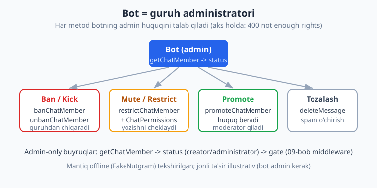
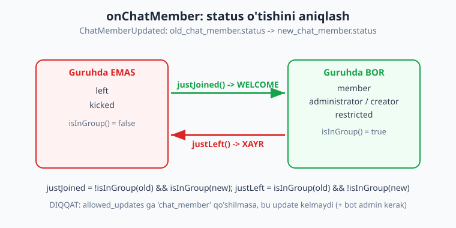
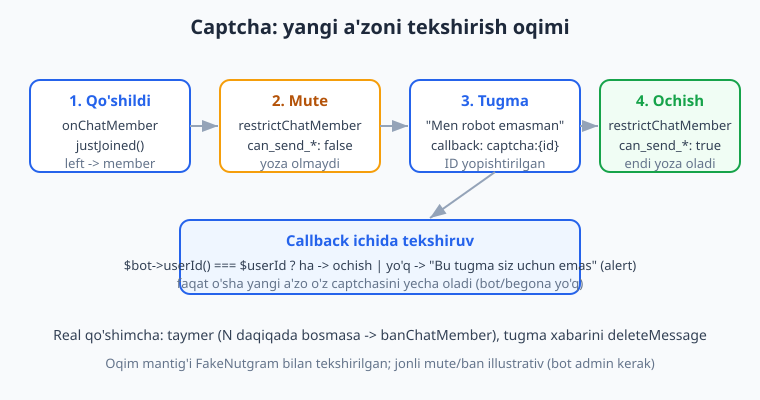

# 20 — Guruh moderatsiyasi

[⬅️ Oldingi: 19 — Guruhlarda ishlash](./19-guruhlar.md) · [🏠 README](./README.md) · [Keyingi: 21 — Kanallar bilan ishlash ➡️](./21-kanallar.md)

---

> **Bu bobda:** Botni guruh **moderatori** (admin) qilib, tartibni avtomatlashtirish. Quyidagilarni o'rganamiz: yangi a'zoni **`onChatMember`** orqali aniqlash (`ChatMemberUpdated`, `old_chat_member -> new_chat_member` status o'tishi) va **welcome** xabari; foydalanuvchi **chiqib ketishi** (member -> left/kicked); **ban / kick** (`banChatMember` / `unbanChatMember`); **mute / restrict** (`restrictChatMember` + `ChatPermissions` qurish); admin tayinlash (**`promoteChatMember`**); **admin-only buyruqlar** (filtr — `getChatMember` status'ini tekshiruvchi gate); oddiy **anti-spam** (middleware orqali, [09-bob](./09-middleware.md) asosida); va **captcha** (yangi a'zoni `restrictChatMember` bilan vaqtincha ovozsiz qilib, tugma bosgach huquqni qaytarish).
>
> Halol eslatma: bu bobdagi BARCHA **mantiq** — status o'tishini aniqlash (justJoined / justLeft), admin-gate (`getChatMember` javobini soxtalashtirib), `ChatPermissions` JSON qurilishi, anti-spam middleware va captcha callback oqimi — `Nutgram::fake()` (FakeNutgram) bilan **offline, tokensiz HAQIQATAN ishga tushirilib tekshirilgan** (16 tekshiruv, hammasi o'tdi). Jonli `banChatMember` / `restrictChatMember` / `promoteChatMember` esa **bot guruhda admin** bo'lishini va real Telegram'ni talab qiladi — bu qismlar **illustrativ** (kod to'g'ri, lekin "bot foydalanuvchini banladi" degan natijani faqat jonli muhitda ko'rasiz).

---

## Bot guruhda nima qila oladi?

Telegram'da botning guruhdagi imkoniyatlari uning **rolidan** kelib chiqadi. Oddiy a'zo bot faqat xabar o'qiy/yubora oladi. Lekin agar botni **admin** qilsangiz va kerakli huquqlarni bersangiz, u quyidagilarni qila oladi:

- **Ban / kick** — buzg'unchini guruhdan chiqarish (`banChatMember`);
- **Mute / restrict** — yozish huquqini cheklash (`restrictChatMember`);
- **Promote** — boshqa foydalanuvchini admin qilish (`promoteChatMember`);
- xabarlarni o'chirish (`deleteMessage`), taklif havolalari yaratish va h.k.

> **Eng muhim shart:** bu metodlarning hammasi bot **guruhda administrator** bo'lib, **mos huquqqa** ega bo'lishini talab qiladi (masalan, ban uchun "Ban users" huquqi). Aks holda Telegram `400 Bad Request: not enough rights` xatosini qaytaradi. Bu sabab jonli moderatsiya bu bobda illustrativ — lekin **mantiqni** (kimni qachon ban qilish, status'ni tekshirish, permissions qurish) to'liq offline tekshiramiz.



## Yangi a'zoni aniqlash: `onChatMember` va status o'tishi

Guruhda kimningdir holati o'zgarganda (qo'shildi, chiqdi, admin bo'ldi, banlandi) Telegram **`chat_member`** update yuboradi. Nutgram'da uni `onChatMember` bilan tutamiz. Bu update — `ChatMemberUpdated` turi:

- `$u->chat` — qaysi guruh;
- `$u->from` — o'zgarishni amalga oshirgan kishi (masalan, qo'shgan admin);
- `$u->old_chat_member` — **oldingi** holat (`->status`, `->user`);
- `$u->new_chat_member` — **yangi** holat.

Ya'ni "yangi a'zo qo'shildi" hodisasi — bu aslida **status o'tishi**: `left`/`kicked` (yoki yo'q edi) -> `member`. Aynan shu o'tishni aniqlash kerak, chunki bitta `chat_member` update turli sabablardan keladi (huquq o'zgardi, admin bo'ldi va h.k.).



```php
<?php
use SergiX44\Nutgram\Nutgram;
use SergiX44\Nutgram\Telegram\Properties\ChatMemberStatus;

// "Guruhda hisoblanadigan" statuslar
function isInGroup(string $status): bool
{
    return in_array($status, ['member', 'administrator', 'creator', 'restricted'], true);
}

// left/kicked -> member: foydalanuvchi endi qo'shildi
function justJoined(string $old, string $new): bool
{
    return !isInGroup($old) && isInGroup($new);
}

// member -> left/kicked: foydalanuvchi endi chiqdi
function justLeft(string $old, string $new): bool
{
    return isInGroup($old) && !isInGroup($new);
}

$bot->onChatMember(function (Nutgram $bot) {
    $u = $bot->chatMember();           // ChatMemberUpdated

    // status enum yoki string bo'lishi mumkin — value'ga keltiramiz
    $old = $u->old_chat_member->status;
    $new = $u->new_chat_member->status;
    $old = $old instanceof ChatMemberStatus ? $old->value : $old;
    $new = $new instanceof ChatMemberStatus ? $new->value : $new;

    if (justJoined($old, $new)) {
        $name = $u->new_chat_member->user->first_name ?? 'dost';
        $bot->sendMessage("Xush kelibsiz, {$name}! Guruh qoidalari bilan tanishing.",
            chat_id: $u->chat->id);
    }
});
```

> **DIQQAT (juda muhim):** `onChatMember` update'ini olish uchun ikki shart bor. (1) Bot guruhda **admin** bo'lishi kerak. (2) Botni ishga tushirishda `chat_member` update turini **aniq so'rab olish** kerak — Telegram uni standartda yubormaydi. Long-polling'da `getUpdates`'ning `allowed_updates` ga `chat_member` qo'shiladi; webhook'da esa `setWebhook(allowed_updates: [...])` da. Nutgram bilan: `$bot->run()` dan oldin `$bot->setWebhook(url: ..., allowed_updates: ['message', 'chat_member', 'callback_query', ...])`. Buni unutsangiz `onChatMember` **hech qachon ishlamaydi** — eng ko'p uchraydigan xato.

### `onChatMember` vs `onMyChatMember` vs servis xabarlari

Uchta o'xshash, lekin boshqacha hodisa bor — chalkashtirmang:

| Handler | Qachon | Misol |
|---|---|---|
| `onChatMember` | **Boshqa** foydalanuvchining holati o'zgardi | Kimdir qo'shildi/chiqdi, admin bo'ldi |
| `onMyChatMember` | **Botning o'zining** holati o'zgardi | Botni guruhga qo'shishdi yoki admin qilishdi |
| `onMessage` (`new_chat_members`) | "X joined the group" **servis xabari** | Eski uslubdagi qo'shilish xabari |

`onMyChatMember` — botni guruhga qo'shganda yoki admin qilganda ishlaydi. Bu yerda botning yangi guruhga qo'shilganini bilib, sozlamalarni boshlash mumkin:

```php
<?php
$bot->onMyChatMember(function (Nutgram $bot) {
    $u = $bot->myChatMember();
    $new = $u->new_chat_member->status;
    $new = $new instanceof ChatMemberStatus ? $new->value : $new;

    if ($new === 'administrator') {
        $bot->sendMessage('Rahmat! Endi men ushbu guruhni moderatsiya qila olaman.',
            chat_id: $u->chat->id);
    }
});
```

> **Eski usul (`new_chat_members`):** ko'p eski botlar yangi a'zoni `message`'dagi `new_chat_members` massivi orqali aniqlaydi. Bu hozir ham ishlaydi, lekin `onChatMember` aniqroq (chiqib ketish, ban, admin o'zgarishini ham qamraydi) va admin huquqini talab qiladi. Yangi loyihalarda `onChatMember` tavsiya etiladi.

## Welcome xabari va chiqib ketish

Yuqoridagi `justJoined` / `justLeft` mantig'ini birga ishlatamiz. FakeNutgram bilan ikkala tarmoq tekshirilgan: `left -> member` da welcome chiqdi, `member -> left` da xayrlashuv xabari:

```php
<?php
$bot->onChatMember(function (Nutgram $bot) {
    $u = $bot->chatMember();
    $old = $u->old_chat_member->status;
    $new = $u->new_chat_member->status;
    $old = $old instanceof ChatMemberStatus ? $old->value : $old;
    $new = $new instanceof ChatMemberStatus ? $new->value : $new;

    if (justJoined($old, $new)) {
        $name = $u->new_chat_member->user->first_name ?? 'dost';
        $bot->sendMessage("Xush kelibsiz, {$name}!", chat_id: $u->chat->id);
    } elseif (justLeft($old, $new)) {
        $bot->sendMessage('Foydalanuvchi guruhni tark etdi.', chat_id: $u->chat->id);
    }
});
```

> **Maslahat:** welcome xabarini bir necha soniyadan keyin **o'chirib** tashlash (`deleteMessage`) guruhni toza saqlaydi — aks holda 100 ta "Xush kelibsiz" guruhni to'ldiradi. Yana bir naqsh: yangi a'zoni darhol **captcha** bilan tekshirish (pastda).

## Ban va kick: `banChatMember` / `unbanChatMember`

**Ban** — foydalanuvchini guruhdan chiqarib, qaytib kirishini taqiqlash. **Kick** — chiqarish, lekin qaytib kira olishi (Telegram'da alohida "kick" metodi yo'q: kick = ban, so'ng darhol unban).

```php
<?php
// BAN — butunlay (yoki until_date gacha)
$bot->banChatMember(
    chat_id: $chatId,
    user_id: $userId,
    until_date: time() + 86400,   // 1 kunga (ixtiyoriy; 30 soniya..366 kun oralig'ida)
    revoke_messages: true,        // uning barcha xabarlarini ham o'chir
);

// KICK = ban + darhol unban (qaytib kira oladi)
$bot->banChatMember(chat_id: $chatId, user_id: $userId);
$bot->unbanChatMember(chat_id: $chatId, user_id: $userId, only_if_banned: true);
```

> **Nozik nuqtalar:** `until_date` — bu **vaqtinchalik** ban (mute emas — odam guruhdan chiqariladi). 30 soniyadan kam yoki 366 kundan ko'p qiymat — "abadiy" hisoblanadi. `revoke_messages: true` — spam botlarda foydali (ortidagi xabarlarni ham tozalaydi). `only_if_banned: true` — agar odam banlanmagan bo'lsa, unban hech narsa qilmaydi (kerakmas chiqarib yubormaydi).

Bu metodlar jonli bot admin bo'lganda ishlaydi — shu sabab **jonli ban illustrativ**. Lekin metodning haqiqatan to'g'ri parametrlar bilan **chaqirilishini** FakeNutgram'da `assertCalled` / `assertRaw` bilan tekshirsa bo'ladi (pastdagi mute misolida ko'rsatamiz).

## Mute / restrict: `restrictChatMember` + `ChatPermissions`

**Mute** — foydalanuvchini guruhdan chiqarmasdan, **yozishni** taqiqlash. Buni `restrictChatMember` qiladi: unga yangi `ChatPermissions` (ruxsatlar to'plami) beriladi. Mute = barcha `can_send_*` ni `false` qilish. Unmute = hammasini `true` qaytarish.

`ChatPermissions::make(...)` named-argumentlar bilan quriladi:

```php
<?php
use SergiX44\Nutgram\Telegram\Types\Chat\ChatPermissions;

// MUTE — hamma yuborish huquqlari o'chiq
$mute = ChatPermissions::make(
    can_send_messages: false,
    can_send_audios: false,
    can_send_documents: false,
    can_send_photos: false,
    can_send_videos: false,
    can_send_video_notes: false,
    can_send_voice_notes: false,
    can_send_polls: false,
    can_send_other_messages: false,     // stiker/gif/inline
    can_add_web_page_previews: false,
);

// 1 soatlik mute:
$bot->restrictChatMember(
    chat_id: $chatId,
    user_id: $userId,
    permissions: $mute,
    until_date: time() + 3600,   // soat o'tib avtomatik tiklanadi
);
```

Tiklash (**unmute**) — barcha huquqlarni `true` qilib qayta `restrictChatMember`:

```php
<?php
$open = ChatPermissions::make(
    can_send_messages: true,
    can_send_audios: true,
    can_send_documents: true,
    can_send_photos: true,
    can_send_videos: true,
    can_send_video_notes: true,
    can_send_voice_notes: true,
    can_send_polls: true,
    can_send_other_messages: true,
    can_add_web_page_previews: true,
);
$bot->restrictChatMember(chat_id: $chatId, user_id: $userId, permissions: $open);
```

> **Ban vs Mute farqi:** ban — odamni **chiqaradi**; mute (restrict) — odam guruhda **qoladi**, lekin yoza olmaydi. Janjalda odatda avval mute, keyin kerak bo'lsa ban qilinadi. `until_date` mute uchun ham ishlaydi — vaqt o'tib huquq avtomatik tiklanadi.

`ChatPermissions` JSON-ga to'g'ri serializatsiya bo'lishi va `restrictChatMember` aynan shu parametr bilan chaqirilishi FakeNutgram bilan tekshirilgan:

```php
<?php
$bot = Nutgram::fake();
$bot->willReceive(true); // restrictChatMember -> true qaytaradi
$bot->onCommand('mute', function (Nutgram $bot) use ($mute) {
    $bot->restrictChatMember(chat_id: -100123, user_id: 77,
        permissions: $mute, until_date: time() + 3600);
    $bot->sendMessage('1 soatga ovozsiz qilindi.');
});

$bot->hearMessage(['text' => '/mute', 'from' => ['id' => 50],
    'chat' => ['id' => -100123, 'type' => 'supergroup']])->reply();

$bot->assertReply('restrictChatMember', index: 0);   // metod chaqirildi
$bot->assertRaw(fn ($r) =>
    str_contains((string) $r->getBody(), 'can_send_messages'), index: 0); // ✓
```

## Promote: `promoteChatMember`

Foydalanuvchini admin qilish (yoki demote qilish — barcha huquqni `false` berib). Har bir huquq alohida boshqariladi:

```php
<?php
// X foydalanuvchini "moderator" qilamiz: faqat ban va xabar o'chirish
$bot->promoteChatMember(
    chat_id: $chatId,
    user_id: $userId,
    can_delete_messages: true,
    can_restrict_members: true,   // ban/mute qila oladi
    can_invite_users: true,
    can_pin_messages: true,
    // qolganlari null -> berilmaydi (masalan can_promote_members)
);

// DEMOTE — barcha bool'larni false bering:
$bot->promoteChatMember(chat_id: $chatId, user_id: $userId,
    can_change_info: false, can_delete_messages: false,
    can_restrict_members: false, can_invite_users: false,
    can_pin_messages: false, can_promote_members: false);
```

> **Maslahat:** `can_promote_members: true` bermaslikka harakat qiling — aks holda u admin yana boshqalarni admin qila oladi va nazorat tarqaladi. Odatda moderatorlarga faqat `can_delete_messages` + `can_restrict_members` kifoya. Eslatma: bot faqat **o'zi bergan** huquqlar doirasida promote qila oladi.

## Admin-only buyruqlar: `getChatMember` gate

`/ban`, `/mute` kabi buyruqlarni faqat **guruh adminlari** ishlatishi kerak. Buni [09-bobdagi](./09-middleware.md) middleware-gate naqshi bilan qilamiz: middleware'da `getChatMember` orqali buyruqni yozgan odamning **statusini** olamiz, agar `administrator`/`creator` bo'lmasa — short-circuit.

> **Diqqat — bu `getChatMember`:** bu yerdagi gate guruhdagi **real admin**larni tekshiradi (botni admin qilgan guruh egasi/adminlari), [09-bobdagi](./09-middleware.md) qotirilgan ID ro'yxati emas. Bu moslashuvchanroq — har guruhda o'z adminlari bo'ladi.

```php
<?php
use SergiX44\Nutgram\Nutgram;
use SergiX44\Nutgram\Telegram\Properties\ChatMemberStatus;

$adminGate = function (Nutgram $bot, $next) {
    $member = $bot->getChatMember($bot->chatId(), $bot->userId());
    $status = $member?->status;
    $status = $status instanceof ChatMemberStatus ? $status->value : $status;

    if (!in_array($status, ['administrator', 'creator'], true)) {
        $bot->sendMessage('Bu buyruq faqat adminlar uchun.');
        return; // short-circuit — handler ishlamaydi
    }
    $next($bot);
};

// Faqat adminlar uchun moderatsiya buyruqlari:
$bot->group(function (Nutgram $bot) {
    $bot->onCommand('ban', fn (Nutgram $bot) => $bot->sendMessage('Foydalanuvchi banlandi.'));
    $bot->onCommand('mute', fn (Nutgram $bot) => $bot->sendMessage('Foydalanuvchi ovozsiz qilindi.'));
})->middleware($adminGate);
```

FakeNutgram'da `getChatMember` javobini soxtalashtirib, ikkala tarmoq tekshirilgan — admin (`creator`) o'tdi, oddiy a'zo rad etildi:

```php
<?php
// Admin tarmoq: getChatMember "creator" qaytaradi
$bot = Nutgram::fake();
$bot->willReceive(['status' => 'creator', 'is_anonymous' => false,
    'user' => ['id' => 50, 'is_bot' => false, 'first_name' => 'Ali']]);
$bot->onCommand('ban', fn (Nutgram $bot) => $bot->sendMessage('Foydalanuvchi banlandi.'))
    ->middleware($adminGate);
$bot->hearMessage(['text' => '/ban', 'from' => ['id' => 50],
    'chat' => ['id' => -100123, 'type' => 'supergroup']])->reply();
$bot->assertReplyText('Foydalanuvchi banlandi.', index: 1);  // index 0 = getChatMember

// Oddiy a'zo tarmoq: "member" -> rad
$bot = Nutgram::fake();
$bot->willReceive(['status' => 'member',
    'user' => ['id' => 99, 'is_bot' => false, 'first_name' => 'Guest']]);
$bot->onCommand('ban', fn (Nutgram $bot) => $bot->sendMessage('Foydalanuvchi banlandi.'))
    ->middleware($adminGate);
$bot->hearMessage(['text' => '/ban', 'from' => ['id' => 99],
    'chat' => ['id' => -100123, 'type' => 'supergroup']])->reply();
$bot->assertReplyText('Bu buyruq faqat adminlar uchun.', index: 1);
```

> **Testdagi nozik nuqta:** `willReceive(...)` faqat **result** qismini oladi — Nutgram uni o'zi `{ok, result}` ga o'raydi. `creator` statusi `ChatMemberOwner` turiga hidratsiya bo'ladi, shuning uchun `is_anonymous` maydoni majburiy. (`administrator` esa `can_be_edited` va h.k. ni talab qilgani uchun, testda `creator` soddaroq.) `index: 0` — birinchi so'rov `getChatMember`, `index: 1` — keyingi `sendMessage`.

> **Kimni ban qilish?** Buyruqqa **reply** qilib `/ban` yozish odatiy: ban qilinadigan odam — `$bot->message()->reply_to_message?->from?->id`. Yana `getChatMember` bilan **botning o'zining** huquqini ham oldindan tekshirish foydali (bot ban qila oladimi?).

## Anti-spam (oddiy)

Eng oddiy himoya — guruhdagi har bir matnli xabarni tekshiruvchi **middleware** ([09-bob](./09-middleware.md)). Misol: havola yoki `@username` reklamasini bloklash. Jonli holatda bu yerda xabar o'chiriladi va kerak bo'lsa muallif mute qilinadi; bu yerda mantiqni ko'rsatamiz:

```php
<?php
$antiSpam = function (Nutgram $bot, $next) {
    $text = $bot->message()?->text ?? '';

    // havola / t.me / @kanal naqshi
    if (preg_match('#https?://|t\.me/|@\w{5,}#i', $text)) {
        $msg = $bot->message();
        // JONLI: $bot->deleteMessage($msg->chat->id, $msg->message_id);
        $bot->sendMessage('Reklama/havola taqiqlangan.');
        return; // short-circuit
    }
    $next($bot);
};

$bot->group(function (Nutgram $bot) {
    $bot->onText('.*', fn (Nutgram $bot) => $bot->sendMessage('xabar qabul qilindi'));
})->middleware($antiSpam);
```

FakeNutgram bilan tekshirilgan: oddiy xabar o'tdi (`xabar qabul qilindi`), havolali xabar bloklandi (`Reklama/havola taqiqlangan.`).

> **Real anti-spam haqida rost gap:** regex bilan havola tutish — boshlang'ich qatlam, uni aldash oson (`example dot com`, zero-width belgilar). Jiddiy guruhlar uchun: yangi a'zolarga vaqtinchalik cheklov, captcha (pastda), [09-bobdagi](./09-middleware.md) `RateLimit` (flood), va shubhali xabarlarni **o'chirish + ogohlantirish hisoblagichi** (3 ogohlantirish -> ban). Murakkab antispam alohida xizmatga (yoki @tg adminlar guruhlarining tayyor botlariga) aylanadi.

## Captcha: yangi a'zoni tekshirish

Spam-botlarga qarshi eng kuchli usul — yangi a'zo qo'shilganda uni **darhol mute** qilib (`restrictChatMember`, hamma huquq `false`), "Men robot emasman" tugmasini ko'rsatish. Tugmani bosgach — huquqni qaytaramiz. Bot (odam emas) tugmani bosa olmaydi.



**1-qadam — yangi a'zoni mute qilib, tugma ko'rsatamiz** (`onChatMember` ichida):

```php
<?php
use SergiX44\Nutgram\Telegram\Types\Chat\ChatPermissions;
use SergiX44\Nutgram\Telegram\Types\Keyboard\InlineKeyboardButton;
use SergiX44\Nutgram\Telegram\Types\Keyboard\InlineKeyboardMarkup;

$bot->onChatMember(function (Nutgram $bot) {
    $u = $bot->chatMember();
    $old = $u->old_chat_member->status;
    $new = $u->new_chat_member->status;
    $old = $old instanceof ChatMemberStatus ? $old->value : $old;
    $new = $new instanceof ChatMemberStatus ? $new->value : $new;
    if (!justJoined($old, $new)) {
        return;
    }

    $userId = $u->new_chat_member->user->id;
    $chatId = $u->chat->id;

    // mute: hamma yuborish huquqi false
    $bot->restrictChatMember(chat_id: $chatId, user_id: $userId,
        permissions: ChatPermissions::make(can_send_messages: false));

    // tugmaga foydalanuvchi ID'sini "yopishtiramiz" — faqat o'zi bosa olsin
    $kb = InlineKeyboardMarkup::make()->addRow(
        InlineKeyboardButton::make('Men robot emasman', callback_data: "captcha:{$userId}")
    );
    $name = $u->new_chat_member->user->first_name ?? 'dost';
    $bot->sendMessage("{$name}, davom etish uchun tugmani bosing.",
        chat_id: $chatId, reply_markup: $kb);
});
```

**2-qadam — tugma bosilganda huquqni qaytaramiz** (`onCallbackQueryData`):

```php
<?php
$bot->onCallbackQueryData('captcha:{userId}', function (Nutgram $bot, int $userId) {
    // boshqa odam (yoki bot) tugmasini bosa olmasin:
    if ($bot->userId() !== $userId) {
        $bot->answerCallbackQuery(text: 'Bu tugma siz uchun emas.', show_alert: true);
        return;
    }

    // to'g'ri foydalanuvchi -> to'liq huquqni qaytaramiz
    $open = ChatPermissions::make(
        can_send_messages: true, can_send_audios: true, can_send_documents: true,
        can_send_photos: true, can_send_videos: true, can_send_video_notes: true,
        can_send_voice_notes: true, can_send_polls: true, can_send_other_messages: true,
        can_add_web_page_previews: true,
    );
    $bot->restrictChatMember(chat_id: $bot->chatId(), user_id: $userId, permissions: $open);
    $bot->answerCallbackQuery(text: 'Tasdiqlandi! Endi yoza olasiz.');
});
```

FakeNutgram bilan ikkala tarmoq tekshirilgan: to'g'ri foydalanuvchi (`captcha:77` ni `id=77` bosdi) -> `restrictChatMember` chaqirildi (ochildi); begona (`id=999`) -> "Bu tugma siz uchun emas." alert.

> **`captcha:{userId}` naqshi:** `onCallbackQueryData` da `{userId}` — bu **placeholder**, Nutgram callback ma'lumotidan qiymatni ajratib, handlerga **int parametr** sifatida uzatadi ([07-bobga](./07-callback-inline.md) qarang). Tugmaga ID yopishtirishimiz sababi — faqat o'sha yangi a'zo o'z captchasini yecha olsin, boshqalar emas.
>
> **Real captcha uchun yana ikki narsa:** (1) **taymer** — agar N daqiqada bosmasa, `banChatMember` qilib chiqarish (cron yoki [15-bobdagi](./15-rejalashtirilgan-broadcast.md) rejalashtirilgan vazifa); (2) tugma bosilgach captcha xabarini `deleteMessage` bilan tozalash. Bu qismlar jonli muhitni talab qiladi.

## Bobni qanday tekshirdik (halol eslatma)

Quyidagilar `Nutgram::fake()` (FakeNutgram) bilan offline, tokensiz **HAQIQATAN ishga tushirilib** tasdiqlandi (16/16 o'tdi):

- `justJoined` / `justLeft` status-o'tish mantig'i (left->member, member->left/kicked va h.k.);
- `onChatMember` welcome (left->member) va chiqib ketish (member->left);
- admin-gate (`getChatMember` javobini `willReceive` bilan soxtalashtirib): admin o'tdi, oddiy a'zo rad etildi;
- `ChatPermissions::make(...)` mute (hamma false) va unmute (hamma true) JSON serializatsiyasi;
- `restrictChatMember` aynan `permissions` bilan chaqirilishi (`assertRaw`);
- anti-spam middleware (havola bloklandi, oddiy xabar o'tdi);
- captcha callback oqimi (to'g'ri user -> restrict ochildi; begona -> alert).

**Illustrativ** (jonli Telegram + bot admin kerak, kod to'g'ri lekin natija faqat jonli ko'rinadi): real `banChatMember` / `unbanChatMember` / `restrictChatMember` / `promoteChatMember` / `deleteMessage` ta'siri, real `chat_member` update kelishi (`allowed_updates` sozlangan jonli bot), captcha taymeri bilan avto-ban.

## Mashqlar

### Oson

1. `isInGroup(string $status): bool` funksiyasini yozing va `member`, `administrator`, `creator`, `restricted` -> `true`; `left`, `kicked` -> `false` ekanini `assert` bilan tekshiring.
2. `onChatMember` handleri yozing: yangi a'zo (`justJoined`) qo'shilganda uning `first_name` bilan welcome yuborsin. FakeNutgram'da `hearUpdateType(UpdateType::CHAT_MEMBER, [...])` (`old=left`, `new=member`) bilan tekshiring.
3. Yuqoridagi handlerga chiqib ketish tarmog'ini qo'shing (`member -> left` -> "tark etdi"). Ikkala holatni alohida tekshiring.
4. `ChatPermissions::make(...)` bilan **mute** (hamma `can_send_*` false) obyektini yarating va `json_encode` qilib, `can_send_messages` qiymati `false` ekanini tekshiring.
5. `banChatMember` chaqirig'ini `until_date: time() + 3600` bilan yozing (1 soatlik ban). Nega bu mute emas, balki vaqtinchalik **chiqarish** ekanini bir jumlada izohlang.
6. `onMyChatMember` handleri yozing: agar bot `administrator` qilingan bo'lsa, guruhga "Rahmat, endi moderatsiya qila olaman" yuborsin.

### O'rta

1. `adminGate` middleware yozing (`getChatMember` -> status). Uni `/ban` va `/mute` ni o'rab turgan `group(...)` ga biriktiring. FakeNutgram'da `willReceive(['status' => 'creator', 'is_anonymous' => false, 'user' => [...]])` bilan admin tarmog'ini va `'member'` bilan rad tarmog'ini tekshiring.
2. Anti-spam middleware yozing: matnda `https://` yoki `t.me/` bo'lsa short-circuit qilib "Havola taqiqlangan" yuborsin. Oddiy va havolali xabar bilan ikki holatni tekshiring.
3. `/mute` buyrug'i yozing: reply qilingan odamni 1 soatga mute qilsin (`restrictChatMember` + `ChatPermissions` hamma false + `until_date`). FakeNutgram'da `willReceive(true)` qo'yib, `assertReply('restrictChatMember')` bilan chaqiruvni tasdiqlang.
4. `/unmute` buyrug'i: barcha huquqni `true` qaytaruvchi `ChatPermissions` bilan `restrictChatMember` chaqiring. Mute va unmute uchun bitta yordamchi funksiya (`mutePerms()` / `openPerms()`) yozing.
5. `/promote` buyrug'i: reply qilingan odamga `can_delete_messages` va `can_restrict_members` huquqlarini bersin (moderator). `assertRaw` bilan body'da `can_restrict_members` borligini tekshiring.
6. Welcome xabarini ID bilan "yopishtirilgan" tugma bilan yuboring (`captcha:{userId}`). `onCallbackQueryData('captcha:{userId}', ...)` da `$bot->userId() !== $userId` bo'lsa "siz uchun emas" alert qaytarishini tekshiring.

### Qiyin

1. **To'liq captcha oqimi:** `onChatMember` (justJoined -> mute + tugma) va `onCallbackQueryData('captcha:{userId}', ...)` (to'g'ri user -> ochish, begona -> alert) ni birga yozing. FakeNutgram'da: (a) yangi a'zo update -> `restrictChatMember(can_send_messages: false)` chaqirilishini, (b) to'g'ri user callback -> `restrictChatMember` (ochish) chaqirilishini, (c) begona user -> alert qaytarilishini — uchchala holatni tasdiqlang.
2. **Ogohlantirish hisoblagichi:** anti-spam'ni kengaytiring — har spam uchun foydalanuvchining `getUserData('warns')` ni oshiring; 3 ga yetganda `banChatMember` chaqiring (FakeNutgram: `willReceive(true)`). Birinchi 2 spam -> ogohlantirish, 3-chi -> `assertCalled('banChatMember')`.
3. **Botning o'z huquqini tekshirish:** `/ban` dan oldin `getChatMember(chatId, BOT_ID)` bilan botning statusi `administrator` ekanini va `can_restrict_members` bo'lishini tekshiruvchi gate yozing. Bot admin emas tarmog'ida "Avval meni admin qiling" yuborsin. (`willReceive` bilan bot statusini soxtalashtiring.)
4. **Reply orqali ban:** `/ban` reply qilingan xabarga ishlashi kerak. `$bot->message()->reply_to_message?->from?->id` dan maqsad ID'ni oling; agar reply yo'q bo'lsa "Ban qilish uchun xabarga reply qiling" deb javob bering. Ikkala holatni FakeNutgram'da `hearMessage` ichida `reply_to_message` berib (va bermay) tekshiring.

<details markdown="1"><summary>Yechimlar</summary>

**Oson 1.**
```php
<?php
function isInGroup(string $status): bool
{
    return in_array($status, ['member', 'administrator', 'creator', 'restricted'], true);
}
assert(isInGroup('member') === true);
assert(isInGroup('administrator') === true);
assert(isInGroup('creator') === true);
assert(isInGroup('restricted') === true);
assert(isInGroup('left') === false);
assert(isInGroup('kicked') === false);
```

**Oson 2–3.**
```php
<?php
use SergiX44\Nutgram\Nutgram;
use SergiX44\Nutgram\Telegram\Properties\ChatMemberStatus;
use SergiX44\Nutgram\Telegram\Properties\UpdateType;

function justJoined(string $o, string $n): bool { return !isInGroup($o) && isInGroup($n); }
function justLeft(string $o, string $n): bool { return isInGroup($o) && !isInGroup($n); }

$bot = Nutgram::fake();
$bot->onChatMember(function (Nutgram $bot) {
    $u = $bot->chatMember();
    $o = $u->old_chat_member->status; $o = $o instanceof ChatMemberStatus ? $o->value : $o;
    $n = $u->new_chat_member->status; $n = $n instanceof ChatMemberStatus ? $n->value : $n;
    if (justJoined($o, $n)) {
        $bot->sendMessage('Xush kelibsiz, ' . ($u->new_chat_member->user->first_name ?? 'dost') . '!',
            chat_id: $u->chat->id);
    } elseif (justLeft($o, $n)) {
        $bot->sendMessage('tark etdi', chat_id: $u->chat->id);
    }
});

$join = [
    'chat' => ['id' => -1, 'type' => 'supergroup'],
    'from' => ['id' => 1, 'first_name' => 'A'],
    'date' => time(),
    'old_chat_member' => ['status' => 'left', 'user' => ['id' => 9, 'is_bot' => false, 'first_name' => 'Vali']],
    'new_chat_member' => ['status' => 'member', 'user' => ['id' => 9, 'is_bot' => false, 'first_name' => 'Vali']],
];
$bot->hearUpdateType(UpdateType::CHAT_MEMBER, $join)->reply();
$bot->assertReplyText('Xush kelibsiz, Vali!');

$leave = $join;
$leave['old_chat_member']['status'] = 'member';
$leave['new_chat_member']['status'] = 'left';
$bot->hearUpdateType(UpdateType::CHAT_MEMBER, $leave)->reply();
$bot->assertReplyText('tark etdi');
```

**Oson 4.**
```php
<?php
use SergiX44\Nutgram\Telegram\Types\Chat\ChatPermissions;
$mute = ChatPermissions::make(
    can_send_messages: false, can_send_audios: false, can_send_documents: false,
    can_send_photos: false, can_send_videos: false, can_send_video_notes: false,
    can_send_voice_notes: false, can_send_polls: false, can_send_other_messages: false,
    can_add_web_page_previews: false,
);
$j = json_decode(json_encode($mute), true);
assert($j['can_send_messages'] === false);
```

**Oson 5.** `banChatMember(..., until_date: time() + 3600)` — odam **guruhdan chiqariladi** va 1 soatdan keyin avtomatik banlanish tugaydi (qaytib kira oladi). Mute esa odamni guruhda qoldirib, faqat yozishini taqiqlaydi (`restrictChatMember`).

**Oson 6.**
```php
<?php
use SergiX44\Nutgram\Nutgram;
use SergiX44\Nutgram\Telegram\Properties\ChatMemberStatus;
$bot->onMyChatMember(function (Nutgram $bot) {
    $u = $bot->myChatMember();
    $n = $u->new_chat_member->status; $n = $n instanceof ChatMemberStatus ? $n->value : $n;
    if ($n === 'administrator') {
        $bot->sendMessage('Rahmat, endi moderatsiya qila olaman', chat_id: $u->chat->id);
    }
});
```

**O'rta 1.**
```php
<?php
use SergiX44\Nutgram\Nutgram;
use SergiX44\Nutgram\Telegram\Properties\ChatMemberStatus;

$adminGate = function (Nutgram $bot, $next) {
    $m = $bot->getChatMember($bot->chatId(), $bot->userId());
    $s = $m?->status; $s = $s instanceof ChatMemberStatus ? $s->value : $s;
    if (!in_array($s, ['administrator', 'creator'], true)) {
        $bot->sendMessage('Faqat adminlar uchun.');
        return;
    }
    $next($bot);
};

$bot = Nutgram::fake();
$bot->willReceive(['status' => 'creator', 'is_anonymous' => false,
    'user' => ['id' => 50, 'is_bot' => false, 'first_name' => 'Ali']]);
$bot->onCommand('ban', fn (Nutgram $bot) => $bot->sendMessage('banlandi'))->middleware($adminGate);
$bot->hearMessage(['text' => '/ban', 'from' => ['id' => 50], 'chat' => ['id' => -1, 'type' => 'supergroup']])->reply();
$bot->assertReplyText('banlandi', index: 1);

$bot = Nutgram::fake();
$bot->willReceive(['status' => 'member', 'user' => ['id' => 9, 'is_bot' => false, 'first_name' => 'G']]);
$bot->onCommand('ban', fn (Nutgram $bot) => $bot->sendMessage('banlandi'))->middleware($adminGate);
$bot->hearMessage(['text' => '/ban', 'from' => ['id' => 9], 'chat' => ['id' => -1, 'type' => 'supergroup']])->reply();
$bot->assertReplyText('Faqat adminlar uchun.', index: 1);
```

**O'rta 2.**
```php
<?php
use SergiX44\Nutgram\Nutgram;
$antiSpam = function (Nutgram $bot, $next) {
    if (preg_match('#https?://|t\.me/#i', $bot->message()?->text ?? '')) {
        $bot->sendMessage('Havola taqiqlangan');
        return;
    }
    $next($bot);
};
$bot = Nutgram::fake();
$bot->group(function (Nutgram $bot) {
    $bot->onText('.*', fn (Nutgram $bot) => $bot->sendMessage('ok'));
})->middleware($antiSpam);
$bot->hearMessage(['text' => 'salom', 'from' => ['id' => 1], 'chat' => ['id' => -1, 'type' => 'supergroup']])->reply();
$bot->assertReplyText('ok');
$bot->hearMessage(['text' => 'ko\'ring https://x.uz', 'from' => ['id' => 1], 'chat' => ['id' => -1, 'type' => 'supergroup']])->reply();
$bot->assertReplyText('Havola taqiqlangan');
```

**O'rta 3–4.**
```php
<?php
use SergiX44\Nutgram\Nutgram;
use SergiX44\Nutgram\Telegram\Types\Chat\ChatPermissions;

function mutePerms(): ChatPermissions {
    return ChatPermissions::make(
        can_send_messages: false, can_send_audios: false, can_send_documents: false,
        can_send_photos: false, can_send_videos: false, can_send_video_notes: false,
        can_send_voice_notes: false, can_send_polls: false, can_send_other_messages: false,
        can_add_web_page_previews: false,
    );
}
function openPerms(): ChatPermissions {
    return ChatPermissions::make(
        can_send_messages: true, can_send_audios: true, can_send_documents: true,
        can_send_photos: true, can_send_videos: true, can_send_video_notes: true,
        can_send_voice_notes: true, can_send_polls: true, can_send_other_messages: true,
        can_add_web_page_previews: true,
    );
}

$bot = Nutgram::fake();
$bot->willReceive(true);
$bot->onCommand('mute', function (Nutgram $bot) {
    $id = $bot->message()->reply_to_message?->from?->id ?? 0;
    $bot->restrictChatMember(chat_id: $bot->chatId(), user_id: $id,
        permissions: mutePerms(), until_date: time() + 3600);
    $bot->sendMessage('mute');
});
$bot->hearMessage([
    'text' => '/mute', 'from' => ['id' => 50], 'chat' => ['id' => -1, 'type' => 'supergroup'],
    'reply_to_message' => ['message_id' => 5, 'date' => time(),
        'chat' => ['id' => -1, 'type' => 'supergroup'], 'from' => ['id' => 9, 'is_bot' => false, 'first_name' => 'X']],
])->reply();
$bot->assertReply('restrictChatMember', index: 0);
```

**O'rta 5.**
```php
<?php
use SergiX44\Nutgram\Nutgram;
$bot = Nutgram::fake();
$bot->willReceive(true);
$bot->onCommand('promote', function (Nutgram $bot) {
    $id = $bot->message()->reply_to_message?->from?->id ?? 0;
    $bot->promoteChatMember(chat_id: $bot->chatId(), user_id: $id,
        can_delete_messages: true, can_restrict_members: true);
    $bot->sendMessage('moderator');
});
$bot->hearMessage([
    'text' => '/promote', 'from' => ['id' => 50], 'chat' => ['id' => -1, 'type' => 'supergroup'],
    'reply_to_message' => ['message_id' => 5, 'date' => time(),
        'chat' => ['id' => -1, 'type' => 'supergroup'], 'from' => ['id' => 9, 'is_bot' => false, 'first_name' => 'X']],
])->reply();
$bot->assertRaw(fn ($r) => str_contains((string) $r->getBody(), 'can_restrict_members'), index: 0);
```

**O'rta 6.** (Qiyin 1 ning callback qismi bilan bir xil — quyida to'liq.)

**Qiyin 1.**
```php
<?php
use SergiX44\Nutgram\Nutgram;
use SergiX44\Nutgram\Telegram\Properties\ChatMemberStatus;
use SergiX44\Nutgram\Telegram\Properties\UpdateType;
use SergiX44\Nutgram\Telegram\Types\Chat\ChatPermissions;
use SergiX44\Nutgram\Telegram\Types\Keyboard\InlineKeyboardButton;
use SergiX44\Nutgram\Telegram\Types\Keyboard\InlineKeyboardMarkup;

function regCaptcha(Nutgram $bot): void {
    $bot->onChatMember(function (Nutgram $bot) {
        $u = $bot->chatMember();
        $o = $u->old_chat_member->status; $o = $o instanceof ChatMemberStatus ? $o->value : $o;
        $n = $u->new_chat_member->status; $n = $n instanceof ChatMemberStatus ? $n->value : $n;
        if (isInGroup($o) || !isInGroup($n)) return; // justJoined emas
        $uid = $u->new_chat_member->user->id;
        $bot->restrictChatMember(chat_id: $u->chat->id, user_id: $uid,
            permissions: ChatPermissions::make(can_send_messages: false));
        $kb = InlineKeyboardMarkup::make()->addRow(
            InlineKeyboardButton::make('Men robot emasman', callback_data: "captcha:{$uid}"));
        $bot->sendMessage('Tasdiqlang', chat_id: $u->chat->id, reply_markup: $kb);
    });
    $bot->onCallbackQueryData('captcha:{userId}', function (Nutgram $bot, int $userId) {
        if ($bot->userId() !== $userId) {
            $bot->answerCallbackQuery(text: 'Bu tugma siz uchun emas.', show_alert: true);
            return;
        }
        $bot->restrictChatMember(chat_id: $bot->chatId(), user_id: $userId,
            permissions: ChatPermissions::make(
                can_send_messages: true, can_send_audios: true, can_send_documents: true,
                can_send_photos: true, can_send_videos: true, can_send_video_notes: true,
                can_send_voice_notes: true, can_send_polls: true, can_send_other_messages: true,
                can_add_web_page_previews: true));
        $bot->answerCallbackQuery(text: 'Tasdiqlandi!');
    });
}

// (a) yangi a'zo -> mute
$bot = Nutgram::fake();
$bot->willReceive(true);
regCaptcha($bot);
$bot->hearUpdateType(UpdateType::CHAT_MEMBER, [
    'chat' => ['id' => -1, 'type' => 'supergroup'], 'from' => ['id' => 1, 'first_name' => 'A'], 'date' => time(),
    'old_chat_member' => ['status' => 'left', 'user' => ['id' => 77, 'is_bot' => false, 'first_name' => 'V']],
    'new_chat_member' => ['status' => 'member', 'user' => ['id' => 77, 'is_bot' => false, 'first_name' => 'V']],
])->reply();
$bot->assertCalled('restrictChatMember');

// (b) to'g'ri user callback -> ochish
$bot = Nutgram::fake();
$bot->willReceive(true);
regCaptcha($bot);
$bot->hearUpdateType(UpdateType::CALLBACK_QUERY, [
    'data' => 'captcha:77', 'from' => ['id' => 77, 'is_bot' => false, 'first_name' => 'V'],
    'message' => ['from' => [], 'date' => time(), 'chat' => ['id' => -1, 'type' => 'supergroup']],
])->reply();
$bot->assertCalled('restrictChatMember');

// (c) begona user -> alert
$bot = Nutgram::fake();
regCaptcha($bot);
$bot->hearUpdateType(UpdateType::CALLBACK_QUERY, [
    'data' => 'captcha:77', 'from' => ['id' => 999, 'is_bot' => false, 'first_name' => 'B'],
    'message' => ['from' => [], 'date' => time(), 'chat' => ['id' => -1, 'type' => 'supergroup']],
])->reply();
$bot->assertRaw(fn ($r) => str_contains((string) $r->getBody(), 'Bu tugma siz uchun emas'));
```

**Qiyin 2.**
```php
<?php
use SergiX44\Nutgram\Nutgram;
$antiSpam = function (Nutgram $bot, $next) {
    if (!preg_match('#https?://#i', $bot->message()?->text ?? '')) { $next($bot); return; }
    $warns = (int) $bot->getUserData('warns', default: 0) + 1;
    $bot->setUserData('warns', $warns);
    if ($warns >= 3) {
        $bot->banChatMember($bot->chatId(), $bot->userId());
        $bot->sendMessage('3 ogohlantirish — banlandingiz.');
        return;
    }
    $bot->sendMessage("Ogohlantirish {$warns}/3");
};
$bot = Nutgram::fake();
// banChatMember/sendMessage javoblarini FakeNutgram avtomatik soxtalashtiradi —
// hech narsa queue qilmaymiz (willReceive faqat aniq qiymat kerak bo'lganda).
$bot->group(function (Nutgram $bot) {
    $bot->onText('.*', fn (Nutgram $bot) => $bot->sendMessage('ok'));
})->middleware($antiSpam);
$m = ['text' => 'https://spam.x', 'from' => ['id' => 7], 'chat' => ['id' => -1, 'type' => 'supergroup']];
$bot->hearMessage($m)->reply(); $bot->assertReplyText('Ogohlantirish 1/3');
$bot->hearMessage($m)->reply(); $bot->assertReplyText('Ogohlantirish 2/3');
$bot->hearMessage($m)->reply(); $bot->assertCalled('banChatMember');
```

**Qiyin 3.**
```php
<?php
use SergiX44\Nutgram\Nutgram;
use SergiX44\Nutgram\Telegram\Properties\ChatMemberStatus;
const BOT_ID = 1000;
$botRightsGate = function (Nutgram $bot, $next) {
    $m = $bot->getChatMember($bot->chatId(), BOT_ID);
    $s = $m?->status; $s = $s instanceof ChatMemberStatus ? $s->value : $s;
    $canRestrict = $m->can_restrict_members ?? false;
    if ($s !== 'administrator' || !$canRestrict) {
        $bot->sendMessage('Avval meni admin qiling (ban huquqi bilan).');
        return;
    }
    $next($bot);
};
// bot admin tarmoq:
$bot = Nutgram::fake();
$bot->willReceive(['status' => 'administrator', 'can_be_edited' => false, 'is_anonymous' => false,
    'can_manage_chat' => true, 'can_delete_messages' => true, 'can_manage_video_chats' => true,
    'can_restrict_members' => true, 'can_promote_members' => false, 'can_change_info' => true,
    'can_invite_users' => true, 'user' => ['id' => BOT_ID, 'is_bot' => true, 'first_name' => 'Bot']]);
$bot->onCommand('ban', fn (Nutgram $bot) => $bot->sendMessage('banlandi'))->middleware($botRightsGate);
$bot->hearMessage(['text' => '/ban', 'from' => ['id' => 5], 'chat' => ['id' => -1, 'type' => 'supergroup']])->reply();
$bot->assertReplyText('banlandi', index: 1);
```

**Qiyin 4.**
```php
<?php
use SergiX44\Nutgram\Nutgram;
$bot = Nutgram::fake(); // banChatMember/sendMessage avto-mock
$bot->onCommand('ban', function (Nutgram $bot) {
    $target = $bot->message()->reply_to_message?->from?->id;
    if ($target === null) {
        $bot->sendMessage('Ban qilish uchun xabarga reply qiling.');
        return;
    }
    $bot->banChatMember($bot->chatId(), $target);
    $bot->sendMessage('banlandi');
});
// reply yo'q:
$bot->hearMessage(['text' => '/ban', 'from' => ['id' => 5], 'chat' => ['id' => -1, 'type' => 'supergroup']])->reply();
$bot->assertReplyText('Ban qilish uchun xabarga reply qiling.');
// reply bor:
$bot->hearMessage([
    'text' => '/ban', 'from' => ['id' => 5], 'chat' => ['id' => -1, 'type' => 'supergroup'],
    'reply_to_message' => ['message_id' => 9, 'date' => time(),
        'chat' => ['id' => -1, 'type' => 'supergroup'], 'from' => ['id' => 9, 'is_bot' => false, 'first_name' => 'X']],
])->reply();
$bot->assertCalled('banChatMember');
```
</details>

---

[⬅️ Oldingi: 19 — Guruhlarda ishlash](./19-guruhlar.md) · [🏠 README](./README.md) · [Keyingi: 21 — Kanallar bilan ishlash ➡️](./21-kanallar.md)
