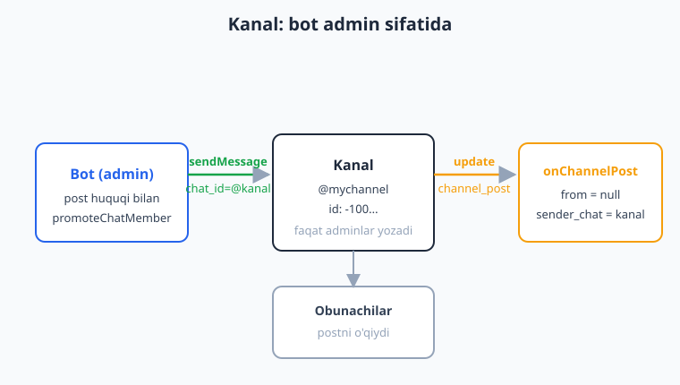
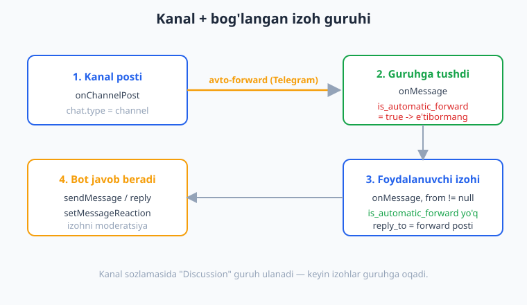
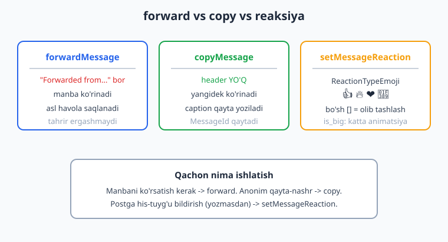

# 21 — Kanallar bilan ishlash

[⬅️ Oldingi: 20 — Guruh moderatsiyasi](./20-guruh-moderatsiya.md) · [🏠 README](./README.md) · [Keyingi: 22 — Majburiy obuna ➡️](./22-majburiy-obuna.md)

---

> **Bu bobda:** botni **kanal** (channel) bilan ishlatishni o'rganamiz. Guruhdan farqli o'laroq, kanalda faqat adminlar yozadi — shuning uchun bot kanalga post qo'ya olishi uchun **admin** bo'lishi va "post" huquqiga ega bo'lishi shart. Quyidagilarni ko'rib chiqamiz: bot kanalga **post yuborishi** (`sendMessage` va media metodlari, `chat_id` sifatida `@username` yoki raqamli `-100...` id), postga **inline URL tugma** qo'shish; kanaldagi postni ushlash uchun `onChannelPost` va `onEditedChannelPost` handlerlari va ulardagi **muhim tuzoq** — kanalda `from` (foydalanuvchi) `null` bo'ladi, uning o'rniga `sender_chat` (kanalning o'zi) keladi; **rejali post** (./15 bobdagi cron + skript yondashuvi kanalga ham aynan mos); **bog'langan izoh guruhi** (linked discussion group) — kanal posti guruhga avtomatik forward bo'lishi (`is_automatic_forward`) va izohlarni boshqarish; xabarni boshqa joyga ko'chirish — `forwardMessage` ("Forwarded from" sarlavhasi bilan) va `copyMessage` (sarlavhasiz, "yangidek"); va nihoyat **reaksiyalar** — `setMessageReaction` + `ReactionTypeEmoji` bilan postga emoji qo'yish.
>
> Halol eslatma: bu bobdagi bot **mantig'i** — `onChannelPost`/`onEditedChannelPost` ning to'g'ri update'ga ulanishi, kanal postida `from` ning `null` va `sender_chat` ning to'g'ri kelishi, kanalga `sendMessage` ning inline URL tugma bilan to'g'ri serializatsiyasi, `forwardMessage`/`copyMessage` ning kerakli parametrlar bilan chaqirilishi, `is_automatic_forward` orqali avto-forwardni izohdan ajratish va `setMessageReaction` ning `ReactionTypeEmoji` bilan emoji yuborishi — `Nutgram::fake()` (FakeNutgram) bilan **offline, tarmoqsiz va tokensiz HAQIQATAN ishga tushirilib tekshirilgan** (jami 13 ta tasdiqlangan tekshiruv). Botning kanalga REAL post qo'yishi, jonli avto-forward, real reaksiyaning ko'rinishi va botni kanalga admin qilish — bular **illustrativ** (jonli Telegram va admin huquqi kerak).

---

## Kanal nima va guruhdan farqi

Telegram **kanal** (channel) — bir tomonlama e'lon platformasi: faqat adminlar post qo'yadi, obunachilar esa o'qiydi (yozolmaydi). Bu guruhdan tubdan farq qiladi:

| | Guruh / supergruh | Kanal |
|---|---|---|
| Kim yozadi | barcha a'zolar | faqat adminlar |
| `chat.type` | `group` / `supergroup` | `channel` |
| Bot postlashi uchun | a'zo bo'lishi yetarli | **admin + post huquqi** shart |
| Postda `from` | yozgan foydalanuvchi | odatda **`null`** |
| Update turi | `message` (`onMessage`) | `channel_post` (`onChannelPost`) |

Eng muhim amaliy xulosa: **bot kanalga post qo'ya olishi uchun u kanalga admin sifatida qo'shilishi va "Post Messages" huquqiga ega bo'lishi kerak.** Buni kanal egasi qo'lda (kanal sozlamalari -> Administrators -> bot qo'shish) yoki — agar bot allaqachon admin bo'lsa — kodda [20-bobdagi](./20-guruh-moderatsiya.md) `promoteChatMember` bilan beradi.



> **`chat_id` ni qanday beraman?** Ommaviy (public) kanalga `@username` orqali murojaat qilasiz: `chat_id: '@mychannel'`. Yopiq (private) kanalda username yo'q — u holda raqamli id ishlatiladi: `-1001234567890` (kanal/supergruh id'lari doim `-100` bilan boshlanadi). Bu id'ni `onChannelPost` ichida `$bot->chatId()` orqali bir marta olib, DB'ga saqlab qo'ysangiz qulay bo'ladi.

## 1-qism: Kanalga post yuborish

Kanalga post — bu oddiy `sendMessage` (yoki media), faqat `chat_id` kanalni ko'rsatadi. Bot admin bo'lsa, hammasi xuddi shaxsiy chatga yuborgandek ishlaydi:

```php
<?php
use SergiX44\Nutgram\Nutgram;
use SergiX44\Nutgram\Telegram\Properties\ParseMode;

// Kanalga oddiy matnli post
$bot->sendMessage(
    text: "<b>Yangi maqola chiqdi!</b>\nO'qish uchun saytga o'ting.",
    chat_id: '@mychannel',
    parse_mode: ParseMode::HTML,
);
```

Media (rasm, hujjat, video) ham aynan [5-bobdagi](./05-xabar-formatlash-media.md) metodlar bilan, faqat `chat_id` kanalga yo'naltiriladi:

```php
<?php
use SergiX44\Nutgram\Telegram\Types\Media\InputFile;

$bot->sendPhoto(
    photo: InputFile::make(fopen(__DIR__ . '/banner.jpg', 'rb')),
    chat_id: '@mychannel',
    caption: 'Aksiya boshlandi!',
);
```

### Inline URL tugma bilan post

Kanal postiga **inline tugma** qo'shish mumkin — eng ko'p ishlatiladigani **URL tugma** (saytga, maqolaga yoki Mini App'ga olib boradi). Diqqat: kanal postidagi tugma odatda `url` (yoki `web_app`) bo'ladi — `callback_data` tugmasi ham mumkin, lekin uni bosgan odam anonim bo'lgani uchun `onCallbackQuery` da `from` cheklangan bo'ladi, shuning uchun kanalda URL tugma amaliyroq:

```php
<?php
use SergiX44\Nutgram\Telegram\Types\Keyboard\InlineKeyboardMarkup;
use SergiX44\Nutgram\Telegram\Types\Keyboard\InlineKeyboardButton;

$keyboard = InlineKeyboardMarkup::make()
    ->addRow(
        InlineKeyboardButton::make('Maqolani o\'qish', url: 'https://ioqil.uz/maqola'),
    )
    ->addRow(
        InlineKeyboardButton::make('Kanalga ulashish', url: 'https://t.me/share/url?url=https://ioqil.uz'),
    );

$bot->sendMessage(
    text: 'Bugungi maqola tayyor 👇',
    chat_id: '@mychannel',
    reply_markup: $keyboard,
);
```

Tekshirildi: kanalga `sendMessage` aynan bir marta chaqirildi, `chat_id` `@mychannel` bo'ldi, va `reply_markup` ichidagi inline tugma `url: https://ioqil.uz` qiymati bilan to'g'ri serializatsiya qilindi (FakeNutgram, request body JSON tekshiruvi).

> Bu yuborishlarning **kod va serializatsiyasi** offline tasdiqlangan, lekin postning kanalda REAL paydo bo'lishi — botni kanalga admin qilishni va jonli Telegram'ni talab qiladi, shuning uchun **illustrativ**.

## 2-qism: Kanal postini ushlash — `onChannelPost`

Kanalga post qo'yilganda (siz, boshqa admin yoki botning o'zi) Telegram botingizga **`channel_post`** update'ini yuboradi — **agar** bot kanalga admin bo'lsa. Buni `onChannelPost` bilan ushlaysiz:

```php
<?php
use SergiX44\Nutgram\Nutgram;

$bot->onChannelPost(function (Nutgram $bot) {
    $text = $bot->message()?->text;            // post matni
    $channelId = $bot->chatId();               // kanal id (-100...)
    // masalan, har bir postni DB'ga arxivlash
    // ... yoki postga avtomatik reaksiya qo'yish (4-qism)
});
```

> **Diqqat — `$bot->message()` kanal postini ham qaytaradi.** Nutgram'da `message()` aksessori `message`, `edited_message`, `channel_post` va `edited_channel_post` ning qaysi biri kelgan bo'lsa, o'shanisini qaytaradi. Shuning uchun `onChannelPost` ichida ham `$bot->message()` ishlatasiz — alohida `channelPost()` metodi yo'q. Buni FakeNutgram bilan tasdiqladik.

### TUZOQ: kanalda `from` `null`, `sender_chat` esa kanal

Bu bobning eng muhim "tuzog'i". Oddiy guruh/shaxsiy xabarda `$bot->message()->from` — yozgan **foydalanuvchi**. Lekin kanal postida postlar **kanal nomidan** (anonim) chiqadi, shuning uchun:

- `$bot->message()->from` -> **`null`** (foydalanuvchi yo'q!);
- `$bot->message()->sender_chat` -> postni qo'ygan **kanalning o'zi** (`Chat` obyekti, `type = channel`).

Agar siz buni bilmasdan `$bot->user()->id` yoki `$bot->message()->from->id` yozsangiz — kanalda **xato** (null'ga murojaat) olasiz. To'g'ri yondashuv:

```php
<?php
$bot->onChannelPost(function (Nutgram $bot) {
    $msg = $bot->message();

    // ❌ XATO bo'lardi: $msg->from->id  — kanalda from = null!
    // ✅ TO'G'RI: sender_chat orqali kanalni aniqlaymiz
    $channelChat = $msg->sender_chat;          // Chat (kanal) yoki null
    $channelId   = $channelChat?->id ?? $bot->chatId();

    if ($msg->from === null) {
        // bu — odatiy kanal posti (anonim, kanal nomidan)
    }
});
```

Tekshirildi: kanal postida `$bot->message()->from === null` va `$bot->message()->sender_chat->id` aynan kanal id'siga (`-100555`) teng bo'ldi (FakeNutgram, `CHANNEL_POST` update).

> **Nega Telegram shunday qiladi?** Kanal — jamoaviy ovoz. Post "Ali yozdi" emas, "kanal e'lon qildi" deb ko'rinadi. Shuning uchun foydalanuvchi maydoni (`from`) bo'sh, post manbasi esa `sender_chat` (kanal) bilan beriladi. **Eslab qoling:** `sender_chat` faqat kanal postlarida emas, anonim guruh adminlari va bog'langan kanal nomidan yozilgan xabarlarda ham uchraydi — shuning uchun `from`/`sender_chat` ni doim tekshirib ishlash yaxshi odat.

### Tahrirlangan post — `onEditedChannelPost`

Kanaldagi post tahrirlanganda `edited_channel_post` update keladi:

```php
<?php
$bot->onEditedChannelPost(function (Nutgram $bot) {
    $yangiMatn = $bot->message()?->text;   // message() bu yerda ham ishlaydi
    $editVaqti = $bot->message()?->edit_date;
    // masalan: arxivda postning yangi versiyasini saqlash
});
```

Tekshirildi: `onEditedChannelPost` handleri `EDITED_CHANNEL_POST` update'ida ishga tushdi va `$bot->message()->text` tahrirlangan matnni qaytardi.

## 3-qism: Rejali post (./15 ga ishora)

"Har kuni ertalab 9:00 da kanalga post qo'y" — bu **rejalashtirilgan vazifa**. Buning uchun butunlay yangi narsa o'rganish shart emas: [15-bobdagi](./15-rejalashtirilgan-broadcast.md) **tashqi cron + alohida skript** yondashuvi kanalga ham aynan mos keladi. Yagona farq — `chat_id` endi foydalanuvchi emas, kanal:

```php
<?php
// channel-schedule.php  — cron har daqiqada ishga tushiradi (15-bobga qarang)
require __DIR__ . '/vendor/autoload.php';

use SergiX44\Nutgram\Nutgram;

$bot = new Nutgram($_ENV['TELEGRAM_TOKEN']);
$pdo = new PDO('sqlite:' . __DIR__ . '/bot.sqlite');

$now = time();
$stmt = $pdo->prepare(
    'SELECT * FROM channel_posts WHERE sent = 0 AND scheduled_at <= :now'
);
$stmt->execute(['now' => $now]);

foreach ($stmt->fetchAll(PDO::FETCH_ASSOC) as $post) {
    $bot->sendMessage(text: $post['text'], chat_id: '@mychannel'); // kanalga!
    $pdo->prepare('UPDATE channel_posts SET sent = 1 WHERE id = :id')
        ->execute(['id' => $post['id']]);
}
```

"Due" mantig'i (`scheduled_at <= now`), `sent = 1` idempotentligi va cron sozlash — barchasi [15-bobda](./15-rejalashtirilgan-broadcast.md) batafsil tushuntirilgan va offline tasdiqlangan. Kanalga rejali post — o'sha mantiqning kanal `chat_id`'siga qaratilgan ko'rinishi.

## 4-qism: Bog'langan izoh guruhi (linked discussion group)

Telegram kanalga **izoh guruhi** (discussion group) ulash imkonini beradi: kanal sozlamasida "Discussion" bo'limidan supergruh tanlanadi. Shundan keyin:

1. Kanalga har bir yangi post qo'yilganda, Telegram uni **avtomatik** bog'langan guruhga **forward** qiladi.
2. Obunachilar shu forward ostida **izoh** yozadi — bu izohlar guruhda oddiy xabar sifatida ko'rinadi.



Botingiz guruhda ham bo'lsa, ikkala narsani ham `onMessage` da ko'radi: avto-forward bo'lgan kanal postini **va** odamlarning izohlarini. Ularni ajratish uchun **`is_automatic_forward`** maydoni ishlatiladi — u faqat kanal posti avto-forward bo'lganda `true` bo'ladi:

```php
<?php
use SergiX44\Nutgram\Nutgram;

$bot->onMessage(function (Nutgram $bot) {
    $msg = $bot->message();

    // 1) Bu — kanaldan avto-forward bo'lgan post (izoh EMAS)
    if ($msg?->is_automatic_forward) {
        // odatda hech narsa qilmaymiz — bu shunchaki "asos" post
        return;
    }

    // 2) Bu — haqiqiy foydalanuvchi izohi
    if ($msg?->reply_to_message?->is_automatic_forward) {
        // foydalanuvchi aynan kanal postiga izoh yozdi
        $izohchi = $msg->from?->first_name ?? 'Mehmon';
        // masalan: spam izohni o'chirish, yoki taqdirlash reaksiyasi (4-qism)
    }
});
```

Tekshirildi: `is_automatic_forward = true` bo'lgan xabar avto-forward sifatida aniqlandi (message_id 100), `from` bilan kelgan oddiy izoh esa avto-forward DEB belgilanmadi (message_id 101) — ikkala tarmoq ham FakeNutgram bilan to'g'ri ishladi.

> **Nega izohlar guruhga tushadi, kanalga emas?** Texnik jihatdan izohlar kanalda emas, balki bog'langan **supergruhda** saqlanadi (kanalning o'zida obunachilar yozolmaydi). Telegram interfeysi ularni post ostida "Comments" deb ko'rsatadi, lekin bot nuqtai nazaridan ular — guruh xabarlari. Shuning uchun izoh moderatsiyasi aslida [20-bobdagi](./20-guruh-moderatsiya.md) guruh moderatsiyasi (ban, restrict, o'chirish) bilan bir xil.

## 5-qism: `forwardMessage` va `copyMessage`

Ko'pincha bir kanaldan boshqasiga (yoki kanaldan foydalanuvchiga) xabarni **ko'chirish** kerak bo'ladi. Buning ikki yo'li bor va ular muhim farq qiladi:



### `forwardMessage` — manba ko'rinadi

`forwardMessage` xabarni **"Forwarded from <manba>"** sarlavhasi bilan ko'chiradi — o'quvchi qayerdan kelganini biladi:

```php
<?php
$bot->forwardMessage(
    chat_id: '@mychannel',          // qayerga
    from_chat_id: '@sourcechannel', // qayerdan
    message_id: 77,                 // qaysi xabar
);
```

### `copyMessage` — "yangidek", manba ko'rsatilmaydi

`copyMessage` xabar **mazmunini** ko'chiradi, lekin **"Forwarded from" sarlavhasisiz** — go'yo siz uni yangidan yozgandek ko'rinadi. Caption'ni ham qayta yozish mumkin:

```php
<?php
$kop = $bot->copyMessage(
    chat_id: '@mychannel',
    from_chat_id: '@sourcechannel',
    message_id: 77,
    caption: 'Bizning tahrirdagi sarlavha', // ixtiyoriy — yangi caption
);
// $kop — MessageId obyekti (Message emas! copyMessage faqat id qaytaradi)
```

Tekshirildi: `forwardMessage` `chat_id`, `from_chat_id` va `message_id` bilan, `copyMessage` esa qo'shimcha `caption` bilan to'g'ri parametrlarda chaqirildi (FakeNutgram, `assertReply`).

> **Qaysi birini tanlash?** Manbani **ko'rsatish** (atributsiya, ishonch) kerak bo'lsa — `forwardMessage`. Kontentni **o'zingiznikidek** qayta nashr qilmoqchi bo'lsangiz (masalan, agregator kanal) yoki caption'ni o'zgartirmoqchi bo'lsangiz — `copyMessage`. Yana bir farq: `forwardMessage` Message qaytaradi, `copyMessage` esa faqat `MessageId`.

## 6-qism: Reaksiyalar — `setMessageReaction`

Bot postga (kanalda yoki guruhda) **emoji reaksiya** qo'yishi mumkin — bu yozmasdan "his-tuyg'u bildirish" usuli. Buning uchun `setMessageReaction` metodi va `ReactionTypeEmoji` turi ishlatiladi:

```php
<?php
use SergiX44\Nutgram\Telegram\Types\Reaction\ReactionTypeEmoji;

// Postga 🔥 reaksiya qo'yish
$bot->setMessageReaction(
    reaction: [ReactionTypeEmoji::make(ReactionTypeEmoji::FIRE)], // 🔥
    chat_id: '@mychannel',
    message_id: 10,
);
```

`reaction` — bu **massiv** (botlar uchun odatda bitta element). `ReactionTypeEmoji` da tayyor konstantalar bor (`THUMBS_UP`, `HEART`, `FIRE`, `PARTY_POPPER`, ...) yoki to'g'ridan-to'g'ri emoji string berasiz:

```php
<?php
// Tayyor konstantalar
ReactionTypeEmoji::make(ReactionTypeEmoji::THUMBS_UP);   // 👍
ReactionTypeEmoji::make(ReactionTypeEmoji::HEART);       // ❤️
ReactionTypeEmoji::make(ReactionTypeEmoji::PARTY_POPPER);// 🎉

// Yoki to'g'ridan-to'g'ri emoji bilan
ReactionTypeEmoji::make('👏');
```

Reaksiyani **olib tashlash** uchun bo'sh massiv yuboriladi, **katta animatsiya** uchun `is_big: true`:

```php
<?php
// Reaksiyani olib tashlash
$bot->setMessageReaction(reaction: [], chat_id: '@mychannel', message_id: 10);

// Katta (animatsiyali) reaksiya
$bot->setMessageReaction(
    reaction: [ReactionTypeEmoji::make(ReactionTypeEmoji::PARTY_POPPER)],
    is_big: true,
    chat_id: '@mychannel',
    message_id: 10,
);
```

Amaliy misol — yangi kanal postiga avtomatik reaksiya qo'yish (`onChannelPost` bilan birga):

```php
<?php
use SergiX44\Nutgram\Nutgram;
use SergiX44\Nutgram\Telegram\Types\Reaction\ReactionTypeEmoji;

$bot->onChannelPost(function (Nutgram $bot) {
    // Har bir yangi postga 🔥 qo'yib, obunachilarni "ilk reaksiya"ga undaymiz
    $bot->setMessageReaction(
        reaction: [ReactionTypeEmoji::make(ReactionTypeEmoji::FIRE)],
        chat_id: $bot->chatId(),
        message_id: $bot->message()->message_id,
    );
});
```

Tekshirildi: `setMessageReaction` bir marta chaqirildi va request body'da `reaction` massivining birinchi elementi `{type: emoji, emoji: 🔥}` ko'rinishida to'g'ri serializatsiya qilindi; `ReactionTypeEmoji::FIRE` aynan `🔥`, `make()` esa `emoji` va `type=emoji` ni to'g'ri o'rnatdi (FakeNutgram).

> Reaksiyaning kanalda REAL ko'rinishi (animatsiya, hisoblagich) jonli Telegram'ni talab qiladi — **illustrativ**. Lekin metod chaqiruvi va emoji serializatsiyasi offline tasdiqlangan.

## Bobni qanday tekshirdik (halol eslatma)

Yuqoridagi mantiqning hammasini `Nutgram::fake()` (FakeNutgram) + nutgram 4.46 vendor bilan offline, tarmoqsiz va tokensiz ishga tushirib tasdiqladik (jami **13 ta** tekshiruv, hammasi PASS):

- `onChannelPost` handleri `CHANNEL_POST` update'ida ishga tushib, post matnini olishi;
- kanal postida `from === null` va `sender_chat->id` ning kanal id'siga teng bo'lishi (asosiy tuzoq);
- kanalga `sendMessage` ning bir marta, to'g'ri `chat_id` bilan chaqirilishi va inline URL tugmaning `reply_markup` ichida to'g'ri serializatsiyasi;
- `onEditedChannelPost` handlerining `EDITED_CHANNEL_POST` da ishga tushishi;
- `is_automatic_forward` orqali avto-forward'ni (true) oddiy izohdan (from bilan) ajratish;
- `forwardMessage` (`chat_id`/`from_chat_id`/`message_id`) va `copyMessage` (+`caption`) ning to'g'ri parametrlar bilan chaqirilishi;
- `setMessageReaction` ning `ReactionTypeEmoji::FIRE` bilan emoji reaksiya yuborishi va `ReactionTypeEmoji::make` ning emoji+type ni to'g'ri o'rnatishi.

Botning kanalga REAL post qo'yishi va admin qilinishi, jonli avto-forward, reaksiyaning real ko'rinishi va public HTTPS — bularning hammasi jonli Telegram'ni talab qiladi, shuning uchun **illustrativ**. Kod va mantiq to'g'ri.

## Mashqlar

### Oson

1. Kanalga (`@mychannel`) HTML formatda post yuboradigan funksiya yozing: `postToChannel(Nutgram $bot, string $title, string $body): void` — sarlavhani `<b>` ga o'rab, matn bilan birga `ParseMode::HTML` da yuborsin.
2. `onChannelPost` handleri yozing: har bir post matnini `error_log` ga yozsin va kanal id'sini (`$bot->chatId()`) qo'shsin.
3. Kanal postiga ikkita inline URL tugmali post yuboring (`InlineKeyboardMarkup` + ikkita `addRow`). FakeNutgram'da `assertCalled('sendMessage', 1)` bilan tasdiqlang.
4. `onChannelPost` ichida `$bot->message()->from === null` ekanini tekshirib, agar shunday bo'lsa `$isAnonim = true` qiling. FakeNutgram'da `CHANNEL_POST` update berib, `$isAnonim` ning `true` ekanini tasdiqlang.
5. `forwardMessage` bilan `@source` kanaldagi 5-xabarni `@mychannel` ga forward qiling. `assertReply('forwardMessage', [...])` bilan parametrlarni tekshiring.
6. `ReactionTypeEmoji` ning uchta konstantasini (`THUMBS_UP`, `HEART`, `FIRE`) `echo` qilib, ularning aynan `👍`, `❤️`, `🔥` ekanini ko'ring (`assert` bilan).

### O'rta

1. `onChannelPost` ichida postni xavfsiz boshqaradigan kod yozing: agar `sender_chat` bo'lsa — uning `id` va `title` ni oling, aks holda `$bot->chatId()` ga tushing. FakeNutgram'da `sender_chat` bor va yo'q ikki ssenariyni tekshiring.
2. `copyMessage` bilan `@source` dan xabarni `@mychannel` ga **yangi caption** bilan ko'chiring. FakeNutgram'da `willReceivePartial(['message_id' => 1])` qo'yib, `assertReply('copyMessage', ['caption' => '...'])` bilan tasdiqlang.
3. `setMessageReaction` bilan postga 🎉 (`PARTY_POPPER`) reaksiya qo'ying, `is_big: true` bering. FakeNutgram'da `assertRaw` orqali request body'da `reaction[0].emoji === '🎉'` ekanini tekshiring.
4. Izoh guruhida ishlaydigan `onMessage` handleri yozing: `is_automatic_forward` `true` bo'lsa `return` (e'tibormang), aks holda izohchining ismini olib `error_log` qiling. Ikki update (avto-forward va oddiy izoh) bilan tekshiring.
5. Reaksiyani **olib tashlaydigan** chaqiruv yozing (`reaction: []`) va FakeNutgram'da request body'da `reaction` ning bo'sh massiv ekanini tasdiqlang.
6. `onChannelPost` + `setMessageReaction` ni birlashtiring: har yangi postga avtomatik 🔥 qo'ysin. FakeNutgram'da bitta `CHANNEL_POST` berib, `setMessageReaction` ning aynan bir marta chaqirilganini (`assertCalled`) tasdiqlang.

### Qiyin

1. **Post-arxivlovchi.** `onChannelPost` va `onEditedChannelPost` ni shunday yozing: yangi post DB'ga `INSERT`, tahrirlangan post esa `UPDATE` (`message_id` bo'yicha) bo'lsin. SQLite in-memory bilan: avval `CHANNEL_POST` (insert), keyin shu `message_id` uchun `EDITED_CHANNEL_POST` (update) berib, DB'da matn yangilanganini tekshiring.
2. **Izoh moderatori.** Izoh guruhida `onMessage` yozing: agar xabar `is_automatic_forward` bo'lmasa (ya'ni haqiqiy izoh) va matnida taqiqlangan so'z bo'lsa — uni "o'chirish" (FakeNutgram'da `deleteMessage` chaqiruvini `assertCalled` bilan tekshiring; jonli o'chirish illustrativ). Avto-forward postga TEGMASIN.
3. **Forward vs copy tanlovi.** `republish(Nutgram $bot, string $to, string $from, int $msgId, bool $keepSource): void` yozing — `$keepSource` `true` bo'lsa `forwardMessage`, aks holda `copyMessage` ishlatsin. Har ikki tarmoqni FakeNutgram'da `assertCalled('forwardMessage', ...)` / `assertCalled('copyMessage', ...)` bilan tekshiring.
4. **Reaksiya bo'yicha sarlavha tanlash.** `reactToPost(Nutgram $bot, int|string $chatId, int $msgId, string $kayfiyat): void` yozing — `$kayfiyat` (`'zol'`/`'sevgi'`/`'bayram'`) ga qarab mos `ReactionTypeEmoji` (🔥/❤️/🎉) tanlansin (`match`). Noma'lum kayfiyatga 👍 (default). Har bir tarmoq uchun yuborilgan emoji'ni `assertRaw` bilan tasdiqlang.

<details markdown="1"><summary>Yechimlar</summary>

**Oson 1.**
```php
<?php
use SergiX44\Nutgram\Nutgram;
use SergiX44\Nutgram\Telegram\Properties\ParseMode;

function postToChannel(Nutgram $bot, string $title, string $body): void
{
    $bot->sendMessage(
        text: "<b>{$title}</b>\n{$body}",
        chat_id: '@mychannel',
        parse_mode: ParseMode::HTML,
    );
}
```

**Oson 2.**
```php
<?php
use SergiX44\Nutgram\Nutgram;
$bot->onChannelPost(function (Nutgram $bot) {
    error_log('Kanal ' . $bot->chatId() . ' post: ' . ($bot->message()?->text ?? ''));
});
```

**Oson 3.**
```php
<?php
use SergiX44\Nutgram\Nutgram;
use SergiX44\Nutgram\Telegram\Types\Keyboard\InlineKeyboardMarkup;
use SergiX44\Nutgram\Telegram\Types\Keyboard\InlineKeyboardButton;

$bot = Nutgram::fake();
$kb = InlineKeyboardMarkup::make()
    ->addRow(InlineKeyboardButton::make('Sayt', url: 'https://ioqil.uz'))
    ->addRow(InlineKeyboardButton::make('Telegram', url: 'https://t.me/i_oqil'));
$bot->willReceivePartial(['message_id' => 1, 'date' => 0, 'chat' => ['id' => -100123, 'type' => 'channel']]);
$bot->sendMessage(text: 'Post', chat_id: '@mychannel', reply_markup: $kb);
$bot->assertCalled('sendMessage', 1);
```

**Oson 4.**
```php
<?php
use SergiX44\Nutgram\Nutgram;
use SergiX44\Nutgram\Telegram\Properties\UpdateType;

$bot = Nutgram::fake();
$isAnonim = false;
$bot->onChannelPost(function (Nutgram $bot) use (&$isAnonim) {
    $isAnonim = ($bot->message()->from === null);
});
$bot->hearUpdateType(UpdateType::CHANNEL_POST, [
    'message_id' => 1, 'date' => 0, 'text' => 'Salom',
    'chat' => ['id' => -100123, 'type' => 'channel'],
])->reply();
assert($isAnonim === true);
```

**Oson 5.**
```php
<?php
use SergiX44\Nutgram\Nutgram;
$bot = Nutgram::fake();
$bot->willReceivePartial(['message_id' => 9, 'date' => 0, 'chat' => ['id' => -100123, 'type' => 'channel']]);
$bot->forwardMessage(chat_id: '@mychannel', from_chat_id: '@source', message_id: 5);
$bot->assertReply('forwardMessage', ['chat_id' => '@mychannel', 'from_chat_id' => '@source', 'message_id' => 5]);
```

**Oson 6.**
```php
<?php
use SergiX44\Nutgram\Telegram\Types\Reaction\ReactionTypeEmoji;
assert(ReactionTypeEmoji::THUMBS_UP === '👍');
assert(ReactionTypeEmoji::HEART === '❤️');
assert(ReactionTypeEmoji::FIRE === '🔥');
```

**O'rta 1.**
```php
<?php
use SergiX44\Nutgram\Nutgram;
use SergiX44\Nutgram\Telegram\Properties\UpdateType;

$bot = Nutgram::fake();
$result = null;
$bot->onChannelPost(function (Nutgram $bot) use (&$result) {
    $sc = $bot->message()->sender_chat;
    $result = $sc !== null
        ? ['id' => $sc->id, 'title' => $sc->title]
        : ['id' => $bot->chatId(), 'title' => null];
});
// sender_chat bilan:
$bot->hearUpdateType(UpdateType::CHANNEL_POST, [
    'message_id' => 1, 'date' => 0, 'text' => 'a',
    'chat' => ['id' => -100123, 'type' => 'channel', 'title' => 'K'],
    'sender_chat' => ['id' => -100123, 'type' => 'channel', 'title' => 'K'],
])->reply();
assert($result['title'] === 'K');
```

**O'rta 2.**
```php
<?php
use SergiX44\Nutgram\Nutgram;
$bot = Nutgram::fake();
$bot->willReceivePartial(['message_id' => 1]); // copyMessage -> MessageId
$bot->copyMessage(chat_id: '@mychannel', from_chat_id: '@source', message_id: 7, caption: 'Yangi');
$bot->assertReply('copyMessage', ['caption' => 'Yangi']);
```

**O'rta 3.**
```php
<?php
use SergiX44\Nutgram\Nutgram;
use SergiX44\Nutgram\Telegram\Types\Reaction\ReactionTypeEmoji;

$bot = Nutgram::fake();
$bot->willReceivePartial([], ok: true);
$bot->setMessageReaction(
    reaction: [ReactionTypeEmoji::make(ReactionTypeEmoji::PARTY_POPPER)],
    is_big: true,
    chat_id: '@mychannel',
    message_id: 10,
);
$bot->assertRaw(function (GuzzleHttp\Psr7\Request $req) {
    $f = json_decode((string) $req->getBody(), true);
    return ($f['reaction'][0]['emoji'] ?? null) === '🎉' && ($f['is_big'] ?? null) === true;
});
```

**O'rta 4.**
```php
<?php
use SergiX44\Nutgram\Nutgram;
use SergiX44\Nutgram\Telegram\Properties\UpdateType;

$bot = Nutgram::fake();
$logged = [];
$bot->onMessage(function (Nutgram $bot) use (&$logged) {
    if ($bot->message()?->is_automatic_forward) {
        return; // avto-forward — e'tibormaymiz
    }
    $logged[] = $bot->message()?->from?->first_name;
});
$bot->hearUpdateType(UpdateType::MESSAGE, [
    'message_id' => 1, 'date' => 0, 'text' => 'post',
    'chat' => ['id' => -100999, 'type' => 'supergroup'],
    'is_automatic_forward' => true,
])->reply();
$bot->hearUpdateType(UpdateType::MESSAGE, [
    'message_id' => 2, 'date' => 0, 'text' => 'Zo\'r!',
    'from' => ['id' => 7, 'is_bot' => false, 'first_name' => 'Ali'],
    'chat' => ['id' => -100999, 'type' => 'supergroup'],
])->reply();
assert($logged === ['Ali']); // faqat izoh log qilindi
```

**O'rta 5.**
```php
<?php
use SergiX44\Nutgram\Nutgram;
$bot = Nutgram::fake();
$bot->willReceivePartial([], ok: true);
$bot->setMessageReaction(reaction: [], chat_id: '@mychannel', message_id: 10);
$bot->assertRaw(function (GuzzleHttp\Psr7\Request $req) {
    $f = json_decode((string) $req->getBody(), true);
    return ($f['reaction'] ?? null) === [];
});
```

**O'rta 6.**
```php
<?php
use SergiX44\Nutgram\Nutgram;
use SergiX44\Nutgram\Telegram\Properties\UpdateType;
use SergiX44\Nutgram\Telegram\Types\Reaction\ReactionTypeEmoji;

$bot = Nutgram::fake();
$bot->onChannelPost(function (Nutgram $bot) {
    $bot->setMessageReaction(
        reaction: [ReactionTypeEmoji::make(ReactionTypeEmoji::FIRE)],
        chat_id: $bot->chatId(),
        message_id: $bot->message()->message_id,
    );
});
$bot->willReceivePartial([], ok: true); // setMessageReaction javobi
$bot->hearUpdateType(UpdateType::CHANNEL_POST, [
    'message_id' => 50, 'date' => 0, 'text' => 'a',
    'chat' => ['id' => -100123, 'type' => 'channel'],
])->reply();
$bot->assertCalled('setMessageReaction', 1);
```

**Qiyin 1.**
```php
<?php
use SergiX44\Nutgram\Nutgram;
use SergiX44\Nutgram\Telegram\Properties\UpdateType;

$pdo = new PDO('sqlite::memory:');
$pdo->exec('CREATE TABLE posts (message_id INTEGER PRIMARY KEY, text TEXT)');

$bot = Nutgram::fake();
$bot->onChannelPost(function (Nutgram $bot) use ($pdo) {
    $pdo->prepare('INSERT INTO posts (message_id, text) VALUES (:id, :t)')
        ->execute(['id' => $bot->message()->message_id, 't' => $bot->message()->text]);
});
$bot->onEditedChannelPost(function (Nutgram $bot) use ($pdo) {
    $pdo->prepare('UPDATE posts SET text = :t WHERE message_id = :id')
        ->execute(['t' => $bot->message()->text, 'id' => $bot->message()->message_id]);
});
$bot->hearUpdateType(UpdateType::CHANNEL_POST, [
    'message_id' => 5, 'date' => 0, 'text' => 'eski',
    'chat' => ['id' => -100123, 'type' => 'channel'],
])->reply();
$bot->hearUpdateType(UpdateType::EDITED_CHANNEL_POST, [
    'message_id' => 5, 'date' => 0, 'edit_date' => 1, 'text' => 'yangi',
    'chat' => ['id' => -100123, 'type' => 'channel'],
])->reply();
$row = $pdo->query('SELECT text FROM posts WHERE message_id = 5')->fetchColumn();
assert($row === 'yangi'); // tahrir DB'da aks etdi
```

**Qiyin 2.**
```php
<?php
use SergiX44\Nutgram\Nutgram;
use SergiX44\Nutgram\Telegram\Properties\UpdateType;

$bot = Nutgram::fake();
$taqiq = ['spam', 'reklama'];
$bot->onMessage(function (Nutgram $bot) use ($taqiq) {
    $msg = $bot->message();
    if ($msg?->is_automatic_forward) {
        return; // avto-forward postga tegmaymiz
    }
    foreach ($taqiq as $soz) {
        if (str_contains(mb_strtolower($msg?->text ?? ''), $soz)) {
            $bot->deleteMessage(chat_id: $bot->chatId(), message_id: $msg->message_id);
            return;
        }
    }
});
$bot->willReceivePartial([], ok: true); // deleteMessage javobi
$bot->hearUpdateType(UpdateType::MESSAGE, [
    'message_id' => 9, 'date' => 0, 'text' => 'Arzon reklama!',
    'from' => ['id' => 3, 'is_bot' => false, 'first_name' => 'Spammer'],
    'chat' => ['id' => -100999, 'type' => 'supergroup'],
])->reply();
$bot->assertCalled('deleteMessage', 1);
// jonli o'chirish illustrativ — bu yerda chaqiruv mantig'i tekshirildi
```

**Qiyin 3.**
```php
<?php
use SergiX44\Nutgram\Nutgram;
function republish(Nutgram $bot, string $to, string $from, int $msgId, bool $keepSource): void
{
    if ($keepSource) {
        $bot->forwardMessage(chat_id: $to, from_chat_id: $from, message_id: $msgId);
    } else {
        $bot->copyMessage(chat_id: $to, from_chat_id: $from, message_id: $msgId);
    }
}
// Test:
$bot = Nutgram::fake();
$bot->willReceivePartial(['message_id' => 1, 'date' => 0, 'chat' => ['id' => 1, 'type' => 'channel']]);
republish($bot, '@a', '@b', 7, true);
$bot->assertCalled('forwardMessage', 1);

$bot2 = Nutgram::fake();
$bot2->willReceivePartial(['message_id' => 1]);
republish($bot2, '@a', '@b', 7, false);
$bot2->assertCalled('copyMessage', 1);
```

**Qiyin 4.**
```php
<?php
use SergiX44\Nutgram\Nutgram;
use SergiX44\Nutgram\Telegram\Types\Reaction\ReactionTypeEmoji;

function reactToPost(Nutgram $bot, int|string $chatId, int $msgId, string $kayfiyat): void
{
    $emoji = match ($kayfiyat) {
        'zol'    => ReactionTypeEmoji::FIRE,         // 🔥
        'sevgi'  => ReactionTypeEmoji::HEART,        // ❤️
        'bayram' => ReactionTypeEmoji::PARTY_POPPER, // 🎉
        default  => ReactionTypeEmoji::THUMBS_UP,    // 👍
    };
    $bot->setMessageReaction(
        reaction: [ReactionTypeEmoji::make($emoji)],
        chat_id: $chatId,
        message_id: $msgId,
    );
}
// Test (bitta tarmoq):
$bot = Nutgram::fake();
$bot->willReceivePartial([], ok: true);
reactToPost($bot, '@mychannel', 10, 'bayram');
$bot->assertRaw(function (GuzzleHttp\Psr7\Request $req) {
    $f = json_decode((string) $req->getBody(), true);
    return ($f['reaction'][0]['emoji'] ?? null) === '🎉';
});
```
</details>

---

[⬅️ Oldingi: 20 — Guruh moderatsiyasi](./20-guruh-moderatsiya.md) · [🏠 README](./README.md) · [Keyingi: 22 — Majburiy obuna ➡️](./22-majburiy-obuna.md)
