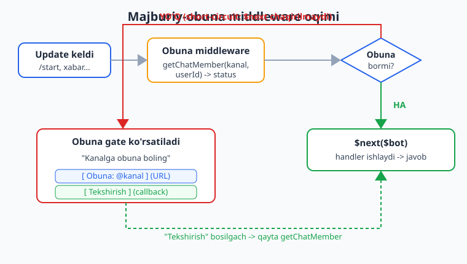
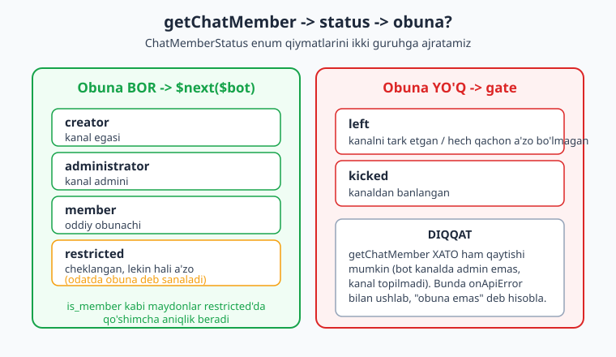
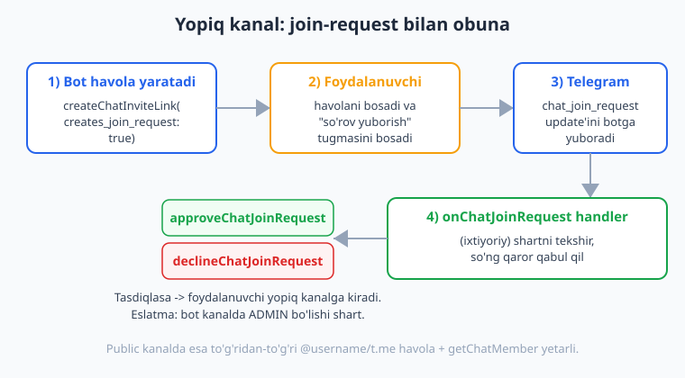

# 22 — Majburiy obuna

[⬅️ Oldingi: 21 — Kanallar bilan ishlash](./21-kanallar.md) · [🏠 README](./README.md) · [Keyingi: 23 — Telegram Web App (Mini App) asoslari ➡️](./23-webapp-asoslari.md)

---

> **Bu bobda:** "Botdan foydalanish uchun avval kanalimga obuna bo'ling" — bu O'zbekistondagi (va umuman) Telegram botlarining eng ko'p so'raladigan funksiyasi. Shu bobda buni boshidan oxirigacha quramiz: `getChatMember($channel, $userId)` orqali obunani **tekshirish** (status `left`/`kicked` = obuna emas; `member`/`administrator`/`creator`/`restricted` = obuna), bu mantiqni [09-bobdagi](./09-middleware.md) middleware'ga aylantirib **har handlerdan oldin ishlaydigan gate** qilish (obuna bo'lmasa — short-circuit), foydalanuvchiga **"Obuna bo'ling" inline gate** ko'rsatish (kanal URL tugmasi + "Tekshirish" callback), **bir nechta majburiy kanal**ni birdaniga tekshirish, **yopiq (private) kanal** uchun `createChatInviteLink(creates_join_request: true)` + `onChatJoinRequest` + `approveChatJoinRequest` oqimi, va `getChatMember` chaqiruvlarini kamaytirish uchun obunani **qisqa keshlash**. Oxirida hammasini sinflar bilan tartibga solamiz.
>
> Halol eslatma: bu bobdagi BARCHA gate mantig'i — obuna tekshirish, single/multi-channel short-circuit, gate klaviaturasi, "Tekshirish" callback, kesh, join-request approve — `Nutgram::fake()` (FakeNutgram) bilan **offline, tarmoqsiz va tokensiz HAQIQATAN ishga tushirilib tekshirilgan**: `getChatMember`/`createChatInviteLink`/`approveChatJoinRequest` javoblari `willReceive(...)` bilan soxtalashtirilib, ikkala tarmoq (obuna bor / yo'q) ham tasdiqlangan (phpunit ostida 15 ta test, 53 ta assertion o'tdi). Jonli qism — bot kanalga real ulanib, real `getChatMember` so'rovi yuborishi va foydalanuvchining haqiqatan kanalga kirishi — bu **illustrativ**, u jonli bot ishga tushganda ko'rinadi.

---

## Muammo: nega va qachon majburiy obuna?

Majburiy obuna — bu bot egasi auditoriyani o'stirish uchun ishlatadigan eng keng tarqalgan usul: foydalanuvchi botning biror foydali funksiyasini (masalan, fayl yuklash, kino qidirish, kod generatsiya) ishlatishdan oldin uni kanal(lar)ga obuna bo'lishga majbur qiladi.

Texnik jihatdan bu [09-bobda](./09-middleware.md) ko'rgan **gate (qo'riqchi) middleware**ning aniq bir holati:

1. Har bir update kelganda, handlergacha middleware ishlaydi.
2. Middleware foydalanuvchining kanalga obuna ekanini Telegram'dan so'raydi.
3. Obuna bo'lsa — `$next($bot)` chaqiriladi, handler ishlaydi.
4. Obuna bo'lmasa — `$next` chaqirilmaydi (**short-circuit**), o'rniga obuna tugmasi ko'rsatiladi.



> **Muhim shart (jonli muhit uchun):** Bot foydalanuvchining kanalga obuna-yo'qligini bilishi uchun **botning o'zi kanalda administrator bo'lishi** kerak. Aks holda `getChatMember` xatolik qaytaradi. Bu — `getChatMember`ni jonli ishlatishning yagona shartidir; kanalga botni admin qilib qo'ying.

## `getChatMember` bilan obunani tekshirish

Telegram'da kanal/guruh a'zoligini bilish uchun yagona ishonchli usul — `getChatMember(chat_id, user_id)`. U `ChatMember` obyektini qaytaradi, undagi asosiy maydon — `->status`. Bu `SergiX44\Nutgram\Telegram\Properties\ChatMemberStatus` enum (yoki ba'zan oddiy string) bo'ladi:

| status | ma'no | obuna deb sanaymizmi? |
|---|---|---|
| `creator` | kanal egasi | HA |
| `administrator` | kanal admini | HA |
| `member` | oddiy obunachi | HA |
| `restricted` | cheklangan, lekin hali a'zo | odatda HA |
| `left` | tark etgan / hech qachon a'zo bo'lmagan | YO'Q |
| `kicked` | kanaldan banlangan | YO'Q |



Endi statusni "obuna bor/yo'q"ga aylantiruvchi **sof funksiya** yozamiz. Buni sof funksiya qilib ajratish muhim — uni jonli Telegram'siz, har status uchun alohida sinash mumkin:

```php
<?php
use SergiX44\Nutgram\Telegram\Properties\ChatMemberStatus;

/**
 * status -> obuna bor (true) / yo'q (false).
 * Nutgram status'ni enum yoki (kamdan) string sifatida berishi mumkin —
 * ikkalasini ham qabul qilamiz.
 */
function isSubscribed(ChatMemberStatus|string $status): bool
{
    $s = $status instanceof ChatMemberStatus
        ? $status
        : ChatMemberStatus::from($status);

    return in_array($s, [
        ChatMemberStatus::CREATOR,
        ChatMemberStatus::ADMINISTRATOR,
        ChatMemberStatus::MEMBER,
        ChatMemberStatus::RESTRICTED,
    ], true);
}
```

Buni FakeNutgram'siz, oddiy assert bilan tekshirdik (har bir status uchun):

```php
<?php
assert(isSubscribed('member') === true);
assert(isSubscribed('creator') === true);
assert(isSubscribed('administrator') === true);
assert(isSubscribed('left') === false);
assert(isSubscribed('kicked') === false);
assert(isSubscribed(ChatMemberStatus::MEMBER) === true); // enum kirish ham ishlaydi
```

> **`restricted` haqida nozik nuqta:** `restricted` status — foydalanuvchi kanalda hali ham a'zo, lekin biror huquqi cheklangan (masalan, yozolmaydi). Aksariyat majburiy-obuna botlari uni obuna deb sanaydi. Agar siz qat'iyroq qoida xohlasangiz (faqat to'liq a'zo), `restricted`ni ro'yxatdan olib tashlang yoki `ChatMemberRestricted->is_member` maydonini qo'shimcha tekshiring.

## Eng oddiy bitta-kanal gate (middleware)

Endi `getChatMember` + `isSubscribed`ni global middleware'ga joylaymiz. Bu — botning HAR bir update'i uchun ishlaydi:

```php
<?php
use SergiX44\Nutgram\Nutgram;

$bot = new Nutgram($_ENV['TELEGRAM_TOKEN']);

$gate = function (Nutgram $bot, $next) {
    $channel = '@testkanal'; // bot ADMIN bo'lgan kanal

    // ID null bo'lsa (masalan channel_post) tekshirishni o'tkazib yuboramiz
    if ($bot->userId() === null) {
        $next($bot);
        return;
    }

    $member = $bot->getChatMember($channel, $bot->userId());
    $subscribed = $member !== null && isSubscribed($member->status);

    if (!$subscribed) {
        $bot->sendMessage("Iltimos, {$channel} kanaliga obuna boling.");
        return; // <-- short-circuit: handler ISHLAMAYDI
    }

    $next($bot); // obuna bor -> davom
};

$bot->middleware($gate);

$bot->onCommand('start', fn (Nutgram $bot) => $bot->sendMessage('Xush kelibsiz!'));

$bot->run();
```

Buni FakeNutgram bilan ikkala tarmoqda tekshirdik. Sinov uchun kalit g'oya: `getChatMember` ham, `sendMessage` ham Telegram API'ga so'rovdir, shuning uchun ularning javoblarini **navbat bilan** (`willReceive`) soxtalashtirib beramiz. Birinchi `willReceive` — `getChatMember` javobini, keyingisi (agar kerak bo'lsa) `sendMessage` natijasini ta'minlaydi:

```php
<?php
use SergiX44\Nutgram\Nutgram;

// --- 1) Obuna BOR (status=member) -> handler ishlaydi ---
$bot = Nutgram::fake();
$bot->middleware($gate);
$bot->onCommand('start', fn (Nutgram $bot) => $bot->sendMessage('Xush kelibsiz!'));

// getChatMember javobini soxtalashtiramiz: status=member
$bot->willReceive([
    'status' => 'member',
    'user'   => ['id' => 555, 'is_bot' => false, 'first_name' => 'Ali'],
]);
$bot->hearMessage(['text' => '/start', 'from' => ['id' => 555, 'is_bot' => false, 'first_name' => 'Ali']])->reply();

// So'rovlar tarixi: [0]=getChatMember, [1]=sendMessage('Xush kelibsiz!')
$bot->assertReply('getChatMember', index: 0);
$bot->assertReplyText('Xush kelibsiz!', index: 1);   // ✓ handler ishladi


// --- 2) Obuna YO'Q (status=left) -> gate xabari, handler ishlamaydi ---
$bot = Nutgram::fake();
$bot->middleware($gate);
$bot->onCommand('start', fn (Nutgram $bot) => $bot->sendMessage('Xush kelibsiz!'));

$bot->willReceive([
    'status' => 'left',
    'user'   => ['id' => 777, 'is_bot' => false, 'first_name' => 'Vali'],
]);
$bot->hearMessage(['text' => '/start', 'from' => ['id' => 777, 'is_bot' => false, 'first_name' => 'Vali']])->reply();

$bot->assertReply('getChatMember', index: 0);
$bot->assertReplyText('Iltimos, @testkanal kanaliga obuna boling.', index: 1); // ✓ gate
```

> **TEST NOZIKLIGI 1 — `index`:** Gate ichida avval `getChatMember`, keyin `sendMessage` chaqiriladi. FakeNutgram'ning so'rovlar tarixida **har ikkalasi** ham yoziladi. Shuning uchun `assertReplyText('...', index: 1)` deb aniq indeksni ko'rsatamiz (`index: 0` — bu `getChatMember`). Bu — `getChatMember` ishlatadigan har qanday handlerni testlashda eslab qolish kerak bo'lgan eng muhim narsa.
>
> **TEST NOZIKLIGI 2 — `willReceive` tartibi:** `willReceive` javoblarni **navbatga** (FIFO) qo'yadi. Handler ichida nechta API chaqiruv bo'lsa, shuncha javob navbatga qo'yiladi — qaysi biri birinchi chaqirilsa, shu birinchi javobni oladi.
>
> **TEST NOZIKLIGI 3 — `administrator`/`restricted` mock'i:** Statusni `'administrator'` qilib mock qilsangiz, Nutgram uni `ChatMemberAdministrator` turiga aylantirmoqchi bo'ladi va `can_be_edited` kabi majburiy maydonlarni talab qiladi (hydration xatosi). Test uchun eng tozasi — `member`, `creator` (`is_anonymous` qo'shing), `left`, `kicked` ishlatish; `isSubscribed` mantig'ining o'zini esa yuqorida ko'rgancha alohida assert bilan to'liq sinaymiz.

## "Obuna bo'ling" inline gate klaviaturasi

Quruq matn o'rniga foydalanuvchiga **bosib obuna bo'ladigan tugma** + **"Tekshirish"** tugmasini ko'rsatish kerak. Kanal URL'i — `https://t.me/<username>` (`@`'siz). "Tekshirish" — `callback_data`.

Klaviaturani **funksiya** sifatida ajratamiz (kanallar ro'yxatini parametr qilib), shunda uni bir nechta joyda qayta ishlatamiz:

```php
<?php
use SergiX44\Nutgram\Telegram\Types\Keyboard\InlineKeyboardMarkup;
use SergiX44\Nutgram\Telegram\Types\Keyboard\InlineKeyboardButton;

/** @param string[] $channels '@username' ko'rinishidagi kanallar */
function obunaKlaviatura(array $channels): InlineKeyboardMarkup
{
    $kb = InlineKeyboardMarkup::make();

    foreach ($channels as $ch) {
        $username = ltrim($ch, '@');
        $kb->addRow(InlineKeyboardButton::make(
            text: "Obuna: {$ch}",
            url: "https://t.me/{$username}",
        ));
    }

    // Pastda yagona "Tekshirish" tugmasi
    $kb->addRow(InlineKeyboardButton::make(
        text: 'Tekshirish',
        callback_data: 'check_sub',
    ));

    return $kb;
}
```

FakeNutgram'da klaviatura tuzilishini tekshirdik (2 kanal -> 3 qator: 2 ta URL + 1 ta callback):

```php
<?php
$kb = obunaKlaviatura(['@kanal1', '@kanal2']);
$arr = json_decode(json_encode($kb), true);

assert(count($arr['inline_keyboard']) === 3);                                  // 2 kanal + tekshirish
assert($arr['inline_keyboard'][0][0]['url'] === 'https://t.me/kanal1');
assert($arr['inline_keyboard'][1][0]['url'] === 'https://t.me/kanal2');
assert($arr['inline_keyboard'][2][0]['callback_data'] === 'check_sub');
```

> **Nega URL tugmasi, deeplink emas?** `url` tugmasi foydalanuvchini to'g'ridan-to'g'ri kanalga olib boradi — eng oddiy va ishonchli. Public kanal uchun shu yetarli. Yopiq kanal uchun esa URL o'rniga join-request havolasini ishlatamiz (pastda).

## Bir nechta majburiy kanal

Ko'pincha bitta emas, bir nechta kanalga obunani majbur qilishadi. Har bir kanal uchun **alohida** `getChatMember` chaqirish kerak (Telegram'da "bir necha kanalni birdan tekshirish" API'si yo'q). Obuna bo'lmagan kanallar ro'yxatini yig'amiz:

```php
<?php
use SergiX44\Nutgram\Nutgram;

/**
 * Foydalanuvchi obuna BO'LMAGAN kanallar ro'yxatini qaytaradi.
 * @param string[] $channels
 * @return string[] obuna bo'lmagan kanallar
 */
function tekshirObunalar(Nutgram $bot, array $channels): array
{
    $missing = [];
    foreach ($channels as $ch) {
        $member = $bot->getChatMember($ch, $bot->userId());
        if ($member === null || !isSubscribed($member->status)) {
            $missing[] = $ch;
        }
    }
    return $missing;
}
```

Endi multi-kanal gate. Faqat obuna bo'lmagan kanallarni klaviaturaga qo'shamiz (bo'lganlarini takror ko'rsatmaymiz):

```php
<?php
$channels = ['@kanal1', '@kanal2'];

$multiGate = function (Nutgram $bot, $next) use ($channels) {
    if ($bot->userId() === null) { $next($bot); return; }

    // MUHIM: "Tekshirish" callback'ining O'ZINI gate'dan ozod qilamiz —
    // aks holda foydalanuvchi hech qachon tekshira olmaydi (pastdagi izohga qarang).
    if ($bot->callbackQuery()?->data === 'check_sub') { $next($bot); return; }

    $missing = tekshirObunalar($bot, $channels);

    if ($missing !== []) {
        $bot->sendMessage(
            'Botdan foydalanish uchun quyidagi kanallarga obuna boling:',
            reply_markup: obunaKlaviatura($missing), // faqat yetishmaganlari
        );
        return; // short-circuit
    }

    $next($bot);
};

$bot->middleware($multiGate);
$bot->onCommand('start', fn (Nutgram $bot) => $bot->sendMessage('Ichkaridasiz'));
```

FakeNutgram bilan: foydalanuvchi `@kanal1`ga obuna, `@kanal2`ga emas. Ikki `getChatMember` javobini navbatga qo'yamiz (tartib — `tekshirObunalar` ichidagi `foreach` tartibi):

```php
<?php
$bot = Nutgram::fake();
$bot->middleware($multiGate);
$bot->onCommand('start', fn (Nutgram $bot) => $bot->sendMessage('Ichkaridasiz'));

// 1-chaqiruv (@kanal1) -> member;  2-chaqiruv (@kanal2) -> left
$bot->willReceive(['status' => 'member', 'user' => ['id' => 1, 'is_bot' => false, 'first_name' => 'A']]);
$bot->willReceive(['status' => 'left',   'user' => ['id' => 1, 'is_bot' => false, 'first_name' => 'A']]);
$bot->hearMessage(['text' => '/start', 'from' => ['id' => 1, 'is_bot' => false, 'first_name' => 'A']])->reply();

// Tarix: [0]=getChatMember(k1) [1]=getChatMember(k2) [2]=sendMessage(gate)
$bot->assertReplyMessage(
    ['text' => 'Botdan foydalanish uchun quyidagi kanallarga obuna boling:'],
    index: 2,
);

// Klaviaturada faqat YETISHMAGAN kanal (@kanal2) + Tekshirish = 2 qator
$req  = array_values($bot->getRequestHistory()[2])[0];
$data = \SergiX44\Nutgram\Testing\FakeNutgram::getActualData($req);
$rm   = is_array($data['reply_markup']) ? $data['reply_markup'] : json_decode($data['reply_markup'], true);
assert(count($rm['inline_keyboard']) === 2);
assert($rm['inline_keyboard'][0][0]['url'] === 'https://t.me/kanal2');
```

Va hamma kanalga obuna bo'lsa — handler ishlaydi (tekshirildi: ikkala `getChatMember` `member`/`creator` qaytarganda `index: 2` da `Ichkaridasiz`).

## "Tekshirish" tugmasi (callback)

Foydalanuvchi kanalga obuna bo'lib, "Tekshirish"ni bosadi. Bu `check_sub` callback'ini ishga tushiradi. Bu yerda yana obunani tekshiramiz:

- Hali obuna bo'lmasa — `answerCallbackQuery`da **alert** ko'rsatamiz (yangi xabar bilan ifloslantirmasdan).
- Obuna bo'lsa — qisqa "Rahmat" + davom etish yo'lini ko'rsatamiz.

```php
<?php
use SergiX44\Nutgram\Nutgram;

$bot->onCallbackQueryData('check_sub', function (Nutgram $bot) use ($channels) {
    $missing = tekshirObunalar($bot, $channels);

    if ($missing !== []) {
        // alert -> ekranda qalqib chiquvchi ogohlantirish
        $bot->answerCallbackQuery(
            text: 'Hali hamma kanalga obuna bolmadingiz.',
            show_alert: true,
        );
        return;
    }

    $bot->answerCallbackQuery(text: 'Rahmat! Endi botdan foydalanishingiz mumkin.');
    $bot->sendMessage('Tasdiqlandi. /start ni bosing.');
});
```

FakeNutgram bilan ikkala tarmoq tekshirildi. Eslatma: callback'da ham avval `getChatMember`'lar (har kanal uchun), keyin `answerCallbackQuery` chaqiriladi — shuning uchun indekslar siljiydi:

```php
<?php
// --- Hammasiga obuna bo'lgan ---
$bot = Nutgram::fake();
$bot->onCallbackQueryData('check_sub', /* yuqoridagi handler */);

$bot->willReceive(['status' => 'member', 'user' => ['id' => 3, 'is_bot' => false, 'first_name' => 'C']]);
$bot->willReceive(['status' => 'member', 'user' => ['id' => 3, 'is_bot' => false, 'first_name' => 'C']]);
$bot->hearCallbackQueryData('check_sub')->reply();

// Tarix: [0]=getChatMember [1]=getChatMember [2]=answerCallbackQuery [3]=sendMessage
$bot->assertReply('answerCallbackQuery', index: 2);
$bot->assertReplyText('Tasdiqlandi. /start ni bosing.', index: 3);   // ✓

// --- Hali obuna bo'lmagan -> alert ---
$bot = Nutgram::fake();
$bot->onCallbackQueryData('check_sub', /* yuqoridagi handler */);
$bot->willReceive(['status' => 'left',   'user' => ['id' => 4, 'is_bot' => false, 'first_name' => 'D']]);
$bot->willReceive(['status' => 'member', 'user' => ['id' => 4, 'is_bot' => false, 'first_name' => 'D']]);
$bot->hearCallbackQueryData('check_sub')->reply();

$bot->assertReply(['answerCallbackQuery'], ['show_alert' => true], index: 2); // ✓ alert, davom yo'q
```

> **Nega `answerCallbackQuery` alert?** Foydalanuvchi tugmani bosganda, har safar yangi xabar yuborsangiz — chat ifloslanadi. Alert (`show_alert: true`) — qalqib chiquvchi oyna, chatni toza saqlaydi. Telegram, shuningdek, javob bermasangiz tugmada "soat" aylanaverishini ham talab qiladi — `answerCallbackQuery`ni HAR doim chaqiring.

> **JUDA MUHIM tuzoq (FakeNutgram bilan topdik):** Global gate middleware HAR bir update uchun ishlaydi — shu jumladan `check_sub` **callback**'i uchun ham! Agar gate'da `check_sub`ni ozod qilmasangiz, foydalanuvchi "Tekshirish"ni bosganda, gate yana ishga tushadi, "hali obuna emas" deb topib (chunki Telegram keshi yangilanmagan yoki foydalanuvchi yangi obuna bo'lgan) `check_sub` handler'ini **bloklab qo'yadi** — natijada tekshirish hech qachon o'tmaydi. Buni biz to'liq-oqim testida aniqladik: gate'siz callback handler hatto ishga tushmadi (index 2 da `answerCallbackQuery` o'rniga gate'ning `sendMessage`'i turardi). Yechim — gate boshida `if ($bot->callbackQuery()?->data === 'check_sub') { $next($bot); return; }` qatori bilan tekshirish callback'ini ozod qiling (yuqoridagi `$multiGate`da shu bor). Muqobil — `onCallbackQueryData`ni gate qo'llanmaydigan alohida guruhga joylash.

## Yopiq (private) kanal: join-request oqimi

Public kanalda `@username` va `https://t.me/...` ishlaydi. Lekin **yopiq kanal**da username yo'q. Bunda Telegram'ning **join request** mexanizmini ishlatamiz:

1. Bot `createChatInviteLink(creates_join_request: true)` bilan maxsus havola yaratadi.
2. Foydalanuvchi havolani bosib, "so'rov yuborish"ni tanlaydi.
3. Telegram botga `chat_join_request` update'ini yuboradi.
4. Bot `onChatJoinRequest` handler'ida (xohlasa shart tekshirib) `approveChatJoinRequest` bilan tasdiqlaydi.



```php
<?php
use SergiX44\Nutgram\Nutgram;

// 1) Havola yaratish (foydalanuvchiga yuborish uchun)
$bot->onCommand('join', function (Nutgram $bot) {
    $link = $bot->createChatInviteLink(
        chat_id: -1001234567890,        // yopiq kanal ID'si
        creates_join_request: true,     // <-- so'rov-rejimi
    );
    $bot->sendMessage('Yopiq kanalga sorov yuborish uchun: ' . $link->invite_link);
});

// 2) Kelgan so'rovni tasdiqlash
$bot->onChatJoinRequest(function (Nutgram $bot) {
    $req = $bot->chatJoinRequest();

    // (ixtiyoriy) bu yerda qo'shimcha shart tekshirsangiz bo'ladi:
    // masalan, foydalanuvchi boshqa kanalga obuna emasligini yoki ban ro'yxatida ekanini.

    $bot->approveChatJoinRequest($req->chat->id, $req->from->id);
    // rad etish: $bot->declineChatJoinRequest($req->chat->id, $req->from->id);
});
```

FakeNutgram bilan tekshirdik. Havola yaratish — `createChatInviteLink` javobini soxtalashtirib; tasdiqlash — `approveChatJoinRequest` `true` qaytarishini soxtalashtirib:

```php
<?php
use SergiX44\Nutgram\Nutgram;
use SergiX44\Nutgram\Telegram\Properties\UpdateType;

// Havola yaratish
$bot = Nutgram::fake();
$bot->onCommand('join', /* yuqoridagi handler */);
$bot->willReceive([
    'invite_link'          => 'https://t.me/+AbCdEf123',
    'creator'              => ['id' => 100, 'is_bot' => true, 'first_name' => 'Bot'],
    'creates_join_request' => true,
    'is_primary'           => false,
    'is_revoked'           => false,
]);
$bot->hearMessage(['text' => '/join', 'from' => ['id' => 50, 'is_bot' => false, 'first_name' => 'F']])->reply();
$bot->assertReply(['createChatInviteLink'], ['creates_join_request' => true], index: 0);
$bot->assertReplyText('Yopiq kanalga sorov yuborish uchun: https://t.me/+AbCdEf123', index: 1);

// Join-request tasdiqlash
$bot = Nutgram::fake();
$bot->onChatJoinRequest(/* yuqoridagi handler */);
$bot->willReceive(true); // approveChatJoinRequest -> true
$bot->hearUpdateType(UpdateType::CHAT_JOIN_REQUEST, [
    'chat'         => ['id' => -1001234567890, 'type' => 'channel', 'title' => 'Yopiq'],
    'from'         => ['id' => 60, 'is_bot' => false, 'first_name' => 'G'],
    'user_chat_id' => 60,
    'date'         => 1700000000,
])->reply();
$bot->assertReply(['approveChatJoinRequest'], ['user_id' => 60, 'chat_id' => -1001234567890], index: 0);
```

> **Jonli eslatma:** Bot yopiq kanalda admin bo'lib, "Add users / Invite via link" huquqiga ega bo'lishi kerak. Yopiq kanalda `getChatMember` ham ishlaydi, ya'ni join-request bilan obuna qildirib, keyin gate'da odatdagidek tekshirsangiz bo'ladi.

## Obunani keshlash (getChatMember chaqiruvini kamaytirish)

Har bir update'da har bir kanal uchun `getChatMember` chaqirish — bu Telegram API'ga qo'shimcha so'rovlar (sekinlik + flood limitiga yaqinlashish) demakdir. Foydalanuvchi bir marta obuna bo'lgani aniqlangach, natijani **qisqa muddatga** ([09-bobdagi](./09-middleware.md) `setUserData`/`getUserData` bilan) keshlaymiz:

```php
<?php
use SergiX44\Nutgram\Nutgram;

$cachedGate = function (Nutgram $bot, $next) {
    if ($bot->userId() === null) { $next($bot); return; }

    $channel = '@cachekanal';

    // Kesh hali amal qilsa -> qayta so'ramaymiz
    $okUntil = $bot->getUserData('sub_ok_until', default: 0);
    if ($okUntil > time()) {
        $next($bot);
        return;
    }

    $member = $bot->getChatMember($channel, $bot->userId());
    if ($member === null || !isSubscribed($member->status)) {
        $bot->sendMessage('Obuna boling.');
        return;
    }

    $bot->setUserData('sub_ok_until', time() + 300); // 5 daqiqa kesh
    $next($bot);
};
```

FakeNutgram bilan keshni isbotladik: birinchi so'rovda `getChatMember` chaqirildi (mock `member`), kesh yozildi; **ikkinchi so'rovda `getChatMember` umuman chaqirilmadi** (uning uchun `willReceive` ham bermadik) — handler keshga tayanib ishladi:

```php
<?php
$bot = Nutgram::fake();
$bot->middleware($cachedGate);
$bot->onCommand('menu', fn (Nutgram $bot) => $bot->sendMessage('Menyu'));

$msg = ['text' => '/menu', 'from' => ['id' => 9, 'is_bot' => false, 'first_name' => 'E'],
        'chat' => ['id' => 9, 'type' => 'private']];

// 1-marta: getChatMember(member) -> kesh -> handler
$bot->willReceive(['status' => 'member', 'user' => ['id' => 9, 'is_bot' => false, 'first_name' => 'E']]);
$bot->hearMessage($msg)->reply();

// 2-marta: getChatMember uchun HECH narsa navbatga qo'ymadik.
// Agar kesh ishlamasa, getChatMember chaqirilib, mock topilmay xato berardi.
$bot->hearMessage($msg)->reply();

// Tarixda umuman getChatMember bo'lmasligi kerak (2-chi reply'da):
$calledGetChatMember = false;
foreach ($bot->getRequestHistory() as $rr) {
    if (str_contains(array_values($rr)[0]->getUri()->getPath(), 'getChatMember')) {
        $calledGetChatMember = true;
    }
}
assert($calledGetChatMember === false); // ✓ kesh tufayli qayta so'ralmadi
```

> **Keshning xavfi va muddat tanlash:** Agar foydalanuvchi obuna bo'lib gate'dan o'tgach, darhol kanaldan chiqib ketsa — kesh muddati tugaguncha (bizda 5 daqiqa) u botdan foydalanaveradi. Bu ko'pchilik holatda maqbul kelishuv. Muddatni kichikroq (1–2 daqiqa) qilib, balansni o'zingiz tanlang. Productionda `setUserData` cache'ini Redis/fayl-ga ulang ([11-bobga](./11-loyiha-tuzilishi.md) qarang) — aks holda bot qayta ishga tushganda kesh nollanadi.

## Hammasini sinfga yig'ish (class-based gate)

[09-bobdagi](./09-middleware.md) `__invoke` naqshi bilan gate'ni qayta ishlatiladigan sinfga aylantiramiz — kanallar ro'yxati, kesh muddati va xato xabarini konstruktordan beramiz. Bu — production loyihalar uchun toza yondashuv:

```php
<?php
namespace App\Middleware;

use SergiX44\Nutgram\Nutgram;
use SergiX44\Nutgram\Telegram\Properties\ChatMemberStatus;
use SergiX44\Nutgram\Telegram\Types\Keyboard\InlineKeyboardMarkup;
use SergiX44\Nutgram\Telegram\Types\Keyboard\InlineKeyboardButton;

class RequireSubscription
{
    /** @param string[] $channels '@username' ko'rinishida */
    public function __construct(
        private array $channels,
        private int $cacheTtl = 300,
        private string $message = 'Botdan foydalanish uchun quyidagi kanallarga obuna boling:',
    ) {}

    public function __invoke(Nutgram $bot, $next): void
    {
        if ($bot->userId() === null) { $next($bot); return; }

        // "Tekshirish" callback'ini ozod qilamiz (yuqoridagi tuzoqqa qarang)
        if ($bot->callbackQuery()?->data === 'check_sub') { $next($bot); return; }

        if ((int) $bot->getUserData('sub_ok_until', default: 0) > time()) {
            $next($bot);
            return;
        }

        $missing = $this->missingChannels($bot);
        if ($missing !== []) {
            $bot->sendMessage($this->message, reply_markup: $this->keyboard($missing));
            return;
        }

        $bot->setUserData('sub_ok_until', time() + $this->cacheTtl);
        $next($bot);
    }

    /** @return string[] */
    private function missingChannels(Nutgram $bot): array
    {
        $missing = [];
        foreach ($this->channels as $ch) {
            try {
                $member = $bot->getChatMember($ch, $bot->userId());
            } catch (\Throwable) {
                // getChatMember xato bersa (bot admin emas, kanal topilmadi) ->
                // xavfsiz tomonni tanlab, "obuna emas" deb hisoblaymiz
                $missing[] = $ch;
                continue;
            }
            $status = $member?->status;
            $subscribed = $status !== null && in_array(
                $status instanceof ChatMemberStatus ? $status : ChatMemberStatus::from($status),
                [ChatMemberStatus::CREATOR, ChatMemberStatus::ADMINISTRATOR,
                 ChatMemberStatus::MEMBER, ChatMemberStatus::RESTRICTED],
                true,
            );
            if (!$subscribed) {
                $missing[] = $ch;
            }
        }
        return $missing;
    }

    /** @param string[] $channels */
    private function keyboard(array $channels): InlineKeyboardMarkup
    {
        $kb = InlineKeyboardMarkup::make();
        foreach ($channels as $ch) {
            $kb->addRow(InlineKeyboardButton::make(
                text: "Obuna: {$ch}",
                url: 'https://t.me/' . ltrim($ch, '@'),
            ));
        }
        $kb->addRow(InlineKeyboardButton::make(text: 'Tekshirish', callback_data: 'check_sub'));
        return $kb;
    }
}
```

Ishlatish — closure o'rniga obyekt:

```php
<?php
use App\Middleware\RequireSubscription;

$bot->middleware(new RequireSubscription(['@kanal1', '@kanal2'], cacheTtl: 120));
```

> **`onApiError` / try-catch:** Yuqorida `getChatMember`ni `try/catch`ga o'rab, xatoda "obuna emas" deb hisobladik. Bu — qasddan **xavfsiz default**: agar bot kanalda admin emas yoki kanal o'chirilgan bo'lsa, foydalanuvchini ichkariga qo'yib yubormaymiz, balki gate ko'rsatamiz. Loglarga xatoni yozib qo'ying (bot egasi tezda muammoni ko'rsin). Global `onApiError` haqida [17-bobga](./17-production-deploy.md) qarang.

## Bobni qanday tekshirdik (halol eslatma)

Yuqoridagi BARCHA gate mantig'i `Nutgram::fake()` (FakeNutgram) bilan offline, tarmoqsiz va tokensiz ishga tushirilib tasdiqlandi — phpunit ostida **15 ta test, 53 ta assertion** o'tdi. Tekshirilgan jihatlar:

- `isSubscribed(status)` sof funksiyasi har status uchun (`member`/`creator`/`administrator` -> true; `left`/`kicked` -> false; enum kirish ham);
- bitta-kanal gate — obuna BOR tarmoq (handler ishladi) va obuna YO'Q tarmoq (gate xabari, short-circuit);
- `obunaKlaviatura(...)` tuzilishi (URL tugmalar + Tekshirish callback'i);
- multi-kanal gate — bittasiga obuna, ikkinchisiga yo'q (faqat yetishmagan kanal klaviaturada) va hammasiga obuna (handler ishladi);
- "Tekshirish" callback — obuna to'liq (tasdiq) va to'liq emas (`show_alert`) tarmoqlari;
- to'liq oqim (4 qadam: gate -> qisman obuna+alert -> to'liq obuna+tasdiq -> handler) — **shu test orqali "gate callback'ni ham bloklaydi" tuzog'ini topdik va `check_sub`ni ozod qilib hal qildik**;
- gate xato (getChatMember `ok:false`) holatida "obuna emas" deb hisoblashi (`try/catch`);
- guruh-gate — `/help` ozod, `/download`/`/search` himoyalangan;
- obuna keshi — ikkinchi so'rovda `getChatMember` umuman chaqirilmasligi;
- yopiq kanal — `createChatInviteLink(creates_join_request: true)`, `onChatJoinRequest` -> `approveChatJoinRequest` va banlist bo'yicha `declineChatJoinRequest`.

Mock'lar `willReceive(...)` bilan berildi: `getChatMember` javobini status'i bilan, `createChatInviteLink`ni `invite_link` bilan, `approveChatJoinRequest`ni `true` bilan soxtalashtirdik. So'rovlar tarixida `getChatMember` ham yozilgani uchun `assertReply...`larda aniq `index` ko'rsatildi.

Jonli qism — bot kanalda admin bo'lib real `getChatMember` yuborishi, foydalanuvchining haqiqatan obuna bo'lishi, yopiq kanalga real kirishi va jonli `approveChatJoinRequest` — bu **illustrativ**: kod va mantiq to'g'ri, faqat jonli Telegram/admin-huquqi talab qilinadi.

## Mashqlar

### Oson

1. `isSubscribed`ga `restricted`ni qo'shing yoki olib tashlang. Ikkala variantni `assert` bilan tekshiring va farqni izohlang (`restricted` -> obuna sanaladimi?).
2. Bitta-kanal gate yozing (`@sizning_kanal`). FakeNutgram'da `willReceive(['status' => 'member', ...])` bilan obuna tarmog'ini, `'left'` bilan obuna emas tarmog'ini tekshiring (`index`ga e'tibor bering).
3. `obunaKlaviatura(['@a', '@b', '@c'])` chaqiring va `json_decode(json_encode(...), true)` orqali 4 qator (3 URL + 1 callback) borligini `assert` bilan tasdiqlang.
4. Gate xabarining matnini o'zgartiring va `assertReplyText(..., index: 1)` bilan to'g'ri matn chiqayotganini tekshiring.
5. URL tugmasini `https://t.me/<username>` to'g'ri qurayotganini tekshiring: `@kino_kanal` -> `https://t.me/kino_kanal` (`ltrim` ishini `assert` qiling).
6. `$bot->userId() === null` holatini gate boshida ushlab, `$next($bot)` chaqiring (channel_post kabi update'lar gate'da to'xtab qolmasin). Buni izohlang.

### O'rta

1. Multi-kanal gate yozing (`['@k1', '@k2']`). FakeNutgram'da: `k1=member, k2=left` -> klaviaturada faqat `@k2` chiqishini (`getActualData` orqali `reply_markup`ni o'qib) tekshiring.
2. "Tekshirish" (`check_sub`) callback handler yozing: obuna to'liq bo'lsa `answerCallbackQuery('Rahmat')` + tasdiq xabari; bo'lmasa `show_alert: true`. Ikkala tarmoqni FakeNutgram bilan tekshiring (`index`larni hisoblang).
3. Obuna keshini qo'shing (`setUserData('sub_ok_until', time()+TTL)`). Ikkinchi so'rovda `getChatMember` chaqirilmasligini, so'rovlar tarixini skanerlab tasdiqlang.
4. `getChatMember` xato bersa (`try/catch`) "obuna emas" deb hisoblaydigan gate yozing. Bot kanalda admin emasligi holatini simulyatsiya qiling: `willReceive(['error_code'=>400,'description'=>'...'], ok: false)` bilan xato javob bering va gate xabari chiqishini tekshiring.
5. Gate'ni faqat **bitta guruhga** (`$bot->group(...)`) biriktiring — masalan `/download` va `/search` faqat obuna bilan, `/help` esa obunasiz ishlasin. Buni FakeNutgram bilan tasdiqlang.
6. `RequireSubscription` sinfini yozib, uni ham bitta handlerga, ham guruhga biriktiring. Konstruktordan kanallar va `cacheTtl`ni bering.

### Qiyin

1. **To'liq oqim:** gate (multi-kanal) + "Tekshirish" callback + kesh — uchchalasini bitta botda quring. Ssenariy: foydalanuvchi `/start` -> gate (2 kanal yetishmaydi) -> bittasiga obuna bo'ladi -> "Tekshirish" (hali 1 ta yetishmaydi, alert) -> ikkinchisiga ham obuna -> "Tekshirish" (tasdiq) -> `/start` (endi handler ishlaydi). Har qadamni FakeNutgram bilan `willReceive` ketma-ketligi orqali tekshiring.
2. **Yopiq kanal gate:** yopiq kanal uchun `createChatInviteLink(creates_join_request: true)` bilan havola yuboring, `onChatJoinRequest`da foydalanuvchi bizning "ban ro'yxati"da emasligini tekshirib `approve` yoki `decline` qiling. Ikkala tarmoqni FakeNutgram bilan tekshiring.
3. **Sozlanadigan gate sinfi:** `RequireSubscription`ni kengaytiring — `getChatMember` xatosini logga yozsin (`error_log` yoki PSR logger), keshni `setUserData` o'rniga `getContainer()`dagi PSR-16 cache orqali ishlatsin va kesh kalitini `userId` bo'yicha quring.
4. **Tahlil:** gate `getChatMember`ni har update'da chaqirsa, 3 kanal + sekundiga 30 update -> daqiqasiga necha API chaqiruv bo'ladi? Kesh (TTL=300s) bilan bu qanchaga kamayadi? Hisoblab, qisqa izoh yozing va `RateLimit` ([09-bob](./09-middleware.md)) bilan birga ishlatish strategiyasini taklif qiling.

<details markdown="1"><summary>Yechimlar</summary>

**Oson 1.**
```php
<?php
use SergiX44\Nutgram\Telegram\Properties\ChatMemberStatus;
// restricted'siz (qat'iy):
function isSubscribedStrict(string $s): bool {
    return in_array($s, ['creator', 'administrator', 'member'], true);
}
assert(isSubscribedStrict('restricted') === false); // qat'iy: a'zo deb sanamaydi
// restricted bilan (yumshoq): isSubscribed('restricted') === true
```
`restricted` — foydalanuvchi hali kanalda, faqat huquqi cheklangan. Yumshoq variant uni obuna deb sanaydi; qat'iy variant — yo'q. Ko'pchilik bot yumshoq variantni tanlaydi.

**Oson 2.**
```php
<?php
use SergiX44\Nutgram\Nutgram;
$gate = function (Nutgram $bot, $next) {
    $m = $bot->getChatMember('@sizning_kanal', $bot->userId());
    if ($m === null || !isSubscribed($m->status)) { $bot->sendMessage('Obuna boling.'); return; }
    $next($bot);
};
$bot = Nutgram::fake();
$bot->middleware($gate);
$bot->onCommand('start', fn (Nutgram $bot) => $bot->sendMessage('Ichkarida'));

$bot->willReceive(['status' => 'member', 'user' => ['id' => 1, 'is_bot' => false, 'first_name' => 'A']]);
$bot->hearMessage(['text' => '/start', 'from' => ['id' => 1, 'is_bot' => false, 'first_name' => 'A']])->reply();
$bot->assertReplyText('Ichkarida', index: 1);

$bot->willReceive(['status' => 'left', 'user' => ['id' => 2, 'is_bot' => false, 'first_name' => 'B']]);
$bot->hearMessage(['text' => '/start', 'from' => ['id' => 2, 'is_bot' => false, 'first_name' => 'B']])->reply();
$bot->assertReplyText('Obuna boling.', index: 1);
```

**Oson 3.**
```php
<?php
$kb = obunaKlaviatura(['@a', '@b', '@c']);
$arr = json_decode(json_encode($kb), true);
assert(count($arr['inline_keyboard']) === 4); // 3 URL + 1 callback
assert($arr['inline_keyboard'][3][0]['callback_data'] === 'check_sub');
```

**Oson 4.** Gate ichidagi `sendMessage('...yangi matn...')`ni o'zgartiring, so'ng `$bot->assertReplyText('...yangi matn...', index: 1);`. `index: 0` — bu `getChatMember`, shuning uchun matn `index: 1` da.

**Oson 5.**
```php
<?php
$u = ltrim('@kino_kanal', '@');
assert("https://t.me/{$u}" === 'https://t.me/kino_kanal');
```

**Oson 6.**
```php
<?php
$gate = function (\SergiX44\Nutgram\Nutgram $bot, $next) {
    if ($bot->userId() === null) { $next($bot); return; } // user yo'q update -> o'tkazib yubor
    /* ... getChatMember tekshiruvi ... */
    $next($bot);
};
```
Sababi: `channel_post`, ba'zi `my_chat_member` va shunga o'xshash update'larda `userId()` `null` bo'lishi mumkin — ularga gate qo'llanmasligi kerak, aks holda `getChatMember(..., null)` xato beradi.

**O'rta 1.**
```php
<?php
use SergiX44\Nutgram\Nutgram;
use SergiX44\Nutgram\Testing\FakeNutgram;
$channels = ['@k1', '@k2'];
$gate = function (Nutgram $bot, $next) use ($channels) {
    $missing = tekshirObunalar($bot, $channels);
    if ($missing !== []) { $bot->sendMessage('Obuna:', reply_markup: obunaKlaviatura($missing)); return; }
    $next($bot);
};
$bot = Nutgram::fake();
$bot->middleware($gate);
$bot->onCommand('start', fn (Nutgram $bot) => $bot->sendMessage('ok'));
$bot->willReceive(['status' => 'member', 'user' => ['id' => 1, 'is_bot' => false, 'first_name' => 'A']]);
$bot->willReceive(['status' => 'left',   'user' => ['id' => 1, 'is_bot' => false, 'first_name' => 'A']]);
$bot->hearMessage(['text' => '/start', 'from' => ['id' => 1, 'is_bot' => false, 'first_name' => 'A']])->reply();
$req  = array_values($bot->getRequestHistory()[2])[0];
$data = FakeNutgram::getActualData($req);
$rm   = is_array($data['reply_markup']) ? $data['reply_markup'] : json_decode($data['reply_markup'], true);
assert(count($rm['inline_keyboard']) === 2);              // @k2 + Tekshirish
assert($rm['inline_keyboard'][0][0]['url'] === 'https://t.me/k2');
```

**O'rta 2.**
```php
<?php
use SergiX44\Nutgram\Nutgram;
$channels = ['@k1'];
$handler = function (Nutgram $bot) use ($channels) {
    $missing = tekshirObunalar($bot, $channels);
    if ($missing !== []) { $bot->answerCallbackQuery(text: 'Hali obuna emas.', show_alert: true); return; }
    $bot->answerCallbackQuery(text: 'Rahmat');
    $bot->sendMessage('Tasdiqlandi.');
};
// to'liq obuna:
$bot = Nutgram::fake();
$bot->onCallbackQueryData('check_sub', $handler);
$bot->willReceive(['status' => 'member', 'user' => ['id' => 1, 'is_bot' => false, 'first_name' => 'A']]);
$bot->hearCallbackQueryData('check_sub')->reply();
// [0]=getChatMember [1]=answerCallbackQuery [2]=sendMessage
$bot->assertReplyText('Tasdiqlandi.', index: 2);
// obuna emas:
$bot = Nutgram::fake();
$bot->onCallbackQueryData('check_sub', $handler);
$bot->willReceive(['status' => 'left', 'user' => ['id' => 1, 'is_bot' => false, 'first_name' => 'A']]);
$bot->hearCallbackQueryData('check_sub')->reply();
$bot->assertReply(['answerCallbackQuery'], ['show_alert' => true], index: 1);
```

**O'rta 3.**
```php
<?php
// $cachedGate (bobdagi) bilan:
$bot = \SergiX44\Nutgram\Nutgram::fake();
$bot->middleware($cachedGate);
$bot->onCommand('menu', fn ($b) => $b->sendMessage('Menyu'));
$msg = ['text' => '/menu', 'from' => ['id' => 9, 'is_bot' => false, 'first_name' => 'E'], 'chat' => ['id' => 9, 'type' => 'private']];
$bot->willReceive(['status' => 'member', 'user' => ['id' => 9, 'is_bot' => false, 'first_name' => 'E']]);
$bot->hearMessage($msg)->reply();
$bot->hearMessage($msg)->reply(); // 2-marta: getChatMember uchun mock yo'q
$called = false;
foreach ($bot->getRequestHistory() as $rr) {
    if (str_contains(array_values($rr)[0]->getUri()->getPath(), 'getChatMember')) $called = true;
}
assert($called === false);
```

**O'rta 4.**
```php
<?php
use SergiX44\Nutgram\Nutgram;
$gate = function (Nutgram $bot, $next) {
    try {
        $m = $bot->getChatMember('@k', $bot->userId());
        $okSub = $m !== null && isSubscribed($m->status);
    } catch (\Throwable) {
        $okSub = false; // xato -> xavfsiz: obuna emas
    }
    if (!$okSub) { $bot->sendMessage('Obuna boling.'); return; }
    $next($bot);
};
$bot = Nutgram::fake();
$bot->middleware($gate);
$bot->onCommand('start', fn (Nutgram $bot) => $bot->sendMessage('ok'));
// xato javob (ok:false) -> Nutgram ApiException tashlaydi -> catch -> gate
$bot->willReceive(['error_code' => 400, 'description' => 'Bad Request: chat not found'], ok: false);
$bot->hearMessage(['text' => '/start', 'from' => ['id' => 1, 'is_bot' => false, 'first_name' => 'A']])->reply();
$bot->assertReplyText('Obuna boling.', index: 1);
```

**O'rta 5.**
```php
<?php
use SergiX44\Nutgram\Nutgram;
$gate = function (Nutgram $bot, $next) {
    $m = $bot->getChatMember('@k', $bot->userId());
    if ($m === null || !isSubscribed($m->status)) { $bot->sendMessage('Obuna boling.'); return; }
    $next($bot);
};
$bot = Nutgram::fake();
$bot->onCommand('help', fn (Nutgram $bot) => $bot->sendMessage('Yordam')); // obunasiz
$bot->group(function (Nutgram $bot) {
    $bot->onCommand('download', fn (Nutgram $bot) => $bot->sendMessage('Yuklash'));
    $bot->onCommand('search', fn (Nutgram $bot) => $bot->sendMessage('Qidiruv'));
})->middleware($gate);

// /help obunasiz ishlaydi (getChatMember chaqirilmaydi):
$bot->hearMessage(['text' => '/help', 'from' => ['id' => 1, 'is_bot' => false, 'first_name' => 'A']])->reply();
$bot->assertReplyText('Yordam', index: 0);

// /download obuna talab qiladi:
$bot->willReceive(['status' => 'left', 'user' => ['id' => 1, 'is_bot' => false, 'first_name' => 'A']]);
$bot->hearMessage(['text' => '/download', 'from' => ['id' => 1, 'is_bot' => false, 'first_name' => 'A']])->reply();
$bot->assertReplyText('Obuna boling.', index: 1);
```

**O'rta 6.**
```php
<?php
use App\Middleware\RequireSubscription;
$gate = new RequireSubscription(['@k1', '@k2'], cacheTtl: 120);
// handlerga:
$bot->onCommand('vip', fn ($b) => $b->sendMessage('VIP'))->middleware($gate);
// guruhga:
$bot->group(function ($bot) {
    $bot->onCommand('a', fn ($b) => $b->sendMessage('A'));
    $bot->onCommand('b', fn ($b) => $b->sendMessage('B'));
})->middleware($gate);
```

**Qiyin 1.** (kalit g'oya: har "qadam" uchun mos `willReceive` ketma-ketligini berasiz)
```php
<?php
use SergiX44\Nutgram\Nutgram;
$channels = ['@k1', '@k2'];
$gate = function (Nutgram $bot, $next) use ($channels) {
    if ($bot->userId() === null) { $next($bot); return; }
    if ($bot->callbackQuery()?->data === 'check_sub') { $next($bot); return; } // ozod!
    $missing = tekshirObunalar($bot, $channels);
    if ($missing !== []) { $bot->sendMessage('Obuna:', reply_markup: obunaKlaviatura($missing)); return; }
    $next($bot);
};
$check = function (Nutgram $bot) use ($channels) {
    $missing = tekshirObunalar($bot, $channels);
    if ($missing !== []) { $bot->answerCallbackQuery(text: 'Hali emas', show_alert: true); return; }
    $bot->answerCallbackQuery(text: 'Rahmat'); $bot->sendMessage('Tasdiqlandi.');
};
$bot = Nutgram::fake();
$bot->middleware($gate);
$bot->onCommand('start', fn (Nutgram $bot) => $bot->sendMessage('Ichkarida'));
$bot->onCallbackQueryData('check_sub', $check);

$u = ['id' => 1, 'is_bot' => false, 'first_name' => 'A'];

// 1) /start: ikkalasi ham left -> gate
$bot->willReceive(['status' => 'left', 'user' => $u]);
$bot->willReceive(['status' => 'left', 'user' => $u]);
$bot->hearMessage(['text' => '/start', 'from' => $u])->reply();
$bot->assertReplyMessage(['text' => 'Obuna:'], index: 2);

// 2) Tekshirish: k1=member, k2=left -> alert
$bot->willReceive(['status' => 'member', 'user' => $u]);
$bot->willReceive(['status' => 'left',   'user' => $u]);
$bot->hearCallbackQueryData('check_sub')->reply();
$bot->assertReply(['answerCallbackQuery'], ['show_alert' => true], index: 2);

// 3) Tekshirish: ikkalasi member -> tasdiq
$bot->willReceive(['status' => 'member', 'user' => $u]);
$bot->willReceive(['status' => 'member', 'user' => $u]);
$bot->hearCallbackQueryData('check_sub')->reply();
$bot->assertReplyText('Tasdiqlandi.', index: 3);

// 4) /start: ikkalasi member -> handler
$bot->willReceive(['status' => 'member', 'user' => $u]);
$bot->willReceive(['status' => 'member', 'user' => $u]);
$bot->hearMessage(['text' => '/start', 'from' => $u])->reply();
$bot->assertReplyText('Ichkarida', index: 2);
```

**Qiyin 2.**
```php
<?php
use SergiX44\Nutgram\Nutgram;
use SergiX44\Nutgram\Telegram\Properties\UpdateType;
$banlist = [666];
$bot = Nutgram::fake();
$bot->onChatJoinRequest(function (Nutgram $bot) use ($banlist) {
    $req = $bot->chatJoinRequest();
    if (in_array($req->from->id, $banlist, true)) {
        $bot->declineChatJoinRequest($req->chat->id, $req->from->id);
        return;
    }
    $bot->approveChatJoinRequest($req->chat->id, $req->from->id);
});
// toza foydalanuvchi -> approve
$bot->willReceive(true);
$bot->hearUpdateType(UpdateType::CHAT_JOIN_REQUEST, [
    'chat' => ['id' => -100123, 'type' => 'channel', 'title' => 'Y'],
    'from' => ['id' => 5, 'is_bot' => false, 'first_name' => 'A'],
    'user_chat_id' => 5, 'date' => 1700000000,
])->reply();
$bot->assertReply(['approveChatJoinRequest'], ['user_id' => 5], index: 0);
// banlangan -> decline
$bot->willReceive(true);
$bot->hearUpdateType(UpdateType::CHAT_JOIN_REQUEST, [
    'chat' => ['id' => -100123, 'type' => 'channel', 'title' => 'Y'],
    'from' => ['id' => 666, 'is_bot' => false, 'first_name' => 'X'],
    'user_chat_id' => 666, 'date' => 1700000000,
])->reply();
$bot->assertReply(['declineChatJoinRequest'], ['user_id' => 666], index: 1);
```

**Qiyin 3.** (eskiz — PSR-16 cache `getContainer()`dan olinadi)
```php
<?php
namespace App\Middleware;
use SergiX44\Nutgram\Nutgram;
use Psr\SimpleCache\CacheInterface;

class RequireSubscriptionCached
{
    public function __construct(private array $channels, private int $ttl = 300) {}
    public function __invoke(Nutgram $bot, $next): void
    {
        if ($bot->userId() === null) { $next($bot); return; }
        $cache = $bot->getContainer()->get(CacheInterface::class);
        $key = "sub_ok:{$bot->userId()}";
        if ($cache->get($key) === true) { $next($bot); return; }

        foreach ($this->channels as $ch) {
            try {
                $m = $bot->getChatMember($ch, $bot->userId());
                if ($m === null || !isSubscribed($m->status)) { $bot->sendMessage('Obuna boling.'); return; }
            } catch (\Throwable $e) {
                error_log("getChatMember xato ({$ch}): " . $e->getMessage());
                $bot->sendMessage('Obuna boling.');
                return;
            }
        }
        $cache->set($key, true, $this->ttl);
        $next($bot);
    }
}
```

**Qiyin 4.** Keshsiz: 3 kanal x 30 update/s = 90 `getChatMember`/s = **5400/daqiqa**. Telegram'ning umumiy ~30 xabar/s chekloviga va flood limitiga juda tez uriladi. Kesh (TTL=300s) bilan: bir foydalanuvchi 5 daqiqada faqat **1 marta** (3 kanal = 3 chaqiruv) tekshiriladi — qolgan update'lar keshdan o'tadi. Agar 1000 faol foydalanuvchi bo'lsa, keshsiz daqiqada minglab so'rov; kesh bilan har foydalanuvchidan 5 daqiqada 3 ta — bu o'nlab barobar kamayish. Strategiya: gate keshini `RateLimit` ([09-bob](./09-middleware.md)) bilan birga ishlatish — gate obunani (kamdan-kam) tekshiradi, `RateLimit` esa tugma bosishlarini cheklab, hatto keshli holatda ham flood'dan himoya qiladi.

</details>

---

[⬅️ Oldingi: 21 — Kanallar bilan ishlash](./21-kanallar.md) · [🏠 README](./README.md) · [Keyingi: 23 — Telegram Web App (Mini App) asoslari ➡️](./23-webapp-asoslari.md)
